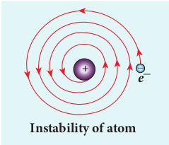

  

**U N I T**

**9** ATOMIC

**In this unit, the students are exposed to** • electric discharge through the gases • determination of specific charge of by an electr • determination of electronic charge by Millikan • atom models – J.J. Thomson and Rutherford • Bohr atom model and hydrogen atom • atomic spectrum and hydrogen spectrum • structure and properties of nucleus • various classification of nuclei based on atomic • mass defect and binding energy • relation between stability and binding energy c • alpha decay, beta decay and gamma emission • law of radioactive decay • nuclear fission and fusion • elementary ideas of nuclear reactors • qualitative idea of elementary particles

_All of physics is either impossible or trivial. It is imposs_

**Learning Objectives**

**INTRODUCTION**

**Atom Apple**

**Apple Apple**

**Earth**

**Earth Atom**

**Atom**

**Same size**

**Same size**

**9.1**  

AND NUCLEAR PHYSICS

on J.J. Thomson experiment ’s oil drop experiment

number and mass number

urve

_ible until you understand it, and then it becomes trivial_ – Ernest Rutherford

In earlier classes, we have studied that anything which occupies space is called matter. Matter can be classified into solids, liquids and gases. In our daily life, we use water for drinking, petrol for vehicles, we inhale oxygen, stainless steel vessels for cooking, etc. Experiences tell us that behaviour of one material is not the same as that of another, which means that the physical and chemical properties are different for different materials. In order to understand this, we need to know the fundamental constituents of materials.

  

When an object is divided repeatedly, the process of division could not be done beyond a certain stage in a similar way and we end up with a small speck. This small speck was defined as an atom. The word atom in Greek means ‘without division or indivisible’. The size of an atom is very very small. For an example, the size of hydrogen atom (simplest among other atoms) is around 10–10 m. An American Physicist Richard P. Feynman said that if the size of an atom becomes the size of an apple, then the size of apple becomes the size of the earth as shown in Figure 9.1. Such a small entity is an atom.

In this unit, we first discuss the theoretical models of atom to understand its structure. The Bohr atom model is more successful than J. J. Thomson and Rutherford atom models. It explained many unsolved issues in those days and also gave better understanding of chemistry.

Later, scientists observed that even the atom is not the fundamental entity. It consists of electrons and nucleus. Around 1930, scientists discovered that nucleus is also made of proton and neutron. Further research discovered that even the proton and neutron are made up of fundamental entities known as quarks.

In this context, the remaining part of this unit is written to understand the structure and basic properties of nucleus. Further how the nuclear energy is produced and utilized are discussed.

**ELECTRIC DISCHARGE THROUGH GASES**

Gases at normal atmospheric pressure are poor conductors of electricity because they do not have free electrons for conduction.

**9.2**  

But by special arrangement, one can make a gas to conduct electricity.

A simple and convenient device used to study the conduction of electricity through gases is known as gas discharge tube. The arrangement of discharge tube is shown in Figure 9.2. It consists of a long closed glass tube (of length nearly 50 cm and diameter of 4 cm) inside of which a gas in pure form is filled usually. The small opening in the tube is connected to a high vacuum pump and a low-pressure gauge. This tube is fitted with two metallic plates known as electrodes which are connected to secondary of an induction coil. The electrode connected to positive of secondary is known as anode and the electrode to the negative of the secondary is cathode. The potential of secondary is maintained at about 50 kV.

**High potential dierence**

**Gas**

**C A**

**— +**

**(a)**

**(b)**

  

Suppose the pressure of the gas in discharge tube is reduced to around 110 mm of Hg using vacuum pump, it is observed that no discharge takes place. When the pressure is kept near 100 mm of Hg, the discharge of electricity through the tube takes place. Consequently, irregular streaks of light appear and also crackling sound is produced. When the pressure is reduced to the order of 10 mm of Hg, a luminous column known as positive column is formed from anode to cathode.

When the pressure reaches to around 0.01 mm of Hg, positive column disappears. At this time, a dark space is formed between anode and cathode which is often called Crooke’s dark space and the walls of the tube appear with green colour. At this stage, some invisible rays emanate from cathode called cathode rays, which are later found be a beam of electrons.

**Properties of cathode rays** (1) Cathode rays possess energy and

momentum and travel in a straight line with high speed of the order of 107 ms-1. It can be deflected by application of electric and magnetic fields. The direction of deflection indicates that they contain negatively charged particles.

(2) When the cathode rays are allowed to fall on matter, heat is produced. Cathode rays affect the photographic plates and also produce fluorescence when they fall on certain crystals and minerals.

(3) When the cathode rays fall on a material of high atomic weight, x-rays are produced.

(4) Cathode rays ionize the gas through which they pass.  

(5) The speed of cathode rays is up to 1

10      

_th_

of the speed of light.

### Determination of specific charge _em_

     **of an electron –**

**Thomson’s experiment**

Thomson’s experiment is considered as one among the landmark experiments for the birth of modern physics. In 1887, J. J. Thomson made remarkable improvement in the study of gases in discharge tubes. In the presence of electric and magnetic fields, the cathode rays were deflected. By the variation of electric and magnetic fields, the specific charge (charge per unit mass) of the cathode rays is measured.

**Battery High voltage**

**battery**

**Deecting plates**

**Magnet**

**Fluorescent screen**

**P**

**O**

**P'**

**_C_**

**Cathode Anode**

**_A_**

**N**

+

\_

**S**

**Figure 9.3 Arrangement of J.J. Thomson** experiment to determine the specific charge of an electron

The arrangement of J. J. Thomson’s experiment is shown in Figure 9.3. A highly evacuated discharge tube is used and cathode rays (electron beam) produced at cathode are attracted towards anode disc A. Anode disc is provided with pin hole in order to allow only a narrow beam of cathode rays. These cathode rays are now allowed to pass through the parallel metal plates which are maintained at high voltage as shown in Figure 9.3. Further, the gas

| S+_ |platesN |
|------|------|------|------|

| Magnet |

  

discharge tube is kept in between pole pieces of magnet such that both electric and magnetic fields are acting perpendicular to each other. When the cathode rays strike the screen, they produce scintillation and hence bright spot is observed. This is achieved by coating the screen with zinc sulphide.

**(i) Determination of velocity of cathode rays**

**+**

**\_**

**e– E**

**N**

**S**

**FE FB**

**B v**

For a fixed electric field between the plates, the magnetic field is adjusted such that the cathode rays (electron beam) strike at the original position O (Figure 9.3). This means that the magnitude of electric force is balanced by the magnitude of force due to magnetic field as shown in Figure 9.4. Let _e_ be the charge of the cathode rays, then

_eE eB_\= υ

⇒ =υ _E B_

(9.1)  

**(ii) Determination of specific charge** Since the cathode rays (electron beam)

are accelerated from cathode to anode, the potential energy of the electron beam at the cathode is converted into kinetic energy of the electron beam at the anode. Let _V_ be the potential difference between anode and cathode, then the potential energy is _eV_. Then from law of conservation of energy,

_eV m e m V_

\= ⇒ =1 2 2

2 2

υ υ

Substituting the value of velocity from equation (9.1), we get

_e m V_

_E B_

\= 1 2

2

2 (9.2)

Substituting the values of _E, B_ and _V_, the specific charge can be determined as

_e m_ \= × −1 7 1011 1. C kg

**(iii) Deflection of charge only due to uniform electric field**

When the magnetic field is turned off, the deflection is only due to electric field. The deflection in vertical direction is due to the electric force.

_F eEe_ \= (9.3)

Let _m_ be the mass of the electron and by applying Newton’s second law of motion, acceleration of the electron is

_a m Fe e_\= 1 (9.4)

Substituting equation (9.4) in equation (9.3),

_a m eE e m Ee_ \= =1

|------|------|------|------|------|------|------|
| + |
| E |FE |B |
| F |
| _B |

  

**E**

y´ y

**Screen**

**+**

**\_**

**e–**

**_l_**

Let _y_ be the deviation produced from original position on the screen as shown in Figure 9.5. Let the initial upward velocity of cathode ray be _u_ \= 0 before entering the parallel electric plates. Let _t_ be the time taken by the cathode rays to travel in electric field. Let _l_ be the length of one of the plates, then the time taken is

_t l_\= υ

(9.5)

Hence, the deflection _yʹ_ of cathode rays is (note: _u_ \= 0 and _a e_

_m Ee_ \= )

′ = + ⇒ ′= +

\=   

        

_y ut at y ut a t_

_e m_

_E l_

_e_ 1 2

1 2

1 2

2 2

2

υ

′ =_y e m_

_l B E_

1 2

2 2 (9.6)

Therefore, the deflection _y_ on the screen is

_y y y C y_∝ ′⇒ = ′

where C is proportionality constant which depends on the geometry of the discharge tube and substituting _yʹ_ value in equation 9.6, we get  

_y C e m_

_l B E_\= 1

2 2 2

(9.7)

Rearranging equation (9.7) as

_e m_

_yE Cl B_

\= 2 2 2 (9.8)

Substituting the values on RHS, the value of specific charge is calculated as _e m_ \= × −1 7 1011 1. C kg .

The specific charge is independent of (a) gas used

(b) nature of the electrodes

**Note**

### Determination of charge of an electron – Millikan’s oil drop experiment

Millikan’s oil drop experiment is another important experiment in modern physics which is used to determine one of the fundamental constants of nature known as charge of an electron (Figure 9.6 (a)).

By adjusting electric field suitably, the motion of oil drop inside the chamber can be controlled – that is, it can be made to move up or down or even kept balanced in the field of view for sufficiently long time.

The experimental arrangement is shown in Figure 9.6 (b). The apparatus consists of two horizontal circular metal plates A and B each with diameter around 20 cm and are separated by a small distance 1.5 cm. These two parallel

|------|------|------|------|------|
| + |

| – |
| y´ |
| _l |
  

plates are enclosed in a chamber with glass walls. Further, plates A and B are maintained at high potential difference around 10 _kV_ such that electric field acts vertically downward. A small hole is made at the centre of the upper plate A and an atomizer is kept exactly above the hole to spray the liquid. When a fine droplet of the highly viscous non volatile liquid (like glycerine) is sprayed using atomizer, they fall freely downward through the hole of the top plate only under the influence of gravity.

Few oil drops in the chamber can acquire electric charge (negative charge) because of friction with air or passage of x-rays in between the parallel plates. Further the chamber is illuminated by light which is passed horizontally and oil drops can be seen clearly using microscope placed perpendicular to the light beam.

**Atomizer**

**Microscope**

**Light source**

**(–)**

**(+)**

**Microscope**

+

–

**A**

**B**

**To Atomizer**

**Light source**

(a)

(b)  

These drops can move either upwards or downward.

Let _m_ be the mass of the oil drop and _q_ be its charge. Then the forces acting on the droplet are

(a) gravitational force _F mgg_ \= (b) electric force _F qEe_ \= (c) buoyant force _Fb_

(d) viscous force _Fv_

**Fg**

**Fb Fv Fb Fe**

**Fg**

**Oil drop**

**(a) (b)**

**(a) Determination of radius of the droplet**

When the electric field is switched off, the oil drop accelerates downwards. Due to the presence of air drag forces, the oil drops easily attain its terminal velocity and moves with constant velocity. This velocity can be carefully measured by noting down the time taken by the oil drop to fall through a predetermined distance. The free body diagram of the oil drop is shown in Figure 9.7 (a), we note that viscous force and buoyant force balance the gravitational force.

Let the gravitational force acting on the oil drop (downward) be _F mgg_ \=

Let us assume that oil drop to be spherical in shape. Let ρ be the density of the oil drop,

  

and _r_ be the radius of the oil drop, then the mass of the oil drop can be expressed in terms of its density as

ρ = _m V_

⇒ =   

  _m r_ρ π4

3 3

volume of the

sphere,_V r_\=











 4 3

3π

The gravitational force can be written in terms of density as

_F mg F r gg g_\= ⇒ =   

  ρ π4

3 3

Let σ be the density of the air, the upthrust force experienced by the oil drop due to displaced air is

_F r gb_ \=   

  σ π4

3 3

Once the oil drop attains a terminal velocity _υ_, the net downward force acting on the oil drop is equal to the viscous force acting opposite to the direction of motion of the oil drop. From Stokes law, the viscous force on the oil drop is

_F rv_ \= 6π υη

From the free body diagram as shown in Figure 9.7 (a), the force balancing equation is

_F F Fg b_\= + υ

ρ π σ π π υη4 3

4 3

63 3_r g r g r_  

   =

  

   +

4 3

63π ρ σ π υη_r g r_( )− =

2 3

33π ρ σ π υη_r g r_( )− =  

_r g_

\= −



  



  

9 2

1 2ηυ

ρ σ( ) (9.9)

Thus, equation (9.9) gives the radius of the oil drop.

**(b) Determination of electric charge** When the electric field is switched on,

charged oil drops experience an upward electric force (_qE_). Among many drops, one particular drop can be chosen in the field of view of microscope and strength of the electric field is adjusted to make that particular drop to be stationary. Under these circumstances, there will be no viscous force acting on the oil drop. Then, from the free body diagram shown Figure 9.7 (b), the net force acting on the oil droplet is

_F F Fe b g_\+ =

⇒ + =_qE r g r g_4 3

4 3

3 3π σ π ρ

⇒ = −_qE r g_4 3

3π ρ σ( ) (9.10)

⇒ = −_q E_

_r g_4 3

3π ρ σ( ) (9.11)

Substituting equation (9.9) in equation (9.11), we get

_q E g_

\= −



 



 

18 2

3 3 1 2π η υ

ρ σ( ) (9.12)

Millikan repeated this experiment several times and computed the charges on oil drops. He found that the charge of any oil drop can be written as integral multiple of a basic value, − × −1 6 10 19. ,C

  

which is nothing but the charge of an electron.

**ATOM MODELS**

**Introduction** Around 400 B.C, Greek philosophers

Leucippus and Democretus proposed the concept of atom, ‘Every object on continued subdivision ultimately yields atoms’. Later, many physicists and chemists tried to understand the nature with the idea of atoms. Many theories were proposed to explain the properties (physical and chemical) of bulk materials on the basis of atomic model.

For instance, J. J. Thomson proposed a theoretical atom model which is based on static distribution of electric charges. Since this model fails to explain the stability of atom, one of his students E. Rutherford proposed the first dynamic model of an atom. Rutherford gave atom model which is based on results of an experiment done by his students (Geiger and Marsden). But this model also failed to explain the stability of the atom.

Later, Niels Bohr who is also a student of Rutherford proposed an atomic model for hydrogen atom which is more successful than other two models. Niels Bohr atom model could explain the stability of the atom and also the origin of line spectrum. There are other atom models, such as Sommerfeld’s atom model and atom model from wave mechanics (quantum mechanics). But we will restrict ourselves only to very simple (mathematically simple) atom model in this section.

**9.3**  

### J. J. Thomson’s Model (Water melon model)

In this model, the atoms are visualized as homogeneous spheres which contain uniform distribution of positively charged particles (Figure 9.8 (a)). The negatively charged particles known as electrons are embedded in it like seeds in water melon as shown in Figure 9.8 (b).

\_ \_

\_\_ \_

\_

Positively charged material

**10 m–10**

The atoms are electrically neutral, this implies that the total positive charge in an atom is equal to the total negative charge. According to this model, all the charges are assumed to be at rest. But from classical electrodynamics, no stable equilibrium points exist in electrostatic configuration (this is known as Earnshaw’s theorem) and hence such an atom cannot be stable. Further, it fails to explain the origin of spectral lines observed in the spectrum of hydrogen atom and other atoms.

### Rutherford’s model

In 1911, Geiger and Marsden did a remarkable experiment based on the advice of their teacher Rutherford, which is known as scattering of alpha particles by gold foil.

The experimental arrangement is shown in Figure 9.9. A source of alpha particles (radioactive material, example polonium) is

  

kept inside a thick lead box with a fine hole as seen in Figure 9.9. The alpha particles coming through the fine hole of lead box pass through another fine hole made on the lead screen. These particles are now allowed to fall on a thin gold foil and it is observed that the alpha particles passing through gold foil are scattered through different angles. A movable screen (from 0° to 180°) which is made up of zinc sulphide (ZnS) is kept on the other side of the gold foil to collect the scattered alpha particles. Whenever alpha particles strike the screen, a flash of light is observed which can be seen through a microscope.

Rutherford proposed an atom model based on the results of alpha scattering

**+**

**Lead ScreenLead Block**

**Polonium sample**



\_ \_

\_

\_ \_

\_ \_ \_

\_ \_

**Expected Observed**

**(a) (b)**

**+**

experiment. In this experiment, alpha particles (positively charged particles) were allowed to fall on the atoms of a metallic gold foil. The results of this experiment are given below and are shown in Figure 9.10, Rutherford expected the atom model to be as seen in Figure 9.10 (a) but the experiment showed the model as in Figure 9.10 (b). (a) Most of the alpha particles were

un-deflected through the gold foil and went straight.

(b) Some of the alpha particles were deflected through a small angle.

(c) A few alpha particles (one in thousand) were deflected through the angle more than 90°

**Flash of light**

**Microscope**

**Fluorescent Screen**

**Scattering angle**

**Gold foil**



of alpha particles experiment by Rutherford

## 40 60 80 100 120 140 160 180 10

## 104 105 106 107

**N um**

**be r o**

**f s ca**

**tt er**

**ed p**

**ar tic**

**le s d**

**et ec**

**te d**

**Scattering angle _θ (_in degree)(c)**

(a) Rutherford expected (b) experiment ered N(θ) with scattering angle θ

| light |
|------|------|------|
|  |
| Gold |Sc atteangl |
  

(d) Very few alpha particles returned back (back scattered) –that is, deflected back by 180°

In Figure 9.10 (c), the dotted points are the alpha scattering experiment data points obtained by Geiger and Marsden and the solid curve is the prediction from Rutherford’s nuclear model. It is observed that the Rutherford’s nuclear model is in good agreement with the experimental data.

**Conclusion made by Rutherford based on the above observation**

From the experimental observations, Rutherford proposed that an atom has a lot of empty space and contains a tiny matter at its centre known as nucleus whose size is of the order of 10-14m. The nucleus is positively charged and most of the mass of the atom is concentrated in the nucleus. The nucleus is surrounded by negatively charged electrons. Since static charge distribution cannot be in a stable equilibrium, he suggested that the electrons are not at rest and they revolve around the nucleus in circular orbits like planets revolving around the sun.

**(a) Distance of closest approach**

**_b_ Impact parameter gold nucleusdistance of closed approachAlpha particles _r0_**

When an alpha particle moves straight towards the nucleus, it reaches a point where it comes to rest momentarily and returns back as shown in Figure 9.11. **The minimum distance between the centre**  

**of the nucleus and the alpha particle just before it gets reflected back through 180**° **is defined as the distance of closest approach r0 (also known as contact distance)**. At this distance, all the kinetic energy of the alpha particle will be converted into electrostatic potential energy (Refer unit 1, volume 1 of +2 physics text book).

1 2

1 4

2 0

2

0 0 _m e Ze_

_r_ υ

πε = ( )( )

⇒ = ( )

\=_r Ze m_

_Ze Ek_

0 0

2

0 2

0

21 4

2 1

2

1 4

2 πε υ πε

where _Ek_ is the kinetic energy of the alpha particle.This is used to estimate the size of the nucleus but size of the nucleus is always lesser than the distance of closest approach. Further, Rutherford calculated the radius of the nucleus for different nuclei and found that it ranges from 10–14 m to 10–15 m.

**(b) Impact parameter**

**θ**

**Nucleus**

**b**

**Alpha particle** +

\+ **90**°**Alpha particle at a very**

**large distance**

**The** **impact parameter** (_b_) (see Figure 9.12) **is defined as the perpendicular distance between the centre of the gold nucleus and the direction of velocity vector of alpha particle when it is at a large distance**. The

|------|

|------|

| +ticleθ |
|------|------|------|------|
| y 90°Nucleus |b |

  

relation between impact parameter and scattering angle can be shown as

_b b K_∝      ⇒ =

     cot cotθ θ

2 2 (9.13)

where _K_ = 1 4

2 0

2

0 2πε υ

_Ze m_ and θ is called

scattering angle. Equation (9.13) implies that when impact parameter increases, the scattering angle decreases. Smaller the impact parameter, larger will be the deflection of alpha particles.

**Drawbacks of Rutherford model** Rutherford atom model helps in the

calculation of the diameter of the nucleus and also the size of the atom but has the following limitations:

(a) This model fails to explain the distribution of electrons around the nucleus and also the stability of the atom.

**Instability of atom**

**_e\__** \+ \_

According to classical electrodynamics, any accelerated charge should emit electromagnetic radiations continuously. Due to emission of radiations, the charge loses its energy. Hence, it can no longer sustain the circular motion. The radius of the orbit, therefore, becomes smaller and smaller (undergoes spiral motion) as shown in Figure 9.13 and finally the electron should fall into the nucleus and the atoms should disintegrate. But this does not happen.  

Hence, Rutherford model could not account for the stability of atoms.

(b) According to this model, emission of radiation must be continuous and must give continuous emission spectrum but experimentally we observe only line (discrete) emission spectrum for atoms.

### Bohr atom model

In order to overcome the limitations of the Rutherford atom model in explaining the stability and also the line spectrum observed for a hydrogen atom (Figure 9.14), Niels Bohr made modifications in Rutherford atom model. He is the first person to give better theoretical model of the structure of an atom to explain the line spectrum of hydrogen atom. The following are the assumptions (postulates) made by Bohr.

**Figure 9.14 The line spectrum of** hydrogen

**Postulates of Bohr atom model:** (a) The electron in an atom moves

around nucleus in circular orbits under the influence of Coulomb electrostatic force of attraction. This Coulomb force gives necessary centripetal force for the electron to undergo circular motion.

(b) Electrons in an atom revolve around the nucleus only in certain discrete orbits called stationary orbits and electron in such orbits do not radiate electromagnetic energy. Only those discrete orbits allowed are stable orbits.

The angular momentum of the electron in these stationary orbits are quantized – that is, it can be written as an integer or integral

  

multiple of _h_ 2π

called as reduced Planck’s

constant – that is,  (read it as h-bar) and the integer _n_ is called as principal quantum number.

_l n_\= 

where = _h_ 2π

This condition is known as angular momentum quantization condition.

According to quantum mechanics, particles like electrons have dual nature (Refer unit 8, volume 2 of +2 physics text book). The standing wave pattern of the de Broglie wave associated with orbiting electron in a stable orbit is shown in Figure 9.15.

λ

**r**

**_n_ = 5**

**_n_ = 3.3**

**_n_ = 3**

Forbidden

The circumference of an electron’s orbit of radius _r_ must be an integral multiple of de Broglie wavelength – that is,

2π λ_r n_\= (9.14) where n = 1,2,3,......

But the de Broglie wavelength (_λ_) associated with an electron of mass _m_ moving with velocity _υ_ is λ

υ = _h_

_m_ where _h_ is called

Planck’s constant. Thus from equation (9.14),

2π υ

_r n h m_

\=      

_m r n h_υ π

\= 2

For any particle of mass _m_ undergoing circular motion with radius _r_ and velocity _υ_, the magnitude of angular momentum _l_ is given by

_l r m_\= ( )υ _m r l n_υ = = 

(c) Energy of the electron in orbits is not continuous but only discrete. This is called the quantization of energy. An electron can jump from one orbit to another orbit by absorbing or emitting a photon whose energy is equal to the difference in energy (ΔE) between the two orbital levels (Figure 9.16)

∆_E E E hv h c final initial_\= − = =

λ where _c_ is the speed of light and λ is the

wavelength and _v_ is the frequency of the radiation emitted. Thus, the frequency of the radiation emitted is related only to change in atomic energy levels and it does not depend on frequency of orbital motion of the electron.

**_hv hv_**

**_e\__**

**_e\__**

**_e\__**

**E _f_**

**E_i_**

**E _f_**

**E_i_** \_

\_

\_

| r |
|------|------|------|
| λ |
  

**Radius of the orbit of the electron and velocity of the electron**

Consider an atom which contains the nucleus at rest and an electron revolving around the nucleus in a circular orbit of radius _rn_ as shown in Figure 9.17. Nucleus is made up of protons and neutrons. Since proton is positively charged and neutron is electrically neutral, the charge of a nucleus is entirely due to the charge of protons.

**EXAMPLE 9.1**

The radius of the 5th orbit of hydrogen atom is 13.25 Å. Calculate the de broglie wavelength of the electron orbitting in the 5th orbit.

**Solution:**

2π_r = nλ_ 2 × 3.14 × 13.25Å = 5 × _λ_ ∴ _λ_ = 16.64Å

**EXAMPLE 9.2**

Find the (i) angular momentum (ii) velocity of the electron revolving in the 5th orbit of hydrogen atom.

(_h =_ 6.6 × 10–34 Js, _m =_ 9.1 _×_ 10–31 kg)

**Solution** (i) Angular momentum is given by

_l n nh_\= =

\= × × ×

\= × −

− −



2 5 6 6 10

2 3 14 5 25 10

34 34 2 1

π .

. . kgm s

(ii) Velocity is given by

Velocity υ=

\= ×

× ×

− −

− −

_l mr_

( . kgm s ) ( . kg)( .

5 25 10 9 1 10 13 25 10

34 2 1

31 10 m) .υ= × −4 4 105 1ms  

**_rn_**

**_υn_**

**Electron _m_, –_e_**

**Electrostatic attraction provides centripetal**

**acceleration**

**_F \__**

**Nucleus is assumed to be stationary**

**Electron revolves in _n_th orbit of radius _rn_ with**

**speed _υn_**

**Nucleus +Z_e_ +**

Let _Z_ be the atomic number of the atom, then +_Ze_ is the charge of the nucleus. Let –_e_ be the charge of the electron. From Coulomb’s law, the force of attraction between the nucleus and the electron is

_F Ze e r_

_Ze r_

_coloumb_

_n_

_n_

 = + −

\=−

1 4

1 4

0 2

0

2

2

πε

πε

( )( )r ˆ_colou b_

_n_

_n_

0 2

0

2

2 r ˆ

This force provides necessary centripetal force

_F m rcentripetal_

_n_

_n_

 =

υ2

r ˆ

where _m_ be the mass of the electron that moves with a velocity _υ_n in a circular orbit. Therefore,

_F Fcoloumb centripetal_

  =

1 4 0

2

2

2

πε υ_Ze_

_r m_

_r n_

_n_

_n_ \=

Multiplied and divided by ‘_m_’

_r m r Zmen_

_n n_\= 4 0

2

2

πε υ( ) (9.15)

From Bohr’s assumption, the angular momentum quantization condition, _m r l nn n n_υ = = ,

| EXAMPLE 9 . 2Find t he (i) a ngular m omentum (ii) velocity of the electron revolving in the 5  orbit of  hydrogen atom.(h = 6.6 × 10 Js, m = 9.1 × 10 kg)Solutionth(i) Angular momentum is given by–34  –31nhln==2π56××.61 0= =×52.k51 0 gm s23× .14−34−−34 21 |
|------|
| (ii) Velocity is given bylVelocity υ =mr(.52 51× 0 kgms )=(.91 ××10 kg)(13.25 10 mm)υ =×44. 10 ms−−34 21−−31 1051 − |

  

∴ =_r m r Zmen_

_n n_4 0 2

2

πε υ( )

_r n Zme_

_n Zmen_ \= =

4 40 2

2 0

2 2

2

πε πε( ) 

_r h me_

_n Zn_ \=



 



 

ε π

0 2

2

2 (

∴ = _h_

2π ) (9.16)

where _n_Î . Since, ε0, _h, e_ and π are constants. Therefore, the radius of the orbit becomes

_r a n Zn_ \= 0

2

where _a h me_0 0

2

2 0 529= = ε π

. Å. This is

known as Bohr radius which is the smallest radius of the orbit in hydrogen atom. Bohr radius is also used as unit of length called Bohr. 1 Bohr = 0.53 Å. For hydrogen atom (Z = 1), the radius of nth orbit is

_r a nn_ \= 0 2

For _n_ = 1 (first orbit or ground state),

r1 = a0 = 0.529 Å

For n = 2 (second orbit or first excited state),

r2 = 4a0 = 2.116 Å

For n = 3 (third orbit or second excited state),

r3 = 9a0 = 4.761 Å

and so on.

Thus the radius of the orbit from centre increases with _n_, that is, _rn_ ∝ _n2_ as shown in Figure 9.18.

Further, Bohr’s angular momentum quantization condition leads to

_m a n Z_

_n h r a n Z_

_n n_

υ π

0 2

0

2

2 = ∴ =



  



    

**r2= 4r1**

**r4= 16r1**

**r3= 9r1**

**r1**

υ π_n_

_h ma_

_Z n_

\= 2 0

in atomic physics υ_n n_ µ 1

Note that the velocity of electron decreases as the principal quantum number (orbit number) increases as shown in Figure 9.19. This curve is the rectangular hyperbola. This implies that the velocity of electron in ground state is maximum when compared to that in excited states.

**Vn**

**O n**

υ_n n_ µ 1

| r= 3 |
|------|------|

  

**The energy of an electron in the _n_th orbit** Since the electrostatic force is a conservative

force, the potential energy for the _n_**th** orbit is

_U Ze e r_

_Ze r_

_Z me h n_

_r h me_

_n n n_

_n_

\= + − =−

\=− =

1 4

1 4

1 4

0 0

2

0 2

2 4

2 2 0

2

πε πε

ε ε π

( )( )

 2

2_n Z_



 



 

The kinetic energy of the electron in _nth_ orbit is

_KE m me h_

_Z nn n_\= =1

2 8 2

4

0 2 2

2

2υ ε

This implies that Un = –2 KEn. Total energy of the electron in in the _nth_ orbit is

_E KE U KE KE KEn n n n n n_\= + = − = −2

_E me h_

_Z nn_ \=−

4

0 2 2

2

28ε

For hydrogen atom (Z = 1),

_E me h nn_ \=− 4

0 2 2 28

1 ε

joule (9.17)

where _n_ stands for principal quantum number. The negative sign in equation (9.17) indicates that the electron is bound to the nucleus.

Substituting the values of mass and charge of an electron (_m_ and _e_), permittivity of free space ε0 and Planck’s constant _h_ and expressing energy in terms of electron(+(_eV_)), we get

_E n_

_eVn_ \=−13 6 1 2.

For the first orbit (ground state), the total energy of electron is E1= – 13.6 _eV_. For the second orbit (first excited state), the total energy of electron is E2= –3.4 _eV_. For the third orbit (second excited state), the total energy of electron is E3= –1.51 _eV_ and so on.  

Notice that the energy of the first excited state is greater than that of the ground state, second excited state is greater than that of the first excited state and so on. Thus, the orbit which is closest to the nucleus (_r_1) has lowest energy (minimum energy what it is compared with other orbits). So, it is often called ground state energy (lowest energy state). The ground state energy of hydrogen (–13.6 _eV_ ) is used as a unit of energy called Rydberg (1 Rydberg = –13.6 _eV_ ).

The negative value of this energy is because of the way the zero of the potential energy is defined. When the electron is taken away to an infinite distance (very far distance) from nucleus, both the potential energy and kinetic energy terms vanish and hence the total energy also vanishes.

The energy level diagram along with the shape of the orbits for increasing values of _n_ are shown in Figure 9.20. It shows that the energies of the excited states come closer and closer together when the principal quantum number _n_ takes higher values.

**EXAMPLE 9.3**

(a) Show that the ratio of velocity of an electron in the first Bohr orbit to the speed of light _c_ is a dimensionless number.

(b) Compute the velocity of electrons in ground state, first excited state and second excited state in Bohr atom model for hydrogen atom.

**_Solution_**

(a) The velocity of an electron in _n_th orbit is

υ π_n_

_h ma_

_Z n_

\= 2 0

where _a h_

_me_0 0

2

2= = ε π Bohr radius. Substituting

for _a_0 in _υ_n,

  

υ ε ε

α _n_

_e h_

_Z n_

_c e hc_

_Z n_

_cZ n_

\= = 

 



  =

2

0

2

02 2

where _c_ is the speed of light in free space or vacuum and its value is _c_ \= 3 × 108 m s–1and α is called fine structure constant.

For a hydrogen atom, _Z_ = 1 and for the first orbit, _n_ \= 1, the ratio of velocity of electron in first orbit to the speed of light in vacuum or free space is

**n = 1**

**n = 2**

**n = 3 n = 4 n = 5 n = ∞**

**Figure 9.20 Energy levels of a hydrogen atom**  

υ α ε

1 2

02_c e_

_hc_ \= =

α= × × ×

× × ×

−

− − −

−

( . ) ( . )

( . )

1 6 10 2 8 854 10

1 6 6 10

19 2

12 2 1 2

34

C C N m

Nms ( )3 108 1× −ms

≈ =1 136 9

1 137.

which is a dimensionless

number

**Energy, J Energy, eV 0 0**

**—0.87×10−19**

**—1.36×10−19**

**—2.42×10−19**

**—5.43×10−19**

**—21.76×10−19**

**—3.40**

**—13.6**

**—1.51**

**—0.54 —0.85**

**Free electron**

**Excited states**

**Ground state**

  

⇒ =α 1 137

(b) Using fine structure constant, the velocity of electron can be written as

υ α _n_

_cZ n_

\=

For hydrogen atom (_Z_ = 1) the velocity of electron in _n_th orbit is

υ_n c_

_n n_ \= = × −

137 1 2 19 10 16 1( . ) ms

For the first orbit (ground state), the velocity of electron is

υ1 6 12 19 10= × −. ms

For the second orbit (first excited state), the velocity of electron is

υ2 6 11 095 10= × −. ms

For the third orbit (second excited state), the velocity of electron is

υ3 6 10 73 10= × −. ms

Here, _υ_1 > _υ_2 > _υ_3

**EXAMPLE 9.4**

The Bohr atom model is derived with the assumption that the nucleus of the atom is stationary and only electrons revolve around the nucleus. Suppose the nucleus is also in motion, then calculate the energy of this new system.

**_Solution_**

Let the mass of the electron be _m_ and mass of the nucleus be _M_. Since there is no external force acting on the system, the centre of mass of hydrogen atom remains at rest. Hence, both nucleus and electron move about the centre of mass as shown in figure.  

**Mm**

**r1r2**

**COM**

Let _V_ be the velocity of the nuclear motion and _υ_ be the velocity of electron motion. Since the total linear momentum of the system is zero,

− + =_m M_υ υ 0 or

_MV m p_\= =υ

_p pe n_

   + = 0 or

_p p pe n_

  = =

Hence, the kinetic energy of the system is

_KE p M_

_p m_

_p M m_

_n e_\= + = + 

 

2 2 2

2 2 2 1 1

Let 1 1 1 _M m m_ \+ =

µ . Here the reduced mass

is, µ_m mM_

_M m_ \=

+

Therefore, the kinetic energy of the system

now is _KE p m_

\= 2

2µ

Since the potential energy of the system is same, the total energy of the hydrogen can be expressed by replacing mass by reduced mass, which is

_E e h nn_

_m_\=− µ ε

4

0 2 2 28

1

Since the nucleus is very heavy compared to the electron, the reduced mass is closer to the mass of the electron.

| M |
|------|------|------|
| COM |
| r2 |r1 |

  

In 1931, H.C. Urey and co- workers noticed that in the shorter wavelength region

of the hydrogen spectrum lines, faint companion lines are observed. From the isotope displacement effect (isotope shift), the isotope of the same element can produce slightly different spectral lines. The presence of these faint lines confirmed the existence of isotopes of hydrogen atom (which is named as Deuterium).

On calculating wavelength or wave number difference between the faint and bright spectral lines, atomic mass of deuterium is measured to be twice that of atomic mass of hydrogen atom. Bohr atom model could not explain this isotopic shift. Thus by considering nuclear motion (although the movement of the nucleus is much smaller) into account in the Bohr atom model, the wave number or wavelength difference between the lines produces by the hydrogen atom and deuterium is theoretically calculated which perfectly agreed with the spectroscopic measured values.

The difference between hydrogen atom and deuterium is in the number of neutron. Hydrogen atom contains an electron and a proton, whereas deuterium has an electron, a proton and a neutron.

**Note**

**Excitation energy and excitation potential The energy required to excite an**

**electron from lower energy state to any higher energy state is known as excitation energy.**

The excitation energy for an electron from ground state (n = 1) to first excited state (n = 2) is called first excitation energy.

For hydrogen atom, it is  

EI = E2 – E1 = –3.4 _e_V – (–13.6 _e_V) = 10.2 _e_V Similarly, the excitation energy for

an electron from ground state (n = 1) to second excited state (n = 3) is called second excitation energy, which is EII = E3 – E1 = –1.51 _e_V – (–13.6 _e_V) = 12.1 _e_V

and so on. **Excitation potential is defined as**

**excitation energy per unit charge.** For hydrogen atom, the first excitation

state energy is

_E_I = _eV_I

First excitation potential for hydrogen atom is,

⇒ = =_V e_

_E_I I 1 10 2. volt

Similarly, second excitation potential is,

⇒ = =_V e_

_E_II II 1 12 1. volt and so on.

**Ionization energy and ionization potential** An atom is said to be ionized when an

electron is completely removed from the atom – that is, it reaches the state with energy _En_→∞ . **The minimum energy required to remove an electron from an atom in the ground state is known as binding energy or ionization energy**.

For hydrogen atom, the ground state ionization energy is,

_E E E e e_

ionizaation V V

\= − = − − =

∞ 1 0 13 6 13 6

( . ) .

When an electron is in _n_th state of an atom, the energy required to remove an electron from that state – that is, the corresponding ionization energy is

_E E E n_

_Z e_

_n Z e_

_n_ionization V

V

\= − = − −   

  

\=

∞ 0 13 6

13 6

2 2

2 2

.

.

At normal room temperature, the electron in a hydrogen atom (_Z_\=1) spends most of

  

**energy required to remove an electron from the ground state of an atom to the outer most orbit _(E = 0_ for _n_→∞_)_ is known as first ionization energy (13.6 _e_V).** Then, the hydrogen atom is said to be in ionized state or simply called as hydrogen ion, denoted by _H_+. If we supply more energy than the ionization energy, the excess energy appear as the kinetic energy of the free electron.

**Ionization potential is defined as ionization energy per unit charge.**

_V e_

_E n_

_Z V_ionization ionization= =1 13 6 2

2.

Thus, for a hydrogen atom (Z =1), the ionization potential is

_V n_

\= 13 6 2 . volt

The radius, velocity and total energy in ground state, first excited state and second excited state are given in Table 9.1.

**EXAMPLE 9.5**

Suppose the energy of an electron in hydrogen–like atom is given as

_E n_

_en_ \=− 54 4

2 . V where _n_Î . Calculate

the following:

(a) Sketch the energy levels for this atom and compute its atomic number.

(b) If the atom is in ground state, compute its first excitation potential and also its ionization potential.

**Table 9.1** Physical quantity Ground state F

| **Physical quantity**                         | **Ground state**                       | **First excited state**                 | **Second excited state**              |
|-----------------------------------------------|----------------------------------------|-----------------------------------------|---------------------------------------|
| Radius (rn ∝ n2)        | 0.529 Å                                | 2.116 Å                                 | 4.761 Å                               |
| Velocity (vn ∝ n-1)     | 2.19 × 106 m s-1 | 1.095 × 106 m s-1 | 0.73 × 106m s-1 |
| Total Energy (En ∝ n-2) | –13.6 eV                               | –3.4 eV                                 | –1.51 eV                              | 

(c) When a photon with energy 42 _e_V and another photon with energy 51 _e_V are made to collide with this atom, does this atom absorb these photons?

(d) Determine the radius of its first Bohr orbit.

(e) Calculate the kinetic and potential energies of electron in the ground state.

**_Solutions_** (a) Given that

_E n_

_en_ \=− 54 4

2 . V

For _n_ = 1, the ground state energy E1 = –54.4 _e_V and for _n_ = 2, E2 = –13.6 _e_V. Similarly, E3 = –6.04 _e_V, E4 = –3.4 _e_V and so on.

For large value of principal quantum number – that is, _n = ∞,_ we get _E_∞ = 0 _e_V.

**n = 1**

**n = 2 n = 3 n = 4n = ∞0**

**—13.6 —6.04**

**—54.4(eV)**

**—3.4**

(b) For a hydrogen-like atom, ground state energy is

_E n_

_Z e_1 2 213 6=− . V

where _Z_ is the atomic number. Hence, comparing this energy with given energy, we get, – 13.6 _Z_2 = – 54.4 ⇒ _Z_ = ±2. Since, atomic number cannot be negative number, _Z_ = 2.

irst excited state Second excited state

.116 Å 4.761 Å

.095 × 106 m s-1 0.73 × 106 m s-1

3.4 _e_V –1.51 _e_V

  

The first excitation energy is _E E E e e_

_e_ I V V

V = − =− − − =

2 1 13 6 54 4 40 8

. ( . ) .

Hence, the first excitation potential is

_V e_

_E e_

_e_I I

V

volt

\= =

\=

1 40 8

40 8

( . )

.

The first ionization energy is

_E E E e e_

ionization V V

\= − = − − =

∞ 1 0 54 4 54 4

( . ) .

Hence, the first ionization potential is

_V e_

_E e_

_e_ionization ionization

V

volt

\= =

\=

1 54 4

54 4

( . )

.

(c) Consider two photons to be A and B. Given that photon A with energy 42 _e_V and photon B with energy 51 _e_V From Bohr assumption, difference in energy levels is equal to the energy photon absored, then atom will absorb energy, otherwise, not.

_E E e e e e_

2 1 13 6 54 4 40 8 41

− =− − − = ≈

. ( . ) .

V V V V

Similarly, _E E e e_

_e_ 3 1 6 04 54 4

48 36 − =− − − =

. ( . ) .

V V V

_E E e e e_

4 1 3 4 54 4 51

− =− − − =

. ( . )V V V

_E E e e e_

3 2 6 04 13 6 7 56

− =− − − =

. ( . ) .

V V V

and so on. But note that _E2 – E1_ ≠ 42 _e_V, _E3 – E1_ ≠ 42 _e_V, _E4 – E1_ ≠ 42 _e_V and _E3 – E2_ ≠ 42 _e_V.

For all possibilities, no difference in energy is an integer multiple of photon energy. Hence, photon A is not absorbed by this atom. But  

for Photon B, _E4 – E1_ \= 51 _e_V, which means, Photon B can be absorbed by this atom.

(d) The radius of Bohr orbit is _r a n zn_ \= ×0

2

For _n_ = 1, _z_ = 2

_r_

_a_ 1

0

2 0 529

2

\=

\= .

\= 0.265 Å

(e) Since, total energy is equal to negative of kinetic energy in Bohr atom model, we get

_KE E n_

_e_

_n e_

_n n_\=− =− −   

  

\=

54 4

54 4

2

2

.

.

V

V

Since, Potential energy is negative of twice the kinetic energy,

_U KE n_

_e_

_n e_

_n n_\=− =−   

  

\=−

2 2 54 4

108 8

2

2

.

.

V

V

For a ground state, put n =1

Kinetic energy is KE1 = 54.4 eV and Potential energy is U1 = –108.8 eV

### Atomic spectra

Materials in the solid, liquid and gaseous states emit electromagnetic radiations when they are heated up and these emitted radiations usually exhibit continuous spectrum. For example, when white light is examined through a spectrometer, electromagnetic radiations of all wavelengths are observed which is a continuous spectrum.

In early twentieth century, many scientists spent considerable time in understanding the characteristic radiations emitted by the atoms of individual elements exposed to a flame or

  

electrical discharge. When they were viewed or photographed, instead of a continuous spectrum, the radiation contains of a set of discrete lines, each with characteristic wavelength. In other words, the wavelengths of the radiation obtained are well defined and their positions and intensities are characteristic of the element as shown in Figure 9.21.

This implies that these spectra are unique to each element and can be used to identify the element of the gas (like finger print used to identify a person) – that is, it varies from one gas to another gas. This uniqueness of line spectra of elements made the scientists to determine the composition of stars, sun and also used to identify the unknown compounds.

**Hydrogen spectrum** When the hydrogen gas enclosed in a tube is heated up, it emits electromagnetic radiations of certain sharply-defined characteristic wavelength (line spectrum), called hydrogen emission spectrum (Refer unit 5, volume 1 of +2 physics text book). The emission spectrum of hydrogen is shown in Figure 9.22(a).

When any gas is heated up, the thermal energy is supplied to excite the electrons. Similarly by all occurring light on the atoms, electrons can be excited. Once the

**n = 3n = 4n = 5**

**λ(nm)**

## 600 700

**(a) Emission spectrum of hydrogen (in wavelength)**

**Hydrogen s**

**_V_**

**High voltage dierence**

**Diraction grating**

**Low-pressure gas**

electrons get sufficient energy as given by Bohr’s postulate (c), it absorbs energy with particular wavelength (or frequency) and jumps from one stationary state (original state) to another state with those wavelengths (or frequencies) for the colours that are not observed are seen as dark lines in the absorption spectrum as shown in Figure 9.22 (b).

**n = 3n = 4 n = 4n = 5 n = 5**

**λ(nm)**

## 600 700 400 500 (a) Emission spectrum of hydrogen

**(in wavelength) (b) Absorption**

**(in**

**Hydrogen spectrum**

**n = 3n = 4n = 5**

**λ(nm)**

## 600 700

**(b) Absorption spectrum of hydrogen (in wavelength)**

**pectrum**

**Line spectrum**

  

Since electrons in excited states have very small life time, these electrons jump back to ground state through spontaneous emission in a short duration of time (approximately 10–8 s) by emitting the radiation with same wavelength (or frequency) corresponding to the colours it absorbed (Figure 9.22 (a)). This is called emission spectroscopy.

The wavelengths of these lines can be calculated with great precision. Further, the emitted radiation contains wavelengths both lesser and greater than wavelengths of lines in the visible spectrum.

**—1.5**

**—3.4**

**—0.85 _E=0_**

**—5**

**—15 —13.6**

**—10**

**En er**

**gy (e**

**V )**

**Lyman series**

**n=1**

**n=2**

**n=3**

**λ= _hc E2 E1—_**

**_c_ \=**

**Ground state**

**(to calculate wavelengths and frequencies)**

**€e lowest energy level is called the ground state and all other states are called as excited states**

**Balmer series**

**Excited statesPaschen series**

**n=4 n=5 Ionised atom**

**(Continuous energy levels)**

**_v_**

**UV Visible light IR**

**Paschen seriesBalmer series Lyman**

**series**

**Wavelength, λ**

**91 n**

**m 12**

**2 nm**

**36 5**

**nm**

**65 6**

**nm**

**82 0**

**nm**

**18 75**

**n m**

Notice that the spectral lines of hydrogen as shown in Figure 9.23 are grouped in separate series. In each series, the distance of separation between the consecutive wavelengths decreases from higher wavelength to the lower wavelength, and also wavelength in each  

series approach a limiting value known as the series limit. These series are named as Lyman series, Balmer series, Paschen series, Brackett series, Pfund series, etc. The wavelengths of these spectral lines perfectly agree with the wavelengths calculate using equation derived from Bohr atom model.

1 1 1 2 2λ

\= −   

  =_R_

_n m v_ (9.18)

where _v_ **is known as wave number which is inverse of wavelength,** _R_ is known as Rydberg constant whose value is 1.09737 × 107 m-1 and _m_ and _n_ are positive integers such that _m > n_. The various spectral series are discussed below:

**(a) Lyman series** For _n_ \= 1 and _m_ = 2,3,4....... in equation

(9.18), the wave numbers or wavelength of spectral lines of Lyman series which lies in ultra-violet region,

_v R m_

\= = −   

  

1 1 1

1 2 2λ

**(b) Balmer series** For _n =_ 2 and _m_ = 3,4,5....... in equation

(9.18), the wave numbers or wavelength of spectral lines of Balmer series which lies in visible region,

_v R m_

\= = −   

  

1 1 2

1 2 2λ

**(c) Paschen series** Put _n =_ 3 and _m_ = 4,5,6....... in equation

(9.18). The wave number or wavelength of spectral lines of Paschen series which lies in infra-red region (near IR) is

_v R m_

\= = −   

  

1 1 3

1 2 2λ

**(d) Brackett series** For _n =_ 4 and _m_ = 5,6,7........ in equation

(9.18), the wave numbers or wavelength of

  

spectral lines of Brackett series which lies in infra-red region (middle IR),

_v R m_

\= = −   

  

1 1 4

1 2 2λ

**(e) Pfund series** For _n =_ 5 and _m_ = 6,7,8........ in equation

(9.18), the wave numbers or wavelength of spectral lines of Pfund series which lies in infra-red region (far IR),

_v R m_

\= = −   

  

1 1 5

1 2 2λ

Different spectral series are listed in Table 9.2.

**Table 9.2**

| n | m           | Series Name | Region      |
|---|-------------|-------------|-------------|
| 1 | 2,3,4.....  | Lyman       | Ultraviolet |
| 2 | 3,4,5.....  | Balmer      | Visible     |
| 3 | 4,5,6.....  | Paschen     | Infrared    |
| 4 | 5,6,7...... | Brackett    | Infrared    |
| 5 | 6,7,8.....  | Pfund       | Infrared    |

**Limitations of Bohr atom model** The following are the drawbacks of Bohr

atom model (a) Bohr atom model is valid only for

hydrogen atom or hydrogen like-atoms but not for complex atoms.

(b) When the spectral lines are closely examined, individual lines of hydrogen spectrum are accompanied by a number of faint lines. This is called **fine structure**. This cannot be explained by Bohr atom model.

(c) Bohr atom model fails to explain the intensity variations in the spectral lines.

(d) The distribution of electrons in various levels cannot be completely explained by Bohr atom model.  

**NUCLEI**

**Introduction** In the previous section, we have

discussed about various preliminary atom models, Rutherford’s alpha particle scattering experiment and Bohr atom model. These played a vital role to understand the structure of the atom and the nucleus. In this section, the structure of the nuclei and their properties, classifications are discussed.

### Composition of nucleus

Atoms have a nucleus surrounded by electrons. The nucleus contains protons and neutrons. The neutrons are electrically neutral (_q_ \= 0) and the protons have positive charge (_q_ \= + _e_) equal in magnitude to the charge of the electron (_q_ \= –_e_). **The number of protons in the nucleus is called the atomic number** and it is denoted by _Z_**.** The number of neutrons in the nucleus is called neutron number **(_N_). The total number of neutrons and protons in the nucleus is called the mass number** and it is denoted by _A_. Hence, _A_ = _Z_+_N_**.**

The two constituents of nucleus namely neutrons and protons, are collectively called as nucleons. The mass of a proton is 1 6726 10 27. × − kg which is roughly 1836 times the mass of the electron. The mass of a neutron is slightly greater than the mass of the proton and it is equal to 1 6749 10 27. × − kg.

To specify the nucleus of any element, we use the following general notation

_Z AX_

where _X_ is the chemical symbol of the element, _A_ is the mass number and _Z_ is the atomic number. For example, the

**9.4**

| 2,3,4..... |Lyman |
|------|------|
| 3,4,5..... |Balmer |
| 4,5,6..... |Paschen |
| 5,6,7...... |Brackett |
| 6,7,8..... |Pfund |
  

nitrogen nucleus is represented by 7

15_N_ . It implies that nitrogen nucleus contains 15 nucleons of which 7 are protons (_Z_ \= 7) and 8 are neutrons (_N_ \= _A_ – _Z_ \= 8). Note that once the element is specified, the value of _Z_ is known and subscript _Z_ is sometimes omitted. For example, nitrogen nucleus is simply denoted as 15_N_ and we call it as ‘nitrogen fifteen’.

Since the nucleus is made up of positively charged protons and electrically neutral neutrons, the overall charge of the nucleus is positive and it has the value +_Ze_. But the atom is electrically neutral which implies that the number of electrons in the atom is equal to the number of protons in the nucleus.

### Isotopes, isobars, and isotones

**Isotopes:** In nature, there are atoms of a particular

element whose nuclei have same number of protons but different number of neutrons. These kinds of atoms are called isotopes. In other words, **isotopes are atoms of the same element having same atomic number _Z_, but different mass number _A_**. For example, hydrogen has three isotopes and they are represented as 1

1_H_ (hydrogen), 1

2_H_ (deuterium),and 1

3_H_ (tritium). Note that all the three nuclei have one proton and, hydrogen has no neutron, deuterium has 1 neutron and tritium has 2 neutrons.

The number of isotopes for the particular element and their relative abundances (percentage) vary with each element. For example, carbon has four main isotopes:

6

11_C_ , 6

12_C_ , 6

13_C_ and 6

14_C_ . But in nature, the percentage of

6

12_C_ is approximately 98.9%, that of 6

13_C_ is 1.1% and that of

6

14_C_ is 0.0001%. The other carbon isotope

6

11_C_ , does not occur naturally  

and it can be produced only in nuclear reactions in the laboratory or by cosmic rays.

Since the chemical properties of any atom are determined only by electrons, the isotopes of any element have same electronic structure and same chemical properties. So the isotopes of the same element are placed in the same location in the periodic table.

**Isobars: Isobars are the atoms of different**

**elements having the same mass number _A_, but different atomic number _Z_**. In other words, isobars are the atoms of different chemical elements which have same number of nucleons. For example

16

40_S_ , 17

40_Cl_ , 18

40 _Ar_ , 19

40_K_ and 20

40_Ca_ are isobars having same mass number 40 but different atomic numbers. Unlike isotopes, isobars are chemically different elements. They have different physical and chemical properties.

**Isotones: Isotones are the atoms of different**

**elements having same number of neutrons**. 5

12_B_ and 6

13_C_ are examples of isotones with 7 neutrons each.

### Atomic and nuclear masses

The mass of nuclei is very small (about 10-25 kg or less). Therefore, it is more convenient to express it in terms of another unit namely, the _atomic mass unit (u)._ **One atomic mass unit (_u_) is defined as the (1/12)th of the mass of the isotope of carbon**

6

12_C_ which is more abundant in naturally occurring isotope of carbon**.**

In other words

1 12

1 9926 10 12

1 660 10

6 12 26

27

mass of atom

kg

_u C_

\= = ×

\= ×

−

−

.

.

  

In terms of this atomic mass unit, the mass of the neutron = 1.008665 _u_, the mass of the proton =1.007276 _u_, the mass of the hydrogen atom = 1.007825 _u_ and the mass of 6

12 12_C u_\= . Note that usually mass specified is the mass of the atom, not mass of the nucleus. To get the nuclear mass of particular nucleus, the mass of electrons has to be subtracted from the corresponding atomic mass. Experimentally the atomic mass is determined by the instrument called Bainbridge mass spectrometer. If we determine the atomic mass of the element without considering the effect of its isotopes, we get the mass averaged over different isotopes weighted by their abundances.

**EXAMPLE 9.6**

Calculate the average atomic mass of chlorine if no distinction is made between its different isotopes?

**_Solution_**

The element chlorine is a mixture of 75.77% of 17

35_Cl_ and 24.23% of 17 37_Cl_ . So the

average atomic mass will be

75 77 100

34 96885 24 23 100

36 96593

35 453

. . . .

.

× + ×

\=

_u u_

_u_

In fact, the chemist uses the average atomic mass or simply called chemical atomic weight (35.453 u for chlorine) of an element. So it must be remembered that the atomic mass which is mentioned in the periodic table is basically averaged atomic mass.

### Size and density of the nucleus

The alpha particle scattering experiment and many other measurements using  

different methods have been carried out on the nuclei of various atoms. The nuclei of atoms are found to be approximately spherical in shape. It is experimentally found that radius of nuclei for _Z_ > 10, satisfies the following empirical formula

_R R A_\= 0

1 3 (9.19)

Here _A_ is the mass number of the nucleus and the constant R0 = 1.2 F, where 1 F = 1 × 10–15 m.The unit fermi (F) is named after Enrico Fermi.

**EXAMPLE 9.7**

Calculate the radius of 79 197 _Au_ nucleus.

**_Solution_**

According to the equation (9.19),

_R m_\= × × = ×− −1 2 10 197 6 97 1015 1 3 15. ( ) .

Or _R =_ 6.97 F

**EXAMPLE 9.8**

Calculate the density of the nucleus with mass number _A_.

**_Solution_**

From equation (9.19), the radius of the

nuclecus, R = _R A_0

1 3 . Then the volume of

the nucleus

_V R R A_\= =4 3

4 3

3 0 3π π

By ignoring the mass difference between the proton and neutron, the total mass of the nucleus having mass number _A_ is equal to _A.m_ where _m_ is mass of the proton and is equal to 1.6726 x 10-27 kg.

  

n +

++

n n

n

Neutron

Proton+ + n

n

n + n

\+ + +

Nuclear density

ρ π π

\= = =mass of the nuclei Volume ofthe nuclei

_A m R A_

_m R_

. 4 3

4 30

3 0 3

The above expression shows that the nuclear density is independent of the mass number _A_. In other words, all the nuclei (_Z_ > 10) have the same density and it is an important characteristic property of all nuclei.

We can calculate the numerical value of this density by substituting the corresponding values.

ρ π

\= ×

× × = ×

−

−

1 67 10 4 3 1 2 10

2 3 10 27

15 3

17\. ( . )

. kg m-3.

It implies that nucleons are extremely tightly packed or compressed state in the nucleus and compare this density with the density of water which is 103 kg m-3.

A single teaspoon of nuclear matter would weigh about trillion tons.

### Mass defect and binding energy

It is experimentally found out that the mass of any nucleus is always less than the sum of the masses of its individual constituent particles. For example, consider the carbon-12 nucleus which is made up of 6 protons and 6 neutrons. Mass of 6 neutrons = 6 1 00866 6 05196× =. ._u u_ Mass of 6 protons = 6 1 00727 6 04362× =. ._u u_  

Mass of 6 electrons = 6 0 00055 0 0033× =. ._u u_

The expected mass of carbon-12 nucleus = 6 05196 6 04362 12 09558. . ._u u u_\+ =

But using mass spectroscopy, the atomic mass of carbon-12 atom is found to be 12 _u_. So if we subtract the mass of 6 electrons (0.0033 _u_) from 12 _u_, we get the nuclear mass of carbon-12 atom which is equal to 11.9967 _u_. Hence the experimental mass of carbon-12 nucleus is less than the total mass of its individual constituents by ∆_m u_\= 0 09888. . This difference in mass ∆_m_ is called mass defect. In general, if M, mp,

and mn are mass of the nucleus ( _Z AX_ ), the

mass of a proton and the mass of a neutron respectively, then the mass defect is given by

∆_m Zm Nm Mp n_\= +( ) − (9.20)

Where has this mass disappeared? The answer was provided by Albert Einstein with the help of famous mass-energy relation ( )_E mc_\= 2 . According to this relation, the mass can be converted into energy and energy can be converted into mass. In the case of the carbon-12 nucleus, when 6 protons and 6 neutrons combine to form carbon-12 nucleus, mass equal to mass defect disappears and an energy equivalent to missing mass. This energy is called the binding energy of the nucleus (BE) and is equal to ∆_m c_( ) 2 . In fact, to separate the carbon-12 nucleus into individual constituents, we must supply the energy equal to binding energy of the nucleus.

We can write the equation (9.20) in terms of binding energy

_BE Zm Nm M cp n_\= + −( ) 2 (9.21)

It is always convenient to work with the mass of the atom rather than with the mass of

| A sin gle t easpoon o f n uclearmatter w ould w eigh a bouttrillion tons. |
|------|------|

  

the nucleus. Hence by adding and subtracting the mass of the _Z_ electrons, we get

_BE Zm Zm Nm M Zm cp e n e_\= + + − −( ) 2 (9.22)

_BE Z m m Nm M Zm cp e n e_\= +( ) + − −  2

where _m m mp e H_\+ = (mass of hydrogen atom)

_BE Zm Nm M Zm cH n e_\= + − +\[ \]( ) 2 (9.23)

Here _M Zm Me A_\+ = where _M A_ is the mass of the atom of an element _Z_

_AX_ . Finally, the binding energy in terms of

the atomic masses is given by

_BE Zm Nm M cH n A_\= + −\[ \] 2 (9.24)

Using Einstein’s mass- energy equivalence, the energy equivalent

of one atomic mass unit 1 1 66 10 3 10

27 8 2_u_ \= × × ×− . ( )

\= × ≈− 14 94 10 931

11 . _J MeV_

**Note**

**EXAMPLE 9.9**

Compute the binding energy of 2

4_He_ nucleus using the following data: Atomic mass of Helium atom, _M He uA_ ( ) = 4 00260.

and that of hydrogen atom, _m uH_ \= 1 00785. .

**_Solution:_**

Binding energy _BE Zm Nm M cH n A_\= + −\[ \] 2

For helium nucleus, _Z_ \= 2, _N_ \= _A–Z_ \= 4–2 = 2

Mass defect

∆_m u u_\= ×( ) + ×( ) − 2 1 00785 2 1 008665 4 00260. . .

_u u u_) + ×( ) − 5 2 1 008665 4 00260. . ∆_m u_\= 0 03043.

_B E u c_. .= ×0 03043 2

_B E MeV MeV_. . .= × =0 03043 931 28 33

1 931 2_uc MeV_\=   

The binding energy of the 2

4_He_ nucleus is 28.33 MeV.

### Binding energy curve

In the previous section, the origin of the binding energy is discussed. Now we can find the average binding energy per nucleon _BE_ . It is given by

_BE Zm Nm M c_

_A H n A_\=

\+ −\[ \] 2

(9.25)

**The average binding energy per nucleon is the average energy required to separate single nucleon from the particular nucleus**. When _BE_ is plotted against A of all known nuclei. We get _BE_ aveage curve as shown in Figure 9.24.

0

2 1H

3 2He

4 2He

16 8 O 56

26Fe 120 50 Sn

238 92 U

0

2

4

6

8

10

50 100 **Number of nucleons, _A_ (mass number)**

**av g.**

**b in**

**di ng**

**en er**

**gy p**

**er n**

**uc le**

**on (M**

**eV )**

150 200 250

Important inferences from of the average binding energy curve:

(1) The value of _BE_ rises as the mass number increases until it reaches a maximum value of 8.8 MeV for A = 56 (iron) and then it slowly decreases.

(2) The average binding energy per nucleon is about 8.5 MeV for nuclei having mass number lying between A = 40 and 120. These elements are comparatively more stable and not radioactive.

_u_

| O Fe Sn168 5626 12050 U23892 |
|------|------|
| He42 |
| He32H21 |
  

(3) For higher mass numbers, the curve drops slowly and _BE_ for uranium is about 7.6 MeV. Such nuclei are unstable and exhibit radioactive.

From Figure 9.24, if two light nuclei with A<28 combine with a nucleus with A<56, the binding energy per nucleon is more for final nucleus than initial nuclei. Thus, if the lighter elements combine to produce a nucleus of medium value A, a large amount of energy will be released. This is the basis of nuclear fusion and is the principle of the hydrogen bomb.

(4) If a nucleus of heavy element is split (fission) into two or more nuclei of medium value A, the energy released would again be large. The atom bomb is based on this principle and huge energy of atom bombs comes from this fission when it is uncontrolled. Fission is explained in the section 9.7

**EXAMPLE 9.10**

Compute the binding energy per nucleon of

2

4_He_ nucleus.

**_Solution_**

From Example 9.9, we found that the BE of 2

4_He_ \=28.33 Mev

Binding energy per nucleon = _B E_. = 28.33 MeV/4 \_ ~ 7 MeV.

**NUCLEAR FORCE**

Nucleus of the atoms contains protons and neutrons. From electrostatics, we learnt that like charges repel each other. In the nucleus, since the protons are separated by a distance of about a few fermi (10

15− _m_ ), they must exert on each other a very strong repulsive force.

**9.5**  

For example, the electrostatic repulsive force between two protons separated by a distance 10

15− _m_

_F k q r_

_N_\= × = × × ×( )

( ) ≈

−

−

2

2

9

19 2

15 2

9 10

1 6 10

10

230

.

The acceleration experienced by a proton due to the force of 230 N is

_a F m_

_N kg_

_m s_\= = ×

≈ ×− −230

1 67 10 1 4 10

27

29 2

. . .

This is nearly 10 28 times greater than the

acceleration due to gravity. So if the protons in the nucleus experience only the electrostatic force, then the nucleus would fly apart in an instant. Then how the protons are held together in the nucleus?

From this observation, it was concluded that there must be a strong attractive force between protons to overcome the repulsive Coulombic force. This attractive force which holds the nucleons together is called strong nuclear force. The properties of the nuclear force were understood through various experiments carried out between 1930s and 1950s. A few properties of the nuclear force are (i) The nuclear force is of very short range,

acting only up to a distance of a few fermi. But inside the nucleus, the repulsive Coulomb force or attractive gravitational forces between two protons are much weaker than the nuclear force between two protons. Similarly, the gravitational force between two neutrons is also much weaker than nuclear force between the neutrons. So nuclear force is the strongest force in nature.

(ii) The nuclear force is attractive and acts with an equal strength between proton- proton, proton-neutron, and neutron – neutron.

  

(iii) Nuclear force does not act on the electrons. So it does not alter the chemical properties of the atom.

**RADIOACTIVITY**

In the binding energy curve, the stability of the nucleus that has _Z_ > 82 starts to decrease and these nuclei are fairly unstable nuclei. Some of the unstable decay naturally by emitting certain particles to form a stable nucleus. The elements with atomic number _Z > 82_ and isotopes of lighter nuclei belong to the category of naturally-occurring radioactive nuclei. Each of these radioactive nuclei decays to another nucleus by the emission of

2

4_He_ nucleus ( α-decay) or electron or positron (β-decay) or gamma rays ( γ -decay).

**The phenomenon of spontaneous emission of highly penetrating radiations such as α, β and γ rays by an element is called radioactivity and the substances which emit these radiations are called radioactive elements**. These radioactive elements can be heavy elements (_Z_ > 82), isotopes of lighter and heavy elements and these isotopes are called radioisotopes. For example, carbon isotope

6

14_C_ is radioactive but

6

12_C_ is not. Radioisotopes have a variety of

applications such as carbon dating, cancer treatment, etc. When a radioactive nucleus undergoes decay, the mass of the system decreases – that is, the mass of the initial nucleus before decay is always greater than the sum of the masses of the final nucleus and the emitted particle. This difference in mass ∆_m_ < 0, it appears as the energy according to Einstein’s relation _E m c_\= ∆ 2 .

**9.6**  

The phenomenon of radioactivity was first discovered by Henri Becquerel in 1896. Later, Marie Curie and her husband Pierre Curie did a series of experiments in detail to understand the phenomenon of radioactivity. In India, Saha Institute of Nuclear Physics (SINP), Kolkata is the premier institute pursuing active research in nuclear physics.

During early days of nuclear physics research, the term ‘radiation’ was

used to denote the emanations from radioactive nuclei. Now we know that α rays are in fact

2

4_He_ nuclei and β rays are electrons or positrons. Certainly, they are not electromagnetic radiation. The γ ray alone is electromagnetic radiation.

**Note**

### Alpha decay

When an unstable nucleus decay by emitting an α-particle (

2

4_He_ nucleus), it loses two protons and two neutrons. As a result, its atomic number Z decreases by 2 and the mass number decreases by 4. We write the alpha decay process symbolically in the following way

_Z A_

_Z AX Y He_→ +−

− 2

4

2

4 (9.26)

Here _X_ is called the parent nucleus and _Y_ is called the daughter nucleus.

Example: Decay of Uranium 92

238_U_ to thorium

90

234_Th_ with the emission of 2

4_He_ nucleus (α-particle)

92

238

90

234

2

4_U Th He_→ +

As already mentioned, the total mass of the daughter nucleus and

2

4_He_ nucleus is always

  

less than that of the parent nucleus. The difference in mass ( ∆_m m m mX Y_\= − − α ) is released as energy called **disintegration energy** _Q_ and is given by

_Q m m m cX Y_\= − −( )α 2 (9.27)

Note that for spontaneous decay (natural radioactivity) _Q_ >0. In alpha decay process, the disintegration energy is certainly positive (_Q_ > 0). In fact, the disintegration energy _Q_ is also the net kinetic energy gained in the decay process or if the parent nucleus is at rest, _Q_ is the total kinetic energy of daughter nucleus and the

2

4_He_ nucleus. Suppose _Q_ < 0, then the decay process cannot occur spontaneously and energy must be supplied to induce the decay.

In alpha decay, why does the unstable nucleus emit

2

4_He_ nucleus? Why it does not emit four separate nucleons? After all

2

4_He_ consists of two protons and two neutrons. For example, if

92

238_U_ nucleus decays into

90

234_Th_ by emitting four separate nucleons (two protons and two neutrons), then the disintegration energy Q for this process turns out to be negative. It implies that the total mass of products is greater than that of parent(

92

238_U_ ) nucleus. This kind of process cannot occur in nature because it would violate conservation of energy. In any decay process, the conservation of energy, laws of linear momentum and laws of angular momentum must be obeyed.

**Note**  

**EXAMPLE 9.11**

(a) Calculate the disintegration energy when stationary

92

232_U_ nucleus decays to thorium

90

228_Th_ with the emission of α particle. The atomic masses are of

92

232 232 037156_U u_\= . ,

90

228 228 028741_Th u_\= .

and 2

4 4 002603_He u_\= .

(b) Calculate kinetic energies of 90

228_Th_ and α-particle and their ratio.

**_Solution_**

The difference in masses ∆_m m m mU Th_\= − −( )α

\= (232.037156–228.028741 – 4.002603)u

The mass lost in this decay = 0.005812 u

Since 1u = 931MeV, the energy Q released is _Q u MeV u_

_MeV_ \= × =

( . ) ( / ) . 0 005812 931

5 41

This disintegration energy Q appears as the kinetic energy of α particle and the daughter nucleus.

In any decay, the total linear momentum must be conserved.

Total linear momentum of the parent nucleus = total linear momentum of the daughter nucleus and α particle

Since before decay, the uranium nucleus is at rest, its momentum is zero.

By applying conservation of momentum, we get

0= +_m mTh Th_  _v v_α α

_m mTh Th_α α  _v v_\=−

It implies that the alpha particle and daughter nucleus move in opposite directions.

  

In magnitude _m mTh Th_α αυ υ=

The velocity of α particle υ υα α

\= _m m_

_Th Th_

Since _m mTh Th_\> >α α, _v v_ . The ratio of the kinetic energy of α particle to that of the daughter nucleus

_K E K E_

_m mTh Th Th_

. .

α α αυ υ

\= 1

2 2

1 2

2

By substituting, the value of υα into the above equation, we get

_K E K E_

_m m_

. . .

α

α 4 002603 57.= = =228 028741

The kinetic energy of α particle is 57 times greater than the kinetic energy of the daughter nucleus (

90

228_Th_ ).

The disintegration energy Q = total kinetic energy of products

_K E K E MeVTh_. . .α + = 5 41

57 5 41_K E K E MeVTh Th_. . .+ =

_K E MeV MeVTh_. .

.= =5 41

58 0 093

_K E K E MeVTh_. . . .α = = × =57 57 0 093 5 301

In fact, 98% of total kinetic energy is taken by the α particle.

### Beta decay

In beta decay, a radioactive nucleus emits either electron or positron. If electron (_e_–) is emitted, it is called β- decay and if positron (_e_+) is emitted, it is called β+decay. The positron is an anti-particle of an electron whose mass is same as that of electron and charge is opposite to that of electron – that is, +_e_. Both positron and electron are referred to as beta particles.  

β− **decay:** In β- decay, the atomic number of

the nucleus increases by one but its mass number remains the same. This decay is represented by

_Z A_

_Z AX Y e_→ + ++

− 1 ν (9.28)

It implies that the element _X_ becomes _Y_ by giving out an electron and an antineutrino ( ν ). In otherwords, in each β- decay, one neutron in the nucleus of _X_ is converted into a proton by with the emission of an electron (_e_–) and an antineutrino. Thus,

_n p e_→ + +− ν

Where _p_ \-proton, ν -antineutrino. Example: Carbon (

6

14_C_ ) is converted into nitrogen (

7

14 _N_ ) through β- decay.

6 14

7 14_C N e_→ + +− ν

β+ **decay:** In β+ decay, the atomic number is

decreased by one and again its mass number remains the same. This decay is represented by

_Z A_

_Z AX Y e_→ + +−

\+ 1 ν (9.29)

It implies that the element _X_ becomes _Y_ by giving out an positron and neutrino ( ν ). In otherwords, for each β+ decay, a proton in the nucleus _X_ is converted into a neutron a positron (_e_+) and a neutrino. Thus,

_p n e_→ + ++ ν

Example: Sodium ( 11

22 _Na_ ) is converted into neon (

10

22 _Ne_ ) throughβ+decay.

11 22

10 22_Na Ne e_→ + ++ ν

However a single proton (not inside any nucleus) cannot exhibit β+ decay due to energy conservation, because neutron mass is larger than proton mass. But a single

  

neutron (not inside any nucleus) can exhibit β- decay.

It is important to note that the electron or positron which comes out from nuclei during beta decay are not present inside the nuclei but they are produced only during the conversion of neutron into proton or proton into neutron inside the nucleus.

**Neutrino:** Initially, it was thought that during

beta decay, a neutron in the parent nucleus is converted into the daughter nuclei by emitting only electron as given by

_Z A_

_Z AX Y e_→ ++

− 1 (9.30)

But the kinetic energy of electron coming out of the nucleus did not match with the experimental results. In alpha decay, the alpha particle takes only certain allowed discrete energies whereas in beta

A very interesting application o prevent us from any hazardous fire

Battery holder

The smoke detector uses around 0.2 _mg_ of americium (

95

241_Am_ ). This radioactive source metal plates and α radiations from

95

241_Am_ molecules in the air space between the plates. of small steady current in the circuit. If smok the smoke particles rather than air molecules it the current is reduced. This drop in current

The radiation dosage emitted by americiu be considered harmless.  

decay, it was found that the beta particle (i.e, electron) has a continuous range of energies. But the conservation of energy and momentum gives specific single values for energy of electron and the recoiling nucleus Y. It seems that the conservation of energy, momentum are violated and could not be explained why energy of beta particle having continuous range of values. So beta decay remained as a puzzle for several years.

After a detailed theoretical and experimental study in 1931, W.Pauli proposed a third particle which must be emitted in the beta decay process carrying away missing energy and momentum. Fermi later named this particle as _neutrino_ (little neutral one) since it mass is small and is neutral carrying no charge. For many years, the neutrino (symbol ν , Greek _nu_) was hypothetical and could not be verified experimentally. Finally, the neutrino was

f alpha decay is in smoke detectors which .

Buzzer

Radioactive source housing

–+

– +

Alarm

Radioactive source

Ions

Current detector

Fire smoke

man-made weak radioactive isotope called is placed between two oppositely charged continuously ionize the nitrogen, oxygen As a result, there will be a continuous flow e enters, the radiation is being absorbed by . As a result, the ionization and along with is detected by the circuit and alarm starts. m is very much less than safe level, so it can

| + |
|------|------|------|
| + – |
  

detected experimentally in 1956 by Fredrick Reines and Clyde Cowan. Later Reines received Nobel prize in physics in the year 1995 for his discovery.

The neutrino has the following properties

· It has zero charge · It has an antiparticle called anti-neutrino. · Recent experiments showed that the

neutrino has very small mass. · It interacts very weakly with the matter.

Therefore, it is very difficult to detect it. In fact, in every second, trillions of neutrinos coming from the sun are passing through our body without causing interaction.

### Gamma emission

In α and β decay, the daughter nucleus is in the excited state most of the time. The typical life time of excited state is approximately 10-11s. So this excited state nucleus immediately returns to the ground state or lower energy state by emitting highly energetic photons called γ rays. In fact, when the atom is in the excited state, it returns to the ground state by emitting photons of energy in the order of few eV. But when the excited state nucleus returns to its ground state, it emits a highly energetic photon (γ rays) of energy in the order of MeV. The gamma emission is given by

_Z A_

_Z AX X_\* gamma rays→ + ( )γ (9.31)

Here the asterisk(\*) indicates the excited state nucleus. In gamma emission, there is no change in the mass number or atomic number of the nucleus.

Boron ( 5

12_B_ ) has two beta decay modes as shown in Figure 9.25:

(1) it undergoes beta decay directly into ground state carbon (

6

12_C_ ) by emitting  

an electron of maximum of energy 13.4 MeV.

(2) it undergoes beta ray emission to an excited state of carbon (

6

12_C_\* ) by emitting an electron of maximum energy 9.0 MeV followed by gamma decay to ground state by emitting a photon of energy 4.4 MeV.

It is represented by

5 12

6 12_B C e_→ + +− ν

6 12

6 12_C C_\*→ + γ

12 5 B

12 6 C

e–

EN ER

G Y

e– 12 6 C∗

γ

In this decay process, the daughter nucleus is in an excited state, denoted by

12 6 C∗, and the beta emissionis

followed by a gamma emission.

In this decay process, the daughter nucleus 12

6 C is le in the ground state.

13.4 MeV

4.4 MeV

### Law of radioactive decay

In the previous section, the decay process of a single radioactive nucleus was discussed. In practice, we have bulk material of radioactive sample which contains a vast number of the radioactive nuclei and not all the radioactive nucleus in a sample

| B 125 |13.4 |
|------|------|------|------|------|------|------|
| e–MeV |e– |
| C∗12γ6C 126 |

  

decay at the same time. It decays over a period of time and this decay is basically a random process. It implies that we cannot predict which nucleus is going to decay or rather we can determine like probabilistic basis (like tossing a coin). We can calculate approximately how many nuclei in a sample are decayed over a period of time.

At any instant _t_, the number of decays per unit time, called rate of decay _dN_

_dt_       is

proportional to the number of nuclei ( _N_ ) at the same instant.

_dN dt_

_N_∝

By introducing a proportionality constant, the relation can be written as

_dN dt_

_N_\=−λ (9.32)

Here proportionality constant λ is called decay constant which is different for different radioactive sample and the negative sign in the equation implies that _N_ is decreasing with time.

By rewriting the equation (9.32), we get

_dN Ndt_\=−λ (9.33)

Here _dN_ represents the number of nuclei decaying in the time interval _dt_.

Let us assume that at time _t_ = _0_ s, the number of nuclei present in the radioactive sample be _N_0 . By integrating the equation (9.33), we can calculate the number of undecayed nuclei _N_ present at any time _t._

From equation (9.33), we get

_dN N_

_dt_\=−λ (9.34)

_dN N_

_dt N_

_N t_

0 0 ∫ ∫=− λ  

ln _N t N_

_N_    =−0

λ

ln _N N_

_t_ 0



   

   =−λ

Taking exponentials on both sides, we get

_N N e t_\= − 0

λ (9.35)

\[Note: _e e x ex y y_ln = ⇒ = \] Equation (9.35) is called the law of

radioactive decay. Here _N_ denotes the number of undecayed nuclei present at any time _t_ and _N_0 denotes the number of nuclei present initially time _t=0_. Note that the number of atoms is decreasing exponentially over the length of time. This implies that the time taken for all the radioactive nuclei to decay will be infinite. Equation (9.35) is plotted in Figure 9.26.

Time _t_

N um

be r o

f u nd

ec ay

ed n

uc le

i

_T_1/2

_N_0/2

_N_ = _N_0e–λ_t N_0

_N_0/4 _N_0/8

_N_0/16

2_T_1/2 3_T_1/2 4_T_1/2

We can also define another useful quantity called activity (R) or decay rate which is the number of nuclei decayed per

second and it is denoted as _R dN dt_

\= . Note

that activity R is a positive quantity. From equation (9.35), we get

_R dN dt_

_N e t_\= = −λ λ 0 (9.36)

_R R e t_\= − 0

λ (9.37)

  

where _R N_0 0= λ

The equation (9.37) is also equivalent to radioactive law of decay. Here _R_0 is the activity of the sample at _t_\=_0_ and _R_ is the activity of the sample at any time _t_. From equation (9.37), activity also shows exponential decay behavior. The activity _R_ also can be expressed in terms of number of undecayed atoms present at any time _t_.

From equation (9.37), since _N N e t_\= − 0

λ , we write

_R N_\= λ (9.38)

Equation (9.38) implies that the activity at any time _t_ is equal to the product of decay constant and number of undecayed nuclei present at that time _t_. Since _N_ decreases with time, _R_ also decreases.

The SI unit of activity _R_ is Becquerel and one Becquerel (Bq) is equal to one decay per second. There is also another standard unit for the activity called Curie(Ci).

1 Curie =1 Ci =3 7 10 10

. × decays per second

1 Ci = 3 7 10 10

. × Bq

Initially one curie was defined as number of decays per second in 1 g

of radium and it is equal to 3 7 10 10

. × decays/s.

**Note**

### Half-life

It is difficult to calculate the time taken by a given a sample of N atoms to decay completely. However, we can calculate the time taken by the given sample of atoms to reduce some fraction of the initial amount.

**We can define the half-life** _T_ 1 2/

**as the time required for the number of atoms**  

**initially present to reduce to one half of the initial amount.**

The half-life is the important characteristic of every radioactive sample. Some radioactive nuclei are known to have half-life as long as 1014 years and some nuclei have very shorter half-life time (10-14s).

We can express half-life in terms of the decay constant. At _t T_\=

1 2/ , the number of

undecayed nuclei _N N_ \= 0

2 .

By substituting this value in to the equation (9.35), we get

_N N e T_0 02

1 2= −λ /

1 2

1 2= −_e T_λ / or _e T_λ 1 2 2/ =

Taking logarithm on both sides and rearranging the terms,

_T_1 2 2 0 6931

/ ln .= = λ λ

(9.39)

One should not think that shorter half-life material is safer than longer half-

life material because it will not last long. The shorter half-life sample will have higher activity and it is more ‘radioactive’ which is more harmful.

**Note**

If the number of atoms present at t=0

is _N_0 , then _N_ 0

2 atoms remain undecayed

in first half-life and _N_ 0

4 atoms remain

undecayed after second half life and so on. In general, after n half-lives, the number of nuclei remaining undecayed is given by

_N N n_

\=  

 

1

2 0

(9.40)

where _n_ can be integer or non-integer. Since the activity of radioactive sample also

  

obeys the exponential decay law, we can also write an equation for an activity similar to equation (9.36).

After _n_ half-lives, the activity or decay rate of any radioactive sample is

_R R n_

\=  

 

1

2 0 (9.41)

**Mean life (τ):** When the radioactive nucleus decays,

the nucleus which disintegrates first has zero life time and the nucleus which decays last has an infinite lifetime. The actual life time for each nucleus varies from zero to infinity. Therefore, it is meaningful to define average life or mean life time t, that the nucleus survives before it decays.

**The mean life time of the nucleus is the ratio of sum or integration of life times of all nuclei to the total number nuclei present initially.**

The total number of nuclei decaying in the time interval from _t_ to _t t_+∆ is equal to _R t N e tt_∆ ∆= −λ λ

0 . It implies that until the time _t_, this _R t_∆ number of nuclei lived. So the life time of these _R t_∆ nuclei is equal to _tR t_∆ . In the limit ∆_t_ ® 0 , the total life time of all the nuclei would be the integration of _tRdt_ from the limit _t t_\= =∞0 to .

Mean life

t = \[ \] 0

0 0

0 0

_tt Rdt t N e dt_

_N N_

λλ ∞ ∞

−   =

∫ ∫

(9.42)

After a few integration (refer box item), the expression for mean life time,

1τ λ

\= (9.43)

Note that mean life and decay constant are inversely proportional to each other.  

Using mean life, the half-life can be rewritten as

_T_1 2 2 0 6931/ ln .= =τ τ (9.44)

**Mean life : Not for examination** The integration in the equation (9.42)

can be performed using integration by parts.

τ λ λλ λ

\= =

− ∞

− ∞

∫ ∫_N t e dt_

_N_

_N t e dt_

_N_

_t t_ 0

0

0

0 0

0

τ λ λ= − ∞

∫ _t e dtt_

0

_u t_\= _dv e dtt_\= −λ

τ λ λ λ

λ λ

λ λ λ

\= = −



  



   −

− 

   

  

− ∞ − ∞

−∞

∫ ∫_t e dt t e e dtt_

_t t_

0 0 0

By substituting the limits, the first term in the above equation becomes zero.

τ λ λ

λ λ= =−     =

− − ∞ ∞

∫ _e dt et t_1 1 0

0

**EXAMPLE 9.12**

Calculate the number of nuclei of carbon-14 undecayed after 22,920 years if the initial number of carbon-14 atoms is 10,000. The half-life of carbon-14 is 5730 years.

**_Solution_**

To get the time interval in terms of half- life,

_n t T_

_yr yr_

\= = = 1 2

22 920

5730 4

/

,

The number of nuclei remaining undecayed after 22,920 years,

  

_N N n_

\=  

 

\=  

 

×1

2

1

2 10 000

0

4

,

_N_ \= 625

**EXAMPLE 9.13**

A radioactive sample has 2 6. µ_g_ of pure 7

13_N_ which has a half-life of 10 minutes. (a) How many nuclei are present initially? (b) What is the activity initially? (c) What is the activity after 2 hours? (d) Calculate mean life of this sample.

**_Solution_**

(a) To find N0, we have to find the number of

7

13_N_ atoms in 2 6. µ_g_ . The atomic mass of nitrogen is 13. Therefore, 13 g of

7

13_N_ contains Avogadro number ( 6 02 10

23 . × ) of atoms.

In 1 g, the number of 7

13_N_ atoms present is

equal to 6 02 10 13

23\. ´ . So the number of 7

13_N_

atoms present in 2 6. µ_g_ is

_N_0

23 6 166 02 10

13 2 6 10 12 04 10= × × × = ×−. . .

(b) To find the initial activity _R_0 , we have to evaluate decay constant λ

λ = = ×

\= × − −0 6931 0 6931 10 60

1 155 10 1 2

3 1. . . /_T_

s

Therefore _R N_0

16

13

12 04 10 13 90 10 = = × × ×

\= ×

\= ×

λ 0 3

13

1.155 10 decays/s

13.90 10

\- . .

Bq

In terms of a curie,

_R_0

13

10 313 90 10

3 7 10 3 75 10= ⋅

⋅ = ⋅

\= ⋅

.

. . Ci

since 1Ci 3.7 10 Bq10  

(c) Activity after 2 hours can be calculated in two different ways:

Method 1: _R_ = _R_0 _e_ –λt

At _t_ \= 2 hr = 7200 s

_R_ = 3.75 × 103 × _e_–7200 ×1.155 ×10–3

_R_ = 3.75 × 103 × 2.4 ×10–4 = 0.9 Ci

Method 2: _R R n_

\=      

1 2

0 0

Here _n_

_R_

\= =

\=       × × ≈

120 10

12

1 2

3 75 10 0 9 12

3

min min

. . Ci

(d) mean life τ = = ×

\=

_T_

_s_

1 2

0 6931 10 60 0 6931

865 67

/

. . .

### Carbon dating

The interesting application of beta decay is radioactive dating or carbon dating. Using this technique, the age of an ancient object can be calculated. All living organisms absorb carbon dioxide (CO2) from air to synthesize organic molecules. In this absorbed CO2, the major part contains

6

12_C_ and very small fraction (1 3 10

12 . × − ) contains

radioactive 6

14_C_ whose half-life is 5730 years. Carbon-14 in the atmosphere is always

decaying but at the same time, cosmic rays from outer space are continuously bombarding the atoms in the atmosphere which produces

6

14_C_ . So the continuous production and decay of

6

14_C_ in the atmosphere keep the ratio of

6

14_C_ to 6

12_C_ always constant. Since our human body, tree or any living organism continuously absorb CO2 from the atmosphere, the ratio of

6

14_C_ to 6

12_C_ in the living organism is also nearly constant. But when the organism

  

dies, it stops absorbing CO2. Since 6

14_C_ starts to decay, the ratio of

6

14_C_ to 6

12_C_ in a dead organism or specimen decreases over the years. Suppose the ratio of

6

14_C_ to 6

12_C_ in the ancient tree pieces excavated is known, then the age of the tree pieces can be calculated.

**EXAMPLE 9.14**

Keezhadi (கீழடி), a small hamlet, has become one of the very important archeological places of Tamilandu. It is located in Sivagangai district. A lot of artefacts (gold coins, pottery, beads, iron tools, jewellery and charcoal, etc.) have been unearthed in Keezhadi which have given substantial evidence that an ancient urban civilization had thrived on the banks of river Vaigai. To determine the age of those materials, the charcoal of 200 g sent for carbon dating is given in the following figure (b). The activity of

6

14_C_ is found to be 37 decays/s. Calculate the age of charcoal.

**Figure (a)** Keezhadi – excavation site

**Figure (b)** – Characol which was sent for carbon dating  

**_Solution_**

To calculate the age, we need to know the initial activity (R0) of the characol (when the sample was alive).

The activity R of the sample

_R R e t_\= − 0

λ (1)

To find the time _t_, rewriting the above

equation (1), _e R R_

_t_λ = 0

By taking the logarithm on both sides, we

get _t R R_

\= 

  

 

1 0

λ ln (2)

Here _R_ = 38 decays/s=38 Bq.

To find decay constant, we use the equation

λ= = × ×

0 6931 0 6931 5730 3 156 101 2

7 . .

. //_T_ yr s yr

\[ ∴

1yr = 365.25 × 24 × 60 × 60 s = 3.156 × 107 s\]

λ= × − −3 83 10 12 1. _s_

To find the initial activity _R_0 , we use the equation _R N_0 0= λ . Here _N_0 is the number of carbon-14 atoms present in the sample when it was alive. The mass of the characol is 200 g. In 12 g of carbon, there are 6 02 10

23 . × carbon atoms. So 200g

contains

6 02 10

12 200 1 10

23 25. /

/ ×

× ≈ × atoms

atoms _mol_

_g mol_

When the tree(sample) was alive, the ratio of

6

14_C_ to 6

12_C_ is 1 3 10 12

. × − . So the total number of carbon-14 atoms is given by

_N_0 25 12 131 10 1 3 10 1 3 10= × × × = ×−. . atoms

The initial activity _R s_

_Bq_ 0

12 133 83 10 1 3 10 50 50 = × × × ≈ =

−. . /decays

By substituting the value of _R_0 and λ in the equation (2), we get

  

_t_ \= ×

×  

 −

1

3 83 10

50

37 12

. ln

_t_ \= ×0 301 3 83

1012\. .

≈7.86 × 1010 sec

In years

_t s s yr_

\= × ×

≈7 86 10 3 156 10

2500 10

7 .

. / years

In fact, the excavated materials were to USA sent for carbon dating by Archeological Department of Tamilnadu and the report confirmed that the age of Keezhadi artefacts lies between 2200 years to 2500 years (Sangam era- 400 BC to 200 BC). The Keezhadi excavations experimentally proved that urban civilization existed in Tamil Nadu even 2000 years ago!

### Discovery of Neutrons

In 1930, two German physicists Bothe and Becker found that when beryllium was bombarded with α particles, highly penetrating radiation was emitted. This radiation was capable of penetrating the thick layer of lead and was unaffected by the electric and magnetic fields. Initially, it was thought as γ radiation. But in the year 1932, James Chadwick discovered that those radiations are not EM waves but they contain uncharged particles of mass little greater than the mass of the proton. He called them as neutrons. The above reaction can be written as

4

9

2

4

6

12

0

1_Be He C n_\+ → +

where 0

1_n_ denotes neutron.

Neutrons are fairly stable inside the nucleus. But outside the nucleus they are unstable. If the neutron comes out of the nucleus (free neutron), it decays  

with emission of proton, electron, and antineutrino with the half life of 13 minutes.

Neutrons are classified according to their kinetic energy as (i) slow neutrons (0 to 1000 eV) (ii) fast neutrons (0.5 MeV to 10 MeV). The neutrons with average energy of about 0.025 eV in thermal equilibrium are called thermal neutron, because at 298K, the thermal energy _kT eV_ 0 025. . Slow and fast neutrons play a vital role in nuclear reactors.

**NUCLEAR FISSION**

In 1939, German scientists Otto Hahn and F. Strassman discovered that when uranium nucleus is bombarded with a slow neutron, it breaks up into two smaller nuclei of comparable masses with the release of energy. **The process of breaking up of the nucleus of a heavier atom into two smaller nuclei with the release of a large amount of energy is called nuclear fission**. The fission is accompanied by the release of neutrons. The energy that is released in the nuclear fission is of many orders of magnitude greater than the energy released in chemical reactions.

Uranium undergoes fission reaction in 90 different ways. The most common fission reactions of

92

235_U_ nuclei are shown here.

92

235

0

1

92

236

56

141

36

92

0

1 3_U n U Ba Kr n Q_\+ → → + + +\*

(9.45)

92

235

0

1

92

236

54

140

38

94

0

1 2_U n U Xe Sr n Q_\+ → → + + +\*

(9.46)

Here _Q_ is energy released during the fission of each uranium nucleus. When a slow neutron is absorbed by the uranium nucleus, the mass number increases by one and goes to an excited state

92

236_U_ \* . But

**9.7**

  

this excited state does not last longer than 10-12s and decay into two daughter nuclei along with the release of 2 or 3 neutrons. In each reaction, on an average, 2.5 neutrons are emitted. It is shown in Figure 9.27

n

n

n

n

Neutron capture

Excited nucleus

Fission

Daughter nucleiNeutrons

**Figure 9.27 Nuclear fission**

**Energy released in fission:** We can calculate the energy (_Q_) released

in each uranium fission reaction. We choose the most observed fission reaction which is given in the equation (9.45).

92 235

0 1

92 236

56 141

36 92

0 13_U n U Ba Kr n Q_\+ → → + + +\*

Mass of 92

235_U_ \= 235.045733 _u_

Mass of 0

1_n_ \= 1.008665 _u_

Total mass of reactants = 236.054398 _u_

Mass of 56

141_Ba_ \= 140.9177 _u_

Mass of 36

92_Kr_ \= 91.8854 _u_

Mass of 3 neutrons = 3.025995 _u_

The total mass of products = 235.829095 _u_  

Mass defect ∆_m_ \= 236.054398 _u_ – 235.829095 _u_ = 0.225303 _u_

So the energy released in each fission = 0 225303 931 200. × ≈_MeV MeV_

This energy first appears as kinetic energy of daughter nuclei and neutrons. But later, this kinetic energy appears in the form of heat given to the surrounding.

**Chain reaction:** When one

92

235_U_ nucleus undergoes fission, the energy released might be small. But from each fission reaction, three neutrons are released. These three neutrons can cause further fission in three other

92

235_U_ nuclei which in turn produce nine neutrons. These nine neutrons initiate fission in another nine

92

235_U_ nuclei which produces 27 neutrons and so on. This process is called a chain reaction and the number of neutrons goes on increasing almost in geometric progression. It is shown in Figure 9.28.

There are two kinds of chain reactions: (i) uncontrolled chain reaction (ii) controlled chain reaction. In an uncontrolled chain reaction, the number of neutrons multiply indefinitely and the entire amount of energy is released in a fraction of second.

The atom bomb is an example of nuclear fission reaction in which uncontrolled chain reaction occurs. Atom bombs produce massive destruction on mankind. During World War II, on August 6 and 9 in the year 1945, USA dropped two atom bombs in two places of Japan, Hiroshima and Nagasaki. As a result, lakhs of people were killed and the two cities were completely destroyed. Even now the people who are living in those places have side effects caused by the explosion of atom bombs.

It is possible to calculate the typical energy released in a chain reaction. In the first step,

  

one neutron initiates the fission process in one nucleus by producing three neutrons and energy of about 200 MeV. In the second step, further three nuclei undergo fission, in third step nine nuclei undergo fission, in fourth step 27 nucleus undergo fission and so on. In the 100th step, the number of nuclei which undergo fission is around 2 5 10

40 . ×

. The total energy released after 100th step is 2 5 10 200 8 10

40 29 . × × = ×_MeV J_ . It is really

an enormous amount of energy which is equivalent to electrical energy required in Tamilnadu for several years.

If the chain reaction is controllable, then we can harvest an the enormous amount of energy for our needs. It is achieved in a controlled chain reaction. In the controlled chain reaction, the average number of neutrons released in each stage is kept as one such that it is possible to store the released energy. In nuclear reactors, the controlled chain reaction is carried out and the produced energy is used for power generation or for research purpose.

One incoming neutron causes a ssion event in

a 235U nucleus.

e number of neutrons and the number of ssion events grow rapidly.

Several neutrons from the initial ssion event cause ssion in additional 235U nuclei.

138 54 Xe

235 92 U

141 56 Ba

95 38 Sr

92 36Kr

95 39Y

**EXAMPLE 9.15**

Calculate the amount of energy released when 1 kg of

92

235_U_ undergoes fission reaction.

**_Solution_**

235 g of 92

235_U_ has 6 02 10 23

. × atoms. In one gram of

92

235_U_ , the number of atoms is equal

to 6 02 10

235 2 56 10

23

21 .

. × = × .

So the number of atoms present in 1 kg of 92

235_U_ \= 2 56 10 1000 2 56 10 21 24

. .× × = ×

Each 92

235_U_ nucleus releases 200 MeV of energy during the fission. The total energy released by 1kg of

92

235_U_ is

_Q MeV MeV_\= × × = ×2 56 10 200 5 12 10 24 26

. .

In terms of joules,

_Q J J_\= × × × = ×− 5 12 10 1 6 10 8 192 10

26 13 13 . . . .

In terms of kilowatt hour,

_Q kWh_\= × ×

\= ×8 192 10

3 6 10 2 27 10

13

6

7 .

. .

235 92 U

138 53 I

135 51 I

98 41Nb

| 5398 |Nb |
|------|------|------|------|------|------|------|------|------|------|

| 41 |

  

This is enormously large amount of energy which is enough to keep 100 W bulb operating for 30,000 years. To produce this much energy by chemical reaction, around 20,000 tons of TNT(tri nitro toluene) has to be exploded.

**Nuclear reactor:** Nuclear reactor is a device in which the

nuclear fission takes place in a self-sustained controlled manner and the energy produced is used either for research purpose or for power generation. The first nuclear reactor was built in the year 1942 at Chicago, USA by physicist Enrico Fermi. The main parts of a nuclear reactor are fuel, moderator and control rods. In addition to this, there is a cooling system which is connected with power generation set up.

**Fuel:** The fuel is fissionable material, usually uranium or plutonium. Naturally occurring uranium contains only 0.7% of

92

235_U_ and 99.3% are only

92

238_U_ . So the 92

238_U_ must be enriched such that it contains at least 2% to 4% of

92

235_U_ . In addition to this, a neutron source is required to initiate the chain reaction for the first time. A mixture of beryllium

Pump

Water

Control rods Hot liquid

Cold liquid

Uranium containers

**Shielding**

with plutonium or polonium is used as the neutron source. During fission of

92

235_U_ , only fast neutrons are emitted but the probability of initiating fission by it in another nucleus is very low. Therefore, slow neutrons are preferred for sustained nuclear reactions.

**Moderators:** The moderator is a material used to convert fast neutrons into slow neutrons. Usually the moderators are chosen in such a way that they must be very light nuclei having mass comparable to that of neutrons. Hence, these light nuclei undergo collision with fast neutrons and the speed of the neutron is reduced (Note that a billiard ball striking a stationary billiard ball of equal mass would itself be stopped but the same billiard ball bounces off almost with same speed when it strikes a heavier mass. This is the reason for using lighter nuclei as moderators). Most of the reactors use heavy water (D2O) and graphite as moderators. The blocks of uranium stacked together with blocks of graphite (the moderator) to form a large pile is shown in the Figure 9.29 (a) & (b).

Electric generatorTurbine

Pump

Steam

Heat exchanger

lear reactor

|------|------|------|------|------|
| ter |
| p |

| Heat |
|------|------|------|------|------|------|------|------|------|------|------|

| ShieldingUranium cont |ainers |

| WaterPump |

  

**Control rods:** The control rods are used to adjust the reaction rate. During each fission, on an average 2.5 neutrons are emitted and in order to have the controlled chain reactions, only one neutron is allowed to cause another fission and the remaining neutrons are absorbed by the control rods.

Usually cadmium or boron acts as control rod material and these rods are inserted into the uranium blocks as shown in the Figure 9.29 (a) and (b). Depending on the insertion depth of control rod into the uranium assembly, the average number of neutrons produced per fission is set to be equal to one or greater than one. If the average number of neutrons produced per fission is equal to one, then reactor is said to be in critical state. In fact, all the nuclear reactors are maintained in critical state by suitable adjustment of control rods. If it is greater than one, then reactor is said to be in super-critical and it may explode sooner or may cause massive destruction.

**Shielding:** For a protection against harmful radiations, the nuclear reactor is

Core (fuel and moderator)

Shielding Pump

H exch

Hot water (or liquid sodium) Ste

Wa

Control rods

Containment vessel (shielding)  

surrounded by a concrete wall of thickness of about 2 to 2.5 m.

**Cooling system:**The cooling system removes the heat generated in the reactor core. Ordinary water, heavy water and liquid sodium are used as coolant since they have very high specific heat capacity and have large boiling point under high pressure. This coolant passes through the fuel block and carries away the heat to the steam generator through heat exchanger as shown in Figure 9.29(a) and (b). The steam runs the turbines which produces electricity in power reactors.

India has 22 nuclear reactors in operation. Nuclear reactors are constructed in

two places in Tamilnadu, Kalpakkam and Kudankulam. Even though nuclear reactors are aimed to cater to our energy need, in practice nuclear reactors now are able to provide only 2% of energy requirement of India.

**Note**

f nuclear reactor

Pump

Cooling water

Condenser

Steam turbine

eat anger

am

ter

Electric generator

|------|

| Water |
|------|------|------|------|------|

|------|------|------|

| CoroCovess |ntdsntainmenel (shielding) |
|------|------|------|------|------|------|------|------|

  

**NUCLEAR FUSION**

**When two or more light nuclei (_A_<20) combine to form a heavier nucleus, then it is called nuclear fusion**. In the nuclear fusion, the mass of the resultant nucleus is less than the sum of the masses of original light nuclei. The mass difference appears as energy. The nuclear fusion never occurs at room temperature unlike nuclear fission. It is because when two light nuclei come closer to combine, they is strongly repelled by the coulomb repulsive force.

To overcome this repulsion, the two light nuclei must have enough kinetic energy to move closer to each other such that the nuclear force becomes effective. This can be achieved if the temperature is very much greater than 107 K. When the surrounding temperature reaches around 107K, lighter nuclei start fusing to form heavier nuclei and this resulting reaction is called thermonuclear fusion reaction.

**Energy generation in stars:**

The natural place where nuclear fusion occurs is the core of the stars, since their temperature is of the order of 107K. In fact, the energy generation in every star is only through thermonuclear fusion. In most of the stars including our Sun hydrogen atoms fuse into helium and in some stars helium atoms fuse into heavier elements.

The early stage of a star is in the form of cloud and dust. Due to their own gravitational pull, these clouds fall inward. As a result, its gravitational potential energy is converted to kinetic energy and finally

**9.8**  

into heat. When the temperature is high enough to initiate the thermonuclear fusion, they start to release enormous energy which tends to stabilize the star and prevents it from further collapse.

The sun’s interior temperature is around 1 5 10

7 . × _K_ . In sun, 6 10

11× _kg_ of hydrogen is converted into helium every second and sun has enough hydrogen such that these fusion reactions last for another 5 billion years. When the hydrogen is burnt out, the sun will enter into new phase called red giant where helium will fuse to become carbon. During this stage, sun will expand greatly in size and all its planets will be engulfed in it.

According to Hans Bethe, the sun is powered by **proton-proton cycle** of fusion reaction. This cycle consists of three steps and the first two steps are as follows:

1 1

1 1

1 2_H H H e_\+ → + ++ ν (9.44)

1 1

1 2

2 3_H H He_\+ → + γ (9.45)

A number of reactions are possible in the third step. But the most dominant one is

2 3

2 3

2 4

1 1

1 1_He He He H H_\+ → + + (9.46)

The overall energy produced in the above reactions is about 27 MeV. The radiation energy we receive from the sun is due to these fusion reactions.

**Elementary particles:**

An atom has a nucleus surrounded by electrons and the nucleus is made up of protons and neutrons. Till 1960s, it was thought that protons, neutrons and electrons are fundamental building blocks of matter. In 1964, physicists Murray Gellman and

  

George Zweig theoretically proposed that protons and neutrons are not fundamental particles; in fact they are made up of quarks. These quarks are now considered elementary particles of nature. Electrons are fundamental or elementary particles because they are not made up of anything. In the year 1968, the quarks were discovered experimentally by Stanford Linear Accelerator Centre (SLAC), USA. There are six quarks namely, up, down, charm, strange, top and bottom and their antiparticles. All these quarks have fractional charges. For example, charge of

up quark is + 2

3 _e_ and that of down quark is

− 1

3 _e_ .

According to quark model, proton is made up of two up quarks and one down quark and neutron is made up of one up quark and two down quarks as shown in the Figure 9.30.

Neutron

u 2 3+ _e_

d 1 3– _e_

d 1 3– _e_

Proton

u 2 3+ _e_

u 2 3+ _e_

d 1 3– _e_

The study of elementary particles is called particle physics and it is an active area of research even now. Till date, more than 20 Nobel prizes have been awarded in the field of particle physics.

**Fundamental forces of nature:** It is known that there exists gravitational

force between two masses and it is universal  

in nature. Our planets are bound to the sun through gravitational force of the sun. In +2 volume 1, we have learnt that between two charges there exists electromagnetic force and it plays major role in most of our day-to- day events. In this unit, we have learnt that between two nucleons, there exists a strong nuclear force and this force is responsible for stability of the nucleus. In addition to these three forces, there exists another fundamental force of nature called the weak force. This weak force is even shorter in range than nuclear force. This force plays an important role in beta decay and energy production of stars. During the fusion of hydrogen into helium in sun, neutrinos and enormous radiations are produced through weak force. The detailed mechanism of weak force is beyond the scope of this book and for further reading, appropriate books can be referred.

Gravitational, electromagnetic, strong and weak forces are called fundamental forces of nature. It is very interesting to realize that, even for our day-to-day life, we require these four fundamental forces. To put it in simple words: We live on Earth because of Earth’s gravitational attraction on our body. We are standing on the surface of the Earth because of the electromagnetic force between atoms of the surface of the Earth and atoms in our foot. The atoms in our body are stable because of strong nuclear force. Finally, the lives of species on earth depend on the solar energy from the sun and it is due to weak force which plays vital role during nuclear fusion reactions going on in the core of the sun.

  

„ A device used to study the conduction o pressure is known as gas discharge tube

„ Charge per unit mass is known as speci independent of gas used and also nature

„ The minimum distance between alpha pa it gets reflected back by 180° is defined as

„ The impact parameter (b) (see Figure 9.1 between the centre of the gold nucleus an particle when it is at a large distance.

„ According to Bohr atom model, angular m

„ The radius of the orbit in Bohr atom mod

„ The radius of first orbit hydrogen atom is as Bohr radius

„ The velocity of electron in nth orbit is υn =

„ The fine structure constant is α = 1 137

wh

„ The total energy of electron in the nth orb

„ The energy required to excite an electron energy state is known as excitation energ known as excitation potential.

„ The minimum energy required to remov state is known as binding energy or ioniz

„ The potential difference through which ionization energy is known as ionization

„ The wavelength of spectral lines of Lyman „ The wavelength of spectral lines of Balme

Paschen and Brackett series lie in infra-re „ The nucleus of element X having atomic n

by _Z AX_ .

„ The emprical relation connecting radius o given by _R R A_\=

0

1 3/ where _R F_ 0

1 2= .

„ The density of nucleus ρ= ×2 3 1017. _kg_ compressed state.

„ If M, mp and mn are masses of a nucleus ( _Z_

the mass defect is ∆_m Zm Nm Mp n_\= +( ) −

**S U M M A R Y**  

f electricity through partical gases at low

fic charge or normalized charge, and it is of electrodes used in the experiment. rticle and centre of the nucleus just before distance of closest approach r0. 2) is defined as the perpendicular distance d the direction of velocity vector of alpha

omentum is quantized.

el is _r a n Zn_ \= 0

2

_a h me_0 0

2

2 0 529= = ε π

. Å and it is also known

π _h ma_

_Z n_2 0

ms–1.

ich is a dimensionless constant

it is _E me h_

_Z n_

_Z n_

_eVn_ \=− =− 4

0 2 2

2

2

2

28 13 6

ε . .

from the lower energy state to any higher y and corresponding potential supplied is

e an electron from an atom in the ground ation energy. an electron should be accelerated to get potential. series lies in ultra-violet region r series lies in visible region while those of d region

umber Z and mass number A is represented

f nucleus (_Z_ > 10) R and mass number A is

−3_m_ , and the nuclear matter in a highly

_AX_ ), proton and neutron respectively , then

  

„ The binding energy of nucleus B _E Zm_. = ( „ The average binding energy per nucleon i „ Alpha decay: _Z_

_A Z AX Y He_→ +− −

2 4

2 4

„ β- decay: _Z A_

_Z AX Y e_→ + ++

− 1 ν

„ β+decay: _Z A_

_Z AX Y e_→ + +−

\+ 1 ν

„ Gamma emission: _Z A_

_Z AX X_\*→ + γ

„ Law of radioactive decay: _N N e t_\= − 0

λ

„ In general, after n half lives, the number o

„ The relation between half-life and decay c

„ Mean lite τ λ

\= 1 ; _T_1 2

0 6931 0 6931/ . .= =

λ τ

„ If a heavier nucleus decays into lighter nu „ If two lighter nuclei fuse to form heavier „ In nuclear reactors, the nuclear chain r

generation is through nuclear fusion.  

_Nm M cp n_\+ − ) 2

s maximum for iron which is 8.8 MeV.

f nuclei left undecayed is N _N n_

\=  

 

1

2 0

onstant is _T_1 2 2 0 6931

/ ln .= = λ λ

.

.

clei, it is called nuclear fission nucleus, it is called nuclear fusion eaction is controlled. In stars, the energy

  

**Atomic and Nu**

**Atom models**

α **- scattering experiment**

**J.J. omson**

**Rutherford**

**Bohr atom model**

**Hydrogen spectrum**

**C O N C E P**  

**clear Physics**

**Nucleus**

**Properties**

**Binding energy**

**Radioactive decays**

**Nuclear fusion & ssion**

**Elementary particles**

**T M A P**

|------|------|

| dels |Nucleu |
  

**Multiple choice questions**

1\. The speed of light in an isotropic medium depends on, (a) its intensity (b)its wavelength (c) the nature of propagation (d) the motion of the source w.r.to medium

**2\.** A rod of length 10 cm lies along the principal axis of a concave mirror of focal length 10 cm in such a way that its end closer to the pole is 20 cm away from the mirror. The length of the image is, (AIPMT Main 2012) (a) 2.5 cm (b) 5cm (c) 10 cm (d) 15cm

**3\.** An object is placed in front of a convex mirror of focal length of f and the maximum and minimum distance of an object from the mirror such that the image formed is real and magnified. (IEE Main 2009)\] (a) 2f and c (b) c and ∞ (c) f and O (d) None of these

**4\.** For light incident from air onto a slab of refractive index 2. Maximum possible angle of refraction is, (a) 30o (b) 45o

(c) 60o (d) 90o

**5\.** If the velocity and wavelength of light in air is Va and λ a and that in water is Vw and λ w, then the refractive index of water is,

**EVALUATION**

**I Multiple Choice Questions**

**1\.** Suppose an alpha particle accelerated by a potential of _V_ volt is allowed to collide with a nucleus of atomic number _Z_, then the distance of closest approach of alpha particle to the nucleus is

(a) 14 4. _Z V_

Å (b) 14 4. _V Z_

Å

(c) 1 44. _Z V_

Å (d) 1 44. _V Z_

Å

**2\.** In a hydrogen atom, the electron revolving in the fourth orbit, has angular momentum equal to

(a) _h_ (b) _h_ π

(c) 4_h_ π

(d) 2_h_ π

**3\.** Atomic number of H-like atom with ionization potential 122.4 V for _n_ = 1 is (a) 1 (b) 2 (c) 3 (d) 4

4\. The ratio between the radius of first three orbits of hydrogen atom is (a) 1:2:3 (b) 2:4:6 (c) 1:4:9 ( ) 1:3:5

5\. The charge of cathode rays particle is (a) positive (b) negative (c) neutral (d) not defined

**6\.** In J.J. Thomson e/m experiment, electrons are accelerated through 2.6 _kV_ enter the region of crossed electric field magnetic field of strength 3.0 × 104 Vm–1 and 1.0 × 10–3 T, respectively, and pass through it and undeflected, then the specific charge is (a) 1.6 × 1010 C kg–1

(b) 1.7 × 1011 C kg–1  

(a) V

V

w

a

(b) _V V_

_a_

_w_

(c) λ λ

_w_

_a_

(d) _V V_

_a a_

_w w_

λ λ

**6\.** Stars twinkle due to, (a) reflection (b) total internal reflection (c) refraction (d) polarisation

**7\.** When a biconvex lens of glass having refractive index 1.47 is dipped in a liquid, it acts as a plane sheet of glass. This implies that the liquid must have refractive index, (a) less than one (b) less than that of glass (c) greater than that of glass (d) equal to that of glass

8\. The radius of curvature of curved surface at a thin planoconvex lens is 10 cm and the refractive index is 1.5. If the plane surface is silvered, then the focal length will be, (a) 5 cm (b) 10 cm (c) 15 cm (d) 20 cm

**9\.** An air bubble in glass slab of refractive index 1.5 (near normal incidence) is 5 cm deep when viewed from one surface and 3 cm deep when viewed from the opposite face. The thickness of the slab is, (a) 8 cm (b) 10 cm (c) 12 cm (d) 16 cm

**10\.** A ray of light travelling in a transparent medium of refractive index n falls, on a

(c) 1.5 × 1011 C kg–1

(d) 1.8 × 1011 C kg–1

7\. The ratio of the wavelengths radiation emitted for the transition from _n =2_ to _n =_ 1 in _Li_++, _He_\+ and _H_ is (a)1: 2: 3 (b) 1: 4: 9 (c) 3:2:1 (d) 4: 9: 36

8\. The electric potential of an electron is

given by _V V r r_

\=  

 0

0

ln , where _r_0 is a

constant. If Bohr atom model is valid, then variation of radius of _n_th orbit _r_n

with the principal quantum number _n_ is

_r nn_ ∝ 1 (b)_r nn_ ∝

( ) _r nn_ ∝ 1

2 (d) _r nn_ ∝ 2

**9\.** If the nuclear radius of 27 _Al_ is 3.6 fermi, the approximate n clear radius of 64_Cu_ in fermi is (a) 2.4 (b) 1.2 (c) 4.8 (d)3.6

10\. The nucleus is approximately spherical in shape. Then the surface area of nucleus having mass number A varies as (a) _A_2 3/ (b) _A_4 3/

(c) _A_1 3/ (d) _A_5 3/

11\. The mass of a 3

7_Li_ nucleus is 0.042 u less than the sum of the masses of all its nucleons. The average binding energy per nucleon of

3

7_Li_ nucleus is nearly (a) 46 MeV (b) 5.6 MeV (c) 3.9MeV (d)23 MeV

  

**12\.** _M p_ denotes the mass of the proton and _M n_ denotes mass of a neutron. A given nucleus of binding energy B, contains Z protons and N neutrons. The mass M(N,Z) of the nucleus is given by(where c is the speed of light) (a) _M N Z NM ZM Bcn p_,( ) = + − 2

(b) _M N Z NM ZM Bcn p_,( ) = + + 2

(c) _M N Z NM ZM B cn p_, /( ) = + − 2

(d) _M N Z NM ZM B cn p_, /( ) = + + 2

**13\.** A radioactive nucleus (initial mass number A and atomic number Z) emits two α-particles and 2 positrons. The ratio of number of neutrons to that of proton in the final nucleus will be

(a) _A Z Z_ − −

− 4

2 (b) _A Z_

_Z_ − −

− 2

6

(c) _A Z Z_ − −

− 4

6 (d) _A Z_

_Z_ − −

− 12

4

14\. The half-life period of a radioactive element A is same as the mean life time of another radioactive element B. Initially both have the same number of atoms. Then (a) A and B have the same decay rate

initially (b) A and B decay at the same rate always (c) B will decay at faster rate than A (d) A will decay at faster rate than B.

**15\.** A radiative element has _N_0 number of nuclei at t=0. The number of nuclei remaining after half of a half-life (that

is, at time _t T_\= 1

2 1

2

)

(a) _N_ 0

2 (b) _N_

0

2

(c) _N_ 0

4 (d) _N_

0

8  

**Answers**

**1)** b **2)** d **3)** c **4)** c **5)** b **6)** b **7)** d **8)** b **9)** c **10)** A **11)** b **12)** c **13)** b **14)** c **15)** b

**II Short answer questions**

**1\.** What are cathode rays?. **2\.** Write the properties of cathode rays. **3\.** Give the results of Rutherford alpha

scattering experiment. **4\.** Write down the postulates of Bohr

atom model. **5\.** What is meant by excitation energy. 6. Define the ionization energy and

ionization potential. **7\.** Write down the draw backs of Bohr

atom model. **8\.** What is distance of closest approach? 9. Define impact parameter. **10\.** Write a general notation of nucleus

of element X. What does each term denote?

**11\.** What is isotope? Give an example. **12\.** What is isotone? Give an example. **13\.** What is isobar? Give an example. 14. Define atomic mass unit u. **15\.** Show that nuclear density is almost

constant for nuclei with _Z_ > 10. **16\.** What is mass defect? **17\.** What is binding energy of a nucleus?

Give its expression. **18\.** Calculate the energy equivalent of

1 atomic mass unit. **19\.** Give the physical meaning of binding

energy per nucleon. **20\.** What is meant by radioactivity?

  

**21\.** Give the symbolic representation of alpha decay, beta decay and gamma emission.

**22\.** In alpha decay, why the unstable nucleus emits

2

4_He_ nucleus? Why it does not emit four separate nucleons?

**23\.** What is mean life of a radia active nucleus? Give the expression.

**24\.** What is half-life of a radia active nucleus? Give the expression.

**25\.** What is meant by activity or decay rate? Give its unit.

26\. Define curie. **27\.** What are the constituent particles of

neutron and proton?

**III Long answer questions**

1\. Explain the J.J. Thomson experiment to determine the specific charge of electron.

**2\.** Discuss the Millikan’s oil drop experiment to determine the charge of an electron.

**3\.** Derive the energy expression for an eletron is the hydrogen atom using Bohr atom model.

**4\.** Discuss the spectral series of hydrogen atom.

**5\.** Explain the variation of average binding energy with the mass number using graph and discuss about its features.

**6\.** Explain in detail the nuclear force. **7\.** Discuss the alpha decay process with

example. **8\.** Discuss the beta decay process with

examples.  

**9\.** Discuss the gamma emission process with example.

**10\.** Obtain the law of radioactivity. **11\.** Discuss the properties of neutrino and

its role in beta decay. **12\.** Explain the idea of carbon dating. 13. Discuss the process of nuclear fission

and its properties. **14\.** Discuss the process of nuclear fusion

and how energy is generated in stars? **15\.** Describe the working of nuclear reactor

with a block diagram. **16\.** Explain in detail the four fundamental

forces in nature. 17. Briefly explain the elementary particles

present in nature.

**Exercises**

**1\.** Consider two hydrogen atoms _HA_ and _HB_ in ground state. Assume that hydrogen atom _HA_ is at rest and hydrogen atom _HB_ is moving with a speed and make head-on collision with the stationary hydrogen atom _HA_. After the collision, both of them move together. What is minimum value of the kinetic energy of the moving hydrogen atom _HB_, such that any one of the hydrogen atoms reaches first excitation state.

\[Ans: 20.4 eV\] **2\.** In the Bohr atom model, the frequency

of transitions is given by the following expression

_v Rc n m_

\= − 

 

1 1 2 2 , where _n < m_,

  

Consider the following transitions:

Transitions _m n_→ 1 3 2→

2 2 1→

3 3 1→

Show that the frequency of these transitions obey sum rule (which is known as Ritz combination principle)

\[Ans: _v v v_3 2 2 1 3 1→ → →+ = \]

**3\.** (a) A hydrogen atom is excited by radiation of wavelength 97.5 nm. Find the principal quantum number of the excited state.

(b) Show that the total number of lines in emission spectrum is _n n_( )-1

2 .

Compute the total number of possible lines in emission spectrum as given in(a).

\[Ans: (a) n =4 (b) 6 possible transitions\]

**4\.** Calculate the radius of the earth if the density of the earth is equal to the density of the nucleus.\[mass of earth 5 97 10

24 . × _kg_ \].

\[Ans:180m \]

**5\.** Calculate the mass defect and the binding energy per nucleon of the 47

108_Ag_ nucleus. \[atomic mass of Ag = 107.905949\]

Ans:

∆_m u_

_B E MeV_

\=

\= 

 



 

0 990391

8 5

.

. .

and

**6\.** Half lives of two radioactive elements A and B are 20 minutes and 40 minutes respectively. Initially, the samples have equal number of nuclei. Calculate the  

ratio of decayed numbers of A and B nuclei after 80 minutes.

\[Ans: 5:4\]

**7\.** On your birthday, you measure the activity of the sample 210_Bi_ which has a half-life of 5.01 days. The initial activity that you measure is 1µ_Ci_ . (a) What is the approximate activity of the sample on your next birthday? Calculate (b) the decay constant (c) the mean life (d) initial number of atoms.

\[Ans: (a) 10 22- µ_Ci_ (b) 1 6 10 6 1

. × − −_s_

(c) 7.23days (d) 2 31 10 10

. × \]

**8\.** Calculate the time required for 60% of a sample of radon undergo decay. Given _T_

1 2/ of radon =3.8 days

\[Ans: 5.022 days\]

**9\.** Assuming that energy released by the fission of a single

92

235_U_ nucleus is 200MeV, calculate the number of fissions per second required to produce 1 watt power.

\[Ans: 3 125 10 10

. × \]

**10\.** Show that the mass of radium ( 88

226_Ra_ ) with an activity of 1 curie is almost a gram. Given _T_

1 2/ =1600 years.

**11\.** Characol pieces of tree is found from an archeological site. The carbon-14 content of this characol is only 17.5% that of equivalent sample of carbon from a living tree. What is the age of tree?

\[Ans: 1.44 × 104 yr\]

| Transitions |mn→ |
|------|------|
| 1 |32→ |
| 2 |21→ |
| 3 |31→ |
  

**BOOKS FOR REFERENCE**

**1\.** Introduction to Modern Physics, H.S. Man

**2\.** Concepts of Modern Physics, Arthur Beise

**3\.** Concepts of Physics – H. C. Verma, Volum

**4\.** Fundamentals of Physics, Halliday, Resnick

**5\.** Physics for scientist and engineers with mo publishers, 8th edition

**6\.** Physics for scientist and engineers with m Sixth edition, W.H.Freeman and Company  

i and G.K. Mehta, East-West Press, New Delhi

r, McGraw Hill, 6th edition

e 2, Bharati Bhawan Publisher

and Walker, Wiley Publishers, 10th edition

dern physics, Serway and Jewett, Brook/Coole

odern physics, Paul Tipler and Gene Mosca,

  

**Atomic and N**

In this activity you will be able to(i) experimentally de strate the concept of Millikan’s oil drop experiment (ii) terminal velocity of the drop and (iii) find the charge on

**STEPS:** • Open the browser and type“vlab.amrita.edu” in the • Click ‘Physical Sciences’tab. Thenclick ‘Modern Phy

experiment’. Go to “simulator” tab to do the experim • Click on ‘START’ button. Click on Combo box to ch • Click ‘START’ button of stop watch and notice the t

any two points. Calculate the terminal velocity υ1 =

• Click ‘Voltage On’ to suspend the same oil drop in a • Click the ‘X Ray ON’ button and notice the time tak

two points. Calculate the terminal velocity υ2 2

2 =

_l_

_t_

• Charge of drop is calculated using the equation q =

measure using Microscope), η-viscosity of air (1.81

**Note:** 1\. One time sign up is needed to do simulation. Then password. 2. Install flash player in your browserif it is not there. **URL:** http://vlab.amrita.edu/index.php?sub=1&brch=195&si

\* Pictures are indicative only. \* If browser requires, allow **Flash Player** or **Java Sc**

**ICT CORNER**

**Step1**

**Step3**  

**uclear physics**

mon- find the a drop.

address bar. sics Virtual Lab’ and then click ‘Millikan's oil drop ent. oose the oil. ime taken _t_1 by a drop, to travel distance _l_1 between

1

1

_l t_

ir, which is the balancing voltage V. en _t_2 by same drop to travel distance _l_2 between any

6 1 2πη υ υ_r d V_

( )+ . r-radius of oil drop (can be

× 10-5 kgm-1s-1), d is the distance between the plates.

login using that username and

m=357&cnt=4

**ript** to load the page.

**Step4**

**Step2**

**Topic: Millikan's oil drop experiment**

