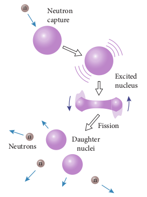
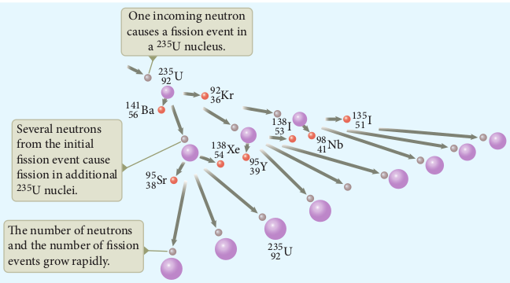

## NUCLEAR FISSION

In 1939, German scientists Otto Hahn and F. Strassman discovered that when uranium nucleus is bombarded with a slow neutron, it breaks up into two smaller nuclei of comparable masses with the release of energy. **The process of breaking up of the nucleus of a heavier atom into two smaller nuclei with the release of a large amount of energy is called nuclear fission**. The fission is accompanied by the release of neutrons. The energy that is released in the nuclear fission is of many orders of magnitude greater than the energy released in chemical reactions.

Uranium undergoes fission reaction in 90 different ways. The most common fission reactions of
235_U_92 nuclei are shown here.

92235019223656141369201 3_U n U Ba Kr n Q_\+ → → + + +\*    (9.45)

92235019223654140389401 2_U n U Xe Sr n Q_\+ → → + + +\*    (9.46)

Here _Q_ is energy released during the fission of each uranium nucleus. When a slow neutron is absorbed by the uranium nucleus, the mass number increases by one and goes to an excited state 236_U_92* . But this excited state does not last longer than 10-12s and decay into two daughter nuclei along with the release of 2 or 3 neutrons. In each reaction, on an average, 2.5 neutrons are emitted. It is shown in Figure 9.27

  
  
 Figure 9.27 </strong>Nuclear fission

**Energy released in fission:**

We can calculate the energy (_Q_) released in each uranium fission reaction. We choose the most observed fission reaction which is given in the equation (9.45).

92 2350 192 23656 14136 920 13_U n U Ba Kr n Q_→ → + + +

Mass of 92235_U_ \= 235.045733 _u_

Mass of 01_n_ \= 1.008665 _u_

Total mass of reactants = 236.054398 _u_

Mass of 56141_Ba_ \= 140.9177 _u_

Mass of 3692_Kr_ \= 91.8854 _u_

Mass of 3 neutrons = 3.025995 _u_

The total mass of products = 235.829095 _u_  

Mass defect ∆_m_ \= 236.054398 _u_ – 235.829095 _u_ = 0.225303 _u_

So the energy released in each fission = 0 225303 931 200. × ≈_MeV MeV_

This energy first appears as kinetic energy of daughter nuclei and neutrons. But later, this kinetic energy appears in the form of heat given to the surrounding.

**Chain reaction:** 

When one 235_U_92 nucleus undergoes fission, the energy released might be small. But from each fission reaction, three neutrons are released. These three neutrons can cause further fission in three other 235_U_92 nuclei which in turn produce nine neutrons. These nine neutrons initiate fission in another nine 235_U_92 nuclei which produces 27 neutrons and so on. This process is called a chain reaction and the number of neutrons goes on increasing almost in geometric progression. It is shown in Figure 9.28.

There are two kinds of chain reactions: (i) uncontrolled chain reaction (ii) controlled chain reaction. In an uncontrolled chain reaction, the number of neutrons multiply indefinitely and the entire amount of energy is released in a fraction of second.

The atom bomb is an example of nuclear fission reaction in which uncontrolled chain reaction occurs. Atom bombs produce massive destruction on mankind. During World War II, on August 6 and 9 in the year 1945, USA dropped two atom bombs in two places of Japan, Hiroshima and Nagasaki. As a result, lakhs of people were killed and the two cities were completely destroyed. Even now the people who are living in those places have side effects caused by the explosion of atom bombs.

It is possible to calculate the typical energy released in a chain reaction. In the first step, 

  
  
 Figure 9.28 </strong>Nuclear chain reaction

one neutron initiates the fission process in one nucleus by producing three neutrons and energy of about 200 MeV. In the second step, further three nuclei undergo fission, in third step nine nuclei undergo fission, in fourth step 27 nucleus undergo fission and so on. In the 100th step, the number of nuclei which undergo fission is around 2.5*10^40. The total energy released after 100th step is  2.5X10^40x200 MeV = 8x10^29 J. It is really an enormous amount of energy which is equivalent to electrical energy required in Tamilnadu for several years.

If the chain reaction is controllable, then we can harvest an the enormous amount of energy for our needs. It is achieved in a controlled chain reaction. In the controlled chain reaction, the average number of neutrons released in each stage is kept as one such that it is possible to store the released energy. In nuclear reactors, the controlled chain reaction is carried out and the produced energy is used for power generation or for research purpose.

**EXAMPLE 9.15**

Calculate the amount of energy released when 1 kg of 235_U_92 undergoes fission reaction.

**_Solution_**

235 g of 235_U_92 has 6 02 10 23 . × atoms. In one gram of 235_U_92 , the number of atoms is equal to 6 02 10 235 2 56 10 23 21 . 

So the number of atoms present in 1 kg of 92235_U_ \= 2 56 10 1000 2 56 10 21 24. 

Each 92235_U_ nucleus releases 200 MeV of energy during the fission. The total energy released by 1kg of 92235_U_ is _

Q = MeV MeV_\= × × = ×2 56 10 200 5 12 10 24 26. 

In terms of joules, 

Q = J J_\= × × × = ×− 5 12 10 1 6 10 8 192 10 26 13 13 . 

In terms of kilowatt hour, 

Q = kWh_\= × ×\= ×8 192 103 6 10 2 27 101367 .. .235 92 U138 53 I135 51 I98 41Nb

This is enormously large amount of energy which is enough to keep 100 W bulb operating for 30,000 years. To produce this much energy by chemical reaction, around 20,000 tons of TNT(tri nitro toluene) has to be exploded.

**Nuclear reactor:** 

Nuclear reactor is a device in which the nuclear fission takes place in a self-sustained controlled manner and the energy produced is used either for research purpose or for power generation. The first nuclear reactor was built in the year 1942 at Chicago, USA by physicist Enrico Fermi. The main parts of a nuclear reactor are fuel, moderator and control rods. In addition to this, there is a cooling system which is connected with power generation set up.

**Fuel:** The fuel is fissionable material, usually uranium or plutonium. Naturally occurring uranium contains only 0.7% of 92 235_U_ and 99.3% are only 92238_U_ . So the 92238_U_ must be enriched such that it contains at least 2% to 4% of 92235_U_ . In addition to this, a neutron source is required to initiate the chain reaction for the first time. A mixture of beryllium with plutonium or polonium is used as the neutron source. During fission of 92235_U_ , only fast neutrons are emitted but the probability of initiating fission by it in another nucleus is very low. Therefore, slow neutrons are preferred for sustained nuclear reactions.

**Moderators:** The moderator is a material used to convert fast neutrons into slow neutrons. Usually the moderators are chosen in such a way that they must be very light nuclei having mass comparable to that of neutrons. Hence, these light nuclei undergo collision with fast neutrons and the speed of the neutron is reduced (Note that a billiard ball striking a stationary billiard ball of equal mass would itself be stopped but the same billiard ball bounces off almost with same speed when it strikes a heavier mass. This is the reason for using lighter nuclei as moderators). Most of the reactors use heavy water (D2O) and graphite as moderators. The blocks of uranium stacked together with blocks of graphite (the moderator) to form a large pile is shown in the Figure 9.29 (a) & (b).

  
  
 Figure 9.29 </strong>(a) Block diagram of Nuclear reactor

  
  
 Figure 9.29 </strong>(b) Schematic diagram of nuclear reactor

  

**Control rods:** The control rods are used to adjust the reaction rate. During each fission, on an average 2.5 neutrons are emitted and in order to have the controlled chain reactions, only one neutron is allowed to cause another fission and the remaining neutrons are absorbed by the control rods.

Usually cadmium or boron acts as control rod material and these rods are inserted into the uranium blocks as shown in the Figure 9.29 (a) and (b). Depending on the insertion depth of control rod into the uranium assembly, the average number of neutrons produced per fission is set to be equal to one or greater than one. If the average number of neutrons produced per fission is equal to one, then reactor is said to be in critical state. In fact, all the nuclear reactors are maintained in critical state by suitable adjustment of control rods. If it is greater than one, then reactor is said to be in super-critical and it may explode sooner or may cause massive destruction.

**Shielding:** For a protection against harmful radiations, the nuclear reactor is surrounded by a concrete wall of thickness of about 2 to 2.5 m.

**Cooling system:**The cooling system removes the heat generated in the reactor core. Ordinary water, heavy water and liquid sodium are used as coolant since they have very high specific heat capacity and have large boiling point under high pressure. This coolant passes through the fuel block and carries away the heat to the steam generator through heat exchanger as shown in Figure 9.29(a) and (b). The steam runs the turbines which produces electricity in power reactors.

**Note**

India has 22 nuclear reactors in operation. Nuclear reactors are constructed in two places in Tamilnadu, Kalpakkam and Kudankulam. Even though nuclear reactors are aimed to cater to our energy need, in practice nuclear reactors now are able to provide only 2% of energy requirement of India.