**U N I T**

**2** CURRENT

**In this unit, the student is exposed to** • Flow of charges in a metallic conductor

• Ohm’s law, electrical resistance, V-I characteris

• Carbon resistors and combination of resistors

• Kirchhoff ’s laws - Wheatstone’s bridge and its a

• Electric power and Electric energy

• Heating effect - Joule’s law – applications

• Thermoelectric effects – Seebeck effect – Peltie

_We will make electric_

**Learning Objectives**

**INTRODUCTION**  

ELECTRICITY

tics

pplications

r effect – Thomson effect

_ity so cheap that only the rich will burn candles_ – Thomas A. Edison

In unit 1, we studied the properties of charges when they are at rest. In reality, the charges are always moving within the materials. For example, the electrons in a copper wire are never at rest and are continuously in random motion. Therefore it is important to analyse the behaviour of charges when they are in motion. The motion of charges constitutes ‘electric current’. Current electricity is the study of flow of electric charges. It owes its origin to Alessandro Volta (1745-1827), who invented the electric battery which produced the first steady flow of electric current. Modern world depends heavily on the use of electricity. It is used to operate machines, communication systems, electronic devices, home appliances etc., In this unit, we will study about the electric current, resistance and related phenomenon in materials.

  

## ELECTRIC CURRENT

Matter is made up of atoms. Each atom consists of a positively charged nucleus with negatively charged electrons moving around the nucleus. Atoms in metals have one or more electrons which are loosely bound to the nucleus. These electrons are called free electrons and can be easily detached from the atoms. The substances which have an abundance of these free electrons are called conductors. These free electrons move randomly throughout the conductor at a given temperature. In general due to this random motion, there is no net transfer of charges from one end of the

Equal potential

No water ow

(a) Equal gravitational potential-No water ow

(b) W

**A B**

Copper wire

End A and B are at same electric potential. Hence no current

(c)  

conductor to other end and hence no current in the conductor. When a potential difference is applied by the battery across the ends of the conductor, the free electrons drift towards the positive terminal of the battery, producing a net electric current. This is easily understandable from the analogy given in the Figure 2.1.

In the XI Volume 2, unit 6, we studied, that the mass move from higher gravitational potential to lower gravitational potential. Likewise, positive charge flows from region of higher electric potential to region of lower electric potential and negative charge flows from region of lower electric potential to region of higher electric potential. So battery or electric cell simply creates potential difference across the conductor.

t

Higher potential

Lower potential

Flow of water

ater ows from higher gravitational potential to lower gravitational potential

**I**

**AB**

A is at higher electric potential than B. So current ows from A to B

_+–_

(d)

  

The electric current in a conductor is defined as the rate of flow of charges through a given cross-sectional area A. It is shown in the Figure 2.2.

**Figure 2.2 Charges flow across the area A**

**+**

**+**

**+**

**+**

**+**

_I_

_A_

**If a net charge Q passes through any cross section of a conductor in time t, then**

**the current is defined as** _I Q t_

\= **.** But charge

flow is not always constant. Hence current can more generally be defined as

_I Q tavg_ \=

∆ ∆

(2.1)

Where ∆Q is the amount of charge that passes through the conductor at any cross section during the time interval ∆t. If the rate at which charge flows changes with time, the current also changes. The instantaneous current I is defined as the limit of the average current, as ∆_t_ ® 0

_I Q t_

_dQ dtt_

\= = →

lim ∆

∆ ∆0

(2.2)

The SI unit of current is the **ampere** (A)

1 1 1

A C s

\=

That is, 1A of current is equivalent to 1 coulomb of charge passing through a perpendicular cross section in a conductor in one second. The electric current is a scalar quantity.  

**EXAMPLE 2.1**

Compute the current in the wire if a charge of 120 C is flowing through a copper wire in 1 minute.

**_Solution_**

The current (rate of flow of charge) in the wire is

_I Q t_

\= = = 120 60

2A

### Conventional Current

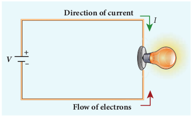

**_V_**

_I_ **Direction of current**

**Flow of electrons**

**\+ –**

In an electric circuit, arrow heads are used to indicate the direction of flow of current. By convention, this flow in the circuit should be from the positive terminal of the battery to the negative terminal. This current is called the conventional current or simply current and is in the direction in which a positive test charge would move. In typical circuits the charges that flow are actually electrons, from the negative terminal of the battery to the positive terminal. As a result, the flow of electrons and the direction of conventional current point in opposite direction as shown in Figure 2.3. Mathematically, a transfer of positive charge is the

| EXAMPLE 2 . 1Compute the current in the wire if a charge of 120 C i s f lowing t hrough a co pper w ire in 1 minute. SolutionThe c urrent (ra te o f f low o f c harge) in t he wire is Q 120I == = 2At 60 |
|------|

  

same as a transfer of negative charge in the opposite direction.

Electric current is not only produced by batteries. In nature, lightning bolt produces enormous electric current in a short time. During lightning, very high potential difference is created between the clouds and ground and hence charges flow between the clouds and ground.

### Drift velocity

In a conductor the charge carriers are free electrons. These electrons move freely through the conductor and collide repeatedly with the positive ions. If there is no electric field, the electrons move in random directions, and hence their velocities are also randomly oriented. On an average, the number of electrons travelling in any direction will be equal to the number of electrons travelling in the opposite direction. As a result, there is no net flow of electrons in any direction and hence there will not be any current.

Suppose a potential difference is set across the conductor by connecting a battery, an electric field



_E_ is created in the conductor. This electric field exerts a force on the electrons, producing a current. The  

electric field accelerates the electrons, while ions scatter the electrons and change their direction of motion. Thus, we see zigzag motion of electrons. In addition to the zigzag motion due to the collisions, the electrons move slowly along the conductor in a direction opposite to that of



_E_ as shown in the Figure 2.4.

**Ions**

Any material is made up of neutral atoms with equal number of electrons and protons. If the outermost electrons leave the atoms, they become free electrons and are responsible for electric current. The atoms after losing their outer most electrons will have more positive charges and hence are called positive ions. These ions will not move freely within the material like the free electrons. Hence the positive ions will not give rise to current.

**Figure 2.4 Zig-zag motion and drift** velocity

**\-**

**–**

_v_

E

_d_ →

→

This velocity is called drift velocity _vd_ . The drift velocity is the average velocity acquired by the electrons inside the conductor when

|------|
| IonsAny m aterial i s  made u p  of n eutral atoms w ith e qual n umber o f e lectrons and protons. If the outermost electrons leave t he a toms, t hey b ecome f ree electrons a nd a re r esponsible f or electric c urrent. The atoms after losing their o uter m ost e lectrons w ill h ave more p ositive c harges a nd h ence a re called positive ions. These ions will not move freely within the material like the free e lectrons. H ence t he p ositive io ns will not give rise to current. |
  

it is subjected to an electric field. The average time between two successive collisions is called the mean free time denoted by τ. The acceleration _a_ experienced by the electron in an electric field



_E_ is given by 



 

_a eE m_

_F eE_\= −

\=−( )since (2.3)

The drift velocity _vd_ is given by 

_vd a_\= τ





_vd e m_

_E_\=− τ (2.4)





_vd E_\=−µ (2.5)

Here µ τ =

_e m_

is the mobility of the electron and it is defined as the magnitude of the drift velocity per unit electric field.

µ = 



_vd_

_E_ (2.6)

The SI unit of mobility is m V s 12 1- - .

The typical drift velocity of electrons in the wire is 10–4 m s–1. If an electron drifts with this speed, then the electrons

leaving the battery will take hours to reach the light bulb. Then how electric bulbs glow as soon as we switch on the battery? When battery is switched on, the electrons begin to move away from the negative terminal of the battery and this electron exerts force on the nearby electrons. This process creates a propagating influence (electric field) that travels through the wire at the speed of light. In other words, the energy is transported from the battery to bulb at the speed of light through propagating influence (electric field). Due to this reason, the bulb glows as soon as the battery is switched on.

**Note**  

**EXAMPLE 2.2**

If an electric field of magnitude 570 N C–1, is applied in the copper wire, find the acceleration experienced by the electron.

**_Solution:_**

_E_ = 570 N C–1, _e_ = 1.6 × 10–19 C, _m_ = 9.11 × 10–31 kg and _a_ = ?

_F = ma = eE_

_a eE m_

\= = × × ×

−

−

570 1 6 10 9 11 10

19

31

. .

\= × ×−912 10 10 9 11

19 31

. = 1.001 × 1014 m s–2

**Misconception** (i) There is a common misconception that

the battery is the source of electrons. It is not true. When a battery is connected across the given wire, the electrons in the closed circuit resulting the current. Battery sets the potential difference (electrical energy) due to which these electrons in the conducting wire flow in a particular direction. The resulting electrical energy is used by electric bulb, electric fan etc. Similarly the electricity board is supplying the electrical energy to our home.

(ii) We often use the phrases like ‘charging the battery in my mobile’ and ‘my mobile phone battery has no charge’ etc. These sentences are not correct.

| EXAMPLE 2 . 2If an electric f ield of magnitude 570 N C , is a pplied in t he co pper w ire, f ind t he acceleration experienced by the electron.–1Solution:E = 570 N C , e = 1.6 × 10  C, m = 9.11 × 10  kg and a = ?F = ma = eE–1 –19–31eE 570××16. 10a = =m 91. 11× 0912××10 10= −1991. 1= 1.001 × 10−31  m s−19 3114 –2 |
|------|

  

When we say ‘battery has no charge’, it means, that the battery has lost ability to provide energy or provide potential difference to the electrons in the circuit. When we say ‘mobile is charging’, it implies that the battery is receiving energy from AC power supply and not electrons.

### Microscopic model of current

Consider a conductor with area of cross section A and let an electric field



_E_ be applied to it from right to left. Suppose there are _n_ electrons per unit volume in the conductor and assume that all the electrons move with the same drift velocity _vd_ as shown in Figure 2.5.

_dx_

_d dt_

_e_

_v_

_v_

_d_ →

**\-**

**\-** _A_

The drift velocity of the electrons = _vd_ If the electrons move through a distance

_dx_ within a small interval of _dt,_ then

_vd_ = _dx dt_

; _dx_ = _vd dt_ (2.7)

Since A is the area of cross section of the conductor, the electrons available in the volume of length _dx_ is

\= volume × number of electrons per unit volume

\= _Adx n_´ (2.8)  

Substituting for _dx_ from equation (2.7) in (2.8)

\= (_A vd dt_ ) _n_ Total charge in the volume element _dQ_ =

(charge) × (number of electrons in the volume element)

_dQ_ = (_e_)(_Avddt_)_n_

Hence the current _I dQ dt_

\=

_I ne A d_\= _v_ (2.9)

**Current density (J)** The current density ( _J_ ) is defined as the current per unit area of cross section of the conductor.

_J I A_

\=

The S.I unit of current density is A m2

(or) A m–2

_J neA_

_A d_\=

_v_ (from equation 2.9)

_J ne d_\= _v_ (2.10)

The above expression is valid only when the direction of the current is perpendicular to the area A. In general, the current density is a vector quantity and it is given by





_J ne d_\= _v_

Substituting _vd_

 from equation (2.4)

 

_J n e_

_m E_\=−

⋅ 2 τ (2.11)

 

_J E_\=−σ But conventionally, we take the

direction of (conventional) current density as the direction of electric field. So the above equation becomes  

_J E_\= σ (2.12)

where σ τ =

_ne m_

2

is called conductivity.

The equation (2.12) is called microscopic form of ohm’s law.

  

The inverse of conductivity is called resistivity (ρ) \[Refer section 2.2.1\].

ρ σ τ

\= = 1

2

_m ne_

(2.13)

**EXAMPLE 2.3**

A copper wire of cross-sectional area 0.5 mm2 carries a current of 0.2 A. If the free electron density of copper is 8.4 × 1028 m–3 then compute the drift velocity of free electrons.

**_Solution_**

The relation between drift velocity of electrons and current in a wire of cross- sectional area A is

_vd I_

_ne A_ \= =

× × × × ×− −

0 2 8 4 10 1 6 10 0 5 1028 19 6

. . . .

_vd_ \= 0.03 × 10–3 m s–1

Why current density is a vector but current is a scalar?

In general, the current I is defined as the scalar product of the current density and area vector in which the charges cross.

The current I can be positive or negative depending on the choice of the unit vector normal to the surface area A.

_A_ _J__J_

_S_

_I = JA_ cos 

 _A_

_A_

**Note**  

**EXAMPLE 2.4**

Determine the number of electrons flowing per second through a conductor, when a current of 32 A flows through it.

**_Solution_**

I = 32 A , t = 1 s

Charge of an electron, e = 1.6 × 10–19 C

The number of electrons flowing per second, n =?

_I q t_

_ne t_

\= =

_n It e_

\=

_n_\= × × −

32 1 1 6 10 19. C

_n_ = 20 × 1019 = 2 × 1020 electrons

## OHM’S LAW

The ohm’s law can be derived from the equation _J = σE_. Consider a segment of wire of length _l_ and cross sectional area _A_ as shown in Figure 2.7.

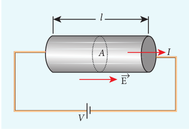

_l_

_IA_

_V_

E→

| qI ==tItn =en =n = 20 16.C ×× |
|------|

| EXAMPLE 2 . 4Determine the number of electrons flowing per s econd t hrough a co nductor, w hen a current of 32 A flows through it.SolutionI = 32 A , t = 1 sCharge of an electron, e = 1.6 × 10  CThe n umber o f e lectrons f lowing p er second, n =?–19q neI ==t tItn =e32×1n =n = 20 16.C ××10 10 = 2 × 10 electrons−1919  20 |
|------|

| 02. |
|------|------|
| Iv == = 0.03 × 10nevdd |
| A 84.. ××10 m s 16 ××10 0528 −−19–3 –1 |

| A co pper w ire o f cr oss-sectional a rea 0.5 mm  carries a current of 0.2 A. If the free electron  density  of  copper  is  8.4 × 10 mthen co mpute t he dr ift v elocity o f f ree electron2s. 28 –3SolutionThe r elation b etween dr ift v elocity o f electrons a nd c urrent in a w ire o f cr oss-sectional area A is I 02.v == = 0.03 × 10ne A 84.. ××10 m s 16 ××10 05. ×10vd 28 −−19 6–3 –1d |
|------|

| AAA J J |
|------|------|

  

Slope =

_I_

1 _R_

(a)

When a potential difference _V_ is applied across the wire, a net electric field is created in the wire which constitutes the current in the wire. For simplicity, we assume that the electric field is uniform in the entire length of the wire, then the potential difference (voltage _V_) can be written as

_V = El_

As we know, the magnitude of current density

_J E V l_

\= =σ σ (2.14)

But _J I A_

\= ,

so we write the equation (2.14) as

_I A_

_V l_

\= σ .

By rearranging the above equation, we get

_V I l A_

\= 

  

 σ (2.15)

The quantity _l A_σ

is called resistance of

the conductor and it is denoted as _R_. Note that the resistance is directly proportional to the length of the conductor and inversely proportional to area of cross section.

Therefore, the macroscopic form of ohm’s law can be stated as

_V = IR_ (2.16)

From the above equation, **the resistance is the ratio of potential difference across the given conductor to the current passing through the conductor.**

_R V I_

\= (2.17)

The SI unit of resistance is ohm (Ω). From the equation (2.16), we infer that the graph between current versus voltage is  

straight line with a slope equal to the inverse of resistance _R_ of the conductor. It is shown in the Figure 2.8 (a).

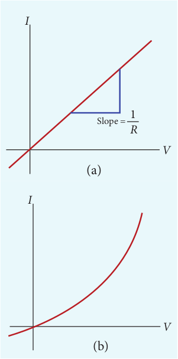

Slope =

_I_

1 _R_

_V_

_I_

(a) (b

_V_

_I_

_V_ (b)

Materials for which the current versus voltage graph is a straight line through the origin, are said to obey Ohm’s law and their behaviour is said to be ohmic as shown in Figure 2.8(a). Materials or devices that do not follow Ohm’s law are said to be non- ohmic. These materials have more complex relationships between voltage and current. A plot of I versus V for a non-ohmic material is non-linear and they do not have a constant resistance (Figure 2.8(b)).

|------|------|
| 1RSlope = |

  

**EXAMPLE 2.5**

A potential difference across 24 Ω resistor is 12 V. What is the current through the resistor?

**_Solution_**

12 V I

\+ –

24 Ω

_V_ = 12 V and _R_ = 24 Ω Current, _I_ = ? From Ohm’s law, _I V_

_R_ \= = =

12 24

0 5. A

### Resistivity

In the previous section, we have seen that the resistance _R_ of any conductor is given by

_R l A_

\= σ

(2.18)

where _σ_ is called the conductivity of the material and it depends only on the type of the material used and not on its dimension.

The resistivity of a material is equal to the reciprocal of its conductivity.

ρ σ

\= 1 (2.19)

Now we can rewrite equation (2.18) using equation (2.19)

_R l A_

\= ρ (2.20)

The resistance of a material is directly proportional to the length of the conductor and inversely proportional to the area of cross section of the conductor. The  

proportionality constant ρ is called the resistivity of the material.

If _l_ = 1 m and _A_ = 1 m2, then the resistance _R = ρ_. In other words, the **electrical resistivity of a material is defined as the resistance offered to current flow by a conductor of unit length having unit area of cross section.** The SI unit of _ρ_ is ohm-metre (Ω m). Based on the resistivity, materials are classified as conductors, insulators and semi- conductors. The conductors have lowest resistivity, insulators have highest resistivity and semiconductors have resistivity greater than conductors but less than insulators. The typical resistivity values of some conductors, insulators and semiconductors are given in the Table 2.1

**Table 2.1 Resistivity for various materials**

| **Material**       	| **Resistivity_ρ_  (Ω m) at 200C** 	|
|--------------------	|----------------------------------------------	|
| **Insulators**     	                                              	|
| Pure Water         	| 2.5 × 105                         	|
| Glass              	| 10 10  – 10 14         	|
| Hard Rubber        	| 10 13  – 10 16         	|
| NaCl               	| 10 14                             	|
| Fused Quartz       	| 10 16                             	|
| **Semiconductors** 	                                              	|
| Germanium          	| 0.46                                         	|
| Silicon            	| 640                                          	|
| **Conductors**     	                                             	|
| Silver             	| 1.6 × 10 -8                       	|
| Copper             	| 1.7 × 10 -8                       	|
| Aluminium          	| 2.7 × 10 -8                       	|
| Tungsten           	| 5.6 × 10 -8                       	|
| Iron               	| 10 × 10 -8                        	|

  

**EXAMPLE 2.6**

The resistance of a wire is 20 Ω. What will be new resistance, if it is stretched uniformly 8 times its original length?

**_Solution_**

_R_1 = 20 Ω, _R_2= ?

Let the original length of the wire (_l_1) be _l_.

New length, _l2 = 8l1 (i.,e) l2 =8l_

Original resistance, _R l A_1

1

1

\= ρ

New resistance _R l A_

_l A_2

2

2 2

8 = =

( ) ρ

ρ

Though the wire is stretched, its volume remains unchanged. Initial volume = Final volume _A_1_l_1= _A_2_l_2 , _A_1_l_ \= _A_2(8_l_ )

_A A_

_l l_

1

2

8 8= =

By dividing equation for _R_2 by equation for _R_1, we get

_R R_

_l A_

_A l_

2

1 2

18 = ( ) ×

ρ ρ

_R R_

_A A_

2

1

1

2

8= ×

Substituting the value of _A A_

1

2

, we get _R R_

2

1

8 8= × \= 64

_R_2 = 64 × 20=1280 Ω

Hence, stretching the length of the wire has increased its resistance.

**EXAMPLE 2.7**

Consider a rectangular block of metal of height A, width B and length C as shown in the figure.  

_\+ –_

_V_(a) (b)

_A_

_I = IAB I = ?_

_B C_

_V_

_A_

_B C_

_\+ –_

If a potential difference of _V_ is applied between the two faces A and B of the block (figure (a)), the current _IAB_ is observed. Find the current that flows if the same potential difference _V_ is applied between the two faces B and C of the block (figure (b)). Give your answers in terms of _IAB_.

**_Solution_**

In the first case, the resistance of the block

_RAB_ \= =ρ ρlength Area

C AB

The current _I V R_

_V AB CAB_

_AB_

\= = ⋅ ρ

(1)

In the second case, the resistance of the block _R A_

_BC_ \= ρ BC

The current _I V R_

_V BC ABC_

_BC_

\= = ⋅ ρ

(2)

To express _IBC_ interms of _IAB_, we multiply and divide equation (2) by AC, we get

_I V BC A_

_AC AC_

_V AB C_

_C A_

_C A_

_IBC AB_\= ⋅ = ⋅ 

 



 ⋅ = ⋅

ρ ρ

2

2

2

2

Since _C_ > _A_, the current _IBC_ > _IAB_

The human body contains a large amount of water which has low resistance of around 200 Ω and the dry skin has high resistance of

around 500 k Ω. But when the skin is wet, the resistance is reduced to around1000 Ω. This is the reason why repairing the electrical connection with the wet skin is always dangerous.

| + |BC |
|------|------|------|------|------|

| – |

| BC |
|------|------|------|------|

| – |

  

### Resistors in series and parallel

An electric circuit may contain a number of resistors which can be connected in different ways. For each type of circuit, we can calculate the equivalent resistance produced by a group of individual resistors.

**Resistors in series** When two or more resistors are connected

end to end, they are said to be in series. The resistors could be simple resistors or bulbs or heating elements or other devices. Figure 2.9 (a) shows three resistors _R_1, _R_2 and _R_3 connected in series.

The amount of charge passing through resistor _R_1 must also pass through resistors _R_2 and _R_3 since the charges cannot accumulate anywhere in the circuit. Due to

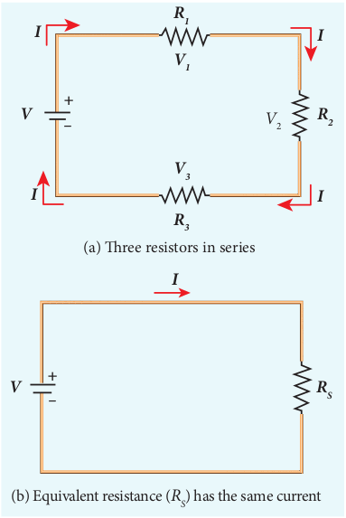

**_R3_**

**_R2_**

**_RS_**

**_R1_**

**_V1_**

**_V3_**

_V_2

**_I_**

**_I_**

**_II_**

**_I_**

**_V_**

**_V_**

(a) ree resistors in series

(b) Equivalent resistance (_RS_) has the same current

**_\+ –_**

**_\+ –_**  

this reason, the current I passing through all the three resistors is the same. According to Ohm’s law, if same current pass through different resistors of different values, then the potential difference across each resistor must be different. If _V_1, _V_2 and _V_3 be the potential differences (voltage) across each of the resistors _R_1, _R_2 and _R_3 respectively, then we can write _V_1 = _IR_1, _V_2 = _IR_2 and _V_3 = _IR_3\. But the supply voltage _V_ must be equal to the sum of voltages(potential differences) across each resistor.

_V_ = _V_1 + _V_2 + _V_3 = _IR_1 + _IR_2 + _IR_3 (2.21)

_V_ = _I_ (_R_1 + _R_2 + _R_3)

_V_ = _IRS_ (2.22)

where _RS_ is the equivalent resistance.

_RS_\= _R_1 + _R_2 + _R_3 (2.23)

When several resistors are connected in series, the total or equivalent resistance is the sum of the individual resistances as shown in the Figure 2.9 (b).

**Note: The value of equivalent resistance in series connection will be greater than each individual resistance.**

**EXAMPLE 2.8**

Calculate the equivalent resistance for the circuit which is connected to 24 V battery and also find the potential difference across each resistors in the circuit.

\+ -

_I I_

24 V

_R1 R2_

4Ω 6Ω

  

**_Solution_**

Since the resistors are connected in series, the effective resistance in the circuit

\= 4 Ω + 6 Ω = 10 Ω

current I in the circuit = _V Req_

\= = 24 10

2 4. A

Voltage across 4Ω resistor

_V IR_1 1 2 4 4 9 6= = × =. .A VΩ

Voltage across 6 Ω resistor

_V IR_2 2 2 4 6 14 4= = × =. .A VΩ

**Resistors in parallel** Resistors are in parallel when they are connected across the same potential difference as shown in Figure 2.10 (a).

In this case, the total current I that leaves the battery is split into three separate components. Let _I_1, _I_2 and _I_3 be the current through the resistors _R_1, _R_2 and _R_3 respectively. Due to the conservation of charge, total current in the circuit I is equal to sum of the currents through each of the three resistors.

_I_ = _I_1 + _I_2 + _I_3 (2.24)

Since the voltage across each resistor is the same, applying Ohm’s law to each resistor, we have

_I V R_

_I V R_

_I V R_1

1 2

2 3

3

\= = =, , (2.25)

Substituting these values in equation (2.24),we get

_I V R_

_V R_

_V R_

_V R R R_

\= + + = + + 

  



  

1 2 3 1 2 3

1 1 1

_I V RP_

\=  

1 1 1 1

1 2 3_R R R RP_

\= + + (2.26)

Here _RP_ is the equivalent resistance of the parallel combination of the resistors. Thus, when a number of resistors are connected in parallel, the sum of the reciprocals of resistance of the individual resistors is equal to the reciprocal of the effective resistance of the combination as shown in the Figure 2.10 (b).

**Note: The value of equivalent resistance in parallel connection will be lesser than each individual resistance.**

House hold appliances are always connected in parallel so that even if one is switched off, the other devices could function properly.

_RP_

_I_

_R_2_R_1

_I_1 _I_2 _I_3

_R_3

_I_

_I_

_I_

_V V_

(a) ree resistors in parallel

(b) Equivalent resistance (_RP_) has the same current

\+ –

\+ –

| SolutionSince t he r esistors a re co nnected in s eries, the effective resistance in the circuit = 4 Ω + 6 Ω = 10 Ωcurrent I in t he circuit =V 24== 24.AR 10Voltage across 4Ω resistoreqVI ==R 24.. AV×=49Ω 6Voltage across 6 Ω resistor 1124.. AV×=61Ω 44 |
|------|------|------|

| VI ==R22 |
  

**EXAMPLE 2.9**

Calculate the equivalent resistance in the following circuit and also find the values of current _I_, _I_1 and _I_2 in the given circuit.

_R_2

_R_1

\+ – 24 _V_

_I_

_I1_

_I2_ 6Ω

4Ω

**_Solution_**

Since the resistances are connected in parallel, the equivalent resistance in the circuit is

1 1 1 1 4

1 61 2_R R RP_

\= + = +

1 5 12

12 5_R_

_R P_

_P_\= =Ω Ωor

The resistors are connected in parallel, the potential diffrence (voltage) across them is the same.

_I V R_1

1

24 4

6= = = V

A Ω

_I V R_2

2

24 6

4= = = A

The current _I_ is the sum of the currents in the two branches. Then,

_I_ = _I_1 + _I_2= 6 A + 4 A = 10 A

**EXAMPLE 2.10**

Two resistors when connected in series and parallel, their equivalent resistances

are 15 Ω and 56 15

Ω respectively. Find the

values of the resistances.  

**_Solution_**

_R_s = _R_1 + _R_2 = 15 Ω (1)

_R R R R RP_ \= +

\=1 2

1 2

56 15

Ω (2)

From equation (1) substituting for _R_1 + _R_2

in equation (2) _R R_1 2

15 56 15

\= Ω

∴ _R_1 _R_2 = 56

_R_2 = 56

1_R_ Ω (3)

Substituting for _R_2 in equation (1) from equation (3)

_R_1 + 56 15 1_R_

\=

Then, _R R_

1 2

1

56 15

\+ =

_R_1 2+ 56 = 15 _R_1

_R_1 2-15 _R_1+ 56 = 0

The above equation can be solved using factorisation.

_R_1 = 8 Ω (or) _R_1 = 7 Ω

If _R_1= 8 Ω

Substituting in equation (1)

8 + _R_2 = 15

_R_2 = 15 – 8 = 7 Ω ,

_R_2 = 7 Ω i.e , (when _R_1 = 8 Ω ; _R_2 = 7 Ω)

If _R_1= 7 Ω

Substituting in equation (1)

7 + _R_2 = 15

_R_2 = 8 Ω , i.e , (when _R_1 = 7 Ω ; _R_2 = 8 Ω )

| VI ==RVI ==1 R122 |
|------|

| 2 . 9he e quivalent r esistance in t he cuit and also find the values of I  and I  in the given circuit.1 2R4Ω1R2I 6Ω2+ –e  resistances  24 V are  connected in he e quivalent r esistance in t he 11 1=+R 4 612ΩΩ or R5tors are connected in p arafrence (voltage) acrosP24V= 6 A4Ω24= 4 A6t  I i s t he s um o f t he c urranches. Then,= 6 A + 4 A = 10 A2 |
|------|------|------|------|
| EXAMPLECalculate tfollowing circurrent I, I1ISolutionSince  thparallel, tcircuit is11=+RR15==R 12The rP esis 12potential diftheP same.VI ==RVI ==1 RThe c ur1 renthe two b22 |

| llel, t he s them is |

| rents in |

| I = I  + I1 |

| SolutionR  = R + R = 15 Ω  (1)(2)RR 56R = = ΩFrs om eRR1 q+ua 2 tion (1) s15 ubstituting for R  + Rin equation (2)12P12RR = 56 Ω 1 2 ∴15R R 15 = 56R12 56 (3)ΩRSubs1 tit 2uting  for  R in e quation (1) f rom equation (3)2 = 1R  + 56 2 = 15RThen, R + 561 = 15R + 56 = 15 1 R R21R -15 R + 56 = 0 12Th1 e  above  equ 1 ation c an  be  solved  using factorisation.21 1R = 8 Ω (or) R = 7 ΩIf R = 8 Ω Su1 bstituting in e 1  quation (1)8 + 1R = 15R  = 15 – 8 = 7 Ω , R  = 7 Ω i2  .e , (when R  = 8 Ω ; R  = 7 Ω)If2R = 7 Ω Su2 bstituting in equatio 1 n (1) 27 + R = 151R  = 8 Ω , i.e , (when R  = 7 Ω ; R  = 8 Ω )2 2 1 2 |
|------|

  

**EXAMPLE 2.11**

Calculate the equivalent resistance between A and B in the given circuit.

A

2Ω

2Ω

4Ω

4Ω

6Ω

6Ω

B

**_Solution_**

In all the sections, the resistors are connected in parallel.

Section 1 1 1 1

1 1 2_R R Rp_

\= +

1 1 2

1 2

2 2

1 _Rp_

\= + = _Rp_1 1= Ω

A B

4Ω

1Ω

4Ω

6Ω

6Ω

**_R P1_**

Section II 1 1

4 1 4

2 4

2 _Rp_

\= + = , 1 1 2

2 _Rp_

\= , _Rp_2 2= Ω

A B RP2

6Ω

6Ω

2Ω1Ω

Section III 1 1

6 1 6

2 6

3 _Rp_

\= + =

1 1 3

3 _Rp_

\= , _Rp_3 3= Ω

Equivalent resistance is given by

_R R R Rp p p_\= + + 1 2 3

_R_ = 1 Ω + 2 Ω + 3 Ω = 6 Ω

The circuit becomes,  

A B

3Ω2Ω1Ω

Equivalent resistance between A and B is

A B

6Ω

**EXAMPLE 2.12**

Five resistors are connected in the configuration as shown in the figure. Calculate the equivalent resistance between the points a and b.

_a b_

_c_

_d_

5Ω

1Ω 1Ω

1Ω1Ω

**_Solution_**

**Case (a)**

To find the equivalent resistance between the points a and b, we assume that a current is entering the junction at a. Since all the resistances in the outside loop are the same (1Ω), the current in the branches ac and ad must be equal. Hence the points C and D are at the same potential and no current through 5 Ω. It implies that the 5 Ω has no role in determining the equivalent resistance and it can be removed. So the circuit is simplified as shown in the figure.

  

1Ω

1Ω 1Ω

1Ω_a bc, d_

1Ω 1/2Ω 1/2Ω

1Ω _a b_

_bc, c,_

_d d_

1/2Ω 1/2Ω 1Ω

_a ab bc, d_

The equivalent resistance of the circuit between a and b is _Req_ = 1 Ω

### Colour code for Carbon resistors

Carbon resistors consists of a ceramic core, on which a thin layer of crystalline carbon is deposited as shown in Figure 2.11. These resistors are inexpensive, stable and compact in size. Colour rings are used to indicate the value of the resistance according to the rules given in the Table 2.2.

Three coloured rings are used to indicate the values of a resistor: the first two rings are significant figures of resistances, the third ring indicates the decimal multiplier after them. The fourth colour, silver or gold,  

**Table 2.2 Colour Coding for Resistors**

| **Colour** 	| **Number** 	| **Multiplier**     	| **Tolerance** 	|
|------------	|------------	|--------------------	|---------------	|
| Black      	| 0          	| 1                  	|               	|
| Brown      	| 1          	| 10  1   	|               	|
| Red        	| 2          	| 10  2   	|               	|
| Orange     	| 3          	| 10  3   	|               	|
| Yellow     	| 4          	| 10  4   	|               	|
| Green      	| 5          	| 10  5   	|               	|
| Blue       	| 6          	| 10  6   	|               	|
| Violet     	| 7          	| 10  7   	|               	|
| Gray       	| 8          	| 10  8   	|               	|
| White      	| 9          	| 10  9   	|               	|
| Gold       	|            	| 10  -1  	| 5%            	|
| Sliver     	|            	| 10  -2  	| 10%           	|
| Colourless 	|            	|                    	| 20%           	|

shows the tolerance of the resistor at 10% or 5% as shown in the Figure 2.12 .If there is no fourth ring, the tolerance is 20%.

For the resistor shown in Figure 2.12, the first digit = 5 (green), the second digit = 6 (blue), decimal multiplier = 103 (orange) and tolerance = 5% (gold). The value of resistance = 56 × 103 Ω or 56 kΩ with the tolerance value 5%.

While reading the colour code, hold the resistor with colour bands to your left. Resistors

never start with a metallic band on the left.

**Note**

  

### Temperature dependence of resistivity

The resistivity of a material is dependent on temperature. It is experimentally found that for a wide range of temperatures, the resistivity of a conductor increases with increase in temperature according to the expression,

ρ ρ α_T T T_\= + −( ) 

  

1 (2.27)

where ρ_T_ is the resistivity of a conductor at _T_ o_C_, ρ_o_ is the resistivity of the conductor at some reference temperature _To_ (usually at 20oC) and _α_ is the temperature coefficient of resistivity. **It is defined as the ratio of increase in resistivity per degree rise in temperature to its resistivity at To**_._

From the equation (2.27), we can write

ρ ρ αρ_T T T_− = −( )   

∴ = − −( )

\=α ρ ρ ρ

ρ ρ

_T_

_T T T_ 

  

∆ ∆

where _∆_ρ _=_ ρ_T –_ ρ_o_ is change in resistivity for a change in temperature _∆T = T – To._ Its unit is per oC.

_α_ **of conductors** For conductors α is positive_._ If the

temperature of a conductor increases, the average kinetic energy of electrons in the conductor increases. This results in more frequent collisions and hence the resistivity increases. The graph of the equation (2.27) is shown in Figure 2.13.

Even though, the resistivity of conductors like metals varies linearly for wide range of temperatures, there also exists a non- linear region at very low temperatures. The resistivity approaches some finite value as the temperature approaches absolute zero as shown in Figure 2.13(b).  

Using the equation ρ = _R A l_

in equation

(2.27), we get the expression for the resistance of a conductor at temperature T oC as

_R R T TT_ \= + −( ) 

  

1 α (2.28)

The temperature coefficient of resistivity can also be obtained from the equation (2.28),

_R R R T TT_ − = −( )   

α

∴ = − −( )

\=α _R R R T T R_

_R T_

_T_ 

  

1 ∆ ∆

α = 1 _R_

_R T_



∆ ∆ (2.29)

where ∆_R R RT_\= − 

is change in resistance during the change in temperature ∆_T T T_\= −



**_α_ of semiconductors** For semiconductors, the resistivity

decreases with increase in temperature. As the temperature increases, more electrons will be liberated from their atoms (Refer unit 9 for conduction in semi conductors).

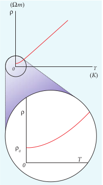

Hence the current increases and therefore the resistivity decreases as shown in Figure 2.14. A semiconductor with a negative temperature coefficient of resistivity is called a thermistor.

The typical values of temperature coefficients of various materials are given in table 2.3.

**Table 2.3**

| Material  | Temperature Coefficient of resistivity α [(°C)−1] |
|-----------|--------------------------------------------------------------|
| Silver    | 3.8 × 10−3                                        |
| Copper    | 3.9 × 10 −3                                       |
| Gold      | 3.4 × 10 −3                                       |
| Aluminum  | 3.9 × 10 −3                                       |
| Tungsten  | 4.5 × 10 −3                                       |
| Iron      | 5.0 × 10 −3                                       |
| Platinum  | 3.92 × 10 −3                                      |
| Lead      | 3.9 × 10 −3                                       |
| Nichrome  | 0.4 × 10−3                                                   |
| Carbon    | −0.5 × 10                                                    |
| Germanium | −48 × 10−3                                                   |
| Silicon   | −75 × 10−3                                                   |

We can understand the temperature dependence of resistivity in the following way. In section 2.1.3, we have shown that

the electrical conductivity, σ τ =

_ne m_

2

. As the

resistivity is inverse of σ, it can be written as

ρ τ

\= _m_

_ne_2 (2.30)

The resistivity of materials is i) inversely proportional to the number

density (_n_) of the electrons ii) inversely proportional to the average

time between the collisions (τ). In metals, if the temperature increases, the

average time between the collision (τ) decreases and _n_ is independent of temperature. In semiconductors when temperature increases, _n_ increases and τ decreases, but increase in _n_ is dominant than decreasing τ, so that overall resistivity decreases.

The resistance of certain materials become zero below certain temperature _Tc_. This

temperature is known as critical temperature or transition temperature. The materials which exhibit this property are known as superconductors. This phenomenon was first observed by Kammerlingh Onnes in 1911. He found that mercury exhibits superconductor behaviour at 4.2 K. Since _R_ = 0, current once induced in a superconductor persists without any potential difference.

**EXAMPLE 2.13**

If the resistance of coil is 3 Ω at 200 C and _α_ = 0.004**/**0C then determine its resistance at 100 0C.

  

**_Solution_**

_R0_ \= 3 Ω, T = 1000C, _T0_ = 200C

_α_ = 0.004**/**0C, _RT_\= ?

_RT_ \= _R0_(1 + _α_(_T-T0_))

_R_100 = 3(1 + 0.004 × 80)

_R_100 = 3.96 Ω

**EXAMPLE 2.14**

Resistance of a material at 200C and 400C are 45 Ω and 85 Ω respectively. Find its temperature coefficient of resistivity.

**_Solution_**

T0 = 20 0C, T = 40 0C, R0= 45 Ω , R = 85 Ω

α = 1 _R_

_R T_



∆ ∆

α= − −



 



 

1 45

85 45 40 20

\= ( )1 45

2

α= °0 044. per _C_

## ENERGY AND POWER IN ELECTRICAL CIRCUITS

When a battery is connected between the ends of a conductor, a current is established. The battery is supplying energy to the device which is connected in the circuit. Consider a circuit in which a battery of voltage V is connected to the resistor as shown in Figure 2.15.

Assume that a positive charge of _dQ_ moves from point _a_ to _b_ through the battery and moves from point _c_ to _d_ through the resistor and back to point _a_. When the charge  

moves from point _a_ to _b_, it gains potential energy _dU_ = _V.dQ_ and the chemical potential energy of the battery decreases by the same amount. When this charge _dQ_ passes through resistor it loses the potential energy _dU_ = _V.dQ_ due to collision with atoms in the resistor and again reaches the point _a_. This process occurs continuously till the battery is connected in the circuit. The rate at which the charge loses its electrical potential energy in the resistor can be calculated.

The electrical power P is the rate at which the electrical potential energy is delivered,

_P dU dt dt_

_V dQ dt_

\= = = ).(_V dQ_ (2.31)

Since the electric current _I dQ dt_

\= , the

equation (2.31) can be rewritten as

_P_ = _VI_ (2.32)

This expression gives the power delivered by the battery to any electrical system, where _I_ is the current passing through it and _V_ is the potential difference across it. The SI unit of electrical power is watt (1W = 1 J s–1). Commercially, the electrical bulbs used in houses come with the power and voltage rating of 5W-220V, 30W-220V, 60W-220V etc. (Figure 2.16).

_I_

_RV_

_a_

_b c_

_d_

\+ -

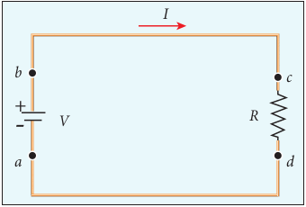

| SolutionR = 3 Ω, T = 100 C, T  = 20 C α = 0.004/ C, R = ?R = R (1 + α(T-T ))0 00  0R = 3(1 + 0.004 × 80)0TR = 3.96 ΩT  0 0100 100 |
|------|

| 1 ∆α =R ∆α = 451 α =°0.p044 |
|------|

| EXAMPLE 2 . 1 4Resistance o f a m aterial a t 20 C a nd 40 C are 45 Ω a nd 85 Ω r espectively. Fin d i ts temperature coefficient of resistivity.0 0SolutionT  = 20  C, T = 40  C, R = 45 Ω , R = 85 Ω1 ∆Rα =R ∆T0 00 ()0α = 451  8540 −− 2045  = 451 2α =°0.p044 er C |
|------|

  

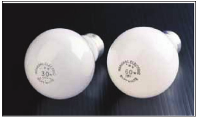

Usually these voltage rating refers AC RMS voltages. For a given bulb, if the voltage drop across the bulb is greater than voltage rating, the bulb will fuse.

Using Ohm’s law, power delivered to the resistance R is expressed in other forms

_P_ = _IV_ = _I_ (_IR_) = _I_2_R_ (2.33)

_P_ = _IV_ = _V R_

_V V R_

\= 2

(2.34)

The electrical power produced (dissipated) by a resistor is _I_2_R_. It depends

on the square of the current. Hence, if current is doubled, the power will increase by four times. Similar explanation holds true for voltage also.

The total electrical energy used by any device is obtained by multiplying the power and duration of the time when it is ON. If the power is in watts and the time is in seconds, the energy will be in joules. In practice, electrical energy is measured in kilowatt hour (kWh). 1 kWh is known as 1 unit of electrical energy.

(1 kWh = 1000 Wh = (1000 W) (3600 s) = 3.6 × 106 J)  

The Tamilnadu Electricity Board is charging for the amount of energy you

use and not for the power. A current of 1A flowing through a potential difference of 1V produces a power of 1W.

**EXAMPLE 2.15**

A battery of voltage V is connected to 30 W bulb and 60 W bulb as shown in the figure. (a) Identify brightest bulb (b) which bulb has greater resistance? (c) Suppose the two bulbs are connected in series, which bulb will glow brighter?

_V a b_

_c d_

\+ –

_e f_

30_W_

60_W_

**_Solution_**

(a) The power delivered by the battery _P_ = _VI_. Since the bulbs are connected in parallel, the voltage drop across each bulb is the same. If the voltage is kept fixed, then the power is directly proportional to current (_P_ ∝ _I_). So 60 W bulb draws twice as much as current as 30 W and it will glow brighter than 30 W bulb.

  

(b) To calculate the resistance of the

bulbs, we use the relation _P V R_

\= 2

. In both the bulbs, the voltage drop is the same. So the power is inversely proportional to the resistance or resistance is inversely proportional

to the power _R P_

∝ 1

 



  . It implies

that, the 30W has twice as much as resistance as 60 W bulb.

(c) When the bulbs are connected in series, the current passing through each bulb is the same. It is equivalent to two resistors connected in series. The bulb which has higher resistance has higher voltage drop. So 30W bulb will glow brighter than 60W bulb. So the higher power rating does not always imply more brightness and it depends whether bulbs are connected in series or parallel.

**EXAMPLE 2.16**

Two electric bulbs marked 20 W – 220 V and 100 W – 220 V are connected in series to 440 V supply. Which bulb will get fused?

**_Solution_**

To check which bulb will get fused, the voltage drop across each bulb has to be calculated.

The resistance of the bulb**,**

_R V P_

\= = 2 2(Rated voltage)

Rated power

For 20W-220V bulb,

_R_1

2220 20

2420= ( )

\=Ω Ω  

For 100W-220V bulb,

_R_2

2220 100

484= ( )

\=Ω Ω

Both the bulbs are connected in series. So same current will pass through both the bulbs. The current that passes through the circuit, _I V_

_Rtot_

\= .

_R R Rtot_ \= +( )1 2

_Rtot_ \= +( ) =484 2420 2904Ω Ω

_I V_ \= ≈

440 2904

0 151 Ω

. A

The voltage drop across the 20W bulb is

_V IR_1 1 440

2904 2420 366 6= = × ≈ . V

The voltage drop across the 100W bulb is

_V IR_2 2 440

2904 484 73 3= = × ≈ . V

The 20 W bulb will get fused because the voltage across it is more than the voltage rating.

## ELECTRIC CELLS AND BATTERIES

An electric cell converts chemical energy into electrical energy to produce electricity. It contains two electrodes (carbon and zinc) immersed in an electrolyte (sulphuric acid) as shown in Figure 2.17.

Several electric cells connected together form a battery. When a cell or battery is connected to a circuit, electrons flow from the negative terminal to the positive terminal through the circuit. By using chemical reactions, a battery

| For 100W-220V bulb, ()220R = ΩΩ= 484100B oth t he b u2 lbs a re co nnected in s eries. S o same  current  will  pass  through  both  the 2bulbs.  The  current  that  passes  through  the circuit, VI = .R()RR =+ R()R =+484 to2420t ΩΩ= 2904tot 44012VI =≈ 0.A151Thtoe vt 2904oltag Ωe drop across the 20W bulb is 440VI ==R ×≈2420 366.V6The voltage dr2904op across the 100W bulb is 11440VI ==R ×≈484 73.V32904 Th e 20 W b ulb w ill g et f used b ecause t he voltage acr oss i t i s m ore t han t he v oltage 22rating. |
|------|

  

produces potential difference across its terminals. This potential difference provides the energy to move the electrons through the circuit. Commercially available electric cells and batteries are shown in Figure 2.18.

### Electromotive force and internal resistance

A battery or cell is called a source of electromotive force (emf). The term ‘electromotive force’ is a misnomer since it does not really refer to a force but describes a potential difference in volts. The emf of a battery or cell is the voltage provided by the battery when no current flows in the external circuit. It is shown in Figure 2.19.

Electromotive force determines the amount of work a battery or cell has to do

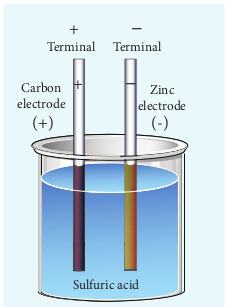

Terminal Terminal

Carbon electrode

Zinc electrode

(+)

Sulfuric acid

+

+

–

–

(-)  

move a certain amount of charge around the circuit. It is denoted by the symbol ε. An ideal battery has zero internal resistance and the potential difference (terminal voltage) across the battery equals to its emf. In reality, the battery is made of electrodes and electrolyte, there is resistance to the flow of charges within the battery. This resistance is called internal resistance _r_. For a real battery, the terminal voltage is not equal to the emf of the battery. A freshly prepared cell has low internal resistance and it increases with ageing.

### Determination of internal resistance

The circuit connections are made as shown in Figure 2.20.

The emf of cell ε is measured by connecting a high resistance voltmeter across it without connecting the external resistance _R_ as shown in Figure 2.20(a). Since the voltmeter draws very little current for deflection, the circuit may be considered as open. Hence the voltmeter reading gives the emf of the cell. Then, external resistance _R_ is included in the circuit and current _I_ is established in the circuit. The potential difference across

  

R is equal to the potential difference across the cell (V) as shown in Figure 2.20(b).

The potential drop across the resistor _R_ is

_V = IR_ (2.35)

Due to internal resistance _r_ of the cell, the voltmeter reads a value _V_, which is less than the emf of cell _ε_. It is because, certain amount of voltage (_Ir_) has dropped across the internal resistance _r_.

Then _V_ = ε – _Ir_

_Ir_ = _ε_ – _V_ (2.36)

Dividing equation (2.36) by equation (2.35), we get

_Ir IR_

_V V_

\= −ε

_r V V_

_R_\= −

  



  

ε (2.37)

\+ – _r_

_V+ –_

ε

\+ – _r_

_\+ –_

ε

_V_

Voltmeter

_R_

_V_

_I_

(a)

(b)  

Since ε, _V_ and _R_ are known, internal resistance _r_ can be determined. We can also find the total current that flows in the circuit.

Due to this internal resistance, the power delivered to the circuit is not equal to power rating mentioned in the battery. For a battery of emf _ε_, with an internal resistance _r_, the power delivered to the circuit of resistance _R_ is given by

_P_ = _Iε_ = _I_ (_V_ + _Ir_) (from equation 2.36)

Here _V_ is the voltage drop across the resistance _R_ and it is equal to _IR_.

Therefore, _P_ = _I_ (_IR_ +_Ir_)

_P_ = _I_2 _R_ + _I_2 _r_ (2.38)

Here _I_ 2_r_ is the power delivered to the internal resistance and _I_ 2_R_ is the power delivered to the electrical device (here it is the resistance _R_). For a good battery, the internal resistance _r_ is very small, then _I_ 2_r_ << _I_ 2_R_ and almost entire power is delivered to the external resistance.

**EXAMPLE 2.17**

A battery has an emf of 12 V and connected to a resistor of 3 Ω. The current in the circuit is 3.93 A. Calculate (a) terminal voltage and the internal resistance of the battery (b) power delivered by the battery and power delivered to the resistor

**_Solution_**

The given values _I_ = 3.93 A, _ε_ = 12 V, _R_ = 3 Ω

(a) The terminal voltage of the battery is equal to voltage drop across the resistor

_V_ = _IR_ = 3.93 × 3 = 11.79 V

  

The internal resistance of the battery,

_r V V_

_R_\= −

  



   =

−

  



   × =

ε 12 11 79 11 79

3 0 05. .

. Ω

(b) The power delivered by the battery _P_ = _Iε_ = 3.93 × 12 = 47.1 W

The power delivered to the resistor = _I_ 2_R_ = 46.3 W

The remaining power _P_ = (47.1 – 46.3) = 0.8 W is delivered to the internal resistance and cannot be used to do useful work. (It is equal to _I_ 2_r_).

### Cells in series

Several cells can be connected to form a battery. In series connection, the negative terminal of one cell is connected to the positive terminal of the second cell, the negative terminal of second cell is connected to the positive terminal of the third cell and so on. The free positive terminal of the first cell and the free negative terminal of the last cell become the terminals of the battery.

Suppose _n_ cells, each of emf ε volts and internal resistance _r_ ohms are connected in series with an external resistance _R_ as shown in Figure 2.21

Cella in series (Schematic diagram)

_I_

_R_

–+ ε ε ε ε  

The total emf of the battery = _n_ε The total resistance in the circuit = _nr_ + _R_

By Ohm’s law, the current in the circuit is

_I n nr R_

\= = +

total emf total resistance

ε (2.39)

Case (a) If _r_ << _R_, then,

_I n R_

_nI_\= ≈ ε

1 (2.40)

where, _I_1 is the current due to a single cell

_I R_1 =



 



 

ε

Thus, if _r_ is negligible when compared to _R_ the current supplied by the battery is _n_ times that supplied by a single cell.

Case (b) If _r_\>>_R_, _I n nr r_

\= ≈ ε ε (2.41)

It is the current due to a single cell. That is, current due to the whole battery is the same as that due to a single cell and hence there is no advantage in connecting several cells.

Thus series connection of cells is advantageous only when the effective internal resistance of the cells is negligibly small compared with _R_.

**EXAMPLE 2.18**

From the given circuit,

_I_

R = 10Ω

\-+ _9V 9V 9V 9V_

0.1Ω 0.1Ω 0.1Ω 0.1Ω

| The internal resistance of the batter y,  ε −V  12 −11.79 r =   R =  ×=30 .05 Ω V   11.79 (b) The power delivered by the batter y P= Iε = 3.93 × 12 = 47.1 W The p ower de livered t o t he r esistor =  I R= 46.3 WThe r emaining p ower  P = (47.1 – 46.3) = 20.8 W is delivered to the internal resistance and cannot be used to do useful work. (It is equal to I r). 2 |
|------|

  

Find

i) Equivalent emf of the combination ii) Equivalent internal resistance iii) Total current iv) Potential difference across external

resistance v) Potential difference across each cell

**_Solution_**

i) Equivalent emf of the combination _εeq_ = _nε_ = 4 × 9 = 36 V

ii) Equivalent internal resistance _req_ = _nr_ = 4 × 0.1 = 0.4 Ω

iii) Total current _I n R nr_

\= +

ε

\= ×

\+ ×( ) 4 9

10 4 0 1.

\= × +

4 9 10 0 4.

\= 36 10 4.

_I_ = 3.46 A iv) Potential difference across external

resistance _V_ = _IR_ = 3.46 × 10 = 34.6 V. The remaining 1.4 V is dropped across the internal resistances of cells.

v) Potential difference across each cell _V n_

\= = 34 6

4 8 65. . V

### Cells in parallel

In parallel connection all the positive terminals of the cells are connected to one point and all the negative terminals to a second point. These two points form the positive and negative terminals of the battery.

Let _n_ cells be connected in parallel between the points A and B and a resistance _R_ is connected between the points A and B as shown in Figure 2.22. Let _ε_ be the emf and _r_ the internal resistance of each cell.  

The equivalent internal resistance of the

battery is 1 1 1 1 _r r r r_

_n n req_

\= + + =.... ( ) .terms So

_r r neq_ \= and the total resistance in the circuit

\= _R r n_

\+ . The total emf is the potential

difference between the points A and B, which is equal to ε. The current in the circuit is given by

_I r n_

_R_ \= +

ε

_I n r nR_

\= +

ε (2.42)

**Case (a)** If _r_ >> _R_, _I n r_

_nI_\= = ε

1 (2.43)

where _I_1 is the current due to a single cell ε _r_ 

  

  when _R_ is negligible. Thus, the current

through the external resistance due to the whole battery is _n_ times the current due to a single cell.

**Case (b)** If _r_<<_R_, _I_ = ε _R_

(2.44)

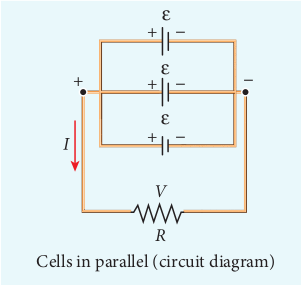

_V_

_I_

+

\+ –

\+ –

\+ –

–

\-

Cells in parallel (circuit diagram)

Cells in parallel (schematic diagram)

ε

ε

ε

_R_

| I =r+nnI =rn+Case (a) |
|------|

  

The above equation implies that current due to the whole battery is the same as that due to a single cell. Hence it is advantageous to connect cells in parallel when the external resistance is very small compared to the internal resistance of the cells.

When the car engine is started with headlights turned on, they sometimes

become dim. This is due to the internal resistance of the car battery.

**EXAMPLE 2.19**

For the given circuit I

5V

5V

5V

5V

0.5 Ω

0.5 Ω

0.5 Ω

0.5 Ω

R = 10 Ω

Find i) Equivalent emf ii) Equivalent internal resistance iii) Total current (I) iv) Potential difference across each cell v) Current from each cell

**_Solution_** i) Equivalent emf ε_eq_ = 5 V ii) Equivalent internal resistance,

R_eq_ = _r n_

\= = 0 5 4

0 125. . Ω  

iii) total current, _I R r_

_n_ \= +

ε

_I_ \= +

\= 5

10 0 125 5

10 125. .

I ≈ 0.5 A

iv) Potential difference across each cell

V = IR = 0.5 × 10 = 5 V

v) Current from each cell, ′ =_I I n_

′ = =_I_ 0 5 4

0 125. . A

## KIRCHHOFF’S RULES

Ohm’s law is useful only for simple circuits. For more complex circuits, Kirchhoff ’s rules can be used to find current and voltage. There are two generalized rules: i) Kirchhoff ’s current rule ii) Kirchhoff ’s voltage rule.

### Kirchhoff’s first rule (Current rule or Junction rule)

**It states that the algebraic sum of the currents at any junction of a circuit is zero**. It is a statement of law of conservation of electric charge. The charges that enter a given junction in a circuit must leave that junction since charge cannot build up or disappear at a junction. By convention, current entering the junction is taken as positive and current leaving the junction is taken as negative.

| iii) total current, εI =R + rn5 5I = =I ≈ 0.5 A10 + 0..125 10 125iv) Potential dif ference acr oss e ach ce ll V = IR = 0.5 × 10 = 5 Vv) Current from each cell,  II ′ =n05.I ′ == 0.A1254 |
|------|

  

**Figure 2.23 Kirchhoff** ’s current rule

_I1 I2_

_I3_

_I4I5_

A

Applying this law to the junction A in Figure 2.23

_I1 + I2 – I3 – I4 – I5_ = 0 (or)

_I1 + I2 = I3 + I4 + I5_

**EXAMPLE 2.20**

For the given circuit find the value of _I_.

_I_

0.4A

P 0.6A 0.5A

0.7A

0.2A

**_Solution_**

Applying Kirchhoff ’s rule to the point P in the circuit,

The arrows pointing towards P are positive and away from P are negative. Therefore, 0.2A – 0.4A + 0.6A – 0.5A + 0.7A – _I_ = 0 1.5A – 0.9A – _I_ = 0 0.6A – _I_ = 0 _I_ = 0.6 A  

### Kirchhoff’s Second rule (Voltage rule or Loop rule)

**It states that in a closed circuit the algebraic sum of the products of the current and resistance of each part of the circuit is equal to the total emf included in the circuit**. This rule follows from the law of conservation of energy for an isolated system (The energy supplied by the emf sources is equal to the sum of the energy delivered to all resistors). The product of current and resistance is taken as positive when the direction of the current is followed. Suppose if the direction of current is opposite to the direction of the loop, then product of current and voltage across the resistor is negative. It is shown in Figure 2.24 (a) and (b). The emf is considered positive when proceeding from the negative to the positive terminal of the cell. It is shown in Figure 2.24 (c) and (d).

**Figure 2.24 Kirchhoff voltage rule**

_V = –_ε

Going from a to b

_a b V = +IR_

_R_

_R_

_a b_

Going from b to a

(d)

(a)

_I_

_I_

Going from b to a

_a bV = -IR_(b)

ε

_a b V = +_ε

Going from a to b

+-

+-

(c)

ε

| I1 |
|------|------|------|------|
| II2 |
| AII45 |

|------|------|------|
| P |

| Going from a to bRIab(a) V = +IR |
|------|
| Going from b to aI Rab(b) V = -IR |
| -+Going fromε  a to bεab(c) V = + |
| -+Going fromε  b to aab ε(d) V = – |
  

Kirchhoff voltage rule has to be applied only when all currents in the circuit reach a steady state condition (the current in various branches are constant).

**EXAMPLE 2.21**

The following figure shows a complex network of conductors which can be divided into two closed loops like EACE and ABCA. Apply Kirchhoff ’s voltage rule (KVR),

_I1_

_I2_

_I3_

_I5I4_

_R1 R3_

_R2_ R5_R4_

A

E

B

C

\+ - ε

**_Solution_** Thus applying Kirchhoff ’s second law to the closed loop EACE

_I_1_R_1 + _I_2_R_2 + _I_3_R_3 = ε

and for the closed loop ABCA _I_4_R_4 + _I_5_R_5-_I_2_R_2= 0

**EXAMPLE 2.22**

Calculate the current that flows in the 1 Ω resistor in the following circuit.

BE

D

A

CF

2Ω

3Ω

1Ω

3Ω

6V

9V  

**_Solution_**

BE

D

A

CF

6V

9V

_I1_

_I1_

_I1_

\- _I2 I2_

2Ω

3Ω3Ω

1Ω

We can denote the current that flows from 9V battery as _I1_ and it splits up into _I2_ and (_I1_ – _I2_) at the junction E according Kirchhoff ’s current rule (KCR).

Now consider the loop EFCBE and apply KVR, we get

1_I2_ + 3_I1_ + 2_I1_ = 9

5_I1_ + _I2_ = 9 (1)

Applying KVR to the loop EADFE, we get

3 (_I1_ – _I2_ ) – 1_I2_ = 6

3_I1_ – 4_I2_ = 6 (2)

Solving equation (1) and (2), we get

_I1_ = 1.83 A and _I2_ = –0.13 A

It implies that the current in the 1 ohm resistor flows from F to E.

### Wheatstone’s bridge

An important application of Kirchhoff ’s rules is the Wheatstone’s bridge. It is used to compare resistances and in determining the unknown resistance in electrical network. The bridge consists of four resistances _P, Q, R_ and _S_ connected as shown in Figure 2.25. _A_ galvanometer _G_ is connected between the points _B_ and _D_. The battery is connected between the points _A_ and _C_. The current

| SolutionA E BI - I 2I I6V Ω11 2Ω2 9V 13 3D Ω F I Ω CWe can denote t he c urrent t hat f lows f rom 9V b atter y a s  I  a nd i t s p 1 lits u p in to  I  an d(I  –  I ) a t t he j unction E acco rding Kirchhoff ’s current rule (KCR). Now co nsider t 1 he lo op EFCB E a nd a 2 pply KVR1 , we g2 et1I  + 3I  + 2I  = 95I  + I  = 9 (1)Applying KVR to the loop EADFE, we get2 1 13 (I  – I  ) – 1I  = 61 23I  – 4I  = 6 (2)Solving equation (1) and (2), we get1 2 2I  = 1.83 A and I  = –0.13 A 1 2It im plies t hat t he c urrent in t he 1 o hm resistor flows from F to E.1 2 |
|------|

  

through the galvanometer is _IG_ and its resistance is _G_.

Applying Kirchhoff ’s current rule to junction _B_ and _D_ respectively.

_I_1 – _I_G – _I_3 = 0 (2.45)

_I_2 + _I_G – _I_4 = 0 (2.46)

Applying Kirchhoff ’s voltage rule to loop _ABDA_,

_I_1_P_ + _I_G_G_ – _I_2_R_ = 0 (2.47)

Applying Kirchhoff ’s voltage rule to loop _ABCDA_,

_I_1_P_ + _I_3_Q_ – _I_4_S_ – _I_2_R_ = 0 (2.48)

When the points _B_ and _D_ are at the same potential, the bridge is said to be balanced. As there is no potential difference between _B_ and _D_, no current flows through galvanometer (_IG_ = 0). Substituting _I_G = 0 in equation (2.45), (2.46) and (2.47), we get

_I_1= _I_3 (2.49)

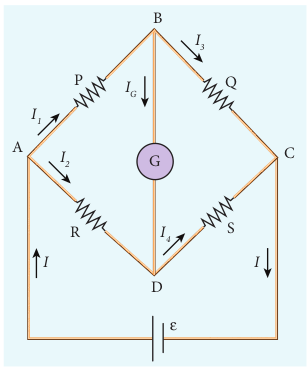

B

D

C

_I1_

_I3_

_I_

_I4_

_I2_

_IG_

G A

R

QP

S

ε

_I_  

_I_2 = _I_4 (2.50)

_I_1_P_ = _I_2_R_ (2.51)

Using equation (2.51) in equation (2.48)

_I_3_Q_ = _I_4_S_ (2.52)

Dividing equation (2.52) by equation (2.51), we get

_P Q_

_R S_

\= (2.53)

This is the condition for bridge balance. Only under this condition, galvanometer shows null deflection. Suppose we know the values of two adjacent resistances, the other two resistances can be compared. If three of the resistances are known, the value of unknown resistance (fourth one) can be determined.

A galvanometer is an instrument used for detecting and measuring even very small electric currents. It is extensively useful to compare the potential difference between various parts of the circuit.

**EXAMPLE 2.23**

In a Wheatstone’s bridge _P_ = 100 Ω, _Q_ = 1000 Ω and _R_ = 40 Ω. If the galvanometer shows zero deflection, determine the value of _S_.

  

**_Solution_**

_P Q_

_R S_

\=

_S Q P_

_R_\= ×

_S_\= × 1000 100

40 S = 400 Ω

**EXAMPLE 2.24**

What is the value of _x_ when the Wheatstone’s network is balanced?

_P_ = 500 Ω, _Q_ = 800 Ω, _R_ = _x_ + 400, _S_ = 1000 Ω

G

ε

500Ω 800Ω

400Ω 1000Ω

_P_

_R S_

_Q_

_x_

**_Solution_** _P Q_

_R S_

\= , when the network is balanced

500 800

400 1000

\= +_x_

_x_\+ = ×400 5 8

1000

_x_ + 400 = 625

_x_ = 625 – 400 _x_ = 225 Ω  

### Meter bridge

The meter bridge is another form of Wheatstone’s bridge. It consists of a uniform wire of manganin AB of one meter length. This wire is stretched along a metre scale on a wooden board between two copper strips C and D. Between these two copper strips another copper strip E is mounted to enclose two gaps G1 and G2 as shown in Figure 2.26.

An unknown resistance _P_ is connected in G1 and a standard resistance _Q_ is connected in G2. A jockey (conducting wire-contact maker) is connected to the terminal E on the central copper strip through a galvanometer (G) and a high resistance (HR). The exact position of jockey on the wire can be read on the scale. A Lechlanche cell and a key (K) are connected between the ends of the bridge wire.

(

**G HR**

G2G1

_l_2_l_1

J A

C D

B

E

Metre Scale

K

P Q

) ε

The position of the jockey on the wire is adjusted so that the galvanometer shows zero deflection. Let the position of jockey at the wire be at J. The resistances corresponding to AJ and JB of the bridge wire form the resistances _R_ and _S_ of the Wheatstone’s bridge. Then for the bridge balance

_P Q_

_R S_

_r r_

\= = . . AJ JB

(2.54)

| P R=Q SQS =×P1000S =×100 |
|------|

| SolutionP R=Q SQS =× RP1000   S = 400 ΩS =× 40100 |
|------|

| R |
|------|------|

| P R , w=Q S500 x=800x +=400x + 400 = 625x = 625 – 400x = 225 Ω |
|------|

| EXAMPLE 2 . 2 4What is the value of x when the Wheatstone’s network is balanced?P = 500 Ω, Q = 800 Ω, R = x + 400, S = 1000 Ω500 800Ω P Q ΩGRx S1000400 ΩΩεSolutionP R , when the network is balanced=Q S500 x + 400=800 10005x +=400 ×1000x + 400 = 6258x = 625 – 400x = 225 Ω |
|------|

  

where _r_ is the resistance per unit length of wire.

_P Q_

_l l_

\= = AJ JB

1

2

(2.55)

_P Q l l_

\= 1

2

(2.56)

The bridge wire is soldered at the ends of the copper strips. Due to imperfect contact, some resistance might be introduced at the contact. These are called end resistances. This error can be eliminated, if another set of readings is taken with _P_ and _Q_ interchanged and the average value of _P_ is found.

To find the specific resistance of the material of the wire in the coil P, the radius _a_ and length _l_ of the wire are measured. The specific resistance or resistivity _ρ_ can be calculated using the relation.

Resistance = ρ _l A_

By rearranging the above equation, we get

ρ= ×Resistance _A l_

(2.57)

If _P_ is the unknown resistance equation (2.57) becomes,

ρ π = _P a_

_l_

2

**EXAMPLE 2.25**

In a meter bridge experiment with a standard resistance of 15 Ω in the right gap, the ratio of balancing length is 3:2. Find the value of the other resistance.

**_Solution_**

_Q_ = 15 Ω, _l1:l2_ = 3:2

_l l_ 1

2

3 2

\=  

_P Q_

_l l_

\= 1

2

_P = Q l l_ 1

2

_P_ = 15 × 3 2

\= 22.5 Ω

**EXAMPLE 2.26**

In a meter bridge experiment, the value of resistance in the resistance box connected in the right gap is 10 Ω. The balancing length is _l_1 = 55 cm. Find the value of unknown resistance.

**_Solution_**

_Q_ = 10 Ω _P Q_

_l l_

_l l_

\= − =1

1

1

2100

_P Q l_

_l_ \= ×

− 1

1100

_P_ \= × −

10 55 100 55

_P_ \= 550 45

\= 12.2 Ω

### Potentiometer

Potentiometer is used for the accurate measurement of potential differences, current and resistances. It consists of ten meter long uniform wire of manganin or constantan stretched in parallel rows each of 1 meter length, on a wooden board. The two free ends A and B are brought to the same side and fixed to copper strips with binding screws. A meter scale is fixed parallel to the wire. A jockey is provided for making contact.

The principle of the potentiometer is illustrated in Figure 2.27. A steady current is maintained across the wire CD by a battery _Bt_.

| P l=Q lP = Q 1 lP = 15 × 2 |l3   = 22.5 Ω1 22 |
|------|------|------|------|

| P=Q 100PQ=×10P =100550P =45 |
|------|

| EXAMPLE 2 . 2 6In a m eter b ridge exp eriment, t he va lue o f resistance  in  the  resistance  box co nnected in t he r ight ga p  is 10 Ω. Th e  balancing length i s  l  = 55 cm. Fin d t he va lue o f unknown resistance.Solution1Q = 10 ΩP l l= =Q 100 −l llPQ=×1001 −l 110×551 2P =100 −55 1550  = 12.2 Ω1P =45 |
|------|

  

The battery, key and the potentiometer wire connected in series form the primary circuit. The positive terminal of a primary cell of emf ε is connected to the point C and negative terminal is connected to the jockey through a galvanometer G and a high resistance HR. This forms the secondary circuit.

( )

J

K

C D _l_

**G HR** ε

_Bt_

Let the contact be made at any point J on the wire by jockey. If the potential difference across CJ is equal to the emf of the cell ε, then no current will flow through the galvanometer and it will show zero deflection. CJ is the balancing length _l_. The potential difference across CJ is equal to _Irl_ where _I_ is the current flowing through the wire and _r_ is the resistance per unit length of the wire.

Hence ε = _Irl_ (2.58)

Since _I_ and _r_ are constants, ε ∝ _l_. The emf of the cell is directly proportional to the balancing length.

### Comparison of emf of two cells with a potentiometer

To compare the emf of two cells, the circuit connections are made as shown in Figure 2.28. Potentiometer wire CD is connected to a battery _Bt_ and a key K in  

series. This is the primary circuit. The end C of the wire is connected to the terminal M of a DPDT (Double Pole Double Throw) switch and the other terminal N is connected to a jockey through a galvanometer G and a high resistance HR. The cells whose emf ε1 and ε2 to be compared are connected to the terminals M1,N1 and M2,N2 of the DPDT switch. The positive terminals of _Bt_, ε1 and ε2 should be connected to the same end C.

( )

J

KBt

C D

M1 N1

N2M2

M N

Rh

**G HR**

ε1

ε2

The DPDT switch is pressed towards M1, N1 so that cell ε1 is included in the secondary circuit and the balancing length _l_1 is found by adjusting the jockey for zero deflection. Then the second cell ε2 is included in the circuit and the balancing length _l_2 is determined. Let _r_ be the resistance per unit length of the potentiometer wire and _I_ be the current flowing through the wire.

we have ε1 = _Irl_1 (2.59)

ε2 = _Irl_2 (2.60)

By dividing equation (2.59) by (2.60) ε ε

1

2

1

2

\= _l l_

(2.61)

  

By including a rheostat (Rh) in the primary circuit, the experiment can be repeated several times by changing the current flowing through it.

### Measurement of internal resistance of a cell by potentiometer

To measure the internal resistance of a cell, the circuit connections are made as shown in Figure 2.29. The end C of the potentiometer wire is connected to the positive terminal of the battery Bt and the negative terminal of the battery is connected to the end D through a key K1. This forms the primary circuit.

( )

J

K1

K2

Bt

C

R

D

( )

**HRG** ε

The positive terminal of the cell of emf ε whose internal resistance is to be determined is also connected to the end C of the wire. The negative terminal of the cell ε is connected to a jockey through a galvanometer and a high resistance. A resistance box R and key K2 are connected across the cell ε. With K2 open, the balancing point J is obtained and the balancing length CJ = _l_1 is measured. Since the cell is in open circuit, its emf is

ε ∝ _l_1 (2.62)  

A suitable resistance (say, 10 Ω) is included in the resistance box and key K2 is closed. Let r be the internal resistance of the cell. The current passing through the cell and the resistance R is given by

_I R r_

\= + ε

The potential difference across R is

_V R R r_

\= + ε

When this potential difference is balanced on the potentiometer wire, let _l_2 be the balancing length.

Then ε_R R r_

_l_ +

∝ 2 (2.63)

From equations (2.62) and (2.63) _R r_

_R l l_

\+ = 1

2

(2.64)

1

1

1

2

1

2

\+ =

\= − 

  



  

_r R_

_l l_

_r R l l_

;

∴ _r_ = _R_ _l l l_

1 2

2

−

 



  (2.65)

Substituting the values of the _R_, _l_1 and _l_2, the internal resistance of the cell is determined. The experiment can be repeated for different values of _R_. It is found that the internal resistance of the cell is not constant but increases with increase of external resistance connected across its terminals.

## HEATING EFFECT OF ELECTRIC CURRENT

**When current flows through a resistor, some of the electrical energy delivered to the resistor is converted into heat energy and it is dissipated. This heating effect of**

  

(a)

**current is known as Joule’s heating effect.** Just as current produces thermal energy, thermal energy may also be suitably used to produce an electromotive force. This is known as thermoelectric effect.

### Joule’s law

If a current _I_ flows through a conductor kept across a potential difference _V_ for a time _t_, the work done or the electric potential energy spent is

_W_ = _VIt_ (2.66)

In the absence of any other external effect, this energy is spent in heating the conductor. The amount of heat(_H_) produced is

_H_ = _VIt_ (2.67)

For a resistance _R_,

_H_ = _I_2_Rt_ (2.68)

This relation was experimentally verified by Joule and is known as Joule’s law of heating. It states that **the heat developed in an electrical circuit due to the flow of current varies directly as (i) the square of the current (ii) the resistance of the circuit and (iii) the time of flow.**

**EXAMPLE 2.27**

Find the heat energy produced in a resistance of 10 Ω when 5 A current flows through it for 5 minutes.

**_Solution_** _R_ = 10 Ω, _I_ = 5 A, _t_ = 5 minutes = 5 × 60 s _H_ = _I_ 2_Rt_ \= 52 × 10 × 5 × 60 = 25 × 10 × 300 = 25 × 3000 = 75000 J (or) 75 kJ  

### Application of Joule’s heating effect

**1\. Electric heaters** Electric iron, electric heater, electric

toaster shown in Figure 2.30 are some of the home appliances that utilize the heating effect of current. In these appliances, the heating elements are made of nichrome, an alloy of nickel and chromium. Nichrome has a high specific resistance and can be heated to very high temperatures without oxidation.

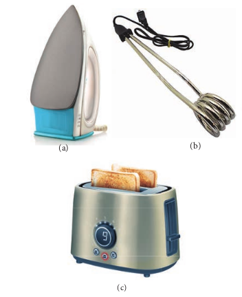

(b) (c)

(a) (b) (c)

**EXAMPLE 2.28**

An electric heater of resistance 10 Ω connected to 220 V power supply is immersed in the water of 1 kg. How long the electrical heater has to be switched on to increase its temperature from 30°C to 60°C. (Specific heat capacity of water is s = 4200 J kg–1 K–1)

  

**_Solution_**

According to Joule’s heating law _H = I 2Rt_

The current passed through the electrical

heater = 220 10

22V A Ω

\=

Heat produced in one second by the electrical heater _H = I2R_

Heat produced in one second _H_ = (22)2 × 10 = 4840 J = 4.84 k J. In fact the power rating of this electrical heater is 4.84 k W.

The amount of heat energy to increase the temperature of 1kg water from 30°C to 60°C is

_Q = ms ∆T_ (Refer XI physics vol 2, unit 8)

Here _m_ = 1 kg, _s_ = 4200 J kg–1 K–1, ∆_T_ = 30 K,

so _Q_ = 1 × 4200 × 30 = 126 kJ

The time required to produce this heat

energy _t Q I R_

\= = ×

≈2

3126 10 4840

26 03. s

**2\. Electric fuses** Fuses as shown in Figure 2.31, are

connected in series in a circuit to protect the electric devices from the heat developed by the passage of excessive current. It is a short length of a wire made of a low melting point material. It melts and breaks the circuit if current exceeds a certain value. An alloy of lead - tin is used for fuses when current rating is below 15 A and when current rating is above 15 A, copper fuse wires are used.

The only disadvantage with the above fuses is that once fuse wire is burnt due to excessive current, they need to be replaced. Nowadays in houses, circuit breakers

Contacts

Base

Fuse  

(trippers) are also used instead of fuses. Whenever there is an excessive current produced due to faulty wire connection, the circuit breaker switch opens. After repairing the faulty connection, we can close the circuit breaker switch. It is shown in the Figure 2.32.

**3\. Electric furnace** Furnaces as shown in Figure 2.33 are

used to manufacture a large number of technologically important materials such as steel, silicon carbide, quartz, gallium arsenide, etc. To produce temperatures up to 1500°C, molybdenum-nichrome wire wound on a silica tube is used. Carbon arc furnaces produce temperatures up to 3000°C.

Fuse carrier

wire

Contacts

Base Fuse carrier

Fuse wire

  

Ice - cubes

Cu

G

Fe

(a)

**4\. Electrical lamp** It consists of a tungsten filament (melting point 33800C) kept inside a glass bulb and heated to incandescence by current. In incandescent electric lamps only about 5% of electrical energy is converted into light and the rest is wasted as heat. Electric discharge lamps, electric welding and electric arc also utilize the heating effect of current as shown in Figure 2.34.

Tungsten lament

## THERMOELECTRIC EFFECT

**Conversion of temperature differences into electrical voltage and vice versa is known as thermoelectric effect.** A thermoelectric device generates voltage when there is a temperature difference on each side. If a voltage is applied, it generates a temperature difference.  

### Seebeck effect

**Seebeck discovered that in a closed circuit consisting of two dissimilar metals, when the junctions are maintained at different temperatures an emf (potential difference) is developed. The current that flows due to the emf developed is called thermoelectric current. The two dissimilar metals connected to form two junctions is known as thermocouple** (Figure 2.35).

**Figure 2.35 Seebeck effect (Thermocouple)**

Water COLD

Junction 1 Junction 2

V

Metal A

Metal B

(b)

HOT

Ice - cubes

Cu

G

Fe Water COLD

Junction 1 Ju

V

Metal A

Metal B

(a) (b)

If the hot and cold junctions are interchanged, the direction of current also reverses. Hence the effect is reversible.

The magnitude of the emf developed in a thermocouple depends on (i) the nature of the metals forming the couple and (ii) the temperature difference between the junctions.

**Applications of Seebeck effect** 1\. Seebeck effect is used in

thermoelectric generators (Seebeck generators).These thermoelectric generators are used in power plants to convert waste heat into electricity.

  

2\. This effect is utilized in automobiles as automotive thermoelectric generators for increasing fuel efficiency.

3\. Seebeck effect is used in thermocouples and thermopiles to measure the temperature difference between the two objects.

### Peltier effect

In 1834, Peltier discovered that **when an electric current is passed through a circuit of a thermocouple, heat is evolved at one junction and** **absorbed at the other junction. This is known as Peltier effect.**

**Figure 2.36 Peltier effect: Cu – Fe** thermocouple

B

\+ -

Cold Junction

Fe

Hot Junction

Hot Junction

(a) (b)

A B

Cu +-

Fe

A B

Cu + -

Cold Junction

Fe

Hot Junction

Hot Junction

(a)

A

C

In the Cu-Fe thermocouple the junctions A and B are maintained at the same temperature. Let a current from a battery flow through the thermocouple (Figure 2.36 (a)). At the junction A, where the current flows from Cu to Fe, heat is absorbed and the junction A becomes cold. At the junction B, where the current flows from Fe to Cu heat is liberated and it becomes hot. When the direction of current is reversed, junction A  

gets heated and junction B gets cooled as shown in the Figure 2.36(b). Hence Peltier effect is reversible.

### Thomson effect

Thomson showed that **if two points in a conductor are at different temperatures, the density of electrons at these points will differ and as a result the potential difference is created between these points. Thomson effect is also reversible.**

**Figure 2.37 (a) Positive Thomson effect** (b) Negative Thomson effect

Heat evolved

Heat evolved

Heat absorbed

Heat absorbed

BA C

Copper bar

(a) Positive thomson eect (b) Negative thomson eect

A M N B Po

te nt

ia l

BA C

Iron bar A M N B

Po te

nt ia

l

_I I_

If current is passed through a copper bar AB which is heated at the middle point C, the point C will be at higher potential. This indicates that the heat is absorbed along AC and evolved along CB of the conductor as shown in Figure 2.37(a). Thus heat is transferred due to the current flow in the direction of the current. It is called positive Thomson effect. Similar effect is observed in metals like silver, zinc, and cadmium.

When the copper bar is replaced by an iron bar, heat is evolved along CA and absorbed along BC. Thus heat is transferred due to the current flow in the direction opposite to the direction of current. It is called negative Thomson effect as shown in the Figure 2.37(b). Similar effect is observed in metals like platinum, nickel, cobalt, and mercury.

Cold Junction

(b)

B

u +-

Fe

| Po HeatevolvedI AC |HeatabsorbedB |

| ialtentPoI AC |Heatabsorbed |Heatevolved |
|------|------|------|------|------|
| B |
  

„ The current, I flowing in a conductor I

through a cross-section in a time inter

1A = 1 C s–1. „ The current density J in a conductor is th „ Current is a scalar but current density is a „ The general form of Ohm’s law

 

_J E_\= σ

„ Practical form of Ohm’s law states that _V_ is the resistance, V potential difference be

„ The resistance R of a conductor is R _V I_

\= .

1 Ω = 1 1 _V A_

„ The resistance of a conductor R _l A_

\= ρ wh area of cross section.

„ The resistivity of a material determines h current.

„ The equivalent resistance (RS) of several series is _RS_ = (_R1+R2 +R3_……..)

„ The equivalent resistance (RP) of several

parallel is 1 1 1 1

1 2 3_R R R RP_

\= + + + ......

„ Kirchhoff ’s first rule (Current rule or junc at any junction is zero.

„ Kirchhoff ’s second rule (Voltage rule or sum of the products of the current and re to the total emf included in the circuit.

„ Electric power is the rate at which electri „ If a current I flows across a potential diffe

is _P = IV_. „ In a resistor R, the electrical power conve

„ The energy equivalent of one kilowatt-ho „ Metre bridge is one form of Wheatstone’s „ Potentiometer is used to compare emf of „ Joule’s law of heating is _H = VIt_ (or) _H =_

**S U M M A R Y**  

_dQ dt_

\= ,where dQ is the charge that flows

val dt. SI unit of current is ampere (A).

e current flowing per unit area. J _I A_

\= 

 



  vector.

∝ _I_, or _V = IR_ where _I_ is the current and _R_ tween ends of the conductor.

SI unit of resistance is ohm (Ω) and

ere _l_ is length of the conductor and _A_ is its

ow much resistance it offers to the flow of

resistances (_R1, R2, R3_……..) connected in

resistances (_R1, R2, R3_……..) connected in

tion rule): The algebraic sum of the currents

loop rule): In a closed circuit the algebraic sistance of each part of the circuit is equal

c energy is delivered. rence _V_, the power delivered to the circuit

rted to heat is _P = I2R_ \=_V R_

2

ur (kWh) is 1kWh = 3.6 X 106 J. network. cells. _I2Rt._

  

**CURRENT ELECTRICIT**

**Flow of Char**

**Dri velocity**

**Resistance**

**Ohm’s Law V-I Grap**

**Carbon resistor Com**

**Temperature coecient of re**

**Kircho rule**

**Current rule**

**Voltage rule**

**Heating eec**

**Joule’s law of heating**

**Applications**

**Seebe**

**Mobility**

**C O N C E P**  

**Y**

**ges**

**Current density**

**h Resistivity**

**bination Parallel**

**sistance**

**Wheatstone’s bridge Applications**

**ts of electric eurrent**

**ermoelectric eects**

**ck eect Peltier eect omson eect**

**Series**

**T M A P**

|------|

  

**I Multiple Choice Questions**

1\. The following graph shows current versus voltage values of some unknown conductor. What is the resistance of this conductor?

_V_

_I_

5

5

4

4

3

3

2

2

1

10

(a) 2 ohm (b) 4 ohm (c) 8 ohm (d)1 ohm

**2\.** A wire of resistance 2 ohms per meter is bent to form a circle of radius 1m. The equivalent resistance between its two diametrically opposite points, A and B as shown in the figure is

A B

(a) π Ω (c) π 2

Ω

(c) 2π Ω (d) π 4 Ω

**3\.** A toaster operating at 240 V has a resistance of 120 Ω. Its power is a) 400 W b) 2 W c) 480 W d) 240 W  

**EVALUATION**

**4\.** A carbon resistor of (47 ± 4.7 ) k Ω to be marked with rings of different colours for its identification. The colour code sequence will be a) Yellow – Green – Violet – Gold b) Yellow – Violet – Orange – Silver c) Violet – Yellow – Orange – Silver d) Green – Orange – Violet - Gold

**5\.** What is the value of resistance of the following resistor?

(a)100 k Ω (b)10 k Ω (c) 1k Ω (d)1000 k Ω

**6\.** Two wires of A and B with circular cross section are made up of the same material with equal lengths. Suppose _RA_ = 3 _RB_, then what is the ratio of radius of wire A to that of B? (a) 3 (b) 3

(c) 1 3

(d) 1 3

**7\.** A wire connected to a power supply of 230 V has power dissipation _P1_. Suppose the wire is cut into two equal pieces and connected parallel to the same power supply. In this case power dissipation is P2 . The ratio P

_P_ 2

1

is

(a)1 (b) 2

(c) 3 (d) 4

  

**8\.** In India electricity is supplied for domestic use at 220 V. It is supplied at 110 V in USA. If the resistance of a 60W bulb for use in India is _R_, the resistance of a 60W bulb for use in USA will be

(a) _R_ (b) 2_R_

(c) _R_ 4

(d) _R_ 2

**9\.** In a large building, there are 15 bulbs of 40 W, 5 bulbs of 100 W, 5 fans of 80 W and 1 heater of 1k W are connected. The voltage of electric mains is 220 V. The maximum capacity of the main fuse of the building will be (IIT-JEE 2014) (a) 14 A (b) 8 A (c) 10 A (d) 12 A

10\. There is a current of 1.0 A in the circuit shown below. What is the resistance of _P_ ?

2.5 

3

P

9_V_

a) 1.5 Ω b) 2.5 Ω c) 3.5 Ω d) 4.5 Ω

**11\.** What is the current drawn out from the battery?

15  15  15 5_V_  

a) 1A b) 2A c) 3A d) 4A

12\. The temperature coefficient of resistance of a wire is 0.00125 per °C. At 20°C, its resistance is 1 Ω. The resistance of the wire will be 2 Ω at a) 800 °C b) 700 °C c) 850 °C d) 820 °C

13\. The internal resistance of a 2.1 V cell which gives a current of 0.2 A through a resistance of 10 Ω is a) 0.2 Ω b) 0.5 Ω c) 0.8 Ω d) 1.0 Ω

**14\.** A piece of copper and another of germanium are cooled from room temperature to 80 K. The resistance of

a) each of them increases b) each of them decreases c) copper increases and germanium

decreases d) copper decreases and germanium

increases **15\.** In Joule’s heating law, when _R_ and _t_ are

constant, if the _H_ is taken along the _y_ axis and _I_2 along the x axis, the graph is a) straight line b) parabola c) circle d) ellipse

**Answers**

**1)** a **2)** a **3)** c **4)** b **5)** a **6)** c **7)** d **8)** c **9)** d **10)** c **11)** a **12)** d **13)** b **14)** d **15)** a

**II Short Answer Questions**

1\. Why current is a scalar? 2. Define current density. 3. Distinguish between drift velocity and

mobility.

  

4\. State microscopic form of Ohm’s law. 5. State macroscopic form of Ohm’s law. 6. What are ohmic and non ohmic

devices? 7. Define electrical resistivity. 8. Define temperature coefficient of

resistance. 9. Write a short note on superconductors? 10. What is electric power and electric

energy? 11. Derive the expression for power P=VI

in electrical circuit. 12. Write down the various forms of

expression for power in electrical circuit.

13\. State Kirchhoff ’s current rule. 14. State Kirchhoff ’s voltage rule. 15. State the principle of potentiometer. 16. What do you mean by internal

resistance of a cell? 17. State Joule’s law of heating. 18. What is Seebeck effect? 19. What is Thomson effect? 20. What is Peltier effect? 21. State the applications of Seebeck effect.

**III Long Answer Questions**

1\. Describe the microscopic model of current and obtain general form of Ohm’s law.

2\. Obtain the macroscopic form of Ohm’s law from its microscopic form and discuss its limitation.

3\. Explain the equivalent resistance of a series and parallel resistor network.

4\. Explain the determination of the internal resistance of a cell using voltmeter.  

5\. State and explain Kirchhoff ’s rules. 6. Obtain the condition for bridge balance

in Wheatstone’s bridge. 7. Explain the determination of unknown

resistance using meter bridge. 8. How the emf of two cells are compared

using potentiometer?

**IV Numerical problems**

1\. The following graphs represent the current versus voltage and voltage versus current for the six conductors A,B,C,D,E and F. Which conductor has least resistance and which has maximum resistance?

_V_

5

5

4

4

3

3

2

2

1

10

**A**

**B**

**C**

_I_

5

5

4

4

3

3

2

2

1

10

**D**

**E**

**F**

_I V_

Ans: Least: _RF_ = 0.4 Ω, maximum _RC_ = 2.5 Ω 2. Lightning is very good example of

natural current. In typical lightning, there is 109 J energy transfer across the potential difference of 5 × 107 V during a time interval of 0.2 s.

| C |B |
|------|------|
| A |

| F |E |
|------|------|
| D |
  

Using this information, estimate the following quantities (a) total amount of charge transferred between cloud and ground (b) the current in the lightning bolt (c) the power delivered in 0.2 s.

Ans: charge = 20 C, _I_ = 100 A, _P_ = 5 GW

3\. A copper wire of 10–6 m2 area of cross section, carries a current of 2 A. If the number of free electrons per cubic meter in the wire is 8 × 1028, calculate the current density and average drift velocity of electrons.

Ans: J = 2 × 106 Am−2 _v_d= 15.6 × 10−5 ms−1

4\. The resistance of a nichrome wire at 200C is 10 Ω. If its temperature coefficient of resistivity of nichrom is 0.004/0C, find the resistance of the wire at boiling point of water. Comment on the result.

Ans: _RT_\= 13.2 Ω. As the temperature increases the resistance of the wire also increases.

5\. The rod given in the figure is made up of two different materials.

70 cm25 cm

Both have square cross sections of 3 mm side. The resistivity of the first material is 4 × 10–3 Ωm and that of second material has resistivity of 5 × 10–3 Ωm. What is the resistance of rod between its ends?

Ans: 500 Ω

6\. Three identical lamps each having a resistance _R_ are connected to the battery of emf ε as shown in the figure.  

+- S

A B C

ε

Suddenly the switch S is closed. (a) Calculate the current in the circuit when S is open and closed (b) What happens to the intensities of the bulbs A,B and C. (c) Calculate the voltage across the three bulbs when S is open and closed (d) Calculate the power delivered to the circuit when S is opened and closed (e) Does the power delivered to the circuit decrease, increase or remain same?

Ans:

Electrical quantities

Switch S is open Switch S is closed

**a)** Current ε 3_R_

ε 2_R_

**b)** Voltage _V_

_V_

_V_

_A_

_B_

_C_

\=

\=

\=

ε

ε

ε

3

3

3

_V_

_V_

_V_

_A_

_B_

_C_

\=

\=

\=

ε

ε 2

2 0

**c)** Power _P_

_R_

_P R_

_R_

_A_

_B_

_C_

\=

\=

\=

ε

ε

ε

2

2

2

9

9

9 P

_P R_

_P R_

_A_

_B_

_C_

\=

\=

\=

ε

ε

2

2 4

4 0P

Total power increases **d)** Intensity All

the bulbs glow with

equal intensity

The intensities of the bulbs A and B

equally increase. Bulb C will not

glow since no current pass through it.

**e)** Increases

|------|------|------|

| Electrical quantities |Switch Sis open |Switch S is closed |
|------|------|------|
| a) Current |ε3R |ε2R |
| b) Voltage |εV =3εV =3A εV =3BC |εV =2εV =2VA = 0BC |
| c) Power |εP =9RεP =9R2A εP =9R2B2C |εP =4RεP =4R2PA = 02Total poBwer increasesC |
| d) Intensity |All the bulbs glow with equalintensity |The intensities of the bulbs A and B equally increase.Bulb C will not glow since no current pass through it. |
| e) Increases |
  

7\. An electronics hobbyist is building a radio which requires 150 Ω in her circuit. But she has only 220 Ω, 79 Ω and 92 Ω resistors available. How can she connect the available resistors to get the desired value of resistance?

Ans: Parallel combination of 220 Ω and 79 Ω in series with 92 Ω

8\. A cell supplies a current of 0.9 A through a 2 Ω resistor and a current of 0.3 A through a 7 Ω resistor. Calculate the internal resistance of the cell.

Ans: 0.5 Ω

9\. Calculate the currents in the following circuit.

_I_1

_I_1

_I_2

_I_2

_I_3 _R_3 15_V_

9_V_

100Ω 100Ω

100Ω

+

+

–

–

Ans : _I1_ = 0.070 A, _I2_ = -0.010 A and _I3_ = 0.080 A

10. A potentiometer wire has a length of 4 m and resistance of 20 Ω. It is connected in series with resistance of 2980 Ω and a cell of emf 4 V. Calculate the potential gradient along the wire.

Ans: Potential = 0.65 × 10–2 V m–1.

11\. Determine the current flowing through the galvanometer (G) as shown in the figure.  

2_A_ 2_A_P R

_I1 -Ig_

_I_2 + Ig

_I_1

_I_2

10 

10 

15 

5 

20 

_Ig_

G

Q

S

Ans: Ig = 1 11

A

12\. Two cells each of 5V are connected in series with a 8 Ω resistor and three parallel resistors of 4 Ω, 6 Ω and 12 Ω. Draw a circuit diagram for the above arrangement. Calculate i) the current drawn from the cells (ii) current through each resistor

Ans: i) Current through 8 Ω = 1A ii) The current through 4 Ω, _I_ \= =

2 4

0 5. A ,

the current through 6 Ω, _I_ \= = 2 6

0 33. A ,

the current through 12 Ω, _I_ \= = 2

12 0 17. A

13\. Four bulbs P, Q, R, S are connected in a circuit of unknown arrangement. When each bulb is removed one at a time and replaced, the following behavior is observed.

P Q R S

P removed \* on on on

Q removed on \* on off

R removed off off \* off

S removed on off on \*

Draw the circuit diagram for these bulbs.

| P |Q |R |S |
|------|------|------|------|------|
| P removed |* |on |on |on |
| Q removed |on |* |on |o |
| R removed |o |o |* |o |
| S removed |on |off |on |* |
  

Ans:

+

–

S

R



Q

P

**BOOKS FOR REFERENCE:**

1\. Douglas C.Giancoli, , “_Physics for Scienti_ Prentice Hall, Fourth edition.

2\. James Walker, _Physics_, Pearson- Addison W

3\. Tipler, Mosca, “_Physics for scientist and E_ Company, sixth edition.

4\. Purcell, Morin, _Electricity and magnetism_,

5\. Serway and Jewett, “_Physics for Scientist and_ publishers, eighth edition.

6\. Tarasov and Tarasova, “_Questions and prob_

7\. H.C.Verma, “_Concepts of Physics Vol 2_, Bh

8\. Eric Roger, _Physics for the Inquiring Mind_,  

14\. In a potentiometer arrangement, a cell of emf 1.25 V gives a balance point at 35 cm length of the wire. If the cell is replaced by another cell and the balance point shifts to 63 cm, what is the emf of the second cell?

Ans: emf of the second cell is 2.25 V

_st &Engineers with Modern Physics_”, Pearson

esley publishers, Fourth edition.

_ngineers with Modern Physics_”, Freeman and

Cambridge university press, third edition

_Engineers with Modern Physics_”, Brook/Coole

_lems in School Physics_”, Mir Publishers.

arthi Bhawan publishers.

Princeton University press.

  

**Electric**

In this activity you will be able to (a) measure the potential difference of cells

(b) measure the internal resistance of a given primary cell

**STEPS:** • Open the browser and type “olabs.edu.in” in th

“Potentiometer-Internal Resistance of a Cell” in the experiment.

• Construct the electric circuit as per the connect tab. You can connect wires between electric co component.

• To check whether the connections are correct or points of the wire. If the galvanometer shows op (keep both keys on)

**Note:** 1\. One time sign up is needed to do simulation. Then login u 2. Read theory, procedure and animation to get the theory by

**URL:** http://amrita.olabs.edu.in/?sub=1&brch=6&sim=147&

\* Pictures are indicative only. \* If browser requires, allow **Flash Player** or **Java Sc**

**ICT CORNER**

**Step1**

**Step3**

Find the balancing length. Calculate the internal resi experiment for five times and take the average.  

**current**

e address bar. Click physics tab and then click class 12 section. Go to “simulator” tab to do

ion diagram by clicking “show circuit diagram” mponent by dragging the mouse between the

not, drag the jockey and place it at the two end posite deflections, the connections are correct.

sing that username and password. clicking the corresponding tab.

cnt=4

**ript** to load the page.

**Step4**

**Step2**

**Topic: Potentiometer**

stance for the observed balancing lengths. Repeat the

