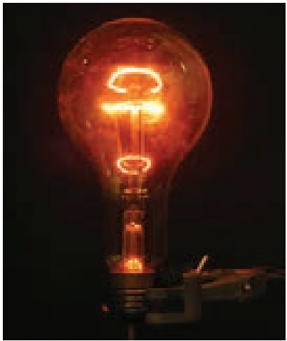

**UNIT 2 CURRENT ELECTRICITY**

We will make electricity so cheap that only the rich will burn candles 
– `Thomas A. Edison`

**Learning Objectives**

**In this unit, the student is exposed to**

• Flow of charges in a metallic conductor

• Ohm’s law, electrical resistance, V-I characteris

• Carbon resistors and combination of resistors

• Kirchhoff ’s laws - Wheatstone’s bridge and its applications

• Electric power and Electric energy

• Heating effect - Joule’s law – applications

• Thermoelectric effects – Seebeck effect – Peltie effect – Thomson effect

# INTRODUCTION

In unit 1, we studied the properties of charges when they are at rest. In reality, the charges are always moving within the materials. For example, the electrons in a copper wire are never at rest and are continuously in random motion. Therefore it is important to analyse the behaviour of charges when they are in motion. The motion of charges constitutes ‘electric current’. Current electricity is the study of flow of electric charges. It owes its origin to Alessandro Volta (1745-1827), who invented the electric battery which produced the first steady flow of electric current. Modern world depends heavily on the use of electricity. It is used to operate machines, communication systems, electronic devices, home appliances etc., In this unit, we will study about the electric current, resistance and related phenomenon in materials.
