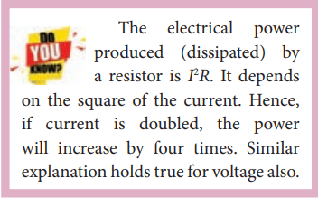



# ENERGY AND POWER IN ELECTRICAL CIRCUITS

When a battery is connected between the ends of a conductor, a current is established. The battery is supplying energy to the device which is connected in the circuit. Consider a circuit in which a battery of voltage V is connected to the resistor as shown in Figure 2.15. 

Assume that a positive charge of dQ moves from point a to b through the battery and moves from point c to d through the resistor and back to point a. When the charge

Figure 2.15 Energy given by the battery

moves from point a to b, it gains potential energy dU = V.dQ and the chemical potential energy of the battery decreases by the same amount. When this charge dQ passes through resistor it loses the potential energy dU = V.dQ due to collision with atoms in the resistor and again reaches the point a. This process occurs continuously till the battery is connected in the circuit. The rate at which the charge loses its electrical potential energy in the resistor can be calculated.

The electrical power P is the rate at which the electrical potential energy is delivered, 

\\(P= \frac{dU}{dt} = \frac{(V.dQ)}{dt} = V \frac{dQ}{dt} &emsp;&emsp;(2.31) \\)

Since the electric current \\(I=\frac{dQ}{dt}\\),the equation (2.31) can be rewritten as

\\(P=VI &emsp;&emsp;(2.32)\\)

This expression gives the power delivered by the battery to any electrical system, where *I* is the current passing through it and *V* is the potential difference across it. The SI unit of electrical power is watt (1W = 1 J \\(s^{-1})\\). Commercially, the electrical bulbs used in houses come with the power and voltage rating of 5W-220V, 30W-220V, 60W-220V etc. (Figure 2.16).

Figure 2.16 Electrical bulbs with power rating

Usually these voltage rating refers AC RMS voltages. For a given bulb, if the voltage drop across the bulb is greater than voltage rating, the bulb will fuse.

Using Ohm’s law, power delivered to the resistance R is expressed in other forms

\\(P=IV=I(IR)=I^2R &emsp;&emsp;(2.33) \\)

\\(P=IV=\frac{V}{R}V=\frac{V^2}{R} &emsp;&emsp;(2.34) \\)

The total electrical energy used by any device is obtained by multiplying the power and duration of the time when it is ON. If the power is in watts and the time is in seconds, the energy will be in joules. In practice, electrical energy is measured in kilowatt hour (kWh). 1 kWh is known as 1 unit of electrical energy.

(1 kWh = 1000 Wh = (1000 W) (3600 s) = 3.6 × 10\\(^6\\) J)  

**EXAMPLE 2.15**

A battery of voltage V is connected to 30 W bulb and 60 W bulb as shown in the figure. (a) Identify brightest bulb (b) which bulb has greater resistance? (c) Suppose the two bulbs are connected in series, which bulb will glow brighter?

***Solution***

(a) The power delivered by the battery *P* = _VI_. Since the bulbs are connected in parallel, the voltage drop across each bulb is the same. If the voltage is kept fixed, then the power is directly proportional to current (*P* ∝ *I*). So 60 W bulb draws twice as much as current as 30 W and it will glow brighter than 30 W bulb.  

(b) To calculate the resistance of the bulbs, we use the relation \\(P=\frac{V^2}{R} \\) . In both the bulbs, the voltage drop is the same. So the power is inversely proportional to the resistance or resistance is inversely proportional to the power \\((R ∝ \frac{1}{P} )\\) . It implies that, the 30W has twice as much as resistance as 60 W bulb.

(c) When the bulbs are connected in series, the current passing through each bulb is the same. It is equivalent to two resistors connected in series. The bulb which has higher resistance has higher voltage drop. So 30W bulb will glow brighter than 60W bulb. So the higher power rating does not always imply more brightness and it depends whether bulbs are connected in series or parallel.

**EXAMPLE 2.16**

Two electric bulbs marked 20 W – 220 V and 100 W – 220 V are connected in series to 440 V supply. Which bulb will get fused?

***Solution***

To check which bulb will get fused, the voltage drop across each bulb has to be calculated.

The resistance of the bulb,

\\(R = \frac{V^2}{P} = \frac{(Rated voltage)^2}{Rated power} \\)

For 20W-220V bulb,

\\(R_1 = \frac{(220)^2}{20}\Omega= 2420 \Omega \\)

For 100W-220V bulb,

\\(R_2 = \frac{(220)^2}{100}\Omega= 484 \Omega \\)

Both the bulbs are connected in series. So same current will pass through both the bulbs. The current that passes through the circuit, \\(I=\frac{V}{R_{tot}} \\)

\\( R_{tot} = (R_1 + R_2)\\)

\\( R_{tot} = (484 + 2420)\Omega = 2904\Omega \\)

\\(I=\frac{440V}{2904 \Omega} ≈ 0.151 A \\)

The voltage drop across the 20W bulb is

\\(V_1=IR_1=\frac{440V}{2904}\times 2420 ≈ 366.6 V \\)

The voltage drop across the 100W bulb is

\\(V_2=IR_2=\frac{440V}{2904}\times 484 ≈ 73.3 V \\)

The 20 W bulb will get fused because the voltage across it is more than the voltage rating.
