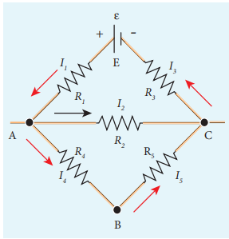
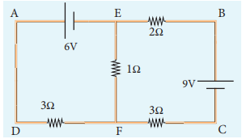
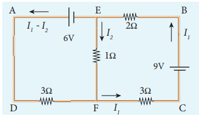
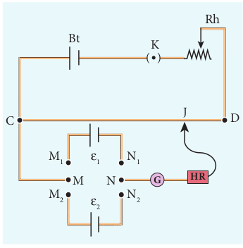



# KIRCHHOFF’S RULES

Ohm’s law is useful only for simple circuits. For more complex circuits, Kirchhoff ’s rules can be used to find current and voltage. There are two generalized rules: i) Kirchhoff ’s current rule ii) Kirchhoff ’s voltage rule.

##  Kirchhoff’s first rule (Current rule or Junction rule)

**It states that the algebraic sum of the currents at any junction of a circuit is zero.** It is a statement of law of conservation of electric charge. The charges that enter a given junction in a circuit must leave that junction since charge cannot build up or disappear at a junction. By convention, current entering the junction is taken as positive and current leaving the junction is taken as negative.

Figure 2.23 Kirchhoff ’s current rule

Applying this law to the junction A in Figure 2.23

\\(I_1 + I_2 – I_3 – I_4 – I_5 = 0 \\)

(or)

\\(I_1 + I_2 = I_3 + I_4 + I_5 \\)

**EXAMPLE 2.20**

For the given circuit find the value of *I*.

***Solution***

Applying Kirchhoff ’s rule to the point P in the circuit,

The arrows pointing towards P are positive and away from P are negative.

Therefore, 0.2A – 0.4A + 0.6A – 0.5A + 0.7A – I = 0

1.5A – 0.9A – I = 0

0.6A – I = 0

I = 0.6 A

_I_

0.4A

P 0.6A 0.5A

0.7A

0.2A

### Kirchhoff’s Second rule (Voltage rule or Loop rule)

**It states that in a closed circuit the algebraic sum of the products of the current and resistance of each part of the circuit is equal to the total emf included in the circuit**. This rule follows from the law of conservation of energy for an isolated system (The energy supplied by the emf sources is equal to the sum of the energy delivered to all resistors). The product of current and resistance is taken as positive when the direction of the current is followed. Suppose if the direction of current is opposite to the direction of the loop, then product of current and voltage across the resistor is negative. It is shown in Figure 2.24 (a) and (b). The emf is considered positive when proceeding from the negative to the positive terminal of the cell. It is shown in Figure 2.24 (c) and (d).

Figure 2.24 Kirchhoff voltage rule

Kirchhoff voltage rule has to be applied only when all currents in the circuit reach a steady state condition (the current in various branches are constant).

**EXAMPLE 2.21**

The following figure shows a complex network of conductors which can be divided into two closed loops like EACE and ABCA. Apply Kirchhoff ’s voltage rule (KVR),

***Solution*** 

Thus applying Kirchhoff ’s second law to the closed loop EACE

\\(I_1 R_1 + I_2 R_2 + I_3 R_3 = ε \\)

and for the closed loop ABCA 

\\(I_4 R_4 +  I_5 R_5 - I_2 R_2= 0 \\)

**EXAMPLE 2.22**

Calculate the current that flows in the 1 Ω resistor in the following circuit.

***Solution***

We can denote the current that flows from 9V battery as _I1_ and it splits up into *I2* and (*I1 – I2*) at the junction E according Kirchhoff ’s current rule (KCR).

Now consider the loop EFCBE and apply KVR, we get

\\(1I_2 + 3I_1 + 2I_1 = 9\\)

\\(5I_1 + I_2 = 9 (1)\\)

Applying KVR to the loop EADFE, we get

\\(3 (I_1 – I_2 ) – 1I_2 = 6\\)

\\(3I_1 – 4I_2 = 6 (2)\\)

Solving equation (1) and (2), we get

\\(I_1 = 1.83 A and I_2 = –0.13 A\\)

It implies that the current in the 1 ohm resistor flows from F to E.

### Wheatstone’s bridge

An important application of Kirchhoff ’s rules is the Wheatstone’s bridge. It is used to compare resistances and in determining the unknown resistance in electrical network. The bridge consists of four resistances _P, Q, R_ and _S_ connected as shown in Figure 2.25. _A_ galvanometer _G_ is connected between the points _B_ and _D_. The battery is connected between the points _A_ and _C_. The current

Figure 2.25 Wheatstone’s bridge

through the galvanometer is \\(I_G\\) and its resistance is *G*.

Applying Kirchhoff ’s current rule to junction *B* and *D* respectively.

\\(I_1 – I_G – I_3 = 0 &emsp;&emsp; (2.45)\\)

\\(I_2 + I_G – I_4 = 0 &emsp;&emsp;(2.46)\\)

Applying Kirchhoff ’s voltage rule to loop _ABDA_,

\\(I_1P + I_GG – I_2R = 0 &emsp;&emsp;(2.47)\\)

Applying Kirchhoff ’s voltage rule to loop *ABCDA*,

\\(I_1P + I_3Q – I_4S – I_2R = 0 &emsp;&emsp; (2.48)\\)

When the points _B_ and _D_ are at the same potential, the bridge is said to be balanced. As there is no potential difference between _B_ and _D_, no current flows through galvanometer (_IG_ = 0). Substituting _I_G = 0 in equation (2.45), (2.46) and (2.47), we get

\\(I_1= I_3 &emsp;&emsp; (2.49)\\)

\\(I_2 = I_4 &emsp;&emsp; (2.50)\\)

\\(I_1P = I_2R  &emsp;&emsp;(2.51)\\)

Using equation (2.51) in equation (2.48)

\\(I_3Q = I_4S &emsp;&emsp; (2.52)\\)

Dividing equation (2.52) by equation (2.51), we get

\\(\frac{P}{Q} = \frac{R}{S} &emsp;&emsp;(2.53)\\)

This is the condition for bridge balance. Only under this condition, galvanometer shows null deflection. Suppose we know the values of two adjacent resistances, the other two resistances can be compared. If three of the resistances are known, the value of unknown resistance (fourth one) can be determined.

**EXAMPLE 2.23**

In a Wheatstone’s bridge *P* = 100 Ω, *Q* = 1000 Ω and *R* = 40 Ω. If the galvanometer shows zero deflection, determine the value of *S*.

***Solution***

\\(\frac{P}{Q}=\frac{R}{S}\\)

\\(S=\frac{Q}{P}\times R \\)

\\(S=\frac{1000}{100}\times 40 S = 400 Ω \\)

**EXAMPLE 2.24**

What is the value of **x** when the Wheatstone’s network is balanced?

\\(P = 500 Ω, Q = 800 Ω, R = x + 400, S = 1000 Ω\\)

***Solution*** 

\\(\frac{P}{Q}=\frac{R}{S} \\) , when the network is balanced

\\(\frac{500}{800}=\frac{x+400}{1000} \\)

\\(x+400=\frac{5}{8}\times1000 \\)

\\(x + 400 = 625 \\)

\\(x = 625 – 400\\)

\\(x = 225 Ω \\) 

### Meter bridge

The meter bridge is another form of Wheatstone’s bridge. It consists of a uniform wire of manganin AB of one meter length. This wire is stretched along a metre scale on a wooden board between two copper strips C and D. Between these two copper strips another copper strip E is mounted to enclose two gaps G1 and G2 as shown in Figure 2.26.

An unknown resistance *P* is connected in G1 and a standard resistance *P* is connected in G2. A jockey (conducting wire-contact maker) is connected to the terminal E on the central copper strip through a galvanometer (G) and a high resistance (HR). The exact position of jockey on the wire can be read on the scale. A Lechlanche cell and a key (K) are connected between the ends of the bridge wire.

Figure 2.26 Meter bridge

The position of the jockey on the wire is adjusted so that the galvanometer shows zero deflection. Let the position of jockey at the wire be at J. The resistances corresponding to AJ and JB of the bridge wire form the resistances *R* and *S* of the Wheatstone’s bridge. Then for the bridge balance

\\(\frac{P}{Q}=\frac{R}{S}=\frac{r.AJ}{r.JB} &emsp;&emsp;(2.54)\\)

where r is the resistance per unit length of wire.

\\(\frac{P}{Q}=\frac{AJ}{JB}=\frac{l_1}{l_2}&emsp;&emsp;(2.55)\\)

\\(P= Q \frac{l_1}{l_2}&emsp;&emsp;(2.56) \\)

The bridge wire is soldered at the ends of the copper strips. Due to imperfect contact, some resistance might be introduced at the contact. These are called end resistances. This error can be eliminated, if another set of readings is taken with *P* and *Q* interchanged and the average value of *P* is found.

To find the specific resistance of the material of the wire in the coil P, the radius *a* and length *l* of the wire are measured. The specific resistance or resistivity *ρ* can be calculated using the relation.

Resistance \\(= ρ \frac{l}{A}\\)

By rearranging the above equation, we get

\\(ρ= \times Resistance \times \frac{A}{l} &emsp;&emsp;(2.57)\\)

If *P* is the unknown resistance equation (2.57) becomes,

\\(ρ= P\frac{πa^2}{l}\\)

**EXAMPLE 2.25**

In a meter bridge experiment with a standard resistance of 15 Ω in the right gap, the ratio of balancing length is 3:2. Find the value of the other resistance.

**_Solution_**

\\(Q = 15 Ω, &emsp; l_1:l_2= 3:2\\)

\\(\frac{l_1}{l_2}=\frac{3}{2}\\)

\\(\frac{P}{Q}=\frac{l_1}{l_2}\\)

\\(P=Q\frac{l_1}{l_2}\\)

\\(P=15\times\frac{3}{2}=22.5\Omega \\)

**EXAMPLE 2.26**

In a meter bridge experiment, the value of resistance in the resistance box connected in the right gap is 10 Ω. The balancing length is \\(l_1\\) = 55 cm. Find the value of unknown resistance.

***Solution***

Q = 10 Ω 

\\(\frac{P}{Q}=\frac{l_1}{100-l_1}=\frac{l_1}{l_2}\\)

\\(P=Q\times \frac{l_1}{100-l_1}\\)

\\(P=\frac{10 \times 55}{100-55}\\)

\\(P=\frac{500}{45}12.2\Omega \\)

### Potentiometer

Potentiometer is used for the accurate measurement of potential differences, current and resistances. It consists of ten meter long uniform wire of manganin or constantan stretched in parallel rows each of 1 meter length, on a wooden board. The two free ends A and B are brought to the same side and fixed to copper strips with binding screws. A meter scale is fixed parallel to the wire. A jockey is provided for making contact.

The principle of the potentiometer is illustrated in Figure 2.27. A steady current is maintained across the wire CD by a battery _Bt_.

The battery, key and the potentiometer wire connected in series form the primary circuit. The positive terminal of a primary cell of emf ε is connected to the point C and negative terminal is connected to the jockey through a galvanometer G and a high resistance HR. This forms the secondary circuit.

Figure 2.27 Potentiometer

Let the contact be made at any point J on the wire by jockey. If the potential difference across CJ is equal to the emf of the cell ε, then no current will flow through the galvanometer and it will show zero deflection. CJ is the balancing length *l*. The potential difference across CJ is equal to *Irl* where *I* is the current flowing through the wire and *r* is the resistance per unit length of the wire.

Hence \\(ε = Irl (2.58)&emsp;&emsp;(2.58)\\)

Since *I* and *r* are constants, ε ∝ *l*. The emf of the cell is directly proportional to the balancing length.

### Comparison of emf of two cells with a potentiometer

To compare the emf of two cells, the circuit connections are made as shown in Figure 2.28. Potentiometer wire CD is connected to a battery *Bt* and a key K in series. This is the primary circuit. The end C of the wire is connected to the terminal M of a DPDT (Double Pole Double Throw) switch and the other terminal N is connected to a jockey through a galvanometer G and a high resistance HR. The cells whose emf ε1 and ε2 to be compared are connected to the terminals M1,N1 and M2,N2 of the DPDT switch. The positive terminals of *Bt*, ε1 and ε2 should be connected to the same end C.

Figure 2.28 Comparison of emf of two 
cells

The DPDT switch is pressed towards M1, N1 so that cell ε1 is included in the secondary circuit and the balancing length \\(l_1\\) is found by adjusting the jockey for zero deflection. Then the second cell \\(ε_2\\) is included in the circuit and the balancing length \\(l_2\\) is determined. Let *r* be the resistance per unit length of the potentiometer wire and *I* be the current flowing through the wire.

we have \\(ε_1 = Irl_1 &emsp;&emsp; (2.59)\\)

\\(ε_2 = Irl_2 &emsp;&emsp; (2.60)\\)

By dividing equation (2.59) by (2.60) 

\\(\frac{ε1}{ε_2} = \frac{l_1}{l_2} &emsp;&emsp; (2.61)\\)

By including a rheostat (Rh) in the primary circuit, the experiment can be repeated several times by changing the current flowing through it.

### Measurement of internal resistance of a cell by potentiometer

To measure the internal resistance of a cell, the circuit connections are made as shown in Figure 2.29. The end C of the potentiometer wire is connected to the positive terminal of the battery Bt and the negative terminal of the battery is connected to the end D through a key K1. This forms the primary circuit.

Figure 2.29 measurement of internal 
resistance

The positive terminal of the cell of emf ε whose internal resistance is to be determined is also connected to the end C of the wire. The negative terminal of the cell ε is connected to a jockey through a galvanometer and a high resistance. A resistance box R and key K2 are connected across the cell ε. With K2 open, the balancing point J is obtained and the balancing length CJ = _l_1 is measured. Since the cell is in open circuit, its emf is

\\(ε ∝ l_1 &emsp;&emsp; (2.62)\\)

A suitable resistance (say, 10 Ω) is included in the resistance box and key \\(K_2\\) is closed. Let r be the internal resistance of the cell. The current passing through the cell and the resistance R is given by

\\(I=\frac{ε}{R+r}\\)

The potential difference across R is

\\(V=\frac{εR}{R+r}\\)

When this potential difference is balanced on the potentiometer wire, let \\(l_2\\) be the balancing length.

Then\\(\frac{εR}{R+r}∝l_2 &emsp;&emsp;(2.63)\\)

From equations (2.62) and (2.63) 

\\(\frac{R+r}{R}=\frac{l_{1}}{l_{2}} &emsp;&emsp;(2.64)\\)

\\( 1+\frac{r}{R}=\frac{l_{1}}{l_{2}} \\)

\\( r=R\left[\frac{l_{1}}{l_{2}}-1\right] \\)

\\( \therefore r=R\frac{l_{1}-l_{2}}{l_{2}}&emsp;&emsp;(2.65)\\)

Substituting the values of the *R*, \\(l_1\\) and \\(l_2\\), the internal resistance of the cell is determined. The experiment can be repeated for different values of _R_. It is found that the internal resistance of the cell is not constant but increases with increase of external resistance connected across its terminals.
