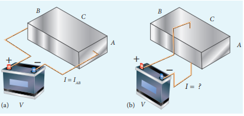
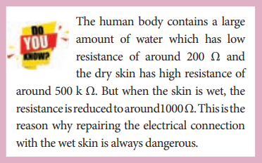
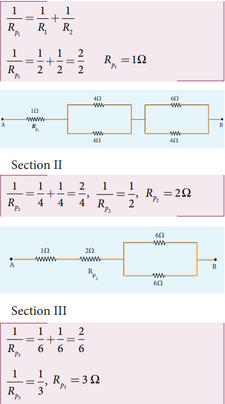
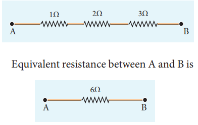
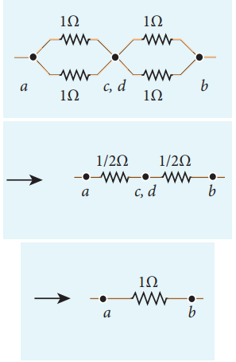
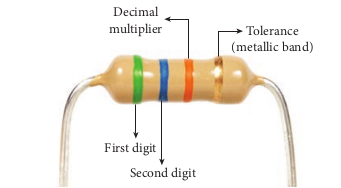
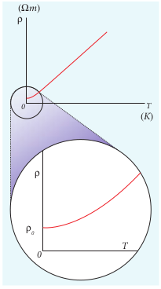
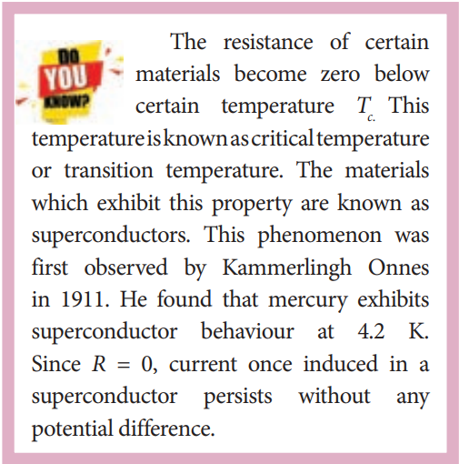



# OHM’S LAW
The ohm’s law can be derived from the equation J = σE. Consider a segment of wire of length l and cross sectional area A as shown in Figure 2.7.

Figure 2.7 Current through the conductor

When a potential difference *V* is applied across the wire, a net electric field is created in the wire which constitutes the current in the wire. For simplicity, we assume that the electric field is uniform in the entire length of the wire, then the potential difference (voltage *V*) can be written as

\\(V=El \\)

As we know, the magnitude of current density

\\( J = \sigma E = \sigma \frac{V}{l} &emsp;&emsp; (2.14) \\)

But \\(J= \frac{I}{A} \\) , so we write the equation (2.14) as

\\( \frac{I}{A} = \sigma \frac{V}{l}. \\)

By rearranging the above equation, we get

\\( V = I \frac{l}{\sigma A} &emsp;&emsp;(2.15) \\)

The quantity \\( \frac{l}{\sigma A} \\) is called resistance of the conductor and it is denoted as R. Note that the resistance is directly proportional to the length of the conductor and inversely proportional to area of cross section.

Therefore, the macroscopic form of ohm’s law can be stated as

\\( V = IR &emsp;&emsp;(2.16) \\)

From the above equation, **the resistance is the ratio of potential difference across the given conductor to the current passing through the conductor.**

\\( R = \frac{V}{I} &emsp;&emsp;(2.17) \\)

The SI unit of resistance is ohm \\( (\Omega )\\). From the equation (2.16), we infer that the graph between current versus voltage is straight line with a slope equal to the inverse of resistance *R* of the conductor. It is shown in the Figure 2.8 (a).

Figure 2.8 Current against voltage for 
(a) a conductor which obeys Ohm’s law 
and (b) for a non-ohmic device (Diode 
given in XII physics, unit 9 is an example 
of a non-ohmic device)

Materials for which the current versus voltage graph is a straight line through the origin, are said to obey Ohm’s law and their behaviour is said to be ohmic as shown in Figure 2.8(a). Materials or devices that do not follow Ohm’s law are said to be non-ohmic. These materials have more complex relationships between voltage and current. A plot of I versus V for a non-ohmic material is non-linear and they do not have a constant resistance (Figure 2.8(b)).

**EXAMPLE 2.5**

A potential difference across 24 Ω resistor 
is 12 V. What is the current through the 
resistor?

**Solution**

V = 12 V and R = 24 Ω 

Current, I = ?

From Ohm’s law, \\(I = \frac{V}{R} = \frac{12}{24} = 0.5 A \\)

##  Resistivity

In the previous section, we have seen that the resistance R of any conductor is given by

\\(R = \frac{l}{\sigma A} &emsp;&emsp;(2.18) \\)

where σ is called the conductivity of the material and it depends only on the type of the material used and not on its dimension.The resistivity of a material is equal to the reciprocal of its conductivity.

\\(\rho = \frac{l}{\sigma} &emsp;&emsp;(2.19) \\)

Now we can rewrite equation (2.18) using equation (2.19)

\\(R = \rho \frac{l}{A} &emsp;&emsp;(2.20) \\)

The resistance of a material is directly proportional to the length of the conductor and inversely proportional to the area of cross section of the conductor. The proportionality constant ρ is called the resistivity of the material.

If l = 1 m and A = 1 \\(m^2\\)
, then the resistance R = ρ. In other words, the **electrical resistivity of a material is defined as the resistance offered to current flow by a conductor of unit length having unit area of cross section.** The SI unit of ρ is ohm-metre (Ω m). Based on the resistivity, materials are classified as conductors, insulators and semi-conductors. The conductors have lowest resistivity, insulators have highest resistivity and semiconductors have resistivity greater than conductors but less than insulators. The typical resistivity values of some conductors, insulators and semiconductors are given in the Table 2.1

Table 2.1 Resistivity for various materials

| Material | Resistivity, ρ (Ω m) at 20\\(\degree\\)C |
| ----------- | ----------- |
| **Insulators** |  |
| Pure Water | 2.5 × \\(10^{5}\\) |
| Glass | \\(10^{10}\\) – \\(10^{14}\\) |
| Hard Rubber | \\(10^{13}\\) – \\(10^{16}\\) |
| NaCl | \\(10^{14}\\) |
| Fused Quartz | \\(10^{16}\\) |
| **Semiconductors** |  |
| Germanium | 0.46 |
| Silicon | 640 |
| **Conductors** |  |
| Silver | 1.6 × \\(10^{-8}\\) |
| Copper | 1.7 × \\(10^{-8}\\) |
| Aluminium | 2.7 × \\(10^{-8}\\) |
| Tungsten | 5.6 × \\(10^{-8}\\) |
| Iron | 10 × \\(10^{-8}\\) |

**EXAMPLE 2.6**

The resistance of a wire is 20 Ω. What will be new resistance, if it is stretched uniformly 8 times its original length?

***Solution***

\\(R_1 = 20 \Omega , R_2 = ?  \\)

Let the original length of the wire (\\(l_1 \\)) be l.

New length, \\( l_2 = 8l_1(i.,e) l_2 = 8l \\)

Original resistance, \\( R_1 = \rho \frac{l_1}{A_1} \\)

New resistance \\( R_2 = \rho \frac{l_2}{A_2} = \frac{\rho (8l)}{A_2}\\)

Though the wire is stretched, its volume remains unchanged.

Initial volume = Final volume

\\( A_1 l_1 = A_2 l_2, &emsp; A_1 l = A_2(8l) \\)

\\( \frac{A_1}{A_2} = \frac{8l}{l} = 8 \\)

By dividing equation for \\(R_2\\) by equation for \\(R_1\\), we get

\\( \frac{R_2}{R_1} = \frac{\rho (8l)}{A_2} \times \frac{A_1}{\rho l} \\)

\\( \frac{R_2}{R_1} = \frac{A_1}{A_2} \times 8 \\)

Substituting the value of \\( \frac{A_1}{A_2}\\) , we get

\\( \frac{R_2}{R_1} = 8 \times 8 = 64 \\)

\\(R_2 = 64 \times 20 = 1280 \Omega \\)

Hence, stretching the length of the wire has 
increased its resistance.

**EXAMPLE 2.7**

Consider a rectangular block of metal of height A, width B and length C as shown in the figure.

If a potential difference of V is applied between the two faces A and B of the block (figure (a)), the current \\(I_{AB}\\) is observed. Find the current that flows if the same potential difference *V* is applied between the two faces B and C of the block (figure (b)). Give your answers in terms of \\(I_{AB}\\).

***Solution***

In the first case, the resistance of the block 

\\( R_{AB} = \rho \frac{length}{Area} = \rho \frac{C}{AB}\\)

The current \\( I_{AB} = \frac{V}{R_{AB}} =  \frac{V}{\rho}.\frac{AB}{C} &emsp;&emsp;(1) \\)

In the second case, the resistance of the 
block \\( R_{BC} = \rho \frac{A}{BC}\\)

The current \\( I_{BC} = \frac{V}{R_{BC}} =  \frac{V}{\rho}.\frac{BC}{A} &emsp;&emsp;(2) \\)

To express \\(I_{BC}\\) interms of \\(I_{AB}\\), we multiply and divide equation (2) by AC, we get

\\( I_{BC} = \frac{V}{\rho}.\frac{BC}{A}\frac{AC}{AC} =  (\frac{V}{\rho}.\frac{AB}{C}).\frac{C^2}{A^2} = \frac{C^2}{A^2}.I_{AB} \\)

Since C > A, the current \\(I_{BC}>I_{AB} \\)

### Resistors in series and parallel

An electric circuit may contain a number of resistors which can be connected in different ways. For each type of circuit, we can calculate the equivalent resistance produced by a group of individual resistors.

**Resistors in series**

When two or more resistors are connected end to end, they are said to be in series. The resistors could be simple resistors or bulbs or heating elements or other devices. Figure 2.9 (a) shows three resistors \\(R_1\\), \\(R_2\\) and \\(R_3\\) connected in series. 

The amount of charge passing through resistor \\(R_1\\) must also pass through resistors \\(R_2\\) and \\(R_3\\) since the charges cannot accumulate nywhere in the circuit. Due to

Figure 2.9 Resistors in series

this reason, the current I passing through all the three resistors is the same. According to Ohm’s law, if same current pass through different resistors of different values, then the potential difference across each resistor must be different. If \\(V_1\\), \\(V_2\\) and \\(V_3\\) be the potential differences (voltage) across each of the resistors \\(R_1\\), \\(R_2\\) and \\(R_1\\) respectively, then we can write \\(V_1\\) = \\(IR_1\\), \\(V_2\\) = \\(IR_2\\) and \\(V_3\\) = \\(IR_3\\). But the supply voltage *V* must be equal to the sum of voltages(potential differences) across ach resistor.

\\(V = V_1 + V_2 + V_3 = IR_1 + IR_2 + IR_3 &emsp;&emsp;(2.21) \\)

\\(V = V(R_1 + R_2 + R_3) \\)

\\(V = IR_S &emsp;&emsp;(2.22) \\)

where \\(R_S\\) is the equivalent resistance.

\\(R_S = R_1 + R_2 + R_3 &emsp;&emsp;(2.23) \\)

When several resistors are connected in series, the total or equivalent resistance is the sum of the individual resistances as shown in the Figure 2.9 (b).

**Note: The value of equivalent resistance in series connection will be greater than each individual resistance.**

**EXAMPLE 2.8**

Calculate the equivalent resistance for the circuit which is connected to 24 V battery and also find the potential difference across each resistors in the circuit.

***Solution***

Since the resistors are connected in series, the effective resistance in the circuit \\(= 4 \Omega + 6 \Omega = 10 \Omega \\)

current I in the circuit = \\(\frac{V}{R_{eq}}= \frac{24}{10}=2.4 A \\)

Voltage across 4Ω resistor

\\(V_1 = IR_1 = 2.4 A \times 4 \Omega = 9.6 V \\)

Voltage across 6 Ω resistor

\\(V_2 = IR_2 = 2.4 A \times 6 \Omega = 14.4 V \\)

**Resistors in parallel**

Resistors are in parallel when they are connected across the same potential difference as shown in Figure 2.10 (a).

In this case, the total current I that leaves the battery is split into three separate components. Let \\(I_1\\) , \\(I_2\\) and \\(I_3\\) be the current through the resistors \\(R_1\\) , \\(R_2\\) and \\(R_3\\) respectively. Due to the conservation of charge, total current in the circuit I is equal to sum of the currents through each of the three resistors.

\\(I = I_1 + I_2 + I_3 &emsp;&emsp;(2.24) \\)

Since the voltage across each resistor is the same, applying Ohm’s law to each resistor, we have

\\(I_1 = \frac{V}{R_1},I_2 = \frac{V}{R_2},I_3 = \frac{V}{R_3} &emsp;&emsp;(2.25) \\)

Substituting these values in equation (2.24),we get

\\(I_1 = \frac{V}{R_1} + \frac{V}{R_2} + \frac{V}{R_3} = V[ \frac{V}{R_1} + \frac{V}{R_2} +\frac{V}{R_3} ] \\)

\\(I = \frac{V}{R_P} \\)

Figure 2.10 Resistors in parallel

\\(\frac{1}{R_P} = \frac{1}{R_1} + \frac{1}{R_2} + \frac{1}{R_3} &emsp;&emsp;(2.26) \\)

Here \\(R_P\\) is the equivalent resistance of the parallel combination of the resistors. Thus, when a number of resistors are connected in parallel, the sum of the reciprocals of resistance of the individual resistors is equal to the reciprocal of the effective resistance of the combination as shown in the Figure 2.10 (b).

**Note: The value of equivalent resistance in parallel connection will be lesser than each individual resistance.**

House hold appliances are always connected in parallel so that even if one is switched off, the other devices could function properly.

**EXAMPLE 2.9**

Calculate the equivalent resistance in the following circuit and also find the values of current \\(I\\), \\(I_1\\) and \\(I_2\\) in the given circuit.

**_Solution_**

Since the resistances are connected in parallel, the equivalent resistance in the circuit is

\\(\frac{1}{R_P} = \frac{1}{R_1} + \frac{1}{R_2} = \frac{1}{4} + \frac{1}{6} \\)

\\(\frac{1}{R_P} = \frac{5}{12} \Omega &emsp;  or R_P =  \frac{12}{5} \Omega \\)

The resistors are connected in parallel, the potential diffrence (voltage) across them is the same.

\\(I_1 = \frac{V}{R_1} = \frac{24V}{4\Omega} = 6 A \\)

\\(I_2 = \frac{V}{R_2} = \frac{24}{6} = 4 A \\)

The current I is the sum of the currents in the two branches. Then,

\\(I = I_1+I_2=6A +4A = 10A\\)

**EXAMPLE 2.10**

Two resistors when connected in series and parallel, their equivalent resistances are 15 Ω and \\(\frac{15}{16}\\)Ω respectively. Find the values of the resistances.  

**_Solution_**

\\(R_S = R_1+R_2=15\Omega &emsp;&emsp;(1)\\)

\\(R_P = \frac{R_1R_2}{R_1 + R_2} = \frac{56}{15}\Omega &emsp;&emsp;(2)\\)

From equation (1) substituting for \\(R_1+R_2\\) in equation (2)

\\(\frac{R_1R_2}{15} = \frac{56}{15}\Omega\\)

\\(\therefore R_1 R_2 = 56 \\)

\\(R_2 = \frac{56}{R_1}\Omega &emsp;&emsp;(3)\\)

Substituting for \\(R_2\\) in equation (1) from equation (3)

\\(R_1+\frac{56}{R_1}=15 \\)

Then, \\(\frac{R_1^2 +56}{R_1} = 15 \\)

\\(R_1^2 + 56 = 15 R_1\\)

\\(R_1^2 - 15 R_1 + 56 = 0 \\)

The above equation can be solved using factorisation.

\\(R_1 = 8 \Omega (or) R_1 = 7 \Omega \\)

If \\(R_1 = 8 \Omega \\)

Substituting in equation (1)

\\( 8 +R_2=15 \\)

\\(R_2 =15 - 8 = 7 \Omega \\),

\\(R_2 = 7 \Omega, i.e,(when R_1 = 8 \Omega; R_2 = 7 \Omega) \\)

If \\(R_1 = 7 \Omega \\)

Substituting in equation (1)

\\(7+R_2=15\\)

\\(R_2 = 8 \Omega, i.e,(when R_1 = 7 \Omega; R_2 = 8 \Omega) \\)

**EXAMPLE 2.11**

Calculate the equivalent resistance between A and B in the given circuit.

***Solution***

In all the sections, the resistors are connected in parallel.

Equivalent resistance is given by

\\(R=R_{P1} + R_{P2} + R_{P3} \\)

\\(R= 1\Omega+2\Omega+3\Omega = 6\Omega \\)

The circuit becomes,  

**EXAMPLE 2.12**

Five resistors are connected in the configuration as shown in the figure. Calculate the equivalent resistance between the points a and b.

***Solution***

**Case (a)**

To find the equivalent resistance between the points a and b, we assume that a current is entering the junction at a. Since all the resistances in the outside loop are the same (1Ω), the current in the branches ac and ad must be equal. Hence the points C and D are at the same potential and no current through 5 Ω. It implies that the 5 Ω has no role in determining the equivalent resistance and it can be removed. So the circuit is simplified as shown in the figure.

The equivalent resistance of the circuit between a and b is \\(R_{eq}\\) = 1 Ω

### Colour code for Carbon resistors

Figure 2.11 Resistances used in laboratory

Carbon resistors consists of a ceramic core, on which a thin layer of crystalline carbon is deposited as shown in Figure 2.11. These resistors are inexpensive, stable and compact in size. Colour rings are used to indicate the value of the resistance according to the rules given in the Table 2.2.

Three coloured rings are used to indicate the values of a resistor: the first two rings are significant figures of resistances, the third ring indicates the decimal multiplier after them. The fourth colour, silver or gold,  

**Table 2.2 Colour Coding for Resistors**

| **Colour** 	| **Number** 	| **Multiplier**     	| **Tolerance** 	|
|------------	|------------	|--------------------	|---------------	|
| Black      	| 0          	| 1                  	|               	|
| Brown      	| 1          	| 10  1   	|               	|
| Red        	| 2          	| 10  2   	|               	|
| Orange     	| 3          	| 10  3   	|               	|
| Yellow     	| 4          	| 10  4   	|               	|
| Green      	| 5          	| 10  5   	|               	|
| Blue       	| 6          	| 10  6   	|               	|
| Violet     	| 7          	| 10  7   	|               	|
| Gray       	| 8          	| 10  8   	|               	|
| White      	| 9          	| 10  9   	|               	|
| Gold       	|            	| 10  -1  	| 5%            	|
| Sliver     	|            	| 10  -2  	| 10%           	|
| Colourless 	|            	|                    	| 20%           	|

shows the tolerance of the resistor at 10% or 5% as shown in the Figure 2.12 .If there is no fourth ring, the tolerance is 20%.

For the resistor shown in Figure 2.12, the first digit = 5 (green), the second digit = 6 (blue), decimal multiplier = 103 (orange) and tolerance = 5% (gold). The value of resistance = 56 × 103 Ω or 56 kΩ with the tolerance value 5%.

While reading the colour code, hold the resistor with colour bands to your left. Resistors

never start with a metallic band on the left.

**Note:-** While reading the colour code, 
hold the resistor with colour 
bands to your left. Resistors 
never start with a metallic band on the left.

Figure 2.12 Resistor colour coding

### Temperature dependence of resistivity

The resistivity of a material is dependent on temperature. It is experimentally found that for a wide range of temperatures, the resistivity of a conductor increases with increase in temperature according to the expression,

\\(\rho_T= \rho_0 [1+\alpha(T-T_0)] &emsp;&emsp;(2.27) \\)

where \\(\rho_T \\) is the resistivity of a conductor at \\(T\degree C, \rho_0 \\) is the resistivity of the conductor at some reference temperature \\(T_0 \\) (usually at \\(20\degree C, \\)) and _α_ is the temperature coefficient of resistivity. **It is defined as the ratio of increase in resistivity per degree rise in temperature to its resistivity at \\(T_0 \\)**.

From the equation (2.27), we can write

\\(\rho_T - \rho_0 = \alpha\rho_0 (T-T_0) \\)

\\(\therefore \alpha = \frac{\rho_T - \rho_0}{\rho_0 (T-T_0)} = \frac{\Delta\rho}{\rho_0 \Delta T} \\)

where \\(\Delta \rho = \rho_T - \rho_0 \\) is change in resistivity for a change in temperature \\(\Delta T = T - T_0 \\) Its unit is per \\(\degree C\\).

α **of conductors** For conductors α is positive. If the temperature of a conductor increases, the average kinetic energy of electrons in the conductor increases. This results in more frequent collisions and hence the resistivity increases. The graph of the equation (2.27) is shown in Figure 2.13.

Even though, the resistivity of conductors like metals varies linearly for wide range of temperatures, there also exists a non- linear region at very low temperatures. The resistivity approaches some finite value as the temperature approaches absolute zero as shown in Figure 2.13(b).

Figure 2.13 (a) Temperature dependence of resistivity for a conductor (b) Non linear region at low temperature

Using the equation \\(\rho =R \frac{A}{l} \\) in equation(2.27), we get the expression for the resistance of a conductor at temperature T \\(\degree C\\) as

\\(R_T=R_0[1+ \alpha(T-T_0)] &emsp;&emsp;(2.28) \\)

The temperature coefficient of resistivity can also be obtained from the equation (2.28),

\\( R_T - R_0 = \alpha R_0(T-T_0) \\)

\\(\therefore \alpha = \frac{R_T -R_0}{R_0(T-T_0)} = \frac{1}{R_0}\frac{\Delta R}{\Delta T} \\)

\\(\alpha = \frac{1}{R_0}\frac{\Delta R}{\Delta T} \\)

where \\(\Delta R = R_T - R_0\\) is change in resistance during the change in temperature \\(\Delta T = T - T_0\\)

**_α_ of semiconductors** 

For semiconductors, the resistivity decreases with increase in temperature. As the temperature increases, more electrons will be liberated from their atoms (Refer unit 9 for conduction in semi conductors).

Hence the current increases and therefore the resistivity decreases as shown in Figure 2.14. A semiconductor with a negative temperature coefficient of resistivity is called a thermistor.

The typical values of temperature coefficients of various materials are given in table 2.3.

**Table 2.3**

| Material  | Temperature Coefficient of resistivity α [(°C)−1] |
|-----------|--------------------------------------------------------------|
| Silver    | 3.8 × 10−3                                        |
| Copper    | 3.9 × 10 −3                                       |
| Gold      | 3.4 × 10 −3                                       |
| Aluminum  | 3.9 × 10 −3                                       |
| Tungsten  | 4.5 × 10 −3                                       |
| Iron      | 5.0 × 10 −3                                       |
| Platinum  | 3.92 × 10 −3                                      |
| Lead      | 3.9 × 10 −3                                       |
| Nichrome  | 0.4 × 10−3                                                   |
| Carbon    | −0.5 × 10                                                    |
| Germanium | −48 × 10−3                                                   |
| Silicon   | −75 × 10−3                                                   |

We can understand the temperature dependence of resistivity in the following way. In section 2.1.3, we have shown that the electrical conductivity, \\(\sigma = \frac{ne^2\tau}{m} \\). As the resistivity is inverse of σ, it can be written as

\\(\rho = \frac{m}{ne^2\tau} &emsp;&emsp;(2.30) \\)

The resistivity of materials is

i) inversely proportional to the number density (_n_) of the electrons 

ii) inversely proportional to the average time between the collisions (τ). 

In metals, if the temperature increases, the average time between the collision (τ) decreases and *n* is independent of temperature. In semiconductors when temperature increases, *n* increases and τ decreases, but increase in *n* is dominant than decreasing τ, so that overall resistivity decreases.

**EXAMPLE 2.13**

If the resistance of coil is 3 Ω at 20\\(\degree \\) C and α = 0.004/\\(\degree \\)C then determine its resistance at 100 \\(\degree \\)C.
  

***Solution***

\\( R_0 = 3 \Omega, T=100\degree C, T_0=20\degree C \\)

\\( \alpha = 0.004/\degree C, R_T=? \\)

\\( R_t = R_0(1+\alpha(T-T_0)) \\)

\\( R_{100} = 3(1+0.004 \times 80) \\)

\\( R_{100} = 3.96 \Omega \\)

**EXAMPLE 2.14**

Resistance of a material at 20\\(\degree \\)C and 40\\(\degree \\)C are 45 Ω and 85 Ω respectively. Find its temperature coefficient of resistivity.

***Solution***

\\(T_0 =20\degree C, T=40 \degree C, R_0=45 \Omega, R=85 \Omega \\)

\\(\alpha = \frac{1}{45}(\frac{85-45}{40-20})=\frac{1}{45}(2) \\)

\\(\alpha = 0.044 per \degree C \\)
