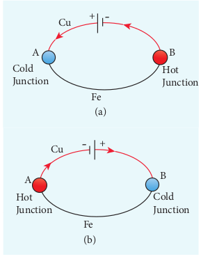



# THERMOELECTRIC EFFECT

**Conversion of temperature differences into electrical voltage and vice versa is known as thermoelectric effect.**
A thermoelectric device generates voltage when there is a temperature difference on each side. If a voltage is applied, it generates a temperature difference.

##  Seebeck effect

**Seebeck discovered that in a closed circuit consisting of two dissimilar metals, when the junctions are maintained at different temperatures an emf (potential difference) is developed. The current that flows due to the emf developed is called thermoelectric current. The two dissimilar metals connected to form two junctions is known as thermocouple** (Figure 2.35). 

Figure 2.35 Seebeck effect (Thermocouple)

If the hot and cold junctions are interchanged, the direction of current also reverses. Hence the effect is reversible.

The magnitude of the emf developed in a thermocouple depends on (i) the nature of the metals forming the couple and (ii) the temperature difference between the junctions. 

**Applications of Seebeck effect**

1. Seebeck effect is used in thermoelectric generators (Seebeck generators).These thermoelectric generators are used in power plants to convert waste heat into electricity. 

2.	 This effect is utilized in automobiles as automotive thermoelectric generators for increasing fuel efficiency.

3.	 Seebeck effect is used in thermocouples and thermopiles to measure the temperature difference between the two objects.

 ##  Peltier effect

 In 1834, Peltier discovered that **when an electric current is passed through a circuit of a thermocouple, heat is evolved at one junction and absorbed at the other junction. This is known as Peltier effect.**

 

 Figure 2.36 Peltier effect: Cu – Fe 
thermocouple

In the Cu-Fe thermocouple the junctions A and B are maintained at the same temperature. Let a current from a battery flow through the thermocouple (Figure 2.36 (a)). At the junction A, where the current flows from Cu to Fe, heat is absorbed and the junction A becomes cold. At the junction B, where the current flows from Fe to Cu heat is liberated and it becomes hot. When the direction of current is reversed, junction A gets heated and junction B gets cooled as shown in the Figure 2.36(b). Hence Peltier effect is reversible. 

 ##  Thomson effect

 Thomson showed that **if two points in a conductor are at different temperatures, the density of electrons at these points will differ and as a result the potential difference is created between these points. Thomson effect is also reversible.**

 

 Figure 2.37 (a) Positive Thomson effect 
(b) Negative Thomson effect

If current is passed through a copper bar AB which is heated at the middle point C, the point C will be at higher potential. This indicates that the heat is absorbed along AC and evolved along CB of the conductor as shown in Figure 2.37(a). Thus heat is transferred due to the current flow in the direction of the current. It is called positive Thomson effect. Similar effect is observed in metals like silver, zinc, and cadmium.

When the copper bar is replaced by an iron bar, heat is evolved along CA and absorbed along BC. Thus heat is transferred due to the current flow in the direction opposite to the direction of current. It is called negative Thomson effect as shown in the Figure 2.37(b). Similar effect is observed in metals like platinum, nickel, cobalt, and mercury.
