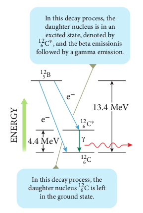
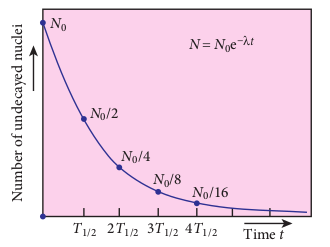

# RADIOACTIVITY

In the binding energy curve, the stability of the nucleus that has _Z_ > 82 starts to decrease and these nuclei are fairly unstable nuclei. Some of the unstable decay naturally by emitting certain particles to form a stable nucleus. The elements with atomic number _Z > 82_ and isotopes of lighter nuclei belong to the category of naturally-occurring radioactive nuclei. Each of these radioactive nuclei decays to another nucleus by the emission of 24_He_ nucleus ( α-decay) or electron or positron (β-decay) or gamma rays ( γ -decay).

**The phenomenon of spontaneous emission of highly penetrating radiations such as α, β and γ rays by an element is called radioactivity and the substances which emit these radiations are called radioactive elements**. These radioactive elements can be heavy elements (_Z_ > 82), isotopes of lighter and heavy elements and these isotopes are called radioisotopes. For example, carbon isotope
614_C_ is radioactive but 612_C_ is not. Radioisotopes have a variety of applications such as carbon dating, cancer treatment, etc. When a radioactive nucleus undergoes decay, the mass of the system decreases – that is, the mass of the initial nucleus before decay is always greater than the sum of the masses of the final nucleus and the emitted particle. This difference in mass ∆_m_ < 0, it appears as the energy according to Einstein’s relation _E m c_\= ∆ 2 .
 

The phenomenon of radioactivity was first discovered by Henri Becquerel in 1896. Later, Marie Curie and her husband Pierre Curie did a series of experiments in detail to understand the phenomenon of radioactivity. In India, Saha Institute of Nuclear Physics (SINP), Kolkata is the premier institute pursuing active research in nuclear physics.

**Note**
During early days of nuclear physics research, the term ‘radiation’ was used to denote the emanations from radioactive nuclei. Now we know that α rays are in fact 2_He_ nuclei and β rays are electrons or positrons. Certainly, they are not electromagnetic radiation. The γ ray alone is electromagnetic radiation.

## Alpha decay

When an unstable nucleus decay by emitting an α-particle (24_He_ nucleus), it loses two protons and two neutrons. As a result, its atomic number Z decreases by 2 and the mass number decreases by 4. We write the alpha decay process symbolically in the following way

Here _X_ is called the parent nucleus and _Y_ is called the daughter nucleus.

Example: Decay of Uranium 92238_U_ to thorium90 234_Th_ with the emission of 24_He_ nucleus (α-particle)

As already mentioned, the total mass of the daughter nucleus and 24_He_ nucleus is always less than that of the parent nucleus. The difference in mass is released as energy called **disintegration energy** _Q_ and is given by

Note that for spontaneous decay (natural radioactivity) _Q_ >0. In alpha decay process, the disintegration energy is certainly positive (_Q_ > 0). In fact, the disintegration energy _Q_ is also the net kinetic energy gained in the decay process or if the parent nucleus is at rest, _Q_ is the total kinetic energy of daughter nucleus and the 24_He_ nucleus. Suppose _Q_ < 0, then the decay process cannot occur spontaneously and energy must be supplied to induce the decay.

In alpha decay, why does the unstable nucleus emit 24_He_ nucleus? Why it does not emit four separate nucleons? After all 24_He_ consists of two protons and two neutrons. For example, if 92238_U_ nucleus decays into 90234_Th_ by emitting four separate nucleons (two protons and two neutrons), then the disintegration energy Q for this process turns out to be negative. It implies that the total mass of products is greater than that of parent( 92238_U_ ) nucleus. This kind of process cannot occur in nature because it would violate conservation of energy. In any decay process, the conservation of energy, laws of linear momentum and laws of angular momentum must be obeyed.

**Note**  

**EXAMPLE 9.11**

(a) Calculate the disintegration energy when stationary 92232_U_ nucleus decays to thorium 90228_Th_ with the emission of α particle. The atomic masses are of 92232 232 037156_U u_\= . , 90228 228 028741_Th u_\= and 2 4 4 002603_He u_\= .

(b) Calculate kinetic energies of 90

228_Th_ and α-particle and their ratio.

**_Solution_**

The difference in masses ∆_m m m mU Th_\= − −( )α \= (232.037156–228.028741 – 4.002603)u

The mass lost in this decay = 0.005812 u

Since 1u = 931MeV, the energy Q released is _Q u MeV u_

This disintegration energy Q appears as the kinetic energy of α particle and the daughter nucleus.

In any decay, the total linear momentum must be conserved.

Total linear momentum of the parent nucleus = total linear momentum of the daughter nucleus and α particle

Since before decay, the uranium nucleus is at rest, its momentum is zero.By applying conservation of momentum, we get
It implies that the alpha particle and daughter nucleus move in opposite directions. In magnitude The velocity of α particle υ υα α

Since The ratio of the kinetic energy of α particle to that of the daughter nucleus. By substituting, the value of υα into the above equation, we get

α 4 002603 57.= = =228 028741

The kinetic energy of α particle is 57 times greater than the kinetic energy of the daughter nucleus (90228_Th_ ).The disintegration energy Q = total kinetic energy of products

In fact, 98% of total kinetic energy is taken by the α particle.

## Beta decay

In beta decay, a radioactive nucleus emits either electron or positron. If electron (_e_–) is emitted, it is called β- decay and if positron (_e_+) is emitted, it is called β+decay. The positron is an anti-particle of an electron whose mass is same as that of electron and charge is opposite to that of electron – that is, +_e_. Both positron and electron are referred to as beta particles.  

**β− decay:** In β- decay, the atomic number of the nucleus increases by one but its mass number remains the same. This decay is represented by

It implies that the element _X_ becomes _Y_ by giving out an electron and an antineutrino ( ν ). In otherwords, in each β- decay, one neutron in the nucleus of _X_ is converted into a proton by with the emission of an electron (_e_–) and an antineutrino. Thus,

Where _p_ \-proton, ν -antineutrino. Example: Carbon (614_C_ ) is converted into nitrogen (714 _N_ ) through β- decay.

**β+ decay:** In β+ decay, the atomic number is decreased by one and again its mass number remains the same. This decay is represented by

It implies that the element _X_ becomes _Y_ by giving out an positron and neutrino ( ν ). In otherwords, for each β+ decay, a proton in the nucleus _X_ is converted into a neutron a positron (_e_+) and a neutrino. Thus,

Example: Sodium ( 1122 _Na_ ) is converted into neon (1022 _Ne_ ) throughβ+decay.11 22

However a single proton (not inside any nucleus) cannot exhibit β+ decay due to energy conservation, because neutron mass is larger than proton mass. But a single neutron (not inside any nucleus) can exhibit β- decay.

It is important to note that the electron or positron which comes out from nuclei during beta decay are not present inside the nuclei but they are produced only during the conversion of neutron into proton or proton into neutron inside the nucleus.

**Neutrino:** 

Initially, it was thought that during beta decay, a neutron in the parent nucleus is converted into the daughter nuclei by emitting only electron as given by

But the kinetic energy of electron coming out of the nucleus did not match with the experimental results. In alpha decay, the alpha particle takes only certain allowed discrete energies whereas in beta. A very interesting application o prevent us from any hazardous fire

Battery holder

The smoke detector uses around 0.2 _mg_ of americium (95241_Am_ ). This radioactive source metal plates and α radiations from 95241_Am_ molecules in the air space between the plates. of small steady current in the circuit. If smok the smoke particles rather than air molecules it the current is reduced. This drop in current

The radiation dosage emitted by americiu be considered harmless.  

decay, it was found that the beta particle (i.e, electron) has a continuous range of energies. But the conservation of energy and momentum gives specific single values for energy of electron and the recoiling nucleus Y. It seems that the conservation of energy, momentum are violated and could not be explained why energy of beta particle having continuous range of values. So beta decay remained as a puzzle for several years.

After a detailed theoretical and experimental study in 1931, W.Pauli proposed a third particle which must be emitted in the beta decay process carrying away missing energy and momentum. Fermi later named this particle as _neutrino_ (little neutral one) since it mass is small and is neutral carrying no charge. For many years, the neutrino (symbol ν , Greek _nu_) was hypothetical and could not be verified experimentally. Finally, the neutrino was

man-made weak radioactive isotope called is placed between two oppositely charged continuously ionize the nitrogen, oxygen As a result, there will be a continuous flow e enters, the radiation is being absorbed by . As a result, the ionization and along with is detected by the circuit and alarm starts. m is very much less than safe level, so it can be detected experimentally in 1956 by Fredrick Reines and Clyde Cowan. Later Reines received Nobel prize in physics in the year 1995 for his discovery.

The neutrino has the following properties

· It has zero charge · It has an antiparticle called anti-neutrino. · Recent experiments showed that the

neutrino has very small mass. · It interacts very weakly with the matter.

Therefore, it is very difficult to detect it. In fact, in every second, trillions of neutrinos coming from the sun are passing through our body without causing interaction.

## Gamma emission

In α and β decay, the daughter nucleus is in the excited state most of the time. The typical life time of excited state is approximately 10-11s. So this excited state nucleus immediately returns to the ground state or lower energy state by emitting highly energetic photons called γ rays. In fact, when the atom is in the excited state, it returns to the ground state by emitting photons of energy in the order of few eV. But when the excited state nucleus returns to its ground state, it emits a highly energetic photon (γ rays) of energy in the order of MeV. The gamma emission is given by

Here the asterisk(\*) indicates the excited state nucleus. In gamma emission, there is no change in the mass number or atomic number of the nucleus.

Boron ( 512_B_ ) has two beta decay modes as shown in Figure 9.25:

(1) it undergoes beta decay directly into ground state carbon (612_C_ ) by emitting  

an electron of maximum of energy 13.4 MeV.

(2) it undergoes beta ray emission to an excited state of carbon (612_C_\* ) by emitting an electron of maximum energy 9.0 MeV followed by gamma decay to ground state by emitting a photon of energy 4.4 MeV.

It is represented by In this decay process, the daughter nucleus is in an excited state, denoted by

12 6 C∗, and the beta emissionis followed by a gamma emission. In this decay process, the daughter nucleus 12 6 C is le in the ground state.

13.4 MeV

4.4 MeV

 
**Figure 9.25 Gamma emission**

## Law of radioactive decay

In the previous section, the decay process of a single radioactive nucleus was discussed. In practice, we have bulk material of radioactive sample which contains a vast number of the radioactive nuclei and not all the radioactive nucleus in a sample

| B 125 |13.4 |
|------|------|------|------|------|------|------|
| eMeV |e |
| C12γ6C 126 |

decay at the same time. It decays over a period of time and this decay is basically a random process. It implies that we cannot predict which nucleus is going to decay or rather we can determine like probabilistic basis (like tossing a coin). We can calculate approximately how many nuclei in a sample are decayed over a period of time.

At any instant _t_, the number of decays per unit time, called rate of decay _dN_ proportional to the number of nuclei ( _N_ ) at the same instant.

_dN/dt_ ∝ _N_

By introducing a proportionality constant, the relation can be written as

_dN/dt_ _N_\=−λ (9.32)

Here proportionality constant λ is called decay constant which is different for different radioactive sample and the negative sign in the equation implies that _N_ is decreasing with time.

By rewriting the equation (9.32), we get

_dN/dt_ N \=−λ (9.33)

Here _dN_ represents the number of nuclei decaying in the time interval _dt_.

Let us assume that at time _t_ = _0_ s, the number of nuclei present in the radioactive sample be _N_0 . By integrating the equation (9.33), we can calculate the number of undecayed nuclei _N_ present at any time _t._

From equation (9.33), we get

Taking exponentials on both sides, we get

_NN e t_\= 0  (9.35)

**Note:**  
 Equation (9.35) is called the law of radioactive decay. Here _N_ denotes the number of undecayed nuclei present at any time _t_ and _N_0 denotes the number of nuclei present initially time _t=0_. Note that the number of atoms is decreasing exponentially over the length of time. This implies that the time taken for all the radioactive nuclei to decay will be infinite. Equation (9.35) is plotted in Figure 9.26.

 
**Figure 9.26 Law of radioactive decay**

We can also define another useful quantity called activity (R) or decay rate which is the number of nuclei decayed per

second and it is denoted as _R dN dt_ \= . Note that activity R is a positive quantity. From equation (9.35), we get _R dN dt_ where _R N_0 0= λ

The equation (9.37) is also equivalent to radioactive law of decay. Here _R_0 is the activity of the sample at _t_\=_0_ and _R_ is the activity of the sample at any time _t_. From equation (9.37), activity also shows exponential decay behavior. The activity _R_ also can be expressed in terms of number of undecayed atoms present at any time _t_.

From equation (9.37), since Equation (9.38) implies that the activity at any time _t_ is equal to the product of decay constant and number of undecayed nuclei present at that time _t_. Since _N_ decreases with time, _R_ also decreases.

The SI unit of activity _R_ is Becquerel and one Becquerel (Bq) is equal to one decay per second. There is also another standard unit for the activity called Curie(Ci). 

1 Curie =1 Ci =3.7 × 1010  decays per second

1 Ci = 3.7 × 1010  .  Bq

**Note**

Initially one curie was defined as number of decays per second in 1 g of radium and it is equal to 3 7 10 10 . × decays/s.

## Half-life

It is difficult to calculate the time taken by a given a sample of N atoms to decay completely. However, we can calculate the time taken by the given sample of atoms to reduce some fraction of the initial amount.

**We can define the half-life** _T_ 1/2 **as the time required for the number of atoms initially present to reduce to one half of the initial amount.**

The half-life is the important characteristic of every radioactive sample. Some radioactive nuclei are known to have half-life as long as 1014 years and some nuclei have very shorter half-life time (10-14s).

We can express half-life in terms of the decay constant. At _t T_\= 1 2/ , the number of undecayed nuclei _N _ \= 0.

By substituting this value in to the equation (9.35), we get

Taking logarithm on both sides and rearranging the terms,

One should not think that shorter half-life material is safer than longer half-

life material because it will not last long. The shorter half-life sample will have higher activity and it is more ‘radioactive’ which is more harmful.

**Note**

If the number of atoms present at t=0 is _N_0 , then _N_ 0  2 atoms remain undecayed in first half-life and _N_ 0 4 atoms remain undecayed after second half life and so on. In general, after n half-lives, the number of nuclei remaining undecayed is given by (9.40)

where _n_ can be integer or non-integer. Since the activity of radioactive sample also obeys the exponential decay law, we can also write an equation for an activity similar to equation (9.36).

After _n_ half-lives, the activity or decay rate of any radioactive sample is

**Mean life (τ):** When the radioactive nucleus decays, the nucleus which disintegrates first has zero life time and the nucleus which decays last has an infinite lifetime. The actual life time for each nucleus varies from zero to infinity. Therefore, it is meaningful to define average life or mean life time t, that the nucleus survives before it decays.

**The mean life time of the nucleus is the ratio of sum or integration of life times of all nuclei to the total number nuclei present initially.**

The total number of nuclei decaying in the time interval from _t_ to _t t_+∆ is equal to _R t N e tt_∆ ∆= −λ λ

0 . It implies that until the time _t_, this _R t_∆ number of nuclei lived. So the life time of these _R t_∆ nuclei is equal to _tR t_∆ . In the limit ∆_t_ ® 0 , the total life time of all the nuclei would be the integration of _tRdt_ from the limit _t t_\= =∞0 to .

Mean life

t =    

(9.42)

After a few integration (refer box item), the expression for mean life time. Note that mean life and decay constant are inversely proportional to each other. Using mean life, the half-life can be rewritten as

**Mean life : Not for examination** 

The integration in the equation (9.42)can be performed using integration by parts.By substituting the limits, the first term in the above equation becomes zero.

**EXAMPLE 9.12**

Calculate the number of nuclei of carbon-14 undecayed after 22,920 years if the initial number of carbon-14 atoms is 10,000. The half-life of carbon-14 is 5730 years.

**_Solution_**

To get the time interval in terms of half- life,

The number of nuclei remaining undecayed after 22,920 years,

**EXAMPLE 9.13**

A radioactive sample has 2 6. µ_g_ of pure 7

13_N_ which has a half-life of 10 minutes. (a) How many nuclei are present initially? (b) What is the activity initially? (c) What is the activity after 2 hours? (d) Calculate mean life of this sample.

**_Solution_**

(a) To find N0, we have to find the number of
713_N_ atoms in 2 6. µ_g_ . The atomic mass of nitrogen is 13. Therefore, 13 g of 7 13_N_ contains Avogadro number ( 6 02 10 23 . × ) of atoms. In 1 g, the number of 713_N_ atoms present is equal to . So the number of 713_N_ atoms present in 2 6. µ_g_ is _N_0

(b) To find the initial activity _R_0 , we have to evaluate decay constant λ. Therefore _R N_0 In terms of a curie,

since 1Ci 3.7 10 Bq10  

(c) Activity after 2 hours can be calculated in two different ways:

Method 1: _R_ = _R_0 _e_ –λt

At _t_ \= 2 hr = 7200 s

_R_ = 3.75 × 103 × _e_–7200 ×1.155 ×10–3

_R_ = 3.75 × 103 × 2.4 ×10–4 = 0.9 Ci

## Carbon dating

The interesting application of beta decay is radioactive dating or carbon dating. Using this technique, the age of an ancient object can be calculated. All living organisms absorb carbon dioxide (CO2) from air to synthesize organic molecules. In this absorbed CO2, the major part contains 6 12_C_ and very small fraction (1 3 10 12 . × − ) contains radioactive 6 14_C_ whose half-life is 5730 years. Carbon-14 in the atmosphere is always decaying but at the same time, cosmic rays from outer space are continuously bombarding the atoms in the atmosphere which produces 6 14_C_ . So the continuous production and decay of 6 14_C_ in the atmosphere keep the ratio of 6 14_C_ to 6

12_C_ always constant. Since our human body, tree or any living organism continuously absorb CO2 from the atmosphere, the ratio of 614_C_ to 6 12_C_ in the living organism is also nearly constant. But when the organism dies, it stops absorbing CO2. Since 614_C_ starts to decay, the ratio of 614_C_ to 612_C_ in a dead organism or specimen decreases over the years. Suppose the ratio of 614_C_ to 612_C_ in the ancient tree pieces excavated is known, then the age of the tree pieces can be calculated.
**EXAMPLE 9.14**

Keezhadi (கீழடி), a small hamlet, has become one of the very important archeological places of Tamilandu. It is located in Sivagangai district. A lot of artefacts (gold coins, pottery, beads, iron tools, jewellery and charcoal, etc.) have been unearthed in Keezhadi which have given substantial evidence that an ancient urban civilization had thrived on the banks of river Vaigai. To determine the age of those materials, the charcoal of 200 g sent for carbon dating is given in the following figure (b). The activity of 6 14_C_ is found to be 37 decays/s. Calculate the age of charcoal.

**Figure (a)** Keezhadi – excavation site

**Figure (b)** – Characol which was sent for carbon dating  

**_Solution_**

To calculate the age, we need to know the initial activity (R0) of the characol (when the sample was alive).

The activity R of the sample. 
Here _R_ = 38 decays/s=38 Bq.

To find decay constant, we use the equation

∴1yr = 365.25 × 24 × 60 × 60 s = 3.156 × 107 s 

To find the initial activity _R_0 , we use the equation _R N_0 0= λ . Here _N_0 is the number of carbon-14 atoms present in the sample when it was alive. The mass of the characol is 200 g. In 12 g of carbon, there are 6 02 10 23 . × carbon atoms. So 200g contains 23 25. /

When the tree(sample) was alive, the ratio of So the total number of carbon-14 atoms is given by.The initial activity _R s_ decays.By substituting the value of _R_0 and λ in the equation (2), we get

In fact, the excavated materials were to USA sent for carbon dating by Archeological Department of Tamilnadu and the report confirmed that the age of Keezhadi artefacts lies between 2200 years to 2500 years (Sangam era- 400 BC to 200 BC). The Keezhadi excavations experimentally proved that urban civilization existed in Tamil Nadu even 2000 years ago!

## Discovery of Neutrons

In 1930, two German physicists Bothe and Becker found that when beryllium was bombarded with α particles, highly penetrating radiation was emitted. This radiation was capable of penetrating the thick layer of lead and was unaffected by the electric and magnetic fields. Initially, it was thought as γ radiation. But in the year 1932, James Chadwick discovered that those radiations are not EM waves but they contain uncharged particles of mass little greater than the mass of the proton. He called them as neutrons. The above reaction can be written as.Neutrons are fairly stable inside the nucleus. But outside the nucleus they are unstable. If the neutron comes out of the nucleus (free neutron), it decays with emission of proton, electron, and antineutrino with the half life of 13 minutes.Neutrons are classified according to their kinetic energy as (i) slow neutrons (0 to 1000 eV) (ii) fast neutrons (0.5 MeV to 10 MeV). The neutrons with average energy of about 0.025 eV in thermal equilibrium are called thermal neutron, because at 298K, the thermal energy _kT eV_ 0 025. . Slow and fast neutrons play a vital role in nuclear reactors.
