# 9 ATOMIC AND NUCLEAR PHYSICS

All of physics is either impossible or trivial. It is impossible until you understand it, and then it becomes trivial - Ernest Rutherford

## LEARNING OBJECTIVES

In this unit, the students are exposed to- electric discharge through the gases- determination of specific charge of by an electron J.J. Thomson experiment- determination of electronic charge by Millikan's oil drop experiment- atom models - J.J. Thomson and Rutherford- Bohr atom model and hydrogen atom- atomic spectrum and hydrogen spectrum- structure and properties of nucleus- various classification of nuclei based on atomic number and mass number- mass defect and binding energy- relation between stability and binding energy curve- alpha decay, beta decay and gamma emission- law of radioactive decay- nuclear fission and fusion- elementary ideas of nuclear reactors- qualitative idea of elementary particles

## 9.1 INTRODUCTION

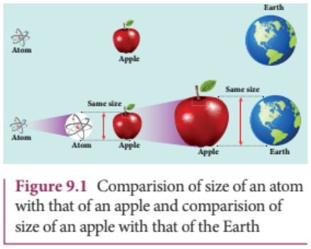

In earlier classes, we have studied that anything which occupies space is called matter. Matter can be classified into solids, liquids and gases. In our daily life, we use water for drinking, petrol for vehicles, we inhale oxygen, stainless steel vessels for cooking, etc. Experiences tell us that behaviour of one material is not the same as that of another, which means that the physical and chemical properties are different for different materials. In order to understand this, we need to know the fundamental constituents of materials.

When an object is divided repeatedly, the process of division could not be done beyond a certain stage in a similar way and we end up with a small speck. This small speck was defined as an atom. The word atom in Greek means 'without division or indivisible'. The size of an atom is very very small. For an example, the size of hydrogen atom (simplest among other atoms) is around $10^{-10}\mathrm{m}$. An American Physicist Richard P. Feynman said that if the size of an atom becomes the size of an apple, then the size of apple becomes the size of the earth as shown in Figure 9.1. Such a small entity is an atom.

In this unit, we first discuss the theoretical models of atom to understand its structure. The Bohr atom model is more successful than J. J. Thomson and Rutherford atom models. It explained many unsolved issues in those days and also gave better understanding of chemistry.

Later, scientists observed that even the atom is not the fundamental entity. It consists of electrons and nucleus. Around 1930, scientists discovered that nucleus is also made of proton and neutron. Further research discovered that even the proton and neutron are made up of fundamental entities known as quarks.

In this context, the remaining part of this unit is written to understand the structure and basic properties of nucleus. Further how the nuclear energy is produced and utilized are discussed.

### 9.2 ELECTRIC DISCHARGE THROUGH GASES

Gases at normal atmospheric pressure are poor conductors of electricity because they do not have free electrons for conduction.

But by special arrangement, one can make a gas to conduct electricity.

A simple and convenient device used to study the conduction of electricity through gases is known as gas discharge tube. The arrangement of discharge tube is shown in Figure 9.2. It consists of a long closed glass tube (of length nearly $50~\mathrm{cm}$ and diameter of $4\mathrm{cm}$ inside of which a gas in pure form is filled usually. The small opening in the tube is connected to a high vacuum pump and a low- pressure gauge. This tube is fitted with two metallic plates known as electrodes which are connected to secondary of an induction coil. The electrode connected to positive of secondary is known as anode and the electrode to the negative of the secondary is cathode. The potential of secondary is maintained at about $50~\mathrm{kV}$.

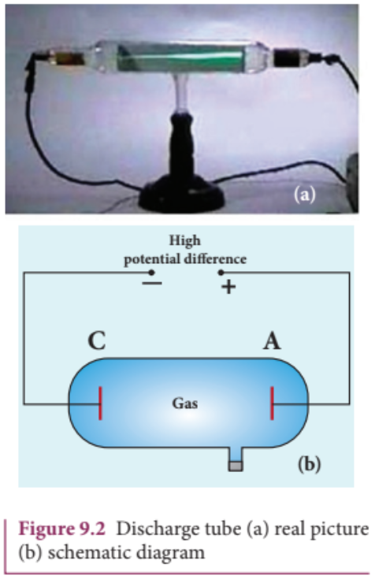

Suppose the pressure of the gas in discharge tube is reduced to around $110\mathrm{mm}$ of Hg using vacuum pump, it is observed that no discharge takes place. When the pressure is kept near $100\mathrm{mm}$ of Hg, the discharge of electricity through the tube takes place. Consequently, irregular streaks of light appear and also crackling sound is produced. When the pressure is reduced to the order of 10 mm of Hg, a luminous column known as positive column is formed from anode to cathode.

When the pressure reaches to around $0.01\mathrm{mm}$ of Hg, positive column disappears. At this time, a dark space is formed between anode and cathode which is often called Crooke's dark space and the walls of the tube appear with green colour. At this stage, some invisible rays emanate from cathode called cathode rays, which are later found be a beam of electrons.

## Properties of cathode rays

(1) Cathode rays possess energy and momentum and travel in a straight line with high speed of the order of $10^{7}\mathrm{ms}^{-1}$. It can be deflected by application of electric and magnetic fields. The direction of deflection indicates that they contain negatively charged particles.

(2) When the cathode rays are allowed to fall on matter, heat is produced. Cathode rays affect the photographic plates and also produce fluorescence when they fall on certain crystals and minerals.

(3) When the cathode rays fall on a material of high atomic weight, x-rays are produced.

(4) Cathode rays ionize the gas through which they pass.

(5) The speed of cathode rays is up to $\left(\frac{1}{10}\right)^{th}$ of the speed of light.

### 9.2.1 Determination of specific charge $\left(\frac{e}{m}\right)$ of an electron - Thomson's experiment

Thomson's experiment is considered as one among the landmark experiments for the birth of modern physics. In 1887, J. J. Thomson made remarkable improvement in the study of gases in discharge tubes. In the presence of electric and magnetic fields, the cathode rays were deflected. By the variation of electric and magnetic fields, the specific charge (charge per unit mass) of the cathode rays is measured.

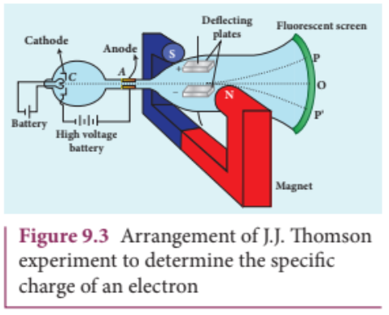

The arrangement of J. J. Thomson's experiment is shown in Figure 9.3. A highly evacuated discharge tube is used and cathode rays (electron beam) produced at cathode are attracted towards anode disc A. Anode disc is provided with pin hole in order to allow only a narrow beam of cathode rays. These cathode rays are now allowed to pass through the parallel metal plates which are maintained at high voltage as shown in Figure 9.3. Further, the gas discharge tube is kept in between pole pieces of magnet such that both electric and magnetic fields are acting perpendicular to each other. When the cathode rays strike the screen, they produce scintillation and hence bright spot is observed. This is achieved by coating the screen with zinc sulphide.

#### (i) Determination of velocity of cathode rays

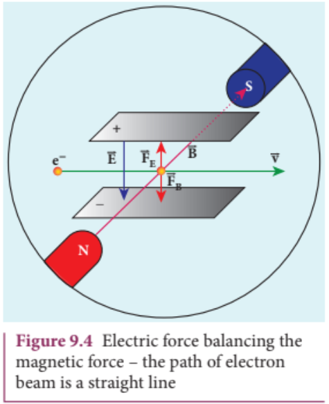

For a fixed electric field between the plates, the magnetic field is adjusted such that the cathode rays (electron beam) strike at the original position O (Figure 9.3). This means that the magnitude of electric force is balanced by the magnitude of force due to magnetic field as shown in Figure 9.4. Let $e$ be the charge of the cathode rays, then

$$eE = eBv$$

$$\Rightarrow v = \frac{E}{B} \quad (9.1)$$

#### (ii) Determination of specific charge

Since the cathode rays (electron beam) are accelerated from cathode to anode, the potential energy of the electron beam at the cathode is converted into kinetic energy of the electron beam at the anode. Let $V$ be the potential difference between anode and cathode, then the potential energy is $eV$. Then from law of conservation of energy,

$$eV = \frac{1}{2} mv^2\Rightarrow \frac{e}{m} = \frac{v^2}{2V}$$

Substituting the value of velocity from equation (9.1), we get

$$\frac{e}{m} = \frac{1}{2V}\frac{E^2}{B^2} \quad (9.2)$$

Substituting the values of $E$, $B$ and $V$, the specific charge can be determined as

$$\frac{e}{m} = 1.7\times 10^{11}\mathrm{Ckg}^{-1}$$

#### (iii) Deflection of charge only due to uniform electric field

When the magnetic field is turned off, the deflection is only due to electric field. The deflection in vertical direction is due to the electric force.

$$F_{e} = eE \quad (9.3)$$

Let $m$ be the mass of the electron and by applying Newton's second law of motion, acceleration of the electron is

$$a_{e} = \frac{1}{m} F_{e} \quad (9.4)$$

Substituting equation (9.4) in equation (9.3),

$$a_{e} = \frac{1}{m} eE = \frac{e}{m} E$$

Figure 9.5 Deviation of path by applying uniform electric field

Let $y$ be the deviation produced from original position on the screen as shown in Figure 9.5. Let the initial upward velocity of cathode ray be $u = 0$ before entering the parallel electric plates. Let $t$ be the time taken by the cathode rays to travel in electric field. Let $l$ be the length of one of the plates, then the time taken is

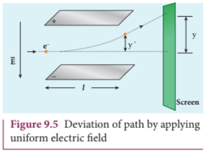

$$t = \frac{l}{v} \quad (9.5)$$

Hence, the deflection $y^{\prime}$ of cathode rays is (note: $u = 0$ and $a_{e} = \frac{e}{m} E$)

$$y^{\prime} = ut + \frac{1}{2} at^{2}\Rightarrow y^{\prime} = ut + \frac{1}{2} a_{e}t^{2}$$ $$= \frac{1}{2}\Bigl (\frac{e}{m} E\Bigr)\Bigl (\frac{l}{v}\Bigr)^{2}$$

$$y^{\prime} = \frac{1}{2}\frac{e}{m}\frac{l^{2}B^{2}}{E} \quad (9.6)$$

Therefore, the deflection $y$ on the screen is

$$y\propto y^{\prime}\Rightarrow y = Cy^{\prime}$$

where C is proportionality constant which depends on the geometry of the discharge tube and substituting $y^{\prime}$ value in equation 9.6, we get

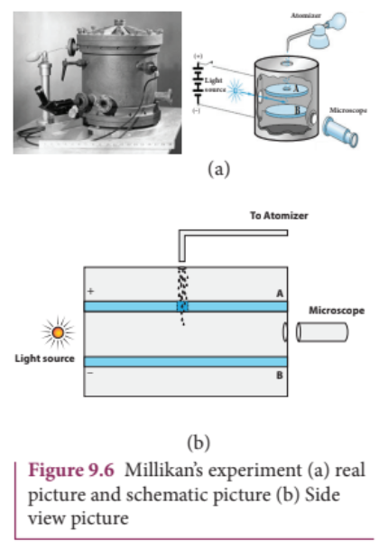

$$y = C\frac{1}{2}\frac{e}{m}\frac{l^{2}B^{2}}{E} \quad (9.7)$$

Rearranging equation (9.7) as

$$\frac{e}{m} = \frac{2yE}{Cl^{2}B^{2}} \quad (9.8)$$

Substituting the values on RHS, the value of specific charge is calculated as $\frac{e}{m} = 1.7 \times 10^{11} \mathrm{Ckg}^{- 1}$.

#### 9.2.2 Determination of charge of an electron - Millikan's oil drop experiment

Millikan's oil drop experiment is another important experiment in modern physics which is used to determine one of the fundamental constants of nature known as charge of an electron (Figure 9.6 (a)).

By adjusting electric field suitably, the motion of oil drop inside the chamber can be controlled - that is, it can be made to move up or down or even kept balanced in the field of view for sufficiently long time.

The experimental arrangement is shown in Figure 9.6 (b). The apparatus consists of two horizontal circular metal plates A and B each with diameter around $20 \mathrm{cm}$ and are separated by a small distance $1.5 \mathrm{cm}$. These two parallel plates are enclosed in a chamber with glass walls. Further, plates A and B are maintained at high potential difference around $10kV$ such that electric field acts vertically downward. A small hole is made at the centre of the upper plate A and an atomizer is kept exactly above the hole to spray the liquid. When a fine droplet of the highly viscous non volatile liquid (like glycerine) is sprayed using atomizer, they fall freely downward through the hole of the top plate only under the influence of gravity.

Few oil drops in the chamber can acquire electric charge (negative charge) because of friction with air or passage of x- rays in between the parallel plates. Further the chamber is illuminated by light which is passed horizontally and oil drops can be seen clearly using microscope placed perpendicular to the light beam.

These drops can move either upwards or downward.

Let $m$ be the mass of the oil drop and $q$ be its charge. Then the forces acting on the droplet are

(a) gravitational force $F_{g} = mg$ (b) electric force $F_{e} = qE$ (c) buoyant force $F_{b}$ (d) viscous force $F_{v}$

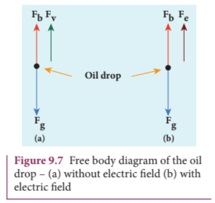

#### (a) Determination of radius of the droplet

When the electric field is switched off, the oil drop accelerates downwards. Due to the presence of air drag forces, the oil drops easily attain its terminal velocity and moves with constant velocity. This velocity can be carefully measured by noting down the time taken by the oil drop to fall through a predetermined distance. The free body diagram of the oil drop is shown in Figure 9.7 (a), we note that viscous force and buoyant force balance the gravitational force.

Let the gravitational force acting on the oil drop (downward) be $F_{g} = mg$

Let us assume that oil drop to be spherical in shape. Let $\rho$ be the density of the oil drop, and $r$ be the radius of the oil drop, then the mass of the oil drop can be expressed in terms of its density as

$$\begin{array}{l}\rho = \frac{m}{V}\\ \Rightarrow m = \rho \left(\frac{4}{3}\pi r^3\right)\left\{ \begin{array}{l}\because \text{volume of the}\\ \text{sphere},V = \frac{4}{3}\pi r^3 \end{array} \right\} \end{array} \quad (9.9)$$

The gravitational force can be written in terms of density as

$$F_{g} = mg\Rightarrow F_{g} = \rho \left(\frac{4}{3}\pi r^{3}\right)g$$

Let $\sigma$ be the density of the air, the upthrust force experienced by the oil drop due to displaced air is

$$F_{b} = \sigma \left(\frac{4}{3}\pi r^{3}\right)g$$

Once the oil drop attains a terminal velocity $v$, the net downward force acting on the oil drop is equal to the viscous force acting opposite to the direction of motion of the oil drop. From Stokes law, the viscous force on the oil drop is

$$F_{v} = 6\pi r\nu \eta$$

From the free body diagram as shown in Figure 9.7 a), the force balancing equation is

$$F_{g} = F_{b} + F_{v}$$

$$\rho \left(\frac{4}{3}\pi r^{3}\right)g = \sigma \left(\frac{4}{3}\pi r^{3}\right)g + 6\pi r\nu \eta$$

$$\frac{4}{3}\pi r^{3}(\rho -\sigma)g = 6\pi r\nu \eta$$

$$\frac{2}{3}\pi r^{3}(\rho -\sigma)g = 3\pi r\nu \eta$$

$$r = \left[\frac{9\eta\nu}{2(\rho - \sigma)g}\right]^{\frac{1}{2}}$$

Thus, equation (9.9) gives the radius of the oil drop.

#### (b) Determination of electric charge

When the electric field is switched on, charged oil drops experience an upward electric force $(qE)$. Among many drops, one particular drop can be chosen in the field of view of microscope and strength of the electric field is adjusted to make that particular drop to be stationary. Under these circumstances, there will be no viscous force acting on the oil drop. Then, from the free body diagram shown Figure 9.7 (b), the net force acting on the oil droplet is

$$F_{e} + F_{b} = F_{g}$$

$$\Rightarrow qE + \frac{4}{3}\pi r^3\sigma g = \frac{4}{3}\pi r^3\rho g$$

$$\Rightarrow qE = \frac{4}{3}\pi r^3 (\rho -\sigma)g \quad (9.10)$$

$$\Rightarrow q = \frac{4}{3E}\pi r^3 (\rho -\sigma)g \quad (9.11)$$

Substituting equation (9.9) in equation (9.11), we get

$$q = \frac{18\pi}{E}\left(\frac{\eta^3\nu^3}{2(\rho - \sigma)g}\right)^{\frac{1}{2}} \quad (9.12)$$

Millikan repeated this experiment several times and computed the charges on oil drops. He found that the charge of any oil drop can be written as integral multiple of a basic value, $- 1.6\times 10^{- 19}\mathrm{C}$

## 9.3 ATOM MODELS

### Introduction

Around 400 B.C, Greek philosophers Leucippus and Democritus proposed the concept of atom, Every object on continued subdivision ultimately yields atoms. Later, many physicists and chemists tried to understand the nature with the idea of atoms. Many theories were proposed to explain the properties (physical and chemical) of bulk materials on the basis of atomic model.

For instance, J. J. Thomson proposed a theoretical atom model which is based on static distribution of electric charges. Since this model fails to explain the stability of atom, one of his students E. Rutherford proposed the first dynamic model of an atom. Rutherford gave atom model which is based on results of an experiment done by his students (Geiger and Marsden). But this model also failed to explain the stability of the atom.

Later, Niels Bohr who is also a student of Rutherford proposed an atomic model for hydrogen atom which is more successful than other two models. Niels Bohr atom model could explain the stability of the atom and also the origin of line spectrum. There are other atom models, such as Sommerfeld's atom model and atom model from wave mechanics (quantum mechanics). But we will restrict ourselves only to very simple (mathematically simple) atom model in this section.

### 9.3.1 J. J. Thomson's Model (Water melon model)

In this model, the atoms are visualized as homogeneous spheres which contain uniform distribution of positively charged particles (Figure 9.8 (a)). The negatively charged particles known as electrons are embedded in it like seeds in water melon as shown in Figure 9.8 (b).

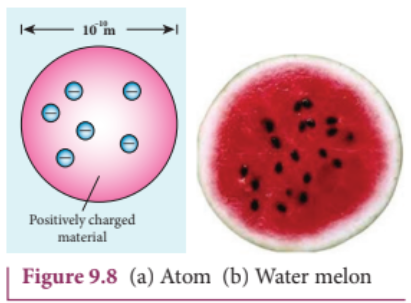

The atoms are electrically neutral, this implies that the total positive charge in an atom is equal to the total negative charge. According to this model, all the charges are assumed to be at rest. But from classical electrodynamics, no stable equilibrium points exist in electrostatic configuration (this is known as Earnshaw's theorem) and hence such an atom cannot be stable. Further, it fails to explain the origin of spectral lines observed in the spectrum of hydrogen atom and other atoms.

### 9.3.2 Rutherford's model

In 1911, Geiger and Marsden did a remarkable experiment based on the advice of their teacher Rutherford, which is known as scattering of alpha particles by gold foil.

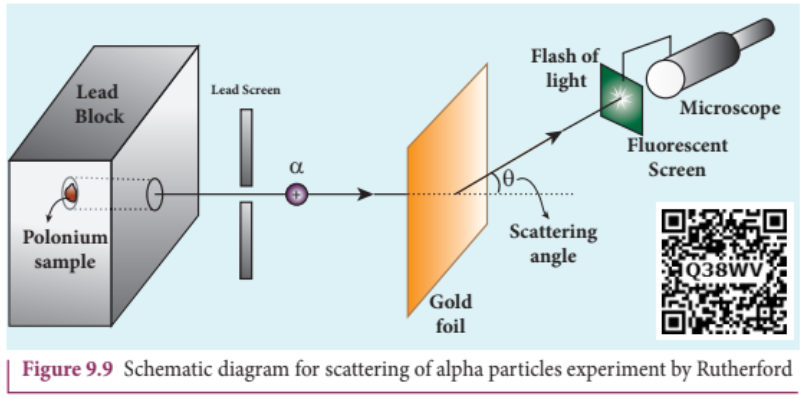

The experimental arrangement is shown in Figure 9.9. A source of alpha particles (radioactive material, example polonium) is kept inside a thick lead box with a fine hole as seen in Figure 9.9. The alpha particles coming through the fine hole of lead box pass through another fine hole made on the lead screen. These particles are now allowed to fall on a thin gold foil and it is observed that the alpha particles passing through gold foil are scattered through different angles. A movable screen (from $0^{\circ}$ to $180^{\circ}$) which is made up of zinc sulphide (ZnS) is kept on the other side of the gold foil to collect the scattered alpha particles. Whenever alpha particles strike the screen, a flash of light is observed which can be seen through a microscope.

Rutherford proposed an atom model based on the results of alpha scattering experiment. In this experiment, alpha particles (positively charged particles) were allowed to fall on the atoms of a metallic gold foil. The results of this experiment are given below and are shown in Figure 9.10, Rutherford expected the atom model to be as seen in Figure 9.10 (a) but the experiment showed the model as in Figure 9.10 (b).

(a) Most of the alpha particles were un-deflected through the gold foil and went straight.
(b) Some of the alpha particles were deflected through a small angle.
(c) A few alpha particles (one in thousand) were deflected through the angle more than $90^{\circ}$
(d) Very few alpha particles returned back (back scattered) - that is, deflected back by $180^{\circ}$

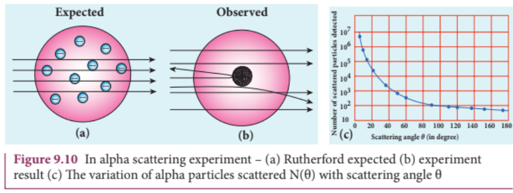

In Figure 9.10 (c), the dotted points are the alpha scattering experiment data points obtained by Geiger and Marsden and the solid curve is the prediction from Rutherford's nuclear model. It is observed that the Rutherford's nuclear model is in good agreement with the experimental data.

## Conclusion made by Rutherford based on the above observation

From the experimental observations, Rutherford proposed that an atom has a lot of empty space and contains a tiny matter at its centre known as nucleus whose size is of the order of $10^{- 14}\mathrm{m}$. The nucleus is positively charged and most of the mass of the atom is concentrated in the nucleus. The nucleus is surrounded by negatively charged electrons. Since static charge distribution cannot be in a stable equilibrium, he suggested that the electrons are not at rest and they revolve around the nucleus in circular orbits like planets revolving around the sun.

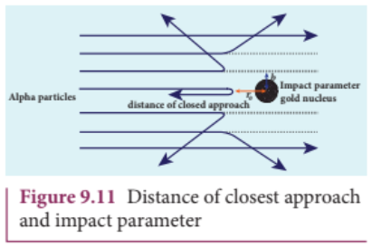

When an alpha particle moves straight towards the nucleus, it reaches a point where it comes to rest momentarily and returns back as shown in Figure 9.11. The minimum distance between the centre of the nucleus and the alpha particle just before it gets reflected back through $180^{\circ}$ is defined as the distance of closest approach $\mathbf{r}_0$ (also known as contact distance). At this distance, all the kinetic energy of the alpha particle will be converted into electrostatic potential energy (Refer unit 1, volume 1 of $+2$ physics text book).

$$\frac{1}{2} m\nu_{0}^{2} = \frac{1}{4\pi\epsilon_{0}}\frac{(2e)(Ze)}{r_{0}}$$

$$\Rightarrow r_0 = \frac{1}{4\pi\epsilon_0}\frac{2Ze^2}{\left(\frac{1}{2}m\nu_0^2\right)} = \frac{1}{4\pi\epsilon_0}\frac{2Ze^2}{E_k}$$

where $E_{k}$ is the kinetic energy of the alpha particle. This is used to estimate the size of the nucleus but size of the nucleus is always lesser than the distance of closest approach. Further, Rutherford calculated the radius of the nucleus for different nuclei and found that it ranges from $10^{- 14}\mathrm{m}$ to $10^{- 15}\mathrm{m}$.

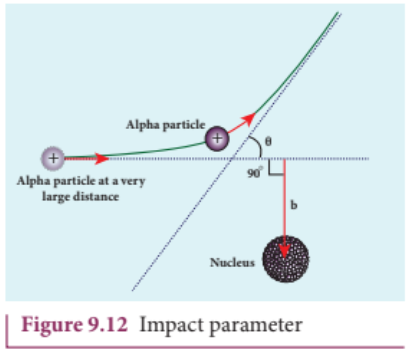

The impact parameter $(b)$ (see Figure 9.12) is defined as the perpendicular distance between the centre of the gold nucleus and the direction of velocity vector of alpha particle when it is at a large distance. The relation between impact parameter and scattering angle can be shown as

$$b\propto \cot \left(\frac{\theta}{2}\right)\Rightarrow b = K\cot \left(\frac{\theta}{2}\right) \quad (9.13)$$

where $K = \frac{1}{4\pi\epsilon_0}\frac{2Ze^2}{mv_0^2}$ and $\theta$ is called scattering angle. Equation (9.13) implies that when impact parameter increases, the scattering angle decreases. Smaller the impact parameter, larger will be the deflection of alpha particles.

## Drawbacks of Rutherford model

Rutherford atom model helps in the calculation of the diameter of the nucleus and also the size of the atom but has the following limitations:

(a) This model fails to explain the distribution of electrons around the nucleus and also the stability of the atom.

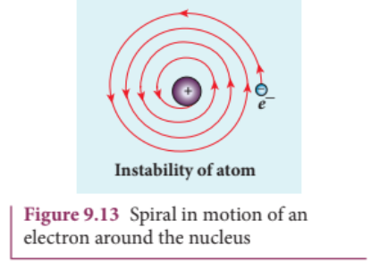

According to classical electrodynamics, any accelerated charge should emit electromagnetic radiations continuously. Due to emission of radiations, the charge loses its energy. Hence, it can no longer sustain the circular motion. The radius of the orbit, therefore, becomes smaller and smaller (undergoes spiral motion) as shown in Figure 9.13 and finally the electron should fall into the nucleus and the atoms should disintegrate. But this does not happen.

Hence, Rutherford model could not account for the stability of atoms.

(b) According to this model, emission of radiation must be continuous and must give continuous emission spectrum but experimentally we observe only line (discrete) emission spectrum for atoms.

### 9.3.3 Bohr atom model

In order to overcome the limitations of the Rutherford atom model in explaining the stability and also the line spectrum observed for a hydrogen atom (Figure 9.14), Niels Bohr made modifications in Rutherford atom model. He is the first person to give better theoretical model of the structure of an atom to explain the line spectrum of hydrogen atom. The following are the assumptions (postulates) made by Bohr.

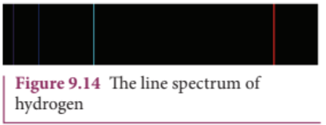

## Postulates of Bohr atom model:

(a) The electron in an atom moves around nucleus in circular orbits under the influence of Coulomb electrostatic force of attraction. This Coulomb force gives necessary centripetal force for the electron to undergo circular motion.

(b) Electrons in an atom revolve around the nucleus only in certain discrete orbits called stationary orbits and electron in such orbits do not radiate electromagnetic energy. Only those discrete orbits allowed are stable orbits.

The angular momentum of the electron in these stationary orbits are quantized - that is, it can be written as an integer or integral multiple of $\frac{h}{2\pi}$ called as reduced Planck's constant - that is, $\hbar$ (read it as h- bar) and the integer $n$ is called as principal quantum number.

$$l = n\hbar \qquad \text{where} \hbar = \frac{h}{2\pi}$$

This condition is known as angular momentum quantization condition.

According to quantum mechanics, particles like electrons have dual nature (Refer unit 8, volume 2 of $+2$ physics text book). The standing wave pattern of the de Broglie wave associated with orbiting electron in a stable orbit is shown in Figure 9.15.

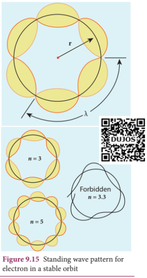

The circumference of an electron's orbit of radius $r$ must be an integral multiple of de Broglie wavelength - that is,

$$2\pi r = n\lambda \qquad (9.14)$$

But the de Broglie wavelength $(\lambda)$ associated with an electron of mass $m$ moving with velocity $\upsilon$ is $\lambda = \frac{h}{m\upsilon}$ where $h$ is called Planck's constant. Thus from equation (9.14),

$$2\pi r = n\left(\frac{h}{m\upsilon}\right)$$ $$m\upsilon r = n\frac{h}{2\pi}$$

For any particle of mass $m$ undergoing circular motion with radius $r$ and velocity $\upsilon$, the magnitude of angular momentum $l$ is given by

$$l = r(m\upsilon)$$ $$m\upsilon r = l = n\hbar$$

(c) Energy of the electron in orbits is not continuous but only discrete. This is called the quantization of energy. An electron can jump from one orbit to another orbit by absorbing or emitting a photon whose energy is equal to the difference in energy $(\Delta E)$ between the two orbital levels (Figure 9.16)

$$\Delta E = E_{final} - E_{initial} = h\nu = h\frac{c}{\lambda}$$

where $c$ is the speed of light and $\lambda$ is the wavelength and $\nu$ is the frequency of the radiation emitted. Thus, the frequency of the radiation emitted is related only to change in atomic energy levels and it does not depend on frequency of orbital motion of the electron.

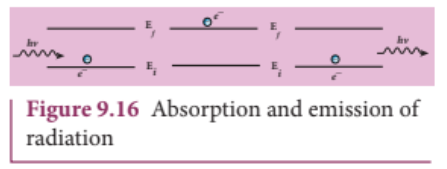

## EXAMPLE 9.1

The radius of the $5^{\mathrm{th}}$ orbit of hydrogen atom is $13.25\mathrm{\AA}$. Calculate the de broglie wavelength of the electron orbiting in the $5^{\mathrm{th}}$ orbit.

## Solution:

$$2\pi r = n\lambda$$ $$2\times 3.14\times 13.25\dot{\mathrm{A}} = 5\times \lambda$$ $$\therefore \lambda = 16.64\dot{\mathrm{A}}$$

## EXAMPLE 9.2

Find the (i) angular momentum (ii) velocity of the electron revolving in the $5^{\mathrm{th}}$ orbit of hydrogen atom.

$$(h = 6.6\times 10^{-34}\mathrm{Js},m = 9.1\times 10^{-31}\mathrm{kg})$$

## Solution

(i) Angular momentum is given by

$$l = n\hbar = \frac{nh}{2\pi}$$ $$= \frac{5\times 6.6\times 10^{-34}}{2\times 3.14} = 5.25\times 10^{-34}\mathrm{kgm^2s^{-1}}$$

(ii) Velocity is given by

$$\mathrm{Velocity}\ u = \frac{l}{mr}$$ $$\displaystyle = \frac{(5.25\times 10^{-34}\mathrm{kgm^2s^{-1}})}{(9.1\times 10^{-31}\mathrm{kg})(13.25\times 10^{-10}\mathrm{m})}$$ $$\displaystyle u = 4.4\times 10^{5}\mathrm{ms^{-1}}$$

## Radius of the orbit of the electron and velocity of the electron

Consider an atom which contains the nucleus at rest and an electron revolving around the nucleus in a circular orbit of radius $r_{n}$ as shown in Figure 9.17. Nucleus is made up of protons and neutrons. Since proton is positively charged and neutron is electrically neutral, the charge of a nucleus is entirely due to the charge of protons.

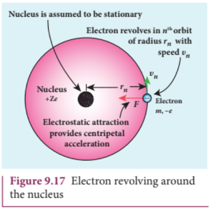

Let $Z$ be the atomic number of the atom, then $+Ze$ is the charge of the nucleus. Let $- e$ be the charge of the electron. From Coulomb's law, the force of attraction between the nucleus and the electron is

$$\vec{F}_{\mathrm{coulomb}} = \frac{1}{4\pi\epsilon_0}\frac{(+Ze)(-e)}{r_n^2}\hat{r}$$ $$\displaystyle = -\frac{1}{4\pi\epsilon_0}\frac{Ze^2}{r_n^2}\hat{r}$$

This force provides necessary centripetal force

$$\vec{F}_{\mathrm{centripetal}} = \frac{mv_n^2}{r_n}\hat{r}$$

where $m$ be the mass of the electron that moves with a velocity $v_{n}$ in a circular orbit. Therefore,

$$\left|\vec{F}_{\mathrm{coulomb}}\right| = \left|\vec{F}_{\mathrm{centripetal}}\right|$$

$$\frac{1}{4\pi\epsilon_0}\frac{Ze^2}{r_n^2} = \frac{mv_n^2}{r_n}$$

Multiplied and divided by $m$

$$r_n = \frac{4\pi\epsilon_0(mv_nr_n)^2}{Zme^2} \quad (9.15)$$

From Bohr's assumption, the angular momentum quantization condition, $mv_nr_n = l_n = n\hbar$

$$r_{n} = \frac{4\pi\epsilon_{0}(n\hbar)^{2}}{Zme^{2}} = \frac{4\pi\epsilon_{0}n^{2}\hbar^{2}}{Zme^{2}}$$

$$r_{n} = \left(\frac{\epsilon_{0}h^{2}}{\pi m e^{2}}\right)\frac{n^{2}}{Z}\qquad (\because \hbar = \frac{h}{2\pi}) \quad (9.16)$$

where $n\in \mathbb{N}$. Since, $\epsilon_{0}, h, e$ and $\pi$ are constants. Therefore, the radius of the orbit becomes

$$r_{n} = a_{0}\frac{n^{2}}{Z}$$

where $a_{0} = \frac{\epsilon_{0}h^{2}}{\pi m e^{2}} = 0.529\mathrm{\AA}$. This is known as Bohr radius which is the smallest radius of the orbit in hydrogen atom. Bohr radius is also used as unit of length called Bohr. 1 Bohr $= 0.53\mathrm{\AA}$. For hydrogen atom $(Z = 1)$ the radius of $\mathrm{n}^{\mathrm{th}}$ orbit is

$$r_{n} = a_{0}n^{2}$$

For $n = 1$ (first orbit or ground state),

$$r_{1} = a_{0} = 0.529\mathrm{\AA}$$

For $n = 2$ (second orbit or first excited state),

$$r_{2} = 4a_{0} = 2.116\mathrm{\AA}$$

For $n = 3$ (third orbit or second excited state),

$$r_{3} = 9a_{0} = 4.761\mathrm{\AA}$$

and so on.

Thus the radius of the orbit from centre increases with $n$, that is, $r_{n}\propto n^{2}$ as shown in Figure 9.18.

Further, Bohr's angular momentum quantization condition leads to

$$\frac{mv_{n}a_{0}n^{2}}{Z} = n\frac{h}{2\pi}\left[\therefore r_{n} = a_{0}\frac{n^{2}}{Z}\right]$$

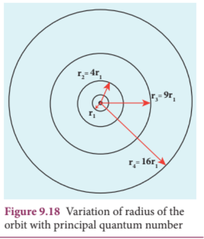

$$v_{n} = \frac{h}{2\pi m a_{0}n}$$

in atomic physics $v_{n}\propto \frac{1}{n}$

Note that the velocity of electron decreases as the principal quantum number (orbit number) increases as shown in Figure 9.19. This curve is the rectangular hyperbola. This implies that the velocity of electron in ground state is maximum when compared to that in excited states.

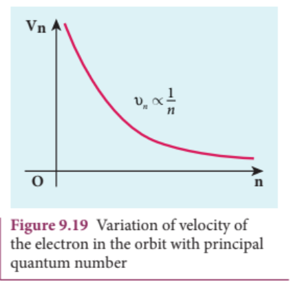

**The energy of an electron in the nth orbit**

Since the electrostatic force is a conservative force, the potential energy for the $n^{\mathrm{th}}$ orbit is

$$U_{n} = \frac{1}{4\pi\epsilon_{0}}\frac{(+Ze)(-e)}{r_{n}} = -\frac{1}{4\pi\epsilon_{0}}\frac{Ze^{2}}{r_{n}}$$ $$\qquad = -\frac{1}{4\epsilon_{0}^{2}}\frac{Z^{2}me^{4}}{h^{2}n^{2}}\left(\because r_{n} = \frac{\epsilon_{0}h^{2}}{\pi m e^{2}}\frac{n^{2}}{Z}\right)$$

The kinetic energy of the electron in $n^{\mathrm{th}}$ orbit is

$$KE_{n} = \frac{1}{2} mv_{n}^{2} = \frac{me^{4}}{8\epsilon_{0}^{2}h^{2}}\frac{Z^{2}}{n^{2}}$$

This implies that $U_{n} = - 2KE_{n}$. Total energy of the electron in in the $n^{\mathrm{th}}$ orbit is

$$E_{n} = KE_{n} + U_{n} = KE_{n} - 2KE_{n} = -KE_{n}$$ $$E_{n} = -\frac{me^{4}}{8\epsilon_{0}^{2}h^{2}}\frac{Z^{2}}{n^{2}}$$

For hydrogen atom $(Z = 1)$

$$E_{n} = -\frac{me^{4}}{8\epsilon_{0}^{2}h^{2}}\frac{1}{n^{2}}\mathrm{~joule} \quad (9.17)$$

where $n$ stands for principal quantum number. The negative sign in equation (9.17) indicates that the electron is bound to the nucleus.

Substituting the values of mass and charge of an electron $(m$ and $e$ ) permittivity of free space $\epsilon_{0}$ and Planck's constant $h$ and expressing energy in terms of electron $(+e V)$), we get

$$E_{n} = -13.6\frac{1}{n^{2}} eV$$

For the first orbit (ground state), the total energy of electron is $E_{1} = - 13.6eV$ For the second orbit (first excited state), the total energy of electron is $E_{2} = - 3.4eV$ For the third orbit (second excited state), the total energy of electron is $E_{3} = - 1.51eV$ and so on.

Notice that the energy of the first excited state is greater than that of the ground state, second excited state is greater than that of the first excited state and so on. Thus, the orbit which is closest to the nucleus $(r_{1})$ has lowest energy (minimum energy what it is compared with other orbits). So, it is often called ground state energy (lowest energy state). The ground state energy of hydrogen $(- 13.6$ $eV)$ is used as a unit of energy called Rydberg $(1\mathrm{Rydberg} = - 13.6eV)$

The negative value of this energy is because of the way the zero of the potential energy is defined. When the electron is taken away to an infinite distance (very far distance) from nucleus, both the potential energy and kinetic energy terms vanish and hence the total energy also vanishes.

The energy level diagram along with the shape of the orbits for increasing values of $n$ are shown in Figure 9.20. It shows that the energies of the excited states come closer and closer together when the principal quantum number $n$ takes higher values.

## EXAMPLE 9.3

(a) Show that the ratio of velocity of an electron in the first Bohr orbit to the speed of light $c$ is a dimensionless number.
(b) Compute the velocity of electrons in ground state, first excited state and second excited state in Bohr atom model for hydrogen atom.

## Solution

(a) The velocity of an electron in $n^{\mathrm{th}}$ orbit is $\nu_{n} = \frac{h}{2\pi m a_{0}}\frac{Z}{n}$ where $a_{0} = \frac{\epsilon_{0}h^{2}}{\pi m e^{2}} =$ Bohr radius. Substituting for $a_{0}$ in $\nu_{n}$

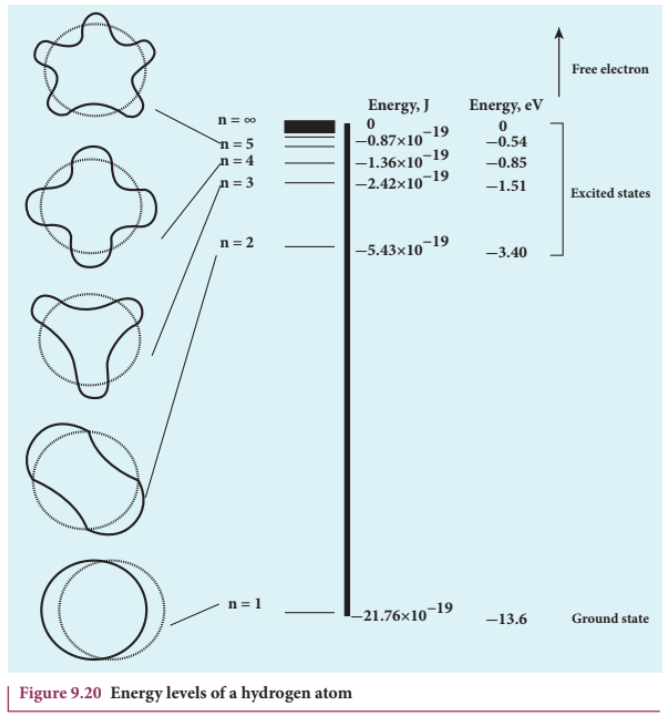

$$\nu_{n} = \frac{e^{2}}{2\epsilon_{0}h}\frac{Z}{n} = c\left(\frac{e^{2}}{2\epsilon_{0}hc}\right)\frac{Z}{n} = \frac{\alpha cZ}{n}$$

where $c$ is the speed of light in free space or vacuum and its value is $c = 3\times 10^{8}\mathrm{m}\mathrm{s}^{- 1}$ and $\alpha$ is called fine structure constant.

For a hydrogen atom, $Z = 1$ and for the first orbit, $n = 1$, the ratio of velocity of electron in first orbit to the speed of light in vacuum or free space is

$$\begin{array}{l}\frac{\nu_1}{c} = \alpha = \frac{e^2}{2\epsilon_0hc}\\ \alpha = \frac{(1.6\times 10^{-19}\mathrm{C})^2}{2\times(8.854\times 10^{-12}\mathrm{C}^2\mathrm{N}^{-1}\mathrm{m}^{-2})}\\ \times \frac{1}{(6.6\times 10^{-34}\mathrm{Nms})\times(3\times 10^8\mathrm{ms}^{-1})}\\ \approx \frac{1}{136.9} = \frac{1}{137} \end{array}$$

number

(b) Using fine structure constant, the velocity of electron can be written as

$$\nu_{n} = \frac{\alpha cZ}{n}$$

For hydrogen atom $(Z = 1)$ the velocity of electron in $n^{\mathrm{th}}$ orbit is

$$\nu_{n} = \frac{c}{137}\frac{1}{n} = (2.19\times 10^{6})\frac{1}{n}\mathrm{ms}^{-1}$$

For the first orbit (ground state), the velocity of electron is

$$\nu_{1} = 2.19\times 10^{6}\mathrm{ms}^{-1}$$

For the second orbit (first excited state), the velocity of electron is

$$\nu_{2} = 1.095\times 10^{6}\mathrm{ms}^{-1}$$

For the third orbit (second excited state), the velocity of electron is

$$\nu_{3} = 0.73\times 10^{6}\mathrm{ms}^{-1}$$

Here, $\nu_{1} > \nu_{2} > \nu_{3}$

## EXAMPLE 9.4

The Bohr atom model is derived with the assumption that the nucleus of the atom is stationary and only electrons revolve around the nucleus. Suppose the nucleus is also in motion, then calculate the energy of this new system.

## Solution

Let the mass of the electron be $m$ and mass of the nucleus be $M$. Since there is no external force acting on the system, the centre of mass of hydrogen atom remains at rest. Hence, both nucleus and electron move about the centre of mass as shown in figure.

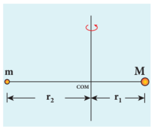

Let $V$ be the velocity of the nuclear motion and $\nu$ be the velocity of electron motion. Since the total linear momentum of the system is zero,

$$-m\nu + M V = 0 \ \text{or}$$ $$M V = m\nu = p$$ $$\vec{p}_e + \vec{p}_n = \vec{0}\ \text{or}$$ $$\left|\vec{p}_e\right| = \left|\vec{p}_n\right| = p$$

Hence, the kinetic energy of the system is

$$KE = \frac{p_n^2}{2M} +\frac{p_e^2}{2m} = \frac{p^2}{2}\left(\frac{1}{M} +\frac{1}{m}\right)$$

Let $\frac{1}{M} +\frac{1}{m} = \frac{1}{\mu_m}$. Here the reduced mass

$$\text{is}, \mu_m = \frac{mM}{M + m}$$

Therefore, the kinetic energy of the system now is $KE = \frac{p^2}{2\mu_m}$

Since the potential energy of the system is same, the total energy of the hydrogen can be expressed by replacing mass by reduced mass, which is

$$E_{n} = -\frac{\mu_{m}e^{4}}{8\epsilon_{0}^{2}h^{2}}\frac{1}{n^{2}}$$

Since the nucleus is very heavy compared to the electron, the reduced mass is closer to the mass of the electron.

In 1931, H.C. Urey and coworkers noticed that in the shorter wavelength region of the hydrogen spectrum lines, faint companion lines are observed. From the isotope displacement effect (isotope shift), the isotope of the same element can produce slightly different spectral lines. The presence of these faint lines confirmed the existence of isotopes of hydrogen atom (which is named as Deuterium).

On calculating wavelength or wave number difference between the faint and bright spectral lines, atomic mass of deuterium is measured to be twice that of atomic mass of hydrogen atom. Bohr atom model could not explain this isotopic shift. Thus by considering nuclear motion (although the movement of the nucleus is much smaller) into account in the Bohr atom model, the wave number or wavelength difference between the lines produces by the hydrogen atom and deuterium is theoretically calculated which perfectly agreed with the spectroscopic measured values.

The difference between hydrogen atom and deuterium is in the number of neutron. Hydrogen atom contains an electron and a proton, whereas deuterium has an electron, a proton and a neutron.

### Excitation energy and excitation potential

The energy required to excite an electron from lower energy state to any higher energy state is known as excitation energy.

The excitation energy for an electron from ground state (n = 1) to first excited state (n = 2) is called first excitation energy.

For hydrogen atom, it is

$$
E_I = E_2 - E_1 = -3.4 \ eV - (-13.6 \ eV) = 10.2 \ eV
$$

Similarly, the excitation energy for an electron from ground state (n = 1) to second excited state (n = 3) is called second excitation energy, which is

$$
E_{II} = E_3 - E_1 = -1.51 \ eV - (-13.6 \ eV) = 12.1 \ eV
$$

and so on.

Excitation potential is defined as excitation energy per unit charge.

For hydrogen atom, the first excitation state energy is

$$
E_I = e V_I
$$

First excitation potential for hydrogen atom is,

$$
\Rightarrow V_I = \frac{1}{e} E_I = 10.2 \ \text{volt}
$$

Similarly, second excitation potential is,

$$
\Rightarrow V_{II} = \frac{1}{e} E_{II} = 12.1 \ \text{volt}
$$

and so on.

### Ionization energy and ionization potential

An atom is said to be ionized when an electron is completely removed from the atom – that is, it reaches the state with energy \( E_{n \rightarrow \infty} \). The minimum energy required to remove an electron from an atom in the ground state is known as binding energy or ionization energy.

For hydrogen atom, the ground state ionization energy is,

$$
E_{\text{ionization}} = E_{\infty} - E_1 = 0 - (-13.6 \ eV) = 13.6 \ eV
$$

When an electron is in nth state of an atom, the energy required to remove an electron from that state – that is, the corresponding ionization energy is

$$
E_{\text{ionization}} = E_{\infty} - E_n = 0 - \left( -\frac{13.6 Z^{2}}{n^{2}} \ eV \right) = \frac{13.6 Z^{2}}{n^{2}} \ eV
$$

At normal room temperature, the electron in a hydrogen atom (Z=1) spends most of its time in the ground state.

**Table 9.1**

| Physical Quantity | Ground State | First Excited State | Second Excited State |
|---|---|---|---|
| Radius (\( r_n \propto n^2 \)) | 0.529 Å | 2.116 Å | 4.761 Å |
| Velocity (\( v_n \propto n^{-1} \)) | \( 2.19 \times 10^6 \ \text{m s}^{-1} \) | \( 1.095 \times 10^6 \ \text{m s}^{-1} \) | \( 0.73 \times 10^6 \ \text{m s}^{-1} \) |
| Total Energy (\( E_n \propto n^{-2} \)) | -13.6 eV | -3.4 eV | -1.51 eV |

The energy required to remove an electron from the ground state of an atom to the outer most orbit \( (E = 0 \ \text{for} \ n \rightarrow \infty) \) is known as first ionization energy \( (13.6 \ \text{eV}) \). Then, the hydrogen atom is said to be in ionized state or simply called as hydrogen ion, denoted by \( H^{+} \). If we supply more energy than the ionization energy, the excess energy appears as the kinetic energy of the free electron.

Ionization potential is defined as ionization energy per unit charge.

$$
V_{\text{ionization}} = \frac{1}{e} E_{\text{ionization}} = \frac{13.6}{n^{2}} Z^{2} \ V
$$

Thus, for a hydrogen atom \( (Z = 1) \), the ionization potential is

$$
V = \frac{13.6}{n^{2}} \ \text{volt}
$$

The radius, velocity and total energy in ground state, first excited state and second excited state are given in Table 9.1.

## EXAMPLE 9.5

Suppose the energy of an electron in hydrogen-like atom is given as \( E_n = -\frac{54.4}{n^{2}} \ \text{eV} \) where \( n \in \mathbb{N} \). Calculate the following:

(a) Sketch the energy levels for this atom and compute its atomic number.
(b) If the atom is in ground state, compute its first excitation potential and also its ionization potential.
(c) When a photon with energy \( 42 \ \text{eV} \) and another photon with energy \( 51 \ \text{eV} \) are made to collide with this atom, does this atom absorb these photons?
(d) Determine the radius of its first Bohr orbit.
(e) Calculate the kinetic and potential energies of electron in the ground state.

### Solutions

(a) Given that

$$
E_n = -\frac{54.4}{n^{2}} \ \text{eV}
$$

For \( n = 1 \), the ground state energy \( E_1 = -54.4 \ \text{eV} \) and for \( n = 2 \), \( E_2 = -13.6 \ \text{eV} \). Similarly, \( E_3 = -6.04 \ \text{eV} \), \( E_4 = -3.4 \ \text{eV} \) and so on.

For large value of principal quantum number - that is, \( n = \infty \), we get \( E_{\infty} = 0 \ \text{eV} \).
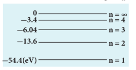
(b) For a hydrogen-like atom, ground state energy is

$$
E_1 = -\frac{13.6}{n^{2}} Z^{2} \ \text{eV}
$$

where \( Z \) is the atomic number. Hence, comparing this energy with given energy, we get

$$
-13.6 Z^{2} = -54.4 \Rightarrow Z = \pm 2
$$

Since atomic number cannot be negative number, \( Z = 2 \).

The first excitation energy is

$$
E_I = E_2 - E_1 = -13.6 \ \text{eV} - (-54.4 \ \text{eV}) = 40.8 \ \text{eV}
$$

Hence, the first excitation potential is

$$
V_I = \frac{1}{e} E_I = \frac{40.8 \ \text{eV}}{e} = 40.8 \ \text{volt}
$$

The first ionization energy is

$$
E_{\text{ionization}} = E_{\infty} - E_1 = 0 - (-54.4 \ \text{eV}) = 54.4 \ \text{eV}
$$

Hence, the first ionization potential is

$$
V_{\text{ionization}} = \frac{1}{e} E_{\text{ionization}} = \frac{54.4 \ \text{eV}}{e} = 54.4 \ \text{volt}
$$

(c) Consider two photons to be A and B.

Given that photon A with energy \( 42 \ \text{eV} \) and photon B with energy \( 51 \ \text{eV} \)

From Bohr assumption, difference in energy levels is equal to the energy photon absorbed, then atom will absorb energy, otherwise, not.

$$
E_2 - E_1 = -13.6 \ \text{eV} - (-54.4 \ \text{eV}) = 40.8 \ \text{eV} \approx 41 \ \text{eV}
$$

Similarly,

$$
E_3 - E_1 = -6.04 \ \text{eV} - (-54.4 \ \text{eV}) = 48.36 \ \text{eV}
$$

$$
E_4 - E_1 = -3.4 \ \text{eV} - (-54.4 \ \text{eV}) = 51 \ \text{eV}
$$

$$
E_3 - E_2 = -6.04 \ \text{eV} - (-13.6 \ \text{eV}) = 7.56 \ \text{eV}
$$

and so on.

But note that \( E_2 - E_1 \neq 42 \ \text{eV} \), \( E_3 - E_1 \neq 42 \ \text{eV} \), \( E_4 - E_1 \neq 42 \ \text{eV} \) and \( E_3 - E_2 \neq 42 \ \text{eV} \).

For all possibilities, no difference in energy is equal to the photon energy. Hence, photon A is not absorbed by this atom. But for Photon B, \( E_4 - E_1 = 51 \ \text{eV} \), which means Photon B can be absorbed by this atom.

(d) The radius of Bohr orbit is \( r_n = \frac{a_0 \times n^{2}}{Z} \)

For \( n = 1, Z = 2 \)

$$
r_1 = \frac{a_0}{2} = \frac{0.529}{2} = 0.265 \ \text{Å}
$$

(e) Since total energy is equal to negative of kinetic energy in Bohr atom model, we get

$$
KE_n = -E_n = -\left( -\frac{54.4}{n^{2}} \ \text{eV} \right) = \frac{54.4}{n^{2}} \ \text{eV}
$$

Since Potential energy is negative of twice the kinetic energy,

$$
U_n = -2 KE_n = -2 \left( \frac{54.4}{n^{2}} \ \text{eV} \right) = -\frac{108.8}{n^{2}} \ \text{eV}
$$

For ground state, put \( n = 1 \)

Kinetic energy is \( KE_1 = 54.4 \ \text{eV} \) and Potential energy is \( U_1 = -108.8 \ \text{eV} \)

### 9.3.4 Atomic spectra

Materials in the solid, liquid and gaseous states emit electromagnetic radiations when they are heated up and these emitted radiations usually exhibit continuous spectrum. For example, when white light is examined through a spectrometer, electromagnetic radiations of all wavelengths are observed which is a continuous spectrum.

In early twentieth century, many scientists spent considerable time in understanding the characteristic radiations emitted by the atoms of individual elements exposed to a flame or electrical discharge. When they were viewed or photographed, instead of a continuous spectrum, the radiation contains a set of discrete lines, each with characteristic wavelength. In other words, the wavelengths of the radiation obtained are well defined and their positions and intensities are characteristic of the element as shown in Figure 9.21.

This implies that these spectra are unique to each element and can be used to identify the element of the gas (like finger print used to identify a person) - that is, it varies from one gas to another gas. This uniqueness of line spectra of elements made the scientists to determine the composition of stars, sun and also used to identify the unknown compounds.

#### Hydrogen spectrum

When the hydrogen gas enclosed in a tube is heated up, it emits electromagnetic radiations of certain sharply-defined characteristic wavelength (line spectrum), called hydrogen emission spectrum (Refer unit 5, volume 1 of +2 physics text book). The emission spectrum of hydrogen is shown in Figure 9.22(a).

When any gas is heated up, the thermal energy is supplied to excite the electrons. Similarly by allowing light to fall on the atoms, electrons can be excited. Once the electrons get sufficient energy as given by Bohr's postulate (c), it absorbs energy with particular wavelength (or frequency) and jumps from one stationary state (original state) to another state. The wavelengths (or frequencies) for the colours that are not observed are seen as dark lines in the absorption spectrum as shown in Figure 9.22 (b).
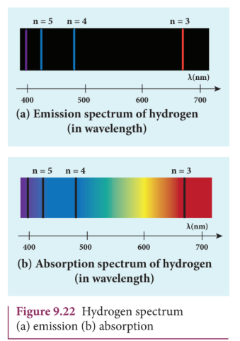
Since electrons in excited states have very small life time, these electrons jump back to ground state through spontaneous emission in a short duration of time (approximately \( 10^{-8} \ \text{s} \)) by emitting the radiation with same wavelength (or frequency) corresponding to the colours it absorbed (Figure 9.22 (a)). This is called emission spectroscopy.

The wavelengths of these lines can be calculated with great precision. Further, the emitted radiation contains wavelengths both lesser and greater than wavelengths of lines in the visible spectrum.
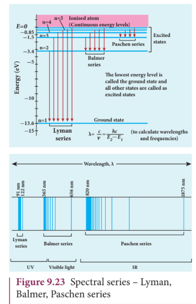
Notice that the spectral lines of hydrogen as shown in Figure 9.23 are grouped in separate series. In each series, the distance of separation between the consecutive wavelengths decreases from higher wavelength to the lower wavelength, and also wavelength in each series approach a limiting value known as the series limit. These series are named as Lyman series, Balmer series, Paschen series, Brackett series, Pfund series, etc. The wavelengths of these spectral lines perfectly agree with the wavelengths calculated using equation derived from Bohr atom model.

$$
\frac{1}{\lambda} = R \left( \frac{1}{n^{2}} - \frac{1}{m^{2}} \right) = \overline{\nu} \quad (9.18)
$$

where \( \overline{\nu} \) is known as wave number which is inverse of wavelength, \( R \) is known as Rydberg constant whose value is \( 1.09737 \times 10^{7} \ \text{m}^{-1} \) and \( m \) and \( n \) are positive integers such that \( m > n \). The various spectral series are discussed below:

#### (a) Lyman series

For \( n = 1 \) and \( m = 2, 3, 4, \dots \) in equation (9.18), the wave numbers or wavelength of spectral lines of Lyman series which lies in ultra-violet region,

$$
\overline{\nu} = \frac{1}{\lambda} = R \left( \frac{1}{1^{2}} - \frac{1}{m^{2}} \right)
$$

#### (b) Balmer series

For \( n = 2 \) and \( m = 3, 4, 5, \dots \) in equation (9.18), the wave numbers or wavelength of spectral lines of Balmer series which lies in visible region,

$$
\overline{\nu} = \frac{1}{\lambda} = R \left( \frac{1}{2^{2}} - \frac{1}{m^{2}} \right)
$$

#### (c) Paschen series

Put \( n = 3 \) and \( m = 4, 5, 6, \dots \) in equation (9.18). The wave number or wavelength of spectral lines of Paschen series which lies in infra-red region (near IR) is

$$
\overline{\nu} = \frac{1}{\lambda} = R \left( \frac{1}{3^{2}} - \frac{1}{m^{2}} \right)
$$

#### (d) Brackett series

For \( n = 4 \) and \( m = 5, 6, 7, \dots \) in equation (9.18), the wave numbers or wavelength of spectral lines of Brackett series which lies in infra-red region (middle IR),

$$
\overline{\nu} = \frac{1}{\lambda} = R \left( \frac{1}{4^{2}} - \frac{1}{m^{2}} \right)
$$

#### (e) Pfund series

For \( n = 5 \) and \( m = 6, 7, 8, \dots \) in equation (9.18), the wave numbers or wavelength of spectral lines of Pfund series which lies in infra-red region (far IR),

$$
\overline{\nu} = \frac{1}{\lambda} = R \left( \frac{1}{5^{2}} - \frac{1}{m^{2}} \right)
$$

Different spectral series are listed in Table 9.2.

**Table 9.2**

| n | m | Series Name | Region |
|---|---|---|---|
| 1 | 2,3,4,.... | Lyman | Ultraviolet |
| 2 | 3,4,5,.... | Balmer | Visible |
| 3 | 4,5,6,.... | Paschen | Infrared |
| 4 | 5,6,7,.... | Brackett | Infrared |
| 5 | 6,7,8,.... | Pfund | Infrared |

### Limitations of Bohr atom model

The following are the drawbacks of Bohr atom model

(a) Bohr atom model is valid only for hydrogen atom or hydrogen like-atoms but not for complex atoms.
(b) When the spectral lines are closely examined, individual lines of hydrogen spectrum are accompanied by a number of faint lines. This is called fine structure. This cannot be explained by Bohr atom model.
(c) Bohr atom model fails to explain the intensity variations in the spectral lines.
(d) The distribution of electrons in various levels cannot be completely explained by Bohr atom model.

## 9.4 NUCLEI

### Introduction

In the previous section, we have discussed about various preliminary atom models, Rutherford's alpha particle scattering experiment and Bohr atom model. These played a vital role to understand the structure of the atom and the nucleus. In this section, the structure of the nuclei and their properties, classifications are discussed.

### 9.4.1 Composition of nucleus

Atoms have a nucleus surrounded by electrons. The nucleus contains protons and neutrons. The neutrons are electrically neutral \( (q = 0) \) and the protons have positive charge \( (q = +e) \) equal in magnitude to the charge of the electron \( (q = -e) \). The number of protons in the nucleus is called the atomic number and it is denoted by \( Z \). The number of neutrons in the nucleus is called neutron number \( (N) \). The total number of neutrons and protons in the nucleus is called the mass number and it is denoted by \( A \). Hence, \( A = Z + N \).

The two constituents of nucleus namely neutrons and protons, are collectively called as nucleons. The mass of a proton is \( 1.6726 \times 10^{-27} \ \mathrm{kg} \) which is roughly 1836 times the mass of the electron. The mass of a neutron is slightly greater than the mass of the proton and it is equal to \( 1.6749 \times 10^{-27} \ \mathrm{kg} \).

To specify the nucleus of any element, we use the following general notation

$$
_{Z}^{A}X
$$

where \( X \) is the chemical symbol of the element, \( A \) is the mass number and \( Z \) is the atomic number. For example, the nitrogen nucleus is represented by \( ^{15}N \). It implies that nitrogen nucleus contains 15 nucleons of which 7 are protons \( (Z = 7) \) and 8 are neutrons \( (N = A - Z = 8) \). Note that once the element is specified, the value of \( Z \) is known and subscript \( Z \) is sometimes omitted. For example, nitrogen nucleus is simply denoted as \( ^{15}N \) and we call it as 'nitrogen fifteen'.

Since the nucleus is made up of positively charged protons and electrically neutral neutrons, the overall charge of the nucleus is positive and it has the value \( +Ze \). But the atom is electrically neutral which implies that the number of electrons in the atom is equal to the number of protons in the nucleus.

### 9.4.2 Isotopes, isobars, and isotones

#### Isotopes:

In nature, there are atoms of a particular element whose nuclei have same number of protons but different number of neutrons. These kinds of atoms are called isotopes. In other words, isotopes are atoms of the same element having same atomic number \( Z \), but different mass number \( A \). For example, hydrogen has three isotopes and they are represented as \( ^{1}_{1}H \) (hydrogen), \( ^{2}_{1}H \) (deuterium), and \( ^{3}_{1}H \) (tritium). Note that all the three nuclei have one proton and, hydrogen has no neutron, deuterium has 1 neutron and tritium has 2 neutrons.

The number of isotopes for the particular element and their relative abundances (percentage) vary with each element. For example, carbon has four main isotopes: \( ^{11}_{6}C \), \( ^{12}_{6}C \), \( ^{13}_{6}C \) and \( ^{14}_{6}C \). But in nature, the percentage of \( ^{12}_{6}C \) is approximately \( 98.9\% \), that of \( ^{13}_{6}C \) is \( 1.1\% \) and that of \( ^{14}_{6}C \) is \( 0.0001\% \). The other carbon isotope \( ^{11}_{6}C \), does not occur naturally and it can be produced only in nuclear reactions in the laboratory or by cosmic rays.

Since the chemical properties of any atom are determined only by electrons, the isotopes of any element have same electronic structure and same chemical properties. So the isotopes of the same element are placed in the same location in the periodic table.

#### Isobars:

Isobars are the atoms of different elements having the same mass number \( A \), but different atomic number \( Z \). In other words, isobars are the atoms of different chemical elements which have same number of nucleons. For example \( ^{40}_{16}S \), \( ^{40}_{17}Cl \), \( ^{40}_{18}Ar \), \( ^{40}_{19}K \) and \( ^{40}_{20}Ca \) are isobars having same mass number 40 but different atomic numbers. Unlike isotopes, isobars are chemically different elements. They have different physical and chemical properties.

#### Isotones:

Isotones are the atoms of different elements having same number of neutrons. \( ^{12}_{5}B \) and \( ^{13}_{6}C \) are examples of isotones with 7 neutrons each.

### 9.4.3 Atomic and nuclear masses

The mass of nuclei is very small (about \( 10^{-25} \ \text{kg} \) or less). Therefore, it is more convenient to express it in terms of another unit namely, the atomic mass unit \( (u) \). One atomic mass unit \( (u) \) is defined as the \( (1/12)^{\text{th}} \) of the mass of the isotope of carbon \( ^{12}_{6}C \) which is more abundant in naturally occurring isotope of carbon.

In other words

$$
1u = \frac{\text{mass of } ^{12}_{6}C \text{ atom}}{12} = \frac{1.9926 \times 10^{-26}}{12} = 1.660 \times 10^{-27} \ \mathrm{kg}
$$

In terms of this atomic mass unit, the mass of the neutron \( = 1.008665 \ u \), the mass of the proton \( = 1.007276 \ u \), the mass of the hydrogen atom \( = 1.007825 \ u \) and the mass of \( ^{12}C = 12u \). Note that usually mass specified is the mass of the atom, not mass of the nucleus. To get the nuclear mass of particular nucleus, the mass of electrons has to be subtracted from the corresponding atomic mass. Experimentally the atomic mass is determined by the instrument called Bainbridge mass spectrometer. If we determine the atomic mass of the element without considering the effect of its isotopes, we get the mass averaged over different isotopes weighted by their abundances.

## EXAMPLE 9.6

Calculate the average atomic mass of chlorine if no distinction is made between its different isotopes?

### Solution

The element chlorine is a mixture of \( 75.77\% \) of \( ^{35}_{17}Cl \) and \( 24.23\% \) of \( ^{37}_{17}Cl \). So the average atomic mass will be

$$
\frac{75.77}{100} \times 34.96885u + \frac{24.23}{100} \times 36.96593u = 35.453u
$$

In fact, the chemist uses the average atomic mass or simply called chemical atomic weight (35.453 u for chlorine) of an element. So it must be remembered that the atomic mass which is mentioned in the periodic table is basically averaged atomic mass.

### 9.4.4 Size and density of the nucleus

The alpha particle scattering experiment and many other measurements using different methods have been carried out on the nuclei of various atoms. The nuclei of atoms are found to be approximately spherical in shape. It is experimentally found that radius of nuclei for \( Z > 10 \), satisfies the following empirical formula

$$
R = R_0 A^{\frac{1}{3}} \quad (9.19)
$$

Here \( A \) is the mass number of the nucleus and the constant \( R_0 = 1.2 \ \text{F} \) where \( 1 \ \text{F} = 1 \times 10^{-15} \ \mathrm{m} \). The unit fermi (F) is named after Enrico Fermi.

## EXAMPLE 9.7

Calculate the radius of \( ^{197}_{79}Au \) nucleus.

### Solution

According to the equation (9.19),

$$
R = 1.2 \times 10^{-15} \times (197)^{\frac{1}{3}} = 6.97 \times 10^{-15} \ \mathrm{m}
$$

Or \( R = 6.97 \ \text{F} \)

## EXAMPLE 9.8

Calculate the density of the nucleus with mass number \( A \)

### Solution

From equation (9.19), the radius of the nucleus, \( R = R_0 A^{\frac{1}{3}} \). Then the volume of the nucleus

$$
V = \frac{4}{3} \pi R^{3} = \frac{4}{3} \pi R_0^{3} A
$$

By ignoring the mass difference between the proton and neutron, the total mass of the nucleus having mass number \( A \) is equal to \( A \cdot m \) where \( m \) is mass of the proton and is equal to \( 1.6726 \times 10^{-27} \ \mathrm{kg} \)

Nuclear density

$$
\rho = \frac{\text{mass of the nucleus}}{\text{Volume of the nucleus}} = \frac{A \cdot m}{\frac{4}{3} \pi R_0^{3} A} = \frac{m}{\frac{4}{3} \pi R_0^{3}}
$$

The above expression shows that the nuclear density is independent of the mass number \( A \). In other words, all the nuclei \( (Z > 10) \) have the same density and it is an important characteristic property of all nuclei.

We can calculate the numerical value of this density by substituting the corresponding values.

$$
\rho = \frac{1.67 \times 10^{-27}}{\frac{4}{3} \pi \times (1.2 \times 10^{-15})^{3}} = 2.3 \times 10^{17} \ \mathrm{kg} \ \mathrm{m}^{-3}
$$

It implies that nucleons are extremely tightly packed or compressed state in the nucleus and compare this density with the density of water which is \( 10^{3} \ \mathrm{kg} \ \mathrm{m}^{-3} \).

> A single teaspoon of nuclear matter would weigh about trillion tons.

### 9.4.5 Mass defect and binding energy

It is experimentally found out that the mass of any nucleus is always less than the sum of the masses of its individual constituent particles. For example, consider the carbon-12 nucleus which is made up of 6 protons and 6 neutrons.

Mass of 6 neutrons \( = 6 \times 1.00866u = 6.05196u \)
Mass of 6 protons \( = 6 \times 1.00727u = 6.04362u \)
Mass of 6 electrons \( = 6 \times 0.00055u = 0.0033u \)

The expected mass of carbon-12 nucleus \( = 6.05196u + 6.04362u = 12.09558u \)

But using mass spectroscopy, the atomic mass of carbon-12 atom is found to be \( 12u \). So if we subtract the mass of 6 electrons \( (0.0033u) \) from \( 12u \), we get the nuclear mass of carbon-12 atom which is equal to \( 11.9967u \). Hence the experimental mass of carbon-12 nucleus is less than the total mass of its individual constituents by \( \Delta m = 0.09888u \). This difference in mass \( \Delta m \) is called mass defect. In general, if M, \( m_p \) and \( m_n \) are mass of the nucleus \( (_{Z}^{A}X) \), the mass of a proton and the mass of a neutron respectively, then the mass defect is given by

$$
\Delta m = (Z m_p + N m_n) - M \quad (9.20)
$$

Where has this mass disappeared? The answer was provided by Albert Einstein with the help of famous mass-energy relation \( (E = mc^{2}) \). According to this relation, the mass can be converted into energy and energy can be converted into mass. In the case of the carbon-12 nucleus, when 6 protons and 6 neutrons combine to form carbon-12 nucleus, mass equal to mass defect disappears and an energy equivalent to missing mass is released. This energy is called the binding energy of the nucleus (BE) and is equal to \( (\Delta m)c^{2} \). In fact, to separate the carbon-12 nucleus into individual constituents, we must supply the energy equal to binding energy of the nucleus.

We can write the equation (9.20) in terms of binding energy

$$
BE = (Z m_p + N m_n - M) c^{2} \quad (9.21)
$$

It is always convenient to work with the mass of the atom rather than with the mass of the nucleus. Hence by adding and subtracting the mass of the \( Z \) electrons, we get

$$
BE = (Z m_p + Z m_e + N m_n - M - Z m_e) c^{2} \quad (9.22)
$$

$$
BE = [Z (m_p + m_e) + N m_n - M - Z m_e] c^{2}
$$

where \( m_p + m_e = m_H \) (mass of hydrogen atom)

$$
BE = [Z m_H + N m_n - (M + Z m_e)] c^{2} \quad (9.23)
$$

Here \( M + Z m_e = M_A \) where \( M_A \) is the mass of the atom of an element \( _{Z}^{A}X \).

Finally, the binding energy in terms of the atomic masses is given by

$$
BE = [Z m_H + N m_n - M_A] c^{2} \quad (9.24)
$$
> Using Einstein’s mass-energy equivalence, the energy equivalent of one atomic mass unit 1u=1.66x10^-27 X (3x10^8)^2=14.94x10^-11 J = 931MeV
## EXAMPLE 9.9

Compute the binding energy of \( ^{4}_{2}He \) nucleus using the following data: Atomic mass of Helium atom, \( M_A(He) = 4.00260u \) and that of hydrogen atom, \( m_H = 1.00785u \).

### Solution:

Binding energy \( BE = [Z m_H + N m_n - M_A] c^{2} \)

For helium nucleus, \( Z = 2 \), \( N = A - Z = 4 - 2 = 2 \)

Mass defect

$$
\Delta m = [(2 \times 1.00785u) + (2 \times 1.008665u) - 4.00260u] = 0.03043u
$$

$$
BE = 0.03043u \times c^{2}
$$

$$
BE = 0.03043 \times 931 \ \text{MeV} = 28.33 \ \text{MeV}
$$

\( [\because 1u c^{2} = 931 \ \text{MeV}] \)

The binding energy of the \( ^{4}_{2}He \) nucleus is 28.33 MeV.

### 9.4.6 Binding energy curve

In the previous section, the origin of the binding energy is discussed. Now we can find the average binding energy per nucleon \( \overline{BE} \). It is given by

$$
\overline{BE} = \frac{[Z m_H + N m_n - M_A] c^{2}}{A} \quad (9.25)
$$

The average binding energy per nucleon is the average energy required to separate single nucleon from the particular nucleus. When \( \overline{BE} \) is plotted against A of all known nuclei, we get \( \overline{BE} \) average curve as shown in Figure 9.24.
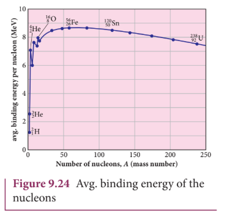
#### Important inferences from the average binding energy curve:

(1) The value of \( \overline{BE} \) rises as the mass number increases until it reaches a maximum value of \( 8.8 \ \text{MeV} \) for \( A = 56 \) (iron) and then it slowly decreases.
(2) The average binding energy per nucleon is about \( 8.5 \ \text{MeV} \) for nuclei having mass number lying between \( A = 40 \) and 120. These elements are comparatively more stable and not radioactive.
(3) For higher mass numbers, the curve drops slowly and \( \overline{BE} \) for uranium is about 7.6 MeV. Such nuclei are unstable and exhibit radioactivity.

From Figure 9.24, if two light nuclei with A<28 combine to form a nucleus with A<56, the binding energy per nucleon is more for final nucleus than initial nuclei. Thus, if the lighter elements combine to produce a nucleus of medium value A, a large amount of energy will be released. This is the basis of nuclear fusion and is the principle of the hydrogen bomb.

(4) If a nucleus of heavy element is split (fission) into two or more nuclei of medium value A, the energy released would again be large. The atom bomb is based on this principle and huge energy of atom bombs comes from this fission when it is uncontrolled. Fission is explained in the section 9.7

## EXAMPLE 9.10

Compute the binding energy per nucleon of \( ^{4}_{2}He \) nucleus.

### Solution

From Example 9.9, we found that the BE of \( ^{4}_{2}He = 28.33 \ \text{MeV} \)

Binding energy per nucleon \( = \overline{BE} = \frac{28.33 \ \text{MeV}}{4} \approx 7 \ \text{MeV} \).

## 9.5 NUCLEAR FORCE

Nucleus of the atoms contains protons and neutrons. From electrostatics, we learnt that like charges repel each other. In the nucleus, since the protons are separated by a distance of about a few fermi \( (10^{-15} \ \mathrm{m}) \), they must exert on each other a very strong repulsive force.

For example, the electrostatic repulsive force between two protons separated by a distance \( 10^{-15} \ \mathrm{m} \)

$$
F = k \times \frac{q^{2}}{r^{2}} = 9 \times 10^{9} \times \frac{(1.6 \times 10^{-19})^{2}}{(10^{-15})^{2}} \approx 230 \ \mathrm{N}
$$

The acceleration experienced by a proton due to the force of \( 230 \ \mathrm{N} \) is

$$
a = \frac{F}{m} = \frac{230 \ \mathrm{N}}{1.67 \times 10^{-27} \ \mathrm{kg}} \approx 1.4 \times 10^{29} \ \mathrm{m} \ \mathrm{s}^{-2}
$$

This is nearly \( 10^{28} \) times greater than the acceleration due to gravity. So if the protons in the nucleus experience only the electrostatic force, then the nucleus would fly apart in an instant. Then how are the protons held together in the nucleus?

From this observation, it was concluded that there must be a strong attractive force between protons to overcome the repulsive Coulombic force. This attractive force which holds the nucleons together is called strong nuclear force. The properties of the nuclear force were understood through various experiments carried out between 1930s and 1950s. A few properties of the nuclear force are:

(i) The nuclear force is of very short range, acting only up to a distance of a few fermi. But inside the nucleus, the repulsive Coulomb force or attractive gravitational forces between two protons are much weaker than the nuclear force between two protons. Similarly, the gravitational force between two neutrons is also much weaker than nuclear force between the neutrons. So nuclear force is the strongest force in nature.

(ii) The nuclear force is attractive and acts with an equal strength between proton-proton, proton-neutron, and neutron-neutron.

(iii) Nuclear force does not act on the electrons. So it does not alter the chemical properties of the atom.
## 9.6 RADIOACTIVITY

In the binding energy curve, the stability of the nucleus that has \( Z > 82 \) starts to decrease and these nuclei are fairly unstable nuclei. Some of the unstable nuclei decay naturally by emitting certain particles to form a stable nucleus. The elements with atomic number \( Z > 82 \) and isotopes of lighter nuclei belong to the category of naturally-occurring radioactive nuclei. Each of these radioactive nuclei decays to another nucleus by the emission of \( ^{4}_{2}He \) nucleus \( (\alpha \text{-decay}) \) or electron or positron \( (\beta \text{-decay}) \) or gamma rays \( (\gamma \text{-decay}) \)

The phenomenon of spontaneous emission of highly penetrating radiations such as \( \alpha \), \( \beta \) and \( \gamma \) rays by an element is called radioactivity and the substances which emit these radiations are called radioactive elements. These radioactive elements can be heavy elements \( (Z > 82) \) or isotopes of lighter and heavy elements and these isotopes are called radioisotopes. For example, carbon isotope \( ^{14}C \) is radioactive but \( ^{12}C \) is not.

Radioisotopes have a variety of applications such as carbon dating, cancer treatment, etc. When a radioactive nucleus undergoes decay, the mass of the system decreases - that is, the mass of the initial nucleus before decay is always greater than the sum of the masses of the final nucleus and the emitted particle. This difference in mass \( \Delta m \) appears as the energy according to Einstein's relation \( E = |\Delta m| c^{2} \).

The phenomenon of radioactivity was first discovered by Henri Becquerel in 1896. Later, Marie Curie and her husband Pierre Curie did a series of experiments in detail to understand the phenomenon of radioactivity. In India, Saha Institute of Nuclear Physics (SINP), Kolkata is the premier institute pursuing active research in nuclear physics.
>During early days of nuclear physics research,the term ‘radiation’ was used to denote the emanations from radioactive nuclei.Now we know that α rays are in fact $$_{4}^{2}He$$ nuclei and β rays are electrons or positrons. Certainly, they are not electromagnetic radiation. The γ ray alone is electromagnetic radiation.
### 9.6.1 Alpha decay

When an unstable nucleus decays by emitting an \( \alpha \)-particle \( (^{4}_{2}He \ \text{nucleus}) \), it loses two protons and two neutrons. As a result, its atomic number \( Z \) decreases by 2 and the mass number decreases by 4. We write the alpha decay process symbolically in the following way

$$
_{Z}^{A} X \rightarrow _{Z-2}^{A-4} Y + _{2}^{4} He \quad (9.26)
$$

Here \( X \) is called the parent nucleus and \( Y \) is called the daughter nucleus.

Example: Decay of Uranium \( ^{238}_{92}U \) to thorium \( ^{234}_{90}Th \) with the emission of \( ^{4}_{2}He \) nucleus \( (\alpha \text{-particle}) \)

$$
^{238}_{92}U \rightarrow ^{234}_{90}Th + ^{4}_{2}He
$$

As already mentioned, the total mass of the daughter nucleus and \( ^{4}_{2}He \) nucleus is always less than that of the parent nucleus. The difference in mass \( (\Delta m = m_X - m_Y - m_{\alpha}) \) is released as energy called disintegration energy \( Q \) and is given by

$$
Q = (m_X - m_Y - m_{\alpha}) c^{2} \quad (9.27)
$$

Note that for spontaneous decay (natural radioactivity) \( Q > 0 \). In alpha decay process, the disintegration energy is certainly positive \( (Q > 0) \). In fact, the disintegration energy \( Q \) is also the net kinetic energy gained in the decay process or if the parent nucleus is at rest, \( Q \) is the total kinetic energy of daughter nucleus and the \( ^{4}He \) nucleus. Suppose \( Q < 0 \), then the decay process cannot occur spontaneously and energy must be supplied to induce the decay.

>In alpha decay, why does the unstable nucleus emit \( ^{4}He \) nucleus? Why does it not emit four separate nucleons? After all \( ^{4}He \) consists of two protons and two neutrons. For example, if \( ^{238}U \) nucleus decays into \( ^{234}Th \) by emitting four separate nucleons (two protons and two neutrons), then the disintegration energy \( Q \) for this process turns out to be negative. It implies that the total mass of products is greater than that of parent \( (^{238}U) \) nucleus. This kind of process cannot occur in nature because it would violate conservation of energy. In any decay process, the conservation of energy, laws of linear momentum and laws of angular momentum must be obeyed.

## EXAMPLE 9.11

(a) Calculate the disintegration energy when stationary \( ^{232}U \) nucleus decays to thorium \( ^{228}Th \) with the emission of \( \alpha \) particle. The atomic masses are of \( ^{232}U = 232.037156u \), \( ^{228}Th = 228.028741u \) and \( ^{4}He = 4.002603u \)
(b) Calculate kinetic energies of \( ^{228}Th \) and \( \alpha \)-particle and their ratio.

### Solution

The difference in masses

$$
\Delta m = (m_U - m_{Th} - m_{\alpha}) = (232.037156 - 228.028741 - 4.002603)u = 0.005812u
$$

The mass lost in this decay \( = 0.005812u \)

Since \( 1u = 931 \ \text{MeV} \), the energy \( Q \) released is

$$
Q = (0.005812u) \times (931 \ \text{MeV}/u) = 5.41 \ \text{MeV}
$$

This disintegration energy \( Q \) appears as the kinetic energy of \( \alpha \) particle and the daughter nucleus.

In any decay, the total linear momentum must be conserved.

Total linear momentum of the parent nucleus \( = \) total linear momentum of the daughter nucleus and alpha particle

Since before decay, the uranium nucleus is at rest, its momentum is zero.

By applying conservation of momentum, we get

$$
0 = m_{Th} \vec{v}_{Th} + m_{\alpha} \vec{v}_{\alpha}
$$

$$
m_{\alpha} \vec{v}_{\alpha} = -m_{Th} \vec{v}_{Th}
$$

It implies that the alpha particle and daughter nucleus move in opposite directions.

In magnitude \( m_{\alpha} v_{\alpha} = m_{Th} v_{Th} \)

The velocity of alpha particle \( v_{\alpha} = \frac{m_{Th}}{m_{\alpha}} v_{Th} \)

Since \( m_{Th} > m_{\alpha} \), \( v_{\alpha} > v_{Th} \).

The ratio of the kinetic energy of alpha particle to that of the daughter nucleus

$$
\frac{KE_{\alpha}}{KE_{Th}} = \frac{\frac{1}{2} m_{\alpha} v_{\alpha}^{2}}{\frac{1}{2} m_{Th} v_{Th}^{2}} = \frac{m_{Th}}{m_{\alpha}} = \frac{228.028741}{4.002603} = 57
$$

The kinetic energy of alpha particle is 57 times greater than the kinetic energy of the daughter nucleus \( (^{228}_{90}Th) \).

The disintegration energy \( Q = \) total kinetic energy of products

$$
KE_{\alpha} + KE_{Th} = 5.41 \ \text{MeV}
$$

$$
57 KE_{Th} + KE_{Th} = 5.41 \ \text{MeV}
$$

$$
KE_{Th} = \frac{5.41}{58} \ \text{MeV} = 0.093 \ \text{MeV}
$$

$$
KE_{\alpha} = 57 KE_{Th} = 57 \times 0.093 = 5.301 \ \text{MeV}
$$

In fact, \( 98\% \) of total kinetic energy is taken by the \( \alpha \) particle.

> **A very interesting application of alpha decay is in smoke detectors** which prevent us from any hazardous fire.
>
> The smoke detector uses around \( 0.2 \ \text{mg} \) of man-made weak radioactive isotope called americium \( (^{241}_{95}Am) \). This radioactive source is placed between two oppositely charged metal plates and \( \alpha \) radiations from \( ^{241}_{95}Am \) continuously ionize the nitrogen, oxygen molecules in the air space between the plates. As a result, there will be a continuous flow of small steady current in the circuit. If smoke enters, the radiation is being absorbed by the smoke particles rather than air molecules. As a result, the ionization and along with it the current is reduced. This drop in current is detected by the circuit and alarm starts.
>
> The radiation dosage emitted by americium is very much less than safe level, so it can be considered harmless.

### 9.6.2 Beta decay

In beta decay, a radioactive nucleus emits either electron or positron. If electron \( (e^{-}) \) is emitted, it is called \( \beta^{-} \) decay and if positron \( (e^{+}) \) is emitted, it is called \( \beta^{+} \) decay. The positron is an anti-particle of an electron whose mass is same as that of electron and charge is opposite to that of electron - that is, \( +e \). Both positron and electron are referred to as beta particles.

#### \( \beta^{-} \) decay:

In \( \beta^{-} \) decay, the atomic number of the nucleus increases by one but its mass number remains the same. This decay is represented by

$$
_{Z}^{A} X \rightarrow _{Z+1}^{A} Y + e^{-} + \overline{\nu} \quad (9.28)
$$

It implies that the element \( X \) becomes \( Y \) by giving out an electron and an antineutrino \( (\overline{\nu}) \). In other words, in each \( \beta^{-} \) decay, one neutron in the nucleus of \( X \) is converted into a proton with the emission of an electron \( (e^{-}) \) and an antineutrino. Thus,

$$
n \rightarrow p + e^{-} + \overline{\nu}
$$

Where \( p \) - proton, \( \overline{\nu} \) - antineutrino.

Example: Carbon \( (^{14}_{6}C) \) is converted into nitrogen \( (^{14}_{7}N) \) through \( \beta^{-} \) decay.

$$
^{14}_{6}C \rightarrow ^{14}_{7}N + e^{-} + \overline{\nu}
$$

#### \( \beta^{+} \) decay:

In \( \beta^{+} \) decay, the atomic number is decreased by one and again its mass number remains the same. This decay is represented by

$$
_{Z}^{A} X \rightarrow _{Z-1}^{A} Y + e^{+} + \nu \quad (9.29)
$$

It implies that the element \( X \) becomes \( Y \) by giving out a positron and neutrino \( (\nu) \). In other words, for each \( \beta^{+} \) decay, a proton in the nucleus \( X \) is converted into a neutron, a positron \( (e^{+}) \) and a neutrino. Thus,

$$
p \rightarrow n + e^{+} + \nu
$$

Example: Sodium \( (^{22}_{11}Na) \) is converted into neon \( (^{22}_{10}Ne) \) through \( \beta^{+} \) decay.

$$
^{22}_{11}Na \rightarrow ^{22}_{10}Ne + e^{+} + \nu
$$

However a single proton (not inside any nucleus) cannot exhibit \( \beta^{+} \) decay due to energy conservation, because neutron mass is larger than proton mass. But a single neutron (not inside any nucleus) can exhibit \( \beta^{-} \) decay.

It is important to note that the electron or positron which comes out from nuclei during beta decay are not present inside the nuclei but they are produced only during the conversion of neutron into proton or proton into neutron inside the nucleus.

#### Neutrino:

Initially, it was thought that during beta decay, a neutron in the parent nucleus is converted into the daughter nuclei by emitting only electron as given by

$$
_{Z}^{A} X \rightarrow _{Z+1}^{A} Y + e^{-} \quad (9.30)
$$

But the kinetic energy of electron coming out of the nucleus did not match with the experimental results. In alpha decay, the alpha particle takes only certain allowed discrete energies whereas in beta decay, it was found that the beta particle (i.e., electron) has a continuous range of energies. But the conservation of energy and momentum gives specific single values for energy of electron and the recoiling nucleus Y. It seems that the conservation of energy, momentum are violated and could not be explained why energy of beta particle having continuous range of values. So beta decay remained as a puzzle for several years.

After a detailed theoretical and experimental study in 1931, W. Pauli proposed a third particle which must be emitted in the beta decay process carrying away missing energy and momentum. Fermi later named this particle as neutrino (little neutral one) since its mass is small and is neutral carrying no charge. For many years, the neutrino (symbol \( \nu \), Greek nu) was hypothetical and could not be verified experimentally. Finally, the neutrino was detected experimentally in 1956 by Fredrick Reines and Clyde Cowan. Later Reines received Nobel prize in physics in the year 1995 for his discovery.

The neutrino has the following properties:
- It has zero charge
- It has an antiparticle called anti-neutrino.
- Recent experiments showed that the neutrino has very small mass.
- It interacts very weakly with the matter. Therefore, it is very difficult to detect it. In fact, in every second, trillions of neutrinos coming from the sun are passing through our body without causing interaction.

### 9.6.3 Gamma emission

In \( \alpha \) and \( \beta \) decay, the daughter nucleus is in the excited state most of the time. The typical life time of excited state is approximately \( 10^{-11} \ \text{s} \). So this excited state nucleus immediately returns to the ground state or lower energy state by emitting highly energetic photons called \( \gamma \) rays. In fact, when the atom is in the excited state, it returns to the ground state by emitting photons of energy in the order of few eV. But when the excited state nucleus returns to its ground state, it emits a highly energetic photon \( (\gamma \ \text{rays}) \) of energy in the order of MeV. The gamma emission is given by

$$
_{Z}^{A} X^{*} \rightarrow _{Z}^{A} X + \gamma \ \text{rays} \quad (9.31)
$$

Here the asterisk \( (*) \) indicates the excited state nucleus. In gamma emission, there is no change in the mass number or atomic number of the nucleus.

Boron \( \left( ^{12}_{5}B \right) \) has two beta decay modes as shown in Figure 9.25:

(1) it undergoes beta decay directly into ground state carbon \( \left( ^{12}_{6}C \right) \) by emitting an electron of maximum energy 13.4 MeV.

(2) it undergoes beta ray emission to an excited state of carbon \( \left( ^{12}_{6}C^{*} \right) \) by emitting an electron of maximum energy \( 9.0 \ \text{MeV} \) followed by gamma decay to ground state by emitting a photon of energy \( 4.4 \ \text{MeV} \). It is represented by

$$
^{12}_{5}B \rightarrow ^{12}_{6}C + e^{-} + \overline{\nu}
$$

$$
^{12}_{6}C^{*} \rightarrow ^{12}_{6}C + \gamma
$$
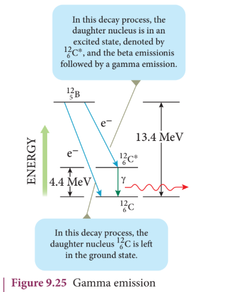
### 9.6.4 Law of radioactive decay

In the previous section, the decay process of a single radioactive nucleus was discussed. In practice, we have bulk material of radioactive sample which contains a vast number of the radioactive nuclei and not all the radioactive nucleus in a sample decay at the same time. It decays over a period of time and this decay is basically a random process. It implies that we cannot predict which nucleus is going to decay; rather we can determine on a probabilistic basis (like tossing a coin). We can calculate approximately how many nuclei in a sample are decayed over a period of time.

Let $N$ be the number of radioactive nuclei present at any instant $t$. Then, from the law,

$$\frac{dN}{dt} \propto -N$$

$$\frac{dN}{dt} = -\lambda N \quad (9.32)$$

where $\lambda$ is the decay constant or disintegration constant. The negative sign indicates that the number of nuclei decreases with time.

Rearranging equation (9.32)

$$\frac{dN}{N} = -\lambda dt$$

Integrating both sides

$$\int_{N_0}^{N} \frac{dN}{N} = -\lambda \int_{0}^{t} dt$$

$$\ln \frac{N}{N_0} = -\lambda t$$

$$\frac{N}{N_0} = e^{-\lambda t}$$

$$N = N_0 e^{-\lambda t} \quad (9.33)$$

Here $N_0$ is the number of radioactive nuclei present at initial time $t=0$. This equation is called the law of radioactive decay. It shows that the number of radioactive nuclei decreases exponentially with time, as shown in Figure 9.26.

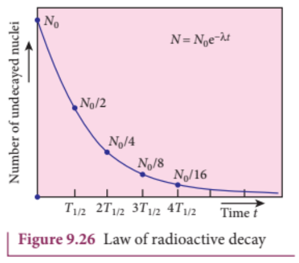

From equation (9.33), we can also calculate the half-life $T_{1/2}$ and mean life $\tau$ of a radioactive nucleus.

#### Half-life

Half-life is defined as the time taken for the number of radioactive nuclei to decay to half of its initial value.

When $t = T_{1/2}$, $N = \frac{N_0}{2}$. Substituting in equation (9.33),

$$\frac{N_0}{2} = N_0 e^{-\lambda T_{1/2}}$$

$$\frac{1}{2} = e^{-\lambda T_{1/2}}$$

Taking natural logarithm on both sides

$$\ln\left(\frac{1}{2}\right) = -\lambda T_{1/2}$$

$$-\ln 2 = -\lambda T_{1/2}$$

$$T_{1/2} = \frac{\ln 2}{\lambda} = \frac{0.693}{\lambda} \quad (9.34)$$

Thus, the half-life is inversely proportional to the decay constant.

#### Mean life

Mean life $\tau$ is the average lifetime of a radioactive nucleus before it decays. It is given by

$$\tau = \frac{1}{\lambda} \quad (9.35)$$

From equation (9.34) and (9.35), we get

$$\tau = \frac{T_{1/2}}{0.693} = 1.44 T_{1/2} \quad (9.36)$$

#### Activity

The activity $R$ of a radioactive sample is defined as the rate of decay, i.e.,

$$R = \left|\frac{dN}{dt}\right| = \lambda N = \lambda N_0 e^{-\lambda t} = R_0 e^{-\lambda t} \quad (9.37)$$

where $R_0 = \lambda N_0$ is the initial activity. The SI unit of activity is becquerel (Bq), where $1 \mathrm{Bq} = 1$ decay per second. Another unit is curie (Ci), where $1 \mathrm{Ci} = 3.7 \times 10^{10} \mathrm{Bq}$.

## EXAMPLE 9.12

The half-life of a radioactive substance is $10$ days. Calculate (a) the decay constant, (b) the mean life, and (c) the time taken for the number of nuclei to reduce to $25\%$ of its initial value.

## Solution

(a) Decay constant

$$\lambda = \frac{0.693}{T_{1/2}} = \frac{0.693}{10 \mathrm{days}} = 0.0693 \mathrm{day}^{-1}$$

(b) Mean life

$$\tau = \frac{1}{\lambda} = \frac{1}{0.0693} \approx 14.43 \mathrm{days}$$

(c) When $N = 0.25 N_0 = \frac{N_0}{4}$, we have

$$\frac{N_0}{4} = N_0 e^{-\lambda t}$$

$$e^{-\lambda t} = \frac{1}{4}$$

$$-\lambda t = \ln\left(\frac{1}{4}\right) = -\ln 4 = -2\ln 2$$

$$t = \frac{2\ln 2}{\lambda} = 2 T_{1/2} = 20 \mathrm{days}$$

Thus, it takes $20$ days for the number of nuclei to reduce to $25\%$ of its initial value.

## EXAMPLE 9.13

A radioactive sample has an initial activity of $1000 \mathrm{Bq}$. After $30$ days, its activity is found to be $125 \mathrm{Bq}$. Calculate (a) the decay constant, (b) the half-life, and (c) the time taken for the activity to reduce to $10\%$ of its initial value.

## Solution

(a) Using the activity formula $R = R_0 e^{-\lambda t}$

$$125 = 1000 e^{-\lambda \times 30}$$

$$\frac{125}{1000} = e^{-30\lambda}$$

$$\frac{1}{8} = e^{-30\lambda}$$

Taking natural logarithm

$$\ln\left(\frac{1}{8}\right) = -30\lambda$$

$$-\ln 8 = -30\lambda$$

$$\lambda = \frac{\ln 8}{30} = \frac{2.079}{30} = 0.0693 \mathrm{day}^{-1}$$

(b) Half-life

$$T_{1/2} = \frac{0.693}{\lambda} = \frac{0.693}{0.0693} = 10 \mathrm{days}$$

(c) When $R = 0.1 R_0$

$$0.1 R_0 = R_0 e^{-\lambda t}$$

$$e^{-\lambda t} = 0.1$$

$$-\lambda t = \ln(0.1) = -2.3026$$

$$t = \frac{2.3026}{\lambda} = \frac{2.3026}{0.0693} \approx 33.2 \mathrm{days}$$

## 9.7 NUCLEAR FISSION

Nuclear fission is the process in which a heavy nucleus (such as uranium, plutonium, or thorium) splits into two or more lighter nuclei (called fission fragments) along with the emission of neutrons and a large amount of energy. This process was discovered in 1938 by German scientists Otto Hahn and Fritz Strassmann, and later explained by Lise Meitner and Otto Frisch.

When a heavy nucleus like $^{235}_{92}U$ absorbs a slow-moving (thermal) neutron, it becomes an unstable compound nucleus $^{236}_{92}U$ which then splits into two lighter nuclei. A typical fission reaction is

$$^{235}_{92}U + ^{1}_{0}n \rightarrow ^{236}_{92}U \rightarrow ^{141}_{56}Ba + ^{92}_{36}Kr + 3^{1}_{0}n + \text{energy}$$

The energy released in a single fission event is about $200 \mathrm{MeV}$, which is enormous compared to chemical reactions (typically a few eV). This energy appears as kinetic energy of the fission fragments, neutrons, and gamma rays.

### 9.7.1 Chain reaction

In a fission reaction, two or three neutrons are emitted along with the fission fragments. These neutrons can cause further fission of other heavy nuclei, leading to a self-sustaining chain reaction, as shown in Figure 9.27.

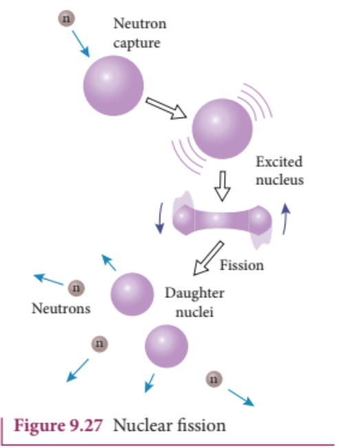

If the number of neutrons available for further fission is controlled, the chain reaction can be sustained at a steady rate (controlled chain reaction). If the number of neutrons increases uncontrollably, the chain reaction becomes explosive (uncontrolled chain reaction).

#### Chain reaction:

There are two kinds of chain reactions: (i) uncontrolled chain reaction (ii) controlled chain reaction. In an uncontrolled chain reaction, the number of neutrons multiply indefinitely and the entire amount of energy is released in a fraction of second.The atom bomb is an example of nuclear fission reaction in which uncontrolled chain reaction occurs. Atom bombs produce massive destruction on mankind. During World War II, on August 6 and 9 in the year 1945, USA dropped two atom bombs in two places of Japan, Hiroshima and Nagasaki. As a result, lakhs of people were killed and the two cities were completely destroyed. Even now the people who are living in those places have side effects caused by the explosion of atom bombs.
It is possible to calculate the typical energy released in a chain reaction. In the first step,one neutron initiates the fission process in one nucleus by producing three neutrons and energy of about 200 MeV.  

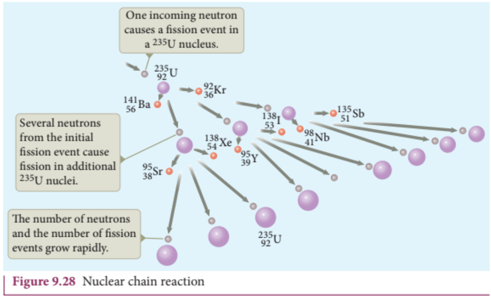

### 9.7.2 Nuclear reactor

A nuclear reactor is a device in which a controlled chain reaction is maintained to produce energy continuously. The essential components of a nuclear reactor are:

(1) **Nuclear fuel**: The fissile material that undergoes fission. Common fuels are $^{235}U$, $^{239}Pu$, and $^{233}U$.

(2) **Moderator**: A material that slows down fast neutrons produced in fission to thermal energies to increase the probability of further fission. Common moderators are ordinary water (H$_2$O), heavy water (D$_2$O), and graphite.

.png

.png))

(3) **Control rods**: Rods made of neutron-absorbing materials (like cadmium, boron, or hafnium) that control the rate of fission by absorbing excess neutrons.

(4) **Coolant**: A fluid that removes the heat produced in the reactor core. Common coolants are water, heavy water, liquid sodium, or carbon dioxide.

(5) **Shielding**: A thick layer of concrete and lead around the reactor to protect personnel from harmful radiations.

(6) **Reactor vessel**: The container that houses the core, moderator, control rods, and coolant.

The heat produced in the reactor core is used to convert water into steam, which drives a turbine to generate electricity.

## 9.8 NUCLEAR FUSION

Nuclear fusion is the process in which two light nuclei combine to form a heavier nucleus with the release of a large amount of energy. For fusion to occur, the two positively charged nuclei must overcome their mutual electrostatic repulsion (Coulomb barrier) and come close enough for the strong nuclear force to bind them together. This requires extremely high temperatures (about $10^7 \mathrm{K}$ to $10^8 \mathrm{K}$) and high pressures. Therefore, fusion reactions are also called thermonuclear reactions.

An important fusion reaction that occurs in the Sun and other stars is the proton-proton cycle, which converts hydrogen into helium:

$$^{1}_{1}H + ^{1}_{1}H \rightarrow ^{2}_{1}H + e^{+} + \nu + 0.42\mathrm{MeV}$$
$$^{2}_{1}H + ^{1}_{1}H \rightarrow ^{3}_{2}He + \gamma + 5.49\mathrm{MeV}$$
$$^{3}_{2}He + ^{3}_{2}He \rightarrow ^{4}_{2}He + 2^{1}_{1}H + 12.86\mathrm{MeV}$$

The net result is the conversion of four hydrogen nuclei into one helium nucleus with the release of about $26.7\mathrm{MeV}$ of energy.

Another important fusion reaction is the deuterium-tritium (D-T) reaction:

$$^{2}_{1}H + ^{3}_{1}H \rightarrow ^{4}_{2}He + ^{1}_{0}n + 17.6\mathrm{MeV}$$

This reaction is being investigated for controlled fusion power because it has a relatively low ignition temperature and high energy yield.

### 9.8.1 Challenges in controlled fusion

Despite decades of research, controlled fusion for energy production remains a major challenge. The main difficulties are:

(1) Achieving and maintaining the extremely high temperatures and pressures required for fusion.

(2) Confining the hot plasma long enough for fusion reactions to occur. Two main approaches are magnetic confinement (using devices like tokamaks) and inertial confinement (using powerful lasers).

(3) Developing materials that can withstand the intense neutron flux and heat from fusion reactions.

(4) Achieving a net energy gain (i.e., producing more energy than is required to initiate and sustain the reaction).

International collaborative projects like ITER (International Thermonuclear Experimental Reactor) are working towards demonstrating the feasibility of fusion power.

## 9.9 ELEMENTARY PARTICLES

Elementary particles are the fundamental building blocks of matter that cannot be further subdivided. Over the years, physicists have discovered a large number of particles, and the current understanding is summarized in the Standard Model of particle physics.

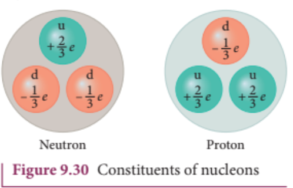

### 9.9.1 Classification of elementary particles

Elementary particles are broadly classified into two categories: fermions (which obey Fermi-Dirac statistics and have half-integer spin) and bosons (which obey Bose-Einstein statistics and have integer spin).

#### Fermions (Matter particles)

Fermions are further divided into quarks and leptons.

**Quarks**: There are six types (flavours) of quarks: up (u), down (d), charm (c), strange (s), top (t), and bottom (b). Quarks combine to form hadrons. Hadrons are of two types:
- Baryons: made of three quarks (e.g., proton = uud, neutron = udd)
- Mesons: made of a quark and an antiquark (e.g., pion = $u\bar{d}$)

**Leptons**: There are six leptons: electron ($e^-$), muon ($\mu^-$), tau ($\tau^-$), and their corresponding neutrinos ($\nu_e$, $\nu_\mu$, $\nu_\tau$). Leptons do not participate in strong nuclear interactions.

#### Bosons (Force-carrying particles)

The four fundamental forces of nature are mediated by gauge bosons:

- **Photon ($\gamma$)**: Mediates electromagnetic force (massless, spin 1)
- **Gluons (g)**: Mediate strong nuclear force (massless, spin 1, 8 types)
- **W and Z bosons ($W^+$, $W^-$, $Z^0$)**: Mediate weak nuclear force (massive, spin 1)
- **Graviton (G)**: Hypothetical particle that mediates gravity (not yet detected)

The Higgs boson (discovered in 2012 at CERN) is responsible for giving mass to other particles through the Higgs mechanism.

### 9.9.2 Antiparticles

For every particle, there exists an antiparticle with the same mass but opposite charge and other quantum numbers. For example, the antiparticle of the electron ($e^-$) is the positron ($e^+$). When a particle and its antiparticle meet, they annihilate each other, converting their mass into energy (usually in the form of photons).

### 9.9.3 Conservation laws in particle physics

In addition to conservation of energy, momentum, and angular momentum, particle interactions obey several other conservation laws:

- Conservation of electric charge
- Conservation of baryon number
- Conservation of lepton number
- Conservation of strangeness (in strong and electromagnetic interactions only)

The discovery of particles and their interactions has been a major achievement of modern physics, leading to a deeper understanding of the fundamental nature of matter and the forces that govern the universe.

***

## SUMMARY

- Cathode rays are streams of electrons. J.J. Thomson determined the specific charge ($e/m$) of an electron.
- Millikan's oil drop experiment determined the charge of an electron ($e = 1.6 \times 10^{-19} \mathrm{C}$).
- Rutherford's alpha scattering experiment led to the discovery of the nucleus.
- Bohr atom model postulates quantized angular momentum and energy levels for electrons in hydrogen-like atoms.
- The energy of an electron in the $n^{\mathrm{th}}$ orbit of a hydrogen atom is $E_n = -13.6/n^2 \mathrm{eV}$.
- Atomic spectra are line spectra, unique for each element. The hydrogen spectrum consists of Lyman, Balmer, Paschen, Brackett, and Pfund series.
- The nucleus contains protons and neutrons (nucleons). The mass number $A = Z + N$.
- Isotopes have same $Z$, different $A$; isobars have same $A$, different $Z$; isotones have same $N$.
- Nuclear radius $R = R_0 A^{1/3}$ where $R_0 = 1.2 \mathrm{F}$.
- Nuclear density is constant ($\approx 2.3 \times 10^{17} \mathrm{kg/m^3}$) for all nuclei.
- Mass defect $\Delta m = (Zm_p + Nm_n) - M$. Binding energy $BE = \Delta m c^2$.
- The average binding energy per nucleon is maximum around $A = 56$ (iron), indicating highest stability.
- Nuclear force is short-range, strong, and charge-independent.
- Radioactivity is spontaneous emission of $\alpha$, $\beta$, or $\gamma$ rays from unstable nuclei.
- Law of radioactive decay: $N = N_0 e^{-\lambda t}$. Half-life $T_{1/2} = 0.693/\lambda$.
- Nuclear fission: splitting of heavy nucleus into lighter fragments with energy release.
- Nuclear fusion: combining of light nuclei into heavier nucleus with energy release.
- Elementary particles are classified into fermions (quarks and leptons) and bosons (force carriers).

The difference in mass multiplied by $c^2$ gives the binding energy

$$BE = \left(Zm_p + Nm_n - M\right)c^2$$

The average binding energy per nucleon is $\overline{BE} = \frac{BE}{A}$

The average binding energy per nucleon is maximum for iron $(A = 56)$ indicating greater stability.

$\alpha$ decay: $\frac{A}{Z}X \rightarrow \frac{A-4}{Z-2}Y + \frac{4}{2}He$

$\beta^-$ decay: $\frac{A}{Z}X \rightarrow \frac{A}{Z+1}Y + e^- + \overline{\nu}$

$\beta^+$ decay: $\frac{A}{Z}X \rightarrow \frac{A}{Z-1}Y + e^+ + \nu$

$\gamma$ emission: $\frac{A}{Z}X^* \rightarrow \frac{A}{Z}X + \gamma$

The law of radioactive decay: $N = N_0 e^{-\lambda t}$

Half-life: $T_{1/2} = \frac{\ln 2}{\lambda} = \frac{0.693}{\lambda}$

Mean life: $\tau = \frac{1}{\lambda}$

Activity: $R = \lambda N = R_0 e^{-\lambda t}$

Nuclear fission is the process of splitting a heavy nucleus into two or more lighter nuclei with the release of energy.

Nuclear fusion is the process of combining two or more light nuclei to form a heavier nucleus with the release of energy.

## 9.10 SOLVED PROBLEMS

### EXAMPLE 9.16

A radioactive sample has $2.0 \mu g$ of pure $^{14}C$ which has a half-life of 5730 years. Calculate the initial activity of the sample.

### Solution

The number of atoms in the sample is

$$N_0 = \frac{2.0 \times 10^{-6} \mathrm{g}}{14 \mathrm{g/mol}} \times 6.02 \times 10^{23} \mathrm{mol}^{-1} = 8.6 \times 10^{16}$$

The decay constant is

$$\lambda = \frac{0.693}{T_{1/2}} = \frac{0.693}{5730 \times 3.156 \times 10^7 \mathrm{s}} = 3.83 \times 10^{-12} \mathrm{s}^{-1}$$

Initial activity

$$R_0 = \lambda N_0 = (3.83 \times 10^{-12}) \times (8.6 \times 10^{16}) = 3.29 \times 10^5 \mathrm{Bq}$$

### EXAMPLE 9.17

A radioactive isotope has an initial activity of $8.0 \times 10^5 \mathrm{Bq}$. After 3 days, its activity is $1.0 \times 10^5 \mathrm{Bq}$. Calculate (a) the decay constant, (b) the half-life, and (c) the mean life.

### Solution

(a) From $R = R_0 e^{-\lambda t}$,

$$1.0 \times 10^5 = 8.0 \times 10^5 e^{-3\lambda}$$

$$e^{-3\lambda} = \frac{1}{8} = 0.125$$

$$-3\lambda = \ln(0.125) = -2.079$$

$$\lambda = \frac{2.079}{3} = 0.693 \mathrm{day}^{-1}$$

(b) Half-life

$$T_{1/2} = \frac{0.693}{\lambda} = \frac{0.693}{0.693} = 1 \mathrm{day}$$

(c) Mean life

$$\tau = \frac{1}{\lambda} = \frac{1}{0.693} = 1.44 \mathrm{days}$$

### EXAMPLE 9.18

Calculate the energy released in the following nuclear reaction:

$$^{2}_{1}H + ^{3}_{1}H \rightarrow ^{4}_{2}He + ^{1}_{0}n$$

Given: $m(^{2}_{1}H) = 2.014102u$, $m(^{3}_{1}H) = 3.016049u$, $m(^{4}_{2}He) = 4.002603u$, $m(^{1}_{0}n) = 1.008665u$

### Solution

Mass of reactants $= 2.014102 + 3.016049 = 5.030151u$

Mass of products $= 4.002603 + 1.008665 = 5.011268u$

Mass defect $\Delta m = 5.030151 - 5.011268 = 0.018883u$

Energy released $Q = 0.018883 \times 931 = 17.58 \mathrm{MeV}$

## 9.11 MULTIPLE CHOICE QUESTIONS

1. The specific charge of an electron is
   (a) $1.6 \times 10^{-19} \mathrm{C}$ (b) $1.7 \times 10^{11} \mathrm{Ckg}^{-1}$
   (c) $1.8 \times 10^{11} \mathrm{Ckg}^{-1}$ (d) $1.6 \times 10^{11} \mathrm{Ckg}^{-1}$

2. In Millikan's oil drop experiment, the charge on an oil drop is found to be $4.8 \times 10^{-19} \mathrm{C}$. The number of excess electrons on the drop is
   (a) 1 (b) 2 (c) 3 (d) 4

3. In Rutherford's alpha scattering experiment, the number of alpha particles scattered at $90^\circ$ is 100. The number of alpha particles scattered at $60^\circ$ is
   (a) 100 (b) 200 (c) 300 (d) 400

4. The radius of the first Bohr orbit of hydrogen atom is $0.53 \mathrm{\AA}$. The radius of the third orbit is
   (a) $1.59 \mathrm{\AA}$ (b) $4.77 \mathrm{\AA}$ (c) $0.53 \mathrm{\AA}$ (d) $1.06 \mathrm{\AA}$

5. The energy of the electron in the ground state of hydrogen atom is $-13.6 \mathrm{eV}$. Its energy in the first excited state is
   (a) $-3.4 \mathrm{eV}$ (b) $-1.51 \mathrm{eV}$ (c) $3.4 \mathrm{eV}$ (d) $1.51 \mathrm{eV}$

6. The Balmer series of hydrogen spectrum lies in the
   (a) ultraviolet region (b) visible region
   (c) infrared region (d) microwave region

7. The nuclear radius of $^{27}_{13}Al$ is $3.6 \mathrm{F}$. The radius of $^{125}_{52}Te$ is approximately
   (a) $6.0 \mathrm{F}$ (b) $7.2 \mathrm{F}$ (c) $9.0 \mathrm{F}$ (d) $12.0 \mathrm{F}$

8. The binding energy per nucleon is maximum for
   (a) hydrogen (b) helium (c) iron (d) uranium

9. In $\beta^-$ decay, the atomic number of the nucleus
   (a) increases by 1 (b) decreases by 1
   (c) remains the same (d) increases by 2

10. The half-life of a radioactive substance is 10 days. The time taken for the number of nuclei to reduce to $1/8$ of its initial value is
    (a) 10 days (b) 20 days (c) 30 days (d) 40 days

### Answers:

1. (b) 2. (c) 3. (d) 4. (b) 5. (a)
6. (b) 7. (a) 8. (c) 9. (a) 10. (c)

## 9.12 NUMERICAL PROBLEMS

1. In J.J. Thomson's experiment, the electric field is $5 \times 10^4 \mathrm{N/C}$ and the magnetic field is $0.5 \mathrm{T}$. Calculate the velocity of the cathode rays.

2. In Millikan's oil drop experiment, an oil drop of radius $1.0 \times 10^{-6} \mathrm{m}$ and density $900 \mathrm{kg/m^3}$ is balanced against an electric field of $2.0 \times 10^5 \mathrm{N/C}$. Calculate the charge on the drop. (Density of air = $1.29 \mathrm{kg/m^3}$, $g = 9.8 \mathrm{m/s^2}$)

3. Calculate the radius of the second Bohr orbit of hydrogen atom. (Bohr radius $a_0 = 0.529 \mathrm{\AA}$)

4. The energy of an electron in the $n^{\mathrm{th}}$ orbit of hydrogen atom is $E_n = -13.6/n^2 \mathrm{eV}$. Calculate the wavelength of the photon emitted when the electron jumps from the third orbit to the first orbit.

5. The half-life of radium is 1620 years. Calculate the decay constant and mean life of radium.

6. A radioactive sample contains $10^{20}$ atoms initially. If the decay constant is $0.02 \mathrm{year}^{-1}$, calculate the number of atoms remaining after 50 years.

7. Calculate the binding energy of $^{7}_{3}Li$ nucleus. Given: $m(^{7}_{3}Li) = 7.016003u$, $m_H = 1.007825u$, $m_n = 1.008665u$.

8. In the fission of $^{235}U$, $200 \mathrm{MeV}$ energy is released per fission. Calculate the energy released when $1 \mathrm{g}$ of $^{235}U$ undergoes complete fission.

9. Calculate the energy released in the fusion reaction $^{2}_{1}H + ^{2}_{1}H \rightarrow ^{3}_{2}He + ^{1}_{0}n$. Given: $m(^{2}_{1}H) = 2.014102u$, $m(^{3}_{2}He) = 3.016029u$, $m(^{1}_{0}n) = 1.008665u$.

10. A radioactive sample has an activity of $10^4 \mathrm{Bq}$ at $t=0$. After 2 hours, the activity is $2.5 \times 10^3 \mathrm{Bq}$. Calculate the half-life of the sample.

## 9.13 ACTIVITIES

1. Collect information about the Indian nuclear reactors and prepare a report.

2. Visit a nearby hospital and collect information about the use of radioisotopes in medical diagnosis and treatment.

3. Prepare a model of a nuclear reactor using locally available materials.

4. Collect pictures of various spectral lines of elements and display them in your classroom.

5. Prepare a chart showing the classification of elementary particles.

***

## POINTS TO REMEMBER

- Cathode rays are streams of negatively charged particles called electrons.
- The specific charge of an electron is $1.7 \times 10^{11} \mathrm{Ckg}^{-1}$.
- The charge of an electron is $1.6 \times 10^{-19} \mathrm{C}$.
- Rutherford's alpha scattering experiment led to the discovery of the nucleus.
- Bohr atom model successfully explained the hydrogen spectrum.
- The energy of an electron in the $n^{\mathrm{th}}$ orbit of hydrogen atom is $E_n = -\frac{13.6}{n^2} \mathrm{eV}$.
- The radius of the $n^{\mathrm{th}}$ orbit of hydrogen atom is $r_n = n^2 a_0$, where $a_0 = 0.529 \mathrm{\AA}$.
- The atomic number $Z$ is the number of protons in the nucleus.
- The mass number $A$ is the total number of protons and neutrons.
- Isotopes have the same $Z$ but different $A$.
- Isobars have the same $A$ but different $Z$.
- Isotones have the same number of neutrons.
- The nuclear radius is given by $R = R_0 A^{1/3}$, where $R_0 = 1.2 \mathrm{F}$.
- Nuclear density is constant for all nuclei: $\rho \approx 2.3 \times 10^{17} \mathrm{kg/m^3}$.
- Mass defect $\Delta m = (Zm_p + Nm_n) - M$.
- Binding energy $BE = \Delta m c^2$.
- The average binding energy per nucleon is maximum for iron ($A=56$).
- $\alpha$ decay: $Z$ decreases by 2, $A$ decreases by 4.
- $\beta^-$ decay: $Z$ increases by 1, $A$ remains the same.
- $\beta^+$ decay: $Z$ decreases by 1, $A$ remains the same.
- $\gamma$ emission: no change in $Z$ or $A$.
- Law of radioactive decay: $N = N_0 e^{-\lambda t}$.
- Half-life: $T_{1/2} = \frac{0.693}{\lambda}$.
- Mean life: $\tau = \frac{1}{\lambda}$.
- Nuclear fission is the splitting of a heavy nucleus into lighter nuclei.
- Nuclear fusion is the combining of light nuclei into a heavier nucleus.
- Elementary particles include quarks and leptons.
- The four fundamental forces are gravitational, electromagnetic, strong nuclear, and weak nuclear.

***

## GLOSSARY

**Alpha decay**: Radioactive decay process in which an alpha particle ($^4_2He$ nucleus) is emitted.

**Atomic number**: The number of protons in the nucleus of an atom.

**Beta decay**: Radioactive decay process in which an electron or positron is emitted.

**Binding energy**: The energy required to disassemble a nucleus into its constituent nucleons.

**Bohr radius**: The radius of the first orbit of the hydrogen atom, $0.529 \mathrm{\AA}$.

**Chain reaction**: A self-sustaining reaction in which the products of one reaction initiate further reactions.

**Decay constant**: The probability per unit time that a radioactive nucleus will decay.

**Distance of closest approach**: The minimum distance between an alpha particle and the nucleus during a head-on collision.

**Fission**: The process of splitting a heavy nucleus into two or more lighter nuclei.

**Fusion**: The process of combining two or more light nuclei to form a heavier nucleus.

**Gamma decay**: Emission of gamma rays from an excited nucleus.

**Half-life**: The time required for half of the radioactive nuclei in a sample to decay.

**Impact parameter**: The perpendicular distance between the centre of the nucleus and the direction of an incoming alpha particle.

**Isobars**: Atoms with the same mass number but different atomic numbers.

**Isotones**: Atoms with the same number of neutrons.

**Isotopes**: Atoms with the same atomic number but different mass numbers.

**Mass defect**: The difference between the mass of a nucleus and the sum of the masses of its constituent nucleons.

**Mass number**: The total number of protons and neutrons in a nucleus.

**Mean life**: The average lifetime of a radioactive nucleus.

**Neutrino**: A neutral, nearly massless particle emitted in beta decay.

**Nucleon**: A proton or neutron.

**Nucleus**: The central core of an atom containing protons and neutrons.

**Radioactivity**: The spontaneous emission of radiation from unstable nuclei.

**Specific charge**: The ratio of charge to mass of a particle ($e/m$).

**Thermonuclear fusion**: Nuclear fusion that occurs at very high temperatures.

## Summary (continued)

The binding energy of nucleus $BE = \left(Zm_{p} + Nm_{n} - M\right)c^{2}$ The average binding energy per nucleon is maximum for iron which is 8.8 MeV. Alpha decay: $\begin{array}{r}\frac{A}{Z} X\rightarrow \frac{A - 4}{Z - 2} Y + \frac{4}{2} He \end{array}$ $\beta^{- }$ decay: $\begin{array}{r}\frac{A}{Z} X\rightarrow \frac{A}{Z + 1} Y + e^{- } + \overline{\nu} \end{array}$ $\beta^{+}$ decay: $\begin{array}{r}\frac{A}{Z} X\rightarrow \frac{A}{Z - 1} Y + e^{+} + \nu \end{array}$ Gamma emission: $\frac{A}{Z} X^{*}\rightarrow \frac{A}{Z} X + \gamma$ Law of radioactive decay: $N = N_{0}e^{-\lambda t}$ In general, after $n$ half lives, the number of nuclei left undecayed is $N = \left(\frac{1}{2}\right)^{n}N_{0}$ The relation between half- life and decay constant is $T_{1 / 2} = \frac{\ln 2}{\lambda} = \frac{0.6931}{\lambda}$ Mean life $\tau = \frac{1}{\lambda}$ $T_{1 / 2} = \frac{0.6931}{\lambda} = 0.6931\tau$ If a heavier nucleus decays into lighter nuclei, it is called nuclear fission If two lighter nuclei fuse to form heavier nucleus, it is called nuclear fusion In nuclear reactors, the nuclear chain reaction is controlled. In stars, the energy generation is through nuclear fusion.

## Multiple Choice Questions

1. Suppose an alpha particle accelerated by a potential of $V$ volt is allowed to collide with a nucleus of atomic number $Z$ , then the distance of closest approach of alpha particle to the nucleus is

   (a) $14.4\frac{Z}{V}\hat{A}\qquad$ (b) $14.4\frac{V}{Z}\hat{A}$
   (c) $1.44\frac{Z}{V}\hat{A}\qquad$ (d) $1.44\frac{V}{Z}\hat{A}$

2. In a hydrogen atom, the electron revolving in the fourth orbit, has angular momentum equal to

   (a) $h$ (b) $\frac{h}{\pi}$ (c) $\frac{4h}{\pi}$ (d) $\frac{2h}{\pi}$

3. Atomic number of H-like atom with ionization potential $122.4\mathrm{V}$ for $n = 1$ is

   (a) 1 (b) 2 (c) 3 (d) 4

4. The ratio between the radius of first three orbits of hydrogen atom is

   (a) $1:2:3$ (b) $2:4:6$ (c) $1:4:9$ (d) $1:3:5$

5. The charge of cathode rays particle is

   (a) positive (b) negative (c) neutral (d) not defined

6. In J.J. Thomson e/m experiment, electrons are accelerated through $2.6kV$ enter the region of crossed electric field and magnetic field of strength $3.0\times 10^{4}\mathrm{Vm^{-1}}$ and $1.0\times 10^{-3}\mathrm{T}$ respectively, and pass through it and undeflected, then the specific charge is

   (a) $1.6\times 10^{10}\mathrm{Ckg}^{-1}$ (b) $1.7\times 10^{11}\mathrm{Ckg}^{-1}$
   (c) $1.5\times 10^{11}\mathrm{Ckg}^{-1}$ (d) $1.8\times 10^{11}\mathrm{Ckg}^{-1}$

7. The ratio of the wavelengths radiation emitted for the transition from $n = 2$ to $n = 1$ in $Li^{++}$ , $He^{+}$ and $H$ is

   (a) $1:2:3$ (b) $1:4:9$ (c) $3:2:1$ (d) $4:9:36$

8. The electric potential of an electron is given by $V = V_{0}\ln \left(\frac{r}{r_{0}}\right)$ , where $r_{0}$ is a constant. If Bohr atom model is valid, then variation of radius of $n^{\mathrm{th}}$ orbit $r_{\mathrm{n}}$ with the principal quantum number $n$ is

   (a) $r_{\mathrm{n}}\propto \frac{1}{n}$ (b) $r_{\mathrm{n}}\propto n$ (c) $r_{\mathrm{n}}\propto \frac{1}{n^{2}}$ (d) $r_{\mathrm{n}}\propto n^{2}$

9. If the nuclear radius of $^{27}Al$ is 3.6 fermi, the approximate nuclear radius of $^{64}Cu$ in fermi is

   (a) 2.4 (b) 1.2 (c) 4.8 (d) 3.6

10. The nucleus is approximately spherical in shape. Then the surface area of nucleus having mass number A varies as

    (a) $A^{2 / 3}$ (b) $A^{4 / 3}$ (c) $A^{1 / 3}$ (d) $A^{5 / 3}$

11. The mass of a $^{7}Li$ nucleus is 0.042 u less than the sum of the masses of all its nucleons. The average binding energy per nucleon of $^{7}Li$ nucleus is nearly

    (a) 46 MeV (b) 5.6 MeV (c) 3.9MeV (d) 23 MeV

12. $M_{p}$ denotes the mass of the proton and $M_{n}$ denotes mass of a neutron. A given nucleus of binding energy B, contains Z protons and N neutrons. The mass M(N,Z) of the nucleus is given by(where c is the speed of light)
    (a) $M(N,Z) = NM_{n} + ZM_{p} - Bc^{2}$
    (b) $M(N,Z) = NM_{n} + ZM_{p} + Bc^{2}$
    (c) $M(N,Z) = NM_{n} + ZM_{p} - B / c^{2}$
    (d) $M(N,Z) = NM_{n} + ZM_{p} + B / c^{2}$

13. A radioactive nucleus (initial mass number A and atomic number Z) emits two $\alpha$ -particles and 2 positrons. The ratio of number of neutrons to that of proton in the final nucleus will be
    (a) $\frac{A - Z - 4}{Z - 2}$ (b) $\frac{A - Z - 2}{Z - 6}$ (c) $\frac{A - Z - 4}{Z - 6}$ (d) $\frac{A - Z - 12}{Z - 4}$

14. The half- life period of a radioactive element A is same as the mean life time of another radioactive element B. Initially both have the same number of atoms. Then
    (a) A and B have the same decay rate initially
    (b) A and B decay at the same rate always
    (c) B will decay at faster rate than A
    (d) A will decay at faster rate than B.

15. A radiative element has $N_{0}$ number of nuclei at $\mathrm{t} = 0$ . The number of nuclei remaining after half of a half- life (that is, at time $t = \frac{1}{2} T_{1/2}$)
    (a) $\frac{N_{0}}{2}$ (b) $\frac{N_{0}}{\sqrt{2}}$ (c) $\frac{N_{0}}{4}$ (d) $\frac{N_{0}}{8}$

## Answers

1) (b) 2) (d) 3) (c) 4) (c) 5) (b)
6) (b) 7) (d) 8) (b) 9) (c) 10) (a)
11) (b) 12) (c) 13) (b) 14) (c) 15) (b)

## II Short answer questions

1. What are cathode rays?
2. Write the properties of cathode rays.
3. Give the results of Rutherford alpha scattering experiment.
4. Write down the postulates of Bohr atom model.
5. What is meant by excitation energy.
6. Define the ionization energy and ionization potential.
7. Write down the draw backs of Bohr atom model.
8. What is distance of closest approach?
9. Define impact parameter.
10. Write a general notation of nucleus of element X. What does each term denote?
11. What is isotope? Give an example.
12. What is isotone? Give an example.
13. What is isobar? Give an example.
14. Define atomic mass unit $u$.
15. Show that nuclear density is almost constant for nuclei with $Z > 10$.
16. What is mass defect?
17. What is binding energy of a nucleus? Give its expression.
18. Calculate the energy equivalent of 1 atomic mass unit.
19. Give the physical meaning of binding energy per nucleon.
20. What is meant by radioactivity?
21. Give the symbolic representation of alpha decay, beta decay and gamma emission.
22. In alpha decay, why the unstable nucleus emits $^4_2 He$ nucleus? Why it does not emit four separate nucleons?
23. What is mean life of a radioactive nucleus? Give the expression.
24. What is half-life of a radioactive nucleus? Give the expression.
25. What is meant by activity or decay rate? Give its unit.
26. Define curie.
27. What are the constituent particles of neutron and proton?

## III Long answer questions

1. Explain the J.J. Thomson experiment to determine the specific charge of electron.
2. Discuss the Millikan's oil drop experiment to determine the charge of an electron.
3. Derive the energy expression for an electron in the hydrogen atom using Bohr atom model.
4. Discuss the spectral series of hydrogen atom.
5. Explain the variation of average binding energy with the mass number using graph and discuss about its features.
6. Explain in detail the nuclear force.
7. Discuss the alpha decay process with example.
8. Discuss the beta decay process with examples.
9. Discuss the gamma emission process with example.
10. Obtain the law of radioactivity.
11. Discuss the properties of neutrino and its role in beta decay.
12. Explain the idea of carbon dating.
13. Discuss the process of nuclear fission and its properties.
14. Discuss the process of nuclear fusion and how energy is generated in stars?
15. Describe the working of nuclear reactor with a block diagram.
16. Explain in detail the four fundamental forces in nature.
17. Briefly explain the elementary particles present in nature.

## Exercises

1. Consider two hydrogen atoms $H_{A}$ and $H_{B}$ in ground state. Assume that hydrogen atom $H_{A}$ is at rest and hydrogen atom $H_{B}$ is moving with a speed and make head-on collision with the stationary hydrogen atom $H_{A}$. After the collision, both of them move together. What is minimum value of the kinetic energy of the moving hydrogen atom $H_{B}$, such that any one of the hydrogen atoms reaches first excitation state.

   [Ans: 20.4 eV]

2. In the Bohr atom model, the frequency of transitions is given by the following expression

   $$v = Rc\left(\frac{1}{n^2} -\frac{1}{m^2}\right),\ \text{where}\ n < m,$$

   Consider the following transitions:

   | Transitions | m → n |
   |-------------|-------|
   | 1           | 3 → 2 |
   | 2           | 2 → 1 |
   | 3           | 3 → 1 |

   Show that the frequency of these transitions obey sum rule (which is known as Ritz combination principle)

   $$[\mathrm{Ans:}\ \nu_{3\rightarrow 2} + \nu_{2\rightarrow 1} = \nu_{3\rightarrow 1}]$$

3. (a) A hydrogen atom is excited by radiation of wavelength $97.5 \mathrm{nm}$. Find the principal quantum number of the excited state. (b) Show that the total number of lines in emission spectrum is $\frac{n(n - 1)}{2}$. Compute the total number of possible lines in emission spectrum as given in (a).
   [Ans: (a) $n = 4$ (b) 6 possible transitions]

4. Calculate the radius of the earth if the density of the earth is equal to the density of the nucleus. [mass of earth $5.97 \times 10^{24} \mathrm{kg}$].
   [Ans: $180 \mathrm{~m}$]

5. Calculate the mass defect and the binding energy per nucleon of the $^{108}_{47} \mathrm{Ag}$ nucleus. [atomic mass of $\mathrm{Ag} = 107.905949$]
   $$\mathrm{Ans:} \left[ \begin{array}{l}\Delta m = 0.990391u \text{ and} \\ B.E = 8.5MeV \end{array} \right]$$

6. Half lives of two radioactive elements A and B are 20 minutes and 40 minutes respectively. Initially, the samples have equal number of nuclei. Calculate the ratio of decayed numbers of A and B nuclei after 80 minutes.
   [Ans: 5:4]

7. On your birthday, you measure the activity of the sample $^{210} \mathrm{Bi}$ which has a half-life of 5.01 days. The initial activity that you measure is $1 \mu \mathrm{Ci}$. (a) What is the approximate activity of the sample on your next birthday? Calculate (b) the decay constant (c) the mean life (d) initial number of atoms.
   $$[\mathrm{Ans:} \mathrm{(a)} 10^{-22} \mu \mathrm{Ci} \ \mathrm{(b)} 1.6 \times 10^{-6} \mathrm{~s}^{-1}$$ $$\mathrm{(c)} 7.23 \mathrm{days} \ \mathrm{(d)} 2.31 \times 10^{10} \mathrm{~s}^{-1}]$$

8. Calculate the time required for $60\%$ of a sample of radon undergo decay. Given $T_{1 / 2}$ of radon $= 3.8$ days
   [Ans: 5.022 days]

9. Assuming that energy released by the fission of a single $^{235}_{92} \mathrm{U}$ nucleus is $200 \mathrm{MeV}$, calculate the number of fissions per second required to produce 1 watt power.
   [Ans: $3.125 \times 10^{10}$]

10. Show that the mass of radium $\left(\frac{226}{88} Ra\right)$ with an activity of 1 curie is almost a gram. Given $T_{1 / 2} = 1600$ years.

11. Charcoal pieces of tree is found from an archeological site. The carbon-14 content of this charcoal is only $17.5\%$ that of equivalent sample of carbon from a living tree. What is the age of tree?
    [Ans: $1.44 \times 10^{4} \mathrm{yr}$]

## References

1. Introduction to Modern Physics, H.S. Mani and G.K. Mehta, East-West Press, New Delhi
2. Concepts of Modern Physics, Arthur Beiser, McGraw Hill, $6^{\mathrm{th}}$ edition
3. Concepts of Physics - H. C. Verma, Volume 2, Bharati Bhawan Publisher
4. Fundamentals of Physics, Halliday, Resnick and Walker, Wiley Publishers, 10th edition
5. Physics for scientist and engineers with modern physics, Serway and Jewett, Brook/Cooler publishers, $8^{\mathrm{th}}$ edition
6. Physics for scientist and engineers with modern physics, Paul Tipler and Gene Mosca, Sixth edition, W.H. Freeman and Company

## ICT CORNER

# Atomic and Nuclear physics

In this activity you will be able to (i) experimentally demonstrate the concept of Millikan's oil drop experiment (ii) find the terminal velocity of the drop and (iii) find the charge on a drop.

**Topic:** Millikan's oil drop experiment

## STEPS:

- Open the browser and type 'vlab.amrita.edu' in the address bar.
- Click 'Physical Sciences' tab. Then click 'Modern Physics Virtual Lab' and then click 'Millikan's oil drop experiment'. Go to 'simulator' tab to do the experiment.
- Click on 'START' button. Click on Combo box to choose the oil.
- Click 'START' button of stop watch and notice the time taken $t_{1}$ by a drop, to travel distance $l_{1}$ between any two points. Calculate the terminal velocity $\nu_{1} = \frac{l_{1}}{t_{1}}$
- Click 'Voltage On' to suspend the same oil drop in air, which is the balancing voltage V.
- Click the 'X Ray ON' button and notice the time taken $t_{2}$ by same drop to travel distance $l_{2}$ between any two points. Calculate the terminal velocity $\nu_{2} = \frac{l_{2}}{t_{2}}$
- Charge of drop is calculated using the equation $\mathrm{q} = \frac{6\pi\eta r(\nu_{1} + \nu_{2})d}{V}$. r-radius of oil drop (can be measure using Microscope), $\eta$ - viscosity of air $(1.81\times 10^{-5}\mathrm{kgm^{-1}s^{-1}})$, d is the distance between the plates.

## Note:

1. One time sign up is needed to do simulation. Then login using that username and password.

2. Install flash player in your browser if it is not there.

**URL:**
http://vlab.amrita.edu/index.php?sub=1&brch=195&sim=357&cnt=4

\* Pictures are indicative only.

\* If browser requires, allow Flash Player or Java Script to load the page.