# 9 ATOMIC AND NUCLEAR PHYSICS

All of physics is either impossible or trivial. It is impossible until you understand it, and then it becomes trivial - Ernest Rutherford

## LEARNING OBJECTIVES

**In this unit, the students are exposed to**
- electric discharge through the gases
- determination of specific charge of an electron by J.J. Thomson experiment
- determination of electronic charge by Millikan's oil drop experiment
- atom models – J.J. Thomson and Rutherford
- Bohr atom model and hydrogen atom
- atomic spectrum and hydrogen spectrum
- structure and properties of nucleus
- various classification of nuclei based on atomic number and mass number
- mass defect and binding energy
- relation between stability and binding energy curve
- alpha decay, beta decay and gamma emission
- law of radioactive decay
- nuclear fission and fusion
- elementary ideas of nuclear reactors
- qualitative idea of elementary particles

## 9.1 INTRODUCTION

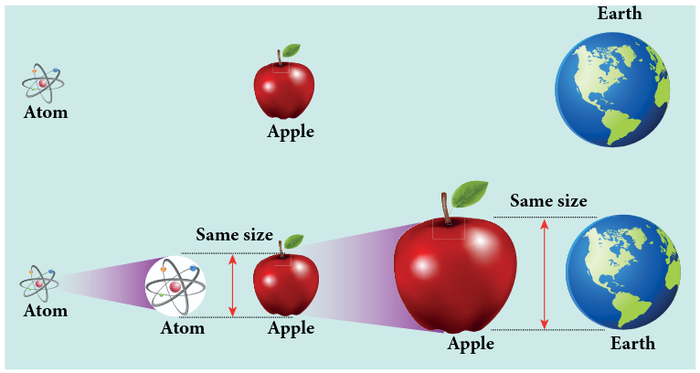

In earlier classes, we have studied that anything which occupies space is called matter. Matter can be classified into solids, liquids and gases. In our daily life, we use water for drinking, petrol for vehicles, we inhale oxygen, stainless steel vessels for cooking, etc. Experiences tell us that behaviour of one material is not the same as that of another, which means that the physical and chemical properties are different for different materials. In order to understand this, we need to know the fundamental constituents of materials.

When an object is divided repeatedly, the process of division could not be done beyond a certain stage in a similar way and we end up with a small speck. This small speck was defined as an atom. The word atom in Greek means 'without division or indivisible'. The size of an atom is very very small. For an example, the size of hydrogen atom (simplest among other atoms) is around $10^{-10}\mathrm{m}$. An American Physicist Richard P. Feynman said that if the size of an atom becomes the size of an apple, then the size of apple becomes the size of the earth as shown in Figure 9.1. Such a small entity is an atom.

In this unit, we first discuss the theoretical models of atom to understand its structure. The Bohr atom model is more successful than J. J. Thomson and Rutherford atom models. It explained many unsolved issues in those days and also gave better understanding of chemistry.

Later, scientists observed that even the atom is not the fundamental entity. It consists of electrons and nucleus. Around 1930, scientists discovered that nucleus is also made of proton and neutron. Further research discovered that even the proton and neutron are made up of fundamental entities known as quarks.

In this context, the remaining part of this unit is written to understand the structure and basic properties of nucleus. Further how the nuclear energy is produced and utilized are discussed.

### 9.2 ELECTRIC DISCHARGE THROUGH GASES

Gases at normal atmospheric pressure are poor conductors of electricity because they do not have free electrons for conduction.

But by special arrangement, one can make a gas to conduct electricity.

A simple and convenient device used to study the conduction of electricity through gases is known as gas discharge tube. The arrangement of discharge tube is shown in Figure 9.2. It consists of a long closed glass tube (of length nearly $50~\mathrm{cm}$ and diameter of $4\mathrm{cm}$ inside of which a gas in pure form is filled usually. The small opening in the tube is connected to a high vacuum pump and a low- pressure gauge. This tube is fitted with two metallic plates known as electrodes which are connected to secondary of an induction coil. The electrode connected to positive of secondary is known as anode and the electrode to the negative of the secondary is cathode. The potential of secondary is maintained at about $50~\mathrm{kV}$.

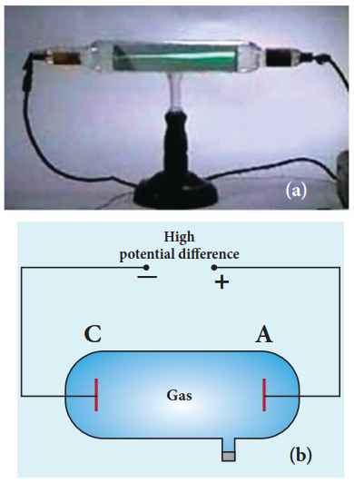

Suppose the pressure of the gas in discharge tube is reduced to around $110\mathrm{mm}$ of Hg using vacuum pump, it is observed that no discharge takes place. When the pressure is kept near $100\mathrm{mm}$ of Hg, the discharge of electricity through the tube takes place. Consequently, irregular streaks of light appear and also crackling sound is produced. When the pressure is reduced to the order of 10 mm of Hg, a luminous column known as positive column is formed from anode to cathode.

When the pressure reaches to around $0.01\mathrm{mm}$ of Hg, positive column disappears. At this time, a dark space is formed between anode and cathode which is often called Crooke's dark space and the walls of the tube appear with green colour. At this stage, some invisible rays emanate from cathode called cathode rays, which are later found be a beam of electrons.

**Properties of cathode rays**

(1) Cathode rays possess energy and momentum and travel in a straight line with high speed of the order of $10^{7}\mathrm{ms}^{-1}$. It can be deflected by application of electric and magnetic fields. The direction of deflection indicates that they contain negatively charged particles.

(2) When the cathode rays are allowed to fall on matter, heat is produced. Cathode rays affect the photographic plates and also produce fluorescence when they fall on certain crystals and minerals.

(3) When the cathode rays fall on a material of high atomic weight, x-rays are produced.

(4) Cathode rays ionize the gas through which they pass.

(5) The speed of cathode rays is up to $\left(\frac{1}{10}\right)^{th}$ of the speed of light.

### 9.2.1 Determination of specific charge $\left(\frac{e}{m}\right)$ of an electron - Thomson's experiment

Thomson's experiment is considered as one among the landmark experiments for the birth of modern physics. In 1887, J. J. Thomson made remarkable improvement in the study of gases in discharge tubes. In the presence of electric and magnetic fields, the cathode rays were deflected. By the variation of electric and magnetic fields, the specific charge (charge per unit mass) of the cathode rays is measured.

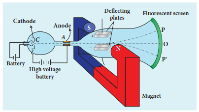

The arrangement of J. J. Thomson's experiment is shown in Figure 9.3. A highly evacuated discharge tube is used and cathode rays (electron beam) produced at cathode are attracted towards anode disc A. Anode disc is provided with pin hole in order to allow only a narrow beam of cathode rays. These cathode rays are now allowed to pass through the parallel metal plates which are maintained at high voltage as shown in Figure 9.3. Further, the gas discharge tube is kept in between pole pieces of magnet such that both electric and magnetic fields are acting perpendicular to each other. When the cathode rays strike the screen, they produce scintillation and hence bright spot is observed. This is achieved by coating the screen with zinc sulphide.

**(i) Determination of velocity of cathode rays**

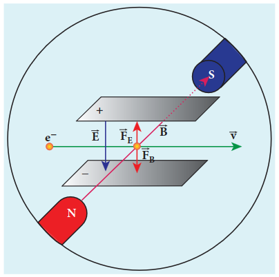

For a fixed electric field between the plates, the magnetic field is adjusted such that the cathode rays (electron beam) strike at the original position O (Figure 9.3). This means that the magnitude of electric force is balanced by the magnitude of force due to magnetic field as shown in Figure 9.4. Let $e$ be the charge of the cathode rays, then

$$eE = eBv$$

$$\Rightarrow v = \frac{E}{B} \quad (9.1)$$

**(ii) Determination of specific charge**

Since the cathode rays (electron beam) are accelerated from cathode to anode, the potential energy of the electron beam at the cathode is converted into kinetic energy of the electron beam at the anode. Let $V$ be the potential difference between anode and cathode, then the potential energy is $eV$. Then from law of conservation of energy,

$$eV = \frac{1}{2} mv^2\Rightarrow \frac{e}{m} = \frac{v^2}{2V}$$

Substituting the value of velocity from equation (9.1), we get

$$\frac{e}{m} = \frac{1}{2V}\frac{E^2}{B^2} \quad (9.2)$$

Substituting the values of $E$, $B$ and $V$, the specific charge can be determined as

$$\frac{e}{m} = 1.7\times 10^{11}\mathrm{Ckg}^{-1}$$

**(iii) Deflection of charge only due to uniform electric field**

When the magnetic field is turned off, the deflection is only due to electric field. The deflection in vertical direction is due to the electric force.

$$F_{e} = eE \quad (9.3)$$

Let $m$ be the mass of the electron and by applying Newton's second law of motion, acceleration of the electron is

$$a_{e} = \frac{1}{m} F_{e} \quad (9.4)$$

Substituting equation (9.4) in equation (9.3),

$$a_{e} = \frac{1}{m} eE = \frac{e}{m} E$$

Figure 9.5 Deviation of path by applying uniform electric field

Let $y$ be the deviation produced from original position on the screen as shown in Figure 9.5. Let the initial upward velocity of cathode ray be $u = 0$ before entering the parallel electric plates. Let $t$ be the time taken by the cathode rays to travel in electric field. Let $l$ be the length of one of the plates, then the time taken is

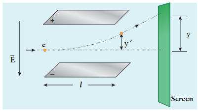

$$t = \frac{l}{v} \quad (9.5)$$

Hence, the deflection $y^{\prime}$ of cathode rays is (note: $u = 0$ and $a_{e} = \frac{e}{m} E$)

$$y^{\prime} = ut + \frac{1}{2} at^{2}\Rightarrow y^{\prime} = ut + \frac{1}{2} a_{e}t^{2}$$ $$= \frac{1}{2}\Bigl (\frac{e}{m} E\Bigr)\Bigl (\frac{l}{v}\Bigr)^{2}$$

$$y^{\prime} = \frac{1}{2}\frac{e}{m}\frac{l^{2}B^{2}}{E} \quad (9.6)$$

Therefore, the deflection $y$ on the screen is

$$y\propto y^{\prime}\Rightarrow y = Cy^{\prime}$$

where C is proportionality constant which depends on the geometry of the discharge tube and substituting $y^{\prime}$ value in equation 9.6, we get

$$y = C\frac{1}{2}\frac{e}{m}\frac{l^{2}B^{2}}{E} \quad (9.7)$$

Rearranging equation (9.7) as

$$\frac{e}{m} = \frac{2yE}{Cl^{2}B^{2}} \quad (9.8)$$

Substituting the values on RHS, the value of specific charge is calculated as $\frac{e}{m} = 1.7 \times 10^{11} \mathrm{Ckg}^{- 1}$.
> **Note:**
>
> The specific charge is independent of 
> (a) gas used (
> b) nature of the electrodes

#### 9.2.2 Determination of charge of an electron - Millikan's oil drop experiment

Millikan's oil drop experiment is another important experiment in modern physics which is used to determine one of the fundamental constants of nature known as charge of an electron (Figure 9.6 (a)).

By adjusting electric field suitably, the motion of oil drop inside the chamber can be controlled - that is, it can be made to move up or down or even kept balanced in the field of view for sufficiently long time.

The experimental arrangement is shown in Figure 9.6 (b). The apparatus consists of two horizontal circular metal plates A and B each with diameter around 20 cm and are separated by a small distance 1.5 cm. These two parallel plates are enclosed in a chamber with glass walls. Further, plates A and B are maintained at high potential difference around 10 kV such that electric field acts vertically downward. A small hole is made at the centre of the upper plate A and an atomizer is kept exactly above the hole to spray the liquid. When a fine droplet of the highly viscous non volatile liquid (like glycerine) is sprayed using atomizer, they fall freely downward through the hole of the top plate only under the influence of gravity.

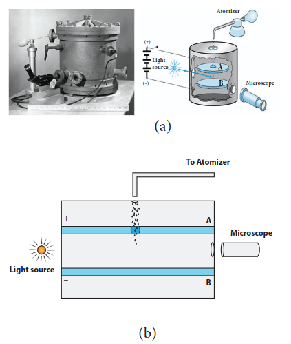

Few oil drops in the chamber can acquire electric charge (negative charge) because of friction with air or passage of x- rays in between the parallel plates. Further the chamber is illuminated by light which is passed horizontally and oil drops can be seen clearly using microscope placed perpendicular to the light beam.

These drops can move either upwards or downward.

Let *m* be the mass of the oil drop and $q$ be its charge. Then the forces acting on the droplet are

(a) Gravitational force

\[
F_g = mg
\]

(b) Electric force

\[
F_e = qE
\]

(c) Buoyant force

\[
F_b
\]

(d) Viscous force \[F_v\]

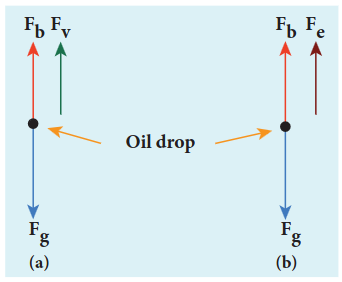

**(a) Determination of radius of the droplet**

When the electric field is switched off, the oil drop accelerates downwards. Due to the presence of air drag forces, the oil drops easily attain its terminal velocity and moves with constant velocity. This velocity can be carefully measured by noting down the time taken by the oil drop to fall through a predetermined distance. The free body diagram of the oil drop is shown in Figure 9.7 (a), we note that viscous force and buoyant force balance the gravitational force.

Let the gravitational force acting on the oil drop (downward) be $$F_{g} = mg$$

Let us assume that oil drop to be spherical in shape. Let \(\rho\) be the density of the oil drop, and *r* be the radius of the oil drop, then the mass of the oil drop can be expressed in terms of its density as

$$\begin{array}{l}\rho = \frac{m}{V}\\ \Rightarrow m = \rho \left(\frac{4}{3}\pi r^3\right)\left\{ \begin{array}{l}\because \text{volume of the}\\ \text{sphere},V = \frac{4}{3}\pi r^3 \end{array} \right\} \end{array} \quad (9.9)$$

The gravitational force can be written in terms of density as

$$F_{g} = mg\Rightarrow F_{g} = \rho \left(\frac{4}{3}\pi r^{3}\right)g$$

Let \(\sigma\) be the density of the air, the upthrust force experienced by the oil drop due to displaced air is

$$F_{b} = \sigma \left(\frac{4}{3}\pi r^{3}\right)g$$

Once the oil drop attains a terminal velocity $v$, the net downward force acting on the oil drop is equal to the viscous force acting opposite to the direction of motion of the oil drop. From Stokes law, the viscous force on the oil drop is

$$F_{v} = 6\pi r\nu \eta$$

From the free body diagram as shown in Figure 9.7 a), the force balancing equation is

$$F_{g} = F_{b} + F_{v}$$

$$\rho \left(\frac{4}{3}\pi r^{3}\right)g = \sigma \left(\frac{4}{3}\pi r^{3}\right)g + 6\pi r\nu \eta$$

$$\frac{4}{3}\pi r^{3}(\rho -\sigma)g = 6\pi r\nu \eta$$

$$\frac{2}{3}\pi r^{3}(\rho -\sigma)g = 3\pi r\nu \eta$$

$$r = \left[\frac{9\eta\nu}{2(\rho - \sigma)g}\right]^{\frac{1}{2}}$$

Thus, equation (9.9) gives the radius of the oil drop.

**(b) Determination of electric charge**

When the electric field is switched on, charged oil drops experience an upward electric force *(qE)*. Among many drops, one particular drop can be chosen in the field of view of microscope and strength of the electric field is adjusted to make that particular drop to be stationary. Under these circumstances, there will be no viscous force acting on the oil drop. Then, from the free body diagram shown Figure 9.7 (b), the net force acting on the oil droplet is

$$F_{e} + F_{b} = F_{g}$$

$$\Rightarrow qE + \frac{4}{3}\pi r^3\sigma g = \frac{4}{3}\pi r^3\rho g$$

$$\Rightarrow qE = \frac{4}{3}\pi r^3 (\rho -\sigma)g \quad (9.10)$$

$$\Rightarrow q = \frac{4}{3E}\pi r^3 (\rho -\sigma)g \quad (9.11)$$

Substituting equation (9.9) in equation (9.11), we get

$$q = \frac{18\pi}{E}\left(\frac{\eta^3\nu^3}{2(\rho - \sigma)g}\right)^{\frac{1}{2}} \quad (9.12)$$

Millikan repeated this experiment several times and computed the charges on oil drops. He found that the charge of any oil drop can be written as integral multiple of a basic value, \[
-1.6 \times 10^{-19}\,\text{C}
\] which is nothing but the charge of an electron. 

## 9.3 ATOM MODELS

**Introduction**

Around 400 B.C, Greek philosophers Leucippus and Democritus proposed the concept of atom, Every object on continued subdivision ultimately yields atoms. Later, many physicists and chemists tried to understand the nature with the idea of atoms. Many theories were proposed to explain the properties (physical and chemical) of bulk materials on the basis of atomic model.

For instance, J. J. Thomson proposed a theoretical atom model which is based on static distribution of electric charges. Since this model fails to explain the stability of atom, one of his students E. Rutherford proposed the first dynamic model of an atom. Rutherford gave atom model which is based on results of an experiment done by his students (Geiger and Marsden). But this model also failed to explain the stability of the atom.

Later, Niels Bohr who is also a student of Rutherford proposed an atomic model for hydrogen atom which is more successful than other two models. Niels Bohr atom model could explain the stability of the atom and also the origin of line spectrum. There are other atom models, such as Sommerfeld's atom model and atom model from wave mechanics (quantum mechanics). But we will restrict ourselves only to very simple (mathematically simple) atom model in this section.

### 9.3.1 J. J. Thomson's Model (Water melon model)

In this model, the atoms are visualized as homogeneous spheres which contain uniform distribution of positively charged particles (Figure 9.8 (a)). The negatively charged particles known as electrons are embedded in it like seeds in water melon as shown in Figure 9.8 (b).

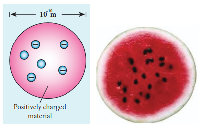

The atoms are electrically neutral, this implies that the total positive charge in an atom is equal to the total negative charge. According to this model, all the charges are assumed to be at rest. But from classical electrodynamics, no stable equilibrium points exist in electrostatic configuration (this is known as Earnshaw's theorem) and hence such an atom cannot be stable. Further, it fails to explain the origin of spectral lines observed in the spectrum of hydrogen atom and other atoms.

### 9.3.2 Rutherford's model

In 1911, Geiger and Marsden did a remarkable experiment based on the advice of their teacher Rutherford, which is known as scattering of alpha particles by gold foil.

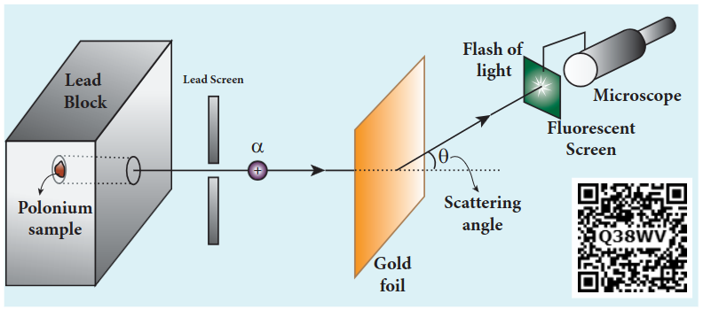

The experimental arrangement is shown in Figure 9.9. A source of alpha particles (radioactive material, example polonium) is kept inside a thick lead box with a fine hole as seen in Figure 9.9. The alpha particles coming through the fine hole of lead box pass through another fine hole made on the lead screen. These particles are now allowed to fall on a thin gold foil and it is observed that the alpha particles passing through gold foil are scattered through different angles. A movable screen (\(0^\circ \text{ to } 180^\circ\)) which is made up of zinc sulphide (ZnS) is kept on the other side of the gold foil to collect the scattered alpha particles. Whenever alpha particles strike the screen, a flash of light is observed which can be seen through a microscope.

Rutherford proposed an atom model based on the results of alpha scattering experiment. In this experiment, alpha particles (positively charged particles) were allowed to fall on the atoms of a metallic gold foil. The results of this experiment are given below and are shown in Figure 9.10, Rutherford expected the atom model to be as seen in Figure 9.10 (a) but the experiment showed the model as in Figure 9.10 (b).

(a) Most of the alpha particles were un-deflected through the gold foil and went straight.

(b) Some of the alpha particles were deflected through a small angle.

(c) A few alpha particles (one in thousand) were deflected through the angle more than \(90^\circ\)

(d) Very few alpha particles returned back (back scattered) - that is, deflected back by \(180^\circ\)

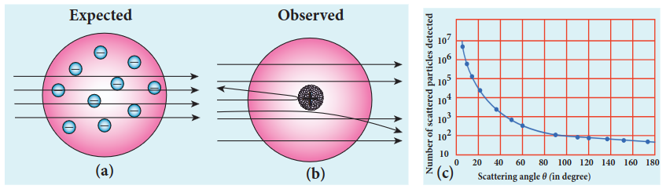

In Figure 9.10 (c), the dotted points are the alpha scattering experiment data points obtained by Geiger and Marsden and the solid curve is the prediction from Rutherford's nuclear model. It is observed that the Rutherford's nuclear model is in good agreement with the experimental data.

**Conclusion made by Rutherford based on the above observation**

From the experimental observations, Rutherford proposed that an atom has a lot of empty space and contains a tiny matter at its centre known as nucleus whose size is of the order of \(10^{-14}\) m. The nucleus is positively charged and most of the mass of the atom is concentrated in the nucleus. The nucleus is surrounded by negatively charged electrons. Since static charge distribution cannot be in a stable equilibrium, he suggested that the electrons are not at rest and they revolve around the nucleus in circular orbits like planets revolving around the sun.

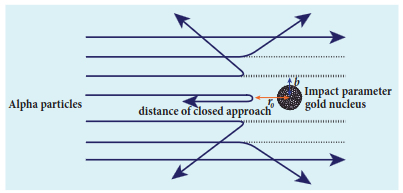

When an alpha particle moves straight towards the nucleus, it reaches a point where it comes to rest momentarily and returns back as shown in Figure 9.11. The minimum distance between the centre of the nucleus and the alpha particle just before it gets reflected back through \(180^\circ\) is defined as the distance of closest approach \(r_0\) (also known as contact distance). At this distance, all the kinetic energy of the alpha particle will be converted into electrostatic potential energy (Refer unit 1, volume 1 of +2 physics text book).

$$\frac{1}{2} m\nu_{0}^{2} = \frac{1}{4\pi\epsilon_{0}}\frac{(2e)(Ze)}{r_{0}}$$

$$\Rightarrow r_0 = \frac{1}{4\pi\epsilon_0}\frac{2Ze^2}{\left(\frac{1}{2}m\nu_0^2\right)} = \frac{1}{4\pi\epsilon_0}\frac{2Ze^2}{E_k}$$

where \(E_k\) is the kinetic energy of the alpha particle. This is used to estimate the size of the nucleus but size of the nucleus is always lesser than the distance of closest approach. Further, Rutherford calculated the radius of the nucleus for different nuclei and found that it ranges from \(10^{-14}\) m to \(10^{-15}\) m.

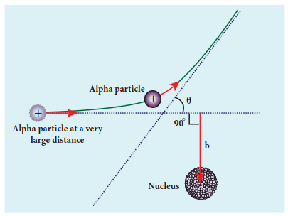

The impact parameter *(b)* (see Figure 9.12) is defined as the perpendicular distance between the centre of the gold nucleus and the direction of velocity vector of alpha particle when it is at a large distance. The relation between impact parameter and scattering angle can be shown as

$$b\propto \cot \left(\frac{\theta}{2}\right)\Rightarrow b = K\cot \left(\frac{\theta}{2}\right) \quad (9.13)$$

where \[
K = \frac{1}{4\pi\epsilon_0}\frac{2Ze^2}{mv_0^2}
\] and \(\theta\) is called scattering angle. Equation (9.13) implies that when impact parameter increases, the scattering angle decreases. Smaller the impact parameter, larger will be the deflection of alpha particles.

**Drawbacks of Rutherford model**

Rutherford atom model helps in the calculation of the diameter of the nucleus and also the size of the atom but has the following limitations:

(a) This model fails to explain the distribution of electrons around the nucleus and also the stability of the atom.

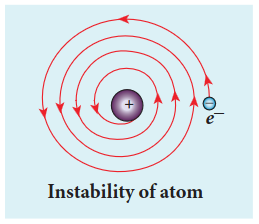

According to classical electrodynamics, any accelerated charge should emit electromagnetic radiations continuously. Due to emission of radiations, the charge loses its energy. Hence, it can no longer sustain the circular motion. The radius of the orbit, therefore, becomes smaller and smaller (undergoes spiral motion) as shown in Figure 9.13 and finally the electron should fall into the nucleus and the atoms should disintegrate. But this does not happen.

Hence, Rutherford model could not account for the stability of atoms.

(b) According to this model, emission of radiation must be continuous and must give continuous emission spectrum but experimentally we observe only line (discrete) emission spectrum for atoms.

### 9.3.3 Bohr atom model

In order to overcome the limitations of the Rutherford atom model in explaining the stability and also the line spectrum observed for a hydrogen atom (Figure 9.14), Niels Bohr made modifications in Rutherford atom model. He is the first person to give better theoretical model of the structure of an atom to explain the line spectrum of hydrogen atom. The following are the assumptions (postulates) made by Bohr.

**Postulates of Bohr atom model:**

(a) The electron in an atom moves around nucleus in circular orbits under the influence of Coulomb electrostatic force of attraction. This Coulomb force gives necessary centripetal force for the electron to undergo circular motion.

(b) Electrons in an atom revolve around the nucleus only in certain discrete orbits called stationary orbits and electron in such orbits do not radiate electromagnetic energy. Only those discrete orbits allowed are stable orbits.

The angular momentum of the electron in these stationary orbits are quantized - that is, it can be written as an integer or integral multiple of \[
\frac{h}{2\pi}
\] called as reduced Planck's constant - that is, \[
\hbar
\] (read it as h- bar) and the integer *n* is called as principal quantum number.

$$l = n\hbar \qquad \text{where} \hbar = \frac{h}{2\pi}$$

This condition is known as angular momentum quantization condition.

According to quantum mechanics, particles like electrons have dual nature (Refer unit 8, volume 2 of +2 physics text book). The standing wave pattern of the de Broglie wave associated with orbiting electron in a stable orbit is shown in Figure 9.15.

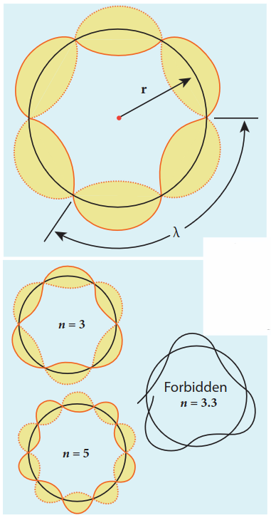

The circumference of an electron's orbit of radius *r* must be an integral multiple of de Broglie wavelength - that is,

$$2\pi r = n\lambda \qquad (9.14)$$
where n = 1,2,3..

But the de Broglie wavelength \(\lambda\) associated with an electron of mass *m* moving with velocity \[
\lambda = \frac{h}{m v}
\] where *h* is called Planck's constant. Thus from equation (9.14),

$$2\pi r = n\left(\frac{h}{m\upsilon}\right)$$ $$m\upsilon r = n\frac{h}{2\pi}$$

For any particle of mass *m* undergoing circular motion with radius *r* and velocity \(\upsilon\), the magnitude of angular momentum *l* is given by

$$l = r(m\upsilon)$$ $$m\upsilon r = l = n\hbar$$

(c) Energy of the electron in orbits is not continuous but only discrete. This is called the quantization of energy. An electron can jump from one orbit to another orbit by absorbing or emitting a photon whose energy is equal to the difference in energy \(\Delta\) E between the two orbital levels (Figure 9.16)

$$\Delta E = E_{final} - E_{initial} = h\nu = h\frac{c}{\lambda}$$

where *c* is the speed of light and \(\lambda\) is the wavelength and \(\nu\) is the frequency of the radiation emitted. Thus, the frequency of the radiation emitted is related only to change in atomic energy levels and it does not depend on frequency of orbital motion of the electron.

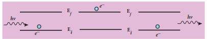

**EXAMPLE 9.1**

The radius of the 5th orbit of hydrogen atom is \[13.25
\mathring{A}
\]. Calculate the de broglie wavelength of the electron orbiting in the 5th orbit.

**Solution:**

$$2\pi r = n\lambda$$ $$2\times 3.14\times 13.25\dot{\mathrm{A}} = 5\times \lambda$$ $$\therefore \lambda = 16.64\dot{\mathrm{A}}$$

**EXAMPLE 9.2**

Find the (i) angular momentum (ii) velocity of the electron revolving in the 5th orbit of hydrogen atom.

$$(h = 6.6\times 10^{-34}\mathrm{Js},m = 9.1\times 10^{-31}\mathrm{kg})$$

**Solution**

(i) Angular momentum is given by

$$l = n\hbar = \frac{nh}{2\pi}$$ $$= \frac{5\times 6.6\times 10^{-34}}{2\times 3.14} = 5.25\times 10^{-34}\mathrm{kgm^2s^{-1}}$$

(ii) Velocity is given by

$$\mathrm{Velocity}\ u = \frac{l}{mr}$$ $$\displaystyle = \frac{(5.25\times 10^{-34}\mathrm{kgm^2s^{-1}})}{(9.1\times 10^{-31}\mathrm{kg})(13.25\times 10^{-10}\mathrm{m})}$$ $$\displaystyle u = 4.4\times 10^{5}\mathrm{ms^{-1}}$$

**Radius of the orbit of the electron and velocity of the electron**

Consider an atom which contains the nucleus at rest and an electron revolving around the nucleus in a circular orbit of radius \(r_n\) as shown in Figure 9.17. Nucleus is made up of protons and neutrons. Since proton is positively charged and neutron is electrically neutral, the charge of a nucleus is entirely due to the charge of protons.

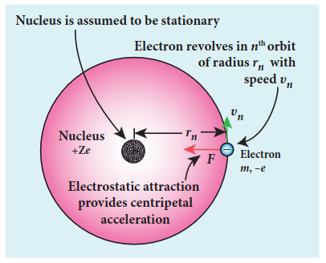

Let *Z* be the atomic number of the atom, then *+Ze* is the charge of the nucleus. Let *- e* be the charge of the electron. From Coulomb's law, the force of attraction between the nucleus and the electron is

$$\vec{F}_{\mathrm{coulomb}} = \frac{1}{4\pi\epsilon_0}\frac{(+Ze)(-e)}{r_n^2}\hat{r}$$ $$\displaystyle = -\frac{1}{4\pi\epsilon_0}\frac{Ze^2}{r_n^2}\hat{r}$$

This force provides necessary centripetal force

$$\vec{F}_{\mathrm{centripetal}} = \frac{mv_n^2}{r_n}\hat{r}$$

where *m* be the mass of the electron that moves with a velocity \(v_n\) in a circular orbit. Therefore,

$$\left|\vec{F}_{\mathrm{coulomb}}\right| = \left|\vec{F}_{\mathrm{centripetal}}\right|$$

$$\frac{1}{4\pi\epsilon_0}\frac{Ze^2}{r_n^2} = \frac{mv_n^2}{r_n}$$

Multiplied and divided by *m*

$$r_n = \frac{4\pi\epsilon_0(mv_nr_n)^2}{Zme^2} \quad (9.15)$$

From Bohr's assumption, the angular momentum quantization condition, *mv_nr_n = l_n = n\(\hbar\)*

$$r_{n} = \frac{4\pi\epsilon_{0}(n\hbar)^{2}}{Zme^{2}} = \frac{4\pi\epsilon_{0}n^{2}\hbar^{2}}{Zme^{2}}$$

$$r_{n} = \left(\frac{\epsilon_{0}h^{2}}{\pi m e^{2}}\right)\frac{n^{2}}{Z}\qquad (\because \hbar = \frac{h}{2\pi}) \quad (9.16)$$

where \(n \in \mathbb{N}\). Since, \(\epsilon_0\), \(h\), \(e\) and \(\pi\) are constants. Therefore, the radius of the orbit becomes

$$r_{n} = a_{0}\frac{n^{2}}{Z}$$

where \[
a_0=\frac{\epsilon_0 h^2}{\pi m e^2}=0.529\,\text{Å}
\]. This is known as Bohr radius which is the smallest radius of the orbit in hydrogen atom. Bohr radius is also used as unit of length called Bohr. 1 Bohr = 0.53 Å. For hydrogen atom (Z = 1),  
the radius of n\(^\text{th}\) orbit is

$$r_{n} = a_{0}n^{2}$$

For *n = 1* (first orbit or ground state),

$$r_{1} = a_{0} = 0.529\mathrm{\AA}$$

For *n = 2* (second orbit or first excited state),

$$r_{2} = 4a_{0} = 2.116\mathrm{\AA}$$

For *n = 3* (third orbit or second excited state),

$$r_{3} = 9a_{0} = 4.761\mathrm{\AA}$$

and so on.

Thus the radius of the orbit from centre increases with *n*, that is, $$ r_n \propto n^2 $$ as shown in Figure 9.18.

Further, Bohr's angular momentum quantization condition leads to

$$\frac{mv_{n}a_{0}n^{2}}{Z} = n\frac{h}{2\pi}\left[\therefore r_{n} = a_{0}\frac{n^{2}}{Z}\right]$$

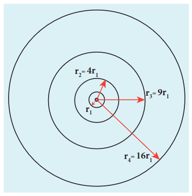

$$v_{n} = \frac{h}{2\pi m a_{0}n}$$

in atomic physics $$ v_n \propto 1/n $$

Note that the velocity of electron decreases as the principal quantum number (orbit number) increases as shown in Figure 9.19. This curve is the rectangular hyperbola. This implies that the velocity of electron in ground state is maximum when compared to that in excited states.

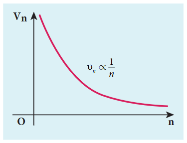

The energy of an electron in the nth orbit

Since the electrostatic force is a conservative force, the potential energy for the nth orbit is

$$U_{n} = \frac{1}{4\pi\epsilon_{0}}\frac{(+Ze)(-e)}{r_{n}} = -\frac{1}{4\pi\epsilon_{0}}\frac{Ze^{2}}{r_{n}}$$ $$\qquad = -\frac{1}{4\epsilon_{0}^{2}}\frac{Z^{2}me^{4}}{h^{2}n^{2}}\left(\because r_{n} = \frac{\epsilon_{0}h^{2}}{\pi m e^{2}}\frac{n^{2}}{Z}\right)$$

The kinetic energy of the electron in nth orbit is

$$KE_{n} = \frac{1}{2} mv_{n}^{2} = \frac{me^{4}}{8\epsilon_{0}^{2}h^{2}}\frac{Z^{2}}{n^{2}}$$

This implies that $$ U_n = -2 \text{ KE}_n. $$. Total energy of the electron in in the nth orbit is

$$E_{n} = KE_{n} + U_{n} = KE_{n} - 2KE_{n} = -KE_{n}$$ $$E_{n} = -\frac{me^{4}}{8\epsilon_{0}^{2}h^{2}}\frac{Z^{2}}{n^{2}}$$

For hydrogen atom *(Z = 1)*

$$E_{n} = -\frac{me^{4}}{8\epsilon_{0}^{2}h^{2}}\frac{1}{n^{2}}\mathrm{~joule} \quad (9.17)$$

where *n* stands for principal quantum number. The negative sign in equation (9.17) indicates that the electron is bound to the nucleus.

Substituting the values of mass and charge of an electron (*m* and *e* ) permittivity of free space \(\epsilon_0\) and Planck's constant *h* and expressing energy in terms of electron (+(*e V*)), we get

$$E_{n} = -13.6\frac{1}{n^{2}} eV$$

For the first orbit (ground state), the total energy of electron is \[ E_1 = -13.6 \, \text{eV}. \] For the second orbit (first excited state), the total energy of electron is \[ E_2 = -3.4 \, \text{eV}. \] For the third orbit (second excited state), the total energy of electron is \[ E_3 = -1.51 \, \text{eV}. \] and so on.

Notice that the energy of the first excited state is greater than that of the ground state, second excited state is greater than that of the first excited state and so on. Thus, the orbit which is closest to the nucleus \(r_1\) has lowest energy (minimum energy what it is compared with other orbits). So, it is often called ground state energy (lowest energy state). The ground state energy of hydrogen ($ -13.6 \, \text{eV} $) is used as a unit of energy called Rydberg \( (1 \, \text{Rydberg} = -13.6 \, \text{eV}). \)
The negative value of this energy is because of the way the zero of the potential energy is defined. When the electron is taken away to an infinite distance (very far distance) from nucleus, both the potential energy and kinetic energy terms vanish and hence the total energy also vanishes.

The energy level diagram along with the shape of the orbits for increasing values of *n* are shown in Figure 9.20. It shows that the energies of the excited states come closer and closer together when the principal quantum number *n* takes higher values.

**EXAMPLE 9.3**

(a) Show that the ratio of velocity of an electron in the first Bohr orbit to the speed of light *c* is a dimensionless number.
(b) Compute the velocity of electrons in ground state, first excited state and second excited state in Bohr atom model for hydrogen atom.

**Solution**

(a) The velocity of an electron in \( n^{th} \) orbit is

\[v_n = \frac{h}{2\pi m a_0} \frac{Z}{n}\]

where \( a_0 = \frac{\varepsilon_0 h^2}{\pi m e^2} = \) Bohr radius. Substituting

for \( a_0 \) in \( v_n \),

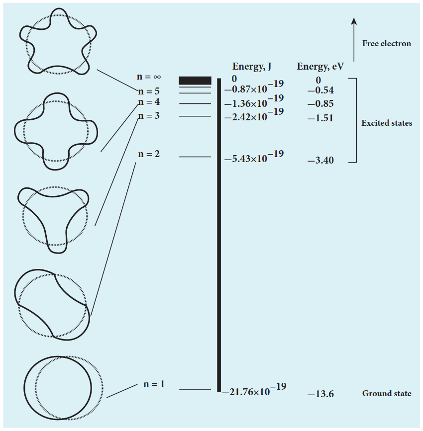

$$\nu_{n} = \frac{e^{2}}{2\epsilon_{0}h}\frac{Z}{n} = c\left(\frac{e^{2}}{2\epsilon_{0}hc}\right)\frac{Z}{n} = \frac{\alpha cZ}{n}$$

where *c* is the speed of light in free space or vacuum and its value is \[ c = 3 \times 10^8 \, \text{m s}^{-1} \] and \(\alpha\) is called fine structure constant.

For a hydrogen atom, *Z = 1* and for the first orbit, *n = 1*, the ratio of velocity of electron in first orbit to the speed of light in vacuum or free space is

$$\begin{array}{l}\frac{\nu_1}{c} = \alpha = \frac{e^2}{2\epsilon_0hc}\\ \alpha = \frac{(1.6\times 10^{-19}\mathrm{C})^2}{2\times(8.854\times 10^{-12}\mathrm{C}^2\mathrm{N}^{-1}\mathrm{m}^{-2})}\\ \times \frac{1}{(6.6\times 10^{-34}\mathrm{Nms})\times(3\times 10^8\mathrm{ms}^{-1})}\\ \approx \frac{1}{136.9} = \frac{1}{137} \end{array}$$

number.

\[\Rightarrow \alpha = \frac{1}{137}\]

(b) Using fine structure constant, the velocity of electron can be written as

$$\nu_{n} = \frac{\alpha cZ}{n}$$

For hydrogen atom *(Z = 1)* the velocity of electron in nth orbit is

$$\nu_{n} = \frac{c}{137}\frac{1}{n} = (2.19\times 10^{6})\frac{1}{n}\mathrm{ms}^{-1}$$

For the first orbit (ground state), the velocity of electron is

$$\nu_{1} = 2.19\times 10^{6}\mathrm{ms}^{-1}$$

For the second orbit (first excited state), the velocity of electron is

$$\nu_{2} = 1.095\times 10^{6}\mathrm{ms}^{-1}$$

For the third orbit (second excited state), the velocity of electron is

$$\nu_{3} = 0.73\times 10^{6}\mathrm{ms}^{-1}$$

Here, \(v_0\)>\(v_1\)>\(v_2\)

**EXAMPLE 9.4**

The Bohr atom model is derived with the assumption that the nucleus of the atom is stationary and only electrons revolve around the nucleus. Suppose the nucleus is also in motion, then calculate the energy of this new system.

**Solution**

Let the mass of the electron be *m* and mass of the nucleus be *M*. Since there is no external force acting on the system, the centre of mass of hydrogen atom remains at rest. Hence, both nucleus and electron move about the centre of mass as shown in figure.

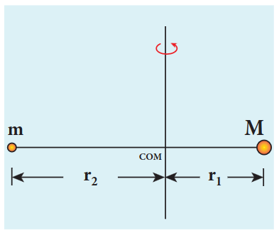

Let *V* be the velocity of the nuclear motion and \(\nu\) be the velocity of electron motion. Since the total linear momentum of the system is zero,

$$-m\nu + M V = 0 \ \text{or}$$ $$M V = m\nu = p$$ $$\vec{p}_e + \vec{p}_n = \vec{0}\ \text{or}$$ $$\left|\vec{p}_e\right| = \left|\vec{p}_n\right| = p$$

Hence, the kinetic energy of the system is

$$KE = \frac{p_n^2}{2M} +\frac{p_e^2}{2m} = \frac{p^2}{2}\left(\frac{1}{M} +\frac{1}{m}\right)$$

Let $\frac{1}{M} +\frac{1}{m} = \frac{1}{\mu_m}$. Here the reduced mass

$$\text{is}, \mu_m = \frac{mM}{M + m}$$

Therefore, the kinetic energy of the system now is \[KE = \frac{p^2}{2\mu_{m}}\]

Since the potential energy of the system is same, the total energy of the hydrogen can be expressed by replacing mass by reduced mass, which is

$$E_{n} = -\frac{\mu_{m}e^{4}}{8\epsilon_{0}^{2}h^{2}}\frac{1}{n^{2}}$$

Since the nucleus is very heavy compared to the electron, the reduced mass is closer to the mass of the electron.

> **Note:**
>
> In 1931, H.C. Urey and coworkers noticed that in the shorter wavelength region of the hydrogen spectrum lines, faint companion lines are observed. From the isotope displacement effect (isotope shift), the isotope of the same element can produce slightly different spectral lines. The presence of these faint lines confirmed the existence of isotopes of hydrogen atom (which is named as Deuterium).
>
> On calculating wavelength or wave number difference between the faint and bright spectral lines, atomic mass of deuterium is measured to be twice that of atomic mass of hydrogen atom. Bohr atom model could not explain this isotopic shift. Thus by considering nuclear motion (although the movement of the nucleus is much smaller) into account in the Bohr atom model, the wave number or wavelength difference between the lines produces by the hydrogen atom and deuterium is theoretically calculated which perfectly agreed with the spectroscopic measured values.
>
> The difference between hydrogen atom and deuterium is in the number of neutron. Hydrogen atom contains an electron and a proton, whereas deuterium has an electron, a proton and a neutron.

**Excitation energy and excitation potential**

The energy required to excite an electron from lower energy state to any higher energy state is known as excitation energy.

The excitation energy for an electron from ground state (n = 1) to first excited state (n = 2) is called first excitation energy.

For hydrogen atom, it is

$$
E_I = E_2 - E_1 = -3.4 \ eV - (-13.6 \ eV) = 10.2 \ eV
$$

Similarly, the excitation energy for an electron from ground state (n = 1) to second excited state (n = 3) is called second excitation energy, which is

$$
E_{II} = E_3 - E_1 = -1.51 \ eV - (-13.6 \ eV) = 12.1 \ eV
$$

and so on.

Excitation potential is defined as excitation energy per unit charge.

For hydrogen atom, the first excitation state energy is

$$
E_I = e V_I
$$

First excitation potential for hydrogen atom is,

$$
\Rightarrow V_I = \frac{1}{e} E_I = 10.2 \ \text{volt}
$$

Similarly, second excitation potential is,

$$
\Rightarrow V_{II} = \frac{1}{e} E_{II} = 12.1 \ \text{volt}
$$

and so on.

**Ionization energy and ionization potential**

An atom is said to be ionized when an electron is completely removed from the atom – that is, it reaches the state with energy \( E_{n \rightarrow \infty} \). The minimum energy required to remove an electron from an atom in the ground state is known as binding energy or ionization energy.

For hydrogen atom, the ground state ionization energy is,

$$
E_{\text{ionization}} = E_{\infty} - E_1 = 0 - (-13.6 \ eV) = 13.6 \ eV
$$

When an electron is in nth state of an atom, the energy required to remove an electron from that state – that is, the corresponding ionization energy is

$$
E_{\text{ionization}} = E_{\infty} - E_n = 0 - \left( -\frac{13.6 Z^{2}}{n^{2}} \ eV \right) = \frac{13.6 Z^{2}}{n^{2}} \ eV
$$

At normal room temperature, the electron in a hydrogen atom (Z=1) spends most of its time in the ground state.

**Table 9.1**

| Physical Quantity | Ground State | First Excited State | Second Excited State |
|---|---|---|---|
| Radius (\( r_n \propto n^2 \)) | 0.529 Å | 2.116 Å | 4.761 Å |
| Velocity (\( v_n \propto n^{-1} \)) | \( 2.19 \times 10^6 \ \text{m s}^{-1} \) | \( 2.19 \times 10^6 \ \text{m s}^{-1} \)  | \( 0.73 \times 10^6 \ \text{m s}^{-1} \) |
| Total Energy (\( E_n \propto n^{-2} \)) | -13.6 eV | -3.4 eV | -1.51 eV |

The energy required to remove an electron from the ground state of an atom to the outer most orbit \( (E = 0 \ \text{for} \ n \rightarrow \infty) \) is known as first ionization energy \( (13.6 \ \text{eV}) \). Then, the hydrogen atom is said to be in ionized state or simply called as hydrogen ion, denoted by \( H^{+} \). If we supply more energy than the ionization energy, the excess energy appears as the kinetic energy of the free electron.

Ionization potential is defined as ionization energy per unit charge.

$$
V_{\text{ionization}} = \frac{1}{e} E_{\text{ionization}} = \frac{13.6}{n^{2}} Z^{2} \ V
$$

Thus, for a hydrogen atom \( (Z = 1) \), the ionization potential is

$$
V = \frac{13.6}{n^{2}} \ \text{volt}
$$

The radius, velocity and total energy in ground state, first excited state and second excited state are given in Table 9.1.

**EXAMPLE 9.5**

Suppose the energy of an electron in hydrogen-like atom is given as \( E_n = -\frac{54.4}{n^{2}} \ \text{eV} \) where \( n \in \mathbb{N} \). Calculate the following:

(a) Sketch the energy levels for this atom and compute its atomic number.
(b) If the atom is in ground state, compute its first excitation potential and also its ionization potential.
(c) When a photon with energy \( 42 \ \text{eV} \) and another photon with energy \( 51 \ \text{eV} \) are made to collide with this atom, does this atom absorb these photons?
(d) Determine the radius of its first Bohr orbit.
(e) Calculate the kinetic and potential energies of electron in the ground state.

**Solutions**

(a) Given that

$$
E_n = -\frac{54.4}{n^{2}} \ \text{eV}
$$

For \( n = 1 \), the ground state energy \( E_1 = -54.4 \ \text{eV} \) and for \( n = 2 \), \( E_2 = -13.6 \ \text{eV} \). Similarly, \( E_3 = -6.04 \ \text{eV} \), \( E_4 = -3.4 \ \text{eV} \) and so on.

For large value of principal quantum number - that is, \( n = \infty \), we get \( E_{\infty} = 0 \ \text{eV} \).

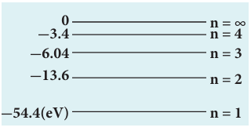

(b) For a hydrogen-like atom, ground state energy is

$$
E_1 = -\frac{13.6}{n^{2}} Z^{2} \ \text{eV}
$$

where \( Z \) is the atomic number. Hence, comparing this energy with given energy, we get

$$
-13.6 Z^{2} = -54.4 \Rightarrow Z = \pm 2
$$

Since atomic number cannot be negative number, \( Z = 2 \).

The first excitation energy is

$$
E_I = E_2 - E_1 = -13.6 \ \text{eV} - (-54.4 \ \text{eV}) = 40.8 \ \text{eV}
$$

Hence, the first excitation potential is

$$
V_I = \frac{1}{e} E_I = \frac{40.8 \ \text{eV}}{e} = 40.8 \ \text{volt}
$$

The first ionization energy is

$$
E_{\text{ionization}} = E_{\infty} - E_1 = 0 - (-54.4 \ \text{eV}) = 54.4 \ \text{eV}
$$

Hence, the first ionization potential is

$$
V_{\text{ionization}} = \frac{1}{e} E_{\text{ionization}} = \frac{54.4 \ \text{eV}}{e} = 54.4 \ \text{volt}
$$

(c) Consider two photons to be A and B.

Given that photon A with energy \( 42 \ \text{eV} \) and photon B with energy \( 51 \ \text{eV} \)

From Bohr assumption, difference in energy levels is equal to the energy photon absorbed, then atom will absorb energy, otherwise, not.

$$
E_2 - E_1 = -13.6 \ \text{eV} - (-54.4 \ \text{eV}) = 40.8 \ \text{eV} \approx 41 \ \text{eV}
$$

Similarly,

$$
E_3 - E_1 = -6.04 \ \text{eV} - (-54.4 \ \text{eV}) = 48.36 \ \text{eV}
$$

$$
E_4 - E_1 = -3.4 \ \text{eV} - (-54.4 \ \text{eV}) = 51 \ \text{eV}
$$

$$
E_3 - E_2 = -6.04 \ \text{eV} - (-13.6 \ \text{eV}) = 7.56 \ \text{eV}
$$

and so on.

But note that \( E_2 - E_1 \neq 42 \ \text{eV} \), \( E_3 - E_1 \neq 42 \ \text{eV} \), \( E_4 - E_1 \neq 42 \ \text{eV} \) and \( E_3 - E_2 \neq 42 \ \text{eV} \).

For all possibilities, no difference in energy is equal to the photon energy. Hence, photon A is not absorbed by this atom. But for Photon B, \( E_4 - E_1 = 51 \ \text{eV} \), which means Photon B can be absorbed by this atom.

(d) The radius of Bohr orbit is \( r_n = \frac{a_0 \times n^{2}}{Z} \)

For \( n = 1, Z = 2 \)

$$
r_1 = \frac{a_0}{2} = \frac{0.529}{2} = 0.265 \ \text{Å}
$$

(e) Since total energy is equal to negative of kinetic energy in Bohr atom model, we get

$$
KE_n = -E_n = -\left( -\frac{54.4}{n^{2}} \ \text{eV} \right) = \frac{54.4}{n^{2}} \ \text{eV}
$$

Since Potential energy is negative of twice the kinetic energy,

$$
U_n = -2 KE_n = -2 \left( \frac{54.4}{n^{2}} \ \text{eV} \right) = -\frac{108.8}{n^{2}} \ \text{eV}
$$

For ground state, put \( n = 1 \)

Kinetic energy is \( KE_1 = 54.4 \ \text{eV} \) and Potential energy is \( U_1 = -108.8 \ \text{eV} \)

### 9.3.4 Atomic spectra

Materials in the solid, liquid and gaseous states emit electromagnetic radiations when they are heated up and these emitted radiations usually exhibit continuous spectrum. For example, when white light is examined through a spectrometer, electromagnetic radiations of all wavelengths are observed which is a continuous spectrum.

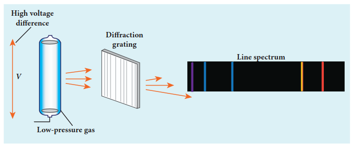

In early twentieth century, many scientists spent considerable time in understanding the characteristic radiations emitted by the atoms of individual elements exposed to a flame or electrical discharge. When they were viewed or photographed, instead of a continuous spectrum, the radiation contains a set of discrete lines, each with characteristic wavelength. In other words, the wavelengths of the radiation obtained are well defined and their positions and intensities are characteristic of the element as shown in Figure 9.21.

This implies that these spectra are unique to each element and can be used to identify the element of the gas (like finger print used to identify a person) - that is, it varies from one gas to another gas. This uniqueness of line spectra of elements made the scientists to determine the composition of stars, sun and also used to identify the unknown compounds.

**Hydrogen spectrum**

When the hydrogen gas enclosed in a tube is heated up, it emits electromagnetic radiations of certain sharply-defined characteristic wavelength (line spectrum), called hydrogen emission spectrum (Refer unit 5, volume 1 of +2 physics text book). The emission spectrum of hydrogen is shown in Figure 9.22(a).

When any gas is heated up, the thermal energy is supplied to excite the electrons. Similarly by allowing light to fall on the atoms, electrons can be excited. Once the electrons get sufficient energy as given by Bohr's postulate (c), it absorbs energy with particular wavelength (or frequency) and jumps from one stationary state (original state) to another state. The wavelengths (or frequencies) for the colours that are not observed are seen as dark lines in the absorption spectrum as shown in Figure 9.22 (b).

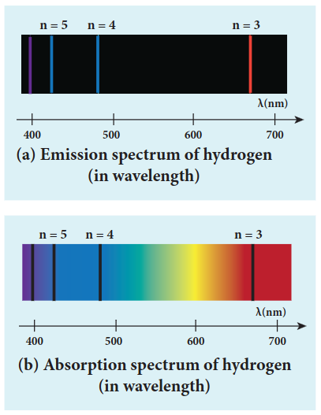

Since electrons in excited states have very small life time, these electrons jump back to ground state through spontaneous emission in a short duration of time (approximately \( 10^{-8} \ \text{s} \)) by emitting the radiation with same wavelength (or frequency) corresponding to the colours it absorbed (Figure 9.22 (a)). This is called emission spectroscopy.

The wavelengths of these lines can be calculated with great precision. Further, the emitted radiation contains wavelengths both lesser and greater than wavelengths of lines in the visible spectrum.

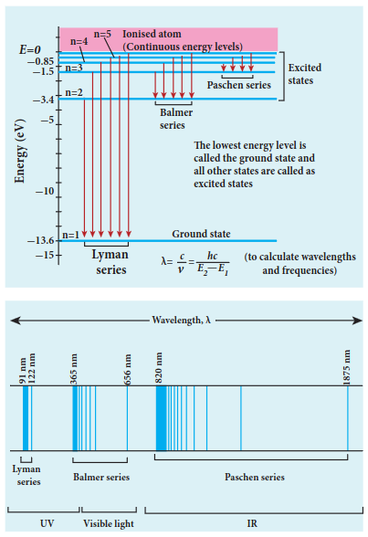

Notice that the spectral lines of hydrogen as shown in Figure 9.23 are grouped in separate series. In each series, the distance of separation between the consecutive wavelengths decreases from higher wavelength to the lower wavelength, and also wavelength in each series approach a limiting value known as the series limit. These series are named as Lyman series, Balmer series, Paschen series, Brackett series, Pfund series, etc. The wavelengths of these spectral lines perfectly agree with the wavelengths calculated using equation derived from Bohr atom model.

$$
\frac{1}{\lambda} = R \left( \frac{1}{n^{2}} - \frac{1}{m^{2}} \right) = \overline{\nu} \quad (9.18)
$$

where \( \overline{\nu} \) is known as wave number which is inverse of wavelength, \( R \) is known as Rydberg constant whose value is \( 1.09737 \times 10^{7} \ \text{m}^{-1} \) and \( m \) and \( n \) are positive integers such that \( m > n \). The various spectral series are discussed below:

**(a) Lyman series**

For \( n = 1 \) and \( m = 2, 3, 4, \dots \) in equation (9.18), the wave numbers or wavelength of spectral lines of Lyman series which lies in ultra-violet region,

$$
\overline{\nu} = \frac{1}{\lambda} = R \left( \frac{1}{1^{2}} - \frac{1}{m^{2}} \right)
$$

**(b) Balmer series**

For \( n = 2 \) and \( m = 3, 4, 5, \dots \) in equation (9.18), the wave numbers or wavelength of spectral lines of Balmer series which lies in visible region,

$$
\overline{\nu} = \frac{1}{\lambda} = R \left( \frac{1}{2^{2}} - \frac{1}{m^{2}} \right)
$$

**(c) Paschen series**

Put \( n = 3 \) and \( m = 4, 5, 6, \dots \) in equation (9.18). The wave number or wavelength of spectral lines of Paschen series which lies in infra-red region (near IR) is

$$
\overline{\nu} = \frac{1}{\lambda} = R \left( \frac{1}{3^{2}} - \frac{1}{m^{2}} \right)
$$

**(d) Brackett series**

For \( n = 4 \) and \( m = 5, 6, 7, \dots \) in equation (9.18), the wave numbers or wavelength of spectral lines of Brackett series which lies in infra-red region (middle IR),

$$
\overline{\nu} = \frac{1}{\lambda} = R \left( \frac{1}{4^{2}} - \frac{1}{m^{2}} \right)
$$

**(e) Pfund series**

For \( n = 5 \) and \( m = 6, 7, 8, \dots \) in equation (9.18), the wave numbers or wavelength of spectral lines of Pfund series which lies in infra-red region (far IR),

$$
\overline{\nu} = \frac{1}{\lambda} = R \left( \frac{1}{5^{2}} - \frac{1}{m^{2}} \right)
$$

Different spectral series are listed in Table 9.2.

**Table 9.2**

| n | m | Series Name | Region |
|---|---|---|---|
| 1 | 2,3,4,.... | Lyman | Ultraviolet |
| 2 | 3,4,5,.... | Balmer | Visible |
| 3 | 4,5,6,.... | Paschen | Infrared |
| 4 | 5,6,7,.... | Brackett | Infrared |
| 5 | 6,7,8,.... | Pfund | Infrared |

**Limitations of Bohr atom model**

The following are the drawbacks of Bohr atom model

(a) Bohr atom model is valid only for hydrogen atom or hydrogen like-atoms but not for complex atoms.
(b) When the spectral lines are closely examined, individual lines of hydrogen spectrum are accompanied by a number of faint lines. This is called fine structure. This cannot be explained by Bohr atom model.
(c) Bohr atom model fails to explain the intensity variations in the spectral lines.
(d) The distribution of electrons in various levels cannot be completely explained by Bohr atom model.

## 9.4 NUCLEI

**Introduction**

In the previous section, we have discussed about various preliminary atom models, Rutherford's alpha particle scattering experiment and Bohr atom model. These played a vital role to understand the structure of the atom and the nucleus. In this section, the structure of the nuclei and their properties, classifications are discussed.

### 9.4.1 Composition of nucleus

Atoms have a nucleus surrounded by electrons. The nucleus contains protons and neutrons. The neutrons are electrically neutral \( (q = 0) \) and the protons have positive charge \( (q = +e) \) equal in magnitude to the charge of the electron \( (q = -e) \). The number of protons in the nucleus is called the atomic number and it is denoted by \( Z \). The number of neutrons in the nucleus is called neutron number \( (N) \). The total number of neutrons and protons in the nucleus is called the mass number and it is denoted by \( A \). Hence, \( A = Z + N \).

The two constituents of nucleus namely neutrons and protons, are collectively called as nucleons. The mass of a proton is \( 1.6726 \times 10^{-27} \ \mathrm{kg} \) which is roughly 1836 times the mass of the electron. The mass of a neutron is slightly greater than the mass of the proton and it is equal to \( 1.6749 \times 10^{-27} \ \mathrm{kg} \).

To specify the nucleus of any element, we use the following general notation

$$
_{Z}^{A}X
$$

where \( X \) is the chemical symbol of the element, \( A \) is the mass number and \( Z \) is the atomic number. For example, the nitrogen nucleus is represented by $$
_{7}^{15}N $$. It implies that nitrogen nucleus contains 15 nucleons of which 7 are protons \( (Z = 7) \) and 8 are neutrons \( (N = A - Z = 8) \). Note that once the element is specified, the value of \( Z \) is known and subscript \( Z \) is sometimes omitted. For example, nitrogen nucleus is simply denoted as \( ^{15}N \) and we call it as 'nitrogen fifteen'.

Since the nucleus is made up of positively charged protons and electrically neutral neutrons, the overall charge of the nucleus is positive and it has the value \( +Ze \). But the atom is electrically neutral which implies that the number of electrons in the atom is equal to the number of protons in the nucleus.

### 9.4.2 Isotopes, isobars, and isotones

**Isotopes:**

In nature, there are atoms of a particular element whose nuclei have same number of protons but different number of neutrons. These kinds of atoms are called isotopes. In other words, isotopes are atoms of the same element having same atomic number \( Z \), but different mass number \( A \). For example, hydrogen has three isotopes and they are represented as \(_1^1\text{H}\) (hydrogen),  
\(_2^1\text{H}\) (deuterium), and \(_3^1\text{H}\) (tritium). Note that all the three nuclei have one proton and, hydrogen has no neutron, deuterium has 1 neutron and tritium has 2 neutrons.

The number of isotopes for the particular element and their relative abundances (percentage) vary with each element. example, carbon has four main isotopes: example, carbon has four main isotopes: \( ^{11}_6C \), \( ^{12}_6C \), \( ^{13}_6C \) and \( ^{14}_6C \). But in nature, the percentage of \( ^{12}_6C \) is approximately 98.9 %, that of \( ^{13}_6C \) is 1.1% and that of \( ^{14}_6C \) is 0.0001%. The other  
carbon isotope \( ^{11}_6C \), does not occur naturally and it can be produced only in nuclear reactions in the laboratory or by cosmic rays.

Since the chemical properties of any atom are determined only by electrons, the isotopes of any element have same electronic structure and same chemical properties. So the isotopes of the same element are placed in the same location in the periodic table.

**Isobars:**

Isobars are the atoms of different elements having the same mass number \( A \), but different atomic number \( Z \). In other words, isobars are the atoms of different chemical elements which have same number of nucleons. For example \( ^{40}_{16}S \), \( ^{40}_{17}Cl \), \( ^{40}_{18}Ar \), \( ^{40}_{19}K \) and \( ^{40}_{20}Ca \) are isobars having same mass number 40 but different atomic numbers. Unlike isotopes, isobars are chemically different elements. They have different physical and chemical properties.

**Isotones:**

Isotones are the atoms of different elements having same number of neutrons. \( ^{12}_{5}B \) and \( ^{13}_{6}C \) are examples of isotones with 7 neutrons each.

### 9.4.3 Atomic and nuclear masses

The mass of nuclei is very small (about \( 10^{-25} \ \text{kg} \) or less). Therefore, it is more convenient to express it in terms of another unit namely, the atomic mass unit \( (u) \). One atomic mass unit \( (u) \) is defined as the \( (1/12)^{\text{th}} \) of the mass of the isotope of carbon \( ^{12}_{6}C \) which is more abundant in naturally occurring isotope of carbon.

In other words

$$
1u = \frac{\text{mass of } ^{12}_{6}C \text{ atom}}{12} = \frac{1.9926 \times 10^{-26}}{12} = 1.660 \times 10^{-27} \ \mathrm{kg}
$$

In terms of this atomic mass unit, the mass of the neutron \( = 1.008665 \ u \), the mass of the proton \( = 1.007276 \ u \), the mass of the hydrogen atom \( = 1.007825 \ u \) and the mass of \( ^{12}C = 12u \). Note that usually mass specified is the mass of the atom, not mass of the nucleus. To get the nuclear mass of particular nucleus, the mass of electrons has to be subtracted from the corresponding atomic mass. Experimentally the atomic mass is determined by the instrument called Bainbridge mass spectrometer. If we determine the atomic mass of the element without considering the effect of its isotopes, we get the mass averaged over different isotopes weighted by their abundances.

**EXAMPLE 9.6**

Calculate the average atomic mass of chlorine if no distinction is made between its different isotopes?

**Solution**

The element chlorine is a mixture of \( 75.77\% \) of \( ^{35}_{17}Cl \) and \( 24.23\% \) of \( ^{37}_{17}Cl \). So the average atomic mass will be

$$
\frac{75.77}{100} \times 34.96885u + \frac{24.23}{100} \times 36.96593u = 35.453u
$$

In fact, the chemist uses the average atomic mass or simply called chemical atomic weight (35.453 u for chlorine) of an element. So it must be remembered that the atomic mass which is mentioned in the periodic table is basically averaged atomic mass.

### 9.4.4 Size and density of the nucleus

The alpha particle scattering experiment and many other measurements using different methods have been carried out on the nuclei of various atoms. The nuclei of atoms are found to be approximately spherical in shape. It is experimentally found that radius of nuclei for \( Z > 10 \), satisfies the following empirical formula

$$
R = R_0 A^{\frac{1}{3}} \quad (9.19)
$$

Here \( A \) is the mass number of the nucleus and the constant \( R_0 = 1.2 \ \text{F} \) where \( 1 \ \text{F} = 1 \times 10^{-15} \ \mathrm{m} \). The unit fermi (F) is named after Enrico Fermi.

**EXAMPLE 9.7**

Calculate the radius of \( ^{197}_{79}Au \) nucleus.

**Solution**

According to the equation (9.19),

$$
R = 1.2 \times 10^{-15} \times (197)^{\frac{1}{3}} = 6.97 \times 10^{-15} \ \mathrm{m}
$$

Or \( R = 6.97 \ \text{F} \)

**EXAMPLE 9.8**

Calculate the density of the nucleus with mass number \( A \)

**Solution**

From equation (9.19), the radius of the nucleus, \( R = R_0 A^{\frac{1}{3}} \). Then the volume of the nucleus

$$
V = \frac{4}{3} \pi R^{3} = \frac{4}{3} \pi R_0^{3} A
$$

By ignoring the mass difference between the proton and neutron, the total mass of the nucleus having mass number \( A \) is equal to \( A \cdot m \) where \( m \) is mass of the proton and is equal to \( 1.6726 \times 10^{-27} \ \mathrm{kg} \)

Nuclear density

$$
\rho = \frac{\text{mass of the nucleus}}{\text{Volume of the nucleus}} = \frac{A \cdot m}{\frac{4}{3} \pi R_0^{3} A} = \frac{m}{\frac{4}{3} \pi R_0^{3}}
$$

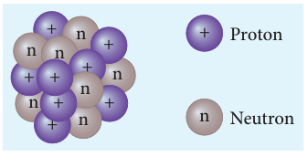

The above expression shows that the nuclear density is independent of the mass number \( A \). In other words, all the nuclei \( (Z > 10) \) have the same density and it is an important characteristic property of all nuclei.

We can calculate the numerical value of this density by substituting the corresponding values.

$$
\rho = \frac{1.67 \times 10^{-27}}{\frac{4}{3} \pi \times (1.2 \times 10^{-15})^{3}} = 2.3 \times 10^{17} \ \mathrm{kg} \ \mathrm{m}^{-3}
$$

It implies that nucleons are extremely tightly packed or compressed state in the nucleus and compare this density with the density of water which is \( 10^{3} \ \mathrm{kg} \ \mathrm{m}^{-3} \).

> A single teaspoon of nuclear matter would weigh about trillion tons.

### 9.4.5 Mass defect and binding energy

It is experimentally found out that the mass of any nucleus is always less than the sum of the masses of its individual constituent particles. For example, consider the carbon-12 nucleus which is made up of 6 protons and 6 neutrons.

Mass of 6 neutrons \( = 6 \times 1.00866u = 6.05196u \)
Mass of 6 protons \( = 6 \times 1.00727u = 6.04362u \)
Mass of 6 electrons \( = 6 \times 0.00055u = 0.0033u \)

The expected mass of carbon-12 nucleus \( = 6.05196u + 6.04362u = 12.09558u \)

But using mass spectroscopy, the atomic mass of carbon-12 atom is found to be \( 12u \). So if we subtract the mass of 6 electrons \( (0.0033u) \) from \( 12u \), we get the nuclear mass of carbon-12 atom which is equal to \( 11.9967u \). Hence the experimental mass of carbon-12 nucleus is less than the total mass of its individual constituents by \( \Delta m = 0.09888u \). This difference in mass \( \Delta m \) is called mass defect. In general, if M, \( m_p \) and \( m_n \) are mass of the nucleus \( (_{Z}^{A}X) \), the mass of a proton and the mass of a neutron respectively, then the mass defect is given by

$$
\Delta m = (Z m_p + N m_n) - M \quad (9.20)
$$

Where has this mass disappeared? The answer was provided by Albert Einstein with the help of famous mass-energy relation \( (E = mc^{2}) \). According to this relation, the mass can be converted into energy and energy can be converted into mass. In the case of the carbon-12 nucleus, when 6 protons and 6 neutrons combine to form carbon-12 nucleus, mass equal to mass defect disappears and an energy equivalent to missing mass is released. This energy is called the binding energy of the nucleus (BE) and is equal to \( (\Delta m)c^{2} \). In fact, to separate the carbon-12 nucleus into individual constituents, we must supply the energy equal to binding energy of the nucleus.

We can write the equation (9.20) in terms of binding energy

$$
BE = (Z m_p + N m_n - M) c^{2} \quad (9.21)
$$

It is always convenient to work with the mass of the atom rather than with the mass of the nucleus. Hence by adding and subtracting the mass of the \( Z \) electrons, we get

$$
BE = (Z m_p + Z m_e + N m_n - M - Z m_e) c^{2} \quad (9.22)
$$

$$
BE = [Z (m_p + m_e) + N m_n - M - Z m_e] c^{2}
$$

where \( m_p + m_e = m_H \) (mass of hydrogen atom)

$$
BE = [Z m_H + N m_n - (M + Z m_e)] c^{2} \quad (9.23)
$$

Here \( M + Z m_e = M_A \) where \( M_A \) is the mass of the atom of an element \( _{Z}^{A}X \).

Finally, the binding energy in terms of the atomic masses is given by

$$
BE = [Z m_H + N m_n - M_A] c^{2} \quad (9.24)
$$

> **Note**
>
> Using Einstein's mass-energy equivalence, the energy equivalent of one atomic mass unit
>
> $1u = 1.66 \times 10^{-27} \times (3 \times 10^8)^2$
>
> $= 14.94 \times 10^{-11} \, J \approx 931 \, \text{MeV}$

**EXAMPLE 9.9**

Compute the binding energy of \( ^{4}_{2}He \) nucleus using the following data: Atomic mass of Helium atom, \( M_A(He) = 4.00260u \) and that of hydrogen atom, \( m_H = 1.00785u \).

**Solution:**

Binding energy \( BE = [Z m_H + N m_n - M_A] c^{2} \)

For helium nucleus, \( Z = 2 \), \( N = A - Z = 4 - 2 = 2 \)

Mass defect

$$
\Delta m = [(2 \times 1.00785u) + (2 \times 1.008665u) - 4.00260u] = 0.03043u
$$

$$
BE = 0.03043u \times c^{2}
$$

$$
BE = 0.03043 \times 931 \ \text{MeV} = 28.33 \ \text{MeV}
$$

\( [\because 1u c^{2} = 931 \ \text{MeV}] \)

The binding energy of the \( ^{4}_{2}He \) nucleus is 28.33 MeV.

### 9.4.6 Binding energy curve

In the previous section, the origin of the binding energy is discussed. Now we can find the average binding energy per nucleon \( \overline{BE} \). It is given by

$$
\overline{BE} = \frac{[Z m_H + N m_n - M_A] c^{2}}{A} \quad (9.25)
$$

The average binding energy per nucleon is the average energy required to separate single nucleon from the particular nucleus. When \( \overline{BE} \) is plotted against A of all known nuclei, we get \( \overline{BE} \) average curve as shown in Figure 9.24.

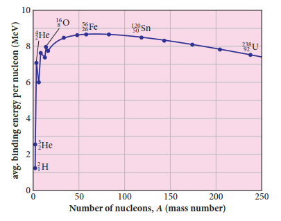

**Important inferences from the average binding energy curve:**

(1) The value of \( \overline{BE} \) rises as the mass number increases until it reaches a maximum value of \( 8.8 \ \text{MeV} \) for \( A = 56 \) (iron) and then it slowly decreases.
(2) The average binding energy per nucleon is about \( 8.5 \ \text{MeV} \) for nuclei having mass number lying between \( A = 40 \) and 120. These elements are comparatively more stable and not radioactive.
(3) For higher mass numbers, the curve drops slowly and \( \overline{BE} \) for uranium is about 7.6 MeV. Such nuclei are unstable and exhibit radioactivity.

From Figure 9.24, if two light nuclei with A<28 combine to form a nucleus with A<56, the binding energy per nucleon is more for final nucleus than initial nuclei. Thus, if the lighter elements combine to produce a nucleus of medium value A, a large amount of energy will be released. This is the basis of nuclear fusion and is the principle of the hydrogen bomb.

(4) If a nucleus of heavy element is split (fission) into two or more nuclei of medium value A, the energy released would again be large. The atom bomb is based on this principle and huge energy of atom bombs comes from this fission when it is uncontrolled. Fission is explained in the section 9.7

**EXAMPLE 9.10**

Compute the binding energy per nucleon of \( ^{4}_{2}He \) nucleus.

**Solution**

From Example 9.9, we found that the BE of \( ^{4}_{2}He = 28.33 \ \text{MeV} \)

Binding energy per nucleon \( = \overline{BE} = \frac{28.33 \ \text{MeV}}{4} \approx 7 \ \text{MeV} \).

## 9.5 NUCLEAR FORCE

Nucleus of the atoms contains protons and neutrons. From electrostatics, we learnt that like charges repel each other. In the nucleus, since the protons are separated by a distance of about a few fermi \( (10^{-15} \ \mathrm{m}) \), they must exert on each other a very strong repulsive force.

For example, the electrostatic repulsive force between two protons separated by a distance \( 10^{-15} \ \mathrm{m} \)

$$
F = k \times \frac{q^{2}}{r^{2}} = 9 \times 10^{9} \times \frac{(1.6 \times 10^{-19})^{2}}{(10^{-15})^{2}} \approx 230 \ \mathrm{N}
$$

The acceleration experienced by a proton due to the force of \( 230 \ \mathrm{N} \) is

$$
a = \frac{F}{m} = \frac{230 \ \mathrm{N}}{1.67 \times 10^{-27} \ \mathrm{kg}} \approx 1.4 \times 10^{29} \ \mathrm{m} \ \mathrm{s}^{-2}
$$

This is nearly \( 10^{28} \) times greater than the acceleration due to gravity. So if the protons in the nucleus experience only the electrostatic force, then the nucleus would fly apart in an instant. Then how are the protons held together in the nucleus?

From this observation, it was concluded that there must be a strong attractive force between protons to overcome the repulsive Coulombic force. This attractive force which holds the nucleons together is called strong nuclear force. The properties of the nuclear force were understood through various experiments carried out between 1930s and 1950s. A few properties of the nuclear force are:

(i) The nuclear force is of very short range, acting only up to a distance of a few fermi. But inside the nucleus, the repulsive Coulomb force or attractive gravitational forces between two protons are much weaker than the nuclear force between two protons. Similarly, the gravitational force between two neutrons is also much weaker than nuclear force between the neutrons. So nuclear force is the strongest force in nature.

(ii) The nuclear force is attractive and acts with an equal strength between proton-proton, proton-neutron, and neutron-neutron.

(iii) Nuclear force does not act on the electrons. So it does not alter the chemical properties of the atom.

## 9.6 RADIOACTIVITY

In the binding energy curve, the stability of the nucleus that has \( Z > 82 \) starts to decrease and these nuclei are fairly unstable nuclei. Some of the unstable nuclei decay naturally by emitting certain particles to form a stable nucleus. The elements with atomic number \( Z > 82 \) and isotopes of lighter nuclei belong to the category of naturally-occurring radioactive nuclei. Each of these radioactive nuclei decays to another nucleus by the emission of \( ^{4}_{2}He \) nucleus \( (\alpha \text{-decay}) \) or electron or positron \( (\beta \text{-decay}) \) or gamma rays \( (\gamma \text{-decay}) \)

The phenomenon of spontaneous emission of highly penetrating radiations such as \( \alpha \), \( \beta \) and \( \gamma \) rays by an element is called radioactivity and the substances which emit these radiations are called radioactive elements. These radioactive elements can be heavy elements \( (Z > 82) \) or isotopes of lighter and heavy elements and these isotopes are called radioisotopes. For example, carbon isotope \( ^{14}C \) is radioactive but \( ^{12}C \) is not.

Radioisotopes have a variety of applications such as carbon dating, cancer treatment, etc. When a radioactive nucleus undergoes decay, the mass of the system decreases - that is, the mass of the initial nucleus before decay is always greater than the sum of the masses of the final nucleus and the emitted particle. This difference in mass \( \Delta m \) appears as the energy according to Einstein's relation \( E = |\Delta m| c^{2} \).

The phenomenon of radioactivity was first discovered by Henri Becquerel in 1896. Later, Marie Curie and her husband Pierre Curie did a series of experiments in detail to understand the phenomenon of radioactivity. In India, Saha Institute of Nuclear Physics (SINP), Kolkata is the premier institute pursuing active research in nuclear physics.

> **Note**
>
> During early days of nuclear physics research, the term 'radiation' was used to denote the emanations from radioactive nuclei. Now we know that $\alpha$ rays are in fact $^2_1He$ nuclei and $\beta$ rays are electrons or positrons. Certainly, they are not electromagnetic radiation. The $\gamma$ ray alone is electromagnetic radiation.

### 9.6.1 Alpha decay

When an unstable nucleus decays by emitting an \( \alpha \)-particle \( (^{4}_{2}He \ \text{nucleus}) \), it loses two protons and two neutrons. As a result, its atomic number \( Z \) decreases by 2 and the mass number decreases by 4. We write the alpha decay process symbolically in the following way

$$
_{Z}^{A} X \rightarrow _{Z-2}^{A-4} Y + _{2}^{4} He \quad (9.26)
$$

Here \( X \) is called the parent nucleus and \( Y \) is called the daughter nucleus.

Example: Decay of Uranium \( ^{238}_{92}U \) to thorium \( ^{234}_{90}Th \) with the emission of \( ^{4}_{2}He \) nucleus \( (\alpha \text{-particle}) \)

$$
^{238}_{92}U \rightarrow ^{234}_{90}Th + ^{4}_{2}He
$$

As already mentioned, the total mass of the daughter nucleus and \( ^{4}_{2}He \) nucleus is always less than that of the parent nucleus. The difference in mass \( (\Delta m = m_X - m_Y - m_{\alpha}) \) is released as energy called disintegration energy \( Q \) and is given by

$$
Q = (m_X - m_Y - m_{\alpha}) c^{2} \quad (9.27)
$$

Note that for spontaneous decay (natural radioactivity) \( Q > 0 \). In alpha decay process, the disintegration energy is certainly positive \( (Q > 0) \). In fact, the disintegration energy \( Q \) is also the net kinetic energy gained in the decay process or if the parent nucleus is at rest, \( Q \) is the total kinetic energy of daughter nucleus and the \( ^{4}He \) nucleus. Suppose \( Q < 0 \), then the decay process cannot occur spontaneously and energy must be supplied to induce the decay.

> **Note**
>
> In alpha decay, why does the unstable nucleus emit \( ^{4}He \) nucleus? Why does it not emit four separate nucleons? After all \( ^{4}He \) consists of two protons and two neutrons. For example, if \( ^{238}U \) nucleus decays into \( ^{234}Th \) by emitting four separate nucleons (two protons and two neutrons), then the disintegration energy \( Q \) for this process turns out to be negative. It implies that the total mass of products is greater than that of parent \( (^{238}U) \) nucleus. This kind of process cannot occur in nature because it would violate conservation of energy. In any decay process, the conservation of energy, laws of linear momentum and laws of angular momentum must be obeyed.

**EXAMPLE 9.11**

(a) Calculate the disintegration energy when stationary \( ^{232}U \) nucleus decays to thorium \( ^{228}Th \) with the emission of \( \alpha \) particle. The atomic masses are of \( ^{232}U = 232.037156u \), \( ^{228}Th = 228.028741u \) and \( ^{4}He = 4.002603u \)
(b) Calculate kinetic energies of \( ^{228}Th \) and \( \alpha \)-particle and their ratio.

**Solution**

The difference in masses

$$
\Delta m = (m_U - m_{Th} - m_{\alpha}) = (232.037156 - 228.028741 - 4.002603)u = 0.005812u
$$

The mass lost in this decay \( = 0.005812u \)

Since \( 1u = 931 \ \text{MeV} \), the energy \( Q \) released is

$$
Q = (0.005812u) \times (931 \ \text{MeV}/u) = 5.41 \ \text{MeV}
$$

This disintegration energy \( Q \) appears as the kinetic energy of \( \alpha \) particle and the daughter nucleus.

In any decay, the total linear momentum must be conserved.

Total linear momentum of the parent nucleus \( = \) total linear momentum of the daughter nucleus and alpha particle

Since before decay, the uranium nucleus is at rest, its momentum is zero.

By applying conservation of momentum, we get

$$
0 = m_{Th} \vec{v}_{Th} + m_{\alpha} \vec{v}_{\alpha}
$$

$$
m_{\alpha} \vec{v}_{\alpha} = -m_{Th} \vec{v}_{Th}
$$

It implies that the alpha particle and daughter nucleus move in opposite directions.

In magnitude \( m_{\alpha} v_{\alpha} = m_{Th} v_{Th} \)

The velocity of alpha particle \( v_{\alpha} = \frac{m_{Th}}{m_{\alpha}} v_{Th} \)

Since \( m_{Th} > m_{\alpha} \), \( v_{\alpha} > v_{Th} \).

The ratio of the kinetic energy of alpha particle to that of the daughter nucleus

$$
\frac{KE_{\alpha}}{KE_{Th}} = \frac{\frac{1}{2} m_{\alpha} v_{\alpha}^{2}}{\frac{1}{2} m_{Th} v_{Th}^{2}} = \frac{m_{Th}}{m_{\alpha}} = \frac{228.028741}{4.002603} = 57
$$

The kinetic energy of alpha particle is 57 times greater than the kinetic energy of the daughter nucleus \( (^{228}_{90}Th) \).

The disintegration energy \( Q = \) total kinetic energy of products

$$
KE_{\alpha} + KE_{Th} = 5.41 \ \text{MeV}
$$

$$
57 KE_{Th} + KE_{Th} = 5.41 \ \text{MeV}
$$

$$
KE_{Th} = \frac{5.41}{58} \ \text{MeV} = 0.093 \ \text{MeV}
$$

$$
KE_{\alpha} = 57 KE_{Th} = 57 \times 0.093 = 5.301 \ \text{MeV}
$$

In fact, \( 98\% \) of total kinetic energy is taken by the \( \alpha \) particle.

### 9.6.2 Beta decay

In beta decay, a radioactive nucleus emits either electron or positron. If electron \( (e^{-}) \) is emitted, it is called \( \beta^{-} \) decay and if positron \( (e^{+}) \) is emitted, it is called \( \beta^{+} \) decay. The positron is an anti-particle of an electron whose mass is same as that of electron and charge is opposite to that of electron - that is, \( +e \). Both positron and electron are referred to as beta particles.

**\( \beta^{-} \) decay:**

In \( \beta^{-} \) decay, the atomic number of the nucleus increases by one but its mass number remains the same. This decay is represented by

$$
_{Z}^{A} X \rightarrow _{Z+1}^{A} Y + e^{-} + \overline{\nu} \quad (9.28)
$$

It implies that the element \( X \) becomes \( Y \) by giving out an electron and an antineutrino \( (\overline{\nu}) \). In other words, in each \( \beta^{-} \) decay, one neutron in the nucleus of \( X \) is converted into a proton with the emission of an electron \( (e^{-}) \) and an antineutrino. Thus,

$$
n \rightarrow p + e^{-} + \overline{\nu}
$$

Where \( p \) - proton, \( \overline{\nu} \) - antineutrino.

Example: Carbon \( (^{14}_{6}C) \) is converted into nitrogen \( (^{14}_{7}N) \) through \( \beta^{-} \) decay.

$$
^{14}_{6}C \rightarrow ^{14}_{7}N + e^{-} + \overline{\nu}
$$

**\( \beta^{+} \) decay:**

In \( \beta^{+} \) decay, the atomic number is decreased by one and again its mass number remains the same. This decay is represented by

$$
_{Z}^{A} X \rightarrow _{Z-1}^{A} Y + e^{+} + \nu \quad (9.29)
$$

It implies that the element \( X \) becomes \( Y \) by giving out a positron and neutrino \( (\nu) \). In other words, for each \( \beta^{+} \) decay, a proton in the nucleus \( X \) is converted into a neutron, a positron \( (e^{+}) \) and a neutrino. Thus,

$$
p \rightarrow n + e^{+} + \nu
$$

Example: Sodium \( (^{22}_{11}Na) \) is converted into neon \( (^{22}_{10}Ne) \) through \( \beta^{+} \) decay.

$$
^{22}_{11}Na \rightarrow ^{22}_{10}Ne + e^{+} + \nu
$$

However a single proton (not inside any nucleus) cannot exhibit \( \beta^{+} \) decay due to energy conservation, because neutron mass is larger than proton mass. But a single neutron (not inside any nucleus) can exhibit \( \beta^{-} \) decay.

> A very interesting application of alpha decay is in smoke detectors which prevent us from any hazardous fire.
>
> 
>
> The smoke detector uses around 0.2 mg of man-made weak radioactive isotope called americium (\(^{241}_{95}Am\)). This radioactive source is placed between two oppositely charged metal plates and the radiations from $^{241}_{95}Am$ continuously ionize the nitrogen, oxygen molecules in the air space between the plates. As a result, there will be a continuous flow of small steady current in the circuit. If smoke enters, the radiation is being absorbed by the smoke particles rather than air molecules. As a result, the ionization and along with it the current is reduced. This drop in current is detected by the circuit and alarm starts.
>
> The radiation dosage emitted by americium is very much less than safe level, so it can be considered harmless.

It is important to note that the electron or positron which comes out from nuclei during beta decay are not present inside the nuclei but they are produced only during the conversion of neutron into proton or proton into neutron inside the nucleus.

**Neutrino:**

Initially, it was thought that during beta decay, a neutron in the parent nucleus is converted into the daughter nuclei by emitting only electron as given by

$$
_{Z}^{A} X \rightarrow _{Z+1}^{A} Y + e^{-} \quad (9.30)
$$

But the kinetic energy of electron coming out of the nucleus did not match with the experimental results. In alpha decay, the alpha particle takes only certain allowed discrete energies whereas in beta decay, it was found that the beta particle (i.e., electron) has a continuous range of energies. But the conservation of energy and momentum gives specific single values for energy of electron and the recoiling nucleus Y. It seems that the conservation of energy, momentum are violated and could not be explained why energy of beta particle having continuous range of values. So beta decay remained as a puzzle for several years.

After a detailed theoretical and experimental study in 1931, W. Pauli proposed a third particle which must be emitted in the beta decay process carrying away missing energy and momentum. Fermi later named this particle as neutrino (little neutral one) since its mass is small and is neutral carrying no charge. For many years, the neutrino (symbol \( \nu \), Greek nu) was hypothetical and could not be verified experimentally. Finally, the neutrino was detected experimentally in 1956 by Fredrick Reines and Clyde Cowan. Later Reines received Nobel prize in physics in the year 1995 for his discovery.

The neutrino has the following properties:
- It has zero charge
- It has an antiparticle called anti-neutrino.
- Recent experiments showed that the neutrino has very small mass.
- It interacts very weakly with the matter. Therefore, it is very difficult to detect it. In fact, in every second, trillions of neutrinos coming from the sun are passing through our body without causing interaction.

### 9.6.3 Gamma emission

In \( \alpha \) and \( \beta \) decay, the daughter nucleus is in the excited state most of the time. The typical life time of excited state is approximately \( 10^{-11} \ \text{s} \). So this excited state nucleus immediately returns to the ground state or lower energy state by emitting highly energetic photons called \( \gamma \) rays. In fact, when the atom is in the excited state, it returns to the ground state by emitting photons of energy in the order of few eV. But when the excited state nucleus returns to its ground state, it emits a highly energetic photon \( (\gamma \ \text{rays}) \) of energy in the order of MeV. The gamma emission is given by

$$
_{Z}^{A} X^{*} \rightarrow _{Z}^{A} X + \gamma \ \text{rays} \quad (9.31)
$$

Here the asterisk \( (*) \) indicates the excited state nucleus. In gamma emission, there is no change in the mass number or atomic number of the nucleus.

Boron \( \left( ^{12}_{5}B \right) \) has two beta decay modes as shown in Figure 9.25:

(1) it undergoes beta decay directly into ground state carbon \( \left( ^{12}_{6}C \right) \) by emitting an electron of maximum energy 13.4 MeV.

(2) it undergoes beta ray emission to an excited state of carbon \( \left( ^{12}_{6}C^{*} \right) \) by emitting an electron of maximum energy \( 9.0 \ \text{MeV} \) followed by gamma decay to ground state by emitting a photon of energy \( 4.4 \ \text{MeV} \). It is represented by

$$
^{12}_{5}B \rightarrow ^{12}_{6}C + e^{-} + \overline{\nu}
$$

$$
^{12}_{6}C^{*} \rightarrow ^{12}_{6}C + \gamma
$$

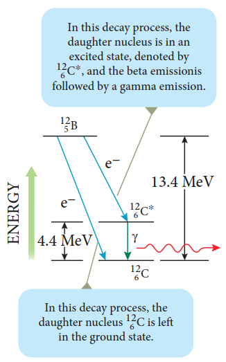

### 9.6.4 Law of radioactive decay

In the previous section, the decay process of a single radioactive nucleus was discussed. In practice, we have bulk material of radioactive sample which contains a vast number of the radioactive nuclei and not all the radioactive nucleus in a sample decay at the same time. It decays over a period of time and this decay is basically a random process. It implies that we cannot predict which nucleus is going to decay; rather we can determine on a probabilistic basis (like tossing a coin). We can calculate approximately how many nuclei in a sample are decayed over a period of time.

At any instant $t$, the number of decays per unit time, called rate of decay $\left( \frac{dN}{dt} \right)$ is proportional to the number of nuclei $(N)$ at the same instant.

$-\frac{dN}{dt} \propto N$

The negative sign in the equation implies that $N$ is decreasing with time.

By introducing a proportionality constant, the relation can be written as

$\frac{dN}{dt} = -\lambda N$ (9.32)

Here proportionality constant $\lambda$ is called decay constant which is different for different radioactive sample.

By rewriting the equation (9.32), we get

$dN = -\lambda N \, dt$ (9.33)

Here $dN$ represents the number of nuclei decaying in the time interval $dt$.

Let us assume that at time $t = 0$ s, the number of nuclei present in the radioactive sample be $N_0$. By integrating the equation (9.33), we can calculate the number of undecayed nuclei $N$ present at any time $t$.

From equation (9.33), we get

$\frac{dN}{N} = -\lambda \, dt$ (9.34)

$\int_{N_0}^{N} \frac{dN}{N} = -\int_{0}^{t} \lambda \, dt$

$\left[ \ln N \right]_{N_0}^{N} = -\lambda t$

$\ln \left( \frac{N}{N_0} \right) = -\lambda t$

Taking exponentials on both sides, we get

$N = N_0 e^{-\lambda t}$ (9.35)

[Note: $e^{\ln x} = e^y \Rightarrow x = e^y$]

Equation (9.35) is called the law of radioactive decay. Here $N$ denotes the number of undecayed nuclei present at any time $t$ and $N_0$ denotes the number of nuclei present initially at time $t=0$. Note that the number of atoms is decreasing exponentially over the length of time. This implies that the time taken for all the radioactive nuclei to decay will be infinite. Equation (9.35) is plotted in Figure 9.26.

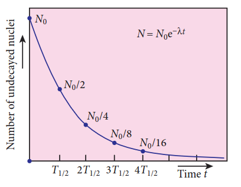

We can also define another useful quantity called activity (R) or decay rate which is the number of nuclei decayed per second and it is denoted as $R = \left| \frac{dN}{dt} \right|$. Note that activity R is a positive quantity.  
From equation (9.35), we get

$R = \left| \frac{dN}{dt} \right| = \lambda N_0 e^{-\lambda t}$ (9.36)

$R = R_0 e^{-\lambda t}$ (9.37)

where $R_0 = \lambda N_0$

The equation (9.37) is also equivalent to radioactive law of decay. Here $R_0$ is the activity of the sample at $t=0$ and $R$ is the activity of the sample at any time $t$. From equation (9.37), activity also shows exponential decay behavior. The activity $R$ also can be expressed in terms of number of undecayed atoms present at any time $t$.

From equation (9.37), since $N = N_0 e^{-\lambda t}$, we write

$R = \lambda N$ (9.38)

Equation (9.38) implies that the activity at any time $t$ is equal to the product of decay constant and number of undecayed nuclei present at that time $t$. Since $N$ decreases with time, $R$ also decreases.

The SI unit of activity $R$ is Becquerel and one Becquerel (Bq) is equal to one decay per second. There is also another standard unit for the activity called Curie (Ci).

1 Curie = 1 Ci = $3.7 \times 10^{10}$ decays per second

1 Ci = $3.7 \times 10^{10}$ Bq

> **Note**
>
> Initially one curie was defined as number of decays per second in 1 g of radium and it is equal to $3.7 \times 10^{10}$ decays/s.

### 9.6.5 Half-life

It is difficult to calculate the time taken by a given sample of $N$ atoms to decay completely. However, we can calculate the time taken by the given sample of atoms to reduce to some fraction of the initial amount.

We can define the half-life $T_{1/2}$ as the time required for the number of atoms initially present to reduce to one half of the initial amount.

The half-life is the important characteristic of every radioactive sample. Some radioactive nuclei are known to have half-life as long as $10^{14}$ years and some nuclei have very shorter half-life time ($10^{-14}$s).

We can express half-life in terms of the decay constant. At $t = T_{1/2}$, the number of undecayed nuclei $N = \frac{N_0}{2}$.

By substituting this value into the equation (9.35), we get

$\frac{N_0}{2} = N_0 e^{-\lambda T_{1/2}}$

$\frac{1}{2} = e^{-\lambda T_{1/2}}$ or $e^{\lambda T_{1/2}} = 2$

Taking logarithm on both sides and rearranging the terms,

$T_{1/2} = \frac{\ln 2}{\lambda} = \frac{0.6931}{\lambda}$ (9.39)

> **Note**
>
> One should not think that shorter half-life material is safer than longer half-life material because it will not last long. The shorter half-life sample will have higher activity and it is more 'radioactive' which is more harmful.

If the number of atoms present at $t=0$ is $N_0$, then $\frac{N_0}{2}$ atoms remain undecayed in first half-life and $\frac{N_0}{4}$ atoms remain undecayed after second half life and so on. In general, after $n$ half-lives, the number of nuclei remaining undecayed is given by

$N = \left( \frac{1}{2} \right)^n N_0$ (9.40)

where $n$ can be integer or non-integer. Since the activity of radioactive sample also obeys the exponential decay law, we can also write an equation for an activity similar to equation (9.36).

After $n$ half-lives, the activity or decay rate of any radioactive sample is

$R = \left( \frac{1}{2} \right)^n R_0$ (9.41)

**Mean life ($\tau$):**

When the radioactive nucleus decays, the nucleus which disintegrates first has zero life time and the nucleus which decays last has an infinite lifetime. The actual life time for each nucleus varies from zero to infinity. Therefore, it is meaningful to define average life or mean life time $\tau$, that the nucleus survives before it decays.

The mean life time of the nucleus is the ratio of sum or integration of life times of all nuclei to the total number nuclei present initially.

The total number of nuclei decaying in the time interval from $t$ to $t + \Delta t$ is equal to $R \Delta t = \lambda N_0 e^{-\lambda t} \Delta t$. It implies that until the time $t$, this $R \Delta t$ number of nuclei lived. So the life time of these $R \Delta t$ nuclei is equal to $t R \Delta t$. In the limit $\Delta t \to 0$, the total life time of all the nuclei would be the integration of $t R dt$ from the limit $t = 0$ to $t = \infty$.

$\tau = \frac{\int_0^\infty t [R dt]}{\int_0^\infty N_0 e^{-\lambda t} dt} = \frac{\int_0^\infty \lambda N_0 t e^{-\lambda t} dt}{\int_0^\infty N_0 e^{-\lambda t} dt}$ (9.42)

After a few integration (refer box item), the expression for mean life time,

$\tau = \frac{1}{\lambda}$ (9.43)

Note that mean life and decay constant are inversely proportional to each other.

Using mean life, the half-life can be rewritten as

$T_{1/2} = \tau \ln 2 = 0.6931 \tau$ (9.44)

> **Mean life: Not for examination**
>
> The integration in the equation (9.42) can be performed using integration by parts.
>
> $\tau = \frac{\int_{0}^{\infty} \lambda N_0 t e^{-\lambda t} dt}{\lambda N_0} = \frac{\int_{0}^{\infty} t e^{-\lambda t} dt}{\lambda N_0}$
>
> $\tau = \lambda \int_{0}^{\infty} t e^{-\lambda t} dt$
>
> $u = t$ $dv = e^{-\lambda t} dt$
>
> \( \tau = \lambda \int_{0}^{\infty} t e^{-\lambda t} dt = \lambda \left[ \frac{t e^{-\lambda t}}{-\lambda} \right]_{0}^{\infty} - \lambda \int_{0}^{\infty} \left[ \frac{e^{-\lambda t}}{-\lambda} \right] dt \)
>
> By substituting the limits, the first term in the above equation becomes zero.
>
> $\tau = \int_{0}^{\infty} e^{-\lambda t} dt = -\frac{1}{\lambda} \left[ e^{-\lambda t} \right]_{0}^{\infty} = \frac{1}{\lambda}$

**EXAMPLE 9.12**

Calculate the number of nuclei of carbon-14 undecayed after 22,920 years if the initial number of carbon-14 atoms is 10,000. The half-life of carbon-14 is 5730 years.

**Solution**

To get the time interval in terms of half-life,

$n = \frac{t}{T_{1/2}} = \frac{22,920 \, \text{yr}}{5730 \, \text{yr}} = 4$

The number of nuclei remaining undecayed after 22,920 years,

$N = \left( \frac{1}{2} \right)^n N_0 = \left( \frac{1}{2} \right)^4 \times 10,000$

$N = 625$

**EXAMPLE 9.13**

A radioactive sample has $2.6 \, \mu g$ of pure $^{13}_7 N$ which has a half-life of 10 minutes.  
(a) How many nuclei are present initially?  
(b) What is the activity initially?  
(c) What is the activity after 2 hours?  
(d) Calculate mean life of this sample.

**Solution**

(a) To find $N_0$, we have to find the number of $^{13}_7N$ atoms in $2.6 \, \mu g$. The atomic mass of nitrogen is 13. Therefore, 13 g of $^{13}_7N$ contains Avogadro number $(6.02 \times 10^{23})$ of atoms.

In 1 g, the number of $^{13}_7N$ atoms present is equal to $\frac{6.02 \times 10^{23}}{13}$. So the number of $^{13}_7N$ atoms present in $2.6 \, \mu g$ is

$N_0 = \frac{6.02 \times 10^{23}}{13} \times 2.6 \times 10^{-6} = 12.04 \times 10^{16}$

(b) To find the initial activity $R_0$, we have to evaluate decay constant $\lambda$

$\lambda = \frac{0.6931}{T_{1/2}} = \frac{0.6931}{10 \times 60} = 1.155 \times 10^{-3} \, \text{s}^{-1}$

Therefore

$R_0 = \lambda N_0 = 1.155 \times 10^{-3} \times 12.04 \times 10^{16}$

$= 13.90 \times 10^{13}$ decays/s

$= 13.90 \times 10^{13}$ Bq

In terms of a curie,

$R_0 = \frac{13.90 \times 10^{13}}{3.7 \times 10^{10}} = 3.75 \times 10^3$ Ci

since $1$ Ci = $3.7 \times 10^{10}$ Bq

(c) Activity after 2 hours can be calculated in two different ways:

Method 1: $R = R_0 e^{-\lambda t}$

At $t = 2$ hr = $7200$ s

$R = 3.75 \times 10^3 \times e^{-7200 \times 1.155 \times 10^{-3}}$

$R = 3.75 \times 10^3 \times 2.4 \times 10^{-4} = 0.9$ Ci

Method 2: 
$R = \left( \frac{1}{2} \right)^n R_0$

Here $n = \frac{120 \, \text{min}}{10 \, \text{min}} = 12$

$R = \left( \frac{1}{2} \right)^{12} \times 3.75 \times 10^3 \approx 0.9$ Ci

(d) mean life $\tau = \frac{T_{1/2}}{0.6931} = \frac{10 \times 60}{0.6931}$

$= 865.67$ s

### 9.6.6 Carbon dating

The interesting application of beta decay is radioactive dating or carbon dating. Using this technique, the age of an ancient object can be calculated. All living organisms absorb carbon dioxide (CO$_2$) from air to synthesize organic molecules. In this absorbed CO$_2$, the major part contains $^{12}_6C$ and very small fraction ($1.3 \times 10^{-12}$) contains radioactive $^{14}_6C$ whose half-life is 5730 years.

Carbon-14 in the atmosphere is always decaying but at the same time, cosmic rays from outer space are continuously bombarding the atoms in the atmosphere which produces $^{14}_6C$. So the continuous production and decay of $^{14}_6C$ in the atmosphere keep the ratio of $^{14}_6C$ to $^{12}_6C$ always constant. Since our human body, tree or any living organism continuously absorb CO$_2$ from the atmosphere, the ratio of $^{14}_6C$ to $^{12}_6C$ in the living organism is also nearly constant. But when the organism dies, it stops absorbing CO$_2$. Since $^{14}_6C$ starts to decay, the ratio of $^{14}_6C$ to $^{12}_6C$ in a dead organism or specimen decreases over the years. Suppose the ratio of $^{14}_6C$ to $^{12}_6C$ in the ancient tree pieces excavated is known, then the age of the tree pieces can be calculated.

**EXAMPLE 9.14**

Keezhadi (கீழாடு), a small hamlet, has become one of the very important archeological places of Tamilnadu. It is located in Sivagangai district. A lot of artefacts (gold coins, pottery, beads, iron tools, jewellery and charcoal, etc.) have been unearthed in Keezhadi which have given substantial evidence that an ancient urban civilization had thrived on the banks of river Vaigai. To determine the age of those materials, the charcoal of 200 g sent for carbon dating is given in the following figure (b). The activity of $^{14}_6C$ is found to be 37 decays/s. Calculate the age of charcoal.

.png)

.png)

**Solution**

To calculate the age, we need to know the initial activity ($R_0$) of the charcoal (when the sample was alive).

The activity $R$ of the sample

$R = R_0 e^{-\lambda t}$ (1)

To find the time $t$, rewriting the above equation (1),

$e^{\lambda t} = \frac{R_0}{R}$

By taking the logarithm on both sides, we get

$t = \frac{1}{\lambda} \ln \left( \frac{R_0}{R} \right)$ (2)

Here $R = 38 \, \text{decays/s} = 38 \, \text{Bq}$.

To find decay constant, we use the equation

$\lambda = \frac{0.6931}{T_{1/2}} = \frac{0.6931}{5730 \, \text{yr} \times 3.156 \times 10^7 \, \text{s/yr}}$

$\lambda = 3.83 \times 10^{-12} \, \text{s}^{-1}$

To find the initial activity $R_0$, we use the equation $R_0 = \lambda N_0$. Here $N_0$ is the number of carbon-14 atoms present in the sample when it was alive. The mass of the charcoal is 200 g. In 12 g of carbon, there are $6.02 \times 10^{23}$ carbon atoms. So 200 g contains

$\frac{6.02 \times 10^{23} \, \text{atoms/mol}}{12 \, \text{g/mol}} \times 200 \approx 1 \times 10^{25} \, \text{atoms}$

When the tree (sample) was alive, the ratio of $^{14}_6C$ to $^{12}_6C$ is $1.3 \times 10^{-12}$. So the total number of carbon-14 atoms is given by

$N_0 = 1 \times 10^{25} \times 1.3 \times 10^{-12} = 1.3 \times 10^{13} \, \text{atoms}$

The initial activity

$R_0 = 3.83 \times 10^{-12} \times 1.3 \times 10^{13} \approx 50 \, \text{decays/s} = 50 \, \text{Bq}$

By substituting the value of $R_0$ and $\lambda$ in the equation (2), we get

$t = \frac{1}{3.83 \times 10^{-12}} \times \ln \left[ \frac{50}{37} \right]$

$t = \frac{0.301}{3.83} \times 10^{12} \approx 7.86 \times 10^{10} \, \text{s}$

In years

$t = \frac{7.86 \times 10^{10} \, \text{s}}{3.156 \times 10^7 \, \text{s/yr}} \approx 2500 \, \text{years}$

In fact, the excavated materials were sent to USA for carbon dating by Archeological Department of Tamilnadu and the report confirmed that the age of Keezhadi artefacts lies between 2200 years to 2500 years (Sangam era - 400 BC to 200 BC). The Keezhadi excavations experimentally proved that urban civilization existed in Tamil Nadu even 2000 years ago!

### 9.6.7 Discovery of Neutrons

In 1930, two German physicists Bothe and Becker found that when beryllium was bombarded with $\alpha$ particles, highly penetrating radiation was emitted. This radiation was capable of penetrating the thick layer of lead and was unaffected by the electric and magnetic fields. Initially, it was thought as $\gamma$ radiation. But in the year 1932, James Chadwick discovered that those radiations are not EM waves but they contain uncharged particles of mass little greater than the mass of the proton. He called them as neutrons. The above reaction can be written as

${}^9_4 Be + {}^4_2 He \rightarrow {}^{12}_6 C + {}^1_0 n$

where ${}^1_0 n$ denotes neutron.

Neutrons are fairly stable inside the nucleus. But outside the nucleus they are unstable. If the neutron comes out of the nucleus (free neutron), it decays with emission of proton, electron, and antineutrino with the half life of 13 minutes.

Neutrons are classified according to their kinetic energy as (i) slow neutrons (0 to 1000 eV)  
(ii) fast neutrons (0.5 MeV to 10 MeV).  
The neutrons with average energy of about 0.025 eV in thermal equilibrium are called thermal neutron, because at 298K, the thermal energy $kT \sim 0.025$ eV. Slow and fast neutrons play a vital role in nuclear reactors.

## 9.7 NUCLEAR FISSION

In 1939, German scientists Otto Hahn and F. Strassman discovered that when uranium nucleus is bombarded with a slow neutron, it breaks up into two smaller nuclei of comparable masses with the release of energy. **The process of breaking up of the nucleus of a heavier atom into two smaller nuclei with the release of a large amount of energy is called nuclear fission.** The fission is accompanied by the release of neutrons. The energy that is released in the nuclear fission is of many orders of magnitude greater than the energy released in chemical reactions.

Uranium undergoes fission reaction in 90 different ways. The most common fission reactions of $^{235}_{92}U$ nuclei are shown here.

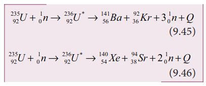

Here $Q$ is energy released during the fission of each uranium nucleus. When a slow neutron is absorbed by the uranium nucleus, the mass number increases by one and goes to an excited state ${}^{236}_{92}U^*$. But this excited state does not last longer than \(10^{-12}\)s and decay into two daughter nuclei along with the release of 2 or 3 neutrons. In each reaction, on an average, 2.5 neutrons are emitted. It is shown in Figure 9.27.

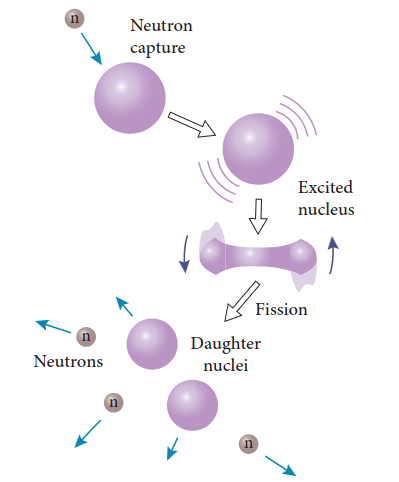

**Energy released in fission:**

We can calculate the energy (Q) released in each uranium fission reaction. We choose the most observed fission reaction which is given in the equation (9.45).

\({}^{235}_{92}U + {}^1_0 n \rightarrow {}^{236}_{92}U^* \rightarrow {}^{141}_{56}Ba + {}^{92}_{36}Kr + 3 {}^1_0 n + Q\)

- **Mass of \({}^{235}_{92}U\)**: \(= 235.045733 \, u\)
- **Mass of \({}^{1}_0 n\)**: \(= 1.008665 \, u\)
- **Total mass of reactants**: \(= 236.054398 \, u\)
- **Mass of \({}^{141}_{56}Ba\)**: \(= 140.9177 \, u\)
- **Mass of \({}^{92}_{36}Kr\)**: \(= 91.8854 \, u\)
- **Mass of 3 neutrons**: \(= 3.025995 \, u\)
- **The total mass of products**: \(= 235.829095 \, u\)

Mass defect \(\Delta m = 236.054398 \, u - 235.829095 \, u = 0.225303 \, u\)

So the energy released in each fission =  
\(0.225303 \times 931 \, \text{MeV} \approx 200 \, \text{MeV}\)

This energy first appears as kinetic energy of daughter nuclei and neutrons. But later, this kinetic energy appears in the form of heat given to the surrounding.

**Chain reaction:**

When one \({}^{235}_{92}U\) nucleus undergoes fission, the energy released might be small. But from each fission reaction, three neutrons are released. These three neutrons can cause further fission in three other \({}^{235}_{92}U\) nuclei which in turn produce nine neutrons. These nine neutrons initiate fission in another nine \({}^{235}_{92}U\) nuclei which produces 27 neutrons and so on. This process is called a chain reaction and the number of neutrons goes on increasing almost in geometric progression. It is shown in Figure 9.28.

There are two kinds of chain reactions: (i) uncontrolled chain reaction (ii) controlled chain reaction. In an uncontrolled chain reaction, the number of neutrons multiply indefinitely and the entire amount of energy is released in a fraction of second.

The atom bomb is an example of nuclear fission reaction in which uncontrolled chain reaction occurs. Atom bombs produce massive destruction on mankind. During World War II, on August 6 and 9 in the year 1945, USA dropped two atom bombs in two places of Japan, Hiroshima and Nagasaki. As a result, lakhs of people were killed and the two cities were completely destroyed. Even now the people who are living in those places have side effects caused by the explosion of atom bombs.

It is possible to calculate the typical energy released in a chain reaction. In the first step, one neutron initiates the fission process in one nucleus by producing three neutrons and energy of about 200 MeV. In the second step, further three nuclei undergo fission, in third step nine nuclei undergo fission, in fourth step 27 nucleus undergo fission and so on. In the \(100^{\text{th}}\) step, the number of nuclei which undergo fission is around \(2.5 \times 10^{40}\). The total energy released after \(100^{\text{th}}\) step is \(2.5 \times 10^{40} \times 200 \, \text{MeV} = 8 \times 10^{29} \, \text{J}\). It is really an enormous amount of energy which is equivalent to electrical energy required in Tamilnadu for several years.

If the chain reaction is controllable, then we can harvest the enormous amount of energy for our needs. It is achieved in a controlled chain reaction. In the controlled chain reaction, the average number of neutrons released in each stage is kept as one such that it is possible to store the released energy. In nuclear reactors, the controlled chain reaction is carried out and the produced energy is used for power generation or for research purpose.

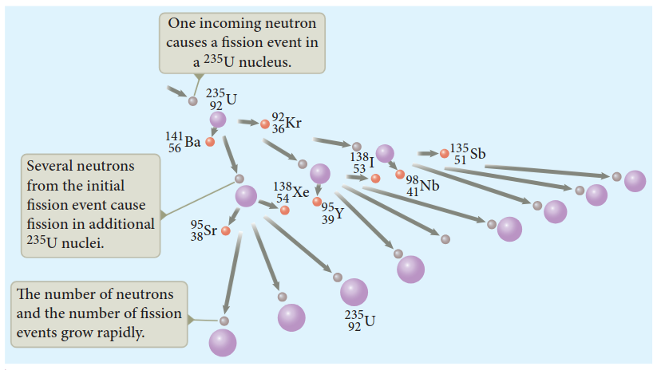

**EXAMPLE 9.15**

Calculate the amount of energy released when 1 kg of \({}^{235}_{92}U\) undergoes fission reaction.

**Solution**

235 g of \({}^{235}_{92}U\) has \(6.02 \times 10^{23}\) atoms. In one gram of \({}^{235}_{92}U\), the number of atoms is equal to  
\(\frac{6.02 \times 10^{23}}{235} = 2.56 \times 10^{21}\).

So the number of atoms present in 1 kg of \({}^{235}_{92}U = 2.56 \times 10^{21} \times 1000 = 2.56 \times 10^{24}\)

Each \({}^{235}_{92}U\) nucleus releases 200 MeV of energy during the fission. The total energy released by 1 kg of \({}^{235}_{92}U\) is  
\(Q = 2.56 \times 10^{24} \times 200 \, \text{MeV} = 5.12 \times 10^{26} \, \text{MeV}\)

In terms of joules,  
\(Q = 5.12 \times 10^{26} \times 1.6 \times 10^{-13} \, \text{J} = 8.192 \times 10^{13} \, \text{J}\).

In terms of kilowatt hour,  
\(Q = \frac{8.192 \times 10^{13}}{3.6 \times 10^{6}} = 2.27 \times 10^{7} \, \text{kWh}\)

This is enormously large amount of energy which is enough to keep 100 W bulb operating for 30,000 years. To produce this much energy by chemical reaction, around 20,000 tons of TNT(trinitrotoluene) has to be exploded.

**Nuclear reactor:**

Nuclear reactor is a device in which the nuclear fission takes place in a self-sustained controlled manner and the energy produced is used either for research purpose or for power generation. The first nuclear reactor was built in the year 1942 at Chicago, USA by physicist Enrico Fermi. The main parts of a nuclear reactor are fuel, moderator and control rods. In addition to this, there is a cooling system which is connected with power generation set up.

**Fuel:** The fuel is fissionable material, usually uranium or plutonium. Naturally occurring uranium contains only 0.7% of \({}^{235}_{92}U\) and 99.3% are only \({}^{238}_{92}U\). So the \({}^{238}_{92}U\) must be enriched such that it contains at least 2% to 4% of \({}^{235}_{92}U\). In addition to this, a neutron source is required to initiate the chain reaction for the first time. A mixture of beryllium with plutonium or polonium is used as the neutron source. During fission of \({}^{235}_{92}U\), only fast neutrons are emitted but the probability of initiating fission by it in another nucleus is very low. Therefore, slow neutrons are preferred for sustained nuclear reactions.

.png)

**Moderators:** The moderator is a material used to convert fast neutrons into slow neutrons. Usually the moderators are chosen in such a way that they must be very light nuclei having mass comparable to that of neutrons. Hence, these light nuclei undergo collision with fast neutrons and the speed of the neutron is reduced (Note that a billiard ball striking a stationary billiard ball of equal mass would itself be stopped but the same billiard ball bounces off almost with same speed when it strikes a heavier mass. This is the reason for using lighter nuclei as moderators). Most of the reactors use heavy water (\(D_2O\)) and graphite as moderators. The blocks of uranium stacked together with blocks of graphite (the moderator) to form a large pile is shown in the Figure 9.29 (a) & (b).

.png)

**Control rods:** The control rods are used to adjust the reaction rate. During each fission, on an average 2.5 neutrons are emitted and in order to have the controlled chain reactions, only one neutron is allowed to cause another fission and the remaining neutrons are absorbed by the control rods.

Usually cadmium or boron acts as control rod material and these rods are inserted into the uranium blocks as shown in the Figure 9.29 (a) and (b). Depending on the insertion depth of control rod into the uranium assembly, the average number of neutrons produced per fission is set to be equal to one or greater than one. If the average number of neutrons produced per fission is equal to one, then reactor is said to be in critical state. In fact, all the nuclear reactors are maintained in critical state by suitable adjustment of control rods. If it is greater than one, then reactor is said to be in super-critical and it may explode sooner or may cause massive destruction.

**Shielding:** For a protection against harmful radiations, the nuclear reactor is surrounded by a concrete wall of thickness of about 2 to 2.5 m.

**Cooling system:** The cooling system removes the heat generated in the reactor core. Ordinary water, heavy water and liquid sodium are used as coolant since they have very high specific heat capacity and have large boiling point under high pressure. This coolant passes through the fuel block and carries away the heat to the steam generator through heat exchanger as shown in Figure 9.29(a) and (b). The steam runs the turbines which produces electricity in power reactors.

> **Note**
>
> India has 22 nuclear reactors in operation. Nuclear reactors are constructed in two places in Tamilnadu, Kalpakkam and Kudankulam. Even though nuclear reactors are aimed to cater to our energy need, in practice nuclear reactors now are able to provide only 2% of energy requirement of India.

## 9.8 NUCLEAR FUSION

When two or more light nuclei (\(A<20\)) combine to form a heavier nucleus, then it is called nuclear fusion. In the nuclear fusion, the mass of the resultant nucleus is less than the sum of the masses of original light nuclei. The mass difference appears as energy. The nuclear fusion never occurs at room temperature unlike nuclear fission. It is because when two light nuclei come closer to combine, they is strongly repelled by the coulomb repulsive force.

To overcome this repulsion, the two light nuclei must have enough kinetic energy to move closer to each other such that the nuclear force becomes effective. This can be achieved if the temperature is very much greater than \(10^7 \, \text{K}\). When the surrounding temperature reaches around \(10^7 \, \text{K}\), lighter nuclei start fusing to form heavier nuclei and this resulting reaction is called thermonuclear fusion reaction.

**Energy generation in stars:**

The natural place where nuclear fusion occurs is the core of the stars, since their temperature is of the order of \(10^7 \, \text{K}\). In fact, the energy generation in every star is only through thermonuclear fusion. In most of the stars including our Sun hydrogen atoms fuse into helium and in some stars helium atoms fuse into heavier elements.

The early stage of a star is in the form of cloud and dust. Due to their own gravitational pull, these clouds fall inward. As a result, its gravitational potential energy is converted to kinetic energy and finally into heat. When the temperature is high enough to initiate the thermonuclear fusion, they start to release enormous energy which tends to stabilize the star and prevents it from further collapse.

The sun's interior temperature is around \(1.5 \times 10^7 \, K\). In sun, \(6 \times 10^{11} \, kg\) of hydrogen is converted into helium every second and sun has enough hydrogen such that these fusion reactions last for another 5 billion years. When the hydrogen is burnt out, the sun will enter into new phase called red giant where helium will fuse to become carbon. During this stage, sun will expand greatly in size and all its planets will be engulfed in it.

According to Hans Bethe, the sun is powered by **proton-proton cycle** of fusion reaction. This cycle consists of three steps and the first two steps are as follows:

\({}^{1}_{1}H + {}^{1}_{1}H \rightarrow {}^{2}_{1}H + e^+ + \nu\) (9.44)

\({}^{1}_{1}H + {}^{2}_{1}H \rightarrow {}^{3}_{2}He + \gamma\) (9.45)

A number of reactions are possible in the third step. But the most dominant one is

\({}^{3}_{2}He + {}^{3}_{2}He \rightarrow {}^{4}_{2}He + {}^{1}_{1}H + {}^{1}_{1}H\) (9.46)

The overall energy produced in the above reactions is about 27 MeV. The radiation energy we receive from the sun is due to these fusion reactions.

**Elementary particles:**

An atom has a nucleus surrounded by electrons and the nucleus is made up of protons and neutrons. Till 1960s, it was thought that protons, neutrons and electrons are fundamental building blocks of matter. In 1964, physicists Murray Gell-Mann and

George Zweig theoretically proposed that protons and neutrons are not fundamental particles; in fact they are made up of quarks. These quarks are now considered elementary particles of nature. Electrons are fundamental or elementary particles because they are not made up of anything. In the year 1968, the quarks were discovered experimentally by Stanford Linear Accelerator Centre (SLAC), USA. There are six quarks namely, up, down, charm, strange, top and bottom and their antiparticles. All these quarks have fractional charges. For example, charge of up quark is \(+\frac{2}{3}e\) and that of down quark is \(-\frac{1}{3}e\).

According to quark model, proton is made up of two up quarks and one down quark and neutron is made up of one up quark and two down quarks as shown in the Figure 9.30.

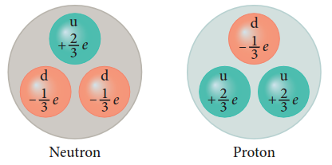

The study of elementary particles is called particle physics and it is an active area of research even now. Till date, more than 20 Nobel prizes have been awarded in the field of particle physics.

**Fundamental forces of nature:**

It is known that there exists gravitational force between two masses and it is universal in nature. Our planets are bound to the sun through gravitational force of the sun. In +2 volume 1, we have learnt that between two charges there exists electromagnetic force and it plays major role in most of our day-to-day events. In this unit, we have learnt that between two nucleons, there exists a strong nuclear force and this force is responsible for stability of the nucleus. In addition to these three forces, there exists another fundamental force of nature called the weak force. This weak force is even shorter in range than nuclear force. This force plays an important role in beta decay and energy production of stars. During the fusion of hydrogen into helium in sun, neutrinos and enormous radiations are produced through weak force. The detailed mechanism of weak force is beyond the scope of this book and for further reading, appropriate books can be referred.

Gravitational, electromagnetic, strong and weak forces are called fundamental forces of nature. It is very interesting to realize that, even for our day-to-day life, we require these four fundamental forces. To put it in simple words: We live on Earth because of Earth's gravitational attraction on our body. We are standing on the surface of the Earth because of the electromagnetic force between atoms of the surface of the Earth and atoms in our foot. The atoms in our body are stable because of strong nuclear force. Finally, the lives of species on earth depend on the solar energy from the sun and it is due to weak force which plays vital role during nuclear fusion reactions going on in the core of the sun.

## SUMMARY

- A device used to study the conduction of electricity through partial gases at low pressure is known as gas discharge tube
- Charge per unit mass is known as specific charge or normalized charge, and it is independent of gas used and also nature of electrodes used in the experiment.
- The minimum distance between alpha particle and centre of the nucleus just before it gets reflected back by \(180^\circ\) is defined as distance of closest approach \(r_0\).
- The impact parameter (b) (see Figure 9.12) is defined as the perpendicular distance between the centre of the gold nucleus and the direction of velocity vector of alpha particle when it is at a large distance.
- According to Bohr atom model, angular momentum is quantized.
- The radius of the orbit in Bohr atom model is \(r_n = a_0 \frac{n^2}{Z}\)
- The radius of first orbit hydrogen atom is \(a_0 = \frac{\varepsilon_0 h^2}{\pi m e^2} = 0.529 \, \text{Å}\) and it is also known as Bohr radius.
- The velocity of electron in \(n^\text{th}\) orbit is \(v_n = \frac{h}{2\pi m a_0} \frac{Z}{n} \, \text{ms}^{-1}\).
- The fine structure constant is \(\alpha = \frac{1}{137}\) which is a dimensionless constant.
- The total energy of electron in the \(n^\text{th}\) orbit is \(E_n = -\frac{m e^4}{8 \varepsilon_0^2 h^2} \frac{Z^2}{n^2} = -13.6 \frac{Z^2}{n^2} \, \text{eV}\).
- The energy required to excite an electron from the lower energy state to any higher energy state is known as excitation energy and corresponding potential supplied is known as excitation potential.
- The minimum energy required to remove an electron from an atom in the ground state is known as binding energy or ionization energy.
- The potential difference through which an electron should be accelerated to get ionization energy is known as ionization potential.
- The wavelength of spectral lines of Lyman series lies in ultra-violet region.
- The wavelength of spectral lines of Balmer series lies in visible region while those of Paschen and Brackett series lie in infra-red region.
- The nucleus of element X having atomic number Z and mass number A is represented by \({}^{A}_{Z}X\).
- The empirical relation connecting radius of nucleus (\(Z > 10\)) R and mass number A is given by \(R = R_0 A^{1/3}\) where \(R_0 = 1.2 \, \text{F}\)
- The density of nucleus \(\rho = 2.3 \times 10^{17} \, \text{kg} \, \text{m}^{-3}\), and the nuclear matter in a highly compressed state.
- If \(M, m_p\) and \(m_n\) are masses of a nucleus (\({}^{A}_{Z}X\)), proton and neutron respectively, then the mass defect is \(\Delta m = (Zm_p + Nm_n) - M\)
- The binding energy of nucleus \(B.E = (Zm_p + Nm_n - M)c^2\)
- The average binding energy per nucleon is maximum for iron which is 8.8 MeV.
- Alpha decay: \({}^{A}_{Z}X \rightarrow {}^{A-4}_{Z-2}Y + {}^{4}_{2}He\)
- \(\beta^-\) decay: \({}^{A}_{Z}X \rightarrow {}^{A}_{Z+1}Y + e^- + \bar{\nu}\)
- \(\beta^+\) decay: \({}^{A}_{Z}X \rightarrow {}^{A}_{Z-1}Y + e^+ + \nu\)
- Gamma emission: \({}^{A}_{Z}X^* \rightarrow {}^{A}_{Z}X + \gamma\)
- Law of radioactive decay: \(N = N_0 e^{-\lambda t}\)
- In general, after \(n\) half lives, the number of nuclei left undecayed is \(N = \left( \frac{1}{2} \right)^n N_0\)
- The relation between half-life and decay constant is \(T_{1/2} = \frac{\ln 2}{\lambda} = \frac{0.6931}{\lambda}\)
- Mean life \(\tau = \frac{1}{\lambda}\); \(T_{1/2} = \frac{0.6931}{\lambda} = 0.6931\tau\)
- If a heavier nucleus decays into lighter nuclei, it is called nuclear fission
- If two lighter nuclei fuse to form heavier nucleus, it is called nuclear fusion
- In nuclear reactors, the nuclear chain reaction is controlled. In stars, the energy generation is through nuclear fusion.
