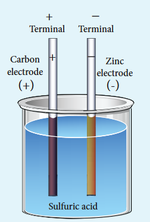
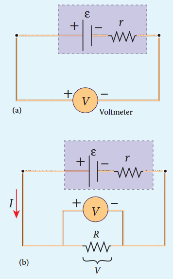
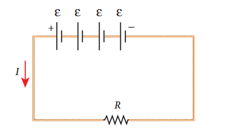
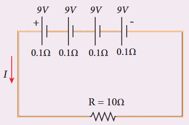
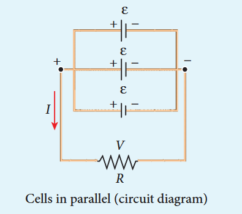
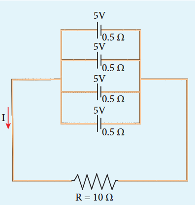

---
title: "Electric cells and batteries"
weight: 4
--- 

## 2.4

## ELECTRIC CELLS AND BATTERIES

An electric cell converts chemical energy into electrical energy to produce electricity. It contains two electrodes (carbon and zinc) immersed in an electrolyte (sulphuric acid) as shown in Figure 2.17.

Several electric cells connected together form a battery. When a cell or battery is connected to a circuit, electrons flow from the negative terminal to the positive terminal through the circuit. By using chemical reactions, a battery

100 UNIT 2 CURRENT ELECTRICITY

Figure 2.17 Simple electric cell 

produces potential difference across its terminals. This potential difference provides the energy to move the electrons through the circuit. Commercially available electric cells and batteries are shown in Figure 2.18.

Figure 2.18 Electric cells and Batteries 

### 2.4.1 Electromotive force and internal resistance

A battery or cell is called a source of electromotive force (emf). The term ‘electromotive force’ is a misnomer since
it does not really refer to a force but describes a potential difference in volts. The emf of a battery or cell is the voltage
provided by the battery when no current flows in the external circuit. It is shown in Figure 2.19.
Electromotive force determines the amount of work a battery or cell has to do 

Figure 2.19 Measuring the emf of a cell 

move a certain amount of charge around the circuit. It is denoted by the symbol $\epsilon$ . An ideal battery has zero internal resistance and the potential difference (terminal voltage) across the battery equals to its emf. In reality, the battery is made of electrodes and electrolyte, there is resistance to the flow of charges within the battery. This resistance is called internal resistance $r$ . For a real battery, the terminal voltage is not equal to the emf of the battery. A freshly prepared cell has low internal resistance and it increases with ageing.

#### 2.4.2 Determination of internal resistance

The circuit connections are made as shown in Figure 2.20.

A battery or cell is called a source of electromotive force (emf). The term 'electromotive force' is a misnomer since it does not really refer to a force but describes a potential difference in volts. The emf of a battery or cell is the voltage provided by the battery when no current flows in the external circuit. It is shown in Figure 2.19.

Electromotive force determines the amount of work a battery or cell has to do

The emf of cell $\epsilon$ is measured by connecting a high resistance voltmeter across it without connecting the external resistance $R$ as shown in Figure 2.20(a). Since the voltmeter draws very little current for deflection, the circuit may be considered as open. Hence the voltmeter reading gives the emf of the cell. Then, external resistance $R$ is included in the circuit and current $I$ is established in the circuit. The potential difference across

Figure 2.20 Internal resistance of the cell 

R is equal to the potential difference across the cell (V) as shown in Figure 2.20(b).

The potential drop across the resistor $R$ is

$$V = IR \quad (2.35)$$

Due to internal resistance $r$ of the cell, the voltmeter reads a value $V$ , which is less than the emf of cell $\epsilon$ . It is because, certain amount of voltage $(Ir)$ has dropped across the internal resistance $r$ .

$${\mathrm{Then}}\qquad V=\epsilon-{\mathrm{Ir}}$$

$$Ir = \epsilon -V \quad (2.36)$$

Dividing equation (2.36) by equation (2.35), we get

$$\frac{Ir}{IR} = \frac{\epsilon - V}{V}$$

$$r = \left[\frac{\epsilon - V}{V}\right]R \quad (2.37)$$

Since $\epsilon$ , $V$ and $R$ are known, internal resistance $r$ can be determined. We can also find the total current that flows in the circuit.

Due to this internal resistance, the power delivered to the circuit is not equal to power rating mentioned in the battery. For a battery of emf $\epsilon$ , with an internal resistance $r$ , the power delivered to the circuit of resistance $R$ is given by

$$P = I\epsilon = I(V + Ir)\quad (\mathrm{from~equation~2.36})$$

Here $V$ is the voltage drop across the resistance $R$ and it is equal to $IR$ .

Therefore, $P = I(IR + Ir)$

$$P = I^2 R + I^2 r \quad (2.38)$$

Here $I^2 r$ is the power delivered to the internal resistance and $I^2 R$ is the power delivered to the electrical device (here it is the resistance $R$ ). For a good battery, the internal resistance $r$ is very small, then $I^2 r \ll I^2 R$ and almost entire power is delivered to the external resistance.

## EXAMPLE 2.17

A battery has an emf of $12\mathrm{V}$ and connected to a resistor of $3\Omega$ . The current in the circuit is $3.93\mathrm{A}$ . Calculate (a) terminal voltage and the internal resistance of the battery (b) power delivered by the battery and power delivered to the resistor

## Solution

The given values $I = 3.93\mathrm{A}$ , $\epsilon = 12\mathrm{V}$ , $R = 3\Omega$

(a) The terminal voltage of the battery is equal to voltage drop across the resistor $V = IR = 3.93 \times 3 = 11.79 \mathrm{~V}$

The internal resistance of the battery,

$$r = \left|\frac{\epsilon - V}{V}\right|R = \left|\frac{12 - 11.79}{11.79}\right|\times 3 = 0.05\Omega$$

(b) The power delivered by the battery $P$ $= I\epsilon = 3.93\times 12 = 47.1\mathrm{W}$

The power delivered to the resistor $= I^{2}R$ $= 46.3\mathrm{W}$

The remaining power $P = (47.1 - 46.3) =$ $0.8\mathrm{W}$ is delivered to the internal resistance and cannot be used to do useful work. (It is equal to $I^{2}r$

### 2.4.3 Cells in series

Several cells can be connected to form a battery. In series connection, the negative terminal of one cell is connected to the positive terminal of the second cell, the negative terminal of second cell is connected to the positive terminal of the third cell and so on. The free positive terminal of the first cell and the free negative terminal of the last cell become the terminals of the battery.

Suppose $n$ cells, each of emf $\epsilon$ volts and internal resistance $r$ ohms are connected in series with an external resistance $R$ as shown in Figure 2.21

Figure 2.21 cells in series 

The total emf of the battery $= n\epsilon$

The total resistance in the circuit $= n r + R$

By Ohm's law, the current in the circuit is

$$I = \frac{\mathrm{totalemf}}{\mathrm{totalresistance}} = \frac{n\epsilon}{nr + R} \quad (2.39)$$

Case a If $r< < R$ then,

$$I = \frac{n\epsilon}{R}\approx nI_{1} \quad (2.40)$$

where, $I_{1}$ is the current due to a single cell

$$\left(I_{1} = \frac{\epsilon}{R}\right)$$

Thus, if $r$ is negligible when compared to $R$ the current supplied by the battery is $n$ times that supplied by a single cell.

$$\mathrm{Case(b)If}r > > R,I = \frac{n\epsilon}{nr}\approx \frac{\epsilon}{r} \quad (2.41)$$

It is the current due to a single cell. That is, current due to the whole battery is the same as that due to a single cell and hence there is no advantage in connecting several cells.

Thus series connection of cells is advantageous only when the effective internal resistance of the cells is negligibly small compared with $R$ .

## EXAMPLE 2.18

From the given circuit,

1) Equivalent emf of the combination 2) Equivalent internal resistance 3) Total current 4) Potential difference across external resistance 5) Potential difference across each cell

## Solution

i) Equivalent emf of the combination $\epsilon_{eq} = n\epsilon = 4\times 9 = 36\mathrm{V}$

ii) Equivalent internal resistance $r_{eq} = nr$ $= 4\times 0.1 = 0.4\Omega$

iii) Total current $I = \frac{n\epsilon}{R + nr}$

$$= \frac{4\times 9}{10 + (4\times 0.1)}$$ $$= \frac{4\times 9}{10 + 0.4} = \frac{36}{10.4}$$

$$I = 3.46\mathrm{A}$$

iv) Potential difference across external resistance $V = IR = 3.46\times 10 = 34.6\mathrm{V}$ The remaining $1.4\mathrm{V}$ is dropped across the internal resistances of cells.

v) Potential difference across each cell $\frac{V}{n} = \frac{34.6}{4} = 8.65\mathrm{V}$

### 2.4.4 Cells in parallel

In parallel connection all the positive terminals of the cells are connected to one point and all the negative terminals to a second point. These two points form the positive and negative terminals of the battery.

Let $n$ cells be connected in parallel between the points A and B and a resistance $R$ is connected between the points A and B as shown in Figure 2.22. Let $\epsilon$ be the emf and $r$ the internal resistance of each cell.

Figure 2.22 Cells in parallel 

The equivalent internal resistance of the battery is $\frac{1}{r_{eq}} = \frac{1}{r} +\frac{1}{r} +\dots \frac{1}{r} (n\mathrm{terms}) = \frac{n}{r}$ . So $r_{eq} = \frac{r}{n}$ and the total resistance in the circuit is $R + \frac{r}{n}$ . The total emf is the potential difference between the points A and B, which is equal to $\epsilon$ . The current in the circuit is given by

$$I = \frac{\epsilon}{\frac{r}{n} + R}$$

$$I = \frac{n\epsilon}{r + nR} \quad (2.42)$$

$$\mathrm{Case~}(a)\mathrm{~If~}r > > R,I = \frac{n\epsilon}{r} = nI_{1} \quad (2.43)$$

where $I_{1}$ is the current due to a single cell $\left(\frac{\epsilon}{r}\right)$ when $R$ is negligible. Thus, the current through the external resistance due to the whole battery is $n$ times the current due to a single cell.

$$\mathrm{Case~}(b)\mathrm{~If~}r< < R,I = \frac{\epsilon}{R} \quad (2.44)$$

The above equation implies that current due to the whole battery is the same as that due to a single cell. Hence it is advantageous to connect cells in parallel when the external resistance is very small compared to the internal resistance of the cells.

## EXAMPLE 2.19

For the given circuit

Find

i) Equivalent emf ii) Equivalent internal resistance iii) Total current (I) iv) Potential difference across each cell v) Current from each cell

## Solution

i) Equivalent emf $\epsilon_{eq} = 5 \mathrm{~V}$ ii) Equivalent internal resistance,

$$\mathrm{R_{eq}} = \frac{r}{n} = \frac{0.5}{4} = 0.125\Omega$$

iii) total current, $I = \frac{\epsilon}{R + \frac{r}{n}}$

$$I = \frac{5}{10 + 0.125} = \frac{5}{10.125}$$

I $\approx 0.5 \mathrm{~A}$

iv) Potential difference across each cell

$$\mathrm{V} = \mathrm{IR} = 0.5\times 10 = 5\mathrm{V}$$

v) Current from each cell, $I^{\prime} = \frac{I}{n}$

$$I^{\prime} = \frac{0.5}{4} = 0.125\mathrm{A}$$