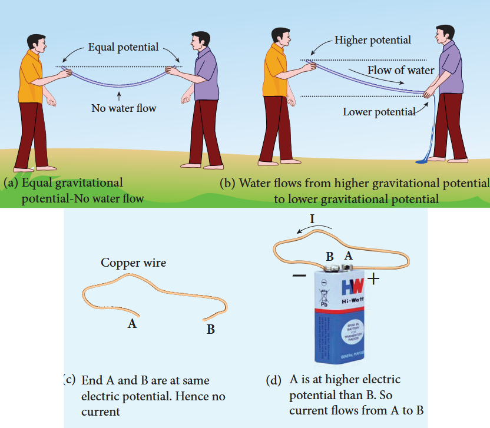
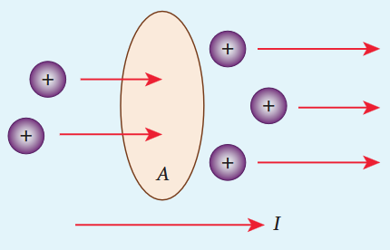
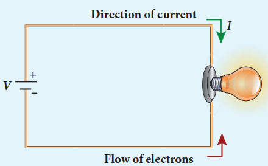
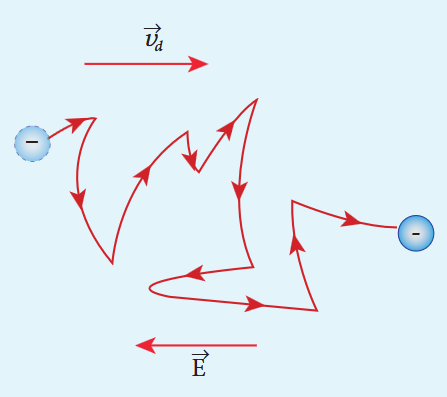
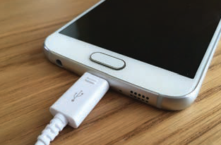
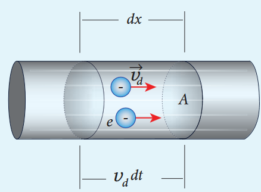

Matter is made up of atoms. Each atom consists of a positively charged nucleus with negatively charged electrons moving around the nucleus. Atoms in metals have one or more electrons which are loosely bound to the nucleus. These electrons are called free electrons and can be easily detached from the atoms. The substances which have an abundance of these free electrons are called conductors. These free electrons move randomly throughout the conductor at a given temperature. In general due to this random motion, there is no net transfer of charges from one end of the conductor to other end and hence no current in the conductor. When a potential difference is applied by the battery across the ends of the conductor, the free electrons drift towards the positive terminal of the battery, producing a net electric current. This is easily understandable from the analogy given in the Figure 2.1.

In the XI Volume 2, unit 6, we studied, that the mass move from higher gravitational potential to lower gravitational potential. Likewise, positive charge flows from region of higher electric potential to region of lower electric potential and negative charge flows from region of lower electric potential to region of higher electric potential. So battery or electric cell simply creates potential difference across the conductor.

The electric current in a conductor is defined as the rate of flow of charges through a given cross- sectional area A. It is shown in the Figure 2.2.

If a net charge Q passes through any cross section of a conductor in time t, then the current is defined as I = Q. But charge flow is not always constant. Hence current can more generally be defined as

$$
I_{\mathrm{avg}} = \frac{\Delta Q}{\Delta t} \quad (2.1)
$$

Where \(\Delta Q\) is the amount of charge that passes through the conductor at any cross section during the time interval \(\Delta t\). If the rate at which charge flows changes with time, the current also changes. The instantaneous current I is defined as the limit of the average current, as \(\Delta t \rightarrow 0\)

$$
I = \lim_{\Delta t \to 0} \frac{\Delta Q}{\Delta t} = \frac{dQ}{dt} \quad (2.2)
$$

The SI unit of current is the ampere (A)

$$
1A = \frac{1C}{1s}
$$

That is, 1A of current is equivalent to 1 coulomb of charge passing through a perpendicular cross section in a conductor in one second. The electric current is a scalar quantity.

**EXAMPLE 2.1**

Compute the current in the wire if a charge of 120 C is flowing through a copper wire in 1 minute.

**Solution**

The current (rate of flow of charge) in the wire is

$$
I = \frac{Q}{t} = \frac{120}{60} = 2A
$$

### Conventional Current

In an electric circuit, arrow heads are used to indicate the direction of flow of current. By convention, this flow in the circuit should be from the positive terminal of the battery to the negative terminal. This current is called the conventional current or simply current and is in the direction in which a positive test charge would move. In typical circuits the charges that flow are actually electrons, from the negative terminal of the battery to the positive terminal. As a result, the flow of electrons and the direction of conventional current point in opposite direction as shown in Figure 2.3. Mathematically, a transfer of positive charge is the same as a transfer of negative charge in the opposite direction.

Electric current is not only produced by batteries. In nature, lightning bolt produces enormous electric current in a short time. During lightning, very high potential difference is created between the clouds and ground and hence charges flow between the clouds and ground.

### Drift velocity

In a conductor the charge carriers are free electrons. These electrons move freely through the conductor and collide repeatedly with the positive ions. If there is no electric field, the electrons move in random directions, and hence their velocities are also randomly oriented. On an average, the number of electrons travelling in any direction will be equal to the number of electrons travelling in the opposite direction. As a result, there is no net flow of electrons in any direction and hence there will not be any current.

Suppose a potential difference is set across the conductor by connecting a battery, an electric field \(\vec{E}\) is created in the conductor. This electric field exerts a force on the electrons, producing a current. The electric field accelerates the electrons, while ions scatter the electrons and change their direction of motion. Thus, we see zigzag motion of electrons. In addition to the zigzag motion due to the collisions, the electrons move slowly along the conductor in a direction opposite to that of \(\vec{E}\) as shown in the Figure 2.4.

**Ions**

Any material is made up of neutral atoms with equal number of electrons and protons. If the outermost electrons leave the atoms, they become free electrons and are responsible for electric current. The atoms after losing their outer most electrons will have more positive charges and hence are called positive ions. These ions will not move freely within the material like the free electrons. Hence the positive ions will not give rise to current.

This velocity is called drift velocity \(\vec{v}_{d}\). The drift velocity is the average velocity acquired by the electrons inside the conductor when is subjected to an electric field. The average time between two successive collisions is called the mean free time denoted by \(\tau\). The acceleration \(\bar{a}\) experienced by the electron in an electric field \(\bar{E}\) is given by

$$
\bar{a} = \frac{-e\bar{E}}{m}\qquad (\mathrm{since}\bar{F} = -e\bar{E}) \quad (2.3)
$$

The drift velocity \(\bar{\nu}_{d}\) is given by

$$
\begin{array}{l}\bar{\nu}_{d} = \bar{a}\tau \\ \bar{\nu}_{d} = -\frac{e\tau}{m}\bar{E} \end{array} \quad (2.4)
$$

Here \(\mu = \frac{e\tau}{m}\) is the mobility of the electron and it is defined as the magnitude of the drift velocity per unit electric field.

$$
\mu = \frac{|\bar{\nu}_{d}|}{|\bar{E}|} \quad (2.6)
$$

The SI unit of mobility is \(\mathrm{m}^2\mathrm{V}^{- 1}\mathrm{s}^{- 1}\)

The typical drift velocity of electrons in the wire is \(10^{- 4}\mathrm{ms}^{- 1}\). If an electron drifts with this speed, then the electrons leaving the battery will take hours to reach the light bulb. Then how electric bulbs glow as soon as we switch on the battery? When battery is switched on, the electrons begin to move away from the negative terminal of the battery and this electron exerts force on the nearby electrons. This process creates a propagating influence (electric field) that travels through the wire at the speed of light. In other words, the energy is transported from the battery to bulb at the speed of light through propagating influence (electric field). Due to this reason, the bulb glows as soon as the battery is switched on.

**EXAMPLE 2.2**

If an electric field of magnitude \(570\mathrm{N}\mathrm{C}^{- 1}\) is applied in the copper wire, find the acceleration experienced by the electron.

**Solution:**

\(E = 570\mathrm{N}\mathrm{C}^{-1}\), \(e = 1.6\times 10^{-19}\mathrm{C}\), \(m = 9.11\times 10^{-31}\mathrm{kg}\) and \(a = ?\)

$$
F = ma = eE
$$

$$
a = \frac{eE}{m} = \frac{570\times 1.6\times 10^{-19}}{9.11\times 10^{-31}}
$$
$$
\qquad = \frac{912\times 10^{-19}\times 10^{31}}{9.11}
$$
$$
\qquad = 1.001\times 10^{14}\mathrm{m}\mathrm{s}^{-2}
$$

**Misconception**

(i) There is a common misconception that the battery is the source of electrons. It is not true. When a battery is connected across the given wire, the electrons in the closed circuit resulting the current. Battery sets the potential difference (electrical energy) due to which these electrons in the conducting wire flow in a particular direction. The resulting electrical energy is used by electric bulb, electric fan etc. Similarly the electricity board is supplying the electrical energy to our home.

(ii) We often use the phrases like 'charging the battery in my mobile' and 'my mobile phone battery has no charge' etc. These sentences are not correct. When we say 'battery has no charge, it means, that the battery has lost ability to provide energy or provide potential difference to the electrons in the circuit. When we say 'mobile is charging, it implies that the battery is receiving energy from AC power supply and not electrons.

### Microscopic model of current

Consider a conductor with area of cross section A and let an electric field \(\vec{E}\) be applied to it from right to left. Suppose there are \(n\) electrons per unit volume in the conductor and assume that all the electrons move with the same drift velocity \(\vec{v}_{d}\) as shown in Figure 2.5.

The drift velocity of the electrons \(= v_{d}\). If the electrons move through a distance \(dx\) within a small interval of \(dt\) then

$$
v_{d} = \frac{dx}{dt};\quad dx = v_{d}dt \quad (2.7)
$$

Since A is the area of cross section of the conductor, the electrons available in the volume of length \(dx\) is

$$
= \text{volume} \times \text{number of electrons per unit volume}
$$

$$
= A dx\times n \quad (2.8)
$$

Substituting for \(dx\) from equation (2.7) in (2.8)

$$
= (A v_{d}dt)n
$$

Total charge in the volume element \(dQ = \text{charge} \times \text{number of electrons in the volume element}\)

$$
dQ = (e)(Av_{d}dt)n
$$

$$
I = \frac{dQ}{dt} = neAv_{d}
$$

$$
I = neAv_{d} \quad (2.9)
$$

**Current density (J)**

The current density \((J)\) is defined as the current per unit area of cross section of the conductor.

$$
J = \frac{I}{A}
$$

The S.I unit of current density is \(\frac{A}{\mathrm{m}^2}\) (or) \(\mathrm{A m}^{- 2}\)

$$
J = \frac{neAv_{d}}{A} \quad (\text{from equation 2.9})
$$

$$
J = nev_{d} \quad (2.10)
$$

The above expression is valid only when the direction of the current is perpendicular to the area A. In general, the current density is a vector quantity and it is given by

$$
\vec{J} = ne\vec{v}_{d}
$$

Substituting \(\vec{v}_{d}\) from equation (2.4)

$$
\begin{array}{l}\vec{J} = -\frac{n\cdot e\cdot\tau}{m}\vec{E}\\ \vec{J} = -\sigma \vec{E} \end{array} \quad (2.11)
$$

But conventionally, we take the direction of (conventional) current density as the direction of electric field. So the above equation becomes

$$
\vec{J} = \sigma \vec{E} \quad (2.12)
$$

where \(\sigma = \frac{ne^2\tau}{m}\) is called conductivity. The equation (2.12) is called microscopic form of ohm's law.

The inverse of conductivity is called resistivity \((\rho)\) [Refer section 2.2.1].

$$
\rho = \frac{1}{\sigma} = \frac{m}{ne^2\tau} \quad (2.13)
$$

**EXAMPLE 2.3**

A copper wire of cross- sectional area \(0.5\mathrm{mm}^2\) carries a current of \(0.2\mathrm{A}\). If the free electron density of copper is \(8.4\times 10^{28}\mathrm{m}^{- 3}\) then compute the drift velocity of free electrons.

**Solution**

The relation between drift velocity of electrons and current in a wire of cross- sectional area A is

$$
v_{d} = \frac{I}{neA} = \frac{0.2}{8.4\times 10^{28}\times 1.6\times 10^{-19}\times 0.5\times 10^{-6}}
$$
$$
v_{d} = 0.03\times 10^{-3}\mathrm{m}\mathrm{s}^{-1}
$$

**EXAMPLE 2.4**

Determine the number of electrons flowing per second through a conductor, when a current of 32 A flows through it.

**Solution**

\(\mathrm{I} = 32\mathrm{A}\), \(\mathrm{t} = 1\mathrm{s}\)

Charge of an electron, \(\mathrm{e} = 1.6\times 10^{- 19}\mathrm{C}\)

The number of electrons flowing per second, \(\mathrm{n} = ?\)

$$
I = \frac{q}{t} = \frac{ne}{t}
$$
$$
n = \frac{It}{e}
$$
$$
n = \frac{32\times 1}{1.6\times 10^{-19}\mathrm{C}}
$$
$$
n = 20\times 10^{19} = 2\times 10^{20}\ \text{electrons}
$$