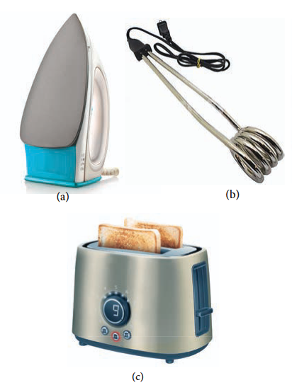
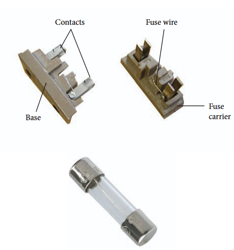
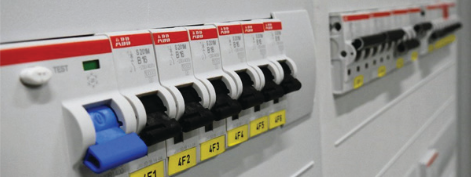
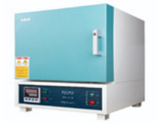
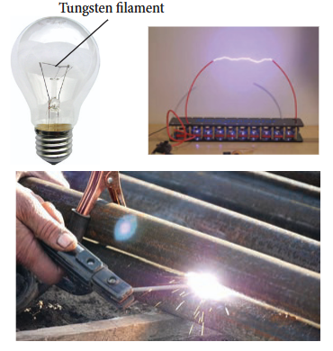

When current flows through a resistor, some of the electrical energy delivered to the resistor is converted into heat energy and it is dissipated. This heating effect of current is known as Joule's heating effect. Just as current produces thermal energy, thermal energy may also be suitably used to produce an electromotive force. This is known as thermoelectric effect.

### 2.6.1 Joule's law

If a current \(I\) flows through a conductor kept across a potential difference \(V\) for a time \(t\), the work done or the electric potential energy spent is

$$
W = VIt \quad (2.66)
$$

In the absence of any other external effect, this energy is spent in heating the conductor. The amount of heat \((H)\) produced is

$$
H = VIt \quad (2.67)
$$

For a resistance \(R\)

$$
H = I^2Rt \quad (2.68)
$$

This relation was experimentally verified by Joule and is known as Joule's law of heating. It states that the heat developed in an electrical circuit due to the flow of current varies directly as

(i) the square of the current

(ii) the resistance of the circuit and

(iii) the time of flow.

**EXAMPLE 2.27**

Find the heat energy produced in a resistance of \(10\Omega\) when 5 A current flows through it for 5 minutes.

**Solution**

\(R = 10\Omega, I = 5\mathrm{A}, t = 5\ \text{minutes} = 5\times 60\mathrm{s}\)
$$
H = I^2 Rt
$$
$$
= 5^2\times 10\times 5\times 60
$$
$$
= 25\times 10\times 300
$$
$$
= 25\times 3000
$$
$$
= 75000\mathrm{J}\ (\text{or})\ 75\mathrm{kJ}
$$

### 2.6.2 Application of Joule's heating effect

**1. Electric heaters**

Electric iron, electric heater, electric toaster shown in Figure 2.30 are some of the home appliances that utilize the heating effect of current. In these appliances, the heating elements are made of nichrome, an alloy of nickel and chromium. Nichrome has a high specific resistance and can be heated to very high temperatures without oxidation.

**EXAMPLE 2.28**

An electric heater of resistance \(10\Omega\) connected to \(220\mathrm{V}\) power supply is immersed in the water of \(1\mathrm{kg}\). How long the electrical heater has to be switched on to increase its temperature from \(30^{\circ}\mathrm{C}\) to \(60^{\circ}\mathrm{C}\). (Specific heat capacity of water is \(s = 4200\mathrm{Jkg^{- 1}K^{- 1}}\))

**Solution**

According to Joule's heating law \(H = I^{2}Rt\)

The current passed through the electrical heater \(= \frac{220\mathrm{V}}{10\Omega} = 22\mathrm{A}\)

Heat produced in one second by the electrical heater \(H = I^2R\)

Heat produced in one second \(H = (22)^{2}\times 10 = 4840\mathrm{J} = 4.84\mathrm{kJ}\). In fact the power rating of this electrical heater is \(4.84\mathrm{kW}\)

The amount of heat energy to increase the temperature of \(1\mathrm{kg}\) water from \(30^{\circ}C\) to \(60^{\circ}C\) is

\(Q = ms\Delta T\ \text{(Refer XI physics vol 2, unit 8)}\)

Here \(m = 1\mathrm{kg}\)

\(s = 4200\mathrm{Jkg^{-1}K^{-1}}\)

\(\Delta T = 30\mathrm{K}\),

\(\text{so } Q = 1\times 4200\times 30 = 126\mathrm{kJ}\)

The time required to produce this heat energy \(t = \frac{Q}{I^2R} = \frac{126\times 10^3}{4840}\approx 26.03\mathrm{s}\)

**2. Electric fuses**

Fuses as shown in Figure 2.31, are connected in series in a circuit to protect the electric devices from the heat developed by the passage of excessive current. It is a short length of a wire made of a low melting point material. It melts and breaks the circuit if current exceeds a certain value. An alloy of lead - tin is used for fuses when current rating is below 15 A and when current rating is above 15 A, copper fuse wires are used.

The only disadvantage with the above fuses is that once fuse wire is burnt due to excessive current, they need to be replaced. Nowadays in houses, circuit breakers (trippers) are also used instead of fuses. Whenever there is an excessive current produced due to faulty wire connection, the circuit breaker switch opens. After repairing the faulty connection, we can close the circuit breaker switch. It is shown in the Figure 2.32.

**3. Electric furnace**

Furnaces as shown in Figure 2.33 are used to manufacture a large number of technologically important materials such as steel, silicon carbide, quartz, gallium arsenide, etc. To produce temperatures up to \(1500^{\circ}C\), molybdenum- nichrome wire wound on a silica tube is used. Carbon arc furnaces produce temperatures up to \(3000^{\circ}C\).

**4. Electrical lamp**

It consists of a tungsten filament (melting point \(3380^{\circ}\mathrm{C}\)) kept inside a glass bulb and heated to incandescence by current. In incandescent electric lamps only about \(5\%\) of electrical energy is converted into light and the rest is wasted as heat. Electric discharge lamps, electric welding and electric arc also utilize the heating effect of current as shown in Figure 2.34.

