Ohm's law is useful only for simple circuits. For more complex circuits, Kirchhoff's rules can be used to find current and voltage. There are two generalized rules: i) Kirchhoff's current rule ii) Kirchhoff's voltage rule.

### 2.5.1 Kirchhoff's first rule (Current rule or Junction rule)

It states that the algebraic sum of the currents at any junction of a circuit is zero. It is a statement of law of conservation of electric charge. The charges that enter a given junction in a circuit must leave that junction since charge cannot build up or disappear at a junction. By convention, current entering the junction is taken as positive and current leaving the junction is taken as negative.

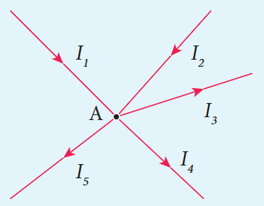

Applying this law to the junction A in Figure 2.23

\(I_{1} + I_{2} - I_{3} - I_{4} - I_{5} = 0\)
\((\text{or})\)
\(I_{1} + I_{2} = I_{3} + I_{4} + I_{5}\)

**EXAMPLE 2.20**

For the given circuit find the value of \(I\).

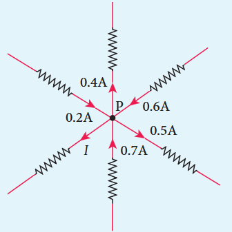

**Solution**

Applying Kirchhoff's rule to the point P in the circuit,

The arrows pointing towards P are positive and away from P are negative.

\(0.2A - 0.4A + 0.6A - 0.5A + 0.7A - I = 0\)
\(1.5A - 0.9A - I = 0\)
\(0.6A - I = 0\)
\(I = 0.6A\)

### 2.5.2 Kirchhoff's Second rule (Voltage rule or Loop rule)

It states that in a closed circuit the algebraic sum of the products of the current and resistance of each part of the circuit is equal to the total emf included in the circuit. This rule follows from the law of conservation of energy for an isolated system (The energy supplied by the emf sources is equal to the sum of the energy delivered to all resistors). The product of current and resistance is taken as positive when the direction of the current is followed. Suppose if the direction of current is opposite to the direction of the loop, then product of current and voltage across the resistor is negative. It is shown in Figure 2.24 (a) and (b). The emf is considered positive when proceeding from the negative to the positive terminal of the cell. It is shown in Figure 2.24 (c) and (d).

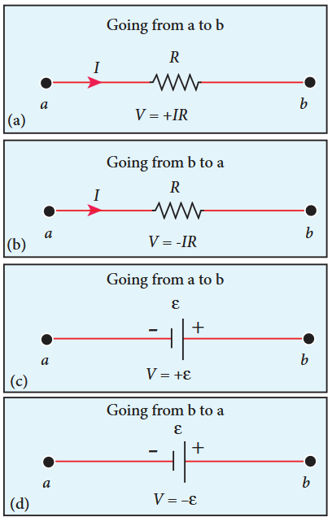

Kirchhoff voltage rule has to be applied only when all currents in the circuit reach a steady state condition (the current in various branches are constant).

**EXAMPLE 2.21**

The following figure shows a complex network of conductors which can be divided into two closed loops like EACE and ABCA. Apply Kirchhoff's voltage rule (KVR),

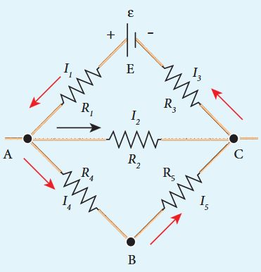

**Solution**

Thus applying Kirchhoff's second law to the closed loop EACE

\(I_{1}R_{1} + I_{2}R_{2} + I_{3}R_{3} = \epsilon\)

and for the closed loop ABCA

\(I_{4}R_{4} + I_{5}R_{5} - I_{2}R_{2} = 0\)

**EXAMPLE 2.22**

Calculate the current that flows in the 1 \(\Omega\) resistor in the following circuit.

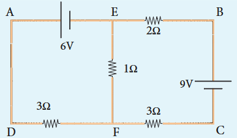

**Solution**

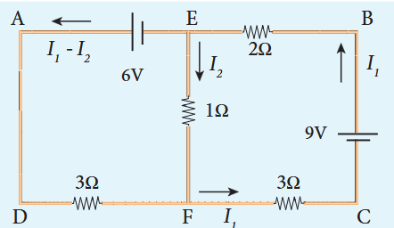

We can denote the current that flows from 9V battery as \(I_{1}\) and it splits up into \(I_{2}\) and \((I_{1} - I_{2})\) at the junction E according Kirchhoff's current rule (KCR).

Now consider the loop EFCBE and apply KVR, we get

\(1I_{2} + 3I_{1} + 2I_{1} = 9\)
\(5I_{1} + I_{2} = 9 \quad (1)\)

Applying KVR to the loop EADFE, we get

\(3(I_{1} - I_{2}) - 1I_{2} = 6\)
\(3I_{1} - 4I_{2} = 6 \quad (2)\)

Solving equation (1) and (2), we get

\(I_{1} = 1.83\mathrm{A} \text{ and } I_{2} = -0.13\mathrm{A}\)

It implies that the current in the 1 ohm resistor flows from F to E.

### 2.5.3 Wheatstone's bridge

An important application of Kirchhoff's rules is the Wheatstone's bridge. It is used to compare resistances and in determining the unknown resistance in electrical network. The bridge consists of four resistances \(P\), \(Q\), \(R\) and \(S\) connected as shown in Figure 2.25. A galvanometer \(G\) is connected between the points \(B\) and \(D\). The battery is connected between the points \(A\) and \(C\). The current through the galvanometer is \(I_{G}\) and its resistance is \(G\).

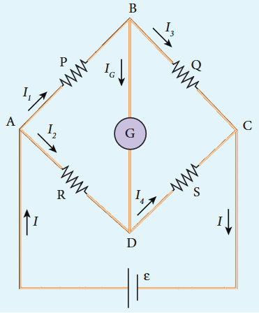

Applying Kirchhoff's current rule to junction \(B\) and \(D\) respectively.

$$
\begin{array}{l}I_1 - I_G - I_3 = 0\\ I_2 + I_G - I_4 = 0 \end{array} \quad (2.45)
$$

Applying Kirchhoff's voltage rule to loop ABDA,

\(I_{1}P + I_{G}G - I_{2}R = 0 \quad (2.47)\)

Applying Kirchhoff's voltage rule to loop ABCDA,

\(I_{1}P + I_{3}Q - I_{4}S - I_{2}R = 0 \quad (2.48)\)

When the points \(B\) and \(D\) are at the same potential, the bridge is said to be balanced. As there is no potential difference between \(B\) and \(D\), no current flows through galvanometer \((I_{G} = 0)\). Substituting \(I_{G} = 0\) in equation (2.45), (2.46) and (2.47), we get

\(I_{1} = I_{3} \quad (2.49)\)
\(\begin{array}{l}I_{2} = I_{4} \\ I_{1}P = I_{2}R \end{array} \quad (2.50)\)

Using equation (2.51) in equation (2.48)

\(I_{3}Q = I_{4}S \quad (2.52)\)

Dividing equation (2.52) by equation (2.51), we get

$$
\frac{P}{Q} = \frac{R}{S} \quad (2.53)
$$

This is the condition for bridge balance. Only under this condition, galvanometer shows null deflection. Suppose we know the values of two adjacent resistances, the other two resistances can be compared. If three of the resistances are known, the value of unknown resistance (fourth one) can be determined.

A galvanometer is an instrument used for detecting and measuring even very small electric currents. It is extensively useful to compare the potential difference between various parts of the circuit.

**EXAMPLE 2.23**

In a Wheatstone's bridge \(P = 100 \Omega\), \(Q = 1000 \Omega\) and \(R = 40 \Omega\). If the galvanometer shows zero deflection, determine the value of \(S\).

**Solution**

$$
\frac{P}{Q} = \frac{R}{S}
$$
$$
S = \frac{Q}{P} \times R = \frac{1000}{100} \times 40 = 400\Omega
$$

**EXAMPLE 2.24**

What is the value of x when the Wheatstone’s
network is balanced?

In a Wheatstone's bridge, \(P = 500\Omega\), \(Q = 800\Omega\), \(R = x + 400\Omega\), \(S = 1000\Omega\) When the bridge is balanced.

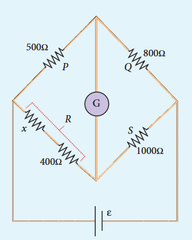

**Solution**

$$
\frac{P}{Q} = \frac{R}{S}
$$

when the network is balanced

Here \(S = 1000\Omega\)
$$
\frac{500}{800} = \frac{x + 400}{1000}
$$
$$
x + 400 = \frac{5}{8}\times 1000
$$
$$
x + 400 = 625
$$
$$
x = 625 - 400
$$
$$
x = 225\Omega
$$

### 2.5.4 Meter bridge

The meter bridge is another form of Wheatstone's bridge. It consists of a uniform wire of manganin AB of one meter length. This wire is stretched along a metre scale on a wooden board between two copper strips C and D. Between these two copper strips another copper strip E is mounted to enclose two gaps \(\mathrm{G_1}\) and \(\mathrm{G_2}\) as shown in Figure 2.26.

An unknown resistance \(P\) is connected in \(\mathrm{G_1}\) and a standard resistance \(Q\) is connected in \(\mathrm{G_2}\). A jockey (conducting wire- contact maker) is connected to the terminal E on the central copper strip through a galvanometer (G) and a high resistance (HR). The exact position of jockey on the wire can be read on the scale. A Lechlanche cell and a key (K) are connected between the ends of the bridge wire.

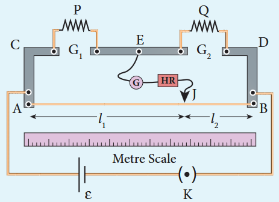

The position of the jockey on the wire is adjusted so that the galvanometer shows zero deflection. Let the position of jockey at the wire be at J. The resistances corresponding to AJ and JB of the bridge wire form the resistances \(R\) and \(S\) of the Wheatstone's bridge. Then for the bridge balance

$$
\frac{P}{Q} = \frac{R}{S} = \frac{r.AJ}{r.JB} \quad (2.54)
$$

where \(r\) is the resistance per unit length of wire.

$$
\frac{P}{Q} = \frac{AJ}{JB} = \frac{l_1}{l_2} \quad (2.55)
$$
$$
P = Q\frac{l_1}{l_2} \quad (2.56)
$$

The bridge wire is soldered at the ends of the copper strips. Due to imperfect contact, some resistance might be introduced at the contact. These are called end resistances. This error can be eliminated, if another set of readings is taken with \(P\) and \(Q\) interchanged and the average value of \(P\) is found.

To find the specific resistance of the material of the wire in the coil \(\mathrm{P}\) the radius \(a\) and length \(l\) of the wire are measured. The specific resistance or resistivity \(\rho\) can be calculated using the relation.

\(\mathrm{Resistance} = \rho \frac{l}{A}\)

By rearranging the above equation, we get

$$
\rho = \mathrm{Resistance}\times \frac{A}{l} \quad (2.57)
$$

If \(P\) is the unknown resistance equation (2.57) becomes,

$$
\rho = P\frac{\pi a^2}{l}
$$

**EXAMPLE 2.25**

In a meter bridge experiment with a standard resistance of \(15\Omega\) in the right gap, the ratio of balancing length is 3:2. Find the value of the other resistance.

**Solution**

\(Q = 15\Omega,\qquad l_{1}:l_{2} = 3:2\)

\(\frac{l_1}{l_2} = \frac{3}{2}\)

$$
\frac{P}{Q} = \frac{l_1}{l_2}
$$
$$
P = Q\times \frac{l_1}{l_2} = 15\times \frac{3}{2} = 22.5\Omega
$$

**EXAMPLE 2.26**

In a meter bridge experiment, the value of resistance in the resistance box connected in the right gap is \(10\Omega\). The balancing length is \(l_{1} = 55\mathrm{cm}\). Find the value of unknown resistance.

**Solution**

\(Q = 10\Omega\)
$$
\frac{P}{Q} = \frac{l_1}{100 - l_1} = \frac{l_1}{l_2}
$$
$$
P = Q\times \frac{l_1}{100 - l_1}
$$
$$
P = \frac{10\times 55}{100 - 55}
$$
$$
P = \frac{550}{45} = 12.2\Omega
$$

### 2.5.5 Potentiometer

Potentiometer is used for the accurate measurement of potential differences, current and resistances. It consists of ten meter long uniform wire of manganin or constantan stretched in parallel rows each of 1 meter length, on a wooden board. The two free ends A and B are brought to the same side and fixed to copper strips with binding screws. A meter scale is fixed parallel to the wire. A jockey is provided for making contact.

The principle of the potentiometer is illustrated in Figure 2.27. A steady current is maintained across the wire CD by a battery \(B t\). The battery, key and the potentiometer wire connected in series form the primary circuit. The positive terminal of a primary cell of emf \(\epsilon\) is connected to the point C and negative terminal is connected to the jockey through a galvanometer G and a high resistance HR. This forms the secondary circuit.

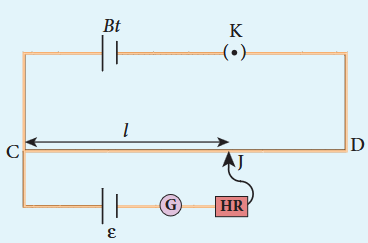

Let the contact be made at any point J on the wire by jockey. If the potential difference across CJ is equal to the emf of the cell \(\epsilon\), then no current will flow through the galvanometer and it will show zero deflection. CJ is the balancing length \(l\). The potential difference across CJ is equal to \(I r l\) where \(I\) is the current flowing through the wire and \(r\) is the resistance per unit length of the wire.

$$
\text{Hence } \epsilon = I r l \quad (2.58)
$$

Since \(I\) and \(r\) are constants, \(\epsilon \propto l\). The emf of the cell is directly proportional to the balancing length.

### 2.5.6 Comparison of emf of two cells with a potentiometer

To compare the emf of two cells, the circuit connections are made as shown in Figure 2.28. Potentiometer wire CD is connected to a battery \(B t\) and a key K in series. This is the primary circuit. The end C of the wire is connected to the terminal M of a DPDT (Double Pole Double Throw) switch and the other terminal N is connected to a jockey through a galvanometer G and a high resistance HR. The cells whose emf \(\epsilon_{1}\) and \(\epsilon_{2}\) to be compared are connected to the terminals \(\mathbf{M}_{1},\mathbf{N}_{1}\) and \(\mathbf{M}_{2},\mathbf{N}_{2}\) of the DPDT switch. The positive terminals of \(B t\), \(\epsilon_{1}\) and \(\epsilon_{2}\) should be connected to the same end C.

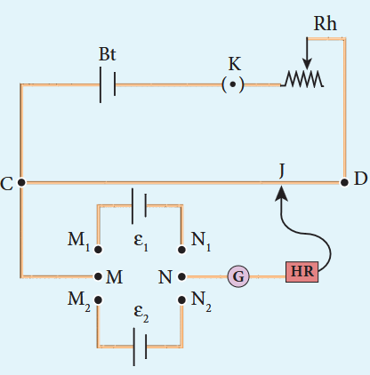

The DPDT switch is pressed towards \(\mathbf{M}_{1}\) \(\mathbf{N}_{1}\) so that cell \(\epsilon_{1}\) is included in the secondary circuit and the balancing length \(l_{1}\) is found by adjusting the jockey for zero deflection. Then the second cell \(\epsilon_{2}\) is included in the circuit and the balancing length \(l_{2}\) is determined. Let \(r\) be the resistance per unit length of the potentiometer wire and \(I\) be the current flowing through the wire.

$$
\begin{array}{l}\text{we have}\quad \epsilon_{1} = I r l_{1}\\ \epsilon_{2} = I r l_{2} \end{array} \quad (2.60)
$$

By dividing equation (2.59) by (2.60)

$$
\frac{\epsilon_{1}}{\epsilon_{2}} = \frac{l_{1}}{l_{2}} \quad (2.61)
$$

By including a rheostat (Rh) in the
primary circuit, the experiment can be
repeated several times by changing the
current flowing through it

### 2.5.7 Measurement of internal resistance of a cell by potentiometer

To measure the internal resistance of a cell, the circuit connections are made as shown in Figure 2.29. The end C of the potentiometer wire is connected to the positive terminal of the battery Bt and the negative terminal of the battery is connected to the end D through a key \(\mathbf{K}_1\). This forms the primary circuit.

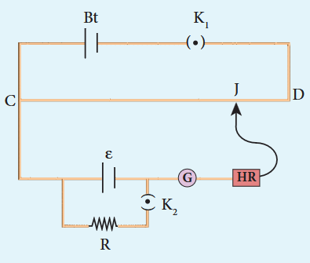

The positive terminal of the cell of emf \(\epsilon\) whose internal resistance is to be determined is also connected to the end C of the wire. The negative terminal of the cell \(\epsilon\) is connected to a jockey through a galvanometer and a high resistance. A resistance box R and key \(\mathbf{K}_2\) are connected across the cell \(\epsilon\). With \(\mathbf{K}_2\) open, the balancing point J is obtained and the balancing length \(\mathrm{CJ} = l_1\) is measured. Since the cell is in open circuit, its emf is

$$
\epsilon \propto l_1 \quad (2.62)
$$

A suitable resistance (say, 10 \(\Omega\)) is included in the resistance box and key \(\mathbf{K}_2\) is closed. Let r be the internal resistance of the cell. The current passing through the cell and the resistance R is given by

$$
I = \frac{\epsilon}{R + r}
$$

The potential difference across R is

$$
V = \frac{\epsilon R}{R + r}
$$

When this potential difference is balanced on the potentiometer wire, let \(l_{2}\) be the balancing length.

$$
\text{Then } \frac{\epsilon R}{R + r}\propto l_2 \quad (2.63)
$$

From equations (2.62) and (2.63)

$$
\begin{array}{l}\frac{R + r}{R} = \frac{l_1}{l_2}\\ 1 + \frac{r}{R} = \frac{l_1}{l_2};\\ r = R\left[\frac{l_1}{l_2} -1\right]\\ \therefore r = R\left(\frac{l_1 - l_2}{l_2}\right) \end{array} \quad (2.65)
$$

Substituting the values of the \(R\), \(l_{1}\) and \(l_{2}\), the internal resistance of the cell is determined. The experiment can be repeated for different values of \(R\). It is found that the internal resistance of the cell is not constant but increases with increase of external resistance connected across its terminals.