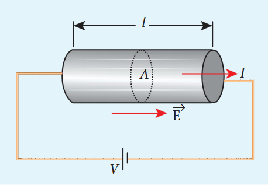
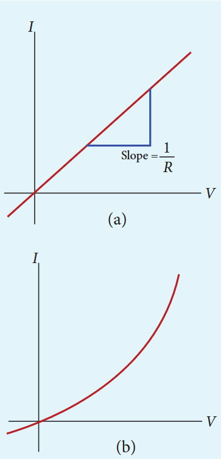
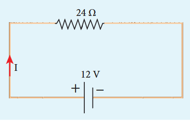
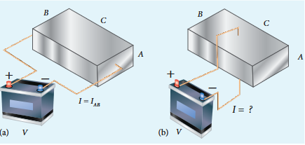
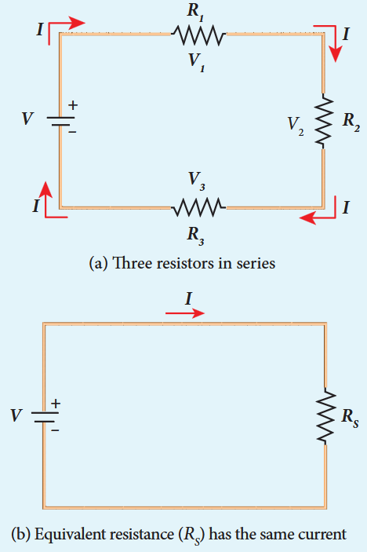
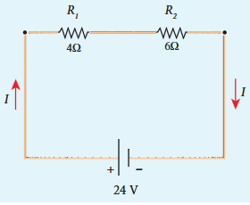
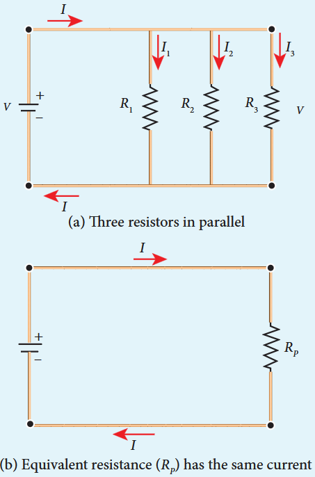
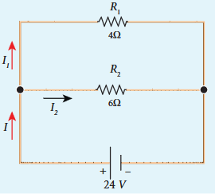

> Why current density is a vector but current is a scalar? In general, the current I is defined as the scalar product of the current density and area vector in which the charges cross.
> $$
> I = \vec{J}\cdot \vec{A}
> $$
> The current I can be positive or negative depending on the choice of the unit vector normal to the surface area A.

The ohm's law can be derived from the equation \(J = \sigma E\). Consider a segment of wire of length \(l\) and cross sectional area \(A\) as shown in Figure 2.7.

When a potential difference \(V\) is applied across the wire, a net electric field is created in the wire which constitutes the current in the wire. For simplicity, we assume that the electric field is uniform in the entire length of the wire, then the potential difference (voltage \(V\)) can be written as

$$
V = El
$$

As we know, the magnitude of current density

$$
J = \sigma E = \sigma \frac{V}{l} \quad (2.14)
$$

But \(J = \frac{I}{A}\) so we write the equation (2.14) as

$$
\frac{I}{A} = \sigma \frac{V}{l}.
$$

By rearranging the above equation, we get

$$
V = I\left(\frac{l}{\sigma A}\right) \quad (2.15)
$$

The quantity \(\frac{l}{\sigma A}\) is called resistance of the conductor and it is denoted as \(R\). Note that the resistance is directly proportional to the length of the conductor and inversely proportional to area of cross section.

Therefore, the macroscopic form of Ohm's law can be stated as "the potential difference across a given conductor is directly proportional to the current passing through it when the temperature remains constant".

$$
V = IR \quad (2.16)
$$

From the above equation, the resistance is the ratio of potential difference across the given conductor to the current passing through the conductor.

$$
R = \frac{V}{I} \quad (2.17)
$$

The SI unit of resistance is ohm \((\Omega)\). From the equation (2.16), we infer that the graph between current versus voltage is straight line with a slope equal to the inverse of resistance \(R\) of the conductor. It is shown in the Figure 2.8 (a).

Materials for which the current versus voltage graph is a straight line through the origin, are said to obey Ohm's law and their behaviour is said to be ohmic as shown in Figure 2.8(a). Materials or devices that do not follow Ohm's law are said to be non- ohmic. These materials have more complex relationships between voltage and current. A plot of I versus V for a non- ohmic material is non- linear and they do not have a constant resistance (Figure 2.8(b)).

**EXAMPLE 2.5**

A potential difference across \(24\Omega\) resistor is \(12\mathrm{V}\). What is the current through the resistor?

**Solution**

\(V = 12\mathrm{V}\) and \(R = 24\Omega\)
\(\mathrm{Current}, I = ?\)
\(\mathrm{From\ Ohm's\ law}, I = \frac{V}{R} = \frac{12}{24} = 0.5\mathrm{A}\)

### 2.2.1 Resistivity

In the previous section, we have seen that the resistance \(R\) of any conductor is given by

$$
R = \frac{l}{\sigma A} \quad (2.18)
$$

where \(\sigma\) is called the conductivity of the material and it depends only on the type of the material used and not on its dimension.

The resistivity of a material is equal to the reciprocal of its conductivity.

$$
\rho = \frac{1}{\sigma} \quad (2.19)
$$

Now we can rewrite equation (2.18) using equation (2.19)

$$
R = \rho \frac{l}{A} \quad (2.20)
$$

The resistance of a material is directly proportional to the length of the conductor and inversely proportional to the area of cross section of the conductor. The proportionality constant \(\rho\) is called the resistivity of the material.

If \(l = 1\mathrm{m}\) and \(A = 1\mathrm{m}^2\), then the resistance \(R = \rho\). In other words, the electrical resistivity of a material is defined as the resistance offered to current flow by a conductor of unit length having unit area of cross section. The SI unit of \(\rho\) is ohm- metre \((\Omega \mathrm{m})\). Based on the resistivity, materials are classified as conductors, insulators and semiconductors. The conductors have lowest resistivity, insulators have highest resistivity and semiconductors have resistivity greater than conductors but less than insulators. The typical resistivity values of some conductors, insulators and semiconductors are given in the Table 2.1

**Table 2.1 Resistivity for various materials**

| Material | Resistivity, ρ (Ω m) at 20℃ |
| :--- | :--- |
| **Insulators** | |
| Pure Water | 2.5 × 10-5 |
| Glass | 1010 – 1014 |
| Hard Rubber | 1013 – 1016 |
| NaCl | 1014 |
| Fused Quartz | 1016 |
| **Semiconductors** | |
| Germanium | 0.46 |
| Silicon | 640 |
| **Conductors** | |
| Silver | 1.6 × 10-8 |
| Copper | 1.7 × 10-8 |
| Aluminium | 2.7 × 10-8 |
| Tungsten | 5.6 × 10-8 |
| Iron | 10 × 10-8 |

**EXAMPLE 2.6**

The resistance of a wire is \(20\Omega\). What will be new resistance, if it is stretched uniformly 8 times its original length?

**Solution**

\(R_{1} = 20\Omega , R_{2} = ?\)

Let the original length of the wire \((l_{1})\) be \(l\)

New length, \(l_{2} = 8l_{1} \text{ (i.e.) } l_{2} = 8l\)

Original resistance, \(R_{1} = \rho \frac{l_{1}}{A_{1}}\)

New resistance \(R_{2} = \rho \frac{l_{2}}{A_{2}} = \frac{\rho(8l)}{A_{2}}\)

Though the wire is stretched, its volume remains unchanged.

Initial volume = Final volume

\(A_{1}l_{1} = A_{2}l_{2},\qquad A_{1}l = A_{2}(8l)\)

\(\frac{A_1}{A_2} = \frac{8l}{l} = 8\)

By dividing equation for \(R_{2}\) by equation for \(R_{1}\), we get

$$
\frac{R_{2}}{R_{1}} = \frac{\rho(8l)}{A_{2}}\times \frac{A_{1}}{\rho l}
$$
$$
\frac{R_{2}}{R_{1}} = \frac{A_{1}}{A_{2}}\times 8
$$

Substituting the value of \(\frac{A_{1}}{A_{2}}\), we get

$$
\frac{R_{2}}{R_{1}} = 8\times 8 = 64
$$

$$
R_{2} = 64\times 20 = 1280\Omega
$$

Hence, stretching the length of the wire has increased its resistance.

**EXAMPLE 2.7**

Consider a rectangular block of metal of height A, width B and length C as shown in the figure.

If a potential difference of \(V\) is applied between the two faces A and B of the block (figure (a)), the current \(I_{AB}\) is observed. Find the current that flows if the same potential difference \(V\) is applied between the two faces B and C of the block (figure (b)). Give your answers in terms of \(I_{AB}\).

**Solution**

In the first case, the resistance of the block

$$
R_{AB} = \rho \frac{\text{length}}{\text{Area}} = \rho \frac{\mathrm{C}}{\mathrm{AB}}
$$

The current \(I_{AB} = \frac{V}{R_{AB}} = \frac{V}{\rho}\frac{AB}{C}\) (1)

In the second case, the resistance of the block \(R_{BC} = \rho \frac{A}{BC}\)

The current \(I_{BC} = \frac{V}{R_{BC}} = \frac{V}{\rho}\frac{BC}{A}\) (2)

To express \(I_{BC}\) in terms of \(I_{AB}\), we multiply and divide equation (2) by AC, we get

$$
I_{BC} = \frac{V}{\rho}\frac{BC}{A}\frac{AC}{AC} = \left(\frac{V}{\rho}\frac{AB}{C}\right)\frac{C^{2}}{A^{2}} = \frac{C^{2}}{A^{2}}\cdot I_{AB}
$$

Since \(C > A\), the current \(I_{BC} > I_{AB}\)

The human body contains a large amount of water which has low resistance of around \(200\Omega\) and the dry skin has high resistance of around \(500\mathrm{k}\Omega\). But when the skin is wet, the resistance is reduced to around \(1000\Omega\). This is the reason why repairing the electrical connection with the wet skin is always dangerous.

### 2.2.2 Resistors in series and parallel

An electric circuit may contain a number of resistors which can be connected in different ways. For each type of circuit, we can calculate the equivalent resistance produced by a group of individual resistors.

**Resistors in series**

When two or more resistors are connected end to end, they are said to be in series. The resistors could be simple resistors or bulbs or heating elements or other devices. Figure 2.9 (a) shows three resistors \(R_{1}, R_{2}\) and \(R_{3}\) connected in series.

The amount of charge passing through resistor \(R_{1}\) must also pass through resistors \(R_{2}\) and \(R_{3}\) since the charges cannot accumulate anywhere in the circuit. Due to this reason, the current I passing through all the three resistors is the same. According to Ohm's law, if same current pass through different resistors of different values, then the potential difference across each resistor must be different. If \(V_{1}, V_{2}\) and \(V_{3}\) be the potential differences (voltage) across each of the resistors \(R_{1}\), \(R_{2}\) and \(R_{3}\) respectively, then we can write \(V_{1} = IR_{1}, V_{2} = IR_{2}\) and \(V_{3} = IR_{3}\). But the supply voltage \(V\) must be equal to the sum of voltages(potential differences) across each resistor.

$$
V = V_{1} + V_{2} + V_{3} = IR_{1} + IR_{2} + IR_{3} \quad (2.21)
$$
$$
V = I(R_{1} + R_{2} + R_{3})
$$
$$
V = IR_{S}
$$

where \(R_{s}\) is the equivalent resistance.

$$
R_{s} = R_{1} + R_{2} + R_{3} \quad (2.23)
$$

When several resistors are connected in series, the total or equivalent resistance is the sum of the individual resistances as shown in the Figure 2.9 (b).

Note: The value of equivalent resistance in series connection will be greater than each individual resistance.

**EXAMPLE 2.8**

Calculate the equivalent resistance for the circuit which is connected to \(24\mathrm{V}\) battery and also find the potential difference across each resistors in the circuit.

**Solution**

Since the resistors are connected in series, the effective resistance in the circuit

\(= 4\Omega +6\Omega = 10\Omega\)

current I in the circuit \(= \frac{V}{R_{eq}} = \frac{24}{10} = 2.4A\)

Voltage across \(4\Omega\) resistor

\(V_{1} = IR_{1} = 2.4\mathrm{A}\times 4\Omega = 9.6\mathrm{V}\)

Voltage across \(6\Omega\) resistor

\(V_{2} = IR_{2} = 2.4\mathrm{A}\times 6\Omega = 14.4\mathrm{V}\)

**Resistors in parallel**

Resistors are in parallel when they are connected across the same potential difference as shown in Figure 2.10 (a).

In this case, the total current I that leaves the battery is split into three separate components. Let \(I_{1}, I_{2}\) and \(I_{3}\) be the current through the resistors \(R_{1}, R_{2}\) and \(R_{3}\) respectively. Due to the conservation of charge, total current in the circuit I is equal to sum of the currents through each of the three resistors.

$$
I = I_{1} + I_{2} + I_{3} \quad (2.24)
$$

Since the voltage across each resistor is the same, applying Ohm's law to each resistor, we have

$$
I_{1} = \frac{V}{R_{1}}, I_{2} = \frac{V}{R_{2}}, I_{3} = \frac{V}{R_{3}} \quad (2.25)
$$

Substituting these values in equation (2.24), we get

$$
I = \frac{V}{R_{1}} +\frac{V}{R_{2}} +\frac{V}{R_{3}} = V\left[\frac{1}{R_{1}} +\frac{1}{R_{2}} +\frac{1}{R_{3}}\right]
$$

$$
I = \frac{V}{R_{p}}
$$

$$
\frac{1}{R_{p}} = \frac{1}{R_{1}} +\frac{1}{R_{2}} +\frac{1}{R_{3}} \quad (2.26)
$$

Here \(R_{p}\) is the equivalent resistance of the parallel combination of the resistors. Thus, when a number of resistors are connected in parallel, the sum of the reciprocals of resistance of the individual resistors is equal to the reciprocal of the effective resistance of the combination as shown in the Figure 2.10 (b).

Note: The value of equivalent resistance in parallel connection will be lesser than each individual resistance.

House hold appliances are always connected in parallel so that even if one is switched off, the other devices could function properly.

**EXAMPLE 2.9**

Calculate the equivalent resistance in the following circuit and also find the values of current \(I, I_{1}\) and \(I_{2}\) in the given circuit.

**Solution**

Since the resistances are connected in parallel, the equivalent resistance in the circuit is

$$
\frac{1}{R_{p}} = \frac{1}{R_{1}} +\frac{1}{R_{2}} = \frac{1}{4} +\frac{1}{6}
$$
$$
\frac{1}{R_{p}} = \frac{5}{12}\Omega \text{ or } R_{p} = \frac{12}{5}\Omega
$$

The resistors are connected in parallel, the potential difference (voltage) across them is the same.

$$
V = I_{1}R_{1} = I_{2}R_{2}
$$
$$
I_{1} = \frac{V}{R_{1}} = \frac{24}{4} = 6\mathrm{A}
$$
$$
I_{2} = \frac{V}{R_{2}} = \frac{24}{6} = 4\mathrm{A}
$$

The current \(I\) is the sum of the currents in the two branches. Then,

$$
I = I_{1} + I_{2} = 6\mathrm{A} + 4\mathrm{A} = 10\mathrm{A}
$$

**EXAMPLE 2.10**

Two resistors when connected in series and parallel, their equivalent resistances are \(15\Omega\) and \(\frac{56}{15}\Omega\) respectively. Find the values of the resistances.

**Solution**

$$
\begin{array}{l}{R_{\mathrm{s}} = R_{1} + R_{2} = 15\Omega}\\ {R_{p} = \frac{R_{1}R_{2}}{R_{1} + R_{2}} = \frac{56}{15}\Omega} \end{array} \quad (2)
$$

From equation (1) substituting for \(R_{1} + R_{2}\) in equation (2)

$$
\frac{R_{1}R_{2}}{15} = \frac{56}{15}\Omega
$$

\(\therefore R_{1}R_{2} = 56\)

$$
R_{2} = \frac{56}{R_{1}}\Omega \quad (3)
$$

Substituting for \(R_{2}\) in equation (1) from equation (3)

$$
R_{1} + \frac{56}{R_{1}} = 15
$$

\(\text{Then}, \frac{R_{1}^{2} + 56}{R_{1}} = 15\)

$$
R_{1}^{2} + 56 = 15R_{1}
$$

$$
R_{1}^{2} - 15R_{1} + 56 = 0
$$

The above equation can be solved using factorisation.

\(R_{1} = 8\Omega \text{ or } R_{1} = 7\Omega\)

\(\text{If } R_{1} = 8\Omega\)

Substituting in equation (1)

\(8 + R_{2} = 15\)

\(R_{2} = 15 - 8 = 7\Omega\)

\(R_{2} = 7\Omega \text{ i.e., } (\text{when } R_{1} = 8\Omega; R_{2} = 7\Omega)\)

\(\text{If } R_{1} = 7\Omega\)

Substituting in equation (1)

\(7 + R_{2} = 15\)

\(R_{2} = 8\Omega, \text{ i.e., } (\text{when } R_{1} = 7\Omega; R_{2} = 8\Omega)\)

---