  

**In this unit, the student is exposed to**

• the phenomenon of electromagnetic induction

• the application of Lenz’s law to find the directio

• the concept of Eddy current and its uses

• the phenomenon of self-induction and mutual

• the various methods of producing induced em

• the construction and working of AC generator

• the principle of transformers and its role in lon

• the notion of root mean square value of alterna

• the idea of phasors and phase relationships in d

• the insight about power in an AC circuit and w

• the understanding of energy conservation duri

_“Nature is our kindest friend and best cr intimations to f_

**Learning Objectives**

## ELECTROMAGNETIC INDUCTION 

### Introduction 

In the previous chapter, we have learnt that whenever an electric current flows through a conductor, it produces a magnetic field around it. This was discovered by Christian Oersted. Later, Ampere proved that a current-carrying loop behaves like a bar magnet. These are the magnetic effects produced by the electric current.

AGNETIC INDUCTION RNATING CURRENT

n of induced emf

\-induction

fs

s

g distance power communication

ting current

ifferent AC circuits

attless current

ng LC oscillations

_itic in experimental science if we only allow her all unbiased on our minds”_ ― Michael Faraday

Physicists then began to think of the converse effect. Is it possible to produce an electric current with the help of a magnetic field? A series of experiments were conducted to establish the converse effect. These experiments were done by Michael Faraday of UK and Joseph Henry of USA, almost simultaneously and independently. These attempts became successful and led to the discovery of the phenomenon, called Electromagnetic Induction. Michael Faraday is credited with the discovery of electromagnetic induction in 1831.

  

In this chapter, let us see a few experiments of Faraday, the results and the phenomenon of Electromagnetic Induction. Before that, we will recollect the concept of magnetic flux linked with a surface area.

**An anecdote!**

Michael Faraday was enormously popular for his lectures as well. In one of his lectures, he demonstrated his experiments which led to the discovery of electromagnetic induction.

At the end of the lecture, one member of the audience approached Faraday and said, “Mr. Faraday, the behaviour of the magnet and the coil of wire was interesting, but what is the use of it?” Faraday answered politely, “Sir, what is the use of a newborn baby?” **Note:** We will soon see the greatness of ‘that little child’ who has now grown as an adult to cater to the energy needs.

### Magnetic Flux (**F**B)

The magnetic flux FB through an area _A_ in a magnetic field is defined as the number of magnetic field lines passing through that area normally and is given by the equation (Figure 4.1(a)).

ΦB d =∫ _B A_  

. _A_

(4.1)

where the integral is taken over the area _A_ and _θ_ is the angle between the direction of the magnetic field and the outward normal to the area.  

 **B**



**(a)**

 **B**

 

**(b)**



**Figure 4.1 Magnetic flux**

If the magnetic field _B_ 

is uniform over the area _A_ and is perpendicular to the area as shown in Figure 4.1(b), then the above equation becomes

ΦB d= =∫ _B A_  

. os _A_

_BA c_ θ

\= _BA_ since θ= ° °=0 0 1, cos

The SI unit of magnetic flux is T m2. It is also measured in weber or Wb_._

1 Wb = 1 T m2

**EXAMPLE 4.1**

A circular antenna of area 3 m2 is installed at a place in Madurai. The plane of the area of antenna is inclined at 47o with the direction of Earth’s magnetic field. If the magnitude of Earth’s field at that place is 4.1 × 10–5 T find the magnetic flux linked with the antenna.

**_Solution_**

_B_ = 4.1 × 10–5 T; _θ_ = 90o – 47o = 43°; _A_ = 3m2

|  |

|------|------|
|  |

|------|
| An anecdote!Mic hae l F arad ay wa s en or mouslyp opu l ar f or hi s le c tur es a s w el l. I none o f hi s le c tur es, h e dem onst ra te dhi s  exp er im en ts  w hic h  le d  tot he di s co ver y o f e le c t romag net icin duc t io n.At t he en d o f t he le c tur e, o nemem b er  of  t he  audien ce a ppro ac he dFarad ay a nd s aid , “ Mr. F arad ay, t heb ehav io ur o f t he m ag net a nd t he co i lof wir e was inter es t in g , but what is theus e o f i t? ”   Farad ay a nsw er e d p oli tely,“Sir, w hat i s t he u s e o f a n e w b or nb aby ? ”Note :  We w i l l s o on s e e t he g re at nes sof ‘ t hat li tt le c hi ld’ w ho h as n owg row n  as a n ad u lt t o  c ater t o t heen er g y n e e ds. |
  

Away from coil

Le deection

_i_

N S

(d)

No motion

No deection

N S

(a)

_C_

_G_

_C_

_G_

We know that Φ_B BA_\= cosθ

FB = 4.1 × 10–5 ´ 3 ´ cos 43o

\= 4.1 × 10–5 ´ 3 ´ 0.7314

\= 89.96 mWb

**EXAMPLE 4.2**

A circular loop of area 5 ´ 10–2 m2 rotates in a uniform magnetic field of 0.2 T. If the loop rotates about its diameter which is perpendicular to the magnetic field as shown in figure. Find the magnetic flux linked with the loop when its plane is (i) normal to the field (ii) inclined 60o to the field and (iii) parallel to the field.

 **B**

**_Solution_** _A_ = 5 ´ 10–2 m2; _B_ = 0.2 T

(i) θ = 0°;

Φ_B BA_\= = × × ×−cos . cosθ 0 2 5 10 02 

Φ_B_ \= × −1 10 2 Wb

(ii) θ = 90° – 60° = 30°;

Φ_B BA_\= = × × ×−cos . cosθ 0 2 5 10 302 

Φ_B_ \= × ×−1 10 3 2

2    8 66 10

3 . Wb

(iii) θ = 90°;

Φ_B BA_\= =cos90 0  

Kept stationary

Higher speed

NS

Towards le

N S

_υ_1

Right deection No deection

_ii_

_i_

N S

_υ_2 > _υ_1

Larger deection Le deection

S-pole towards le

(b) (c)

(e) (f)

N SS

_C_

_G_

_C_

_G_

_C_

_G_

_C_

_G_

Kept stationary

Higher speed

Towards le

N S

_υ_1

Right deection No deection

Away from coil

Le e ecti

_i ii_

_i_

N S N S

_υ_2 > _υ_1

Larger deection Le deection

S-pole to

(b) (c)

(d) (e) (f)

No motion

No deection

N S

(a)

N SS _C_

_G_

_C_

_G_

_C_

_G_

_C_

_G_

_C_

_G_

_C_

_G_

Kept stationary

No deection

Away from coil

Le deection

_i_

N S

(c) (d)

N SS

_C_

_G_

_C_

_G_

**Figure 4.2 Faraday’s first experiment**

### Faraday’s Experiments on Electromagnetic Induction

**First Experiment** Consider a closed circuit consisting of a

coil _C_ of insulated wire and a galvanometer _G_ (Figure 4.2(a)). The galvanometer does not indicate deflection as there is no electric current in the circuit.

When a bar magnet is inserted into the stationary coil, with its north pole facing the coil, there is a momentary deflection in the galvanometer. This indicates that an electric current is set up in the coil (Figure 4.2(b)). If the magnet is kept stationary inside the

| We know thatΦ = BA cos θF = 4.1 × 10 ´ 3 ´ cos 43= 4.1 × 10 ´ 3 ´ 0.7314B      = 89.96 mWb–5 oB –5 |
|------|

| EXAMPLE 4 . 2A cir cular lo op o f a rea 5  ´ 10 m  r otates in a unif orm m agnetic f ield o f 0.2 T. If the loop rotates about its diameter which is p erpendicular t o t he m agn –2 etic f 2 ield a s shown in f igure. Fin d t he m agnetic f lux linked w ith t he lo op w hen i ts p lane i s (i) n ormal t o t he f ield (ii) in clined 60  tothe field and (iii) parallel to the field.oBSolutionA = 5 ´ 10 m ; B = 0.2 T(i) θ = 0 ;–2  2==BAcos.θ 02 ××51 00 ×°−2 |
|------|------|------|------|
| cos |
| ΦB |
| ΦB |=×11 0 Wb – 60  = 30 ;−2==BAcos.θ 02 ××51 03 ×° ° °86.W61 03=×11 0 × −22;−2 ==BA cos9 00° |

| (ii) θ = 90ΦΦ(iii) θ = 90BΦBB |
| cos 0b3 |

  

coil, the galvanometer does not indicate deflection (Figure 4.2(c)).

The bar magnet is now withdrawn from the coil, the galvanometer again gives a momentary deflection but in the opposite direction. So the electric current flows in opposite direction (Figure 4.2(d)). Now if the magnet is moved faster, it gives a larger deflection due to a greater current in the circuit (Figure 4.2(e))

The bar magnet is reversed i.e., the south pole now faces the coil. When the above experiment is repeated, the deflections are opposite to that obtained in the case of north pole (Figure 4.2(f)).

If the magnet is kept stationary and the coil is moved towards or away from the coil, similar results are obtained. It is concluded that whenever there is a relative motion between the coil and the magnet, there is deflection in the galvanometer, indicating the electric current setup in the coil.

**Second Experiment** Consider two closed circuits as shown

in Figure 4.3(a). The circuit consisting of a coil _P_, a battery _B_ and a key _K_ is called as primary circuit while the circuit with a coil _S_ and a galvanometer _G_ is known as secondary circuit. The coils _P_ and _S_ are kept at rest in close proximity with respect to one another.

If the primary circuit is closed, electric current starts flowing in the primary circuit. At that time, the galvanometer gives a momentary deflection (Figure 4.3(a)).

After that, when the electric current reaches a certain steady value, no deflection is observed in the galvanometer.

Likewise if the primary circuit is broken, the electric current starts decreasing and there is again a sudden deflection but in the opposite direction (Figure 4.3(b)).

P

_i_p

KB G

_i_S

Right deection

S

Increasing current

**(a)**  

When the electric current becomes zero, the galvanometer shows no deflection.

From the above observations, it is concluded that whenever the electric current in the primary circuit changes, the galvanometer shows a deflection.

**Faraday’s Law of Electromagnetic Induction**

From the results of his experiments, Faraday realized that **whenever the magnetic flux linked with a closed coil changes, an emf (electromotive force) is induced and hence an electric current flows in the circuit. This current is called an induced current and the emf giving rise to such current is called an induced emf. This phenomenon is known as electromagnetic induction.**

Decreasing

P

_i_p

KB G

P

_i_S

Right deection

S

Increasing current

_i_p

B **(a)**

Decreasing current

P

Le deection

S

G

_i_S_i_p

KB **(b)**

  

_G_

N S

**(a)** Right deect

_C_

_i_ magnetic ux linked is less

**(b)**

_G_

N S

Le deectio

_C_

_ii_

**Figure 4.4 Explanation of Faraday’s first expe**

Based on this idea, Faraday’s experiments are understood in the following way. In the first experiment, when a bar magnet is placed close to a coil, some of the magnetic field lines of the bar magnet pass through the coil i.e., the magnetic flux is linked with the coil. When the bar magnet and the coil approach each other, the magnetic flux linked with the coil increases. So this increase in magnetic flux induces an emf and hence a transient electric current flows in the circuit in one direction (Figure 4.4(a)).

At the same time, when they recede away from one another, the magnetic flux linked with the coil decreases. The decrease in magnetic flux again induces an emf in opposite  

direction and hence an electric current flows in opposite direction (Figure 4.4(b)). So there is deflection in the galvanometer when there is a relative motion between the coil and the magnet.

In the second experiment, when the primary coil _P_ carries an electric current, a magnetic field is established around it. The magnetic lines of this field pass through itself and the neighbouring secondary coil _S_.

When the primary circuit is open, no electric current flows in it and hence the magnetic flux linked with the secondary coil is zero (Figure 4.5(a)).

However, when the primary circuit is closed, the increasing current builds up a

_G_

N S

ion

_C_

_i_ magnetic ux linked is more

_G_

N S

n

_C_

riment

  

magnetic field around the primary coil. Therefore, the magnetic flux linked with the secondary coil increases. This increasing flux linked induces a transient electric current in the secondary coil (Figure 4.5(b)). When the electric current in the primary coil reaches a steady value, the magnetic flux linked with the secondary coil does not change and the electric current in the secondary coil will disappear.

Similarly, when the primary circuit is broken, the decreasing primary current

**P**

**KB G No deection**

**S**

**No current**

**(a)**

**P**

_i_**p**

**KB G**

_i_**S**

**Right deection**

**S**

**Increasing current**

**(b)**

**Decreasing current**

**P**

**Le deection**

**S**

**G**

_i_**S**_i_**p**

**KB(c)**

induces an electric current in the secondary coil, but in the opposite direction (Figure 4.5(c)). So there is deflection in the galvanometer whenever there is a change in the primary current.

The conclusions of Faraday’s experiments are stated as two laws.

**First law Whenever magnetic flux linked with a closed circuit changes, an emf is induced in the circuit which lasts in the circuit as long as the magnetic flux is changing.**

**Second law The magnitude of induced emf in a closed circuit is equal to the time rate of change of magnetic flux linked with the circuit.**

If the magnetic flux linked with each turn of the coil changes by _dΦB_ in a time _dt_, then the induced emf in each turn is given by

= _d_

_dt B_

If a coil consisting of _N_ turns is tightly wound such that each turn covers the same area, then the flux through each turn will be the same. Then total emf induced in the coil is given by

=

\=

_N d_

_dt d N_

_dt_

_B_

_B_

( )

( )



 (4.2)

Here _NΦB_ is called flux linkage, defined as the product of number of turns _N_ of the coil and the magnetic flux linking each turn of the coil _ΦB_.

|  = NdN()= |d()B |
|------|------|
| dtB |
| dt |
  

**Importance of Electromagnetic Induction!**

The application of the phenomenon of Electromagnetic Induction is almost everywhere in the present day life. Right from home appliances to huge factory machineries, from cellphone to computers and internet, from electric guitar to satellite communication, all need electricity for their operation. There is an ever growing demand for electric power.

All these are met with the help of electric generators and transformers which function on electromagnetic induction. The modern, sophisticated human life would not be possible without the discovery of electromagnetic induction.

**Exploring Electromagnetic Induction**

**N S**

Make a circuit containing a coil of insulated wire wound around soft hollow core and a galvanometer as shown in Figure. It is better to use a thin wire for the coil so that we can wind many turns in the available space. Perform the steps described in first experiment of Faraday with the help of a strong bar magnet. Students will get hands-on experience about electromagnetic induction.

**Activity**  

**EXAMPLE 4.3**

A cylindrical bar magnet is kept along the axis of a circular solenoid. If the magnet is rotated about its axis, find out whether an electric current is induced in the coil. **_Solution_**

The magnetic field of a cylindrical magnet is symmetrical about its axis. As the magnet is rotated along the axis of the solenoid, there is no induced current in the solenoid because the flux linked with the solenoid does not change due to the rotation of the magnet.

**EXAMPLE 4.4**

A closed coil of 40 turns and of area 200 cm2, is rotated in a magnetic field of flux density 2 Wb m–2. It rotates from a position where its plane makes an angle of 30o with the field to a position perpendicular to the field in a time 0.2 s. Find the magnitude of the emf induced in the coil due to its rotation.

**_Solution_**

_N_ = 40 turns; _B_ = 2 Wb m–2

_A_ = 200 cm2 = 200 ´ 10–4 m2; Initial flux, Φ_i BA_\= cosθ

\=     2 200 10 60

4 cos

 since θ= °− °= °90 30 60

Φ_i_ \= × −2 10 2 Wb

Final flux, Φ _f BA_\= cosθ    

2 200 10 0 4

cos 

since θ= °0 Φ _f_ \= ×

−4 10 2 Wb

The magnitude of the induced emf is

ε = _N d dt_

_B_Φ

\= × × − ×( )− −40 4 10 2 10

0 2

2 2

. = 4V

| EXAMPLE 4 . 4A closed coil of 40 turns and of area 200 cm , is rotated in a magnetic field of flux density2 Wb m . It r otates f rom a p osition w hereits plane makes an angle of 30  with the field 2to a p osition perpendicular to the field in atime 0.2 s. Fin–2 d t he m agnitude o f t he emfinduced in the coil due to its rootation.SolutionN = 40 turns; B = 2 Wb mA = 200 cm  = 200 ´ 10  m ;lux, –2Φ  = = BA cos θ2 2 200 –410 2 cosince i θ =°90 −°304Φ =×21 0 Wbux,Φ = BA cos θ2 200−2 10 coi since Φ f =×41 0 Wbgnitude of the induce4 d emf idΦ()N −2dt f40××41 02 −× 10=B 02.−−22 |
|------|------|------|------|
| s 60=°60s 0θ =°0 s 4V |
| Initial fFinal flThe maε == |

  

**EXAMPLE 4.5**

A straight conducting wire is dropped horizontally from a certain height with its length along east – west direction. Will an emf be induced in it? Justify your answer.

**_Solution_**

Yes! An emf will be induced in the wire because it moves perpendicular to the horizontal component of Earth’s magnetic field and hence it cuts the magnetic lines of Earth's magnetic filed.

### Lenz’s law

A German physicist Heinrich Lenz performed a series of experiments on electromagnetic induction and deduced a law to determine the direction of the induced current. This law is known as Lenz’s law.

**Lenz’s law states that the direction of the induced current is such that it always opposes the cause responsible for its production.**

Faraday discovered that whenever magnetic flux linked with a coil changes, an electric current is induced in the circuit. Here the flux change is the cause while the induction of current is the effect. Lenz’s law says that the effect always opposes the cause. Therefore, the induced current would flow in a direction so that it could oppose the flux change.

By incorporating Lenz's law into Faraday's law, the equation (4.2) is rewritten as

=− _d N_

_dt B_( ) (4.3)

The negative sign signifies that the direction of induced emf is such that it opposes the change in magnetic flux.

To understand Lenz’s law, let us consider two illustrations in which we  

find the direction of the induced current in a circuit.

**Illustration 1**

Consider a uniform magnetic field, with its field lines perpendicular to the plane of the paper and pointing inwards. These field lines are represented by crosses (x) as shown in Figure 4.6(a). A rectangular metallic frame _ABCD_ is placed in this magnetic field,

**No Current**

**A**

**B**

_i_

_i_

**BC**

**C**

**D**

**D**

**×**

**×**

**×**

**×**

**×**

**×**

**× × × × ×**

**× × × × ×**

**× × × × ×**

**× × × × ×**

**× × × × ×**

**× × × × ×**

**× × × × ×**

**× × × × ×**

**A**

**BC**

**D × × × × ×**

**× × × × ×**

**× × × × ×**

**× × × × ×**

**(a)**

**(b)**

**(c)**

**A**

**× →** (r, inwards) 

**→** **ind**(r, outwards) 

**× →** **ind**(r, inwards) 

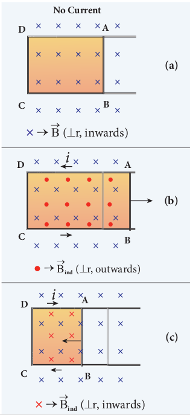

  

with its plane perpendicular to the field. The arm _AB_ is movable so that it can slide towards right or left.

If the arm AB slides to our right side, the number of field lines (magnetic flux) passing through the frame _ABCD_ increases and a current is induced. As suggested by Lenz’s law, the induced current opposes this flux increase and it tries to reduce it by producing **another magnetic field pointing outwards i.e., opposite to the existing magnetic field.**

The magnetic lines of this induced field are represented by red-colored circles in the Figure 4.6(b). From the direction of the magnetic field thus produced, the direction of the induced current is found to be anti-clockwise by using right-hand thumb rule.

The leftward motion of arm _AB_ decreases magnetic flux. The induced current, this time, produces **a magnetic field in the inward direction** (**red-colored crosses) i.e., in the direction of the existing magnetic field** (Figure 4.6(c)). Therefore, the flux decrease is opposed by the flow of induced current. From this, it is found that induced current flows in clockwise direction.

**Illustration 2** Let us move a bar magnet towards

the solenoid, with its north pole pointing the solenoid (Figure 4.7(b)). This motion increases the magnetic flux of the coil which in turn, induces an electric current. Due to the flow of induced current, the coil becomes a magnetic dipole whose two magnetic poles are on either end of the coil.

In this case, the cause producing the induced current is the movement of the magnet. According to Lenz’s law, the induced  

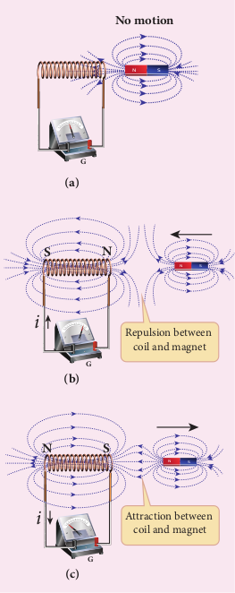

**No motion**

**(b)**

N S

N S

**G**

**(c)**

N

**G**

**(a)**

**G**

S

**N**

**N**

**S**

**S**

_i_

_i_

Repulsion between coil and magnet

Attraction between coil and magnet

current should flow in such a way that it opposes the movement of the north pole towards coil. It is possible if the end nearer to the magnet becomes north pole (Figure 4.7(b)). Then it repels the north pole of the

  

bar magnet and opposes the movement of the magnet. Once pole ends are known, the direction of the induced current could be found by using right hand thumb rule.

When the bar magnet is withdrawn, the nearer end becomes south pole which attracts north pole of the bar magnet, opposing the receding motion of the magnet (Figure 4.7(c)).

Thus the direction of the induced current can be found from Lenz’s law.

**Conservation of energy** The truth of Lenz’s law can be established

on the basis of the law of conservation of energy. The explanation is as follows: According to Lenz’s law, when a magnet is moved either towards or away from a coil, the induced current produced opposes its motion. As a result, there will always be a resisting force on the moving magnet. Work has to be done by some external agency to move the magnet against this resisting force. Here the mechanical energy of the moving magnet is converted into the electrical energy which in turn, gets converted into Joule heat in the coil i.e., energy is converted from one form to another.

On the contrary to Lenz’s law, let us assume that the induced current _helps_ the cause responsible for its production. Now when we push the magnet little bit towards the coil, the induced current helps the movement of the magnet towards the coil. Then the magnet starts moving towards the coil without any expense of energy. This, then, becomes a perpetual motion machine. In practice, no such machine is possible. Therefore, the assumption that the induced current _helps_ the cause is wrong. Thus Lenz's law is an excellent example of conservation of energy.  

### Fleming’s right hand rule

When a conductor moves in a magnetic field, the direction of motion of the conductor, the field and the induced current are given by Fleming’s right hand rule and is as follows:

**Direction of motion of the conductor**

**Direction of eld**

**Direction of Current**

**N**

**N S**

**S**

**Current**

**The thumb, index finger and middle finger of right hand are stretched out in mutually perpendicular directions (as shown in Figure 4.8). If the index finger points the direction of the magnetic field and the thumb indicates the direction of motion of the conductor, then the middle finger will indicate the direction of the induced current.**

Fleming’s right hand rule is also known as generator rule.

**EXAMPLE 4.6**

If the current _i_ flowing in the straight conducting wire as shown in the figure decreases, find out the direction of induced current in the metallic square loop placed near it.

  

**Demonstration of Lenz’s law** Take a narrow copper pipe and a

strongly magnetized button magnet as shown in figure. Keep the copper pipe vertical and drop the magnet into the pipe. Watch the motion of the magnet and note that magnet has become slower than its free fall. The reason is that an electric current generated by a moving magnet will always _oppose_ the original motion of the magnet that produced the current.

**Activity**

_i_

**_Solution_** From right hand rule, the magnetic field by the straight wire is directed into the plane of the square loop perpendicularly and its magnetic flux is decreasing. The decrease in flux is opposed by the current induced in the loop by producing a magnetic field in the same direction as the magnetic field of the wire. Again from right hand rule, for this inward magnetic field, the direction of the induced current in the loop is clockwise.

ε  

**EXAMPLE 4.7**

The magnetic flux passes perpendicular to the plane of the circuit and is directed into the paper. If the magnetic flux varies with respect to time as per the following relation: Φ_B t t t_\= + + +( )2 3 8 53 2 mWb , what is the magnitude of the induced emf in the loop when _t_ = 3 s? Find out the direction of current through the circuit.

   

   

















   

_R_

**_Solution_** Φ_B t t t_\= + + +( )2 3 8 53 2 mWb; _N_ =1; _t_ = 3 s

(i) ε= ( )

\= + + +( )× −_d N dt_

_d dt_

_t t tB_Φ 2 3 8 5 103 2 3

\= ( )

\= + + +( )× −_d N dt_

_d dt_

_t t tB_Φ 2 3 8 5 103 2 3

     6 6 8 10

2 3_t t_

At t = 3 s,

ε= ×( )+ ×( )+ 

 ×

−6 9 6 3 8 10 3

\= × −80 10 3 V = 80mV

(ii) As time passes, the magnetic flux linked with the loop increases. According to Lenz’s law, the direction of the induced current should be in a way so as to oppose the flux increase. So, the induced current flows in such a way to produce a magnetic field opposite to the given field. This magnetic field is perpendicularly outwards. Therefore, the induced current flows in anti- clockwise direction.

| (i)ε ==+At t = 3 s, ε =×=× |
|------|

| EXAMPLE 4 . 7The  magnetic  flux  passes  perpendicular to t he p lane o f t he cir cuit a nd i s dir ected into t he p aper. I f t he m agnetic f lux va ries with r espect t o t ime a s p er t he f ollowing relation:  () , w hat is the magΦnit =+ude 23tt of the  ++in85dt uced  mWemf b in the loop when t = 3 s? Find out the direction of current through t32he circuit.B            Solution() ; N =1; t = 3 sRΦ(i)=+23tt () ++85t ()mWbdN Φ dε =32 23tt ++85t ×10B ()dt dtd=+ 23tt B ++85t 32 ×10 −dt66tt  81 0At t = 3 s, 32 −3() ()23 ε =× 69 +×63 + 81 × 0 = 80 mV=×80 10 V −3(ii) As time passes, the magnetic flux linked with t he lo op in creases. A ccording −3to L enz’s l aw, t he dir ection o f t he induced c urrent s hould b e in a wa y s o as t o o ppose t he f lux in crease. S o, t he induced c urrent f lows in s uch a wa y to produce a m agnetic f ield o pposite t o the g iven f ield. Thi s m agnetic f ield i s perpendicularly o utwards. Th erefore, the in duced c urrent f lows in a nti-clockwise direction. |
|------|

  

### Motional emf from Lorentz force

Consider a straight conducting rod _AB_ of length _l_ in a uniform magnetic field 

_B_ which is directed perpendicularly into the plane of the paper as shown in Figure 4.9(a). The length of the rod is normal to the magnetic field. Let the rod move with a constant velocity _v_



towards right side. When the rod moves, the free electrons

present in it also move with same velocity _v_ 

in 

B. As a result, the Lorentz force acts on free electrons in the direction from B to A and is given by the relation

_F e BB_

   =− ×( )_v_ (4.4)

The action of this Lorentz force is to accumulate the free electrons at the end _A_. This accumulation of free electrons produces a potential difference across the rod which in turn establishes an electric field 

E directed along _BA_ (Figure 4.9(b)). Due to the electric field



_E_, the coulomb force starts acting on the free electrons along _AB_ and is given by

_F eEE_

    (4.5)

The magnitude of the electric field 

E keeps on increasing as long as accumulation of electrons at the end _A_ continues. The force _FE_ also increases until equilibrium is reached. At equilibrium, the magnetic Lorentz force



_FB_ and the coulomb force 

_FE_ balance each other and no further accumulation of free electrons at the end _A_ takes place. i.e.,

 

_F FB E_\=  

  _e B eE_ =( )_v_   

_vB E_sin 90

_vB E_\= (4.6)

The potential difference between two ends of the rod is

_V El_\=

_V Bl_\=_v_

Thus the Lorentz force on the free electrons is responsible to maintain this potential difference and hence produces an emf

ε = _Blv_ (4.7)

As this emf is produced due to the movement of the rod, it is often called as **motional emf**. If the ends A and B are connected by an external circuit of total

resistance _R_, then current _i R_

_Bl R_

\= = ε _v_ flows

in it. The direction of the current is found from right-hand thumb rule.

**× × × × × ×**

**× × × × × ×**

**× × × × × ×**

**× × × × × ×**

**× × × × × ×**

**× × × × × × × × × × × ×**

**× × × × × ×**

**B**

**A**

(r, inwards) 

 **_l_**

_v v_ ε

**+**

**\_**

**B**

**A**

**(a) (b)**

**E**

|------|
| ε |
  

**EXAMPLE 4.8**

A conducting rod of length 0.5 m falls freely from the top of a building of height 7.2 m at a place in Chennai where the horizontal component of Earth’s magnetic field is 4.04 × 10–5 T. If the length of the rod is perpendicular to Earth’s horizontal magnetic field, find the emf induced across the conductor when the rod is about to touch the ground. (Assume that the rod falls down with constant acceleration of 10 m s–2) **_Solution_** _l_ = 0.5 m; _h_ = 7.2 m; _u_ = 0 m s–1; _g_ = 10 m s–2; _BH_ = 4.04 × 10–5 T

The final velocity of the rod is

_v_ 2 2 2= +_u gh_ \= + × ×( )0 2 10 7 2. =144 _v_ \= −12 1ms

The magnitude of the induced emf when the rod is about to touch the ground is ε = _B lH v_ \= 4.04 × 10–5 × 0.5 × 12

\= 242 4. µV

**EXAMPLE 4.9**

A copper rod of length _l_ rotates about one of its ends with an angular velocity ω in a magnetic field _B_ as shown in the figure. The plane of rotation is perpendicular to the field. Find the emf induced between the two ends of the rod.

 B

**_x dx_**

**O**

**ω** _v_

_l_

**× × × × × ×**

**× × × × × ×**

**× × × × × ×**

**× × × × ×**

**× × × ×**

**× × × × × ×**

**× × × × × ×**

**× × × × × ×**  

**_Solution_** Consider a small element of length d_x_ at a distance _x_ from the centre of the circle described by the rod. As this element moves perpendicular to the field with a linear velocity _v_ \= _x_ω , the emf developed in the element d_x_ is

_d B dx_ε = _v_ \= _B x dx_( )ω

This rod is made up of many such elements, moving perpendicular to the field. The emf developed across two ends is

ε ε ω= =∫∫ _d B xdx l_

0

\= 

   

  _B x l_

ω 2

0 2

ε ω= 1 2

2_B l_

## EDDY CURRENTS

According to Faraday’s law of electromagnetic induction, an emf is induced in a conductor when the magnetic flux passing through it changes. However, the conductor need not be in the form of a wire or coil.

s

s

**Alternating magnetic**

**eld**

**Eddy currents**

**Metal plate**

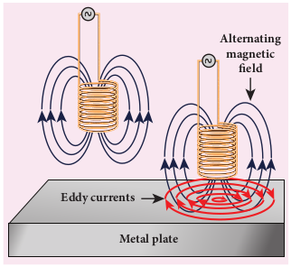

| ∫εε== dB |∫ x ωxdx = Bω   2 l 2 l |
|------|------|------|

| 1εω= Bl2 | 0 02 |

| A co nducting r od o f len gth 0.5 m fa llsfreely f rom t he t op o f a b uilding o f h eight7.2 m a t a p lace in C hennai w here t hehorizontal co mponent o f E arth’s m agneticfield i s 4.04 × 10  T . I f t he len gth o f t herod i s p erpendicular t o E arth’s h orizontalmagnetic field, find the emf induced acrossthe  conductor  wh –5en  the  rod  is  about t otouch the ground. (Assume that the rod fallsdown with constant acceleration of 10 m s )Solutionl = 0.5 m; h = 7.2 m; u = 0 m s ; g = 10 m s ; B  = 4.04  ×  10 T –2The final velocity of the rod is() –1v =+ug 2–2 h =+02 ××10 –5 72. = 144Hv = 12 msThe m agnitude o f t he in duced emf w hen 22the rod is about to touch the ground is −1= 4.04 × 10 ×  0.5 × 12ε = Bl v= 242.4 µV–5 H |
|------|

| Ed dy currents |
|------|
| Metal plate |
  

Even for a conductor in the form of a sheet or plate, an emf is induced when magnetic flux linked with it changes. But the difference is that there is no definite loop or path for induced current to flow away. As a result, the induced currents flow in concentric circular paths (Figure 4.10). As these electric currents resemble eddies of water, these are known as **Eddy currents**. They are also called **Foucault currents**.

**Demonstration** Here is a simple demonstration

for the production of eddy currents. Consider a pendulum that can be made to oscillate between the poles of a powerful electromagnet (Figure 4.11(a)).

First the electromagnet is switched off, the pendulum is slightly displaced and released. It begins to oscillate and it executes a large number of oscillations before stopping. The air friction is the only damping force.

When the electromagnet is switched on and the disc of the pendulum is made to oscillate, eddy currents are produced in it which will

**(a) (b)**

**S**

oppose the oscillation. A heavy damping force of eddy currents will bring the pendulum to rest within a few oscillations (Figure 4.11(b)).

However if some slots are cut in the disc (Figure 4.11(c)), the eddy currents are reduced. The pendulum now will execute several oscillations before coming to rest. This clearly demonstrates the production of eddy current in the disc of the pendulum.

**Drawbacks of Eddy currents** When eddy currents flow in the

conductor, a large amount of energy is dissipated in the form of heat. The energy loss due to the flow of eddy current is inevitable but it can be reduced to a greater extent with suitable measures.

The design of transformer core and electric motor armature is crucial in order to minimise the eddy current loss. To reduce these losses, the core of the transformer is made up of thin laminas insulated from one another (Figure 4.12 (a)) while for electric motor the winding is made up of a group

**(c)**

**N S**

  

**Laminated Core**

**Single Lamination**

**Figure 4.12 (a)** Insulated laminas of the core of a transformer

**Figure 4.12 (b)** Insulated winding of an electric motor

Insulated wire

of wires insulated from one another (Figure 4.12 (b)). The insulation used does not allow huge eddy currents to flow and hence losses are minimized.

**Example** A spherical stone and a spherical

metallic ball of same size and mass are dropped from the same height. Which one, a stone or a metal ball, will reach the Earth’s surface first? Justify your answer. Assume that there is no air friction. **Answer**

The stone will reach the Earth’s surface earlier than the metal ball. The reason is that when the metal ball falls through the magnetic field of Earth, the eddy currents are produced in it which opposes its motion. But in the case of stone, no eddy currents are produced and it falls freely.  

N S N S

Slow damping Rapid damping

**Glass Metal**

Make a pendulum with a strong magnet suspended at the lower end of the suspension wire as shown in the first figure. Make it oscillate with a glass plate below it and note the time it takes to come to rest.

Next just place a metallic plate below the oscillating magnet as shown in the second figure and again note the time it takes to stop.

In the second case, the magnet stops soon because eddy currents are produced in the plate which opposes the oscillation of the magnet.

**Activity**

**Application of eddy currents** Though the production of eddy current

is undesirable in some cases, it is useful in some other cases. A few of them are i. Induction stove ii. Eddy current brake iii. Eddy current testing iv. Electromagnetic damping

**i. Induction stove** Induction stove is used to cook the

food quickly and safely with less energy consumption. Below the cooking zone, there is a tightly wound coil of insulated wire. The cooking pan made of suitable material, is placed over the cooking zone. When the stove is switched on, an alternating current flowing in the coil produces high frequency alternating magnetic field which induces very strong eddy

| N |S |

| N |S |

| Glass |

| Metal |
  

currents in the cooking pan. The eddy currents in the pan produce so much of heat due to Joule heating which is used to cook the food (Figure 4.13).

**Note:** The frequency of the domestic AC supply is increased from 50–60 Hz to around 20–40 KHz before giving it to the coil in order to produce high frequency alternating magnetic field.

**ii. Eddy current brake** This eddy current braking system is

generally used in high speed trains and roller coasters. Strong electromagnets are fixed just above the rails. To stop the train, electromagnets are switched on. The magnetic field of these magnets induces eddy currents in the rails which oppose or resist the movement of the train. This is Eddy current linear brake (Figure 4.14(a)).

In some cases, the circular disc, connected to the wheel of the train through a common shaft, is made to rotate in between the poles of an electromagnet. When there is a relative motion between the disc and the magnet, eddy currents are induced in the disc which stop the train. This is Eddy current circular brake (Figure 4.14(b))

**Coil**

**Cooking Zone**

**Cooking Pan**

**High frequency Alternating magnetic eld**

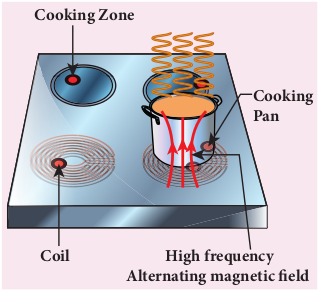

**N**

**_v_**

**CB**

**Figure 4.14(a)** Linear Eddy current brake

**S**

**D**

**N**

**Figure 4.14(b)** Circular Eddy current brake

**iii. Eddy current testing** It is one of the simple non–destructive

testing methods to find defects like surface cracks, air bubbles present in a specimen. A coil of insulated wire is given an alternating electric current so that it produces an alternating magnetic field. When this coil is brought near the test surface, eddy current is induced in the test surface. The presence

|------|------|

|------|------|------|

| N |

| S |

  

**Coil’s magnetic eld**

**Eddy current’s magnetic eld**

**Conductive material**

**Coil**

**Eddy currents**

of defects causes the change in phase and amplitude of the eddy current that can be detected by some other means.In this way, the defects present in the specimen are identified (Figure 4.15). **iv. Electro magnetic damping**

The armature of the galvanometer coil is wound on a soft iron cylinder. Once the armature is deflected, the relative motion between the soft iron cylinder and the radial magnetic field induces eddy current in the cylinder (Figure 4.16). The damping force due to the flow of eddy current brings

**N S**

**So iron cylinder**

**Eddy currents**  

the armature to rest immediately and then galvanometer shows a steady deflection. This is called electromagnetic damping.

## SELF–INDUCTION

### Introduction

Inductor is a device used to store energy in a magnetic field when an electric current flows through it. The typical examples are coils, solenoids and toroids shown in Figure 4.17.

Inductance is the property of inductors to generate emf due to the change in current flowing through that circuit (self- induction) or a change in current through a neighbouring circuit with which it is magnetically linked (mutual induction). We will study about self-induction and mutual induction in the next sections.

Coil

Solenoid

Toroid

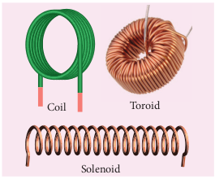

**Self-induction** An electric current flowing through a

coil will set up a magnetic field around it. Therefore, the magnetic flux of the magnetic field is linked with that coil itself. If this flux

| Ed dy |
|------|------|------|------|------|
| currents |

  

is changed by changing the current, an emf is induced in that same coil (Figure 4.18). This phenomenon is known as **self-induction**. The emf induced is called self-induced emf.

_i_

B →

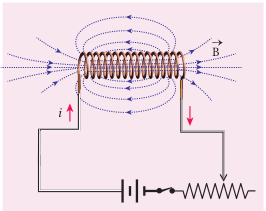

Let Φ_B_ be the magnetic flux linked with each turn of the coil of N turns, then the total flux linked with the coil _N B_Φ (flux linkage) is proportional to the current _i_ in the coil.

_N iB_Φ µ

_N LiB_Φ = (4.8)

(or) _L N i_

_B_\= Φ

The constant of proportionality _L_ is called self-inductance or coefficient of self- induction of the coil.

If _i_ \=1A , then _L N B_\= Φ . **Self-inductance or simply inductance of a coil is defined as the flux linkage with the coil when 1A current flows through it.**

When the current _i_ changes with time, an emf is induced in it. From Faraday’s law of electromagnetic induction, this self- induced emf in the coil is given by

=−

\=− ( )

_d N dt_

_d Li dt_

_B_( )

(using equation 4.8)  

∴ =−ε _L di dt_

(4.9)

(or) _L di_

_dt_ \= −ε

The negative sign in the above equation implies that the self-induced emf always opposes the change in current with respect to time. If _di_

_dt_ \= −1 1 As , then _L_\=−ε .

**Inductance of a coil is also defined as the opposing emf induced in the coil when the rate of change of current through the coil is 1 A s−1.**

**Unit of inductance** Inductance is a scalar and its unit is

Wb A-1 or Vs A-1 . It is also measured in henry (H).

1 1 11 1 H W b A Vs A= =− −

The dimensional formula of inductance is _M L T A_ 2 2 2- - .

If _i_ = 1 A and _N B_Φ =1 Wb turns, then _L_ \=1H .

Therefore, **the inductance of the coil is said to be one henry if a current of 1 _A_ produces unit flux linkage in the coil.**

If _di dt_ \=

−1 1As and ε=−1 V , then _L_ \=1H.

Therefore, **the inductance of the coil is one henry if a current changing at the rate of 1 A s−1 induces an opposing emf of 1 V in it.**

**Physical significance of inductance** We have learnt about inertia in XI

standard. In translational motion, mass is a measure of linear inertia; in the same way, for rotational motion, moment of inertia is a measure of rotational inertia (Refer sections 3.2.1 and 5.4 of XI physics text book). Generally, inertia means opposition to change its state.

  

_i_

ε(a)

**Increasing current**

_i_

ε(b)

**Decreasing current**

The inductance plays the same role in a circuit as mass and moment of inertia play in mechanical motion. When a circuit is switched on, the increasing current induces an emf which opposes the growth of current in a circuit (Figure 4.19(a)). Likewise, when circuit is broken, the decreasing current induces an emf in the reverse direction. This emf now opposes the decay of current (Figure 4.19(b)).

Thus, inductance of the coil opposes any change in current and tries to maintain the original state.

### Self-inductance of a long solenoid

Consider a long solenoid of length _l_ and cross-sectional area _A_. Let _n_ be the number of turns per unit length (or turn density) of the solenoid. When an electric current _i_ is passed through the solenoid, a magnetic  

field produced inside is almost uniform and is directed along the axis of the solenoid as shown in Figure 4.20. The magnetic field at any point inside the solenoid is given by (Refer section 3.9.3)

_B ni_\= µ 

As this magnetic field passes through the solenoid, the windings of the solenoid are linked by the field lines. The magnetic flux passing through each turn is

Φ_B A_

_B dA BA BA_\= = =∫ . cos  

θ

**\=** _BA_ since _θ_ = 0° = ( )µ0_ni A_

The total magnetic flux linked or flux linkage of the solenoid with _N_ turns (the total number of turns _N_ is given by _N_ = _n_ _l_) is

_N nl niB_Φ = ( )( )Aµ0

_N n Al iB_Φ = ( )µ 

2

We know that

_N LiB_Φ =

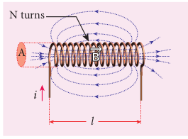

_i_

A

_l_

B→

N turns

  

Comparing the above equations, we get

_L n Al_\= µ 

2 (4.10)

From the above equation, it is clear that inductance depends on the geometry of the solenoid (turn density _n_, cross-sectional area _A_, length _l_) and the medium present inside the solenoid. If the solenoid is filled with a dielectric medium of relative permeability µ_r_ , then

_L n Al or_\= µ 2 _L n Alr_\= µ µ 

2

**Energy stored in an inductor** Whenever a current is established in the

circuit, the inductance opposes the growth of the current. In order to establish a current in the circuit, work is done against this opposition by some external agency. This work done is stored as magnetic potential energy.

Let us assume that electrical resistance of the inductor is negligible and inductor effect alone is considered. The induced emf ε at any instant _t_ is

ε=−_L di dt_

Let _dW_ be work done in moving a charge _dq_ in a time _dt_ against the opposition, then

_dW dq_\=−ε

\=−ε_idt_  _dq idt_\=

Substituting for ε from equation (4.16),

\=− − 

 



 _L di_

_dt idt_

_dW Lidi_\=

Total work done in establishing the current _i_ is  

_W dW Lidi i_

\= = ∫∫ 0

\= 

   

  _L i_

_o_

_i_2

2 _W Li_\=

1 2

2

This work done is stored as magnetic potential energy.

∴ =_U LiB_ 1 2

2 (4.11)

The energy density is the energy stored per unit volume of the space and is given by

_u U AlB_

_B_\=  _u U AlB_

_B_\= Volume of the solenoid = _Al_

_u Li Al_

_n Al i_

_Al L n AlB_ \= =

( ) =

2 0

2 2

0 2

2 2

µ µ

\= µ0 2 2

2 _n i_

_u B B niB_ \= = 2

0 02µ

µ _u B B niB_ \= = 2

0 02µ

µ

**EXAMPLE 4.10**

A solenoid of 500 turns is wound on an iron core of relative permeability 800. The length and radius of the solenoid are 40 cm and 3 cm respectively. Calculate the average emf induced in the solenoid if the current in it changes from 0 to 3 A in 0.4 second. **_Solution_**

_N_ = 500 turns; µ_r_ \= 800 ; _l_ = 40 cm = 0.4 m; _r_ = 3 cm = 0.03 m; _di_ = 3 – 0 = 3 A; _dt_ = 0.4 s

Self inductance,

_L n Al A r n N lr_\= = = =



 



 µ µ µ µ π2 2∵  ; ;

\= µ µ π  _rN r_

_l_

2 2

\= × × × × × × ×( )− −4 3 14 10 800 500 3 14 3 10

0 4

7 2 2 2 . .

. _L_ = 1.77 H

  

Induced emf ε=−_L di dt_

\=− ×1 77 3 0 4

. .

ε=−13 275. V

**EXAMPLE 4.11**

The self-inductance of an air-core solenoid is 4.8 mH. If its core is replaced by iron core, then its self-inductance becomes 1.8 H. Find out the relative permeability of iron. **_Solution_**

_Lair_ \= × −4 8 10 3. H

_Liron_ \=1 8. H

_L n Alair_ \= = × −µ 

2 34 8 10. H

_L n Al n Aliron r_\= = =µ µ µ2 2 1 8 

. H

∴ = = × −µ_r_

_iron_

_air_

_L L_

1 8 4 8 10 3

. .

\= 375

### Mutual induction

When an electric current passing through a coil changes with time, an emf is induced in the neighbouring coil. This phenomenon is known as **mutual induction** and the emf induced is called mutually induced emf.

Consider two coils which are placed close to each other. If an electric current _i_1 is sent through coil 1, the magnetic field produced by it is also linked with coil 2 as shown in Figure 4.21(a).

If Φ21 is the magnetic flux linked with each turn of the coil 2 of _N_2 turns due to the current in coil 1, then the total flux linked with coil 2 ( )_N_2 21Φ is proportional to the current _i_1 in the coil 1.  

_i_1

Coil 1 Coil 2

N2turns

N2turns

N1turns

N1turns

ε2

(a)

_i_2

Coil 1 Coil 2

Φ12 ε1

(b)

Φ21

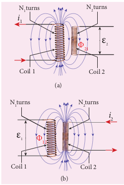

_N i_2 21 1Φ µ

_N M i_2 21 21 1Φ = (4.12)

(or) _M N i_21

2 21

1

\= Φ

The constant of proportionality _M_21

is the mutual inductance or coefficient of mutual induction of the coil 2 with respect to coil 1.

If _i A_1 1= , then _M N_21 2 21 = Φ . Therefore, **the** **mutual inductance _M_21 is defined as the flux linkage with the coil 2 when 1A current flows through coil 1.**

When the current _i_1 changes with time, an emf ε2 is induced in coil 2. From Faraday’s law of electromagnetic induction, this mutually induced emf ε2 is given by

ε2 2 21 21 1=−

( ) =−

_d N dt_

_d M i dt_

Φ ( )

| Induced emf  diε =− Ldt17. 73×=−04.ε =− 13.V275 |

|------|

| 21 |

|------|------|
| Φ12 |

  

ε2 21 1=−_M di_

_dt_

(or) _M di_

_dt_ 21

2

1 = −ε

The negative sign in the above equation shows that the mutually induced emf always opposes the change in current _i_1 with respect

to time. If _di dt_

1 11= −A s , then _M_21 2=−ε . **Mutual inductance _M_21 is also defined as the opposing emf induced in the coil 2 when the rate of change of current through the coil 1 is 1As–1.**

Similarly, if an electric current _i_2 through coil 2 changes with time, then emf ε1 is induced in coil 1. Therefore,

_M N i_12

1 12

2

\= Φ and _M_

_di dt_

12 1

2 = −ε

where _M_12 is the mutual inductance of the coil 1 with respect to coil 2. It can be shown that for a given pair of coils, the mutual inductance is same. i.e.,

_M M M_21 12= =

In general, the mutual induction between two coils depends on size, shape, the number of turns of the coils, their relative orientation and permeability of the medium.

**Unit of mutual-inductance** The unit of mutual inductance is also

henry (H).

If _i_1 1= A and _N_2 21 1Φ = Wb turns, then _M_ \=1H .

Therefore, **the mutual inductance between two neighbouring coils is said to be one henry if a current of 1A in one coil produces unit flux linkage in neighbouring coil.**  

If _di dt_

1 11= −As and ε2 1=− V , then

_M_ \=1H.

Therefore, **the mutual inductance between two neighbouring coils is one henry if a current changing at the rate of 1A s–1 in one coil induces an opposing emf of 1V in neighbouring coil.**

### Mutual inductance between two long co-axial solenoids

Consider two long co-axial solenoids of same length _l_. The length of these solenoids is large when compared to their radii so that the magnetic field produced inside the solenoids is uniform and the fringing effect at the ends may be ignored. Let _A_1 and _A_2 be the area of cross section of the solenoids with _A_1 being greater than _A_2 as shown in Figure 4.22. The turn density of these solenoids are _n_1 and _n_2 respectively.

A1 A2

_l_

Common axis

Solenoid 2 of N2 turns

Solenoid 1 of N1 turns

Let _i_1 be the current flowing through solenoid 1, then the magnetic field produced inside it is

_B n i_1 1 1= µ 

  

As the field lines of _B_1

 are passing through

the area bounded by solenoid 2, the magnetic flux is linked with each turn of solenoid 2 due to current in solenoid 1 and is given by

Φ21 1 1 2

2

\= =∫ _B A B A A_

  ._d_ since θ= °0

\=( )µ 

_n i A_1 1 2

The flux linkage with solenoid 2 with total turns _N_2 is

_N n l n i A_2 21 2 1 1 2Φ = ( )( ) µ 

since _N n l_2 2=

_N n n A l i_2 21 1 2 2 1Φ = ( )µ 

We know that _N M i_2 21 21 1Φ = . Comparing the above equations, we get

_M n n A l_21 1 2 2= µ 

(4.13)

This gives the expression for mutual inductance _M_21 of the solenoid 2 with respect to solenoid 1. Similarly, we can find mutual inductance _M_12 of solenoid 1 with respect to solenoid 2 as given below.

The magnetic field produced by the solenoid 2 when carrying a current _i_2 is

_B n i_2 2 2= µ 

This magnetic field _B_2 is uniform inside the solenoid 2 but outside the solenoid 2, it is almost zero. Therefore for solenoid 1, the area _A_2 is the effective area over which the magnetic field _B_2 is present; not area _A_1\. Then the magnetic flux Φ12 linked with each turn of solenoid 1 due to current in solenoid 2 is

Φ12 2 2 2 2 2 2

2

\= ⋅ = =( )∫ _B dA B A n i A A_

  µ

The flux linkage of solenoid 1 with total turns _N_1 is

_N n l n i Ao_1 12 1 2 2 2Φ =( )( )µ since _N n l_1 1=  

_N n n A l io_1 12 1 2 2 2Φ = ( )µ

We know that _N M i_1 12 12 2Φ = . Comparing the above equations, we get

∴ =_M n n A l_12 1 2 2µ 

(4.14)

From equation (4.22) and (4.23), we can write

_M M M_12 21= = (4.15)

In general, the mutual inductance between two long co-axial solenoids is given by

_M n n A l_\= µ  1 2 2 (4.16)

If a dielectric medium of relative permeability µ_r_ is present inside the solenoids, then

_M n n A l_\= µ 1 2 2 (or) _M n n A lr_\= µ µ

 1 2 2

**EXAMPLE 4.12**

The current flowing in the first coil changes from 2 A to 10 A in 0.4 s. Find the mutual inductance between two coils if an emf of 60 mV is induced in the second coil. Also determine the magnitude of induced emf in the second coil if the current in the first coil is changed from 4 A to 16 A in 0.03 s. Consider only the magnitude of induced emf.

**_Solution_** Case (i): _di_1 = 10 – 2 = 8 A; _dt_ = 0.4 s; ε2

360 10= × − V

Case (ii): _di_1 = 16 – 4 = 12 A; _dt_ = 0.03 s

(i) Mutual inductance between the coils.

_M di_

_dt_

\= ε2

1 _M_ \= × ×−60 10 0 4

8

3 .

_M_ \= × −3 10 3 H

  

(ii) Induced emf in the second coil due to the rate of change of current in the first coil is

ε2 1= _M_

_di dt_

\= × ×−3 10 12 0 03

3

. ε2 1 2= . V

**EXAMPLE 4.13**

Consider two coplanar, co-axial circular coils _A_ and _B_ as shown in figure. The radius of coil _A_ is 20 cm while that of coil _B_ is 2 cm. The number of turns in coils _A_ and _B_ are 200 and 1000 respectively. Calculate the mutual inductance between the coils. If the current in coil _A_ changes from 2 A to 6 A in 0.04 s, determine the induced emf in coil _B_ and the rate of change of flux through the coil _B_ at that instant.

**2 cm**

**20 cm**

**A(200 turns) B(1000 turns)**

**Common axis**

**_Solution_** _N_A = 200 turns; _N_B = 1000 turns; _r_A = 20 × 10–2 m; _r_B = 2 × 10–2 m; _dt_ = 0.04 s; _diA_ = 6**−**2 = 4 A

Let _i_A be the current flowing in coil _A_, then the magnetic field _B_A at the centre of the circular coil _A_ is

_B N i r_

_N i rA_

_A A_

_A_

_A A_

_A_

\= = × −µ π



2 4 10

2

7

\= × × × ×

× −

−

10 2 3 14 200 20 10

7

2

. _iA_

\= × − −6 28 10 4 2. _iA_ Wbm  

The magnetic flux linkage with coil _B_ is

_N N B AB B B A B_Φ =

\= × × × × × ×( )− −1000 6 28 10 3 14 2 104 2 2 . ._iA_

\= × −7 89 10 4. _iA_ Wb turns

The mutual inductance between the coils

_M N_

_i B B_

_A_

\= = × −Φ 7 89 10 4. H

Induced emf in coil _B_ is

ε_B AM di_

_dt_ \=−

ε_B_ \= × × −−7 89 10 6 2

0 04

4\. ( ) .

(magnitude only)

ε_B_ \= 78 9. mV

The rate of change of magnetic flux of coil _B_ is _d N_

_dt B B_

_B_ ( )

. Φ = = −ε 78 9 1 m Wbs

## METHODS OF PRODUCING INDUCED EMF

### Introduction

Electromotive force is the characteristic of any energy source capable of driving electric charge around a circuit. We have already learnt that it is not actually a force. It is the work done in moving unit electric charge around the circuit. It is measured in J C–1 or volt.

Some examples of energy source which provide emf are electrochemical cells, thermoelectric devices, solar cells and electrical generators. Of these, electrical

| (ii) Induced emf in t he s econd co il d ue t o the rate of change of current in the first coil is di 31××01 2ε = M =dt 00. 3ε = 12.V−3122 |
|------|------|

| The magnetic flux linkage with coil B is()NNΦ = BA=×1000 62.. 81××03 i ××14 21× 0BB BA B=×78. 91 0 i Wb turnsThe m utual in −−d42uctance b etween t 2he Acoils−4AN ΦM == 78.H91× 0iInduced emf in coil B isBB −4diε =− MAdt78.( 91××06 −2)  (magnitude only)ε =00. 4ABε = 78.m9 V −4The rate of change of magnetic flux of coil BB isBdN() Φ==ε 78.9  m Wb sdtBB −1B |
|------|

  

generators are most powerful machines. They are used for large scale power generation.

According to Faraday’s law of electromagnetic induction, an emf is induced in a circuit when magnetic flux linked with it changes. This emf is called induced emf. The magnitude of the induced emf is given by

ε = _d dt_

_orB_Φ

ε θ= _d dt_

_BA_( cos ) (4.17)

From the above equation, it is clear that induced emf can be produced by changing magnetic flux in any of the following ways. (i) By changing the magnetic field _B_ (ii) By changing the area _A_ of the coil

and (iii) By changing the relative orientation

θ of the coil with magnetic field

### Production of induced emf by changing the magnetic field

From Faraday’s experiments on electromagnetic induction, it was discovered that an emf is induced in a circuit by changing the magnetic flux of the field through it. The change in flux is brought about by (i) relative motion between the circuit and the magnet (First experiment) (ii) variation in current flowing through the nearby coil (Second experiment).

### Production of induced emf by changing the area of the coil

Consider a conducting rod of length _l_ moving with a velocity _υ_ towards left on a rectangular fixed metallic framework as shown in Figure 4.23. The whole  

arrangement is placed in a uniform magnetic field



_B_ whose magnetic lines are perpendicularly directed into the plane of the paper.

As the rod moves from _AB_ to _DC_ in a time _dt_, the area enclosed by the loop and hence the magnetic flux through the loop decreases.

A

B

_i_

C

D**× × × × ×**

**× × × × ×**

**× × × × ×**

**×**

**×**

**×**

**×**

**× × × × ×**

**× →** (r, inwards) 

_dt_

_l_

_v_

_v_

The change in magnetic flux in time _dt_ is

_d B dAB_Φ = × Change in area ( )

\= ×_B ABCD_ Area

Since Area = _ABCD l dt_( )_v_

_d Bl dtB_Φ = _v_ (or) _d dt_

_BlB_Φ = _v_

As a result of change in flux, an emf is generated in the loop. The magnitude of the induced emf is

ε = _d dt_

_B_Φ

ε = _Blv_ (4.18)

This emf is known as **motional emf** since it is produced due to the movement of the conductor in the magnetic field. The direction of induced current is found to be clockwise from Fleming’s right hand rule.

If _R_ is the resistance of the loop, then the induced current is given by

| dΦε =dtdεθ=dt |
|------|

  

_i R_

\= ε

_i Bl R_

\= _v_ (4.19)

**Energy conservation** The current-carrying movable rod AB

kept in the perpendicular magnetic field experiences a force



_FB_ in the outward direction, opposite to its motion. This force is given by







_F i l B i l B i l B_

_B_ \= × = =

sinθ since θ = 90°

In order to move the rod with a constant velocity _v_ , a constant force that is equal and opposite to the magnetic force, must be applied.

_F F i l Bapp B_

  = =

Therefore, mechanical work is done by the applied force to move the rod. The rate of doing work or power is

_P F F i l B_

_Bl R_

_l B_

_P B l R_

_app app_\= ⋅ =

\=

\= 

 



 

\=



_v v v v_

_v_

_v_

cosθ

2 2 2

Here θ= 0

(4.20)

When the induced current flows in the loop, Joule heating takes place. The rate at which thermal energy is dissipated in the loop or power dissipated is

_P i R_\= 2

_P Bl_

_R R_\=



 



 

_v_ 2

_P B l R_

\= 2 2 2_v_ (4.21)

This equation is exactly same as the equation (4.20). Thus the mechanical  

energy needed to move the rod is converted into electrical energy which then appears as thermal energy in the loop. This energy conversion is consistent with the law of conservation of energy.

**EXAMPLE 4.14**

A circular metal of area 0.03 m2 rotates in a uniform magnetic field of 0.4 T. The axis of rotation passes through the centre and perpendicular to its plane and is also parallel to the field. If the disc completes 20 revolutions in one second and the resistance of the disc is 4 Ω, calculate the induced emf between the axis and the rim and induced current flowing in the disc.

**_Solution_**

_A_ = 0.03 m2; _B_ = 0.4 T; _f_ = 20 rps; _R_ = 4 Ω Area swept out by the disc in unit time = Area of the disc × frequency _dA dt_

\= 0.03 × 20

\= 0.6 m2

The magnitude of the induced emf,

ε    _d dt_

_d BA dt_

_B dA dt_

_B_ ( )

ε= × =

0 4 0 6 1

0 24. . . V

Induced current, _i R_

\= = = ε 0 24

4 0 06. . A

Emf can be induced by changing relative orientation between the coil and the

magnetic field. This can be achieved either by rotating a coil in a magnetic field or by rotating a magnetic field within a stationary coil. Here rotating coil type is considered.

**Note**

| εi =RBlvi =R |
|------|

| PF=⋅=il B Bl= apBlP =22 |vvvv pa |
|------|------|
| R lBv2 |
| R |

| EXAMPLE 4 . 1 4A cir cular m etal o f a rea 0.03 m  r otates in a unif orm m agnetic f ield o f 0.4 T . Th e axis o f r otation p asses t hrough t he cen tre and p erpendicular t o i ts p lane a n2d i s a lso parallel t o t he f ield. I f t he di sc co mpletes 20 r evolutions in o ne s econd a nd t he resistance o f t he di sc i s 4 Ω, c alculate t he induced emf b etween t he axi s a nd t he r im and induced current flowing in the disc.SolutionA = 0.03 m ; B = 0.4 T; f = 20 rps;R = 4 ΩArea swept out by the disc in unit time 2= Area of the disc × frequencydA = 0.03 × 20dt= 0.6 mThe m agnitude o f t he in duced emf , ε  d  dB() A dA 2  Bdt dt dt04.. ×06ε = = 02.V41BInduced current, ε 02. 4i == = 00.A6R 4 |
|------|

| Pi= R BlP = 2BlP = |
|------|

  

### Production of induced emf by changing relative orientation of the coil with the magnetic field

Consider a rectangular coil of _N_ turns kept in a uniform magnetic field



_B_ as shown in Figure 4.24. The coil rotates in anti- clockwise direction with an angular velocity _ω_ about an axis, perpendicular to the field and to the plane of the paper.

At time _t_ = 0, the plane of the coil is perpendicular to the field and the flux linked with the coil has its maximum value Фm = _NBA_ (where _A_ is the area of the coil).

**t=** **t****t=**  

 

0



–m

m

m sin0 = 0

m = 0

m sin = m

 

**B →**

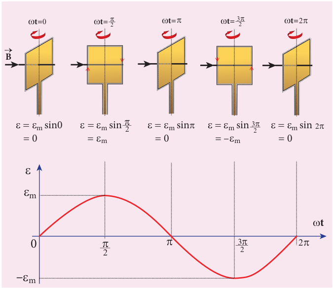

**t**

**\=** **t=**  

 

 **t=**



sin m sin = –m

 

m sin = 0



ction of ωt

**B →**





 cost

 sint

**Figure 4.24 The coil has rotated through** an angle θ ω= _t_

|------|------|------|
|  |

  

In a time _t_ seconds, the coil is rotated through an angle θ (= _ωt_) in anti–clockwise direction. In this position, the flux linked _NBAcosωt_ is due to the component of



_B_ normal to the plane of the coil. The component (_B sinωt_) parallel to the plane has no role in electromagnetic induction. Therefore, the flux linkage with the coil at this deflected position is

_N NBA NBAB_ = =cos cos t 

According to Faraday’s law, the emf induced at that instant is

 =− =− _d dt_

_N d dt_

_NBAB_( ) ( cos t)

\=− −( )_NBA t_sinω ω

\= _NBA t_ω ωsin

When the coil is rotated through 90o from initial position, sin _ωt_ = 1. Then the maximum value of induced emf is

 _m NBA_\=

Therefore, the value of induced emf at any instant is then given by

ε ε ω= _m t_sin (4.22)

It is seen that the induced emf varies as sine function of the time angle _ωt_. The graph between induced emf and time angle for one rotation of the coil will be a sine curve (Figure 4.25) and the emf varying in this manner is called **sinusoidal emf** or **alternating emf**.

If this alternating voltage is given to a closed circuit, a sinusoidally varying current flows in it. This current is called **alternating current** and is given by

_i I tm_\= sinω (4.23)

where _Im_ is the maximum value of induced current.  

**EXAMPLE 4.15**

A rectangular coil of area 70 cm2 having 600 turns rotates about an axis perpendicular to a magnetic field of 0.4 Wb m–2. If the coil completes 500 revolutions in a minute, calculate the instantaneous emf when the plane of the coil is (i) perpendicular to the field (ii) parallel to the field and (iii) inclined at 60o with the field.

**_Solution_**

_A_ = 70 ´ 10–4 m2; _N_ = 600 turns

_B_ = 0.4 Wbm–2; _f_ = 500 rpm

The instantaneous emf is

ε ε ω= _m t_sin

since ε ω π_m m N BA f_\= = ( )( )NΦ 2

ε π ω= × ×_NBA f t_2 sin

(i) When ω_t_ \= 0 ,

ε ε= =_m_ sin0 0

(ii) When ω_t_ \= 90 ,

ε ε= _m_ sin90 = × ×_NBA f_2 1π

\= × × × × × ×  

 

− 600 0 4 70 10 2

22

7

500

60

4 .

\= 88V

(iii) When ωt = 90° – 60° = 30°,

ε ε= = × =_m_ sin30 88 1 2

44 V

| EXAMPLE 4 . 1 5A r e c t angu l ar co i l o f a re a 70 cmhav in g 600  tur ns r ot ates a b out a n axi sp er p en dic u l ar t o a m ag net ic f ie ld o f0.4 Wb m . I f t he co i l co mplet es 500 2re volut io ns in a min ute, c a lc u l ate t hein st ant ane ous  emf w hen  t he  pl ane o ft he co i l i s (i) p–2 er p en dic u l ar t o t he f ie ld(ii) p ara l le l t o t he f ie ld a nd (iii) in clin e dat 60  w it h t he f ie ld .SolutionA = 70 o ´ 10 m ; N = 600 turns B = 0.4 Wbm ; f = 500 rpm The instantaneous emf is–4  2–2εε= sin ωt() ()since  εω ==N Φ NB Af 2πmεπ=×NBAf 2s × in ωtmm(i) When ωt = 0 ,εε== sin0 0(ii) Whenωt = 90 ,mεε= sin9 0 =×NBAf 21π ×22  500 =×600m 04.  ××70 10 ××2 7 ×  60 −4= 88 V(iii) When ωt = 90° – 60° = 30°,1εε== sin3 08 8×= 44 V2m |
|------|

  

## AC GENERATOR

### Introduction

AC generator or alternator is an energy conversion device. It converts mechanical energy used to rotate the coil or field magnet into electrical energy. Alternator produces a large scale electrical power for use in homes and industries. AC generator and its components are shown in Figure 4.26.

**Alternator**

**Brush box**

**Stator**

**Slip rings**

**Rotor**

### Principle

Alternators work on the principle of electromagnetic induction. The relative motion between a conductor and a magnetic field changes the magnetic flux linked with  

the conductor which in turn, induces an emf. The magnitude of the induced emf is given by Faraday’s law of electromagnetic induction and its direction by Fleming’s right hand rule.

Alternating emf is generated by rotating a coil in a magnetic field or by rotating

a magnetic field within a stationary coil. The first method is used for small AC generators while the second method is employed for large AC generators. The rotating-field method is the one which is mostly used in power stations.

**Note**

### Construction

Alternator consists of two major parts, namely stator and rotor. As their names suggest, stator is stationary while rotor rotates inside the stator. In any standard construction of commercial alternators, the armature winding is mounted on stator and the field magnet on rotor. **i) Stator**

The stationary part which has armature windings mounted in it is called stator. It has two components, namely stator core and armature winding.

Stator core or armature core is made up of iron or steel alloy. It is a hollow cylinder and is laminated to minimize eddy current loss. The slots are cut on inner surface of the core to accommodate armature windings.

Armature winding is the coil, wound on slots provided in the armature core (Figure 4.27).

**ii) Rotor**

Rotor contains magnetic field windings. The magnetic poles are magnetized by

  

DC source. The ends of field windings are connected to a pair of slip rings, attached to a common shaft about which rotor rotates. Slip rings rotate along with rotor. To maintain connection between the DC source and field windings, two brushes are used which continuously slide over the slip rings. The 2-pole rotor is shown in Figure 4.27.

We will discuss the construction and working of two examples, namely single phase and three phase AC generators in the following sections.

### Advantages of stationary armature-rotating field alternator

Alternators are generally high current and high voltage machines. The stationary armature-rotating field construction has many advantages. A few of them include: 1) The current is drawn directly from fixed

terminals on the stator without the use of brush contacts.

D.C. source

P & S - Armature conductors

**P**

**S**

**N**

**S**

**B**

Field winding

Brushes

Magnetic axis of the eld

Slip rings

Armature slot

Stator core  

2) The insulation of stationary armature winding is easier.

3) The number of sliding contacts (slip rings) is reduced. Moreover, the sliding contacts are used for low-voltage DC Source.

4) Armature windings can be constructed more rigidly to prevent deformation due to any mechanical stress.

### Single phase AC generator

In a single phase AC generator, the armature conductors are connected in series so as to form a single circuit which generates a single-phase alternating emf and hence it is called single-phase alternator.

In the simplified version of AC generator, a single-turn rectangular loop PQRS is mounted on the stator. The field winding is fixed inside the stator and it can be rotated about an axis, perpendicular to the plane of the paper.

The loop PQRS is stationary and is also perpendicular to the plane of the paper. When field windings are excited, magnetic field is produced around it. Let the field magnet be rotated in clockwise direction by some external means (Figure 4.28).

**Figure 4.28 The loop PQRS and field** magnet in its initial position

**N S**

**P**

**Q**

**S R**

**Initial position**

**B n**

**ω**

|------|

  

Assume that initial position of the field magnet is horizontal. At that instant, the direction of magnetic field is perpendicular to the plane of the loop PQRS. The induced emf is zero (Refer case (iii) of section 4.4). This is represented by origin O in the graph drawn between induced emf and time angle (Figure 4.29).

When field magnet rotates through 90°, magnetic field becomes parallel to PQRS. The induced emfs across PQ and RS would become maximum. Since they are connected in series, emfs are added up and the direction of total induced emf is given by Fleming’s right hand rule.

Care has to be taken while applying this rule; the thumb indicates the direction of the motion of the conductor with respect to field. For clockwise rotating poles, the conductor appears to be rotating anticlockwise. Hence, thumb should point to the left. The direction

**t=** **t=**  

0

A  m

–m

 

**B**

**B P**

**Q**

**R**

**S**

**P**

**Q**

**R**

**S**

**P**

**S**

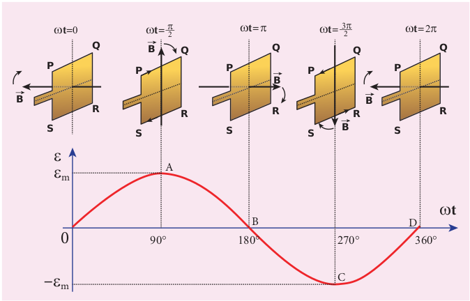

of the induced emf is at right angles to the plane of the paper. For PQ, it is inwards and for RS it is outwards. Therefore, the current flows along PQRS. The point A in the graph represents this maximum emf.

For the rotation of 180° from the initial position, the field is again perpendicular to PQRS and the induced emf becomes zero. This is represented by point B.

The field magnet becomes again parallel to PQRS for 270° rotation of field magnet. The induced emf is maximum but the direction is reversed. Thus the current flows along SRQP. This is represented by point C.

On completion of 360°, the induced emf becomes zero and is represented by the point D. From the graph, it is clear that emf induced in PQRS is alternating in nature. Therefore, when field magnet completes one rotation, induced emf in PQRS finishes one cycle.

**t**

**t=** **t=**   **t=**

B D

C

  

**B**

**B**

**B**

**Q**

**R**

**P**

**Q**

**R**

**S**

**P**

**Q**

**R**

**S**

spect to time angle

  

**Construction of AC gener**

Stator core

Slot

**F**

**S**

**N**

**N**

**S**

**N**

**S**

Salient pole Magnetic yoke

**Figure(d):** 6-pole rotor **F**

**ii) Rotor** Rotor contains magnetic field windings, slip rings and brushes mounted on the same shaft.

**Figure(a):** Stator core with empty slots

**Fi**

Alternator consists of two major parts, namely stator and rotor. (This box is given for better understanding of constructional details)

**i) Stator** Stator has three components, namely stator frame, stator core and armature winding.  

**ator (Not for examination)**

Rectangular loop

Outlet terminal

Stator core

Stator winding

**igure(c):** Stator core with armature windings

Magnetic lines

Salient pole

Slip ring

Brushes

Excitation coil

DC supply input

S

N

N

S

N

S

\+ –

**Figure(e):** 6-pole rotor with field windings, slip rings and brushes

**igure(f):** Stator core and rotor

**gure(b):** Stator core with rectangular loop

|------|------|

| Magnetic N |
|------|------|
| S |
  

### Poly-phase AC generator

Some AC generators may have more than one coil in the armature core and each coil produces an alternating emf. In these generators, more than one emf is produced. Thus they are called **poly-phase generators**.

If there are two alternating emfs produced in a generator, it is called two- phase generator. In some AC generators, there are three separate coils, which would give three separate emfs. Hence they are called **three-phase AC generators**.

### Three-phase AC generator

In the simplified construction of three- phase AC generator, the armature core has 6 slots, cut on its inner rim. Each slot is 60° away from one another. Six armature conductors are mounted in these slots. The conductors 1 and 4 are joined in series to form coil 1. The conductors 3 and 6 form coil 2 while the conductors 5 and 2 form coil 3. So, these coils are retangular in shape and are 120° apart from one another (Figure 4.30).

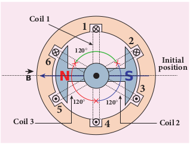

**P**

**Q**

**Coil 1**

**Coil 3 Coil 2**

**120**

**120****120**

**Initial position**  

The initial position of the field magnet is horizontal and field direction is perpendicular to the plane of the coil 1. As it is seen in single phase AC generator, when field magnet is rotated from that position in clockwise direction, alternating emf ε1 in coil 1 begins a cycle from origin O. This is shown in Figure 4.31.

The corresponding cycle for alternating emf ε2 in coil 2 starts at point A after field magnet has rotated through 120°. Therefore, the phase difference between ε1 and ε2 is 120°. Similarly, emf ε3 in coil 3 would begin its cycle at point B after 240° rotation of field magnet from initial position. Thus these emfs produced in the three phase AC generator have 120° phase difference between one another.



0

0

0

**1**

**2**

**3**

**120°**

**240°**

**90° 180° 270°**

For coil 1, eld magnet is in initial position at t=0

For coil 2, eld magnet has to rotate through 120

For coil 3, 240rotation of eld magnet is required

**B**

**t**

**t**

**t**

**A**

e dotted lines represent emfs induced in previous cycle

### Advantages of three- phase alternator

Three-phase system has many advantages over single-phase system. Let us see a few of them.

| 6 |2 |
|------|------|------|------|------|------|------|

| 120 |

| N |S |3 |
| 5 |120 |120 |

  

1) For a given dimension of the generator, three-phase machine produces higher power output than a single-phase machine.

2) For the same capacity, three-phase alternator is smaller in size when compared to single-phase alternator.

3) Three-phase transmission system is cheaper. A relatively thinner wire is sufficient for transmission of three- phase power.

## TRANSFORMER

**Transformer is a stationary device used to transform electrical power from one circuit to another without changing its frequency**. The applied alternating voltage is either increased or decreased with corresponding decrease or increase of current in the circuit.

If the transformer converts an alternating current with low voltage into an alternating current with high voltage, it is called **step-up transformer**. On the contrary, if the transformer converts alternating current with high voltage into an alternating current with low voltage, then it is called **step-down transformer**.

### Construction and working of transformer

**Principle** The principle of transformer is the

mutual induction between two coils. That is, when an electric current passing through a coil changes with time, an emf is induced in the neighbouring coil. **Construction**

In the simple construction of transformers, there are two coils of high mutual inductance wound over the same transformer core. The core is generally  

laminated and is made up of a good magnetic material like silicon steel. Coils are electrically insulated but magnetically linked via transformer core (Figure 4.32).

The coil across which alternating voltage is applied is called primary coil _P_ and the coil from which output power is drawn out is called secondary coil _S_. The assembled core and coils are kept in a container which is filled with suitable medium for better insulation and cooling purpose.

**Working** If the primary coil is connected to a

source of alternating voltage, an alternating magnetic flux is set up in the laminated core. If there is no magnetic flux leakage, then whole of magnetic flux linked with primary coil is also linked with secondary

**Figure 4.32(a)** Construction of transformer

**Primary winding of Secondary winding of**

**Secondary current,**

**Primary current,**

**Primary voltage,**

**_Np_ turns _Ns_ turns**

**_Ip Is_**

**_VP V_ Secondary voltage, _s_**

**Transformer core**

**Figure 4.32(b)** Roadside transformer

  

coil. This means that rate at which magnetic flux changes through each turn is same for both primary and secondary coils.

As a result of flux change, emf is induced in both primary and secondary coils. The emf induced in the primary coil or back emf εp is given by

_p p BN_

_d dt_

\=− 

But the voltage applied _vp_ across the primary is equal to the back emf. Then

_v N d dtp p_

_B_\=− Φ (4.24)

The frequency of alternating magnetic flux in the core is same as the frequency of the applied voltage. Therefore, induced emf in secondary will also have same frequency as that of applied voltage. The emf induced in the secondary coil εs is given by

ε_s s BN d_

_dt_ \=−

Φ

where _Np_ and _Ns_ are the number of turns in the primary and secondary coil respectively. If the secondary circuit is open, then εs = _v_s where _v_s is the voltage across secondary coil.

_v s s BN_

_d dt_

\=− Φ (4.25)

From equations (4.24) and (4.25), _v v_

_s_

_p_

_s_

_p_

_N N_

_K_\= = (4.26)

This constant _K_ is known as voltage transformation ratio. For an ideal transformer,

Input power _v p pi_ \= Output power _v s si_

where _ip_ and _is_ are the currents in the primary and secondary coil respectively. Therefore,

_v v_

_s_

_p_

_s_

_p_

_p_

_s_

_N N_

_i i_

\= = (4.27)  

Equation 4.27 is written in terms of amplitude of corresponding quantities,

_V V_

_N N_

_I I_

_Ks_

_p_

_s_

_p_

_p_

_s_

\= = =

i) If _N N Ks p_\> >( )1 , then and _V V I Is p s p_\> < . This is the case of step-up transformer in which voltage is increased and the corresponding current is decreased.

ii) If _N N Ks p_< <( )1 , then and ._V V I Is p s p_< > This is step-down transformer where voltage is decreased and the current is increased.

**Efficiency of a transformer: The efficiency η of a transformer is**

**defined as the ratio of the useful output power to the input power**. Thus

η= × Output power Input power

100% (4.28)

Transformers are highly efficient devices having their efficiency in the range of 96 – 99%. Various energy losses in transformers will not allow them to be 100% efficient.

### Energy losses in a transformer

Transformers do not have any moving parts so that its efficiency is much higher than that of rotating machines like generators and motors. But there are many factors which lead to energy loss in a transformer. **i) Core loss or Iron loss**

This loss takes place in transformer core. Hysteresis loss (Refer section 3.6) and eddy current loss are known as core loss or Iron loss. When transformer core is magnetized and demagnetized repeatedly by the alternating voltage applied across primary coil, hysteresis takes place due to

  

which some energy is lost in the form of heat. Hysteresis loss is minimized by using steel of high silicon content in making transformer core. Alternating magnetic flux in the core induces eddy currents in it. Therefore there is energy loss due to the flow of eddy current, called eddy current loss which is minimized by using very thin laminations of transformer core.

**ii) Copper loss** Transformer windings have electrical resistance. When an electric current flows through them, some amount of energy is dissipated due to Joule heating. This energy loss is called copper loss which is minimized by using wires of larger diameter.

**iii) Flux leakage** Flux leakage happens when the magnetic lines of primary coil are not completely linked with secondary coil. Energy loss due to this flux leakage is minimized by winding coils one over the other.

### Advantages of AC in long distance power transmission

Electric power is produced in a large scale at electric power stations with the help of AC generators. These power stations are classified based on the type of fuel used as thermal, hydro electric and nuclear power stations. Most of these stations are located at remote places. Hence the electric power generated is transmitted over long distances through transmission lines to reach towns or cities where it is actually consumed. This process is called **power transmission**.

But there is a difficulty during power transmission. A sizable fraction of electric  

power is lost due to Joule heating (_i R_2 ) in the transmission lines which are hundreds of kilometer long. This power loss can be tackled either by reducing current _I_ or by reducing resistance _R_ of the transmission lines. The resistance _R_ can be reduced with thick wires of copper or aluminium. But this increases the cost of production of transmission lines and other related expenses. So this way of reducing power loss is not economically viable.

Step-up transformer

Step-down transformer

Transmission line

C ity

su b-

st at

io n

Po w

er St

at io

n

Since power produced is alternating in nature, there is a way out. The most important property of alternating voltage that it can be stepped up and stepped down by using transformers could be exploited in reducing current and thereby reducing power losses to a greater extent.

At the transmitting point, the voltage is increased and the corresponding current is decreased by using step-up transformer (Figure 4.33). Then it is transmitted through transmission lines. This reduced current at high voltage reaches the destination without any appreciable loss. At the receiving point, the voltage is decreased and the current is increased to appropriate values by using step-down transformer and then it is given to consumers. Thus power transmission is done efficiently and economically.

  

**Illustration:** An electric power of 2 MW is transmitted to a place through transmission lines of total resistance _R_ = 40 Ω, at two different voltages. One is lower voltage (10 kV) and the other is higher (100 kV). Let us now calculate and compare power losses in these two cases.

**Case (i):** _P_ = 2 MW; _R_ = 40 Ω; _V_ = 10 kV

Power, _P VI_\=

∴Current, _I P V_ \= =

× ×

\= 2 10

10 10 200

6

3 A

_I P V_ \= =

× ×

\= 2 10

10 10 200

6

3 A

Power loss = Heat produced = _I_ 2_R_

\= ( ) × = ×200 40 1 6 10 2 6

. W

% of power loss = × ×

×1 6 10

2 10 100

6

6

. %

\= ×0 8 100. % = 80%

**Case (ii):** _P_ = 2 MW; _R_ = 40 Ω; _V_ = 100 kV

∴ Current, _I P V_

\= = × ×

\=2 10

100 10 20

6

3 A

_I P V_

\= = × ×

\=2 10

100 10 20

6

3 A

Power loss = _I_ 2_R_

\= ( ) × = ×20 40 0 016 10 2 6

. W

% of power loss = × ×

×0 016 10

2 10 100

6

6

. %

\= ×0 008 100. % = 0 8. %

Thus it is clear that when an electric power is transmitted at higher voltage, the power loss is reduced to a large extent.  

**EXAMPLE 4.16**

An ideal transformer has 460 and 40,000 turns in the primary and secondary coils respectively. Find the voltage developed per turn of the secondary if the transformer is connected to a 230 V AC mains. The secondary is given to a load of resistance 104 Ω. Calculate the power delivered to the load.

**_Solution_** _NP_ = 460 turns; _NS_ = 40,000 turns _VP_ = 230 V; _RS_ = 104 Ω

(i) Secondary voltage,

_V V N_

_NS P S_

_P_

\= = ×230 40 000 460

, = 20 000, V

Secondary voltage per turn, _V N_

_S_

_S_

\= 20 000 40 000

, ,

\= 0 5. V

(ii) Power delivered

\= _V I V RS S_

_S_

_S_

\= = ×2

4

20 000 20 000 10

, , = 40 kW

**EXAMPLE 4.17** An inverter is common electrical device which we use in our homes. When there is no power in our house, inverter gives AC power to run a few electronic appliances like fan or light. An inverter has inbuilt step-up transformer which converts 12 V AC to 240 V AC. The primary coil has 100 turns and the inverter delivers 50 mA to the external circuit. Find the number of turns in the secondary and the primary current. **_Solution_**

_V_p = 12 V; _V_s = 240 V _I_s = 50mA; Np = 100 turns

_V V_

_N N_

_I I_

_KS_

_P_

_S_

_P_

_P_

_S_

\= = =

| EXAMPLE 4 . 1 6An ide al t ransformer h as 460 a nd 40,000turns  in  the  primar y  and  secondar y  coilsrespectively. Find the voltage developed perturn o f t he s econdar y if t he t ransformeris co nnected t o a 230 V A C m ains. Th esecondar y is given to a load of resistance 10  Ω.Calculate the power delivered to the load.Solution4N = 460 turns; N  = 40,000 turnsV  = 230 V; R  = 10  Ω(i) Secondar y voltage, P S4P VN 230S ×40,000V ==N 460 = 20,V000Secondar y voltage per turn,  V=PS NSP(ii) Power delivered SSV 20,,000×20 000R 10 =2S4S |
|------|------|------|------|
| 20, 000 |
| 40, 000= 05.  V |

| 40  kW |
| = VI ==SS |
  

**Power system at a glance**

The generating stations present in a region ar network and are operated in parallel. This is to number of consumers in the case of failure of a beyond the capacity of the generating station.

The various elements such as generating sta distributors etc are all tied together for continu energy.This is called power system. A part of po transmission lines is known as a grid.

In a power system, the transfer of electric po in two stages which are further sub-divided int

1) Transmission stage a) Primary transmission stage b) Secondary transmission stage 2) Distribution stage a) Primary distribution stage b) Secondary transmission stage

and then it is supplied to individual consumers. These two stages of power transmission is presented in a single- line diagram shown in figure. The central system usually generates power at 11 kV which is stepped up to 132 kV and is transmitted through transmission lines. This is known as primary or high- voltage transmission.

This high-voltage power reaches receiving station at the outskirts of the city where it is stepped down to 33 kV and is transmitted as secondary or low- voltage transmission to sub-stations situated within the city limits.

In the primary distribution system, the voltage is reduced from 33 kV to 3.3kV at sub-stations and is given to distribution sub-stations. The voltage is finally brought down to 440V or 230V at distribution sub-station from where secondary homes (230V) via distribution networks.

**Sec dist**

**Sec tran**

**Pr dist**

**Pr tran**  

**(Not for Examination)**

e interconnected to form a common electrical ensure uninterrupted power supply to a large ny power station or a sudden increase of load

tions, transmission lines, the substations and ous generation and consumption of electric

wer system consisting of the sub-stations and

wer produced to the consumer is carried out o two as given below.

distribution is done to factories (440V) and

**G 11kV**

**Power station**

**Receiving station**

**Sub -station**

**33 kV**

**Distribution transformer**

**Distribution network**

**Consumer’s Connection**

**ondary ribution**

**ondary smissin**

**imary ribution**

**imary smissin**

**Generator**

  

Transformation ratio, _K_ \= = 240 12

20

The number of turns in the secondary

_N N KS P_\= × = × =100 20 2000

Primary current,

_I_P = K × _I_s = 20 × 50 mA = 1 A

## ALTERNATING CURRENT

### Introduction

In section 4.5, we have seen that when the orientation of the coil with the magnetic field is changed, an alternating emf is induced and hence an alternating current flows in the closed circuit. **An alternating voltage is the voltage which changes polarity at regular intervals of time and the direction of the resulting alternating current also changes accordingly.**

In the Figure 4.34(a), an alternating voltage source is connected to a resistor _R_ in which the upper terminal of the source

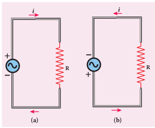

**+**

**\- -**

**R**

**_i_**

**\+ R**

**_i_**

**(a) (b)**  

is positive and lower terminal negative at an instant. Therefore, the current flows in clockwise direction. After a short time, the polarities of the source are reversed so that current now flows in anti-clockwise direction (Figure 4.34(b)). This current which flows in alternate directions in the circuit is called alternating current.

**Sinusoidal alternating voltage If the waveform of alternating voltage is**

**a sine wave, then it is known as sinusoidal alternating voltage** which is given by the relation.

_v_ \=_V tm_ sinω (4.29)

where _υ_ is the instantaneous value of alternating voltage; _Vm_ is the maximum value (amplitude) and ω is the angular frequency of the alternating voltage. When sinusoidal alternating voltage is applied to a closed circuit, the resulting alternating current is also sinusoidal in nature and its relation is

_i I tm_\= sinω (4.30)

where _Im_ is the maximum value (amplitude) of the alternating current. The direction of sinusoidal voltage or current is reversed after every half-cycle and its magnitude is also changing continuously as shown in Figure 4.35.

**Figure 4.35 (a)** Sinusoidal alternating voltage **(b)** Sinusoidal alternating current

**0**

**(a) (b)**

**2**

**t**

**v**

**V_m_**

**–V_m_**

**_i_**

**0 2** **t**

**–_Im_**

**_Im_**

| Transformation ratio, 240The number of turns in tK ==he secon 20dar y 12NN=× K =×100 20 = 2000Primar y current, I = K × I = 20 × 50 mA = 1 ASPP  s |
|------|

  

Interestingly, sine waves are very common in nature. The periodic motions like waves

in water, swinging of pendulum are associated with sine waves. Thus sine wave seems to be nature’s standard. Also refer unit 11 of XI physics text book.

**Note**

### Mean or Average value of AC

The current and voltage in a DC system remain constant over a period of time so that there is no problem in specifying their magnitudes. However, an alternating current or voltage varies from time to time. Then a question arises how to express the magnitude of an alternating current or voltage. Though there are many ways of expressing it, we limit our discussion with two ways, namely mean value and RMS (Root Mean Square) value of AC.

**Mean or Average value of AC** We have learnt that the magnitude of

an alternating current in a circuit changes from one instant to other instant and its direction also reverses for every half cycle. During positive half cycle, current is taken as positive and during negative cycle it is negative. Therefore mean or average value of symmetrical alternating current over one complete cycle is zero.

Therefore the average or mean value is measured over one half of a cycle. These electrical terms, average current and average voltage, can be used in both AC and DC circuit analysis and calculations.

**The average value of alternating current is defined as the average of all values of current over a positive half-cycle or a negative half-cycle.**  

The instantaneous value of sinusoidal alternating current is given by the equation _i I i Im m_\= =sin t or sinω θ (where θ = _ωt_) whose graphical representation is given in Figure 4.36.

The sum of all currents over a half-cycle is given by area of positive half-cycle (or negative half-cycle). Therefore,

_Iav_ \=

Area of positive half-cycle (or negative half-cycle

Ba )

se lengthof half-cycle (4.31)

**0 2**

**d**



**_i_**

**_i_**

Consider an elementary strip of thickness _dθ_ in the positive half-cycle of the current wave (Figure 4.41). Let _i_ be the mid-ordinate of that strip.

Area of the elementary strip = _i_ _dθ_ Area of positive half-cycle

\= =∫ ∫_id I dm_θ θ θ π π

0 0

sin

\= −\[ \] =− −\[ \]_I Im m_cos cos cosθ ππ

0 0 = 2_Im_

The base length of half-cycle is π. Substi- tuting these values in equation (4.31), we get

Average value of AC, _I I av_

_m_\= 2 π

_I Iav m_\= 0 637. (4.32)

|  2 |
|------|------|------|------|------|

  

\= − 

  

_Im_ 2

2 2

2 θ sin

Hence the average value of AC is 0.637 times the maximum value _Im_ of the alternating current. For negative half-cycle, _I Iav m_\= −0 637. .

For example, if we consider n currents in a half-cycle of AC, namely _i_1, _i_2, ... _i_n, then

average value is given by

_Iav_ \= Sum of all currents over half-cycle

Number of currents

_I i i i nav_

_n_\= + + + 1 2

....

**Note**

### RMS value of AC

The term RMS refers to time-varying sinusoidal currents and voltages which is not used in DC systems.

**The root mean square value of an alternating current is defined as the square root of the mean of the squares of all currents over one cycle.** It is denoted by _IRMS_ . For alternating voltages, the RMS value is given by _VRMS_ .

The alternating current _i Im_\= sin t orω or _i I i Im m_\= =sin t or sinω θ, is represented graphically in Figure 4.37. The corresponding squared current wave is also shown by the dotted lines.

The sum of the squares of all currents over one cycle is given by the area of one cycle of squared wave. Therefore,

_IRMS_ \=

Area of one cycle

of squared wave

Baselength of one cycle (4.33)

An elementary area of thickness dθ is considered in the first half-cycle of the  

squared current wave as shown in Figure 4.37. Let _i_2 be the mid-ordinate of the element.

Area of the element = _i d_2 θ

Area of one cycle of squared wave

\= ∫ _i d_2

0

2π

θ

**_i_2 wave**

**_i_2**

**0 2**

**d** 

**_i_**

\= =∫ ∫_I d I dm m_ 2

0

2 2 2 2

0

2π π

θ θ θ θsin sin (4.34)

\= −

  



  ∫_I dm_

2

0

2 1 2 2

cos θ θ π

since sin cos2 1 2 2

θ θ = −

\= − 



  





  

∫∫ _I d dm_

2

0

2

0

2

2 2θ θ θ

ππ

cos

\= − 

  



   = −

×

 



 − −

_I Im m_ 2

0

2 2

2 2

2 2 2 2 2

2 0 0

2 θ θ π ππsin sin sin

 



 



  



  



   = −

×

 



 − −

_Im_

0

2 2

2 2 2 2

2 0 0

2 θ π ππ sin sin

 



 



  



  

\= × = _I Im_

_m_

2 2

2 2π π \[ sin sin \] 0 4 0= =π

The base length of one cycle is 2π . Substi- tuting these values in equation (4.33), we get

_i Im_\= sinθ

| of all current s over half-cy |cle |
|------|------|------|
| Sum I =ii ++I =av12av |
| Number of current s.... + inn |

| i  wave |
|------|------|------|------|------|------|

| d |
  

_I I I RMS_

_m m_\= = 2

2 2 π π

_I Irms m_\= 0 707. (4.35)

Thus we find that for a symmetrical sinusoidal current rms value of current is 70.7 % of its peak value.

Similarly for alternating voltage, it can be shown that

_V Vrms m_\= 0 707. (4.36)

RMS value of alternating current is also called effective value and is

represented as _Ieff_. It is used to compare RMS current of AC to an equivalent steady current. **RMS value is also defined as that value of the steady current which when flowing through a given circuit for a given time produces the same amount of heat as produced by the alternating current when flowing through the same circuit for the same time.** The effective value of an alternating voltage is represented by _Veff_.

**Note**

For example, if we consider n currents in one cycle of AC, namely _i_1, _i_2, ... _i_n, then RMS

value is given by

_IRMS_ \=

Sum of squares of all currents

over one cycle

Number of currents

_I i i i nRMS_

_n_\= + + + 1

2

2

2 2 ...

**Note**  

For common household appliances, the voltage rating and current rating

are generally specified in terms of their RMS value. The domestic AC supply is 230V, 50 Hz. It is the RMS or effective value. Its peak value will be _V Vm rms_\= = × =2 2 230 325 V.

**EXAMPLE 4.18**

Write down the equation for a sinusoidal voltage of 50 Hz and its peak value is 20 V. Draw the corresponding voltage versus time graph.

**_Solution_** _f m_\= =50 20Hz V; _V_

Instantaneous voltage, _v_ \=_V tm_ sinω

\=_V ftm_ sin2π

\= ×20 2 50sin( )tπ = ×20 100 3 14sin( . ) t

_v_ \= 20 314sin t

Time for one cycle, _T f_ \= = =1 1

50 0 02. s

\= × − 20 10

3 s = 20 ms

The wave form is given below.

**0**

**20V**

**–20V**

**t (ms)**

v

| EXAMPLE 4 . 1 8Write  down  the  equation  for  a  sinusoidal voltage of 50 H z and its p eak va lue is 20 V. Draw t he co rresponding v oltage v ersus time graph.Solutionf ==50 Hz; V 20  VInstantaneous voltage,v = Vt sin ω= Vf sin2 π tm=×20sin(25π 0)t =×20 sin(100 31.) 4 tmv = 20 sint314mTime for one cycle,  T ==11 = 00.s 2f 50=×20 10 sThe wave form i= 20s gmsiven below.−3v20V0t (ms)5 10 15 20–20V |
|------|

  

**EXAMPLE 4.19**

The equation for an alternating current is given by _i_ = 77 _sin_ 314_t_. Find the peak current, frequency, time period and instantaneous value of current at _t_ = 2 ms.

**_Solution_** _i_ = 77 sin 314 t ; _t_ = 2 m s = 2 × 10–3 s The general equation of an alternating current is _i I tm_\= sinω . On comparison,

(i) Peak current, _Im_ \= 77 A

(ii) Frequency, _f_ \= = ×

\= ω π2

314 2 3 14

50 .

Hz

(iii) Time period, _T f_

\= = = 1 1

50 0 02. s

(iv) At _t_ = 2 m s, Instantaneous current, _i_\= × ×

\= × × × °

 



 

\=

−

−

77 314 2 10

77 314 2 10 180 3 14

77

3

3

sin( )

sin .

sin . .

36 77 0 5878 45 26

°= × = A

**Phasor and phasor diagram Phasor**

**A sinusoidal alternating voltage (or current) can be represented by a vector which rotates about the origin in anti-clockwise direction at a constant angular velocity ω. Such a rotating vector is called a** **phasor**. A phasor is drawn in such a way that

·   the length of the line segment equals the peak value _Vm_ (or _Im_) of the alternating voltage (or current)

·   its angular velocity ω is equal to the angular frequency of the alternating voltage (or current)

·   the projection of phasor on any vertical axis gives the instantaneous value of the alternating voltage (or current)  

·   the angle between the phasor and the axis of reference (positive x-axis) indicates the phase of the alternating voltage (or current). The notion of phasors is introduced to

analyse phase relationship between voltage and current in different AC circuits.

**Phasor diagram**

**The diagram which shows various phasors and their phase relations is called phasor diagram**. Consider a sinusoidal alternating voltage _v_ = _Vm_ sin ωt applied to a circuit. This voltage can be represented by a phasor, namely _OA_

  as shown in Figure 4.38.

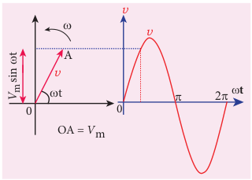

_V_ m si

n 

t

0

_v_

_v_

_v_

t  



A

**t** 0

OA = _V_m

Here the length of _OA_  

equals the peak value (_Vm_), the angle it makes with x-axis gives the phase (ωt) of the applied voltage. Its projection on y-axis provides the instantaneous value (_Vm_ sin ωt) at that instant.

When _OA_  

rotates about _O_ with angular velocity ω in anti-clockwise direction, the waveform of the voltage is generated. For one full rotation of _OA_

  , one cycle of voltage

is produced. The alternating current in the same

circuit may be given by the relation _i_ = _I_ sin (ωt + ϕ) which is represented by

| A |
|------|------|------|------|
| vt |

| EXAMPLE 4 . 1 9The e quation f or a n a lternating c urrent is g iven b y  i = 77  sin 314t. Fin d t he p eak current, f requency, t ime p eriod a nd instantaneous value of current at t = 2 ms.Solutioni = 77 sin 314 t ; t = 2 m s = 2 × 10 sThe g eneral e quation o f a n a lternating current is  . On comparison, iI= sin ωt–3 (i) Peak current, I = 77 A(ii) Frequenc my, ω 314f == = 50  Hzm2 π 23× .14(iii) Time period,  11T == = 00.  2 sf 50(iv) At t = 2 m s, Instantaneous current, i =×77 sin(314 21× 0 )=×77 sin314 21××0 18031. 4° −3= 77 siin 36°= 77×0.5878= 45.26A −3 |
|------|

  

another phasor _OB_  

. Here ϕ is the phase angle between voltage and current. In this case, the current leads the voltage by phase angle ϕ which is shown in Figure 4.39. If the current lags behind the voltage, then we write _i_ = _Im_ sin (ωt - ϕ).

### AC circuit containing pure resistor

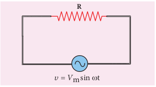

**R**

\= _V_m sin t_v_

Consider a circuit containing a pure resistor of resistance _R_ connected across an alternating voltage source (Figure 4.40). The instantaneous value of the alternating voltage is given by

_V_ m sin

 t

0

B

t



A

 _i_



_I_ m sin

( t+ )

_v_

_v_

OA = _V_m

OB = _I_m

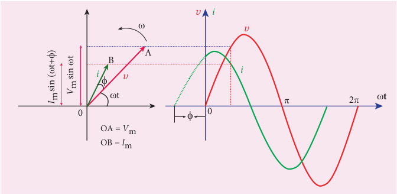

_v_ \=_V tm_ sinω (4.37)

An alternating current _i_ flowing in the circuit due to this voltage, develops a potential drop across _R_ and is given by

_V iRR_ \= (4.38)

Kirchoff ’s loop rule (Refer section 2.5.2) states that the algebraic sum of potential differences in a closed circuit is zero. For this resistive circuit,

_v_− =_VR_ 0

From equation (4.37) and (4.38),

_V t iRm_ sinω =

_i V R_

_tm_\= sinω

_i I tm_\= sinω (4.39)

where _V R_

_m m_\= _I_ , the peak value of

alternating current in the circuit. From equations (4.37) and (4.38), it is clear that

**t** 0

_i_

_i v_

 

m say that _i_ leads _v_ by ϕ

| tsin mV |B |A |
|------|------|------|------|------|------|------|

| i  |t |v |
| 0 |
| 0 |
  

the applied voltage and the current are in phase with each other in a resistive circuit. It means that they reach their maxima and minima simultaneously. This is indicated in the phasor diagram (Figure 4.41). The wave diagram also depicts that current is in phase with the applied voltage (Figure 4.41).

### AC circuit containing only an inductor

Consider a circuit containing a pure inductor of inductance _L_ connected across an alternating voltage source (Figure 4.42). The instantaneous value of the alternating voltage is given by

_V_ m sin

 t

0

B

t



A

0

_I_ m sin

( t)

_i_

OA = _V_m

OB = _I_m

_v_

_v_

**L**

_v_ = _V_m sin t  

_v_ \=_V tm_ sinω (4.40)

The alternating current flowing through the inductor induces a self-induced emf or back emf in the circuit. The back emf is given by

Back emf ,ε=−_L di dt_

By applying Kirchoff ’s loop rule to the purely inductive circuit, we get

_v_\+ =ε 0

_V t L di dtm_ sinω =

_di V L_

_t dtm_\= sinω

Integrating both sides, we get

_i V L_

_t dtm_\= ∫ sinω

_i V L_

_tm_\= −( ) ω

ωcos + constant

The integration constant in the above equation is independent of time. Since the voltage in the circuit has only time dependent part, we can take the time independent part in the current (integration constant) as zero.

**t**

_i_

_i_

 

_v_

m for AC circuit with R

| tsin mV |Bv |
|------|------|------|------|------|------|------|
| it |

| Vi =LVi =− mLωm |
|------|

  

 − =− −( )

\= −( )













cos sin

sin

ω π ω

ω π

_t t_

_t_ 2

2

_i V L_

_tm_\= −( )ω ω πsin 2

or _i I tm_\= −( )sin ω π 2 (4.41)

where _V L_

_Im m_ω

\= , the peak value of the

alternating current in the circuit. From equation (4.40) and (4.41), it is evident that current lags behind the applied voltage by π

2 in an inductive circuit. This fact is depicted in the phasor diagram. In the wave diagram also, it is seen that current lags the voltage by 90o (Figure 4.43).

**Inductive reactance XL**

The peak value of current _Im_ is given by

_I V Lm m_\=

ω . Let us compare this equation with

_I V Rm_

_m_\= from resistive circuit. The quantity

_ωL_ plays the same role as the resistance in resistive circuit. This is the resistance

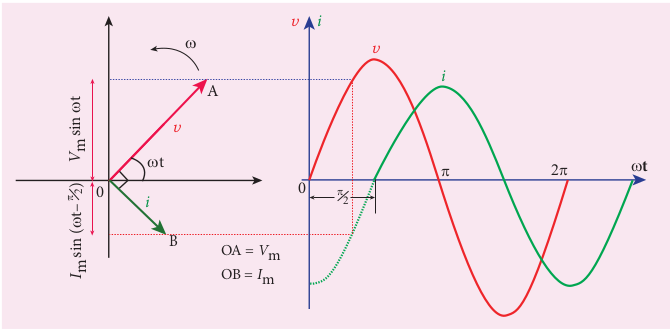

_V_ m sin

 t

0

B

t



A

0

_i_

_I_ m sin

( t–

)

   _i_

OA = _V_m

OB = _I_m

_v_

_v_  

offered by the inductor, called inductive reactance (_XL_). It is measured in ohm.

_X LL_ \=ω

**An inductor blocks AC but it allows DC. Why? and How?**

An inductor _L_ is a closely wound helical coil. The steady DC current flowing through _L_ produces uniform magnetic field around it and the magnetic flux linked remains constant. Therefore there is no self-induction and self-induced emf (back emf). Since inductor behaves like a resistor, DC flows through an inductor.

The AC flowing through _L_ produces time-varying magnetic field which in turn induces self-induced emf (back emf). This back emf, according to Lenz’s law, opposes any change in the current. Since AC varies both in magnitude and direction, its flow is opposed in _L_. For an ideal inductor of zero ohmic resistance, the back emf is equal and opposite to the applied emf. Therefore _L_ blocks AC.

m for AC circuit with L

**t**

_i_



 

_v_

| vt |A0 |
|------|------|------|------|------|------|------|------|------|------|
|  |

|  |
| 0 |i |

|  |

  

The inductive reactance (_XL_) varies directly as the frequency.

_X f LL_ \= 2π (4.42)

where _f_ is the frequency of the alternating current. For a steady current, _f_ = 0. Therefore, _XL_ = 0. Thus an ideal inductor offers no resistance to steady DC current.

### AC circuit containing only a capacitor

Consider a circuit containing a capacitor of capacitance _C_ connected across an alternating voltage source (Figure 4.44). The instantaneous value of the alternating voltage is given by

_v_ \=_V tm_ sinω (4.43)

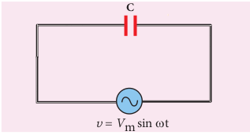

**C**

_v_ = _V_m sin t

Let _q_ be the instantaneous charge on the capacitor. The emf across the capacitor at that instant is _q_

_C_ . According to Kirchoff ’s

loop rule,

_v_− = _q C_

0

_q CV tm_\= sinω

By the definition of current,

_i dq dt_

_d dt_

_CV tm_\= = ( )sinω

\= ( )_CV d dt_

_tm_ sinω  

\=_CV tm_ ω ωcos (or)

_i V_

_C tm_\= +( )1 2

ω ω πsin

Instantaneous value of current,

_i I tm_\= +( )sin ω π 2 (4.44)

where _V_

_C Im_

_m_1 ω

\= , the peak value of the

alternating current. From equations (4.43) and (4.44), it is clear that current leads the applied voltage by π 2 in a capacitive circuit. This is shown pictorially in Figure 4.45. The wave diagram for a capacitive circuit also shows that the current leads the applied voltage by 90o.

**Capacitive reactance XC**

The peak value of current _Im_ is given

by _I V_

_C m_

_m_\= 1

ω . Let us compare this equation

with _I V Rm_

_m_\= for a resistive circuit. The

quantity 1 _C_ω

plays the same role as the

resistance _R_ in resistive circuit. This is the resistance offered by the capacitor, called capacitive reactance (_XC_). It measured in ohm.

_X Cc_ \=

1 ω

(4.45)

The capacitive reactance (_XC_) varies inversely as the frequency. For a steady current, _f_ = 0.

∴ = = = =∞_X C f CC_

1 1 2

1 0ω π

Thus a capacitive circuit offers infinite resistance to the steady current. So that steady current cannot flow through the capacitor.

  

**What is ELI?**

**E L I**

**EMF (Voltage) Inductor Current**

**I C E**

**EMF (Voltage)CapacitorCurrent**

ELI is an acronym which means that EMF (voltage) leads the current in an inductive circuit. **What is ICE?**

**E L I**

**EMF (Voltage) Inductor Current**

**I C E**

**EMF (Voltage)CapacitorCurrent**

ICE is an acronym which means that the current leads the EMF (voltage) current in a capacitive circuit.

**EXAMPLE 4.20**

A 400 mH coil of negligible resistance is connected to an AC circuit in which an effective current of 6 mA is flowing.

_V_ m sin

 t

_I_ m sin

( t+

)

0

B

t



A

0

 

 

_i_

OA = _V_m

OB = _I_m

_v_

_v_  

Find out the voltage across the coil if the frequency is 1000 Hz.

**_Solution_** _L_ = 400 × 10–3 H; _Ieff_ = 6 × 10–3A _f_ = 1000 Hz Inductive reactance, _X L L fL_ \= = ×ω π2

\= × × ×2 3 14 1000 0 4. . = × × ×2 3 14 1000 0 4. .512 Ω

Voltage across _L_,

_V I XL_\= = × ×− 6 10 2512

3

_V RMS_\= 15 072. ( )V

**EXAMPLE 4.21**

A capacitor of capacitance 102

π µF is

connected across a 220 V, 50 Hz A.C. mains. Calculate the capacitive reactance, RMS value of current and write down the equations of voltage and current.

**_Solution_** _C V fRMS_\= × = =−10 10 220 50

2 6

π F V Hz, ;

m for AC circuit with C

**t**

_i_

_i_

 

_v_

| B t+    )sin ( |v |A |
|------|------|------|------|------|------|------|------|
| i |t |0 |

| 0m |

| Find o ut t he v oltage acr oss t he co il if t he frequency is 1000 Hz.SolutionL = 400 × 10  H; I  = 6 × 10 Af   = 1000 HzInductive reactance, XL ==ωπ Lf×2–3 –3eff=×23 ..14××1000 04=251223 ..14Ω ××1000 04Voltage across L, LVI== X 61×× 0 2512VR= 15.(072 V MS )−3L |
|------|

  

**A capacitor blocks DC but it allows AC.** Capacitors have two parallel metallic plates placed

Whenever a source of voltage (either DC voltage or AC v from the source will reach the plate and stop. They can its flow in the circuit. Therefore the electrons flowing capacitor. But the electrons from AC source seem to flo

**DC cannot flow thr** Consider a parallel plate capacitor whose plates ar

charges). A DC source (battery) is connected across C a

As soon as battery is connected, electrons start to flow from the negative terminal and are accumulated at the right plate, making it negative. Due to this negative potential, the electrons present in the nearby left plate are repelled an When electrons leave the left plate, it becomes positiv direction of flow of electrons is shown by arrows.

The charging of the plates continues till the level of th At this time, we say that capacitor is blocking DC Figure

**AC flows (?!) thr** Now an AC source is connected across C. At an insta

then the electrons flow from negative terminal to the rig shown in Figure (d) but no electron crosses the gap bet by arrows. Thus, the charging of the plates takes place a

After a short time, the polarities of AC source are re The electrons which were accumulated in the right plate from negative terminal flow to the left plate to neutra net charges present in the plates begin to decrease and represented by arrows as shown in Figure (f). Once th with reversed polarities as shown in Figure (g).

Thus the electrons flow in one direction while char discharging (the conventional current is also opposite in electron crosses the gap between the plates. In this way,

++**– –**

++**– –**

++**– –**

++**– –**

++**– –**

++**– –**

++**– –**

++**– –**

++**– –**

++**– –**

++**– –**

++**– –**

\+ **\-**

(a)

++++ **–** +++ **–** +++ **–** +++

+

**–** ++**–** ++**–**

+**– – ––**

+**– –**

**–**

+**– –**

**–**

+**– –**

**–**

+**– –**

**–**

+**– –**

\+ **\-- -------**

**\------ --**

AC

+++++++++ +++

+++++++++ +++

**– – –**

**– – – – – – – – –**

**– – –**

**– – – – – – – – –**

\+ **\-** AC

(d) (e)  

**Why? and How? (Not for examination)** close to each other and there is a gap between plates. oltage) is connected across a capacitor C, the electrons not jump across the gap between plates to continue

in one direction (i.e. DC) cannot pass through the w through C. Let us see what really happens! **ough a capacitor:** e uncharged (same amount of positive and negative s shown in Figure (a).

d are moved towards positive terminal of the battery. ely charged. This process is known as charging. The

e battery. Once C is fully charged and current will stop. (c).

**ough a capacitor:** nt, the right side of the source is at negative potential, ht plate and from left plate to the positive terminal as

ween the plates. These electron-flows are represented nd the plates become fully charged (Figure (e)). versed and the right side of the source is now positive. start to flow to the positive terminal and the electrons lize the positive charges stored in it. As a result, the this is called discharging. These electron-flows are

e charges are exhausted, C will be charged again but

ging the capacitor and its direction is reversed while both cases). Though electrons flow in the circuit, no

AC flows through a capacitor.

++++ **–** +++ **–** +++ **–** +++

+

**–** ++**–** ++**–**

+**– – ––**

+**– –**

**–**

+**– –**

**–**

+**– –**

**–**

+**– –**

**–**

+**– –**

\+ **\--------**

**\------ --**

+++++++++ +++

+++++++++ +++

**– – –**

**– – – – – – – – –**

**– – –**

**– – – – – – – – –**

+

(b) (c)

++++ **–** +++ **–** +++ **–** +++ +

**–** ++**–** ++**–**

+**– – – –**

+**– –**

**–**

+**– –**

**–**

+**– –**

**–**

+**– –**

**–**

+**– –**

+

**\- - - - -- --**

**\---- - - - - -**

AC

+++++++++ +++

+++++++++ +++

**– – –**

**– – – – – – – – –**

**– – –**

**– – – – – – – – –**

+**\-** AC

(f) (g)

  

(i) Capacitive reactance,

_X C fCC_ \= =

1 1 2ω π

\= × × ×

−

1

2 50 10 4

π π

\= 100Ω

(ii) RMS value of current,

_I V XRMS RMS_

_C_

\= = =220

100 2 2. A

(iii) _Vm_ \= × =220 2 311 V

_Im_ \= × =2 2 2 3 1. . A

Therefore, _v_ \= 311 314sin _t_

_i t_\= +( )3 1 314 2. sin π

### AC circuit containing a resistor, an inductor and a capacitor in series – Series RLC circuit

Consider a circuit containing a resistor of resistance _R_, an inductor of inductance _L_ and a capacitor of capacitance _C_ connected across an alternating voltage source (Figure 4.46). The instantaneous value of the alternating voltage is given by

_v_ \=_V tm_ sinω

**R**

_v_ = _V_m sin t

VR

**L C**

VL VC

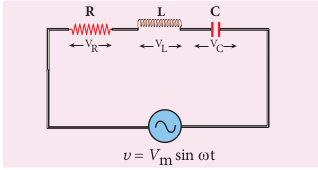

Let _i_ be the resulting current in the circuit at that instant. As a result, the voltage is developed across _R_, _L_ and _C_.

We know that voltage across _R_ (_V_R) is in phase with _i_, voltage across _L_ (_VL_) leads _i_ by π/2 and voltage across _C_ (_VC_) lags behind _i_ by π/2.

The phasor diagram is drawn with current as the reference phasor. The current is represented by the phasor _OI V OA V OB V OCR L C_

        , ;by by and by as

shown in Figure 4.47.

The length of these phasors are

_OI_ = _Im_, _OA_ = _ImR_, _OB_ = _ImXL_; _OC_ = _ImXC_

The circuit is either effectively inductive or capacitive or resistive depending on the value of _VL_ or _VC_. Let us assume that _VL _\> _VC_. Therefore, net voltage drop across _L_\-_C_ combination is _VL_ – _VC_ which is represented by a phasor _OD_

  .

By parallelogram law, the diagonal _OE_  

gives the resultant voltage _v_ of _VR_ and (_VL_ – _VC_) and its length _OE_ is equal to _Vm_. Therefore,

The voltage triangle and impedance triangle are given in the Figure 4.48.

From phasor diagram, the phase angle between _v_ and _i_ is found out from the following relation

Resistance R 0o

Inductance XL = ωL 90o

Capacitance XC = 1 ω_C_

90o

R- L - C _R L C_

2 2

1+ −( )ω ω Be or  

**Special cases** (i) If _XL_ > _XC_, (_XL_−_XC_) is positive and phase

angle ϕ is also positive. It means that the applied voltage leads the current by ϕ (or current lags behind voltage by ϕ). The circuit is inductive.

∴ = = −( )_v V t i I tm m_sin ; sinω ω φ

(ii) If _XL_ < _XC_, (_XL_ − _XC_) is negative and ϕ is also negative. Therefore current leads voltage by ϕ and the circuit is capacitive.

∴ = = +( )_v V t i I tm m_sin ; sinω ω φ

(iii) If _XL_ = _XC_, ϕ is zero. Therefore current and voltage are in the same phase and the circuit is resistive.

∴ = =_v V t i I tm m_sin ; sinω ω

### Resonance in series RLC Circuit

When the frequency of the applied alternating source ω_r_( ) is equal to the

natural frequency 

circuit, the current in the circuit reaches its maximum value. Then the circuit is said to be in **electrical resonance**. The frequency at which resonance takes place is called **resonant frequency**.

**Table 4.1 Summary of results of AC circuits**

| Type of Impedance | Value of Impedance                                         | Phase angle of current with voltage                      | Power factor    |
|-------------------|------------------------------------------------------------|----------------------------------------------------------|-----------------|
| Resistance        | R                                                          | 0o                                            | 1               |
| Inductance        | XL = ωL                                         | 90o lag                                     | 0               |
| Capacitance       | X C  = 1/ωC                                     | 90o  lead                                  | 0               |
| R- L - C          |  \\(\sqrt{R^2+(ωL-1/ωC)^2}\\)  | Between 0o and 90o lag or lead | Between 0 and 1 |

Resonant angular frequency, ω_r LC_ \=

1

or _f LCr_ \=

1 2π

(4.49)

This is the condition for resonance in RLC circuit.

Since _XL_ and _XC_ are frequency dependent, the resonance condition _X XL C_\=( ) can be achieved by varying the frequency of the applied voltage.

**Effects of series resonance** When series resonance occurs, the

impedance of the circuit is minimum and is equal to the resistance of the circuit. As a result of this, the current in the circuit becomes maximum. This is shown in the resonance curve drawn between current and frequency (Figure 4.49).

At resonance, the impedance is

_Z R X X RL C_\= + −( ) =2 2 since_X XL C_\=

0 Frequency

_i_

_f_r

Small R

Large R  

Therefore, the current in the circuit is

_I V m_

_m_\= + −( )_R X XL C_

2 2

_I V m_

_m_\= _R_

(4.51)

The maximum current at series resonance is limited by the resistance of the circuit. For smaller resistance, larger current with sharper curve is obtained and vice versa.

**Applications of series RLC resonant circuit**

RLC circuits have many applications like filter circuits, oscillators, voltage multipliers etc. An important use of series RLC resonant circuits is in the tuning circuits of radio and TV systems. The signals from many broadcasting stations at different frequencies are available in the air. To receive the signal of a particular station, tuning is done.

The tuning is commonly achieved by varying capacitance of a parallel plate variable capacitor, thereby changing the resonant frequency of the circuit. When resonant frequency is nearly equal to the frequency of the signal of the particular station, the amplitude of the current in the circuit is maximum. Thus the signal of that station alone is received.

The phenomenon of electrical resonance is possible when the circuit contains both _L_

and _C_. Only then the voltage across _L_ and _C_ cancel one another when _VL_ and _VC_ are 180° out of phase and the circuit becomes purely resistive. This implies that resonance will not occur in _RL_ and _RC_ circuits.

**Note**

| I =VI =m Rm |
|------|

| ω =ω L =rXX =rLC |
|------|

  

### Quality factor or Q–factor

The current in the series _RLC_ circuit becomes maximum at resonance. Due to the increase in current, the voltage across _L_ and _C_ are also increased. This magnification of voltages at series resonance is termed as Q–factor.

**It is defined as the ratio of voltage across _L_ or _C_ at resonance to the applied voltage**.

Q-factor =

Voltage across LorC at resonance Applied voltage

At resonance, the circuit is purely resistive. Therefore, the applied voltage is equal to the voltage across _R_.

_Q X R_

_X R_

_L L_\-factor = = _I I m_

_m_ (4.52)

\= ω_r L_

_R_

\= _L_

_R LC_ since ω_r LC_

\= 1

Q-factor = 1 _R_

_L C_

(4.53)

The physical meaning is that Q–factor indicates the number of times the voltage across _L_ or _C_ is greater than the applied voltage at resonance.

**EXAMPLE 4.22**

Find the impedance of a series _RLC_ circuit if the inductive reactance, capacitive reactance and resistance are 184 Ω, 144 Ω and 30 Ω respectively. Also calculate the phase angle between voltage and current.

**_Solution_**

_XL_ = 184 Ω; _XC_ = 144 Ω

_R_ = 30 Ω  

(i ) The impedance is

_Z R X XL C_\= + −( )2 2

\= + −( )30 184 1442 2

\= +900 1600 _Z_ \= 50 Ω

(ii) Phase angle ϕ between voltage and current is

tanφ= −_X X R_

_L C_

\= −184 144

30 =1 33.

φ = 53 1. 

Since the phase angle is positive, voltage leads current by 53.1° for this inductive circuit.

**EXAMPLE 4.23**

A 500 μH inductor, 80 2π

_pF_ capacitor and a

628 Ω resistor are connected to form a series _RLC_ circuit. Calculate the resonant frequency and Q-factor of this circuit at resonance. **_Solution_**

_L_ = 500 × 10–6H ; _C R_\= × =−80 10 6282 12

π F; Ω

(i) Resonant frequency is

_f LCr_ \= =

× × ×− −

1 2

1

2 500 10 80 106 2

12π π π

\= × −

1 2 40 000 10 18,

\= ×10 000 10

4

3 , _fr_ \= 2500 KHz

(ii) _Q_–factor

\= = × × × × × −ω_rL_

_R_ 2 3 14 2500 10 500 10

628

3 6.

_Q_ \=12 5.

| (i ) The impedance is ()ZR=+ XX−()=+302 184 −144 2LCZ ==+50900Ω2 1600 2(ii) Phase a ngle ϕ b etween v oltage a nd current is XX−tan φ =R184 − 144= = 13. 3LC30φ = 53.1Since the phase angle is positive, voltage leadscurrent by 53.1° for this inductive circuit. |
|------|

| f ==2πr =2410,= |
|------|

| 23××.14 2500××10 50036 |
|------|------|
| ω L==RQ = 12.5r |
| 628 |

| A 500 μH in ductor,  80  c apacitor a nd  a pFπ628 Ω resistor are connected to form a seriesRLC circuit. Calculate the resonant frequencyand Q-factor of this circ2 uit at resonance.SolutionL = 500 × 10H ; 80CR=× 10 F; = 628 Ωπ(i) Resonant frequency is–6 −121 2 1f ==2π LC 802π 500××10 ×10π1r =24 0, 000×10 −−6 12210, 000 × 10=4 =−182500  KHz(ii) Q–factor 3ω L 23××.14 2500××10 500×10==R 628Q = 12.5 36 −r |
|------|

  

**EXAMPLE 4.24**

Find the instantaneous value of alternating voltage _v_ \= ×10 3 104sin( t)π volt at i) 0 s ii) 50 μs iii) 75 μs. **_Solution_**

The given equation is _v_ \= ×( )10 3 104sin π _t_

(i) At t = 0 s,

υ= °=10 0 0sin V

(ii) At t = 50 µs,

_v_ \= × × ×( )

\= × × °

 



 

−

−

10 3 10 50 10

10 150 10 180

4 6

2

sin

sin

π

π π

\= ° = ×− =−

10 270 10 1 10 sin( )

V

(iii) At t = 75 µs,

_v_ \= × × ×( )

\= × × °

 



 

−

−

10 3 10 75 10

10 225 10 180

4 6

2

sin

sin

π

π π

\= ° = °

\= ×

10 405 10 45

10 1 2

sin( ) sin

\= 7.07 V

**EXAMPLE 4.25**

The current in an inductive circuit is given by 0.3 sin (200_t_ – 40°) A. Write the equation for the voltage across it if the inductance is 40 mH. **_Solution_**

_L_ = 40 × 10–3 H; _i_ = 0.3 sin (200t – 40o)

_XL_ = _ωL_ = 200 × 40 × 10–3 = 8 Ω _Vm_ = _Im_ _XL_ = 0.3 × 8 = 2.4 V

In an inductive circuit, the voltage leads the current by 90o. Therefore,

_v_ \= + °( )_V tm_ sin ω 90

_v_ \= − °+ °( )2 4 200 40 90. sin _t_

_v_ \= + °( )2 4 200 50. sin _t_ V  

## POWER IN AC CIRCUITS

### Introduction of power in AC circuits

**Power of a circuit is defined as the rate of consumption of electric energy in that circuit.** It is given by the product of the voltage and current. In an AC circuit, the voltage and current vary continuously with time. Let us first calculate the power at an instant and then it is averaged over a complete cycle.

The alternating voltage and alternating current in the series inductive _RLC_ circuit at an instant are given by

_v_ \=_V tm_ sinω and _i I tm_\= +( )sin ω φ

where _ϕ_ is the phase angle between _v_ and _i_. The instantaneous power is then written as

_P_ = _v i_ \= +( )_V I t tm m_ sin sinω ω φ

\= +\[ \]_V I t t tm m_ sin sin cos cos sinω ω φ ω φ

_P V I t t tm m_\= + 

 cos sin sin cos sinφ ω ω ω φ2

(4.54)

Here the average of sin2 ω_t_ over a cycle is 1

2 and that of sin cosω ω_t t_ is zero.

Substituting these values, we obtain average power over a cycle.

_P V Iav m m_\= ×cosφ 1 2

\= _V Im m_

2 2 cosφ

_P V Iav RMS RMS_\= cosφ (4.55)

where _V IRMS RMS_ is called apparent power and cos _ϕ_ is power factor. The average power of an AC circuit is also known as the true power of the circuit.

| EXAMPLE 4 . 2 4Find the instantaneous value of alternating voltage volt  at  i)  0 s v =×10sin(31π 0 t)ii) 50 μs iii) 75 μs.()SolutionThe given equation is  4v =×10sin 31π 0 t(i) At t = 0 s, υ =°10sin 00 = V 4(ii) At t = 50 µs, ()v =×10sin 31π 05××01 0=×10sin150π 1046 ×180π −°==°10sin(270 ) =×10 −1−2(iii) At t = 75 µs,=− 10  V()v =×10sin 31π 07××51 0=×10sin225π 1046 ×180π −°==°10sin(405 )s=°10 in 45−2=×10 1 =7 .07  V2 |
|------|

| The current in an inductive circuit is given by0.3 sin (200t – 40°) A. Write the equation forthe voltage across it if the inductance is 40 mH.SolutionL    = 40 × 10 H; i = 0.3 sin (200t – 40 )X   = ωL = 200 × 40 × 10  = 8 ΩV = I X  = 0.3 × 8 = 2.4 V–3  oIn a n in ductive cir cuit, t he v olta–3thLe current by 90 . Therefore,m m L()sin ω 90°()in()200t o40°+ 90°in 200t 50° V |
|------|------|------|------|

| ge le ads |

| v =+Vtv =−24.sv =+24.sm |
  

**Special Cases** (i) For a purely resistive circuit, the phase

angle between voltage and current is zero and cos _ϕ_ = 1.

∴ =_P V Iav RMS RMS_

(ii) For a purely inductive or capacitive circuit, the phase angle is ± π

2 and cos ±( )=π

2 0.

∴ =_Pav_ 0

(iii) For series RLC circuit, the phase angle

φ = −

 



 

−tan 1 _X X R_

_L C_

∴ =_P V Iav RMS RMS_ cosφ

(iv) For series RLC circuit at resonance, the phase angle is zero and cos .φ =1

∴ =_P V Iav RMS RMS_

### Wattless current

Consider an AC circuit in which there is a phase angle of ϕ between _VRMS_ and _IRMS_ and voltage is assumed to be leading the current by ϕ as shown in the phasor diagram (Figure 4.50).

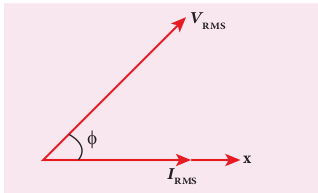

**_I_RMS**

**_V_RMS**

**x** 

Now, _IRMS_ is resolved into two perpendicular components, namely _IRMS_ cosφ along _VRMS_ and _IRMS_ sinφ perpendicular to _VRMS_ as shown in Figure 4.51.  

**Figure 4.51 The components of IRMS**

**_V_RMS**

**_I_RMScos**

**_I_RMS**

**_I_RMSsin**

 **x**

(i) The component of current _IRMS_ cosφ( ) which is in phase with the voltage is called active component. The power consumed by this current=_V IRMS RMS_ cosφ . So that it is also known as ‘Wattful’ current.

(ii) The other component _IRMS_ sinφ( )which has a phase angle of π

2 with the voltage is called reactive component. The power consumed is zero. Hence it is also known as ‘Wattless’ current. **The current in an AC circuit is said to**

**be wattless current if the power consumed by it is zero**. This wattless current occurs in a purely inductive or capacitive circuit.

### Power factor

The power factor of a circuit is defined in one of the following ways:

(i) **Power factor = cos ϕ = cosine of the angle of lead or lag**

(ii) **Power factor = _R Z_** \=

Resistance Impedance

(iii) **Power factor = _P_**

**_V I av_**

**_RMS RMS_**

\= True power

Apparent power

| VRMS |
|------|------|------|------|------|------|
| I cosRMS | |

| ine of e |
|------|

  

Some examples for power factors: (i) Power factor = cos 0° = 1 for a pure

resistive circuit because the phase angle _ϕ_ between voltage and current is zero.

(ii) Power factor = ±( )=cos π 2 0 for a

purely inductive or capacitive circuit because the phase angle _ϕ_ between voltage and current is ±π

2 . (iii) Power factor lies between 0 and 1 for

a circuit having _R_, _L_ and _C_ in varying proportions.

### Advantages and disadvantages of AC over DC

There are many advantages and disadvantages of AC system over DC system.

**Advantages:** (i) The generation of AC is cheaper than

that of DC. (ii) When AC is supplied at higher

voltages, the transmission losses are small compared to DC transmission.

(iii) AC can easily be converted into DC with the help of rectifiers.

**Disadvantages:** (i) Alternating voltages cannot be used for

certain applications such as charging of batteries, electroplating, electric traction etc.

(ii) At high voltages, it is more dangerous to work with AC than DC.

**EXAMPLE 4.26**

A series RLC circuit which resonates at 400 kHz has 80 μH inductor, 2000 pF capacitor and 50 Ω resistor. Calculate (i) Q-factor of the circuit (ii) the new value of capacitance when the value of inductance is doubled and (iii) the new Q-factor.  

**_Solution_**

_L_ = 80 × 10–6 H; _C_ = 2000 × 10–12 F _R_ = 50 Ω; _fr_ = 400 × 103Hz

(i) Q-factor, _Q R_

_L C_1

1 =

\= × ×

−

−

1 50

80 10 2000 10

6

12 = 4

(ii) When L2 = 2 L =2 × 80 × 10–6 H = 160 × 10–6 H,

_C f Lr_

2 2 2 2

1 4

\= π

\= × × ×( ) × × −

1

4 3 14 400 10 160 102 3 2 6.

 1000 10 12× − F

_C_2 1000 pF

(iii) _Q R_

_L C_2

2

2

6

12

1 1 50

160 10 1000 10

\= = × ×

−

−

\= × −

−

1 50

16 10 10

5

9 = ×4 10

50

2

\= 8

**EXAMPLE 4.27**

A capacitor of capacitance 10 4-

π F, an

inductor of inductance 2 π

H and a resistor of

resistance 100 Ω are connected to form a series _RLC_ circuit. When an AC supply of 220 V, 50 Hz is applied to the circuit, determine (i) the impedance of the circuit (ii) the peak value of current flowing in the circuit (iii) the power factor of the circuit and (iv) the power factor of the circuit at resonance.

**_Solution_**

_L C R_

_V fRMS_

\= = =

\= =

−2 10 100

220 50

4

π π H F

V Hz

; ;

;

Ω

| SolutionL = 80 × 10 H; C = 2000 × 10  FR = 50 Ω; f  = 400 × 10 Hz(i) Q-factor,  1 L–6  Q = –12R C3r 1 80×10  = 4=50 2000 ×101(ii) When L  = 2 L=2 × 80 × 10  H− 6= 160 × 10  H, − 121C = 24π fL –6–6()12 = 2243××.r142 400×10 ××160 10 1000×10 FC  1000 pF 23 2 −6−12(iii) 11 L 160×10Q ==2 R C 50 1000×1041× 0 − = 862 =2 1 16×10 50 −12250 10−5 2−9 |
|------|------|------|

| = |
  

_X fLL_ \= = × × =2 2 50 2 200π π π Ω

_X fCC_ \= =

× × =−

1 2

1

2 50 10 1004π π

π

Ω

(i) Impedance, _Z R X XL C_\= + −( )2 2

\= + −( )100 200 1002 2 =141 4. Ω

(ii) Peak value of current,

_I V Z_

_V Zm_

_m RMS_\= = 2

\= ×2 220

141 4. = 2.2 A

(iii) Power factor of the circuit,

cos .

.φ= = = _R Z_

100 141 4

0 707

(iv) Power factor at resonance,

cosφ= = = _R Z_

_R R_

1

## OSCILLATION IN LC CIRCUITS

### Energy conversion during LC oscillations

We have learnt that energy can be stored in both inductors and capacitors (Refer sections 1.8.2 and 4.3.2). In inductors, the energy is stored in the form of magnetic field while in capacitors, it is stored as the electric field.  

Whenever energy is given to a circuit containing a pure inductor of inductance _L_ and a capacitor of capacitance _C_, the energy oscillates back and forth between the magnetic field of the inductor and the electric field of the capacitor. Thus the electrical oscillations of definite frequency are generated. These oscillations are called **_LC_ oscillations**.

**Generation of LC oscillations** Let us assume that the capacitor is fully

charged with maximum charge _Qm_ at the initial stage. So that the energy stored in the capacitor is maximum and is given by

_U Q_

_CE m_\= 2

2 . As there is no current in the inductor, the energy stored in it is zero i.e., _UB_ \= 0. Therefore, the total energy is wholly electrical. This is shown in Figure 4.52(a).

The capacitor now begins to discharge through the inductor that establishes current _i_ in clockwise direction. This current produces a magnetic field around the inductor and the energy stored in

the inductor is given by _U Li B_ \=

2

2 . As

the charge in the capacitor decreases, the energy stored in it also decreases and is given by _U q_

_CE_ \= 2

2 . Thus there is a transfer of some part of energy from the capacitor to the inductor. At that instant, the total energy is the sum of electrical and magnetic energies (Figure 4.52(b)).

When the charges in the capacitor are exhausted, its energy becomes zero i.e., _UE_ \= 0 . The energy is fully transferred to the magnetic field of the inductor and its energy is maximum. This maximum energy

is given by _U LI B_

_m_\= 2

2 where _Im_ is the

| XfXLC |==22ππL ××50 2 = 200π1 1== =2πfC 1025π ××0π()edance, −4ZR=+ XX() 2 =141100 200 −100 LCk value of current,2 2V 2 VZ Z2×220 = 2.2 Am141.4 RMSwer factor of the circuit,R 100φ == = 0.707Z 141.4wer factor at resonance,R Rs φ == = 1Z R |Ω100 Ω |
|------|------|------|------|
| −2 |
| (i) Imp=+(ii) PeaI ===m(iii) Pocos(iv)  Poco |
| .4 Ω |

  

maximum current flowing in the circuit. The total energy is wholly magnetic (Figure 4.52(c)).

Even though the charge in the capacitor is zero, the current will continue to flow in the same direction because the inductor will not allow it to stop immediately. The current is made to flow with decreasing magnitude by the collapsing magnetic field of the inductor. As a result of this, the capacitor begins to charge in the opposite direction. A part of the energy is transferred from the inductor back to the capacitor. The total energy is the sum of the electrical and magnetic energies (Figure 4.52(d)).

When the current in the circuit reduces to zero, the capacitor becomes fully charged in the opposite direction. The energy stored in the capacitor becomes maximum. Since the current is zero, the energy stored in the inductor is zero. The total energy is wholly electrical (Figure 4.52(e)).

_LC i = 0_

(a)

_LC i_

(b) _UBUE_

_UBUE_

_UBUE UBUE_

_UBUE_

_C_

_LC_

(h)

_C_

\+ +

\+ +

++ ++

– – – –

– –

––

_i_ Wholly electrical

energy

Wholly magnetic energy

Wholly magnetic energy

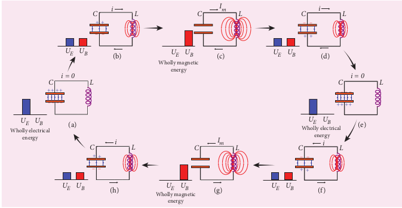

The state of the circuit is similar to the initial state but the difference is that the capacitor is charged in opposite direction. The capacitor then starts to discharge through the inductor with anti-clockwise current. The total energy is the sum of the electrical and magnetic energies (Figure 4.52(f)).

As already explained, the processes are repeated in opposite direction (Figure 4.52(g) and (h)). Finally, the circuit returns to the initial state (Figure 4.52(a)). Thus, when the circuit goes through these stages, an alternating current flows in the circuit. As this process is repeated again and again, the electrical oscillations of definite frequency are generated. These are known as _LC_ oscillations.

In the ideal _LC_ circuit, there is no loss of energy. Therefore, the oscillations will continue indefinitely. Such oscillations are called undamped oscillations.

_LC i = 0_

(e)

_UBUE_

_UBUE_

_UBUE_

_L_

(c)

_m LC_

(d)

_L_

(g)

_LC_

(f)

+

\+ +

+

++++

––––

–

– –

–

_i_

_iI_

_Im_

Wholly electrical energy

  

But in practice, the Joule heating and radiation of electromagnetic waves from

the circuit decrease the energy of the system. Therefore, the oscillations become damped oscillations.

**Note**

### Conservation of energy in LC oscillations

During _LC_ oscillations in _LC_ circuits, the energy of the system oscillates between the electric field of the capacitor and the magnetic field of the inductor. Although, these two forms of energy vary with time, the total energy remains constant. It means that _LC_ oscillations take place in accordance with the law of conservation of energy.

Total energy,_U U U q C_

_LiE B_\= + = + 2

2

2

1

2

Let us consider 3 different stages of _LC_ oscillations and calculate the total energy of the system.

**Case (i)** When the charge in the capacitor, _q Qm_\= and the current through the inductor, _i_ \= 0, the total energy is given by

_U Q_

_C Q_

_C m m_\= + = 2 2

2 0

2 (4.56)

The total energy is wholly electrical.

**Case (ii)** When charge = 0 ; current = _Im_ , the total energy is

_U LI LIm m_\= + =0 1 2

1 2

2 2  

\= × 

 



 

_L Q LC_

_m_

2

2

since _I Q Q LCm m_

_m_\= =ω

\= _Q_

_C m_

2

2 (4.57)

The total energy is wholly magnetic.

**Case (iii)** When charge = _q_; current = _i_, the total energy is

_U q C_

_Li_\= + 2

2

2

1

2

Since _q Q tm_\= cos ,ω _i dq dt_

_Q tm_\=− = ω ωsin . The negative sign in current indicates that the charge in the capacitor decreases with time.

_U Q t_

_C L Q tm m_

\= + 2 2 2 2 2

2 2 cos sinω ω ω

\= + _Q t_

_C LQ t_

_LC m m_ 2 2 2 2

2 2 cos sinω ω

since ω2 1 =

_LC_

\= +( ) _Q_

_C t tm_

2 2 2

2 cos sinω ω

_U Q_

_C m_

\= 2

2 (4.58)

From above three cases, it is clear that the total energy of the system remains constant.

### Analogies between LC oscillations and simple harmonic oscillations

**Qualitative treatment** The electromagnetic oscillations of _LC_

system can be compared with the mechanical oscillations of a spring-mass system.

There are two forms of energy involved in _LC_ oscillations. One is electrical energy of the charged capacitor; the other magnetic energy of the inductor carrying current.

**Table 4.2 Energy in two oscillatory systems**

|             | **LC oscillator**                                                                     |             | **Spring-mass system**                                                               |
|-------------|---------------------------------------------------------------------------------------|-------------|--------------------------------------------------------------------------------------|
| **Element** | **Energy**                                                                            | **Element** | **Energy**                                                                           |
| Capacitor   | Electrical Energy =  \\( \frac{1}{2}(\frac{1}{C})q^2\\)    | Spring      | Potential energy = \\( \frac{1}{2}k x^2 \\)             |
| Inductor    | Magnetic energy = \\( \frac{1}{2}Li^2 i=\frac{dq}{dt}\\) | Mass        | Kinetic energy = \\( \frac{1}{2}mv^2 v=\frac{dx}{dt}\\) |

Likewise, the mechanical energy of the spring-mass system exists in two forms; the potential energy of the compressed or extended spring and the kinetic energy of the mass. The Table 4.2 lists these two pairs of energy.

By examining the Table 4.2, the analogies between the various quantities can be understood and these correspondences are given in Table 4.3.

The angular frequency of oscillations of a spring-mass is given by (Refer equation 10.22 of section 10.4.1 of XI physics text book).

ω = _k m_

From Table 4.3, _k C_→ 1 and _m L_→ . Therefore, the angular frequency of _LC_ oscillations is given by

ω = 1 _LC_(4.58)

**Table 4.3 Analogies between electrical and mechanical quantities**

| **Electrical system**                                                                                         | **Mechanical system**                                                                        |
|---------------------------------------------------------------------------------------------------------------|----------------------------------------------------------------------------------------------|
| Charge q                                                                                                      | Displacement x                                                                               |
| Current i = \\( \frac{dq}{dt}\\)                                                 | Velocity v = \\( \frac{dx}{dt}\\)                               |
| Inductance L                                                                                                  | Mass m                                                                                       |
| Reciprocal of capacitance \\( \frac{1}{C}\\)                                     | Force constant k                                                                             |
| Electrical energy = \\( \frac{1}{2}(\frac{1}{C}q^2)\\)                           | Potential energy = \\( \frac{1}{2}k x^2\\)                      |
| Magnetic energy = \\( \frac{1}{2}Li^2\\)                                         | Kinetic energy = \\( \frac{1}{2}mv^2\\)                         |
| Electromagnetic energy  U = \\( \frac{1}{2}(\frac{1}{C})q^2 + \frac{1}{2}Li^2\\) | Mechanical energy E = \\( \frac{1}{2}k x^2 + \frac{1}{2}mv^2\\) |

  

„ Whenever the magnetic flux linked with and hence an electric current flows in t electromagnetic induction.

„ Faraday’s first law states that whenever changes, an emf is induced in the circuit.

„ Faraday’s second law states that the magn equal to the time rate of change of magne

„ Lenz’s law states that the direction of t opposes the cause responsible for its prod

„ Lenz’s law is established on the basis of th „ Fleming’s right hand rule states that if th

magnetic field and the thumb indicates then the middle finger will indicate the d

„ Even for a conductor in the form of a sheet flux linked with it changes. The induced called Eddy currents or Foucault currents

„ Inductor is a device used to store energy i flows through it.

„ If the flux linked with the coil is changed phenomenon is known as self-induction.

„ When an electric current passing through in the neighbouring coil. This phenomen emf is called mutually induced emf.

„ AC generator or alternator is an energy energy used to rotate the coil or field mag

„ In some AC generators, there are three sep emfs. Hence they are called three-phase A

„ Transformer is a stationary device used circuit to another without changing its fr

„ The efficiency of a transformer is defined the input power.

„ An alternating voltage is a voltage which c and the resulting alternating current chan

„ The average value of alternating current current over a positive half-circle or nega

„ The root mean square value or effective v the square root of the mean of the square

**S U M M A R Y**  

a closed coil changes, an emf is induced he circuit. This phenomenon is known as

magnetic flux linked with a closed circuit

itude of induced emf in a closed circuit is tic flux linked with the circuit. he induced current is such that it always uction. e law of conservation of energy. e index finger points the direction of the

the direction of motion of the conductor, irection of the induced current. or a plate, an emf is induced when magnetic currents flow in concentric circular paths . n a magnetic field when an electric current

, an emf is induced in that same coil. This The emf induced is called self-induced emf. a coil changes with time, an emf is induced on is known as mutual induction and the

conversion device. It converts mechanical net into electrical energy. arate coils, which would give three separate C generators.

to transform AC electric power from one equency. as the ratio of the useful output power to

hanges polarity at regular intervals of time ges direction accordingly. is defined as the average of all values of tive half-circle. alue of an alternating current is defined as s of all currents over one cycle.

  

„ A sinusoidal alternating voltage (or curr rotates about the origin in anti-clockwis Such a rotating vector is called a phasor.

„ When the frequency of the applied alterna of the RLC circuit, the current in the cir circuit is said to be in electrical resonance

„ The magnification of voltages at series res „ Power of a circuit is defined as the rate

circuit. It depends on the components of „ Whenever energy is given to a LC cir

frequency are generated. These oscillation „ During LC oscillations, the total energ

oscillations take place in accordance with  

ent) can be represented by a vector which e direction at a constant angular velocity.

ting source is equal to the natural frequency cuit reaches its maximum value. Then the . onance is termed as Q–factor. of consumption of electric energy in that the circuit. cuit, the electrical oscillations of definite s are called LC oscillations. y remains constant. It means that LC the law of conservation of energy.

  

**El ec**

**tr om**

**ag ne**

**tic in**

**du ct**

**io n**

**Fa ra**

**da y’s**

**la w**

**Ed dy**

**’s cu**

**rr en**

**ts**

**D em**

**on st**

**ra tio**

**n**

**Se lf-**

**in du**

**ct io**

**n**

**M ut**

**ua l i**

**nd uc**

**tio n**

**M et**

**ho ds**

**o f**

**in du**

**ci ng**

**em f**

**A lte**

**rn at**

**in g**

**cu rr**

**en ts**

**El ec**

**tr om**

**ag ne**

**tic in**

**du ct**

**io n**

**RM S**

**va lu**

**e**

**Po we**

**r i n**

**AC ci**

**rc ui**

**ts**

**W at**

**tle ss**

**cu rr**

**en t**

**LC o**

**sc ill**

**at io**

**ns**

**En er**

**gy co**

**nv er**

**sio n**

**El ec**

**tr om**

**ag ne**

**tic in**

**du ct**

**io n**

**an d**

**A lte**

**rn at**

**in g**

**cu rr**

**en ts**

**M ea**

**n va**

**lu e**

**C O**

**N C**

**E P**

**T M**

**A P**  

**Le nz**

**’s la**

**w**

**Fl em**

**in g’s**

**R H**

**ru le**

**M ot**

**io na**

**l e m**

**f**

**Fr om**

**Lo re**

**nt z f**

**or ce**

**Fr om**

**Fa ra**

**da y’s**

**la w**

**Ap pl**

**ic at**

**io ns**

**By ch**

**an gi**

**ng**

**m ag**

**ne tic**

** el**

**d By**

**ch an**

**gi ng**

**ar ea**

**Si ng**

**le -p**

**ha se**

**A**

**C g**

**en er**

**at or**

** re**

**e- ph**

**as e**

**A C**

**g en**

**er at**

**or**

**Tr an**

**sf or**

**m er**

**By ch**

**an gi**

**ng**

**or ie**

**nt at**

**io n**

**Re sis**

**tiv e c**

**irc ui**

**t**

**In du**

**ct iv**

**e c ir**

**cu it**

**Ca pa**

**ci tiv**

**e c ir**

**cu it**

**RL C**

**se ri**

**es ci**

**rc ui**

**t**

**Po we**

**r f ac**

**to r**

**M er**

**its an**

**d D**

**em er**

**its o**

**f A C**

**En er**

**gy co**

**ns er**

**va tio**

**n**

**M ec**

**ha ni**

**ca l**

**an al**

**og ie**

**s**

  

**I Multiple Choice Questions**

**1\.** An electron moves on a straight line path XY as shown in the figure. The coil _abcd_ is adjacent to the path of the electron. What will be the direction of current, if any, induced in the coil?

(NEET 2015)

**b**

**a**

**d**

**x yc**

**Electron**

(a) The current will reverse its direction as the electron goes past the coil

(b) No current will be induced (c) abcd (d) adcb

**2\.** A thin semi-circular conducting ring (PQR) of radius r is falling with its plane vertical in a horizontal magnetic field B, as shown in the figure.

**× ×**

**× ×**

**×**

**× ×**

**× ×**

**×**

**× ×**

**× ×**

**×**

**× ×**

**× ×**

**×**

**× ×**

**× ×**

**×**

**× ×**

**× ×**

**×**

**P R**

**r**

**Q**

The potential difference developed across the ring when its speed _v_ , is

(NEET 2014)  

**EVALUATION**

(a) Zero

(b) _B rv_π 2

2 and P is at higher potential

(c) π_rBv_ and R is at higher potential (d) 2_rBv_ and R is at higher potential

3\. The flux linked with a coil at any instant t is given by Φ_B t t_\= − +10 50 250

2 . The induced emf at t = 3 s is (a) −190 V (b) −10 V

(c) 10 V (d) 190 V

**4\.** When the current changes from +2A to **−**2A in 0.05 s, an emf of 8 V is induced in a coil. The co-efficient of self-induction of the coil is (a) 0.2 H (b) 0.4 H (c) 0.8 H (d) 0.1 H

5\. The current i flowing in a coil varies with time as shown in the figure. The variation of induced emf with time would be (NEET 2011)

**O T/4 T/2 3T/4 T t**

**_i_**

(a)

**O T/4**

**T/2 3T/4 T t**

**emf**

(b) **O T/4 T/2 3T/4 T**

**t**

**emf**

(c)

**O T/4 T/2 3T/4**

**T t**

**emf**

(d)

**O T/4**

**T/2 3T/4**

**T t**

**emf**

| T |
  

**6\.** A circular coil with a cross-sectional area of 4 cm2 has 10 turns. It is placed at the centre of a long solenoid that has 15 turns/cm and a cross-sectional area of 10 cm2. The axis of the coil coincides with the axis of the solenoid. What is their mutual inductance? (a) 7.54 µH (b) 8.54 µH (c) 9.54 µH (d) 10.54 µH

**7\.** In a transformer, the number of turns in the primary and the secondary are 410 and 1230 respectively. If the current in primary is 6A, then that in the secondary coil is (a) 2 A (b) 18 A (c) 12 A (d) 1 A

**8\.** A step-down transformer reduces the supply voltage from 220 V to 11 V and increase the current from 6 A to 100 A. Then its efficiency is (a) 1.2 (b) 0.83 (c) 0.12 (d) 0.9

**9\.** In an electrical circuit, _R, L, C_ and AC voltage source are all connected in series. When _L_ is removed from the circuit, the phase difference between the voltage and current in the circuit is π

3 . Instead, if C is removed from the circuit, the phase difference is again π 3 . The power factor of the circuit is

(NEET 2012)

(a) 1 2

(b) 1

2

(c) 1 (d) 3 2

**10\.** In a series RL circuit, the resistance and inductive reactance are the same.  

Then the phase difference between the voltage and current in the circuit is

(a) π 4

(b) π 2

(c)π 6

(d) zero **11\.** In a series resonant _RLC_ circuit, the

voltage across 100 Ω resistor is 40 V. The resonant frequency ω is 250 rad/s. If the value of C is 4 µF, then the voltage across L is (a) 600 V (b) 4000 V (c) 400V (d) 1 V

**12\.** An inductor 20 mH, a capacitor 50 μF and a resistor 40 Ω are connected in series across a source of emf V = 10 sin 340 t. The power loss in AC circuit is (a) 0.76 W (b) 0.89 W (c) 0.46 W (d) 0.67 W

13\. The instantaneous values of alternating current and voltage in a circuit are

_i t_\= ( )1 2

100sin π A and

_v_ \= + 

 



 

1 2

100 3

sin π π_t_ V.

The average power in watts consumed in the circuit is (IIT Main 2012)

(a) 1 4

(b) 3

4

(c) 1 2

(d) 1 8

**14\.** In an oscillating LC circuit, the maximum charge on the capacitor is Q. The charge on the capacitor when the energy is stored equally between the electric and magnetic fields is

(a) _Q_ 2

(b) _Q_ 3

(c) _Q_ 2

(d) Q

  

**15\.** 20 2π

H inductor is connected to a

capacitor of capacitance C. The value of C in order to impart maximum power at 50 Hz is (a) 50 μF (b) 0.5 μF (c) 500 μF (d) 5 μF

**Answers**

**1)** a **2)** d **3)** b **4)** d **5)** a **6)** a **7)** a **8)** b **9)** c **10)** a **11)** c **12)** c **13)** d **14)** c **15)** d

**II Short Answer Questions**

**1\.** What is meant by electromagnetic induction?

**2\.** State Faraday’s laws of electromagnetic induction.

**3\.** State Lenz’s law. **4\.** State Fleming’s right hand rule. **5\.** How is Eddy current produced? How

do they flow in a conductor? **6\.** Mention the ways of producing induced

emf. **7\.** What for an inductor is used? Give

some examples. **8\.** What do you mean by self-induction? **9\.** What is meant by mutual induction? **10\.** Give the principle of AC generator. **11\.** List out the advantages of stationary

armature-rotating field system of AC generator.

**12\.** What are step-up and step-down transformers?

13\. Define average value of an alternating current.  

14\. How will you define RMS value of an alternating current?

**15\.** What are phasors? 16. Define electric resonance. **17\.** What do you mean by resonant

frequency? 18. How will you define Q-factor? **19\.** What is meant by wattles current? 20. Give any one definition of power factor. **21\.** What are LC oscillations?

**III Long Answer Questions**

**1\.** Establish the fact that the relative motion between the coil and the magnet induces an emf in the coil of a closed circuit.

**2\.** Give an illustration of determining direction of induced current by using Lenz’s law.

**3\.** Show that Lenz’s law is in accordance with the law of conservation of energy.

**4\.** Obtain an expression for motional emf from Lorentz force.

**5\.** Give the uses of Foucault current. 6. Define self-inductance of a coil interms

of (i) magnetic flux and (ii) induced emf.

7\. How will you define the unit of inductance?

**8\.** What do you understand by self- inductance of a coil? Give its physical significance.

**9\.** Assuming that the length of the solenoid is large when compared to its diameter, find the equation for its inductance.

  

**10\.** An inductor of inductance L carries an electric current i. How much energy is stored while establishing the current in it?

**11\.** Show that the mutual inductance between a pair of coils is same (M12 = M21).

**12\.** How will you induce an emf by changing the area enclosed by the coil?

**13\.** Show mathematically that the rotation of a coil in a magnetic field over one rotation induces an alternating emf of one cycle.

**14\.** Elaborate the standard construction details of AC generator.

**15\.** Explain the working of a single-phase AC generator with necessary diagram.

16\. How are the three different emfs generated in a three-phase AC generator? Show the graphical representation of these three emfs.

**17\.** Explain the construction and working of transformer.

**18\.** Mention the various energy losses in a transformer.

**19\.** Give the advantage of AC in long distance power transmission with an illustration.

**20\.** Find out the phase relationship between voltage and current in a pure inductive circuit.

**21\.** Derive an expression for phase angle between the applied voltage and current in a series RLC circuit.

22\. Define inductive and capacitive reactance. Give their units.

**23\.** Obtain an expression for average power of AC over a cycle. Discuss its special cases.  

**24\.** Explain the generation of LC oscillations in a circuit containing an inductor of inductance L and a capacitor of capacitance C.

**25\.** Prove that the total energy is conserved during LC oscillations.

**26\.** Compare the electromagnetic oscillations of LC circuit with the mechanical oscillations of block- spring system qualitatively to find the expression for angular frequency of LC oscillator.

**IV. Numerical problems**

**1\.** A square coil of side 30 cm with 500 turns is kept in a uniform magnetic field of 0.4 T. The plane of the coil is inclined at an angle of 30o to the field. Calculate the magnetic flux through the coil. (Ans: 9 Wb)

**2\.** A straight metal wire crosses a magnetic field of flux 4 mWb in a time 0.4 s. Find the magnitude of the emf induced in the wire. (Ans: 10 mV)

3\. The magnetic flux passing through a coil perpendicular to its plane is a function of time and is given by Φ_B t t t_\= + + +( )2 4 8 8

3 2 Wb. If the

resistance of the coil is 5 Ω, determine the induced current through the coil at a time t = 3 second. (Ans: 17.2 A)

**4\.** A closely wound circular coil of radius 0.02 m is placed perpendicular to the magnetic field. When the magnetic field is changed from 8000 T to 2000 T in 6 s, an emf of 44 V is induced in it. Calculate the number of turns in the coil.

(Ans: 35 turns)

  

**5\.** A rectangular coil of area 6 cm2 having 3500 turns is kept in a uniform magnetic field of 0.4 T. Initially, the plane of the coil is perpendicular to the field and is then rotated through an angle of 180o. If the resistance of the coil is 35 Ω, find the amount of charge flowing through the coil.

(Ans: 48 × 10–3 C) **6\.** An induced current of 2.5 mA

flows through a single conductor of resistance 100 Ω. Find out the rate at which the magnetic flux is cut by the conductor.

(Ans: 250 mWbs–1) **7\.** A fan of metal blades of length 0.4 m

rotates normal to a magnetic field of 4 10

3× − T . If the induced emf between

the centre and edge of the blade is 0.02 V, determine the rate of rotation of the blade.

(Ans: 9.95 revolutions/second) **8\.** A bicycle wheel with metal spokes of

1 m long rotates in Earth’s magnetic field. The plane of the wheel is perpendicular to the horizontal component of Earth’s field of 4 10

5× − T.

If the emf induced across the spokes is 31.4 mV, calculate the rate of revolution of the wheel.

(Ans: 250 revolutions/second) **9\.** Determine the self-inductance of 4000

turn air-core solenoid of length 2m and diameter 0.04 m. (Ans: 12.62 mH)

**10\.** A coil of 200 turns carries a current of 4 A. If the magnetic flux through the coil is 6 × 10–5 Wb, find the magnetic energy stored in the medium surrounding the coil. (Ans: 0.024 J)  

**11\.** A 50 cm long solenoid has 400 turns per cm. The diameter of the solenoid is 0.04 m. Find the magnetic flux linked with each turn when it carries a current of 1 A.

(Ans: 0.63 × 10–4 Wb) **12\.** A coil of 200 turns carries a current of

0.4 A. If the magnetic flux of 4 mWb is linked with each turn of the coil, find the inductance of the coil. (Ans: 2H)

**13\.** Two air core solenoids have the same length of 80 cm and same cross–sectional area 5 cm2. Find the mutual inductance between them if the number of turns in the first coil is 1200 turns and that in the second coil is 400 turns. (Ans: 0.38 mH)

**14\.** A long solenoid having 400 turns per cm carries a current 2A. A 100 turn coil of cross-sectional area 4 cm2 is placed co-axially inside the solenoid so that the coil is in the field produced by the solenoid. Find the emf induced in the coil if the current through the solenoid reverses its direction in 0.04 sec.

(Ans: 0.20 V) **15\.** A 200 turn circular coil of radius

2 cm is placed co-axially within a long solenoid of 3 cm radius. If the turn density of the solenoid is 90 turns per cm, then calculate mutual inductance of the coil and the solenoid.

(Ans: 2.84 mH) 16. The solenoids S1 and S2 are wound on

an iron-core of relative permeability 900. Their areas of their cross-section and their lengths are the same and are 4 cm2 and 0.04 m respectively. If the number of turns in S1 is 200 and

  

that in S2 is 800, calculate the mutual inductance between the solenoids. If the current in solenoid 1 is increased form 2A to 8A in 0.04 second, calculate the induced emf in solenoid 2.

(Ans: 1.81H; –271.5 V)

**17\.** A step-down transformer connected to main supply of 220 V is used to operate 11V,88W lamp. Calculate (i) Voltage transformation ratio and (ii) Current in the primary.

(Ans: 1/20 and 0.4 A)

**18\.** A 200V/120V step-down transformer of 90% efficiency is connected to an induction stove of resistance 40 Ω. Find the current drawn by the primary of the transformer.

(Ans: 2 A) 19. The 300 turn primary of a transformer

has resistance 0.82 Ω and the resistance of its secondary of 1200 turns is 6.2 Ω. Find the voltage across the primary if the power output from the secondary at 1600V is 32 kW. Calculate the power losses in both coils when the transformer efficiency is 80%.

(Ans: 8.2 kW and 2.48 kW) **20\.** Calculate the instantaneous value at

60o, average value and RMS value of an alternating current whose peak value is 20 A. (Ans: 17.32A, 12.74A, 14.14A)

**V. Conceptual Questions**

**1\.** A graph between the magnitude of the magnetic flux linked with a closed loop and time is given in the figure. Arrange  

the regions of the graph in ascending order of the magnitude of induced emf in the loop.

**0 time**

**Magnetic ux**

**a**

**b c**

**d**

**2\.** Using Lenz’s law, predict the direction of induced current in conducting rings 1 and 2 when current in the wire is steadily decreasing.

**1**

**2**

3\. A flexible metallic loop abcd in the shape of a square is kept in a magnetic field with its plane perpendicular to the field. The magnetic field is directed into the paper normally. Find the direction of the induced current when the square loop is crushed into an irregular shape as shown in the figure.

**b b**

**c**

**a a**

**d cd**

**× × × ×**

**× × × ×**

**× × × ×**

**× × × ×**

**×**

**×**

**×**

**×**

**×**

**×**

**×**

**×**

**×**

**×**

**×**

**×**

**×**

**×**

**×**

**×**

**×**

**×**

**×**

**×**

| a |cd |
|------|------|------|------|

  

**4\.** Predict the polarity of the capacitor in a closed circular loop when two bar magnets are moved as shown in the figure.

**A**

**B** N S N S

**BOOK FOR REFERENCES**

**1\.** H.C.Verma, Concepts of Physics, Volume

**2\.** Halliday, Resnick and Walker, Principles o

**3\.** D.C.Tayal, Electricity and Magnetism, Him

**4\.** K.K.Tewari, Electricity and Magnetism wit

5\. B.L.Theraja and A.K.Theraja, A text book S.Chand publishers.  

**25\.** In series LC circuit, the voltages across L and C are 180° out of phase. Is it correct? Explain.

**26\.** When does power factor of a series RLC circuit become maximum?

1 and 2, Bharathi Bhawan publishers.

f Physics, Wiley publishers.

alaya Publishing House.

h Electronics, S.Chand Publishers.

of Electrical Technology, Volume 1 and 2,

  

**Electromagnetic inductio ICT CORNER**

**Step1**

**Step3**

In this activity you will be able to (1) understand electromagnetic induction.

(2) verify Faraday’s laws in virtual lab.

**STEPS:** • Open the browser and type “phet.colorado

simulation tab. Search Faraday’s electromagn • Select ‘pick coil’ tab. Move the magnet thro

magnetic field linked with the coil changes. C the intensity of current with the help of glow

• Select ‘Electromagnet’ tab, Change the curre change in magnetic flux generated.

• Select ‘Generator’ tab. Observe induced emf of the coil.

**Note:** Install Java application if it is not in your system. simulation and works in off line from https://phet.c

**URL:** https://phet.colorado.edu/en/simulation/legacy/farada

\* Pictures are indicative only. \* If browser requires, allow **Flash Player** or **Java Sc**  

**n and alternating current**

**Step4**

**Step2**

.edu” in the address bar. Click play with etic lab in the search box. ugh the coil. Note what happens when the hange the loop area, flux change and observe ing bulb. nt flowing through the coil and observe the

in the coil if you change the angular velocity

**Topic: Faraday’s electromagnetic lab**

You can download all the phet olorado.edu/en/offline-access.

y

**ript** to load the page.

