# 4 ELECTROMAGNETIC INDUCTION AND ALTERNATING CURRENT

> "Nature is our kindest friend and best critic in experimental science if we only allow her intimations to fall unbiased on our minds" – Michael Faraday

## 4.1 ELECTROMAGNETIC INDUCTION

### 4.1.1 Introduction

In the previous chapter, we have learnt that whenever an electric current flows through a conductor, it produces a magnetic field around it. This was discovered by Christian Oersted. Later, Ampere proved that a current-carrying loop behaves like a bar magnet. These are the magnetic effects produced by the electric current.

Physicists then began to think of the converse effect. Is it possible to produce an electric current with the help of a magnetic field? A series of experiments were conducted to establish the converse effect. These experiments were done by Michael Faraday of UK and Joseph Henry of USA, almost simultaneously and independently. These attempts became successful and led to the discovery of the phenomenon, called Electromagnetic Induction. Michael Faraday is credited with the discovery of electromagnetic induction in 1831.

In this chapter, let us see a few experiments of Faraday, the results and the phenomenon of Electromagnetic Induction. Before that, we will recollect the concept of magnetic flux linked with a surface area.

#### An anecdote!

Michael Faraday was enormously popular for his lectures as well. In one of his lectures, he demonstrated his experiments which led to the discovery of electromagnetic induction.

At the end of the lecture, one member of the audience approached Faraday and said, "Mr. Faraday, the behaviour of the magnet and the coil of wire was interesting, but what is the use of it?" Faraday answered politely, "Sir, what is the use of a newborn baby?"

Note: We will soon see the greatness of 'that little child' who has now grown as an adult to cater to the energy needs.

### 4.1.2 Magnetic Flux $(\Phi_{\mathrm{B}})$

The magnetic flux $\Phi_{\mathrm{B}}$ through an area $A$ in a magnetic field is defined as the number of magnetic field lines passing through that area normally and is given by the equation (Figure 4.1(a)).

$$
\Phi_{\mathrm{B}} = \int \limits_{A}^{\infty}\overline{B}\cdot \mathrm{d}\overline{A} \quad (4.1)
$$

where the integral is taken over the area $A$ and $\theta$ is the angle between the direction of the magnetic field and the outward normal to the area.

If the magnetic field $\overline{B}$ is uniform over the area $A$ and is perpendicular to the area as shown in Figure 4.1(b), then the above equation becomes

$$
\Phi_{\mathrm{B}} = \int \limits_{A}^{\infty}\overline{B}\cdot \mathrm{d}\overline{A} = BA\cos \theta = BA\qquad \mathrm{since} \ \theta = 0^{\circ},\cos 0^{\circ} = 1
$$

The SI unit of magnetic flux is $\mathrm{Tm}^2$. It is also measured in weber or Wb.

$$
1\mathrm{Wb} = 1\mathrm{Tm}^2
$$

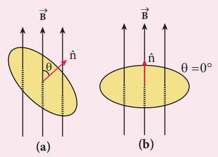

Figure 4.1 Magnetic flux 

#### EXAMPLE 4.1

A circular antenna of area $3\mathrm{m}^2$ is installed at a place in Madurai. The plane of the area of antenna is inclined at $47^{\circ}$ with the direction of Earth's magnetic field. If the magnitude of Earth's field at that place is $4.1\times 10^{-5}\mathrm{T}$ find the magnetic flux linked with the antenna.

#### Solution

$$
B = 4.1\times 10^{-5}\mathrm{T};\ \theta = 90^{\circ} - 47^{\circ} = 43^{\circ};\ A = 3\mathrm{m}^2
$$

We know that $\Phi_{B} = BA\cos \theta$

$$
\Phi_{B} = 4.1\times 10^{-5}\times 3\times \cos 43^{\circ} = 4.1\times 10^{-5}\times 3\times 0.7314 = 89.96\mu \mathrm{Wb}
$$

#### EXAMPLE 4.2

A circular loop of area $5\times 10^{-2}\mathrm{m}^2$ rotates in a uniform magnetic field of $0.2\mathrm{T}$. If the loop rotates about its diameter which is perpendicular to the magnetic field as shown in figure. Find the magnetic flux linked with the loop when its plane is (i) normal to the field (ii) inclined $60^{\circ}$ to the field and (iii) parallel to the field.

#### Solution

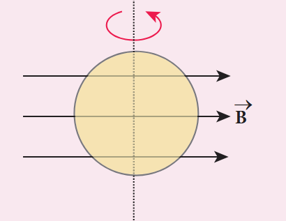

$$
A = 5\times 10^{-2}\mathrm{m}^2;\ B = 0.2\mathrm{T}
$$

(i) $\theta = 0^{\circ}$;
$$
\Phi_{B} = BA\cos \theta = 0.2\times 5\times 10^{-2}\times \cos 0^{\circ} = 1\times 10^{-2}\mathrm{Wb}
$$

(ii) $\theta = 90^{\circ} - 60^{\circ} = 30^{\circ}$;
$$
\Phi_{B} = BA\cos \theta = 0.2\times 5\times 10^{-2}\times \cos 30^{\circ} = 1\times 10^{-2}\times \frac{\sqrt{3}}{2} = 8.66\times 10^{-3}\mathrm{Wb}
$$

(iii) $\theta = 90^{\circ}$;
$$
\Phi_{B} = BA\cos 90^{\circ} = 0
$$

### 4.1.3 Faraday's Experiments on Electromagnetic Induction

#### First Experiment

Consider a closed circuit consisting of a coil $C$ of insulated wire and a galvanometer $G$ (Figure 4.2(a)). The galvanometer does not indicate deflection as there is no electric current in the circuit.

When a bar magnet is inserted into the stationary coil, with its north pole facing the coil, there is a momentary deflection in the galvanometer. This indicates that an electric current is set up in the coil (Figure 4.2(b)). If the magnet is kept stationary inside the coil, the galvanometer does not indicate deflection (Figure 4.2(c)).

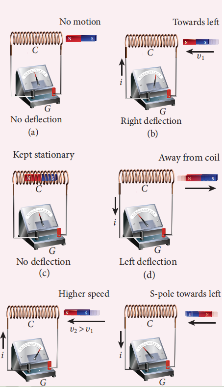

The bar magnet is now withdrawn from the coil, the galvanometer again gives a momentary deflection but in the opposite direction. So the electric current flows in opposite direction (Figure 4.2(d)). Now if the magnet is moved faster, it gives a larger deflection due to a greater current in the circuit (Figure 4.2(e))

The bar magnet is reversed i.e., the south pole now faces the coil. When the above experiment is repeated, the deflections are opposite to that obtained in the case of north pole (Figure 4.2(f)).

If the magnet is kept stationary and the coil is moved towards or away from the coil, similar results are obtained. It is concluded that whenever there is a relative motion between the coil and the magnet, there is deflection in the galvanometer, indicating the electric current setup in the coil.

#### Second Experiment

Consider two closed circuits as shown in Figure 4.3(a). The circuit consisting of a coil $P$ a battery $B$ and a key $K$ is called as primary circuit while the circuit with a coil $S$ and a galvanometer $G$ is known as secondary circuit. The coils $P$ and $S$ are kept at rest in close proximity with respect to one another.

If the primary circuit is closed, electric current starts flowing in the primary circuit. At that time, the galvanometer gives a momentary deflection (Figure 4.3(a)).

After that, when the electric current reaches a certain steady value, no deflection is observed in the galvanometer.

Likewise if the primary circuit is broken, the electric current starts decreasing and there is again a sudden deflection but in the opposite direction (Figure 4.3(b)).

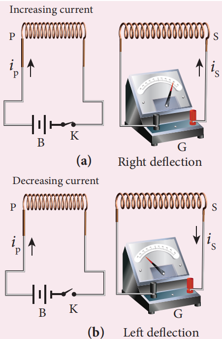

When the electric current becomes zero, the galvanometer shows no deflection.

From the above observations, it is concluded that whenever the electric current in the primary circuit changes, the galvanometer shows a deflection.

#### Faraday's Law of Electromagnetic Induction

From the results of his experiments, Faraday realized that whenever the magnetic flux linked with a closed coil changes, an emf (electromotive force) is induced and hence an electric current flows in the circuit. This current is called an induced current and the emf giving rise to such current is called an induced emf. This phenomenon is known as electromagnetic induction.

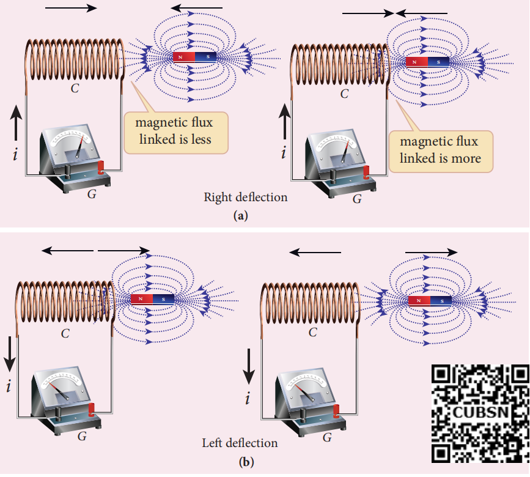

Based on this idea, Faraday's experiments are understood in the following way. In the first experiment, when a bar magnet is placed close to a coil, some of the magnetic field lines of the bar magnet pass through the coil i.e., the magnetic flux is linked with the coil. When the bar magnet and the coil approach each other, the magnetic flux linked with the coil increases. So this increase in magnetic flux induces an emf and hence a transient electric current flows in the circuit in one direction (Figure 4.4(a)).

At the same time, when they recede away from one another, the magnetic flux linked with the coil decreases. The decrease in magnetic flux again induces an emf in opposite direction and hence an electric current flows in opposite direction (Figure 4.4(b)). So there is deflection in the galvanometer when there is a relative motion between the coil and the magnet.

In the second experiment, when the primary coil $P$ carries an electric current, a magnetic field is established around it. The magnetic lines of this field pass through itself and the neighbouring secondary coil S.

When the primary circuit is open, no electric current flows in it and hence the magnetic flux linked with the secondary coil is zero (Figure 4.5(a)).

However, when the primary circuit is closed, the increasing current builds up a magnetic field around the primary coil. Therefore, the magnetic flux linked with the secondary coil increases. This increasing flux linked induces a transient electric current in the secondary coil (Figure 4.5(b)). When the electric current in the primary coil reaches a steady value, the magnetic flux linked with the secondary coil does not change and the electric current in the secondary coil will disappear.

Similarly, when the primary circuit is broken, the decreasing primary current induces an electric current in the secondary coil, but in the opposite direction (Figure 4.5(c)). So there is deflection in the galvanometer whenever there is a change in the primary current.

The conclusions of Faraday's experiments are stated as two laws.

#### First law

Whenever magnetic flux linked with a closed circuit changes, an emf is induced in the circuit which lasts in the circuit as long as the magnetic flux is changing.

#### Second law

The magnitude of induced emf in a closed circuit is equal to the time rate of change of magnetic flux linked with the circuit.

If the magnetic flux linked with each turn of the coil changes by $d\Phi_{B}$ in a time $dt$, then the induced emf in each turn is given by

$$
\epsilon = \frac{d\Phi_B}{dt}
$$

If a coil consisting of $N$ turns is tightly wound such that each turn covers the same area, then the flux through each turn will be the same. Then total emf induced in the coil is given by

$$
\epsilon = N\frac{d(\Phi_B)}{dt} = \frac{d(N\Phi_B)}{dt} \quad (4.2)
$$

Here $N\Phi_{B}$ is called flux linkage, defined as the product of number of turns $N$ of the coil and the magnetic flux linking each turn of the coil $\Phi_{B}$.

#### Importance of Electromagnetic Induction!

The application of the phenomenon of Electromagnetic Induction is almost everywhere in the present day life. Right from home appliances to huge factory machineries, from cellphone to computers and internet, from electric guitar to satellite communication, all need electricity for their operation. There is an ever growing demand for electric power.

All these are met with the help of electric generators and transformers which function on electromagnetic induction. The modern, sophisticated human life would not be possible without the discovery of electromagnetic induction.

#### ACTIVITY

#### Exploring Electromagnetic Induction

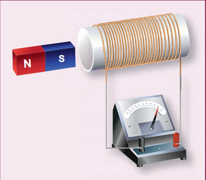

Make a circuit containing a coil of insulated wire wound around soft hollow core and a galvanometer as shown in Figure. It is better to use a thin wire for the coil so that we can wind many turns in the available space. Perform the steps described in first experiment of Faraday with the help of a strong bar magnet. Students will get hands-on experience about electromagnetic induction.

#### EXAMPLE 4.3

A cylindrical bar magnet is kept along the axis of a circular solenoid. If the magnet is rotated about its axis, find out whether an electric current is induced in the coil.

#### Solution

The magnetic field of a cylindrical magnet is symmetrical about its axis. As the magnet is rotated along the axis of the solenoid, there is no induced current in the solenoid because the flux linked with the solenoid does not change due to the rotation of the magnet.

#### EXAMPLE 4.4

A closed coil of 40 turns and of area $200~\mathrm{cm}^2$ is rotated in a magnetic field of flux density $2\mathrm{Wb}\mathrm{m}^{-2}$. It rotates from a position where its plane makes an angle of $30^{\circ}$ with the field to a position perpendicular to the field in a time 0.2 s. Find the magnitude of the emf induced in the coil due to its rotation.

#### Solution

$$
N = 40\ \mathrm{turns};\ B = 2\ \mathrm{Wb}\mathrm{m}^{-2};\ A = 200\ \mathrm{cm}^{2} = 200\times 10^{-4}\ \mathrm{m}^{2};
$$

Initial flux,
$$
\Phi_{i} = BA\cos \theta = 2\times 200\times 10^{-4}\times \cos 60^{\circ} \quad (\text{since } \theta = 90^{\circ} - 30^{\circ} = 60^{\circ})
$$
$$
\Phi_{i} = 2\times 10^{-2}\ \mathrm{Wb}
$$

Final flux,
$$
\Phi_{f} = BA\cos \theta = 2\times 200\times 10^{-4}\times \cos 0^{\circ} \quad (\text{since } \theta = 0^{\circ})
$$
$$
\Phi_{f} = 4\times 10^{-2}\ \mathrm{Wb}
$$

The magnitude of the induced emf is
$$
e = N\frac{d\Phi_B}{dt} = \frac{40\times\left(4\times 10^{-2} - 2\times 10^{-2}\right)}{0.2} = 4\ \mathrm{V}
$$

#### EXAMPLE 4.5

A straight conducting wire is dropped horizontally from a certain height with its length along east-west direction. Will an emf be induced in it? Justify your answer.

#### Solution

Yes! An emf will be induced in the wire because it moves perpendicular to the horizontal component of Earth's magnetic field and hence it cuts the magnetic lines of Earth's magnetic field.

### 4.1.4 Lenz's Law

A German physicist Heinrich Lenz performed a series of experiments on electromagnetic induction and deduced a law to determine the direction of the induced current. This law is known as Lenz's law.

Lenz's law states that the direction of the induced current is such that it always opposes the cause responsible for its production.

Faraday discovered that whenever magnetic flux linked with a coil changes, an electric current is induced in the circuit. Here the flux change is the cause while the induction of current is the effect. Lenz's law says that the effect always opposes the cause. Therefore, the induced current would flow in a direction so that it could oppose the flux change.

By incorporating Lenz's law into Faraday's law, the equation (4.2) is rewritten as

$$
\epsilon = -\frac{d(N\Phi_B)}{dt} \quad (4.3)
$$

The negative sign signifies that the direction of induced emf is such that it opposes the change in magnetic flux.

To understand Lenz's law, let us consider two illustrations in which we find the direction of the induced current in a circuit.

#### Illustration 1

Consider a uniform magnetic field, with its field lines perpendicular to the plane of the paper and pointing inwards. These field lines are represented by crosses $(\times)$ as shown in Figure 4.6(a). A rectangular metallic frame ABCD is placed in this magnetic field, with its plane perpendicular to the field. The arm $AB$ is movable so that it can slide towards right or left.

If the arm AB slides to our right side, the number of field lines (magnetic flux) passing through the frame ABCD increases and a current is induced. As suggested by Lenz's law, the induced current opposes this flux increase and it tries to reduce it by producing another magnetic field pointing outwards i.e., opposite to the existing magnetic field.

The magnetic lines of this induced field are represented by red-colored circles in the Figure 4.6(b). From the direction of the magnetic field thus produced, the direction of the induced current is found to be anti-clockwise by using right-hand thumb rule.

The leftward motion of arm $AB$ decreases magnetic flux. The induced current, this time, produces a magnetic field in the inward direction (red-colored crosses) i.e., in the direction of the existing magnetic field (Figure 4.6(c)). Therefore, the flux decrease is opposed by the flow of induced current. From this, it is found that induced current flows in clockwise direction.

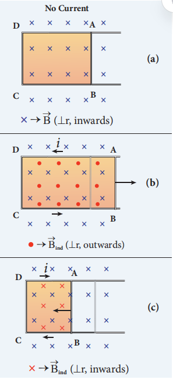

#### Illustration 2

Let us move a bar magnet towards the solenoid, with its north pole pointing the solenoid (Figure 4.7(b)). This motion increases the magnetic flux of the coil which in turn, induces an electric current. Due to the flow of induced current, the coil becomes a magnetic dipole whose two magnetic poles are on either end of the coil.

In this case, the cause producing the induced current is the movement of the magnet. According to Lenz's law, the induced current should flow in such a way that it opposes the movement of the north pole towards coil. It is possible if the end nearer to the magnet becomes north pole (Figure 4.7(b)). Then it repels the north pole of the bar magnet and opposes the movement of the magnet. Once pole ends are known, the direction of the induced current could be found by using right hand thumb rule.

When the bar magnet is withdrawn, the nearer end becomes south pole which attracts north pole of the bar magnet, opposing the receding motion of the magnet (Figure 4.7(c)).

Thus the direction of the induced current can be found from Lenz's law.

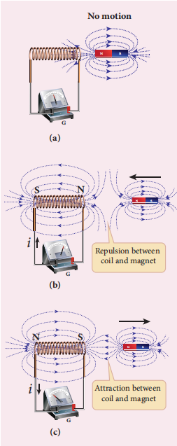

#### Conservation of energy

The truth of Lenz's law can be established on the basis of the law of conservation of energy. The explanation is as follows: According to Lenz's law, when a magnet is moved either towards or away from a coil, the induced current produced opposes its motion. As a result, there will always be a resisting force on the moving magnet. Work has to be done by some external agency to move the magnet against this resisting force. Here the mechanical energy of the moving magnet is converted into the electrical energy which in turn, gets converted into Joule heat in the coil i.e., energy is converted from one form to another.

On the contrary to Lenz's law, let us assume that the induced current helps the cause responsible for its production. Now when we push the magnet little bit towards the coil, the induced current helps the movement of the magnet towards the coil. Then the magnet starts moving towards the coil without any expense of energy. This, then, becomes a perpetual motion machine. In practice, no such machine is possible. Therefore, the assumption that the induced current helps the cause is wrong. Thus Lenz's law is an excellent example of conservation of energy.

### 4.1.5 Fleming's Right Hand Rule

When a conductor moves in a magnetic field, the direction of motion of the conductor, the field and the induced current are given by Fleming's right hand rule and is as follows:

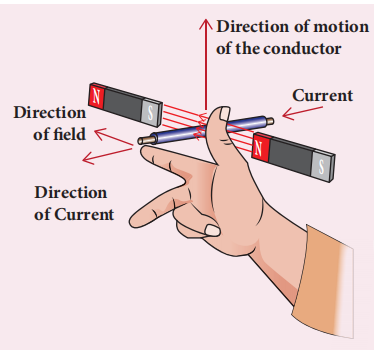

The thumb, index finger and middle finger of right hand are stretched out in mutually perpendicular directions (as shown in Figure 4.8). If the index finger points the direction of the magnetic field and the thumb indicates the direction of motion of the conductor, then the middle finger will indicate the direction of the induced current.

Fleming's right hand rule is also known as generator rule.

#### EXAMPLE 4.6

If the current $i$ flowing in the straight conducting wire as shown in the figure decreases, find out the direction of induced current in the metallic square loop placed near it.

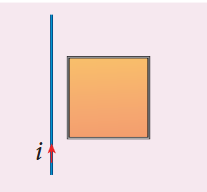

#### Solution

From right hand rule, the magnetic field by the straight wire is directed into the plane of the square loop perpendicularly and its magnetic flux is decreasing. The decrease in flux is opposed by the current induced in the loop by producing a magnetic field in the same direction as the magnetic field of the wire. Again from right hand rule, for this inward magnetic field, the direction of the induced current in the loop is clockwise.

#### ACTIVITY

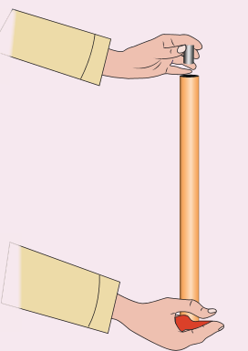

#### Demonstration of Lenz's law

Take a narrow copper pipe and a strongly magnetized button magnet as shown in figure. Keep the copper pipe vertical and drop the magnet into the pipe. Watch the motion of the magnet and note that magnet has become slower than its free fall. The reason is that an electric current generated by a moving magnet will always oppose the original motion of the magnet that produced the current.

#### EXAMPLE 4.7

The magnetic flux passes perpendicular to the plane of the circuit and is directed into the paper. If the magnetic flux varies with respect to time as per the following relation: $\Phi_{B} = (2t^{3} + 3t^{2} + 8t + 5)\ \mathrm{mWb}$, what is the magnitude of the induced emf in the loop when $t = 3$ s? Find out the direction of current through the circuit.

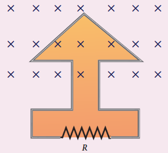

#### Solution

$$
\Phi_{B} = \left(2t^{3} + 3t^{2} + 8t + 5\right)\ \mathrm{mWb};\ N = 1;\ t = 3\ \mathrm{s}
$$

$$
\epsilon = \frac{d(N\Phi_B)}{dt} = \frac{d}{dt}\left(2t^3 + 3t^2 + 8t + 5\right)\times 10^{-3} = \left(6t^2 + 6t + 8\right)\times 10^{-3}\ \mathrm{V}
$$

At $t = 3$ s,
$$
\epsilon = \left[\left(6\times 9\right) + \left(6\times 3\right) + 8\right]\times 10^{-3} = 80\times 10^{-3}\ \mathrm{V} = 80\ \mathrm{mV}
$$

(ii) As time passes, the magnetic flux linked with the loop increases. According to Lenz's law, the direction of the induced current should be in a way so as to oppose the flux increase. So, the induced current flows in such a way to produce a magnetic field opposite to the given field. This magnetic field is perpendicularly outwards. Therefore, the induced current flows in anticlockwise direction.

### 4.1.6 Motional emf from Lorentz force

Consider a straight conducting rod $AB$ of length $l$ in a uniform magnetic field $\bar{B}$ which is directed perpendicularly into the plane of the paper as shown in Figure 4.9(a). The length of the rod is normal to the magnetic field. Let the rod move with a constant velocity $\vec{v}$ towards right side.

When the rod moves, the free electrons present in it also move with same velocity $\vec{v}$ in $\bar{B}$. As a result, the Lorentz force acts on free electrons in the direction from B to A and is given by the relation

$$
\overline{F_B} = -e(\vec{v}\times \overline{B}) \quad (4.4)
$$

The action of this Lorentz force is to accumulate the free electrons at the end $A$. This accumulation of free electrons produces a potential difference across the rod which in turn establishes an electric field $\bar{E}$ directed along $BA$ (Figure 4.9(b)). Due to the electric field $\bar{E}$, the coulomb force starts acting on the free electrons along $AB$ and is given by

$$
\overline{F_E} = -e\overline{E} \quad (4.5)
$$

The magnitude of the electric field $\bar{E}$ keeps on increasing as long as accumulation of electrons at the end $A$ continues. The force $\bar{F}_E$ also increases until equilibrium is reached. At equilibrium, the magnetic Lorentz force $\bar{F}_B$ and the coulomb force $\bar{F}_E$ balance each other and no further accumulation of free electrons at the end $A$ takes place. i.e.,

$$
\left|\bar{F}_B\right| = \left|\bar{F}_E\right|
$$

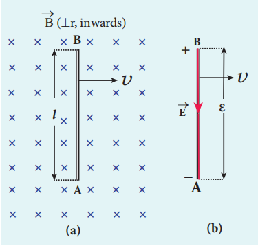

Figure 4.9 Motional emf from Lorentz force

$$
\left| -e(\vec{v}\times \bar{B})\right| = \left| -e\bar{E}\right|
$$

$$
vB\sin 90^{\circ} = E
$$

$$
vB = E \quad (4.6)
$$

The potential difference between two ends of the rod is

$$
V = El = vBl
$$

Thus the Lorentz force on the free electrons is responsible to maintain this potential difference and hence produces an emf

$$
\epsilon = Blv \quad (4.7)
$$

As this emf is produced due to the movement of the rod, it is often called as motional emf. If the ends A and B are connected by an external circuit of total resistance $R$, then current $i = \frac{\epsilon}{R} = \frac{Blv}{R}$ flows in it. The direction of the current is found from right-hand thumb rule.

## EXAMPLE 4.8

A conducting rod of length $0.5\mathrm{m}$ falls freely from the top of a building of height $7.2\mathrm{m}$ at a place in Chennai where the horizontal component of Earth's magnetic field is $4.04\times 10^{-5}\mathrm{T}$. If the length of the rod is perpendicular to Earth's horizontal magnetic field, find the emf induced across the conductor when the rod is about to touch the ground. (Assume that the rod falls down with constant acceleration of $10\mathrm{m}\mathrm{s}^{-2}$)

### Solution

$$
l = 0.5\ \mathrm{m};\ h = 7.2\ \mathrm{m};\ u = 0\ \mathrm{m}\mathrm{s}^{-1};\ g = 10\ \mathrm{m}\mathrm{s}^{-2};\ B_{H} = 4.04\times 10^{-5}\ \mathrm{T}
$$

The final velocity of the rod is

$$
v^{2} = u^{2} + 2gh = 0 + (2\times 10\times 7.2) = 144 \quad \Rightarrow \quad v = 12\ \mathrm{ms}^{-1}
$$

The magnitude of the induced emf when the rod is about to touch the ground is

$$
\epsilon = B_{H}lv = 4.04\times 10^{-5}\times 0.5\times 12 = 242.4\ \mu\mathrm{V}
$$

## EXAMPLE 4.9

A copper rod of length $l$ rotates about one of its ends with an angular velocity $\omega$ in a magnetic field $B$ as shown in the figure. The plane of rotation is perpendicular to the field. Find the emf induced between the two ends of the rod.

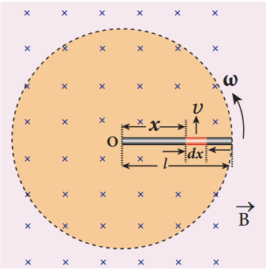

### Solution

Consider a small element of length $dx$ at a distance $x$ from the centre of the circle described by the rod. As this element moves perpendicular to the field with a linear velocity $v = \omega x$, the emf developed in the element $dx$ is

$$
d\epsilon = B v dx = B (x\omega) dx
$$

This rod is made up of many such elements, moving perpendicular to the field. The emf developed across two ends is

$$
\epsilon = \int d\epsilon = \int_{0}^{l} B\omega x dx = B\omega \int_{0}^{l} x dx = B\omega \left[ \frac{x^2}{2} \right]_{0}^{l} = \frac{1}{2} B\omega l^{2}
$$

## 4.2 EDDY CURRENTS

According to Faraday's law of electromagnetic induction, an emf is induced in a conductor when the magnetic flux passing through it changes. However, the conductor need not be in the form of a wire or coil.

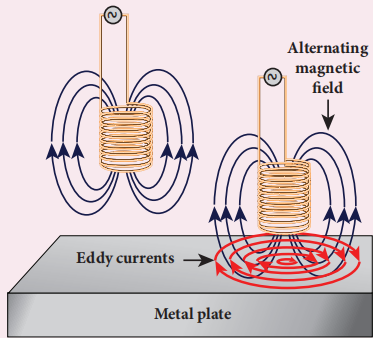

Even for a conductor in the form of a sheet or plate, an emf is induced when magnetic flux linked with it changes. But the difference is that there is no definite loop or path for induced current to flow away. As a result, the induced currents flow in concentric circular paths (Figure 4.10). As these electric currents resemble eddies of water, these are known as Eddy currents. They are also called Foucault currents.

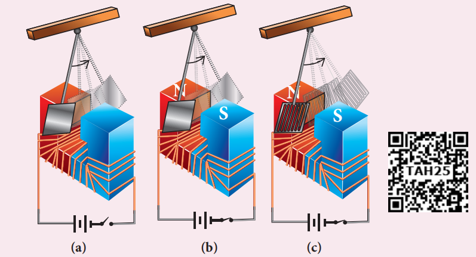

#### Demonstration

Here is a simple demonstration for the production of eddy currents. Consider a pendulum that can be made to oscillate between the poles of a powerful electromagnet (Figure 4.11(a)).

First the electromagnet is switched off, the pendulum is slightly displaced and released. It begins to oscillate and it executes a large number of oscillations before stopping. The air friction is the only damping force.

When the electromagnet is switched on and the disc of the pendulum is made to oscillate, eddy currents are produced in it which will oppose the oscillation. A heavy damping force of eddy currents will bring the pendulum to rest within a few oscillations (Figure 4.11(b)).

However if some slots are cut in the disc (Figure 4.11(c)), the eddy currents are reduced. The pendulum now will execute several oscillations before coming to rest. This clearly demonstrates the production of eddy current in the disc of the pendulum.

#### Drawbacks of Eddy currents

When eddy currents flow in the conductor, a large amount of energy is dissipated in the form of heat. The energy loss due to the flow of eddy current is inevitable but it can be reduced to a greater extent with suitable measures.

The design of transformer core and electric motor armature is crucial in order to minimise the eddy current loss. To reduce these losses, the core of the transformer is made up of thin laminas insulated from one another (Figure 4.12(a)) while for electric motor the winding is made up of a group of wires insulated from one another (Figure 4.12(b)). The insulation used does not allow huge eddy currents to flow and hence losses are minimized.

.png)

.png)

#### Example

A spherical stone and a spherical metallic ball of same size and mass are dropped from the same height. Which one, a stone or a metal ball, will reach the Earth's surface first? Justify your answer. Assume that there is no air friction.

#### Answer

The stone will reach the Earth's surface earlier than the metal ball. The reason is that when the metal ball falls through the magnetic field of Earth, the eddy currents are produced in it which opposes its motion. But in the case of stone, no eddy currents are produced and it falls freely.

#### Application of eddy currents

Though the production of eddy current is undesirable in some cases, it is useful in some other cases. A few of them are

i. Induction stove
ii. Eddy current brake
iii. Eddy current testing
iv. Electromagnetic damping

#### i. Induction stove

Induction stove is used to cook the food quickly and safely with less energy consumption. Below the cooking zone, there is a tightly wound coil of insulated wire. The cooking pan made of suitable material, is placed over the cooking zone. When the stove is switched on, an alternating current flowing in the coil produces high frequency alternating magnetic field which induces very strong eddy currents in the cooking pan. The eddy currents in the pan produce so much of heat due to Joule heating which is used to cook the food (Figure 4.13).

Note: The frequency of the domestic AC supply is increased from 50-60 Hz to around 20-40 KHz before giving it to the coil in order to produce high frequency alternating magnetic field.

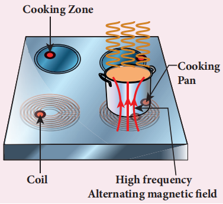

#### ii. Eddy current brake

This eddy current braking system is generally used in high speed trains and roller coasters. Strong electromagnets are fixed just above the rails. To stop the train, electromagnets are switched on. The magnetic field of these magnets induces eddy currents in the rails which oppose or resist the movement of the train. This is Eddy current linear brake (Figure 4.14(a)).

In some cases, the circular disc, connected to the wheel of the train through a common shaft, is made to rotate in between the poles of an electromagnet. When there is a relative motion between the disc and the magnet, eddy currents are induced in the disc which stop the train. This is Eddy current circular brake (Figure 4.14(b))

.png)

.png)

#### iii. Eddy current testing

It is one of the simple non-destructive testing methods to find defects like surface cracks, air bubbles present in a specimen. A coil of insulated wire is given an alternating electric current so that it produces an alternating magnetic field. When this coil is brought near the test surface, eddy current is induced in the test surface. The presence of defects causes the change in phase and amplitude of the eddy current that can be detected by some other means. In this way, the defects present in the specimen are identified (Figure 4.15).

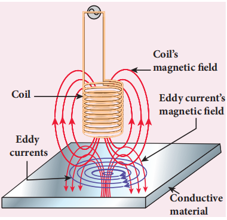

#### iv. Electromagnetic damping

The armature of the galvanometer coil is wound on a soft iron cylinder. Once the armature is deflected, the relative motion between the soft iron cylinder and the radial magnetic field induces eddy current in the cylinder (Figure 4.16). The damping force due to the flow of eddy current brings the armature to rest immediately and then galvanometer shows a steady deflection. This is called electromagnetic damping.

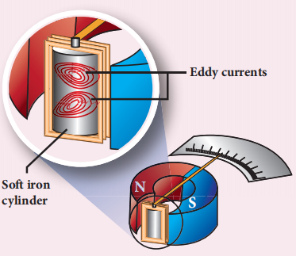

## 4.3 SELF-INDUCTION

### 4.3.1 Introduction

Inductor is a device used to store energy in a magnetic field when an electric current flows through it. The typical examples are coils, solenoids and toroids shown in Figure 4.17.

Inductance is the property of inductors to generate emf due to the change in current flowing through that circuit (self- induction) or a change in current through a neighbouring circuit with which it is magnetically linked (mutual induction). We will study about self- induction and mutual induction in the next sections.

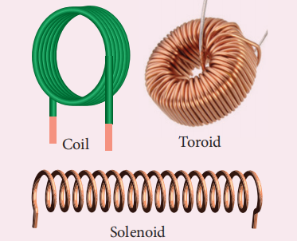

#### Self-induction

An electric current flowing through a coil will set up a magnetic field around it. Therefore, the magnetic flux of the magnetic field is linked with that coil itself. If this flux is changed by changing the current, an emf is induced in that same coil (Figure 4.18). This phenomenon is known as self- induction. The emf induced is called self- induced emf.

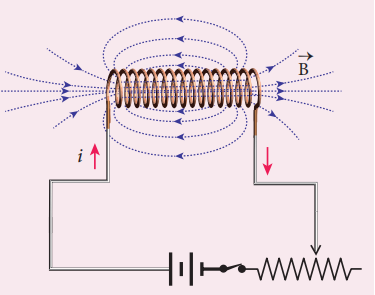

Let $\Phi_{B}$ be the magnetic flux linked with each turn of the coil of $N$ turns, then the total flux linked with the coil $N\Phi_{B}$ (flux linkage) is proportional to the current $i$ in the coil.

$$
\begin{array}{l}N\Phi_{B}\propto i\\ N\Phi_{B} = Li\\ (\text{or})L = \frac{N\Phi_{B}}{i} \end{array} \quad (4.8)
$$

The constant of proportionality $L$ is called self- inductance or coefficient of self- induction of the coil.

If $i = 1\mathrm{A}$ , then $L = N\Phi_{B}$ . Self- inductance or simply inductance of a coil is defined as the flux linkage with the coil when $1\mathrm{A}$ current flows through it.

When the current $i$ changes with time, an emf is induced in it. From Faraday's law of electromagnetic induction, this self- induced emf in the coil is given by

$$
\begin{array}{l}\epsilon = -\frac{d(N\Phi_B)}{dt}\\ = -\frac{d(Li)}{dt} \end{array} \quad (\text{using equation 4.8})
$$

$$
\therefore \epsilon = -L\frac{di}{dt} \quad (4.9)
$$

The negative sign in the above equation implies that the self- induced emf always opposes the change in current with respect to time. If $\frac{di}{dt} = 1\mathrm{A}\mathrm{s}^{-1}$ , then $L = -\epsilon$ . Inductance of a coil is also defined as the opposing emf induced in the coil when the rate of change of current through the coil is $1\mathrm{A}\mathrm{s}^{-1}$.

#### Unit of inductance

Inductance is a scalar and its unit is $\mathrm{Wb}\mathrm{A}^{-1}$ or $\mathrm{Vs}\mathrm{A}^{-1}$ . It is also measured in henry (H).

$$
1\mathrm{H} = 1\mathrm{Wb}\mathrm{A}^{-1} = 1\mathrm{Vs}\mathrm{A}^{-1}
$$

The dimensional formula of inductance is $M L^{2} T^{-2} A^{-2}$.

If $i = 1$ A and $N\Phi_{B} = 1$ Wb turns, then $L = 1\mathrm{H}$ .

Therefore, the inductance of the coil is said to be one henry if a current of $1$ A produces unit flux linkage in the coil.

If $\frac{di}{dt} = 1\mathrm{A}\mathrm{s}^{-1}$ and $\epsilon = -1\mathrm{V}$ , then $L = 1\mathrm{H}$ .

Therefore, the inductance of the coil is one henry if a current changing at the rate of $1\mathrm{A}\mathrm{s}^{-1}$ induces an opposing emf of $1\mathrm{V}$ in it.

#### Physical significance of inductance

We have learnt about inertia in XI standard. In translational motion, mass is a measure of linear inertia; in the same way, for rotational motion, moment of inertia is a measure of rotational inertia (Refer sections 3.2.1 and 5.4 of XI physics text book). Generally, inertia means opposition to change its state.

### 4.3.2 Self-inductance of a long solenoid

Consider a long solenoid of length $l$ and cross-sectional area $A$. Let $n$ be the number of turns per unit length (or turn density) of the solenoid. When an electric current $i$ is passed through the solenoid, a magnetic field produced inside is almost uniform and is directed along the axis of the solenoid as shown in Figure 4.20. The magnetic field at any point inside the solenoid is given by (Refer section 3.9.3)

$$ B = \mu_0 n i $$

As this magnetic field passes through the solenoid, the windings of the solenoid are linked by the field lines. The magnetic flux passing through each turn is

$$ \Phi_B = \int_A \overline{B} \cdot d\overline{A} = BA \cos \theta $$
$$ = BA $$
$$ = (\mu_0 n i) A $$

The total magnetic flux linked or flux linkage of the solenoid with $N$ turns (the total number of turns $N$ is given by $N = n l$) is

$$ N \Phi_B = (n l)(\mu_0 n i) A $$
$$ N \Phi_B = (\mu_0 n^2 A l) i $$

We know that

$$ N \Phi_B = L i $$

Comparing the above equations, we get

$$ L = \mu_0 n^2 A l \quad (4.10) $$

From the above equation, it is clear that inductance depends on the geometry of the solenoid (turn density $n$, cross-sectional area $A$, length $l$) and the medium present inside the solenoid. If the solenoid is filled with a dielectric medium of relative permeability $\mu_r$, then

$$ L = \mu n^2 A l \quad \text{or} \quad L = \mu_r \mu_0 n^2 A l $$

#### Energy stored in an inductor

Whenever a current is established in the circuit, the inductance opposes the growth of the current. In order to establish a current in the circuit, work is done against this opposition by some external agency. This work done is stored as magnetic potential energy.

Let us assume that electrical resistance of the inductor is negligible and inductor effect alone is considered. The induced emf $\epsilon$ at any instant $t$ is

$$ \epsilon = -L \frac{di}{dt} $$

Let $dW$ be work done in moving a charge $dq$ in a time $dt$ against the opposition, then

$$ dW = -\epsilon dq $$
$$ = -\epsilon i dt \quad (\because dq = i dt) $$

Substituting for $\epsilon$ from equation (4.9),

Total work done in establishing the current $i$ is

This work done is stored as magnetic potential energy.

$$ \therefore U_B = \frac{1}{2} L i^2 \quad (4.11) $$

The energy density is the energy stored per unit volume of the space and is given by

$$ u_B = \frac{U_B}{A l} \quad (\because \text{Volume of the solenoid} = A l) $$
$$ u_B = \frac{L i^2}{2 A l} = \frac{(\mu_0 n^2 A l) i^2}{2 A l} \quad (\because L = \mu_0 n^2 A l) $$
$$ = \frac{\mu_0 n^2 i^2}{2} $$
$$ u_B = \frac{B^2}{2 \mu_0} \quad (\because B = \mu_0 n i) $$

#### EXAMPLE 4.10

A solenoid of 500 turns is wound on an iron core of relative permeability 800. The length and radius of the solenoid are 40 cm and $3 \text{ cm}$ respectively. Calculate the average emf induced in the solenoid if the current in it changes from 0 to 3 A in 0.4 second.

#### Solution

$$ N = 500 \text{ turns}; \quad \mu_r = 800; $$
$$ l = 40 \text{ cm} = 0.4 \text{ m}; r = 3 \text{ cm} = 0.03 \text{ m}; $$
$$ di = 3 - 0 = 3 \text{ A}; dt = 0.4 \text{ s} $$

Self inductance,

$$ L = \mu n^2 A l \quad (\because \mu = \mu_r \mu_0; A = \pi r^2; n = \frac{N}{l}) $$
$$ = \frac{\mu_r \mu_0 N^2 \pi r^2}{l} $$
$$ = \frac{4 \times 3.14 \times 10^{-7} \times 800 \times 500^2 \times 3.14 \times (3 \times 10^{-2})^2}{0.4} $$
$$ L = 1.77 \text{ H} $$

Induced emf $\epsilon = -L \frac{di}{dt}$
$$ = - \frac{1.77 \times 3}{0.4} $$
$$ \epsilon = -13.275 \text{ V} $$

#### EXAMPLE 4.11

The self-inductance of an air-core solenoid is $4.8 \text{ mH}$. If its core is replaced by iron core, then its self-inductance becomes $1.8 \text{ H}$. Find out the relative permeability of iron.

#### Solution

$$ L_{\text{air}} = 4.8 \times 10^{-3} \text{ H} $$
$$ L_{\text{iron}} = 1.8 \text{ H} $$
$$ L_{\text{air}} = \mu_0 n^2 A l = 4.8 \times 10^{-3} \text{ H} $$
$$ L_{\text{iron}} = \mu n^2 A l = \mu_r \mu_0 n^2 A l = 1.8 \text{ H} $$
$$ \therefore \mu_r = \frac{L_{\text{iron}}}{L_{\text{air}}} = \frac{1.8}{4.8 \times 10^{-3}} = 375 $$

### 4.3.3 Mutual induction

When an electric current passing through a coil changes with time, an emf is induced in the neighbouring coil. This phenomenon is known as mutual induction and the emf induced is called mutually induced emf.

Consider two coils which are placed close to each other. If an electric current $i_1$ is sent through coil 1, the magnetic field produced by it is also linked with coil 2 as shown in Figure 4.21(a).

If $\Phi_{21}$ is the magnetic flux linked with each turn of the coil 2 of $N_2$ turns due to the current in coil 1, then the total flux linked with coil 2 $(N_2 \Phi_{21})$ is proportional to the current $i_1$ in the coil 1.

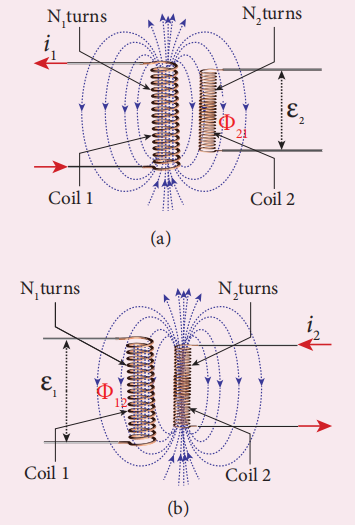

$$ N_2 \Phi_{21} \propto i_1 $$
$$ N_2 \Phi_{21} = M_{21} i_1 $$
$$ (\text{or}) \quad M_{21} = \frac{N_2 \Phi_{21}}{i_1} \quad (4.12) $$

The constant of proportionality $M_{21}$ is the mutual inductance or coefficient of mutual induction of the coil 2 with respect to coil 1.

If $i_1 = 1 \text{ A}$, then $M_{21} = N_2 \Phi_{21}$. Therefore, the mutual inductance $M_{21}$ is defined as the flux linkage with the coil 2 when 1A current flows through coil 1.

When the current $i_1$ changes with time, an emf $\epsilon_2$ is induced in coil 2. From Faraday's law of electromagnetic induction, this mutually induced emf $\epsilon_2$ is given by

$$ \epsilon_2 = -\frac{d(N_2 \Phi_{21})}{dt} = -\frac{d(M_{21} i_1)}{dt} $$
$$ (\text{or}) \quad M_{21} = \frac{-\epsilon_2}{di_1 / dt} $$

The negative sign in the above equation shows that the mutually induced emf always opposes the change in current $i_1$ with respect to time. If $\frac{di_1}{dt} = 1 \text{ A s}^{-1}$, then $M_{21} = -\epsilon_2$. Mutual inductance $M_{21}$ is also defined as the opposing emf induced in the coil 2 when the rate of change of current through the coil 1 is $1 \text{ A s}^{-1}$.

Similarly, if an electric current $i_2$ through coil 2 changes with time, then emf $\epsilon_1$ is induced in coil 1. Therefore,

$$ M_{12} = \frac{N_1 \Phi_{12}}{i_2} \quad \text{and} \quad M_{12} = \frac{-\epsilon_1}{di_2 / dt} $$

where $M_{12}$ is the mutual inductance of the coil 1 with respect to coil 2. It can be shown that for a given pair of coils, the mutual inductance is same. i.e.,

$$ M_{21} = M_{12} = M $$

In general, the mutual induction between two coils depends on size, shape, the number of turns of the coils, their relative orientation and permeability of the medium.

#### Unit of mutual-inductance

The unit of mutual inductance is also henry (H).

If $i_1 = 1 \text{ A}$ and $N_2 \Phi_{21} = 1 \text{ Wb}$ turns, then $M = 1 \text{ H}$.

Therefore, the mutual inductance between two neighbouring coils is said to be one henry if a current of 1A in one coil produces unit flux linkage in neighbouring coil.

If $\frac{di_1}{dt} = 1 \text{ A s}^{-1}$ and $\epsilon_2 = -1 \text{ V}$, then $M = 1 \text{ H}$.

Therefore, the mutual inductance between two neighbouring coils is one henry if a current changing at the rate of $1 \text{ A s}^{-1}$ in one coil induces an opposing emf of 1V in neighbouring coil.

### 4.3.4 Mutual inductance between two long co-axial solenoids

Consider two long co-axial solenoids of same length $l$. The length of these solenoids is large when compared to their radii so that the magnetic field produced inside the solenoids is uniform and the fringing effect at the ends may be ignored. Let $A_1$ and $A_2$ be the area of cross section of the solenoids with $A_1$ being greater than $A_2$ as shown in Figure 4.22. The turn density of these solenoids are $n_1$ and $n_2$ respectively.

Let $i_1$ be the current flowing through solenoid 1, then the magnetic field produced inside it is

$$ B_1 = \mu_0 n_1 i_1 $$

As the field lines of $\overline{B_1}$ are passing through the area bounded by solenoid 2, the magnetic flux is linked with each turn of solenoid 2 due to current in solenoid 1 and is given by

$$ \Phi_{21} = \int_{A_2} \overline{B_1} \cdot d\overline{A} = B_1 A_2 \quad (\text{since } \theta = 0^\circ) $$
$$ = (\mu_0 n_1 i_1) A_2 $$

The flux linkage with solenoid 2 with total turns $N_2$ is

$$ N_2 \Phi_{21} = (n_2 l)(\mu_0 n_1 A_2) \quad (\text{since } N_2 = n_2 l) $$
$$ N_2 \Phi_{21} = (\mu_0 n_1 n_2 A_2 l) i_1 $$

We know that $N_2 \Phi_{21} = M_{21} i_1$. Comparing the above equations, we get

$$ M_{21} = \mu_0 n_1 n_2 A_2 l \quad (4.13) $$

This gives the expression for mutual inductance $M_{21}$ of the solenoid 2 with respect to solenoid 1. Similarly, we can find mutual inductance $M_{12}$ of solenoid 1 with respect to solenoid 2 as given below.

The magnetic field produced by the solenoid 2 when carrying a current $i_2$ is

$$ B_2 = \mu_0 n_2 i_2 $$

This magnetic field $B_2$ is uniform inside the solenoid 2 but outside the solenoid 2, it is almost zero. Therefore for solenoid 1, the area $A_2$ is the effective area over which the magnetic field $B_2$ is present; not area $A_1$. Then the magnetic flux $\Phi_{12}$ linked with each turn of solenoid 1 due to current in solenoid 2 is

$$ \Phi_{12} = \int_{A_2} \overline{B_2} \cdot d\overline{A} = B_2 A_2 = (\mu_0 n_2 i_2) A_2 $$

The flux linkage of solenoid 1 with total turns $N_1$ is

$$ N_1 \Phi_{12} = (n_1 l)(\mu_0 n_2 A_2) \quad (\text{since } N_1 = n_1 l) $$
$$ N_1 \Phi_{12} = (\mu_0 n_1 n_2 A_2 l) i_2 $$

We know that $N_1 \Phi_{12} = M_{12} i_2$. Comparing the above equations, we get

$$ M_{12} = \mu_0 n_1 n_2 A_2 l \quad (4.14) $$

From equation (4.13) and (4.14), we can write

$$ M_{12} = M_{21} = M \quad (4.15) $$

In general, the mutual inductance between two long co-axial solenoids is given by

$$ M = \mu_0 n_1 n_2 A_2 l \quad (4.16) $$

If a dielectric medium of relative permeability $\mu_r$ is present inside the solenoids, then

$$ M = \mu n_1 n_2 A_2 l \quad (\text{or}) $$
$$ M = \mu_r \mu_0 n_1 n_2 A_2 l $$

#### EXAMPLE 4.12

The current flowing in the first coil changes from 2 A to 10 A in 0.4 s. Find the mutual inductance between two coils if an emf of $60 \text{ mV}$ is induced in the second coil. Also determine the magnitude of induced emf in the second coil if the current in the first coil is changed from 4 A to 16 A in 0.03 s. Consider only the magnitude of induced emf.

#### Solution

Case (i):
$$ di_1 = 10 - 2 = 8 \text{ A}; dt = 0.4 \text{ s}; $$
$$ \epsilon_2 = 60 \times 10^{-3} \text{ V} $$

Case (ii):
$$ di_1 = 16 - 4 = 12 \text{ A}; dt = 0.03 \text{ s} $$

(i) Mutual inductance between the coils.
$$ M = \frac{\epsilon_2}{di_1 / dt} = \frac{60 \times 10^{-3} \times 0.4}{8} $$
$$ M = 3 \times 10^{-3} \text{ H} $$

(ii) Induced emf in the second coil due to the rate of change of current in the first coil is
$$ \epsilon_2 = M \frac{di_1}{dt} = \frac{3 \times 10^{-3} \times 12}{0.03} $$
$$ \epsilon_2 = 1.2 \text{ V} $$

#### EXAMPLE 4.13

Consider two coplanar, co-axial circular coils $A$ and $B$ as shown in figure. The radius of coil $A$ is $20 \text{ cm}$ while that of coil $B$ is 2 cm. The number of turns in coils $A$ and $B$ are 200 and 1000 respectively. Calculate the mutual inductance between the coils. If the current in coil $A$ changes from 2 A to 6 A in $0.04 \text{ s}$, determine the induced emf in coil $B$ and the rate of change of flux through the coil $B$ at that instant.

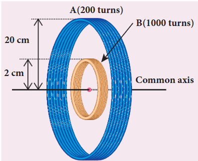

#### Solution

$$ N_A = 200 \text{ turns}; N_B = 1000 \text{ turns}; $$
$$ r_A = 20 \times 10^{-2} \text{ m}; r_B = 2 \times 10^{-2} \text{ m}; $$
$$ dt = 0.04 \text{ s}; di_A = 6 - 2 = 4 \text{ A} $$

Let $i_A$ be the current flowing in coil $A$, then the magnetic field $B_A$ at the centre of the circular coil $A$ is

$$ B_A = \frac{\mu_0 N_A i_A}{2 r_A} = \frac{4 \pi \times 10^{-7} N_A i_A}{2 r_A} $$
$$ = \frac{10^{-7} \times 2 \times 3.14 \times 200}{20 \times 10^{-2}} \times i_A $$
$$ = 6.28 \times 10^{-4} i_A \text{ Wb m}^{-2} $$

The magnetic flux linkage with coil $B$ is

$$ N_B \Phi_B = N_B B_A A_B $$
$$ = 1000 \times 6.28 \times 10^{-4} \times i_A \times 3.14 \times (2 \times 10^{-2})^2 $$
$$ = 7.89 \times 10^{-4} i_A \text{ Wb turns} $$

The mutual inductance between the coils

$$ M = \frac{N_B \Phi_B}{i_A} = 7.89 \times 10^{-4} \text{ H} $$

Induced emf in coil $B$ is

$$ \epsilon_B = -M \frac{di_A}{dt} $$
$$ \epsilon_B = \frac{7.89 \times 10^{-4} \times (6 - 2)}{0.04} \text{ (magnitude only)} $$
$$ \epsilon_B = 78.9 \text{ mV} $$

The rate of change of magnetic flux of coil $B$ is

$$ \frac{d(N_B \Phi_B)}{dt} = \epsilon_B = 78.9 \text{ mWb s}^{-1} $$

## 4.4 METHODS OF PRODUCING INDUCED EMF

### 4.4.1 Introduction

Electromotive force is the characteristic of any energy source capable of driving electric charge around a circuit. We have already learnt that it is not actually a force. It is the work done in moving unit electric charge around the circuit. It is measured in $\text{J C}^{-1}$ or volt.

Some examples of energy source which provide emf are electrochemical cells, thermoelectric devices, solar cells and electrical generators. Of these, electrical generators are most powerful machines. They are used for large scale power generation.

According to Faraday's law of electromagnetic induction, an emf is induced in a circuit when magnetic flux linked with it changes. This emf is called induced emf. The magnitude of the induced emf is given by

$$ \epsilon = \frac{d\Phi_B}{dt} \quad \text{or} \quad \epsilon = \frac{d}{dt} (BA \cos \theta) \quad (4.17) $$

From the above equation, it is clear that induced emf can be produced by changing magnetic flux in any of the following ways.

(i) By changing the magnetic field $B$
(ii) By changing the area $A$ of the coil and
(iii) By changing the relative orientation $\theta$ of the coil with magnetic field

### 4.4.2 Production of induced emf by changing the magnetic field

From Faraday's experiments on electromagnetic induction, it was discovered that an emf is induced in a circuit by changing the magnetic flux of the field through it. The change in flux is brought about by (i) relative motion between the circuit and the magnet (First experiment) (ii) variation in current flowing through the nearby coil (Second experiment).

### 4.4.3 Production of induced emf by changing the area of the coil

Consider a conducting rod of length $l$ moving with a velocity $v$ towards left on a rectangular fixed metallic framework as shown in Figure 4.23. The whole arrangement is placed in a uniform magnetic field $\overline{B}$ whose magnetic lines are perpendicularly directed into the plane of the paper.

As the rod moves from $AB$ to $DC$ in a time $dt$, the area enclosed by the loop and hence the magnetic flux through the loop decreases.

The change in magnetic flux in time $dt$ is

$$ d\Phi_B = B \times \text{Change in area } (dA) $$
$$ = B \times \text{Area } ABCD $$
$$ \text{Since Area } ABCD = l (v dt) $$
$$ d\Phi_B = B l v dt \quad (\text{or}) $$
$$ \frac{d\Phi_B}{dt} = B l v $$

As a result of change in flux, an emf is generated in the loop. The magnitude of the induced emf is

$$ \epsilon = \frac{d\Phi_B}{dt} $$
$$ \epsilon = B l v \quad (4.18) $$

This emf is known as motional emf since it is produced due to the movement of the conductor in the magnetic field. The direction of induced current is found to be clockwise from Fleming's right hand rule.

#### Energy conservation

The current-carrying movable rod AB kept in the perpendicular magnetic field experiences a force $\overline{F}_b$ in the outward direction, opposite to its motion. This force is given by

$$ \overline{F}_b = i \overline{l} \times \overline{B} $$
$$ |\overline{F}_b| = i l B \sin \theta $$
$$ F_b = i l B \quad (\text{since } \theta = 90^\circ) $$

In order to move the rod with a constant velocity $\overline{\nu}$ a constant force that is equal and opposite to the magnetic force, must be applied.

$$ |\overline{F}_{\text{app}}| = |\overline{F}_b| = i l B $$

Therefore, mechanical work is done by the applied force to move the rod. The rate of doing work or power is

$$ P = \overline{F}_{\text{app}} \cdot \overline{\nu} = F_{\text{app}} \nu \cos \theta $$
$$ = i l B \nu $$
$$ = \left( \frac{B l \nu}{R} \right) l B \nu $$
$$ P = \frac{B^2 l^2 \nu^2}{R} $$

When the induced current flows in the loop, Joule heating takes place. The rate at which thermal energy is dissipated in the loop or power dissipated is

$$ P = i^2 R $$
$$ P = \left( \frac{B l \nu}{R} \right)^2 R $$
$$ P = \frac{B^2 l^2 \nu^2}{R} \quad (4.21) $$

This equation is exactly same as the equation (4.20). Thus the mechanical energy needed to move the rod is converted into electrical energy which then appears as thermal energy in the loop. This energy conversion is consistent with the law of conservation of energy.

#### EXAMPLE 4.14

A circular metal of area $0.03 \text{ m}^2$ rotates in a uniform magnetic field of $0.4 \text{ T}$. The axis of rotation passes through the centre and perpendicular to its plane and is also parallel to the field. If the disc completes 20 revolutions in one second and the resistance of the disc is $4 \Omega$, calculate the induced emf between the axis and the rim and induced current flowing in the disc.

#### Solution

$$ A = 0.03 \text{ m}^2; B = 0.4 \text{ T}; f = 20 \text{ rps}; $$
$$ R = 4 \Omega $$

Area swept out by the disc in unit time

$$ \frac{dA}{dt} = 0.03 \times 20 $$
$$ = 0.6 \text{ m}^2 \text{ s}^{-1} $$

The magnitude of the induced emf,

$$ \epsilon = \frac{d\Phi_B}{dt} = \frac{d(BA)}{dt} = B \frac{dA}{dt} $$
$$ \epsilon = \frac{0.4 \times 0.6}{1} = 0.24 \text{ V} $$

Induced current, $i = \frac{\epsilon}{R} = \frac{0.24}{4} = 0.06 \text{ A}$

Emf can be induced by changing relative orientation between the coil and the magnetic field. This can be achieved either by rotating a coil in a magnetic field or by rotating a magnetic field within a stationary coil. Here rotating coil type is considered.

### 4.4.4 Production of induced emf by changing relative orientation of the coil with the magnetic field

Consider a rectangular coil of $N$ turns kept in a uniform magnetic field $\overline{B}$ as shown in Figure 4.24. The coil rotates in anticlockwise direction with an angular velocity $\omega$ about an axis, perpendicular to the field and to the plane of the paper.

At time $t = 0$ the plane of the coil is perpendicular to the field and the flux linked with the coil has its maximum value $\Phi_m = N B A$ (where $A$ is the area of the coil).

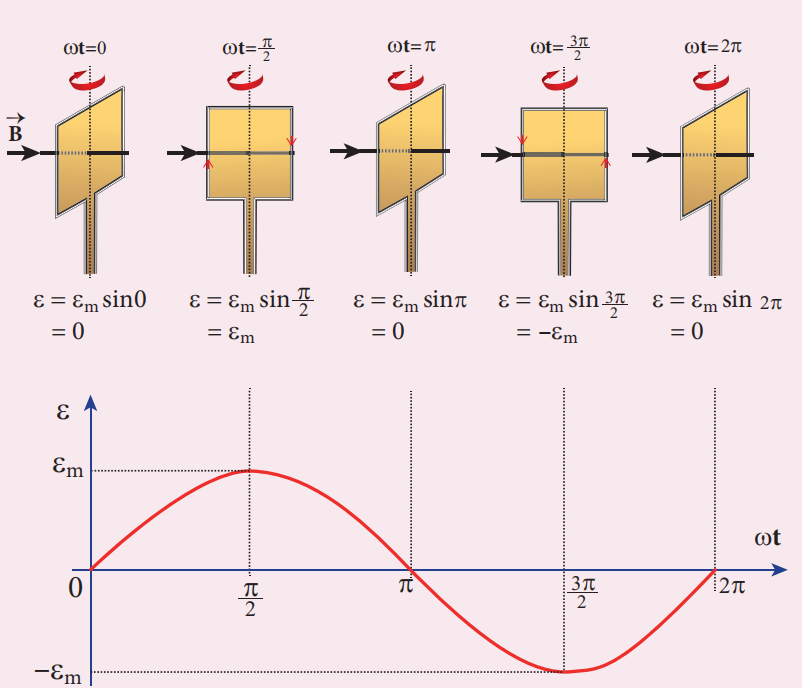

In a time $t$ seconds, the coil is rotated through an angle $\theta (= \omega t)$ in anti-clockwise direction. In this position, the flux linked $N B A \cos \omega t$ is due to the component of $\overline{B}$ normal to the plane of the coil. The component $(B \sin \omega t)$ parallel to the plane has no role in electromagnetic induction. Therefore, the flux linkage with the coil at this deflected position is

$$ N \Phi_B = N B A \cos \theta = N B A \cos \omega t $$

According to Faraday's law, the emf induced at that instant is

$$ \epsilon = -\frac{d}{dt} (N \Phi_B) = -\frac{d}{dt} (N B A \cos \omega t) $$
$$ = -N B A (-\sin \omega t) \omega $$
$$ = N B A \omega \sin \omega t $$

When the coil is rotated through $90^\circ$ from initial position, $\sin \omega t = 1$. Then the maximum value of induced emf is

$$ \epsilon_m = N B A \omega $$

Therefore, the value of induced emf at any instant is then given by

$$ \epsilon = \epsilon_m \sin \omega t \quad (4.22) $$

It is seen that the induced emf varies as sine function of the time angle $\omega t$. The graph between induced emf and time angle for one rotation of the coil will be a sine curve (Figure 4.25) and the emf varying in this manner is called sinusoidal emf or alternating emf.

If this alternating voltage is given to a closed circuit, a sinusoidally varying current flows in it. This current is called alternating current and is given by

$$ i = I_m \sin \omega t \quad (4.23) $$

where $I_m$ is the maximum value of induced current.

#### EXAMPLE 4.15

A rectangular coil of area $70 \text{ cm}^2$ having 600 turns rotates about an axis perpendicular to a magnetic field of $0.4 \text{ Wb m}^{-2}$. If the coil completes 500 revolutions in a minute, calculate the instantaneous emf when the plane of the coil is (i) perpendicular to the field (ii) parallel to the field and (iii) inclined at $60^\circ$ with the field.

#### Solution

$$ A = 70 \times 10^{-4} \text{ m}^2; N = 600 \text{ turns} $$
$$ B = 0.4 \text{ Wb m}^{-2}; f = 500 \text{ rpm} $$

The instantaneous emf is

$$ \epsilon = \epsilon_m \sin \omega t $$
$$ \epsilon_m = N \Phi_m \omega = N (B A) (2 \pi f) $$
$$ \epsilon = N B A \times 2 \pi f \times \sin \omega t $$

(i) When $\omega t = 0^\circ$
$$ \epsilon = \epsilon_m \sin 0 = 0 $$

(ii) When $\omega t = 90^\circ$
$$ \epsilon = \epsilon_m \sin 90^\circ = N B A \times 2 \pi f \times 1 $$
$$ = 600 \times 0.4 \times 70 \times 10^{-4} \times 2 \times \frac{22}{7} \times \left(\frac{500}{60}\right) $$
$$ = 88 \text{ V} $$

(iii) When $\omega t = 90^\circ - 60^\circ = 30^\circ$
$$ \epsilon = \epsilon_m \sin 30^\circ = 88 \times \frac{1}{2} = 44 \text{ V} $$

## 4.5 AC GENERATOR

### 4.5.1 Introduction

AC generator or alternator is an energy conversion device. It converts mechanical energy used to rotate the coil or field magnet into electrical energy. Alternator produces a large scale electrical power for use in homes and industries. AC generator and its components are shown in Figure 4.26.

### 4.5.2 Principle

Alternators work on the principle of electromagnetic induction. The relative motion between a conductor and a magnetic field changes the magnetic flux linked with the conductor which in turn, induces an emf. The magnitude of the induced emf is given by Faraday's law of electromagnetic induction and its direction by Fleming's right hand rule.

### 4.5.3 Construction

Alternator consists of two major parts, namely stator and rotor. As their names suggest, stator is stationary while rotor rotates inside the stator. In any standard construction of commercial alternators, the armature winding is mounted on stator and the field magnet on rotor.

#### i) Stator

The stationary part which has armature windings mounted in it is called stator. It has two components, namely stator core and armature winding.

Stator core or armature core is made up of iron or steel alloy. It is a hollow cylinder and is laminated to minimize eddy current loss. The slots are cut on inner surface of the core to accommodate armature windings.

Armature winding is the coil, wound on slots provided in the armature core (Figure 4.27).

#### ii) Rotor

Rotor contains magnetic field windings. The magnetic poles are magnetized by DC source. The ends of field windings are connected to a pair of slip rings, attached to a common shaft about which rotor rotates. Slip rings rotate along with rotor. To maintain connection between the DC source and field windings, two brushes are used which continuously slide over the slip rings. The 2-pole rotor is shown in Figure 4.27.

We will discuss the construction and working of two examples, namely single phase and three phase AC generators in the following sections.

### 4.5.4 Advantages of stationary armature-rotating field alternator

Alternators are generally high current and high voltage machines. The stationary armature-rotating field construction has many advantages. A few of them include:

1) The current is drawn directly from fixed terminals on the stator without the use of brush contacts.
2) The insulation of stationary armature winding is easier.
3) The number of sliding contacts (slip rings) is reduced. Moreover, the sliding contacts are used for low-voltage DC Source.
4) Armature windings can be constructed more rigidly to prevent deformation due to any mechanical stress.

### 4.5.5 Single phase AC generator

In a single phase AC generator, the armature conductors are connected in series so as to form a single circuit which generates a single-phase alternating emf and hence it is called single-phase alternator.

In the simplified version of AC generator, a single-turn rectangular loop PQRS is mounted on the stator. The field winding is fixed inside the stator and it can be rotated about an axis, perpendicular to the plane of the paper.

The loop PQRS is stationary and is also perpendicular to the plane of the paper. When field windings are excited, magnetic field is produced around it. Let the field magnet be rotated in clockwise direction by some external means (Figure 4.28).

Assume that initial position of the field
magnet is horizontal. At that instant, the
direction of magnetic field is perpendicular
to the plane of the loop PQRS. The induced
emf is zero (Refer case (iii) of section 4.4).
This is represented by origin O in the graph
drawn between induced emf and time angle
(Figure 4.29).

When field magnet rotates through
90°, magnetic field becomes parallel to
PQRS. The induced emfs across PQ and RS
would become maximum. Since they are
connected in series, emfs are added up and
the direction of total induced emf is given
by Fleming’s right hand rule.
Care has to be taken while applying this
rule; the thumb indicates the direction of the
motion of the conductor with respect to field.
For clockwise rotating poles, the conductor
appears to be rotating anticlockwise. Hence,
thumb should point to the left. The directionof the induced emf is at right angles to the
plane of the paper. For PQ, it is inwards and
for RS it is outwards. Therefore, the current
flows along PQRS. The point A in the graph
represents this maximum emf.
For the rotation of 180° from the initial
position, the field is again perpendicular to
PQRS and the induced emf becomes zero.
This is represented by point B.
The field magnet becomes again parallel
to PQRS for 270° rotation of field magnet.
The induced emf is maximum but the
direction is reversed. Thus the current flows
along SRQP. This is represented by point C.
On completion of 360°, the induced
emf becomes zero and is represented by the
point D. From the graph, it is clear that emf
induced in PQRS is alternating in nature.
Therefore, when field magnet completes
one rotation, induced emf in PQRS finishes
one cycle.

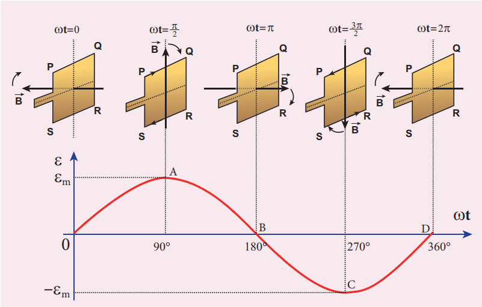

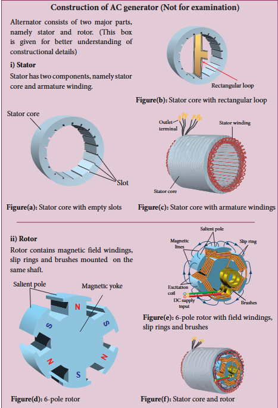

#### 4.5.6 Three phase AC generator

In a three phase AC generator, three separate windings are placed on the stator core. These windings are displaced from one another by $120^{\circ}$ as shown in Figure 4.30(a). The rotor is a field magnet with alternate north and south poles. When the rotor is rotated, by electromagnetic induction, alternating emf is induced in each of the three stator windings. The induced emfs are equal in magnitude but differ in phase by $120^{\circ}$ (Figure 4.30(b)). They are given by the equations

$$
\epsilon_1 = \epsilon_m \sin \omega t
$$

$$
\epsilon_2 = \epsilon_m \sin (\omega t - 120^{\circ})
$$

$$
\epsilon_3 = \epsilon_m \sin (\omega t - 240^{\circ})
$$

### 4.5.7 Three-phase AC generator

In the simplified construction of three-phase AC generator, the armature core has 6 slots, cut on its inner rim. Each slot is $60^\circ$ away from one another. Six armature conductors are mounted in these slots. The conductors 1 and 4 are joined in series to form coil 1. The conductors 3 and 6 form coil 2 while the conductors 5 and 2 form coil 3. So, these coils are rectangular in shape and are $120^\circ$ apart from one another (Figure 4.30).

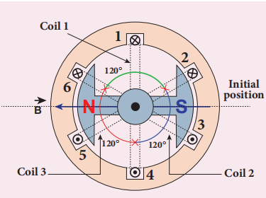

The initial position of the field magnet is horizontal and field direction is perpendicular to the plane of the coil 1. As it is seen in single phase AC generator, when field magnet is rotated from that position in clockwise direction, alternating emf $\epsilon_1$ in coil 1 begins a cycle from origin O. This is shown in Figure 4.31.

The corresponding cycle for alternating emf $\epsilon_2$ in coil 2 starts at point A after field magnet has rotated through $120^\circ$. Therefore, the phase difference between $\epsilon_1$ and $\epsilon_2$ is $120^\circ$. Similarly, emf $\epsilon_3$ in coil 3 would begin its cycle at point B after $240^\circ$ rotation of field magnet from initial position. Thus these emfs produced in the three phase AC generator have $120^\circ$ phase difference between one another.

### 4.5.8 Advantages of three-phase alternator

Three-phase system has many advantages over single-phase system. Let us see a few of them.

1) For a given dimension of the generator, three-phase machine produces higher power output than a single-phase machine.
2) For the same capacity, three-phase alternator is smaller in size when compared to single-phase alternator.
3) Three-phase transmission system is cheaper. A relatively thinner wire is sufficient for transmission of three-phase power.

## 4.6 TRANSFORMER
# TRANSFORMER

Transformer is a stationary device used to transform electrical power from one circuit to another without changing its frequency. The applied alternating voltage is either increased or decreased with corresponding decrease or increase of current in the circuit.

If the transformer converts an alternating current with low voltage into an alternating current with high voltage, it is called **step-up transformer**. On the contrary, if the transformer converts alternating current with high voltage into an alternating current with low voltage, then it is called **step-down transformer**.

## 4.6.1 Construction and working of transformer

### Principle

The principle of transformer is the mutual induction between two coils. That is, when an electric current passing through a coil changes with time, an emf is induced in the neighbouring coil.

### Construction

In the simple construction of transformers, there are two coils of high mutual inductance wound over the same transformer core. The core is generally laminated and is made up of a good magnetic material like silicon steel. Coils are electrically insulated but magnetically linked via transformer core (Figure 4.32).

.png)

.png)

The coil across which alternating voltage is applied is called primary coil \( P \) and the coil from which output power is drawn out is called secondary coil \( S \). The assembled core and coils are kept in a container which is filled with suitable medium for better insulation and cooling purpose.

### Working

If the primary coil is connected to a source of alternating voltage, an alternating magnetic flux is set up in the laminated core. If there is no magnetic flux leakage, then whole of magnetic flux linked with primary coil is also linked with secondary coil. This means that rate at which magnetic flux changes through each turn is same for both primary and secondary coils.

As a result of flux change, emf is induced in both primary and secondary coils. The emf induced in the primary coil or back emf \( \varepsilon_p \) is given by

\[
\varepsilon_p = -N_p \frac{d\Phi_B}{dt}
\]

But the voltage applied \( \nu_p \) across the primary is equal to the back emf. Then

\[
\nu_p = -N_p \frac{d\Phi_B}{dt} \tag{4.24}
\]

The frequency of alternating magnetic flux in the core is same as the frequency of the applied voltage. Therefore, induced emf in secondary will also have same frequency as that of applied voltage. The emf induced in the secondary coil \( \varepsilon_s \) is given by

\[
\varepsilon_s = -N_s \frac{d\Phi_B}{dt}
\]

where \( N_p \) and \( N_s \) are the number of turns in the primary and secondary coil respectively. If the secondary circuit is open, then \( \varepsilon_s = \nu_s \) where \( \nu_s \) is the voltage across secondary coil.

\[
\nu_s = -N_s \frac{d\Phi_B}{dt} \tag{4.25}
\]

From equations (4.24) and (4.25),

\[
\frac{\nu_s}{\nu_p} = \frac{N_s}{N_p} = K \tag{4.26}
\]

This constant \( K \) is known as voltage transformation ratio. For an ideal transformer,

Input power \( \nu_p i_p \) = Output power \( \nu_s i_s \)

where \( i_p \) and \( i_s \) are the currents in the primary and secondary coil respectively. Therefore,

\[
\frac{\nu_s}{\nu_p} = \frac{N_s}{N_p} = \frac{i_p}{i_s} \tag{4.27}
\]

Equation 4.27 is written in terms of amplitude of corresponding quantities,

\[
\frac{V_s}{V_p} = \frac{N_s}{N_p} = \frac{I_p}{I_s} = K
\]

i) If \( N_s > N_p (K > 1) \), then \( V_s > V_p \) and \( I_s < I_p \). This is the case of step-up transformer in which voltage is increased and the corresponding current is decreased.

ii) If \( N_s < N_p (K < 1) \), then \( V_s < V_p \) and \( I_s > I_p \). This is step-down transformer where voltage is decreased and the current is increased.

Efficiency of a transformer:

The efficiency \( \eta \) of a transformer is defined as the ratio of the useful output power to the input power. Thus

\[
\eta = \frac{\text{Output power}}{\text{Input power}} \times 100\% \tag{4.28}
\]

Transformers are highly efficient devices having their efficiency in the range of 96 – 99%. Various energy losses in transformers will not allow them to be 100% efficient.

### 4.6.2 Energy losses in a transformer

Transformers do not have any moving parts so that its efficiency is much higher than that of rotating machines like generators and motors. But there are many factors which lead to energy loss in a transformer.

i) Core loss or Iron loss

This loss takes place in transformer core. Hysteresis loss (Refer section 3.6) and eddy current loss are known as core loss or Iron loss. When transformer core is magnetized and demagnetized repeatedly by the alternating voltage applied across primary coil, hysteresis takes place due towhich some energy is lost in the form of heat. Hysteresis loss is minimized by using steel of high silicon content in making transformer core.

Alternating magnetic flux in the core induces eddy currents in it. Therefore there is energy loss due to the flow of eddy current, called eddy current loss which is minimized by using very thin laminations of transformer core.

ii) Copper loss

Transformer windings have electrical resistance. When an electric current flows through them, some amount of energy is dissipated due to Joule heating. This energy loss is called copper loss which is minimized by using wires of larger diameter.

iii) Flux leakage

Flux leakage happens when the magnetic lines of primary coil are not completely linked with secondary coil. Energy loss due to this flux leakage is minimized by winding coils one over the other.

### 4.6.3 Advantages of AC in long distance power transmission

Electric power is produced in a large scale at electric power stations with the help of AC generators. These power stations are classified based on the type of fuel used as thermal, hydro electric and nuclear power stations. Most of these stations are located at remote places. Hence the electric power generated is transmitted over long distances through transmission lines to reach towns or cities where it is actually consumed. This process is called power transmission.

But there is a difficulty during power transmission. A sizable fraction of electric power is lost due to Joule heating $(i^2 R)$ in the transmission lines which are hundreds of kilometer long. This power loss can be tackled either by reducing current $I$ or by reducing resistance $R$ of the transmission lines. The resistance $R$ can be reduced with thick wires of copper or aluminium. But this increases the cost of production of transmission lines and other related expenses. So this way of reducing power loss is not economically viable.

Since power produced is alternating in nature, there is a way out. The most important property of alternating voltage that it can be stepped up and stepped down by using transformers could be exploited in reducing current and thereby reducing power losses to a greater extent.

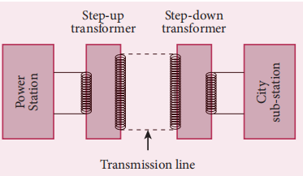

At the transmitting point, the voltage is increased and the corresponding current is decreased by using step-up transformer (Figure 4.33). Then it is transmitted through transmission lines. This reduced current at high voltage reaches the destination without any appreciable loss. At the receiving point, the voltage is decreased and the current is increased to appropriate values by using step-down transformer and then it is given to consumers. Thus power transmission is done efficiently and economically.

**Illustration:**

An electric power of 2 MW is transmitted to a place through transmission lines of total resistance $R = 40 \Omega$ at two different voltages. One is lower voltage $(10 \text{ kV})$ and the other is higher $(100 \text{ kV})$. Let us now calculate and compare power losses in these two cases.

Case (i):
$$ P = 2 \text{ MW}; \quad R = 40 \Omega; \quad V = 10 \text{ kV} $$
Power, $P = VI$
Current, $I = \frac{P}{V}$
$$ = \frac{2 \times 10^6}{10 \times 10^3} = 200 \text{ A} $$
Power loss $=$ Heat produced $= I^2 R$
$$ = (200)^2 \times 40 = 1.6 \times 10^6 \text{ W} $$
\% of power loss
$$ = \frac{1.6 \times 10^6}{2 \times 10^6} \times 100\% $$
$$ = 0.8 \times 100\% = 80\% $$

Case (ii):
$$ P = 2 \text{ MW}; \quad R = 40 \Omega; \quad V = 100 \text{ kV} $$
Current, $I = \frac{P}{V}$
$$ = \frac{2 \times 10^6}{100 \times 10^3} = 20 \text{ A} $$
Power loss $= I^2 R$
$$ = (20)^2 \times 40 = 0.016 \times 10^6 \text{ W} $$
$$ \% \text{ of power loss} = \frac{0.016 \times 10^6}{2 \times 10^6} \times 100\% $$
$$ = 0.008 \times 100\% = 0.8\% $$

Thus it is clear that when an electric power is transmitted at higher voltage, the power loss is reduced to a large extent.

#### EXAMPLE 4.16

The primary coil of a transformer has 200 turns and the secondary coil has 1000 turns. If the primary voltage is $220\mathrm{V}$ and the primary current is $2\mathrm{A}$, find the secondary voltage and secondary current.

#### Solution

$$
N_p = 200;\quad N_s = 1000;\quad \epsilon_p = 220\mathrm{V};\quad i_p = 2\mathrm{A}
$$

We know that

$$
\frac{\epsilon_s}{\epsilon_p} = \frac{N_s}{N_p} \quad \Rightarrow \quad \epsilon_s = \epsilon_p \times \frac{N_s}{N_p} = 220 \times \frac{1000}{200} = 1100\mathrm{V}
$$

Also,

$$
\frac{i_p}{i_s} = \frac{N_s}{N_p} \quad \Rightarrow \quad i_s = i_p \times \frac{N_p}{N_s} = 2 \times \frac{200}{1000} = 0.4\mathrm{A}
$$

#### EXAMPLE 4.17

A transformer is used to step up an alternating voltage of $220\mathrm{V}$ to $4400\mathrm{V}$ to transmit $22\mathrm{kW}$ of power. If the primary coil has 1000 turns, find the number of turns in the secondary coil, the current rating of the primary and secondary coils. Assume that the transformer is ideal.

#### Solution

$$
\epsilon_p = 220\mathrm{V};\quad \epsilon_s = 4400\mathrm{V};\quad P = 22 \times 10^3\mathrm{W};\quad N_p = 1000
$$

Number of turns in the secondary coil:

$$
\frac{N_s}{N_p} = \frac{\epsilon_s}{\epsilon_p} \quad \Rightarrow \quad N_s = N_p \times \frac{\epsilon_s}{\epsilon_p} = 1000 \times \frac{4400}{220} = 20000
$$

Current rating of the primary coil:

$$
i_p = \frac{P}{\epsilon_p} = \frac{22 \times 10^3}{220} = 100\mathrm{A}
$$

Current rating of the secondary coil:

$$
i_s = \frac{P}{\epsilon_s} = \frac{22 \times 10^3}{4400} = 5\mathrm{A}
$$

Transformation ratio

\( K = \frac{240}{12} = 20 \)

The number of turns in the secondary

\[
N_s = N_p \times K = 100 \times 20 = 2000
\]

Primary current,

\[
I_p = K \times I_s = 20 \times 50 \, \text{mA} = 1 \, \text{A}
\]

is positive and lower terminal negative at an instant. Therefore, the current flows in clockwise direction. After a short time, the polarities of the source are reversed so that current now flows in anti-clockwise direction (Figure 4.34(b)). This current which flows in alternate directions in the circuit is called alternating current.

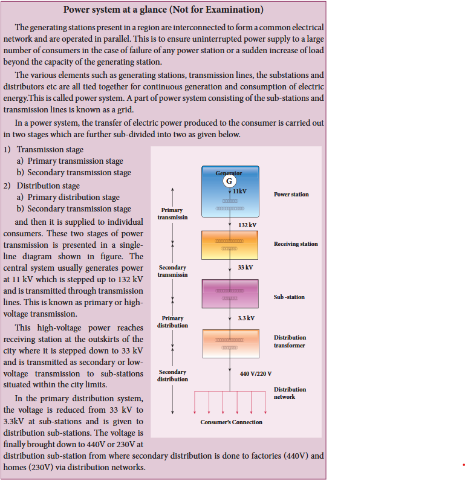

---

## 4.7 ALTERNATING CURRENT

---

### 4.7.1 Introduction

In section 4.5, we have seen that when the orientation of the coil with the magnetic field is changed, an alternating emf is induced and hence an alternating current flows in the closed circuit. **An alternating voltage is the voltage which changes polarity at regular intervals of time and the direction of the resulting alternating current also changes accordingly.**

In the Figure 4.34(a), an alternating voltage source is connected to a resistor \( R \) in which the upper terminal of the source is positive and lower terminal negative at
an instant. Therefore, the current flows
in clockwise direction. After a short time,
the polarities of the source are reversed so
that current now flows in anti-clockwise
direction (Figure 4.34(b)). This current
which flows in alternate directions in the
circuit is called alternating current.

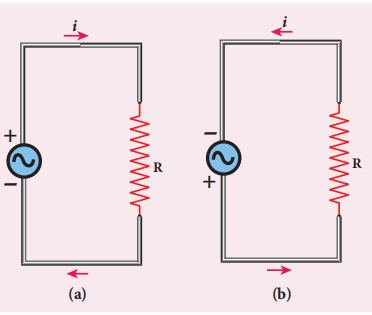
**Figure 4.34** Alternating voltage and the 
corresponding alternating current

---

### Sinusoidal alternating voltage

If the waveform of alternating voltage is a sine wave, then it is known as sinusoidal alternating voltage which is given by the relation.

\[
v = V_m \sin \omega t \tag{4.29}
\]

where \( v \) is the instantaneous value of alternating voltage; \( V_m \) is the maximum value (amplitude) and \( \omega \) is the angular frequency of the alternating voltage. When sinusoidal alternating voltage is applied to a closed circuit, the resulting alternating current is also sinusoidal in nature and its relation is

\[
i = I_m \sin \omega t \tag{4.30}
\]

where \( I_m \) is the maximum value (amplitude) of the alternating current. The direction of sinusoidal voltage or current is reversed after every half-cycle and its magnitude is also changing continuously as shown in Figure 4.35.

---

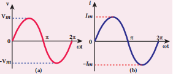
**Figure 4.35** (a) Sinusoidal alternating 
voltage (b) Sinusoidal alternating current

**Note** 
Interesting, sine waves are very common in nature. The periodic motions like waves in water, swinging of pendulum are associated with sine waves. Thus sine wave seems to be nature's standard. Also refer unit 11 of XI physics text book.

The current and voltage in a DC system remain constant over a period of time so that there is no problem in specifying their magnitudes. However, an alternating current or voltage varies from time to time. Then a question arises how to express the magnitude of an alternating current or voltage. Though there are many ways of expressing it, we limit our discussion with two ways, namely mean value and RMS (Root Mean Square) value of AC.

### Mean or Average value of AC

We have learnt that the magnitude of an alternating current in a circuit changes from one instant to other instant and its direction also reverses for every half cycle. During positive half cycle, current is taken as positive and during negative cycle it is negative. Therefore mean or average value of symmetrical alternating current over one complete cycle is zero.

Therefore the average or mean value is measured over one half of a cycle. These electrical terms, average current and average voltage, can be used in both AC and DC circuit analysis and calculations.

The average value of alternating current is defined as the average of all values of current over a positive half-cycle or a negative half-cycle.

The instantaneous value of sinusoidal alternating current is given by the equation

\[
i = I_m \sin \omega t
\]

or

\[
i = I_m \sin \theta
\]

(where \( \theta = \omega t \))

whose graphical representation is given in Figure 4.36.

The sum of all currents over a half-cycle is given by area of positive half-cycle (or negative half-cycle). Therefore,

Area of positive half-cycle 
\[
I_{av} = \frac{\text{(or negative half-cycle)}}{\text{ Bash of half-cycle}} \tag{4.31}
\]

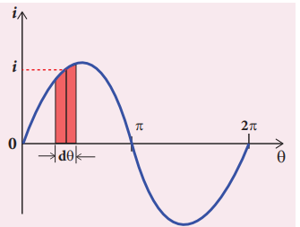
**Figure** Sine wave of an alternating current

Consider an elementary strip of thickness \( d\theta \) in the positive half-cycle of the current wave (Figure 4.41). Let \( i \) be the mid-ordinate of that strip.

Area of the elementary strip = \( i \, d\theta \)

Area of positive half-cycle

\[
= \int_0^{\pi} i \, d\theta = \int_0^{\pi} I_m \sin \theta \, d\theta
\]

\[
= I_m \left[ -\cos \theta \right]_0^{\pi} = -I_m \left[ \cos \pi - \cos 0 \right] = 2I_m
\]

The base length of half-cycle is \( \pi \). Substituting these values in equation (4.31), we get

Average value of AC, \( I_{av} = \frac{2I_m}{\pi} \)

\[
I_{av} = 0.637 I_m \tag{4.32}
\]

Hence the average value of AC is \( 0.637 \) times the maximum value \( I_m \) of the alternating current. For negative half-cycle, \( I_{av} = -0.637 I_m \).

---

**Note**

For example, if we consider \( n \) currents in a half-cycle of AC, namely \( i_1, i_2, \dots, i_n \), then average value is given by

\[
I_{av} = \frac{\text{Sum of all currents over half-cycle}}{\text{Number of currents}}
\]

\[
I_{av} = \frac{i_1 + i_2 + \dots + i_n}{n}
\]

### 4.7.3 RMS value of AC

The term RMS refers to time- varying sinusoidal currents and voltages which is not used in DC systems.

The root mean square value of an alternating current is defined as the square root of the mean of the squares of all currents over one cycle. It is denoted by $I_{RMS}$ . For alternating voltages, the RMS value is given by $V_{RMS}$ .

The alternating current $i = I_{m}\sin \omega t$ or $i = I_{m}\sin \theta$ , is represented graphically in Figure 4.37. The corresponding squared current wave is also shown by the dotted lines.

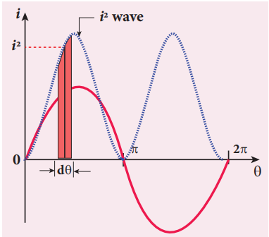

The sum of the squares of all currents over one cycle is given by the area of one cycle of squared wave. Therefore,

$$
I_{RMS} = \sqrt{\frac{\mathrm{Area~of~one~cycle}}{\mathrm{of~squared~wave}}} \quad (4.33)
$$

An elementary area of thickness $d\theta$ is considered in the first half- cycle of the squared current wave as shown in Figure 4.37. Let $i^{2}$ be the mid- ordinate of the element.

Area of the element $= i^{2}d\theta$

Area of one cycle of squared wave

$$
= \int_{0}^{2\pi}i^{2}d\theta
$$

$$
= \int_{0}^{2\pi}I_{m}^{2}\sin^{2}\theta d\theta = I_{m}^{2}\int_{0}^{2\pi}\sin^{2}\theta d\theta \quad (4.34)
$$

$$
= I_{m}^{2}\int_{0}^{2\pi}\left[\frac{1 - \cos 2\theta}{2}\right]d\theta
$$

$$
\sin \mathrm{sin}^2\theta = \frac{1 - \cos 2\theta}{2}
$$

$$
= \frac{I_{m}^{2}}{2}\int_{0}^{2\pi}d\theta -\int_{0}^{2\pi}\cos 2\theta d\theta
$$

$$
= \frac{I_{m}^{2}}{2}\left[\theta -\frac{\sin 2\theta}{2}\right]_{0}^{2\pi}
$$

$$
= \frac{I_{m}^{2}}{2}\left[\left(2\pi -\frac{\sin 2\times 2\pi}{2}\right) - \left(0 - \frac{\sin 0}{2}\right)\right]
$$

$$
= \frac{I_{m}^{2}}{2}\times 2\pi = I_{m}^{2}\pi \quad [\because \sin 0 = \sin 4\pi = 0]
$$

The base length of one cycle is $2\pi$ . Substituting these values in equation (4.33), we get

$$
I_{RMS} = \sqrt{\frac{I_{m}^{2}\pi}{2\pi}} = \frac{I_{m}}{\sqrt{2}}
$$

$$
I_{RMS} = 0.707I_{m} \quad (4.35)
$$

Thus we find that for a symmetrical sinusoidal current rms value of current is $70.7\%$ of its peak value.

Similarly for alternating voltage, it can be shown that

$$
V_{RMS} = 0.707V_{m} \quad (4.36)
$$

**Note**
RMS value of alternating current is also called effective value and is represented as $I_{eff}$ . It is used to compare RMS current of AC to an equivalent steady current.

RMS value is also defined as that value of the steady current which when flowing through a given circuit for a given time produces the same amount of heat as produced by the alternating current when flowing through the same circuit for the same time. The effective value of an alternating voltage is represented by $V_{eff}$ .

**Note**
For example, if we consider $n$ currents in one cycle of AC, namely $i_{1}, i_{2}, \ldots , i_{n}$ then RMS value is given by

$$
I_{RMS} = \sqrt{\frac{i_{1}^{2} + i_{2}^{2} + \ldots + i_{n}^{2}}{n}}
$$

**Do You Know**
For common household appliances, the voltage rating and current rating are generally specified in terms of their RMS value. The domestic AC supply is $230\mathrm{V}$ , $50\mathrm{Hz}$ . It is the RMS or effective value. Its peak value will be $V_{m} = \sqrt{2} V_{rms} = \sqrt{2} \times 230 = 325\mathrm{V}$ .

#### EXAMPLE 4.18

Write down the equation for a sinusoidal voltage of $50\mathrm{Hz}$ and its peak value is $20\mathrm{V}$ . Draw the corresponding voltage versus time graph.

#### Solution

$$
f = 50\mathrm{Hz}; V_{m} = 20\mathrm{V}
$$

Instantaneous voltage, $\nu = V_{m}\sin \omega t$

$$
= V_{m}\sin 2\pi ft
$$

$$
= 20\sin (2\pi \times 50)t = 20\sin (100 \times 3.14)t
$$

$$
\nu = 20\sin 314t
$$

Time period, $T = \frac{1}{f} = \frac{1}{50} = 0.02\mathrm{s} = 20 \times 10^{-3}\mathrm{s} = 20\mathrm{ms}$

The wave form is given below.

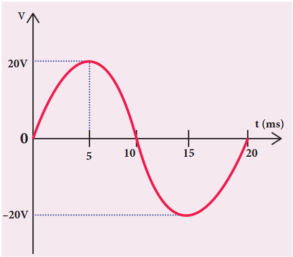

#### EXAMPLE 4.19

The equation for an alternating current is given by $i = 77 \sin 314t$ . Find the peak current, frequency, time period and instantaneous value of current at $t = 2$ ms.

#### Solution

$i = 77 \sin 314t; t = 2 \mathrm{ms} = 2 \times 10^{-3} \mathrm{s}$

The general equation of an alternating current is $i = I_{m} \sin \omega t$ . On comparison,

(i) Peak current, $I_{m} = 77 \mathrm{A}$

(ii) Frequency, $f = \frac{\omega}{2\pi} = \frac{314}{2 \times 3.14} = 50 \mathrm{Hz}$

(iii) Time period, $T = \frac{1}{f} = \frac{1}{50} = 0.02 \mathrm{s}$

(iv) At $t = 2 \mathrm{ms}$ ,

Instantaneous current, $i = 77 \sin (314 \times 2 \times 10^{-3})$

$= 77 \sin \left(314 \times 2 \times 10^{-3} \times \frac{180^{\circ}}{3.14}\right)$

$= 77 \sin 36^{\circ} = 77 \times 0.5878$

$= 45.26 \mathrm{A}$

#### Phasor and phasor diagram

#### Phasor

A sinusoidal alternating voltage (or current) can be represented by a vector which rotates about the origin in anti- clockwise direction at a constant angular velocity $\omega$ . Such a rotating vector is called a phasor. A phasor is drawn in such a way that

- the length of the line segment equals the peak value $V_{m}$ (or $I_{m}$ ) of the alternating voltage (or current)
- its angular velocity $\omega$ is equal to the angular frequency of the alternating voltage (or current)
- the projection of phasor on any vertical axis gives the instantaneous value of the alternating voltage (or current)
- the angle between the phasor and the axis of reference (positive x- axis) indicates the phase of the alternating voltage (or current).

The notion of phasors is introduced to analyse phase relationship between voltage and current in different AC circuits.

#### Phasor diagram

The diagram which shows various phasors and their phase relations is called phasor diagram. Consider a sinusoidal alternating voltage $\nu = V_{m} \sin \omega t$ applied to a circuit. This voltage can be represented by a phasor, namely $\overline{OA}$ as shown in Figure 4.38.

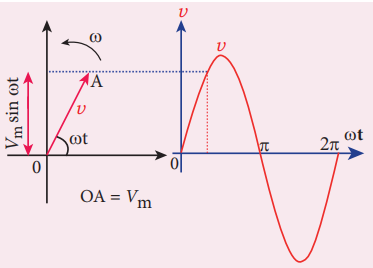

Here the length of $\overline{OA}$ equals the peak value $(V_{m})$ , the angle it makes with x- axis gives the phase $(\omega t)$ of the applied voltage. Its projection on y- axis provides the instantaneous value $(V_{m} \sin \omega t)$ at that instant.

When $\overline{OA}$ rotates about $O$ with angular velocity $\omega$ in anti- clockwise direction, the waveform of the voltage is generated. For one full rotation of $\overline{OA}$ , one cycle of voltage is produced.

The alternating current in the same circuit may be given by the relation $i = I_{m} \sin (\omega t + \phi)$ which is represented by another phasor $\overline{OB}$ . Here $\phi$ is the phase angle between voltage and current. In this case, the current leads the voltage by phase angle $\phi$ which is shown in Figure 4.39. If the current lags behind the voltage, then we write $i = I_{m} \sin (\omega t - \phi)$ .

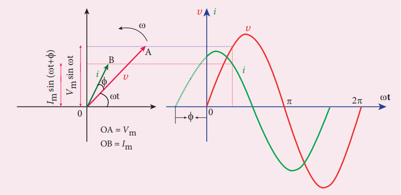

### 4.7.4 AC circuit containing pure resistor

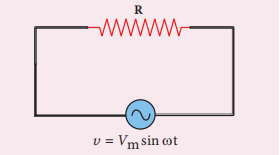

Consider a circuit containing a pure resistor of resistance $R$ connected across an alternating voltage source (Figure 4.40). The instantaneous value of the alternating voltage is given by

$$
\nu = V_{m}\sin \omega t \quad (4.37)
$$

An alternating current $i$ flowing in the circuit due to this voltage, develops a potential drop across $R$ and is given by

$$
V_{R} = iR \quad (4.38)
$$

Kirchoff's loop rule (Refer section 2.5.2) states that the algebraic sum of potential differences in a closed circuit is zero. For this resistive circuit,

$$
\nu - V_{R} = 0
$$

From equation (4.37) and (4.38),

$$
V_{m}\sin \omega t = iR
$$

$$
i = \frac{V_{m}}{R}\sin \omega t
$$

$$
i = I_{m}\sin \omega t
$$

where $\frac{V_{m}}{R} = I_{m}$ , the peak value of alternating current in the circuit. From equations (4.37) and (4.39), it is clear that the applied voltage and the current are in phase with each other in a resistive circuit. It means that they reach their maxima and minima simultaneously. This is indicated in the phasor diagram (Figure 4.41). The wave diagram also depicts that current is in phase with the applied voltage (Figure 4.41).

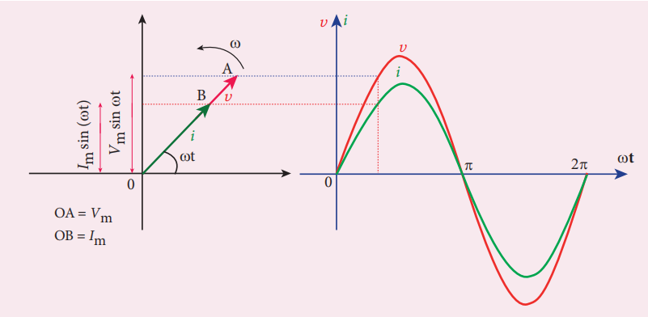

### 4.7.5 AC circuit containing only an inductor

Consider a circuit containing a pure inductor of inductance $L$ connected across an alternating voltage source (Figure 4.42). The instantaneous value of the alternating voltage is given by

$$
\nu = V_{m}\sin \omega t \quad (4.40)
$$

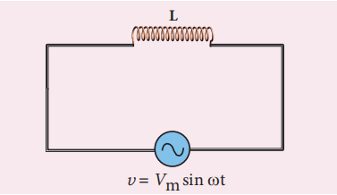

The alternating current flowing through the inductor induces a self- induced emf or back emf in the circuit. The back emf is given by

$$
\mathrm{Back~emf}, \epsilon = -L\frac{di}{dt}
$$

By applying Kirchoff's loop rule to the purely inductive circuit, we get

$$
\nu + \epsilon = 0
$$

$$
V_{m}\sin \omega t = L\frac{di}{dt}
$$

$$
di = \frac{V_{m}}{L}\sin \omega t dt
$$

Integrating both sides, we get

$$
i = \frac{V_m}{L}\int \sin \omega t dt
$$

$$
i = \frac{V_m}{L\omega}(-\cos \omega t) + \mathrm{constant}
$$

The integration constant in the above equation is independent of time. Since the voltage in the circuit has only time dependent part, we can take the time independent part in the current (integration constant) as zero.

$$
i = \frac{V_m}{\omega L}\sin \left(\omega t - \frac{\pi}{2}\right)
$$

$$
\mathrm{or} \quad i = I_m\sin \left(\omega t - \frac{\pi}{2}\right)
$$

where $\frac{V_m}{\omega L} = I_m$ , the peak value of the alternating current in the circuit. From equation (4.40) and (4.41), it is evident that current lags behind the applied voltage by $\frac{\pi}{2}$ in an inductive circuit. This fact is depicted in the phasor diagram. In the wave diagram also, it is seen that current lags the voltage by $90^{\circ}$ (Figure 4.43).

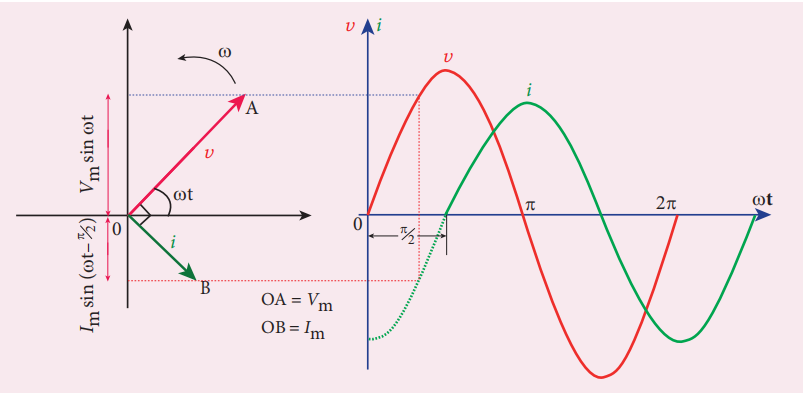

#### Inductive reactance $\mathbf{X}_{\mathrm{L}}$

The peak value of current $I_{m}$ is given by $I_{m} = \frac{V_{m}}{\omega L}$ . Let us compare this equation with $I_{m} = \frac{V_{m}}{R}$ from resistive circuit. The quantity $\omega L$ plays the same role as the resistance in resistive circuit. This is the resistance offered by the inductor, called inductive reactance $(X_{L})$ . It is measured in ohm.

$$
X_{L} = \omega L \quad (4.42)
$$

#### An inductor blocks AC but it allows DC. Why? and How?

An inductor $L$ is a closely wound helical coil. The steady DC current flowing through $L$ produces uniform magnetic field around it and the magnetic flux linked remains constant. Therefore there is no self- induction and self- induced emf (back emf). Since inductor behaves like a resistor, DC flows through an inductor.

The AC flowing through $L$ produces time- varying magnetic field which in turn induces self- induced emf (back emf). This back emf, according to Lenz's law, opposes any change in the current. Since AC varies both in magnitude and direction, its flow is opposed in $L$ . For an ideal inductor of zero ohmic resistance, the back emf is equal and opposite to the applied emf. Therefore $L$ blocks AC.

### 4.7.6 AC circuit containing only a capacitor

Consider a circuit containing a capacitor of capacitance $C$ connected across an alternating voltage source (Figure 4.44). The instantaneous value of the alternating voltage is given by

$$
\nu = V_{m}\sin \omega t \quad (4.43)
$$

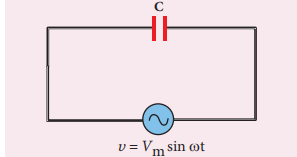

Let $q$ be the instantaneous charge on the capacitor. The emf across the capacitor at that instant is $\frac{q}{C}$ . According to Kirchoff's loop rule,

$$
\nu - \frac{q}{C} = 0
$$

$$
q = CV_{m}\sin \omega t
$$

By the definition of current,

$$
i = \frac{dq}{dt} = \frac{d}{dt}(CV_{m}\sin \omega t)
$$

$$
= CV_{m}\frac{d}{dt}(\sin \omega t)
$$

$$
= CV_{m}\omega \cos \omega t \qquad \mathrm{(or)}
$$

$$
i = \frac{V_{m}}{1 / C\omega}\sin \left(\omega t + \frac{\pi}{2}\right)
$$

Instantaneous value of current,

$$
i = I_{m}\sin \left(\omega t + \frac{\pi}{2}\right) \quad (4.44)
$$

where $\frac{V_{m}}{1 / C\omega} = I_{m}$ , the peak value of the alternating current. From equations (4.43) and (4.44), it is clear that current leads the applied voltage by $\frac{\pi}{2}$ in a capacitive circuit. This is shown pictorially in Figure 4.45. The wave diagram for a capacitive circuit also shows that the current leads the applied voltage by $90^{\circ}$ .

#### Capacitive reactance $X_{C}$

The peak value of current $I_{m}$ is given by $I_{m} = \frac{V_{m}}{1 / C\omega}$ . Let us compare this equation with $I_{m} = \frac{V_{m}}{R}$ for a resistive circuit. The quantity $\frac{1}{C\omega}$ plays the same role as the resistance $R$ in resistive circuit. This is the resistance offered by the capacitor, called capacitive reactance $(X_{C})$ . It measured in ohm.

$$
X_{C} = \frac{1}{\omega C} \quad (4.45)
$$

The capacitive reactance $(X_{C})$ varies inversely as the frequency. For a steady current, $f = 0$ .

$$
\therefore X_{C} = \frac{1}{\omega C} = \frac{1}{2\pi f C} = \frac{1}{0} = \infty
$$

Thus a capacitive circuit offers infinite resistance to the steady current. So that steady current cannot flow through the capacitor.

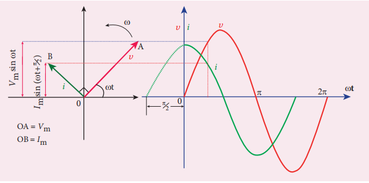

#### What is ICE?

ICE is an acronym which means that the current leads the EMF (voltage) in a capacitive circuit.

#### EXAMPLE 4.20

A $400\mathrm{mH}$ coil of negligible resistance is connected to an AC circuit in which an effective current of $6\mathrm{mA}$ is flowing. Find out the voltage across the coil if the frequency is $1000\mathrm{Hz}$.

#### Solution

$$
L = 400 \times 10^{-3}\mathrm{H}; I_{\mathrm{eff}} = 6 \times 10^{-3}\mathrm{A}; f = 1000\mathrm{Hz}
$$

Inductive reactance, $X_{L} = L\omega = L \times 2\pi f$

$$
= 2 \times 3.14 \times 1000 \times 0.4 = 2512\Omega
$$

Voltage across $L$, $V_{\mathrm{eff}} = I_{\mathrm{eff}} X_{L} = 6 \times 10^{-3} \times 2512 = 15.07\mathrm{V}$

#### EXAMPLE 4.21

A capacitor of capacitance $\frac{10^2}{\pi} \mu\mathrm{F}$ is connected across a $220\mathrm{V}, 50\mathrm{Hz}$ A.C. mains. Calculate the capacitive reactance, RMS value of current and write down the equations of voltage and current.

#### Solution

$$
C = \frac{10^2}{\pi} \times 10^{-6}\mathrm{F}, V_{RMS} = 220\mathrm{V}, f = 50\mathrm{Hz}
$$

Capacitive reactance,

$$
X_{C} = \frac{1}{\omega C} = \frac{1}{2\pi f C}
$$

$$
= \frac{1}{2 \times \pi \times 50 \times \frac{10^{-4}}{\pi}} = 100\Omega
$$

(ii) RMS value of current,

$$
I_{RMS} = \frac{V_{RMS}}{X_{C}} = \frac{220}{100} = 2.2\mathrm{A}
$$

(iii) $V_{m} = 220 \times \sqrt{2} = 311\mathrm{V}$

$I_{m} = 2.2 \times \sqrt{2} = 3.1\mathrm{A}$

Therefore,

$$
\nu = 311\sin 314t
$$

$$
i = 3.1\sin\left(314t + \frac{\pi}{2}\right)
$$

#### A capacitor blocks DC but it allows AC. Why? and How? (Not for examination)

Capacitors have two parallel metallic plates placed close to each other and there is a gap between plates. Whenever a source of voltage (either DC voltage or AC voltage) is connected across a capacitor C, the electrons from the source will reach the plate and stop. They cannot jump across the gap between plates to continue its flow in the circuit. Therefore the electrons flowing in one direction (i.e. DC) cannot pass through the capacitor. But the electrons from AC source seem to flow through C. Let us see what really happens!

#### DC cannot flow through a capacitor:

Consider a parallel plate capacitor whose plates are uncharged (same amount of positive and negative charges). A DC source (battery) is connected across C as shown in Figure (a).

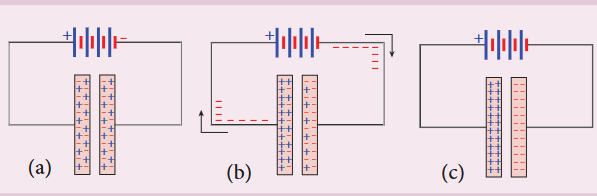

As soon as battery is connected, electrons start to flow from the negative terminal and are accumulated at the right plate, making it negative. Due to this negative potential, the electrons present in the nearby left plate are repelled and are moved towards positive terminal of the battery. When electrons leave the left plate, it becomes positively charged. This process is known as charging. The direction of flow of electrons is shown by arrows.

The charging of the plates continues till the level of the battery. Once C is fully charged, current will stop. At this time, we say that capacitor is blocking DC Figure (c).

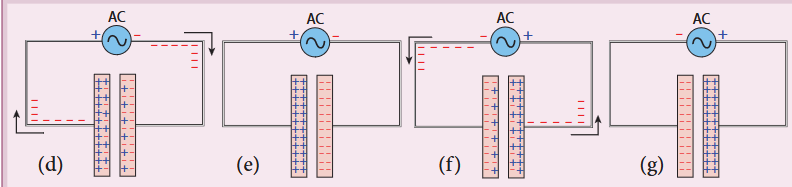

#### AC flows (?)! through a capacitor:

Now an AC source is connected across C. At an instant, the right side of the source is at negative potential, then the electrons flow from negative terminal to the right plate and from left plate to the positive terminal as shown in Figure (d) but no electron crosses the gap between the plates. These electron-flows are represented by arrows. Thus, the charging of the plates takes place and the plates become fully charged (Figure (e)).

After a short time, the polarities of AC source are reversed and the right side of the source is now positive. The electrons which were accumulated in the right plate start to flow to the positive terminal and the electrons from negative terminal flow to the left plate to neutralize the positive charges stored in it. As a result, the net charges present in the plates begin to decrease and this is called discharging. These electron-flows are represented by arrows as shown in Figure (f). Once the charges are exhausted, C will be charged again but with reversed polarities as shown in Figure (g).

Thus the electrons flow in one direction while charging the capacitor and its direction is reversed while discharging (the conventional current is also opposite in both cases). Though electrons flow in the circuit, no electron crosses the gap between the plates. In this way, AC flows through a capacitor.

### 4.7.7 AC circuit containing a resistor, an inductor and a capacitor in series - Series RLC circuit

Consider a circuit containing a resistor of resistance $R$, an inductor of inductance $L$ and a capacitor of capacitance $C$ connected across an alternating voltage source (Figure 4.46). The instantaneous value of the alternating voltage is given by

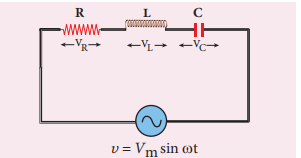

Let $i$ be the resulting current in the circuit at that instant. As a result, the voltage is developed across $R, L$ and $C$

We know that voltage across $R$ ($V_{R}$) is in phase with $i$, voltage across $L$ ($V_{L}$) leads $i$ by $\pi/2$ and voltage across $C$ ($V_{C}$) lags behind $i$ by $\pi/2$.

The phasor diagram is drawn with current as the reference phasor. The current is represented by the phasor $\overline{OL}$, $V_{R}$ by $\overline{OA}$, $V_{L}$ by $\overline{OB}$ and $V_{C}$ by $\overline{OC}$ as shown in Figure 4.47.

The length of these phasors are

$$
OI = I_{m}, \quad OA = I_{m}R, \quad OB = I_{m}X_{L}, \quad OC = I_{m}X_{C}
$$

The circuit is either effectively inductive or capacitive or resistive depending on the value of $V_{L}$ or $V_{C}$. Let us assume that $V_{L} > V_{C}$. Therefore, net voltage drop across $L-C$ combination is $V_{L} - V_{C}$ which is represented by a phasor $\overline{OD}$.

By parallelogram law, the diagonal $\overline{OE}$ gives the resultant voltage $\nu$ of $V_{R}$ and $(V_{L} - V_{C})$ and its length $OE$ is equal to $V_{m}$. Therefore,

$$
V_{m}^{2} = V_{R}^{2} + (V_{L} - V_{C})^{2}
$$

$$
V_{m} = \sqrt{(I_{m}R)^{2} + (I_{m}X_{L} - I_{m}X_{C})^{2}}
$$

$$
= I_{m}\sqrt{R^{2} + (X_{L} - X_{C})^{2}}
$$

$$
\mathrm{or} \quad I_{m} = \frac{V_{m}}{\sqrt{R^{2} + (X_{L} - X_{C})^{2}}}
$$

$$
\mathrm{or} \quad I_{m} = \frac{V_{m}}{Z}
$$

$$
\mathrm{where} \quad Z = \sqrt{R^{2} + (X_{L} - X_{C})^{2}} \quad (4.47)
$$

$Z$ is called impedance of the circuit which refers to the effective opposition to the current by the series RLC circuit.

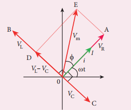

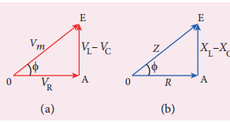

From phasor diagram, the phase angle between $\nu$ and $i$ is found out from the following relation

$$
\tan \phi = \frac{V_{L} - V_{C}}{V_{R}} = \frac{X_{L} - X_{C}}{R} \quad (4.48)
$$

#### Special cases

(i) If $X_{L} > X_{C}$, $(X_{L} - X_{C})$ is positive and phase angle $\phi$ is also positive. It means that the applied voltage leads the current by $\phi$ (or current lags behind voltage by $\phi$). The circuit is inductive.

$$
\therefore i = I_{m}\sin \omega t; \quad \nu = V_{m}\sin (\omega t + \phi)
$$

(ii) If $X_{L} < X_{C}$, $(X_{L} - X_{C})$ is negative and $\phi$ is also negative. Therefore current leads voltage by $\phi$ (or voltage lags behind current by $\phi$) and the circuit is capacitive.

$$
\therefore i = I_{m}\sin \omega t; \quad \nu = V_{m}\sin (\omega t - \phi)
$$

(iii) If $X_{L} = X_{C}$, $\phi$ is zero. Therefore current and voltage are in the same phase and the circuit is resistive.

$$
\therefore \nu = V_{m}\sin \omega t; \quad i = I_{m}\sin \omega t
$$

### 4.7.8 Resonance in series RLC circuit

When the frequency of the applied alternating source $(\omega_{r})$ is equal to the natural frequency $\left(\frac{1}{\sqrt{LC}}\right)$ of the RLC circuit, the current in the circuit reaches its maximum value. Then the circuit is said to be in electrical resonance. The frequency at which resonance takes place is called resonant frequency.

Table 4.1 Summary of results of AC circuits

| Type of circuit | Impedance | Value of Impedance | Phase angle of current with voltage | Power factor |
|---|---|---|---|---|
| Resistance | R | R | 0° | 1 |
| Inductance | X_L | $\omega L$ | 90° lag | 0 |
| Capacitance | X_C | $1/\omega C$ | 90° lead | 0 |
| R-L-C | Z | $\sqrt{R^2 + (\omega L - 1/\omega C)^2}$ | Between 0° and 90° lag or lead | Between 0 and 1 |

Resonant angular frequency, $\omega_{r} = \frac{1}{\sqrt{LC}}$

$$
\mathrm{or} \quad f_{r} = \frac{1}{2\pi\sqrt{LC}} \quad (4.49)
$$

At series resonance,

$$
\omega_{r} = \frac{1}{\sqrt{LC}} \quad \mathrm{or} \quad \omega_{r}^{2} = \frac{1}{LC}
$$

$$
\omega_{r}L = \frac{1}{\omega_{r}C} \quad \mathrm{or}
$$

$$
X_{L} = X_{C} \quad (4.50)
$$

This is the condition for resonance in RLC circuit.

Since $X_{L}$ and $X_{C}$ are frequency dependent, the resonance condition $(X_{L} = X_{C})$ can be achieved by varying the frequency of the applied voltage.

#### Effects of series resonance

When series resonance occurs, the impedance of the circuit is minimum and is equal to the resistance of the circuit. As a result of this, the current in the circuit becomes maximum. This is shown in the resonance curve drawn between current and frequency (Figure 4.49).

At resonance, the impedance is

$$
Z = \sqrt{R^{2} + (X_{L} - X_{C})^{2}} = R \quad \mathrm{since} \quad X_{L} = X_{C}
$$

Therefore, the current in the circuit is

$$
I_{m} = \frac{V_{m}}{\sqrt{R^{2} + (X_{L} - X_{C})^{2}}}
$$

$$
I_{m} = \frac{V_{m}}{R} \quad (4.51)
$$

The maximum current at series resonance is limited by the resistance of the circuit. For smaller resistance, larger current with sharper curve is obtained and vice versa.

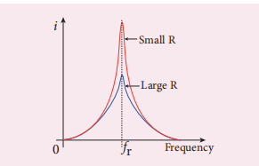

The phenomenon of electrical resonance is possible when the circuit contains both $L$ and $C$. Only then the voltage across $L$ and $C$ cancel one another when $V_{L}$ and $V_{C}$ are $180^{\circ}$ out of phase and the circuit becomes purely resistive. This implies that resonance will not occur in $RL$ and $RC$ circuits.

#### Applications of series RLC resonant circuit

RLC circuits have many applications like filter circuits, oscillators, voltage multipliers etc. An important use of series RLC resonant circuits is in the tuning circuits of radio and TV systems. The signals from many broadcasting stations at different frequencies are available in the air. To receive the signal of a particular station, tuning is done.

The tuning is commonly achieved by varying capacitance of a parallel plate variable capacitor, thereby changing the resonant frequency of the circuit. When resonant frequency is nearly equal to the frequency of the signal of the particular station, the amplitude of the current in the circuit is maximum. Thus the signal of that station alone is received.

### 4.7.9 Quality factor or Q-factor

The current in the series RLC circuit becomes maximum at resonance. Due to the increase in current, the voltage across $L$ and $C$ are also increased. This magnification of voltages at series resonance is termed as Q-factor.

It is defined as the ratio of voltage across $L$ or $C$ at resonance to the applied voltage.

$$
\mathrm{Q\text{-}factor} = \frac{\mathrm{Voltage~across~L~or~C~at~resonance}}{\mathrm{Applied~voltage}} \quad (4.52)
$$

At resonance, the circuit is purely resistive. Therefore, the applied voltage is equal to the voltage across $R$.

$$
\mathrm{Q\text{-}factor} = \frac{I_{m}X_{L}}{I_{m}R} = \frac{X_{L}}{R}
$$

$$
= \frac{\omega_{r}L}{R}
$$

$$
= \frac{L}{R\sqrt{LC}}
$$

$$
= \frac{1}{R}\sqrt{\frac{L}{C}} \quad (4.53)
$$

The physical meaning is that Q-factor indicates the number of times the voltage across $L$ or $C$ is greater than the applied voltage at resonance.

#### EXAMPLE 4.22

Find the impedance of a series RLC circuit if the inductive reactance, capacitive reactance and resistance are $184\Omega$, $144\Omega$ and $30\Omega$ respectively. Also calculate the phase angle between voltage and current.

#### Solution

$X_{L} = 184\Omega; X_{C} = 144\Omega; R = 30\Omega$

(i) The impedance is

$$
Z = \sqrt{R^{2} + (X_{L} - X_{C})^{2}}
$$

$$
= \sqrt{30^{2} + (184 - 144)^{2}}
$$

$$
= \sqrt{900 + 1600}
$$

$$
Z = 50\Omega
$$

(ii) Phase angle $\phi$ between voltage and current is

$$
\tan \phi = \frac{X_{L} - X_{C}}{R}
$$

$$
= \frac{184 - 144}{30} = 1.33
$$

$$
\phi = 53.1^{\circ}
$$

Since the phase angle is positive, voltage leads current by $53.1^{\circ}$ for this inductive circuit.

#### EXAMPLE 4.23

A $500\mu\mathrm{H}$ inductor, $\frac{80}{\pi^2} \mathrm{pF}$ capacitor and a $628\Omega$ resistor are connected to form a series RLC circuit. Calculate the resonant frequency and Q-factor of this circuit at resonance.

#### Solution

$$
L = 500 \times 10^{-6}\mathrm{H}; C = \frac{80}{\pi^2} \times 10^{-12}\mathrm{F}; R = 628\Omega
$$

(i) Resonant frequency is

$$
f_{r} = \frac{1}{2\pi\sqrt{LC}} = \frac{1}{2\pi\sqrt{500 \times 10^{-6} \times \frac{80}{\pi^{2}} \times 10^{-12}}}
$$

$$
= \frac{1}{2\sqrt{40,000 \times 10^{-18}}}
$$

$$
= \frac{10,000 \times 10^{3}}{4} = 2500 \mathrm{KHz}
$$

(ii) Q-factor

$$
\frac{\omega_{r}L}{R} = \frac{2 \times 3.14 \times 2500 \times 10^{3} \times 500 \times 10^{-6}}{628}
$$

$$
Q = 12.5
$$

#### EXAMPLE 4.24

Find the instantaneous value of alternating voltage $\nu = 10\sin (3\pi \times 10^{4}t)$ volt at i) 0 s ii) $50\mu\mathrm{s}$ iii) $75\mu\mathrm{s}$

#### Solution

The given equation is $\nu = 10\sin (3\pi \times 10^{4}t)$

(i) At $t = 0$ s,

$$
\nu = 10\sin 0^{\circ} = 0\mathrm{V}
$$

(ii) At $t = 50\mu\mathrm{s}$

$$
\nu = 10\sin \left(3\pi \times 10^{4} \times 50 \times 10^{-6}\right)
$$

$$
= 10\sin (3\pi \times 0.5) = 10\sin (1.5\pi) = -10\mathrm{V}
$$

(iii) At $t = 75\mu\mathrm{s}$

$$
\nu = 10\sin \left(3\pi \times 10^{4} \times 75 \times 10^{-6}\right)
$$

$$
= 10\sin (3\pi \times 0.75) = 10\sin (2.25\pi)
$$

$$
= 10\sin (2\pi + 0.25\pi) = 10\sin (0.25\pi) = 7.07\mathrm{V}
$$

#### EXAMPLE 4.25

The current in an inductive circuit is given by $0.3\sin (200t - 40^{\circ})$ A. Write the equation for the voltage across it if the inductance is $40\mathrm{mH}$.

#### Solution

$$
L = 40 \times 10^{-3}\mathrm{H}; i = 0.3\sin (200t - 40^{\circ})
$$

Inductive reactance, $X_{L} = \omega L = 200 \times 40 \times 10^{-3} = 8\Omega$

Peak voltage, $V_{m} = I_{m} X_{L} = 0.3 \times 8 = 2.4\mathrm{V}$

In an inductive circuit, the voltage leads the current by $90^{\circ}$. Therefore,

$$
\phi = 90^{\circ} - 40^{\circ} = 50^{\circ}
$$

Thus, $\nu = 2.4\sin (200t + 50^{\circ})$ V

## 4.8 AC CIRCUITS

### 4.8.1 Introduction of power in AC circuits

Power of a circuit is defined as the rate of consumption of electric energy in that circuit. It is given by the product of the voltage and current. In an AC circuit, the voltage and current vary continuously with time. Let us first calculate the power at an instant and then it is averaged over a complete cycle.

The alternating voltage and alternating current in the series inductive RLC circuit at an instant are given by

$$
\nu = V_{m}\sin \omega t \quad \text{and} \quad i = I_{m}\sin (\omega t + \phi)
$$

where $\phi$ is the phase angle between $\nu$ and $i$. The instantaneous power is then written as

$$
\begin{aligned}
P &= \nu i \\
&= V_{m}I_{m}\sin \omega t \sin (\omega t + \phi) \\
&= V_{m}I_{m}\sin \omega t [\sin \omega t \cos \phi + \cos \omega t \sin \phi] \\
P &= V_{m}I_{m}[\cos \phi \sin^{2} \omega t + \sin \omega t \cos \omega t \sin \phi]
\end{aligned} \quad (4.54)
$$

Here the average of $\sin^{2} \omega t$ over a cycle is $\frac{1}{2}$ and that of $\sin \omega t \cos \omega t$ is zero. Substituting these values, we obtain average power over a cycle.

$$
\begin{aligned}
P_{av} &= V_{m}I_{m}\cos \phi \times \frac{1}{2} \\
&= \frac{V_{m}}{\sqrt{2}} \frac{I_{m}}{\sqrt{2}} \cos \phi \\
P_{av} &= V_{RMS} I_{RMS} \cos \phi
\end{aligned} \quad (4.55)
$$

where $V_{RMS} I_{RMS}$ is called apparent power and $\cos \phi$ is power factor. The average power of an AC circuit is also known as the true power of the circuit.

### 4.8.2 Wattless current

Consider an AC circuit in which there is a phase angle of $\phi$ between $V_{RMS}$ and $I_{RMS}$ and voltage is assumed to be leading the current by $\phi$ as shown in the phasor diagram (Figure 4.50).

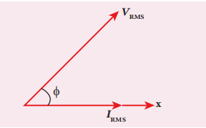

Now, $I_{RMS}$ is resolved into two perpendicular components, namely $I_{RMS}\cos \phi$ along $V_{RMS}$ and $I_{RMS}\sin \phi$ perpendicular to $V_{RMS}$ as shown in Figure 4.51.

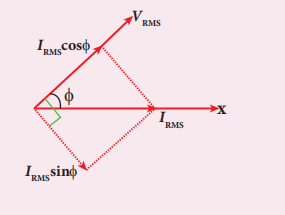

(i) The component of current $(I_{RMS}\cos \phi)$ which is in phase with the voltage is called active component. The power consumed by this current $= V_{RMS}I_{RMS}\cos \phi$ . So that it is also known as 'Wattful' current.

(ii) The other component $(I_{RMS}\sin \phi)$ which has a phase angle of $\pi/2$ with the voltage is called reactive component. The power consumed is zero. Hence it is also known as 'Wattless' current.

The current in an AC circuit is said to be wattless current if the power consumed by it is zero. This wattless current occurs in a purely inductive or capacitive circuit.

### 4.8.3 Power factor

The power factor of a circuit is defined in one of the following ways:

(i) Power factor $= \cos \phi =$ cosine of the angle of lead or lag

(ii) Power factor $= \frac{R}{Z} = \frac{\text{Resistance}}{\text{Impedance}}$

(iii) Power factor $= \frac{P_{av}}{V_{RMS}I_{RMS}} = \frac{\text{True power}}{\text{Apparent power}}$

Some examples for power factors:

(i) Power factor $= \cos 0^{\circ} = 1$ for a pure resistive circuit because the phase angle $\phi$ between voltage and current is zero.

(ii) Power factor $= \cos (\pm \frac{\pi}{2}) = 0$ for a purely inductive or capacitive circuit because the phase angle $\phi$ between voltage and current is $\pm \frac{\pi}{2}$.

(iii) Power factor lies between $0$ and $1$ for a circuit having $R$, $L$ and $C$ in varying proportions.

### 4.8.4 Advantages and disadvantages of AC over DC

There are many advantages and disadvantages of AC system over DC system.

#### Advantages:

(i) The generation of AC is cheaper than that of DC.

(ii) When AC is supplied at higher voltages, the transmission losses are small compared to DC transmission.

(iii) AC can easily be converted into DC with the help of rectifiers.

#### Disadvantages:

(i) Alternating voltages cannot be used for certain applications such as charging of batteries, electroplating, electric traction etc.

(ii) At high voltages, it is more dangerous to work with AC than DC.

#### EXAMPLE 4.26

A series RLC circuit which resonates at $400\mathrm{kHz}$ has $80\mu\mathrm{H}$ inductor, $2000\mathrm{pF}$ capacitor and $50\Omega$ resistor. Calculate (i) Q- factor of the circuit (ii) the new value of capacitance when the value of inductance is doubled and (iii) the new Q- factor.

#### Solution

$$
L = 80 \times 10^{-6}\mathrm{H}; C = 2000 \times 10^{-12}\mathrm{F}; R = 50\Omega; f_{r} = 400 \times 10^{3}\mathrm{Hz}
$$

(i) Q- factor, $Q_{1} = \frac{1}{R}\sqrt{\frac{L}{C}}$

$$
= \frac{1}{50}\sqrt{\frac{80 \times 10^{-6}}{2000 \times 10^{-12}}} = 4
$$

(ii) When $L_{2} = 2L = 2 \times 80 \times 10^{-6}\mathrm{H} = 160 \times 10^{-6}\mathrm{H}$,

$$
C_{2} = \frac{1}{4\pi^{2}f_{r}^{2}L_{2}}
$$

$$
= \frac{1}{4 \times 3.14^{2} \times (400 \times 10^{3})^{2} \times 160 \times 10^{-6}}
$$

$$
= 1000 \times 10^{-12}\mathrm{F}
$$

$$
C_{2} = 1000\mathrm{pF}
$$

(iii) $Q_{2} = \frac{1}{R}\sqrt{\frac{L_{2}}{C_{2}}} = \frac{1}{50}\sqrt{\frac{160 \times 10^{-6}}{1000 \times 10^{-12}}}$

$$
= \frac{1}{50}\sqrt{\frac{16 \times 10^{-5}}{10^{-9}}} = \frac{4 \times 10^{2}}{50} = 8
$$

#### EXAMPLE 4.27

A capacitor of capacitance $\frac{10^{-4}}{\pi}\mathrm{F}$, an inductor of inductance $\frac{2}{\pi}\mathrm{H}$ and a resistor of resistance $100\Omega$ are connected to form a series RLC circuit. When an AC supply of $220\mathrm{V}, 50\mathrm{Hz}$ is applied to the circuit, determine (i) the impedance of the circuit (ii) the peak value of current flowing in the circuit (iii) the power factor of the circuit and (iv) the power factor of the circuit at resonance.

#### Solution

$$
L = \frac{2}{\pi}\mathrm{H}; C = \frac{10^{-4}}{\pi}\mathrm{F}; R = 100\Omega; V_{RMS} = 220\mathrm{V}; f = 50\mathrm{Hz}
$$

$$
X_{L} = 2\pi f L = 2\pi \times 50 \times \frac{2}{\pi} = 200\Omega
$$

$$
X_{C} = \frac{1}{2\pi f C} = \frac{1}{2\pi \times 50 \times \frac{10^{-4}}{\pi}} = 100\Omega
$$

(i) Impedance, $Z = \sqrt{R^{2} + (X_{L} - X_{C})^{2}}$

$$
= \sqrt{100^{2} + (200 - 100)^{2}} = 141.4\Omega
$$

(ii) Peak value of current,

$$
I_{m} = \frac{V_{m}}{Z} = \frac{220 \times \sqrt{2}}{141.4} = 2.2\mathrm{A}
$$

(iii) Power factor of the circuit,

$$
\cos \phi = \frac{R}{Z} = \frac{100}{141.4} = 0.707
$$

(iv) Power factor at resonance,

$$
\cos \phi = \frac{R}{Z} = \frac{R}{R} = 1
$$

### 4.9 OSCILLATION IN LC CIRCUITS

#### 4.9.1 Energy conversion during LC oscillations

We have learnt that energy can be stored in both inductors and capacitors (Refer sections 1.8.2 and 4.3.2). In inductors, the energy is stored in the form of magnetic field while in capacitors, it is stored as the electric field.

Whenever energy is given to a circuit containing a pure inductor of inductance $L$ and a capacitor of capacitance $C$ , the energy oscillates back and forth between the magnetic field of the inductor and the electric field of the capacitor. Thus the electrical oscillations of definite frequency are generated. These oscillations are called LC oscillations.

#### Generation of LC oscillations

Let us assume that the capacitor is fully charged with maximum charge $Q_{m}$ at the initial stage. So that the energy stored in the capacitor is maximum and is given by $U_{E} = \frac{Q^{2}}{2C}$ . As there is no current in the inductor, the energy stored in it is zero i.e., $U_{B} = 0$ . Therefore, the total energy is wholly electrical. This is shown in Figure 4.52(a).

The capacitor now begins to discharge through the inductor that establishes current $i$ in clockwise direction. This current produces a magnetic field around the inductor and the energy stored in the inductor is given by $U_{B} = \frac{Li^{2}}{2}$ . As the charge in the capacitor decreases, the energy stored in it also decreases and is given by $U_{E} = \frac{q^{2}}{2C}$ . Thus there is a transfer of some part of energy from the capacitor to the inductor. At that instant, the total energy is the sum of electrical and magnetic energies (Figure 4.52(b)).

When the charges in the capacitor are exhausted, its energy becomes zero i.e., $U_{E} = 0$ . The energy is fully transferred to the magnetic field of the inductor and its energy is maximum. This maximum energy is given by $U_{B} = \frac{LI_{m}^{2}}{2}$ where $I_{m}$ is the maximum current flowing in the circuit. The total energy is wholly magnetic (Figure 4.52(c)).

Even though the charge in the capacitor is zero, the current will continue to flow in the same direction because the inductor will not allow it to stop immediately. The current is made to flow with decreasing magnitude by the collapsing magnetic field of the inductor. As a result of this, the capacitor begins to charge in the opposite direction. A part of the energy is transferred from the inductor back to the capacitor. The total energy is the sum of the electrical and magnetic energies (Figure 4.52(d)).

When the current in the circuit reduces to zero, the capacitor becomes fully charged in the opposite direction. The energy stored in the capacitor becomes maximum. Since the current is zero, the energy stored in the inductor is zero. The total energy is wholly electrical (Figure 4.52(e)).

The state of the circuit is similar to the initial state but the difference is that the capacitor is charged in opposite direction. The capacitor then starts to discharge through the inductor with anti- clockwise current. The total energy is the sum of the electrical and magnetic energies (Figure 4.52(f)).

As already explained, the processes are repeated in opposite direction (Figure 4.52(g) and (h)). Finally, the circuit returns to the initial state (Figure 4.52(a)). Thus, when the circuit goes through these stages, an alternating current flows in the circuit. As this process is repeated again and again, the electrical oscillations of definite frequency are generated. These are known as LC oscillations.

In the ideal LC circuit, there is no loss of energy. Therefore, the oscillations will continue indefinitely. Such oscillations are called undamped oscillations.

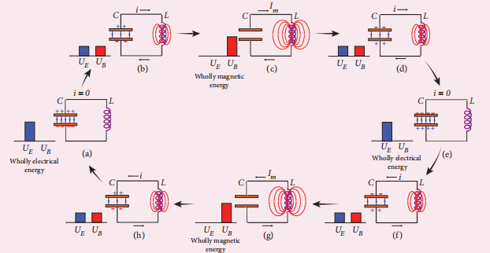

### 4.9.2 Conservation of energy in LC oscillations

During LC oscillations in LC circuits, the energy of the system oscillates between the electric field of the capacitor and the magnetic field of the inductor. Although, these two forms of energy vary with time, the total energy remains constant. It means that LC oscillations take place in accordance with the law of conservation of energy.

$$
\mathrm{Total~energy}, U = U_{E} + U_{B} = \frac{q^{2}}{2C} + \frac{1}{2} Li^{2}
$$

Let us consider 3 different stages of LC oscillations and calculate the total energy of the system.

**Case (i)** When the charge in the capacitor, $q = Q_{m}$ and the current through the inductor, $i = 0$ , the total energy is given by

$$
U = \frac{Q_{m}^{2}}{2C} + 0 = \frac{Q_{m}^{2}}{2C} \quad (4.56)
$$

The total energy is wholly electrical.

**Case (ii)** When charge $= 0$ ; current $= I_{m}$ the total energy is

$$
U = 0 + \frac{1}{2} LI_{m}^{2} = \frac{1}{2} LI_{m}^{2}
$$

$$
= \frac{L}{2} \times \left(\frac{Q_{m}^{2}}{LC}\right) \quad \mathrm{since} \quad I_{m} = Q_{m}\omega = \frac{Q_{m}}{\sqrt{LC}}
$$

$$
= \frac{Q_{m}^{2}}{2C} \quad (4.57)
$$

The total energy is wholly magnetic.

**Case (iii)** When charge $= q$ ; current $= i$ the total energy is

$$
U = \frac{q^{2}}{2C} + \frac{1}{2} Li^{2}
$$

Since $q = Q_{m}\cos \omega t$, $i = -\frac{dq}{dt} = Q_{m}\omega \sin \omega t$. The negative sign in current indicates that the charge in the capacitor decreases with time.

$$
U = \frac{Q_{m}^{2}\cos^{2} \omega t}{2C} + \frac{L \omega^{2} Q_{m}^{2} \sin^{2} \omega t}{2}
$$

$$
= \frac{Q_{m}^{2}\cos^{2} \omega t}{2C} + \frac{L Q_{m}^{2} \sin^{2} \omega t}{2LC} \quad \mathrm{since} \quad \omega^{2} = \frac{1}{LC}
$$

$$
= \frac{Q_{m}^{2}}{2C} (\cos^{2} \omega t + \sin^{2} \omega t)
$$

$$
U = \frac{Q_{m}^{2}}{2C} \quad (4.58)
$$

From above three cases, it is clear that the total energy of the system remains constant.

### 4.9.3 Analogies between LC oscillations and simple harmonic oscillations

#### Qualitative treatment

The electromagnetic oscillations of LC system can be compared with the mechanical oscillations of a spring- mass system.

There are two forms of energy involved in LC oscillations. One is electrical energy of the charged capacitor; the other magnetic energy of the inductor carrying current.

Table 4.2 Energy in two oscillatory systems

| LC oscillator | | Spring-mass system | |
|---|---|---|---|
| Element | Energy | Element | Energy |
| Capacitor | Electrical Energy $= \frac{1}{2} \left(\frac{1}{C}\right) q^{2}$ | Spring | Potential energy $= \frac{1}{2} k x^{2}$ |
| Inductor | Magnetic energy $= \frac{1}{2} L i^{2}$, $i = \frac{dq}{dt}$ | Mass | Kinetic energy $= \frac{1}{2} m v^{2}$, $v = \frac{dx}{dt}$ |

Likewise, the mechanical energy of the spring- mass system exists in two forms; the potential energy of the compressed or extended spring and the kinetic energy of the mass. The Table 4.2 lists these two pairs of energy.

By examining the Table 4.2, the analogies between the various quantities can be understood and these correspondences are given in Table 4.3.

Table 4.3 Analogies between electrical and mechanical quantities

| Electrical system | Mechanical system |
|---|---|
| Charge $q$ | Displacement $x$ |
| Current $i = \frac{dq}{dt}$ | Velocity $v = \frac{dx}{dt}$ |
| Inductance $L$ | Mass $m$ |
| Reciprocal of capacitance $1/C$ | Force constant $k$ |
| Electrical energy $= \frac{1}{2} \left(\frac{1}{C}\right) q^{2}$ | Potential energy $= \frac{1}{2} k x^{2}$ |
| Magnetic energy $= \frac{1}{2} L i^{2}$ | Kinetic energy $= \frac{1}{2} m v^{2}$ |
| Electromagnetic energy $U = \frac{1}{2} \left(\frac{1}{C}\right) q^{2} + \frac{1}{2} L i^{2}$ | Mechanical energy $E = \frac{1}{2} k x^{2} + \frac{1}{2} m v^{2}$ |

The angular frequency of oscillations of a spring- mass is given by (Refer equation 10.22 of section 10.4.1 of XI physics text book).

$$
\omega = \sqrt{\frac{k}{m}}
$$

From Table 4.3, $k \rightarrow \frac{1}{C}$ and $m \rightarrow L$ . Therefore, the angular frequency of $LC$ oscillations is given by

$$
\omega = \frac{1}{\sqrt{LC}} \quad (4.59)
$$

#### SUMMARY

- Whenever the magnetic flux linked with a closed coil changes, an emf is induced and hence an electric current flows in the circuit. This phenomenon is known as **electromagnetic induction**.
- **Faraday's first law** states that whenever magnetic flux linked with a closed circuit changes, an emf is induced in the circuit.
- **Faraday's second law** states that the magnitude of induced emf in a closed circuit is equal to the time rate of change of magnetic flux linked with the circuit.
- **Lenz's law** states that the direction of the induced current is such that it always opposes the cause responsible for its production. Lenz's law is established on the basis of the law of conservation of energy.
- **Fleming's right hand rule** states that if the index finger points the direction of the magnetic field and the thumb indicates the direction of motion of the conductor, then the middle finger will indicate the direction of the induced current.
- Even for a conductor in the form of a sheet or a plate, an emf is induced when magnetic flux linked with it changes. The induced currents flow in concentric circular paths called **Eddy currents** or **Foucault currents**.
- **Inductor** is a device used to store energy in a magnetic field when an electric current flows through it.
- If the flux linked with the coil is changed, an emf is induced in that same coil. This phenomenon is known as **self-induction**. The emf induced is called self-induced emf.
- When an electric current passing through a coil changes with time, an emf is induced in the neighbouring coil. This phenomenon is known as **mutual induction** and the emf is called mutually induced emf.
- **AC generator** or **alternator** is an energy conversion device. It converts mechanical energy used to rotate the coil or field magnet into electrical energy.
- In some AC generators, there are three separate coils, which would give three separate emfs. Hence they are called **three-phase AC generators**.
- **Transformer** is a stationary device used to transform AC electric power from one circuit to another without changing its frequency. The efficiency of a transformer is defined as the ratio of the useful output power to the input power.
- An **alternating voltage** is a voltage which changes polarity at regular intervals of time and the resulting alternating current changes direction accordingly.
- The **average value** of alternating current is defined as the average of all values of current over a positive half-cycle or negative half-cycle.
- The **root mean square value** or **effective value** of an alternating current is defined as the square root of the mean of the squares of all currents over one cycle.
- A sinusoidal alternating voltage (or current) can be represented by a vector which rotates about the origin in anti-clockwise direction at a constant angular velocity. Such a rotating vector is called a **phasor**.
- When the frequency of the applied alternating source is equal to the natural frequency of the RLC circuit, the current in the circuit reaches its maximum value. Then the circuit is said to be in **electrical resonance**.
- The magnification of voltages at series resonance is termed as **Q-factor**.
- **Power** of a circuit is defined as the rate of consumption of electric energy in that circuit. It depends on the components of the circuit.
- Whenever energy is given to a LC circuit, the electrical oscillations of definite frequency are generated. These oscillations are called **LC oscillations**.
- During LC oscillations, the total energy remains constant. It means that LC oscillations take place in accordance with the law of conservation of energy.

#### EVALUATION

#### Multiple Choice Questions

1. An electron moves on a straight line path XY as shown in the figure. The coil abcd is adjacent to the path of the electron. What will be the direction of current, if any, induced in the coil?

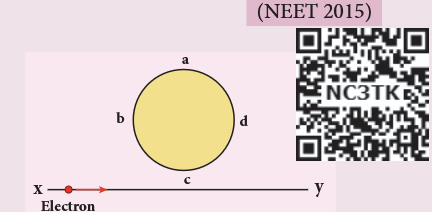

   (a) The current will reverse its direction as the electron goes past the coil
   (b) No current will be induced
   (c) abcd
   (d) adcb

   **Answer: (a)**

2. A thin semi-circular conducting ring (PQR) of radius r is falling with its plane vertical in a horizontal magnetic field B, as shown in the figure.

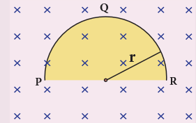

 The potential difference developed across the ring when its speed $v$, is
   (a) Zero
   (b) $\frac{Bv\pi r^2}{2}$ and P is at higher potential
   (c) $\pi r B v$ and R is at higher potential
   (d) $2r B v$ and R is at higher potential

   **Answer: (d)**

3. The flux linked with a coil at any instant t is given by $\Phi_B = 10t^2 - 50t + 250$. The induced emf at $t = 3$ s is
   (a) $-190\mathrm{V}$ (b) $-10\mathrm{V}$ (c) $10\mathrm{V}$ (d) $190\mathrm{V}$

   **Answer: (b)**

4. When the current changes from $+2\mathrm{A}$ to $-2\mathrm{A}$ in $0.05\mathrm{s}$, an emf of $8\mathrm{V}$ is induced in a coil. The co-efficient of self-induction of the coil is
   (a) $0.2\mathrm{H}$ (b) $0.4\mathrm{H}$ (c) $0.8\mathrm{H}$ (d) $0.1\mathrm{H}$

   **Answer: (d)**

5. The current $i$ flowing in a coil varies with time as shown in the figure. The variation of induced emf with time would be (NEET 2011)

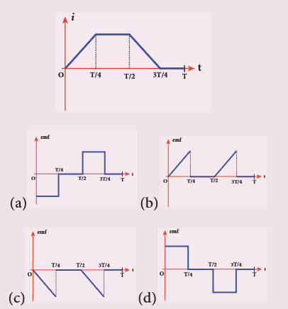

   **Answer: (a)**

6. A circular coil with a cross-sectional area of $4\mathrm{cm}^2$ has 10 turns. It is placed at the centre of a long solenoid that has 15 turns/cm and a cross-sectional area of $10\mathrm{cm}^2$. The axis of the coil coincides with the axis of the solenoid. What is their mutual inductance?
   (a) $7.54\mu \mathrm{H}$ (b) $8.54\mu \mathrm{H}$ (c) $9.54\mu \mathrm{H}$ (d) $10.54\mu \mathrm{H}$

   **Answer: (a)**

7. In a transformer, the number of turns in the primary and the secondary are 410 and 1230 respectively. If the current in primary is 6A, then that in the secondary coil is
   (a) 2 A (b) 18 A (c) 12 A (d) 1 A

   **Answer: (a)**

8. A step-down transformer reduces the supply voltage from 220 V to 11 V and increase the current from 6 A to 100 A. Then its efficiency is
   (a) 1.2 (b) 0.83 (c) 0.12 (d) 0.9

   **Answer: (b)**

9. In an electrical circuit, $R, L, C$ and AC voltage source are all connected in series. When $L$ is removed from the circuit, the phase difference between the voltage and current in the circuit is $\pi/3$. Instead, if $C$ is removed from the circuit, the phase difference is again $\pi/3$. The power factor of the circuit is (NEET 2012)
   (a) $\frac{1}{2}$ (b) $\frac{1}{\sqrt{2}}$ (c) 1 (d) $\frac{\sqrt{3}}{2}$

   **Answer: (c)**

10. In a series RL circuit, the resistance and inductive reactance are the same. Then the phase difference between the voltage and current in the circuit is
    (a) $\frac{\pi}{4}$ (b) $\frac{\pi}{2}$ (c) $\frac{\pi}{6}$ (d) zero

    **Answer: (a)**

11. In a series resonant RLC circuit, the voltage across $100\Omega$ resistor is $40\mathrm{V}$. The resonant frequency $\omega$ is $250\mathrm{rad/s}$. If the value of $C$ is $4\mu \mathrm{F}$, then the voltage across $L$ is
    (a) $600\mathrm{V}$ (b) $4000\mathrm{V}$ (c) $400\mathrm{V}$ (d) $1\mathrm{V}$

    **Answer: (c)**

12. An inductor $20\mathrm{mH}$, a capacitor $50\mu \mathrm{F}$ and a resistor $40\Omega$ are connected in series across a source of emf $V = 10 \sin 340t$. The power loss in AC circuit is
    (a) $0.76\mathrm{W}$ (b) $0.89\mathrm{W}$ (c) $0.46\mathrm{W}$ (d) $0.67\mathrm{W}$

    **Answer: (c)**
9

13. The instantaneous values of alternating current and voltage in a circuit are $i = \frac{1}{\sqrt{2}} \sin (100\pi t)$ A and $v = \frac{1}{\sqrt{2}} \sin \left(100\pi t + \frac{\pi}{3}\right)$ V. The average power in watts consumed in the circuit is (IIT Main 2012)
    (a) $\frac{1}{4}$ (b) $\frac{\sqrt{3}}{4}$ (c) $\frac{1}{2}$ (d) $\frac{1}{8}$

    **Answer: (d)**

14. In an oscillating LC circuit, the maximum charge on the capacitor is $Q$. The charge on the capacitor when the energy is stored equally between the electric and magnetic fields is
    (a) $\frac{Q}{2}$ (b) $\frac{Q}{\sqrt{3}}$ (c) $\frac{Q}{\sqrt{2}}$ (d) $Q$

    **Answer: (c)**

15. $\frac{20}{\pi^2}\mathrm{H}$ inductor is connected to a capacitor of capacitance C. The value of C in order to impart maximum power at $50\mathrm{Hz}$ is
    (a) $50\mu \mathrm{F}$ (b) $0.5\mu \mathrm{F}$ (c) $500\mu \mathrm{F}$ (d) $5\mu \mathrm{F}$

    **Answer: (d)**

#### Answers

1) a, 2) d, 3) b, 4) d, 5) a, 6) a, 7) a, 8) b, 9) c, 10) a, 11) c, 12) c, 13) d, 14) c, 15) d

#### II Short Answer Questions

1. What is meant by electromagnetic induction?
2. State Faraday's laws of electromagnetic induction.
3. State Lenz's law.
4. State Fleming's right hand rule.
5. How is Eddy current produced? How do they flow in a conductor?
6. Mention the ways of producing induced emf.
7. What for an inductor is used? Give some examples.
8. What do you mean by self-induction?
9. How will you define the unit of inductance?
10. What do you understand by self-inductance of a coil? Give its physical significance.
11. What is meant by mutual induction?
12. Give the principle of AC generator.
13. List out the advantages of stationary armature-rotating field system of AC generator.
14. What are step-up and step-down transformers?
15. Define average value of an alternating current.
16. How will you define RMS value of an alternating current?
17. What are phasors?
18. Define electric resonance.
19. What do you mean by resonant frequency?
20. How will you define Q-factor?
21. What is meant by wattless current?
22. Give any one definition of power factor.
23. What are LC oscillations?

#### III Long Answer Questions

1. Establish the fact that the relative motion between the coil and the magnet induces an emf in the coil of a closed circuit.
2. Give an illustration of determining direction of induced current by using Lenz's law.
3. Show that Lenz's law is in accordance with the law of conservation of energy.
4. Obtain an expression for motional emf from Lorentz force.
5. Give the uses of Foucault current.
6. Define self-inductance of a coil in terms of (i) magnetic flux and (ii) induced emf.
7. Assuming that the length of the solenoid is large when compared to its diameter, find the equation for its inductance.
8. An inductor of inductance L carries an electric current i. How much energy is stored while establishing the current in it?
9. Show that the mutual inductance between a pair of coils is same $(M_{12} = M_{21})$.
10. How will you induce an emf by changing the area enclosed by the coil?
11. Show mathematically that the rotation of a coil in a magnetic field over one rotation induces an alternating emf of one cycle.
12. Elaborate the standard construction details of AC generator.
13. Explain the working of a single-phase AC generator with necessary diagram.
14. How are the three different emfs generated in a three-phase AC generator? Show the graphical representation of these three emfs.
15. Explain the construction and working of transformer.
16. Mention the various energy losses in a transformer.
17. Give the advantage of AC in long distance power transmission with an illustration.
18. Find out the phase relationship between voltage and current in a pure inductive circuit.
19. Derive an expression for phase angle between the applied voltage and current in a series RLC circuit.
20. Define inductive and capacitive reactance. Give their units.
21. Obtain an expression for average power of AC over a cycle. Discuss its special cases.
22. Explain the generation of LC oscillations in a circuit containing an inductor of inductance L and a capacitor of capacitance C.
23. Prove that the total energy is conserved during LC oscillations.
24. Compare the electromagnetic oscillations of LC circuit with the mechanical oscillations of block-spring system qualitatively to find the expression for angular frequency of LC oscillator.

#### IV Numerical Problems

1. A square coil of side $30~\mathrm{cm}$ with 500 turns is kept in a uniform magnetic field of $0.4\mathrm{T}$. The plane of the coil is inclined at an angle of $30^{\circ}$ to the field. Calculate the magnetic flux through the coil. **(Ans: $9\mathrm{Wb}$)**

2. A straight metal wire crosses a magnetic field of flux $4\mathrm{mWb}$ in a time $0.4\mathrm{s}$. Find the magnitude of the emf induced in the wire. **(Ans: $10\mathrm{mV}$)**

3. The magnetic flux passing through a coil perpendicular to its plane is a function of time and is given by $\Phi_B = (2t^3 + 4t^2 + 8t + 8)\mathrm{Wb}$. If the resistance of the coil is $5\Omega$, determine the induced current through the coil at a time $t = 3$ second. **(Ans: $17.2\mathrm{A}$)**

4. A closely wound circular coil of radius $0.02\mathrm{m}$ is placed perpendicular to the magnetic field. When the magnetic field is changed from $8000\mathrm{T}$ to $2000\mathrm{T}$ in $6\mathrm{s}$, an emf of $44\mathrm{V}$ is induced in it. Calculate the number of turns in the coil. (Take $\pi = \frac{22}{7}$) **(Ans: $35$ turns)**

5. A rectangular coil of area $6\mathrm{cm}^2$ having $3500$ turns is kept in a uniform magnetic field of $0.4\mathrm{T}$. Initially, the plane of the coil is perpendicular to the field and is then rotated through an angle of $180^{\circ}$. If the resistance of the coil is $35\Omega$, find the amount of charge flowing through the coil. **(Ans: $48 \times 10^{-3}\mathrm{C}$)**

6. An induced current of $2.5\mathrm{mA}$ flows through a single conductor of resistance $100\Omega$. Find out the rate at which the magnetic flux is cut by the conductor. **(Ans: $250\mathrm{mWb s}^{-1}$)**

7. A fan of metal blades of length $0.4\mathrm{m}$ rotates normal to a magnetic field of $4 \times 10^{-3}\mathrm{T}$. If the induced emf between the centre and edge of the blade is $0.02\mathrm{V}$, determine the rate of rotation of the blade. **(Ans: $9.95$ revolutions/second)**

8. A bicycle wheel with metal spokes of $1\mathrm{m}$ long rotates in Earth's magnetic field. The plane of the wheel is perpendicular to the horizontal component of Earth's field of $4 \times 10^{-5}\mathrm{T}$. If the emf induced across the spokes is $31.4\mathrm{mV}$, calculate the rate of revolution of the wheel. **(Ans: $250$ revolutions/second)**

9. Determine the self-inductance of 4000 turn air-core solenoid of length $2\mathrm{m}$ and diameter $0.04\mathrm{m}$. **(Ans: $12.62\mathrm{mH}$)**

10. A coil of 200 turns carries a current of $4\mathrm{A}$. If the magnetic flux through the coil is $6 \times 10^{-5}\mathrm{Wb}$, find the magnetic energy stored in the medium surrounding the coil. **(Ans: $0.024\mathrm{J}$)**

11. A $50\mathrm{cm}$ long solenoid has 400 turns per cm. The diameter of the solenoid is $0.04\mathrm{m}$. Find the magnetic flux linked with each turn when it carries a current of $1\mathrm{A}$. **(Ans: $0.63 \times 10^{-4}\mathrm{Wb}$)**

12. A coil of 200 turns carries a current of $0.4\mathrm{A}$. If the magnetic flux of $4\mathrm{mWb}$ is linked with each turn of the coil, find the inductance of the coil. **(Ans: $2\mathrm{H}$)**

13. Two air core solenoids have the same length of $80\mathrm{cm}$ and same cross-sectional area $5\mathrm{cm}^2$. Find the mutual inductance between them if the number of turns in the first coil is 1200 turns and that in the second coil is 400 turns. **(Ans: $0.38\mathrm{mH}$)**

14. A long solenoid having 400 turns per cm carries a current 2A. A 100 turn coil of cross-sectional area $4\mathrm{cm}^2$ is placed co-axially inside the solenoid so that the coil is in the field produced by the solenoid. Find the emf induced in the coil if the current through the solenoid reverses its direction in $0.04\mathrm{sec}$. **(Ans: $0.20\mathrm{V}$)**

15. A 200 turn circular coil of radius $2\mathrm{cm}$ is placed co-axially within a long solenoid of $3\mathrm{cm}$ radius. If the turn density of the solenoid is 90 turns per cm, then calculate mutual inductance of the coil and the solenoid. **(Ans: $2.84\mathrm{mH}$)**

16. The solenoids $S_1$ and $S_2$ are wound on an iron-core of relative permeability 900. Their areas of their cross-section and their lengths are the same and are $4\mathrm{cm}^2$ and $0.04\mathrm{m}$ respectively. If the number of turns in $S_1$ is 200 and in $S_2$ is 300, calculate the mutual inductance. **(Ans: $6.79 \times 10^{-2}\mathrm{H}$)**

17. A step-down transformer connected to main supply of 220 V is used to operate 11V, 88W lamp. Calculate (i) Voltage transformation ratio and (ii) Current in the primary. **(Ans: $1/20$ and $0.4\mathrm{A}$)**

18. A 200V/120V step-down transformer of $90\%$ efficiency is connected to an induction stove of resistance $40\Omega$. Find the current drawn by the primary of the transformer. **(Ans: $2\mathrm{A}$)**

19. The 300 turn primary of a transformer has resistance $0.82\Omega$ and the resistance of its secondary of 1200 turns is $6.2\Omega$. Find the voltage across the primary if the power output from the secondary at $1600\mathrm{V}$ is $32\mathrm{kW}$. Calculate the power losses in both coils when the transformer efficiency is $80\%$. **(Ans: $8.2\mathrm{kW}$ and $2.48\mathrm{kW}$)**

20. Calculate the instantaneous value at $60^{\circ}$, average value and RMS value of an alternating current whose peak value is 20 A. **(Ans: $17.32\mathrm{A}$, $12.74\mathrm{A}$, $14.14\mathrm{A}$)**

#### V Conceptual Questions

1. A graph between the magnitude of the magnetic flux linked with a closed loop and time is given in the figure. Arrange the regions of the graph in ascending order of the magnitude of induced emf in the loop.

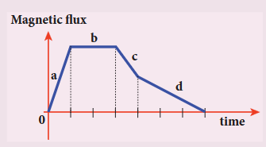

2. Using Lenz's law, predict the direction of induced current in conducting rings 1 and 2 when current in the wire is steadily decreasing.

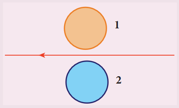

3. A flexible metallic loop abcd in the shape of a square is kept in a magnetic field with its plane perpendicular to the field. The magnetic field is directed into the paper normally. Find the direction of the induced current when the square loop is crushed into an irregular shape as shown in the figure.

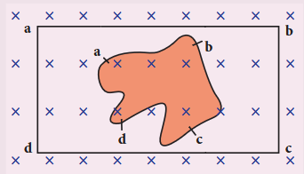

4. Predict the polarity of the capacitor in a closed circular loop when two bar magnets are moved as shown in the figure.

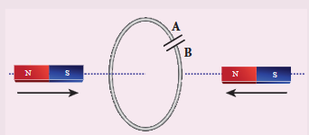

5. In series LC circuit, the voltages across L and C are $180^{\circ}$ out of phase. Is it correct? Explain.

6. When does power factor of a series RLC circuit become maximum?

#### BOOK FOR REFERENCES

1. H.C.Verma, Concepts of Physics, Volume 1 and 2, Bharathi Bhawan publishers.
2. Halliday, Resnick and Walker, Principles of Physics, Wiley publishers.
3. D.C.Tayal, Electricity and Magnetism, Himalaya Publishing House.
4. K.K.Tewari, Electricity and Magnetism with Electronics, S.Chand Publishers.
5. B.L.Theraja and A.K.Theraja, A text book of Electrical Technology, Volume 1 and 2, S.Chand publishers.

