# ELECTROMAGNETIC WAVES

"One scientific epoch ended and another began with James Clerk Maxwell" - Albert Einstein

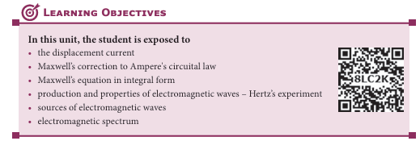
# 5.1 INTRODUCTION

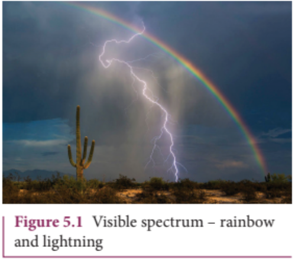

We see the world around us through light. Light from the Sun is one of the sources of energy without which human beings cannot survive in this planet. Light plays crucial role in understanding the structure and properties of various things from atom to universe. Without light, even our eyes cannot see objects. What is light?. This puzzle made many physicists sleepless until middle of \(19^{\mathrm{th}}\) century. Earlier, many scientists thought that optics and electromagnetism are two different branches of physics. But from the work of James Clerk Maxwell, who actually enlightened the concept of light from his theoretical prediction that light is an electromagnetic wave which moves with the speed equal to \(3\times 10^{8}\mathrm{ms}^{- 1}\) (in free space or vacuum). Later, it was confirmed that visible light is just only small portion of electromagnetic spectrum, which ranges from gamma rays to radio waves.

In unit 4, we studied that time varying magnetic field produces an electric field (Faraday's law of electromagnetic induction). Maxwell strongly believed that nature must possess symmetry and he asked the following question, "when the time varying magnetic field produces an electric field, why not the time varying electric field produce a magnetic field?"

Later he proved that it is indeed true. In 1888, H. Hertz experimentally verified Maxwell's prediction and hence, this understanding resulted in new technological invention, especially in wireless communication, LASER (Light Amplification by Stimulated Emission of Radiation) technology, RADAR (Radio Detection And Ranging) etc.
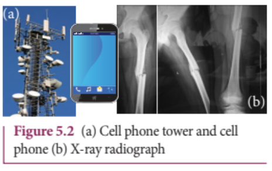

In today's digital world, cell phones (Figure 5.2 (a)) have greater influence in our day to day life. It is a faster and more effective mode of transferring information from one place to another. It works on the basis that light is an electromagnetic wave. In hospitals, the location of bone fracture can be detected using X- rays as shown in Figure 5.2 (b), which is also an electromagnetic wave. For cooking microwave oven is used. The microwave is also an electromagnetic wave. There are plenty of applications of electromagnetic waves in engineering, medicine (example LASER surgery, etc), defence (example, RADAR signals) and also in fundamental scientific research. In this unit, basics of electromagnetic waves are discussed.

### 5.1.1 Displacement current and Maxwell's correction to Ampere's circuital law

## Induced magnetic field

Faraday's law of electromagnetic induction states that the change in magnetic field produces an electric field. Mathematically, it is written as

$$ \oint_{l}\vec{E}\cdot \vec{dl} = -\frac{d}{dt}\Phi_{B} = -\frac{d}{dt}\oint_{S}\vec{B}\cdot \vec{dA} \quad (5.1)$$

where $\Phi_{\mathrm{B}}$ is the magnetic flux and $\frac{d}{dt}$ is the total derivative with respect to time. Equation (5.1) means that the electric field $\bar{E}$ is induced along a closed loop by the changing magnetic flux $\Phi_{\mathrm{B}}$ in the region encircled by the loop.

 From symmetry considerations, James Clerk Maxwell showed that the change in electric field also produces a magnetic field which is given by

$$\oint_{l}\vec{B}\cdot \vec{dl} = -\frac{d}{dt}\Phi_{E} = -\frac{d}{dt}\oint_{S}\vec{E}\cdot \vec{dA} \quad (5.2)$$

where $\Phi_{\mathrm{E}}$ is the electric flux. This is known as Maxwell's law of induction which explains that the magnetic field $\vec{B}$ is induced along a closed loop by the changing electric flux $\Phi_{\mathrm{E}}$ in the region encircled by that loop. This symmetry between electric and magnetic fields explains the existence of electromagnetic waves such as radio waves, gamma rays, infrared rays etc.

## Displacement current - Maxwell's correction

In order to understand how the changing electric field induces magnetic field, let us consider a situation of charging a parallel plate capacitor which contains non- conducting medium between the plates.

Let a time- dependent current $i_{c}$ called conduction current be passed through the wire to charge the capacitor.

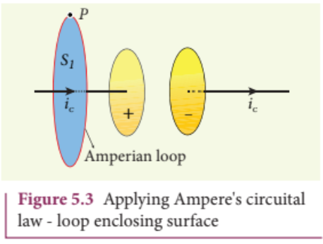

Ampere's circuital law can be used to find the magnetic field produced around the current carrying wire.

To calculate the magnetic field at a point $P$ near the wire and outside the capacitor, let us draw a circular Amperian loop which encloses the circular surface $S_{1}$ (Figure 5.3). Using Ampere's circuital law for this loop, we get

$$\oint_{\mathrm{enclosing} S_{1}}\vec{B}\cdot d\vec{l} = \mu_{0}i_{c} \quad (5.3)$$

where $\mu_{0}$ is the permeability of free space.

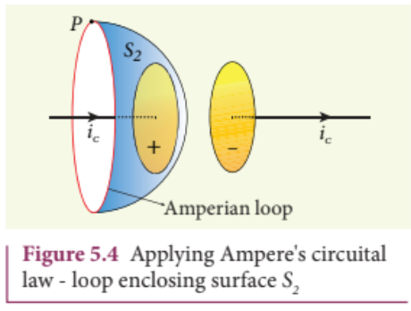

Now, the same loop is enclosed by balloon shaped surface $S_{2}$ such that boundaries of two surfaces $S_{1}$ and $S_{2}$ are same but the shape of the surfaces is different (Figure 5.4). As Ampere's law applied for a given closed loop does not depend on the shape of the enclosing surface, the integrals should give the same answer. But by applying Ampere's circuital law for the surface $S_{2}$ , we get

$$\oint_{\mathrm{enclosing} S_{2}}\vec{B}\cdot d\vec{l} = 0 \quad (5.4)$$

The right hand side of equation is zero because the surface $S_{2}$ nowhere touches the wire carrying conduction current and further, there is no current flowing between the plates of the capacitor (gap between the plates). So the magnetic field at a point $P$ is zero. Hence there is an inconsistency between equations (5.3) and (5.4).

Maxwell resolved this inconsistency as follows: While the capacitor is being charged up, varying electric field is produced between capacitor plates. There must be a current associated with the changing electric field between capacitor plates. In other words, time- varying electric field (or time- varying electric flux) produces a current. This is known as displacement current flowing between the plates of the capacitor (Figure 5.5).

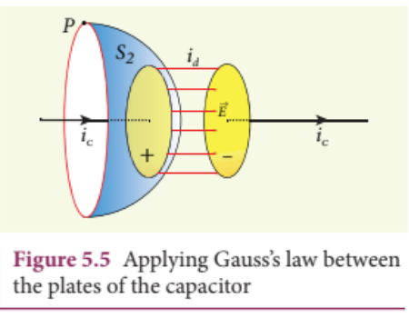

From Gauss's law of electrostatics, the electric flux between the plates of the capacitor is

$$\Phi_{E} = \oint_{S}\vec{E}\cdot d\vec{A} = EA = \frac{q}{\epsilon_{0}}$$

where $A$ is the area of the plates of capacitor. The change in electric flux is given by

$$\frac{d\Phi_{E}}{dt} = \frac{1}{\epsilon_{0}}\frac{dq}{dt}\qquad \mathrm{(or)}$$ $$\frac{dq}{dt} = \epsilon_{0}\frac{d\Phi_{E}}{dt}$$ $$i_{d} = \epsilon_{0}\frac{d\Phi_{E}}{dt}$$

where $\frac{dq}{dt} = i_{d}$ is known as displacement current or Maxwell's displacement current.

The displacement current can be defined as the current which comes into play in the region in which the electric field (or the electric flux) is changing with time. In other words, whenever the change in electric field takes place, displacement current is produced.

Maxwell modified Ampere's law as

$$\oint_{l}\vec{B}\cdot d\vec{l} = \mu_{0}i = \mu_{0}[i_{c} + i_{d}]$$ $$\oint_{l}\vec{B}\cdot d\vec{l} = \mu_{0}i_{c} + \mu_{0}\epsilon_{0}\frac{d\Phi_{E}}{dt}$$

where the total current enclosed by the surface becomes the sum of conduction current and displacement current. Therefore, $i = i_{c} + i_{d}$ . The equation (5.6) is known as Ampere- Maxwell law. When the current in the circuit is constant, the displacement current is zero.

Between the plates, the conduction current is zero while the displacement current is non- zero. This displacement current or time- varying electric field can also produce a magnetic field between the plates of the capacitor. The magnetic field at a point inside the capacitor is perpendicular to the electric field and is shown in Figure 5.6. This magnetic field can be determined using equation (5.6).

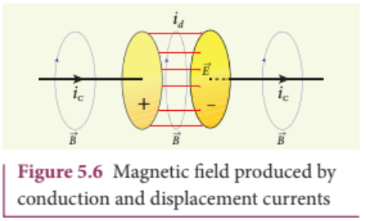

## Importance of Maxwell's correction:

Earth receives radiations from Sun and other stars. These radiations travel through empty space where there are no electric charges and hence no electric current. Ampere's law says that only electric current can produce a magnetic field. If Ampere's law alone is true, there will not be any radiation.

Maxwell's correction term $\left(\mu_{0}\epsilon_{0}\frac{d\Phi_{E}}{dt}\right)$ in Ampere's law ensures that time- varying electric field or displacement current can also produce a magnetic field. Though conduction current is zero in an empty space, displacement current does exist. So, the equation (5.6) becomes

$$\oint_{l}\overline{B}\cdot d\vec{l} = \mu_{0}\epsilon_{0}\frac{d\Phi_{E}}{dt}$$

In stars, due to thermal excitation of atoms, time- varying electric field is produced which in turn, produces time- varying magnetic field. According to Faraday's law, this time- varying magnetic field produces again time- varying electric field and so on. The coupled time- varying electric and magnetic fields travel through empty space with the speed of light and is called electromagnetic wave.

Even though Maxwell initially started with purely symmetry argument, his correction term explains one of the important aspects of the universe, namely the existence of electromagnetic waves.

## EXAMPLE 5.1

Consider a parallel plate capacitor which is connected to an $230~\mathrm{V}$ RMS value and $50\mathrm{Hz}$ frequency. If the separation distance between the plates of the capacitor and area of the plates are $1\mathrm{mm}$ and $20~\mathrm{cm}^2$ respectively. Calculate the displacement current at $t = 1$ s.

## Solution

Potential difference between the plates of the capacitor,

$$V = V_{\mathrm{max}}\sin 2\pi ft$$ $$\quad = 230\sqrt{2}\sin (2\pi \times 50t)$$ $$\therefore V = 325\sin 100\pi t$$

$$d = 1\mathrm{mm} = 1\times 10^{-3}\mathrm{m}$$ $$A = 20\mathrm{cm}^2 = 20\times 10^{-4}\mathrm{m}^2$$

$$\mathrm{Displacement~current},i_{d} = \epsilon_{0}\frac{d\Phi_{E}}{dt} = \epsilon_{0}\frac{d(\mathrm{EA})}{dt}$$

$$\begin{array}{rl} & {\therefore i_{d} = \frac{\epsilon_{0}A}{d}\left|\frac{dV}{dt}\right|\quad \left|\because E = \frac{V}{d}\right|}\\ & {\qquad = \frac{\epsilon_{0}A}{d}(325)(100\pi)\cos 100\pi t}\\ & {\qquad = \left(\frac{8.85\times 10^{-12}\times 20\times 10^{-4}\times 325}{\times 100\times 3.14\times \cos(100\pi\times 1)}\right)\Bigg /(1\times 10^{-3})}\\ & {\qquad = 1.81\times 10^{-6}\mathrm{A} = 1.81\mu \mathrm{A}\quad \left[\because \cos (100\pi \times 1) = 1\right]} \end{array} \quad (1)$$

#### 5.1.2 Maxwell's equations in integral form

Electrodynamics can be summarized in four basic equations, known as Maxwell's equations. These equations are analogous to Newton's equations in mechanics. Maxwell's equations completely explain the behaviour of charges, currents and properties of electric and magnetic fields. These equations can be written in integral form (or integration form) or derivative form (or differential form). The  differential form of Maxwell's equation is beyond higher secondary level. So we focus only the integral form of Maxwell's equations.

## First equation

It is nothing but the Gauss's law of electricity. It relates the net electric flux to net electric charge enclosed in a surface. Mathematically, it is expressed as

$$\oint \vec{E}\cdot d\vec{A} = \frac{Q_{\mathrm{enclosed}}}{\epsilon_{\mathrm{s}}} 
\quad $$ $$\mathrm{~(Gauss's~law~for~electricity)~}(5.7)$$

where $\vec{E}$ is the electric field and $\mathrm{Q}$ enclosed is the net charge enclosed by the surface S. This equation is true for both discrete and continuous distribution of charges.

It also indicates that the electric field lines start from positive charge and terminate at negative charge. This implies that the electric field lines do not form a continuous closed path. In other words, it means that an isolated positive charge or negative charge can exist.

## Second equation

This law is similar to Gauss's law for electricity. So this law can also be called as Gauss's law for magnetism. The surface integral of magnetic field over a closed surface is zero. Mathematically,

$$\oint \vec{B}\cdot d\vec{A} = 0$$ $$\mathrm{~s~}$$ $$\mathrm{~(Gauss's~law~for~magnetism)~}(5.8)$$

where $\vec{B}$ is the magnetic field.

This equation implies that the magnetic lines of force form a continuous closed path. In other words, it means that no isolated magnetic monopole exists.

## Third equation

It is Faraday's law of electromagnetic induction. This law relates electric field with the changing magnetic flux which is mathematically written as

$$\oint \vec{E}\cdot d\vec{A} = -\frac{d}{dt}\Phi_B \quad (\mathrm{Faraday's~law}) \quad (5.9)$$

where $\vec{E}$ is the electric field. This equation implies that the line integral of the electric field around any closed path is equal to the rate of change of magnetic flux through the closed path bounded by the surface.

Our modern technological revolution is due to Faraday's laws of electromagnetic induction.

## Fourth equation

It is modified Ampere's circuital law. This is also known as Ampere - Maxwell law. This law relates the magnetic field around any closed path to the conduction current and displacement current through that path.

$$\oint \vec{B} \cdot d\vec{l} = \mu_0 i_c + \mu_0 \epsilon_0 \frac{d}{dt} \oint \vec{E} \cdot d\vec{A}$$  
$$\mathrm{(Ampere\text{-}Maxwell~law)} \hspace{1cm} (5.10)$$

where $\vec{B}$ is the magnetic field. This equation shows that both conduction current and displacement current produce magnetic field.

These four equations are known as Maxwell's equations in electrodynamics. This equation ensures the existence of electromagnetic waves. The entire communication system in the world depends on electromagnetic waves. In fact our understanding of stars, galaxy, planets etc come by analysing the electromagnetic waves emitted by these astronomical objects.

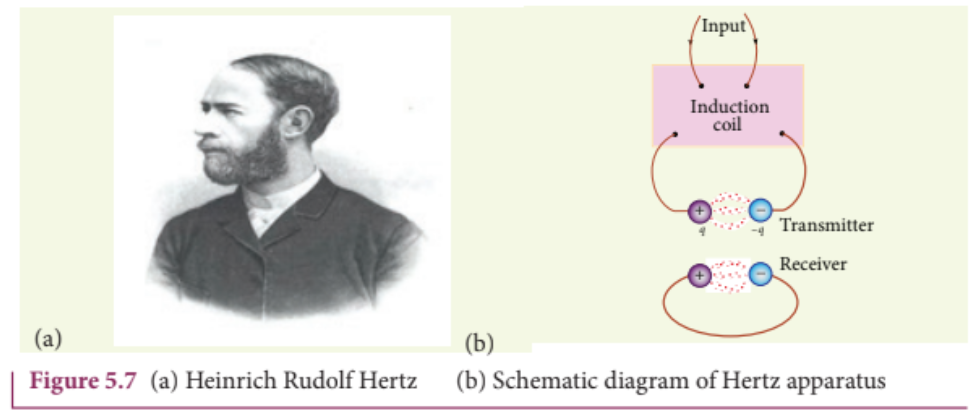

### 5.2 ELECTROMAGNETIC WAVES

Electromagnetic waves are nonmechanical waves which move with speed equals to the speed of light (in vacuum). It is a transverse wave. In the following subsections, we discuss the production of electromagnetic waves and its properties, sources of electromagnetic waves and also classification of electromagnetic spectrum.

### 5.2.1 Production and properties of electromagnetic waves

Production of electromagnetic waves- Hertz experiment

Maxwell's prediction was experimentally confirmed by Heinrich Rudolf Hertz in 1888. The experimental set up used is shown in Figure 5.7 (b).

It consists of two metal electrodes which are made of small spherical metals. These are connected to larger spheres and the ends of them are connected to induction coil with very large number of turns. This is to produce very high electromotive force (emf).

Since the coil is maintained at very high potential, air between the electrodes gets ionized and spark (spark means discharge of electricity) is produced. This discharge of electricity affects another electrode (ring type — not completely closed) which is kept at far distance. This implies that the energy is transmitted from electrode to the receiver (ring electrode) in the form of waves, known as electromagnetic waves.

If the receiver is rotated by $90^{\circ}$ , then no spark is observed by the receiver. This confirms that electromagnetic waves are transverse waves as predicted by Maxwell. Hertz detected radio waves and also computed the speed of radio waves which is equal to the speed of light $(3\times 10^{8}\mathrm{m}\mathrm{s}^{- 1})$ .

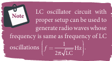
## Properties of electromagnetic waves

1. Electromagnetic waves are produced by any accelerated charge.
2. Electromagnetic waves do not require any medium for propagation. So electromagnetic wave is a non-mechanical wave.
3. Electromagnetic waves are transverse in nature. The oscillating electric field vector, oscillating magnetic field vector and propagation vector (gives direction of propagation) are mutually perpendicular to each other.For example, if the electric and magnetic fields are as shown in Figure 5.8, then the direction of propagation will be along x-direction.

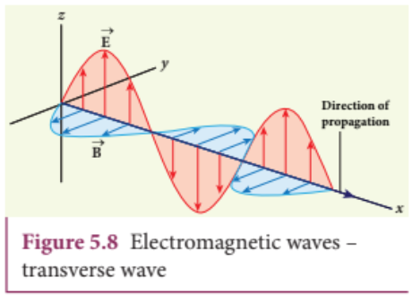

4. Electromagnetic waves travel with speed which is equal to the speed of light in vacuum or free space,$$c = \frac{1}{\sqrt{\epsilon_0 \mu_0}} = 3\times 10^{8}\mathrm{m}\mathrm{s}^{- 1}$$, where $\epsilon_0$ is the permittivity of free space or vacuum and $\mu_0$ is the permeability of free space or vacuum (refer Unit 1 for permittivity and Unit 3 for permeability).
5. In a medium with permittivity ε and permeability μ, the speed of electromagnetic wave v is less than that in free space or vacuum (v < c).
In a medium of refractive index,
$$
n = \frac{c}{\nu} = \frac{\frac{1}{\sqrt{\epsilon_0 \mu_0}}}{\frac{1}{\sqrt{\epsilon \mu}}} \quad \therefore n = \sqrt{\epsilon_r \mu_r}
$$
where \( \epsilon_r \) is the relative permittivity of the medium (also known as dielectric constant) and \( \mu_r \) is the relative permeability of the medium.
6. Electromagnetic waves are not deflected by electric field or magnetic field.
7. Electromagnetic waves can exhibit interference, diffraction and polarization.
8. Like other waves, electromagnetic waves also carry energy, linear momentum and angular momentum.
9. If the electromagnetic wave incident on a material surface is completely absorbed, then the energy delivered is \( U \) and momentum imparted on the surface is \( p = \frac{U}{c} \).
10. If the incident electromagnetic wave of energy \( U \) is totally reflected from the surface, then the momentum delivered to the surface is
$$
\Delta p = \frac{U}{c} - \left( -\frac{U}{c} \right) = 2 \frac{U}{c}.
$$

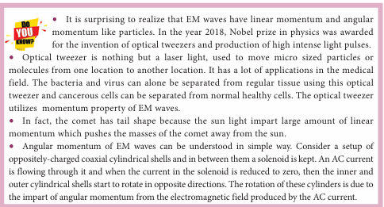
## EXAMPLE 5.2

The relative magnetic permeability of the medium is 2.5 and the relative electrical permittivity of the medium is 2.25. Compute the refractive index of the medium.

## Solution

Dielectric constant (relative permittivity of the medium), $\epsilon_{\mathrm{r}} = 2.25$

Magnetic permeability, $\mu_{\mathrm{r}} = 2.5$

Refractive index of the medium,

$$n = \sqrt{\epsilon_{\mathrm{r}}\mu_{\mathrm{r}}} = \sqrt{2.25\times 2.5} = 2.37$$

#### 5.2.2 Sources of electromagnetic waves

Any stationary charge produces only electric field (refer Unit 1). When the charge moves with uniform velocity, it produces steady current which gives rise to magnetic field (not time dependent, only space dependent) around the conductor in which charge flows. If the charged particle accelerates, it produces magnetic field in addition to electric field. Both electric and magnetic fields are time varying fields. Since the electromagnetic waves are transverse waves, the direction of propagation of electromagnetic waves is perpendicular to the planes containing electric and magnetic field vectors.

Any oscillatory motion is also an accelerated motion. So, when the charge oscillates (oscillating molecular dipole) about their mean position (Figure 5.9), it produces electromagnetic waves.

Suppose the electromagnetic field in free space propagates along $z$ - direction and if the electric field vector points along $x$ - axis, then the magnetic field vector will be mutually perpendicular to both electric field and the direction of wave propagation. Thus

$$E_{x} = E_{0}\sin (kz - \omega t)$$ $$B_{y} = B_{0}\sin (kz - \omega t)$$

where $E_{\mathrm{o}}$ and $B_{\mathrm{o}}$ are amplitudes of oscillating electric and magnetic field, $k$ is a wave number, $\omega$ is the angular frequency of the

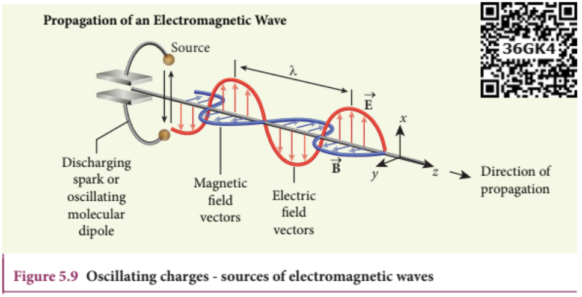

 wave and $\hat{k}$ (unit vector, here it is called propagation vector) denotes the direction of propagation of electromagnetic wave.

Note that both electric field and magnetic field oscillate with a frequency (frequency of electromagnetic wave) which is equal to the frequency of the source (here, oscillating charge is the source for the production of electromagnetic waves). In free space or in vacuum, the ratio between $E_{o}$ and $B_{o}$ is equal to the speed of electromagnetic wave and is equal to speed of light $c$ .

$$c = \frac{E_0}{B_0}$$

In any medium, the ratio of $E_{o}$ and $B_{o}$ is equal to the speed of electromagnetic wave in that medium. Thus

$$v = \frac{E_0}{B_0} < c$$

Further, the energy of electromagnetic waves comes from the energy of the oscillating charge.

## EXAMPLE 5.3

Compute the speed of the electromagnetic wave in a medium if the amplitude of electric and magnetic fields are $3\times 10^{4}\mathrm{N C}^{- 1}$ and $2\times 10^{- 4}\mathrm{T}$ respectively.

## Solution

The amplitude of the electric field,

$$E_{o} = 3\times 10^{4}\mathrm{N C}^{-1}$$

The amplitude of the magnetic field, $B_{o} = 2\times 10^{- 4}\mathrm{T}$ . Therefore, speed of the electromagnetic wave in that medium is

$$v = \frac{3\times 10^{4}}{2\times 10^{-4}} = 1.5\times 10^{8}m s^{-1}$$

#### 5.2.3 Electromagnetic spectrum

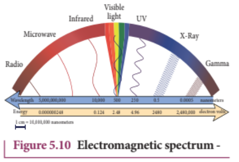

Electromagnetic spectrum is an orderly distribution of electromagnetic waves in terms of wavelength or frequency (Figure 5.10).

##### Radio waves

They are produced by accelerated motion of charges in conducting wires. The frequency range is from a few $\mathrm{Hz}$ to $10^{9}\mathrm{Hz}$ . They show reflection and diffraction.

They are used in radio and television communication systems and also in calibrations to transmit voice communication in the ultra high frequency band.

##### Microwaves

It is produced by special vacuum tubes such as klystron, magnetron and gunndiode. The frequency range of microwaves is $10^{9}\mathrm{Hz}$ to $10^{11}\mathrm{Hz}$ . These waves undergo reflection and can be polarised.

It is used in radar system for aircraft navigation, speed of the vehicle, microwave oven for cooking and very long distance wireless communication through satellites.

##### Infrared radiation

It is produced by hot bodies (also known as heat waves) and also by when the molecules undergoing rotational and vibrational transitions. The frequency range is $10^{11}\mathrm{Hz}$ to $4\times 10^{14}\mathrm{Hz}$ .

It provides electrical energy to satellites by means of solar cells. It is used to produce dehydrated fruits, in green houses to keep the plants warm, heat therapy for muscular pain or sprain, TV remote as a signal carrier, to look through haze fog or mist and used in night vision or infrared photography.

# ACTIVITY

## Measuring the speed of light using the microwave oven

Nowadays the microwave oven is very commonly used to heat the food items. Micro waves of wavelengths $1 \mathrm{mm}$ to $30 \mathrm{cm}$ are produced in these ovens. Such waves form the standing waves between the interior walls of the oven. It is interesting to note that the speed of light can be measured using micro wave oven.

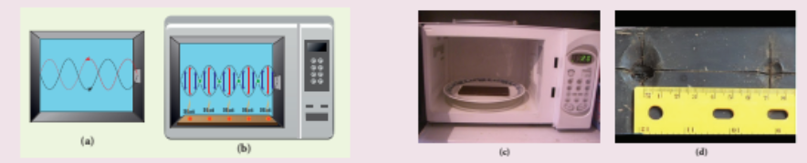

We studied about the standing waves in XI physics, Volume 2, Unit 11. The standing waves have nodes and antinodes at fixed points. At node point, the amplitude of the wave is zero and at antinodes point, the amplitude is maximum. In other words, the maximal energy of microwaves is located at antinode points. When we keep some food items like chappathi or chocolate (after removing the rotating platform) inside the oven, we can notice that at antinode locations, chappathi will be burnt more than other locations. It is shown in the Figure (c) and (d). The distance between two successive burnt spots will give the half wavelength of microwave. The frequency of microwave is printed in the panel of oven. By knowing wavelength and frequency of microwaves, using the formula $v\lambda = c$ , we can calculate the speed of light c.

##### Visible light

It is produced by incandescent bodies and also it is radiated by excited atoms in gases. The frequency range is from $4 \times 10^{14}\mathrm{Hz}$ to $8 \times 10^{14}\mathrm{Hz}$ .

It obeys the laws of reflection and refraction. It undergoes interference, diffraction and can be polarised. It exhibits photo-electric effect also. It can be used to study the structure of molecules, arrangement of electrons in external shells of atoms. It causes sensation of vision.

##### Ultraviolet radiation

It is produced by Sun, arc and ionized gases. Its frequency range is from $8 \times 10^{14}\mathrm{Hz}$ to $10^{17}\mathrm{Hz}$ .

It has less penetrating power. It can be absorbed by atmospheric ozone and is harmful to human body. It is used to destroy bacteria in sterilizing the surgical instruments, burglar alarm, to detect the invisible writing, finger prints and also in the study of atomic structure.

##### X-rays

It is produced when there is sudden stopping of high speed electrons at high atomic number target, and also by electronic transitions among the innermost orbits of atoms. The frequency range of X-rays is from $10^{17}\mathrm{Hz}$ to $10^{19}\mathrm{Hz}$ .

X-rays have more penetrating power than ultraviolet radiation. X-rays are used extensively in studying structures of inner atomic electron shells and crystal structures. It is used in detecting fractures, diseased organs, formation of bones and stones,

 observing the progress of healing bones. Further, in a finished metal product, it is used to detect faults, cracks, flaws and holes.

##### Gamma rays

It is produced by transitions of radioactive nuclei and decay of certain elementary particles. They produce chemical reactions on photographic plates, fluorescence, ionisation, diffraction. The frequency range is $10^{18}$ Hz and above.

Gamma rays have higher penetrating power than X- rays and ultraviolet radiations; it has no charge but harmful to human body. Gamma rays provide information about the structure of atomic nuclei. It is used in radio therapy for the treatment of cancer and tumour, in food industry to kill pathogenic microorganism.

## EXAMPLE 5.4

A magnetron in a microwave oven emits electromagnetic waves (em waves) with frequency $f = 2450$ MHz. What magnetic field strength is required for electrons to move in circular paths with this frequency?.

## Solution

Frequency of the electromagnetic waves given, $f = 2450$ MHz

The corresponding angular frequency is

$$\omega = 2\pi f = 2 \times 3.14 \times 2450 \times 10^{6} = 1.54 \times 10^{10} \mathrm{rad/s}$$

The required magnetic field, $B = \frac{m_{e}\omega}{|q|}$

Mass of the electron, $m_{e} = 9.11\times 10^{- 31}\mathrm{kg}$ Charge of the electron, $|q| = 1.60 \times 10^{-19} \mathrm{C}$

$$B = \frac{\left(9.11\times 10^{-31}\right)\left(1.54\times 10^{10}\right)}{\left(1.60\times 10^{-19}\right)} = 8.7683\times 10^{-2}\mathrm{T}$$ $$B = 0.08768\mathrm{T}$$

This magnetic field can be easily produced with a permanent magnet. So, electromagnetic waves of frequency 2450 MHz can be used for heating and cooking food because they are strongly absorbed by water molecules.

### 5.3

# TYPES OF SPECTRUM-EMISSION AND ABSORPTION SPECTRUM- FRAUNHOFER LINES

When an object burns, it emits radiations. That is, it emits electromagnetic radiation which depends on temperature. If the object becomes hot, it glows in red colour. If the temperature of the object is further increased, then it glows in reddishorange colour and becomes white when it is hottest. The spectrum in Figure 5.11 usually

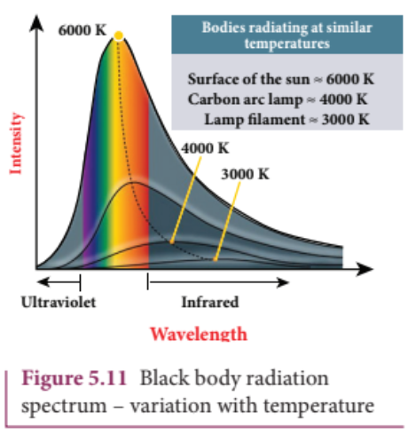
 is called black body spectrum (Refer XI Physics Unit 8). It is a continuous frequency (or wavelength) curve depending on the body's temperature.

Suppose we allow a beam of white light to pass through the prism (as shown in Figure 5.12). It is split into its seven constituent colours which can be viewed on the screen as continuous spectrum. This phenomenon is known as dispersion of light and the definite pattern of colours obtained on the screen after dispersion is called as spectrum. The spectra can be broadly classified into two categories:

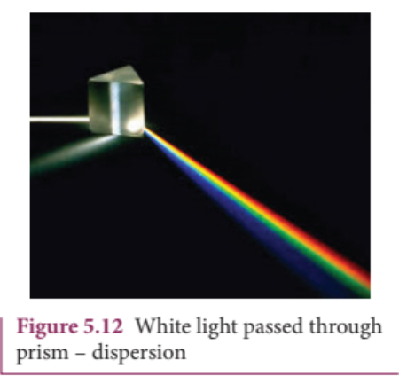

### (a)Emission spectra

When the spectrum of self luminous source is taken, we get emission spectrum. Each source has its own characteristic

emission spectrum. The emission spectrum can be divided into three types:

### (i) Continuous emission spectrum (or continuous spectrum)

If the light from incandescent lamp (filament bulb) is allowed to pass through prism (simplest spectroscope), it splits up into seven colours. Thus, it consists of wavelengths containing all the visible colours ranging from violet to red (Figure 5.13). Examples: spectrum obtained from carbon arc and incandescent solids.

### (ii) Line emission spectrum (or line spectrum):

Suppose light from hot gas is allowed to pass through prism, line spectrum is observed (Figure 5.14). Line spectra are also known as discontinuous spectra. The line spectra consists of sharp lines of definite wavelengths or frequencies. Such spectra arise due to excited atoms of elements. These lines are the characteristics of the element and are different for different elements. Examples: spectra of atomic hydrogen, helium, etc.

### (iii) Band emission spectrum (or band spectrum)

Band spectrum consists of several number of very closely spaced spectral lines which overlap together forming specific

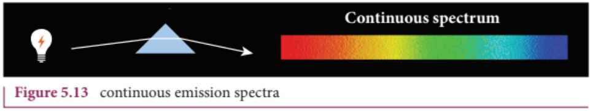

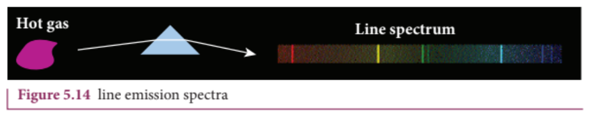

 bands which are separated by dark spaces. This spectrum has a sharp edge at one end and fades out at the other end. Such spectra arise when the molecules are excited. Band spectrum is the characteristic of the molecule and hence the structure of the molecules can be studied using their band spectra. Example: spectra of ammonia gas in the discharge tube etc.

### (b) Absorption spectra

When light is allowed to pass through a medium or an absorbing substance then the spectrum obtained is known as absorption spectrum. It is the characteristic of absorbing substance. Absorption spectrum is classified into three types:

### (i) Continuous absorption spectrum

When we pass white light through a blue glass plate, it absorbs all the colours except blue and gives continuous absorption spectrum.

### (ii) Line absorption spectrum

When light from the incandescent lamp is passed through cold gas (medium), the spectrum obtained through the dispersion due to prism is line absorption spectrum (Figure 5.15). Similarly, if the light from the carbon arc is made to pass through sodium vapour, a continuous spectrum of carbon arc with two dark lines in the yellow region are obtained.

### (iii) Band absorption spectrum

When white light is passed through the iodine vapour, dark bands on continuous bright background is obtained. This type of band is also obtained when white light is passed through diluted solution of blood or chlorophyll or through certain solutions of organic and inorganic compounds.

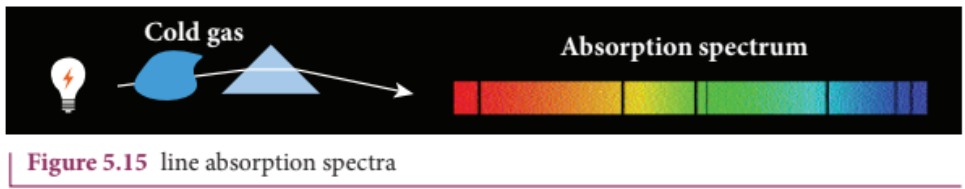

## Fraunhofer lines

When the spectrum obtained from the Sun is examined, it consists of large number of dark lines (line absorption spectrum). These dark lines in the solar spectrum are

known as Fraunhofer lines (Figure 5.16). The absorption spectra for various materials are compared with the Fraunhofer lines in the solar spectrum, which helps in identifying elements present in the Sun's atmosphere.

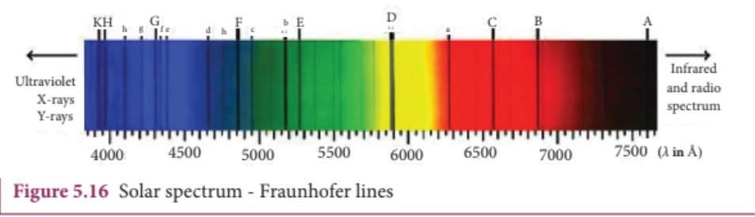

---

# SUMMARY

- Displacement current can be defined as 'the current which comes into play in the region in which the electric field and the electric flux are changing with time'.

- Maxwell modified Ampere's law as

$$\oint \vec{B}\cdot \vec{dl} = \mu_{o}i = \mu_{o}(i_{c} + i_{d}).$$

- An electromagnetic wave is radiated by an accelerated charge which propagates through space as coupled electric and magnetic fields, oscillating perpendicular to each other and to the direction of propagation of the wave.

- Electromagnetic waves are non- mechanical and do not require any medium for propagation.

- The instantaneous magnitude of the electric and magnetic field vectors in electromagnetic wave are related by $c = E / B$ .

- Electromagnetic waves can show interference, diffraction and also can be polarized

- Electromagnetic waves carry not only energy and momentum but also angular momentum.

- Types of spectra: emission and absorption spectra.

- When the spectrum of self luminous source is taken, we get emission spectrum. Each source has its own characteristic emission spectrum. The emission spectrum can be divided into three types: continuous, line and band.

- When the spectrum obtained from the Sun is examined, it consists of a large number of dark lines (line absorption spectrum). These dark lines in the solar spectrum are known as Fraunhofer lines.

---

