# 10

# ELECTRONICS AND COMMUNICATION

Electronics is clearly the winner of the day - John Ford.

## LEARNING OBJECTIVES

# In this unit, the students are exposed to

Energy band diagram in semiconductors Types of semiconductors Formation of \(p\) - \(n\) junction diode and its V- I characteristics Rectification process Special purpose diodes Transistors and their immediate applications Digital and analog signals Logic gates, Boolean algebra and De Morgan's theorem Modulation and its types Basic elements of communication system Propagation of electromagnetic waves through space Some important communication systems

## 10.1 INTRODUCTION

Electronics has become a part of our daily life. All gadgets like mobile phones, computers, televisions, music systems etc work on the electronic principles. Electronic circuits are used to perform various operations in devices like air conditioners, microwave oven, dish washers and washing machines. Besides this, its applications are widespread in all fields like communication systems, medical diagnosis and treatments and even handling money through ATMs.

## Evolution of Electronics:

The history of electronics began with the invention of vacuum diode by J.A. Fleming in 1897. This was followed by a vacuum triode implemented by Lee De Forest to control electrical signals. This led to the introduction of tetrode and pentode tubes.

Subsequently, the transistor era began with the invention of bipolar junction transistor by Bardeen, Brattain and Shockley in 1948 for which they received Nobel prize in 1956. The emergence of germanium and silicon semiconductor materials made this transistor gain popularity, in turn its application in different electronic circuits.

1

The following years witnessed the invention of the integrated circuits (ICs) that helped to integrate the entire electronic circuit on a single chip which is small in size and cost- effective. Since 1958 ICs capable of holding several thousand electronic components on a single chip such as smallscale, medium- scale, large- scale, and verylarge scale integration started coming into existence. Digital integrated circuits became another robust IC development that enhanced the architecture of computers. All these radical changes led to the introduction of microprocessor in 1969 by Intel.

The electronics revolution, in due course of time, accelerated the computer revolution. Now the world is on its way towards small particles of nano- size, far too small to see. This helps in the miniaturization to an unimaginable size. A room- size computer during its invention has now emerged as a laptop, palmtop, iPad, etc. In the recent past, IBM has released the smallest computer whose size is comparable to the tip of the rice grain, measuring just \(0.33\mathrm{mm}\) on each side.

Electronics is the branch of physics which incorporates technology to design electrical circuits using transistors and microchips. It depicts the behaviour and movement of electrons and holes in a semiconductor, electrons and ions in vacuum or gas. Electronics deals with electrical circuits that involve active components such as transistors, diodes, integrated circuits and sensors, associated with the passive components like resistors, inductors, capacitors and transformers.

This chapter deals with semiconductor devices like \(p - n\) junction diodes, bipolar junction transistors and logic circuits.

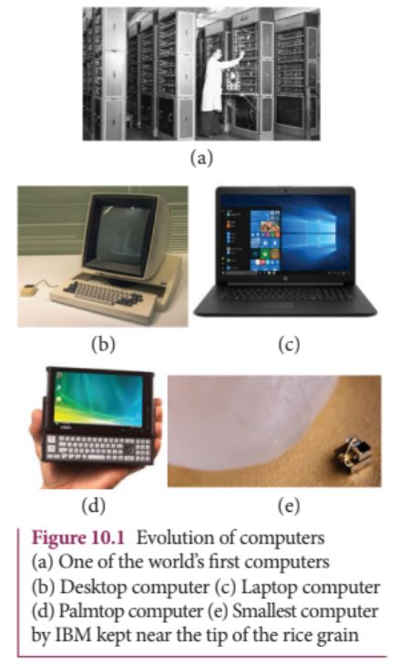

The world's first computer ENIAC' was invented by J.Presper Eckert and John Mauchly at the University of Pennsylvania. The construction work started in 1943 and got over in 1946. It occupied an area of around 1800 square feet. It had 18,000 vacuum tubes and it weighed around 50 tons.

10.1.1 Energy band diagram of solids

In an isolated atom, the electronic energy levels are widely separated and are far apart and the energy of the electron is decided by the orbit in which it revolves around the nucleus. However, in the case of a solid, the atoms are closely spaced and hence the electrons in the outermost energy levels of nearby atoms influence each other. This changes the nature of the electron motion in a solid from that in an isolated atom to a large extent.

The valence electrons in an atom are responsible for the bonding nature. Let us consider an atom with one electron in the outermost orbit. It means that the number of valence electrons is one. When two such atoms are brought close to each other, the valence orbitals are split up into two. Similarly the unoccupied orbitals of each atom will also split up into two. The electrons have the choice of choosing any one of the orbitals as the energy of both the orbitals is the same. When the third atom of the same element is brought to this system, the valence orbitals of all the three atoms are split into three. The unoccupied orbitals also will split into three.

In reality, a solid is made up of millions of atoms. When millions of atoms are brought close to each other, the valence orbitals and the unoccupied orbitals are split according to the number of atoms. In this case, the

energy levels will be closely spaced and will be difficult to differentiate the orbitals of one atom from the other and they look like a band as shown in Figure 10.2. This band of very large number of closely spaced energy levels in a very small energy range is known as energy band.

The energy band formed due to the valence orbitals is called valence band (VB) and that formed due to the unoccupied orbitals to which electrons can jump when energised is called the conduction band (CB). The energy gap between the valence band and the conduction band is called forbidden energy gap \((E_{g})\) .Electrons cannot exist in the forbidden energy gap.

A simple pictorial representation of the valence band and conduction band is shown in Figure 10.2(a). \(E_{V}\) represents the maximum energy of the valence band and \(E_{c}\) represents minimum energy of the conduction band. The forbidden energy gap, \(E_{g} = E_{c} - E_{V}\) . We know that the Coulomb force of attraction between the orbiting electron and the nucleus is inversely proportional to the distance between them. Therefore, the electrons in the orbitals closer to the nucleus are strongly bound to it. Hence, the electrons closer to nucleus require a lot of energy to be excited. The electrons in the valence band are loosely bound to the nucleus and can be easily excited to become free electrons.

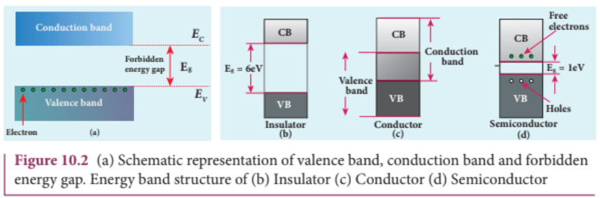

10.1.2 Classification of materials

The classification of solids into insulators, metals, and semiconductors can be explained with the help of the energy band diagram.

## i Insulators

The energy band structure of insulators is shown in Figure 10.2(b). The valence band and the conduction band are separated by a large energy gap. The forbidden energy gap is approximately \(6\mathrm{eV}\) in insulators. The gap is very large that electrons from valence band cannot move into conduction band even on the application of strong external electric field or the increase in temperature. Therefore, the electrical conduction is not possible as the free electrons are not available for conduction and hence these materials are called insulators. Its resistivity is in the range of \(10^{11} - 10^{19}\Omega \mathrm{m}\) .

## ii) Conductors

In conductors, the valence band and conduction band overlap as shown in Figure 10.2(c). Hence, electrons can move freely into the conduction band which results in a large number of free electrons available in the conduction band. Therefore, conduction becomes possible even at low temperatures. The application of electric field provides sufficient energy to the electrons to drift in a particular direction to constitute a current. For conductors, the resistivity value lies between \(10^{- 2}\Omega \mathrm{m}\) and \(10^{- 8}\Omega \mathrm{m}\) .

## iii) Semiconductors

In semiconductors, there exists a narrow forbidden energy gap \(\left(E_{g}< 3eV\right)\) between the valence band and the conduction band

(Figure 10.2(d)). At a finite temperature, thermal agitations in the solid can break the covalent bond between the atoms (covalent bond is formed due to the sharing of electrons to attain stable electronic configuration). This releases some electrons from valence band to conduction band. Since free electrons are small in number, the conductivity of the semiconductors is not as high as that of the conductors. The resistivity value of semiconductors is from \(10^{- 5}\Omega \mathrm{m}\) to \(10^{6}\Omega \mathrm{m}\) .

image[[518, 311, 870, 415]]

When the temperature is increased further, more number of electrons are promoted to the conduction band and they increase the conduction. Thus, we can say that the electrical conduction increases with the increase in temperature. In other words, resistance decreases with increase in temperature. Hence, semiconductors are said to have negative temperature coefficient of resistance. The most important commonly used elemental semiconducting materials are silicon (Si) and germanium (Ge). The values of forbidden energy gap for Si and Ge at room temperature are \(1.1\mathrm{eV}\) and \(0.7\mathrm{eV}\) respectively.

# 10.2 TYPES OF SEMICONDUCTORS

# 10.2.1 Intrinsic semiconductors

A semiconductor in its pure form without any impurity is called an intrinsic semiconductor. Here, impurity means

图10.4 (a) The presence of free electron, hole and broken covalent bond in the intrinsic silicon crystal (b) Presence of electrons in the conduction band and holes in the valence band at room temperature

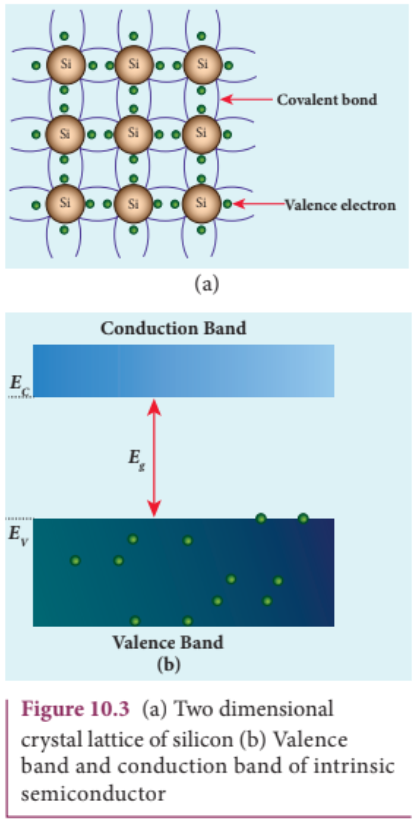

presence of any other foreign atom in the crystal lattice. The silicon lattice is shown in Figure 10.3(a). Each silicon atom has four electrons in the outermost orbit and is covalently bonded with four neighbouring atoms to form the lattice. The band diagram for this case is shown in Figure 10.3(b).

A small increase in temperature is sufficient enough to break some of the covalent bonds and release the electrons free from the lattice (10.4(a)). As a result, some states in the valence band become empty and the same number of states in the conduction band will be occupied by

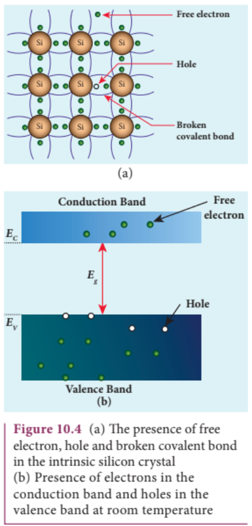

electrons as shown in Figure 10.4(b). The vacancies produced in the valence band are called holes. As the holes are deficiency of electrons, they are treated to possess positive charges. Hence, electrons and holes are the two charge carriers in semiconductors.

In intrinsic semiconductors, the number of electrons in the conduction band is equal to the number of holes in the valence band. The electrical conduction is due to the electrons in the conduction band and holes in the valence band. The corresponding currents are represented as \(I_{e}\) and \(I_{h}\) respectively.

1) n- type semiconductor 2) p- type semiconductor

The total current \(I\) is always the sum of the electron current and the hole current. That is, \(I = I_{e} + I_{h}\) .

An intrinsic semiconductor behaves like an insulator at \(0\mathrm{K}\) . The increase in temperature increases the number of charge carriers (electrons and holes). The schematic diagram of the intrinsic semiconductor in band diagram is shown in Figure 10.4(b). The intrinsic carrier concentration is the number of electrons in the conduction band or the number of holes in the valence band in an intrinsic semiconductor.

## 10.2.2 Extrinsic semiconductors

The carrier concentration in an intrinsic semiconductor is not sufficient enough to develop efficient electronic devices. Another way of increasing the carrier concentration in an intrinsic semiconductor is by adding impurity atoms.

The process of adding impurities to the intrinsic semiconductor is called doping. It increases the concentration of charge carriers (electrons and holes) in the semiconductor and in turn, its electrical conductivity. The impurity atoms are called dopants and its order is approximately 100 ppm (parts per million).

On the basis of the type of impurity added, extrinsic semiconductors are classified into:

## i) n-type semiconductor

A n- type semiconductor is obtained by doping a pure silicon (or germanium) crystal with pentavalent impurity atoms (from V group of periodic table) such as phosphorus, arsenic and antimony as shown in Figure 10.5(a). The dopant has five valence electrons while the silicon atom has four valence electrons. During the process of doping, a few of the silicon atoms are replaced by pentavalent

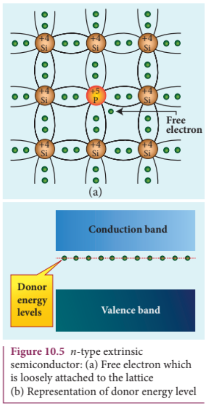

1

dopants. Four of the five valence electrons of the impurity atom form covalent bonds with four silicon atoms. The fifth valence electron of the impurity atom is loosely attached with the nucleus as it is not used in the formation of the covalent bond.

The energy level of the loosely attached fifth electron from the dopant is found just below the conduction band edge and is called the donor energy level as shown in Figure 10.5(b). At room temperature, these electrons can easily move to the conduction band with the absorption of thermal energy. It is shown in the Figure 10.6. Besides, an external electric field also can set free the loosely bound electrons and lead to conduction.

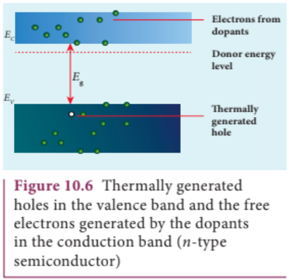

It is important to note that the energy required for an electron to jump from the valence band to the conduction band in an intrinsic semiconductor is \(0.7\mathrm{eV}\) for Ge and \(1.1\mathrm{eV}\) for Si, while the energy required to set free a donor electron is only \(0.01\mathrm{eV}\) for Ge and \(0.05\mathrm{eV}\) for Si.

text[[128, 848, 478, 903], [518, 95, 868, 284]]
The V group pentavalent impurity atoms donate electrons to the conduction band and are called donor impurities. Therefore, each impurity atom provides one extra electron to the conduction band in addition to the thermally generated electrons. These thermally generated electrons leave holes in valence band. Hence, the majority carriers of current in an \(n\) - type semiconductor are electrons and the minority carriers are holes. Such a semiconductor doped with a pentavalent impurity is called an \(n\) - type semiconductor.

## ii) \(p\) -type semiconductor

In \(p\) - type semiconductor, trivalent impurity atoms (from III group of periodic table) such as boron, aluminium, gallium and indium are added to the silicon (or germanium) crystal. The dopant with three valence electrons can form three covalent bonds with three silicon atoms. Of the four covalent bonds, three bonds are complete and the remaining one bond is incomplete with one electron. This electron vacancy present in the fourth covalent bond is represented as a hole.

To make complete covalent bonding with all four neighbouring atoms, the dopant is in need of one more electron. These dopants can accept electrons from the neighbouring atoms. Therefore, this impurity is called an acceptor impurity. The energy level of the hole created by each impurity atom is just above the valence band and is called the acceptor energy level, as shown in Figure 10.7(b).

For each acceptor atom, there will be a hole in the valence band; this is in addition to the holes left by the thermally generated electrons. In such an extrinsic semiconductor, holes are the majority carriers and thermally generated electrons are minority carriers as shown in Figure 10.8. The extrinsic semiconductor thus formed is called a \(p\) - type semiconductor.

202 UNIT 10 ELECTRONICS AND COMMUNICATION

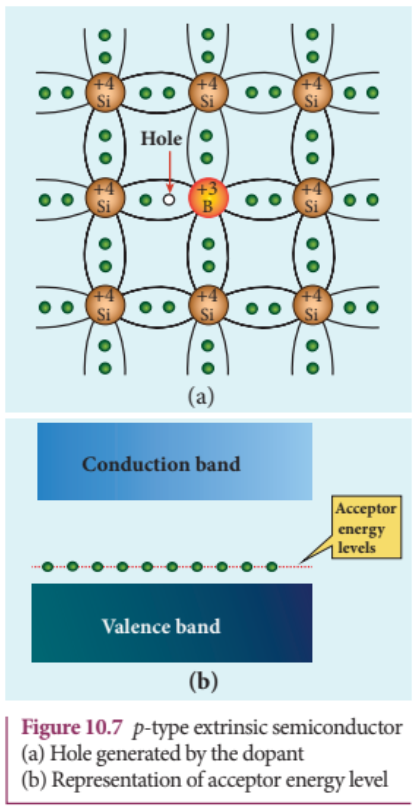

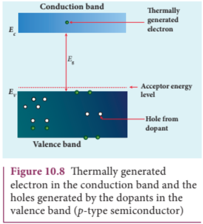

The \(n\) - type and \(p\) - type semiconductors are neutral because only neutral atoms are doped to the intrinsic semiconductors.

## 10.3

# DIODES

## 10.3.1 P-N Junction formation

## i) Formation of depletion layer

A single piece of semiconductor crystal is suitably doped such that its one side is \(p\) - type semiconductor and the other side is \(n\) - type semiconductor. The contact surface between the two sides is called \(p\) - \(n\) junction. Whenever \(p\) - \(n\) junction is formed, some of the free electrons diffuse from the \(n\) - side to the \(p\) - side while the holes from the \(p\) - side to the \(n\) - side. The diffusion of charge carriers happens due to the fact that the \(n\) - side has higher electron concentration and the \(p\) - side has higher hole concentration. The diffusion of the majority charge carriers across the junction gives rise to an electric current, called diffusion current.

When an electron leaves the \(n\) - side, a pentavalent atom in the \(n\) - side becomes a positive ion. The free electron migrating into \(p\) - side recombines with a hole present in a trivalent atom near the junction and the trivalent atom becomes a negative ion. Since such ions are bonded to the neighbouring atoms in the crystal lattice, they are unable to move. As the diffusion process continues, a layer of positive ions and a layer of negative ions are created on either side of the junction accordingly. The thin region near

1

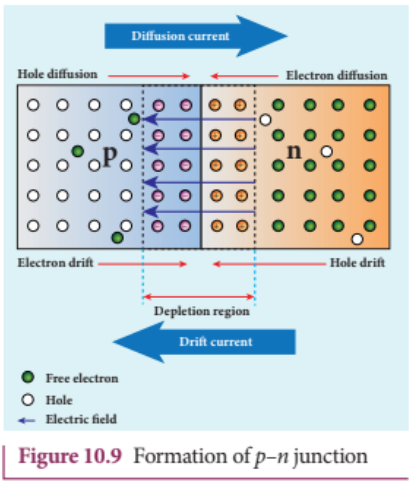

the junction which is free from charge carriers (free electrons and holes) is called depletion region (Figure 10.9).

An electric field is set up between the positively charged layer in the \(n\) - side and the negatively charged layer in the \(p\) - side in the depletion region as shown in the Figure 10.9. This electric field makes electrons in the \(p\) - side drift into the \(n\) - side and the holes in the \(n\) - side into the \(p\) - side. The electric current produced due to the motion of the minority charge carriers by the electric field is known as drift current. The diffusion current and drift current flow in opposite directions.

Though drift current is less than diffusion current initially, equilibrium is reached between them at a particular time. With each electron (or hole) diffusing across the junction, the strength of the electric field increases thereby increasing the drift current till the two currents become equal. Hence at equilibrium, there is no net electric current across the junction. Thus, a \(p - n\) junction is formed.

there is no net electric current across the junction. Thus, a \(p - n\) junction is formed.

## ii) Junction potential or barrier potential

The movement of charge carriers across the junction takes place only to a certain point beyond which the depletion layer acts like a barrier to further diffusion of free charges across the junction. This is due to the fact that the immobile ions on both sides establish an electric potential difference across the junction.

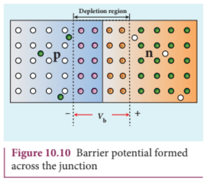

This difference in potential across the depletion layer is called the barrier potential \((V_{\mathrm{b}})\) as shown in Figure 10.10. At \(25^{\circ}\mathrm{C}\) , this barrier potential is approximately 0.7 V for silicon and 0.3 V for germanium.

## 10.3.2 P-N Junction diode

A \(p - n\) junction diode is formed when a \(p\) - type semiconductor is fused with an \(n\) - type semiconductor. It is a device with single \(p - n\) junction as shown in Figure 10.11(a) and its circuit symbol is shown in Figure 10.11(b).

Figure 10.11 \(p\) - \(n\) junction diode (a) Schematic representation (b) Circuit symbol

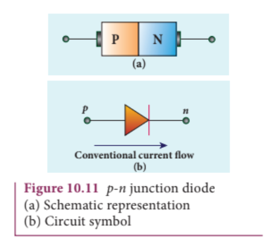

## Biasing a diode

Biasing a diodeBiasing means providing external energy to charge carriers to overcome the barrier potential and make them move in a particular direction. The charge carriers can either move towards the junction or away from the junction. The external voltage applied to the \(p\) - \(n\) junction is called bias voltage. Depending on the polarity of the external source to the \(p\) - \(n\) junction, we have two types of biasing:

i) Forward bias ii) Reverse bias

## i) Forward bias

If the positive terminal of the external voltage source is connected to the \(p\) - side and the negative terminal to the \(n\) - side, it is called forward bias as shown in Figure 10.12. The application of a forward bias potential pushes electrons in the \(n\) - side and the holes in the \(p\) - side towards the junction. This initiates the recombination with the ions near the junction which in turn reduces the width of the depletion region and hence the barrier potential.

text[[127, 846, 479, 902], [517, 93, 870, 323]]
The electron from the \(n\) - side is now accelerated towards the \(p\) - side as it experiences a reduced barrier potential at the junction. In addition, the accelerated electrons experience a strong attraction by the positive potential applied to the \(p\) - side. This results in the movement of electrons in the \(n\) - side towards the \(p\) - side and similarly, holes in the \(p\) - side towards the \(n\) - side. When the applied voltage is increased, the width of the depletion region and hence the barrier potential are further reduced. This results in a large number of electrons passing through the junction resulting in an exponential rise in current through the junction.

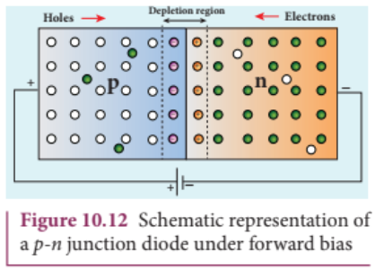

## ii) Reverse bias

If the positive terminal of the battery is connected to the \(n\) - side and the negative terminal to the \(p\) - side, the junction is said to be reverse biased as shown in Figure 10.13.

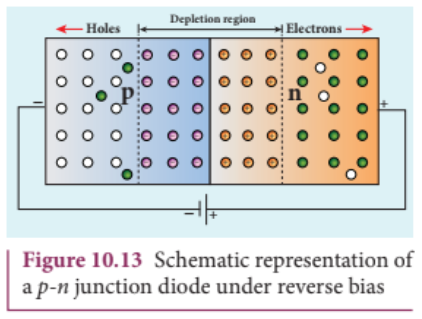

As the positive terminal is connected to the \(n\) - type material, the electrons in the \(n\) - side are attracted towards the positive

terminal and the holes in the \(p\) - side are attracted by the negative terminal. This increases the immobile ion concentration at the junction. The net effect is the widening of the depletion region leading to an increase in the barrier potential. Consequently, the majority charge carriers from both sides experience a great potential barrier to cross the junction. This reduces the diffusion current across the junction drastically.

Yet, a small current flows across the junction due to the minority charge carriers in both regions. The reverse bias for majority charge carriers serves as the forward bias for minority charge carriers. The current that flows under a reverse bias is called the reverse saturation current. It is represented as \(I_{s}\) .

The reverse saturation current is independent of the applied voltage and it depends only on the concentration of the thermally generated minority charge carriers. Even a small voltage is sufficient enough to drive the minority charge carriers across the junction.

image[[128, 586, 479, 661]]

## 10.3.3 Characteristics of a junction diode

## i) Forward characteristics

It is the study of the variation in current through the diode with respect to the applied voltage across the diode when it is forward biased.

The \(p\) - \(n\) junction diode is forward biased as shown in Figure 10.14(a). An external resistance \((R)\) is used to limit the flow of

current through the diode. The voltage across the diode is varied by varying the biasing voltage across the DC power supply. The forward bias voltage and the corresponding forward bias current are noted. A graph is plotted by taking the forward bias voltage \((V_{p})\) along the x- axis and the current \((I_{p})\) through the diode along the y- axis. This graph is called the forward V- I characteristics of the \(p\) - \(n\) junction diode and is shown in Figure 10.14(b). Four inferences can be brought out from the graph:

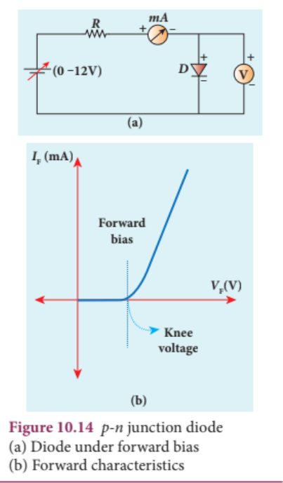

(i) At room temperature, a potential difference equal to the barrier potential is required before a reasonable forward current starts flowing across the diode. This voltage is known as threshold voltage or cut-in voltage or knee voltage \((V_{knee})\) . It

is approximately \(0.3\mathrm{V}\) for germanium and \(0.7\mathrm{V}\) for silicon. The current flow is negligible when the applied voltage is less than the threshold voltage. Beyond the threshold voltage, increase in current is significant even for a small increase in voltage.

(ii) The graph clearly infers that the current flow is not linear and is exponential. Hence it does not obey Ohm's law.

(iii) The forward resistance \((r_{\mathrm{p}})\) of the diode is the ratio of the small change in voltage \(\left(\Delta V_{\mathrm{F}}\right)\) to the small change in current \(\left(\Delta I_{\mathrm{F}}\right)\) . That is, \(r_{\mathrm{F}} = \frac{\Delta V_{\mathrm{F}}}{\Delta I_{\mathrm{F}}}\) .

(iv) Thus the diode behaves as a conductor when it is forward biased.

However, if the applied voltage is increased beyond a rated value, it will produce an extremely large current which may destroy the junction due to overheating. This is called as the breakdown of the diode and the voltage at which the diode breaks down is called the breakdown voltage. Thus, it is safe to operate a diode between the threshold voltage and the breakdown voltage.

## ii) Reverse characteristics

The circuit to study the reverse characteristics is shown in Figure 10.15(a). In the reverse bias, the \(p\) - side of the diode is connected to the negative terminal and \(n\) - side to the positive terminal of the dc power supply.

A graph drawn between the reverse bias voltage and the current across the junction is called the reverse characteristics of a \(p\) - \(n\) junction diode. It is shown in Figure 10.15(b). Under this bias, a very small

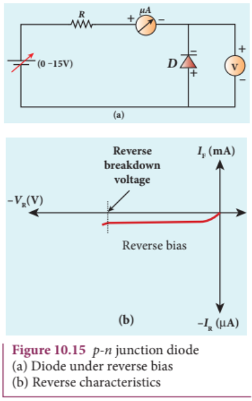

current in \(\mu \mathrm{A}\) flows across the junction. This is due to the flow of the minority charge carriers and is called the leakage current or reverse saturation current. This reverse current is independent of the voltage up to a certain voltage, known as breakdown voltage.

image[[521, 668, 863, 824]]

The forward and reverse characteristics are given in one graph as shown in Figure 10.16.

1

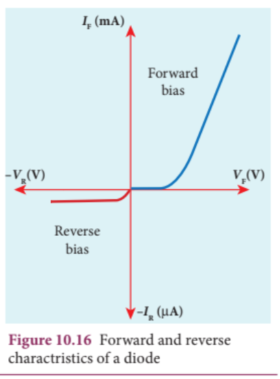

## EXAMPLE 10.1

An ideal diode and a \(5\Omega\) resistor are connected in series with a \(15\mathrm{V}\) power supply as shown in figure below. Calculate the current that flows through the diode.

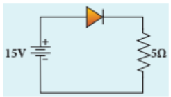

## Solution

The diode is forward biased and it is an ideal one. Hence, it acts like a closed switch with no barrier voltage. Therefore, current that flows through the diode can be calculated using Ohm's law.

$$V = IR$$ $$I = \frac{V}{R} = \frac{15}{5} = 3\mathrm{A}$$

## EXAMPLE 10.2

A silicon diode is connected with \(1\mathrm{k}\Omega\) resistor as shown. Find the value of current flowing through \(AB\) .

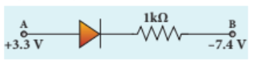

## Solution

The P.D. between A and B is given by

$$V = [V_{\mathrm{A}} - V_{\mathrm{B}}] - V_{\mathrm{b}}(\mathrm{Si})$$ $$\quad = [3.3 - (-7.4)] - 0.7$$ $$\quad = 10.7 - 0.7 = 10\mathrm{V}$$

The value of current flowing through \(AB\) can be obtained using Ohm's law.

$$I = \frac{V}{R} = \frac{10}{1\times 10^3} = 10^{-2}\mathrm{A} = 10\mathrm{mA}$$

## 10.3.4 Rectification

The process in which alternating voltage or alternating current is converted into direct voltage or direct current is known as rectification. The device used for this process is called as rectifier. In this section, we will discuss two types of rectifiers namely, half wave rectifier and full wave rectifier

## i) Half wave rectifier circuit

The half wave rectifier circuit consists of a transformer, a \(p - n\) junction diode and a resistor (Figure 10.17(a)). In a half wave rectifier circuit, either a positive half or the negative half of the AC input is passed through by the diode while the other half is blocked. Only one half of the input wave is rectified. Therefore, it is called half wave rectifier. Here, a \(p - n\) junction diode acts as a rectifier diode.

During the positive half cycle

When the positive half cycle of the AC input signal passes through the circuit,

terminal A becomes positive with respect to terminal B. The diode is forward biased and hence it conducts. The current flows through the load resistor \(R_{\mathrm{L}}\) and the AC voltage developed across \(R_{\mathrm{L}}\) constitutes the output voltage \(V_{0}\) and the waveform of the output voltage is shown in Figure 10.17(b).

## During the negative half cycle

When the negative half cycle of the AC input signal passes through the circuit, terminal A is negative with respect to terminal B. Now the diode is reverse biased and does not conduct. Hence no current passes through \(R_{\mathrm{L}}\) . The reverse saturation current in a diode is negligible. Since there is no voltage drop across \(R_{\mathrm{L}}\) , the negative half cycle of AC supply is suppressed at the output.

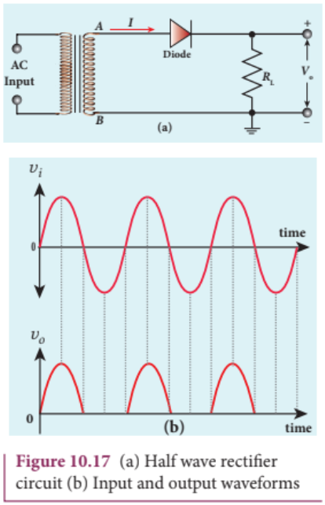

The output of the half wave rectifier is not a steady DC voltage but a pulsating wave. This pulsating voltage cannot be used for electronic equipments. A constant or a steady voltage is required which can be obtained with the help of filter circuits and voltage regulator circuits.

Efficiency \((\eta)\) is the ratio of the output DC power to the AC input power supplied to the circuit. Its value for half wave rectifier is \(40.6\%\) .

## ii) Full wave rectifier

The positive and negative half cycles of the AC input signal are rectified in this circuit and hence it is called the full wave rectifier. The circuit is shown in Figure 10.18(a). It consists of two \(p - n\) junction diodes, a centre tap transformer and a load resistor \(R_{\mathrm{L}}\) . The centre is usually taken as the ground or zero voltage reference point. With the help of the centre tap transformer, each diode rectifies one half of the total secondary voltage.

## During positive half cycle

When the positive half cycle of the AC input signal passes through the circuit, terminal M is positive, C is at zero potential and \(N\) is at negative potential. This forward biases diode \(D_{1}\) and reverse biases diode \(D_{2}\) . Hence, being forward biased, diode \(D_{1}\) conducts and current flows along the path \(MD_{1}ABC\) .

## During negative half cycle

When the negative half cycle of the AC input signal passes through the circuit, terminal \(N\) becomes positive, \(C\) is at zero

1

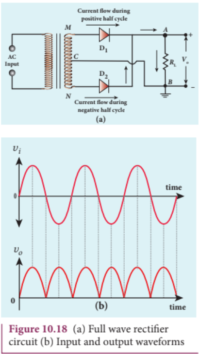

potential and \(M\) is at negative potential. This forward biases diode \(D_{2}\) and reverse biases diode \(D_{1}\) . Hence, being forward biased, diode \(D_{2}\) conducts and current flows along the path \(ND_{2}ABC\) .

During both postive and negative half cycles of the input signal, the current flows through the load in the same direction. The output signal corresponding to the input signal is shown in Figure 10.18(b). Though both half cycles of AC input are rectified, the output is still pulsating in nature.

The efficiency \((\eta)\) of full wave rectifier is twice that of a half wave rectifier and is found to be \(81.2\%\) . It is because of power losses in the winding, the diode and the load resistance.

## 10.3.5 Breakdown mechanism

The reverse current or the reverse saturation current due to the minority charge carriers is small. If the reverse bias applied to a \(p - n\) junction is increased beyond a point, the junction breaks down and the reverse current rises sharply. The voltage at which breakdown happens is called the breakdown voltage and it depends on the width of the depletion region, which in turn depends on the doping level.

A normal \(p - n\) junction diode gets damaged at this point. Specially designed diodes like Zener diode can be operated at this region and can be used for the purpose of voltage regulation in circuits. There are two mechanisms that are responsible for breakdown under increasing reverse voltage.

## i) Avalanche breakdown

Avalanche breakdown occurs in a lightly doped junctions which have wide depletion region. When reverse bias voltage exceeds a certain value, the minority charge carriers are accelerated by reverse voltage and their kinetic energy increases. These charge carriers collide

10.3.6 Zener diode

with semiconductor atoms while passing through the depletion region. This leads to the breaking up of covalent bonds and this results in the generation of electron - hole pairs.

The newly generated charge carriers are also accelerated by the reverse voltage resulting in more collisions and further production of charge carriers. This cumulative process leads to an avalanche (uncontrollably large number) of charge carriers across the junction. This causes diode current to rise abruptly and breakdown takes place. This breakdown is called avalanche breakdown.

## ii) Zener breakdown

Heavily doped \(p - n\) junctions have narrow depletion layers whose width is of the order of \(< 10^{- 6}\) m. When reverse voltage across this junction is increased to the breakdown limit, a very strong electric field of strength \(3\times 10^{7}\mathrm{Vm^{- 1}}\) is set up across the narrow layer. This electric field is strong enough to break or rupture the covalent bonds in the lattice and thereby generating electron- hole pairs. This effect is called Zener effect.

Even a small further increase in reverse voltage produces a large number of charge carriers which move across the junction through the thin depletion region. This process gives rise to a large amount reverse current or breakdown current and this breakdown is called Zener breakdown.

In Avalanche breakdown, the minority charge carriers gain sufficient energy from excessive reverse bias voltage to

break covalent bond in order to produce new charge carriers. But Zener breakdown occurs due to the direct rupture of covalent bonds because of the existence of the strong electric field. Since depletion region is thin, Zener breakdown occurs usually at lesser reverse bias voltage compared to Avalanche breakdown voltage.

Zener diode is a heavily doped silicon diode used in reverse biased condition and is named after its inventor Clarence Melvin Zener. It is specially designed to be operated in the breakdown region. The doping level of the silicon diode can be varied to have a wide range of breakdown voltages from 2 V to over 1000 V.

As explained in the previous section, Zener breakdown occurs due to the breaking up of covalent bonds by the strong electric field set up in the depletion region by the reverse voltage. It produces an extremely large number of electrons and holes which constitute the reverse saturation current. The current is limited by both external resistance and power dissipation of the diode. A Zener diode is shown in Figure 10.19(a) and its circuit symbol is given in Figure 10.19(b).

It looks like an ordinary \(p - n\) junction diode except that \(n\) - side lead resembles the shape of the letter 'z'. The arrow head points the direction of conventional current. In Figure 10.19(a), black ring indicates the \(n\) - side lead.

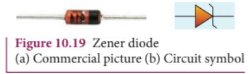

## V-I Characteristics of Zener diode

The circuit to study the forward and reverse characteristics of a Zener diode is shown in Figure 10.20(a) and Figure 10.20 (b). The V- I characteristics of a Zener diode is shown in Figure 10.20(c). The forward characteristic of a Zener diode is similar to that of an ordinary \(p - n\) junction diode. It starts conducting approximately around 0.7 V. However, the reverse characteristics is highly significant in Zener diode. The increase in reverse voltage

[file content end]

[file name]: 10_p2.pdf
[file content begin]

normally generates very small reverse current. While in Zener diode, when the reverse voltage is increased to the breakdown voltage \((V_{z})\) , the increase in current is very sharp. The voltage remains almost constant throughout the breakdown region. In Figure 10.20(c), \(I_{Z(\mathrm{max})}\) represents the maximum reverse current. If the reverse current is increased further, the diode will be damaged. The important parameters of the reverse characteristics are

Zener breakdown voltage, \(V_{z}\) Minimum current to sustain breakdown, \(I_{Z(\mathrm{min})}\)

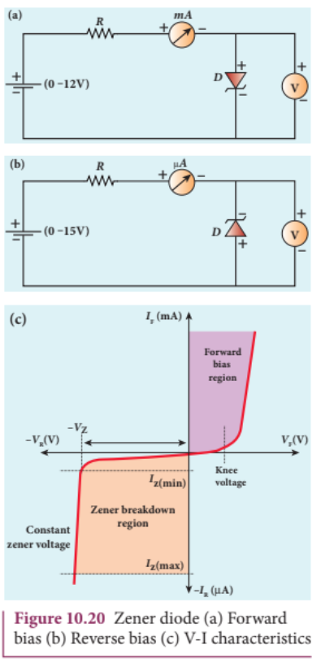

Maximum current limited by maximum power dissipation, \(I_{Z(\mathrm{max})}\)

The Zener diode is operated in the reverse bias condition with the voltage greater than \(V_{z}\) and current less than \(I_{Z(\mathrm{max})}\) . The reverse characteristic is not exactly vertical which means that the diode possesses some small resistance called Zener dynamic impedance. Zener resistance is the inverse of the slope of the curve in the breakdown region. It means an increase in the Zener current produces only a very small increase in the reverse voltage. However this can be neglected. The voltage of an ideal Zener diode does not change once it goes into breakdown. In other words, \(V_{z}\) remains almost constant even when \(I_{z}\) increases considerably.

## Applications

The zener diode can be used

as voltage regulator for calibrating voltages to provide fixed reference voltage in a network for biasing to protect of any gadget against damage from accidental application of excessive voltage.

## Zener diode as a voltage regulator

Zener diode as a voltage regulatorZener diode working in the breakdown region can serve as a voltage regulator whose circuit diagram is given in Figure 10.21. A series resistance \(R_{s}\) of suitable value is used to limit the Zener current to avoid any damage to the diode. This resistance also plays a role in voltage regulation. The fluctuating DC

input voltage is applied to the circuit and constant output voltage \(V_{0}\) is taken across the load resistance \(R_{\mathrm{L}}\) which is connected in parallel with Zener diode. The output voltage is maintained constant as long as the input voltage is greater than \(V_{Z}\) .

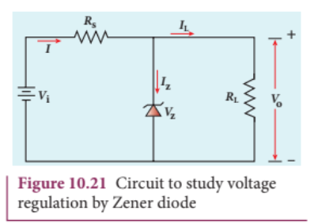

If the input DC voltage is increased, the Zener current increases thereby increasing current through \(R_{\mathrm{s}}\) and the voltage drop across \(R_{\mathrm{s}}\) is also increased. The increased current flows through the diode without affecting the \(I_{\mathrm{L}}\) . Since Zener diode is operated in the breakdown region, the Zener breakdown voltage across the diode is nearly constant even though the reverse bias current through the diode increases considerably. The increase in input voltage is dropped across \(R_{\mathrm{s}}\) and hence it is also called dropping resistance. Because of the parallel connection, the voltage across \(R_{\mathrm{L}}\) is also equal to Zener breakdown voltage which is taken as constant output voltage \(V_{0}\) .

If the input DC voltage is decreased, the diode takes a smaller current and the voltage drop across \(R_{\mathrm{s}}\) is reduced. Thus, the output voltage \(V_{0}\) remains constant. To sum up, if there is any change in input voltage, the voltage drop across \(R_{\mathrm{s}}\) changes accordingly. But the voltage across Zener diode or voltage across \(R_{\mathrm{L}}\) remains constant. Thus the Zener diode acts as a voltage regulator.

## EXAMPLE 10.3

Find the current through the Zener diode when the load resistance is \(2\mathrm{k}\Omega\) . Use diode approximation.

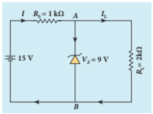

## Solution

Voltage across AB, \(V_{Z} = 9\mathrm{V}\) Voltage drop across \(R_{\mathrm{s}} = 15 - 9 = 6\mathrm{V}\) Therefore current through the resistor \(R_{\mathrm{s}}\)

\[I = \frac{6}{1\times 10^3} = 6\mathrm{mA}\]

Voltage across the load resistor, \(V_{\mathrm{AB}} = 9\mathrm{V}\)

Current through load resistor,

\[I_{L} = \frac{V_{AB}}{R_{L}} = \frac{9}{2\times 10^{3}} = 4.5\mathrm{mA}\]

The current through the Zener diode,

\[I_{Z} = I - I_{L} = 6\mathrm{mA} - 4.5\mathrm{mA} = 1.5\mathrm{mA}\]

## 10.3.7 Optoelectronic devices

Optoelectronics deals with devices which convert electrical energy into light and light into electrical energy using semiconductors. Optoelectronic device is an electronic device which utilizes light for useful applications. We will discuss some important optoelectronic devices namely, light emitting diodes, photo diodes and solar cells.

## i) Light Emitting Diode (LED)

LED is a \(p - n\) junction diode which emits visible or invisible light when it is

forward biased. Since electrical energy is converted into light energy, this process is also called electroluminescence. The circuit symbol of LED is shown in Figure 10.22(a). The direction of arrows indicates that light is emitted from the diode.

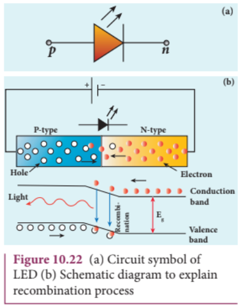

When the \(p - n\) junction is forward biased, the conduction band electrons on \(n\) - side and valence band holes on \(p\) - side diffuse across the junction. When they cross the junction, they become excess minority carriers (electrons in \(p\) - side and holes in \(n\) - side). These excess minority carriers recombine with oppositely charged majority carriers in the respective regions, i.e. the electrons in the conduction band recombine with holes in the valence band as shown in the Figure 10.22(b).

During recombination process, energy is released in the form of light (radiative) or heat (non- radiative). For radiative recombination, a photon of energy \(hv\) is emitted. For non- radiative recombination, energy is liberated in the form of heat.

The colour of the light is determined by the energy band gap of the material. Therefore, LEDs are available in a wide range of colours such as blue (SiC), green (AlGaP) and red (GaAsP). Now a days, LED which emits white light (GaInN) is also available.

## Applications

The light emitting diodes are used in indicator lamps on the front panel of the scientific and laboratory equipments. seven- segment displays. traffic signals, emergency vehicle lighting etc. remote control of television, airconditioner etc.

## EXAMPLE 10.4

Determine the wavelength of light emitted from LED which is made up of GaAsP semiconductor whose forbidden energy gap is 1.875 eV. Mention the colour of the light emitted (Take \(h = 6.6\times 10^{- 34}\mathrm{Js}\) ).

Mention the colour of the light emitted (Take \(h = 6.6\times 10^{- 34}\mathrm{Js}\) ).

## Solution

\[E_{g} = \frac{hc}{\lambda}\]

Therefore,

\[\lambda = \frac{hc}{E_{g}} = \frac{6.6\times 10^{-34}\times 3\times 10^{8}}{1.875\times 1.6\times 10^{-19}}\] \[= 660\mathrm{nm}\]

The wavelength \(660~\mathrm{nm}\) corresponds to red colour light.

## ii) Photodiodes

A \(p\) - \(n\) junction diode which converts an optical signal into electric signal is known as photodiode. Thus, the operation

of photodiode is exactly inverse to that of an LED. Photodiode works in reverse bias condition. Its circuit symbol is shown in Figure 10.23(a). The direction of arrows indicates that the light is incident on the photodiode.

The device consists of a \(p\) - \(n\) junction semiconductor made of photosensitive material kept safely inside a plastic case as shown in Figure 10.23(b). It has a small transparent window that allows light to be incident on the \(p\) - \(n\) junction. Photodiodes can generate current when the \(p\) - \(n\) junction is exposed to light and hence are called as light sensors.

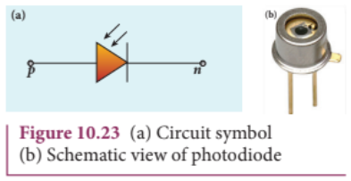

When a photon of sufficient energy \((hv)\) strikes the depletion region of the diode, some of the valence band electrons are elevated into conduction band, in turn holes are developed in the valence band. This creates electron- hole pairs. The amount of electron- hole pairs generated depends on the intensity of light incident on the \(p\) - \(n\) junction.

These electrons and holes are swept across the \(p\) - \(n\) junction by the electric field created by reverse voltage before recombination takes place. Thus, holes move towards the \(p\) - side and electrons towards the \(n\) - side. When the external circuit is made, the electrons flow through the external circuit and constitute the photocurrent.

When there is no incident light, there exists a reverse current which is negligible.

This reverse current in the absence of any incident light is called dark current and is due to the thermally generated minority carriers.

## Applications

ApplicationsThe photodiodes are used in- alarm system- count items on a conveyor belt- photoconductors- compact disc players, smoke detectors- medical applications such as detectors for computed tomography etc.

## iii) Solar cell

A solar cell, also known as photovoltaic cell, works on the principle of photovoltaic effect. Accordingly, the \(p\) - \(n\) junction of the solar cell generates emf when solar radiation falls on it. The construction details and cross- sectional view are shown in Figure 10.24.

In a solar cell, electron- hole pairs are generated due to the absorption of light photons near the junction. Then the charge carriers are separated due to the electric field of the depletion region. Electrons move towards \(n\) - type silicon layer and holes move towards \(p\) - type silicon layer. The electrons reaching the \(n\) - side are collected by the front contact (metal finger contact) and holes reaching \(p\) - side are collected by the back

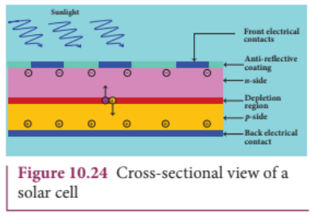

electrical contact. Thus a potential difference is developed across solar cell.When an external load is connected to the solar cell, photocurrent flows through the load.

Many solar cells are connected together either in series or in parallel combination to form a solar panel. Many solar panels are connected with each other to form solar arrays. For high power applications, solar panels and solar arrays are used.

## Applications:

i) Solar cells are widely used in calculators, watches, toys, portable power supplies, etc. ii) Solar cells are used in satellites and space applications. iii) Solar panels are used for commercial production of electricity.

## 10.4

# THE BIPOLAR JUNCTION TRANSISTOR [BJT]

## Introduction

In 1951, William Schockley invented the modern version of transistor. It is a semiconductor device that led to a technological revolution in the twentieth century. The heat loss in transistor is very less. This has laid the foundation for integrated chips which contain thousands of miniaturized transistors. The emergence of the integrated chips led to increasing applications in the fast developing electronics industry.

## Bipolar Junction Transistor (BJT)

The BJT consists of a semiconductor (silicon or germanium) crystal in which an \(n\) - type material is sandwiched between two \(p\) - type materials (PNP transistor) or

a \(p\) - type material sandwiched between two \(n\) - type materials (NPN transistor). To protect it against moisture, it is sealed inside a metal or a plastic case. The two types of transistors with their circuit symbols are shown in Figure 10.25.

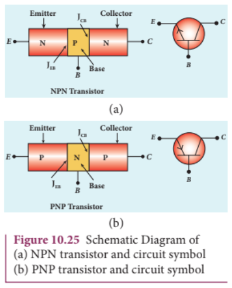

The three regions formed are called as emitter, base and collector which are provided with terminals or ohmic contacts labeled as \(E\) , \(B\) , and \(C\) . As BJT has two \(p\) - \(n\) junctions, two depletion layers are formed across the emitter- base junction \((I_{\mathrm{EB}})\) and collector- base junction \((I_{\mathrm{CB}})\) respectively. The circuit symbol carries an arrowhead at the emitter lead pointing from \(p\) to \(n\) indicating the direction of conventional current.

## Emitter:

The main function of the emitter is to supply majority charge carriers to the collector region through the base region. Hence, emitter is more heavily doped than the other two regions.

Base:

Base is very thin \((10^{- 6}\mathrm{m})\) and very lightly doped region when compared to the other two regions.

## Collector:

The main function of collector is to collect the majority charge carriers supplied by the emitter through the base. Hence, collector is made physically larger than the other two as it has to dissipate more power. It is moderately doped.

## Transistor Biasing

The application of suitable DC voltages across the transistor terminals is called biasing. The transistor biasing is done differently for different uses. The different modes of transistor biasing are given below.

## Forward Active:

In this bias, the emitter- base junction is forward biased and the collector- base junction is reverse biased. The transistor is in the active mode of operation. In this mode, the transistor functions as an amplifier.

## Saturation:

Here, the emitter- base junction and collector- base junction are forward biased. The transistor has a very large flow of currents across the junctions. In this mode, transistor is used as a closed switch.

## Cut-off:

In this bias, the emitter- base junction and collector- base junction are reverse biased. Transistor in this mode acts an open switch.

image[[521, 98, 856, 244]]

## 10.4.1 Transistor circuit configurations

There are three types of circuit connections for operating a transistor based on the terminal that is used in common to both input and output circuits.

## i) Common-Base (CB) configuration

The base is common to both the input and output circuits. The schematic and circuit symbol are shown in Figure 10.26(a) and 10.26(b). The input current is the emitter current \(I_{\mathrm{E}}\) and the output current is the collector current \(I_{\mathrm{C}}\) . The input signal is applied between emitter and base while the output is measured between collector and base.

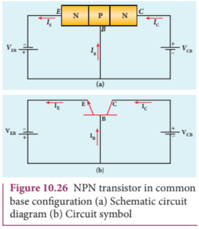

2) Common-Emitter (CE) configurationIn this configuration, the emitter is common to both the input and output circuits as shown in Figure 10.27. The base current \(I_{\mathrm{B}}\) is the input current and the collector current \(I_{\mathrm{c}}\) is the output current. The input signal is applied between emitter and base while the output is measured between collector and emitter.

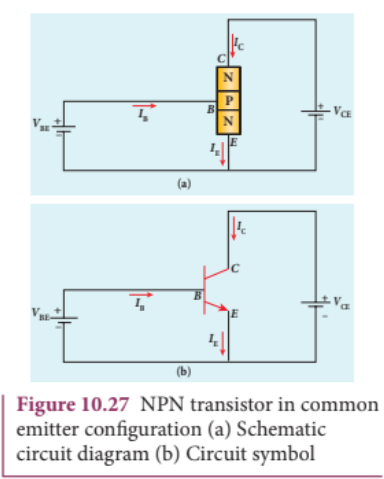

## iii) Common-Collector (CC) configuration

Here, the collector is common to both the input and output circuits as shown in Figure 10.28. The base current \(I_{\mathrm{B}}\) is the input current and the emitter current \(I_{\mathrm{E}}\) is the output current. The input signal is applied between base and collector while the output is measured between emitter and collector.

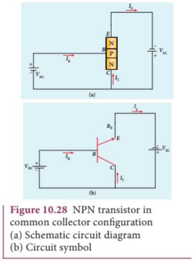

## 10.4.2 Transistor action in the common base mode

The operation of an NPN transistor in the common base mode is explained below. The current flow in a common base NPN transistor in the forward active mode is shown in Figure 10.29.

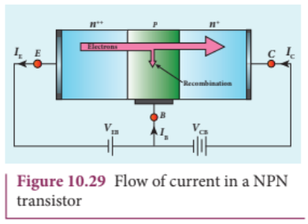

Basically, a BJT can be considered as two \(p\) - \(n\) junction diodes connected back- to- back. In the forward active bias of the

NPN transistor, the emitter- base junction is forward biased and the collector- base junction is reverse biased. The application of the forward bias voltage on the emitter- base junction causes the electrons to flow from the emitter to the base. As the base is made up of \(p\) - type material, the electrons (minority carriers) in the base region are attracted by the positive terminal of the forward bias supply and move towards the base terminal to constitute base current. However, the base is very thin and lightly doped, so only a small percentage (2-5%) of the electrons recombine with holes in the base region. The remaining electrons (95-98%) will diffuse across the base region to reach the collector- base junction.

This collector- base junction is reverse biased and hence the positive terminal of the reverse bias supply is connected to the collector region. The electrons (majority carriers) reaching the collector are attracted by the positive terminal of the reverse bias supply. Thus the electrons from the emitter constitute the collector current. Thus, we arrive at a very important result:

\[I_{E} = I_{B} + I_{C} \quad (10.1)\]

where \(I_{E}, I_{B}\) and \(I_{C}\) are the emitter current, base current and collector current respectively.

## Current amplification factor

The ratio of the collector current to the emitter current is called the current amplification factor \((\alpha)\) .

\[\alpha = \frac{I_{C}}{I_{E}} \quad (10.2)\]

The value of \(\alpha\) is always less than 1 and typically ranges from 0.95 to 0.99. In PNP transistor, the analysis is the same except the

fact that the emitter current \(I_{E}\) is due to holes and the base current \(I_{B}\) is due to electrons. However, the current through the external circuit is due to the flow of electrons.

## EXAMPLE 10.5

In a transistor connected in the common base configuration, \(\alpha = 0.95\) , \(I_{E} = 1 \text{mA}\) . Calculate the values of \(I_{C}\) and \(I_{B}\) .

## Solution

\[\alpha = \frac{I_{C}}{I_{E}}\]

\[I_{C} = \alpha I_{E} = 0.95\times 1 = 0.95 \text{mA}\]

\[I_{E} = I_{B} + I_{C}\]

\[\therefore I_{B} = I_{E} - I_{C} = 1 - 0.95 = 0.05 \text{mA}\]

## 10.4.3 Static Characteristics of Transistor in Common Emitter Mode

The know- how of certain parameters like the input resistance, output resistance, and current gain of a transistor are very important for the effective use of transistors in circuits. The circuit to study the static characteristics

of an NPN transistor in the common emitter mode is given in Figure 10.30. The bias supply voltages \(V_{\mathrm{BB}}\) and \(V_{\mathrm{CC}}\) bias the base- emitter junction and collector- emitter junction respectively. The junction potential at the base- emitter is represented as \(V_{\mathrm{BE}}\) and that at the collector- emitter as \(V_{\mathrm{CE}}\) . The rheostats \(R_{1}\) and \(R_{2}\) are used to vary the base current and collector current respectively.

The static characteristics of the BJT are

i) Input characteristics ii) Output characteristics iii) Transfer characteristics

## i) Input characteristics

Input characteristic curves give the relationship between the base current \((I_{\mathrm{B}})\) and base to emitter voltage \((V_{\mathrm{BE}})\) at constant collector to emitter voltage \((V_{\mathrm{CE}})\) and are shown in Figure 10.31.

Initially, the collector to emitter voltage is set to a particular value (above \(0.7 \text{V}\) to reverse bias the junction). Then the base- emitter voltage is increased in suitable steps and the corresponding base- current is recorded. A graph is plotted with \(V_{\mathrm{BE}}\) along the x- axis and \(I_{\mathrm{B}}\) along the y- axis. The procedure is repeated for different values of \(V_{\mathrm{CE}}\) .

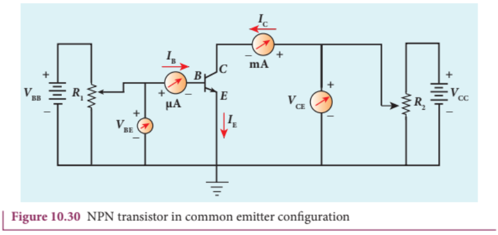

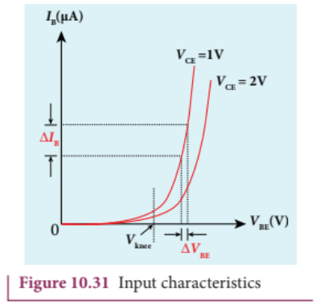

The following observations are made from the graph.

The curve looks like the forward characteristics of an ordinary \(p - n\) junction diode.

There exists a threshold voltage or knee voltage \((V_{\mathrm{knee}})\) below which the base current is very small. This value is 0.7 V for silicon and \(0.3\mathrm{V}\) for germanium transistors. Beyond the knee voltage, the base current increases with the increase in base- emitter voltage.

It is also noted that the increase in the collector- emitter voltage decreases the base current. This shifts the curve outward. This is because the increase in collector- emitter voltage increases the width of the depletion region which in turn, reduces the effective base width and thereby the base current.

## Input impedance

The ratio of the change in base- emitter voltage \(\left(\Delta V_{BE}\right)\) to the corresponding change in base current \(\left(\Delta I_B\right)\) at a constant collector- emitter voltage \(\left(V_{CE}\right)\) is called the input impedance \((r_i)\) . The input impedance is not constant in the lower region of the curve.

\[r_i = \left(\frac{\Delta V_{BE}}{\Delta I_B}\right)_{V_{CE}} \quad (10.3)\]

The input impedance is high for a transistor in common emitter configuration.

## ii) Output characteristics

The output characteristics give the relationship between the collector current \((I_{C})\) and the collector to emitter voltage \((V_{CE})\) at constant input current \((I_{B})\) and are shown in Figure 10.32.

Initially, the base current is set to a particular value. Then collector- emitter voltage is increased in suitable steps and the corresponding collector current is recorded. A graph is plotted with \(V_{CE}\) along the \(\mathbf{x}\) - axis and \(I_{C}\) along the y- axis. This procedure is repeated for different values of \(I_{B}\) . The four important regions in the output characteristics are:

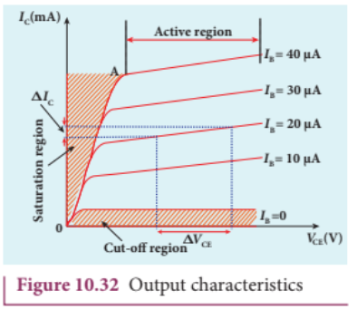

## i) Saturation region

When \(V_{CE}\) is increased above 0 V, the \(I_{C}\) increases rapidly and reaches a saturation value at a particular value of \(V_{CE}\) , called knee voltage. The initial part of the curve OA (the ohmic region) between the origin 0 and the knee point A is called saturation region. Transistors are always operated above this knee voltage.

## ii) Cut-off region

A small collector current exists even after the base current is reduced to zero. This region below the curve for \(I_{\mathrm{B}} = 0\) is called cut- off region because the main collector current is cut- off.

## iii) Active region

The central region of the curves is called active region. In this region, the base- emitter junction remains in the forward biased condition and the collector- emitter junction remains in the reverse biased condition. The transistor in this region can be used for voltage, current and power amplification.

## iv) Breakdown region

If the collector- emitter voltage is increased beyond the rated value given by the manufacturer, the collector current increases enormously leading to the junction breakdown of the transistor. This avalanche breakdown can damage the transistor.

## Output impedance

The ratio of the change in the collector- emitter voltage \(\left(\Delta V_{CE}\right)\) to the corresponding change in the collector current \(\left(\Delta I_{C}\right)\) at constant base current \((I_{\mathrm{B}})\) is called output impedance \((r_0)\)

\[r_o = \left(\frac{\Delta V_{CE}}{\Delta I_C}\right)_{I_B} \quad (10.4)\]

The output impedance for transistor in common emitter configuration is very low.

## iii) Current transfer characteristics

This gives the relationship between the collector current \((I_{C})\) and the base current \((I_{\mathrm{B}})\) at constant collector- emitter voltage \((V_{CE})\) and is shown in Figure 10.33. It is seen that a small \(I_{\mathrm{C}}\) flows even when \(I_{\mathrm{B}}\) is zero. This current is called the common emitter leakage current \((I_{CE0})\) , which is due to the flow of minority charge carriers.

## Forward current gain

The ratio of the change in collector current \(\left(\Delta I_{C}\right)\) to the corresponding change in base current \(\left(\Delta I_{B}\right)\) at constant collector- emitter voltage \((V_{CE})\) is called forward current gain \((\beta)\)

\[\beta = \left(\frac{\Delta I_C}{\Delta I_B}\right)_{V_{CE}} \quad (10.5)\]

Its value is very high and it generally ranges from 50 to 200.

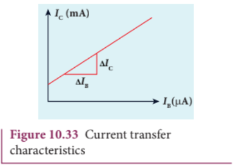

## 10.4.4 Relation between \(\alpha\) and \(\beta\)

There is a relation between current gain in the common base configuration \(\alpha\) and current gain in the common emitter configuration \(\beta\) which is given below.

\[\alpha = \frac{\beta}{1 + \beta} (\mathrm{or}) \beta = \frac{\alpha}{1 - \alpha} \quad (10.6)\]

image[[518, 712, 868, 796]]

## EXAMPLE 10.6

In the circuit shown in the figure, the input voltage \(V_{i}\) is 20 V, \(V_{BE} = 0\) V and \(V_{CE} = 0\) V. What are the values of \(I_{B}, I_{C}, \beta\) ?

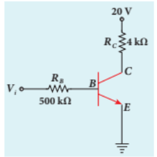

20V \(V_{i} = \frac{V_{i}}{R_{B}} = \frac{20V}{500k\Omega} = 40\mu \mathrm{A}\) \(\left[\because V_{BE} = 0V\right]\) \(I_{C} = \frac{V_{CC}}{R_{C}} = \frac{20V}{4k\Omega} = 5\mathrm{mA}\) \(\left[\because V_{CE} = 0V\right]\) \(\beta = \frac{I_{C}}{I_{B}} = \frac{5\mathrm{mA}}{40\mu\mathrm{A}} = 125\)

## 10.4.5 Operating Point

The operating point is a point where the transistor can be operated efficiently. A straight line drawn by joining the points \(A(V_{CC},0)\) and \(B(0,V_{CC} / R_{C})\) is called the DC load line. The DC load line superimposed on the output characteristics of a transistor is used to learn the concept of operating point of the transistor as shown in Figure 10.34.

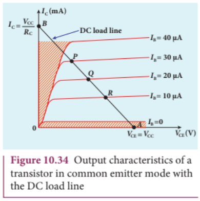

In Figure 10.34, the points P, Q, R are called Q points or quiescent points

which determine the operating point or the working point of a transistor. If the operating point is chosen at the middle of the DC load line (point Q), the transistor can effectively work as an amplifier. The operating point determines the maximum signal that can be obtained without being distorted.

For a transistor to work as a open switch, the Q point can be chosen at the cut- off region and to work as a closed switch, the Q point can be chosen in the saturation region.

## 10.4.6 Transistor as a switch

A transistor in saturation region acts as a closed switch while in cut- off region; it acts as an open switch. It functions like an electronic switch that helps to turn ON or OFF a given circuit by a small control signal which keeps the transistor either in saturation region or in cut- off region. The circuit is shown in Figure 10.35.

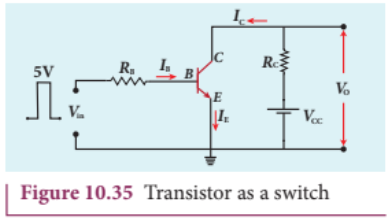

## When the input is low:

When the input is low (say 0V), the base current is zero and transistor is not properly forward biased. It is in cut off region. As a result, the collector current is zero and correspondingly the voltage drop across \(R_{C}\) also becomes nearly zero. The output voltage is high and is equal to \(V_{CC}\) . It means that the no current flows through the transistor and it is said to be switched off. The transistor acts as an open switch.

## When the input is high:

When the input voltage is increased to a certain high value (say \(+5\mathrm{V}\) ), the base current \((I_{B})\) increases and in turn increases the collector current to its maximum. The transistor will move into the saturation region. The increase in collector current \((I_{C})\) increases the voltage drop across \(R_{C}\) , thereby lowering the output voltage, close to zero (since \(V_{o} = V_{CC} - I_{C}R_{C}\) ). It means that maximum current flows through the transistor and it is said to be switched on. The transistor acts as a closed switch.

It is manifested that a high input to the transistor gives a low output and a low input gives a high output. In addition, we can say that the output voltage is opposite to the applied input voltage. Therefore, a transistor can be used as an inverter (NOT gate) in computer logic circuitry.

## EXAMPLE 10.7

The current gain of a common emitter transistor circuit shown in figure is 120. Draw the DC load line and mark the \(Q\) point on it. \((V_{BE}\) to be ignored).

.png)

## Solution

\[\beta = 120\] \[\mathrm{Base~current,~}I_{B} = \frac{25V}{1M\Omega} = \frac{25}{1\times 10^{6}}\] \[\qquad = 25\mu \mathrm{A}\]

We know that

\[\beta = \frac{I_{C}}{I_{B}}\quad (\mathrm{or})\]

\[I_{C} = \beta I_{B} = 120\times 25\mu \mathrm{A}\] \[\qquad = 3000\mu \mathrm{A} = 3\mathrm{mA}\] \[V_{CE} = V_{CC} - I_{C}R_{C}\] \[\qquad = 25 - (3\mathrm{mA}\times 5\mathrm{k})\mathrm{=}10\mathrm{V}\]

.png)

## 10.4.7 Transistor as an amplifier

A transistor operating in the active region has the capability to amplify weak signals. Amplification is the process of increasing the signal strength (increase in the amplitude). If a large amplification is required, the transistors are cascaded with coupling elements like resistors, capacitors, and transformers and they are called multistage amplifiers.

Here, the amplification of an electrical signal is explained with a single stage transistor amplifier which is shown in Figure 10.36(a). Single stage indicates that the circuit consists of one transistor with the allied components. An NPN transistor is connected in the common emitter configuration.

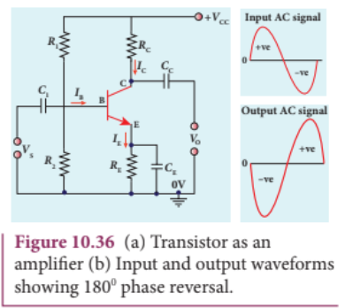

To start with, the \(Q\) point or the operating point of the transistor is fixed so as to get the maximum signal swing at the output (neither towards saturation point nor towards cut- off).

A load resistance \(R_{\mathrm{c}}\) is connected in series with the collector circuit to measure the output voltage. The resistance \(R_{1},R_{2}\) and \(R_{\mathrm{E}}\) form the biasing and stabilization circuit. The capacitor \(C_{1}\) allows only the AC signal to pass through. The emitter bypass capacitor \(C_{\mathrm{E}}\) provides a low reactance path to the amplified AC signal. The coupling capacitor \(C_{\mathrm{c}}\) is used to couple one stage of the amplifier with the next stage while constructing multistage amplifiers.

\(V_{\mathrm{s}}\) is the sinusoidal input signal source applied across the base- emitter. The output is taken across the collector- emitter.

Collector current, \(I_{c} = \beta I_{B}\) \(\therefore \beta = \frac{I_{C}}{I_{B}}\)

Applying Kirchhoff's voltage law to the output loop, the collector- emitter voltage is given by

## Working of the amplifier

During the positive half cycle

Input signal \((V_{s})\) increases the forward voltage across the emitter- base. As a result, the base current \((I_{\mathrm{B}}\) in \(\mu \mathrm{A}\) ) increases. Consequently, the collector current \((I_{\mathrm{c}}\) in mA) increases \(\beta\) times. This increases the voltage drop across \(R_{\mathrm{c}}(I_{c}R_{c})\) which in turn decreases the collector- emitter voltage \((V_{\mathrm{CE}})\) Therefore, the input signal during the positive half cycle produces negative half cycle of the amplified signal at the output. Hence, the output signal is reversed by \(180^{\circ}\) as shown in Figure 10.36(b).

During the negative half cycle

Input signal \((V_{s})\) decreases the forward voltage across the emitter- base. As a result, base current \((I_{\mathrm{B}}\) in \(\mu \mathrm{A}\) ) decreases and in turn decreases the collector current \((I_{\mathrm{c}}\) in mA). The decrease in collector current \((I_{c})\) decreases the potential drop across \(R_{\mathrm{c}}\) which in turn increases the collector- emitter voltage \((V_{\mathrm{CE}})\) . Thus, the input signal during the negative half cycle produces positive half cycle of the amplified signal at the output. Therefore, \(180^{\circ}\) phase reversal is observed during the negative half cycle of the input signal also as shown in Figure 10.36(b).

## 10.4.8 Transistor as an oscillator

An electronic oscillator basically converts DC energy into AC energy of frequency ranging from a few Hz to several MHz. Hence, it is a source of alternating current or voltage. Unlike an amplifier, oscillator does not require any external signal source.

Basically, there are two types of oscillators: Sinusoidal and non- sinusoidal. Sinusoidal oscillators generate oscillations in the form of sine waves at constant amplitude and

frequency as shown in Figure 10.37(a). Nonsinusoidal oscillators generate complex, non- sinusoidal waveforms like squarewave, triangular- wave and sawtooth- wave as shown in Figure 10.36 (b), (c), (d).

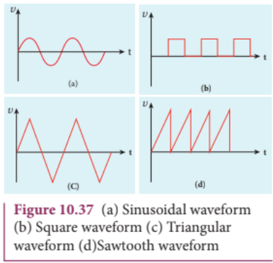

Sinusoidal oscillations are of two types: Damped and undamped. If the amplitude of the electrical oscillations decreases with time due to energy loss, it is called damped oscillations as shown in Figure 10.38(a). On the other hand, the amplitude of the electrical oscillations remains constant with time in undamped oscillations as shown in Figure 10.38(b).

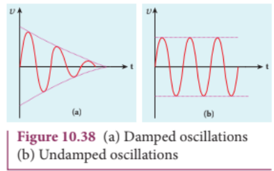

## Transistor oscillator

An oscillator circuit consists of three components. They are i) tank circuit ii) amplifier and iii) feedback network. The block diagram is shown in Figure 10.39(a).

## i) Tank circuit

The \(LC\) tank circuit consists of an inductance \(L\) and a capacitor \(C\) connected in parallel as shown in Figure 10.39(b). Whenever energy is supplied to the tank circuit from a DC source, the energy is stored in inductor and capacitor alternatively. This produces electrical oscillations of definite frequency.

## ii) Amplifier

This is a single stage amplifier which amplifies the weak signal produced by the tank circuit. The required output is supplied by this amplifier.

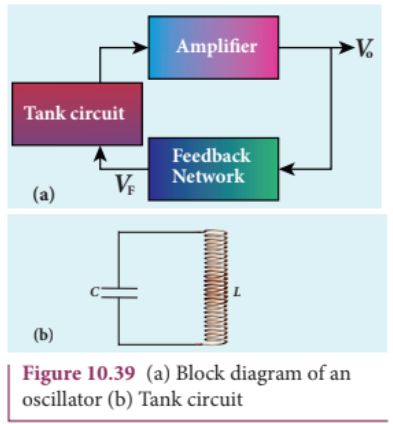

## iii) Feedback network

The circuit used to feed a portion of the output back to the input is called the feedback network. If the portion of the output fed to the input is in phase with the input, then the magnitude of the input signal increases. This process is called positive feedback which is necessary for sustained oscillations.

## Working

The tank circuit generates electrical oscillations and acts as the AC input source to the transistor amplifier. Amplifier amplifies

the input AC signal. In practical oscillator circuits, there is loss of some energy in inductor coils and capacitors due to electrical resistance. A small amount of energy is used up in overcoming these losses during every cycle of charging and discharging of the capacitor. Due to this, the amplitude of the oscillations decreases gradually. Hence, the tank circuit produces damped electrical oscillations.

In order to produce undamped oscillations, a positive feedback is provided from output to input by feedback network. This compensates energy loss in tank circuit. The frequency of oscillations is determined by the values of L and C and is given by

\[f = \frac{1}{2\pi\sqrt{LC}} \quad (10.8)\]

## Barkhausen conditions for sustained oscillations

The following conditions called Barkhausen conditions should be satisfied for sustained oscillations in the oscillator.

There should be positive feedback. The loop phase shift must be \(0^{\circ}\) or integral multiples of \(2\pi\) The loop gain must be unity. That is, \(\left|AB\right| = 1\)

Here, \(A\) is the voltage gain of the amplifier, \(\beta\) is the feedback ratio (the fraction of the output that is fed back to the input).

There are different types of oscillator circuits based on the different types of tank circuits. Examples: Hartley oscillator, Colpitts oscillator, Phase shift oscillator and Crystal oscillator.

## Applications of oscillators

Transistor oscillators are used to generate periodic sinusoidal or non sinusoidal wave forms to generate RF carriers

to generate audio tones to generate clock signal in digital circuits as sweep circuits in TV sets and CRO

## EXAMPLE 10.8

Calculate the range of the variable capacitor that is to be used in a tuned- collector oscillator which has a fixed inductance of \(150~\mu \mathrm{H}\) . The frequency band is from \(500~\mathrm{kHz}\) to \(1500~\mathrm{kHz}\) .

## Solution

Resonant frequency,

\[f = \frac{1}{2\pi\sqrt{LC}}\]

On simplifying, we get

\[C = \frac{1}{4\pi^2f^2L}\]

i) When frequency \(= 500\mathrm{kHz}\)

\[C = \frac{1}{4\times 3.14^2\times(500\times 10^3)^2\times 150\times 10^{-6}}\] \[= 676\mathrm{pF}\]

ii) When frequency \(= 1500\mathrm{kHz}\)

\[C = \frac{1}{4\times 3.14^2\times(1500\times 10^3)^2\times 150\times 10^{-6}}\] \[= 75\mathrm{pF}\]

Therefore, the capacitor range is from 75 to \(676~\mathrm{pF}\)

## 10.5

## DIGITAL ELECTRONICS

Digital Electronics is the branch of electronics which deals with digital signals. It is increasingly used in numerous applications ranging from high end processor circuits to miniature circuits for signal processing, communication etc. Digital signals are preferred over analog signals due to their better performance, accuracy, speed, flexibility and immunity to noise.

10.5.1 Analog and Digital Signals

There are 2 different types of signals used in Electronics. They are (i) Analog signals and (ii) Digital signals. An analog signal is a continuously varying voltage or current with respect to time. Such signals are employed in rectifying circuits and transistor amplifier circuits.

Digital signals are signals which contain only discrete values of voltages. Digital signals need two states: switch ON and OFF. ON is considered as one state and OFF is considered as the other state. It can also be defined as high ON or low OFF) state, closed ON) or open OFF).These high and low states are defined using binary numbers 1 or 0 in Boolean Algebra. The state 1 represents the terms: circuit on, high voltage, a closed switch. Similarly a 0 state represents circuit off, low voltage or an open switch.

## Positive and Negative Logic

In digital systems, there exists two voltage levels: 5V (high) and 0V (low). In a positive logic system; a binary 1 stands for 5V and 0 stands for 0V while in negative logic system, 1 stands for 0V and 0 stands for 5V as shown in Figure 10.40.

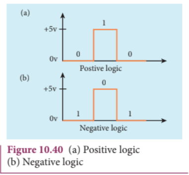

## 10.5.2 Logic gates

A logic gate is an electronic circuit whose function is based on digital signals. They are binary in nature. The logic gates are considered as the basic building blocks of most of the digital systems. They have one output with one or more inputs. There are three types of basic logic gates: AND, OR, and NOT. The other logic gates are Ex- OR, NAND, and NOR. They can be constructed from the basic logic gates.

Digital electronics deals with logical operations. The variables are called logical variables. The operators like logical addition \((+)\) and logical multiplication \((\cdot)\) are called logical operators. When the logical operators \((+,\ldots)\) operate on logical variables (A,B), they give logical constant (Y). The equation that represents this operation is called logical statement.

For example,

Logical operator: \(^+\) Logical variable: \(A,B\) Logical constant: Y Logical statement: \(Y = A + B\)

The possible combinations of inputs and the corresponding output are given in the form of a table called truth table. The circuits which perform the basic logical operations such as logical addition, multiplication and inversion are discussed below.

## AND gate

## Circuit symbol

The circuit symbol of a two input AND gate is shown in Figure 10.41(a). \(A\) and \(B\) are inputs and \(Y\) is the output. It is a logic gate and hence \(A,B\) and \(Y\) can have the value of either 1 or 0.

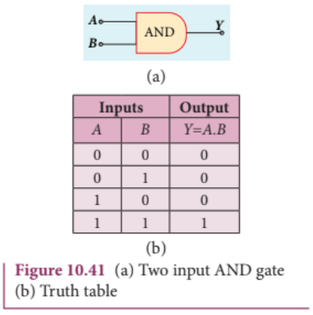
