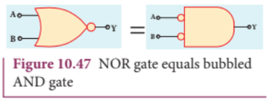
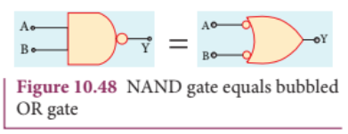

## 10.7 De Morgan's Theorems

### 10.7.1 De Morgan's First Theorem

The statement of the first theorem is: The complement of the sum of two logic inputs is equal to the product of their complements.

**Proof**

The Boolean equation for NOR gate is:

\[ Y = \overline{A + B} \]

The Boolean equation for bubbled AND gate is:

\[ Y = \overline{A}.\overline{B} \]

For equivalent inputs, both cases produce the same output. This can be verified using the following truth table.

| A | B | A+B | \(\overline{A+B}\) | \(\overline{A} \)| \(\overline{B} \)| \(\overline{A}.\overline{B} \)|
|---|---|---|---|---|---|---|
| 0 | 0 | 0 | 1 | 1 | 1 | 1 |
| 0 | 1 | 1 | 0 | 1 | 0 | 0 |
| 1 | 0 | 1 | 0 | 0 | 1 | 0 |
| 1 | 1 | 1 | 0 | 0 | 0 | 0 |

From the above truth table, we can conclude:

\[ \overline{A + B} = \overline{A}.\overline{B} \]

Thus, De Morgan's first theorem is proved. This implies that a NOR gate is equivalent to a bubbled AND gate.

The related logic circuit is shown in Figure 10.47.

### 10.7.2 De Morgan's Second Theorem

The statement of the second theorem is: The complement of the product of two inputs is equal to the sum of their complements.

**Proof**

The Boolean equation for NAND gate is:

\[ Y = \overline{A.B} \]

The Boolean equation for bubbled OR gate is:

\[ Y = \overline{A} + \overline{B} \]

A and B are inputs and Y is the output. For equivalent inputs, both equations produce the same output. This can be verified using the following truth table.

| A | B | A.B | \(\overline{A.B}\) | \(\overline{A}\) |\( \overline{B} \)| \(\overline{A} + \overline{B}\) |
|---|---|---|---|---|---|---|
| 0 | 0 | 0 | 1 | 1 | 1 | 1 |
| 0 | 1 | 0 | 1 | 1 | 0 | 1 |
| 1 | 0 | 0 | 1 | 0 | 1 | 1 |
| 1 | 1 | 1 | 0 | 0 | 0 | 0 |

From the above truth table, we can conclude:

\[ \overline{A.B} = \overline{A} + \overline{B} \]

Thus, De Morgan's second theorem is proved. This implies that a NAND gate is equivalent to a bubbled OR gate.

The related logic circuit is shown in Figure 10.48.

>**Example 10.11**
>
>Prove the following Boolean expression: \( AC + ABC = AC \). Also draw the circuit diagram.
>
>**Solution**
>
>Step 1: \( AC(1 + B) = AC.1 \) (OR law - 2)
>
>Step 2: \( AC.1 = AC \) (AND law - 2)
>
>Therefore, \( AC + ABC = AC \)
>
>Thus, the given Boolean expression is proved.

### 10.7.3 Integrated Chips

An integrated circuit is also referred to as IC or chip or microchip (Figure 10.49). It consists of several thousand to millions of transistors, resistors, capacitors integrated on a small piece of semiconductor like silicon.

Integrated circuits (ICs) are a milestone in modern electronics. Due to technological advancement and the advent of VLSI (Very Large Scale Integration) era, it is possible to create a very large number of transistors on a single integrated chip.

Compared to ordinary circuits, integrated circuits have two main advantages: cost and performance. Due to technological advancement, the size, speed and capacity of chips have been greatly improved. Nowadays, computers, mobile phones and other household digital devices have become smaller and cheaper due to integrated circuits. Integrated circuits can function as amplifiers, oscillators, timing circuits, microprocessors and computer memory.

These tiny integrated circuits perform calculations and store data using digital or analog technology. Digital ICs use logic gates that operate with values of one and zero. A low signal to a digital IC produces value 0, and a high signal produces value 1.

Digital ICs are used in computers, networking equipment and most consumer electronic devices.

Analog ICs or linear ICs operate with continuous values. This means that a component of an analog IC can take any value and produce an output of another value. Linear ICs are used especially in audio and radio frequency amplification.
