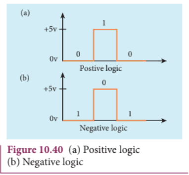
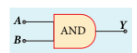
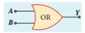
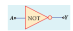
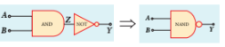
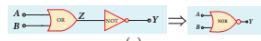
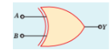

## 10.5 DIGITAL ELECTRONICS

Digital Electronics is the branch of electronics which deals with digital signals. It is increasingly used in numerous applications ranging from high end processor circuits to miniature circuits for signal processing, communication etc. Digital signals are preferred over analog signals due to their better performance, accuracy, speed, flexibility and immunity to noise.

### 10.5.1 Analog and Digital Signals

There are 2 different types of signals used in Electronics. They are (i) Analog signals and (ii) Digital signals. An analog signal is a continuously varying voltage or current with respect to time. Such signals are employed in rectifying circuits and transistor amplifier circuits.

Digital signals are signals which contain only discrete values of voltages. Digital signals need two states: switch ON and OFF. ON is considered as one state and OFF is considered as the other state. It can also be defined as high ON or low OFF) state, closed ON) or open OFF).These high and low states are defined using binary numbers 1 or 0 in Boolean Algebra. The state 1 represents the terms: circuit on, high voltage, a closed switch. Similarly a 0 state represents circuit off, low voltage or an open switch.

**Positive and Negative Logic**

In digital systems, there exists two voltage levels: 5V (high) and 0V (low). In a positive logic system; a binary 1 stands for 5V and 0 stands for 0V while in negative logic system, 1 stands for 0V and 0 stands for 5V as shown in Figure 10.40.

### 10.5.2 Logic gates

A logic gate is an electronic circuit whose function is based on digital signals. They are binary in nature. The logic gates are considered as the basic building blocks of most of the digital systems. They have one output with one or more inputs. There are three types of basic logic gates: AND, OR, and NOT. The other logic gates are Ex- OR, NAND, and NOR. They can be constructed from the basic logic gates.

Digital electronics deals with logical operations. The variables are called logical variables. The operators like logical addition \((+)\) and logical multiplication \((\cdot)\) are called logical operators. When the logical operators \((+,\ldots)\) operate on logical variables (A,B), they give logical constant (Y). The equation that represents this operation is called logical statement.

For example,

Logical operator: \(^+\) Logical variable: \(A,B\) Logical constant: Y Logical statement: \(Y = A + B\)

The possible combinations of inputs and the corresponding output are given in the form of a table called truth table. The circuits which perform the basic logical operations such as logical addition, multiplication and inversion are discussed below.

**AND gate**

**Circuit symbol**

The circuit symbol of a two input AND gate is shown in Figure 10.41(a). \(A\) and \(B\) are inputs and \(Y\) is the output. It is a logic gate and hence \(A,B\) and \(Y\) can have the value of either 1 or 0.

| Inputs |  | Output |
| --- | --- | --- |
| **A** | **B** | **Y = A . B** |
| 0 | 0 | 0 |
| 0 | 1 | 0 |
| 1 | 0 | 0 |
| 1 | 1 | 1 |

**(b)**

**Figure 10.41** (a) Two input AND gate
(b) Truth table

**Boolean Equation***

\[ Y = A.B \]

This performs logical multiplication and is different from arithmetic multiplication.

**Logic Operation**

The output of AND gate is high (1) only when all inputs are high (1). In other cases, the output is low (0). This is shown in the truth table (Figure 10.41 (b)).

**OR Gate**

**Circuit Symbol**
The circuit symbol of a two-input OR gate is shown in Figure 10.42 (a). A and B are inputs and Y is the output.

**(a)**

| Inputs | Output |
|---|---|---|
| A | B | Y = A + B |
| 0 | 0 | 0 |
| 0 | 1 | 1 |
| 1 | 0 | 1 |
| 1 | 1 | 1 |

**(b**

**Figure 10.42 (a) Two-input OR Gate (b) Truth Table**

**Boolean Equation**

\[ Y = A + B \]

This performs logical addition and is different from arithmetic addition.

**Logic Operation**

The output of OR gate is high (logic level 1) when any one or both of the inputs are high. The truth table of OR gate is shown in Figure 10.42 (b).

**NOT Gate**

**Circuit Symbol**

The circuit symbol of NOT gate is shown in Figure 10.43 (a). A is the input and Y is the output.

**(a)**

| Input | Output |
|---|---|
| A | Y = \(\overline{A}\) |
| 0 | 1 |
| 1 | 0 |

**b**

**Figure 10.43 (a) NOT Gate (b) Truth Table**

**Boolean Equation**

\[ Y = \overline{A} \]

**Logic Operation**

The output is the complement of the input. This is denoted by an overline. It is also called an inverter. When input A is 0, output Y is 1, i.e., it is inverted. This is shown in the truth table of NOT gate in Figure 10.43 (b).

**NAND Gate**

**Circuit Symbol**

The circuit symbol of NAND gate is shown in Figure 10.44 (a). A and B are inputs and Y is the output.

**(a)**

| Inputs | Output (AND) | Output (NAND) |
|---|---|---|---|
| A | B | Z = A.B | Y =\( \overline{A.B}\) |
| 0 | 0 | 0 | 1 |
| 0 | 1 | 0 | 1 |
| 1 | 0 | 0 | 1 |
| 1 | 1 | 1 | 0 |

**(b)**

**Figure 10.44 (a) Two-input NAND Gate (b) Truth Table**

**Boolean Equation**

\[ Y = \overline{A.B} \]

**Logic Operation**

Output Y is the complement of AND operation. The circuit consists of an AND gate followed by a NOT gate. Hence it is referred to as NAND. Only when all inputs are high, the output is at logic level 0. For other cases, the output is high (logic level 1). The truth table of NAND gate is shown in Figure 10.44 (b).

**NOR Gate**

**Circuit Symbol**

**(a)**

| Inputs | Output (OR) | Output (NOR) |
|---|---|---|---|
| A | B | Z = A+B | Y = \(\overline{A+B}\) |
| 0 | 0 | 0 | 1 |
| 0 | 1 | 1 | 0 |
| 1 | 0 | 1 | 0 |
| 1 | 1 | 1 | 0 |

**(b)**

**Figure 10.45 (a) NOR Gate (b) Truth Table**

**Boolean Equation**

\[ Y = \overline{A+B} \]

**Logic Operation**

Output Y is the complement of OR operation (A OR B). The circuit consists of an OR gate followed by a NOT gate. This is referred to as NOR. When all inputs are low, the output is high. For other combinations of inputs, the output is low. The truth table of NOR gate is shown in Figure 10.45 (b).

**EX-OR Gate**

**Circuit Symbol**

The circuit symbol of EX-OR gate is shown in Figure 10.46 (a). A and B are inputs and Y is the output. EX-OR operation is denoted by \( \oplus \).

**(a)**

| Inputs | Output (EX-OR) |
|---|---|---|
| A | B | Y = A \(\oplus B\) |
| 0 | 0 | 0 |
| 0 | 1 | 1 |
| 1 | 0 | 1 |
| 1 | 1 | 0 |

**(ஆ)**

**Figure 10.46 (a) EX-OR Gate (b) Truth Table**

**Boolean Equation**

\[ Y = A \oplus B = A.\overline{B} + \overline{A}.B \]

**Logic Operation**

If any one of the two inputs is high, the output is high. For more than two inputs in an EX-OR gate, the output is high when an odd number of inputs are high. The truth table of EX-OR gate is shown in Figure 10.46 (b).

>**Example 10.9**
>
>In the following circuit, if all three inputs A, B and C are initially 0 and then 1, what is the output Y?
>
>
>
>**Solution**
>
>| A | B | C | X = A.B | Y = X.C |
>|---|---|---|---|---|
>| 0 | 0 | 0 | 0 | 0 |
>| 1 | 1 | 1 | 1 | 1 |

>**Example 10.10**
>
>Write the Boolean equation for output Y for the combination of logic gates given below with inputs A and B.
>
>
>**Solution**
>
>1st AND gate output: \( A.B \)
>
>2nd AND gate output: \( \overline{A}.\overline{B} \)
>
>OR gate output: \( Y = A.B + \overline{A}.\overline{B} \)
