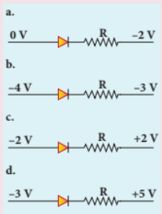
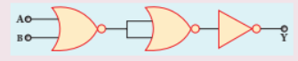
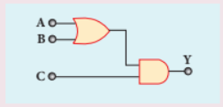

## Evaluation

### I. Choose the correct answer

1. The voltage barrier of a silicon diode is (approximately)

a) 0.7 V 

b) 0.3V 

c) 2.0 V 

d) 2.2V

2. When a small amount of antimony (Sb) is added to germanium crystal (AIPMT 2011)

a) it becomes p-type semiconductor

b) antimony becomes an acceptor atom

c) there will be more free electrons than holes in the semiconductor

d) its resistance increases

3. In an unbiased p-n junction, the majority charge carriers (i.e., holes) in the p-region diffuse to the n-region because

a) of the voltage difference across the p-n junction

b) of higher hole concentration in p-region than in n-region

c) of attraction of free electrons in n-region

d) all of the above

4. In a half wave rectifier, the rectified voltage is applied to a load resistor, during which part of the input signal variation does the load current flow?

a) \( 0^\circ-90^\circ \)

 b) \( 90^\circ-180^\circ \)
 
  c) \( 0^\circ-180^\circ \) 
  
  d) \( 0^\circ-360^\circ \)

5. What is the main application of Zener diode?

a) Rectifier 

b) Amplifier

 c) Oscillator
 
  d) Voltage regulator

6. Solar cell operates on the principle of

a) diffusion 

b) recombination

 c) photovoltaic effect
 
  d) carrier flow

7. Light is emitted in Light Emitting Diode due to

a) recombination of charge carriers

 b) light reflection due to operation of lenses

  c) amplification of light on the junction
  
   d) very high current conductivity

8. The voltage barrier in a p-n junction depends on

i) type of semiconductor material

ii) amount of doping

iii) temperature

Which of the following is correct? (NEET)

a) (i) and (ii) 

b) (ii) only 

c) (ii) and (iii) 

d) (i), (ii) and (iii)

9. For continuous oscillations in an oscillator

a) positive feedback must be present

b) feedback gain must be unity

c) phase shift must be zero or \( 2\pi \)

d) all of the above

10. If the input of a NOT gate is A = 1011, then its output is

a) 0100 b) 1000 c) 1100 d) 0011

11. Which of the following represents a forward biased diode? (NEET)

12. The given electrical network is
equivalent to

a) AND gate

 b) OR gate

c) NOR gate 

d) NOT gate

13. The output of the following circuit is 1
when the input ABC is

a) 101 

b) 100

c) 110 

d) 010

14. The variation of frequency of carrier
wave with respect to the amplitude of
the modulating signal is called

a) Amplitude modulation

b) Frequency modulation

c) Phase modulation

d) Pulse width modulation

15. The frequency range of 3 MHz to
30 MHz is used for

a) Ground wave propagation

b) Space wave propagation

c) Sky wave propagation

d) Satellite communication

### Answers

1. a 2. c 3. b 4. c 5. d 6. c 7. a 8. d 9. d 10. a 11. a 12. c 13. a 14. b 15. c

### II. Short answer questions

1. Define forbidden energy gap.

2. Why does the temperature coefficient of resistance of a semiconductor have a negative sign?

3. What is meant by doping?

4. Distinguish between intrinsic and extrinsic semiconductors.

5. Why is a diode called a "unidirectional device"?

6. What is meant by leakage current in a diode?

7. Draw the input and output waveforms of a full wave rectifier.

8. Distinguish between avalanche breakdown and Zener breakdown.

9. State the Barkhausen conditions for oscillations.

10. Explain current flow in an NPN transistor.

11. What are logic gates?

12. Explain the need for a feedback circuit in a transistor amplifier.

13. Write a short note on diffusion current across a PN junction.

14. What is biasing? What are its types?

15. Even though a transistor is made of the same type of semiconductor material, why can't the emitter and collector be interchanged?

16. Why are NOR and NAND gates called universal gates?

17. Define voltage barrier.

18. What is rectification?

19. List the applications of Light Emitting Diode.

20. State the principle of solar cells.

21. What are integrated circuits?

22. Define modulation.

23. Define the bandwidth of a transmission system.

24. Define skip distance.

25. State the uses of radar.

26. What is mobile communication?

27. Explain centre frequency or resting frequency in frequency modulation.

28. What does RADAR stand for?

29. Prove that optical fibre communication is better among various types of communication.

### III. Long answer questions

1. Write in detail about the formation of n-type extrinsic semiconductors.

2. Explain the formation of depletion region and voltage barrier in a PN junction diode.

3. Draw the circuit diagram of a half wave rectifier and explain its operation.

4. Explain the construction and working of a full wave rectifier.

5. What is Light Emitting Diode? Explain its working principle with a diagram.

6. Write a note on photodiode.

7. Describe the working principle of a solar cell. Mention its applications.

8. Draw the common emitter transistor characteristics and give the important points of input and output characteristics.

9. Explain how a transistor acts as a switch.

10. Explain how a transistor acts as an amplifier with a clear circuit diagram. Draw the input and output waveforms.

11. For the following logic gates, give the circuit symbol, logic operation, truth table and Boolean equation: i) AND gate ii) OR gate iii) NOT gate iv) NAND gate v) NOR gate vi) EX-OR gate.

12. State and prove De Morgan's first and second theorems.

13. Explain amplitude modulation with necessary diagrams.

14. Describe the basic elements of a communication system with a necessary block diagram.

15. Explain ground wave propagation and space wave propagation of electromagnetic waves through space.

16. List the advantages and disadvantages of frequency modulation.

17. What is satellite communication? What are its applications?

### IV. Numerical problems

1. Calculate the current flowing through the resistor \( R_1 \) in the given circuit with two ideal diodes connected as shown in the figure. [Answer: 2.5 A]

2. In the following figure, four silicon diodes and a 10 \( \Omega \) resistor are connected. If each diode has a resistance of 1 \( \Omega \), calculate the current flowing through the 10 \( \Omega \) resistor. [Answer: 0.13 A]

3. If \( V_{CEsat} = 0.2 \ \mathrm{V} \) and \( \beta = 50 \), calculate the minimum base current (\( I_B \)) required to drive the transistor in the figure to saturation. [Answer: 56 \( \mu A \)]

4. For the BJT in the circuit shown in the figure, current gain \( \beta = 50 \). For an emitter-base voltage difference of \( V_{EB} = 600 \ \mathrm{mV} \), calculate the emitter-collector voltage difference \( V_{EC} \) in volts. [Answer: 2 V]

5. Find the currents flowing through the 3 \( \Omega \) and 4 \( \Omega \) resistors in the following circuit. Assume \( D_1 \) and \( D_2 \) are ideal diodes. [Answer: 0 and 2A]

6. Prove the following Boolean equations using laws and theorems of Boolean algebra.

i) \( (A+B)(A+B) = A \)

ii) \( A(A+B) = AB \)

iii) \( (A+B)(A+C) = A+BC \)

7. Verify the given Boolean equation using truth table: \( A + AB = A + B \).

8. In the following voltage regulator circuit, a Zener diode with breakdown voltage 15 V is used. Find the current through the load resistor, total current, and current through the diode. Assume ideal diode. [Answer: 5mA; 20 mA; 15 mA]

9. For the given circuit, give the Boolean equation for output Y and its truth table. [Answer: \( Y = (AB)+(A+B) \)]

### Internet Activity

**Subject:** Electronics and Communication Systems

**Objective:** Through this activity, students will (i) create logic gates (ii) verify the truth tables of AND, OR, NOT, EX-OR, NAND and NOR gates.

**Title:** Logic Gates

**Procedure:**

- Open the browser and type "circuitverse.org/simulator" in the address bar.
- From circuit elements, click the 'Gates' tab. Select the gate you want to verify and drag it to the workspace using the mouse.
- Create the necessary connecting wires for the circuit by dragging the nodes of the logic gate using the mouse.
- Click the 'input' tab and drag the 'input tool' from there and place it on the two inputs.
- Click the 'output' tab and drag the 'output tool' or 'digital LED' from there and place it on the output terminal.
- Change the inputs by clicking the 'input tool'. Verify the truth tables of AND, OR, NOT, EX-OR, NAND and NOR gates. You can also verify De Morgan's two laws if you wish.

**Note:**

If you wish to save the circuits you create online, login using your email address.

**Link:** https://circuitverse.org/simulator

*For practice only.*

*Requires Flash Player or Java Script if necessary.*