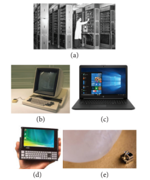
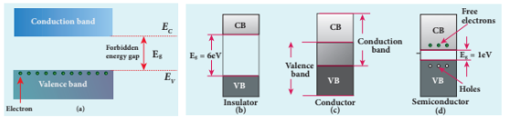

## 10.1 INTRODUCTION

Electronics has become a part of our daily life. All gadgets like mobile phones, computers, televisions, music systems etc work on the electronic principles. Electronic circuits are used to perform various operations in devices like air conditioners, microwave oven, dish washers and washing machines. Besides this, its applications are widespread in all fields like communication systems, medical diagnosis and treatments and even handling money through ATMs.

**Evolution of Electronics:**

The history of electronics began with the invention of vacuum diode by J.A. Fleming in 1897. This was followed by a vacuum triode implemented by Lee De Forest to control electrical signals. This led to the introduction of tetrode and pentode tubes.

Subsequently, the transistor era began with the invention of bipolar junction transistor by Bardeen, Brattain and Shockley in 1948 for which they received Nobel prize in 1956. The emergence of germanium and silicon semiconductor materials made this transistor gain popularity, in turn its application in different electronic circuits.

The following years witnessed the invention of the integrated circuits (ICs) that helped to integrate the entire electronic circuit on a single chip which is small in size and cost- effective. Since 1958 ICs capable of holding several thousand electronic components on a single chip such as smallscale, medium- scale, large- scale, and verylarge scale integration started coming into existence. Digital integrated circuits became another robust IC development that enhanced the architecture of computers. All these radical changes led to the introduction of microprocessor in 1969 by Intel.

The electronics revolution, in due course of time, accelerated the computer revolution. Now the world is on its way towards small particles of nano- size, far too small to see. This helps in the miniaturization to an unimaginable size. A room- size computer during its invention has now emerged as a laptop, palmtop, iPad, etc. In the recent past, IBM has released the smallest computer whose size is comparable to the tip of the rice grain, measuring just \(0.33\mathrm{mm}\) on each side.

Electronics is the branch of physics which incorporates technology to design electrical circuits using transistors and microchips. It depicts the behaviour and movement of electrons and holes in a semiconductor, electrons and ions in vacuum or gas. Electronics deals with electrical circuits that involve active components such as transistors, diodes, integrated circuits and sensors, associated with the passive components like resistors, inductors, capacitors and transformers.

This chapter deals with semiconductor devices like \(p - n\) junction diodes, bipolar junction transistors and logic circuits.

>**Note**
>
>**Passive components:** components that cannot generate power in a circuit. Active components: components that can generate power in a circuit.

**Figure 10.1** Evolution of computers

(a) One of the world’s first computers

(b) Desktop computer

 (c) Laptop computer

(d) Palmtop computer

 (e) Smallest computer

by IBM kept near the tip of the rice grain

>**DO YOU KNOW**
>
>The world's first computer ENIAC' was invented by J.Presper Eckert and John Mauchly at the University of Pennsylvania. The construction work started in 1943 and got over in 1946. It occupied an area of around 1800 square feet. It had 18,000 vacuum tubes and it weighed around 50 tons.

### 10.1.1 Energy band diagram of solids

In an isolated atom, the electronic energy levels are widely separated and are far apart and the energy of the electron is decided by the orbit in which it revolves around the nucleus. However, in the case of a solid, the atoms are closely spaced and hence the electrons in the outermost energy levels of nearby atoms influence each other. This changes the nature of the electron motion in a solid from that in an isolated atom to a large extent.

The valence electrons in an atom are responsible for the bonding nature. Let us consider an atom with one electron in the outermost orbit. It means that the number of valence electrons is one. When two such atoms are brought close to each other, the valence orbitals are split up into two. Similarly the unoccupied orbitals of each atom will also split up into two. The electrons have the choice of choosing any one of the orbitals as the energy of both the orbitals is the same. When the third atom of the same element is brought to this system, the valence orbitals of all the three atoms are split into three. The unoccupied orbitals also will split into three.

In reality, a solid is made up of millions of atoms. When millions of atoms are brought close to each other, the valence orbitals and the unoccupied orbitals are split according to the number of atoms. In this case, the

energy levels will be closely spaced and will be difficult to differentiate the orbitals of one atom from the other and they look like a band as shown in Figure 10.2. This band of very large number of closely spaced energy levels in a very small energy range is known as energy band.

The energy band formed due to the valence orbitals is called valence band (VB) and that formed due to the unoccupied orbitals to which electrons can jump when energised is called the conduction band (CB). The energy gap between the valence band and the conduction band is called forbidden energy gap \((E_{g})\) .Electrons cannot exist in the forbidden energy gap.

A simple pictorial representation of the valence band and conduction band is shown in Figure 10.2(a). \(E_{V}\) represents the maximum energy of the valence band and \(E_{c}\) represents minimum energy of the conduction band. The forbidden energy gap, \(E_{g} = E_{c} - E_{V}\) . We know that the Coulomb force of attraction between the orbiting electron and the nucleus is inversely proportional to the distance between them. Therefore, the electrons in the orbitals closer to the nucleus are strongly bound to it. Hence, the electrons closer to nucleus require a lot of energy to be excited. The electrons in the valence band are loosely bound to the nucleus and can be easily excited to become free electrons.

**Figure 10.2** (a) Schematic representation of valence band, conduction band and forbidden
energy gap. Energy band structure of (b) Insulator (c) Conductor (d) Semiconductor

### 10.1.2 Classification of materials

The classification of solids into insulators, metals, and semiconductors can be explained with the help of the energy band diagram.

**i) Insulators**

The energy band structure of insulators is shown in Figure 10.2(b). The valence band and the conduction band are separated by a large energy gap. The forbidden energy gap is approximately \(6\mathrm{eV}\) in insulators. The gap is very large that electrons from valence band cannot move into conduction band even on the application of strong external electric field or the increase in temperature. Therefore, the electrical conduction is not possible as the free electrons are not available for conduction and hence these materials are called insulators. Its resistivity is in the range of \(10^{11} - 10^{19}\Omega \mathrm{m}\) .

**ii) Conductors**

In conductors, the valence band and conduction band overlap as shown in Figure 10.2(c). Hence, electrons can move freely into the conduction band which results in a large number of free electrons available in the conduction band. Therefore, conduction becomes possible even at low temperatures. The application of electric field provides sufficient energy to the electrons to drift in a particular direction to constitute a current. For conductors, the resistivity value lies between \(10^{- 2}\Omega \mathrm{m}\) and \(10^{- 8}\Omega \mathrm{m}\) .

**iii) Semiconductors**

In semiconductors, there exists a narrow forbidden energy gap \(\left(E_{g}< 3eV\right)\) between the valence band and the conduction band(Figure 10.2(d)). At a finite temperature, thermal agitations in the solid can break the covalent bond between the atoms (covalent bond is formed due to the sharing of electrons to attain stable electronic configuration). This releases some electrons from valence band to conduction band. Since free electrons are small in number, the conductivity of the semiconductors is not as high as that of the conductors. The resistivity value of semiconductors is from \(10^{- 5}\Omega \mathrm{m}\) to \(10^{6}\Omega \mathrm{m}\) .

>**Note**
>
>In semiconductors, electrons in the valence band are bound electrons which cannot move. Hence, they cannot contribute for conduction.

When the temperature is increased further, more number of electrons are promoted to the conduction band and they increase the conduction. Thus, we can say that the electrical conduction increases with the increase in temperature. In other words, resistance decreases with increase in temperature. Hence, semiconductors are said to have negative temperature coefficient of resistance. The most important commonly used elemental semiconducting materials are silicon (Si) and germanium (Ge). The values of forbidden energy gap for Si and Ge at room temperature are \(1.1\mathrm{eV}\) and \(0.7\mathrm{eV}\) respectively.
