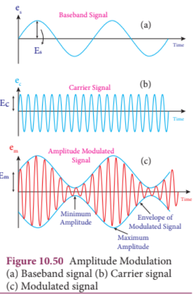
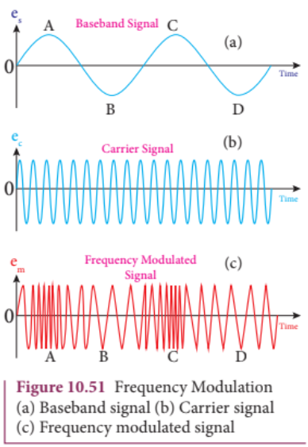

## 10.9 Modulation

For short distances, no complex techniques are required to transmit information. The energy of the information signal is sufficient to transmit directly. However, if information in the audio frequency range (20 to 20,000 Hz) is to be transmitted over long distances around the world, some techniques are required to transmit the information without any loss. For long-distance transmission, the low-frequency baseband signal (input signal) is superimposed on a high-frequency radio signal through a process called modulation.

Therefore, in the modulation process, a high-frequency carrier signal (radio signal) is used to carry the baseband signal. Since the frequency of the carrier signal is very high, it can be transmitted over long distances with less attenuation. Typically, the carrier signal is a sine wave signal.

A sinusoidal carrier wave can be represented as \( e_c = E_c \sin (2\pi \nu_c t + \phi) \), where \( E_c \) is the amplitude, \( \nu_c \) is the frequency, and \( \phi \) is the initial phase of the carrier wave at time t.

The three characteristics of the carrier signal can be modified by the baseband signal during the modulation process: amplitude, frequency, and phase of the carrier signal. Accordingly, we get:

(i) Amplitude Modulation

(ii) Frequency Modulation

(iii) Phase Modulation

### 10.9.1 Amplitude Modulation (AM)

If the amplitude of the carrier signal is varied according to the instantaneous amplitude of the baseband signal, it is called amplitude modulation. Here, the frequency and phase of the carrier signal remain unchanged. Amplitude modulation is used in radio and television broadcasting.

Figure 10.50(a) shows the baseband signal carrying information. Figure 10.50(b) shows the high-frequency carrier signal, and Figure 10.50(c) shows the amplitude modulated signal.

We can see that the amplitude of the carrier wave changes according to the voltage of the baseband signal.

**Advantages of Amplitude Modulation**

i) Easy transmission and reception

ii) Less bandwidth requirement

iii) Low cost

**Limitations of Amplitude Modulation**

i) High noise level

ii) Low efficiency

iii) Less operating range

### 10.9.2 Frequency Modulation (FM)

In frequency modulation, the frequency of the carrier signal changes according to the instantaneous amplitude of the baseband signal. Here, the amplitude and phase of the carrier signal remain unchanged.

The increase in voltage of the baseband signal increases the frequency of the carrier signal and vice versa. As shown in Figure 10.51, this causes compressions and rarefactions in the frequency spectrum of the modulated wave. Loud signals create compressions and weak signals create rarefactions.

When the voltage of the baseband signal is zero (when there is no input signal), there is no change in the frequency of the carrier wave. It is at its normal frequency. This is called the centre or resting frequency. In practice, this is the frequency allocated for FM broadcasting.

**Advantages of Frequency Modulation**

i) In FM, noise is very low, which increases the signal-to-noise ratio.

ii) Efficiency and range are very high.

iii) Since the entire transmitted power is useful, the transmission efficiency is very high.

iv) FM bandwidth covers the entire audible frequency range. Therefore, FM radio has better quality compared to AM radio.

 **Limitations of Frequency Modulation**

i) Frequency modulation requires very wide bandwidth.

ii) FM transmitters and receivers are very complex and expensive.

iii) Compared to AM, the reception range is less in FM.

### 10.9.3 Phase Modulation (PM)

In phase modulation, the instantaneous amplitude of the baseband signal changes the phase of the carrier signal, while the amplitude and frequency of the carrier wave do not change. This modulation is used to generate frequency modulated signals. It is similar to frequency modulation, but instead of changing the frequency of the carrier wave, the phase of the carrier wave is changed.
