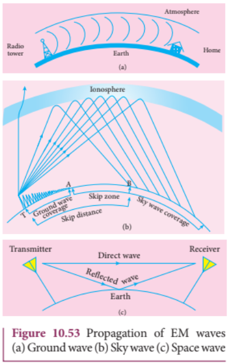
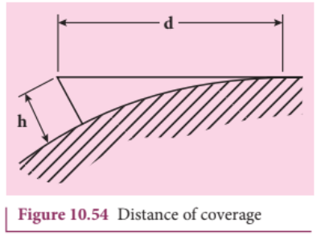

## 10.11 Propagation of Electromagnetic Waves

The electromagnetic waves transmitted by the transmitter travel in three different ways depending on their frequency range:

- Ground wave propagation (or) Surface wave propagation (approximately 2 kHz to 2 MHz)
- Sky wave propagation (or) Ionospheric propagation (approximately 3 MHz to 30 MHz)
- Space wave propagation (approximately 30 MHz to 400 GHz)

**i) Ground wave propagation (or) surface wave propagation**

When electromagnetic waves transmitted by the transmitter travel along the earth's surface to reach the receiver, this propagation is called ground wave propagation. The corresponding waves are called ground waves or surface waves. Its illustration is shown in Figure 10.53 (a). Here, both the transmitting and receiving antennas must be close to the earth.

This is mainly used in local broadcasting, radio-assisted maritime navigation, ship-to-ship and ship-to-shore communication, and mobile phone communication.

**ii) Sky wave propagation (or) ionospheric propagation**

Electromagnetic waves transmitted from an antenna at a high angle upwards are reflected back to the earth by the ionosphere. This type of propagation is called sky wave propagation or ionospheric propagation. The corresponding waves are called sky waves (Figure 10.53 (b)).

The ionosphere acts as a reflecting surface. It starts approximately at 50 km and extends up to 400 km above the earth's surface. Due to the absorption of high-energy radiation such as ultraviolet rays from the sun, cosmic rays and \( \alpha, \beta \) rays, the air molecules in the ionosphere are ionized. This creates charged ions, and those ions create a medium that reflects radio waves or communication waves (in the permitted frequency range) back to the earth. The phenomenon of radio waves returning to the earth is total internal reflection.

As the angle of incidence in the ionosphere increases, the sky wave reaches the ground area far from the transmitter. As this angle of incidence decreases, the sky wave begins to approach the ground area near the transmitter. As the angle of incidence decreases further, the radio waves penetrate the ionosphere and escape. For a specific angle of incidence, the receiving point (B) is found at a minimum distance from the transmitter. The minimum distance between the transmitter and the point where the sky wave reaches the ground is called the skip distance.

As we move away from the transmitter, the reception of the ground wave begins to decrease. At a certain point (A), there is no reception of the ground wave. A specific zone (between points A and B) where neither ground wave nor sky wave electromagnetic waves are received is called the skip zone or skip region. This is shown in Figure 10.53 (b).

**iii) Space wave propagation**

The process of transmitting and receiving information signals through space is called space wave propagation (Figure 10.53 (c)). Electromagnetic waves with very high frequencies above 30 MHz are called space waves. These waves travel in a straight line from the transmitter to the receiver. Hence, this is used for line-of-sight (LOS) communication.

Television broadcasting, satellite communication and radar communication systems are based on space wave propagation.

The range or distance of propagation (d) depends on the height of the antenna (h). The equation is:

\[ d = \sqrt{2Rh} \qquad (10.9) \]

where R is the radius of the earth. The propagation distance is illustrated in Figure 10.54.

>**Example 10.12**
>
>The height of a transmitting antenna is 40 m and the height of a receiving antenna is 30 m. What is the maximum line-of-sight communication distance between them? The radius of the earth is \( 6.4 \times 10^6 \ \mathrm{m} \).
>
>**Solution:**
>
>The total distance d between the transmitting and receiving antennas is equal to the sum of the individual propagation distances.
>
>$$\begin{aligned} d &= d_1 + d_2 \\ &= \sqrt{2Rh_1} + \sqrt{2Rh_2} \\ &= \sqrt{2R}(\sqrt{h_1} + \sqrt{h_2}) \\ &= \sqrt{2 \times 6.4 \times 10^6} \times (\sqrt{40} + \sqrt{30}) \\ &= 16 \times 10^2 \sqrt{5} \times (6.32 + 5.48) \\ &= 42217\text{ m} = 42.217\text{ km} \end{aligned}$$
