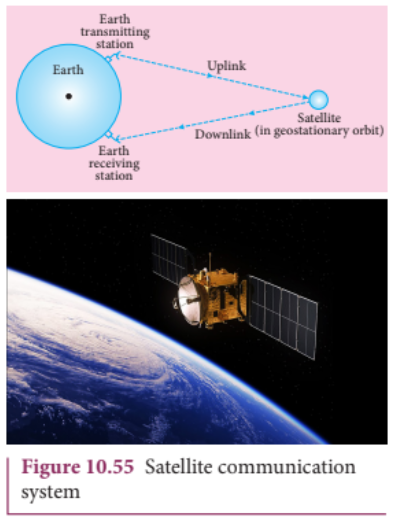
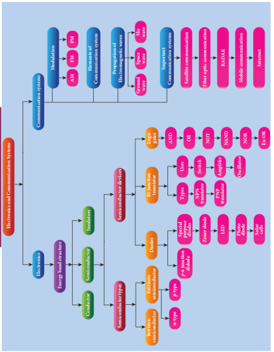

## 10.12 Some Important Communication Systems

Various types of communication systems exist in practice according to requirements. Here, some important communication systems are introduced and their applications are briefly discussed.

**Figure 10.55 Satellite communication system**

### 10.12.1 Satellite and Satellite Communication

The satellite communication is a mode
of transmission of the signal between
transmitter and receiver via satellite. The
message signal from the Earth station
is transmitted to the satellite on board
via an uplink (frequency band 6 GHz),
amplified by a transponder and then
retransmitted to another Earth station
via a downlink (frequency band 4 GHz)
(Figure 10.55).

**Applications**

Satellites are classified into different
types based on their applications.

**i) Weather satellite:** These are used to monitor the earth's weather and surface temperature. By measuring the mass of clouds, these satellites help us predict rain, dangerous cyclones and storms.

**ii) Communication satellite:** These are used to broadcast television, radio, and internet signals. Several satellites are used to broadcast worldwide television.

**iii) Navigation satellite:** These engage in locating the geographic position of ships, aircraft or any other object.

### 10.12.2 Fibre Optic Communication

Fibre optic communication is the method of transmitting information through optical fibres from one place to another using light pulses. It operates on the principle of total internal reflection.

**Figure 10.56 Optical fibres**

**Applications**

Optical fibre system has various applications: international communication, intercity communication, data links, factory and traffic control, and military applications.

**Advantages**

i) Optical fibres are very cheap. They are lighter than copper wires.

ii) This system has very high bandwidth, meaning it has high information-carrying capacity.

iii) Optical fibre system is not affected by electrical interference.

iv) Optical fibre is cheaper than copper wires.

**Disadvantages**

i) Optical fibre wires are more fragile compared to copper wires.

ii) Its technology is expensive.

### 10.12.3 Radar and Applications

RADAR is an acronym for RAdio Detection And Ranging. It is one of the important applications of communication systems. It is used to detect distant objects such as vehicles, ships, spacecraft and to know their location. Radar helps us detect the angle, distance and direction of objects that are not visible to our eyes.

Radar uses electromagnetic waves for communication. First, the electromagnetic signal is transmitted in all directions in space through an antenna. The signal that hits a specific target is reflected and retransmitted in all directions. This reflected signal (echo) is received by the radar antenna and delivered to the receiver.

Then it is processed and amplified to determine the geographic statistics of the object. The distance of the targets is determined from the time taken for the signal to go from the radar to the target and return.

**Applications**

Radars are used in many fields:

i) In the military, they are used to locate and detect targets.

ii) They are used in navigation systems such as sea search, air search and missile guidance systems by ship.

iii) Radar is used in weather monitoring to measure rainfall rate and wind speed.

iv) In emergency situations, it helps locate and rescue people.

### 10.12.4 Mobile Communication

Mobile communication is used to communicate with others in different locations without the use of any physical connection like wires or cables. It allows the transmission over a wide range of area without the use of the physical link. It enables the people to communicate with each other regardless of a particular location like office, house etc. It also provides communication access to remote areas.

It provides the facility of roaming – that is, the user may move from one place to another without the need of compromising on the communication. The maintenance and cost of installation of this communication network are also cheap.

**Applications**

i) It is used for personal communication and cellular phones offer voice and data connectivity with high speed.

ii) Transmission of news across the globe is done within a few seconds.

iii) Through the Internet of Things (IoT), it is possible to control various devices through one device. Example: Using a mobile phone, all household appliances can be operated.

iv) It enables smart classrooms, online availability of notes, monitoring student activities etc. in the field of education.

### 10.12.5 Internet

Internet is a fast growing technology in the field of communication system with multifaceted tools. It provides new ways and means to interact and connect with people. Internet is the largest computer network recognized globally that connects millions of people through computers. It finds extensive applications in  all walks of life.

i) **Search engine:** The search engine
is basically a web-based service tool used
to search for information on World Wide
Web.

ii) **Communication:** It helps millions
of people to connect with the use of social
networking: emails, instant messaging
services and social networking tools.

iii) **E-commerce:** Buying and selling
of goods and services, transfer of funds
are done over an electronic network..

### Summary

- Based on energy bands in solids, they are classified as conductors, insulators and semiconductors.
- In n-type semiconductor, electrons are majority carriers and holes are minority carriers.
- In p-type semiconductor, holes are majority carriers and electrons are minority carriers.
- The thin region near the junction devoid of charges (free electrons and holes) is called the depletion region.
- When a PN junction diode is forward biased, the width of the depletion region decreases and it conducts current.
- When a PN junction diode is reverse biased, it acts as an open switch and does not conduct current. The width of the depletion region increases.
- A forward biased PN junction diode acts as a rectifier. The process of converting alternating voltage or alternating current into direct voltage or direct current is called rectification.
- Half wave rectifier rectifies only the half cycle of the input signal and produces pulsating DC output.
- Full wave rectifier rectifies both half cycles of the input.
- When a very strong electric field is applied, Zener breakdown occurs in a highly doped PN junction diode.
- Avalanche breakdown occurs in a lightly doped and very wide depletion region. This occurs when the covalent bond is broken by thermally generated minority carriers.
- Zener diode is a highly doped pn junction diode that operates in reverse bias.
- Light Emitting Diode is a forward biased semiconductor device that emits visible or invisible light. When majority carriers recombine with minority carriers entering their region, energy is emitted in the form of photons.
- A PN junction diode that converts light signals into electrical signals is called a photodiode.
- When a sufficiently energetic photon strikes the diode, it creates an electron-hole pair. Before these electrons and holes recombine, they are moved across the junction by the electric field created by the reverse bias, thereby producing photocurrent.
- Solar cell is a device that directly converts light energy into electrical energy. It operates on the principle of photovoltaic effect.
- Bipolar Junction Transistor (BJT) is a semiconductor device. There are two types: NPN and PNP.
- A BJT has three configurations: common base, common emitter and common collector.
- In common base configuration, current gain \( \alpha \) is the ratio of collector current to emitter current.
- In common emitter configuration, current gain \( \beta \) is the ratio of collector current to base current.
- A transistor in common emitter configuration acts as a switch.
- A transistor in common emitter configuration acts as an amplifier. Moreover, there is a \( 180^\circ \) phase difference between the amplified output signal and the input signal.
- A transistor amplifier with voltage divider and feedback network acts as an oscillator.
- Logic gates are logic circuits that provide output according to combinations of inputs.
- According to De Morgan's first theorem, the complement of the sum of logic inputs is equal to the product of their complements.
- According to De Morgan's second theorem, the complement of the product of inputs is equal to the sum of their complements.
- The basic elements required to transmit and receive a signal using electromagnetic waves over long distance are: transducer, amplifier, carrier signal, modulator, power amplifier, transmission medium, transmitting and receiving antenna, demodulator, separator.
- For long distance transmission, the baseband signal is modulated with the carrier wave.
- If the amplitude of the carrier signal is varied according to the instantaneous amplitude of the baseband signal, it is called amplitude modulation.
- In frequency modulation, the frequency of the carrier signal changes according to the instantaneous amplitude of the baseband signal.
- In phase modulation, the instantaneous amplitude of the baseband signal changes the phase of the carrier signal, while the amplitude and frequency of the carrier wave do not change.
- When electromagnetic waves transmitted by the transmitter travel along the earth's surface to reach the receiver, this propagation is called ground wave propagation.
- Electromagnetic waves transmitted from an antenna at a high angle upwards are reflected back to the earth by the ionosphere. This type of propagation is called sky wave propagation.
- The process of transmitting and receiving information signals through space is called space wave propagation.
- Satellite communication is a type of communication that exchanges signals between transmitter and receiver via satellite.
- Fibre optic communication is the method of transmitting information through optical fibres from one place to another using light pulses.
- RADAR is an acronym for RAdio Detection And Ranging. It is one of the important applications of communication systems.
- Mobile communication helps people in different places to communicate without any connections like wires or cables.

### Concept Map

