## 10.4 THE BIPOLAR JUNCTION TRANSISTOR [BJT]

**Introduction**
In 1951, William Schockley invented the modern version of transistor. It is a semiconductor device that led to a technological revolution in the twentieth century. The heat loss in transistor is very less. This has laid the foundation for integrated chips which contain thousands of miniaturized transistors. The emergence of the integrated chips led to increasing applications in the fast developing electronics industry.

**Bipolar Junction Transistor (BJT)**

The BJT consists of a semiconductor (silicon or germanium) crystal in which an \(n\) - type material is sandwiched between two \(p\) - type materials (PNP transistor) or

a \(p\) - type material sandwiched between two \(n\) - type materials (NPN transistor). To protect it against moisture, it is sealed inside a metal or a plastic case. The two types of transistors with their circuit symbols are shown in Figure 10.25.

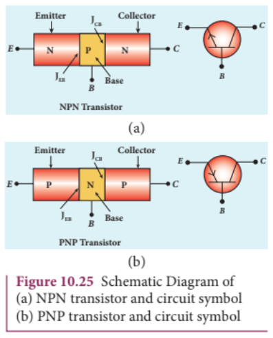

The three regions formed are called as emitter, base and collector which are provided with terminals or ohmic contacts labeled as \(E\) , \(B\) , and \(C\) . As BJT has two \(p\) - \(n\) junctions, two depletion layers are formed across the emitter- base junction \((I_{\mathrm{EB}})\) and collector- base junction \((I_{\mathrm{CB}})\) respectively. The circuit symbol carries an arrowhead at the emitter lead pointing from \(p\) to \(n\) indicating the direction of conventional current.

**Emitter:**

The main function of the emitter is to supply majority charge carriers to the collector region through the base region. Hence, emitter is more heavily doped than the other two regions.

**Base:**

Base is very thin \((10^{- 6}\mathrm{m})\) and very lightly doped region when compared to the other two regions.

**## Collector:**

The main function of collector is to collect the majority charge carriers supplied by the emitter through the base. Hence, collector is made physically larger than the other two as it has to dissipate more power. It is moderately doped.

>**Note**
>
>Because of the differing size and the amount of doping, the emitter and collector cannot be interchanged.

**Transistor Biasing**

The application of suitable DC voltages across the transistor terminals is called biasing. The transistor biasing is done differently for different uses. The different modes of transistor biasing are given below.

**Forward Active:**

In this bias, the emitter- base junction is forward biased and the collector- base junction is reverse biased. The transistor is in the active mode of operation. In this mode, the transistor functions as an amplifier.

**Saturation:**

Here, the emitter- base junction and collector- base junction are forward biased. The transistor has a very large flow of currents across the junctions. In this mode, transistor is used as a closed switch.

**Cut-off:**

In this bias, the emitter- base junction and collector- base junction are reverse biased. Transistor in this mode acts an open switch.

>**Note**
>
>In a PNP transistor, base and collector will be negative with respect to emitter indicated by the middle letter N whereas base and collector will be positive in an NPN transistor indicated by the middle letter P.

### 10.4.1 Transistor circuit configurations

There are three types of circuit connections for operating a transistor based on the terminal that is used in common to both input and output circuits.

**i) Common-Base (CB) configuration**

The base is common to both the input and output circuits. The schematic and circuit symbol are shown in Figure 10.26(a) and 10.26(b). The input current is the emitter current \(I_{\mathrm{E}}\) and the output current is the collector current \(I_{\mathrm{C}}\) . The input signal is applied between emitter and base while the output is measured between collector and base.

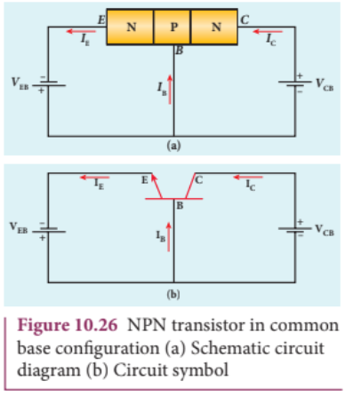

2) Common-Emitter (CE) configurationIn this configuration, the emitter is common to both the input and output circuits as shown in Figure 10.27. The base current \(I_{\mathrm{B}}\) is the input current and the collector current \(I_{\mathrm{c}}\) is the output current. The input signal is applied between emitter and base while the output is measured between collector and emitter.

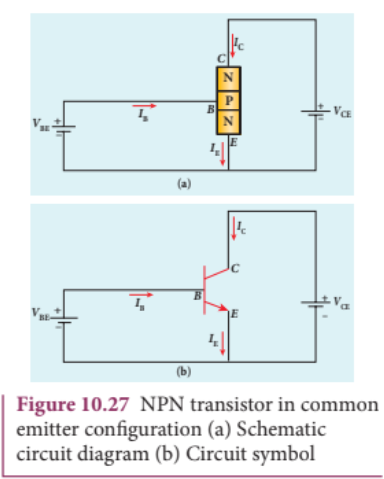

**iii) Common-Collector (CC) configuration**

Here, the collector is common to both the input and output circuits as shown in Figure 10.28. The base current \(I_{\mathrm{B}}\) is the input current and the emitter current \(I_{\mathrm{E}}\) is the output current. The input signal is applied between base and collector while the output is measured between emitter and collector.

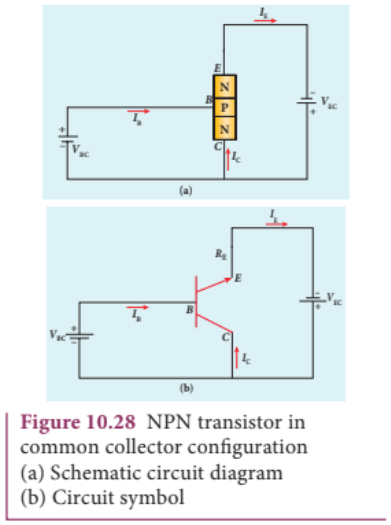

>**Note**
>
>As the output is taken from the emitter in common collector configuration, it is called an emitter follower.

**Figure 10.28** NPN transistor in
common collector configuration
(a) Schematic circuit diagram
(b) Circuit symbol

### 10.4.2 Transistor action in the common base mode

The operation of an NPN transistor in the common base mode is explained below. The current flow in a common base NPN transistor in the forward active mode is shown in Figure 10.29.

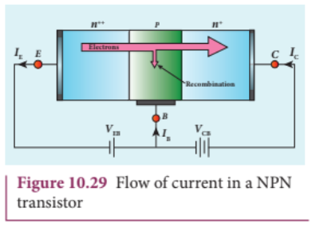

Basically, a BJT can be considered as two \(p\) - \(n\) junction diodes connected back- to- back. In the forward active bias of the  transistor, the emitter-base junction is forward biased by a DC power supply $V_{EB}$ and the collector-base junction is reverse biased by the bias power supply $V_{CB}$. The forward bias decreases the depletion region across the emitter-base junction and the reverse bias increases the depletion region across the collector-base junction. Hence, the barrier potential across the emitter-base junction is decreased and that across the collector-base junction is increased. The voltage across the emitter-base junction is represented as $V_{EB}$ and that across the collector-base junction as $V_{CB}$.

In an NPN transistor, the majority charge carriers in the emitter are electrons. As it is heavily doped, it has a large number of electrons. The forward bias across the emitter-base junction causes the electrons in the emitter region to flow towards the base region and constitutes the emitter current ($I_E$). The electrons after reaching the base region recombine with the holes in the base region. Since the base region is very narrow and lightly doped, the number of holes in it is not sufficient to recombine with electrons from emitter. Hence most of the electrons reach the collector region.

Eventually, the electrons that reach the collector region will be attracted by the collector terminal as it has positive potential and flow through the external circuit. This constitutes the collector current ($I_C$). The holes that are lost due to recombination in the base region are replaced by the positive potential of the bias voltage $V_{BE}$ and constitute the base current ($I_B$). The magnitude of the base current will be in microamperes as against milliamperes for emitter and collector currents.

It is to be noted that if the emitter current is zero, then the collector current is almost zero. It is therefore imperative that a BJT is called a current controlled device. Applying Kirchoff's law, we can write the emitter current as the sum of the collector current and the base current.

$$I_E = I_B + I_C \quad (10.1)$$

Since the base current is very small, we can write $I_E \approx I_C$. There is another component of collector current due to the thermally generated electrons called reverse saturation current, denoted as $I_{CO}$. This factor is temperature sensitive. Therefore, care must be taken towards the stability of the system at high temperatures.

The ratio of the collector current to the emitter current is called the forward current gain ($\alpha$) of a transistor.

$$\alpha = \frac{I_C}{I_E} \quad (10.2)$$

The $\alpha$ of a transistor is a measure of the quality of a transistor. Higher the value of $\alpha$, better is the quality of the transistor. It means that the collector current is closer to the emitter current. The value of $\alpha$ is less than unity and it ranges from 0.95 to 0.99. This indicates that the collector current is 95% to 99% of the emitter current.

**Working of a PNP transistor**

The working of a PNP transistor is similar to that of the NPN transistor except for the

fact that the emitter current \(I_{E}\) is due to holes and the base current \(I_{B}\) is due to electrons. However, the current through the external circuit is due to the flow of electrons.

>**EXAMPLE 10.5**
>
>In a transistor connected in the common base configuration, \(\alpha = 0.95\) , \(I_{E} = 1 \text{mA}\) . Calculate the values of \(I_{C}\) and \(I_{B}\) .
>
>**Solution**
>
>\[\alpha = \frac{I_{C}}{I_{E}}\]
>
>\[I_{C} = \alpha I_{E} = 0.95\times 1 = 0.95 \text{mA}\]
>
>\[I_{E} = I_{B} + I_{C}\]
>
>\[\therefore I_{B} = I_{E} - I_{C} = 1 - 0.95 = 0.05 \text{mA}\]

### 10.4.3 Static Characteristics of Transistor in Common Emitter Mode

The know- how of certain parameters like the input resistance, output resistance, and current gain of a transistor are very important for the effective use of transistors in circuits. The circuit to study the static characteristics of an NPN transistor in the common emitter mode is given in Figure 10.30. The bias supply voltages \(V_{\mathrm{BB}}\) and \(V_{\mathrm{CC}}\) bias the base- emitter junction and collector- emitter junction respectively. The junction potential at the base- emitter is represented as \(V_{\mathrm{BE}}\) and that at the collector- emitter as \(V_{\mathrm{CE}}\) . The rheostats \(R_{1}\) and \(R_{2}\) are used to vary the base current and collector current respectively.

The static characteristics of the BJT are

i) Input characteristics

 ii) Output characteristics

  iii) Transfer characteristics

**i) Input characteristics**

Input characteristic curves give the relationship between the base current \((I_{\mathrm{B}})\) and base to emitter voltage \((V_{\mathrm{BE}})\) at constant collector to emitter voltage \((V_{\mathrm{CE}})\) and are shown in Figure 10.31.

Initially, the collector to emitter voltage is set to a particular value (above \(0.7 \text{V}\) to reverse bias the junction). Then the base- emitter voltage is increased in suitable steps and the corresponding base- current is recorded. A graph is plotted with \(V_{\mathrm{BE}}\) along the x- axis and \(I_{\mathrm{B}}\) along the y- axis. The procedure is repeated for different values of \(V_{\mathrm{CE}}\) .

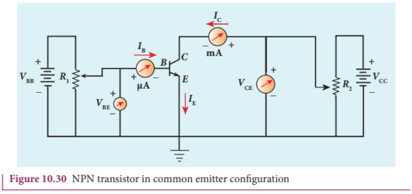

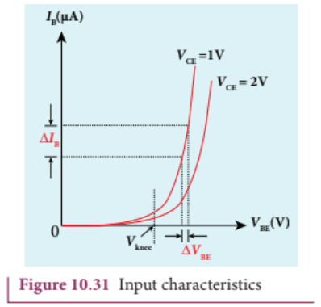

The following observations are made from the graph.

·The curve looks like the forward characteristics of an ordinary \(p - n\) junction diode.

·There exists a threshold voltage or knee voltage \((V_{\mathrm{knee}})\) below which the base current is very small. This value is 0.7 V for silicon and \(0.3\mathrm{V}\) for germanium transistors. Beyond the knee voltage, the base current increases with the increase in base- emitter voltage.

·It is also noted that the increase in the collector- emitter voltage decreases the base current. This shifts the curve outward. This is because the increase in collector- emitter voltage increases the width of the depletion region which in turn, reduces the effective base width and thereby the base current.

**Input impedance**

The ratio of the change in base- emitter voltage \(\left(\Delta V_{BE}\right)\) to the corresponding change in base current \(\left(\Delta I_B\right)\) at a constant collector- emitter voltage \(\left(V_{CE}\right)\) is called the input impedance \((r_i)\) . The input impedance is not constant in the lower region of the curve.

\[r_i = \left(\frac{\Delta V_{BE}}{\Delta I_B}\right)_{V_{CE}} \quad (10.3)\]

The input impedance is high for a transistor in common emitter configuration.
**ii) Output characteristics**

The output characteristics give the relationship between the collector current \((I_{C})\) and the collector to emitter voltage \((V_{CE})\) at constant input current \((I_{B})\) and are shown in Figure 10.32.

Initially, the base current is set to a particular value. Then collector- emitter voltage is increased in suitable steps and the corresponding collector current is recorded. A graph is plotted with \(V_{CE}\) along the \(\mathbf{x}\) - axis and \(I_{C}\) along the y- axis. This procedure is repeated for different values of \(I_{B}\) . The four important regions in the output characteristics are:

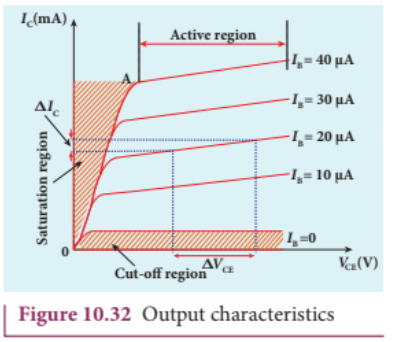

**i) Saturation region**

When \(V_{CE}\) is increased above 0 V, the \(I_{C}\) increases rapidly and reaches a saturation value at a particular value of \(V_{CE}\) , called knee voltage. The initial part of the curve OA (the ohmic region) between the origin 0 and the knee point A is called saturation region. Transistors are always operated above this knee voltage.

**ii) Cut-off region**

A small collector current exists even after the base current is reduced to zero. This region below the curve for \(I_{\mathrm{B}} = 0\) is called cut- off region because the main collector current is cut- off.

**iii) Active region**

The central region of the curves is called active region. In this region, the base- emitter junction remains in the forward biased condition and the collector- emitter junction remains in the reverse biased condition. The transistor in this region can be used for voltage, current and power amplification.

**iv) Breakdown region**

If the collector- emitter voltage is increased beyond the rated value given by the manufacturer, the collector current increases enormously leading to the junction breakdown of the transistor. This avalanche breakdown can damage the transistor.

**Output impedance**

The ratio of the change in the collector- emitter voltage \(\left(\Delta V_{CE}\right)\) to the corresponding change in the collector current \(\left(\Delta I_{C}\right)\) at constant base current \((I_{\mathrm{B}})\) is called output impedance \((r_0)\)

\[r_o = \left(\frac{\Delta V_{CE}}{\Delta I_C}\right)_{I_B} \quad (10.4)\]

The output impedance for transistor in common emitter configuration is very low.

**iii) Current transfer characteristics**

This gives the relationship between the collector current \((I_{C})\) and the base current \((I_{\mathrm{B}})\) at constant collector- emitter voltage \((V_{CE})\) and is shown in Figure 10.33. It is seen that a small \(I_{\mathrm{C}}\) flows even when \(I_{\mathrm{B}}\) is zero. This current is called the common emitter leakage current \((I_{CE0})\) , which is due to the flow of minority charge carriers.

**Forward current gain**

The ratio of the change in collector current \(\left(\Delta I_{C}\right)\) to the corresponding change in base current \(\left(\Delta I_{B}\right)\) at constant collector- emitter voltage \((V_{CE})\) is called forward current gain \((\beta)\)

\[\beta = \left(\frac{\Delta I_C}{\Delta I_B}\right)_{V_{CE}} \quad (10.5)\]

Its value is very high and it generally ranges from 50 to 200.

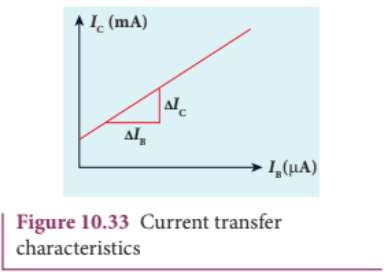

### 10.4.4 Relation between \(\alpha\) and \(\beta\)

There is a relation between current gain in the common base configuration \(\alpha\) and current gain in the common emitter configuration \(\beta\) which is given below.

\[\alpha = \frac{\beta}{1 + \beta} (\mathrm{or}) \beta = \frac{\alpha}{1 - \alpha} \quad (10.6)\]

>**Note**
>
>The collector current is independent of the collector- emitter voltage in the active region.

>**EXAMPLE 10.6**
>
>In the circuit shown in the figure, the input voltage \(V_{i}\) is 20 V, \(V_{BE} = 0\) V and \(V_{CE} = 0\) V. What are the values of \(I_{B}, I_{C}, \beta\) ?
>
>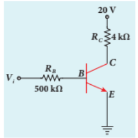
>
>20V \(V_{i} = \frac{V_{i}}{R_{B}} = \frac{20V}{500k\Omega} = 40\mu \mathrm{A}\) \(\left[\because V_{BE} = 0V\right]\) \(I_{C} = \frac{V_{CC}}{R_{C}} = \frac{20V}{4k\Omega} = 5\mathrm{mA}\) \(\left[\because V_{CE} = 0V\right]\) \(\beta = \frac{I_{C}}{I_{B}} = \frac{5\mathrm{mA}}{40\mu\mathrm{A}} = 125\)

### 10.4.5 Operating Point

The operating point is a point where the transistor can be operated efficiently. A straight line drawn by joining the points \(A(V_{CC},0)\) and \(B(0,V_{CC} / R_{C})\) is called the DC load line. The DC load line superimposed on the output characteristics of a transistor is used to learn the concept of operating point of the transistor as shown in Figure 10.34.

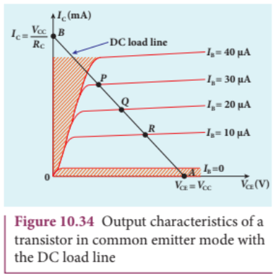

In Figure 10.34, the points P, Q, R are called Q points or quiescent points

which determine the operating point or the working point of a transistor. If the operating point is chosen at the middle of the DC load line (point Q), the transistor can effectively work as an amplifier. The operating point determines the maximum signal that can be obtained without being distorted.

For a transistor to work as a open switch, the Q point can be chosen at the cut- off region and to work as a closed switch, the Q point can be chosen in the saturation region.

### 10.4.6 Transistor as a switch

A transistor in saturation region acts as a closed switch while in cut- off region; it acts as an open switch. It functions like an electronic switch that helps to turn ON or OFF a given circuit by a small control signal which keeps the transistor either in saturation region or in cut- off region. The circuit is shown in Figure 10.35.

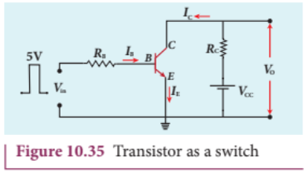

**When the input is low:**

When the input is low (say 0V), the base current is zero and transistor is not properly forward biased. It is in cut off region. As a result, the collector current is zero and correspondingly the voltage drop across \(R_{C}\) also becomes nearly zero. The output voltage is high and is equal to \(V_{CC}\) . It means that the no current flows through the transistor and it is said to be switched off. The transistor acts as an open switch.

**When the input is high:**

When the input voltage is increased to a certain high value (say \(+5\mathrm{V}\) ), the base current \((I_{B})\) increases and in turn increases the collector current to its maximum. The transistor will move into the saturation region. The increase in collector current \((I_{C})\) increases the voltage drop across \(R_{C}\) , thereby lowering the output voltage, close to zero (since \(V_{o} = V_{CC} - I_{C}R_{C}\) ). It means that maximum current flows through the transistor and it is said to be switched on. The transistor acts as a closed switch.

It is manifested that a high input to the transistor gives a low output and a low input gives a high output. In addition, we can say that the output voltage is opposite to the applied input voltage. Therefore, a transistor can be used as an inverter (NOT gate) in computer logic circuitry.

>**EXAMPLE 10.7**
>
>The current gain of a common emitter transistor circuit shown in figure is 120. Draw the DC load line and mark the \(Q\) point on it. \((V_{BE}\) to be ignored).
>
>.png)
>
>**Solution**
>
>\[\beta = 120\] \[\mathrm{Base~current,~}I_{B} = \frac{25V}{1M\Omega} = \frac{25}{1\times 10^{6}}\] \[\qquad = 25\mu \mathrm{A}\]
>
>We know that
>
>\[\beta = \frac{I_{C}}{I_{B}}\quad (\mathrm{or})\]
>
>\[I_{C} = \beta I_{B} = 120\times 25\mu \mathrm{A}\] \[\qquad = 3000\mu \mathrm{A} = 3\mathrm{mA}\] \[V_{CE} = V_{CC} - I_{C}R_{C}\] \[\qquad = 25 - (3\mathrm{mA}\times 5\mathrm{k})\mathrm{=}10\mathrm{V}\]
>
>.png)

### 10.4.7 Transistor as an amplifier

A transistor operating in the active region has the capability to amplify weak signals. Amplification is the process of increasing the signal strength (increase in the amplitude). If a large amplification is required, the transistors are cascaded with coupling elements like resistors, capacitors, and transformers and they are called multistage amplifiers.

Here, the amplification of an electrical signal is explained with a single stage transistor amplifier which is shown in Figure 10.36(a). Single stage indicates that the circuit consists of one transistor with the allied components. An NPN transistor is connected in the common emitter configuration.

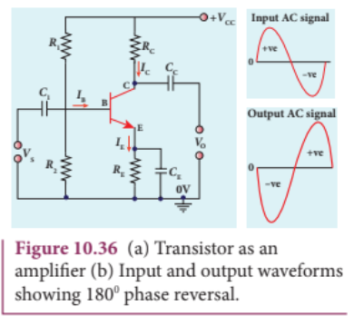

To start with, the \(Q\) point or the operating point of the transistor is fixed so as to get the maximum signal swing at the output (neither towards saturation point nor towards cut- off).

A load resistance \(R_{\mathrm{c}}\) is connected in series with the collector circuit to measure the output voltage. The resistance \(R_{1},R_{2}\) and \(R_{\mathrm{E}}\) form the biasing and stabilization circuit. The capacitor \(C_{1}\) allows only the AC signal to pass through. The emitter bypass capacitor \(C_{\mathrm{E}}\) provides a low reactance path to the amplified AC signal. The coupling capacitor \(C_{\mathrm{c}}\) is used to couple one stage of the amplifier with the next stage while constructing multistage amplifiers.

\(V_{\mathrm{s}}\) is the sinusoidal input signal source applied across the base- emitter. The output is taken across the collector- emitter.

Collector current, \(I_{c} = \beta I_{B}\) \(\therefore \beta = \frac{I_{C}}{I_{B}}\)

Applying Kirchhoff's voltage law to the output loop, the collector- emitter voltage is given by

**Working of the amplifier**

During the positive half cycle

Input signal \((V_{s})\) increases the forward voltage across the emitter- base. As a result, the base current \((I_{\mathrm{B}}\) in \(\mu \mathrm{A}\) ) increases. Consequently, the collector current \((I_{\mathrm{c}}\) in mA) increases \(\beta\) times. This increases the voltage drop across \(R_{\mathrm{c}}(I_{c}R_{c})\) which in turn decreases the collector- emitter voltage \((V_{\mathrm{CE}})\) Therefore, the input signal during the positive half cycle produces negative half cycle of the amplified signal at the output. Hence, the output signal is reversed by \(180^{\circ}\) as shown in Figure 10.36(b).

**During the negative half cycle**

Input signal \((V_{s})\) decreases the forward voltage across the emitter- base. As a result, base current \((I_{\mathrm{B}}\) in \(\mu \mathrm{A}\) ) decreases and in turn decreases the collector current \((I_{\mathrm{c}}\) in mA). The decrease in collector current \((I_{c})\) decreases the potential drop across \(R_{\mathrm{c}}\) which in turn increases the collector- emitter voltage \((V_{\mathrm{CE}})\) . Thus, the input signal during the negative half cycle produces positive half cycle of the amplified signal at the output. Therefore, \(180^{\circ}\) phase reversal is observed during the negative half cycle of the input signal also as shown in Figure 10.36(b).

### 10.4.8 Transistor as an oscillator

An electronic oscillator basically converts DC energy into AC energy of frequency ranging from a few Hz to several MHz. Hence, it is a source of alternating current or voltage. Unlike an amplifier, oscillator does not require any external signal source.

Basically, there are two types of oscillators: Sinusoidal and non- sinusoidal. Sinusoidal oscillators generate oscillations in the form of sine waves at constant amplitude and

frequency as shown in Figure 10.37(a). Nonsinusoidal oscillators generate complex, non- sinusoidal waveforms like squarewave, triangular- wave and sawtooth- wave as shown in Figure 10.36 (b), (c), (d).

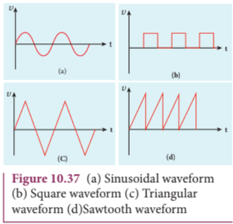

Sinusoidal oscillations are of two types: Damped and undamped. If the amplitude of the electrical oscillations decreases with time due to energy loss, it is called damped oscillations as shown in Figure 10.38(a). On the other hand, the amplitude of the electrical oscillations remains constant with time in undamped oscillations as shown in Figure 10.38(b).

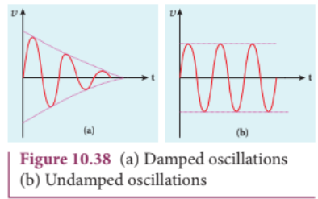

**Transistor oscillator**
An oscillator circuit consists of three components. They are i) tank circuit ii) amplifier and iii) feedback network. The block diagram is shown in Figure 10.39(a).

**i) Tank circuit**

The \(LC\) tank circuit consists of an inductance \(L\) and a capacitor \(C\) connected in parallel as shown in Figure 10.39(b). Whenever energy is supplied to the tank circuit from a DC source, the energy is stored in inductor and capacitor alternatively. This produces electrical oscillations of definite frequency.

**ii) Amplifier**

This is a single stage amplifier which amplifies the weak signal produced by the tank circuit. The required output is supplied by this amplifier.

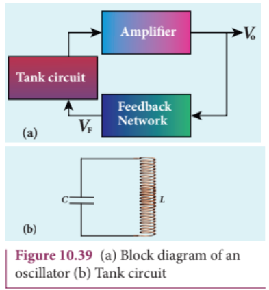

**iii) Feedback network**

The circuit used to feed a portion of the output back to the input is called the feedback network. If the portion of the output fed to the input is in phase with the input, then the magnitude of the input signal increases. This process is called positive feedback which is necessary for sustained oscillations.

**Working**

The tank circuit generates electrical oscillations and acts as the AC input source to the transistor amplifier. Amplifier amplifies

the input AC signal. In practical oscillator circuits, there is loss of some energy in inductor coils and capacitors due to electrical resistance. A small amount of energy is used up in overcoming these losses during every cycle of charging and discharging of the capacitor. Due to this, the amplitude of the oscillations decreases gradually. Hence, the tank circuit produces damped electrical oscillations.

In order to produce undamped oscillations, a positive feedback is provided from output to input by feedback network. This compensates energy loss in tank circuit. The frequency of oscillations is determined by the values of L and C and is given by

\[f = \frac{1}{2\pi\sqrt{LC}} \quad (10.8)\]

 **Barkhausen conditions for sustained oscillations**

The following conditions called Barkhausen conditions should be satisfied for sustained oscillations in the oscillator.

·There should be positive feedback. 

·The loop phase shift must be \(0^{\circ}\) or integral multiples of \(2\pi\) 

·The loop gain must be unity. That is, \(\left|AB\right| = 1\)

Here, \(A\) is the voltage gain of the amplifier, \(\beta\) is the feedback ratio (the fraction of the output that is fed back to the input).

There are different types of oscillator circuits based on the different types of tank circuits. Examples: Hartley oscillator, Colpitts oscillator, Phase shift oscillator and Crystal oscillator.

**Applications of oscillators**

Transistor oscillators are used

· to generate periodic sinusoidal or non
sinusoidal wave forms

· to generate RF carriers

·  to generate clock signal in digital circuits as sweep circuits in TV sets and CRO

>**EXAMPLE 10.8**
>
>Calculate the range of the variable capacitor that is to be used in a tuned- collector oscillator which has a fixed inductance of \(150~\mu \mathrm{H}\) . The frequency band is from \(500~\mathrm{kHz}\) to \(1500~\mathrm{kHz}\) .
>
>**Solution**
>Resonant frequency,
>
>\[f = \frac{1}{2\pi\sqrt{LC}}\]
>
>On simplifying, we get
>
>\[C = \frac{1}{4\pi^2f^2L}\]
>
>i) When frequency \(= 500\mathrm{kHz}\)
>
>\[C = \frac{1}{4\times 3.14^2\times(500\times 10^3)^2\times 150\times 10^{-6}}\] \[= 676\mathrm{pF}\]
>
>ii) When frequency \(= 1500\mathrm{kHz}\)
>
>\[C = \frac{1}{4\times 3.14^2\times(1500\times 10^3)^2\times 150\times 10^{-6}}\] \[= 75\mathrm{pF}\]
>
>Therefore, the capacitor range is from 75 to \(676~\mathrm{pF}\)
