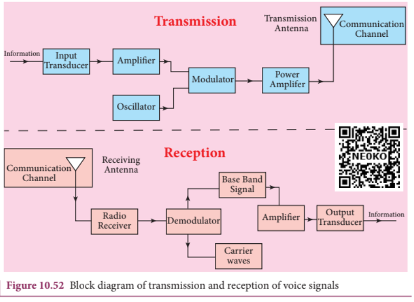

## 10.10 Elements of Electronic Communication System

Electronics plays a major role in communication. Electronic communication is the transmission of audio, text, images or data through a medium. Long-distance transmission uses space as the medium.

The elements of a basic communication system are explained through the block diagram shown in Figure 10.52.

**i) Information (Baseband or Input Signal)**

Information can be in the form of speech, music, images or computer data. This information is given as input to the input transducer.

**ii) Input Transducer**

In a communication system, the transducer converts information in the form of sound, music, images or computer data into corresponding electrical signals. The electrical equivalent of the original information is called the baseband signal. A microphone that converts sound energy into electrical energy is a good example of a transducer.

**iii) Transmitter**

The transmitter delivers the electrical signal from the transducer to the communication channel. It consists of circuits such as amplifiers, oscillators, modulators and power amplifiers. The transmitter is located at the broadcasting station.

**Amplifier:** Since the output of the transducer is very weak, it is amplified by an amplifier.

**Oscillator:** For long-distance transmission in space, it generates high-frequency carrier waves (sine waves). Since the energy of a wave is directly proportional to its frequency, the carrier wave has very high energy.

**Modulator:** It superimposes the baseband signal on the carrier signal to create the modulated signal.

**Power Amplifier:** It increases the power level of the electrical signal to travel over long distances.

**iv) Transmitting Antenna**

It transmits radio signals in all directions in space. It travels at the speed of light in the form of electromagnetic waves.

**v) Communication Channel**

The communication channel helps to transmit electrical signals from the transmitter to the receiver with less noise or loss. Wired communication uses media such as wires, cables and optical fibres. Wireless communication uses space as the communication medium.

**vi) Receiver**

The signals transmitted through the communication channel are received by a receiving antenna, which converts the electromagnetic waves into radio frequency signals and delivers them to the receiver.

The receiver consists of electronic circuits such as demodulator and amplifier. The demodulator extracts the baseband signal from the modulated wave. The baseband signal is separated and amplified using amplifiers. Finally, it is delivered to the output transducer.

**vii) Repeaters**

Repeaters are used to increase the range or distance over which signals are transmitted. This is a combination of transmitter and receiver. Signals are received, amplified and retransmitted to the destination using a carrier signal of a different frequency. A communication satellite in space is a good example.

**viii) Output Transducer**

It converts the electrical signal back into its original form: sound, music, images or data. Speakers, picture tubes, and computer monitors are examples of output transducers.

**Figure 10.52 Block diagram of voice signal transmission and reception**

### 10.10.1 Basic Definitions in Electronic Communication System

To understand electronic communication systems well, it is necessary to understand the following basic definitions.

**i) Range**

This is the maximum distance between the transmitting end and the place where the signal arrives with sufficient strength.

**ii) Noise**

This is an unwanted electrical signal that interferes with the transmitted signal. Noise reduces the quality of the transmitted signal. It can be man-made (automobiles, combustion engines, electric motors) or natural phenomena (lightning, radiation from the sun and stars, and environmental effects). Noise cannot be completely eliminated. However, it can be reduced using various techniques.

**iii) Attenuation**

Attenuation is the loss of signal strength when it is transmitted through a medium.

**iv) Bandwidth**

The frequency range of baseband signals or information signals such as voice, music, image is called bandwidth. If \( \nu_1 \) and \( \nu_2 \) are the lower and upper frequency limits of a signal, then bandwidth = \( \nu_2 - \nu_1 \).

**v) Bandwidth of transmission system**

The range of frequencies required to transmit a specific information portion in a given circuit is called the channel bandwidth or the bandwidth of the transmission system.