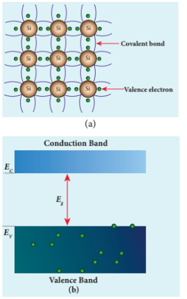
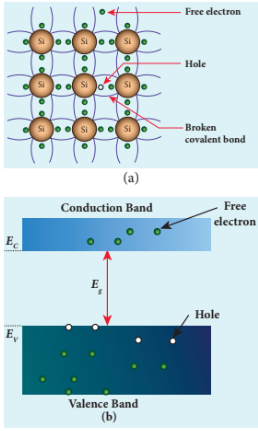
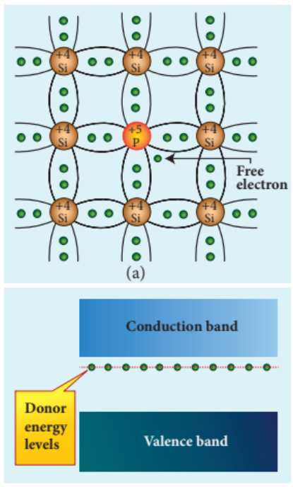
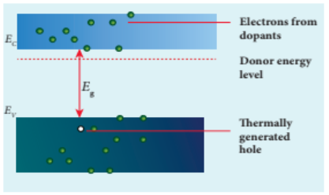
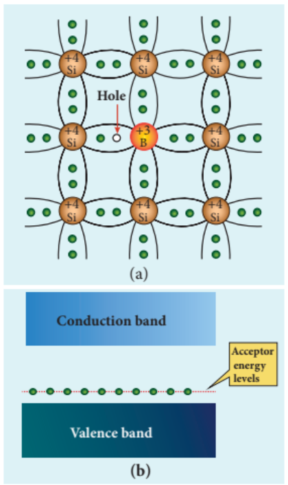
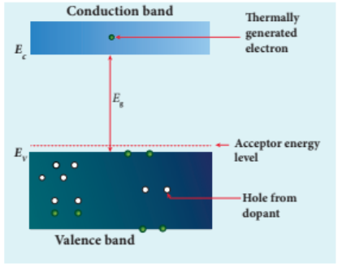

## 10.2 TYPES OF SEMICONDUCTORS

### 10.2.1 Intrinsic semiconductors

A semiconductor in its pure form without any impurity is called an intrinsic semiconductor. Here, impurity means

10.4 (a) The presence of free electron, hole and broken covalent bond in the intrinsic silicon crystal (b) Presence of electrons in the conduction band and holes in the valence band at room temperature

**Figure 10.3** (a) Two dimensional
crystal lattice of silicon (b) Valence
band and conduction band of intrinsic
semiconductor

presence of any other foreign atom in the crystal lattice. The silicon lattice is shown in Figure 10.3(a). Each silicon atom has four electrons in the outermost orbit and is covalently bonded with four neighbouring atoms to form the lattice. The band diagram for this case is shown in Figure 10.3(b).

A small increase in temperature is sufficient enough to break some of the covalent bonds and release the electrons free from the lattice (10.4(a)). As a result, some states in the valence band become empty and the same number of states in the conduction band will be occupied by

**Figure 10.4** (a) The presence of free electron, hole and broken covalent bond in the intrinsic silicon crystal (b) Presence of electrons in the conduction band and holes in the valence band at room temperature

electrons as shown in Figure 10.4(b). The vacancies produced in the valence band are called holes. As the holes are deficiency of electrons, they are treated to possess positive charges. Hence, electrons and holes are the two charge carriers in semiconductors.

In intrinsic semiconductors, the number of electrons in the conduction band is equal to the number of holes in the valence band. The electrical conduction is due to the electrons in the conduction band and holes in the valence band. The corresponding currents are represented as \(I_{e}\) and \(I_{h}\) respectively.

>**Note**
>
>Definition of a hole: When an electron is excited, covalent bond is broken. Now octet rule will not be satisfied. Thus each excited electron leaves a vacancy to complete bonding. This ‘deficiency’ of electron is termed as a ‘hole’

The total current \(I\) is always the sum of the electron current and the hole current. That is, \(I = I_{e} + I_{h}\) .

An intrinsic semiconductor behaves like an insulator at \(0\mathrm{K}\) . The increase in temperature increases the number of charge carriers (electrons and holes). The schematic diagram of the intrinsic semiconductor in band diagram is shown in Figure 10.4(b). The intrinsic carrier concentration is the number of electrons in the conduction band or the number of holes in the valence band in an intrinsic semiconductor.

### 10.2.2 Extrinsic semiconductors

The carrier concentration in an intrinsic semiconductor is not sufficient enough to develop efficient electronic devices. Another way of increasing the carrier concentration in an intrinsic semiconductor is by adding impurity atoms.

The process of adding impurities to the intrinsic semiconductor is called doping. It increases the concentration of charge carriers (electrons and holes) in the semiconductor and in turn, its electrical conductivity. The impurity atoms are called dopants and its order is approximately 100 ppm (parts per million).

On the basis of the type of impurity added, extrinsic semiconductors are classified into:

i) n-type semiconductor

ii) p-type semiconductor

**i) n-type semiconductor**

A n- type semiconductor is obtained by doping a pure silicon (or germanium) crystal with pentavalent impurity atoms (from V group of periodic table) such as phosphorus, arsenic and antimony as shown in Figure 10.5(a). The dopant has five valence electrons while the silicon atom has four valence electrons. During the process of doping, a few of the silicon atoms are replaced by pentavalent

**Figure 10.5** n-type extrinsic
semiconductor: (a) Free electron which
is loosely attached to the lattice
(b) Representation of donor energy level

dopants. Four of the five valence electrons of the impurity atom form covalent bonds with four silicon atoms. The fifth valence electron of the impurity atom is loosely attached with the nucleus as it is not used in the formation of the covalent bond.

The energy level of the loosely attached fifth electron from the dopant is found just below the conduction band edge and is called the donor energy level as shown in Figure 10.5(b). At room temperature, these electrons can easily move to the conduction band with the absorption of thermal energy. It is shown in the Figure 10.6. Besides, an external electric field also can set free the loosely bound electrons and lead to conduction.

**Figure 10.6** Thermally generated
holes in the valence band and the free
electrons generated by the dopants
in the conduction band (n-type
semiconductor)

It is important to note that the energy required for an electron to jump from the valence band to the conduction band in an intrinsic semiconductor is \(0.7\mathrm{eV}\) for Ge and \(1.1\mathrm{eV}\) for Si, while the energy required to set free a donor electron is only \(0.01\mathrm{eV}\) for Ge and \(0.05\mathrm{eV}\) for Si.

The V group pentavalent impurity atoms donate electrons to the conduction band and are called donor impurities. Therefore, each impurity atom provides one extra electron to the conduction band in addition to the thermally generated electrons. These thermally generated electrons leave holes in valence band. Hence, the majority carriers of current in an \(n\) - type semiconductor are electrons and the minority carriers are holes. Such a semiconductor doped with a pentavalent impurity is called an \(n\) - type semiconductor.

**ii) \(p\) -type semiconductor**

In \(p\) - type semiconductor, trivalent impurity atoms (from III group of periodic table) such as boron, aluminium, gallium and indium are added to the silicon (or germanium) crystal. The dopant with three valence electrons can form three covalent bonds with three silicon atoms. Of the four covalent bonds, three bonds are complete and the remaining one bond is incomplete with one electron. This electron vacancy present in the fourth covalent bond is represented as a hole.

To make complete covalent bonding with all four neighbouring atoms, the dopant is in need of one more electron. These dopants can accept electrons from the neighbouring atoms. Therefore, this impurity is called an acceptor impurity. The energy level of the hole created by each impurity atom is just above the valence band and is called the acceptor energy level, as shown in Figure 10.7(b).

For each acceptor atom, there will be a hole in the valence band; this is in addition to the holes left by the thermally generated electrons. In such an extrinsic semiconductor, holes are the majority carriers and thermally generated electrons are minority carriers as shown in Figure 10.8. The extrinsic semiconductor thus formed is called a \(p\) - type semiconductor.

**Figure 10.7** p-type extrinsic semiconductor
(a) Hole generated by the dopant
(b) Representation of acceptor energy level

**Figure 10.8**  Thermally generated
electron in the conduction band and the
holes generated by the dopants in the
valence band (p-type semiconductor)

>**Note**
>
>The \(n\) - type and \(p\) - type semiconductors are neutral because only neutral atoms are doped to the intrinsic semiconductors.
