# 1. Electrostatics

> Electricity is really just organized lightning - George Carlin

## LEARNING OBJECTIVES

In this unit, student is exposed to
- Historical background of electricity and magnetism
- The role of electrostatic force in day-to-day life
- Coulomb's law and superposition principle
- The concept of electric field
- Calculation of electric field for various charge configurations
- Electrostatic potential and electrostatic potential energy
- Electric dipole and dipole moment
- Electric field and electrostatic potential for a dipole
- Electric flux
- Gauss law and its various applications
- Electrostatic properties of conductors and dielectrics
- Polarisation
- Capacitors in series and parallel combinations
- Effect of a dielectric in a capacitor
- Distribution of charges in conductors, corona discharge
- Working of a Van de Graaff generator

## 1.1 INTRODUCTION

Electromagnetism is one of the most important branches of physics. The technological developments of the modern \(21^{\mathrm{st}}\) century are primarily due to our understanding of electromagnetism. The forces we experience in everyday life are electromagnetic in nature except gravity.

In standard XI, we studied about the gravitational force, tension, friction, normal force etc. Newton treated them to be independent of each other with each force being a separate natural force. But what is the origin of all these forces? It is now understood that except gravity, all forces which we experience in every day life (tension in the string, normal force from the surface, friction etc.) arise from electromagnetic forces within the atoms. Some examples are

(i) When an object is pushed, the atoms in our hand interact with the atoms in the object and this interaction is basically electromagnetic in nature.

(ii) When we stand on Earth's surface, the gravitational force on us acts downwards and the normal force acts upward to counter balance the gravitational force. What is the origin of this normal force?

It arises due to the electromagnetic interaction of atoms on the surface of the Earth with the atoms present in the feet of the person. Though, we are attracted by the gravitational force of the Earth, we stand on Earth only because of electromagnetic force of atoms.

(iii) When an object is moved on a surface, static friction resists the motion of the object. This static friction arises due to electromagnetic interaction between the atoms present in the object and atoms on the surface. Kinetic friction also has similar origin.

From these examples, it is clear that understanding electromagnetism is very essential to understand the universe in a holistic manner. The basic principles of electromagnetism are dealt with in volume 1 at XII standard physics. This unit deals with the behaviour and other related phenomena of charges at rest. This branch of electricity which deals with stationary charges is called Electrostatics.

### 1.1.1 Historical background of electric charges

Two millenniums ago, Greeks noticed that amber (a solid, translucent material formed from the resin of a fossilized tree) after rubbing with animal fur attracted small pieces of leaves and dust. The amber possessing this property is said to be charged. It was initially thought that amber has this special property. Later people found that not only amber but even a glass rod rubbed with silk cloth, attracts pieces of papers. So glass rod also becomes charged when rubbed with a suitable material.

Consider a charged rubber rod hanging from a thread as shown in Figure 1.1. Suppose another charged rubber rod is brought near the first rubber rod; the rods repel each other. Now if we bring a charged glass rod close to the charged rubber rod, they attract each other. At the same time, if a charged glass rod is brought near another charged glass rod, both the rods repel each other.

From these observations, the following inferences are made

(i) The charging of rubber rod and that of glass rod are different from one another. (ii) The charged rubber rod repels another charged rubber rod, which implies that like charges repel each other'. We can also arrive at the same inference by observing that a charged glass rod repels another charged glass rod. (iii) The charged rubber rod attracts the charged glass rod, implying that the charge in the glass rod is not the same kind of charge present in the rubber. Thus unlike charges attract each other.

Therefore, two kinds of charges exist in the universe. In the \(18^{\mathrm{th}}\) century, Benjamin Franklin called one type of charge as positive \((+)\) and another type of charge as negative \((-)\). Based on Franklin's convention, rubber and amber rods are negatively charged while the glass rod is positively charged. If the net charge is zero in the object, it is said to be electrically neutral.

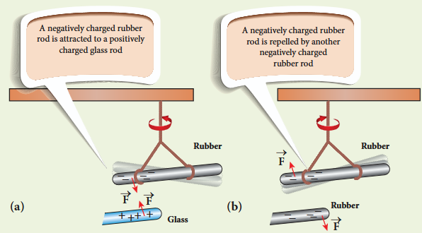

Following the pioneering work of J. J. Thomson and E. Rutherford, in the late 19th century and in the beginning of 20th
century, we now understand that the atom is electrically neutral and is made up of the negatively charged electrons, positively charged protons, and neutrons which have zero charge. The material objects madeup of atoms are neutral in general. When an object is rubbed with another object (for example rubber with silk cloth), some amount of charge is transferred from one object to another due to the friction between them and the object is then said to be electrically charged. Charging the objects through rubbing is called triboelectric charging.

### 1.1.2 Basic properties of charges

#### (i) Electric charge

Most objects in the universe are made up of atoms, which in turn are made up of protons, neutrons and electrons. These particles have mass, an inherent property of particles. Similarly, the electric charge is another intrinsic and fundamental property of particles. The nature of charges is understood through various experiments performed in the \(19^{\mathrm{th}}\) and \(20^{\mathrm{th}}\) century. The SI unit of charge is coulomb.

#### (ii) Conservation of charges

Benjamin Franklin argued that when one object is rubbed with another object, charges get transferred from one to the other. Before rubbing, both objects are electrically neutral and rubbing simply transfers the charges from one object to the other. (For example, when a glass rod is rubbed against silk cloth, some negative charge are transferred from glass to silk. As a result, the glass rod is positively charged and silk cloth becomes negatively charged).

From these observations, he concluded that charges are neither created nor destroyed but can only be transferred from one object to other. This is called conservation of total charges and is one of the fundamental conservation laws in physics. It is stated more generally in the following way.

The total electric charge in the universe is constant and charge can neither be created nor be destroyed. In any physical process, the net change in charge will always be zero.

#### (iii) Quantisation of charges

What is the smallest amount of charge that can be found in nature? Experiments show that the charge on an electron is \(-e\) and the charge on the proton is \(+e\). Here, \(e\) denotes the fundamental unit of charge. The charge \(q\) on any object is equal to an integral multiple of this fundamental unit of charge \(e\).

$$
q = ne \quad (1.1)
$$

Here \(n\) is any integer \((0, \pm 1, \pm 2, \pm 3, \pm 4, \dots)\). This is called quantisation of electric charge.

Robert Millikan in his famous experiment found that the value of \(e = 1.6 \times 10^{-19} \mathrm{C}\). The charge of an electron is \(-1.6 \times 10^{-19} \mathrm{C}\) and the charge of the proton is \(+1.6 \times 10^{-19} \mathrm{C}\). When a glass rod is rubbed with silk cloth, the number of charges transferred is usually very large, typically of the order of \(10^{10}\). So the charge quantisation is not appreciable at the macroscopic level. Hence the charges are treated to be continuous (not discrete). But at the microscopic level, quantisation of charge plays a vital role.

**EXAMPLE 1.1**

Calculate the number of electrons in one coulomb of negative charge.

**Solution**

According to the quantisation of charge,

$$
q = ne
$$

Here \(q = 1 \mathrm{C}\). So the number of electrons in 1 coulomb of charge is

$$
n = \frac{q}{e} = \frac{1\mathrm{C}}{1.6 \times 10^{-19}} = 6.25 \times 10^{18} \text{ electrons}
$$

## 1.2 COULOMB'S LAW

In the year 1786, Coulomb deduced the expression for the force between two stationary point charges in vacuum or free space. Consider two point charges \(q_{1}\) and \(q_{2}\) at rest in vacuum, and separated by a distance of \(r\) as shown in Figure 1.2. According to Coulomb, the force on the point charge \(q_{2}\) exerted by another point charge \(q_{1}\) is

$$
\bar{F}_{21} = k\frac{q_1q_2}{r^2}\hat{r}_{12} \quad (1.2)
$$

where \(\hat{r}_{12}\) is the unit vector directed from charge \(q_{1}\) to charge \(q_{2}\) and \(k\) is the proportionality constant.

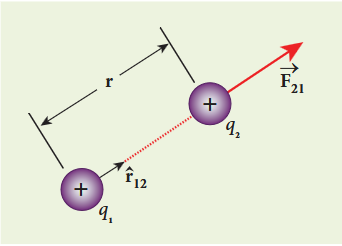

### Important aspects of Coulomb's law

(i) Coulomb's law states that the electrostatic force is directly proportional to the product of the magnitude of the two point charges and is inversely proportional to the square of the distance between the two point charges.

(ii) The force on the charge \(q_{2}\) exerted by the charge \(q_{1}\) always lies along the line joining the two charges. \(\hat{r}_{12}\) is the unit vector pointing from charge \(q_{1}\) to \(q_{2}\). Likewise, the force on the charge \(q_{1}\) exerted by \(q_{2}\) is along \(-\hat{r}_{12}\) (i.e., in the direction opposite to \(\hat{r}_{12}\)).

(iii) In SI units, \(k = \frac{1}{4\pi\epsilon_{0}}\) and its value is \(9\times 10^{9}\mathrm{Nm}^{2}\mathrm{C}^{-2}\). Here \(\epsilon_{0}\) is the permittivity of free space or vacuum and its value is

$$
\epsilon_{o} = \frac{1}{4\pi k} = 8.85\times 10^{-12}\mathrm{C}^{2}\mathrm{N}^{-1}\mathrm{m}^{-2}.
$$

(iv) The magnitude of the electrostatic force between two charges each of one coulomb and separated by a distance of \(1\mathrm{m}\) is calculated as follows:

$$
\left|F\right| = \frac{9\times 10^{9}\times 1\times 1}{1^{2}} = 9\times 10^{9}\mathrm{N}.
$$

This is a huge quantity, almost equivalent to the weight of one million ton. We never come across 1 coulomb of charge in practice. Most of the electrical phenomena in day-to-day life involve electrical charges of the order of \(\mu \mathrm{C}\) (micro coulomb) or nC (nano coulomb).

(v) In SI units, Coulomb's law in vacuum takes the form \(\bar{F}_{21} = \frac{1}{4\pi\epsilon_{0}}\frac{q_{1}q_{2}}{r^{2}}\hat{r}_{12}\). In a medium of permittivity \(\epsilon\), the force between two point charges is given by \(\bar{F}_{21} = \frac{1}{4\pi\epsilon}\frac{q_{1}q_{2}}{r^{2}}\hat{r}_{12}\). Since \(\epsilon \gg \epsilon_{0}\), the force between two point charges in a medium other than vacuum is always less than that in vacuum. We define the relative permittivity for a given medium as \(\epsilon_{r} = \frac{\epsilon}{\epsilon_{0}}\). For vacuum or air, \(\epsilon_{r} = 1\) and for all other media \(\epsilon_{r} > 1\).

(vi) Coulomb's law has same structure as Newton's law of gravitation. Both are inversely proportional to the square of the distance between the particles. The electrostatic force is directly proportional to the product of the magnitude of two point charges and gravitational force is directly proportional to the product of two masses. But there are some important differences between these two laws.

The gravitational force between two masses is always attractive but Coulomb force between two charges can be attractive or repulsive, depending on the nature of charges.

The value of the gravitational constant \(G = 6.67\times 10^{-11}\mathrm{Nm}^2\mathrm{kg}^{-2}\). The value of the constant \(k\) in Coulomb law is \(k = 9\times 10^{9}\mathrm{Nm}^{2}\mathrm{C}^{-2}\). Since \(k\) is much more greater than \(G\), the electrostatic force is always greater in magnitude than gravitational force for smaller size objects.

The gravitational force between two masses is independent of the medium. For example, if \(1\mathrm{kg}\) of two masses are kept in air or inside water, the gravitational force between two masses remains the same. But the electrostatic force between the two charges depends on nature of the medium in which the two charges are kept at rest.

(vii) The force on a charge \(q_{1}\) exerted by a point charge \(q_{2}\) is given by

$$
\bar{F}_{12} = \frac{1}{4\pi\epsilon_{0}}\frac{q_{1}q_{2}}{r^{2}}\hat{r}_{21}
$$

Here \(\hat{r}_{21}\) is the unit vector from charge \(q_{2}\) to \(q_{1}\).

But \(\hat{r}_{21} = -\hat{r}_{12}\)

**EXAMPLE 1.2**

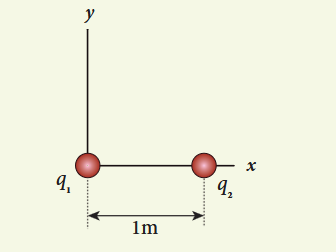

Consider two point charges \(q_{1} = +2\mu \mathrm{C}\) and \(q_{2} = +3\mu \mathrm{C}\) placed at a distance of \(1\mathrm{m}\) from each other in vacuum. (a) Calculate the force experienced by the charge \(q_{2}\) due to the charge \(q_{1}\). (b) What is the force experienced by \(q_{1}\) due to \(q_{2}\)? (c) If these two charges are placed inside the water, how does the force change? (Take \(\epsilon_{r} = 80\) for water)

**Solution**

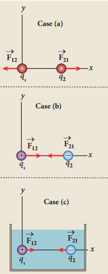

(a) Both the charges are like charges. So the force will be repulsive. The force experienced by the charge \(q_{2}\) due to \(q_{1}\) is given by

$$
\bar{F}_{21} = \frac{1}{4\pi\epsilon_{0}}\frac{q_1q_2}{r^2}\hat{r}_{12}
$$

Since \(\hat{r}_{12} = \hat{i}\) (unit vector along \(x\) axis)

$$
\bar{F}_{21} = \frac{9\times 10^{9}\times (2\times 10^{-6})\times (3\times 10^{-6})}{1^{2}}\hat{i}
$$
$$
= 54\times 10^{-3}\hat{i} \mathrm{~N}
$$

The charge \(q_{2}\) will experience a repulsive force away from \(q_{1}\) along the positive \(x\) direction.

According to Newton's third law, the force experienced by the charge \(q_{1}\) due to \(q_{2}\) is \(\bar{F}_{12} = -\bar{F}_{21}\). Therefore,

$$
\bar{F}_{12} = -54\times 10^{-3}\hat{i} \mathrm{~N}.
$$

(b) \(q_{1} = +2\mu \mathrm{C}\), \(q_{2} = -3\mu \mathrm{C}\), and \(r = 1\mathrm{m}\). They are unlike charges. So the force will be attractive.

Force experienced by the charge \(q_{2}\) due to \(q_{1}\) is given by

$$
\bar{F}_{21} = \frac{9\times 10^{9}\times\left(2\times 10^{-6}\right)\times\left(-3\times 10^{-6}\right)}{1^{2}}\hat{r}_{12}
$$
$$
= -54\times 10^{-3}\mathrm{N}\hat{i} \quad (\text{Using }\hat{r}_{12} = \hat{i})
$$

The charge \(q_{2}\) will experience an attractive force towards \(q_{1}\) which is in the negative \(x\) direction.

According to Newton's third law, the force experienced by the charge \(q_{1}\) due to \(q_{2}\) is \(\bar{F}_{12} = -\bar{F}_{21}\). Therefore,

$$
\bar{F}_{12} = 54\times 10^{-3}\hat{i} \mathrm{~N}
$$

(c) If these two charges are kept inside the water, then the force experienced by \(q_{2}\) due to \(q_{1}\)

$$
\bar{F}_{21}^{\mathrm{W}} = \frac{1}{4\pi\epsilon}\frac{q_1q_2}{r^2}\hat{r}_{12}
$$

since \(\epsilon = \epsilon_{\mathrm{r}}\epsilon_{\mathrm{o}}\)

we have \(\bar{F}_{21}^{\mathrm{W}} = \frac{1}{4\pi\epsilon_{\mathrm{r}}\epsilon_{\mathrm{o}}}\frac{q_{1}q_{2}}{r^{2}}\hat{r}_{12} = \frac{\bar{F}_{21}}{\epsilon_{\mathrm{r}}}\)

Therefore,

$$
\bar{F}_{21}^{\mathrm{W}} = -\frac{54\times 10^{-3}\mathrm{N}}{80}\hat{i} = -0.675\times 10^{-3}\mathrm{N}\hat{i}
$$

Note that the strength of the force between the two charges in water is reduced by 80 times compared to the force between the same two charges in vacuum.

When common salt (NaCl) is taken in water, the electrostatic force between Na and Cl ions is reduced due to the high relative permittivity of water \((\epsilon_{\mathrm{r}} = 80)\). This is the reason water acts as a good solvent.

**EXAMPLE 1.3**

Two small-sized identical equally charged spheres, each having mass 1 g are hanging in equilibrium as shown in the figure. The length of each string is \(10\mathrm{cm}\) and the angle \(\theta\) is \(30^{\circ}\) with the vertical. Calculate the magnitude of the charge in each sphere. (Take \(g = 10\mathrm{ms}^{-2}\))

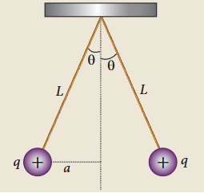

**Solution**

If the two spheres are neutral, the angle between them will be \(0^{\circ}\) when hanged vertically. Since they are positively charged spheres, there will be a repulsive force between them and they will be at equilibrium with each other at an angle of \(30^{\circ}\) with the vertical. At equilibrium, each charge experiences zero net force in each direction. We can draw a free body diagram for one of the charged spheres and apply Newton's second law for both vertical and horizontal directions.

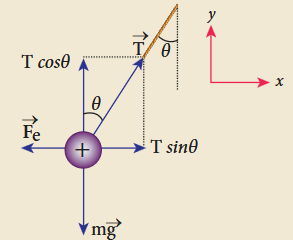

In the \(x\)-direction, the acceleration of the charged sphere is zero.

Using Newton's second law \(\left(\bar{F}_{tot} = m\bar{a}\right)\) we have

$$
T\sin \theta \hat{i} - F_{e}\hat{i} = 0
$$
$$
T\sin \theta = F_{e}
$$

Here \(T\) is the tension acting on the charge due to the string and \(F_{e}\) is the electrostatic force between the two charges.

In the \(y\)-direction also, the net acceleration experienced by the charge is zero.

$$
T\cos \theta \hat{j} - mg\hat{j} = 0
$$
$$
T\cos \theta = mg.
$$

By dividing equation (1) by equation (2),

$$
\tan \theta = \frac{F_e}{mg} \quad (3)
$$

Since they are equally charged, the magnitude of the electrostatic force is

$$
F_{e} = k\frac{q^{2}}{r^{2}} \quad \text{where } k = \frac{1}{4\pi\epsilon_{0}}
$$

Here \(r = 2a = 2L\sin \theta\). By substituting these values in equation (3),

$$
\tan \theta = k\frac{q^{2}}{mg(2L\sin\theta)^{2}} \quad (4)
$$

Rearranging the equation (4) to get \(q\)

$$
q = 2L\sin \theta \sqrt{\frac{mg\tan\theta}{k}}
$$
$$
= 2\times 0.1\times \sin 30^{\circ}\times \sqrt{\frac{10^{-3}\times 10\times\tan 30^{\circ}}{9\times 10^{9}}}
$$
$$
q = 8.01\times 10^{-8}\mathrm{C} = 80.1\mathrm{nC}
$$

**EXAMPLE 1.4**

Calculate the electrostatic force and gravitational force between the proton and the electron in a hydrogen atom. They are separated by a distance of \(5.3\times 10^{-11}\mathrm{m}\). The magnitude of charges on the electron and proton are \(1.6\times 10^{-19}\mathrm{C}\). Mass of the electron is \(m_{e} = 9.1\times 10^{-31}\mathrm{kg}\) and mass of proton is \(m_{p} = 1.6\times 10^{-27}\mathrm{kg}\).

**Solution**

The proton and the electron attract each other. The magnitude of the electrostatic force between these two particles is given by

$$
F_{e} = \frac{ke^{2}}{r^{2}} = \frac{9\times 10^{9}\times\left(1.6\times 10^{-19}\right)^{2}}{\left(5.3\times 10^{-11}\right)^{2}}
$$
$$
= \frac{9\times 2.56}{28.09}\times 10^{-7} = 8.2\times 10^{-8}\mathrm{N}
$$

The gravitational force between the proton and the electron is attractive. The magnitude of the gravitational force between these particles is

$$
F_{G} = \frac{Gm_{e}m_{p}}{r^{2}}
$$
$$
= \frac{6.67\times 10^{-11}\times 9.1\times 10^{-31}\times 1.6\times 10^{-27}}{\left(5.3\times 10^{-11}\right)^{2}}
$$
$$
= \frac{97.11}{28.09}\times 10^{-47} = 3.4\times 10^{-47}\mathrm{N}
$$

The ratio of the two forces

$$
\frac{F_{e}}{F_{G}} = \frac{8.2\times 10^{-8}}{3.4\times 10^{-47}} = 2.41\times 10^{39}
$$

Note that \(F_{e}\approx 10^{39}F_{G}\)

The electrostatic force between a proton and an electron is enormously greater than the gravitational force between them. Thus the gravitational force is negligible when compared with the electrostatic force in many situations such as for small size objects and in the atomic domain. This is the reason why a charged comb attracts an uncharged piece of paper with greater force even though the piece of paper is attracted downward by the Earth.

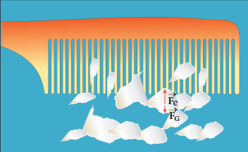

### 1.2.1 Superposition principle

Coulomb's law explains the interaction between two point charges. If there are more than two charges, the force on one charge due to all the other charges needs to be calculated. Coulomb's law alone does not give the answer. The superposition principle explains the interaction between multiple charges.

According to this superposition principle, the total force acting on a given charge is equal to the vector sum of forces exerted on it by all the other charges.

Consider a system of \(n\) charges, namely \(q_{1},q_{2},q_{3}\ldots q_{n}\). The force on \(q_{1}\) exerted by the charge \(q_{2}\)

$$
\bar{F}_{12} = k\frac{q_{1}q_{2}}{r_{21}^{2}}\hat{r}_{21}
$$

where \(\hat{r}_{21}\) is the unit vector from \(q_{2}\) to \(q_{1}\) along the line joining the two charges and \(r_{21}\) is the distance between the charges \(q_{1}\) and \(q_{2}\). The electrostatic force between two charges is not affected by the presence of other charges in the neighbourhood.

The force on \(q_{1}\) exerted by the charge \(q_{3}\) is

$$
\bar{F}_{13} = k\frac{q_{1}q_{3}}{r_{31}^{2}}\hat{r}_{31}
$$

By continuing this, the total force acting on the charge \(q_{1}\) due to all other charges is given by

$$
\bar{F}_{1}^{tot} = \bar{F}_{12} + \bar{F}_{13} + \bar{F}_{14} + \dots + \bar{F}_{1n}
$$
$$
\bar{F}_{1}^{tot} = k\left\{\frac{q_{1}q_{2}}{r_{21}^{2}}\hat{r}_{21} + \frac{q_{1}q_{3}}{r_{31}^{2}}\hat{r}_{31} + \frac{q_{1}q_{4}}{r_{41}^{2}}\hat{r}_{41} + \dots + \frac{q_{1}q_{n}}{r_{n1}^{2}}\hat{r}_{n1}\right\} \quad (1.3)
$$

Both the superposition principle and Coulomb's law form fundamental principles of electrostatics and explain all the phenomena in electrostatics. But they are not derivable from each other.

**EXAMPLE 1.5**

Consider four equal charges \(q_{1}, q_{2}, q_{3}\) and \(q_{4} = q = +1 \mu \mathrm{C}\) located at four different points on a circle of radius \(1 \mathrm{~m}\), as shown in the figure. Calculate the total force acting on the charge \(q_{1}\) due to all the other charges.

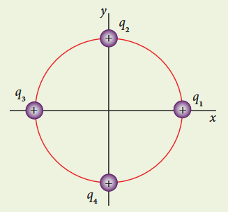

**Solution**

According to the superposition principle, the total electrostatic force on charge \(q_{1}\) is the vector sum of the forces due to the other charges,

$$
\bar{F}_{1}^{\mathrm{tot}} = \bar{F}_{12} + \bar{F}_{13} + \bar{F}_{14}
$$

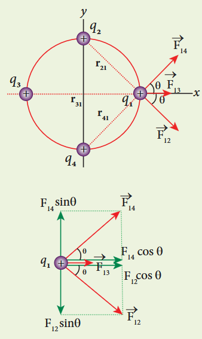

The charges \(q_{2}\) and \(q_{4}\) are equidistant from \(q_{1}\). As a result the strengths (magnitude) of the forces \(\bar{F}_{12}\) and \(\bar{F}_{14}\) are the same even though their directions are different. Therefore the vectors representing these two forces are drawn with equal lengths. But the charge \(q_{3}\) is located farther compared to \(q_{2}\) and \(q_{4}\). Since the strength of the electrostatic force decreases as distance increases, the strength of the force \(\bar{F}_{13}\) is lesser than that of forces \(\bar{F}_{12}\) and \(\bar{F}_{14}\). Hence the vector representing the force \(\bar{F}_{13}\) is drawn with smaller length compared to that for forces \(\bar{F}_{12}\) and \(\bar{F}_{14}\).

From the figure, \(r_{21} = \sqrt{2} \mathrm{~m} = r_{41}\) and \(r_{31} = 2 \mathrm{~m}\)

The magnitudes of the forces are given by

$$
F_{13} = \frac{kq^2}{r_{31}^2} = \frac{9\times 10^9\times 10^{-12}}{4}
$$
$$
F_{13} = 2.25\times 10^{-3}\mathrm{N}
$$
$$
F_{12} = \frac{kq^2}{r_{21}^2} = F_{14} = \frac{9\times 10^9\times 10^{-12}}{2}
$$
$$
= 4.5\times 10^{-3}\mathrm{N}
$$

From the figure, the angle \(\theta = 45^{\circ}\). In terms of the components, we have

$$
\bar{F}_{12} = F_{12}\cos \theta \hat{i} - F_{12}\sin \theta \hat{j}
$$
$$
= 4.5\times 10^{-3}\times \frac{1}{\sqrt{2}}\hat{i} - 4.5\times 10^{-3}\times \frac{1}{\sqrt{2}}\hat{j}
$$
$$
\bar{F}_{13} = F_{13}\hat{i} = 2.25\times 10^{-3}\mathrm{N}\hat{i}
$$
$$
\bar{F}_{14} = F_{14}\cos \theta \hat{i} + F_{14}\sin \theta \hat{j}
$$
$$
= 4.5\times 10^{-3}\times \frac{1}{\sqrt{2}}\hat{i} + 4.5\times 10^{-3}\times \frac{1}{\sqrt{2}}\hat{j}
$$

Then the total force on \(q_{1}\) is

$$
\bar{F}_{1}^{tot} = \left(F_{12}\cos \theta \hat{i} - F_{12}\sin \theta \hat{j}\right) + F_{13}\hat{i} + \left(F_{14}\cos \theta \hat{i} + F_{14}\sin \theta \hat{j}\right)
$$
$$
\bar{F}_{1}^{tot} = \left(F_{12}\cos \theta + F_{13} + F_{14}\cos \theta\right)\hat{i} + \left(-F_{12}\sin \theta + F_{14}\sin \theta\right)\hat{j}
$$

Since \(F_{12} = F_{14}\), the \(j^{\mathrm{th}}\) component is zero. Hence we have

$$
\bar{F}_{1}^{tot} = \left(F_{12}\cos \theta + F_{13} + F_{14}\cos \theta\right)\hat{i}
$$

substituting the values in the above equation,

$$
= \left(\frac{4.5}{\sqrt{2}} + 2.25 + \frac{4.5}{\sqrt{2}}\right)\times 10^{-3}\hat{i}
$$
$$
= \left(4.5\sqrt{2} + 2.25\right)\times 10^{-3}\hat{i}
$$
$$
\bar{F}_{1}^{tot} = 8.61\times 10^{-3}\hat{i}\mathrm{~N}
$$

The resultant force is along the positive \(x\) axis.

## 1.3 ELECTRIC FIELD AND ELECTRIC FIELD LINES

### 1.3.1 Electric Field

The interaction between two charges is determined by Coulomb's law. How does the interaction itself occur? Consider a point charge kept at a point in space. If another point charge is placed at some distance from the first point charge, it experiences either an attractive force or repulsive force. This is called 'action at a distance'. But how does the second charge know about existence of the first charge which is located at some distance away from it? To answer this question, Michael Faraday introduced the concept of field.

According to Faraday, every charge in the universe creates an electric field in the surrounding space, and if another charge is brought into its field, it will interact with the electric field at that point and will experience a force. It may be recalled that the interaction of two masses is similarly explained using the concept of gravitational field. Both the electric and gravitational forces are non-contact forces, hence the field concept is required to explain action at a distance.

Consider a source point charge \(q\) located at a point in space. Another point charge \(q_{0}\) (test charge) is placed at some point P which is at a distance \(r\) from the charge \(q\). The electrostatic force experienced by the charge \(q_{0}\) due to \(q\) is given by Coulomb's law.

$$
\bar{F} = \frac{kq q_{0}}{r^{2}}\hat{r} = \frac{1}{4\pi\epsilon_{0}}\frac{q q_{0}}{r^{2}}\hat{r} \quad \text{where } k = \frac{1}{4\pi\epsilon_{0}}
$$

The charge \(q\) creates an electric field in the surrounding space within which its effect can be felt by another charge. It is measured in terms of a quantity called electric field intensity or simply called electric field \(\bar{E}\). The electric field at the point \(\mathbf{P}\) at a distance \(r\) from the point charge \(q\) is defined as the force that would be experienced by a unit positive charge placed at that point \(\mathbf{P}\) and is given by

$$
\bar{E} = \frac{\bar{F}}{q_0} = \frac{kq}{r^2}\hat{r} = \frac{1}{4\pi\epsilon_0}\frac{q}{r^2}\hat{r} \quad (1.4)
$$

Here \(\hat{r}\) is the unit vector pointing from \(q\) to the point of interest \(\mathrm{P}\). The electric field is a vector quantity and its SI unit is newton per coulomb (NC\(^{-1}\)).

### Important aspects of Electric field

(i) If the charge \(q\) is positive then the electric field points away from the source charge and if \(q\) is negative, the electric field points towards the source charge \(q\).

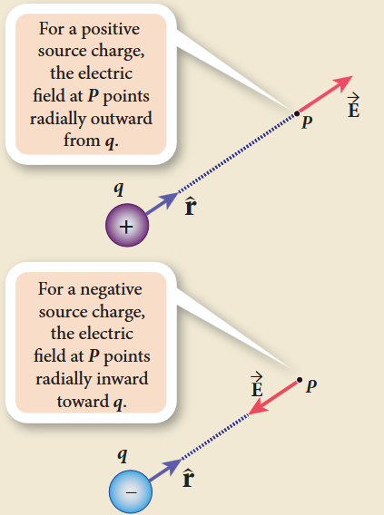

(ii) If the electric field at a point \(\mathrm{P}\) is \(\bar{E}\) then the force experienced by the test charge \(q_{\mathrm{o}}\) placed at the point \(\mathrm{P}\) is

$$
\bar{F} = q_0\bar{E} \quad (1.5)
$$

This is Coulomb's law in terms of electric field.

(iii) The equation (1.4) implies that the electric field is independent of the test charge \(q_{\mathrm{o}}\) and it depends only on the source charge \(q\).

(iv) Since the electric field is a vector quantity, at every point in space, this field has unique direction and magnitude. From equation (1.4), we can infer that as distance increases, the electric field decreases in magnitude.

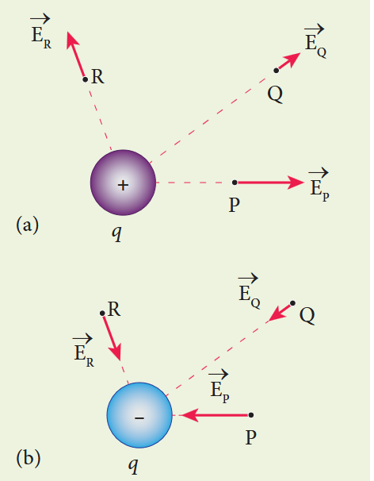

(v) In the definition of electric field, it is assumed that the test charge \(q_0\) is taken sufficiently small, so that bringing this test charge will not move the source charge. In other words, the test charge is made sufficiently small such that it will not modify the electric field of the source charge.

(vi) The expression (1.4) is valid only for point charges. For continuous and finite size charge distributions, integration techniques must be used (Refer Appendix A1.1). However, this expression can be used as an approximation for a finite-sized charge if the test point is very far away from the finite sized source charge. Note that we similarly treat the Earth as a point mass when we calculate the gravitational field of the Sun on the Earth (Refer unit 6, volume 2, XI physics).

(vii) There are two kinds of the electric field: uniform (constant) electric field and non-uniform electric field. Uniform electric field will have the same direction and constant magnitude at all points in space. Non-uniform electric field will have different directions or different magnitudes or both at different points in space. The electric field created by a point charge is basically a non uniform electric field. This non-uniformity arises, both in direction and magnitude, with the direction being radially outward (or inward) and the magnitude changes as distance increases.

**EXAMPLE 1.6**

Calculate the electric field at points P, Q for the following two cases, as shown in the figure.

(a) A positive point charge \(+1\mu \mathrm{C}\) is placed at the origin
(b) A negative point charge \(-2\mu \mathrm{C}\) is placed at the origin

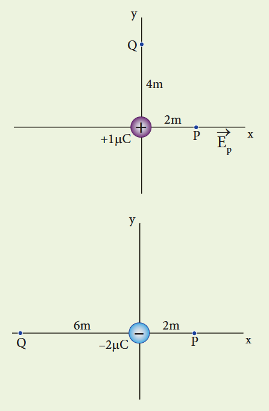

**Solution**

**Case (a)**

The magnitude of the electric field at point P is

$$
E_{p} = \frac{1}{4\pi\epsilon_{0}}\frac{q}{r^{2}} = \frac{9\times 10^{9}\times 1\times 10^{-6}}{4}
$$
$$
= 2.25\times 10^{3}\mathrm{NC}^{-1}
$$

Since the source charge is positive, the electric field points away from the charge. So the electric field at the point P is given by

$$
\vec{E}_{p} = 2.25\times 10^{3}\hat{\imath}\mathrm{NC}^{-1}
$$

For the point Q

$$
\left|\vec{E}_{Q}\right| = \frac{9\times 10^{9}\times 1\times 10^{-6}}{16} = 0.56\times 10^{3}\mathrm{NC}^{-1}
$$

Hence \(\vec{E}_{Q} = 0.56\times 10^{3}\hat{\imath}\mathrm{NC}^{-1}\)

**Case (b)**

The magnitude of the electric field at point P

$$
\left|\vec{E}_{P}\right| = \frac{kq}{r^{2}} = \frac{1}{4\pi\epsilon_{0}}\frac{q}{r^{2}} = \frac{9\times 10^{9}\times 2\times 10^{-6}}{4}
$$
$$
= 4.5\times 10^{3}\mathrm{NC}^{-1}
$$

Since the source charge is negative, the electric field points towards the charge. So the electric field at the point P is given by

$$
\vec{E}_{p} = -4.5\times 10^{3}\hat{\imath}\mathrm{NC}^{-1}
$$

For the point Q, \(\left|\vec{E}_{Q}\right| = \frac{9\times 10^{9}\times 2\times 10^{-6}}{36} = 0.5\times 10^{3}\mathrm{NC}^{-1}\)

$$
\vec{E}_{Q} = 0.5\times 10^{3}\hat{\imath}\mathrm{NC}^{-1}
$$

At the point Q the electric field is directed along the positive \(x\)-axis.

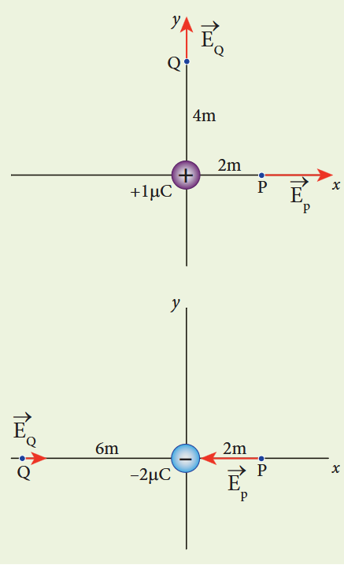

### 1.3.2 Electric field due to the system of point charges

Suppose a number of point charges are distributed in space. To find the electric field at some point P due to this collection of point charges, superposition principle is used. The electric field at an arbitrary point due to a collection of point charges is simply equal to the vector sum of the electric fields created by the individual point charges. This is called superposition of electric fields.

Consider a collection of point charges \(q_{1},q_{2},q_{3},\dots q_{n}\) located at various points in space. The total electric field at some point P due to all these \(n\) charges is given by

$$
\vec{E}_{tot} = \vec{E}_1 + \vec{E}_2 + \vec{E}_3 + \dots + \vec{E}_n \quad (1.6)
$$

$$
\vec{E}_{tot} = \frac{1}{4\pi\epsilon_0}\left\{\frac{q_1}{r_{1P}^2}\hat{r}_{1P} + \frac{q_2}{r_{2P}^2}\hat{r}_{2P} + \frac{q_3}{r_{3P}^2}\hat{r}_{3P} + \dots + \frac{q_n}{r_{nP}^2}\hat{r}_{nP}\right\} \quad (1.7)
$$

where \(r_{1P},r_{2P},r_{3P},\dots r_{nP}\) are the distance of the charges \(q_{1},q_{2},q_{3},\dots q_{n}\) from the point P respectively. Also \(\hat{r}_{1P},\hat{r}_{2P},\hat{r}_{3P},\dots \hat{r}_{nP}\) are the corresponding unit vectors directed from \(q_{1},q_{2},q_{3},\dots q_{n}\) to P. Equation (1.7) can be re-written as,

$$
\vec{E}_{tot} = \frac{1}{4\pi\epsilon_0}\sum_{i = 1}^{n}\left(\frac{q_i}{r_{iP}^2}\hat{r}_{iP}\right) \quad (1.8)
$$

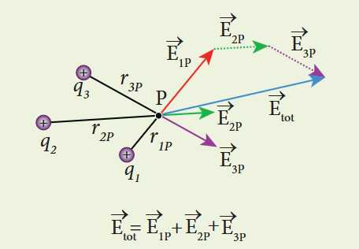

**EXAMPLE 1.7**

Consider the charge configuration as shown in the figure. Calculate the electric field at point A. If an electron is placed at points A, what is the acceleration experienced by this electron? (mass of the electron \(= 9.1\times 10^{-31}\) kg and charge of electron \(= -1.6\times 10^{-19}\) C)

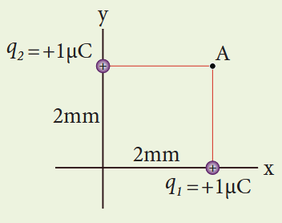

**Solution**

By using superposition principle, the net electric field at point A is

$$
\vec{E}_A = \frac{1}{4\pi\epsilon_0}\frac{q_1}{r_{1A}^2}\hat{r}_{1A} + \frac{1}{4\pi\epsilon_0}\frac{q_2}{r_{2A}^2}\hat{r}_{2A}
$$

where \(r_{1A}\) and \(r_{2A}\) are the distances of point A from the two charges respectively.

$$
\vec{E}_A = \frac{9\times 10^9\times 1\times 10^{-6}}{(2\times 10^{-3})^2}\hat{j} + \frac{9\times 10^9\times 1\times 10^{-6}}{(2\times 10^{-3})^2}\hat{i}
$$
$$
= 2.25\times 10^9\hat{j} + 2.25\times 10^9\hat{i} = 2.25\times 10^9(\hat{i}+\hat{j})
$$

The magnitude of electric field

$$
|\vec{E}_A| = 2.25\times 10^9\sqrt{2} = 3.18\times 10^9 \mathrm{NC}^{-1}
$$

The direction of \(\bar{E}_{\mathrm{A}}\) is given by \(\frac{\bar{E}_{\mathrm{A}}}{\left|\bar{E}_{\mathrm{A}}\right|} = \frac{2.25\times 10^{9}(\hat{i} +\hat{j})}{2.25\times\sqrt{2}\times 10^{9}} = \frac{(\hat{i} +\hat{j})}{\sqrt{2}}\) which is the unit vector along OA.

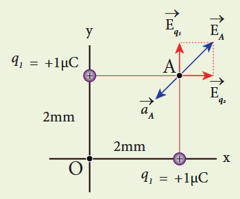

The acceleration experienced by an electron placed at point A is

$$
\bar{a}_{A} = \frac{\bar{F}}{m} = \frac{q\bar{E}_{A}}{m}
$$
$$
= \frac{(-1.6\times 10^{-19})\times (2.25\times 10^{9})(\hat{i} +\hat{j})}{9.1\times 10^{-31}}
$$
$$
= -3.95\times 10^{20}(\hat{i} +\hat{j})\mathrm{N}\mathrm{kg}^{-1}
$$

The electron is accelerated in a direction exactly opposite to \(\bar{E}_{A}\).

### 1.3.3 Electric field due to continuous charge distribution

The electric charge is quantized microscopically. The expressions (1.2), (1.3), (1.4) are applicable to only point charges. While dealing with the electric field due to a charged sphere or a charged wire etc., it is very difficult to look at individual charges in these charged bodies. Therefore, it is assumed that charge is distributed continuously on the charged bodies and the discrete nature of charges is not considered here. The electric field due to such continuous charge distributions is found by invoking the method of calculus.

**EXAMPLE 1.8**

A block of mass \(m\) carrying a positive charge \(q\) is placed on an insulated frictionless inclined plane as shown in the figure. A uniform electric field \(E\) is applied parallel to the inclined surface such that the block is at rest. Calculate the magnitude of the electric field \(E\).

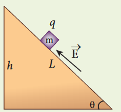

**Solution**

There are three forces that acts on the mass \(m\):

(i) The downward gravitational force exerted by the Earth \((mg)\)

(ii) The normal force exerted by the inclined surface \((N)\)

(iii) The Coulomb force given by uniform electric field \((qE)\)

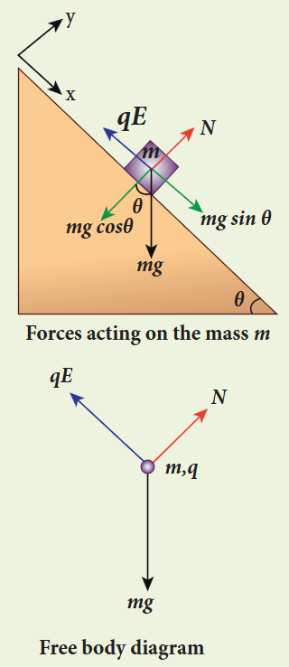

A convenient inertial coordinate system is located in the inclined surface. The mass \(m\) has zero net acceleration both in \(x\) and \(y\)-direction.

Along \(x\)-direction, applying Newton's second law, we have

$$
mg\sin \theta \hat{i} - qE\hat{i} = 0
$$
$$
mg\sin \theta - qE = 0
$$
$$
E = \frac{mg\sin\theta}{q}
$$

Note that the magnitude of the electric field is directly proportional to the mass \(m\) and inversely proportional to the charge \(q\). It implies that, if the mass is increased by keeping the charge constant, then a strong electric field is required to stop the object from sliding. If the charge is increased by keeping the mass constant, then a weak electric field is sufficient to stop the mass from sliding down the plane.

The electric field also can be expressed in terms of height and the length of the inclined surface of the plane.

$$
E = \frac{mg}{qL}
$$

### 1.3.4 Electric field lines

Electric field vectors are visualized by the concept of electric field lines. They form a set of continuous lines which are the visual representation of the electric field in some region of space. The following rules are followed while drawing electric field lines for charges.

The electric field lines start from a positive charge and end at negative charges or at infinity. For a positive point charge the electric field lines point radially outward and for a negative point charge, the electric field lines point radially inward.

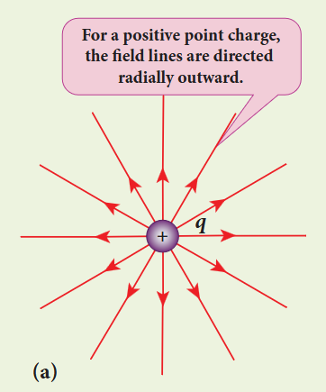

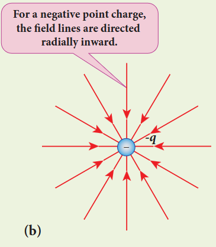

Note that for an isolated positive point charge the electric field line starts from the charge and ends only at infinity. For an isolated negative point charge the electric field lines start at infinity and end at the negative charge.

The electric field vector at a point in space is tangential to the electric field line at that point.

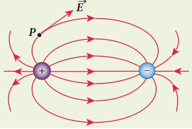

The electric field lines are denser (more closer) in a region where the electric field has larger magnitude and less dense in a region where the electric field is of smaller magnitude. In other words, the number of lines passing through a given surface area perpendicular to the lines is proportional to the magnitude of the electric field in that region.

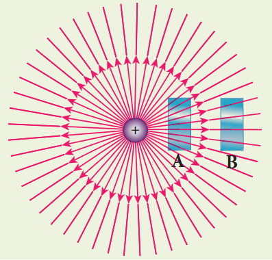

Figure 1.11 shows electric field lines from a positive point charge. The magnitude of the electric field for a point charge decreases as the distance increases \(\left|\bar{E}\right|\propto \frac{1}{r^2}\). So the electric field has greater magnitude at the surface A than at B. Therefore, the number of lines crossing the surface A is greater than the number of lines crossing the surface B. Note that at surface B the electric field lines are farther apart compared to the electric field lines at the surface A.

No two electric field lines intersect each other. If two lines cross at a point, then there will be two different electric field vectors at the same point. As a consequence, if some charge is placed in the intersection point, then it has to move in two different directions at the same time, which is physically impossible. Hence, electric field lines do not intersect.

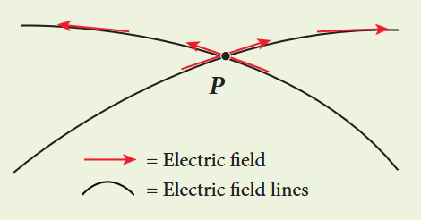

The number of electric field lines that emanate from the positive charge or end at a negative charge is directly proportional to the magnitude of the charges.

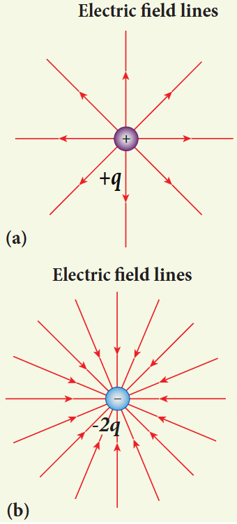

For example, the electric field lines are drawn for charges \(+q\) and \(-2q\). Note that the number of field lines emanating from \(+q\) is 8 and the number of field lines ending at \(-2q\) is 16. Since the magnitude of the second charge is twice that of the first charge, the number of field lines drawn for \(-2q\) is twice in number than that for charge \(+q\).

**EXAMPLE 1.9**

The following pictures depict electric field lines for various charge configurations.

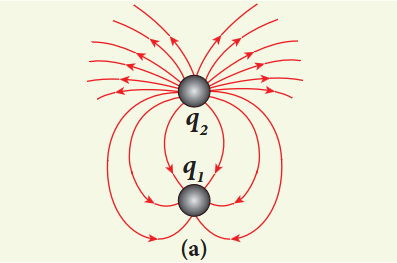

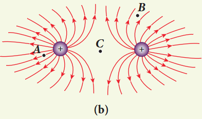

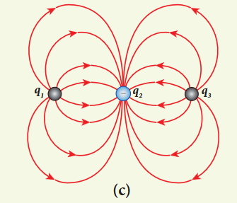

(i) In figure (a) identify the signs of two charges and find the ratio \(\left|\frac{q_1}{q_2}\right|\)

(ii) In figure (b), calculate the ratio of two positive charges and identify the strength of the electric field at three points A, B, and C

(iii) Figure (c) represents the electric field lines for three charges. If \(q_{2} = -20 \mathrm{nC}\), then calculate the values of \(q_{1}\) and \(q_{3}\)

**Solution**

(i) The electric field lines start at \(q_{2}\) and end at \(q_{1}\). In figure (a), \(q_{2}\) is positive and \(q_{1}\) is negative. The number of lines starting from \(q_{2}\) is 18 and number of the lines ending at \(q_{1}\) is 6. So \(q_{2}\) has greater magnitude. The ratio of \(\left|\frac{q_1}{q_2}\right| = \frac{N_1}{N_2} = \frac{6}{18} = \frac{1}{3}\). It implies that \(|q_{2}| = 3|q_{1}|\)

(ii) In figure (b), the number of field lines emanating from both positive charges are equal (N=18). So the charges are equal. At point A, the electric field lines are denser compared to the lines at point B. So the electric field at point A is greater in magnitude compared to the field at point B. Further, no electric field line passes through C, which implies that the resultant electric field at C due to these two charges is zero.

(iii) In the figure (c), the electric field lines start at \(q_{1}\) and \(q_{3}\) and end at \(q_{2}\). This implies that \(q_{1}\) and \(q_{3}\) are positive charges. The ratio of the number of field lines is \(\left|\frac{q_1}{q_2}\right| = \frac{8}{16} = \left|\frac{q_3}{q_2}\right| = \frac{1}{2}\), implying that \(q_{1}\) and \(q_{3}\) are half of the magnitude of \(q_{2}\). So \(q_{1} = q_{3} = +10 \mathrm{nC}\).

## 1.4 ELECTRIC DIPOLE AND ITS PROPERTIES

### 1.4.1 Electric dipole

Two equal and opposite charges separated by a small distance constitute an electric dipole. In many molecules, the centres of positive and negative charge do not coincide. Such molecules behave as permanent dipoles. Examples: CO, water, ammonia, HCl etc.

Consider two equal and opposite point charges \((+q, -q)\) that are separated by a distance \(2a\) as shown in Figure 1.14(a).

The electric dipole moment is defined as

$$
\vec{p} = q\vec{r}_+ + (-q)\vec{r}_- \quad (1.9)
$$

where \(\vec{r}_+\) is the position vector of \(+q\) from the origin and \(\vec{r}_-\) is the position vector of \(-q\) from the origin. Then,

$$
\vec{p} = qa\hat{i} - qa(-\hat{i}) = 2qa\hat{i} \quad (1.10)
$$

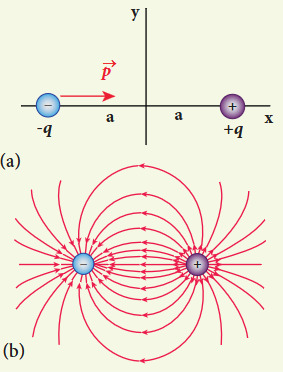

The electric dipole moment vector lies along the line joining two charges and is directed from \(-q\) to \(+q\). The SI unit of dipole moment is coulomb metre (Cm). For simplicity, the two charges are placed on the \(x\)-axis. Even if the two charges are placed on \(y\) or \(z\)-axis, dipole moment will point from \(-q\) to \(+q\).

The magnitude of the electric dipole moment is equal to the product of the magnitude of one of the charges and the distance between them,

$$
|\vec{p}| = 2qa \quad (1.11)
$$

Though the electric dipole moment for two equal and opposite charges is defined, it is possible to define and calculate the electric dipole moment for a collection of point charges. The electric dipole moment for a collection of \(n\) point charges is given by

$$
\bar{p} = \sum_{i = 1}^{n}q_{i}\bar{r}_{i} \quad (1.12)
$$

where \(\bar{r}_{i}\) is the position vector of charge \(q_{i}\) from the origin.

**EXAMPLE 1.10**

Calculate the electric dipole moment for the following charge configurations.

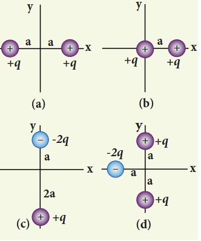

**Solution**

Case (a) The position vector for the \(+q\) on the positive \(x\)-axis is \(a\hat{i}\) and position vector for the \(+q\) charge the negative \(x\) axis is \(-a\hat{i}\). So the dipole moment is,

$$
\bar{p} = (+q)(a\hat{i}) + (+q)(-a\hat{i}) = 0
$$

Case (b) In this case one charge is placed at the origin, so its position vector is zero. Hence only the second charge \(+q\) with position vector \(a\hat{i}\) contributes to the dipole moment, which is \(\bar{p} = qa\hat{i}\).

From both cases (a) and (b), we can infer that in general the electric dipole moment depends on the choice of the origin and charge configuration. But for one special case, the electric dipole moment is independent of the origin. If the total charge is zero, then the electric dipole moment will be the same irrespective of the choice of the origin. It is because of this reason that the electric dipole moment of an electric dipole (total charge is zero) is always directed from \(-q\) to \(+q\), independent of the choice of the origin.

Case (c) \(\bar{p} = (-2q)a\hat{j} + q(2a)(-\hat{j}) = -4qa\hat{j}\). Note that in this case \(\bar{p}\) is directed from \(-2q\) to \(+q\).

Case (d) \(\bar{p} = -2qa(-\hat{i}) + qa\hat{j} + qa(-\hat{j}) = 2qa\hat{i}\)

The water molecule \(\mathrm{H}_{2}\mathrm{O}\) has this charge configuration. The water molecule has three atoms (two H atom and one O atom). The centres of positive (H) and negative (O) charges of a water molecule lie at different points, hence it possess permanent dipole moment. The electric dipole moment \(\bar{p}\) is directed from centre of negative charge to the centre of positive charge.

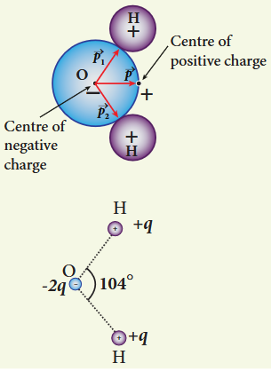

### 1.4.2 Electric field due to a dipole

**Case (i) Electric field due to an electric dipole at points on the axial line**

Consider an electric dipole placed on the \(x\)-axis as shown in Figure 1.15. A point C is located at a distance of \(r\) from the midpoint O of the dipole on the axial line.

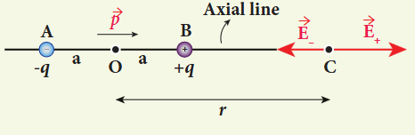

The electric field at a point C due to \(+q\) is \(\bar{E}_{+} = \frac{1}{4\pi\epsilon_{0}}\frac{q}{\left(r - a\right)^{2}}\) along BC

Since the electric dipole moment vector \(\vec{p}\) is from \(-q\) to \(+q\) and is directed along BC, the above equation is rewritten as

$$
\bar{E}_{+} = \frac{1}{4\pi\epsilon_{0}}\frac{q}{\left(r - a\right)^{2}}\hat{p} \quad (1.13)
$$

where \(\hat{p}\) is the electric dipole moment unit vector from \(-q\) to \(+q\)

The electric field at a point C due to \(-q\) is

$$
\bar{E}_{-} = -\frac{1}{4\pi\epsilon_{0}}\frac{q}{\left(r + a\right)^{2}}\hat{p} \quad (1.14)
$$

Since \(+q\) is located closer to the point C than \(-q\), \(\bar{E}_{+}\) is stronger than \(\bar{E}_{-}\). Therefore, the length of the \(\bar{E}_{+}\) vector is drawn larger than that of \(\bar{E}_{-}\) vector.

The total electric field at point C is calculated using the superposition principle of the electric field.

$$
\bar{E}_{tot} = \bar{E}_{+} + \bar{E}_{-}
$$
$$
= \frac{1}{4\pi\epsilon_{0}}\frac{q}{\left(r - a\right)^{2}}\hat{p} - \frac{1}{4\pi\epsilon_{0}}\frac{q}{\left(r + a\right)^{2}}\hat{p}
$$

$$
\bar{E}_{tot} = \frac{q}{4\pi\epsilon_{0}}\left(\frac{1}{\left(r - a\right)^{2}} - \frac{1}{\left(r + a\right)^{2}}\right)\hat{p} \quad (1.15)
$$

$$
\bar{E}_{tot} = \frac{1}{4\pi\epsilon_{0}} q\left(\frac{4ra}{\left(r^{2} - a^{2}\right)^{2}}\right)\hat{p} \quad (1.16)
$$

Note that the total electric field is along \(\bar{E}_{+}\) since \(+q\) is closer to C than \(-q\).

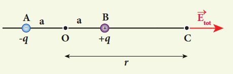

If the point C is very far away from the dipole \((r \gg a)\). Then under this limit the term \(\left(r^{2} - a^{2}\right)^{2} = r^{4}\). Substituting this into equation (1.16), we get

$$
\bar{E}_{tot} = \frac{1}{4\pi\epsilon_{0}}\left(\frac{4aq}{r^{3}}\right)\hat{p} \quad (r \gg a)
$$
$$
\text{since } 2aq\hat{p} = \bar{p}
$$
$$
\bar{E}_{tot} = \frac{1}{4\pi\epsilon_{0}}\frac{2\bar{p}}{r^{3}} \quad (r \gg a)
$$

If the point C is chosen on the left side of the dipole, the total electric field is still in the direction of \(\bar{p}\).

**Case (ii) Electric field due to an electric dipole at a point on the equatorial plane**

Consider a point C at a distance \(r\) from the midpoint O of the dipole on the equatorial plane as shown in Figure 1.17. Since the point C is equidistant from \(+q\) and \(-q\), the magnitude of the electric fields at C due to \(+q\) and \(-q\) are the same. The direction of \(\bar{E}_{+}\) is along BC and the direction of \(\bar{E}_{-}\) is along CA. \(\bar{E}_{+}\) and \(\bar{E}_{-}\) can be resolved into two components; one component parallel to the dipole axis and the other perpendicular to it. Since perpendicular components \(\left|\bar{E}_{+}\right|\sin \theta\) and \(\left|\bar{E}_{-}\right|\sin \theta\) are equal in magnitude and oppositely directed, they cancel each other. The magnitude of the total electric field at point C is the sum of the parallel components of \(\bar{E}_{+}\) and \(\bar{E}_{-}\) and its direction is along \(-\hat{p}\) as shown.

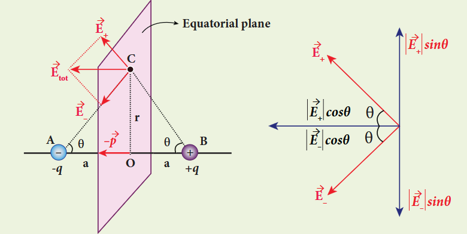

$$
\bar{E}_{tot} = -\left|\bar{E}_{+}\right|\cos \theta \hat{p} - \left|\bar{E}_{-}\right|\cos \theta \hat{p} \quad (1.18)
$$

The magnitudes \(\bar{E}_{+}\) and \(\bar{E}_{-}\) are the same and are given by

$$
\left|\bar{E}_{+}\right| = \left|\bar{E}_{-}\right| = \frac{1}{4\pi\epsilon_{0}}\frac{q}{\left(r^{2} + a^{2}\right)} \quad (1.19)
$$

By substituting equation (1.19) into equation (1.18), we get

$$
\bar{E}_{tot} = -\frac{1}{4\pi\epsilon_{0}}\frac{2q\cos\theta}{\left(r^{2} + a^{2}\right)}\hat{p}
$$
$$
= -\frac{1}{4\pi\epsilon_{0}}\frac{2qa}{\left(r^{2} + a^{2}\right)^{3/2}}\hat{p} \quad (\text{since }\cos \theta = \frac{a}{\sqrt{r^{2} + a^{2}}})
$$

$$
\bar{E}_{tot} = -\frac{1}{4\pi\epsilon_{0}}\frac{\bar{p}}{\left(r^{2} + a^{2}\right)^{\frac{3}{2}}} \quad (\text{since }\bar{p} = 2qa\hat{p}) \quad (1.20)
$$

At very large distances \((r \gg a)\), the equation (1.20) becomes

$$
\bar{E}_{tot} = -\frac{1}{4\pi\epsilon_{0}}\frac{\bar{p}}{r^{3}} \quad (r \gg a) \quad (1.21)
$$

### Important inferences

(i) From equations (1.17) and (1.21), it is inferred that for very large distances, the magnitude of the electric field at point on the dipole axis is twice the magnitude of the electric field at the point at the same distance on the equatorial plane. The direction of the electric field at points on the dipole axis is directed along the direction of dipole moment vector \(\bar{p}\) but at points on the equatorial plane it is directed opposite to the dipole moment vector, that is along \(-\bar{p}\).

(ii) At very large distances, the electric field due to a dipole varies as \(\frac{1}{r^{3}}\). Note that for a point charge, the electric field varies as \(\frac{1}{r^{2}}\).

### 1.4.3 Torque experienced by an electric dipole in the uniform electric field

Consider an electric dipole of dipole moment \(\vec{p}\) placed in a uniform electric field \(\vec{E}\) whose field lines are equally spaced and point in the same direction. The charge \(+q\) will experience a force \(q\vec{E}\) in the direction of the field and charge \(-q\) will experience a force \(-q\vec{E}\) in a direction opposite to the field. Since the external field \(\vec{E}\) is uniform, the total force acting on the dipole is zero. These two forces acting at different points will constitute a couple and the dipole experience a torque. This torque tends to rotate the dipole. (Note that electric field lines of a uniform field are equally spaced and point in the same direction).

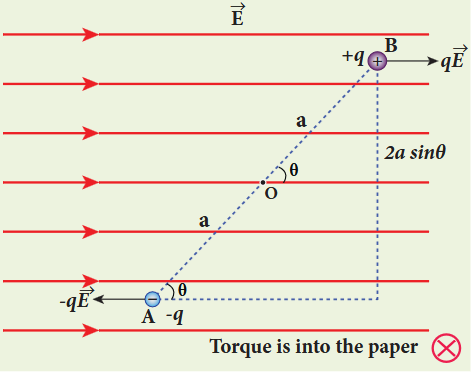

The total torque on the dipole about the point O

$$
\vec{\tau} = \overline{OA}\times (-q\vec{E}) + \overline{OB}\times q\vec{E} \quad (1.22)
$$

The magnitude of the total torque

$$
\tau = \left|\overline{OA}\right|\left|(-q\vec{E})\right|\sin \theta + \left|\overline{OB}\right|\left|q\vec{E}\right|\sin \theta
$$
$$
\tau = qE \cdot 2a\sin \theta \quad (1.23)
$$

where \(\theta\) is the angle made by \(\vec{p}\) with \(\vec{E}\). Since \(p = 2aq\), the torque is written in terms of the vector product as

$$
\vec{\tau} = \vec{p}\times \vec{E} \quad (1.24)
$$

The magnitude of this torque is \(\tau = pE\sin \theta\) and is maximum when \(\theta = 90^{\circ}\)

This torque tends to rotate the dipole and align it with the electric field \(\vec{E}\). Once \(\vec{p}\) is aligned with \(\vec{E}\), the total torque on the dipole becomes zero.

If the electric field is not uniform, then the force experienced by \(+q\) is different from that experienced by \(-q\). In addition to the torque, there will be net force acting on the dipole.

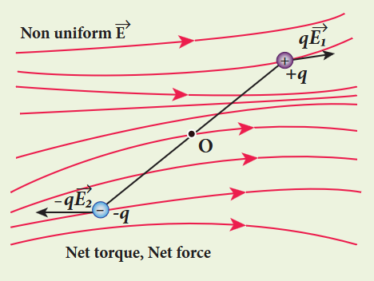

**EXAMPLE 1.11**

A sample of HCl gas is placed in a uniform electric field of magnitude \(3\times 10^{4}\mathrm{N C^{-1}}\). The dipole moment of each HCl molecule is \(3.4\times 10^{-30}\mathrm{Cm}\). Calculate the maximum torque experienced by each HCl molecule.

**Solution**

The maximum torque experienced by the dipole is when it is aligned perpendicular to the applied field.

$$
\tau_{\mathrm{max}} = pE\sin 90^{\circ} = 3.4\times 10^{-30}\times 3\times 10^{4}
$$
$$
\tau_{\mathrm{max}} = 10.2\times 10^{-26}\mathrm{Nm}
$$

**Microwave oven works on the principle of torque acting on an electric dipole. The food we consume has water molecules which are permanent electric dipoles. Oven produces microwaves that are oscillating electromagnetic fields and produce torque on the water molecules. Due to this torque on each water molecule, the molecules rotate very fast and produce thermal energy. Thus, heat generated is used to heat the food.**

## 1.5 ELECTROSTATIC POTENTIAL AND POTENTIAL ENERGY

### Introduction

In mechanics, potential energy is defined for conservative forces. Since gravitational force is a conservative force, its gravitational potential energy is defined. Since Coulomb force is an inverse-square-law force, its also a conservative force like gravitational force. Therefore, we can define potential energy for charge configurations.

### 1.5.1 Electrostatic Potential energy and Electrostatic potential

Consider a positive charge \(q\) kept fixed at the origin which produces an electric field \(\bar{E}\) around it. A positive test charge \(q^{\prime}\) is brought from point R to point P against the repulsive force between \(q\) and \(q^{\prime}\) as shown in Figure 1.20. Work must be done to overcome the repulsion between the charges and this work done is stored as potential energy of the system.

The test charge \(q^{\prime}\) is brought from R to P with constant velocity which means that external force used to bring the test charge \(q^{\prime}\) from R to P must be equal and opposite to the coulomb force \(\left(\bar{F}_{ext} = -\bar{F}_{coulomb}\right)\). The work done is

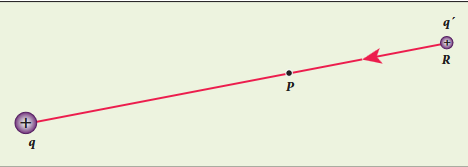

$$
W = \int_{R}^{P}\bar{F}_{ext}\cdot d\bar{r} \quad (1.25)
$$

Since coulomb force is conservative, work done is independent of the path and it depends only on the initial and final positions of the test charge. If potential energy associated with \(q^{\prime}\) at P is \(U_{\mathrm{p}}\) and that at R is \(U_{\mathrm{R}}\), then difference in potential energy is defined as the work done to bring a test charge \(q^{\prime}\) from point R to P and is given as \(U_{\mathrm{p}} - U_{\mathrm{R}} = W = \Delta U\)

$$
\Delta U = \int_{R}^{P}\bar{F}_{ext}\cdot d\bar{r}
$$
$$
\text{Since } \bar{F}_{ext} = -\bar{F}_{coulomb} = -q^{\prime}\bar{E} \quad (1.27)
$$

The potential energy difference per unit charge is given by

$$
\frac{\Delta U}{q^{\prime}} = \frac{q^{\prime}\int_{R}^{P}(-\bar{E})\cdot d\bar{r}}{q^{\prime}} = -\int_{R}^{P}\bar{E}\cdot d\bar{r} \quad (1.29)
$$

The above equation (1.29) is independent of \(q^{\prime}\). The quantity \(\frac{\Delta U}{q^{\prime}} = -\int_{R}^{P}\bar{E}\cdot d\bar{r}\) is called electric potential difference between P and R and is denoted as \(V_{\mathrm{p}} - V_{\mathrm{R}} = \Delta V\).

In other words, the electric potential difference is defined as the work done by an external force to bring unit positive charge from point R to point P.

$$
V_{p} - V_{R} = \Delta V = \int_{R}^{P} -\bar{E}\cdot d\bar{r} \quad (1.30)
$$

The electric potential energy difference can be written as \(\Delta U = q^{\prime}\Delta V\). Physically potential difference between two points is a meaningful quantity. The value of the potential itself at one point is not meaningful. Therefore the point R is taken to infinity and the potential at infinity is considered as zero \((V_{\infty} = 0)\).

Then the electric potential at a point P is equal to the work done by an external force to bring a unit positive charge with constant velocity from infinity to the point P in the region of the external electric field \(\bar{E}\). Mathematically this is written as

$$
V_{p} = -\int_{\infty}^{P}\bar{E}\cdot d\bar{r} \quad (1.31)
$$

### Important points

1. Electric potential at point P depends only on the electric field which is due to the source charge \(q\) and not on the test charge \(q^{\prime}\). Unit positive charge is brought from infinity to the point P with constant velocity because external agency should not impart any kinetic energy to the test charge.

2. From equation (1.29), the unit of electric potential is Joule per coulomb. The practical unit is volt (V) named after Alessandro Volta (1745-1827) who invented the electrical battery. The potential difference between two points is expressed in terms of volt.

**Note: In the case of gravitational force, mass moves from a point of higher gravitational potential to a point of lower gravitational potential. Similarly a positive charge moves from a point of higher electrostatic potential to a point of lower electrostatic potential. However a negative charge moves from lower electrostatic potential to higher electrostatic potential.**

### 1.5.2 Electric potential due to a point charge

Consider a positive charge \(q\) kept fixed at the origin. Let P be a point at distance r from the charge \(q\).

The electric potential at the point P is

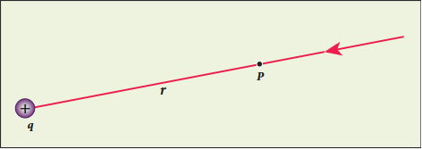

$$
V = \int_{\infty}^{r}(-\bar{E})\cdot d\bar{r} = -\int_{\infty}^{r}\bar{E}\cdot d\bar{r} \quad (1.32)
$$

Electric field due to positive point charge \(q\) is

$$
\bar{E} = \frac{1}{4\pi\epsilon_0}\frac{q}{r^2}\hat{r}
$$

$$
V = -\frac{1}{4\pi\epsilon_0}\int_{\infty}^{r}\frac{q}{r^2}\hat{r}\cdot d\bar{r}
$$

The infinitesimal displacement vector, \(d\bar{r} = d\bar{r}\) and using \(\hat{r}\cdot\hat{r} = 1\) we have

$$
V = -\frac{1}{4\pi\epsilon_0}\int_{\infty}^{r}\frac{q}{r^2} dr
$$

After the integration,

$$
V = -\frac{1}{4\pi\epsilon_0} q\left[-\frac{1}{r}\right]_{\infty}^{r} = \frac{1}{4\pi\epsilon_0} \frac{q}{r}
$$

Hence the electric potential due to a point charge \(q\) at a distance r is

$$
V = \frac{1}{4\pi\epsilon_0}\frac{q}{r} \quad (1.33)
$$

### Important points

(i) If the source charge \(q\) is positive, \(V > 0\). If \(q\) is negative, then \(V\) is negative and equal to \(V = -\frac{1}{4\pi\epsilon_0} \frac{q}{r}\)

(ii) From expression (1.33), it is clear that the potential due to positive charge decreases as the distance increases, but for a negative charge the potential increases as the distance is increased. At infinity \((r = \infty)\) electrostatic potential is zero \((V = 0)\).

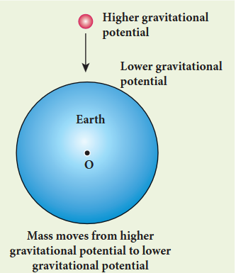

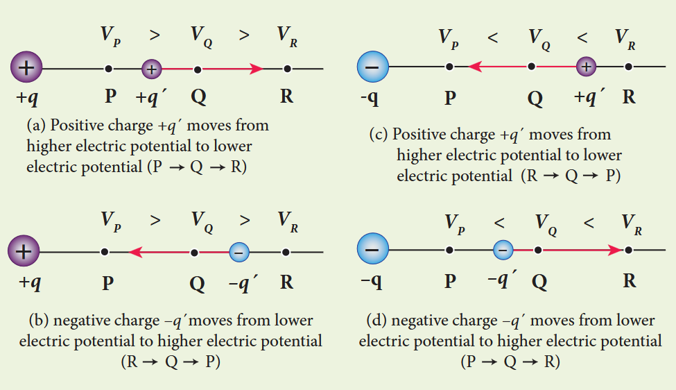

(iii) The electric potential at a point P due to a collection of charges \(q_{1}, q_{2}, q_{3}, \ldots , q_{n}\) is equal to sum of the electric potentials due to individual charges.

$$
V_{tot} = \frac{kq_1}{r_1} + \frac{kq_2}{r_2} + \frac{kq_3}{r_3} + \ldots + \frac{kq_n}{r_n} = \frac{1}{4\pi\epsilon_0}\sum_{i = 1}^{n}\frac{q_i}{r_i} \quad (1.34)
$$

where \(r_{1}, r_{2}, r_{3}, \ldots , r_{n}\) are the distances of \(q_{1}, q_{2}, q_{3}, \ldots , q_{n}\) respectively from P.

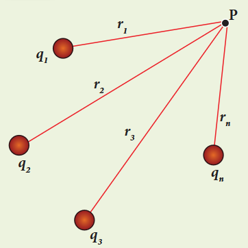

**EXAMPLE 1.12**

(a) Calculate the electric potential at points P and Q as shown in the figure below.
(b) Suppose the charge \(+9\mu \mathrm{C}\) is replaced by \(-9\mu \mathrm{C}\) find the electrostatic potentials at points P and Q

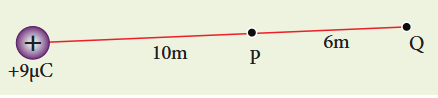

(c) Calculate the work done to bring a test charge \(+2\mu \mathrm{C}\) from infinity to the point Q. Assume the charge \(+9\mu \mathrm{C}\) is held fixed at origin and \(+2\mu \mathrm{C}\) is brought from infinity to P.

**Solution**

(a) Electric potential at point P is given by

$$
V_{p} = \frac{1}{4\pi\epsilon_{0}}\frac{q}{r_{p}} = \frac{9\times 10^{9}\times 9\times 10^{-6}}{10} = 8.1\times 10^{3}\mathrm{V}
$$

Electric potential at point Q is given by

$$
V_{Q} = \frac{1}{4\pi\epsilon_{0}}\frac{q}{r_{Q}} = \frac{9\times 10^{9}\times 9\times 10^{-6}}{16} = 5.06\times 10^{3}\mathrm{V}
$$

Note that the electric potential at point Q is less than the electric potential at point P. If we put a positive charge at P, it moves from P to Q. However if we place a negative charge at P it will move towards the charge \(+9\mu \mathrm{C}\).

The potential difference between the points P and Q is given by

$$
\Delta V = V_{p} - V_{Q} = +3.04\times 10^{3}\mathrm{V}
$$

(b) Suppose we replace the charge \(+9\mu \mathrm{C}\) by \(-9\mu \mathrm{C}\), then the corresponding potentials at the points P and Q are,

$$
V_{p} = -8.1\times 10^{3}\mathrm{V}, \quad V_{Q} = -5.06\times 10^{3}\mathrm{V}
$$

Note that in this case electric potential at the point Q is higher than at point P.

The potential difference between the points P and Q is given by

$$
\Delta V = V_{p} - V_{Q} = -3.04\times 10^{3}\mathrm{V}
$$

(c) The electric potential V at a point Q due to some charge is defined as the work done by an external force to bring a unit positive charge from infinity to Q. So to bring the \(q\) amount of charge from infinity to the point Q, work done is given as follows.

$$
W = qV
$$
$$
W_{Q} = 2\times 10^{-6}\times 5.06\times 10^{3} = 10.12\times 10^{-3}\mathrm{J}.
$$

**EXAMPLE 1.13**

Consider a point charge \(+q\) placed at the origin and another point charge \(-2q\) placed at a distance of \(9\mathrm{m}\) from the charge \(+q\). Determine the point between the two charges at which electric potential is zero.

**Solution**

According to the superposition principle, the total electric potential at a point is equal to the sum of the potentials due to each charge at that point.

Consider the point at which the total potential zero is located at a distance \(x\) from the charge \(+q\).

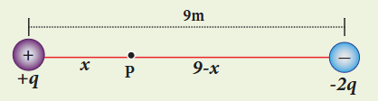

Since the total electric potential at P is zero,

$$
V_{tot} = \frac{1}{4\pi\epsilon_{0}}\left(\frac{q}{x} - \frac{2q}{(9 - x)}\right) = 0
$$
$$
\frac{q}{x} = \frac{2q}{(9 - x)}
$$
$$
\frac{1}{x} = \frac{2}{(9 - x)}
$$

Hence, \(x = 3\mathrm{m}\)

### 1.5.3 Electrostatic potential at a point due to an electric dipole

Consider two equal and opposite charges separated by a small distance \(2a\) as shown in Figure 1.25. The point P is located at a distance \(r\) from the midpoint of the dipole. Let \(\theta\) be the angle between the line OP and dipole axis AB.

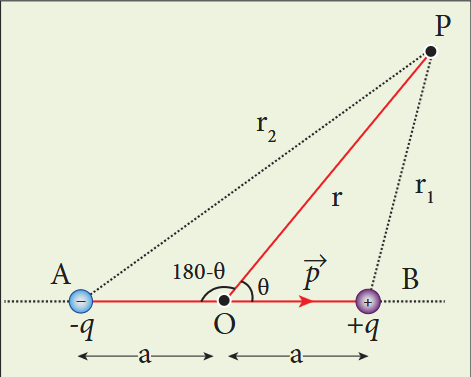

Let \(r_{1}\) be the distance of point P from \(+q\) and \(r_{2}\) be the distance of point P from \(-q\)

Potential at P due to charge \(+q = \frac{1}{4\pi\epsilon_{0}}\frac{q}{r_{1}}\)

Potential at P due to charge \(-q = -\frac{1}{4\pi\epsilon_{0}}\frac{q}{r_{2}}\)

Total potential at the point P

$$
V = \frac{1}{4\pi\epsilon_{0}} q\left(\frac{1}{r_{1}} - \frac{1}{r_{2}}\right) \quad (1.35)
$$

Suppose if the point P is far away from the dipole, such that \(r \gg a\), then equation (1.35) can be expressed in terms of \(r\).

By the cosine law for triangle BOP

$$
r_{1}^{2} = r^{2} + a^{2} - 2ra\cos \theta
$$
$$
r_{1}^{2} = r^{2}\left(1 + \frac{a^{2}}{r^{2}} - \frac{2a}{r}\cos \theta\right)
$$

Since the point P is very far from the dipole \((r \gg a)\). As a result the term \(\frac{a^{2}}{r^{2}}\) is very small and can be neglected. Therefore

$$
r_{1}^{2} = r^{2}\left(1 - \frac{2a\cos\theta}{r}\right)
$$
$$
r_{1} = r\left(1 - \frac{2a}{r}\cos \theta\right)^{\frac{1}{2}}
$$
$$
\frac{1}{r_{1}} = \frac{1}{r}\left(1 - \frac{2a}{r}\cos \theta\right)^{-\frac{1}{2}}
$$

Since \(\frac{a}{r} \ll 1\), we can use binomial theorem and retain the terms up to first order

$$
\frac{1}{r_{1}} = \frac{1}{r}\left(1 + \frac{a}{r}\cos \theta\right) \quad (1.36)
$$

Similarly applying the cosine law for triangle AOP,

$$
r_{2}^{2} = r^{2} + a^{2} - 2ra\cos (180 - \theta)
$$
$$
\text{since } \cos (180 - \theta) = -\cos \theta \text{ we get}
$$
$$
r_{2}^{2} = r^{2} + a^{2} + 2ra\cos \theta
$$

Neglecting the term \(\frac{a^{2}}{r^{2}}\) (because \(r \gg a\))

$$
r_{2}^{2} = r^{2}\left(1 + \frac{2a\cos\theta}{r}\right)
$$

$$
r_{2} = r\left(1 + \frac{2a\cos\theta}{r}\right)^{\frac{1}{2}}
$$
$$
\frac{1}{r_{2}} = \frac{1}{r}\left(1 - \frac{a}{r}\cos \theta\right) \quad (1.37)
$$

Substituting equation (1.37) and (1.36) in equation (1.35),

$$
V = \frac{1}{4\pi\epsilon_0} q\left[\frac{1}{r}\left(1 + \frac{a}{r}\cos\theta\right) - \frac{1}{r}\left(1 - \frac{a}{r}\cos\theta\right)\right]
$$
$$
V = \frac{1}{4\pi\epsilon_0} \frac{q}{r}\left(\frac{2a}{r}\cos\theta\right)
$$
$$
V = \frac{1}{4\pi\epsilon_0} \frac{2aq\cos\theta}{r^2}
$$

But the electric dipole moment \(p = 2qa\) and we get,

$$
V = \frac{1}{4\pi\epsilon_0} \frac{p\cos\theta}{r^2}
$$

Now we can write \(p\cos\theta = \vec{p}\cdot\hat{r}\), where \(\hat{r}\) is the unit vector from the point O to point P. Hence the electric potential at a point P due to an electric dipole is given by

$$
V = \frac{1}{4\pi\epsilon_0} \frac{\vec{p}\cdot\hat{r}}{r^2} \quad (r \gg a) \quad (1.38)
$$

Equation (1.38) is valid for distances very large compared to the size of the dipole. But for a point dipole, the equation (1.38) is valid for any distance.

### Special cases

Case (i) If the point P lies on the axial line of the dipole on the side of \(+q\), then \(\theta = 0\). Then the electric potential becomes

$$
V = \frac{1}{4\pi\epsilon_0} \frac{p}{r^2} \quad (1.39)
$$

Case (ii) If the point P lies on the axial line of the dipole on the side of \(-q\), then \(\theta = 180^\circ\). Then

$$
V = -\frac{1}{4\pi\epsilon_0} \frac{p}{r^2} \quad (1.40)
$$

Case (iii) If the point P lies on the equatorial line of the dipole, then \(\theta = 90^\circ\). Hence

$$
V = 0 \quad (1.41)
$$

**Note: The potential due to an electric dipole falls as \(\frac{1}{r^2}\) and the potential due to a single point charge falls as \(\frac{1}{r}\). Thus the potential due to the dipole falls faster than that due to a monopole (point charge). As the distance increases from electric dipole, the effects of positive and negative charges nullify each other.**

### 1.5.4 Equi-potential Surface

Consider a point charge q located at some point in space and an imaginary sphere of radius r is chosen by keeping the charge q at its centre. The electric potential at all points on the surface of the given sphere is the same. Such a surface is called an equipotential surface.

An equipotential surface is a surface on which all the points are at the same electric potential. For a point charge the equipotential surfaces are concentric spherical surfaces. Each spherical surface is an equipotential surface but the value of the potential is different for different spherical surfaces.

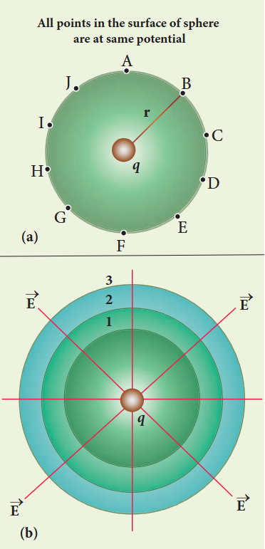

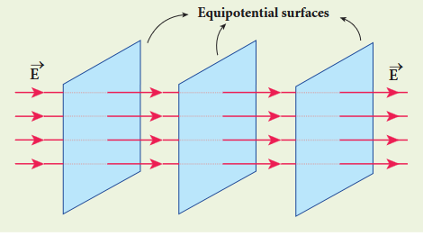

For a uniform electric field, the equipotential surfaces form a set of planes normal to the electric field \(\bar{E}\).

### Properties of equipotential surfaces

(i) The work done to move a charge q between any two points A and B, \(W = q(V_{B} - V_{A})\). If the points A and B lie on the same equipotential surface, work done is zero because \(V_{A} = V_{B}\).
(ii) The electric field is normal to an equipotential surface. If it is not normal, then there is a component of the field parallel to the surface. Then work must be done to move a charge between two points on the same surface. This is a contradiction. Therefore the electric field must always be normal to equipotential surface.

### 1.5.5 Relation between electric field and potential

Consider a positive charge \(q\) kept fixed at the origin. To move a unit positive charge by a small distance \(dx\) towards \(q\) in the electric field \(E\), the work done is given by \(dW = -E dx\). The minus sign implies that work is done against the electric field. This work done is equal to electric potential difference. Therefore,

$$
dW = dV
$$
$$
dV = -E dx
$$
$$
E = -\frac{dV}{dx} \quad (1.42)
$$

The electric field is the negative gradient of the electric potential. In vector form,

$$
\bar{E} = -\left(\frac{\partial V}{\partial x}\hat{i} + \frac{\partial V}{\partial y}\hat{j} + \frac{\partial V}{\partial z}\hat{k}\right) \quad (1.44)
$$

**EXAMPLE 1.14**

The following figure represents the electric potential as a function of \(x\)-coordinate. Plot the corresponding electric field as a function of \(x\).

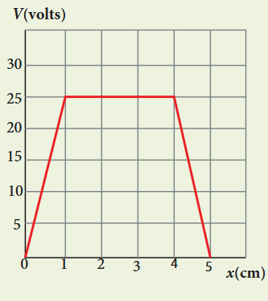

**Solution**

In the given problem, since the potential depends only on \(x\), we can use \(\bar{E} = -\frac{dV}{dx}\hat{i}\) (the other two terms \(\frac{\partial V}{\partial y}\) and \(\frac{\partial V}{\partial z}\) are zero)

From 0 to 1 cm, the slope is constant and so \(\frac{dV}{dx} = 25V\mathrm{cm}^{-1}\). So \(\bar{E} = -25V\mathrm{cm}^{-1}\hat{i}\)

From 1 to 4 cm, the potential is constant, \(V = 25V\). It implies that \(\frac{dV}{dx} = 0\). So \(\bar{E} = 0\)

From 4 to 5 cm, the slope \(\frac{dV}{dx} = -25V\mathrm{cm}^{-1}\). So \(\bar{E} = +25V\mathrm{cm}^{-1}\hat{i}\).

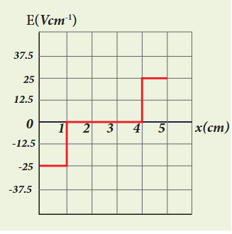

### 1.5.6 Electrostatic potential energy for collection of point charges

The electric potential at a point at a distance \(r\) from point charge \(q_{1}\) is given by

$$
V = \frac{1}{4\pi\epsilon_{0}}\frac{q_{1}}{r}
$$

This potential \(V\) is the work done to bring a unit positive charge from infinity to the point. Now if the charge \(q_{2}\) is brought from infinity to that point at a distance \(r\) from \(q_{1}\), the work done is the product of \(q_{2}\) and the electric potential at that point. Thus we have

$$
W = q_{2}V
$$

This work done is stored as the electrostatic potential energy \(U\) of a system of charges \(q_{1}\) and \(q_{2}\) separated by a distance \(r\). Thus we have

$$
U = q_{2}V = \frac{1}{4\pi\epsilon_{0}}\frac{q_{1}q_{2}}{r} \quad (1.45)
$$

The electrostatic potential energy depends only on the distance between the two point charges. In fact, the expression (1.45) is derived by assuming that \(q_{1}\) is fixed and \(q_{2}\) is brought from infinity. The equation (1.45) holds true when \(q_{2}\) is fixed and \(q_{1}\) is brought from infinity or both \(q_{1}\) and \(q_{2}\) are simultaneously brought from infinity to a distance \(r\) between them.

Three charges are arranged in the following configuration. To calculate the total electrostatic potential energy, we use the following procedure. We bring all the charges one by one and arrange them according to the configuration.

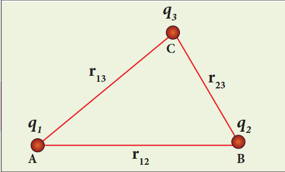

(i) Bringing a charge \(q_{1}\) from infinity to the point A requires no work, because there are no other charges already present in the vicinity of charge \(q_{1}\).

(ii) To bring the second charge \(q_{2}\) to the point B, work must be done against the electric field created by the charge \(q_{1}\). So the work done on the charge \(q_{2}\) is \(W = q_{2} V_{\mathrm{IB}}\). Here \(V_{\mathrm{IB}}\) is the electrostatic potential due to the charge \(q_{1}\) at point B.

$$
U_{I} = \frac{1}{4\pi\epsilon_{\circ}}\frac{q_{1}q_{2}}{r_{12}} \quad (1.46)
$$

Note that the expression is same when \(q_{2}\) is brought first and then \(q_{1}\) later.

(iii) Similarly to bring the charge \(q_{3}\) to the point C, work has to be done against the total electric field due to both charges \(q_{1}\) and \(q_{2}\). So the work done to bring the charge \(q_{3}\) is \(= q_{3}(V_{\mathrm{IC}} + V_{\mathrm{2C}})\). Here \(V_{\mathrm{IC}}\) is the electrostatic potential due to charge \(q_{1}\) at point C and \(V_{\mathrm{2C}}\) is the electrostatic potential due to charge \(q_{2}\) at point C.

The electrostatic potential energy is

$$
U_{II} = \frac{1}{4\pi\epsilon_{\circ}}\left(\frac{q_{1}q_{3}}{r_{13}} + \frac{q_{2}q_{3}}{r_{23}}\right) \quad (1.47)
$$

(iv) Adding equations (1.46) and (1.47), the total electrostatic potential energy for the system of three charges \(q_{1}, q_{2}\) and \(q_{3}\) is \(U = U_{I} + U_{II}\)

$$
U = \frac{1}{4\pi\epsilon_{\circ}}\left(\frac{q_{1}q_{2}}{r_{12}} + \frac{q_{1}q_{3}}{r_{13}} + \frac{q_{2}q_{3}}{r_{23}}\right) \quad (1.48)
$$

Note that this stored potential energy \(U\) is equal to the total external work done to assemble the three charges at the given locations. The expression (1.48) is same if the charges are brought to their positions in any other order. Since the Coulomb force is a conservative force, the electrostatic potential energy is independent of the manner in which the configuration of charges is arrived at.

**EXAMPLE 1.15**

Four charges are arranged at the corners of the square PQRS of side \(a\) as shown in the figure.
(a) Find the work required to assemble these charges in the given configuration.
(b) Suppose a charge \(q^{\prime}\) is brought to the centre of the square, by keeping the four charges fixed at the corners, how much extra work is required for this?

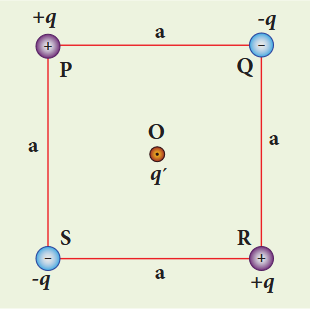

**Solution**

(a) The work done to arrange the charges in the corners of the square is independent of the way they are arranged. We can follow any order.

(i) First, the charge \(+q\) is brought to the corner P. This requires no work since no charge is already present, \(W_{p} = 0\)

(ii) Work required to bring the charge \(-q\) to the corner \(\mathrm{Q} = (-q)\times\) potential at a point Q due to \(+q\) located at a point P.

$$
W_{Q} = -q\times \frac{1}{4\pi\epsilon_{0}}\frac{q}{a} = -\frac{1}{4\pi\epsilon_{0}}\frac{q^{2}}{a}
$$

(iii) Work required to bring the charge \(+q\) to the corner \(\mathrm{R} = q\times\) potential at the point R due to charges at the point P and Q.

$$
W_{R} = q\left[\frac{1}{4\pi\epsilon_{0}}\frac{q}{a\sqrt{2}} + \frac{1}{4\pi\epsilon_{0}}\frac{(-q)}{a}\right]
$$
$$
= \frac{1}{4\pi\epsilon_{0}}\frac{q^{2}}{a}\left(\frac{1}{\sqrt{2}} - 1\right)
$$

(iv) Work required to bring the fourth charge \(-q\) at the position \(\mathrm{S} = q\times\) potential at the point S due the all the three charges at the point P, Q and R

$$
W_{S} = (-q)\left[\frac{1}{4\pi\epsilon_{0}}\frac{q}{a} + \frac{1}{4\pi\epsilon_{0}}\frac{(-q)}{a\sqrt{2}} + \frac{1}{4\pi\epsilon_{0}}\frac{q}{a}\right]
$$
$$
= \frac{1}{4\pi\epsilon_{0}}\frac{q^{2}}{a}\left(-2 + \frac{1}{\sqrt{2}}\right)
$$

Total work done \(W = W_{P} + W_{Q} + W_{R} + W_{S} = \frac{1}{4\pi\epsilon_{0}}\frac{q^{2}}{a}\left(0 - 1 + \frac{1}{\sqrt{2}} - 1 - 2 + \frac{1}{\sqrt{2}}\right)\)

$$
= \frac{1}{4\pi\epsilon_{0}}\frac{q^{2}}{a}\left(-4 + \frac{2}{\sqrt{2}}\right) = \frac{1}{4\pi\epsilon_{0}}\frac{q^{2}}{a}\left(-4 + \sqrt{2}\right)
$$

(b) Work required to bring the charge \(q^{\prime}\) to the centre of the square \(= q^{\prime}\times\) potential at the centre point O due to all the four charges in the four corners

The potential created by the two \(+q\) charges are canceled by the potential created by the \(-q\) charges which are located in the opposite corners. Therefore the net electric potential at the centre O due to all the charges in the corners is zero.

### 1.5.7 Electrostatic potential energy of a dipole in a uniform electric field

Consider a dipole placed in the uniform electric field \(\vec{E}\) as shown. A dipole experiences a torque when kept in a uniform electric field \(\vec{E}\). This torque rotates the dipole to align it with the direction of the electric field. To rotate the dipole (at constant angular velocity) from its initial angle \(\theta^{\prime}\) to another angle \(\theta\) against the torque exerted by the electric field, an equal and opposite external torque must be applied on the dipole.

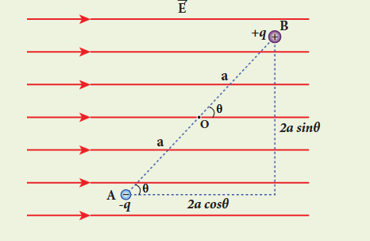

The work done by the external torque to rotate the dipole from angle \(\theta^{\prime}\) to \(\theta\) at constant angular velocity is

$$
W = \int_{\theta^{\prime}}^{\theta} \tau_{ext} d\theta \quad (1.49)
$$

Since \(\vec{\tau}_{ext}\) is equal and opposite to \(\vec{\tau}_{E} = \vec{p}\times \vec{E}\), we have

$$
\tau_{ext} = -pE\sin\theta \quad (1.50)
$$

Substituting equation (1.50) in equation (1.49), we get

$$
W = \int_{\theta^{\prime}}^{\theta} (-pE\sin\theta) d\theta = pE\cos\theta - pE\cos\theta^{\prime}
$$

This work done is equal to the potential energy difference between the angular positions \(\theta\) and \(\theta^{\prime}\).

$$
U(\theta) - U(\theta^{\prime}) = \Delta U = -pE\cos\theta + pE\cos\theta^{\prime}
$$

If the initial angle is \(\theta^{\prime} = 90^{\circ}\) and is taken as reference point, then \(U(\theta^{\prime}) = pE\cos 90^{\circ} = 0\).

The potential energy stored in the system of dipole kept in the uniform electric field is given by

$$
U = -pE\cos\theta = -\vec{p}\cdot \vec{E} \quad (1.51)
$$

In addition to \(p\) and \(E\), the potential energy also depends on the orientation \(\theta\) of the electric dipole with respect to the external electric field.

The potential energy is maximum when the dipole is aligned anti-parallel \((\theta = \pi)\) to the external electric field and minimum when the dipole is aligned parallel \((\theta = 0)\) to the external electric field.

**EXAMPLE 1.16**

A water molecule has an electric dipole moment of \(6.3\times 10^{-30}\mathrm{Cm}\). A sample contains \(10^{22}\) water molecules, with all the dipole moments aligned parallel to the external electric field of magnitude \(3\times 10^{5}\mathrm{N}\mathrm{C}^{-1}\). How much work is required to rotate all the water molecules from \(\theta = 0^{\circ}\) to \(90^{\circ}\)?

**Solution**

When the water molecules are aligned in the direction of the electric field, it has minimum potential energy. The work done to rotate the dipole from \(\theta = 0^{\circ}\) to \(90^{\circ}\) is equal to the potential energy difference between these two configurations.

$$
W = \Delta U = U(90^{\circ}) - U(0^{\circ})
$$

From the equation (1.51), we write \(U = -pE\cos\theta\). Next we calculate the work done to rotate one water molecule from \(\theta = 0^{\circ}\) to \(90^{\circ}\).

For one water molecule

$$
W = -pE\cos 90^{\circ} + pE\cos 0^{\circ} = pE
$$
$$
W = 6.3\times 10^{-30}\times 3\times 10^{5} = 18.9\times 10^{-25}\mathrm{J}
$$

For \(10^{22}\) water molecules, the total work done is

$$
W_{\mathrm{tot}} = 18.9\times 10^{-25}\times 10^{22} = 18.9\times 10^{-3}\mathrm{J}
$$

## 1.6 GAUSS LAW AND ITS APPLICATIONS

### 1.6.1 Electric Flux

The number of electric field lines crossing a given area kept normal to the electric field lines is called electric flux. It is usually denoted by the Greek letter \(\Phi_{E}\) and its unit is \(\mathrm{Nm^2C^{-1}}\). Electric flux is a scalar quantity and it can be positive or negative.

The electric field of a point charge is drawn. Consider two small rectangular area elements placed normal to the field at regions A and B. Even though these elements have the same area, the number of electric field lines crossing the element in region A is more than that crossing the element in region B. Therefore the electric flux in region A is more than that in region B. Since electric field strength for a point charge decreases as the distance increases, electric flux also decreases as the distance increases.

### Electric flux for uniform Electric field

Consider a uniform electric field in a region of space. Let us choose an area \(A\) normal to the electric field lines. The electric flux for this case is

$$
\Phi_{E} = EA \quad (1.52)
$$

Suppose the same area \(A\) is kept parallel to the uniform electric field, then no electric field lines pass through the area \(A\). The electric flux for this case is zero.

$$
\Phi_{E} = 0 \quad (1.53)
$$

If the area is inclined at an angle \(\theta\) with the field, then the component of the electric field perpendicular to the area alone contributes to the electric flux. The electric field component parallel to the surface area will not contribute to the electric flux. For this case, the electric flux

$$
\Phi_{E} = (E\cos \theta)A \quad (1.54)
$$

Further, \(\theta\) is also the angle between the electric field and the direction normal to the area. Hence in general, for uniform electric field, the electric flux is defined as

$$
\Phi_{E} = \vec{E}\cdot \vec{A} = EA\cos \theta \quad (1.55)
$$

Here, note that \(\vec{A}\) is the area vector \(\vec{A} = A\hat{n}\). Its magnitude is simply the area \(A\) and its direction is along the unit vector \(\hat{n}\) perpendicular to the area. Using this definition for flux, \(\Phi_{E} = \vec{E}\cdot \vec{A}\), equations (1.53) and (1.54) can be obtained as special cases.

In Figure (a), \(\theta = 0^{\circ}\). Therefore, \(\Phi_{E} = \vec{E}\cdot \vec{A} = EA\)

In Figure (b), \(\theta = 90^{\circ}\). Therefore, \(\Phi_{E} = \vec{E}\cdot \vec{A} = 0\)

**EXAMPLE 1.17**

Calculate the electric flux through the rectangle of sides \(5\mathrm{cm}\) and \(10\mathrm{cm}\) kept in the region of a uniform electric field \(100\mathrm{NC}^{-1}\). The angle \(\theta\) is \(60^{\circ}\). If \(\theta\) becomes zero, what is the electric flux?

**Solution**

The electric flux through the rectangular area

$$
\Phi_{E} = \vec{E}\cdot \vec{A} = EA\cos \theta
$$
$$
= 100\times 5\times 10\times 10^{-4}\times \cos 60^{\circ}
$$
$$
\Phi_{E} = 0.25\mathrm{Nm}^{2}\mathrm{C}^{-1}
$$

For \(\theta = 0^{\circ}\)

$$
\Phi_{E} = 100\times 5\times 10\times 10^{-4}\times \cos 0^{\circ} = 0.5\mathrm{Nm}^{2}\mathrm{C}^{-1}
$$

### Electric flux through an arbitrary area kept in a non uniform electric field

Suppose the electric field is not uniform and the area \(A\) is not flat surface. Then the entire area can be divided into \(n\) small area segments \(\Delta \vec{A}_1,\Delta \vec{A}_2,\Delta \vec{A}_3,\dots \Delta \vec{A}_n\) such that each area element is almost flat and the electric field over such area element can be considered uniform.

The electric flux for the entire area \(A\) is approximately written as

$$
\Phi_{E} = \sum_{i=1}^{n} \vec{E}_{i}\cdot \Delta \vec{A}_{i} \quad (1.56)
$$

By taking the limit \(\Delta \vec{A}_i \to 0\) (for each area element), the summation becomes integration. Then the electric flux for the entire area \(A\) is

$$
\Phi_{E} = \int \vec{E}\cdot d\vec{A} \quad (1.57)
$$

### 1.6.2 Electric flux for closed surfaces

Suppose a closed surface is present in the region of the non-uniform electric field. The total electric flux over this closed surface is written as

$$
\Phi_{E} = \oint \bar{E}\cdot d\bar{A} \quad (1.58)
$$

Note the difference between equations (1.57) and (1.58). The integration in equation (1.58) is a closed surface integration and for each areal element, the outward normal is the direction of \(d\bar{A}\).

The total electric flux over a closed surface can be negative, positive or zero. In one area element, the angle between \(d\bar{A}\) and \(\bar{E}\) is less than \(90^{\circ}\), then the electric flux is positive and in another areal element, the angle between \(d\bar{A}\) and \(\bar{E}\) is greater than \(90^{\circ}\), then the electric flux is negative.

In general, the electric flux is negative if the electric field lines enter the closed surface and positive if the electric field lines leave the closed surface.

### 1.6.3 Gauss law

A positive point charge \(Q\) is surrounded by an imaginary sphere of radius \(r\). We can calculate the total electric flux through the closed surface of the sphere using the equation (1.58).

$$
\Phi_{E} = \oint \bar{E}\cdot d\bar{A} = \oint EdA\cos \theta
$$

The electric field of the point charge is directed radially outward at all points on the surface of the sphere. Therefore, the direction of the area element \(d\bar{A}\) is along the electric field \(\bar{E}\) and \(\theta = 0^{\circ}\).

$$
\Phi_{E} = \oint EdA \qquad \text{since } \cos 0^{\circ} = 1 \quad (1.59)
$$

\(E\) is uniform on the surface of the sphere,

$$
\Phi_{E} = E\oint dA \quad (1.60)
$$

Substituting for \(\oint dA = 4\pi r^2\) and \(E = \frac{1}{4\pi\epsilon_0}\frac{Q}{r^2}\) in equation (1.60), we get

$$
\Phi_{E} = \frac{1}{4\pi\epsilon_{0}}\frac{Q}{r^{2}}\times 4\pi r^{2} = \frac{Q}{\epsilon_{0}} \quad (1.61)
$$

The equation (1.61) is called as Gauss's law.

The remarkable point about this result is that the equation (1.61) is equally true for any arbitrary shaped surface which encloses the charge \(Q\). It is seen that the total electric flux is the same for closed surfaces \(A_{1}, A_{2}\) and \(A_{3}\).

Gauss's law states that if a charge \(Q\) is enclosed by an arbitrary closed surface, then the total electric flux \(\Phi_{E}\) through the closed surface is

$$
\Phi_{E} = \oint \vec{E}\cdot d\vec{A} = \frac{Q_{\mathrm{encl}}}{\epsilon_{0}} \quad (1.62)
$$

where \(Q_{\mathrm{encl}}\) denotes the charges within the closed surface.

### Discussion of Gauss law

(i) The total electric flux through the closed surface depends only on the charges enclosed by the surface and the charges present outside the surface will not contribute to the flux and the shape of the closed surface which can be chosen arbitrarily.

(ii) The total electric flux is independent of the location of the charges inside the closed surface.

(iii) To arrive at equation (1.62), we have chosen a spherical surface. This imaginary surface is called a Gaussian surface. The shape of the Gaussian surface to be chosen depends on the type of charge configuration and the kind of symmetry existing in that charge configuration. The electric field is spherically symmetric for a point charge, therefore spherical Gaussian surface is chosen. Cylindrical and planar Gaussian surfaces can be chosen for other kinds of charge configurations.

(iv) In the LHS of equation (1.62), the electric field \(\vec{E}\) is due to charges present inside and outside the Gaussian surface but the charge \(Q_{encl}\) denotes the charges which lie only inside the Gaussian surface.

**EXAMPLE 1.18**

(i) In figure (a), calculate the electric flux through the closed areas \(A_{1}\) and \(A_{2}\).
(ii) In figure (b), calculate the electric flux through the cube

**Solution**

(i) In figure (a), the area \(A_{1}\) encloses the charge \(Q\). So electric flux through this closed surface \(A_{1}\) is \(\frac{Q}{\epsilon_{0}}\). But the closed surface \(A_{2}\) contains no charges inside, so electric flux through \(A_{2}\) is zero.

(ii) In figure (b), the net charge inside the cube is \(3q\) and the total electric flux in the cube is therefore \(\Phi_{E} = \frac{3q}{\epsilon_{0}}\). Note that the charge \(-10q\) lies outside the cube and it will not contribute the total flux through the surface of the cube.

### 1.6.4 Applications of Gauss law

Electric field due to any arbitrary charge configuration can be calculated using Coulomb's law or Gauss law. If the charge configuration possesses some kind of symmetry, then Gauss law is a very efficient way to calculate the electric field. It is illustrated in the following cases.

#### (i) Electric field due to an infinitely long charged wire

Consider an infinitely long straight wire having uniform linear charge density \(\lambda\) (charge per unit length). Let \(P\) be a point located at a perpendicular distance \(r\) from the wire. The electric field at the point \(P\) can be found using Gauss law.

We choose two small charge elements on the wire which are at equal distances from the point \(P\). The resultant electric field due to these two charge elements points radially away from the charged wire and the magnitude of electric field is same at all points on the circle of radius \(r\). Since the charged wire possesses a cylindrical symmetry, let us choose a cylindrical Gaussian surface of radius \(r\) and length \(L\).

The total electric flux through this closed surface is calculated as follows.

$$
\Phi_{E} = \oint \vec{E}\cdot d\vec{A} = \int_{\text{Curved}} \vec{E}\cdot d\vec{A} + \int_{\text{top}} \vec{E}\cdot d\vec{A} + \int_{\text{bottom}} \vec{E}\cdot d\vec{A} \quad (1.63)
$$

It is seen that for the curved surface, \(\vec{E}\) is parallel to \(\vec{A}\) and \(\vec{E}\cdot d\vec{A} = E dA\). For the top and bottom surfaces, \(\vec{E}\) is perpendicular to \(\vec{A}\) and \(\vec{E}\cdot d\vec{A} = 0\)

Substituting these values in the equation (1.63) and applying Gauss law to the cylindrical surface, we have

$$
\Phi_{E} = \int_{\text{Curved}} E dA = \frac{Q_{encl}}{\epsilon_{o}} \quad (1.64)
$$

Since the magnitude of the electric field for the entire curved surface is constant, \(E\) is taken out of the integration and \(Q_{encl}\) is given by \(Q_{encl} = \lambda L\), where \(\lambda\) is the linear charge density.

$$
E \int_{\text{Curved}} dA = \frac{\lambda L}{\epsilon_{o}} \quad (1.65)
$$

Here \(\int_{\text{Curved}} dA =\) total area of the curved surface \(= 2\pi rL\). Substituting this in equation (1.65), we get

$$
E\cdot 2\pi rL = \frac{\lambda L}{\epsilon_{\circ}}
$$
$$
E = \frac{1}{2\pi\epsilon_{\circ}}\frac{\lambda}{r}
$$

In vector form,

$$
\bar{E} = \frac{1}{2\pi\epsilon_{\circ}}\frac{\lambda}{r}\hat{r} \quad (1.67)
$$

The electric field due to the infinite charged wire depends on \(\frac{1}{r}\) rather than \(\frac{1}{r^2}\) which is for a point charge.

Equation (1.67) indicates that the electric field is always along the perpendicular direction \((\hat{r})\) to wire. In fact, if \(\lambda >0\) then \(\bar{E}\) points perpendicularly outward \((\hat{r})\) from the wire and if \(\lambda < 0\) then \(\bar{E}\) points perpendicularly inward \((-\hat{r})\)

The equation (1.67) is true only for an infinitely long charged wire. For a charged wire of finite length, the electric field need not be radial at all points. However, equation (1.67) for such a wire is taken approximately true around the mid-point of the wire and far away from the both ends of the wire.

#### (ii) Electric field due to charged infinite plane sheet

Consider an infinite plane sheet of charges with uniform surface charge density \(\sigma\) (charge present per unit area). Let P be a point at a distance of r from the sheet.

Since the plane is infinitely large, the electric field should be same at all points equidistant from the plane and radially directed outward at all points. A cylindrical Gaussian surface of length \(2r\) and two flats surfaces each of area \(A\) is chosen such that the infinite plane sheet passes perpendicularly through the middle part of the Gaussian surface.

Total electric flux linked with the cylindrical surface,

$$
\Phi_{E} = \oint \bar{E}\cdot d\bar{A} = \int_{\text{Curved}} \bar{E}\cdot d\bar{A} + \int_{P} \bar{E}\cdot d\bar{A} + \int_{P^{\prime}} \bar{E}\cdot d\bar{A} = \frac{Q_{encl}}{\epsilon_{0}}
$$

The electric field is perpendicular to the area element at all points on the curved surface and is parallel to the surface areas at P and \(P^{\prime}\). Then, applying Gauss' law,

$$
\Phi_{E} = \int_{P} E dA + \int_{P^{\prime}} E dA = \frac{Q_{encl}}{\epsilon_{0}} \quad (1.69)
$$

Since the magnitude of the electric field at these two equal flat surfaces is uniform, E is taken out of the integration and \(Q_{encl}\) is given by \(Q_{encl} = \sigma A\), we get

$$
2E \int_{P} dA = \frac{\sigma A}{\epsilon_{0}}
$$

The total area of surface either at P or P' is

$$
\int_{P} dA = A
$$
$$
\text{Hence } 2EA = \frac{\sigma A}{\epsilon_{0}} \text{ or } E = \frac{\sigma}{2\epsilon_{0}}
$$
$$
\text{In vector form}, \vec{E} = \frac{\sigma}{2\epsilon_{0}}\hat{n}
$$

Here \(\hat{n}\) is the outward unit vector normal to the plane. Note that the electric field due to an infinite plane sheet of charge depends on the surface charge density and is independent of the distance \(r\).

The electric field will be the same at any point farther away from the charged plane. Equation (1.71) implies that if \(\sigma >0\) the electric field at any point P is along outward perpendicular \(\hat{n}\) drawn to the plane and if \(\sigma < 0\) the electric field points inward perpendicularly to the plane \((-\hat{n})\).

For a finite charged plane sheet, equation (1.71) is approximately true only in the middle region of the plane and at points far away from both ends.

#### (iii) Electric field due to two parallel charged infinite sheets

Consider two infinitely large charged plane sheets with equal and opposite charge densities \(+\sigma\) and \(-\sigma\) which are placed parallel to each other.

The electric field between the plates and outside the plates is found using Gauss law. The magnitude of the electric field due to an infinite charged plane sheet is \(\frac{\sigma}{2\epsilon_{0}}\) and it points perpendicularly outward if \(\sigma >0\) and points inward if \(\sigma < 0\).

At the points outside the plates, the electric field due to both plates are equal in magnitude and opposite in direction. As a result, electric field at a point outside the plates is zero. But between the plates, electric fields are in the same direction i.e., towards the right and the total electric field at a point between the plates is

$$
E_{\mathrm{inside}} = \frac{\sigma}{2\epsilon_{0}} + \frac{\sigma}{2\epsilon_{0}} = \frac{\sigma}{\epsilon_{0}} \quad (1.72)
$$

The direction of the electric field between the plates is directed from positively charged plate to negatively charged plate and is uniform everywhere between the plates.

#### (iv) Electric field due to a uniformly charged spherical shell

Consider a uniformly charged spherical shell of radius \(R\) carrying total charge \(Q\). The electric field at points outside and inside the sphere can be found using Gauss law.

**Case (a) At a point outside the shell \((r > R)\)**

Let us choose a point P outside the shell at a distance r from the centre. The charge is uniformly distributed on the surface of the sphere (spherical symmetry). Hence the electric field must point radially outward if \(Q > 0\) and point radially inward if \(Q < 0\). So a spherical Gaussian surface of radius \(r\) is chosen and the total charge enclosed by this Gaussian surface is \(Q\). Applying Gauss law

$$
\oint_{\text{Gaussian}} \bar{E} \cdot d\bar{A} = \frac{Q}{\epsilon_{\circ}} \quad (1.73)
$$

The electric field \(\bar{E}\) and \(d\bar{A}\) point in the same direction (outward normal) at all the points on the Gaussian surface. The magnitude of \(\bar{E}\) is also the same at all points due to the spherical symmetry of the charge distribution.

$$
\text{Hence } E \oint_{\text{Gaussian}} dA = \frac{Q}{\epsilon_{\circ}} \quad (1.74)
$$

But \(\oint_{\text{Gaussian}} dA =\) total area of Gaussian surface \(= 4\pi r^2\). Substituting this value in equation (1.74)

$$
E\cdot 4\pi r^2 = \frac{Q}{\epsilon_{\circ}}
$$
$$
E = \frac{1}{4\pi\epsilon_{\circ}}\frac{Q}{r^2}
$$

In vector form,

$$
\bar{E} = \frac{1}{4\pi\epsilon_{\circ}}\frac{Q}{r^2}\hat{r} \quad (1.75)
$$

The electric field is radially outward if \(Q > 0\) and radially inward if \(Q < 0\). From equation (1.75), we infer that the electric field at a point outside the shell will be the same as if the entire charge \(Q\) is concentrated at the centre of the spherical shell. (A similar result is observed in gravitation, for gravitational force due to a spherical shell with mass \(M\))

**Case (b): At a point on the surface of the spherical shell \((r = R)\)**

The electrical field at points on the spherical shell \((r = R)\) is given by

$$
\bar{E} = \frac{Q}{4\pi\epsilon_{\circ}R^2}\hat{r} \quad (1.76)
$$

**Case (c): At a point inside the spherical shell \((r < R)\)**

Consider a point P inside the shell at a distance r from the centre. A Gaussian sphere of radius r is constructed. Applying Gauss law

$$
\oint_{\text{Gaussian}} E\cdot d\vec{A} = \frac{Q}{\epsilon_{\circ}}
$$
$$
E\cdot 4\pi r^{2} = \frac{Q}{\epsilon_{\circ}}
$$

Since Gaussian surface encloses no charge, \(Q = 0\). The equation becomes

$$
E = 0 \qquad (r < R) \quad (1.78)
$$

The electric field due to the uniformly charged spherical shell is zero at all points inside the shell.

A graph is plotted between the electric field and radial distance.

Gauss law is a powerful technique whenever a given charge configuration possesses spherical, cylindrical or planar symmetry, then the electric field due to such a charge configuration can be easily found. If there is no such symmetry, the direct method (Coulomb's law and calculus) can be used. For example, it is difficult to use Gauss law to find the electric field for a dipole since it has no spherical, cylindrical or planar symmetry.

## 1.7 ELECTROSTATICS OF CONDUCTORS AND DIELECTRICS

### 1.7.1 Conductors at electrostatic equilibrium

An electrical conductor has a large number of mobile charges which are free to move in the material. In a metallic conductor, these mobile charges are free electrons which are not bound to any atom and therefore are free to move on the surface of the conductor. When there is no external electric field, the free electrons are in continuous random motion in all directions. As a result, there is no net motion of electrons along any particular direction which implies that the conductor is in electrostatic equilibrium. Thus at electrostatic equilibrium, there is no net current in the conductor. A conductor at electrostatic equilibrium has the following properties.

(i) The electric field is zero everywhere inside the conductor. This is true regardless of whether the conductor is solid or hollow.

This is an experimental fact. Suppose the electric field is not zero inside the metal, then there will be a force on the mobile charge carriers due to this electric field. As a result, there will be a net motion of the mobile charges, which contradicts the conductors being in electrostatic equilibrium. Thus the electric field is zero everywhere inside the conductor. We can also understand this fact by applying an external uniform electric field on the conductor.

Before applying the external electric field, the free electrons in the conductor are uniformly distributed in the conductor. When an electric field is applied, the free electrons accelerate to the left causing the left plate to be negatively charged and the right plate to be positively charged.

Due to this realignment of free electrons, there will be an internal electric field created inside the conductor which increases until it nullifies the external electric field. Once the external electric field is nullified the conductor is said to be in electrostatic equilibrium. The time taken by a conductor to reach electrostatic equilibrium is in the order of \(10^{-16}\mathrm{s}\), which can be taken as almost instantaneous.

(ii) There is no net charge inside the conductors. The charges must reside only on the surface of the conductors.

We can prove this property using Gauss law. Consider an arbitrarily shaped conductor. A Gaussian surface is drawn inside the conductor such that it is very close to the surface of the conductor. Since the electric field is zero everywhere inside the conductor, the net electric flux is also zero over this Gaussian surface. From Gauss's law, this implies that there is no net charge inside the conductor. Even if some charge is introduced inside the conductor, it immediately reaches the surface of the conductor.

(iii) The electric field outside the conductor is perpendicular to the surface of the conductor and has a magnitude of \(\frac{\sigma}{\epsilon_0}\) where \(\sigma\) is the surface charge density at that point.

If the electric field has components parallel to the surface of the conductor, then free electrons on the surface of the conductor would experience acceleration. This means that the conductor is not in equilibrium. Hence at equilibrium, the electric field should be perpendicular to the surface of the conductor.

We now prove that the electric field has magnitude \(\frac{\sigma}{\epsilon_0}\) just outside the conductor's surface. Consider a small cylindrical Gaussian surface. One half of this cylinder is embedded inside the conductor.

Since electric field is normal to the surface of the conductor, the curved part of the cylinder has zero electric flux. Also inside the conductor, the electric field is zero. Hence the bottom flat part of the Gaussian surface has no electric flux.

Therefore the top flat surface alone contributes to the electric flux. The electric field is parallel to the area vector and the total charge inside the surface is \(\sigma A\). By applying Gauss's law,

$$
EA = \frac{\sigma A}{\epsilon_{\circ}}
$$

In vector form,

$$
\vec{E} = \frac{\sigma}{\epsilon_{\circ}}\hat{n} \quad (1.79)
$$

where \(\hat{n}\) represents the unit vector outward normal to the surface of the conductor. Suppose \(\sigma < 0\), then electric field points inward perpendicular to the surface.

(iv) The electrostatic potential has the same value on the surface and inside of the conductor.

We know that the conductor has no parallel electric component on the surface which means that charges can be moved on the surface without doing any work. This is possible only if the electrostatic potential is constant at all points on the surface and there is no potential difference between any two points on the surface.

Since the electric field is zero inside the conductor, the potential is the same as the surface of the conductor. Thus at electrostatic equilibrium, the conductor is always at equipotential.

### 1.7.2 Electrostatic shielding

Using Gauss law, we can prove that the electric field inside the charged spherical shell is zero. Further, we can show that the electric field inside both hollow and solid conductors is zero. It is a very interesting property which has an important consequence.

Consider a cavity inside the conductor. Whatever be the charges at the surfaces and whatever be the electrical disturbances outside, the electric field inside the cavity is zero. A sensitive electrical instrument which is to be protected from external electrical disturbance can be kept inside this cavity. This is called electrostatic shielding.

Faraday cage is an instrument used to demonstrate this effect. It is made up of metal bars. If an artificial lightning jolt is created outside, the person inside is not affected.

During lightning accompanied by a thunderstorm, it is always safer to sit inside a bus than in open ground or under a tree. The metal body of the bus provides electrostatic shielding, since the electric field inside is zero. During lightning, the charges flow through the body of the conductor to the ground with no effect on the person inside that bus.

### 1.7.3 Electrostatic induction

In section 1.1, we have learnt that an object can be charged by rubbing using an appropriate material. Whenever a charged rod is touched by another conductor, charges start to flow from charged rod to the conductor. Is it possible to charge a conductor without any contact? The answer is yes. This type of charging without actual contact is called electrostatic induction.

(i) Consider an uncharged (neutral) conducting sphere at rest on an insulating stand. Suppose a negatively charged rod is brought near the conductor without touching it.

The negative charge of the rod repels the electrons in the conductor to the opposite side. As a result, positive charges are induced near the region of the charged rod while negative charges on the farther side.

Before introducing the charged rod, the free electrons were distributed uniformly on the surface of the conductor and the net charge is zero. Once the charged rod is brought near the conductor, the distribution is no longer uniform with more electrons located on the farther side of the rod and positive charges are located closer to the rod. But the total charge is zero.

(ii) Now the conducting sphere is connected to the ground through a conducting wire. This is called grounding. Since the ground can always receive any amount of electrons, grounding removes the electron from the conducting sphere. Note that positive charges will not flow to the ground because they are attracted by the negative charges of the rod.

(iii) When the grounding wire is removed from the conductor, the positive charges remain near the charged rod.

(iv) Now the charged rod is taken away from the conductor. As soon as the charged rod is removed, the positive charge gets distributed uniformly on the surface of the conductor. By this process, the neutral conducting sphere becomes positively charged.

For an arbitrary shaped conductor, the intermediate steps and conclusion are the same except the final step. The distribution of positive charges is not uniform for arbitrarily-shaped conductors.

**EXAMPLE 1.19**

A small ball of conducting material having a charge \(+q\) and mass m is thrown upward at an angle \(\theta\) to horizontal surface with an initial speed \(\nu_{0}\) as shown in the figure. There exists an uniform electric field \(E\) downward along with the gravitational field \(g\). Calculate the range, maximum height and time of flight in the motion of this charged ball. Neglect the effect of air and treat the ball as a point mass.

**Solution**

If the conductor has no net charge, then its motion is the same as usual projectile motion of a mass m which we studied in Kinematics. Here, in this problem, in addition to downward gravitational force, the charge also will experience a downward uniform electrostatic force.

The acceleration of the charged ball due to gravity \(= -g\hat{j}\)

The acceleration of the charged ball due to uniform electric field \(= -\frac{qE}{m}\hat{j}\)

The total acceleration of charged ball in downward direction \(\vec{a} = -\left(g + \frac{qE}{m}\right)\hat{j}\)

It is important here to note that the acceleration depends on the mass of the object. Galileo's conclusion that all objects fall at the same rate towards the Earth is true only in a uniform gravitational field. When a uniform electric field is included, the acceleration of a charged object depends on both mass and charge.

But still the acceleration \(a = \left(g + \frac{qE}{m}\right)\) is constant throughout the motion. Hence we use kinematic equations to calculate the range, maximum height and time of flight. In fact we can simply replace \(g\) by \(g + \frac{qE}{m}\) in the usual expressions of range, maximum height and time of flight of a projectile.

| | Without charge | With the charge +q |
|---|---|---|
| Time of flight T | \(\frac{2v_0 \sin\theta}{g}\) | \(\frac{2v_0 \sin\theta}{g + qE/m}\) |
| Maximum height h_max | \(\frac{v_0^2 \sin^2\theta}{2g}\) | \(\frac{v_0^2 \sin^2\theta}{2(g + qE/m)}\) |
| Range R | \(\frac{v_0^2 \sin 2\theta}{g}\) | \(\frac{v_0^2 \sin 2\theta}{g + qE/m}\) |

Note that the time of flight, maximum height, range are all inversely proportional to the acceleration of the object. Since \(\left(g + \frac{qE}{m}\right) > g\) for charge \(+q\), the quantities \(T\), \(h_{max}\) and \(R\) will decrease when compared to the motion of an object of mass m and zero net charge. Suppose the charge is \(-q\), then \(\left(g - \frac{qE}{m}\right) < g\), and the quantities \(T\), \(h_{max}\) and \(R\) will increase. Interestingly the trajectory is still parabolic.

### 1.7.4 Dielectrics or insulators

A dielectric is a non-conducting material and has no free electrons. The electrons in a dielectric are bound within the atoms. Ebonite, glass and mica are some examples of dielectrics. When an external electric field is applied, the electrons are not free to move anywhere but they are realigned in a specific way. A dielectric is made up of either polar molecules or nonpolar molecules.

**Non-polar molecules**

A non-polar molecule is one in which centres of positive and negative charges coincide. As a result, it has no permanent dipole moment. Examples of non-polar molecules are hydrogen \(\mathrm{(H_2)}\), oxygen \(\mathrm{(O_2)}\) and carbon dioxide \(\mathrm{(CO_2)}\) etc.

When an external electric field is applied, the centres of positive and negative charges are separated by a small distance which induces dipole moment in the direction of the external electric field. Then the dielectric is said to be polarized by an external electric field.

**Polar molecules**

In polar molecules, the centres of the positive and negative charges are separated even in the absence of an external electric field. They have a permanent dipole moment. Due to thermal motion, the direction of each dipole moment is oriented randomly. Hence the net dipole moment is zero in the absence of an external electric field. Examples of polar molecules are \(\mathrm{H}_2\mathrm{O}\), \(\mathrm{N}_2\mathrm{O}\), HCl, \(\mathrm{NH}_3\).

When an external electric field is applied, the dipoles inside the material tend to align in the direction of the electric field. Hence a net dipole moment is induced in it. Then the dielectric is said to be polarized by an external electric field.

**Polarisation**

In the presence of an external electric field, the dipole moment is induced in the dielectric material. Polarisation \(\vec{P}\) is defined as the total dipole moment per unit volume of the dielectric. For most dielectrics (linear isotropic), the Polarisation is directly proportional to the strength of the external electric field. This is written as

$$
\vec{P} = \epsilon_0 \chi_e \vec{E}
$$

where \(\chi_{e}\) is a constant called the electric susceptibility which is a characteristic of each dielectric.

### 1.7.5 Induced Electric field inside the dielectric

When an external electric field is applied on a conductor, the charges are aligned in such a way that an internal electric field is created which tends to cancel the external electric field. But in the case of a dielectric, which has no free electrons, the external electric field only realigns the charges so that an internal electric field is produced. The magnitude of the internal electric field is smaller than that of external electric field. Therefore the net electric field inside the dielectric is not zero but is parallel to an external electric field with magnitude less than that of the external electric field. For example, let us consider a rectangular dielectric slab placed between two oppositely charged plates (capacitor).

The uniform electric field between the plates acts as an external electric field \(\vec{E}_{\mathrm{ext}}\) which polarizes the dielectric placed between plates. The positive charges are induced on one side surface and negative charges are induced on the other side of surface.

But inside the dielectric, the net charge is zero even in a small volume. So the dielectric in the external field is equivalent to two oppositely charged sheets with the surface charge densities \(+ \sigma_{b}\) and \(- \sigma_{b}\). These charges are called bound charges. They are not free to move like free electrons in conductors.

For example, the charged balloon after rubbing sticks onto a wall. The reason is that the negatively charged balloon is brought near the wall, it polarizes opposite charges on the surface of the wall, which attracts the balloon.

When the external electric field applied to a dielectric is very large, it tears the atoms apart so that the bound charges become free charges. Then the dielectric starts to conduct electricity. This is called dielectric breakdown. The maximum electric field the dielectric can withstand before it breakdown is called dielectric strength. For example, the dielectric strength of air is \(3 \times 10^{6} \mathrm{~V} \mathrm{~m}^{-1}\). If the applied electric field increases beyond this, a spark is produced in the air. The dielectric strengths of some dielectrics are given in the Table 1.1.

**Table 1.1 Dielectric strength**

| Substance | Dielectric strength (Vm⁻¹) |
|---|---|
| Mica | 100 × 10⁶ |
| Teflon | 60 × 10⁶ |
| Paper | 16 × 10⁶ |
| Air | 3 × 10⁶ |
| Pyrex glass | 14 × 10⁶ |

## 1.8 CAPACITORS AND CAPACITANCE

### 1.8.1 Capacitors

Capacitor is a device used to store electric charge and electrical energy. It consists of two conducting objects (usually plates or sheets) separated by some distance. Capacitors are widely used in many electronic circuits and have applications in many areas of science and technology.

A simple capacitor consists of two parallel metal plates separated by a small distance.

When a capacitor is connected to a battery of potential difference V, the electrons are transferred from one plate to the other plate by battery so that one plate becomes negatively charged with a charge of -Q and the other plate positively charged with +Q. The potential difference between the plates is equivalent to the battery's terminal voltage. If the battery voltage is increased, the amount of charges stored in the plates also increase. In general, the charge stored in the capacitor is proportional to the potential difference between the plates.

$$
Q \propto V
$$
$$
\text{so that } Q = CV
$$

where the C is the proportionality constant called capacitance. The capacitance C of a capacitor is defined as the ratio of the magnitude of charge on either of the conductor plates to the potential difference existing between them.

$$
C = \frac{Q}{V} \quad (1.81)
$$

The SI unit of capacitance is coulomb per volt or farad (F) in honor of Michael Faraday. Farad is a larger unit of capacitance. In practice, capacitors are available in the range of microfarad \((1\mu \mathrm{F} = 10^{-6}\mathrm{F})\) to picofarad \((1\mathrm{pF} = 10^{-12}\mathrm{F})\). A capacitor is represented by the symbol. Note that the total charge stored in the capacitor is zero \((Q - Q = 0)\). When we say the capacitor stores charges, it means the amount of charge that can be stored in any one of the plates.

Nowadays there are capacitors available in various shapes (cylindrical, disk) and types (tantalum, ceramic and electrolytic). These capacitors are extensively used in various kinds of electronic circuits.

**Capacitance of a parallel plate capacitor**

Consider a capacitor with two parallel plates each of cross-sectional area \(A\) and separated by a distance \(d\).

The electric field between two infinite parallel plates is uniform and is given by \(E = \frac{\sigma}{\epsilon_0}\) where \(\sigma\) is the surface charge density on either plates \(\left(\sigma = \frac{Q}{A}\right)\). If the separation distance \(d\) is very much smaller than the size of the plate \((d^2 \ll A)\), then the above result can be used even for finite-sized parallel plate capacitor.

The electric field between the plates is

$$
E = \frac{Q}{A\epsilon_{\circ}} \quad (1.82)
$$

Since the electric field is uniform, the electric potential difference between the plates having separation \(d\) is given by

$$
V = Ed = \frac{Qd}{A\epsilon_0} \quad (1.83)
$$

Therefore the capacitance of the capacitor is given by

$$
C = \frac{Q}{V} = \frac{Q}{Qd/(A\epsilon_0)} = \frac{\epsilon_0 A}{d} \quad (1.84)
$$

From equation (1.84), it is evident that capacitance is directly proportional to the area of cross section and is inversely proportional to the distance between the plates. This can be understood from the following.

(i) If the area of cross-section of the capacitor plates is increased, more charges can be distributed for the same potential difference. As a result, the capacitance is increased.

(ii) If the distance \(d\) between the two plates is reduced, the potential difference between the plates \((V = Ed)\) decreases with \(E\) constant. As a result, voltage difference between the terminals of the battery increases which in turn leads to an additional flow of charge to the plates from the battery, till the voltage on the capacitor equals to the battery's terminal voltage. Suppose the distance is increased, the capacitor voltage increases and becomes greater than the battery voltage. Then, the charges flow from capacitor plates to battery till both voltages becomes equal.

**EXAMPLE 1.20**

A parallel plate capacitor has square plates of side \(5\mathrm{cm}\) and separated by a distance of \(1\mathrm{mm}\). (a) Calculate the capacitance of this capacitor. (b) If a \(10\mathrm{V}\) battery is connected to the capacitor, what is the charge stored in any one of the plates? (The value of \(\epsilon_{\circ} = 8.85\times 10^{-12}\) \(\mathrm{N}^{-1}\mathrm{m}^{-2}\mathrm{C}^{2}\))

**Solution**

(a) The capacitance of the capacitor is

$$
C = \frac{\epsilon_0 A}{d} = \frac{8.85\times 10^{-12}\times 25\times 10^{-4}}{1\times 10^{-3}}
$$
$$
= 221.2\times 10^{-13}\mathrm{F}
$$
$$
C = 22.12\times 10^{-12}\mathrm{F} = 22.12\mathrm{pF}
$$

(b) The charge stored in any one of the plates is \(Q = CV\), Then

$$
Q = 22.12\times 10^{-12}\times 10 = 221.2\times 10^{-12}\mathrm{C} = 221.2\mathrm{pC}
$$

### 1.8.2 Energy stored in the capacitor

Capacitor not only stores the charge but also it stores energy. When a battery is connected to the capacitor, electrons of total charge -Q are transferred from one plate to the other plate. To transfer the charge, work is done by the battery. This work done is stored as electrostatic potential energy in the capacitor.

To transfer an infinitesimal charge \(dQ\) for a potential difference \(V\), the work done is given by

$$
dW = V dQ
$$
$$
\text{where } V = \frac{Q}{C}
$$

The total work done to charge a capacitor is

$$
W = \int_{0}^{Q} \frac{Q}{C} dQ = \frac{Q^{2}}{2C} \quad (1.86)
$$

This work done is stored as electrostatic potential energy \((U_{E})\) in the capacitor.

$$
U_{E} = \frac{Q^{2}}{2C} = \frac{1}{2} CV^{2} \quad (\because Q = CV) \quad (1.87)
$$

This stored energy is thus directly proportional to the capacitance of the capacitor and the square of the voltage between the plates of the capacitor.

But where is this energy stored in the capacitor? To understand this question, the equation (1.87) is rewritten as follows using the results \(C = \frac{\epsilon_0 A}{d}\) and \(V = Ed\)

$$
U_{E} = \frac{1}{2}\left(\frac{\epsilon_{0}A}{d}\right)(Ed)^{2} = \frac{1}{2}\epsilon_{0}(Ad)E^{2} \quad (1.88)
$$

where \(Ad =\) volume of the space between the capacitor plates. The energy stored per unit volume of space is defined as energy density \(u_{E} = \frac{U}{\text{Volume}}\). From equation (1.88), we get

$$
u_{E} = \frac{1}{2}\epsilon_{0}E^{2} \quad (1.89)
$$

From equation (1.89), we infer that the energy is stored in the electric field existing between the plates of the capacitor. Once the capacitor is allowed to discharge, the energy is retrieved.

It is important to note that the energy density depends only on the electric field and not on the size of the plates of the capacitor. In fact, expression (1.89) is true for the electric field due to any type of charge configuration.

### 1.8.3 Applications of capacitors

Capacitors are used in various electronics circuits. A few of the applications.

(a) Flash capacitors are used in digital cameras for taking photographs. The flash which comes from the camera when we take photographs is due to the energy released from the capacitor, called a flash capacitor.
(b) During cardiac arrest, a device called heart defibrillator is used to give a sudden surge of a large amount of electrical energy to the patient's chest to retrieve the normal heart function.
(c) Capacitors are used in the ignition system of automobile engines to eliminate sparking
(d) Capacitors are used to reduce power fluctuations in power supplies and to increase the efficiency of power transmission.

However, capacitors have disadvantage as well. Even after the battery or power supply is removed, the capacitor stores charges and energy for some time. For example if the TV is switched off, it is always advisable to not touch the back side of the TV panel.

### 1.8.4 Effect of dielectrics in capacitors

In earlier discussions, we assumed that the space between the parallel plates of a capacitor is either empty or filled with air. Suppose dielectrics like mica, glass or paper are introduced between the plates, then the capacitance of the capacitor is altered. The dielectric can be inserted into the plates in two different ways. (i) when the capacitor is disconnected from the battery. (ii) when the capacitor is connected to the battery.

**(i) when the capacitor is disconnected from the battery**

Consider a capacitor with two parallel plates each of cross-sectional area \(A\) and are separated by a distance \(d\). The capacitor is charged by a battery of voltage \(V_{0}\) and the charge stored is \(Q_{0}\). The capacitance of the capacitor without the dielectric is

$$
C_0 = \frac{Q_0}{V_0} \quad (1.90)
$$

The battery is then disconnected from the capacitor and the dielectric is inserted between the plates.

The introduction of dielectric between the plates will decrease the electric field. Experimentally it is found that the modified electric field is given by

$$
E = \frac{E_0}{\epsilon_r} \quad (1.91)
$$

where \(E_{0}\) is the electric field inside the capacitors when there is no dielectric and \(\epsilon_{r}\) is the relative permittivity of the dielectric or simply known as the dielectric constant. Since \(\epsilon_{r} > 1\), the electric field \(E < E_{0}\).

As a result, the electrostatic potential difference between the plates \((V = Ed)\) is also reduced. But at the same time, the charge \(Q_{0}\) will remain constant once the battery is disconnected.

Hence the new potential difference is

$$
V = Ed = \frac{E_0}{\epsilon_r} d = \frac{V_0}{\epsilon_r} \quad (1.92)
$$

We know that capacitance is inversely proportional to the potential difference. Therefore as \(V\) decreases, \(C\) increases.

Thus new capacitance in the presence of a dielectric is

$$
C = \frac{Q_0}{V} = \epsilon_r \frac{Q_0}{V_0} = \epsilon_r C_0 \quad (1.93)
$$

Since \(\epsilon_{r} > 1\), we have \(C > C_{0}\). Thus insertion of the dielectric increases the capacitance.

Using equation (1.84),

$$
C = \frac{\epsilon_r \epsilon_0 A}{d} = \frac{\epsilon A}{d} \quad (1.94)
$$

where \(\epsilon = \epsilon_{r}\epsilon_{0}\) is the permittivity of the dielectric medium.

The energy stored in the capacitor before the insertion of a dielectric is given by

$$
U_{0} = \frac{1}{2}\frac{Q_{0}^{2}}{C_{0}} \quad (1.95)
$$

After the dielectric is inserted, the charge \(Q_{0}\) remains constant but the capacitance is increased. As a result, the stored energy is decreased.

$$
U = \frac{1}{2}\frac{Q_{0}^{2}}{C} = \frac{1}{2}\frac{Q_{0}^{2}}{\epsilon_{r}C_{0}} = \frac{U_{0}}{\epsilon_{r}} \quad (1.96)
$$

Since \(\epsilon_{r} > 1\) we get \(U < U_{0}\). There is a decrease in energy because, when the dielectric is inserted, the capacitor spends some energy in pulling the dielectric inside.

**(ii) When the battery remains connected to the capacitor**

Let us now consider what happens when the battery of voltage \(V_{0}\) remains connected to the capacitor when the dielectric is inserted into the capacitor.

The potential difference \(V_{0}\) across the plates remains constant. But it is found experimentally (first shown by Faraday) that when dielectric is inserted, the charge stored in the capacitor is increased by a factor \(\epsilon_{r}\).

$$
Q = \epsilon_{r} Q_{o} \quad (1.97)
$$

Due to this increased charge, the capacitance is also increased. The new capacitance is

$$
C = \frac{Q}{V_{o}} = \epsilon_{r}\frac{Q_{o}}{V_{o}} = \epsilon_{r} C_{o} \quad (1.98)
$$

However the reason for the increase in capacitance in this case when the battery remains connected is different from the case when the battery is disconnected before introducing the dielectric.

$$
C_0 = \frac{\epsilon_0 A}{d}
$$
$$
\text{and } C = \frac{\epsilon A}{d}
$$

The energy stored in the capacitor before the insertion of a dielectric is given by

$$
U_{0} = \frac{1}{2} C_{0} V_{0}^{2} \quad (1.100)
$$

Note that here we have not used the expression \(U_{0} = \frac{1}{2}\frac{Q_{0}^{2}}{C_{0}}\) because here, both charge and capacitance are changed, whereas in equation (1.100), \(V_{o}\) remains constant.

After the dielectric is inserted, the capacitance is increased; hence the stored energy is also increased.

$$
U = \frac{1}{2} C V_{0}^{2} = \frac{1}{2}\epsilon_{r}C_{0}V_{0}^{2} = \epsilon_{r}U_{0} \quad (1.101)
$$

Since \(\epsilon_{r} > 1\) we have \(U > U_{o}\)

It may be noted here that since voltage between the capacitor \(V_{0}\) is constant, the electric field between the plates also remains constant.

The energy density is given by

$$
u = \frac{1}{2}\epsilon E_{0}^{2} \quad (1.102)
$$

where \(\epsilon\) is the permittivity of the given dielectric material.

The results of the above discussions are summarised in the following Table 1.2

**Table 1.2 Effect of dielectrics in capacitors**

| S. No | Dielectric is inserted | Charge Q | Voltage V | Electric field E | Capacitance C | Energy U |
|---|---|---|---|---|---|---|
| 1 | When the battery is disconnected | Constant | Decreases | Decreases | Increases | Decreases |
| 2 | When the battery is connected | Increases | Constant | Constant | Increases | Increases |

**When the key is pressed, the separation between the plates decreases leading to an increase in the capacitance. This in turn triggers the electronic circuits in the computer to identify which key is pressed.**

**EXAMPLE 1.21**

A parallel plate capacitor filled with mica having \(\epsilon_{r} = 5\) is connected to a \(10\mathrm{V}\) battery. The area of each parallel plate is \(6\mathrm{cm}^2\) and separation distance is \(6\mathrm{mm}\). (a) Find the capacitance and stored charge.
(b) After the capacitor is fully charged, the battery is disconnected and the dielectric is removed carefully.
Calculate the new values of capacitance, stored energy and charge.

**Solution**

(a) The capacitance of the capacitor in the presence of dielectric is

$$
C = \frac{\epsilon_r \epsilon_0 A}{d} = \frac{5\times 8.85\times 10^{-12}\times 6\times 10^{-4}}{6\times 10^{-3}} = 44.25\times 10^{-13}\mathrm{F} = 4.425\mathrm{pF}
$$

The stored charge is

$$
Q = CV = 44.25\times 10^{-13}\times 10 = 442.5\times 10^{-13}C = 44.25\mathrm{pC}
$$

The stored energy is

$$
U = \frac{1}{2} CV^2 = \frac{1}{2}\times 44.25\times 10^{-13}\times 100 = 2.21\times 10^{-10}\mathrm{J}
$$

(b) After the removal of the dielectric, since the battery is already disconnected the total charge will not change. But the potential difference between the plates increases. As a result, the capacitance is decreased.

New capacitance is

$$
C_0 = \frac{C}{\epsilon_r} = \frac{4.425\times 10^{-12}}{5} = 0.885\times 10^{-12}\mathrm{F} = 0.885\mathrm{pF}
$$

The stored charge remains same and \(44.25\mathrm{pC}\). Hence newly stored energy is

$$
U_{0} = \frac{Q^{2}}{2C_{0}} = \frac{Q^{2}\epsilon_{r}}{2C} = \epsilon_{r}U = 5\times 2.21\times 10^{-10}\mathrm{J} = 11.05\times 10^{-10}\mathrm{J}
$$

The increased energy is

$$
\Delta U = (11.05 - 2.21)\times 10^{-10}\mathrm{J} = 8.84\times 10^{-10}\mathrm{J}
$$

When the dielectric is removed, it experiences an inward pulling force due to the plates. To remove the dielectric, an external agency has to do work on the dielectric which is stored as additional energy. This is the source for the extra energy \(8.84\times 10^{-10}\mathrm{J}\).

### 1.8.5 Capacitor in series and parallel

**(i) Capacitor in series**

Consider three capacitors of capacitance \(C_{1}, C_{2}\) and \(C_{3}\) connected in series with a battery of voltage V.

As soon as the battery is connected to the capacitors in series, the electrons of charge \(-Q\) are transferred from negative terminal to the right plate of \(C_{3}\) which pushes the electrons of same amount \(-Q\) from left plate of \(C_{3}\) to the right plate of \(C_{2}\) due to electrostatic induction. Similarly, the left plate of \(C_{2}\) pushes the charges of \(-Q\) to the right plate of \(C_{1}\) which induces the positive charge \(+Q\) on the left plate of \(C_{1}\). At the same time, electrons of charge \(-Q\) are transferred from left plate of \(C_{1}\) to positive terminal of the battery.

By these processes, each capacitor stores the same amount of charge \(Q\). The capacitances of the capacitors are in general different, so that the voltage across each capacitor is also different and are denoted as \(V_{1}, V_{2}\) and \(V_{3}\) respectively.

The sum of the voltages across the capacitor must be equal to the voltage of the battery.

$$
V = V_{1} + V_{2} + V_{3} \quad (1.103)
$$

$$
V = \frac{Q}{C_{1}} + \frac{Q}{C_{2}} + \frac{Q}{C_{3}} = Q\left(\frac{1}{C_1} + \frac{1}{C_2} + \frac{1}{C_3}\right) \quad (1.104)
$$

If three capacitors in series are considered to form an equivalent single capacitor \(C_{s}\), then we have \(V = \frac{Q}{C_{s}}\). Substituting this expression into equation (1.104), we get

$$
\frac{Q}{C_s} = Q\left(\frac{1}{C_1} + \frac{1}{C_2} + \frac{1}{C_3}\right)
$$
$$
\frac{1}{C_s} = \frac{1}{C_1} + \frac{1}{C_2} + \frac{1}{C_3} \quad (1.105)
$$

Thus, the inverse of the equivalent capacitance \(C_{s}\) of three capacitors connected in series is equal to the sum of the inverses of each capacitance. This equivalent capacitance \(C_{s}\) is always less than the smallest individual capacitance in the series.

**(ii) Capacitance in parallel**

Consider three capacitors of capacitance \(C_{1}, C_{2}\) and \(C_{3}\) connected in parallel with a battery of voltage \(V\).

Since corresponding sides of the capacitors are connected to the same positive and negative terminals of the battery, the voltage across each capacitor is equal to the battery's voltage. Since capacitances of the capacitors are different, the charge stored in each capacitor is not the same. Let the charge stored in the three capacitors be \(Q_{1}, Q_{2}\) and \(Q_{3}\) respectively. According to the law of conservation of total charge, the sum of these three charges is equal to the charge \(Q\) transferred by the battery,

$$
Q = Q_{1} + Q_{2} + Q_{3} \quad (1.106)
$$

Since \(Q = CV\), we have

$$
Q = C_{1}V + C_{2}V + C_{3}V \quad (1.107)
$$

If these three capacitors are considered to form a single equivalent capacitance \(C_{p}\) which stores the total charge \(Q\), then we can write \(Q = C_{p}V\). Substituting this in equation (1.107), we get

$$
C_p V = C_1 V + C_2 V + C_3 V
$$
$$
C_p = C_1 + C_2 + C_3 \quad (1.108)
$$

Thus, the equivalent capacitance of capacitors connected in parallel is equal to the sum of the individual capacitances. The equivalent capacitance \(C_{p}\) in a parallel connection is always greater than the largest individual capacitance. In a parallel connection, it is equivalent as area of each capacitance adds to give more effective area such that total capacitance increases.

**EXAMPLE 1.22**

Find the equivalent capacitance between P and Q for the configuration shown below in the figure (a).

**Solution**

The capacitors \(1\mu \mathrm{F}\) and \(3\mu \mathrm{F}\) are connected in parallel and \(6\mu \mathrm{F}\) and \(2\mu \mathrm{F}\) are also separately connected in parallel. So these parallel combinations reduced to equivalent single capacitances in their respective positions.

$$
C_{eq} = 1 + 3 = 4\mu \mathrm{F}
$$
$$
C_{eq} = 6 + 2 = 8\mu \mathrm{F}
$$

From the figure (b), we infer that the two \(4\mu \mathrm{F}\) capacitors are connected in series and the two \(8\mu \mathrm{F}\) capacitors are connected in series. By using formula for the series, we can reduce to their equivalent capacitances.

$$
\frac{1}{C_{eq}} = \frac{1}{4} + \frac{1}{4} = \frac{1}{2} \Rightarrow C_{eq} = 2\mu \mathrm{F}
$$
$$
\frac{1}{C_{eq}} = \frac{1}{8} + \frac{1}{8} = \frac{1}{4} \Rightarrow C_{eq} = 4\mu \mathrm{F}
$$

From the figure (c), we infer that \(2\mu \mathrm{F}\) and \(4\mu \mathrm{F}\) are connected in parallel. So the equivalent capacitance is

$$
C_{eq} = 2 + 4 = 6\mu \mathrm{F}
$$

Thus the combination of capacitances in figure (a) can be replaced by a single capacitance \(6\mu \mathrm{F}\).

## 1.9 DISTRIBUTION OF CHARGES IN A CONDUCTOR AND ACTION AT POINTS

### 1.9.1 Distribution of charges in a conductor

Consider two conducting spheres A and B of radii \(r_{1}\) and \(r_{2}\) respectively connected to each other by a thin conducting wire. The distance between the spheres is much greater than the radii of either spheres.

If a charge \(Q\) is introduced into any one of the spheres, this charge \(Q\) is redistributed into both the spheres such that the electrostatic potential is same in both the spheres. They are now uniformly charged and attain electrostatic equilibrium. Let \(q_{1}\) be the charge residing on the surface of sphere A and \(q_{2}\) is the charge residing on the surface of sphere B such that \(Q = q_{1} + q_{2}\). The charges are distributed only on the surface and there is no net charge inside the conductor.

The electrostatic potential at the surface of the sphere A is given by

$$
V_{A} = \frac{1}{4\pi\epsilon_{0}}\frac{q_{1}}{r_{1}} \quad (1.109)
$$

The electrostatic potential at the surface of the sphere B is given by

$$
V_{B} = \frac{1}{4\pi\epsilon_{0}}\frac{q_{2}}{r_{2}} \quad (1.110)
$$

The surface of the conductor is an equipotential. Since the spheres are connected by the conducting wire, the surfaces of both the spheres together form an equipotential surface. This implies that

$$
V_{A} = V_{B}
$$
$$
\text{or } \frac{q_{1}}{r_{1}} = \frac{q_{2}}{r_{2}} \quad (1.111)
$$

Let the charge density on the surface of sphere A be \(\sigma_{1}\) and that on the surface of sphere B be \(\sigma_{2}\). This implies that \(q_{1} = 4\pi r_{1}^{2}\sigma_{1}\) and \(q_{2} = 4\pi r_{2}^{2}\sigma_{2}\). Substituting these values into equation (1.112), we get

$$
\sigma_{1} r_{1} = \sigma_{2} r_{2} \quad (1.112)
$$

from which we conclude that

$$
\sigma r = \text{constant} \quad (1.113)
$$

The surface charge density \(\sigma\) is inversely proportional to the radius of the sphere. For a smaller radius, the charge density will be larger and vice versa.

**EXAMPLE 1.23**

Two conducting spheres of radius \(r_{1} = 8 \mathrm{cm}\) and \(r_{2} = 2 \mathrm{cm}\) are separated by a distance much larger than \(8 \mathrm{cm}\) and are connected by a thin conducting wire. A total charge of \(Q = +100 \mathrm{nC}\) is placed on one of the spheres. After a fraction of a second, the charge \(Q\) is redistributed and both the spheres attain electrostatic equilibrium.

(a) Calculate the charge and surface charge density on each sphere.
(b) Calculate the potential at the surface of each sphere.

**Solution**

(a) The electrostatic potential on the surface of the sphere A is \(V_{A} = \frac{1}{4\pi\epsilon_{0}}\frac{q_{1}}{r_{1}}\)

The electrostatic potential on the surface of the sphere B is \(V_{B} = \frac{1}{4\pi\epsilon_{0}}\frac{q_{2}}{r_{2}}\)

Since \(V_{A} = V_{B}\). We have

$$
\frac{q_1}{r_1} = \frac{q_2}{r_2} \Rightarrow q_1 = \left(\frac{r_1}{r_2}\right) q_2
$$

But from the conservation of total charge, \(Q = q_{1} + q_{2}\), we get \(q_{1} = Q - q_{2}\). By substituting this in the above equation,

$$
Q - q_{2} = \left(\frac{r_{1}}{r_{2}}\right) q_{2}
$$

so that \(q_{2} = Q\left(\frac{r_{2}}{r_{1} + r_{2}}\right)\)

Therefore,

$$
q_{2} = 100\times 10^{-9}\times \left(\frac{2}{10}\right) = 20\mathrm{nC}
$$

and \(q_{1} = Q - q_{2} = 80 \mathrm{nC}\)

The electric charge density on sphere A is \(\sigma_{1} = \frac{q_{1}}{4\pi r_{1}^{2}}\)

The electric charge density on sphere B is \(\sigma_{2} = \frac{q_{2}}{4\pi r_{2}^{2}}\)

Therefore,

$$
\sigma_{1} = \frac{80\times 10^{-9}}{4\pi\times 64\times 10^{-4}} = 0.99\times 10^{-6}\mathrm{Cm}^{-2}
$$

and

$$
\sigma_{2} = \frac{20\times 10^{-9}}{4\pi\times 4\times 10^{-4}} = 3.9\times 10^{-6}\mathrm{Cm}^{-2}
$$

Note that the surface charge density is greater on the smaller sphere compared to the larger sphere \(\left(\sigma_{2} \approx 4\sigma_{1}\right)\) which confirms the result \(\frac{\sigma_{1}}{\sigma_{2}} = \frac{r_{2}}{r_{1}}\).

The potential on both spheres is the same. So we can calculate the potential on any one of the spheres.

$$
V_{A} = \frac{1}{4\pi\epsilon_{0}}\frac{q_{1}}{r_{1}} = \frac{9\times 10^{9}\times 80\times 10^{-9}}{8\times 10^{-2}} = 9\mathrm{kV}
$$

### 1.9.2 Action of points or Corona discharge

Consider a charged conductor of irregular shape. The charge density will be large where the radius of curvature is small. This implies that near the sharp edges of the conductor, the surface charge density is large. This results in a very large electric field around the sharp edges. The electric field around the sharp edges may become so large that it may ionize the surrounding air. Positive ions are repelled by the positive charges on the conductor and negative ions are attracted towards the conductor. The positive ions carry charge from the conductor to the air. Thus the charge on the conductor is reduced. This process is called action at points or corona discharge.

### 1.9.3 Lightning arrester or lightning conductor

This is a device used to protect tall buildings from lightning strikes. It works on the principle of action at points or corona discharge.

This device consists of a long thick copper rod passing from top of the building to the ground. The upper end of the rod has a sharp spike or a sharp needle. The lower end of the rod is connected to copper plate which is buried deep into the ground. When a negatively charged cloud is passing above the building, it induces a positive charge on the spike. Since the induced charge density on thin sharp spike is large, it results in a corona discharge. This positive charge ionizes the surrounding air which in turn neutralizes the negative charge in the cloud. The negative charge pushed to the spikes passes through the copper rod and reaches the ground. Thus the building is protected from lightning.

### 1.9.4 Van de Graaff Generator

In the year 1929, Robert Van de Graaff designed a machine which produces a large amount of electrostatic potential difference, up to several million volts \((10^{7}\mathrm{V})\). This Van de Graff generator works on the principle of electrostatic induction and action at points.

A large hollow spherical conductor is fixed on the insulating stand. A pulley B is mounted at the centre of the hollow sphere and another pulley C is fixed at the bottom. A belt made up of insulating materials like silk or rubber runs over both pulleys. The pulley C is driven continuously by the electric motor. Two comb shaped metallic conductors E and D are fixed near the pulleys.

The comb D is maintained at a positive potential of \(10^{4}\mathrm{V}\) by a power supply. The upper comb E is connected to the inner side of the hollow metal sphere.

Due to the high electric field near comb D, air between the belt and comb D gets ionized by the action of points. The positive charges are pushed towards the belt and negative charges are attracted towards the comb D. The positive charges stick to the belt and move up. When the positive charges on the belt reach the point near the comb E, the comb E acquires negative charge and the sphere acquires positive charge due to electrostatic induction. As a result, the positive charges are pushed away from the comb E and they reach the outer surface of the sphere. Since the sphere is a conductor, the positive charges are distributed uniformly on the outer surface of the hollow sphere. At the same time, the negative charges nullify the positive charges in the belt due to corona discharge before it passes over the pulley.

When the belt descends, it has almost no net charge. At the bottom, it again gains a large positive charge. The belt goes up and delivers the positive charges to the outer surface of the sphere. This process continues until the outer surface produces the potential difference of the order of \(10^{7}\) which is the limiting value. We cannot store charges beyond this limit since the extra charge starts leaking to the surroundings due to ionization of air. The leakage of charges can be reduced by enclosing the machine in a gas filled steel chamber at very high pressure.

The high voltage produced in this Van de Graaff generator is used to accelerate positive ions (protons and deuterons) for nuclear disintegrations and other applications.

**EXAMPLE 1.24**

Dielectric strength of air is \(3\times 10^{6}\mathrm{Vm^{-1}}\). Suppose the radius of a hollow sphere in the Van de Graff generator is \(R = 0.5\mathrm{m}\), calculate the maximum potential difference created by this Van de Graaff generator.

**Solution**

The electric field on the surface of the sphere is given by (by Gauss law)

$$
E = \frac{1}{4\pi\epsilon_{\circ}}\frac{Q}{R^{2}}
$$

The potential on the surface of the hollow metallic sphere is given by

$$
V = \frac{1}{4\pi\epsilon_{\circ}}\frac{Q}{R} = ER
$$

Since \(V_{max} = E_{max}R\)

Here \(E_{\mathrm{max}} = 3\times 10^{6}\mathrm{Vm^{-1}}\). So the maximum potential difference created is given by

$$
V_{max} = 3\times 10^{6}\times 0.5 = 1.5\times 10^{6}\mathrm{V} \text{ (or) } 1.5 \text{ million volt}
$$

---

## SUMMARY

- Like charges repel and unlike charges attract. The total charge in the universe is conserved. Charge is quantized. Total charge in an object \(q = ne\) where \(n = 0,1,2,3\dots\) and \(e\) is charge of the electron.
- Coulomb's law in vector form: \(\bar{F} = \frac{1}{4\pi\epsilon_{\circ}}\frac{q_1q_2}{r^2}\hat{r}\) (\(\hat{r}\) is unit vector along joining \(q_{1},q_{2}\)). Electrostatic force obeys the superposition principle.
- Electric field at a distance \(r\) from a point charge: \(\bar{E} = \frac{1}{4\pi\epsilon_{\circ}}\frac{q}{r^2}\hat{r}\).
- Electric field lines starts at a positive charge and end at a negative charge or at infinity.
- Electric field due to electric dipole at points on the axial line: \(\bar{E}_{tot} = \frac{1}{4\pi\epsilon_{\circ}}\left(\frac{2\bar{p}}{r^3}\right)\).
- Electric field due to electric dipole at points on the equatorial line: \(\bar{E}_{tot} = -\frac{1}{4\pi\epsilon_{\circ}}\left(\frac{\bar{p}}{r^3}\right)\).
- Torque experienced by a dipole in a uniform electric field: \(\bar{\tau} = \bar{p}\times \bar{E}\).
- Electrostatic potential at a distance \(r\) from the point charge: \(V = \frac{1}{4\pi\epsilon_{\circ}}\frac{q}{r}\).
- Electrostatic potential due to an electric dipole: \(V = \frac{1}{4\pi\epsilon_{\circ}}\frac{\bar{p}\cdot\hat{r}}{r^2}\).
- The electrostatic potential is the same at all points on an equipotential surface.
- The relation between electric field and electrostatic potential: \(\bar{E} = -\left(\frac{\partial V}{\partial x}\hat{i} + \frac{\partial V}{\partial y}\hat{j} + \frac{\partial V}{\partial z}\hat{k}\right)\).
- Electrostatic potential energy for system of charges is equal to the work done to arrange the charges in the given configuration.
- Electrostatic potential energy of a dipole system in a uniform electric field: \(U = -\bar{p}\cdot \bar{E}\).
- The total electric flux through a closed surface: \(\Phi_{E} = \frac{Q}{\epsilon_{\circ}}\) where \(Q\) is the net charge enclosed by the surface.
- Electric field due to a charged infinite wire: \(\bar{E} = \frac{1}{2\pi\epsilon_{\circ}}\frac{\lambda}{r}\hat{r}\).
- Electric field due to a charged infinite plane: \(\bar{E} = \frac{\sigma}{2\epsilon_{\circ}}\hat{n}\) (\(\hat{n}\) is normal to the plane).
- Electric field inside a charged spherical shell is zero. For points outside: \(\bar{E} = \frac{Q}{4\pi\epsilon_{\circ}r^2}\hat{r}\).
- Electric field inside a conductor is zero. The electric field at the surface of the conductor is normal to the surface and has magnitude \(E = \frac{\sigma}{\epsilon_{\circ}}\).
- The surface of the conductor has the same potential, at all points on the surface.
- Conductor can be charged using the process of induction.
- A dielectric or insulator has no free electrons. When an electric field is applied, the dielectric is polarised.
- Capacitance of a conductor is given by \(C = \frac{Q}{V}\).
- Capacitance of a parallel plate capacitor: \(C = \frac{\epsilon_{\circ}A}{d}\).
- Electrostatic energy stored in a capacitor: \(U = \frac{1}{2} CV^2\).
- The equivalent capacitance for parallel combination is equal to the sum of individual capacitance of the capacitors.
- For a series combination: The inverse of equivalent capacitance is equal to sum of inverse of individual capacitance of capacitors.
- The distribution of charges in the conductors depends on the shape of conductor. For sharper edge, the surface charge density is greater. This principle is used in the lightning arrestor.
- Van de Graaff generator is used to produce large potential difference (~\(10^7\) V).

---

## MULTIPLE CHOICE QUESTIONS

1. Two identical point charges of magnitude \(-q\) are fixed. A third charge \(+q\) is placed midway between the two charges at the point P. Suppose this charge \(+q\) is displaced a small distance from the point P in the directions indicated by the arrows, in which direction(s) will \(+q\) be stable with respect to the displacement?
   (a) \(A_{1}\) and \(A_{2}\) (b) \(B_{1}\) and \(B_{2}\) (c) both directions (d) No stable

2. Which charge configuration produces a uniform electric field?
   (a) point charge (b) uniformly charged infinite line (c) uniformly charged infinite plane (d) uniformly charged spherical shell

3. What is the ratio of the charges \(\frac{q_1}{q_2}\) for the following electric field line pattern?
   (a) \(\frac{1}{5}\) (b) \(\frac{25}{11}\) (c) 5 (d) \(\frac{11}{25}\)

4. An electric dipole is placed at an alignment angle of \(30^{\circ}\) with an electric field of \(2\times 10^{5}\mathrm{N}\mathrm{C}^{-1}\). It experiences a torque equal to \(8\mathrm{Nm}\). The charge on the dipole if the dipole length is \(1\mathrm{cm}\) is
   (a) \(4\mathrm{mC}\) (b) \(8\mathrm{mC}\) (c) \(5\mathrm{mC}\) (d) \(7\mathrm{mC}\)

5. Four Gaussian surfaces are given below with charges inside each Gaussian surface. Rank the electric flux through each Gaussian surface in increasing order.
   (a) \(D < C < B < A\) (b) \(A < B = C < D\) (c) \(C < A = B < D\) (d) \(D > C > B > A\)

6. The total electric flux for the following closed surface which is kept inside water
   (a) \(\frac{80q}{\epsilon_{o}}\) (b) \(\frac{q}{40\epsilon_{o}}\) (c) \(\frac{q}{80\epsilon_{o}}\) (d) \(\frac{q}{160\epsilon_{o}}\)

7. Two identical conducting balls having positive charges \(q_{1}\) and \(q_{2}\) are separated by a centre to centre distance \(r\). If they are made to touch each other and then separated to the same distance, the force between them will be (NSEP 04-05)
   (a) less than before (b) same as before (c) more than before (d) zero

8. Rank the electrostatic potential energies for the given system of charges in increasing order.
   (a) \(1 = 4 < 2 < 3\) (b) \(2 = 4 < 3 < 1\) (c) \(2 = 3 < 1 < 4\) (d) \(3 < 1 < 2 < 4\)

9. An electric field \(\vec{E} = 10x \hat{i}\) exists in a certain region of space. Then the potential difference \(V = V_{o} - V_{A}\), where \(V_{o}\) is the potential at the origin and \(V_{A}\) is the potential at \(x = 2 \mathrm{m}\) is:
   (a) \(10 \mathrm{~V}\) (b) \(-20 \mathrm{~V}\) (c) \(+20 \mathrm{~V}\) (d) \(-10 \mathrm{~V}\)

10. A thin conducting spherical shell of radius \(R\) has a charge \(Q\) which is uniformly distributed on its surface. The correct plot for electrostatic potential due to this spherical shell is

11. Two points A and B are maintained at a potential of 7 V and -4 V respectively. The work done in moving 50 electrons from A to B is
    (a) \(8.80 \times 10^{-17} \mathrm{~J}\) (b) \(-8.80 \times 10^{-17} \mathrm{~J}\) (c) \(4.40 \times 10^{-17} \mathrm{~J}\) (d) \(5.80 \times 10^{-17} \mathrm{~J}\)

12. If voltage applied on a capacitor is increased from \(V\) to \(2V\), choose the correct conclusion.
    (a) \(Q\) remains the same, \(C\) is doubled (b) \(Q\) is doubled, \(C\) doubled (c) \(C\) remains same, \(Q\) doubled (d) Both \(Q\) and \(C\) remain same

13. A parallel plate capacitor stores a charge \(Q\) at a voltage \(V\). Suppose the area of the parallel plate capacitor and the distance between the plates are each doubled then which is the quantity that will change?
    (a) Capacitance (b) Charge (c) Voltage (d) Energy density

14. Three capacitors are connected in triangle as shown in the figure. The equivalent capacitance between the points A and C is
    (a) \(1\mu F\) (b) \(2\mu F\) (c) \(3\mu F\) (d) \(\frac{1}{4}\mu F\)

15. Two metallic spheres of radii \(1\mathrm{cm}\) and \(3\mathrm{cm}\) are given charges of \(-1\times 10^{-2}\mathrm{C}\) and \(5\times 10^{-2}\mathrm{C}\) respectively. If these are connected by a conducting wire, the final charge on the bigger sphere is (AIIPMT -2012)
    (a) \(3\times 10^{-2}\mathrm{C}\) (b) \(4\times 10^{-2}\mathrm{C}\) (c) \(1\times 10^{-2}\mathrm{C}\) (d) \(2\times 10^{-2}\mathrm{C}\)

**Answers**
1) b 2) c 3) d 4) b 5) a 6) b 7) c 8) a 9) c 10) b 11) a 12) c 13) d 14) b 15) a

---

## II Short Answer Questions

1. What is meant by quantisation of charges?
2. Write down Coulomb's law in vector form and mention what each term represents.
3. What are the differences between Coulomb force and gravitational force?
4. Write a short note on superposition principle.
5. Define 'electric field'.
6. What is meant by 'electric field lines'?
7. The electric field lines never intersect. Justify.
8. Define 'electric dipole'. Give the expression for the magnitude of its electric dipole moment and the direction.
9. Write the general definition of electric dipole moment for a collection of point charge.
10. Define 'electrostatic potential'.
11. What is an equipotential surface?
12. What are the properties of an equipotential surface?
13. Give the relation between electric field and electric potential.
14. Define 'electrostatic potential energy'.
15. Define 'electric flux'.
16. What is meant by electrostatic energy density?
17. Write a short note on 'electrostatic shielding'.
18. What is polarisation?
19. What is dielectric strength?
20. Define 'capacitance'. Give its unit.
21. What is corona discharge?

---

## III Long Answer questions

1. Discuss the basic properties of electric charges.
2. Explain in detail Coulomb's law and its various aspects.
3. Define 'electric field' and discuss its various aspects.
4. Calculate the electric field due to a dipole on its axial line and equatorial plane.
5. Derive an expression for the torque experienced by a dipole due to a uniform electric field.
6. Derive an expression for electrostatic potential due to a point charge.
7. Derive an expression for electrostatic potential due to an electric dipole.
8. Obtain an expression for potential energy due to a collection of three point charges which are separated by finite distances.
9. Derive an expression for electrostatic potential energy of the dipole in a uniform electric field.
10. Obtain Gauss law from Coulomb's law.
11. Obtain the expression for electric field due to an infinitely long charged wire.
12. Obtain the expression for electric field due to an charged infinite plane sheet.
13. Obtain the expression for electric field due to an uniformly charged spherical shell.
14. Discuss the various properties of conductors in electrostatic equilibrium.
15. Explain the process of electrostatic induction.
16. Explain dielectrics in detail and how an electric field is induced inside a dielectric.
17. Obtain the expression for capacitance for a parallel plate capacitor.
18. Obtain the expression for energy stored in the parallel plate capacitor.
19. Explain in detail the effect of a dielectric placed in a parallel plate capacitor.
20. Derive the expression for resultant capacitance, when capacitors are connected in series and in parallel.
21. Explain in detail how charges are distributed in a conductor, and the principle behind the lightning conductor.
22. Explain in detail the construction and working of a Van de Graaff generator.

---

## Exercises

1. When two objects are rubbed with each other, approximately a charge of \(50~\mathrm{nC}\) can be produced in each object. Calculate the number of electrons that must be transferred to produce this charge.
   **Ans:** \(31.25\times 10^{10}\) electrons

2. The total number of electrons in the human body is typically in the order of \(10^{28}\). Suppose, due to some reason, you and your friend lost \(1\%\) of this number of electrons. Calculate the electrostatic force between you and your friend separated at a distance of \(1\mathrm{m}\). Compare this with your weight. Assume mass of each person is \(60\mathrm{kg}\) and use point charge approximation.
   **Ans:** \(F_{e} = 23 \times 10^{23} \mathrm{~N}\), \(W = 588 \mathrm{~N}\), \(\frac{F_{e}}{W} = 3.9 \times 10^{21}\)

3. Five identical charges \(Q\) are placed equidistant on a semicircle as shown in the figure. Another point charge \(q\) is kept at the centre of the circle of radius \(R\). Calculate the electrostatic force experienced by the charge \(q\).
   **Ans:** \(\bar{F} = \frac{1}{4\pi\epsilon} \frac{qQ}{R^2} \left(1 + \sqrt{2}\right) \hat{i} \mathrm{~N}\)

4. Suppose a charge \(+q\) on Earth's surface and another \(+q\) charge is placed on the surface of the Moon. (a) Calculate the value of \(q\) required to balance the gravitational attraction between Earth and Moon (b) Suppose the distance between the Moon and Earth is halved, would the charge \(q\) change?
   (Take \(m_{E} = 5.9 \times 10^{24} \mathrm{~kg}, m_{M} = 7.9 \times 10^{23} \mathrm{~kg}\))
   **Ans:** (a) \(q \approx +5.87 \times 10^{13} \mathrm{~C}\), (b) no change

5. Draw the free body diagram for the following charges as shown in the figure (a), (b) and (c).

6. Consider an electron travelling with a speed \(\upsilon_{\mathrm{o}}\) and entering into a uniform electric field \(\bar{E}\) which is perpendicular to \(\bar{\upsilon}_{\mathrm{o}}\) as shown in the Figure. Ignoring gravity, obtain the electron's acceleration, velocity and position as functions of time.
   **Ans:** \(\bar{a} = -\frac{eE}{m} \hat{j}\), \(\bar{\upsilon} = \upsilon_{o} \hat{i} -\frac{eE}{m} t \hat{j}\), \(\bar{r} = \upsilon_{o} t \hat{i} -\frac{1}{2} \frac{eE}{m} t^{2} \hat{j}\)

7. A closed triangular box is kept in an electric field of magnitude \(E = 2\times 10^{3}\mathrm{N}\mathrm{C}^{-1}\).
   Calculate the electric flux through the (a) vertical rectangular surface (b) slanted surface and (c) entire surface.
   **Ans:** (a) \(-15\mathrm{Nm}^2\mathrm{C}^{-1}\) (b) \(15\mathrm{Nm}^2\mathrm{C}^{-1}\) (c) zero

8. The electrostatic potential is given as a function of \(x\) in figure (i) and (ii). (a) Calculate the corresponding electric fields in regions A, B, C and D for the Figure (i). (b) Plot the electric field as a function of \(x\) for the figure (ii).
   **Ans:** (a) \(E_{x} = 15\mathrm{Vm}^{-1}\) (region A), \(E_{x} = -10\mathrm{Vm}^{-1}\) (region C), \(E_{x} = 0\) (region B), \(E_{x} = 30\mathrm{Vm}^{-1}\) (region D)

9. A spark plug in a bike or a car is used to ignite the air-fuel mixture in the engine. It consists of two electrodes separated by a gap of around \(0.6\mathrm{mm}\) gap. To create the spark, an electric field of magnitude \(3\times 10^{6}\mathrm{Vm}^{-1}\) is required. (a) What potential difference must be applied to produce the spark? (b) If the gap is increased, does the potential difference increase, decrease or remains the same? (c) find the potential difference if the gap is \(1\mathrm{mm}\).
   **Ans:** (a) \(1800\mathrm{V}\) (b) increases (c) 3000 V

10. A point charge of \(+10\mu \mathrm{C}\) is placed at a distance of \(20\mathrm{cm}\) from another identical point charge of \(+10\mu \mathrm{C}\). A point charge of \(-2\mu \mathrm{C}\) is moved from point a to b as shown in the figure. Calculate the change in potential energy of the system? Interpret your result.

11. Calculate the resultant capacitances for each of the following combinations of capacitors.
    **Ans:** (a) \(\frac{2}{3} C_{\circ}\) (b) \(C_{\circ}\) (c) \(3C_{\circ}\) (d) across PQ: \(\frac{C_1C_2C_3 + C_2C_3C_4 + C_1C_2C_4 + C_1C_3C_4}{(C_1 + C_3)(C_2 + C_4)}\), across RS: \(\frac{C_1C_2C_3 + C_2C_3C_4 + C_1C_2C_4 + C_1C_3C_4}{(C_1 + C_2)(C_3 + C_4)}\) (e) across PQ: \(2C_{\circ}\)

12. An electron and a proton are allowed to fall through the separation between the plates of a parallel plate capacitor of voltage 5 V and separation distance \(h = 1 \mathrm{mm}\).
    (a) Calculate the time of flight for both electron and proton
    (b) Suppose if a neutron is allowed to fall, what is the time of flight?
    (c) Among the three, which one will reach the bottom first? (Take \(m_{p} = 1.6 \times 10^{-27} \mathrm{kg}, m_{e} = 9.1 \times 10^{-31} \mathrm{kg}\) and \(g = 10 \mathrm{m} \mathrm{s}^{-2}\))
    **Ans:** (a) \(t_{e} = \sqrt{\frac{2h m_{e}}{eE}} \approx 1.5\mathrm{ns}\) (ignoring the gravity), \(t_{p} = \sqrt{\frac{2h m_{p}}{eE}} \approx 63\mathrm{ns}\) (ignoring the gravity) (b) \(t_{n} = \sqrt{\frac{2h}{g}} \approx 14.1\mathrm{ms}\) (c) electron will reach first

13. During a thunder storm, the movement of water molecules within the clouds creates friction, partially causing the bottom part of the clouds to become negatively charged. This implies that the bottom of the cloud and the ground act as a parallel plate capacitor. If the electric field between the cloud and ground exceeds the dielectric breakdown of the air \((3 \times 10^{6} \mathrm{Vm}^{-1})\), lightning will occur.
    (a) If the bottom part of the cloud is 1000 m above the ground, determine the electric potential difference that exists between the cloud and ground.
    (b) In a typical lightning phenomenon, around 25 C of electrons are transferred from cloud to ground. How much electrostatic potential energy is transferred to the ground?
    **Ans:** (a) \(V = 3 \times 10^9 \mathrm{~V}\), (b) \(U = 75 \times 10^9 \mathrm{~J}\)

14. For the given capacitor configuration (a) Find the charges on each capacitor (b) potential difference across them (c) energy stored in each capacitor

15. Capacitors P and Q have identical cross sectional areas A and separation d. The space between the capacitors is filled with a dielectric of dielectric constant \(\epsilon_r\) as shown in the figure. Calculate the capacitance of capacitors P and Q.
    **Ans:** \(C_p = \frac{\epsilon_r A}{2d}\left(1 + \epsilon_r\right)\), \(C_Q = \frac{2\epsilon_r A}{d}\left(\frac{\epsilon_r}{1 + \epsilon_r}\right)\)

---

## BOOKS FOR REFERENCE

1. Douglas C.Giancoli, "Physics for Scientist & Engineers with Modern Physics", Pearson Prentice Hall, Fourth edition.
2. James Walker, "Physics", Pearson- Addison Wesley Publishers, Fourth Edition.
3. Purcell, Morin, "Electricity and Magnetism", Cambridge University Press, Third Edition.
4. Serway and Jewett, "Physics for Scientist and Engineers with Modern Physics", Brook/Cooler Publishers, Eighth Edition.
5. Tipler, Mosca, "Physics for scientist and Engineers with Modern Physics", Freeman and Company, Sixth Edition.
6. Tarasov and Tarasova, "Questions and problems in School Physics", Mir Publishers.
7. H.C.Verma, "Concepts of Physics: Vol 2, Bharthi Bhawan Publishers.
8. Eric Roger, Physics for the Inquiring Mind, Princeton University Press.

---

## ICT CORNER

# Electrostatics

In this activity you will be able to learn about capacitor and the factors affecting capacitance.

**Topic: Capacitor lab**

**STEPS:**
- Open the browser and type "phet.colorado.edu/en/simulation/legacy/capacitor-lab" in the address bar. Go to the tab 'Dielectric'.
- Change the plate area, distance between the plate and dielectric. Identify what you would maximize or minimize to make a capacitor with the greatest capacitance.
- Explore the relationships between charge, voltage, and stored energy for a capacitor. Design a capacitor system to store the greatest energy.
- Charge the capacitor with \(1.0 \mathrm{~V}\) using the battery. Disconnect the battery. Now insert a dielectric between the plates. Discuss how electric field changes in between the plates when dielectric is introduced.
- What is the effect of introducing a dielectric between plates? (Change dielectric materials)

Connect capacitors parallel and series combination and find the effective capacitance.

**Note:** Install Java application if it is not in your system. You can download all the phet simulation and works in off line from https://phet.colorado.edu/en/offline-access.

**URL:** https://phet.colorado.edu/en/simulation/legacy/capacitor-lab

*Pictures are indicative only.*
*If browser requires, allow Flash Player or Java Script to load the page.*
