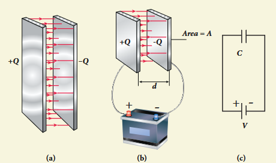
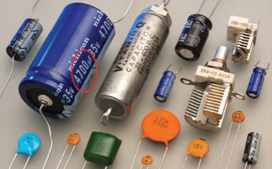
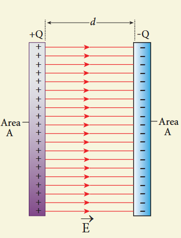
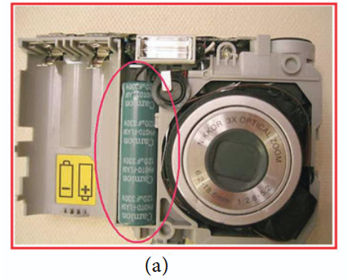
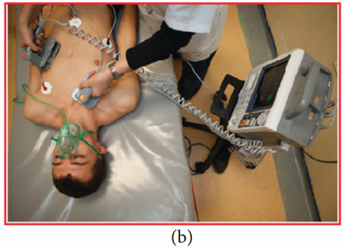
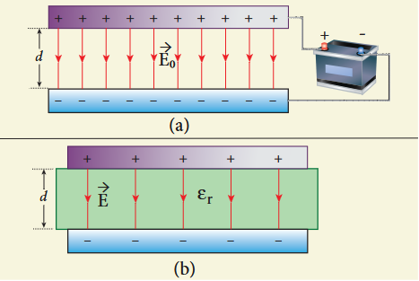
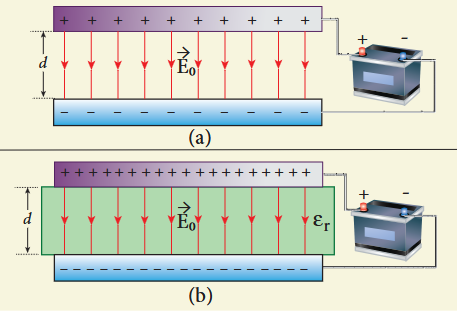
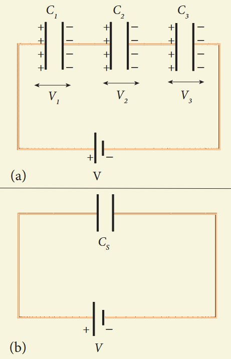
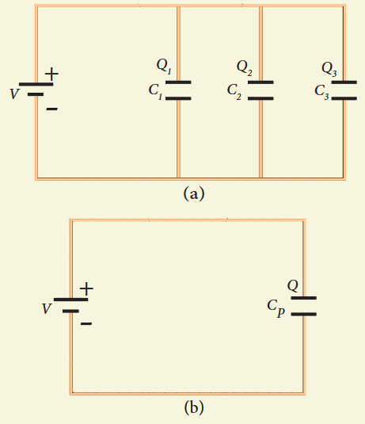
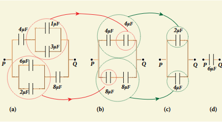

### 1.8.1 Capacitors

Capacitor is a device used to store electric charge and electrical energy. It consists of two conducting objects (usually plates or sheets) separated by some distance. Capacitors are widely used in many electronic circuits and have applications in many areas of science and technology.

A simple capacitor consists of two parallel metal plates separated by a small distance.

When a capacitor is connected to a battery of potential difference V, the electrons are transferred from one plate to the other plate by battery so that one plate becomes negatively charged with a charge of -Q and the other plate positively charged with +Q. The potential difference between the plates is equivalent to the battery's terminal voltage. If the battery voltage is increased, the amount of charges stored in the plates also increase. In general, the charge stored in the capacitor is proportional to the potential difference between the plates.

$$
Q \propto V
$$
$$
\text{so that } Q = CV
$$

where the C is the proportionality constant called capacitance. The capacitance C of a capacitor is defined as the ratio of the magnitude of charge on either of the conductor plates to the potential difference existing between them.

$$
C = \frac{Q}{V} \quad (1.81)
$$

The SI unit of capacitance is coulomb per volt or farad (F) in honor of Michael Faraday. Farad is a larger unit of capacitance. In practice, capacitors are available in the range of microfarad \((1\mu \mathrm{F} = 10^{-6}\mathrm{F})\) to picofarad \((1\mathrm{pF} = 10^{-12}\mathrm{F})\). A capacitor is represented by the symbol. Note that the total charge stored in the capacitor is zero \((Q - Q = 0)\). When we say the capacitor stores charges, it means the amount of charge that can be stored in any one of the plates.

Nowadays there are capacitors available in various shapes (cylindrical, disk) and types (tantalum, ceramic and electrolytic). These capacitors are extensively used in various kinds of electronic circuits.

**Capacitance of a parallel plate capacitor**

Consider a capacitor with two parallel plates each of cross-sectional area \(A\) and separated by a distance \(d\).

The electric field between two infinite parallel plates is uniform and is given by \(E = \frac{\sigma}{\epsilon_0}\) where \(\sigma\) is the surface charge density on either plates \(\left(\sigma = \frac{Q}{A}\right)\). If the separation distance \(d\) is very much smaller than the size of the plate \((d^2 \ll A)\), then the above result can be used even for finite-sized parallel plate capacitor.

The electric field between the plates is

$$
E = \frac{Q}{A\epsilon_{\circ}} \quad (1.82)
$$

Since the electric field is uniform, the electric potential difference between the plates having separation \(d\) is given by

$$
V = Ed = \frac{Qd}{A\epsilon_0} \quad (1.83)
$$

Therefore the capacitance of the capacitor is given by

$$
C = \frac{Q}{V} = \frac{Q}{Qd/(A\epsilon_0)} = \frac{\epsilon_0 A}{d} \quad (1.84)
$$

From equation (1.84), it is evident that capacitance is directly proportional to the area of cross section and is inversely proportional to the distance between the plates. This can be understood from the following.

(i) If the area of cross-section of the capacitor plates is increased, more charges can be distributed for the same potential difference. As a result, the capacitance is increased.

(ii) If the distance \(d\) between the two plates is reduced, the potential difference between the plates \((V = Ed)\) decreases with \(E\) constant. As a result, voltage difference between the terminals of the battery increases which in turn leads to an additional flow of charge to the plates from the battery, till the voltage on the capacitor equals to the battery's terminal voltage. Suppose the distance is increased, the capacitor voltage increases and becomes greater than the battery voltage. Then, the charges flow from capacitor plates to battery till both voltages becomes equal.

**EXAMPLE 1.20**

A parallel plate capacitor has square plates of side \(5\mathrm{cm}\) and separated by a distance of \(1\mathrm{mm}\). (a) Calculate the capacitance of this capacitor. (b) If a \(10\mathrm{V}\) battery is connected to the capacitor, what is the charge stored in any one of the plates? (The value of \(\epsilon_{\circ} = 8.85\times 10^{-12}\) \(\mathrm{N}^{-1}\mathrm{m}^{-2}\mathrm{C}^{2}\))

**Solution**

(a) The capacitance of the capacitor is

$$
C = \frac{\epsilon_0 A}{d} = \frac{8.85\times 10^{-12}\times 25\times 10^{-4}}{1\times 10^{-3}}
$$
$$
= 221.2\times 10^{-13}\mathrm{F}
$$
$$
C = 22.12\times 10^{-12}\mathrm{F} = 22.12\mathrm{pF}
$$

(b) The charge stored in any one of the plates is \(Q = CV\), Then

$$
Q = 22.12\times 10^{-12}\times 10 = 221.2\times 10^{-12}\mathrm{C} = 221.2\mathrm{pC}
$$

### 1.8.2 Energy stored in the capacitor

Capacitor not only stores the charge but also it stores energy. When a battery is connected to the capacitor, electrons of total charge -Q are transferred from one plate to the other plate. To transfer the charge, work is done by the battery. This work done is stored as electrostatic potential energy in the capacitor.

To transfer an infinitesimal charge \(dQ\) for a potential difference \(V\), the work done is given by

$$
dW = V dQ
$$
$$
\text{where } V = \frac{Q}{C}
$$

The total work done to charge a capacitor is

$$
W = \int_{0}^{Q} \frac{Q}{C} dQ = \frac{Q^{2}}{2C} \quad (1.86)
$$

This work done is stored as electrostatic potential energy \((U_{E})\) in the capacitor.

$$
U_{E} = \frac{Q^{2}}{2C} = \frac{1}{2} CV^{2} \quad (\because Q = CV) \quad (1.87)
$$

This stored energy is thus directly proportional to the capacitance of the capacitor and the square of the voltage between the plates of the capacitor.

But where is this energy stored in the capacitor? To understand this question, the equation (1.87) is rewritten as follows using the results \(C = \frac{\epsilon_0 A}{d}\) and \(V = Ed\)

$$
U_{E} = \frac{1}{2}\left(\frac{\epsilon_{0}A}{d}\right)(Ed)^{2} = \frac{1}{2}\epsilon_{0}(Ad)E^{2} \quad (1.88)
$$

where \(Ad =\) volume of the space between the capacitor plates. The energy stored per unit volume of space is defined as energy density \(u_{E} = \frac{U}{\text{Volume}}\). From equation (1.88), we get

$$
u_{E} = \frac{1}{2}\epsilon_{0}E^{2} \quad (1.89)
$$

From equation (1.89), we infer that the energy is stored in the electric field existing between the plates of the capacitor. Once the capacitor is allowed to discharge, the energy is retrieved.

It is important to note that the energy density depends only on the electric field and not on the size of the plates of the capacitor. In fact, expression (1.89) is true for the electric field due to any type of charge configuration.

### 1.8.3 Applications of capacitors

Capacitors are used in various electronics circuits. A few of the applications.

(a) Flash capacitors are used in digital cameras for taking photographs. The flash which comes from the camera when we take photographs is due to the energy released from the capacitor, called a flash capacitor.

(b) During cardiac arrest, a device called heart defibrillator is used to give a sudden surge of a large amount of electrical energy to the patient's chest to retrieve the normal heart function.

(c) Capacitors are used in the ignition system of automobile engines to eliminate sparking

(d) Capacitors are used to reduce power fluctuations in power supplies and to increase the efficiency of power transmission.

However, capacitors have disadvantage as well. Even after the battery or power supply is removed, the capacitor stores charges and energy for some time. For example if the TV is switched off, it is always advisable to not touch the back side of the TV panel.

### 1.8.4 Effect of dielectrics in capacitors

In earlier discussions, we assumed that the space between the parallel plates of a capacitor is either empty or filled with air. Suppose dielectrics like mica, glass or paper are introduced between the plates, then the capacitance of the capacitor is altered. The dielectric can be inserted into the plates in two different ways. (i) when the capacitor is disconnected from the battery. (ii) when the capacitor is connected to the battery.

**(i) when the capacitor is disconnected from the battery**

Consider a capacitor with two parallel plates each of cross-sectional area \(A\) and are separated by a distance \(d\). The capacitor is charged by a battery of voltage \(V_{0}\) and the charge stored is \(Q_{0}\). The capacitance of the capacitor without the dielectric is

$$
C_0 = \frac{Q_0}{V_0} \quad (1.90)
$$

The battery is then disconnected from the capacitor and the dielectric is inserted between the plates.

The introduction of dielectric between the plates will decrease the electric field. Experimentally it is found that the modified electric field is given by

$$
E = \frac{E_0}{\epsilon_r} \quad (1.91)
$$

where \(E_{0}\) is the electric field inside the capacitors when there is no dielectric and \(\epsilon_{r}\) is the relative permittivity of the dielectric or simply known as the dielectric constant. Since \(\epsilon_{r} > 1\), the electric field \(E < E_{0}\).

As a result, the electrostatic potential difference between the plates \((V = Ed)\) is also reduced. But at the same time, the charge \(Q_{0}\) will remain constant once the battery is disconnected.

Hence the new potential difference is

$$
V = Ed = \frac{E_0}{\epsilon_r} d = \frac{V_0}{\epsilon_r} \quad (1.92)
$$

We know that capacitance is inversely proportional to the potential difference. Therefore as \(V\) decreases, \(C\) increases.

Thus new capacitance in the presence of a dielectric is

$$
C = \frac{Q_0}{V} = \epsilon_r \frac{Q_0}{V_0} = \epsilon_r C_0 \quad (1.93)
$$

Since \(\epsilon_{r} > 1\), we have \(C > C_{0}\). Thus insertion of the dielectric increases the capacitance.

Using equation (1.84),

$$
C = \frac{\epsilon_r \epsilon_0 A}{d} = \frac{\epsilon A}{d} \quad (1.94)
$$

where \(\epsilon = \epsilon_{r}\epsilon_{0}\) is the permittivity of the dielectric medium.

The energy stored in the capacitor before the insertion of a dielectric is given by

$$
U_{0} = \frac{1}{2}\frac{Q_{0}^{2}}{C_{0}} \quad (1.95)
$$

After the dielectric is inserted, the charge \(Q_{0}\) remains constant but the capacitance is increased. As a result, the stored energy is decreased.

$$
U = \frac{1}{2}\frac{Q_{0}^{2}}{C} = \frac{1}{2}\frac{Q_{0}^{2}}{\epsilon_{r}C_{0}} = \frac{U_{0}}{\epsilon_{r}} \quad (1.96)
$$

Since \(\epsilon_{r} > 1\) we get \(U < U_{0}\). There is a decrease in energy because, when the dielectric is inserted, the capacitor spends some energy in pulling the dielectric inside.

**(ii) When the battery remains connected to the capacitor**

Let us now consider what happens when the battery of voltage \(V_{0}\) remains connected to the capacitor when the dielectric is inserted into the capacitor.

The potential difference \(V_{0}\) across the plates remains constant. But it is found experimentally (first shown by Faraday) that when dielectric is inserted, the charge stored in the capacitor is increased by a factor \(\epsilon_{r}\).

$$
Q = \epsilon_{r} Q_{o} \quad (1.97)
$$

Due to this increased charge, the capacitance is also increased. The new capacitance is

$$
C = \frac{Q}{V_{o}} = \epsilon_{r}\frac{Q_{o}}{V_{o}} = \epsilon_{r} C_{o} \quad (1.98)
$$

However the reason for the increase in capacitance in this case when the battery remains connected is different from the case when the battery is disconnected before introducing the dielectric.

$$
C_0 = \frac{\epsilon_0 A}{d}
$$
$$
\text{and } C = \frac{\epsilon A}{d}
$$

The energy stored in the capacitor before the insertion of a dielectric is given by

$$
U_{0} = \frac{1}{2} C_{0} V_{0}^{2} \quad (1.100)
$$

Note that here we have not used the expression \(U_{0} = \frac{1}{2}\frac{Q_{0}^{2}}{C_{0}}\) because here, both charge and capacitance are changed, whereas in equation (1.100), \(V_{o}\) remains constant.

After the dielectric is inserted, the capacitance is increased; hence the stored energy is also increased.

$$
U = \frac{1}{2} C V_{0}^{2} = \frac{1}{2}\epsilon_{r}C_{0}V_{0}^{2} = \epsilon_{r}U_{0} \quad (1.101)
$$

Since \(\epsilon_{r} > 1\) we have \(U > U_{o}\)

It may be noted here that since voltage between the capacitor \(V_{0}\) is constant, the electric field between the plates also remains constant.

The energy density is given by

$$
u = \frac{1}{2}\epsilon E_{0}^{2} \quad (1.102)
$$

where \(\epsilon\) is the permittivity of the given dielectric material.

The results of the above discussions are summarised in the following Table 1.2

**Table 1.2 Effect of dielectrics in capacitors**

| S. No | Dielectric is inserted | Charge Q | Voltage V | Electric field E | Capacitance C | Energy U |
|---|---|---|---|---|---|---|
| 1 | When the battery is disconnected | Constant | Decreases | Decreases | Increases | Decreases |
| 2 | When the battery is connected | Increases | Constant | Constant | Increases | Increases |

**When the key is pressed, the separation between the plates decreases leading to an increase in the capacitance. This in turn triggers the electronic circuits in the computer to identify which key is pressed.**

**EXAMPLE 1.21**

A parallel plate capacitor filled with mica having \(\epsilon_{r} = 5\) is connected to a \(10\mathrm{V}\) battery. The area of each parallel plate is \(6\mathrm{cm}^2\) and separation distance is \(6\mathrm{mm}\). (a) Find the capacitance and stored charge.
(b) After the capacitor is fully charged, the battery is disconnected and the dielectric is removed carefully.
Calculate the new values of capacitance, stored energy and charge.

**Solution**

(a) The capacitance of the capacitor in the presence of dielectric is

$$
C = \frac{\epsilon_r \epsilon_0 A}{d} = \frac{5\times 8.85\times 10^{-12}\times 6\times 10^{-4}}{6\times 10^{-3}} = 44.25\times 10^{-13}\mathrm{F} = 4.425\mathrm{pF}
$$

The stored charge is

$$
Q = CV = 44.25\times 10^{-13}\times 10 = 442.5\times 10^{-13}C = 44.25\mathrm{pC}
$$

The stored energy is

$$
U = \frac{1}{2} CV^2 = \frac{1}{2}\times 44.25\times 10^{-13}\times 100 = 2.21\times 10^{-10}\mathrm{J}
$$

(b) After the removal of the dielectric, since the battery is already disconnected the total charge will not change. But the potential difference between the plates increases. As a result, the capacitance is decreased.

New capacitance is

$$
C_0 = \frac{C}{\epsilon_r} = \frac{4.425\times 10^{-12}}{5} = 0.885\times 10^{-12}\mathrm{F} = 0.885\mathrm{pF}
$$

The stored charge remains same and \(44.25\mathrm{pC}\). Hence newly stored energy is

$$
U_{0} = \frac{Q^{2}}{2C_{0}} = \frac{Q^{2}\epsilon_{r}}{2C} = \epsilon_{r}U = 5\times 2.21\times 10^{-10}\mathrm{J} = 11.05\times 10^{-10}\mathrm{J}
$$

The increased energy is

$$
\Delta U = (11.05 - 2.21)\times 10^{-10}\mathrm{J} = 8.84\times 10^{-10}\mathrm{J}
$$

When the dielectric is removed, it experiences an inward pulling force due to the plates. To remove the dielectric, an external agency has to do work on the dielectric which is stored as additional energy. This is the source for the extra energy \(8.84\times 10^{-10}\mathrm{J}\).

### 1.8.5 Capacitor in series and parallel

**(i) Capacitor in series**

Consider three capacitors of capacitance \(C_{1}, C_{2}\) and \(C_{3}\) connected in series with a battery of voltage V.

As soon as the battery is connected to the capacitors in series, the electrons of charge \(-Q\) are transferred from negative terminal to the right plate of \(C_{3}\) which pushes the electrons of same amount \(-Q\) from left plate of \(C_{3}\) to the right plate of \(C_{2}\) due to electrostatic induction. Similarly, the left plate of \(C_{2}\) pushes the charges of \(-Q\) to the right plate of \(C_{1}\) which induces the positive charge \(+Q\) on the left plate of \(C_{1}\). At the same time, electrons of charge \(-Q\) are transferred from left plate of \(C_{1}\) to positive terminal of the battery.

By these processes, each capacitor stores the same amount of charge \(Q\). The capacitances of the capacitors are in general different, so that the voltage across each capacitor is also different and are denoted as \(V_{1}, V_{2}\) and \(V_{3}\) respectively.

The sum of the voltages across the capacitor must be equal to the voltage of the battery.

$$
V = V_{1} + V_{2} + V_{3} \quad (1.103)
$$

$$
V = \frac{Q}{C_{1}} + \frac{Q}{C_{2}} + \frac{Q}{C_{3}} = Q\left(\frac{1}{C_1} + \frac{1}{C_2} + \frac{1}{C_3}\right) \quad (1.104)
$$

If three capacitors in series are considered to form an equivalent single capacitor \(C_{s}\), then we have \(V = \frac{Q}{C_{s}}\). Substituting this expression into equation (1.104), we get

$$
\frac{Q}{C_s} = Q\left(\frac{1}{C_1} + \frac{1}{C_2} + \frac{1}{C_3}\right)
$$
$$
\frac{1}{C_s} = \frac{1}{C_1} + \frac{1}{C_2} + \frac{1}{C_3} \quad (1.105)
$$

Thus, the inverse of the equivalent capacitance \(C_{s}\) of three capacitors connected in series is equal to the sum of the inverses of each capacitance. This equivalent capacitance \(C_{s}\) is always less than the smallest individual capacitance in the series.

**(ii) Capacitance in parallel**

Consider three capacitors of capacitance \(C_{1}, C_{2}\) and \(C_{3}\) connected in parallel with a battery of voltage \(V\).

Since corresponding sides of the capacitors are connected to the same positive and negative terminals of the battery, the voltage across each capacitor is equal to the battery's voltage. Since capacitances of the capacitors are different, the charge stored in each capacitor is not the same. Let the charge stored in the three capacitors be \(Q_{1}, Q_{2}\) and \(Q_{3}\) respectively. According to the law of conservation of total charge, the sum of these three charges is equal to the charge \(Q\) transferred by the battery,

$$
Q = Q_{1} + Q_{2} + Q_{3} \quad (1.106)
$$

Since \(Q = CV\), we have

$$
Q = C_{1}V + C_{2}V + C_{3}V \quad (1.107)
$$

If these three capacitors are considered to form a single equivalent capacitance \(C_{p}\) which stores the total charge \(Q\), then we can write \(Q = C_{p}V\). Substituting this in equation (1.107), we get

$$
C_p V = C_1 V + C_2 V + C_3 V
$$
$$
C_p = C_1 + C_2 + C_3 \quad (1.108)
$$

Thus, the equivalent capacitance of capacitors connected in parallel is equal to the sum of the individual capacitances. The equivalent capacitance \(C_{p}\) in a parallel connection is always greater than the largest individual capacitance. In a parallel connection, it is equivalent as area of each capacitance adds to give more effective area such that total capacitance increases.

**EXAMPLE 1.22**

Find the equivalent capacitance between P and Q for the configuration shown below in the figure (a).

**Solution**

The capacitors \(1\mu \mathrm{F}\) and \(3\mu \mathrm{F}\) are connected in parallel and \(6\mu \mathrm{F}\) and \(2\mu \mathrm{F}\) are also separately connected in parallel. So these parallel combinations reduced to equivalent single capacitances in their respective positions.

$$
C_{eq} = 1 + 3 = 4\mu \mathrm{F}
$$
$$
C_{eq} = 6 + 2 = 8\mu \mathrm{F}
$$

From the figure (b), we infer that the two \(4\mu \mathrm{F}\) capacitors are connected in series and the two \(8\mu \mathrm{F}\) capacitors are connected in series. By using formula for the series, we can reduce to their equivalent capacitances.

$$
\frac{1}{C_{eq}} = \frac{1}{4} + \frac{1}{4} = \frac{1}{2} \Rightarrow C_{eq} = 2\mu \mathrm{F}
$$
$$
\frac{1}{C_{eq}} = \frac{1}{8} + \frac{1}{8} = \frac{1}{4} \Rightarrow C_{eq} = 4\mu \mathrm{F}
$$

From the figure (c), we infer that \(2\mu \mathrm{F}\) and \(4\mu \mathrm{F}\) are connected in parallel. So the equivalent capacitance is

$$
C_{eq} = 2 + 4 = 6\mu \mathrm{F}
$$

Thus the combination of capacitances in figure (a) can be replaced by a single capacitance \(6\mu \mathrm{F}\).