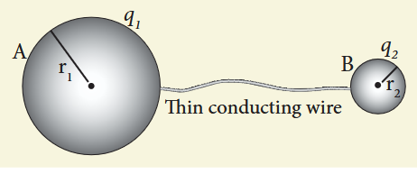
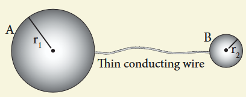
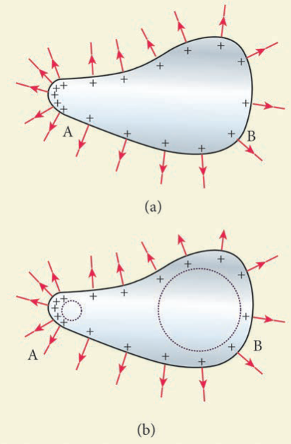
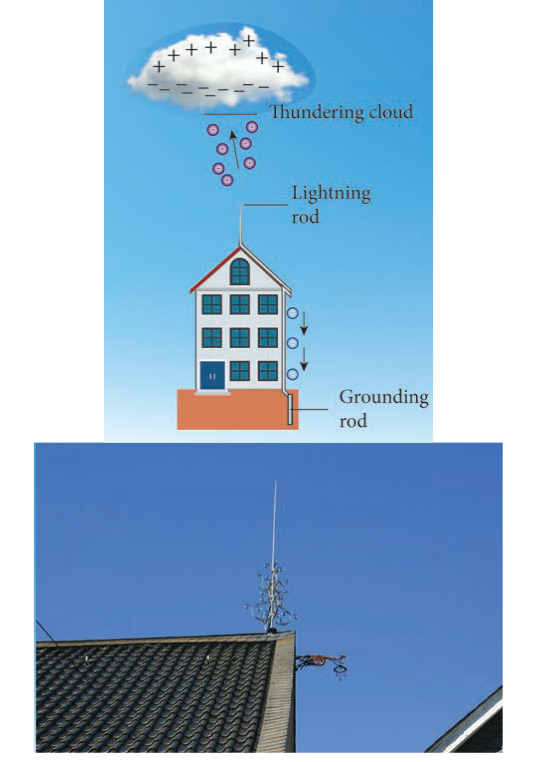
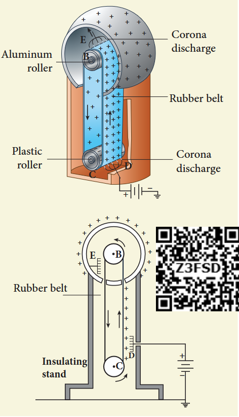

### 1.9.1 Distribution of charges in a conductor

Consider two conducting spheres A and B of radii \(r_{1}\) and \(r_{2}\) respectively connected to each other by a thin conducting wire. The distance between the spheres is much greater than the radii of either spheres.

If a charge \(Q\) is introduced into any one of the spheres, this charge \(Q\) is redistributed into both the spheres such that the electrostatic potential is same in both the spheres. They are now uniformly charged and attain electrostatic equilibrium. Let \(q_{1}\) be the charge residing on the surface of sphere A and \(q_{2}\) is the charge residing on the surface of sphere B such that \(Q = q_{1} + q_{2}\). The charges are distributed only on the surface and there is no net charge inside the conductor.

The electrostatic potential at the surface of the sphere A is given by

$$
V_{A} = \frac{1}{4\pi\epsilon_{0}}\frac{q_{1}}{r_{1}} \quad (1.109)
$$

The electrostatic potential at the surface of the sphere B is given by

$$
V_{B} = \frac{1}{4\pi\epsilon_{0}}\frac{q_{2}}{r_{2}} \quad (1.110)
$$

The surface of the conductor is an equipotential. Since the spheres are connected by the conducting wire, the surfaces of both the spheres together form an equipotential surface. This implies that

$$
V_{A} = V_{B}
$$
$$
\text{or } \frac{q_{1}}{r_{1}} = \frac{q_{2}}{r_{2}} \quad (1.111)
$$

Let the charge density on the surface of sphere A be \(\sigma_{1}\) and that on the surface of sphere B be \(\sigma_{2}\). This implies that \(q_{1} = 4\pi r_{1}^{2}\sigma_{1}\) and \(q_{2} = 4\pi r_{2}^{2}\sigma_{2}\). Substituting these values into equation (1.112), we get

$$
\sigma_{1} r_{1} = \sigma_{2} r_{2} \quad (1.112)
$$

from which we conclude that

$$
\sigma r = \text{constant} \quad (1.113)
$$

The surface charge density \(\sigma\) is inversely proportional to the radius of the sphere. For a smaller radius, the charge density will be larger and vice versa.

**EXAMPLE 1.23**

Two conducting spheres of radius \(r_{1} = 8 \mathrm{cm}\) and \(r_{2} = 2 \mathrm{cm}\) are separated by a distance much larger than \(8 \mathrm{cm}\) and are connected by a thin conducting wire. A total charge of \(Q = +100 \mathrm{nC}\) is placed on one of the spheres. After a fraction of a second, the charge \(Q\) is redistributed and both the spheres attain electrostatic equilibrium.

(a) Calculate the charge and surface charge density on each sphere.
(b) Calculate the potential at the surface of each sphere.

**Solution**

(a) The electrostatic potential on the surface of the sphere A is \(V_{A} = \frac{1}{4\pi\epsilon_{0}}\frac{q_{1}}{r_{1}}\)

The electrostatic potential on the surface of the sphere B is \(V_{B} = \frac{1}{4\pi\epsilon_{0}}\frac{q_{2}}{r_{2}}\)

Since \(V_{A} = V_{B}\). We have

$$
\frac{q_1}{r_1} = \frac{q_2}{r_2} \Rightarrow q_1 = \left(\frac{r_1}{r_2}\right) q_2
$$

But from the conservation of total charge, \(Q = q_{1} + q_{2}\), we get \(q_{1} = Q - q_{2}\). By substituting this in the above equation,

$$
Q - q_{2} = \left(\frac{r_{1}}{r_{2}}\right) q_{2}
$$

so that \(q_{2} = Q\left(\frac{r_{2}}{r_{1} + r_{2}}\right)\)

Therefore,

$$
q_{2} = 100\times 10^{-9}\times \left(\frac{2}{10}\right) = 20\mathrm{nC}
$$

and \(q_{1} = Q - q_{2} = 80 \mathrm{nC}\)

The electric charge density on sphere A is \(\sigma_{1} = \frac{q_{1}}{4\pi r_{1}^{2}}\)

The electric charge density on sphere B is \(\sigma_{2} = \frac{q_{2}}{4\pi r_{2}^{2}}\)

Therefore,

$$
\sigma_{1} = \frac{80\times 10^{-9}}{4\pi\times 64\times 10^{-4}} = 0.99\times 10^{-6}\mathrm{Cm}^{-2}
$$

and

$$
\sigma_{2} = \frac{20\times 10^{-9}}{4\pi\times 4\times 10^{-4}} = 3.9\times 10^{-6}\mathrm{Cm}^{-2}
$$

Note that the surface charge density is greater on the smaller sphere compared to the larger sphere \(\left(\sigma_{2} \approx 4\sigma_{1}\right)\) which confirms the result \(\frac{\sigma_{1}}{\sigma_{2}} = \frac{r_{2}}{r_{1}}\).

The potential on both spheres is the same. So we can calculate the potential on any one of the spheres.

$$
V_{A} = \frac{1}{4\pi\epsilon_{0}}\frac{q_{1}}{r_{1}} = \frac{9\times 10^{9}\times 80\times 10^{-9}}{8\times 10^{-2}} = 9\mathrm{kV}
$$

### 1.9.2 Action of points or Corona discharge

Consider a charged conductor of irregular shape. The charge density will be large where the radius of curvature is small. This implies that near the sharp edges of the conductor, the surface charge density is large. This results in a very large electric field around the sharp edges. The electric field around the sharp edges may become so large that it may ionize the surrounding air. Positive ions are repelled by the positive charges on the conductor and negative ions are attracted towards the conductor. The positive ions carry charge from the conductor to the air. Thus the charge on the conductor is reduced. This process is called action at points or corona discharge.

### 1.9.3 Lightning arrester or lightning conductor

This is a device used to protect tall buildings from lightning strikes. It works on the principle of action at points or corona discharge.

This device consists of a long thick copper rod passing from top of the building to the ground. The upper end of the rod has a sharp spike or a sharp needle. The lower end of the rod is connected to copper plate which is buried deep into the ground. When a negatively charged cloud is passing above the building, it induces a positive charge on the spike. Since the induced charge density on thin sharp spike is large, it results in a corona discharge. This positive charge ionizes the surrounding air which in turn neutralizes the negative charge in the cloud. The negative charge pushed to the spikes passes through the copper rod and reaches the ground. Thus the building is protected from lightning.

### 1.9.4 Van de Graaff Generator

In the year 1929, Robert Van de Graaff designed a machine which produces a large amount of electrostatic potential difference, up to several million volts \((10^{7}\mathrm{V})\). This Van de Graff generator works on the principle of electrostatic induction and action at points.

A large hollow spherical conductor is fixed on the insulating stand. A pulley B is mounted at the centre of the hollow sphere and another pulley C is fixed at the bottom. A belt made up of insulating materials like silk or rubber runs over both pulleys. The pulley C is driven continuously by the electric motor. Two comb shaped metallic conductors E and D are fixed near the pulleys.

The comb D is maintained at a positive potential of \(10^{4}\mathrm{V}\) by a power supply. The upper comb E is connected to the inner side of the hollow metal sphere.

Due to the high electric field near comb D, air between the belt and comb D gets ionized by the action of points. The positive charges are pushed towards the belt and negative charges are attracted towards the comb D. The positive charges stick to the belt and move up. When the positive charges on the belt reach the point near the comb E, the comb E acquires negative charge and the sphere acquires positive charge due to electrostatic induction. As a result, the positive charges are pushed away from the comb E and they reach the outer surface of the sphere. Since the sphere is a conductor, the positive charges are distributed uniformly on the outer surface of the hollow sphere. At the same time, the negative charges nullify the positive charges in the belt due to corona discharge before it passes over the pulley.

When the belt descends, it has almost no net charge. At the bottom, it again gains a large positive charge. The belt goes up and delivers the positive charges to the outer surface of the sphere. This process continues until the outer surface produces the potential difference of the order of \(10^{7}\) which is the limiting value. We cannot store charges beyond this limit since the extra charge starts leaking to the surroundings due to ionization of air. The leakage of charges can be reduced by enclosing the machine in a gas filled steel chamber at very high pressure.

The high voltage produced in this Van de Graaff generator is used to accelerate positive ions (protons and deuterons) for nuclear disintegrations and other applications.

**EXAMPLE 1.24**

Dielectric strength of air is \(3\times 10^{6}\mathrm{Vm^{-1}}\). Suppose the radius of a hollow sphere in the Van de Graff generator is \(R = 0.5\mathrm{m}\), calculate the maximum potential difference created by this Van de Graaff generator.

**Solution**

The electric field on the surface of the sphere is given by (by Gauss law)

$$
E = \frac{1}{4\pi\epsilon_{\circ}}\frac{Q}{R^{2}}
$$

The potential on the surface of the hollow metallic sphere is given by

$$
V = \frac{1}{4\pi\epsilon_{\circ}}\frac{Q}{R} = ER
$$

Since \(V_{max} = E_{max}R\)

Here \(E_{\mathrm{max}} = 3\times 10^{6}\mathrm{Vm^{-1}}\). So the maximum potential difference created is given by

$$
V_{max} = 3\times 10^{6}\times 0.5 = 1.5\times 10^{6}\mathrm{V} \text{ (or) } 1.5 \text{ million volt}
$$

---