### Conductors at electrostatic equilibrium

An electrical conductor has a large number of mobile charges which are free to move in the material. In a metallic conductor, these mobile charges are free electrons which are not bound to any atom and therefore are free to move on the surface of the conductor. When there is no external electric field, the free electrons are in continuous random motion in all directions. As a result, there is no net motion of electrons along any particular direction which implies that the conductor is in electrostatic equilibrium. Thus at electrostatic equilibrium, there is no net current in the conductor. A conductor at electrostatic equilibrium has the following properties.

(i) The electric field is zero everywhere inside the conductor. This is true regardless of whether the conductor is solid or hollow.

This is an experimental fact. Suppose the electric field is not zero inside the metal, then there will be a force on the mobile charge carriers due to this electric field. As a result, there will be a net motion of the mobile charges, which contradicts the conductors being in electrostatic equilibrium. Thus the electric field is zero everywhere inside the conductor. We can also understand this fact by applying an external uniform electric field on the conductor.

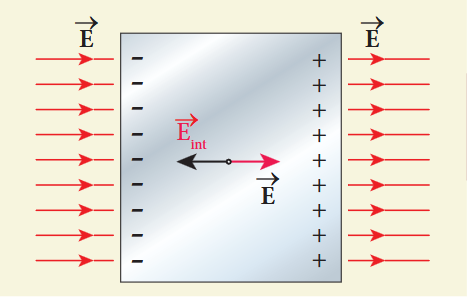

Before applying the external electric field, the free electrons in the conductor are uniformly distributed in the conductor. When an electric field is applied, the free electrons accelerate to the left causing the left plate to be negatively charged and the right plate to be positively charged.

Due to this realignment of free electrons, there will be an internal electric field created inside the conductor which increases until it nullifies the external electric field. Once the external electric field is nullified the conductor is said to be in electrostatic equilibrium. The time taken by a conductor to reach electrostatic equilibrium is in the order of \(10^{-16}\mathrm{s}\), which can be taken as almost instantaneous.

(ii) There is no net charge inside the conductors. The charges must reside only on the surface of the conductors.

We can prove this property using Gauss law. Consider an arbitrarily shaped conductor. A Gaussian surface is drawn inside the conductor such that it is very close to the surface of the conductor. Since the electric field is zero everywhere inside the conductor, the net electric flux is also zero over this Gaussian surface. From Gauss's law, this implies that there is no net charge inside the conductor. Even if some charge is introduced inside the conductor, it immediately reaches the surface of the conductor.

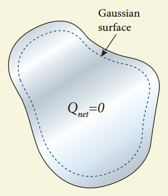

(iii) The electric field outside the conductor is perpendicular to the surface of the conductor and has a magnitude of \(\frac{\sigma}{\epsilon_0}\) where \(\sigma\) is the surface charge density at that point.

If the electric field has components parallel to the surface of the conductor, then free electrons on the surface of the conductor would experience acceleration. This means that the conductor is not in equilibrium. Hence at equilibrium, the electric field should be perpendicular to the surface of the conductor.

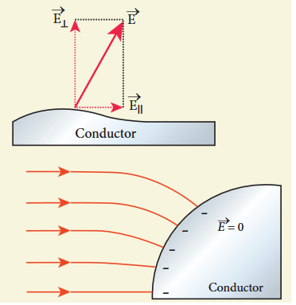

We now prove that the electric field has magnitude \(\frac{\sigma}{\epsilon_0}\) just outside the conductor's surface. Consider a small cylindrical Gaussian surface. One half of this cylinder is embedded inside the conductor.

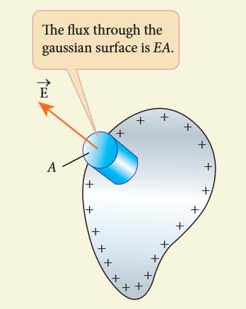

Since electric field is normal to the surface of the conductor, the curved part of the cylinder has zero electric flux. Also inside the conductor, the electric field is zero. Hence the bottom flat part of the Gaussian surface has no electric flux.

Therefore the top flat surface alone contributes to the electric flux. The electric field is parallel to the area vector and the total charge inside the surface is \(\sigma A\). By applying Gauss's law,

$$
EA = \frac{\sigma A}{\epsilon_{\circ}}
$$

In vector form,

$$
\vec{E} = \frac{\sigma}{\epsilon_{\circ}}\hat{n} \quad (1.79)
$$

where \(\hat{n}\) represents the unit vector outward normal to the surface of the conductor. Suppose \(\sigma < 0\), then electric field points inward perpendicular to the surface.

(iv) The electrostatic potential has the same value on the surface and inside of the conductor.

We know that the conductor has no parallel electric component on the surface which means that charges can be moved on the surface without doing any work. This is possible only if the electrostatic potential is constant at all points on the surface and there is no potential difference between any two points on the surface.

Since the electric field is zero inside the conductor, the potential is the same as the surface of the conductor. Thus at electrostatic equilibrium, the conductor is always at equipotential.

### Electrostatic shielding

Using Gauss law, we can prove that the electric field inside the charged spherical shell is zero. Further, we can show that the electric field inside both hollow and solid conductors is zero. It is a very interesting property which has an important consequence.

Consider a cavity inside the conductor. Whatever be the charges at the surfaces and whatever be the electrical disturbances outside, the electric field inside the cavity is zero. A sensitive electrical instrument which is to be protected from external electrical disturbance can be kept inside this cavity. This is called electrostatic shielding.

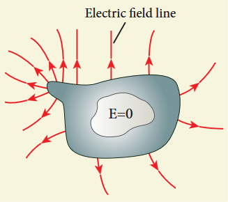

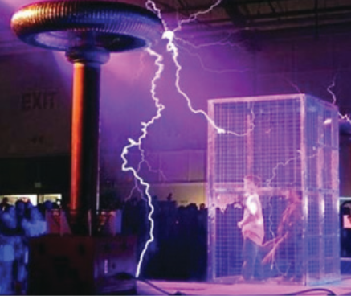

Faraday cage is an instrument used to demonstrate this effect. It is made up of metal bars. If an artificial lightning jolt is created outside, the person inside is not affected.

During lightning accompanied by a thunderstorm, it is always safer to sit inside a bus than in open ground or under a tree. The metal body of the bus provides electrostatic shielding, since the electric field inside is zero. During lightning, the charges flow through the body of the conductor to the ground with no effect on the person inside that bus.

### Electrostatic induction

In section 1.1, we have learnt that an object can be charged by rubbing using an appropriate material. Whenever a charged rod is touched by another conductor, charges start to flow from charged rod to the conductor. Is it possible to charge a conductor without any contact? The answer is yes. This type of charging without actual contact is called electrostatic induction.

(i) Consider an uncharged (neutral) conducting sphere at rest on an insulating stand. Suppose a negatively charged rod is brought near the conductor without touching it.

The negative charge of the rod repels the electrons in the conductor to the opposite side. As a result, positive charges are induced near the region of the charged rod while negative charges on the farther side.

Before introducing the charged rod, the free electrons were distributed uniformly on the surface of the conductor and the net charge is zero. Once the charged rod is brought near the conductor, the distribution is no longer uniform with more electrons located on the farther side of the rod and positive charges are located closer to the rod. But the total charge is zero.

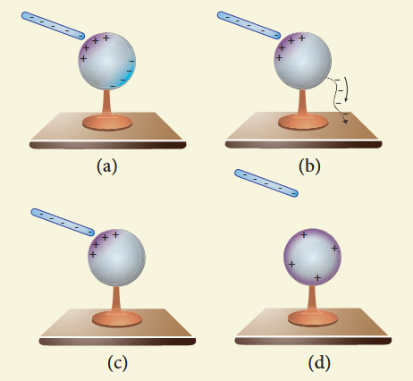

(ii) Now the conducting sphere is connected to the ground through a conducting wire. This is called grounding. Since the ground can always receive any amount of electrons, grounding removes the electron from the conducting sphere. Note that positive charges will not flow to the ground because they are attracted by the negative charges of the rod.

(iii) When the grounding wire is removed from the conductor, the positive charges remain near the charged rod.

(iv) Now the charged rod is taken away from the conductor. As soon as the charged rod is removed, the positive charge gets distributed uniformly on the surface of the conductor. By this process, the neutral conducting sphere becomes positively charged.

For an arbitrary shaped conductor, the intermediate steps and conclusion are the same except the final step. The distribution of positive charges is not uniform for arbitrarily-shaped conductors.

**EXAMPLE 1.19**

A small ball of conducting material having a charge \(+q\) and mass m is thrown upward at an angle \(\theta\) to horizontal surface with an initial speed \(\nu_{0}\) as shown in the figure. There exists an uniform electric field \(E\) downward along with the gravitational field \(g\). Calculate the range, maximum height and time of flight in the motion of this charged ball. Neglect the effect of air and treat the ball as a point mass.

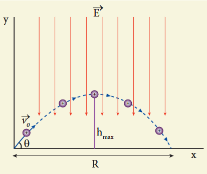

**Solution**

If the conductor has no net charge, then its motion is the same as usual projectile motion of a mass m which we studied in Kinematics. Here, in this problem, in addition to downward gravitational force, the charge also will experience a downward uniform electrostatic force.

The acceleration of the charged ball due to gravity \(= -g\hat{j}\)

The acceleration of the charged ball due to uniform electric field \(= -\frac{qE}{m}\hat{j}\)

The total acceleration of charged ball in downward direction \(\vec{a} = -\left(g + \frac{qE}{m}\right)\hat{j}\)

It is important here to note that the acceleration depends on the mass of the object. Galileo's conclusion that all objects fall at the same rate towards the Earth is true only in a uniform gravitational field. When a uniform electric field is included, the acceleration of a charged object depends on both mass and charge.

But still the acceleration \(a = \left(g + \frac{qE}{m}\right)\) is constant throughout the motion. Hence we use kinematic equations to calculate the range, maximum height and time of flight. In fact we can simply replace \(g\) by \(g + \frac{qE}{m}\) in the usual expressions of range, maximum height and time of flight of a projectile.

| | Without charge | With the charge +q |
|---|---|---|
| Time of flight T | \(\frac{2v_0 \sin\theta}{g}\) | \(\frac{2v_0 \sin\theta}{g + qE/m}\) |
| Maximum height h_max | \(\frac{v_0^2 \sin^2\theta}{2g}\) | \(\frac{v_0^2 \sin^2\theta}{2(g + qE/m)}\) |
| Range R | \(\frac{v_0^2 \sin 2\theta}{g}\) | \(\frac{v_0^2 \sin 2\theta}{g + qE/m}\) |

Note that the time of flight, maximum height, range are all inversely proportional to the acceleration of the object. Since \(\left(g + \frac{qE}{m}\right) > g\) for charge \(+q\), the quantities \(T\), \(h_{max}\) and \(R\) will decrease when compared to the motion of an object of mass m and zero net charge. Suppose the charge is \(-q\), then \(\left(g - \frac{qE}{m}\right) < g\), and the quantities \(T\), \(h_{max}\) and \(R\) will increase. Interestingly the trajectory is still parabolic.

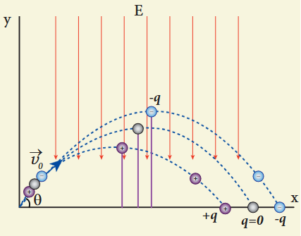

### Dielectrics or insulators

A dielectric is a non-conducting material and has no free electrons. The electrons in a dielectric are bound within the atoms. Ebonite, glass and mica are some examples of dielectrics. When an external electric field is applied, the electrons are not free to move anywhere but they are realigned in a specific way. A dielectric is made up of either polar molecules or nonpolar molecules.

**Non-polar molecules**

A non-polar molecule is one in which centres of positive and negative charges coincide. As a result, it has no permanent dipole moment. Examples of non-polar molecules are hydrogen \(\mathrm{(H_2)}\), oxygen \(\mathrm{(O_2)}\) and carbon dioxide \(\mathrm{(CO_2)}\) etc.

When an external electric field is applied, the centres of positive and negative charges are separated by a small distance which induces dipole moment in the direction of the external electric field. Then the dielectric is said to be polarized by an external electric field.

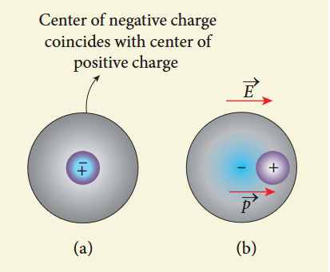

**Polar molecules**

In polar molecules, the centres of the positive and negative charges are separated even in the absence of an external electric field. They have a permanent dipole moment. Due to thermal motion, the direction of each dipole moment is oriented randomly. Hence the net dipole moment is zero in the absence of an external electric field. Examples of polar molecules are \(\mathrm{H}_2\mathrm{O}\), \(\mathrm{N}_2\mathrm{O}\), HCl, \(\mathrm{NH}_3\).

When an external electric field is applied, the dipoles inside the material tend to align in the direction of the electric field. Hence a net dipole moment is induced in it. Then the dielectric is said to be polarized by an external electric field.

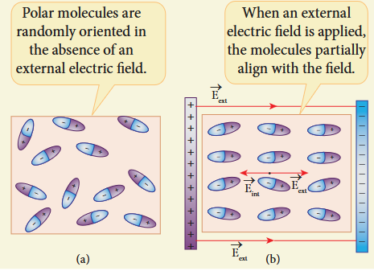

**Polarisation**

In the presence of an external electric field, the dipole moment is induced in the dielectric material. Polarisation \(\vec{P}\) is defined as the total dipole moment per unit volume of the dielectric. For most dielectrics (linear isotropic), the Polarisation is directly proportional to the strength of the external electric field. This is written as

$$
\vec{P} = \epsilon_0 \chi_e \vec{E}
$$

where \(\chi_{e}\) is a constant called the electric susceptibility which is a characteristic of each dielectric.

### Induced Electric field inside the dielectric

When an external electric field is applied on a conductor, the charges are aligned in such a way that an internal electric field is created which tends to cancel the external electric field. But in the case of a dielectric, which has no free electrons, the external electric field only realigns the charges so that an internal electric field is produced. The magnitude of the internal electric field is smaller than that of external electric field. Therefore the net electric field inside the dielectric is not zero but is parallel to an external electric field with magnitude less than that of the external electric field. For example, let us consider a rectangular dielectric slab placed between two oppositely charged plates (capacitor).

The uniform electric field between the plates acts as an external electric field \(\vec{E}_{\mathrm{ext}}\) which polarizes the dielectric placed between plates. The positive charges are induced on one side surface and negative charges are induced on the other side of surface.

But inside the dielectric, the net charge is zero even in a small volume. So the dielectric in the external field is equivalent to two oppositely charged sheets with the surface charge densities \(+ \sigma_{b}\) and \(- \sigma_{b}\). These charges are called bound charges. They are not free to move like free electrons in conductors.

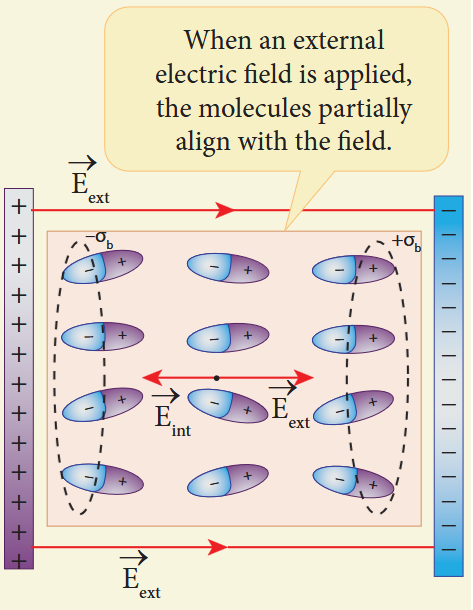
****
For example, the charged balloon after rubbing sticks onto a wall. The reason is that the negatively charged balloon is brought near the wall, it polarizes opposite charges on the surface of the wall, which attracts the balloon.

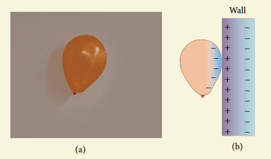

### Dielectric strength

When the external electric field applied to a dielectric is very large, it tears the atoms apart so that the bound charges become free charges. Then the dielectric starts to conduct electricity. This is called dielectric breakdown. The maximum electric field the dielectric can withstand before it breakdown is called dielectric strength. For example, the dielectric strength of air is \(3 \times 10^{6} \mathrm{~V} \mathrm{~m}^{-1}\). If the applied electric field increases beyond this, a spark is produced in the air. The dielectric strengths of some dielectrics are given in the Table 1.1.

**Table 1.1 Dielectric strength**

| Substance | Dielectric strength (Vm⁻¹) |
|---|---|
| Mica | 100 × 10⁶ |
| Teflon | 60 × 10⁶ |
| Paper | 16 × 10⁶ |
| Air | 3 × 10⁶ |
| Pyrex glass | 14 × 10⁶ |