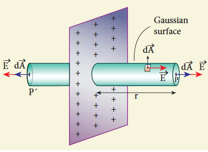
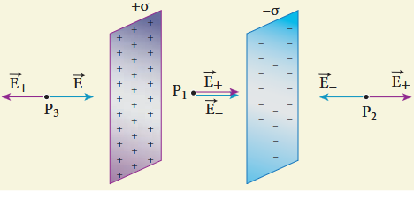
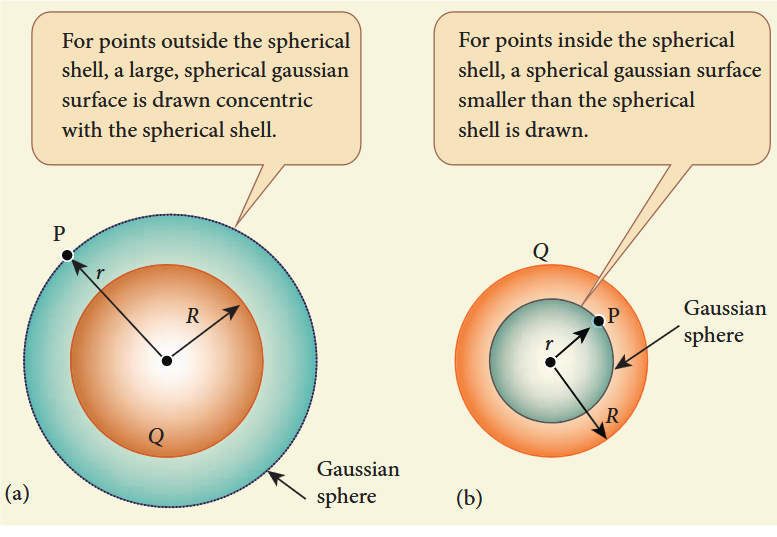
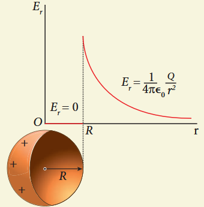

### Electric Flux

The number of electric field lines crossing a given area kept normal to the electric field lines is called electric flux. It is usually denoted by the Greek letter \(\Phi_{E}\) and its unit is \(\mathrm{Nm^2C^{-1}}\). Electric flux is a scalar quantity and it can be positive or negative.

The electric field of a point charge is drawn. Consider two small rectangular area elements placed normal to the field at regions A and B. Even though these elements have the same area, the number of electric field lines crossing the element in region A is more than that crossing the element in region B. Therefore the electric flux in region A is more than that in region B. Since electric field strength for a point charge decreases as the distance increases, electric flux also decreases as the distance increases.

### Electric flux for uniform Electric field

Consider a uniform electric field in a region of space. Let us choose an area \(A\) normal to the electric field lines. The electric flux for this case is

$$
\Phi_{E} = EA \quad (1.52)
$$

Suppose the same area \(A\) is kept parallel to the uniform electric field, then no electric field lines pass through the area \(A\). The electric flux for this case is zero.

$$
\Phi_{E} = 0 \quad (1.53)
$$

If the area is inclined at an angle \(\theta\) with the field, then the component of the electric field perpendicular to the area alone contributes to the electric flux. The electric field component parallel to the surface area will not contribute to the electric flux. For this case, the electric flux

$$
\Phi_{E} = (E\cos \theta)A \quad (1.54)
$$

Further, \(\theta\) is also the angle between the electric field and the direction normal to the area. Hence in general, for uniform electric field, the electric flux is defined as

$$
\Phi_{E} = \vec{E}\cdot \vec{A} = EA\cos \theta \quad (1.55)
$$

Here, note that \(\vec{A}\) is the area vector \(\vec{A} = A\hat{n}\). Its magnitude is simply the area \(A\) and its direction is along the unit vector \(\hat{n}\) perpendicular to the area. Using this definition for flux, \(\Phi_{E} = \vec{E}\cdot \vec{A}\), equations (1.53) and (1.54) can be obtained as special cases.

In Figure (a), \(\theta = 0^{\circ}\). Therefore, \(\Phi_{E} = \vec{E}\cdot \vec{A} = EA\)

In Figure (b), \(\theta = 90^{\circ}\). Therefore, \(\Phi_{E} = \vec{E}\cdot \vec{A} = 0\)

**EXAMPLE 1.17**

Calculate the electric flux through the rectangle of sides \(5\mathrm{cm}\) and \(10\mathrm{cm}\) kept in the region of a uniform electric field \(100\mathrm{NC}^{-1}\). The angle \(\theta\) is \(60^{\circ}\). If \(\theta\) becomes zero, what is the electric flux?

**Solution**

The electric flux through the rectangular area

$$
\Phi_{E} = \vec{E}\cdot \vec{A} = EA\cos \theta
$$
$$
= 100\times 5\times 10\times 10^{-4}\times \cos 60^{\circ}
$$
$$
\Phi_{E} = 0.25\mathrm{Nm}^{2}\mathrm{C}^{-1}
$$

For \(\theta = 0^{\circ}\)

$$
\Phi_{E} = 100\times 5\times 10\times 10^{-4}\times \cos 0^{\circ} = 0.5\mathrm{Nm}^{2}\mathrm{C}^{-1}
$$

### Electric flux through an arbitrary area kept in a non uniform electric field

Suppose the electric field is not uniform and the area \(A\) is not flat surface. Then the entire area can be divided into \(n\) small area segments \(\Delta \vec{A}_1,\Delta \vec{A}_2,\Delta \vec{A}_3,\dots \Delta \vec{A}_n\) such that each area element is almost flat and the electric field over such area element can be considered uniform.

The electric flux for the entire area \(A\) is approximately written as

$$
\Phi_{E} = \sum_{i=1}^{n} \vec{E}_{i}\cdot \Delta \vec{A}_{i} \quad (1.56)
$$

By taking the limit \(\Delta \vec{A}_i \to 0\) (for each area element), the summation becomes integration. Then the electric flux for the entire area \(A\) is

$$
\Phi_{E} = \int \vec{E}\cdot d\vec{A} \quad (1.57)
$$

### Electric flux for closed surfaces

Suppose a closed surface is present in the region of the non-uniform electric field. The total electric flux over this closed surface is written as

$$
\Phi_{E} = \oint \bar{E}\cdot d\bar{A} \quad (1.58)
$$

Note the difference between equations (1.57) and (1.58). The integration in equation (1.58) is a closed surface integration and for each areal element, the outward normal is the direction of \(d\bar{A}\).

The total electric flux over a closed surface can be negative, positive or zero. In one area element, the angle between \(d\bar{A}\) and \(\bar{E}\) is less than \(90^{\circ}\), then the electric flux is positive and in another areal element, the angle between \(d\bar{A}\) and \(\bar{E}\) is greater than \(90^{\circ}\), then the electric flux is negative.

In general, the electric flux is negative if the electric field lines enter the closed surface and positive if the electric field lines leave the closed surface.

### Gauss law

A positive point charge \(Q\) is surrounded by an imaginary sphere of radius \(r\). We can calculate the total electric flux through the closed surface of the sphere using the equation (1.58).

$$
\Phi_{E} = \oint \bar{E}\cdot d\bar{A} = \oint EdA\cos \theta
$$

The electric field of the point charge is directed radially outward at all points on the surface of the sphere. Therefore, the direction of the area element \(d\bar{A}\) is along the electric field \(\bar{E}\) and \(\theta = 0^{\circ}\).

$$
\Phi_{E} = \oint EdA \qquad \text{since } \cos 0^{\circ} = 1 \quad (1.59)
$$

\(E\) is uniform on the surface of the sphere,

$$
\Phi_{E} = E\oint dA \quad (1.60)
$$

Substituting for \(\oint dA = 4\pi r^2\) and \(E = \frac{1}{4\pi\epsilon_0}\frac{Q}{r^2}\) in equation (1.60), we get

$$
\Phi_{E} = \frac{1}{4\pi\epsilon_{0}}\frac{Q}{r^{2}}\times 4\pi r^{2} = \frac{Q}{\epsilon_{0}} \quad (1.61)
$$

The equation (1.61) is called as Gauss's law.

The remarkable point about this result is that the equation (1.61) is equally true for any arbitrary shaped surface which encloses the charge \(Q\). It is seen that the total electric flux is the same for closed surfaces \(A_{1}, A_{2}\) and \(A_{3}\).

Gauss's law states that if a charge \(Q\) is enclosed by an arbitrary closed surface, then the total electric flux \(\Phi_{E}\) through the closed surface is

$$
\Phi_{E} = \oint \vec{E}\cdot d\vec{A} = \frac{Q_{\mathrm{encl}}}{\epsilon_{0}} \quad (1.62)
$$

where \(Q_{\mathrm{encl}}\) denotes the charges within the closed surface.

### Discussion of Gauss law

(i) The total electric flux through the closed surface depends only on the charges enclosed by the surface and the charges present outside the surface will not contribute to the flux and the shape of the closed surface which can be chosen arbitrarily.

(ii) The total electric flux is independent of the location of the charges inside the closed surface.

(iii) To arrive at equation (1.62), we have chosen a spherical surface. This imaginary surface is called a Gaussian surface. The shape of the Gaussian surface to be chosen depends on the type of charge configuration and the kind of symmetry existing in that charge configuration. The electric field is spherically symmetric for a point charge, therefore spherical Gaussian surface is chosen. Cylindrical and planar Gaussian surfaces can be chosen for other kinds of charge configurations.

(iv) In the LHS of equation (1.62), the electric field \(\vec{E}\) is due to charges present inside and outside the Gaussian surface but the charge \(Q_{encl}\) denotes the charges which lie only inside the Gaussian surface.

**EXAMPLE 1.18**

(i) In figure (a), calculate the electric flux through the closed areas \(A_{1}\) and \(A_{2}\).
(ii) In figure (b), calculate the electric flux through the cube

**Solution**

(i) In figure (a), the area \(A_{1}\) encloses the charge \(Q\). So electric flux through this closed surface \(A_{1}\) is \(\frac{Q}{\epsilon_{0}}\). But the closed surface \(A_{2}\) contains no charges inside, so electric flux through \(A_{2}\) is zero.

(ii) In figure (b), the net charge inside the cube is \(3q\) and the total electric flux in the cube is therefore \(\Phi_{E} = \frac{3q}{\epsilon_{0}}\). Note that the charge \(-10q\) lies outside the cube and it will not contribute the total flux through the surface of the cube.

### Applications of Gauss law

Electric field due to any arbitrary charge configuration can be calculated using Coulomb's law or Gauss law. If the charge configuration possesses some kind of symmetry, then Gauss law is a very efficient way to calculate the electric field. It is illustrated in the following cases.

#### (i) Electric field due to an infinitely long charged wire

Consider an infinitely long straight wire having uniform linear charge density \(\lambda\) (charge per unit length). Let \(P\) be a point located at a perpendicular distance \(r\) from the wire. The electric field at the point \(P\) can be found using Gauss law.

We choose two small charge elements on the wire which are at equal distances from the point \(P\). The resultant electric field due to these two charge elements points radially away from the charged wire and the magnitude of electric field is same at all points on the circle of radius \(r\). Since the charged wire possesses a cylindrical symmetry, let us choose a cylindrical Gaussian surface of radius \(r\) and length \(L\).

The total electric flux through this closed surface is calculated as follows.

$$
\Phi_{E} = \oint \vec{E}\cdot d\vec{A} = \int_{\text{Curved}} \vec{E}\cdot d\vec{A} + \int_{\text{top}} \vec{E}\cdot d\vec{A} + \int_{\text{bottom}} \vec{E}\cdot d\vec{A} \quad (1.63)
$$

It is seen that for the curved surface, \(\vec{E}\) is parallel to \(\vec{A}\) and \(\vec{E}\cdot d\vec{A} = E dA\). For the top and bottom surfaces, \(\vec{E}\) is perpendicular to \(\vec{A}\) and \(\vec{E}\cdot d\vec{A} = 0\)

Substituting these values in the equation (1.63) and applying Gauss law to the cylindrical surface, we have

$$
\Phi_{E} = \int_{\text{Curved}} E dA = \frac{Q_{encl}}{\epsilon_{o}} \quad (1.64)
$$

Since the magnitude of the electric field for the entire curved surface is constant, \(E\) is taken out of the integration and \(Q_{encl}\) is given by \(Q_{encl} = \lambda L\), where \(\lambda\) is the linear charge density.

$$
E \int_{\text{Curved}} dA = \frac{\lambda L}{\epsilon_{o}} \quad (1.65)
$$

Here \(\int_{\text{Curved}} dA =\) total area of the curved surface \(= 2\pi rL\). Substituting this in equation (1.65), we get

$$
E\cdot 2\pi rL = \frac{\lambda L}{\epsilon_{\circ}}
$$
$$
E = \frac{1}{2\pi\epsilon_{\circ}}\frac{\lambda}{r}
$$

In vector form,

$$
\bar{E} = \frac{1}{2\pi\epsilon_{\circ}}\frac{\lambda}{r}\hat{r} \quad (1.67)
$$

The electric field due to the infinite charged wire depends on \(\frac{1}{r}\) rather than \(\frac{1}{r^2}\) which is for a point charge.

Equation (1.67) indicates that the electric field is always along the perpendicular direction \((\hat{r})\) to wire. In fact, if \(\lambda >0\) then \(\bar{E}\) points perpendicularly outward \((\hat{r})\) from the wire and if \(\lambda < 0\) then \(\bar{E}\) points perpendicularly inward \((-\hat{r})\)

The equation (1.67) is true only for an infinitely long charged wire. For a charged wire of finite length, the electric field need not be radial at all points. However, equation (1.67) for such a wire is taken approximately true around the mid-point of the wire and far away from the both ends of the wire.

#### (ii) Electric field due to charged infinite plane sheet

Consider an infinite plane sheet of charges with uniform surface charge density \(\sigma\) (charge present per unit area). Let P be a point at a distance of r from the sheet.

Since the plane is infinitely large, the electric field should be same at all points equidistant from the plane and radially directed outward at all points. A cylindrical Gaussian surface of length \(2r\) and two flats surfaces each of area \(A\) is chosen such that the infinite plane sheet passes perpendicularly through the middle part of the Gaussian surface.

Total electric flux linked with the cylindrical surface,

$$
\Phi_{E} = \oint \bar{E}\cdot d\bar{A} = \int_{\text{Curved}} \bar{E}\cdot d\bar{A} + \int_{P} \bar{E}\cdot d\bar{A} + \int_{P^{\prime}} \bar{E}\cdot d\bar{A} = \frac{Q_{encl}}{\epsilon_{0}}
$$

The electric field is perpendicular to the area element at all points on the curved surface and is parallel to the surface areas at P and \(P^{\prime}\). Then, applying Gauss' law,

$$
\Phi_{E} = \int_{P} E dA + \int_{P^{\prime}} E dA = \frac{Q_{encl}}{\epsilon_{0}} \quad (1.69)
$$

Since the magnitude of the electric field at these two equal flat surfaces is uniform, E is taken out of the integration and \(Q_{encl}\) is given by \(Q_{encl} = \sigma A\), we get

$$
2E \int_{P} dA = \frac{\sigma A}{\epsilon_{0}}
$$

The total area of surface either at P or P' is

$$
\int_{P} dA = A
$$
$$
\text{Hence } 2EA = \frac{\sigma A}{\epsilon_{0}} \text{ or } E = \frac{\sigma}{2\epsilon_{0}}
$$
$$
\text{In vector form}, \vec{E} = \frac{\sigma}{2\epsilon_{0}}\hat{n}
$$

Here \(\hat{n}\) is the outward unit vector normal to the plane. Note that the electric field due to an infinite plane sheet of charge depends on the surface charge density and is independent of the distance \(r\).

The electric field will be the same at any point farther away from the charged plane. Equation (1.71) implies that if \(\sigma >0\) the electric field at any point P is along outward perpendicular \(\hat{n}\) drawn to the plane and if \(\sigma < 0\) the electric field points inward perpendicularly to the plane \((-\hat{n})\).

For a finite charged plane sheet, equation (1.71) is approximately true only in the middle region of the plane and at points far away from both ends.

#### (iii) Electric field due to two parallel charged infinite sheets

Consider two infinitely large charged plane sheets with equal and opposite charge densities \(+\sigma\) and \(-\sigma\) which are placed parallel to each other.

The electric field between the plates and outside the plates is found using Gauss law. The magnitude of the electric field due to an infinite charged plane sheet is \(\frac{\sigma}{2\epsilon_{0}}\) and it points perpendicularly outward if \(\sigma >0\) and points inward if \(\sigma < 0\).

At the points outside the plates, the electric field due to both plates are equal in magnitude and opposite in direction. As a result, electric field at a point outside the plates is zero. But between the plates, electric fields are in the same direction i.e., towards the right and the total electric field at a point between the plates is

$$
E_{\mathrm{inside}} = \frac{\sigma}{2\epsilon_{0}} + \frac{\sigma}{2\epsilon_{0}} = \frac{\sigma}{\epsilon_{0}} \quad (1.72)
$$

The direction of the electric field between the plates is directed from positively charged plate to negatively charged plate and is uniform everywhere between the plates.

#### (iv) Electric field due to a uniformly charged spherical shell

Consider a uniformly charged spherical shell of radius \(R\) carrying total charge \(Q\). The electric field at points outside and inside the sphere can be found using Gauss law.

**Case (a) At a point outside the shell \((r > R)\)**

Let us choose a point P outside the shell at a distance r from the centre. The charge is uniformly distributed on the surface of the sphere (spherical symmetry). Hence the electric field must point radially outward if \(Q > 0\) and point radially inward if \(Q < 0\). So a spherical Gaussian surface of radius \(r\) is chosen and the total charge enclosed by this Gaussian surface is \(Q\). Applying Gauss law

$$
\oint_{\text{Gaussian}} \bar{E} \cdot d\bar{A} = \frac{Q}{\epsilon_{\circ}} \quad (1.73)
$$

The electric field \(\bar{E}\) and \(d\bar{A}\) point in the same direction (outward normal) at all the points on the Gaussian surface. The magnitude of \(\bar{E}\) is also the same at all points due to the spherical symmetry of the charge distribution.

$$
\text{Hence } E \oint_{\text{Gaussian}} dA = \frac{Q}{\epsilon_{\circ}} \quad (1.74)
$$

But \(\oint_{\text{Gaussian}} dA =\) total area of Gaussian surface \(= 4\pi r^2\). Substituting this value in equation (1.74)

$$
E\cdot 4\pi r^2 = \frac{Q}{\epsilon_{\circ}}
$$
$$
E = \frac{1}{4\pi\epsilon_{\circ}}\frac{Q}{r^2}
$$

In vector form,

$$
\bar{E} = \frac{1}{4\pi\epsilon_{\circ}}\frac{Q}{r^2}\hat{r} \quad (1.75)
$$

The electric field is radially outward if \(Q > 0\) and radially inward if \(Q < 0\). From equation (1.75), we infer that the electric field at a point outside the shell will be the same as if the entire charge \(Q\) is concentrated at the centre of the spherical shell. (A similar result is observed in gravitation, for gravitational force due to a spherical shell with mass \(M\))

**Case (b): At a point on the surface of the spherical shell \((r = R)\)**

The electrical field at points on the spherical shell \((r = R)\) is given by

$$
\bar{E} = \frac{Q}{4\pi\epsilon_{\circ}R^2}\hat{r} \quad (1.76)
$$

**Case (c): At a point inside the spherical shell \((r < R)\)**

Consider a point P inside the shell at a distance r from the centre. A Gaussian sphere of radius r is constructed. Applying Gauss law

$$
\oint_{\text{Gaussian}} E\cdot d\vec{A} = \frac{Q}{\epsilon_{\circ}}
$$
$$
E\cdot 4\pi r^{2} = \frac{Q}{\epsilon_{\circ}}
$$

Since Gaussian surface encloses no charge, \(Q = 0\). The equation becomes

$$
E = 0 \qquad (r < R) \quad (1.78)
$$

The electric field due to the uniformly charged spherical shell is zero at all points inside the shell.

A graph is plotted between the electric field and radial distance.

Gauss law is a powerful technique whenever a given charge configuration possesses spherical, cylindrical or planar symmetry, then the electric field due to such a charge configuration can be easily found. If there is no such symmetry, the direct method (Coulomb's law and calculus) can be used. For example, it is difficult to use Gauss law to find the electric field for a dipole since it has no spherical, cylindrical or planar symmetry.