# MAGNETISM AND MAGNETIC EFFECTS OF ELECTRIC CURRENT

> "The magnetic force is animate, or imitates a soul; in many respects it surpasses the human soul while it is united to an organic body" - William Gilbert

## 3.1 INTRODUCTION TO MAGNETISM

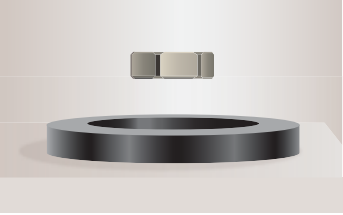

Magnets! No doubt, their behaviour will attract everyone. The world enjoys their benefits, to lead a modern luxurious life. The study of magnets fascinated scientists around our globe for many centuries and even now, door for research on magnets is still open.

Magnetism exists everywhere from tiny particles like electrons to the entire universe. Historically the word 'magnetism' was derived from iron ore magnetite ($\mathrm{Fe_3O_4}$). In olden days, magnets were used as magnetic compass for navigation, magnetic therapy for treatment and also used in magic shows.

In modern days, many things we use in our daily life contain magnets. Motors, cycle dynamo, loudspeakers, magnetic tapes used in audio and video recording, mobile phones, head phones, CD, pen-drive, hard disc of laptop, refrigerator door, generator are a few examples.

Earlier, both electricity and magnetism were thought to be two independent branches in physics. In 1820, H.C. Oersted observed the deflection of magnetic compass needle kept near a current carrying wire. This unified the two different branches, electricity and magnetism as a single subject 'electromagnetism' in physics.

In this unit, basics of magnets and their properties are given. Later, how a current carrying conductor (here only steady current, not time-varying current is considered) behaves like a magnet is presented.

### 3.1.1 Earth's magnetic field and magnetic elements

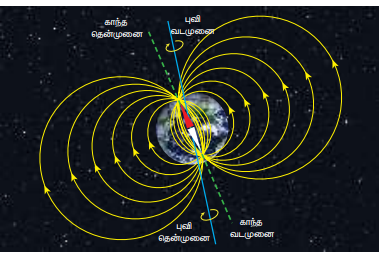

From the activities performed in lower classes, you might have noticed that the needle in a magnetic compass or freely suspended magnet comes to rest in a position which is approximately along the geographical north-south direction of the Earth.

### Do You Know

> William Gilbert in 1600 proposed that Earth itself behaves like a gigantic powerful bar magnet. But this theory is not successful because the temperature inside the Earth is very high and so it will not be possible for a magnet to retain its magnetism.

> Gover suggested that the Earth's magnetic field is due to hot rays coming out from the Sun. These rays will heat up the air near equatorial region. Once air becomes hotter, it rises above and will move towards northern and southern hemispheres and get electrified. This may be responsible to magnetize the ferromagnetic materials near the Earth's surface. Till date, so many theories have been proposed. But none of the theories completely explains the cause for the Earth's magnetism.

The north pole of magnetic compass needle is attracted towards the magnetic south pole of the Earth which is near the geographic north pole. Similarly, the south pole of magnetic compass needle is attracted towards the magnetic north pole of the Earth which is near the geographic south pole. The branch of physics which deals with the Earth's magnetic field is called Geomagnetism or Terrestrial magnetism.

There are three quantities required to specify the magnetic field of the Earth on its surface, which are often called as the elements of the Earth's magnetic field. They are:

(a) magnetic declination $(D)$
(b) magnetic dip or inclination $(I)$
(c) the horizontal component of the Earth's magnetic field $(B_{H})$

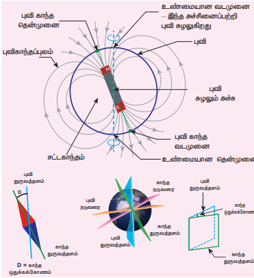

Day and night occur because Earth spins about an axis called geographic axis. A vertical plane passing through the geographic axis is called geographic meridian and a great circle perpendicular to Earth's geographic axis is called geographic equator.

The straight line which connects magnetic poles of Earth is known as magnetic axis. A vertical plane passing through magnetic axis is called magnetic meridian and a great circle perpendicular to Earth's magnetic axis is called magnetic equator.

When a magnetic needle is freely suspended, the alignment of the magnet does not exactly lie along the geographic meridian as shown in Figure 3.4. The angle between magnetic meridian at a point and geographical meridian is called the declination or magnetic declination $(D)$. At higher latitudes, the declination is greater whereas near the equator, the declination is smaller. In India, declination angle is very small and for Chennai, magnetic declination angle is $-1^{\circ}16'$ (which is negative (west)).

The angle subtended by the Earth's total magnetic field $\vec{B}$ with the horizontal direction in the magnetic meridian is called dip or magnetic inclination $(I)$ at that point. For Chennai, inclination angle is $14^{\circ}28'$. The component of Earth's magnetic field along the horizontal direction in the magnetic meridian is called horizontal component of Earth's magnetic field, denoted by $B_{H}$.

Let $B_{E}$ be the net Earth's magnetic field at any point on the surface of the Earth. $B_{E}$ can be resolved into two perpendicu

lar components.

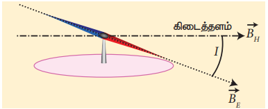

$$ \text{Horizontal component } B_{H} = B_{E}\cos I \quad (3.1) $$
$$ \text{Vertical component } B_{V} = B_{E}\sin I \quad (3.2) $$

Dividing equation (3.2) and (3.1), we get

$$ \tan I = \frac{B_{V}}{B_{H}} \quad (3.3) $$

**(i) At magnetic equator**

The Earth's magnetic field is parallel to the surface of the Earth (i.e., horizontal) which implies that the needle of magnetic compass rests horizontally at an angle of dip, $I = 0^{\circ}$.

$$ B_{H} = B_{E} $$
$$ B_{V} = 0 $$

This implies that the horizontal component is maximum and vertical component is zero at the equator.

**(ii) At magnetic poles**

The Earth's magnetic field is perpendicular to the surface of the Earth (i.e., vertical) which implies that the needle of magnetic compass rests vertically at an angle of dip, $I = 90^{\circ}$. Hence,

$$ B_{H} = 0 $$
$$ B_{V} = B_{E} $$

This implies that the vertical component is maximum at poles and horizontal component is zero at poles.

## EXAMPLE 3.1

The horizontal component and vertical component of Earth's magnetic field at a place are 0.15 G and 0.26 G respectively. Calculate the angle of dip and resultant magnetic field. (G - gauss, cgs unit for magnetic field $1\mathrm{G} = 10^{-4}\mathrm{T}$)

**Solution:**

$$ B_{H} = 0.15\mathrm{G} \text{ and } B_{V} = 0.26\mathrm{G} $$

$$ \tan I = \frac{0.26}{0.15} \Rightarrow I = \tan^{-1}(1.732) = 60^{\circ} $$

The resultant magnetic field of the Earth is

$$ B = \sqrt{B_{H}^{2} + B_{V}^{2}} = 0.3\mathrm{G} $$

### 3.1.2 Basic properties of magnets

Some basic terminologies and properties used in describing bar magnet.

**(a) Magnetic dipole moment**

Consider a bar magnet as shown in Figure 3.6. Let $q_{m}$ be the pole strength of the magnetic pole and let $l$ be the distance between the geometrical centre of bar magnet O and one end of the pole. The magnetic dipole moment is defined as the product of its pole strength and magnetic length. It is a vector quantity, denoted by $\vec{p}_{m}$.

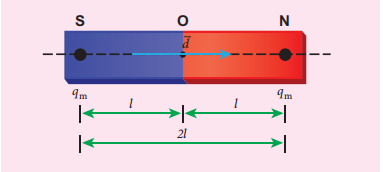

$$ \vec{p}_{m} = q_{m}\vec{d} \quad (3.4) $$

where $\vec{d}$ is the vector drawn from south pole to north pole and its magnitude $|\vec{d}| = 2l$.

The magnitude of magnetic dipole moment is $p_{m} = 2q_{m}l$

The SI unit of magnetic moment is A m². The direction of magnetic moment is from south pole to north pole.

**(b) Magnetic field**

Magnetic field is the region or space around every magnet within which its influence will be felt by keeping another magnet in that region. The magnetic field $\vec{B}$ at a point is defined as a force experienced by the bar magnet of unit pole strength.

$$ \vec{B} = \frac{1}{q_m}\vec{F} \quad (3.5) $$

Its unit is $\mathrm{N A^{-1} m^{-1}}$.

**(c) Types of magnets**   

Magnets are classified into natural magnets and artificial magnets. For example, iron, cobalt, nickel, etc. are natural magnets. Strengths of natural magnets are very weak and the shapes of the magnet are irregular. Artificial magnets are made in order to have desired shape and strength. If the magnet is in the form of rectangular shape or cylindrical shape, then it is known as bar magnet.

## Properties of magnet

The following are the properties of bar magnet:

1. A freely suspended bar magnet will always point along the north-south direction.
2. A magnet attracts or repels another magnet or magnetic substances towards itself. The attractive or repulsive force is maximum near the end of the bar magnet. When a bar magnet is dipped into iron filling, they cling to the ends of the magnet.
3. When a magnet is broken into pieces, each piece behaves like a magnet with poles at its ends.
4. Two poles of a magnet have pole strength equal to one another.
5. The length of the bar magnet is called geometrical length and the length between two magnetic poles in a bar magnet is called magnetic length. Magnetic length is always slightly smaller than geometrical length. The ratio of magnetic length and geometrical length is $\frac{5}{6}$.

$$ \frac{\text{Magnetic length}}{\text{Geometrical length}} = \frac{5}{6} = 0.833 $$

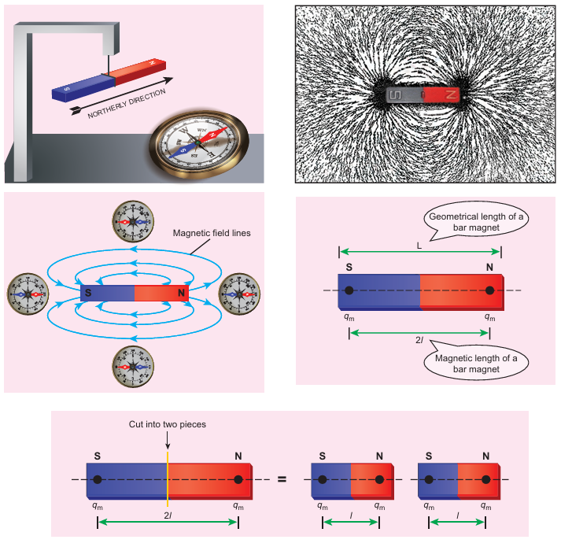

## EXAMPLE 3.2

Let the magnetic moment of a bar magnet be $p_m$ whose magnetic length is $d = 2l$ and pole strength is $q_m$. Compute the magnetic moment of the bar magnet when it is cut into two pieces

(a) along its length  
(b) perpendicular to its length.

**Solution**

(a) A bar magnet cut into two pieces along its length:

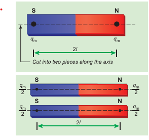

When the bar magnet is cut along the axis into two pieces, new magnetic pole strength is $q_{m}^{\prime} = \frac{q_{m}}{2}$ but magnetic length does not change. So, the magnetic moment is

$$ p_{m}^{\prime} = q_{m}^{\prime} \cdot 2l $$
$$ p_{m}^{\prime} = \frac{q_{m}}{2} \cdot 2l = \frac{1}{2} (q_{m} \cdot 2l) = \frac{1}{2} p_{m} $$

In vector notation, $\vec{p}_{m}^{\prime} = \frac{1}{2}\vec{p}_{m}$

(b) A bar magnet cut into two pieces perpendicular to the axis:

When the bar magnet is cut perpendicular to the axis into two pieces, magnetic pole strength will not change but magnetic length will be halved. So the magnetic moment is

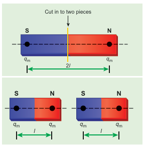

$p'_m = q_m \times \frac{1}{2}(2l) = \frac{1}{2}(q_m \cdot 2l) = \frac{1}{2}p_m$

In vector notation, 
$\vec{p}'_m = \frac{1}{2}\vec{p}_m$

## EXAMPLE 3.3

Compute the magnetic length of a uniform bar magnet if the geometrical length of the magnet is $12\mathrm{cm}$. Mark the positions of magnetic pole points.

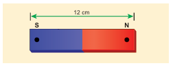

**Solution**

Geometrical length of the bar magnet is $12\mathrm{cm}$

$$ \text{Magnetic length} = \frac{5}{6} \times (\text{geometrical length}) $$
$$ = \frac{5}{6} \times 12 = 10\mathrm{cm} $$

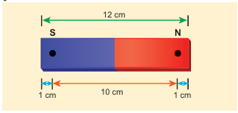

> **Important Notes:**
> - (i) Pole strength is a scalar quantity with dimension $[\text{MLTA}]$. Its SI unit is $\text{NT}^{-1}$ (newton per tesla) or $\text{A m}$ (ampere-metre).
> - (ii) Like positive and negative charges in electrostatics, north pole of a magnet experiences a force in the direction of magnetic field while south pole of a magnet experiences force opposite to the magnetic field.
> - (iii) Pole strength depends on the nature of materials of the magnet, area of cross-section and the state of magnetization.
> - (iv) If a magnet is cut into two equal halves along the length then pole strength is reduced to half.
> - (v) If a magnet is cut into two equal halves perpendicular to the length, then pole strength remains same.
> - (vi) If a magnet is cut into two pieces, we will not get separate north and south poles. Instead, we get two magnets. In other words, isolated monopole does not exist in nature.

**Properties of Magnetic Field Lines:**

1. Magnetic field lines are continuous closed curves. The direction of magnetic field lines is from North pole to South pole outside the magnet and from South pole to North pole inside the magnet.
2. The direction of magnetic field at any point on the curve is known by drawing tangent to the magnetic field lines at that point.
3. Magnetic field lines never intersect each other. Otherwise, the magnetic compass needle would point towards two different directions, which is not possible.
4. The degree of closeness of the field lines determines the relative strength of the magnetic field. The magnetic field is strong where magnetic field lines crowd and weak where magnetic field lines are well separated.

**(d) Magnetic flux**

The number of magnetic field lines crossing any area normally is defined as magnetic flux $\Phi_{B}$ through the area. Mathematically, the magnetic flux through a surface of area $\vec{A}$ in a uniform magnetic field $\vec{B}$ is defined as

$$ \Phi_{B} = \vec{B} \cdot \vec{A} = BA\cos \theta = B_{\perp}A \quad (3.6) $$

where $\theta$ is the angle between $\vec{B}$ and $\vec{A}$ as shown in Figure 3.8.

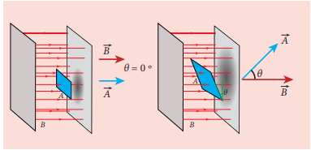

**Special cases:**

(a) When $\vec{B}$ is normal to the surface i.e., $\theta = 0^{\circ}$, the magnetic flux is $\Phi_{B} = BA$ (maximum).

(b) When $\vec{B}$ is parallel to the surface i.e., $\theta = 90^{\circ}$, the magnetic flux is $\Phi_{B} = 0$.

Suppose the magnetic field is not uniform over the surface, the equation (3.6) can be written as

$$ \Phi_{B} = \int \vec{B} \cdot d\vec{A} $$

Magnetic flux is a scalar quantity. The SI unit for magnetic flux is weber, which is denoted by symbol Wb. Dimensional formula for magnetic flux is $[\mathrm{ML}^{2}\mathrm{T}^{-2}\mathrm{A}^{-1}]$. The CGS unit of magnetic flux is maxwell.

$$ 1\text{ weber} = 10^{8}\text{ maxwell} $$

The magnetic flux density is defined as the number of magnetic field lines crossing per unit area kept normal to the direction of lines of force. Its unit is $\text{Wb m}^{-2}$ or tesla (T).

**(e) Uniform magnetic field and Non-uniform magnetic field**

**Uniform magnetic field:** Magnetic field is said to be uniform if it has same magnitude and direction at all the points in a given region. Example: locally Earth's magnetic field is uniform.

**Non-uniform magnetic field:** Magnetic field is said to be non-uniform if the magnitude or direction or both vary at different points in a region. Example: magnetic field of a bar magnet

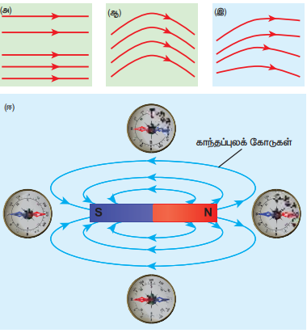

## EXAMPLE 3.4

Calculate the magnetic flux coming out from closed surface containing magnetic dipole (say, a bar magnet) as shown in figure.

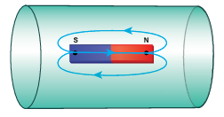

**Solution**

The total flux emanating from the closed surface S enclosing the dipole is zero. So,

$$ \Phi_{B} = \oint \vec{B} \cdot d\vec{A} = 0 $$

Here the integral is taken over closed surface. Since no isolated magnetic pole (called magnetic monopole) exists, this integral is always zero,

$$ \oint \vec{B} \cdot d\vec{A} = 0 $$

This is similar to Gauss's law in electrostatics.

## 3.2 COULOMB'S INVERSE SQUARE LAW OF MAGNETISM

Consider two bar magnets A and B as shown in Figure 3.11. When the north pole of magnet A and the north pole of magnet B or the south pole of magnet A and the south pole of magnet B are brought closer, they repel each other.

On the other hand, when the north pole of magnet A and the south pole of magnet B or the south pole of magnet A and the north pole of magnet B are brought closer, their poles attract each other.

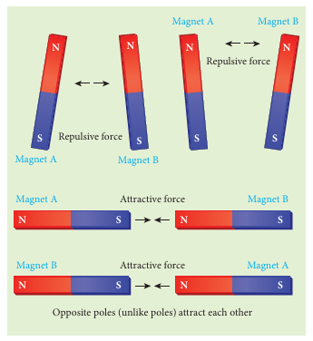

This looks similar to Coulomb's law for static charges studied in Unit I (opposite charges attract and like charges repel each other). So analogous to Coulomb's law in electrostatics, we can state Coulomb's law for magnetism (Figure 3.12) as follows:

The force of attraction or repulsion between two magnetic poles is directly proportional to the product of their pole strengths and inversely proportional to the square of the distance between them.

Mathematically, we can write

$$ \vec{F} \propto \frac{q_{m_A} q_{m_B}}{r^2} \hat{r} $$

where $q_{m_A}$ and $q_{m_B}$ are pole strengths of two poles and $r$ is the distance between two magnetic poles.

$$ \vec{F} = k\frac{q_{m_A} q_{m_B}}{r^2} \hat{r} \quad (3.7) $$

In magnitude, $F = k\frac{q_{m_A} q_{m_B}}{r^2}$

where $k$ is a proportionality constant whose value depends on the surrounding medium. In SI unit, the value of $k$ for free space is $k = \frac{\mu_0}{4\pi} \approx 10^{-7} \text{ H m}^{-1}$, where $\mu_0$ is the absolute permeability of free space (air or vacuum) and H stands for henry.

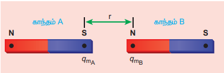

## EXAMPLE 3.5

The repulsive force between two magnetic poles in air is $9 \times 10^{-3} \mathrm{N}$. If the two poles are equal in strength and are separated by a distance of $10 \mathrm{cm}$, calculate the pole strength of each pole.

**Solution:**

The magnitude of the force between two poles is given by

$$ F = k\frac{q_{m_A} q_{m_B}}{r^2} $$

Given: $F = 9 \times 10^{-3} \mathrm{N}$, $r = 10 \mathrm{cm} = 10 \times 10^{-2} \mathrm{m}$

Since $q_{m_A} = q_{m_B} = q_m$, we have

$$ 9 \times 10^{-3} = 10^{-7} \times \frac{q_m^2}{(10 \times 10^{-2})^2} \Rightarrow q_m = 30 \text{ N T}^{-1} $$

### 3.2.1 Magnetic field at a point along the axial line of the magnetic dipole (bar magnet)

Consider a bar magnet NS as shown in Figure 3.13. Let N be the north pole and S be the south pole of the bar magnet, each of pole strength $q_{m}$ and are separated by a distance of $2l$. The magnetic field at a point C (lies along the axis of the magnet) at a distance $r$ from the geometrical centre O of the bar magnet can be computed by keeping unit north pole $(q_{m_C} = 1 \text{ A m})$ at C.

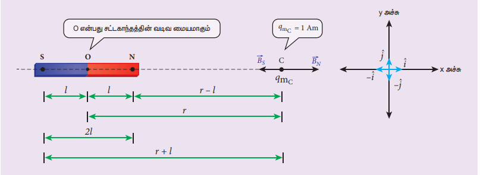

The magnetic field at C due to the north pole is

$$ \vec{B}_{N} = \frac{\mu_0}{4\pi} \frac{q_{m}}{(r - l)^{2}} \hat{i} \quad (3.9) $$

where $(r - l)$ is the distance between north pole of the bar magnet and unit north pole at C.

The magnetic field at C due to the south pole is

$$ \vec{B}_{S} = -\frac{\mu_0}{4\pi} \frac{q_{m}}{(r + l)^{2}} \hat{i} \quad (3.10) $$

where $(r + l)$ is the distance between south pole of the bar magnet and unit north pole at C.

The net magnetic field due to the magnetic dipole at point C

$$ \vec{B} = \vec{B}_{N} + \vec{B}_{S} $$

$$ \vec{B} = \frac{\mu_0}{4\pi} \frac{q_{m}}{(r - l)^{2}} \hat{i} + \left(-\frac{\mu_0}{4\pi} \frac{q_{m}}{(r + l)^{2}} \hat{i}\right) $$

$$ \vec{B} = \frac{\mu_0 q_{m}}{4\pi} \left( \frac{1}{(r - l)^{2}} - \frac{1}{(r + l)^{2}} \right) \hat{i} $$

$$ \vec{B} = \frac{\mu_0}{4\pi} \frac{2r q_{m} \cdot (2l)}{(r^{2} - l^{2})^{2}} \hat{i} \quad (3.11) $$

Since the magnitude of magnetic dipole moment is $|\vec{p}_{m}| = p_{m} = q_{m} \cdot 2l$, the magnetic field at a point C can be written as

$$ \vec{B}_{\text{axial}} = \frac{\mu_0}{4\pi} \left( \frac{2r p_{m}}{(r^{2} - l^{2})^{2}} \right) \hat{i} \quad (3.12) $$

If the distance between two poles in a bar magnet is small (looks like short magnet) when compared to the distance between geometrical centre O of bar magnet and the location of point C $(r \gg l)$

$$ (r^{2} - l^{2})^{2} \approx r^{4} \quad (3.13) $$

Therefore, using equation (3.13) in equation (3.12), we get

$$
\vec{B}_{axial} = \frac{\mu_0}{4\pi} \left( \frac{2p_m}{r^3} \right) \hat{i} = \frac{\mu_0}{4\pi} \frac{2}{r^3} \vec{p}_m \tag{3.14}
$$

where $\vec{p}_m = p_m \hat{i}$.

### 3.2.2 Magnetic field at a point along the equatorial line due to a magnetic dipole (bar magnet)

Consider a bar magnet NS as shown in Figure 3.14. Let N be the north pole and S be the south pole of the bar magnet, each with pole strength $q_{m}$ and separated by a distance of $2l$. The magnetic field at a point C (lies along the equatorial line) at a distance $r$ from the geometrical centre O of the bar magnet can be computed by keeping unit north pole $(q_{mC} = 1 \text{ A m})$ at C.

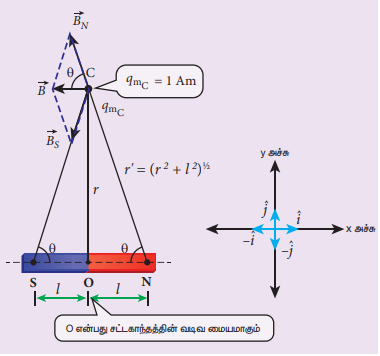

The magnetic field at C due to the north pole is

$$ \vec{B}_N = -B_N\cos \theta \hat{i} + B_N\sin \theta \hat{j} \quad (3.15) $$

where $B_N = \frac{\mu_0}{4\pi} \frac{q_m}{r^{\prime 2}}$ and $r^{\prime} = (r^2 + l^2)^{\frac{1}{2}}$

The magnetic field at C due to the south pole is

$$ \vec{B}_S = -B_S\cos \theta \hat{i} - B_S\sin \theta \hat{j} \quad (3.16) $$

where $B_{S} = \frac{\mu_{0}}{4\pi} \frac{q_{m}}{r^{\prime 2}}$

From equations (3.15) and (3.16), the net magnetic field at point C due to the dipole is $\vec{B} = \vec{B}_{N} + \vec{B}_{S}$

$$ \vec{B} = -(B_N + B_S)\cos \theta \hat{i} \quad (\text{Since } B_N = B_S) $$

$$ \vec{B} = -\frac{2\mu_0}{4\pi} \frac{q_m}{r^{\prime 2}} \cos \theta \hat{i} = -\frac{2\mu_0}{4\pi} \frac{q_m}{(r^2 + l^2)} \cos \theta \hat{i} \quad (3.17) $$

In a right angle triangle NOC as shown in Figure 3.14

$$ \cos \theta = \frac{\text{adjacent}}{\text{hypotenuse}} = \frac{l}{r^{\prime}} = \frac{l}{(r^{2} + l^{2})^{\frac{1}{2}}} \quad (3.18) $$

Substituting equation (3.18) in equation (3.17), we get

$$ \vec{B} = -\frac{\mu_0}{4\pi} \frac{q_{m} \times (2l)}{(r^{2} + l^{2})^{3/2}} \hat{i} \quad (3.19) $$

Since magnitude of magnetic dipole moment is $|\vec{p}_m| = p_m = q_m \cdot 2l$ and substituting in equation (3.19), the magnetic field at a point C is

$$ \vec{B}_{\text{equatorial}} = -\frac{\mu_0}{4\pi} \frac{p_m}{(r^2 + l^2)^{\frac{3}{2}}} \hat{i} \quad (3.20) $$

If the distance between two poles in a bar magnet is small (looks like short magnet) when compared to the distance between geometrical centre O of bar magnet and the location of point C $(r \gg l)$

$$ (r^2 + l^2)^{\frac{3}{2}} \approx r^3 \quad (3.21) $$

Therefore, using equation (3.21) in equation (3.20), we get

$$ \vec{B}_{\text{equatorial}} = -\frac{\mu_0}{4\pi} \frac{p_m}{r^3} \hat{i} $$

Since $\vec{p}_m = p_m \hat{i}$, the magnetic field at equatorial point is given by

$$ \vec{B}_{\text{equatorial}} = -\frac{\mu_0}{4\pi} \frac{\vec{p}_m}{r^3} \quad (3.22) $$

Note that magnitude of $B_{\text{axial}}$ is twice that of magnitude of $B_{\text{equatorial}}$ and the direction of $B_{\text{axial}}$ and $B_{\text{equatorial}}$ are opposite.

## EXAMPLE 3.6

A short bar magnet has a magnetic moment of $0.5 \text{ J T}^{-1}$. Calculate magnitude and direction of the magnetic field produced by the bar magnet which is kept at a distance of $0.1 \text{ m}$ from the centre of the bar magnet along (a) axial line of the bar magnet and (b) normal bisector of the bar magnet.

**Solution**

Given magnetic moment $= 0.5 \text{ J T}^{-1}$ and distance $r = 0.1 \text{ m}$

(a) When the point lies on the axial line of the bar magnet, the magnetic field for short magnet is given by

$$ \vec{B}_{\text{axial}} = \frac{\mu_0}{4\pi} \left( \frac{2p_m}{r^3} \right) \hat{i} $$
$$ \vec{B}_{\text{axial}} = 10^{-7} \times \left( \frac{2 \times 0.5}{(0.1)^3} \right) \hat{i} = 1 \times 10^{-4} \hat{i} \text{ T} $$

Hence, the magnitude of the magnetic field along axial is $B_{\text{axial}} = 1 \times 10^{-4} \text{ T}$ and direction is towards South to North.

(b) When the point lies on the normal bisector (equatorial) line of the bar magnet, the magnetic field for short magnet is given by

$$ \vec{B}_{\text{equatorial}} = -\frac{\mu_0}{4\pi} \frac{p_m}{r^3} \hat{i} $$
$$ \vec{B}_{\text{equatorial}} = -10^{-7} \left( \frac{0.5}{(0.1)^3} \right) \hat{i} = -0.5 \times 10^{-4} \hat{i} \text{ T} $$

Hence, the magnitude of the magnetic field along equatorial is $B_{\text{equatorial}} = 0.5 \times 10^{-4} \text{ T}$ and direction is towards North to South.

Note that magnitude of $B_{\text{axial}}$ is twice that of magnitude of $B_{\text{equatorial}}$ and the direction of $B_{\text{axial}}$ and $B_{\text{equatorial}}$ are opposite.

## 3.3 TORQUE ACTING ON A BAR MAGNET IN UNIFORM MAGNETIC FIELD

Consider a magnet of length $2l$ and pole strength $q_{m}$ kept in a uniform magnetic field $\vec{B}$ as shown in Figure 3.16. Each pole experiences a force of magnitude $q_{m}B$ but acting in opposite directions. Therefore, the net force exerted on the magnet is zero and hence, there is no translatory motion. These two equal and opposite forces constitute a couple (about midpoint of bar magnet) tend to align the magnet in the direction of the magnetic field $\vec{B}$.

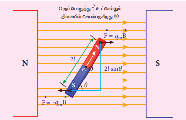

The force experienced by north pole,

$$ \vec{F}_N = q_m \vec{B} \quad (3.23) $$

The force experienced by south pole,

$$ \vec{F}_S = -q_m \vec{B} \quad (3.24) $$

Adding equations (3.23) and (3.24), we get the net force acting on the dipole as

$$ \vec{F} = \vec{F}_N + \vec{F}_S = \vec{0} $$

The moment of force or torque experienced by north and south pole about point O is

$$ \vec{\tau} = \overrightarrow{ON} \times \vec{F}_N + \overrightarrow{OS} \times \vec{F}_S $$
$$ \vec{\tau} = \overrightarrow{ON} \times q_m \vec{B} + \overrightarrow{OS} \times (-q_m \vec{B}) $$

By using right hand cork screw rule, we conclude that the total torque is pointing into the paper. Since the magnitudes $|ON| = |OS| = l$ and $|q_n \vec{B}| = |-q_n \vec{B}|$, the magnitude of total torque about point $O$

$$
\tau = l \times q_n B \sin \theta + l \times q_n B \sin \theta
$$

$$ \tau = l \times q_m B \sin \theta + l \times q_m B \sin \theta $$
$$ \tau = 2l \times q_m B \sin \theta $$
$$ \tau = p_m B \sin \theta \qquad (\because q_m \times 2l = p_m) \quad (3.25) $$

**Important Questions:**

(a) Why a freely suspended bar magnet in your laboratory experiences only torque (rotational motion) but not any translatory motion even though Earth has non-uniform magnetic field?
  
  It is because Earth's magnetic field is locally (physics laboratory) uniform.

(b) Suppose we keep a freely suspended bar magnet in a non-uniform magnetic field. What will happen?
  
  It will undergo translatory motion (net force) and rotational motion (torque).

### 3.3.1 Potential energy of a bar magnet in a uniform magnetic field

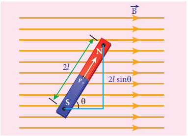

When a bar magnet (magnetic dipole) of dipole moment $\vec{p}_m$ is held at an angle $\theta$ with the direction of a uniform magnetic field $\vec{B}$ as shown in Figure 3.17, the magnitude of the torque acting on the dipole is

$$ |\vec{\tau}_B| = |\vec{p}_m| |\vec{B}| \sin \theta $$

If the dipole is rotated through a very small angular displacement $d\theta$ against the torque $\tau_B$ at constant angular velocity, then the work done by external torque $\tau_\mu$ at constant angular velocity, then the work done by external torque ($\vec{\tau}_{ext}$) for this small angular displacement is given by

$$
dW = |\vec{\tau}_{ext}| d\theta
$$

The bar magnet has to be moved at constant angular velocity, which implies that $|\vec{\tau}_\mu| = |\vec{\tau}_{ext}|$.

$$
dW = p_\mu B \sin \theta \, d\theta
$$

Total work done in rotating the dipole from $\theta'$ to $\theta$ is

$$
W = \int_{\theta'}^{\theta} \tau \, d\theta = \int_{\theta'}^{\theta} p_\mu B \sin \theta \, d\theta = p_\mu B \left[ -\cos \theta \right]_{\theta'}^{\theta}
$$

$$
W = -p_\mu B (\cos \theta - \cos \theta')
$$

This work done is stored as potential energy in bar magnet at an angle $\theta$ (when it is rotated from $\theta'$ to $\theta$) and it can be written as

$$
U = -p_\mu B (\cos \theta - \cos \theta')
$$

In fact, the equation (3.26) gives the difference in potential energy between the angular positions $\theta'$ and $\theta$. If we choose the reference point as $\theta' = 90^\circ$, so that second term in the equation becomes zero, equation (3.26) can be written as

$$
U = -p_\mu B (\cos \theta)
$$

The potential energy stored in a bar magnet in a uniform magnetic field is given by

$$
U = -p_\mu \vec{B}
$$

---

### Case 1

(i) If $\theta = 0^\circ$, then

$$
U = -p_\mu B (\cos 0^\circ) = -p_\mu B
$$

(ii) If $\theta = 180^\circ$, then

$$
U = -p_\mu B (\cos 180^\circ) = p_\mu B
$$

From the above two results, we infer that the potential energy of the bar magnet is minimum when it is aligned along the external magnetic field and maximum when the bar magnet is aligned anti-parallel to external magnetic field.

## EXAMPLE 3.7

Consider a magnetic dipole which on switching ON external magnetic field orient only in two possible ways i.e., one along the direction of the magnetic field (parallel to the field) and another anti-parallel to magnetic field. Compute the energy for the possible orientation.

**Solution**

Let $\vec{p}_m$ be the dipole and before switching ON the external magnetic field, there is no orientation. Therefore, the energy $U = 0$.

As soon as external magnetic field is switched ON, the magnetic dipole orients parallel ($\theta = 0^\circ$) to the magnetic field with energy,

$$
U_{\text{parallel}} = -p_m B \cos 0
$$

$$
U_{\text{parallel}} = -p_m B
$$

since $\cos 0^\circ = 1$

Otherwise, the magnetic dipole orients anti-parallel ($\theta = 180^\circ$) to the magnetic field with energy,

$$
U_{\text{anti-parallel}} = -p_m B \cos 180
$$

$$
\Rightarrow U_{\text{anti-parallel}} = p_m B
$$

since $\cos 180^\circ = -1$

## 3.4 MAGNETIC PROPERTIES

All materials are not magnetic in nature. Further, all the magnetic materials will not behave identically. So, in order to differentiate one magnetic material from another, some basic parameters are used. They are:

**(a) Magnetising field**

The magnetic field which is used to magnetize a sample or specimen is called the magnetising field. Magnetising field is a vector quantity and is denoted by $\vec{H}$ and its unit is $\text{A m}^{-1}$.

**(b) Magnetic permeability**

The magnetic permeability is the measure of ability of the material to allow the passage of magnetic field lines through it or measure of the capacity of the substance to take magnetisation or the degree of penetration of magnetic field through the substance.

In free space, the permeability (or absolute permeability) is denoted by $\mu_0$ and for any other medium it is denoted by $\mu$. The relative permeability $\mu_r$ is defined as the ratio between absolute permeability of the medium to the permeability of free space.

$$ \mu_r = \frac{\mu}{\mu_0} \quad (3.29) $$

Relative permeability is a dimensionless number and has no units. For free space (air or vacuum), the relative permeability is unity i.e., $\mu_r = 1$.

**(c) Intensity of magnetisation**

Any bulk material (any object of finite size) contains a large number of atoms. Each atom consists of electrons which undergo orbital motion. Due to orbital motion, electron has magnetic moment which is a vector quantity. In general, these magnetic moments orient randomly, therefore, the net magnetic moment is zero per unit volume of the material.

When such a material is kept in an external magnetic field, atomic dipoles are induced and hence, they will try to align partially or fully along the direction of external field. The net magnetic moment per unit volume of the material is known as intensity of magnetisation. It is a vector quantity. Mathematically,

$$ \vec{M} = \frac{\text{Magnetic moment}}{\text{Volume}} = \frac{\vec{p}_m}{V} \quad (3.30) $$

The SI unit of intensity of magnetisation is ampere metre$^{-1}$. For a bar magnet of pole strength $q_m$, length $2l$ and area of cross-section $A$, the magnetic moment of the bar magnet is $\vec{p}_m = q_m \vec{2l}$ and volume of the bar magnet is $V = A |\vec{2l}| = 2lA$. The intensity of magnetisation for a bar magnet is

$$ \vec{M} = \frac{\text{Magnetic moment}}{\text{Volume}} = \frac{q_m \vec{2l}}{2lA} \quad (3.31) $$

In magnitude, equation (3.31) is

$$ |\vec{M}| = M = \frac{q_m \times 2l}{2l \times A} \Rightarrow M = \frac{q_m}{A} $$
**(d) Magnetic induction or total magnetic field**

When a substance like soft iron bar is placed in a uniform magnetising field $\vec{H}$, the substance gets magnetised. The magnetic induction (total magnetic field) inside the specimen $\vec{B}$ is equal to the sum of the magnetic field $\vec{B}_o$ produced in vacuum due to the magnetising field and the magnetic field $\vec{B}_m$ due to the induced magnetism of the substance.

$$ \vec{B} = \vec{B}_o + \vec{B}_m = \mu_0 \vec{H} + \mu_0 \vec{M} $$

$$ \Rightarrow \vec{B} = \mu_0 (\vec{H} + \vec{M}) \quad (3.32) $$

**(e) Magnetic susceptibility**

When a substance is kept in a magnetising field $\vec{H}$, magnetic susceptibility gives information about how a material responds to the external (applied) magnetic field. In other words, the magnetic susceptibility measures how easily and how strongly a material can be magnetised. It is defined as the ratio of the intensity of magnetisation $\vec{M}$ induced in the material to the magnetising field $\vec{H}$

$$ \chi_{m} = \frac{|\vec{M}|}{|\vec{H}|} \quad (3.33) $$

It is a dimensionless quantity. Magnetic susceptibility for some of the isotropic substances is given in Table 3.1.

**Table 3.1 Magnetic susceptibility for various materials**

| Material | Magnetic susceptibility ($\chi_m$) |
| :--- | :--- |
| Aluminium | $2.3 \times 10^{-5}$ |
| Copper | $-0.98 \times 10^{-5}$ |
| Diamond | $-2.2 \times 10^{-5}$ |
| Gold | $-3.6 \times 10^{-5}$ |
| Mercury | $-3.2 \times 10^{-5}$ |
| Silver | $-2.6 \times 10^{-5}$ |
| Titanium | $7.06 \times 10^{-5}$ |
| Tungsten | $6.8 \times 10^{-5}$ |
| Carbon dioxide (1 atm) | $-2.3 \times 10^{-9}$ |
| Oxygen (1 atm) | $2090 \times 10^{-9}$ |

### EXAMPLE 3.8

Compute the intensity of magnetisation of the bar magnet whose mass, magnetic moment and density are $200 \text{ g}$, $2 \text{ A m}^2$ and $8 \text{ g cm}^{-3}$, respectively.

**Solution**

Density of the magnet is

$$ \text{Density} = \frac{\text{Mass}}{\text{Volume}} \Rightarrow \text{Volume} = \frac{\text{Mass}}{\text{Density}} $$

$$ \text{Volume} = \frac{200 \times 10^{-3} \text{ kg}}{(8 \times 10^{-3} \text{ kg}) \times 10^{6} \text{ m}^{-3}} = 25 \times 10^{-6} \text{ m}^{3} $$

Magnitude of magnetic moment $p_m = 2 \text{ A m}^2$

Intensity of magnetization,

$$ M = \frac{\text{Magnetic moment}}{\text{Volume}} = \frac{2}{25 \times 10^{-6}} $$

$$ M = 0.8 \times 10^{5} \text{ A m}^{-1} $$

### EXAMPLE 3.9

Using the relation $\vec{B} = \mu_0(\vec{H} + \vec{M})$, show that $\chi_m = \mu_r - 1$.

**Solution**

$$ \vec{B} = \mu_0(\vec{H} + \vec{M}) $$

But from equation (3.33), in vector form,

$$ \vec{M} = \chi_m \vec{H} $$

Hence, $\vec{B} = \mu_0(\chi_m + 1) \vec{H} \Rightarrow \vec{B} = \mu \vec{H}$

where $\mu = \mu_0(\chi_m + 1) \Rightarrow \chi_m + 1 = \frac{\mu}{\mu_0} = \mu_r$

$$ \Rightarrow \chi_m = \mu_r - 1 $$

### EXAMPLE 3.10

Two materials X and Y are magnetised whose values of intensity of magnetisation are $500 \text{ A m}^{-1}$ and $2000 \text{ A m}^{-1}$ respectively. If the magnetising field is $1000 \text{ A m}^{-1}$, then which one among these materials can be easily magnetized?

**Solution**

The susceptibility of material X is

$$ \chi_{m,X} = \frac{|\vec{M}|}{|\vec{H}|} = \frac{500}{1000} = 0.5 $$

The susceptibility of material Y is

$$ \chi_{m,Y} = \frac{|\vec{M}|}{|\vec{H}|} = \frac{2000}{1000} = 2 $$

Since susceptibility of material Y is greater than that of material X, which implies that material Y can be easily magnetized.

## 3.5 CLASSIFICATION OF MAGNETIC MATERIALS

The magnetic materials are generally classified into three types based on their behaviour in a magnetising field. They are diamagnetic, paramagnetic and ferromagnetic materials.

**(a) Diamagnetic materials**

The orbital motion of electrons around the nucleus produces a magnetic field perpendicular to the plane of the orbit. Thus each electron orbit has finite orbital magnetic dipole moment. Since the orbital planes of the other electrons are oriented in random manner, the vector sum of magnetic moments is zero and there is no resultant magnetic moment for each atom.

In the presence of a uniform external magnetic field, some electrons are speeded up and some are slowed down. The electrons whose moments were anti-parallel are speeded up according to Lenz's law and this produces an induced magnetic moment in a direction opposite to the field. The induced moment disappears as soon as the external field is removed.

When placed in a non-uniform magnetic field, the interaction between induced magnetic moment and the external field creates a force which tends to move the material from stronger part to weaker part of the external field. It means that diamagnetic material is repelled by the field.

This action is called diamagnetic action and such materials are known as diamagnetic materials. Examples: Bismuth, Copper and Water etc.

**Properties of diamagnetic materials:**

i) Magnetic susceptibility is negative.
ii) Relative permeability is slightly less than unity.
iii) The magnetic field lines are repelled or expelled by diamagnetic materials when placed in a magnetic field.
iv) Susceptibility is nearly temperature independent.

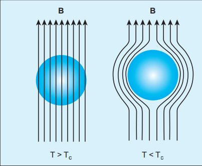

**(b) Paramagnetic materials**s

In some magnetic materials, each atom or molecule has net magnetic dipole moment which is the vector sum of orbital and spin magnetic moments of electrons. Due to the random orientation of these magnetic moments, the net magnetic moment of the materials is zero.

> **Magnetic levitated train**
> 
> Magnetic levitated train is also called Maglev train.
> 
> This train floats few centimetres above the guideway because of electromagnet used. Maglev train does not need wheels and also achieve greater speed. The basic mechanism of working of Maglev train involves two sets of magnets. One set is used to repel which makes train to float above the track and another set is used to move the floating train ahead at very great speed. These trains are quieter, smoother and environmental friendly compared conventional trains and have potential for moving with much higher speeds with technology in future.
> 

In the presence of an external magnetic field, the torque acting on the atomic dipoles will align them in the field direction. As a result, there is net magnetic dipole moment induced in the direction of the applied field. The induced dipole moment is present as long as the external field exists.

When placed in a non-uniform magnetic field, the paramagnetic materials will have a tendency to move from weaker to stronger part of the field. Materials which exhibit weak magnetism in the direction of the applied field are known as paramagnetic materials.

Examples: Aluminium, Platinum, Chromium and Oxygen etc.

**The properties of paramagnetic materials are:**

i) Magnetic susceptibility is positive and small.
ii) Relative permeability is greater than unity.
iii) The magnetic field lines are attracted into the paramagnetic materials when placed in a magnetic field.
iv) Susceptibility is inversely proportional to temperature.

### Curie's law

When temperature is increased, thermal vibration will upset the alignment of magnetic dipole moments. Therefore, the magnetic susceptibility decreases with increase in temperature. In many cases, the susceptibility of the materials is

$$ \chi_m \propto \frac{1}{T} \text{ or } \chi_m = \frac{C}{T} $$

This relation is called Curie's law. Here $C$ is called Curie constant and temperature $T$ is in kelvin. The graph drawn between magnetic susceptibility and temperature is shown in Figure 3.19, which is a rectangular hyperbola.

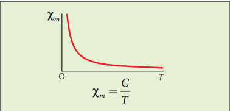

**(c) Ferromagnetic materials**

An atom or molecule in a ferromagnetic material possesses net magnetic dipole moment as in a paramagnetic material. A ferromagnetic material is made up of smaller regions, called ferromagnetic domains (Figure 3.20). Within each domain, the magnetic moments are spontaneously aligned in a direction. This alignment is caused by strong interaction arising from electron spin which depends on the inter-atomic distance. Each domain has net magnetisation in a direction. However the direction of magnetisation varies from domain to domain and thus net magnetisation of the specimen is zero.

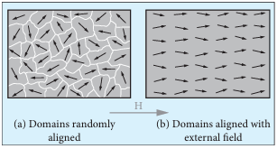

In the presence of external magnetic field, two processes take place:

(1) The domains having magnetic moments parallel to the field grow bigger in size
(2) The other domains (not parallel to field) are rotated so that they are aligned with the field.

As a result of these mechanisms, there is a strong net magnetisation of the material in the direction of the applied field (Figure 3.21).

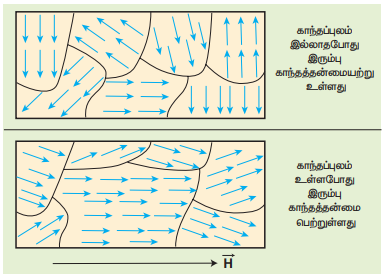

When placed in a non-uniform magnetic field, the ferromagnetic materials will have a strong tendency to move from weaker to stronger part of the field. Materials which exhibit strong magnetism in the direction of applied field are called ferromagnetic materials. Examples: Iron, Nickel and Cobalt.

**The properties of ferromagnetic materials are:**

i) Magnetic susceptibility is positive and large.
ii) Relative permeability is large.
iii) The magnetic field lines are strongly attracted into the ferromagnetic materials when placed in a magnetic field.
iv) Susceptibility is inversely proportional to temperature.

> **Magnetism in Archaeology**
> 
> Magnetism plays interesting role in various aspects of life. It has connection with archeological place Keezhadi too. To find whether any archeological structure exists under the surface of a given place, well established technique called 'magnetometer surveying' is used.
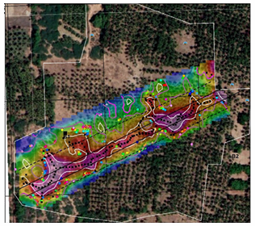
> In this technique, the variation of the magnetic field in comparison with the neighbouring place is studied. The magnetic field variation is due to the presence of magnetic mineral magnetite and its related minerals present in the archeological structures like buried wall, pottery, bricks, buried tombs, monuments and inhabited sites. Those minerals are either diamagnetic or paramagnetic or ferromagnetic in nature and each type has different range of magnetic susceptibilities.

> Indian Institute of Geomagnetism (IIG), Mumbai conducted magnetometer survey on Keezhadi site and found out that there were archeological structures like wall, pottery etc. From the picture, there was magnetic field variation in the range of 10 to $100 \text{ nT}$ over the particular area (coloured portion). In fact, the existence of massive brick structures at Keezhadi has been revealed through magnetism.

### Curie-Weiss law

As temperature increases, the ferromagnetism decreases due to the increased thermal agitation of the atomic dipoles. At a particular temperature, ferromagnetic material becomes paramagnetic. This temperature is known as Curie temperature $T_c$. The susceptibility of the material above the Curie temperature is given by

$$ \chi_m = \frac{C}{T - T_c} $$

This relation is called Curie-Weiss law. The constant $C$ is called Curie constant and temperature $T$ is in kelvin scale. A plot of magnetic susceptibility with temperature is as shown in Figure 3.22.

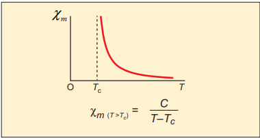

**Important Notes:**
> **Spin**
>
>Like mass and charge for particles, spin is also another important attribute for an elementary particle. Spin is a quantum mechanical phenomenon which is responsible for magnetic properties of the material. Spin in quantum mechanics is entirely different from spin we encounter in classical mechanics. Spin in quantum mechanics does not mean rotation; it is intrinsic angular momentum which does not have classical analogue. For historical reason, the name spin is retained. Spin of a particle takes only positive values but the orientation of the spin vector takes plus or minus values in an external magnetic field. For an example, electron has spin $s = \frac{1}{2}$. In the presence of magnetic field, the spin will orient either parallel or anti-parallel to the direction of magnetic field.
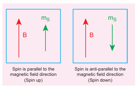
>This implies that the magnetic spin $m_s$ takes two values for an electron, such as $m_s = \frac{1}{2}$ (spin up) and $m_s = -\frac{1}{2}$ (spin down). Spin for proton and neutron is $s = \frac{1}{2}$. For photon, spin $s = 1$.

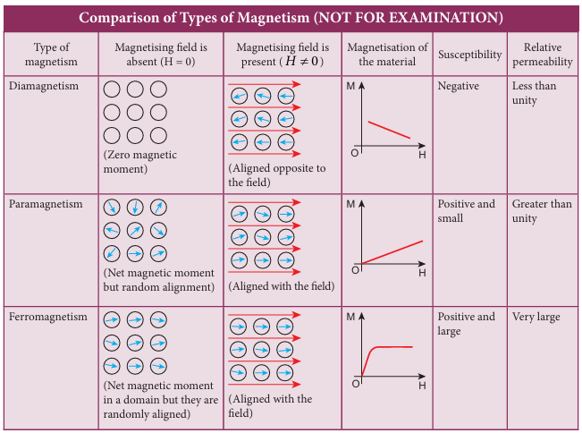

## 3.6 HYSTERESIS

When a ferromagnetic material is kept in a magnetising field, the material gets magnetised by induction. An important characteristic of ferromagnetic material is that the variation of magnetic induction $\vec{B}$ with magnetising field $\vec{H}$ is not linear. It means that the ratio $\frac{B}{H} = \mu$ is not a constant. Let us study this behaviour in detail.

A ferromagnetic material (example, Iron) is magnetised slowly by a magnetising field $\vec{H}$. The magnetic induction $\vec{B}$ of the material increases from point A with the magnitude of the magnetising field and then attains a saturation level.

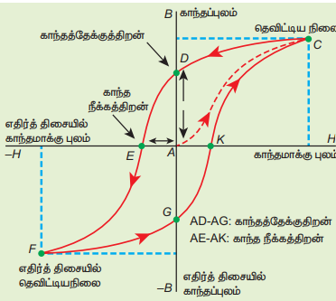

This response of the material is depicted by the path AC as shown in Figure 3.23. Saturation magnetization is defined as the maximum point up to which the material can be magnetised by applying the magnetising field.

If the magnetising field is now reduced, the magnetic induction also decreases but does not retrace the original path CA. It takes different path CD. When the magnetising field is zero, the magnetic induction is not zero and it has positive value. This implies that some magnetism is left in the specimen even when $H = 0$. The residual magnetism AD present in the specimen is called remanence or retentivity. Remanence is defined as the ability of the materials to retain the magnetism in them even after the magnetising field disappears.

In order to demagnetise the material, the magnetising field is gradually increased in the reverse direction. Now the magnetic induction decreases along DE and becomes zero at E. The magnetising field AE in the reverse direction is required to bring residual magnetism to zero. The magnitude of the reverse magnetising field for which the residual magnetism of the material vanishes is called its coercivity.

Further increase of $\vec{H}$ in the reverse direction causes the magnetic induction to increase along EF until it reaches saturation at F in the reverse direction. If magnetising field is decreased and then increased with direction reversed, the magnetic induction traces the path FGKC. This closed curve ACDEFGKC is called hysteresis loop and it corresponds to one cycle of magnetisation.

In the entire cycle, the magnetic induction $B$ lags behind the magnetising field $H$. This phenomenon of lagging of magnetic induction behind the magnetising field is called hysteresis. Hysteresis means lagging behind.

### Hysteresis loss

During the magnetisation of the specimen through a cycle, there is loss of energy in the form of heat. This loss is attributed to the rotation and orientation of molecular magnets in various directions. It is found that the energy lost (or dissipated) per unit volume of the material when it is carried through one cycle of magnetisation is equal to the area of the hysteresis loop.

### Hard and soft magnetic materials

Based on the shape and size of the hysteresis loop, ferromagnetic materials are classified as soft magnetic materials with smaller area and hard magnetic materials with larger area. The comparison of the hysteresis loops for two magnetic materials is shown in Figure 3.24. Properties of soft and hard magnetic materials are compared in Table 3.2.

**Table 3.2 Differences between soft and hard ferromagnetic materials**

| S.No. | Properties | Soft ferromagnetic materials | Hard ferromagnetic materials |
| :---: | :--- | :--- | :--- |
| 1 | When external field is removed | Magnetisation disappears | Magnetisation persists |
| 2 | Area of the loop | Small | Large |
| 3 | Retentivity | Low | High |
| 4 | Coercivity | Low | High |
| 5 | Susceptibility and magnetic permeability | High | Low |
| 6 | Hysteresis loss | Less | More |
| 7 | Uses | Solenoid core, transformer core and electromagnets | Permanent magnets |
| 8 | Examples | Soft iron, Mumetal, Stalloy etc. | Carbon steel, Alnico, Lodestone etc. |

### Applications of hysteresis loop

The significance of hysteresis loop is that it provides information such as retentivity, coercivity, permeability, susceptibility and energy loss during one cycle of magnetisation for each ferromagnetic material. Therefore, the study of hysteresis loop will help us in selecting proper and suitable material for a given purpose. Some examples:

**i) Permanent magnets:** The materials with high retentivity, high coercivity and low permeability are suitable for making permanent magnets. Examples: Carbon steel and Alnico

**ii) Electromagnets:** The materials with high initial permeability, low retentivity, low coercivity and thin hysteresis loop with smaller area are preferred to make electromagnets. Examples: Soft iron and Mumetal (Nickel Iron alloy).

**iii) Core of the transformer:** The materials with high initial permeability, large magnetic induction and thin hysteresis loop with smaller area are needed to design transformer cores. Examples: Soft iron

### EXAMPLE 3.11

The following figure shows the variation of intensity of magnetisation with the applied magnetic field intensity for three magnetic materials X, Y and Z. Identify the materials X, Y and Z.

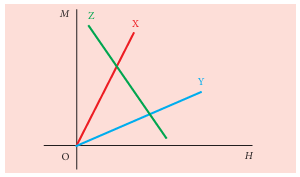

**Solution**

The slope of $M$-$H$ graph is a measure of the magnetic susceptibility, which is given by

$$ \chi_m = \frac{M}{H} $$

- Material X: Slope is positive and larger value. So, it is a ferromagnetic material.
- Material Y: Slope is positive and lesser value than X. So, it could be a paramagnetic material.
- Material Z: Slope is negative and hence, it is a diamagnetic material.

## 3.7 MAGNETIC EFFECTS OF ELECTRIC CURRENT

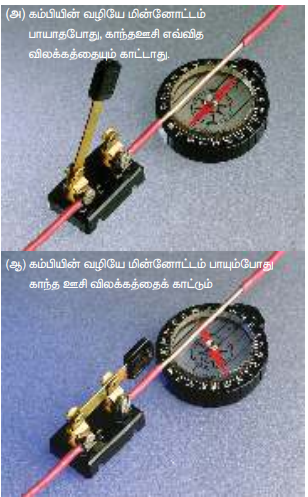

### 3.7.1 Oersted experiment

In 1820 Hans Christian Oersted, while preparing for his lecture in physics, noticed that electric current passing through a wire deflects the nearby magnetic needle in the compass. By proper investigation, he observed that the deflection of magnetic needle is due to the change in magnetic field produced around current carrying conductor (Figure 3.25). When the direction of current is reversed, the magnetic needle is deflected in the opposite direction. This lead to the development of the theory 'electromagnetism' which unifies two branches in physics namely, electricity and magnetism.

### 3.7.2 Magnetic field around a straight current-carrying conductor and circular loop

**(a) Current carrying straight conductor**

Suppose we keep a magnetic compass near a current-carrying straight conductor, then the needle of the magnetic compass experiences a torque and deflects to align in the direction of the magnetic field at that point. Tracing out the direction shown by magnetic needle, we can draw the magnetic field lines at a distance. For a straight current-carrying conductor, the nature of magnetic field is like concentric circles having their common centre on the axis of the conductor as shown in Figure 3.26 (a).

The direction of circular magnetic field lines will be clockwise or anticlockwise depending on the direction of current in the conductor. If the strength (or magnitude) of the current is increased then the density of the magnetic field will also increase. The strength of the magnetic field $(B)$ decreases as the distance $(r)$ from the conductor increases (Figure 3.26 (b)).

**(b) Circular coil carrying current**

Suppose we keep a magnetic compass near a current carrying circular conductor, then the needle of the magnetic compass experiences a torque and deflects to align in the direction of the magnetic field at that point. We can notice that at the points A and B in the vicinity of the coil, the magnetic field lines are circular. The magnetic field lines are nearly parallel to each other near the centre of the loop, indicating that the field present near the centre of the coil is almost uniform (Figure 3.27).

The strength of the magnetic field is increased if either the current in the coil or the number of turns or both are increased. The polarity (north pole or south pole) depends on the direction of current in the loop.

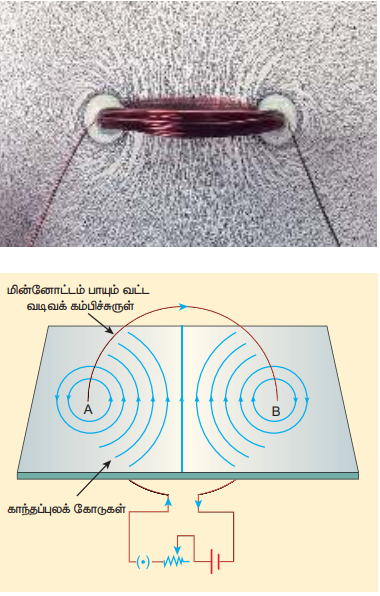

### 3.7.3 Right hand thumb rule

The right hand rule is used to find the direction of magnetic field when the direction of current in a conductor is known.

Assume that we hold the current carrying conductor in our right hand such that the thumb points in the direction of current flow, then the fingers encircling the conductor point in the direction of the magnetic field lines produced.

The Figure 3.28 shows the right hand rule for current carrying straight conductor and circular coil.

### 3.7.4 Maxwell's right hand cork screw rule

This rule can also be used to find the direction of the magnetic field around the current-carrying conductor. If we rotate a right-handed screw using a screw driver, then the direction of current is same as the direction in which screw advances and the direction of rotation of the screw gives the direction of the magnetic field. (Figure 3.29)

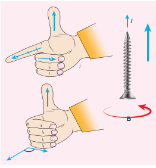

### EXAMPLE 3.12

The magnetic field shown in the figure is due to the current carrying wire. In which direction does the current flow in the wire?

**Solution**

Using right hand rule, current flows upwards.

## 3.8 BIOT-SAVART LAW

Soon after Oersted's discovery, both Jean-Baptiste Biot and Felix Savart in 1819 did quantitative experiments on the force experienced by a magnet kept near current carrying wire and arrived at a mathematical expression that gives the magnetic field at some point in space in terms of the current that produces the magnetic field. This is true for any shape of the conductor.

### 3.8.1 Definition and explanation of Biot-Savart law

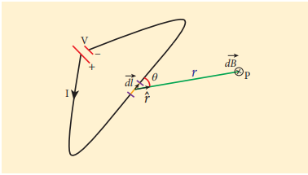

Biot and Savart experimentally observed that the magnitude of magnetic field $d\vec{B}$ at a point P (Figure 3.30) at a distance $r$ from the small elemental length taken on a conductor carrying current varies

(i) directly as the strength of the current $I$
(ii) directly as the magnitude of the length element $d\vec{l}$
(iii) directly as the sine of the angle $\theta$ between $d\vec{l}$ and $\hat{r}$
(iv) inversely as the square of the distance $r$ between the point P and length element $d\vec{l}$

This is expressed as

$$ dB \propto \frac{Idl}{r^2} \sin \theta $$

$$ dB = k \frac{Idl}{r^2} \sin \theta $$

where $k = \frac{\mu}{4\pi}$ in SI units.

In vector notation,

\[
\vec{dB} = \frac{\mu_0}{4\pi} \frac{Id\vec{l} \times \hat{r}}{r^2} \tag{3.34}
\]
Here vector $d\vec{B}$ is perpendicular to both $Id\vec{l}$ (pointing the direction of current flow) and the unit vector $\hat{r}$ directed from $d\vec{l}$ toward point P (Figure 3.31).

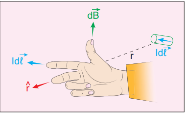

The equation (3.34) is used to compute the magnetic field only due to a small elemental length $dl$ of the conductor. The net magnetic field at P due to the conductor is obtained from principle of superposition by considering the contribution from all current elements $Id\vec{l}$. Hence integrating equation (3.34), we get

\[
\vec{B} = \int d\vec{B} = \frac{\mu_0 I}{4\pi} \int \frac{d\vec{l} \times \hat{r}}{r^2} \tag{3.35}
\]

where the integral is taken over the entire current distribution.

### Cases

1. If the point P lies on the conductor, then $\theta = 0^\circ.$ Therefore, \( |d\vec{B}| \) is zero.

2. If the point lies perpendicular to the conductor, then $\theta = 90^\circ. $ Therefore, \( d\vec{B} \) is maximum and is given by $d\vec{B} = \frac{\mu_0}{4\pi} \frac{Idl}{r^2} \hat{n}$ where \( \hat{n} \) is the unit vector perpendicular to both \( I d\vec{l} \) and \( \hat{r} \).

> **Note:** Electric current is not a vector quantity. It is a scalar quantity. But electric current in a conductor has direction of flow. Therefore, the electric current flowing in a small elemental conductor can be taken as vector quantity i.e. $I\,d\vec{l}$

**Similarities between electric field (from Coulomb's law) and magnetic field (from Biot-Savart's law):**

Electric and magnetic fields
- obey inverse square law, so they are long range fields.
- obey the principle of superposition and are linear with respect to source. In magnitude,
  $E \propto q$, $B \propto Idl$

**Differences between electric field (from Coulomb's law) and magnetic field (from Biot-Savart's law):**

| S. No. | Electric field | Magnetic field |
| :---: | :--- | :--- |
| 1 | Produced by a scalar source i.e., an electric charge $q$ | Produced by a vector source i.e., current element $Id\vec{l}$ |
| 2 | It is directed along the position vector joining the source and the point at which the field is calculated | It is directed perpendicular to the position vector $\vec{r}$ and the current element $Id\vec{l}$ |
| 3 | Does not depend on angle | Depends on the angle between the position vector $\vec{r}$ and the current element $Id\vec{l}$ |

> **Important Note:**
>
> The exponent of charge $q$ (source) and exponent of electric field $E$ is unity. Similarly, the exponent of current element $I\,d\vec{l}$ (source) and exponent of magnetic field $B$ is unity. In other words, electric field $\vec{E}$ is proportional only to charge (source) and not on higher powers of charge $(q^2, q^3$ etc). Similarly, magnetic field $\vec{B}$ is proportional to current element $I\,d\vec{l}$ (source) and not on square or cube or higher powers of current element. The cause and effect have linear relationship.

### 3.8.2 Magnetic field due to long straight conductor carrying current

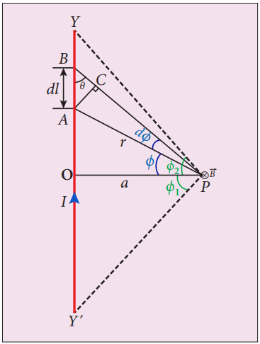

Let $YY'$ be an infinitely long straight conductor and $I$ be the steady current through the conductor as shown in Figure 3.32. In order to calculate magnetic field at a point P which is at a distance $a$ from the wire, let us consider a small line element $dl$ (segment AB).

The magnetic field at a point P due to current element $Idl$ can be calculated from Biot-Savart's law, which is

$$ d\vec{B} = \frac{\mu_0}{4\pi}\frac{Idl\sin\theta}{r^2}\hat{n} $$

where $\hat{n}$ is the unit vector which points into the page at P, $\theta$ is the angle between current element $Idl$ and line joining $dl$ and the point P. Let $r$ be the distance between line element at A to the point P.

To apply trigonometry, draw a perpendicular line from A to BP as shown in Figure 3.32.

In triangle $\Delta ABC$, $\sin \theta = \frac{AC}{AB}$

$$ \Rightarrow AC = AB\sin\theta $$

But $AB = dl \Rightarrow AC = dl\sin\theta$

Let $d\phi$ be the angle subtended between AP and BP, i.e., $\angle APB = \angle APC = d\phi$

In a triangle $\Delta APC$, $\sin(d\phi) = \frac{AC}{AP}$

Since $d\phi$ is very small, $\sin(d\phi) \simeq d\phi$

But $AP = r \Rightarrow AC = r\,d\phi$

$$ \therefore AC = dl\sin\theta = r\,d\phi $$

$$ \therefore d\vec{B} = \frac{\mu_0}{4\pi}\frac{I}{r^2}(r\,d\phi)\hat{n} = \frac{\mu_0}{4\pi}\frac{I\,d\phi}{r}\hat{n} $$

Let $\phi$ be the angle between AP and OP

In $\Delta OPA$, $\cos\phi = \frac{OP}{AP} = \frac{a}{r}$

\[
\Rightarrow r = \frac{a}{\cos \phi}
\]

\[
\vec{dB} = \frac{\mu_0}{4\pi} \frac{I}{a/\cos \phi} \, d\phi \, \hat{n}
\]

\[
\Rightarrow \vec{dB} = \frac{\mu_0 I}{4\pi a} \cos \phi \, d\phi \, \hat{n}
\]

The total magnetic field at P due to the conductor $YY'$ is

$$ \vec{B} = \int_{-\phi_1}^{\phi_2} d\vec{B} = \int_{-\phi_1}^{\phi_2} \frac{\mu_0 I}{4\pi a}\cos\phi\,d\phi\,\hat{n} $$

$$ = \frac{\mu_0 I}{4\pi a} [\sin\phi]_{-\phi_1}^{\phi_2} \hat{n} $$

$$ \vec{B} = \frac{\mu_0 I}{4\pi a} (\sin\phi_1 + \sin\phi_2) \hat{n} \quad (3.35) $$

For a long straight conductor, $\phi_1 = \phi_2 = 90^{\circ}$

$$ \vec{B} = \frac{\mu_0 I}{4\pi a} (1 + 1) \hat{n} = \frac{\mu_0 I}{2\pi a} \hat{n} \quad (3.36) $$

### 3.8.3 Magnetic field produced along the axis of the current-carrying circular coil

Consider a current carrying circular loop of radius $R$ and let $I$ be the current flowing through the wire in the direction as shown in Figure 3.33.

The magnetic field at a point P on the axis of the circular coil at a distance $z$ from the centre of the coil O is computed by taking two diametrically opposite line elements of the coil each of length $d\vec{l}$ at C and D. Let $\vec{r}$ be the vector joining the current element $(I\,d\vec{l})$ at C and the point P.

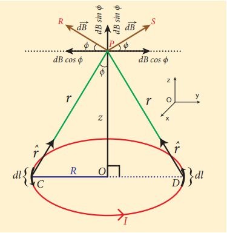

According to Biot-Savart's law, the magnetic field at P due to the current element at C is

$$ d\vec{B} = \frac{\mu_0}{4\pi}\frac{I\,d\vec{l}\times\hat{r}}{r^2} $$

The magnitude of $d\vec{B}$ is

$$ dB = \frac{\mu_0}{4\pi}\frac{Idl\sin\theta}{r^2} = \frac{\mu_0}{4\pi}\frac{Idl}{r^2} $$

where $\theta$ is the angle between $I\,d\vec{l}$ and $\vec{r}$. Here $\theta = 90^{\circ}$.

The direction of $d\vec{B}$ is perpendicular to the current element $I\,d\vec{l}$ and CP. It is therefore along PR perpendicular to CP.

The magnitude of magnetic field at P due to current element at D is same as that for the element at C because of equal distances from the coil. But its direction is along PS.

The magnetic field $d\vec{B}$ due to each current element is resolved into two components: $dB\cos\phi$ along y-direction and $dB\sin\phi$ along z-direction. The horizontal components cancel out while the vertical components $(dB\sin\phi\,\hat{k})$ alone contribute to the net magnetic field $\vec{B}$ at the point P.

$$ \vec{B} = \int d\vec{B} = \int dB\sin\phi\,\hat{k} $$

$$ = \frac{\mu_0 I}{4\pi} \int \frac{dl}{r^2}\sin\phi\,\hat{k} $$

From $\Delta OCP$,

$$ \sin\phi = \frac{R}{(R^2 + z^2)^{\frac{1}{2}}} \quad \text{and} \quad r^2 = R^2 + z^2 $$

Substituting these in the above equation, we get

$$ \vec{B} = \frac{\mu_0 I}{4\pi} \frac{R}{(R^2 + z^2)^{\frac{3}{2}}} \hat{k} \left( \int dl \right) $$

If we integrate the line element from $0$ to $2\pi R$, we get the net magnetic field $\vec{B}$ at point P due to the current-carrying circular loop.

$$ \vec{B} = \frac{\mu_0 I}{2} \frac{R^2}{(R^2 + z^2)^{\frac{3}{2}}} \hat{k} $$

If the circular coil contains $N$ turns, then the magnetic field is

$$ \vec{B} = \frac{\mu_0 N I}{2} \frac{R^2}{(R^2 + z^2)^{\frac{3}{2}}} \hat{k} \quad (3.37) $$

The magnetic field at the centre of the coil is

$$ \vec{B} = \frac{\mu_0 N I}{2R} \hat{k} \qquad (\text{since } z = 0) \quad (3.38) $$

### EXAMPLE 3.13

What is the magnetic field at the centre of the loop shown in figure?
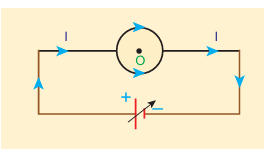
**Solution**

The magnetic field due to current in the upper semicircle and lower semicircle of the circular coil are equal in magnitude but opposite in direction. Hence, the net magnetic field at the centre of the loop (at point O) is zero, $\vec{B} = \vec{0}$.

### 3.8.4 Tangent law and Tangent Galvanometer

Tangent galvanometer is a device used to detect very small currents. It is a moving magnet type galvanometer. Its working is based on tangent law (Figure 3.34).

#### Tangent law

When a magnetic needle or magnet is freely suspended in two mutually perpendicular uniform magnetic fields, it will come to rest in the direction of the resultant of the two fields.

Let $B$ be the magnetic field produced by passing current through the coil of the tangent galvanometer and $B_H$ be the horizontal component of Earth's magnetic field. Under the action of two magnetic fields, the needle comes to rest making angle $\theta$ with $B_H$ such that

$$ B = B_H \tan\theta \quad (3.39) $$

#### Construction

Tangent Galvanometer (TG) consists of copper coil of several turns wound on a non-magnetic circular frame. The frame is made up of brass or wood which is mounted vertically on a horizontal base table (turn table) with three levelling screws. The TG is provided with two or more coils of different number of turns. Most of the equipments we use in laboratory, contains coils of 2 turns, 5 turns and 50 turns which are of different thickness and are used for measuring currents of different strengths.

At the centre of turn table, there is a small upright projection on which a compass box is placed. Compass box consists of a small magnetic needle which is pivoted at its centre, such that the centres of both magnetic needle and circular coil exactly coincide. A thin aluminium pointer attached perpendicular to the magnetic needle moves over a graduated circular scale. The circular scale is divided into four quadrants and they are graduated in degrees, each quadrant being numbered from $0^{\circ}$ to $90^{\circ}$. In order to avoid parallax error in measurement, a mirror is placed below the aluminium pointer.

#### Precautions

1. All the nearby magnets and magnetic materials are kept away from the instrument.
2. Using spirit level, the levelling screws at the base are adjusted so that the small magnetic needle is exactly horizontal and also coil (mounted on the frame) is exactly vertical.
3. The plane of the coil is kept parallel to the small magnetic needle by rotating the coil about its vertical axis. So that, the coil remains in magnetic meridian.
4. The compass box alone is rotated such that the aluminium pointer reads $0^{\circ}-0^{\circ}$.

#### Theory

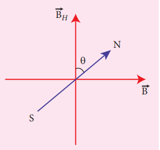

In the tangent galvanometer experiment, when no current is passed through the coil, the small magnetic needle lies along horizontal component of Earth's magnetic field. When the circuit is closed, the electric current will pass through the circular coil and produce magnetic field at the centre of the coil. Now there are two fields which are acting mutually perpendicular to each other. They are:

(1) the magnetic field $(B)$ due to the electric current in the coil acting normal to the plane of the coil.
(2) the horizontal component of Earth's magnetic field $(B_H)$

Because of these crossed fields, the pivoted magnetic needle deflects through an angle $\theta$. From tangent law (equation 3.39),

$$ B = B_H \tan\theta $$

When an electric current is passed through a circular coil of radius $R$ having $N$ turns, the magnitude of magnetic field at the centre is (from equation (3.38))

$$ B = \mu_0 \frac{NI}{2R} \quad (3.40) $$

From equation (3.39) and equation (3.40), we get

$$ \mu_0 \frac{NI}{2R} = B_H \tan\theta $$

The horizontal component of Earth's magnetic field is given by

$$ B_H = \frac{\mu_0 N}{2R} \frac{I}{\tan\theta} \quad (3.41) $$

### EXAMPLE 3.14

A coil of a tangent galvanometer of diameter $0.24\,\text{m}$ has 100 turns. If the horizontal component of Earth's magnetic field is $25 \times 10^{-6}$ T then, calculate the current which gives a deflection of $60^{\circ}$.

**Solution**

The diameter of the coil is \( 0.24 \, \text{m} \). Therefore, radius of the coil is \( 0.12 \, \text{m} \).

Number of turns is 100 turns.

Earth's magnetic field is \( 25 \times 10^{-6} \, \text{T} \)

Deflection is

\[
\theta = 60^\circ \implies \tan 60^\circ = \sqrt{3} = 1.732
\]

\[
I = \frac{2 R B_H}{\mu_0 N} \tan \theta
\]

\[
= \frac{2 \times 0.12 \times 25 \times 10^{-6}}{4 \times 10^{-7} \times 3.14 \times 100} \times 1.732 = 0.82 \times 10^{-1} \, \text{A}
\]

\[
I = 0.082 \, \text{A}
\]

### 3.8.5 Current loop as a magnetic dipole

The magnetic field at a point on the axis of the current-carrying circular loop of radius $R$ at a distance $z$ from its centre is given by

$$ \vec{B} = \frac{\mu_0 I}{2} \frac{R^2}{(R^2 + z^2)^{\frac{3}{2}}} \hat{k} \quad \text{(From eqn. 3.37)} $$

At larger distance $z \gg R$, therefore $R^2 + z^2 \approx z^2$, we have

$$ \vec{B} = \frac{\mu_0 I}{2} \frac{R^2}{z^3} \hat{k} \quad \text{or} \quad \vec{B} = \frac{\mu_0 I}{2\pi} \frac{\pi R^2}{z^3} \hat{k} \quad (3.42) $$

Let $A$ be the area of the circular loop $A = \pi R^2$. So rewriting the equation (3.42) in terms of area of the loop, we have

$$ \vec{B} = \frac{\mu_0 I}{2\pi} \frac{A}{z^3} \hat{k} $$

(or)

$$ \vec{B} = \frac{\mu_0}{4\pi} \frac{2IA}{z^3} \hat{k} \quad (3.43) $$

Comparing equation (3.43) with equation (3.14) dimensionally, we get

$$ p_m = I A \quad (3.44) $$

where $p_m$ is called magnetic dipole moment. In vector notation,

$$ \vec{p}_m = I \vec{A} $$

This implies that a current carrying circular loop behaves as a magnetic dipole of magnetic moment $\vec{p}_m$. So, the magnetic dipole moment of any current loop is equal to the product of the current and area of the loop.

#### Right hand thumb rule

In order to determine the direction of magnetic moment, we use right hand thumb rule which states that:

*If we curl the fingers of right hand in the direction of current in the loop, then the stretched thumb gives the direction of the magnetic moment associated with the loop.*

**Table 3.3 End rule - polarity with direction of current in circular loop**

| Current in circular loop | Polarity |
| :--- | :--- |
| Anti-clockwise current | North Pole |
| Clockwise current | South Pole |

### 3.8.6 Magnetic dipole moment of revolving electron

Suppose an electron undergoes circular motion around the nucleus as shown in Figure 3.36. The circulating electron in a loop is like current in a circular loop (since flow of charge constitutes current). The magnetic dipole moment due to current carrying circular loop is

$$ \vec{\mu}_L = I \vec{A} \quad (3.45) $$

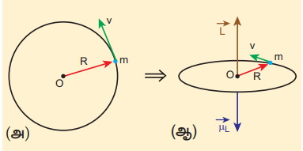

In magnitude,

\[
\mu_L = IA
\]

If $T$ is the time period of revolution of an electron, the current due to circular motion of the electron is

$$ I = \frac{-e}{T} \quad (3.46) $$

where $-e$ is the charge of an electron. If $R$ is the radius of the circular orbit and $v$ is the velocity of the electron in the circular orbit, then

$$ T = \frac{2\pi R}{v} \quad (3.47) $$

Using equation (3.46) and equation (3.47) in equation (3.45), we get

$$ \mu_L = -\frac{e}{2\pi R/v} \pi R^2 = -\frac{e v R}{2} \quad (3.48) $$

where $A = \pi R^2$ is the area of the circular loop. By definition, angular momentum of the electron about O is

$$ \vec{L} = \vec{R} \times \vec{p} $$

In magnitude,

$$ L = R p = m v R \quad (3.49) $$

Using equation (3.48) and equation (3.49), we get

$$ \frac{\mu_L}{L} = -\frac{e v R / 2}{m v R} = -\frac{e}{2m} \Rightarrow \vec{\mu}_L = -\frac{e}{2m} \vec{L} \quad (3.50) $$

The negative sign indicates that the magnetic moment and angular momentum are in opposite direction.

In magnitude,

$$ \frac{\mu_L}{L} = \frac{e}{2m} = \frac{1.60 \times 10^{-19}}{2 \times 9.11 \times 10^{-31}} = 0.0878 \times 10^{12} \,\text{C}\,\text{kg}^{-1} $$

$$ \frac{\mu_L}{L} = 8.78 \times 10^{10} \,\text{C}\,\text{kg}^{-1} = \text{constant} $$

The ratio $\frac{\mu_L}{L}$ is a constant known as gyro-magnetic ratio $\left(\frac{e}{2m}\right)$. It must be noted that the gyro-magnetic ratio is a constant of proportionality which connects angular momentum of the electron and the magnetic moment of the electron.

According to Niels Bohr quantization rule, the angular momentum of an electron moving in a stationary orbit is quantized which means

$$ L = n \hbar = n \frac{h}{2\pi} $$

where $h$ is the Planck's constant $(h = 6.63 \times 10^{-34} \,\text{J}\,\text{s})$ and number $n$ is the orbit number, i.e., $n = 1,2,3,\ldots$ Hence,

$$ \mu_L = \frac{e}{2m} L = n \frac{e h}{4\pi m} $$

$$ \mu_L = n \times \frac{(1.60 \times 10^{-19}) h}{4\pi m} \,\text{A}\,\text{m}^2 $$

$$ = n \times \frac{(1.60 \times 10^{-19})(6.63 \times 10^{-34})}{4 \times 3.14 \times (9.11 \times 10^{-31})} $$

$$ \mu_L = n \times 9.27 \times 10^{-24} \,\text{A}\,\text{m}^2 $$

The minimum value of magnetic moment can be obtained by substituting $n = 1$

$$ \mu_L = 9.27 \times 10^{-24} \,\text{A}\,\text{m}^2 = 9.27 \times 10^{-24} \,\text{J}\,\text{T}^{-1} $$

$$ = (\mu_L)_{\min} = \mu_B $$

where $\mu_B = \frac{eh}{4\pi m} = 9.27 \times 10^{-24} \,\text{A}\,\text{m}^2$ is called Bohr magneton which is used to measure atomic magnetic moments.

## 3.9 AMPERE'S CIRCUITAL LAW

Ampère's circuital law is used to calculate magnetic field at a point whenever there is a symmetry in the problem. This is similar to Gauss's law in electrostatics.

### 3.9.1 Ampère's circuital law

Ampère's law: The line integral of magnetic field over a closed loop is $\mu_0$ times net current enclosed by the loop.

$$ \oint_C \vec{B} \cdot d\vec{l} = \mu_0 I_{\text{enclosed}} \quad (3.51) $$

where $I_{\text{enclosed}}$ is the net current linked by the closed loop C. Note that the line integral does not depend on the shape of the path or the position of the conductor with the magnetic field.

> **Important Notes**
>
> Line integral means integral over a line or curve, symbol used is \( \int_{c} \).
>
>Closed line integral means integral over a closed curve (or line), symbol is \( \oint_{}\) or \( \oint_{c}\)

### 3.9.2 Magnetic field due to the current carrying wire of infinite length using Ampère's law

Consider a straight conductor of infinite length carrying current $I$ and the direction of magnetic field lines is shown in Figure 3.37. Since the wire is geometrically cylindrical in shape and symmetrical about its axis, we construct an Amperian loop in the form of a circular shape at a distance $r$ from the centre of the conductor as shown in Figure 3.37. From the Ampere's law, we get

$$ \oint_C \vec{B} \cdot d\vec{l} = \mu_0 I $$

where $d\vec{l}$ is the line element along the Amperian loop (tangent to the circular loop). Hence, the angle between magnetic field vector and line element is zero. Therefore,

$$ \oint_C B\,dl = \mu_0 I $$

where $I$ is the current enclosed by the Amperian loop. Due to the symmetry, the magnitude of the magnetic field is uniform over the Amperian loop. Hence

$$ B \oint_C dl = \mu_0 I $$

For a circular loop, the circumference is $2\pi r$, which implies,

\[
B \int_{0}^{2\pi r} dl = \mu_0 I
\]

\[
B \cdot 2\pi r = \mu_0 I
\]

\[
B = \frac{\mu_0 I}{2\pi r}
\]

In vector form, the magnetic field is

$$ \vec{B} = \frac{\mu_0 I}{2\pi r} \hat{n} $$

where $\hat{n}$ is the unit vector along the tangent to the Amperian loop as shown in the Figure 3.37.

### EXAMPLE 3.15

Compute the magnitude of the magnetic field of a long, straight wire carrying a current of 1A at distance of 1m from it. Compare it with Earth's magnetic field.

**Solution**

Given that $I = 1$ A and radius $r = 1\,\text{m}$

$$ B_{\text{straight wire}} = \frac{\mu_0 I}{2\pi r} = \frac{4\pi \times 10^{-7} \times 1}{2\pi \times 1} = 2 \times 10^{-7} \,\text{T} $$

But the Earth's magnetic field is $B_{\text{Earth}} \sim 10^{-5} \,\text{T}$

So, $B_{\text{straight wire}}$ is one hundred times smaller than $B_{\text{Earth}}$.

### Solenoid

A solenoid is a long coil of wire closely wound in the form of helix as shown in Figure 3.38. When electric current is passed through the solenoid, the magnetic field is produced. The magnetic field of the solenoid is due to the superposition of magnetic fields of each turn of the solenoid. The direction of magnetic field due to solenoid is given by right hand palm-rule.

Inside the solenoid, the magnetic field is nearly uniform and parallel to its axis whereas, outside the solenoid the field is negligibly small. Based on the direction of the current, one end of the solenoid behaves like North Pole and the other end behaves like South Pole.

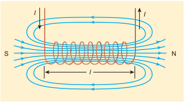

The current carrying solenoid is held in right hand. If the fingers curl in the direction of current, then extended thumb gives the direction of magnetic field of current carrying solenoid. It is shown in Figure 3.39. Hence, the magnetic field of a solenoid looks like the magnetic field of a bar magnet.

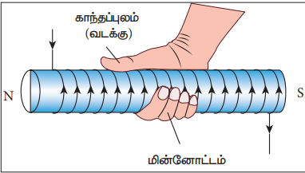

The solenoid is assumed to be long which means that the length of the solenoid is large when compared to its diameter. The winding need not to be always circular, it can also be in other shapes. We consider here only circularly wound solenoid as shown in Figure 3.40.

### 3.9.3 Magnetic field due to a long current carrying solenoid

Consider a solenoid of length $L$ having $N$ turns. The diameter of the solenoid is assumed to be much smaller when compared to its length and the coil is wound very closely.

In order to calculate the magnetic field at any point inside the solenoid, we use Ampere's circuital law. Consider a rectangular loop abcd as shown in Figure 3.41. Then from Ampere's circuital law,

$$ \oint_C \vec{B} \cdot d\vec{l} = \mu_0 I_{\text{enclosed}} = \mu_0 \times (\text{total current enclosed by Amperian loop}) $$

The left hand side of the equation is

$$ \oint_C \vec{B} \cdot d\vec{l} = \int_a^b \vec{B} \cdot d\vec{l} + \int_b^c \vec{B} \cdot d\vec{l} + \int_c^d \vec{B} \cdot d\vec{l} + \int_d^a \vec{B} \cdot d\vec{l} $$

Since the elemental lengths along bc and da are perpendicular to the magnetic field which is along the axis of the solenoid, the integrals

$$ \int_b^c \vec{B} \cdot d\vec{l} = \int_b^c |\vec{B}| |d\vec{l}| \cos 90^{\circ} = 0 $$

Similarly

$$ \int_d^a \vec{B} \cdot d\vec{l} = 0 $$

Since the magnetic field outside the solenoid is zero, the integral $\int_c^d \vec{B} \cdot d\vec{l} = 0$

For the path along ab, the integral is

$$ \int_a^b \vec{B} \cdot d\vec{l} = B \int_a^b dl \cos 0^{\circ} = B \int_a^b dl $$

where the length of the loop ab as shown in the Figure 3.41 is $h$. But the choice of length of the loop ab is arbitrary. We can take very large loop such that it is equal to the length of the solenoid $L$. Therefore the integral is

$$ \int_a^b \vec{B} \cdot d\vec{l} = B L $$

Let $I$ be the current passing through the solenoid of $N$ turns, then

$$ \int_a^b \vec{B} \cdot d\vec{l} = B L = \mu_0 N I \Rightarrow B = \mu_0 \frac{N I}{L} $$

The number of turns per unit length is given by $\frac{N}{L} = n$, Then

$$ B = \mu_0 \frac{n L I}{L} = \mu_0 n I \quad (3.53) $$

Since $n$ is a constant for a given solenoid and $\mu_0$ is also constant. For a fixed current $I$, the magnetic field inside the solenoid is also a constant.

> **Note:** Solenoid can be used as electromagnet. It produces strong magnetic field that can be turned ON or OFF. This is not possible in case of permanent magnet. Further the strength of the magnetic field can be increased by keeping iron bar inside the solenoid. This is because the magnetic field of the solenoid magnetizes the iron bar and hence the net magnetic field is the sum of magnetic field of the solenoid and magnetic field of magnetised iron. Because of these properties, solenoids are useful in designing variety of electrical appliances.

> **MRI - Magnetic Resonance Imaging**
> 
> MRI is Magnetic Resonance Imaging which helps the physicians to diagnose or monitor treatment for a variety of abnormal conditions happening within the head, chest, abdomen and pelvis. It is a non invasive medical test. The patient is placed in a circular opening (actually interior of a solenoid which is made up of superconducting wire) and large current is sent through the superconducting wire to produce a strong magnetic field. So, it uses more powerful magnet, radio frequency pulses and a computer to produce pictures of organs which helps the physicians to examine various parts of the body.

### EXAMPLE 3.16

Calculate the magnetic field inside a solenoid, when

(a) the length of the solenoid becomes twice with fixed number of turns
(b) both the length of the solenoid and number of turns are doubled
(c) the number of turns becomes twice for the fixed length of the solenoid

Compare the results.

**Solution**

The magnetic field of a solenoid (inside) is

$$ B_{L,N} = \mu_0 \frac{NI}{L} $$

(a) length of the solenoid becomes twice with fixed number of turns: $L \rightarrow 2L$ (length becomes twice), $N \rightarrow N$ (number of turns remains constant)

The magnetic field is

$$ B_{2L,N} = \mu_0 \frac{NI}{2L} = \frac{1}{2} B_{L,N} $$

(b) both the length of the solenoid and number of turns are doubled: $L \rightarrow 2L$ (length becomes twice), $N \rightarrow 2N$ (number of turns becomes twice)

The magnetic field is

$$ B_{2L,2N} = \mu_0 \frac{2NI}{2L} = B_{L,N} $$

(c) the number of turns becomes twice but the length of the solenoid remains same: $L \rightarrow L$ (length is fixed), $N \rightarrow 2N$ (number of turns becomes twice)

The magnetic field is

$$ B_{L,2N} = \mu_0 \frac{2NI}{L} = 2 B_{L,N} $$

From the above results,

$$ B_{L,2N} > B_{2L,2N} > B_{2L,N} $$

Thus, strength of the magnetic field is increased when we pack more loops into the same length for a given current.

### 3.9.4 Toroid

A solenoid is bent in such a way its ends are joined together to form a closed ring shape, is called a toroid which is shown in Figure 3.42. The magnetic field has constant magnitude inside the toroid whereas in the interior region (say, at point P) and exterior region (say, at point Q), the magnetic field is zero.

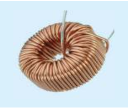

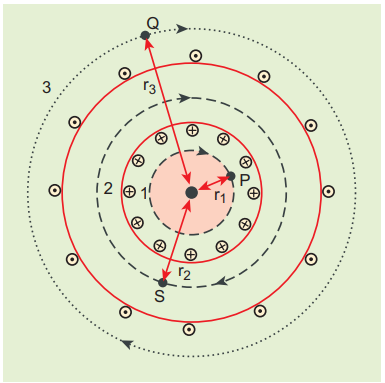

**(a) Open space interior to the toroid**

Let us calculate the magnetic field $B_P$ at point P. We construct an Amperian loop 1 of radius $r_1$ around the point P as shown in Figure 3.43. For simplicity, we take circular loop so that the length of the loop is its circumference.

$$ L_1 = 2\pi r_1 $$

Ampère's circuital law for the loop 1 is

$$ \oint_{\text{loop1}} \vec{B}_P \cdot d\vec{l} = \mu_0 I_{\text{enclosed}} $$

Since the loop 1 encloses no current, $I_{\text{enclosed}} = 0$

$$ \oint_{\text{loop1}} \vec{B}_P \cdot d\vec{l} = 0 $$

This is possible only if the magnetic field at point P vanishes i.e.

$$ \vec{B}_P = 0 $$

**(b) Open space exterior to the toroid**

Let us calculate the magnetic field $B_Q$ at point Q. We construct an Amperian loop 3 of radius $r_3$ around the point Q as shown in Figure 3.43. The length of the loop is

$$ L_3 = 2\pi r_3 $$

Ampère's circuital law for the loop 3 is

$$ \oint_{\text{loop3}} \vec{B}_Q \cdot d\vec{l} = \mu_0 I_{\text{enclosed}} $$

Since in each turn of the toroid loop, current coming out of the plane of paper is cancelled by the current going into the plane of paper. Thus, $I_{\text{enclosed}} = 0$

$$ \oint_{\text{loop3}} \vec{B}_Q \cdot d\vec{l} = 0 $$

This is possible only if the magnetic field at point Q vanishes i.e.

$$ \vec{B}_Q = 0 $$

**(c) Inside the toroid**

Let us calculate the magnetic field $B_S$ at point S by constructing an Amperian loop 2 of radius $r_2$ around the point S as shown in Figure 3.43. The length of the loop is

$$ L_2 = 2\pi r_2 $$

Ampère's circuital law for the loop 2 is

$$ \oint_{\text{loop2}} \vec{B}_S \cdot d\vec{l} = \mu_0 I_{\text{enclosed}} $$

Let $I$ be the current passing through the toroid and $N$ be the number of turns of the toroid, then

$$ I_{\text{enclosed}} = N I $$

Therefore,

$$ \oint_{\text{loop2}} \vec{B}_S \cdot d\vec{l} = \oint_{\text{loop2}} B_S \, dl \cos\theta = B_S \cdot 2\pi r_2 $$

$$ \oint_{\text{loop2}} \vec{B}_S \cdot d\vec{l} = \mu_0 N I $$

$$ B_S = \mu_0 \frac{NI}{2\pi r_2} $$

If the number of turns per unit length $n = \frac{N}{2\pi r_2}$, then the magnetic field at point S is

$$ B_S = \mu_0 n I \quad (3.54) $$

## 3.10 LORENTZ FORCE

When an electric charge $q$ is kept at rest in a magnetic field, no force acts on it. At the same time, if the charge moves in the magnetic field, it experiences a force. This force is different from Coulomb force, studied in unit 1. This force is known as magnetic force. It is given by the equation

$$ \vec{F} = q(\vec{v} \times \vec{B}) \quad (3.55) $$

In general, if the charge is moving in both the electric and magnetic fields, the total force experienced by the charge is given by $\vec{F} = q(\vec{E} + \vec{v} \times \vec{B})$. It is known as Lorentz force.

### 3.10.1 Force on a moving charge in a magnetic field

When an electric charge $q$ is moving with velocity $\vec{v}$ in the magnetic field $\vec{B}$, it experiences a force, called magnetic force $\vec{F}_m$. After careful experiments, Lorentz deduced the force experienced by a moving charge in the magnetic field $\vec{F}_m$

$$ \vec{F}_m = q(\vec{v} \times \vec{B}) \quad (3.56) $$

In magnitude, $F_m = q v B \sin \theta$ (3.57)

The equations (3.56) and (3.57) imply

1. $\vec{F}_m$ is directly proportional to the magnetic field $\vec{B}$
2. $\vec{F}_m$ is directly proportional to the velocity $\vec{v}$ of the moving charge
3. $\vec{F}_m$ is directly proportional to sine of the angle between the velocity and magnetic field
4. $\vec{F}_m$ is directly proportional to the magnitude of the charge $q$
5. The direction of $\vec{F}_m$ is always perpendicular to $\vec{v}$ and $\vec{B}$ as $\vec{F}_m$ is the cross product of $\vec{v}$ and $\vec{B}$

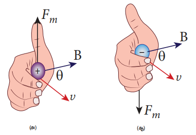

6. The direction of $\vec{F}_m$ on negative charge is opposite to the direction of $\vec{F}_m$ on positive charge provided other factors are identical as shown Figure 3.44 (b)
7. If velocity $\vec{v}$ of the charge $q$ is along magnetic field $\vec{B}$ then, $\vec{F}_m$ is zero

#### Definition of tesla

The strength of the magnetic field is one tesla if a unit charge moving normal to the magnetic field with unit velocity experiences unit force.

$$ 1 \,\text{T} = \frac{1 \,\text{N}\,\text{s}}{\text{C}\,\text{m}} = 1 \frac{\text{N}}{\text{A}\,\text{m}} = 1 \,\text{N}\,\text{A}^{-1}\,\text{m}^{-1} $$

### EXAMPLE 3.17

A particle of charge $q$ moves with velocity $\vec{v}$ along positive y-direction in a magnetic field $\vec{B}$. Compute the Lorentz force experienced by the particle (a) when magnetic field is along positive y-direction (b) when magnetic field points in positive z-direction (c) when magnetic field is in zy-plane and making an angle $\theta$ with velocity of the particle. Mark the direction of magnetic force in each case.

**Solution**

Velocity of the particle is $\vec{v} = v \hat{j}$

(a) Magnetic field is along positive y-direction, this implies, $\vec{B} = B \hat{j}$

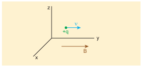

From Lorentz force, $\vec{F}_m = q(v \hat{j} \times B \hat{j}) = \vec{0}$

So, no force acts on the particle when it moves along the direction of magnetic field.

(b) Since the magnetic field points in positive z-direction, this implies, $\vec{B} = B \hat{k}$

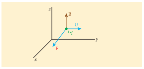

From Lorentz force, $\vec{F}_m = q(v \hat{j} \times B \hat{k})$

$$ = q v B \hat{i} $$

Therefore, the magnitude of the Lorentz force is $q v B$ and direction is along positive x-direction.

(c) Magnetic field is in zy-plane and making an angle $\theta$ with the velocity of the particle, which implies $\vec{B} = B \cos\theta \hat{j} + B \sin\theta \hat{k}$

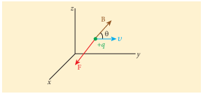

From Lorentz force,

$$ \vec{F}_m = q[v \hat{j} \times (B \cos\theta \hat{j} + B \sin\theta \hat{k})] $$

$$ = q v B \sin\theta \hat{i} $$

### EXAMPLE 3.18

Compute the work done and power delivered by the Lorentz force on the particle of charge $q$ moving with velocity $\vec{v}$. Calculate the angle between Lorentz force and velocity of the charged particle and also interpret the result.

**Solution**

For a charged particle moving on a magnetic field, $\vec{F} = q(\vec{v} \times \vec{B})$

The work done by the magnetic field is

$$ W = \int \vec{F} \cdot d\vec{r} = \int \vec{F} \cdot \vec{v} \, dt $$

$$ W = q \int (\vec{v} \times \vec{B}) \cdot \vec{v} \, dt = 0 $$

Since $\vec{v} \times \vec{B}$ is perpendicular to $\vec{v}$ and hence $(\vec{v} \times \vec{B}) \cdot \vec{v} = 0$

This means that Lorentz force does no work on the particle. From work-kinetic energy theorem,

$$ \frac{dW}{dt} = P = 0 $$

So the power delivered by the Lorentz force is zero.

### 3.10.2 Motion of a charged particle in a uniform magnetic field

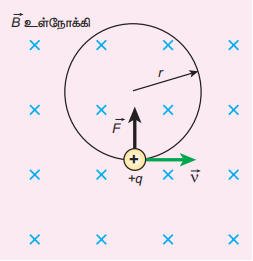

Consider a charged particle of charge $q$ having mass $m$ entering into a region of uniform magnetic field $\vec{B}$ with velocity $\vec{v}$ such that velocity is perpendicular to the magnetic field. As soon as the particle enters into the field, Lorentz force acts on it in a direction perpendicular to both magnetic field $\vec{B}$ and velocity $\vec{v}$.

As a result, the charged particle moves in a circular orbit as shown in Figure 3.45. The Lorentz force on the charged particle is given by

$$ \vec{F} = q(\vec{v} \times \vec{B}) $$

Since Lorentz force alone acts on the particle, the magnitude of the net force on the particle is

$$ \sum_i F_i = F_m = qvB $$

This Lorentz force acts as centripetal force for the particle causing it to execute circular motion. Therefore,

$$ qvB = \frac{mv^2}{r} $$

The radius of the circular path is

$$ r = \frac{mv}{qB} = \frac{p}{qB} \quad (3.57) $$

where $p = mv$ is the magnitude of the linear momentum of the particle. Let $T$ be the time taken by the particle to finish one complete circular motion, then

$$ T = \frac{2\pi r}{v} \quad (3.58) $$

Hence substituting (3.57) in (3.58), we get

$$ T = \frac{2\pi m}{qB} \quad (3.59) $$

Equation (3.59) is called the cyclotron period. The reciprocal of time period is the frequency $f$, which is

$$ f = \frac{1}{T} = \frac{qB}{2\pi m} \quad (3.60) $$

In terms of angular frequency $\omega$,

$$ \omega = 2\pi f = \frac{q}{m} B \quad (3.61) $$

Equations (3.60) and (3.61) are called as cyclotron frequency or gyro-frequency.

From equations (3.59), (3.60) and (3.61), we infer that time period and frequency depend only on charge-to-mass ratio (specific charge) but not on velocity or the radius of the circular path.

If a charged particle moves in a region of uniform magnetic field such that its velocity is not perpendicular to the magnetic field, then the velocity of the particle is split up into two components; one component is parallel to the field while the other component perpendicular to the field. The component of velocity parallel to field remains unchanged and the component perpendicular to the field keeps changing due to Lorentz force. Hence the path of the particle is not a circle; it is a helical around the field lines as shown in Figure 3.46.

For an example, the helical path of an electron when it moves in a magnetic field is shown in Figure 3.47. Inside the particle detector called cloud chamber, the path is made visible by the condensation of water droplets.

### EXAMPLE 3.19

An electron moving perpendicular to a uniform magnetic field 0.500 T undergoes circular motion of radius 2.50 mm. What is the speed of electron?

**Solution**

Charge of an electron $q = -1.60 \times 10^{-19} \text{ C} \Rightarrow |q| = 1.60 \times 10^{-19} \text{ C}$

Magnitude of magnetic field $B = 0.500 \text{ T}$

Mass of the electron, $m = 9.11 \times 10^{-31} \text{ kg}$

Radius of the orbit, $r = 2.50 \text{ mm} = 2.50 \times 10^{-3} \text{ m}$

Speed of the electron, $v = |q| \frac{rB}{m}$

$$ v = 1.60 \times 10^{-19} \times \frac{2.50 \times 10^{-3} \times 0.500}{9.11 \times 10^{-31}} $$

$$ v = 2.195 \times 10^8 \text{ m s}^{-1} $$

### EXAMPLE 3.20

A proton moves in a uniform magnetic field of strength 0.500 T magnetic field is directed along the x-axis. At initial time, $t = 0$ s the proton has velocity $\vec{v} = (1.95 \times 10^5 \hat{i} + 2.00 \times 10^5 \hat{k}) \text{ m s}^{-1}$. Find

(a) At initial time, what is the acceleration of the proton.
(b) Is the path circular or helical? If helical, calculate the radius of helical trajectory and also calculate the pitch of the helix.

**Solution**

Magnetic field $\vec{B} = 0.500 \hat{i} \text{ T}$

Velocity of the particle $\vec{v} = (1.95 \times 10^5 \hat{i} + 2.00 \times 10^5 \hat{k}) \text{ m s}^{-1}$

Charge of the proton $q = 1.60 \times 10^{-19} \text{ C}$

Mass of the proton $m = 1.67 \times 10^{-27} \text{ kg}$

(a) The force experienced by the proton is

$$ \vec{F} = q(\vec{v} \times \vec{B}) = 1.60 \times 10^{-19} \times ((1.95 \times 10^5 \hat{i} + 2.00 \times 10^5 \hat{k}) \times (0.500 \hat{i})) $$

$$ \vec{F} = 1.60 \times 10^{-14} \hat{k} \text{ N} $$

Therefore, from Newton's second law,

$$ \vec{a} = \frac{1}{m} \vec{F} = \frac{1}{1.67 \times 10^{-27}} (1.60 \times 10^{-14}) \hat{k} = 9.58 \times 10^{12} \hat{k} \text{ m s}^{-2} $$

(b) Trajectory is helical.

Radius of helical path is

$$ R = \frac{m v_z}{|q| B} = \frac{1.67 \times 10^{-27} \times 2.00 \times 10^5}{1.60 \times 10^{-19} \times 0.500} = 4.175 \times 10^{-3} \text{ m} = 4.18 \text{ mm} $$

Pitch of the helix is the distance travelled along x-axis in a time $T$, which is $P = v_x T$

But time, $T = \frac{2\pi}{\omega} = \frac{2\pi m}{|q| B} = \frac{2 \times 3.14 \times 1.67 \times 10^{-27}}{1.60 \times 10^{-19} \times 0.500} = 13.1 \times 10^{-8} \text{ s}$

Hence, pitch of the helix is

$$ P = v_x T = (1.95 \times 10^5)(13.1 \times 10^{-8}) = 25.5 \times 10^{-3} \text{ m} = 25.5 \text{ mm} $$

The proton experiences appreciable acceleration in the magnetic field, hence the pitch of the helix is almost six times greater than the radius of the helix.

### EXAMPLE 3.21

Two singly ionized isotopes of uranium \( ^{235}_{92}U \) and \( ^{238}_{92}U \) (isotopes have same atomic number but different mass number) are sent with velocity \( 1.00 \times 10^5 \, \text{m} \, \text{s}^{-1} \) into a magnetic field of strength 0.500 T normally. Compute the distance between the two isotopes after they complete a semi-circle. Also compute the time taken by each isotope to complete one semi-circular path.

(Given: masses of the isotopes: \( m_{235} = 3.90 \times 10^{-25} \, \text{kg} \) and \( m_{238} = 3.95 \times 10^{-25} \, \text{kg} \))

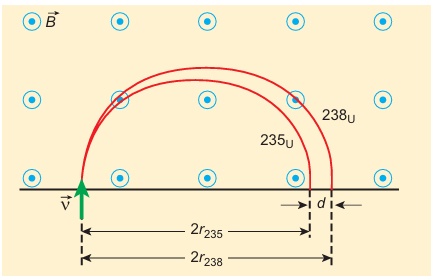 

**Solution**

Since isotopes are singly ionized, they have equal charge which is equal to the charge of an electron, \( q = -1.6 \times 10^{-19} \, \text{C} \).

Mass of uranium \( ^{235}_{92}U \) and \( ^{238}_{92}U \) are \( 3.90 \times 10^{-25} \, \text{kg} \) and \( 3.95 \times 10^{-25} \, \text{kg} \) respectively.

Magnetic field applied, \( B = 0.500 \, \text{T} \).  
Velocity of the electron is \( 1.00 \times 10^5 \, \text{m} \, \text{s}^{-1} \).

**(a) Radius and diameter of the paths**

The radius of the path of \( ^{235}_{92}U \) is:

\[
r_{235} = \frac{m_{235} v}{|q|B} = \frac{3.90 \times 10^{-25} \times 1.00 \times 10^5}{|1.60 \times 10^{-19} \times 0.500|}
\]

\[
r_{235} = 48.8 \times 10^{-2} \, \text{m} = 48.8 \, \text{cm}
\]

The diameter of the semi-circle due to \( ^{235}_{92}U \) is:

\[
d_{235} = 2r_{235} = 97.6 \, \text{cm}
\]

The radius of the path of \( ^{238}_{92}U \) is:

\[
r_{238} = \frac{m_{238} v}{|q|B} = \frac{3.95 \times 10^{-25} \times 1.00 \times 10^5}{|1.60 \times 10^{-19} \times 0.500|}
\]

\[
r_{238} = 49.4 \times 10^{-2} \, \text{m} = 49.4 \, \text{cm}
\]

The diameter of the semi-circle due to \( ^{238}_{92}U \) is:

\[
d_{238} = 2r_{238} = 98.8 \, \text{cm}
\]

Therefore, the separation distance between the isotopes is:

\[
\Delta d = d_{238} - d_{235} = 98.8 \, \text{cm} - 97.6 \, \text{cm} = 1.2 \, \text{cm}
\]

**(b) Time taken by each isotope to complete one semi-circular path**

\[
t_{235} = \frac{\text{distance (semi-circle diameter)}}{\text{velocity}} = \frac{97.6 \times 10^{-2}}{1.00 \times 10^5}
\]

\[
t_{235} = 9.76 \times 10^{-6} \, \text{s} = 9.76 \, \mu \text{s}
\]

\[
t_{238} = \frac{98.8 \times 10^{-2}}{1.00 \times 10^5}
\]

\[
t_{238} = 9.88 \times 10^{-6} \, \text{s} = 9.88 \, \mu \text{s}
\]

Note that even though the difference between mass of two isotopes are very small, this arrangement helps us to convert this small difference into an easily measurable distance of separation. This arrangement is known as mass spectrometer. A mass spectrometer is used in many areas in sciences, especially in medicine, in space science, in geology etc. For example, in medicine, anaesthesiologists use it to measure the respiratory gases and biologist use it to determine the reaction mechanisms in photosynthesis.

### 3.10.3 Motion of a charged particle under crossed electric and magnetic field (velocity selector)

Let us consider an experimental arrangement to illustrate velocity selector as shown in Figure 3.48. In the region of space between the parallel plates of a capacitor which produce uniform electric field $\vec{E}$, a uniform magnetic field $\vec{B}$ is maintained perpendicular to the direction of electric field.

Suppose a charged particle with charge $q$ enters the space from left side with a velocity $\vec{v}$, the net force on the particle is

$$ \vec{F} = q(\vec{E} + \vec{v} \times \vec{B}) $$

For a positive charge, the electric force on the charge acts in downward direction whereas the Lorentz force acts upwards. When these two forces balance each other, then

$$ qE = qvB \Rightarrow v = \frac{E}{B} \quad (3.62) $$

> **Important Notes**
>
> This principle is used in Bainbridge mass spectrograph to separate the isotopes. This concept is explained in Example (3.21).
> 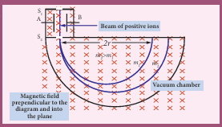

This means, for a given magnitude of $\vec{E}$-field and $\vec{B}$-field, the forces act only on the particle moving with particular speed $v = \frac{E}{B}$. This speed is independent of mass and charge.

By proper choice of electric and magnetic fields, the particle with particular speed can be selected. Such an arrangement of fields is called a velocity selector.

### EXAMPLE 3.22

Let $E$ be the electric field of magnitude $6.0 \times 10^6 \text{ N C}^{-1}$ and $B$ be the magnetic field magnitude 0.83 T. Suppose an electron is accelerated with a potential of $200 \text{ V}$, will it show zero deflection? If not, at what potential will it show zero deflection.

**Solution**

Electric field, $E = 6.0 \times 10^6 \text{ N C}^{-1}$ and magnetic field, $B = 0.83 \text{ T}$.

Then

$$ v = \frac{E}{B} = \frac{6.0 \times 10^6}{0.83} = 7.23 \times 10^6 \text{ m s}^{-1} $$

When an electron goes with this velocity, it shows null deflection. Since the accelerating potential is $200 \text{ V}$, the electron acquires kinetic energy because of this accelerating potential. Hence,

$$ \frac{1}{2} mv^2 = eV \Rightarrow v = \sqrt{\frac{2eV}{m}} $$

Since the mass of the electron, $m = 9.1 \times 10^{-31} \text{ kg}$ and charge of an electron, $|q| = e = 1.6 \times 10^{-19} \text{ C}$. The velocity acquired by the electron due to accelerating potential of $200 \text{ V}$ is

$$ v_{200} = \sqrt{\frac{2(1.6 \times 10^{-19})(200)}{(9.1 \times 10^{-31})}} = 8.39 \times 10^6 \text{ m s}^{-1} $$

Since the speed $v_{200} > v$, the electron is deflected towards direction of Lorentz force. So, in order to have null deflection, the potential we have to supply is

$$ V = \frac{1}{2} \frac{mv^2}{e} = \frac{(9.1 \times 10^{-31}) \times (7.23 \times 10^6)^2}{2 \times (1.6 \times 10^{-19})} = 148.65 \text{ V} $$

### 3.10.4 Cyclotron

Cyclotron (Figure 3.49) is a device used to accelerate the charged particles to gain large kinetic energy. It is also called as high energy accelerator. It was invented by Lawrence and Livingston in 1934.

**Principle:** When a charged particle moves perpendicular to the magnetic field, it experiences magnetic Lorentz force.

**Construction**

The schematic diagram of a cyclotron is shown in Figure 3.50. The particles are allowed to move in between two semicircular metal containers called Dees (hollow D-shaped objects). Dees are enclosed in an evacuated chamber and it is kept in a region with uniform magnetic field controlled by an electromagnet. The direction of magnetic field is normal to the plane of the Dees. The two Dees are kept separated with a gap and the source S (which ejects the particle to be accelerated) is placed at the centre in the gap between the Dees. Dees are connected to high frequency alternating potential difference.

**Working**

Let us assume that the ion ejected from source S is positively charged. As soon as ion is ejected, it is accelerated towards a Dee (say, $D_1$) which has negative potential at that time. Since the magnetic field is normal to the plane of the Dees, the ion moves in a circular path. After one semi-circular path inside $D_1$, the ion reaches the gap between Dees. At this time, the polarities of the Dees are reversed so that the ion is now accelerated towards $D_2$ with a greater velocity. For this circular motion, the centripetal force on the charged particle $q$ is provided by Lorentz force.

$$ \frac{mv^2}{r} = qvB \Rightarrow r = \frac{m}{qB} v \Rightarrow r \propto v \quad (3.63) $$

From the equation (3.63), the increase in velocity increases the radius of circular path. This process continues and hence the particle moves in spiral path of increasing radius. Once it reaches near the edge, it is taken out with the help of deflector plate and allowed to hit the target T.

The important condition in cyclotron operation is that the frequency $f$ at which the positive ion circulates in the magnetic field must be equal to the constant frequency of the electrical oscillator $f_{\text{osc}}$. This is called resonance condition.

From equation (3.60), we have

$$ f_{\text{osc}} = \frac{qB}{2\pi m} $$

The time period of oscillation is

$$ T = \frac{2\pi m}{qB} $$

The kinetic energy of the charged particle is

$$ KE = \frac{1}{2} mv^2 = \frac{q^2 B^2 r^2}{2m} \quad (3.64) $$

**Limitations of cyclotron**

(a) the speed of the ion is limited
(b) electron cannot be accelerated
(c) uncharged particles cannot be accelerated

> **Important Notes**
>
>Deutrons (bundles of one proton and one neutron) can be accelerated because it has same charge as that of proton. But neutron (electrically neutral particle) cannot be accelerated by the cyclotron. When a deutron is bombarded with a beryllium target, a beam of high energy neutrons are produced. These high-energy neutrons are sent into the patient’s cancerous region to break the bonds in the DNA of the cancer cells (killing the cells). This is used in treatment of fast-neutron cancer therapy. 

## EXAMPLE 3.23

Suppose a cyclotron is operated to accelerate protons with a magnetic field of strength 1 T. Calculate the frequency in which the electric field between two Dees could be reversed.

**Solution**

Magnetic field \( B = 1 \, \text{T} \)

Mass of the proton, \( m_p = 1.67 \times 10^{-27} \, \text{kg} \)

Charge of the proton, \( q = 1.60 \times 10^{-19} \, \text{C} \)

\[
f = \frac{qB}{2\pi m_p} = \frac{(1.60 \times 10^{-19})(1)}{2(3.14)(1.67 \times 10^{-27})}
\]

\[
= 15.3 \times 10^6 \, \text{Hz} = 15.3 \, \text{MHz}
\]

### 3.10.5 Force on a current carrying conductor placed in a magnetic field

When a current carrying conductor is placed in a magnetic field, the force experienced by the conductor is equal to the sum of Lorentz forces on the individual charge carriers in the conductor. Consider a small segment of conductor of length $dl$, with cross-sectional area $A$ and current $I$ as shown in Figure 3.51. The free electrons drift opposite to the direction of current. So the relation between current $I$ and magnitude of drift velocity $v_d$ (Refer Unit 2) is

$$ I = neAv_d \quad (3.65) $$

If the conductor is kept in a magnetic field $\vec{B}$, then average force experienced by the charge (electron) in the conductor is

$$ \vec{f} = -e(\vec{v}_d \times \vec{B}) $$

If $n$ is the number of free electrons present in unit volume, then

$$ n = \frac{N}{V} $$

where $N$ is the number of free electrons in the small element of volume $V = A\,dl$

Hence Lorentz force on the elementary section of length $dl$ is the product of the number of the electrons $(N = nA\,dl)$ and the force acting on each electron.

$$ d\vec{F} = -enA\,dl (\vec{v}_d \times \vec{B}) $$

The current element in the conductor is $I\,d\vec{l} = -enA\vec{v}_d\,dl$. Therefore the force on the small elemental section of the current-carrying conductor is

$$ d\vec{F} = (I\,d\vec{l} \times \vec{B}) \quad (3.66) $$

Thus the force on a straight current carrying conductor of length $l$ placed in a uniform magnetic field is

$$ \vec{F}_{\text{total}} = (I\vec{l} \times \vec{B}) \quad (3.67) $$

In magnitude,

$$ F_{\text{total}} = BIl \sin\theta $$

(a) If the conductor is placed along the direction of the magnetic field, then $\theta = 0^{\circ}$. Hence, the force experienced by the conductor is zero.
(b) If the conductor is placed perpendicular to the magnetic field, then $\theta = 90^{\circ}$. Hence, the force experienced by the conductor is maximum, which is $F_{\text{total}} = BIl$.

**Fleming's left hand rule**

When a current carrying conductor is placed in a magnetic field, the direction of the force experienced by it is given by Fleming's Left Hand Rule (FLHR) as shown in Figure 3.52.

Stretch out forefinger, the middle finger and the thumb of the left hand such that they are in three mutually perpendicular directions. If the forefinger points in the direction of magnetic field, the middle finger in the direction of the electric current, then thumb will point in the direction of the force experienced by the conductor.

### EXAMPLE 3.24

A metallic rod of linear density $0.25 \text{ kg m}^{-1}$ is lying horizontally on a smooth inclined plane which makes an angle of $45^{\circ}$ with the horizontal. The rod is not allowed to slide down by flowing a current through it when a magnetic field of strength 0.25 T is acting on it in the vertical direction. Calculate the electric current flowing in the rod to keep it stationary.

**Solution**

The linear density of the rod i.e., mass per unit length of the rod is $0.25 \text{ kg m}^{-1}$

$$ \Rightarrow \frac{m}{l} = 0.25 \text{ kg m}^{-1} $$

Let $I$ be the current flowing in the metallic rod. The direction of electric current is into the plane of the paper. The direction of magnetic force $IBl$ is given by Fleming's left hand rule.

For equilibrium of the rod,

$$ mg \sin 45^{\circ} = IBl \cos 45^{\circ} $$

$$ \Rightarrow I = \frac{1}{B} \frac{m}{l} g \tan 45^{\circ} $$

$$ = \frac{0.25 \text{ kg m}^{-1}}{0.25 \text{ T}} \times 1 \times 9.8 \text{ m s}^{-2} $$

$$ \Rightarrow I = 9.8 \text{ A} $$

So, we need to supply current of 9.8 A to keep the metallic rod stationary.

### 3.10.6 Force between two long parallel current carrying conductors

Let two long straight parallel current carrying conductors separated by a distance $r$ be kept in air medium as shown in Figure 3.53. Let $I_1$ and $I_2$ be the electric currents passing through the conductors A and B in same direction (i.e. along $z$-direction) respectively. The net magnetic field at a distance $r$ due to current $I_1$ in conductor A is

$$ \vec{B}_1 = \frac{\mu_0 I_1}{2\pi r} (-\hat{i}) = -\frac{\mu_0 I_1}{2\pi r} \hat{i} $$

From thumb rule, the direction of magnetic field is perpendicular to the plane of the paper and inwards (arrow into the page $\otimes$) i.e. along negative $\hat{i}$ direction.

Let us consider a small elemental length $dl$ in conductor B at which the magnetic field $\vec{B}_1$ is present. From equation 3.66, Lorentz force on the element $dl$ of conductor B is

$$ d\vec{F} = (I_2\,d\vec{l} \times \vec{B}_1) = -I_2\,dl \frac{\mu_0 I_1}{2\pi r} (\hat{k} \times \hat{i}) = -\frac{\mu_0 I_1 I_2\,dl}{2\pi r} \hat{j} $$

Therefore the force on $dl$ of the wire B is directed towards the conductor A. So the element of length $dl$ in B is attracted towards the conductor A. Hence the force per unit length of the conductor B due to current in the conductor A is

$$ \frac{\vec{F}}{l} = -\frac{\mu_0 I_1 I_2}{2\pi r} \hat{j} $$

Similarly, the net magnetic induction due to current $I_2$ (in conductor B) at a distance $r$ in the elemental length $dl$ of conductor A is

$$ \vec{B}_2 = \frac{\mu_0 I_2}{2\pi r} \hat{i} $$

From the thumb rule, direction of magnetic field is perpendicular to the plane of the paper and outwards (arrow out of the page $\odot$) i.e., along positive $\hat{i}$ direction. Hence, the magnetic force acting on element $dl$ of the conductor A is

$$ d\vec{F} = (I_1\,d\vec{l} \times \vec{B}_2) = I_1\,dl \frac{\mu_0 I_2}{2\pi r} (\hat{k} \times \hat{i}) = \frac{\mu_0 I_1 I_2\,dl}{2\pi r} \hat{j} $$

Therefore the force on $dl$ of conductor A is directed towards the conductor B. So the length $dl$ is attracted towards the conductor B as shown in Figure (3.54).

The force acting per unit length of the conductor A due to the current in conductor B is

$$ \frac{\vec{F}}{l} = \frac{\mu_0 I_1 I_2}{2\pi r} \hat{j} $$

Thus the force between two parallel current carrying conductors is attractive if they carry current in the same direction. (Figure 3.55)

The force between two parallel current carrying conductors is repulsive if they carry current in opposite directions (Figure 3.56).

**Definition of ampere**

One ampere is defined as that constant current which when passed through each of the two infinitely long parallel straight conductors kept side by side parallelly at a distance of one metre apart in air or vacuum causes each conductor to experience a force of $2 \times 10^{-7}$ newton per metre length of conductor.

> **Important Notes**
>
> In November 2018, however, the redefinition of the ampere — along with three other SI base units: the kilogram (mass), kelvin (temperature) and mole (amount of substance) — was approved.
>
>Starting on May 20, 2019, the ampere is based on a fundamental physical constant: the elementary charge ($e$). Thus, one ampere is defined as the electric current corresponding to the flow of \( \frac{1}{1.602\,176\,634 \times 10^{-19}}\) elementary charges per second.

## 3.11 TORQUE ON A CURRENT LOOP

The force on a current carrying wire in a magnetic field is responsible for the motor operation.

### 3.11.1 Torque on a current loop placed in a magnetic field

Consider a rectangular loop PQRS carrying current $I$ is placed in a uniform magnetic field $\vec{B}$. Let $a$ and $b$ be the length and breadth of rectangular loop respectively. The unit vector $\hat{n}$ normal to the plane of the loop makes an angle $\theta$ with the magnetic field as shown in Figure 3.57.

The magnitude of the magnetic force acting on the current-carrying arm PQ is $F_{\text{PQ}} = IaB \sin\left(\frac{\pi}{2}\right) = IaB$. The direction of the force is found using right hand cork screw rule and its direction is upwards.

The magnitude of the force on the arm QR is $F_{\text{QR}} = IbB \sin\left(\frac{\pi}{2} - \theta\right) = IbB \cos\theta$ and its direction is as shown in Figure 3.57.

The magnitude of the force on the arm RS is $F_{\text{RS}} = IaB \sin\left(\frac{\pi}{2}\right) = IaB$ and its direction is downwards.

The magnitude of the force acting on the arm SP is $F_{\text{SP}} = IbB \sin\left(\frac{\pi}{2} + \theta\right) = IbB \cos\theta$ and its direction is also as shown in the Figure 3.57.

Since the forces $F_{\text{QR}}$ and $F_{\text{SP}}$ are equal, opposite and collinear, they cancel each other. But the forces $F_{\text{PQ}}$ and $F_{\text{RS}}$, which are equal in magnitude and opposite in direction, are not acting along same straight line. Therefore, $F_{\text{PQ}}$ and $F_{\text{RS}}$ constitute a couple which exerts a torque on the loop.

The magnitude of torque acting on the arm PQ about AB is $\tau_{\text{PQ}} = \left(\frac{b}{2}\sin\theta\right) IaB$ and it points in the direction of AB. The magnitude of the torque acting on the arm RS about AB is $\tau_{\text{RS}} = \left(\frac{b}{2}\sin\theta\right) IaB$ and points also in the same direction AB as shown in Figure 3.58.

The total torque acting on the entire loop about an axis AB is given by

$$ \tau = \left(\frac{b}{2}\sin\theta\right) F_{\text{PQ}} + \left(\frac{b}{2}\sin\theta\right) F_{\text{RS}} = Ia(b\sin\theta)B $$

$$ \tau = IAB \sin\theta \text{ along the direction AB} $$

In vector form, $\vec{\tau} = (I\vec{A}) \times \vec{B}$

The above equation can also be written in terms of magnetic dipole moment

$$ \vec{\tau} = \vec{p}_m \times \vec{B} \quad \text{where} \quad \vec{p}_m = I\vec{A} $$

The tendency of the torque is to rotate the loop so as to align its normal vector with the direction of the magnetic field.

If there are $N$ turns in the rectangular loop, then the torque is given by $\vec{\tau} = N I A B \sin\theta$

**Special cases:**

(a) When $\theta = 90^{\circ}$ or the plane of the loop is parallel to the magnetic field, the torque on the current loop is maximum.

$$ \tau_{\text{max}} = IAB $$

(b) When $\theta = 0^{\circ} / 180^{\circ}$ or the plane of the loop is perpendicular to the magnetic field, the torque on the current loop is zero.

### 3.11.2 Moving coil galvanometer

Moving coil galvanometer is a device which is used to detect the flow of current in an electrical circuit.

**Principle:** When a current carrying loop is placed in a uniform magnetic field, it experiences a torque.

**Construction**

A moving coil galvanometer consists of a rectangular coil PQRS of insulated thin copper wire. The coil contains a large number of turns wound over a light metallic frame. A cylindrical soft-iron core is placed symmetrically inside the coil as shown in Figure 3.59. The rectangular coil is suspended freely between two pole pieces of a horse-shoe magnet.

The upper end of the rectangular coil is attached to one end of fine strip of phosphor bronze and the lower end of the coil is connected to a hair spring which is also made up of phosphor bronze. In a fine suspension strip, a small plane mirror is attached in order to measure the deflection of the coil with the help of lamp and scale arrangement. The other end of the mirror is connected to a torsion head. In order to pass electric current through the galvanometer, the suspension strip and the spring are connected to terminals.

**Working**

Consider a single turn of the rectangular coil PQRS whose length is $l$ and breadth $b$. $\text{PQ} = \text{RS} = l$ and $\text{QR} = \text{SP} = b$. Let $I$ be the electric current flowing through the rectangular coil PQRS as shown in Figure 3.60. The horse-shoe magnet has hemispherical magnetic poles which produces a radial magnetic field. Due to this radial field, the sides QR and SP are always parallel to the magnetic field $B$ and experience no force. The sides PQ and RS are always perpendicular to the magnetic field and experience equal forces in opposite directions. Due to this, torque is produced.

For single turn, the deflecting torque is

$$ \tau = bF = b (IlB) = (lb) B I = ABI $$

since area of the coil, $A = lb$

For coil with $N$ turns, we get

$$ \tau = N A B I \quad (3.69) $$

Due to this deflecting torque, the coil gets twisted and restoring torque (also known as restoring couple) is developed. Hence the moment of the restoring torque is proportional to the amount of twist $\theta$. Thus

$$ \tau = K\theta \quad (3.70) $$

where $K$ is the restoring couple per unit twist.

At equilibrium, the deflecting couple must be equal to the restoring couple. Therefore we get,

$$ NABI = K\theta \Rightarrow I = \frac{K}{NAB} \theta \quad \text{(or)} \quad I = G\theta \quad (3.71) $$

where $G = \frac{K}{NAB}$ is called galvanometer constant or current reduction factor of the galvanometer.

Since the suspended moving coil galvanometer is very sensitive, we have to handle with high care while doing experiments. Most of the galvanometer we use are pointer type moving coil galvanometer.

**Figure of merit of a galvanometer**

It is defined as the current required to produce a deflection of one scale division in the galvanometer.

**Sensitivity of a galvanometer**

The galvanometer is said to be sensitive if it shows large scale deflection even for a small current passed through it or a small voltage applied across it.

**Current sensitivity**

It is defined as the deflection produced per unit current flowing through galvanometer.

$$ I_s = \frac{\theta}{I} = \frac{NAB}{K} \Rightarrow I_s = \frac{1}{G} \quad (3.72) $$

The current sensitivity of a galvanometer can be increased by

(i) increasing the number of turns, $N$
(ii) increasing the magnetic induction, $B$
(iii) increasing the area of the coil, $A$
(iv) decreasing the couple per unit twist of the suspension wire, $K$

Phosphor-bronze wire is used as the suspension wire because the couple per unit twist is very small.

**Voltage sensitivity**

It is defined as the deflection produced per unit voltage applied across galvanometer.

$$ V_s = \frac{\theta}{V} = \frac{\theta}{I R_g} = \frac{NAB}{K R_g} \quad \text{(or)} \quad V_s = \frac{1}{G R_g} = \frac{I_s}{R_g} \quad (3.73) $$

where $R_g$ is the resistance of galvanometer.

## EXAMPLE 3.25

The coil of a moving coil galvanometer has 5 turns and each turn has an effective area of \( 2 \times 10^{-2} \, \text{m}^2 \). It is suspended in a magnetic field whose strength is \( 4 \times 10^{-2} \, \text{Wb m}^{-2} \). If the torsional constant \( K \) of the suspension fibre is \( 4 \times 10^{-9} \, \text{N m deg}^{-1} \).

(a) Find its current sensitivity in division per micro-ampere.

(b) Calculate the voltage sensitivity of the galvanometer for it to have full scale deflection of 50 divisions for 25 mV.

(c) Compute the resistance of the galvanometer.

**Solution**

\( N = 5 \) turns  
\( A = 2 \times 10^{-2} \, \text{m}^2 \)  
\( B = 4 \times 10^{-2} \, \text{Wb m}^{-2} \)  
\( K = 4 \times 10^{-9} \, \text{N m deg}^{-1} \)

**(a) Current sensitivity**

\[
I_S = \frac{NAB}{K} = \frac{5 \times 2 \times 10^{-2} \times 4 \times 10^{-2}}{4 \times 10^{-9}} = 10^6 \, \text{divisions per ampere}
\]

1 µA = 1 microampere = \( 10^{-6} \) ampere

Therefore,

\[
I_S = 10^6 \frac{\text{div}}{A} = 1 \frac{\text{div}}{10^{-6} \, \text{A}} = 1 \frac{\text{div}}{\mu A}
\]

\[
I_S = 1 \, \text{div} \, (\mu A)^{-1}
\]

**(b) Voltage sensitivity**

\[
V_S = \frac{\theta}{V} = \frac{50 \, \text{div}}{25 \, \text{mV}} = 2 \times 10^3 \, \text{div V}^{-1}
\]

**(c) Resistance of the galvanometer**

\[
R_S = \frac{I_S}{V_S} = \frac{10^6 \frac{\text{div}}{A}}{2 \times 10^3 \frac{\text{div}}{V}} = 0.5 \times 10^3 \, \frac{V}{A} = 0.5 \, \text{k} \, \Omega
\]

## EXAMPLE 3.26

The resistance of a moving coil galvanometer is made twice its original value in order to increase current sensitivity by 50%. Find the percentage change in voltage sensitivity.

**Solution**

Voltage sensitivity is

\[
V_s = \frac{I_s}{R_s}
\]

When the resistance is doubled, then new resistance is

\[
R_s' = 2R_s
\]

Increase in current sensitivity is

\[
I_s' = \left( 1 + \frac{50}{100} \right) I_s = \frac{3}{2} I_s
\]

The new voltage sensitivity is

\[
V_s' = \frac{\frac{3}{2} I_s}{2R_s} = \frac{3}{4} V_s
\]

Hence the voltage sensitivity decreases. The percentage decrease in voltage sensitivity is

\[
\frac{V_s - V_s'}{V_s} \times 100\% = \left(1 - \frac{3}{4}\right) \times 100\% = 25\%
\]

**Conversion of Galvanometer into Ammeter and Voltmeter**

A galvanometer is a very sensitive instrument used to detect current. It can be easily converted into an ammeter and a voltmeter.

**Galvanometer to an Ammeter**

An ammeter is an instrument used to measure current flowing in an electrical circuit. The ammeter must offer low resistance so that it does not change the current passing through it. Therefore, an ammeter is connected in series to measure the circuit current.

A galvanometer is converted into an ammeter by connecting a low resistance in parallel with the galvanometer. This low resistance is called shunt resistance \( S \). The scale is now calibrated in ampere and the range of ammeter depends on the values of the shunt resistance.

Let \( I \) be the current passing through the circuit. When current \( I \) reaches the junction, it divides into two components. Let \( I_g \) be the current passing through the galvanometer of resistance \( R_g \) and the remaining current \( (I - I_g) \) passes through shunt resistance \( S \). The value of shunt resistance is so adjusted that current \( I_g \) produces full scale deflection in the galvanometer. The potential difference across galvanometer is same as the potential difference across shunt resistance.

\[
V_{\text{galvanometer}} = V_{\text{shunt}} \Rightarrow I_g R_g = (I - I_g) S
\]

\[
S = \frac{I_g}{I - I_g} R_g \quad \text{or} \quad I_g = \frac{S}{S + R_g} I
\]

Since the deflection in the galvanometer is proportional to the current passing through it,

\[
\theta = \frac{1}{G} I_g \Rightarrow \theta \propto I_g \Rightarrow \theta \propto I
\]

The effective resistance of ammeter is:

\[
\frac{1}{R_{\text{eff}}} = \frac{1}{R_g} + \frac{1}{S} \Rightarrow R_{\text{eff}} = \frac{R_g S}{R_g + S} = R_a
\]

**Key points:**

1. An ammeter is a low resistance instrument and it is always connected in series to the circuit.
2. An ideal ammeter has zero resistance.
3. In order to increase the range of an ammeter \( n \) times, the value of shunt resistance to be connected in parallel is:

\[
S = \frac{R_g}{n - 1}
\]

**Galvanometer to a Voltmeter**

A voltmeter is an instrument used to measure potential difference across any two points in electrical circuits. It should not draw any current from the circuit otherwise the value of potential difference to be measured will change. 

A voltmeter must have high resistance and when it is connected in parallel, it will not draw appreciable current so that it will indicate the true potential difference.

A galvanometer is converted into a voltmeter by connecting high resistance \( R_h \) in series with galvanometer. The scale is now calibrated in volt and the range depends on the values of the resistance \( R_h \).

Let \( R_g \) be the resistance of galvanometer and \( I_g \) be the current for full scale deflection. Since the galvanometer is connected in series with high resistance, the current in the circuit is same as the current passing through the galvanometer.

\[
I_g = \frac{V}{R_g + R_h} \Rightarrow R_h = \frac{V}{I_g} - R_g
\]

The voltmeter resistance is:

\[
R_v = R_g + R_h
\]

**Key points:**

1. Voltmeter is a high resistance instrument and it is always connected in parallel.
2. An ideal voltmeter has infinite resistance.
3. In order to increase the range of voltmeter \( n \) times:

\[
R_h = (n - 1) R_g
\]

---

# SUMMARY

- A vertical plane passing through geographic axis is called **geographic meridian**.
- A vertical plane passing through magnetic axis is called **magnetic meridian**.
- The angle between magnetic meridian and geographic meridian is called **declination** or **magnetic declination**.
- The angle subtended by Earth's total magnetic field \( \vec{B} \) with the horizontal direction in the magnetic meridian is called **dip** or **magnetic inclination**.
- Magnetic moment is defined as the product of pole strength and magnetic length. Denoted by \( \vec{P}_m \).
- Magnetic field \( \vec{B} \) is the region surrounding a magnet where a magnetic pole of strength unity experiences a force. Unit: \( \text{N A}^{-1} \text{m}^{-1} \).
- Magnetic flux \( \Phi_B \) is the number of magnetic field lines crossing normally through a given area. Unit: Weber (Wb).
- **Coulomb's law in magnetism**: The force between two magnetic poles is proportional to the product of their pole strengths and inversely proportional to the square of the distance between them.
- A magnetic dipole kept in a uniform magnetic field experiences torque.
- **Tangent galvanometer** works based on tangent law: \( B = B_H \tan \theta \).
- Magnetising field \( \vec{H} \) is used to magnetize a sample. Unit: \( \text{A m}^{-1} \).
- **Magnetic permeability** is the measure of ability of a material to allow magnetic lines of force through it.
- **Intensity of magnetisation** is net magnetic moment per unit volume.
- **Magnetic susceptibility** is the ratio of intensity of magnetisation \( \vec{I} \) to magnetising field \( \vec{H} \).
- Magnetic materials are classified into diamagnetic, paramagnetic, and ferromagnetic.
- **Hysteresis** is the lagging of magnetic induction \( \vec{B} \) behind the cyclic variation in magnetising field \( \vec{H} \).
- **Right hand thumb rule**: Thumb points in direction of current, fingers encircle wire in direction of magnetic field.
- **Maxwell's right hand cork screw rule**: Direction of current is same as advancement of screw, rotation determines magnetic field direction.
- **Ampère's circuital law**: \( \oint \vec{B} \cdot d\vec{l} = \mu_0 I_{\text{enclosed}} \)
- Magnetic field inside a solenoid: \( B = \mu_0 n I \), where \( n \) = turns per unit length.
- Magnetic field inside a toroid: \( B = \mu_0 n I \)
- **Lorentz force**: \( \vec{F} = q (\vec{E} + \vec{v} \times \vec{B}) \)
- A charged particle moving in a uniform magnetic field undergoes circular motion.
- **Fleming's Left Hand Rule**: Forefinger = magnetic field, middle finger = current, thumb = force.
- **Definition of 1 ampere**: Constant current that, when passed through two infinitely long parallel straight conductors kept 1 meter apart in vacuum, causes each conductor to experience a force of \( 2 \times 10^{-7} \, \text{N} \) per metre length.
- Torque on a current-carrying coil in a uniform magnetic field: \( \tau = NABI \sin \theta \)
- **Moving coil galvanometer**: Current is directly proportional to deflection: \( I = G\theta \), where \( G = \frac{K}{NAB} \) is galvanometer constant.
- **Current sensitivity**: \( I_s = \frac{\theta}{I} = \frac{NAB}{K} = \frac{1}{G} \)
- **Voltage sensitivity**: \( V_s = \frac{\theta}{V} = \frac{1}{G R_s} = \frac{I_s}{R_s} \)
- **Ammeter**: Converts galvanometer by connecting low resistance (shunt) in parallel.
- **Ideal ammeter**: Zero resistance.
- **Voltmeter**: Converts galvanometer by connecting high resistance in series.
- **Ideal voltmeter**: Infinite resistance.

# I. Multiple Choice Questions

1. The magnetic field at the centre O of the following current loop is

   (a) \( \frac{\mu I}{4r} \) (b) \( \frac{\mu I}{4r} \) (c) \( \frac{\mu I}{2r} \) (d) \( \frac{\mu I}{2r} \)

2. An electron moves in a straight line inside a charged parallel plate capacitor of uniform charge density \( \sigma \). The time taken by the electron to cross the parallel plate capacitor undeflected when the plates are kept under constant magnetic field of induction \( \vec{B} \) is

   (a) \( \frac{eIB}{\sigma} \) (b) \( \frac{eIB}{\sigma l} \) (c) \( \frac{eIB}{\sigma} \) (d) \( \frac{eIB}{\sigma l} \)

3. A particle having mass \( m \) and charge \( q \) accelerated through potential difference \( V \). Find the force when kept under perpendicular magnetic field \( \vec{B} \).
   (a) \( \frac{qB}{4\pi \varepsilon_0 r} \) (b) \( \frac{qB}{4\pi \varepsilon_0 r} \) (c) \( \frac{qB}{2\pi \varepsilon_0 r} \) (d) \( \frac{qB}{2\pi \varepsilon_0 r} \)

4. A circular coil of radius 5 cm and 50 turns carries a current of 3 A. Magnetic dipole moment is nearly
   (a) 1.0 A m² (b) 1.2 A m² (c) 0.5 A m² (d) 0.8 A m²

5. A thin insulated wire forms a plane spiral of \( N = 100 \) tight turns carrying \( I = 8 \) mA. Inside radius \( a = 50 \) mm, outside \( b = 100 \) mm. Magnetic induction at centre is
   (a) 5 μT (b) 7 μT (c) 8 μT (d) 10 μT

6. Three wires of equal length bent as circle, semi-circle, square. Same current and uniform B field. Which experiences greater torque?
   (a) Circle (b) Semi-circle (c) Square (d) All same

7. Two identical coils, each \( N \) turns, radius \( R \), placed coaxially at distance \( R \). Current \( I \) in same direction. Magnetic field at point P at distance \( R/2 \) from each centre is:

   (a) \( p_m \) (b) \( \frac{3}{2} p_m \) (c) \( \frac{2}{\pi} p_m \) (d) \( \frac{1}{2} p_m \)

8. A wire of length \( l \) carrying current \( I \) along Y direction in magnetic field \( \vec{B} = \frac{\beta}{\sqrt{3}} (\hat{i} + \hat{j} + \hat{k}) \, \text{T} \). Magnitude of Lorentz force is
   (a) \( \sqrt{2} \beta I l \) (b) \( \sqrt{\frac{1}{3}} \beta I l \) (c) \( \sqrt{2} \beta I l \) (d) \( \sqrt{\frac{1}{2}} \beta I l \)

9. A bar magnet of length \( l \) and magnetic moment \( p_m \) is bent in the form of an arc. New magnetic dipole moment is (NEET 2013)

   (a) 1.00 mA (b) 1.25 mA (c) 1.50 mA (d) 1.75 mA

10. A non-conducting charged ring carrying charge \( q \), mass \( m \), radius \( r \) rotated with angular speed \( \omega \). Ratio of magnetic moment to angular momentum is
    (a) \( \frac{q}{m} \) (b) \( \frac{2q}{m} \) (c) \( \frac{q}{2m} \) (d) \( \frac{q}{4m} \)

11. (Diagram based) Options: \( \frac{8N\mu I}{5\sqrt{2}R} \), \( \frac{4N\mu I}{\sqrt{5}R} \), etc.

12. Two short bar magnets: 1.20 Am² and 1.00 Am², parallel with north poles pointing south, separated by 20.0 cm. Resultant horizontal magnetic induction at midpoint (Earth's horizontal component \( 3.6 \times 10^{-5} \, \text{Wb m}^{-2} \)) is
    (a) \( 3.60 \times 10^{-5} \) (b) \( 3.5 \times 10^{-5} \) (c) \( 2.56 \times 10^{-4} \) (d) \( 2.2 \times 10^{-4} \) Wb m⁻²

13. Vertical component of Earth's magnetic field equals horizontal component. Angle of dip is
    (a) \( 30^\circ \) (b) \( 45^\circ \) (c) \( 60^\circ \) (d) \( 90^\circ \)

14. A flat dielectric disc of radius \( R \) carries surface charge density \( \sigma \), rotates with angular velocity \( \omega \) about perpendicular axis. Torque in uniform B field perpendicular to axis is
    (a) \( \frac{1}{4} \sigma \omega \pi B R \) (b) \( \frac{1}{2} \sigma \omega \pi B R^2 \) (c) \( \frac{1}{4} \sigma \omega \pi B R^3 \) (d) \( \frac{1}{4} \sigma \omega \pi B R^4 \)

15. Potential energy of magnetic dipole \( \vec{p}_m = (-0.5\hat{i} + 0.4\hat{j}) \, \text{Am}^2 \) in \( \vec{B} = 0.2\hat{i} \, \text{T} \) is
    (a) -0.1 J (b) -0.8 J (c) 0.1 J (d) 0.8 J

## Answers:

1. a
2. b
3. c
4. b
5. b
6. a
7. b
8. a
9. b
10. c
11. c
12. b
13. d
14. d
15. a

## II. Short Answer Questions

1. What is magnetic field?
2. Define magnetic flux.
3. Define magnetic dipole moment.
4. State Coulomb's inverse law.
5. What is magnetic susceptibility?
6. State Biot-Savart's law.
7. What is magnetic permeability?
8. State Ampere's circuital law.
9. Compare dia, para, and ferromagnetism.
10. What is meant by hysteresis?
11. Define magnetic declination and inclination.
12. What is resonance condition in cyclotron?
13. Define ampere.
14. State Fleming's left hand rule.
15. Is an ammeter connected in series or parallel? Why?
16. Explain the concept of velocity selector.
17. Why is the path of a charged particle not a circle when velocity is not perpendicular to magnetic field?
18. Give properties of dia/para/ferromagnetic materials.
19. What happens to domains in a ferromagnetic material in an external magnetic field?
20. How is a galvanometer converted into (i) an ammeter and (ii) a voltmeter?

# III. Long Answer Questions

1. Discuss Earth's magnetic field in detail.
2. Deduce the relation for magnetic field due to an infinitely long straight conductor using Biot-Savart law.
3. Obtain relation for magnetic field on the axis of a circular coil using Biot-Savart law.
4. Compute torque experienced by a magnetic needle in a uniform magnetic field.
5. Calculate magnetic field on the axial line of a bar magnet.
6. Obtain magnetic field on the equatorial line of a bar magnet.
7. Find magnetic field due to a long straight conductor using Ampere's circuital law.
8. Discuss the working of cyclotron in detail.
9. What is tangent law? Discuss in detail.
10. Derive expression for torque on a current-carrying coil in a magnetic field.
11. Discuss conversion of galvanometer into ammeter and voltmeter.
12. Calculate magnetic field inside and outside a long solenoid using Ampere's circuital law.
13. Derive expression for force between two parallel current-carrying conductors.
14. Give an account of magnetic Lorentz force.
15. Compare soft and hard ferromagnetic materials.
16. Derive expression for force on a current-carrying conductor in a magnetic field.
17. Explain principle and working of a moving coil galvanometer.

# IV. Numerical Problems

1. A bar magnet with magnetic moment \( \vec{P}_m \) is cut into four pieces (first cut along axis, then each piece cut along axis again). Compute magnetic moment of each piece.

   **Answer:** \( \vec{P}_{m,\text{new}} = \frac{1}{4} \vec{P}_m \)

2. A conductor of linear mass density \( 0.2 \, \text{g m}^{-1} \) suspended by two flexible wires. Tension is zero when kept inside magnetic field of 1 T (into page). Compute current and direction. \( g = 10 \, \text{m s}^{-2} \)

   **Answer:** \( 2 \, \text{mA} \)

3. A circular coil with area \( 0.1 \, \text{cm}^2 \) in uniform B field \( 0.2 \, \text{T} \), current 3 A, plane perpendicular to B field. Calculate:
   (a) total torque (b) total force (c) average force on each electron (free electron density \( 10^{28} \, \text{m}^{-3} \))

   **Answer:** (a) zero (b) zero (c) \( 0.6 \times 10^{-23} \, \text{N} \)

4. A bar magnet in uniform B field \( 0.8 \, \text{T} \) at \( 30^\circ \) experiences torque \( 0.2 \, \text{Nm} \). Calculate:
   (i) magnetic moment
   (ii) work done from most stable to most unstable configuration, and work done by magnetic field.

   **Answer:** (i) \( 0.5 \, \text{A m}^2 \) (ii) \( W = 0.8 \, \text{J} \), \( W_{\text{mag}} = -0.8 \, \text{J} \)

5. A non-conducting sphere of mass 100 g, radius 20 cm, with 5-turn coil wrapped tightly. Placed on inclined plane with coil parallel to incline. Uniform B field \( 0.5 \, \text{T} \) vertically upward. Compute current for equilibrium.

   **Answer:** \( \frac{2}{\pi} \, \text{A} \)

6. Calculate magnetic field at centre of a square loop carrying current \( 1.5 \, \text{A} \), side length 50 cm.

   **Answer:** \( 3.4 \times 10^{-6} \, \text{T} \)

---

# BOOKS FOR REFERENCE

1. H. C. Verma, *Concepts of Physics – Volume 2*, Bharati Bhawan Publisher.
2. Halliday, Resnick and Walker, *Fundamentals of Physics*, Wiley Publishers, 10th edition.
3. Serway and Jewett, *Physics for Scientists and Engineers with Modern Physics*, Brook/Cole Publishers, 8th edition.
4. David J. Griffiths, *Introduction to Electrodynamics*, Pearson Publishers.
5. Rita John, *Solid State Physics (Magnetism chapter)*, McGraw Hill Education (India) Pvt. Ltd.
6. Paul Tipler and Gene Mosca, *Physics for Scientists and Engineers with Modern Physics*, 6th edition, W.H. Freeman and Company.

---

# ICT CORNER

## Magnetism

**Topic: Cyclotron**

In this activity you will be able to visualize and understand the working of a cyclotron.

**URL:** http://physics.bu.edu/~duffy/HTML5/cyclotron.html

**Steps:**
- Open the browser and type the above URL.
- Click `play` to release the positively charged particle between the D-shaped sections.
- Observe trajectory under magnetic field.
- Note kinetic energy after some time (say \( t = 20 \, \text{s} \)).
- Double electric and magnetic fields and observe change in kinetic energy.

*Note: Pictures are indicative only. If browser requires, allow Flash Player or JavaScript to load the page.*