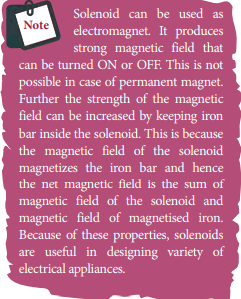
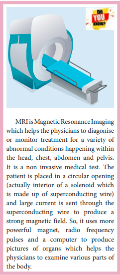
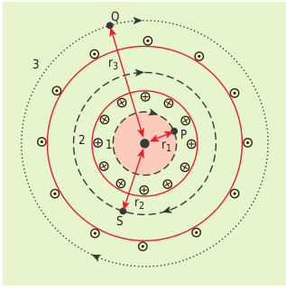
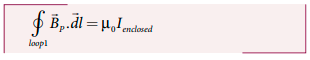
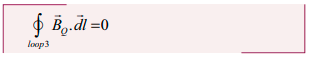
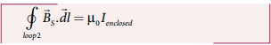
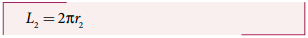

# AMPÈRE’S CIRCUITAL LAW

Ampère’s circuital law is used to calculate magnetic field at a point whenever there is a symmetry in the problem. This is similar to Gauss’s law in electrostatics.

## Ampère’s circuital law

**Ampère’s law: The line integral of magnetic field over a closed loop is μ0 times net current enclosed by the loop.**


\oint_{C} \vec{B} \cdot \overrightarrow{d l}=\mu_{o} I_{\text {enclosed }}


where Ienclosed is the net current linked by the closed loop C. Note that the line integral does not depend on the shape of the path or the position of the conductor with the magnetic field.

## Magnetic field due to the current carrying wire of infinite length using Ampère’s law

Consider a straight conductor of infinite length carrying current I and the direction of magnetic field lines is shown in Figure 3.37. Since the wire is geometrically cylindrical in shape and symmetrical about its axis, we construct an Ampèrian loop in the form of a circular shape at a distance r from the centre of the conductor as shown in Figure 3.37. From
the Ampère’s law, we get

 \oint_{C} \vec{B} \cdot d \vec{l}=\mu_{0} I 

where  d \vec{l} is the line element along the Amperian loop (tangent to the circular loop). Hence, the angle between magnetic field vector and line element is zero. Therefore

 \oint_{C} B d l=\mu_{0} I 

where I is the current enclosed by the Ampèrian loop. Due to the symmetry, the magnitude of the magnetic field is uniform over the Ampèrian loop. Hence

 B \oint_{C} d l=\mu_{o} I 

For a circular loop, the circumference is 2πr, which implies,


\begin{aligned}
& B \int_{0}^{2 \pi r} d l=\mu_{o} I \\
& B \cdot 2 \pi r=\mu_{o} I \\
& B=\frac{\mu_{o} I}{2 \pi r}
\end{aligned}


In vector form, the magnetic field is


\vec{B}=\frac{\mu_{0} I}{2 \pi r} \hat{n}


where  \hat{n} 
 is the unit vector along the tangent to the Ampèrian loop as shown in the Figure 3.37.

\*EXAMPLE 3.15\*\*

Compute the magnitude of the magnetic field of a long, straight wire carrying a current of 1 A at distance of 1m from it. Compare it with Earth’s magnetic field.

**_Solution_**

Given that I=1 \mathrm{~A}$ and radius $r=1 \mathrm{~m}


B_{\text {straightwire }}=\frac{\mu_{\mathrm{o}} I}{2 \pi r}=\frac{4 \pi \times 10^{-7} \times 1}{2 \pi \times 1}=2 \times 10^{-7} \mathrm{~T}


But the Earth’s magnetic field is BEarth  10−5 T. So, Bstraightwire is one hundred times smaller
than BEarth.

**Solenoid**

A solenoid is a long coil of wire closely wound in the form of helix as shown in Figure 3.38. When electric current is passed through the solenoid, the magnetic field is produced. The magnetic field of the solenoid is due to the superposition of magnetic fields of each turn of the solenoid. The direction of magnetic field due to solenoid is given by right hand palm-rule. Inside the solenoid, the magnetic field is nearly uniform and parallel to its axis whereas outside the solenoid the field is negligibly small. Based on the direction of the current, one end of the solenoid behaves like North Pole and the other end behaves like South Pole. The current carrying solenoid is held in right hand. If the fingers curl in the direction of current, then extended thumb gives the direction of magnetic field of current carrying solenoid. It is shown in

Figure 3.39. Hence, the magnetic field of a solenoid looks like the magnetic field of a bar magnet.

The solenoid is assumed to be long which means that the length of the solenoid is large when compared to its diameter. The winding need not to be always circular, it can also be in other shapes. We consider here only circularly wound solenoid as shown in Figure 3.40.

## Magnetic field due to a long current carrying solenoid

Consider a solenoid of length _L_ having _N_ turns. The diameter of the solenoid is assumed to be much smaller when compared to its length and the coil is wound very closely.

**Figure 3.41 Amperian loop for solenoid**

In order to calculate the magnetic field at any point inside the solenoid, we use Ampere’s circuital law. Consider a rectangular loop abcd as shown in Figure 3.41. Then from Ampère’s circuital law,


\begin{aligned}
& \oint_{C} \vec{B} \cdot d \vec{l}=\mu_{0} I_{\text {enclosed }} \\
& =\mu_{0} \times(\text { total current enclosed by Amperian loop })
\end{aligned}


The left hand side of the equation is

\oint_{C} \vec{B} \cdot d \vec{l}=\int_{a}^{b} \vec{B} \cdot d \vec{l}+\int_{b}^{c} \vec{B} \cdot d \vec{l}+\int_{c}^{d} \vec{B} \cdot d \vec{l}+\int_{d}^{a} \vec{B} \cdot d \vec{l}

Since the elemental lengths along bc and \mathrm{da} are perpendicular to the magnetic field which is along the axis of the solenoid, the integrals


\int_{b}^{c} \vec{B} \cdot d \vec{l}=\int_{b}^{c}|\vec{B}||d \vec{l}| \cos 90^{\circ}=0


Similarly


\int_{d}^{a} \vec{B} \cdot d \vec{l}=0


Since the magnetic field outside the solenoid is zero, the integral \int_{c}^{d} \vec{B} \cdot d \vec{l}=0

For the path along $a b$, the integral is


\int_{a}^{b} \vec{B} \cdot d \vec{l}=B \int_{a}^{b} d l \cos 0^{\circ}=B \int_{a}^{b} d l


where the length of the loop ab as shown in the Figure 3.41 is h. But the choice of length of the loop ab is arbitrary. We can take very large loop such that it is equal to the length of the solenoid L. Therefore the integral is


\int_{a}^{b} \vec{B} \cdot d \vec{l}=B L


Let I be the current passing through the solenoid of N turns, then


\int_{a}^{b} \vec{B} \cdot d \vec{l}=B L=\mu_{0} N I \Rightarrow B=\mu_{0} \frac{N I}{L}


The number of turns per unit length is given by N/L =n, Then


B=\mu_{0} \frac{n L I}{L}=\mu_{0} n I


Since n is a constant for a given solenoid and μ0 is also constant. For a fixed current I, the magnetic field inside the solenoid is also a constant.

**EXAMPLE 3.16**

Calculate the magnetic field inside a solenoid, when

(a) the length of the solenoid becomes twice with fixed number of turns

(b) both the length of the solenoid and number of turns are doubled

(c) the number of turns becomes twice for the fixed length of the solenoid

Compare the results.

**_Solution_**

The magnetic field of a solenoid (inside) is


B_{L, N}=\mu_{0} \frac{N I}{L}


length of the solenoid becomes twice with fixed number of turns L→2L (length becomes twice) N→N (number of turns remains constant)
The magnetic field is

(b) both the length of the solenoid and number of turns are doubled L→2L (length becomes twice) N→2N (number of turns becomes twice) The magnetic field is

B_{2 L, 2 N}=\mu_{0} \frac{2 N I}{2 L}=B_{L, N} 

(c) the number of turns becomes twice but the length of the solenoid remains same L→L (length is fixed) N→2N (number of turns becomes twice) The magnetic field is


B_{L, 2 N}=\mu_{0} \frac{2 N I}{L}=2 B_{L, N}
 

From the above results,


B_{L, 2 N}>B_{2 L, 2 N}>B_{2 L, N}
 

## Toroid

A solenoid is bent in such a way its ends are joined together to form a closed ring shape, is called a toroid which is shown in Figure 3.42. The magnetic field has constant magnitude inside the toroid whereas in the interior region (say, at point P) and exterior region (say, at point Q), the magnetic field is zero.

**(a) Open space interior to the toroid**
Let us calculate the magnetic field BP at point P. We construct an Amperian loop 1 of radius r1 around the point P as shown in

Figure 3.43. For simplicity, we take circular loop so that the length of the loop is its circumference.

L1 = 2/&pi; r1

Ampère’s circuital law for the loop 1 is

Since the loop 1 encloses no current, Ienclosed= 0

This is possible only if the magnetic field at point P vanishes i.e.

\overrightarrow{B}p=0

**(b) Open space exterior to the toroid**
Let us calculate the magnetic field BQ at point Q. We construct an Amperian loop 3 of radius r3 around the point Q as shown in Figure 3.43. The length of the loop is

L3 = 2&pi;r3

Ampère’s circuital law for the loop 3 is

Since in each turn of the toroid loop, current coming out of the plane of paper is cancelled by the current going into the plane of paper. Thus, Ienclosed= 0

This is possible only if the magnetic field at point Q vanishes i.e.

\overrightarrow{B}Q=0

**(c) Inside the toroid**

Let us calculate the magnetic field BS at point S by constructing an Amperian loop 2 of radius r2 around the point S as shown in Figure 3.43. The length of the loop is

L2 = 2&pi;r2

Ampere’s circuital law for the loop 2 is

Let I be the current passing through the toroid and N be the number of turns of the toroid, then

If the number of turns per unit length n = frac{N}\{2\pi r^2}, then the magnetic field at point S is

