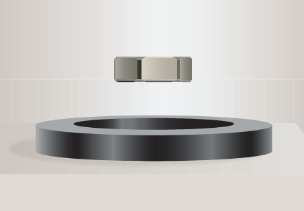
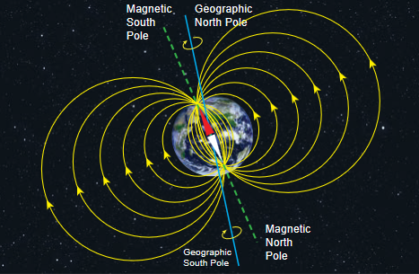
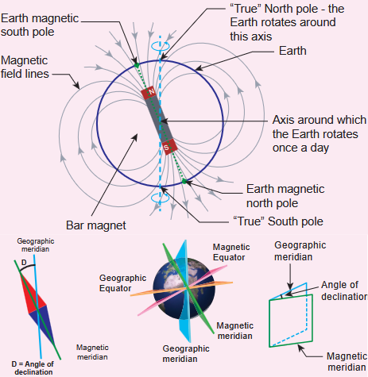
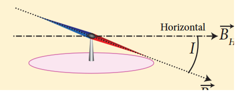

Magnets! No doubt, their behaviour will attract everyone. The world enjoys their benefits, to lead a modern luxurious life. The study of magnets fascinated scientists around our globe for many centuries and even now, door for research on magnets is still open.

Magnetism exists everywhere from tiny particles like electrons to the entire universe. Historically the word 'magnetism' was derived from iron ore magnetite \(\mathrm{(Fe_3O_4)}\). In olden days, magnets were used as magnetic compass for navigation, magnetic therapy for treatment and also used in magic shows.

In modern days, many things we use in our daily life contain magnets. Motors, cycle dynamo, loudspeakers, magnetic tapes used in audio and video recording, mobile phones, head phones, CD, pen-drive, hard disc of laptop, refrigerator door, generator are a few examples.

Earlier, both electricity and magnetism were thought to be two independent branches in physics. In 1820, H.C. Oersted observed the deflection of magnetic compass needle kept near a current carrying wire. This unified the two different branches, electricity and magnetism as a single subject 'electromagnetism' in physics.

In this unit, basics of magnets and their properties are given. Later, how a current carrying conductor (here only steady current, not time-varying current is considered) behaves like a magnet is presented.

### 3.1.1 Earth's magnetic field and magnetic elements

From the activities performed in lower classes, you might have noticed that the needle in a magnetic compass or freely suspended magnet comes to rest in a position which is approximately along the geographical north-south direction of the Earth.

William Gilbert in 1600 proposed that Earth itself behaves like a gigantic powerful bar magnet. But this theory is not successful because the temperature inside the Earth is very high and so it will not be possible for a magnet to retain its magnetism.

Gover suggested that the Earth's magnetic field is due to hot rays coming out from the Sun. These rays will heat up the air near equatorial region. Once air becomes hotter, it rises above and will move towards northern and southern hemispheres and get electrified. This may be responsible to magnetize the ferromagnetic materials near the Earth's surface. Till date, so many theories have been proposed. But none of the theory completely explains the cause for the Earth's magnetism.

The north pole of magnetic compass needle is attracted towards the magnetic south pole of the Earth which is near the geographic north pole. Similarly, the south pole of magnetic compass needle is attracted towards the magnetic north-pole of the Earth which is near the geographic south pole. The branch of physics which deals with the Earth's magnetic field is called Geomagnetism or Terrestrial magnetism.

There are three quantities required to specify the magnetic field of the Earth on its surface, which are often called as the elements of the Earth's magnetic field. They are

(a) magnetic declination \((D)\)
(b) magnetic dip or inclination \((I)\)
(c) the horizontal component of the Earth's magnetic field \((B_{H})\)

Day and night occur because Earth spins about an axis called geographic axis. A vertical plane passing through the geographic axis is called geographic meridian and a great circle perpendicular to Earth's geographic axis is called geographic equator.

The straight line which connects magnetic poles of Earth is known as magnetic axis.

A vertical plane passing through magnetic axis is called magnetic meridian and a great circle perpendicular to Earth's magnetic axis is called magnetic equator.

When a magnetic needle is freely suspended, the alignment of the magnet does not exactly lie along the geographic meridian. The angle between magnetic meridian at a point and geographical meridian is called the declination or magnetic declination \((D)\). At higher latitudes, the declination is greater whereas near the equator, the declination is smaller. In India, declination angle is very small and for Chennai, magnetic declination angle is \(-1^{\circ}16^{\prime}\) (which is negative (west)).

The angle subtended by the Earth's total magnetic field \(\bar{B}\) with the horizontal direction in the magnetic meridian is called dip or magnetic inclination \((I)\) at that point. For Chennai, inclination angle is \(14^{\circ}28^{\prime}\). The component of Earth's magnetic field along the horizontal direction in the magnetic meridian is called horizontal component of Earth's magnetic field, denoted by \(B_{H}\).

Let \(B_{E}\) be the net Earth's magnetic field at any point on the surface of the Earth. \(B_{E}\) can be resolved into two perpendicular components.

$$
\text{Horizontal component } B_{H} = B_{E}\cos I \quad (3.1)
$$
$$
\text{Vertical component } B_{V} = B_{E}\sin I \quad (3.2)
$$

Dividing equation (3.2) and (3.1), we get

$$
\tan I = \frac{B_{V}}{B_{H}} \quad (3.3)
$$

#### (i) At magnetic equator

The Earth's magnetic field is parallel to the surface of the Earth (i.e., horizontal) which implies that the needle of magnetic compass rests horizontally at an angle of dip, \(I = 0^{\circ}\).

\(B_{H} = B_{E}\)
\(B_{V} = 0\)

This implies that the horizontal component is maximum and vertical component is zero at the equator.

#### (ii) At magnetic poles

The Earth's magnetic field is perpendicular to the surface of the Earth (i.e., vertical) which implies that the needle of magnetic compass rests vertically at an angle of dip, \(I = 90^{\circ}\). Hence,

\(B_{H} = 0\)
\(B_{V} = B_{E}\)

This implies that the vertical component is maximum at poles and horizontal component is zero at poles.

**EXAMPLE 3.1**

The horizontal component and vertical component of Earth's magnetic field at a place are 0.15 G and 0.26 G respectively. Calculate the angle of dip and resultant magnetic field. (G- gauss, cgs unit for magnetic field \(1\mathrm{G} = 10^{-4}\mathrm{T}\))

**Solution:**

\(B_{H} = 0.15\mathrm{G} \text{ and } B_{V} = 0.26\mathrm{G}\)

$$
\tan I = \frac{0.26}{0.15} \Rightarrow I = \tan^{-1}(1.732) = 60^{\circ}
$$

The resultant magnetic field of the Earth is

$$
B = \sqrt{B_{H}^{2} + B_{V}^{2}} = 0.3\mathrm{G}
$$

**Aurora Borealis and Aurora Australis**

People living at high latitude regions (near Arctic or Antarctic) might experience dazzling coloured natural lights across the night sky. This ethereal display on the sky is known as aurora borealis (northern lights) or aurora australis (southern lights). These lights are often called as polar lights. The lights are seen above the magnetic poles of the northern and southern hemispheres. They are called as "Aurora borealis" in the north and "Aurora australis" in the south. This occurs as a result of interaction between the gaseous particles in the Earth's atmosphere with highly charged particles released from the Sun's atmosphere through solar wind. These particles emit light due to collision and variations in colour are due to the type of the gas particles that take part in the collisions. A pale yellowish – green colour is produced when the ionized oxygen takes part in the collision and a blue or purplish – red aurora is produced due to ionized nitrogen molecules.

### 3.1.2 Basic properties of magnets

Some basic terminologies and properties used in describing bar magnet.

#### (a) Magnetic dipole moment

Consider a bar magnet. Let \(q_{m}\) be the pole strength of the magnetic pole and let \(l\) be the distance between the geometrical centre of bar magnet O and one end of the pole. The magnetic dipole moment is defined as the product of its pole strength and magnetic length. It is a vector quantity, denoted by \(\vec{p}_{m}\).

$$
\vec{p}_{m} = q_{m}\vec{d} \quad (3.4)
$$

where \(\vec{d}\) is the vector drawn from south pole to north pole and its magnitude \(|\vec{d}| = 2l\).

The magnitude of magnetic dipole moment is \(p_{m} = 2q_{m}l\)

The SI unit of magnetic moment is A m². The direction of magnetic moment is from south pole to north pole.

#### (b) Magnetic field

Magnetic field is the region or space around every magnet within which its influence will be felt by keeping another magnet in that region. The magnetic field \(\vec{B}\) at a point is defined as a force experienced by the bar magnet of unit pole strength.

$$
\overline{B} = \frac{1}{q_m}\overline{F} \quad (3.5)
$$

Its unit is \(\mathrm{N A}^{-1}\mathrm{m}^{-1}\).

#### (c) Types of magnets

Magnets are classified into natural magnets and artificial magnets. For example, iron, cobalt, nickel, etc. are natural magnets. Strengths of natural magnets are very weak and the shapes of the magnet are irregular. Artificial magnets are made in order to have desired shape and strength. If the magnet is in the form of rectangular shape or cylindrical shape, then it is known as bar magnet.

### Properties of magnet

The following are the properties of bar magnet:

1. A freely suspended bar magnet will always point along the north-south direction.
2. A magnet attracts or repels another magnet or magnetic substances towards itself. The attractive or repulsive force is maximum near the end of the bar magnet. When a bar magnet is dipped into iron filling, they cling to the ends of the magnet.
3. When a magnet is broken into pieces, each piece behaves like a magnet with poles at its ends.
4. Two poles of a magnet have pole strength equal to one another.
5. The length of the bar magnet is called geometrical length and the length between two magnetic poles in a bar magnet is called magnetic length. Magnetic length is always slightly smaller than geometrical length. The ratio of magnetic length and geometrical length is \(\frac{5}{6}\).

$$
\frac{\text{Magnetic length}}{\text{Geometrical length}} = \frac{5}{6} = 0.833
$$

**EXAMPLE 3.2**

Let the magnetic moment of a bar magnet be \(\vec{p}_m\) whose magnetic length is \(d = 2l\) and pole strength is \(q_{m}\). Compute the magnetic moment of the bar magnet when it is cut into two pieces
(a) along its length
(b) perpendicular to its length.

**Solution**

(a) a bar magnet cut into two pieces along its length:

When the bar magnet is cut along the axis into two pieces, new magnetic pole strength is \(q_{m}^{\prime} = \frac{q_{m}}{2}\) but magnetic length does not change. So, the magnetic moment is

$$
p_{m}^{\prime} = q_{m}^{\prime}2l = \frac{q_{m}}{2} \cdot 2l = \frac{1}{2} (q_{m}2l) = \frac{1}{2} p_{m}
$$

In vector notation, \(\vec{p}_{m}^{\prime} = \frac{1}{2}\vec{p}_{m}\)

(b) a bar magnet cut into two pieces perpendicular to the axis:

When the bar magnet is cut perpendicular to the axis into two pieces, magnetic pole strength will not change but magnetic length will be halved. So the magnetic moment is

$$
p_{m}^{\prime} = q_{m} \times \frac{1}{2} (2l) = \frac{1}{2} (q_{m} \cdot 2l) = \frac{1}{2} p_{m}
$$

In vector notation, \(\vec{p}_{m}^{\prime} = \frac{1}{2}\vec{p}_{m}\)

**EXAMPLE 3.3**

Compute the magnetic length of a uniform bar magnet if the geometrical length of the magnet is \(12\mathrm{cm}\). Mark the positions of magnetic pole points.

**Solution**

Geometrical length of the bar magnet is \(12\mathrm{cm}\)

$$
\text{Magnetic length} = \frac{5}{6} \times (\text{geometrical length}) = \frac{5}{6} \times 12 = 10\mathrm{cm}
$$

(i) Pole strength is a scalar quantity with dimension [MLTA]. Its SI unit is \(\mathrm{N T^{-1}}\) (newton per tesla) or \(\mathrm{A m}\) (ampere-metre).

(ii) Like positive and negative charges in electrostatics, north pole of a magnet experiences a force in the direction of magnetic field while south pole of a magnet experiences force opposite to the magnetic field.

(iii) Pole strength depends on the nature of materials of the magnet, area of crosssection and the state of magnetization.

(iv) If a magnet is cut into two equal halves along the length then pole strength is reduced to half.

(v) If a magnet is cut into two equal halves perpendicular to the length, then pole strength remains same.

(vi) If a magnet is cut into two pieces, we will not get separate north and south poles. Instead, we get two magnets. In other words, isolated monopole does not exist in nature.

1. Magnetic field lines are continuous closed curves. The direction of magnetic field lines is from North pole to South pole outside the magnet and from South pole to North pole inside the magnet.

2. The direction of magnetic field at any point on the curve is known by drawing tangent to the magnetic field lines at that point.

3. Magnetic field lines never intersect each other. Otherwise, the magnetic compass needle would point towards two different directions, which is not possible.

4. The degree of closeness of the field lines determines the relative strength of the magnetic field. The magnetic field is strong where magnetic field lines crowd and weak where magnetic field lines are well separated.

#### (d) Magnetic flux

The number of magnetic field lines crossing any area normally is defined as magnetic flux \(\Phi_{B}\) through the area. Mathematically, the magnetic flux through a surface of area \(\bar{A}\) in a uniform magnetic field \(\bar{B}\) is defined as

$$
\Phi_{B} = \bar{B}\cdot \bar{A} = BA\cos \theta = B_{\perp}A \quad (3.6)
$$

where \(\theta\) is the angle between \(\bar{B}\) and \(\bar{A}\).

**Special cases**

(a) When \(\bar{B}\) is normal to the surface i.e., \(\theta = 0^{\circ}\), the magnetic flux is \(\Phi_{B} = BA\) (maximum).

(b) When \(\bar{B}\) is parallel to the surface i.e., \(\theta = 90^{\circ}\), the magnetic flux is \(\Phi_{B} = 0\).

Suppose the magnetic field is not uniform over the surface, the equation (3.6) can be written as

$$
\Phi_{B} = \int \bar{B}\cdot d\bar{A}
$$

Magnetic flux is a scalar quantity. The SI unit for magnetic flux is weber, which is denoted by symbol Wb. Dimensional formula for magnetic flux is \([\mathrm{ML}^{2}\mathrm{T}^{-2}\mathrm{A}^{-1}]\). The CGS unit of magnetic flux is maxwell.

$$
1\text{ weber} = 10^{8}\text{ maxwell}
$$

The magnetic flux density is defined as the number of magnetic field lines crossing per unit area kept normal to the direction of lines of force. Its unit is \(\mathrm{Wb m}^{-2}\) or tesla (T).

#### (e) Uniform magnetic field and Nonuniform magnetic field

**Uniform magnetic field**

Magnetic field is said to be uniform if it has same magnitude and direction at all the points in a given region. Example, locally Earth's magnetic field is uniform.

**Non-uniform magnetic field**

Magnetic field is said to be non-uniform if the magnitude or direction or both vary at different points in a region. Example: magnetic field of a bar magnet

**EXAMPLE 3.4**

Calculate the magnetic flux coming out from closed surface containing magnetic dipole (say, a bar magnet).

**Solution**

The total flux emanating from the closed surface S enclosing the dipole is zero. So,

$$
\Phi_{B} = \oint \vec{B} \cdot d\vec{A} = 0
$$

Here the integral is taken over closed surface. Since no isolated magnetic pole (called magnetic monopole) exists, this integral is always zero,

$$
\oint \vec{B} \cdot d\vec{A} = 0
$$

This is similar to Gauss's law in electrostatics.