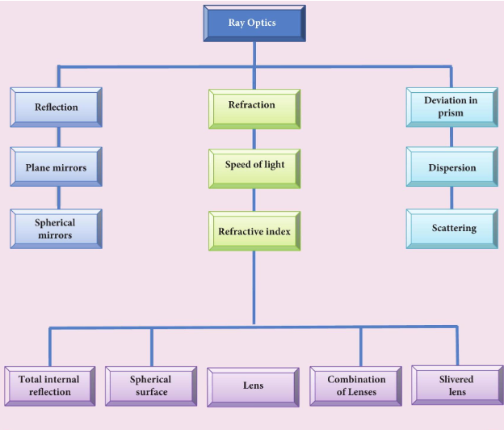
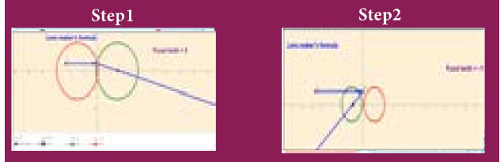

# SUMMARY
 
- A ray of light gives the direction of light.
- Law of reflection is, _i=r_
- Paraxial rays are the rays travelling close to the principal axis of the mirror and make
- small angles with it.
- The relation between focal length and radius of curvature in spherical mirror is, 2 f=R \quad (or) \quad \mathrm{f}=\frac{R}{2}
- Cartesian sign conventions are to be followed to trace image formed by spherical mirrors.
- The mirror equation is, \frac{1}{v}+\frac{1}{u}=\frac{1}{f}
- The magnification in spherical mirror is, m=\frac{h^{\prime}}{h}=-\frac{v}{u}, m=\frac{h^{\prime}}{h}=\frac{f-v}{f}=\frac{f}{f-u}
- Light travels with lesser velocity in optically denser medium.
- Refractive index is the ratio of speed of light in vacuum to speed of light in medium, n=\frac{c}{v}
- Optical path is the equivalent path travelled in vacuum in the same time light travels through a optically denser medium. \quad d^{\prime}=n d
- Law of refraction also called as Snell's law in ratio form is, \frac{\sin i}{\sin r}=\frac{n_{2}}{n_{1}}$.
- In product form is, n_{1} \sin i=n_{2} \sin r
- The relative refractive index of second medium with respect to first medium is, n_{21}=\frac{n_{2}}{n_{1}}
- The apparent depth is always lesser than actual depth. The equation for apparent depth is, d^{\prime}=\frac{d}{n}
- The critical angle of incidence i_{c} for a ray incident from a denser to rarer medium, is that angle for which the angle of refraction is 90^{\circ}. For i>i_{c}, total internal reflection occurs.
- Equations for critical angle incidence is, \sin i_{c}=\frac{1}{n} (or) i_{c}=\sin ^{-1}\left(\frac{1}{n}\right)
- Snell's window is the restricted area of circular illumination which appears when seen from water due to critical angle incidence. The radius of the circular illumination is, R=d\left(\frac{1}{\sqrt{n^{2}-1}}\right) (or) R=\frac{d}{\sqrt{n^{2}-1}}\
- Optical fibre makes use of critical angle incidence. The acceptance angle in optical fibre is, i_{a}=\sin ^{-1}\left(\sqrt{\frac{n_{1}^{2}-n_{2}^{2}}{n_{3}^{2}}}\right). Here, n_{1}, n_{2}, n_{3} are the refractive indices of core, cladding and surrounding medium respectively.
- Glass slabs produce a lateral displacement on the light falling on it. The equation for lateral shift is, L=t\left(\frac{\sin (i-r)}{\cos (r)}\right)
- The equation for single spherical surface is, \frac{n}{v}-\frac{1}{u}=\frac{(n-1)}{R}
- The focal length of the thin lens is positive for a converging lens and negative for a diverging lens. It is not based on the position of the focal point.
- The lens makers formula is, \frac{1}{f}=(n-1)\left(\frac{1}{R_{1}}-\frac{1}{R_{2}}\right)
- The lens equation is, \frac{1}{v}-\frac{1}{u}=\frac{1}{f}
- The magnification produced by the lens is, m=\frac{h^{\prime}}{h}=\frac{v}{u}, m=\frac{h^{\prime}}{h}=\frac{f}{f+u}$ (or) $m=\frac{h^{\prime}}{h}=\frac{f-v}{f}

- The unit of power is diopter (D) when the focal length is taken in meter.
- A prism produces deviation on the incident ray.
- Angle of deviation depends on angle of prism, angle of incidence and refractive index of material of prism given by the equation, d=i_{1}+i_{2}-A
- At minimum deviation, i_{1}=i_{2}, r_{1}=r_{2}, and the ray inside the prism is parallel to the base of the prism.
- The refractive index of prism depends on angle of prism and angle of minimum deviation given by the equation, n=\frac{\sin \left(\frac{A+D}{2}\right)}{\sin \left(\frac{A}{2}\right)}
- When white light travels through a medium, different colours travel with different speeds leading to dispersion of light. Red colour travels faster than violet colour in a medium. In vacuum all the colours travel with the same speed.
- The angle of deviation produced by the small angled prism is, \delta=(n-1) A
- The angular separation between the two extreme colours (violet and red) in the spectrum is called angular dispersion. \delta_{V}-\delta_{R}=\left(n_{V}-n_{R}\right) A
- Dispersive power is the measure of ability of the medium to disperse white light. \omega=\frac{\left(n_{V}-n_{R}\right)}{(n-1)}
- Rainbow is formed by dispersion of light by droplets of water.
- The scattering of light by particles of size less than wavelength of light is called Rayleigh scattering. The intensity of light produced by Rayleigh scattering is, I \propto \frac{1}{\lambda^{4}}
- Non-Rayleigh scattering is by suspended dust particles whose size is greater than the wavelength of light. This scattering is independent of wavelength of light.

- The equation for single spherical surface is, \frac{n}{v}-\frac{1}{u}=\frac{(n-1)}{R}
- The focal length of the thin lens is positive for a converging lens and negative for a diverging lens. It is not based on the position of the focal point.
- The lens makers formula is, \frac{1}{f}=(n-1)\left(\frac{1}{R_{1}}-\frac{1}{R_{2}}\right)
- The lens equation is, \frac{1}{v}-\frac{1}{u}=\frac{1}{f}
- The magnification produced by the lens is, m=\frac{h^{\prime}}{h}=\frac{v}{u}, m=\frac{h^{\prime}}{h}=\frac{f}{f+u} (or) m=\frac{h^{\prime}}{h}=\frac{f-v}{f}
- The power of a lens is a measure of the degree of convergence (or) divergence of light falling on it. Power and focal length are inverse to each other. P=\frac{1}{f}
- The unit of power is diopter (D) when the focal length is taken in meter.
- The effective focal length of lenses in contact is, \frac{1}{f}=\frac{1}{f_{1}}+\frac{1}{f_{2}}
- A prism produces deviation on the incident ray.
- Angle of deviation depends on angle of prism, angle of incidence and refractive index of material of prism given by the equation, d=i_{1}+i_{2}-A
- At minimum deviation, i_{1}=i_{2}, r_{1}=r_{2}, and the ray inside the prism is parallel to the base of the prism.
- The refractive index of prism depends on angle of prism and angle of minimum deviation given by the equation, n=\frac{\sin \left(\frac{A+D}{2}\right)}{\sin \left(\frac{A}{2}\right)}
- When white light travels through a medium, different colours travel with different speeds leading to dispersion of light. Red colour travels faster than violet colour in a medium. In vacuum all the colours travel with the same speed.
- The angle of deviation produced by the small angled prism is, \delta=(n-1) A
- The angular separation between the two extreme colours (violet and red) in the spectrum is called angular dispersion. \delta_{V}-\delta_{R}=\left(n_{V}-n_{R}\right) A
- Dispersive power is the measure of ability of the medium to disperse white light. \omega=\frac{\left(n_{V}-n_{R}\right)}{(n-1)}
- Rainbow is formed by dispersion of light by droplets of water.
- The scattering of light by particles of size less than wavelength of light is called Rayleigh scattering. The intensity of light produced by Rayleigh scattering is, I \propto \frac{1}{\lambda^{4}}
- Non-Rayleigh scattering is by suspended dust particles whose size is greater than the wavelength of light. This scattering is independent of wavelength of light.

**Concept Map**

**Multiple choice questions**

1. The speed of light in an isotropic medium depends on,

(a) its intensity

(b)its wavelength

(c) the nature of propagation

(d) the motion of the source w.r.t medium

2. A rod of length <katex>10 \mathrm{~cm}</katex> lies along the principal axis of a concave mirror of focal length <katex>10 \mathrm{~cm}</katex> in such a way that its end closer to the pole is <katex>20 \mathrm{~cm}</katex> away from the mirror. The length of the image is, (AIPMT Main 2012)
(a) <katex>2.5 \mathrm{~cm}<katex>
(b) <katex>5 \mathrm{~cm}<katex>
(c) <katex>10 \mathrm{~cm}<katex>
(d) <katex>15 \mathrm{~cm}<katex>

3. An object is placed in front of a convex mirror of focal length of _f_ and the maximum and minimum distance of an object from the mirror such that the image formed is real and magnified.

(JEE Main 2009)
(a) _2 f_ and _c_
(b) _c_ and _\infty_
(c) _f_ and _O_
(d) None of these

4. For light incident from air on a slab of refractive index 2, the maximum possible angle of refraction is,
(a) <katex>30^{\circ}</katex>
(b) <katex>45^{\circ}</katex>
(c) <katex>60^{\circ}</katex>
(d) <katex>90^{\circ}</katex>

5. If the velocity and wavelength of light in air is <katex>V_{a}</katex> and <katex>\lambda_{a}</katex> and that in water is <katex>V_{w}</katex> and <katex>\lambda_{w}</katex>, then the refractive index of water is,
(a) <katex>\frac{V_{w}}{V_{a}}</katex>
(b) <katex>\frac{V_{a}}{V_{w}}</katex>
(c) <katex>\frac{\lambda_{w}}{\lambda_{a}}</katex>
(d) <katex>\frac{V_{a} \lambda_{a}}{V_{w} \lambda_{w}}</katex>

6. Stars twinkle due to,

(a) reflection

(b) total internal reflection

(c) refraction

(d) polarisation

7. When a biconvex lens of glass having refractive index 1.47 is dipped in a liquid, it acts as a plane sheet of glass. This implies that the liquid must have refractive index,

(a) less than one

(b) less than that of glass

(c) greater than that of glass

(d) equal to that of glass

8. The radius of curvature of curved surface at a thin planoconvex lens is <katex>10 \mathrm{~cm}</katex> and the refractive index is 1.5 . If the plane surface is silvered, then the focal length will be,
(a) <katex>5 \mathrm{~cm}</katex>
(b) <katex>10 \mathrm{~cm}</katex>
(c) <katex>15 \mathrm{~cm}</katex>
(d) <katex>20 \mathrm{~cm}$</katex>

9. An air bubble in glass slab of refractive index 1.5 (near normal incidence) is <katex>5 \mathrm{~cm}</katex> deep when viewed from one surface and <katex>3 \mathrm{~cm}</katex> deep when viewed from the opposite face. The thickness of the slab is,
(a) <katex>8 \mathrm{~cm}</katex>
(b) <katex>10 \mathrm{~cm}</katex>
(c) <katex>12 \mathrm{~cm}$</katex>
(d) <katex>16 \mathrm{~cm}</katex>

10. A ray of light travelling in a transparent medium of refractive index $n$ falls, on a surface separating the medium from air at an angle of incidents of <katex>45^{\circ}</katex>. The ray can undergo total internal reflection for the following $n$,
(a) <katex>n=1.25</katex>
(b) <katex>n=1.33</katex>
(c) <katex>n=1.4</katex>
(d) <katex>n=1.5</katex>

\section*{Answers}
1) b
2) b
3) d
4) a
5) b
6) c
7) d
8) b
9) c
10) d

**Short Answer Questions**

1. What is angle of deviation due to reflection?

2. Derive the relation between $f$ and $R$ for a spherical mirror.

3. What are the Cartesian sign conventions for spherical mirrors?

4. What is optical path? Obtain the equation for optical path.

5. State Snell's law/law of refraction.

6. What is angle of deviation due to refraction?

7. What is principle of reversibility?

8. What is relative refractive index?

9. Obtain the equation for apparent depth.

10. Why do stars twinkle?

11. What are critical angle and total internal reflection?

12. Obtain the equation for critical angle.

13. Explain the reason for the glittering of diamond.

14. What are mirage and looming?

15. Write a short note on the prisms making use of total internal reflections.

16. What is Snell's window?

17. How does an endoscope work?

18. What are primary focus and secondary focus of a lens?

19. What are the sign conventions followed for lenses?

20. Arrive at lens equation from lens maker's formula.
21. Obtain the equation for lateral magnification of thin lens.

22. What is power of a lens?

23. Derive the equation for effective focal length for lenses in contact.

24. What is angle of minimum deviation?

25. What is dispersion?

26. How are rainbows formed?

27. What is Rayleigh's scattering?

28. Why does sky appear blue?

29. What is the reason for reddish appearance of sky during sunset and sunrise?

30. Why do clouds appear white?

**Long Answer Questions**

1. Derive the mirror equation and the equation for lateral magnification.

2. Describe the Fizeau's method to determine the speed of light.

3. Obtain the equation for radius of illumination (or) Snell's window.

4. Derive the equation for acceptance angle and numerical aperture of optical fibre.

5. Obtain the equation for lateral displacement of light passing through a glass slab.

6. Derive the equation for refraction at single spherical surface.

7. Obtain lens maker's formula and mention its significance.

8. Derive the equations for thin lens and for magnification.

9. Derive the equation for angle of deviation produced by a prism and thus obtain the equation for refractive index of material of the prism.

10. What is dispersion? Obtain the equation for dispersive power of a medium.

**Conceptual Questions**

1. Why are dish antennas curved?

2. What type of lens is formed by a bubble inside water?

3. Is it possible for two lenses to produce zero power?

4. A biconvex lens has focal length $f$ and intensity of light I passing through it. What will be the focal length and intensity for portions of lenses obtained by cutting it vertically and horizontally as shown in figure?

5. Why is yellow light preferred to during fog?

**Numerical Problems**

1. An object of 4 \mathrm{~cm} height is placed at 6 \mathrm{~cm} in front of a concave mirror of radius of curvature 24 \mathrm{~cm}. Find the position, height, magnification and nature of the image.

[Ans: v=12 \mathrm{~cm}, h^{\prime}=8 \mathrm{~cm}, m=2, image

is erect, virtual, twice the height of object formed on right side of mirror.]
2. An object is placed in front of a concave mirror of focal length 20 \mathrm{~cm}. The image formed is three times the size of the object. Calculate two possible distances of the object from the mirror.

[Ans: with +m, u=-40 / 3 \mathrm{~cm} and with -m, u=-80 / 3 \mathrm{~cm} ]

3. A beam of light consisting of red, green and blue is incident on a right-angled prism as shown in figure. The refractive index of the material of the prism for the above red, green and blue colours are 1.39,1.44 and 1.47 respectively. What are the colours suffer total internal reflection?

[Ans: green and blue suffer total internal reflection]

4. An object is placed at a certain distance from a convex lens of focal length 20 \mathrm{cm}. Find the object distance if the image obtained is magnified 4 times.

[Ans: u=-15 \mathrm{~cm}.]

5. Obtain the lens maker's formula for a lens of refractive index n_{2} which is separating two media of refractive indices n_{1} and n_{3} on the left and right respectively.


\begin{aligned}
& {\left[\text { Ans } \frac{n_{3}}{v}-\frac{n_{1}}{u}=\frac{\left(n_{2}-n_{1}\right)}{R_{1}}+\frac{\left(n_{3}-n_{2}\right)}{R_{2}}\right.} \\
&\left.\frac{1}{f}=\frac{1}{n_{3}}\left(\frac{\left(n_{2}-n_{1}\right)}{R_{1}}+\frac{\left(n_{3}-n_{2}\right)}{R_{2}}\right)\right]
\end{aligned}


6. A thin converging lens of refractive index 1.5 has a power of +5.0 \mathrm{D}. When this lens is immersed in a liquid of refractive index $n$, it acts as a divergent lens of focal length 100 \mathrm{~cm}. What must be the value of n ?

[Ans: n=5 / 3 ]

7. If the distance _D_ between an object and screen is greater than 4 times the focal length _f_ of a convex lens, then there are two positions for which the lens forms an enlarged image and a diminished image respectively. This method is called conjugate foci method. If _d_ is the distance between the two positions of the lens, obtain the equation for focal length of the convex lens.


\left[\text { Ans: } f=\frac{D^{2}-d^{2}}{4 D}\right]


8. Prove that a concave lens can only form a virtual, erect and diminished image.

9. A point object is placed at 20 \mathrm{~cm} from a thin plano-convex lens of focal length 15 \mathrm{~cm} whose plane surface is silvered. Locate the position and nature of the final image.

[Ans: v=-12 \mathrm{~cm} ]

10. Find the ratio of the intensities of lights with wavelengths 500 \mathrm{~nm} and 300 \mathrm{~nm} which undergo Rayleigh scattering.

[Ans: 81:625]

**BOOKS FOR REFERENCE**

1. Frances A. Jenkins and Harvey E. White, Fundamentals of Optics, 4^{\text {th }} Edition, McGraw Hill Book Company, (2011).

2. David Halliday, Robert Resnick and Jearl Walker, Fundamentals of Physics, 6^{\text {th }} Edition, John Wiley \& Sons Inc., (2004).

3. H.C. Verma,Concepts of Physics [Part-1], 1^{\text {st }} Edition, Bharathi Bhawan Publishers \& Distributers Pvt. Ltd., (2008).

4. Roger A. Freedman, Hugh D. Young, Sears and Zemansky's University Physics, 12^{\text {th }} Edition, Pearson, (2011).

**ICT CORNER**

**Ray optics**

In this activity you will be able to find out the radius of curvature needed to make a lens of desired focal length

**STEPS**
- In the browser go to the page "https://www.geogebra.org/m/wv7eccvc".
- Take n_{2}=1.5, R_{1}=3 \mathrm{~cm} and R_{2}=-3 \mathrm{~cm}. Calculate the focal length of the lens using the formula \frac{1}{f}=\left(n_{2}-1\right)\left(\frac{1}{R_{1}}-\frac{1}{R_{2}}\right). Verify your answer with the value obtained on the screen by adjusting n_{2}, R_{1} and R_{2}.
- Find out the curvatures R_{1} and R_{2} to make a lens of desired focal length 7 \mathrm{~cm}.

-When R_{1}=-1 \mathrm{~cm} and R_{2}=1 \mathrm{~cm}, you will get a concave lens of focal length -1 \mathrm{~cm}. Try to construct concave and convex lenses by adjusting R_{1} and R_{2}.
- Adjust the refractive index n_{2}, and analyse how focal length changes with respect to refractive index.
- Adjust the refractive index n_{1}, and analyse how focal length changes with respect to refractive index of the medium surrounded by the lens

Note:

Use flash enabled browser or install flash player in your system. URL:

https://www.geogebra.org/m/wv7ecvc
* Pictures are indicative only.
* If browser requires, allow Flash Player or Java Script to load the page.