# RAY OPTICS

There are two ways of spreading light: to be the candle or the mirror that reflects it. — Edith Wharton

## LEARNING OBJECTIVES

In this unit, the students are exposed to,

- The ray aspect of light.
- The phenomenon of reflection and refraction of light.
- The determination of speed of light.
- The concepts related to mirrors, lenses, prisms etc.
- The different phenomena like dispersion and scattering of light.

### 6.1 INTRODUCTION

Light is mystical. Yet, its behaviour is so fascinating. It is difficult to comprehend light as a single entity. The ray optics deals with light that is represented as a ray travelling in straight lines. Here, the geometrical constructs get the permanence to understand some of the characteristics of light and the phenomena associated with it. There are several other phenomena which can only be explained using wave optics, which we study in the next Unit. There is also a quantum aspect of light which we can study as quantum optics in graduate level courses.

#### 6.1.1 Ray optics

Light travels in a straight line in a medium. Light may deviate in its path only when it encounters the boundary of another medium (or) an obstacle. A ray of light gives information only about the direction of light. It does not give information about the other characteristics like intensity and colour of light. However, a ray is a sensible representation of light in ray optics. The path of the light is called a ray of light and a bundle of such rays is called a beam of light. In this chapter, we can explain the phenomena of reflection, refraction, dispersion and scattering of light, using the ray depiction of light.

#### 6.1.2 Reflection

The bouncing back of light into the same medium when it encounters a reflecting surface is called reflection of light. Any polished surface can reflect light. Mirrors which are silver coated at their back can reflect almost $90\%$ of the light falling on them. The angle of incidence $i$ and the angle of reflection $r$ are measured with respect to the normal drawn to the surface at the point of incidence of light. According to laws of reflection,

(i) The incident ray, reflected ray and normal to the reflecting surface are all coplanar (i.e., lie in the same plane).  
(ii) The angle of incidence $i$ is equal to the angle of reflection $r$.

$$ i = r \tag{6.1} $$

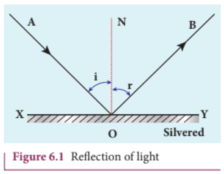
**Figure** Reflection of light

The laws of reflection are valid at each point for any reflecting surface whether the surface is flat (or) curved. If the reflecting surface is flat, then incident parallel rays after reflection come out as parallel rays. If the reflecting surface is irregular, then the incident parallel rays after reflection come out as irregular rays (not parallel rays). Still the laws of reflection are valid at every point of incidence in irregular reflection as shown in figure 6.3(b).

.png)

.png)

#### 6.1.3 Angle of deviation due to reflection

The angle between the direction of incident ray and the reflected ray is called angle of deviation due to reflection. It is calculated by a simple geometry. The incident light is $AO$. The reflected light is $OB$. The undeviated light is $OC$ which is the continuation of the incident light. The angle between $OB$ and $OC$ is the angle of deviation $d$. From the geometry, it is written as, $d = 180 - (i + r)$. As $i = r$ in reflection, we can write angle of deviation in reflection as,

$$ d = 180 - 2i \tag{6.2} $$

The angle of deviation can also be measured in terms of the glancing angle $\alpha$ which is measured between the incident ray $AO$ and the reflecting plane surface $XY$. By geometry, the angles $\angle AOX = \alpha$, $\angle BOY = \alpha$ and $\angle YOC = \alpha$ (all are same). The angle of deviation $d$ is the angle $\angle BOC$. Therefore,

$$ d = 2\alpha \tag{6.3} $$

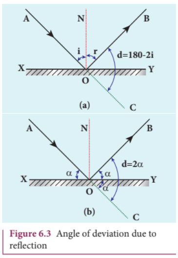

#### EXAMPLE 6.1

Prove that for the same incident light when a reflecting surface is tilted by an angle $\theta$, the reflected light will be tilted by an angle $2\theta$.

**Solution**

$AB$ is the reflecting surface. Both the incident ray $IO$ and the reflected ray $OR_1$ subtend angle $i$ with the normal $N$ as the angle of incidence is equal to angle of reflection. When the surface $AB$ is tilted to $A'B'$ by an angle $\theta$, the normal $N$ is also tilted to $N'$ by the same angle $\theta$. The position of the incident ray $IO$ remains unaltered. But the reflected ray now is $OR_2$.

Now, in the tilted system, the angle of incidence, $\angle N'OI = i + \theta$ and the angle of reflection, $\angle N'OR_2 = i + \theta$ are the same. The angle between $ON'$ and $OR_1$ is $\angle N'OR_1 = i - \theta$. The angle tilted on the reflected light is the angle between $OR_1$ and $OR_2$ which is $\angle R_1OR_2$.

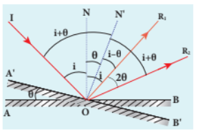

### 6.1.4 Image formation in plane mirror

Let us consider a point object $A$ placed in front of a plane mirror. The point of incidence is $O$ on the mirror. Light ray $AO$ from the point object is incident on the mirror and it is reflected along $OB$. The normal is $ON$. The angle of incidence $\angle AON =$ angle of reflection $\angle BON$.

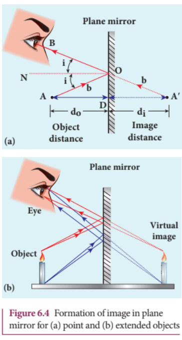

Another ray $AD$ incident normally on the mirror at $D$ is reflected back along $DA$. When $BO$ and $AD$ are extended backwards, they meet at a point $A'$. Thus, the rays appear to come from a point $A'$ which is behind the plane mirror. The object and its image are at equal perpendicular distances from the plane mirror which can be shown by the following explanation.

Angle $\angle AON =$ angle $\angle DAO$ [Since they are alternate angles]  
Angle $\angle BON =$ angle $\angle OA'D$ [Since they are corresponding angles]

Hence, it follows that angle $\angle DAO = \angle OA'D$

The triangles $\Delta ODA$ and $\Delta ODA'$ are congruent

$$ \therefore AD = A'D $$

This shows that the image distance $d_i$ inside the plane mirror is equal to the object distance $d_o$ in front of the plane mirror. The image formed by the plane mirror for extended object is shown in Figure 6.4(b).

#### 6.1.5 Characteristics of the image formed by plane mirror

(i) The image formed by a plane mirror is virtual, erect and laterally inverted sidewise (left/right).  
(ii) The size of the image is equal to the size of the object.  
(iii) The image distance behind the mirror is equal to the object distance in front of the mirror.  
(iv) If an object is placed between two plane mirrors inclined at an angle $\theta$, then the number of images $n$ formed is given in Table 6.1the images formed are shown in Figure 6.5.

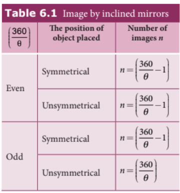

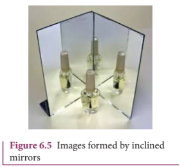

#### EXAMPLE 6.2

What is the height of the mirror needed for a person to see his/her image fully on the mirror?

**Solution**

Let us assume a person of height $h$ is standing in front of a vertical plane mirror. The person could see his/her head when light from the head falls on the mirror and gets reflected to the eyes. Same way, light from the feet falls on the mirror and gets reflected to the eyes.

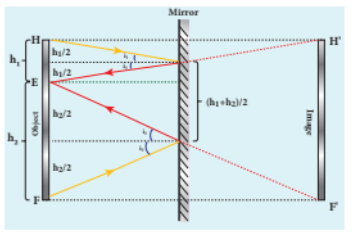

If the distance between his head $H$ and eye $E$ is $h_1$ and distance between his feet $F$ and eye $E$ is $h_2$. The person's total height is $h$. Here, $h = h_1 + h_2$

By the law of reflection, the angle of incidence and angle of reflection are the same for the two extreme reflections. The normals are now the bisectors of the angles between the incident and the reflected rays at the two points. By geometry, the height of the mirror needed is only half of the height of the person.

$$ \frac{h_1 + h_2}{2} = \frac{h}{2} $$

Does the height depend on the distance between the person and the mirror?

### 6.2 SPHERICAL MIRRORS

We shall now study about the reflections that take place in spherical surfaces.

A spherical surface is a part cut from a hollow sphere. Spherical mirrors are generally constructed using glass. One surface of the glass is silvered. The reflection takes place at the other surface which is polished. If the polished surface of the mirror is concave it is called a concave mirror. If the polished surface of the mirror is convex it is called a convex mirror.

We shall get familiarised with some of the terminologies pertaining to spherical mirrors.

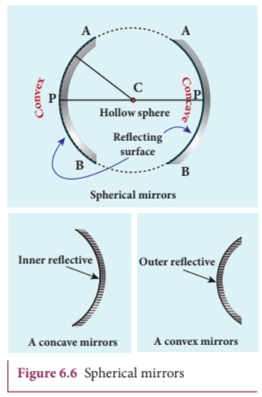

**Centre of curvature:** The centre of the sphere of which the mirror is a part is called the centre of curvature $C$ of the mirror.

**Radius of curvature:** The radius of the sphere of which the spherical mirror is a part is called the radius of curvature $R$ of the mirror.

**Pole:** The middle point on the spherical surface of the mirror (or) the geometrical centre of the mirror is called pole $P$ of the mirror (or) optic centre.

**Principal axis:** The line joining the pole $P$ and the centre of curvature $C$ is called the principal axis of the mirror. The light ray travelling along the principal axis towards the mirror after reflection travels back along the same principal axis. It is also called optical axis.

**Focus (or) Focal point:** Light rays travelling parallel and close to the principal axis when incident on a spherical mirror, converge at a point for concave mirror (or) appear to diverge from a point for convex mirror on the principal axis. This point is called the focus (or) focal point $F$ of the mirror.

**Focal length:** The distance between the pole $P$ and the focus $F$ is called the focal length $f$ of the mirror.

**Focal plane:** The plane through the focus and perpendicular to the principal axis is called the focal plane of the mirror.

All the above mentioned terms are shown in Figure 6.7 for both concave and convex mirrors.

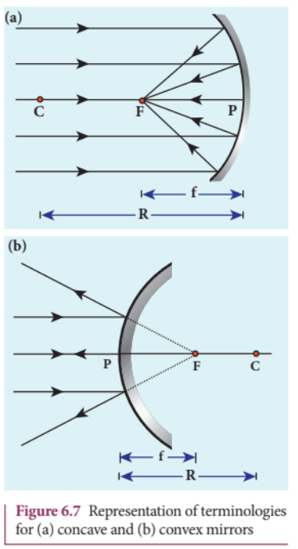

#### 6.2.1 Paraxial Rays and Marginal Rays

The paraxial rays are the rays which travel very close to the principal axis and make small angles with it. They fall on the mirror very close to the pole. On the other hand, the marginal rays are the rays which travel far away from the principal axis and make large angles with it. They fall on the mirror far away from the pole. These two rays behave differently (get focused at different points). In this chapter, we shall restrict our studies only to paraxial rays. As the angles made by the paraxial rays are very small, we can make good approximations.

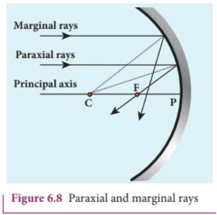

#### 6.2.2 Relation between $f$ and $R$

Let $C$ be the centre of curvature of the mirror. Consider a ray of light parallel to the principal axis is incident on the mirror at $M$. It passes through the principal focus $F$ after reflection. The line $CM$ is the normal to the mirror at $M$. Let $i$ be the angle of incidence and the same will be the angle of reflection.

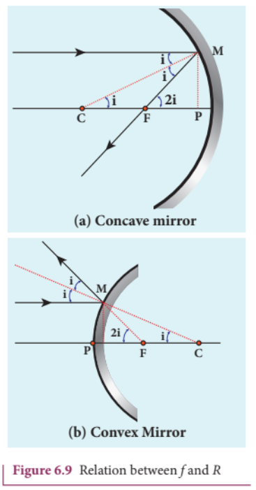

If $MP$ is the perpendicular from $M$ to the principal axis, then

The angles $\angle MCP = i$ and $\angle MFP = 2i$  
From right angle triangles $\Delta MCP$ and $\Delta MFP$ we can write,

$$ \tan i = \frac{PM}{PC} \quad \text{and} \quad \tan 2i = \frac{PM}{PF} $$

As the angles are small, $\tan i \approx i$ and $\tan 2i \approx 2i$,

$$ i = \frac{PM}{PC} \quad \text{and} \quad 2i = \frac{PM}{PF} $$

Simplifying further,

$$ 2\frac{PM}{PC} = \frac{PM}{PF} \quad \Rightarrow \quad 2PF = PC $$

$PF$ is focal length $f$ and $PC$ is the radius of curvature $R$.

$$ 2f = R \quad \text{(or)} \quad f = \frac{R}{2} \tag{6.4} $$

Equation (6.4) is the relation between $f$ and $R$.The construction is shown for convex
mirror in figure 6.9(b)

#### 6.2.3 Image formation in spherical mirrors

The image formed by spherical mirror can be found by ray construction called image tracing. To locate an image point, a minimum of two rays must meet at that point. We can use at least any two of the following four rays:

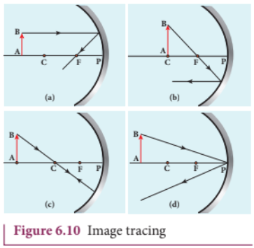

(i) A ray parallel to the principal axis after reflection will pass (or appear to pass) through the principal focus.  
(ii) A ray passing (or appear passing) through the principal focus, after reflection will travel parallel to the principal axis.  
(iii) A ray passing through the centre of curvature retraces its path after reflection as it is a normal incidence.  
(iv) A ray falling on the pole will get reflected as per law of reflection keeping principal axis as the normal.

#### 6.2.4 Cartesian sign convention

While tracing the image, we would normally come across the object distance $u$, the image distance $v$, the object height $h$, the image height $h'$, the focal length $f$ and the radius of curvature $R$. A system of signs for these quantities must be followed so that the relations connecting them are consistent in all types of physical situations. We shall follow the Cartesian sign convention which is now widely used.

(i) The incident light is taken as if it is travelling from left to right (i.e., object on the left of mirror).  
(ii) All the distances are measured from the pole of the mirror (pole is taken as origin).  
(iii) The distances measured to the right of pole along the principal axis are taken as positive.  
(iv) The distances measured to the left of pole along the principal axis are taken as negative.  
(v) Heights measured upwards perpendicular to the principal axis are taken as positive.  
(vi) Heights measured downwards perpendicular to the principal axis are taken as negative.

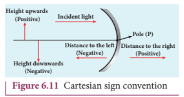

#### 6.2.5 Mirror equation

The mirror equation establishes a relation among object distance $u$, image distance $v$ and focal length $f$ for a spherical mirror.

An object $AB$ is considered on the principal axis of a concave mirror beyond the centre of curvature $C$. Let us consider three paraxial rays from point $B$ on the object. The first paraxial ray $BD$ travels parallel to the principal axis. It is incident on the concave mirror at $D$, close to the pole $P$. It is reflected back through the focus $F$. The second paraxial ray $BP$ is incident at the pole $P$. It is reflected along $PB'$. The third paraxial ray $BC$ passing through centre of curvature $C$, falls normally on the mirror at $E$. It is reflected back along the same path. The three reflected rays intersect at the point $B'$. A perpendicular drawn as $A'B'$ to the principal axis gives the real, inverted image.

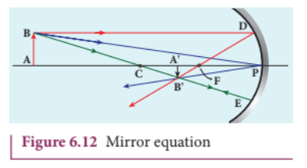

As per law of reflection, the angle of incidence $\angle BPA$ is equal to the angle of reflection $\angle B'PA'$.

The triangles $\Delta BPA$ and $\Delta B'PA'$ are similar. Thus, from the rule of similar triangles,

$$ \frac{A'B'}{AB} = \frac{PA'}{PA} \tag{6.5} $$

The other set of similar triangles are $\Delta DPF$ and $\Delta B'A'F$. ($PD$ is almost a straight vertical line)

\[
\frac{A'B'}{PD} = \frac{A'F}{PF}
\]

As, \( PD = AB \) the above equation becomes,

\[
\frac{A'B'}{AB} = \frac{A'F}{PF} \tag{6.6}
\]

From equations (6.5) and (6.6) we can write,

\[
\frac{PA'}{PA} = \frac{A'F}{PF}
\]

As, \( A'F = PA' - PF \), the above equation becomes,

\[
\frac{PA'}{PA} = \frac{PA' - PF}{PF} \tag{6.7}
\]

\( PA \), \( PA' \) and \( PF \) are mere distances; here we use sign conventions so that the expression that is derived will be a general one. The general expression thus obtained will be valid for the situations other than the one shown in figure.

∴ substituting \( PA = -u \), \( PA' = -v \) and \( PF = -f \) in equation (6.7),

\[
PA = -u, \quad PA' = -v, \quad PF = -f
\]

All the three distances are negative as per sign convention, because they are measured to the left of the pole. Now, the equation (6.7) becomes,

\[
\frac{-v}{-u} = \frac{-v - (-f)}{-f}
\]

On further simplification,

\[
\frac{v}{u} = \frac{v - f}{f}; \quad \frac{v}{u} = \frac{v}{f} - 1
\]

Dividing both sides with \( v \),

\[
\frac{1}{u} = \frac{1}{f} - \frac{1}{v}
\]

After rearranging,

\[
\frac{1}{v} + \frac{1}{u} = \frac{1}{f} \tag{6.8}
\] 

The equation (6.8) is called mirror equation. Although this equation is derived for a special situation shown in Figure (6.12), it is also valid for all other situations with any spherical mirror. This is because proper sign convention is followed for \( u, v \) and \( f \) in equation (6.7).

### 6.2.6 Lateral magnification in spherical mirrors

**The *lateral* (or) *transverse* magnification \( m \) is defined as the ratio of the height of the image to the height of the object.** The height of the object and image are measured perpendicular to the principal axis.

\[
\text{magnification } (m) = \frac{\text{height of the image } (h')}{\text{height of the object } (h)}
\]

\[
m = \frac{h'}{h} \tag{6.9}
\]

Applying proper sign conventions for equation (6.5),

\[
\frac{A'B'}{AB} = \frac{PA'}{PA}
\]

\[
A'B' = -h', \quad AB = h, \quad PA' = -v, \quad PA = -u
\]

\[
\frac{-h'}{h} = \frac{-v}{-u}
\]

On simplifying we get,

\[
m = \frac{h'}{h} = -\frac{v}{u} \tag{6.10}
\]

Using mirror equation, we can further write the magnification as,

\[
m = \frac{h'}{h} = \frac{f - v}{f} = \frac{f}{f - u} \tag{6.11}
\] 

#### EXAMPLE 6.3

An object is placed at a distance of $20.0 \, \text{cm}$ from a concave mirror of focal length $15.0 \, \text{cm}$.

(a) What distance from the mirror a screen should be placed to get a sharp image?  
(b) What is the nature of the image?

**Solution**

Given, $f = -15 \, \text{cm}$, $u = -20 \, \text{cm}$

(a) Mirror equation, $\frac{1}{v} + \frac{1}{u} = \frac{1}{f}$

Rewriting to find $v$:

$$ \frac{1}{v} = \frac{1}{f} - \frac{1}{u} $$

Substituting for $f$ and $u$:

$$ \frac{1}{v} = \frac{1}{-15} - \frac{1}{-20} $$

$$ \frac{1}{v} = \frac{-20 - (-15)}{300} = \frac{-5}{300} = \frac{-1}{60} $$

$$ v = -60 \, \text{cm} $$

The screen is to be placed at distance $60.0 \, \text{cm}$ to the left of the concave mirror.

(b) Magnification,

$$ m = \frac{h'}{h} = -\frac{v}{u} $$

$$ m = -\frac{(-60)}{(-20)} = -3 $$

As the sign of magnification is negative, the image is inverted. As the magnitude of magnification is 3, the image is enlarged three times. As the image is formed to the left of the concave mirror, the image is real.

#### EXAMPLE 6.4

A thin rod of length $f/3$ is placed along the optical axis of a concave mirror of focal length $f$ such that one end of image which is real and elongated just touches the respective end of the rod. Calculate the longitudinal magnification.

**Solution**

Longitudinal magnification $m_l = \frac{\text{length of image } (l')}{\text{length of object } (l)}$

Given: length of object, $l = \frac{f}{3}$

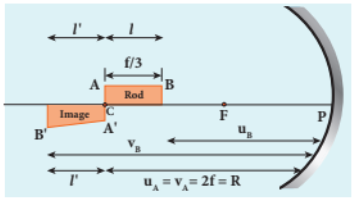

Let $l'$ be the length of the image, then

$$ m_l = \frac{l'}{l} = \frac{l'}{f/3} \quad \text{or} \quad l' = \frac{m_l f}{3} $$

Image of one end coincides with the respective end of object. Thus, the coinciding end must be at centre of curvature.

$$ u_B = u_A - \frac{f}{3} = 2f - \frac{f}{3} = \frac{5f}{3} $$

$$ v_B = u_B + l + l' = \frac{5f}{3} + \frac{f}{3} + \frac{m_l f}{3} = \frac{f(6 + m_l)}{3} $$

Mirror equation: $\frac{1}{v} + \frac{1}{u} = \frac{1}{f}$

$$ \frac{3}{f(6 + m_l)} + \frac{3}{5f} = \frac{1}{f} $$

After simplifying,

$$ \frac{3}{(6 + m_l)} = \frac{2}{5} $$

$$ 6 + m_l = \frac{15}{2} $$

$$ m_l = \frac{15}{2} - 6 = \frac{3}{2} = 1.5 $$

### 6.3 SPEED OF LIGHT

Light travels with the highest speed in vacuum. The speed of light in vacuum is denoted as $c$ and its value is $c = 3 \times 10^8 \, \text{m s}^{-1}$. The earliest attempt to determine the speed of light was made by a French scientist Hippolyte Fizeau (1819-1896). That paved way for the other scientists too to determine the speed of light.

#### 6.3.1 Fizeau's method to determine speed of light

**Apparatus:** The light from the source $S$ was first allowed to fall on a partially silvered glass plate $G$ kept at an angle of $45^\circ$ to the incident light. The light then was allowed to pass through a rotating toothed-wheel with $N$ teeth and $N$ cuts of equal widths whose speed of rotation could be varied through an external mechanism. The light passing through one cut in the wheel will get reflected by a mirror $M$ kept at a long distance $d$, about $8 \, \text{km}$ from the toothed-wheel. If the toothed-wheel was not rotating, the light reflected back from the mirror would again pass through the same cut and reach the eyes of the observer who looks through the partially silvered glass plate.

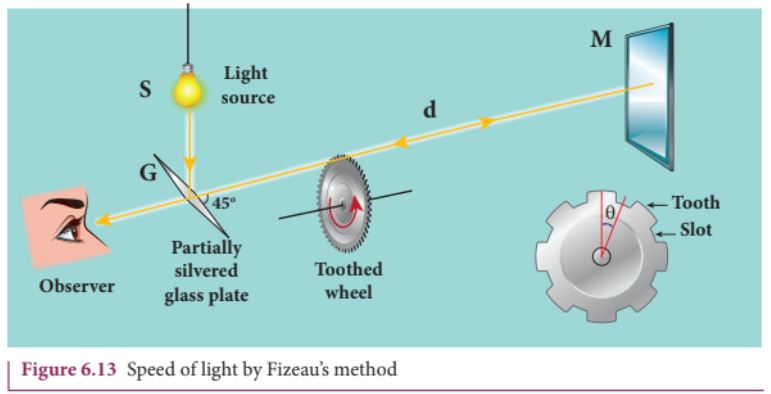

**Working:** The angular speed of rotation of the toothed-wheel was increased from zero to a value $\omega$ until the light passing through one cut would completely be blocked by the adjacent tooth. This is ensured by the disappearance of the light while looking through the partially silvered glass plate.

**Expression for speed of light:** The speed $v$ of light in air is equal to the ratio of the distance $2d$ (the distance light travelled from the toothed-wheel to the mirror and back), to the time taken $t$.

$$ v = \frac{2d}{t} \tag{6.12} $$

The distance $d$ is a known value from the arrangement. The time $t$ taken for the light to travel the distance $2d$ is calculated from the angular speed $\omega$ of the toothed-wheel.

The angular speed $\omega$ (with unit $\text{rad s}^{-1}$) of the toothed-wheel when the light disappeared for the first time is,

$$ \omega = \frac{\theta}{t} \tag{6.13} $$

Here, $\theta$ is the angle between one tooth and the next slot which is turned within that time $t$.

$$ \theta = \frac{\text{total angle of the circle in radian}}{\text{number of teeth + number of cuts}} = \frac{2\pi}{2N} = \frac{\pi}{N} $$

Substituting $\theta$ in equation (6.13):

$$ \omega = \frac{\pi/N}{t} = \frac{\pi}{Nt} $$

Rewriting the above equation for $t$:

$$ t = \frac{\pi}{N\omega} \tag{6.14} $$

Substituting this in equation (6.12):

$$ v = \frac{2d}{\pi/(N\omega)} $$

After rearranging:

$$ v = \frac{2d N \omega}{\pi} \tag{6.15} $$

Fizeau had some difficulty to visually estimate the minimum intensity of the light when it is blocked by the adjacent tooth. The value of speed of light determined by him was very close to the actual value. Later on, with the same idea of Fizeau and with much sophisticated instruments, the speed of light in air was determined as $v = 2.99792 \times 10^8 \, \text{m s}^{-1}$.

#### 6.3.2 Speed of light through vacuum and different media

Scientists like Foucault (1819-1868) and Michelson (1852-1931) introduced different transparent media like glass, water etc., in the path of light to find the speed of light in different media. Even evacuated glass tubes were also introduced in the path of light to find the speed of light in vacuum. It was found that light travels with lesser speed in any medium than its speed in vacuum. The speed of light in vacuum was determined as $c = 3 \times 10^8 \, \text{m s}^{-1}$. We could notice that the speed of light in vacuum and speed of light in air are almost same.

#### 6.3.3 Refractive index

Refractive index of a transparent medium is defined as the ratio of speed of light in vacuum $c$ to the speed of light in that medium $v$.

$$ \text{refractive index } n \text{ of a medium} = \frac{\text{speed of light in vacuum } (c)}{\text{speed of light in medium } (v)} \tag{6.16} $$

Refractive index of a transparent medium gives an idea about the speed of light in that medium.

#### EXAMPLE 6.5

Pure water has refractive index 1.33. What is the speed of light through it?

**Solution**

$$ n = \frac{c}{v} \quad \Rightarrow \quad v = \frac{c}{n} $$

$$ v = \frac{3 \times 10^8}{1.33} = 2.26 \times 10^8 \, \text{m s}^{-1} $$

Light travels with a speed of $2.26 \times 10^8 \, \text{m s}^{-1}$ through pure water.

Refractive index does not have a unit. The smallest value of refractive index is for vacuum, which is 1. For any other medium refractive index is greater than 1. Refractive index is also called as optical density of the medium. Higher the refractive index of a medium, lesser is the speed of light through it and vice-versa. (Note: optical density should not be confused with mass density of the material of the medium. They two are different entities).The Table 6.2 shows the refractive indices of different transparent media.

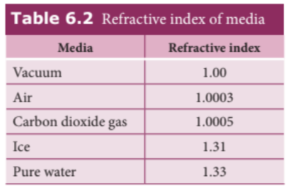
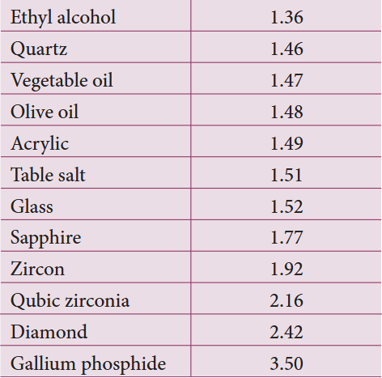

#### 6.3.4 Optical path

Optical path of a medium is defined as the distance $d'$ light travels in vacuum in the same time it travels a distance $d$ in the medium.

Let us consider a medium of refractive index $n$ and thickness $d$. Light travels with a speed $v$ through the medium in a time $t$. The speed of light through the medium is written as,

$$ v = \frac{d}{t} \quad \Rightarrow \quad t = \frac{d}{v} $$

In the same time $t$ light can cover a longer distance $d'$ in vacuum as it travels with greater speed $c$ in vacuum.

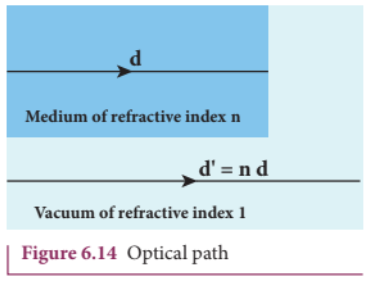

$$ c = \frac{d'}{t} \quad \Rightarrow \quad t = \frac{d'}{c} $$

As the time taken in both the cases is the same, we can equate the time $t$:

$$ \frac{d'}{c} = \frac{d}{v} $$

Rewritten for the optical path $d'$ as:

$$ d' = \frac{c}{v} d $$

As $\frac{c}{v} = n$, the optical path $d'$ is:

$$ d' = nd \tag{6.17} $$

The value of $n$ is always greater than 1 for a medium. Thus, the optical path $d'$ of a medium is always greater than $d$.

#### EXAMPLE 6.6

Light travels from air into a glass slab of thickness $50 \, \text{cm}$ and refractive index 1.5.

(a) What is the speed of light in the glass slab?  
(b) What is the time taken by the light to travel through the glass slab?  
(c) What is the optical path of the glass slab?

**Solution**

Given, thickness of glass slab $d = 50 \, \text{cm} = 0.5 \, \text{m}$, refractive index $n = 1.5$

(a) Speed of light in the glass slab is:

$$ v = \frac{c}{n} = \frac{3 \times 10^8}{1.5} = 2 \times 10^8 \, \text{m s}^{-1} $$

(b) Time taken by light to travel through the glass slab is:

$$ t = \frac{d}{v} = \frac{0.5}{2 \times 10^8} = 2.5 \times 10^{-9} \, \text{s} $$

(c) Optical path:

$$ d' = nd = 1.5 \times 0.5 = 0.75 \, \text{m} = 75 \, \text{cm} $$

Light would have travelled an additional $25 \, \text{cm}$ ($75 \, \text{cm} - 50 \, \text{cm}$) in vacuum at the same time had there been no glass slab in its path.

### 6.4 REFRACTION

Refraction is passing of light from one optical medium to another optical medium through a boundary. In refraction, the angle of incidence $i$ in one medium and the angle of refraction $r$ in the other medium are measured with respect to the normal drawn to the surface at the point of incidence of light. According to laws of refraction:

(i) The incident ray, refracted ray and normal to the refracting surface are all coplanar (i.e., lie in the same plane).  
(ii) The ratio of sine of angle of incident $i$ in the first medium to the sine of angle of refraction $r$ in the second medium is equal to the ratio of refractive index $n_2$ of the second medium to the refractive index $n_1$ of the first medium.

$$ \frac{\sin i}{\sin r} = \frac{n_2}{n_1} \tag{6.18} $$

The above equation is in the ratio form. It can also be written in a product form as:

$$ n_1 \sin i = n_2 \sin r \tag{6.19} $$

The law of refraction is also known as **Snell's law**.

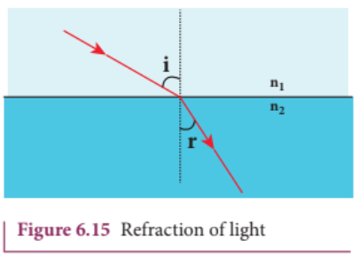

#### 6.4.1 Angle of deviation due to refraction

The angle between the direction of incident ray and the refracted ray is called angle of deviation due to refraction. When light travels from rarer to denser medium, it deviates towards normal. The angle of deviation in this case is:

$$ d = i - r \tag{6.20} $$

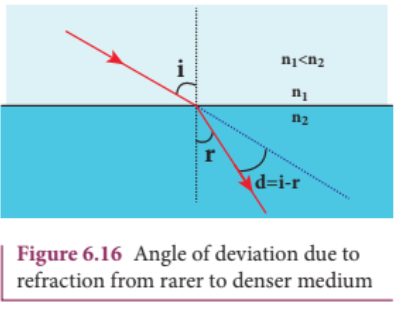

On the other hand, if light travels from denser to rarer medium, it deviates away from normal. The angle of deviation in this case is:

$$ d = r - i \tag{6.21} $$

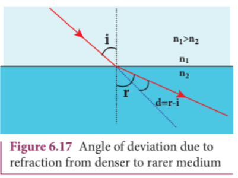

#### 6.4.2 Simultaneous reflection (or) refraction

In any refracting surface there will also be some reflection taking place. Thus, the intensity of refracted light will be lesser than the incident light. The phenomenon in which a part of light from a source undergoing reflection and the other part of light from the same source undergoing refraction at the same surface is called simultaneous reflection (or) simultaneous refraction. Such surfaces are available as partially silvered glasses.

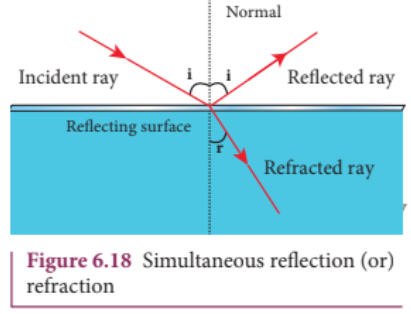

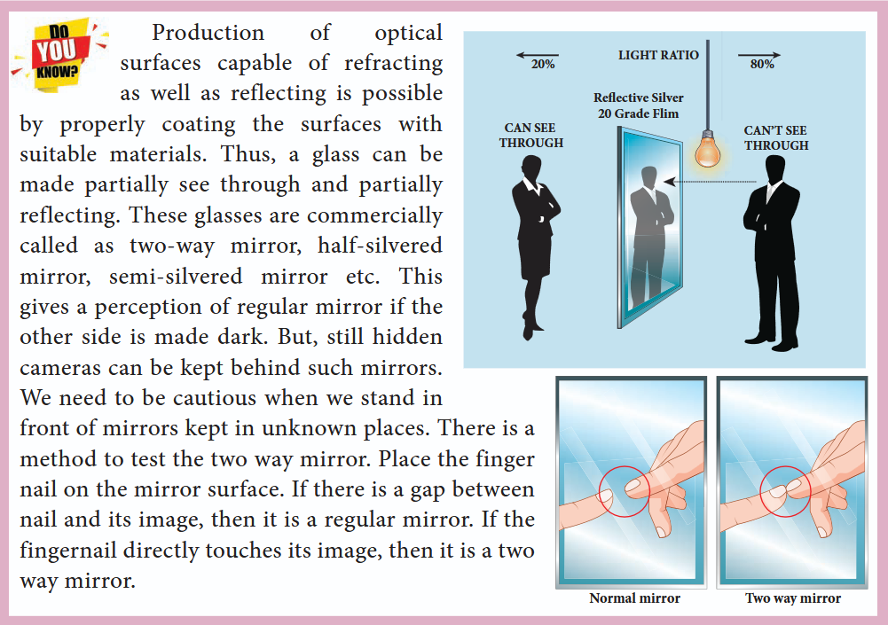

#### 6.4.3 Principle of reversibility

The principle of reversibility states that light will follow exactly the same path if its direction of travel is reversed. This is true for both reflection and refraction.

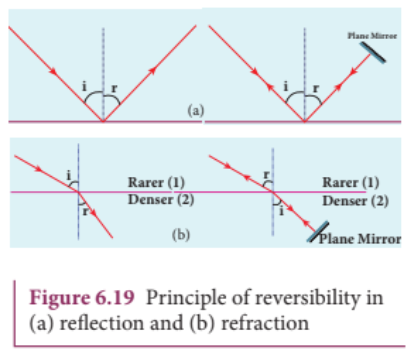

#### 6.4.4 Relative refractive index

In equation (6.18), the term $\left(\frac{n_2}{n_1}\right)$ is called relative refractive index of second medium with respect to the first medium which is denoted as $n_{21}$.

$$ n_{21} = \frac{n_2}{n_1} \tag{6.22} $$

The concept of relative refractive index gives rise to other useful relations such as:

(i) Inverse rule:

$$ n_{12} = \frac{1}{n_{21}} \quad \text{or} \quad \frac{n_1}{n_2} = \frac{1}{n_2/n_1} \tag{6.23} $$

(ii) Chain rule:

$$ n_{32} = n_{31} \times n_{12} \quad \text{or} \quad \frac{n_3}{n_2} = \frac{n_3}{n_1} \times \frac{n_1}{n_2} \tag{6.24} $$

#### EXAMPLE 6.7

Light travelling through transparent oil enters into glass of refractive index 1.5. If the refractive index of glass with respect to the oil is 1.25, what is the refractive index of the oil?

**Solution**

Given, $n_{go} = 1.25$ and $n_g = 1.5$

Refractive index of glass with respect to oil: $n_{go} = \frac{n_g}{n_o}$

Rewriting for refractive index of oil:

$$ n_o = \frac{n_g}{n_{go}} = \frac{1.5}{1.25} = 1.2 $$

The refractive index of oil is $n_o = 1.2$.

#### 6.4.5 Apparent depth

It is a common observation that the bottom of a tank filled with water appears to be raised when seen from air medium above. An equation could be derived for the apparent depth when viewed in the near normal direction.

Light from the object $O$ at the bottom of the tank passes from denser medium (water) to rarer medium (air) to reach our eyes for viewing the object. It deviates away from the normal in the rarer medium at the point of incidence $B$. The refractive index of the denser medium is $n_1$ and that of rarer medium is $n_2$. Here, $n_1 > n_2$. The angle of incidence in the denser medium is $i$ and the angle of refraction in the rarer medium is $r$. The lines $NN'$ and $OD$ are parallel. Thus, the angle $\angle DIB$ is also $r$. The angles $i$ and $r$ are very small as the diverging light from $O$ entering the eye is very narrow. Snell's law in product form for this refraction from equation (6.19) is:

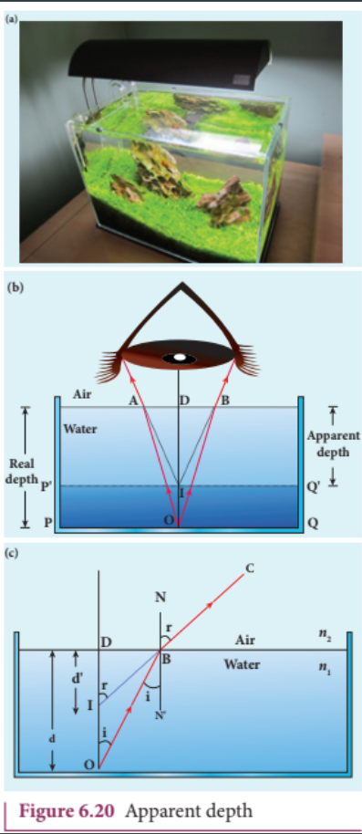

$$ n_1 \sin i = n_2 \sin r $$

As the angles $i$ and $r$ are small, we can approximate $\sin i \approx \tan i$ and $\sin r \approx \tan r$.

$$ n_1 \tan i = n_2 \tan r $$

In triangles $\Delta DOB$ and $\Delta DIB$:

$$ \tan i = \frac{DB}{DO} \quad \text{and} \quad \tan r = \frac{DB}{DI} $$

Substituting:

$$ n_1 \frac{DB}{DO} = n_2 \frac{DB}{DI} $$

$$ \frac{n_1}{DO} = \frac{n_2}{DI} $$

$$ DI = \frac{n_2}{n_1} \times DO $$

Here, $DO$ is the real depth and $DI$ is the apparent depth. Therefore:

$$ \text{Apparent depth} = \frac{n_2}{n_1} \times \text{Real depth} \tag{6.25} $$

For viewing from air ($n_2 = 1$) into water ($n_1 = n$):

$$ \text{Apparent depth} = \frac{\text{Real depth}}{n} \tag{6.26} $$

$$ n_1 \frac{DB}{DO} = n_2 \frac{DB}{DI} $$

$DB$ is cancelled both sides. Now, $DO$ is the actual depth $d$ and $DI$ is the apparent depth $d'$.

$$ n_1 \frac{1}{d} = n_2 \frac{1}{d'} \quad \text{After rearranging,} $$

$$ \frac{d'}{d} = \frac{n_2}{n_1} \tag{6.25} $$

Rewriting the above equation for the apparent depth $d'$:

$$ d' = \frac{n_2}{n_1} d \tag{6.26} $$

As the rarer medium is air, its refractive index $n_2$ can be taken as $1$ ($n_2 = 1$). And the refractive index $n_1$ of denser medium could then be taken as $n$ itself ($n_1 = n$). Now, the equation for apparent depth becomes:

$$ d' = \frac{d}{n} \tag{6.27} $$

The bottom appears to be elevated by $d - d'$:

$$ d - d' = d - \frac{d}{n} \quad \text{or} $$

$$ d - d' = d \left(1 - \frac{1}{n}\right) \tag{6.28} $$

**Atmospheric refraction:** Due to refraction of light through different layers of atmosphere which vary in refractive index, the path of light deviates continuously when it passes through the atmosphere. For example, the Sun is visible a little before the actual sunrise and also until a little after the actual sunset due to refraction of light through the atmosphere. What we mean by actual sunrise is the actual crossing of the sun at the horizon. The apparent shift in the direction of the sun is around half a degree and the corresponding time difference between the actual and apparent positions is about 2 minutes. Sun appears flattened (oval shaped) during sunrise and sunset due to the same phenomenon.

The same is also applicable for the positions of stars. Actually, the stars do not twinkle. They appear twinkling because of the movement of the atmospheric layers with varying refractive indices which is clearly seen in the night sky.

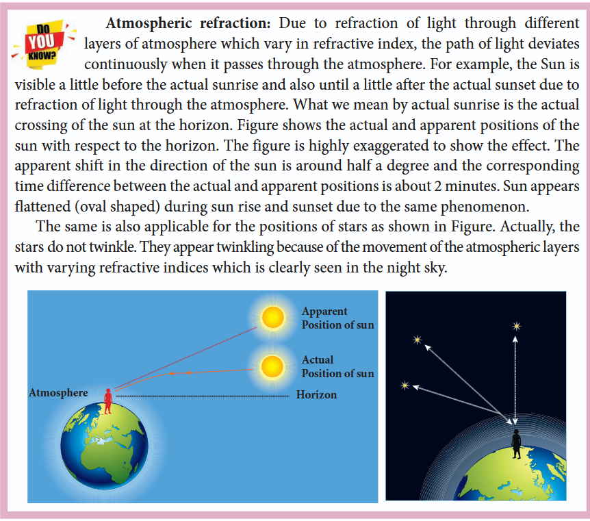

#### EXAMPLE 6.8

A coin is at the bottom of a trough containing three immiscible liquids of refractive indices 1.3, 1.4 and 1.5 poured one above the other of heights $30~\text{cm}$, $16~\text{cm}$, and $20~\text{cm}$ respectively. What is the apparent depth at which the coin appears to be when seen from air medium outside? In which medium the coin will appear?

**Solution**

When seen from (air medium) on top, the coin will still appear to be at the bottom with each medium appearing to have shrunk with respect to the air medium outside.

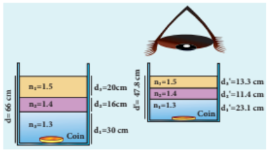

The equations for apparent depth for each medium are:

$$ d_1' = \frac{d_1}{n_1}, \quad d_2' = \frac{d_2}{n_2}, \quad d_3' = \frac{d_3}{n_3} $$

$$ d' = d_1' + d_2' + d_3' = \frac{d_1}{n_1} + \frac{d_2}{n_2} + \frac{d_3}{n_3} $$

$$ d' = \frac{30}{1.3} + \frac{16}{1.4} + \frac{20}{1.5} = 23.1 + 11.4 + 13.3 $$

$$ d' = 47.8~\text{cm} $$

### 6.4.6 Critical angle and total internal reflection

When a ray passes from an optically denser medium to an optically rarer medium, it bends away from the normal. Because of this, the angle of refraction $r$ in the rarer medium is greater than the corresponding angle of incidence $i$ in the denser medium. As angle of incidence $i$ is gradually increased, $r$ rapidly increases and at a certain stage $r$ becomes $90^\circ$ and the refracted ray will be grazing the boundary. The angle of incidence in the denser medium for which the angle of refraction is $90^\circ$ (or the refracted ray grazes the boundary between the two media) is called **critical angle** $i_c$.

If the angle of incidence in the denser medium is increased beyond the critical angle, there is no refraction possible into the rarer medium. For any angle of incidence greater than the critical angle, the entire light is reflected back into the denser medium itself. This phenomenon is called **total internal reflection**.

The two conditions for total internal reflection to take place are:

(i) light must travel from denser to rarer medium,
(ii) angle of incidence in the denser medium must be greater than critical angle ($i > i_c$).

For critical angle of incidence, Snell's law in the product form, equation (6.19), becomes:

$$ n_1 \sin i_c = n_2 \sin 90^\circ \tag{6.29} $$

$$ n_1 \sin i_c = n_2 \qquad (\because \sin 90^\circ = 1) $$

$$ \sin i_c = \frac{n_2}{n_1} \tag{6.30} $$

Here, $n_1 > n_2$.

If the rarer medium is air, then its refractive index $n_2$ is $1$ ($n_2 = 1$) and the refractive index of the denser medium $n_1$ is taken as $n$ itself ($n_1 = n$). Then:

$$ \sin i_c = \frac{1}{n} \quad \text{or} \quad i_c = \sin^{-1}\left(\frac{1}{n}\right) \tag{6.31} $$

The critical angle $i_c$ depends on the refractive index $n$ of the medium.

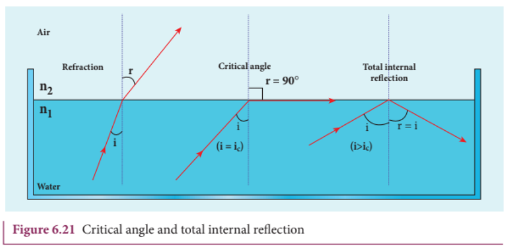

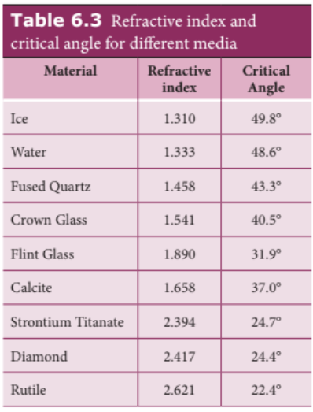

For example, the refractive index of glass is about $1.5$. The critical angle for glass-air interface is $i_c = \sin^{-1}\left(\frac{1}{1.5}\right) = 41.8^\circ$. The refractive index of water is $1.33$. The critical angle for water-air interface is $i_c = \sin^{-1}\left(\frac{1}{1.33}\right) = 48.6^\circ$.

#### 6.4.7 Effects due to total internal reflection

##### 6.4.7.1 Glittering of diamond

Diamond appears dazzling because of the total internal reflection of light that happens inside the diamond. The refractive index of diamond is about $2.417$. It is much greater than the refractive index of ordinary glass which is about only $1.5$. The critical angle of diamond is about $24.4^\circ$. It is much less than that of ordinary glass. A skilled diamond cutter makes use of this larger range of angle of incidence ($24.4^\circ$ to $90^\circ$ inside the diamond), to ensure that light entering the diamond is totally internally reflected from the many cut faces before getting out. This gives a sparkling effect for diamond.

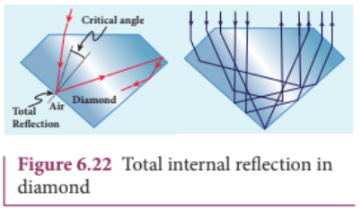

##### 6.4.7.2 Mirage and looming

The refractive index of air increases with its density. In hot places, air near the ground is hotter than air at a height. Hot air is less dense. Hence, in still air the refractive index of air increases with height. Because of this, the light from tall objects like a tree tries to pass through a medium whose refractive index decreases towards the ground. Hence, the ray of light successively deviates away from the normal at different layers of air and undergoes total internal reflection when the angle of incidence near the ground exceeds the critical angle. This gives an illusion as if the light comes from somewhere below the ground. Because of the shaky nature of the layers of air, the observer feels as if the object is getting reflected by a pool of water (or) wet surface beneath the object. This phenomenon is called **mirage**.

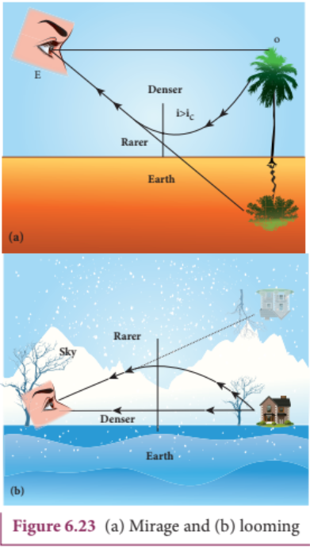

In cold places, the refractive index increases towards the ground because the temperature of air close to the ground is lesser than the temperature at a height above the surface of earth. Thus, the density and refractive index of air close to the ground is greater than for air at a height. In cold regions like glaciers and frozen lakes, the reverse effect of mirage will happen. Hence, an inverted image is formed a little above the surface. This phenomenon is called **looming**. It is also called superior mirage, towering and stooping.

##### 6.4.7.3 Prisms making use of total internal reflection

Prisms can be designed to reflect light by $90^\circ$ or by $180^\circ$ by making use of total internal reflection. In the first two cases, the critical angle $i_c$ for the material of the prism must be less than $45^\circ$. Prism that inverts the object on the same side. Prism that inverts the object on the other side.

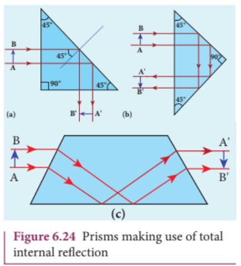

##### 6.4.7.4 Radius of illumination (Snell's window)

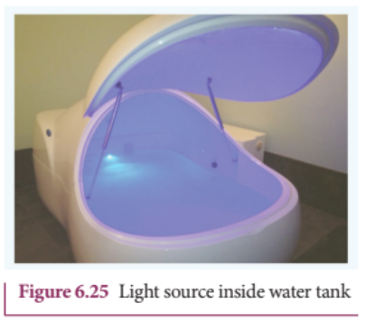

When a source of light like an electric bulb is kept inside a water tank, the light from the source travels in all directions inside the water. The light that is incident on the water surface at an angle less than the critical angle will undergo refraction and emerge out from the water. The light incident at an angle greater than critical angle will undergo total internal reflection. The light falling particularly at critical angle grazes the surface. Thus, the entire surface of water appears illuminated when seen from outside.

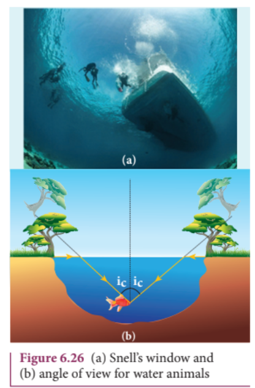

On the other hand, when the light entering the water from outside is seen from inside the water, the view is restricted to a particular angle equal to the critical angle $i_c$. The restricted illuminated circular area is called **Snell's window**.

The angle of view for water animals is restricted to twice the critical angle $2i_c$. The critical angle for water is $48.6^\circ$. Thus the angle of view is $97.2^\circ$. The radius $R$ of the circular area depends on the depth $d$ from which it is seen and also the refractive index $n$ of the medium.

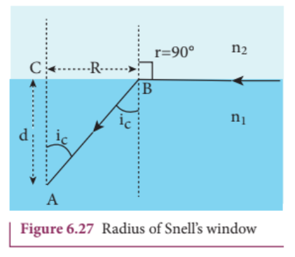

Light is seen from a point $A$ at a depth $d$. Snell's law in product form, equation (6.19), for the refraction happening at the point $B$ on the boundary between the two media is:

$$ n_1 \sin i_c = n_2 \sin 90^\circ \tag{6.32} $$

$$ n_1 \sin i_c = n_2 \qquad (\because \sin 90^\circ = 1) $$

$$ \sin i_c = \frac{n_2}{n_1} \tag{6.33} $$

From the right angle triangle $\Delta ABC$:

$$ \sin i_c = \frac{CB}{AB} = \frac{R}{\sqrt{d^2 + R^2}} \tag{6.34} $$

Equating the above two equations (6.33) and (6.34):

$$ \frac{R}{\sqrt{d^2 + R^2}} = \frac{n_2}{n_1} $$

Squaring on both sides:

$$ \frac{R^2}{R^2 + d^2} = \left(\frac{n_2}{n_1}\right)^2 $$

Taking reciprocal:

$$ \frac{R^2 + d^2}{R^2} = \left(\frac{n_1}{n_2}\right)^2 $$

Further simplifying:

$$ 1 + \frac{d^2}{R^2} = \left(\frac{n_1}{n_2}\right)^2 $$

$$ \frac{d^2}{R^2} = \left(\frac{n_1}{n_2}\right)^2 - 1 = \frac{n_1^2 - n_2^2}{n_2^2} $$

Again taking reciprocal and rearranging:

$$ \frac{R^2}{d^2} = \frac{n_2^2}{n_1^2 - n_2^2} $$

$$ R^2 = d^2 \left(\frac{n_2^2}{n_1^2 - n_2^2}\right) $$

After taking the square root, the radius of illumination is:

$$ R = d \sqrt{\frac{n_2^2}{(n_1^2 - n_2^2)}} \tag{6.35} $$

If the rarer medium outside is air, then $n_2 = 1$ and we can take $n_1 = n$:

$$ R = d \left(\frac{1}{\sqrt{n^2 - 1}}\right) \quad \text{or} \quad R = \frac{d}{\sqrt{n^2 - 1}} \tag{6.36} $$

#### EXAMPLE 6.9

What is the radius of the illumination when seen above from inside a swimming pool from a depth of $10~\text{m}$ on a sunny day? What is the total angle of view? [Given, refractive index of water is $4/3$]

**Solution**

Given, $n = \frac{4}{3}$, $d = 10~\text{m}$

Radius of illumination:

$$ R = \frac{d}{\sqrt{n^2 - 1}} $$

$$ R = \frac{10}{\sqrt{(4/3)^2 - 1}} = \frac{10 \times 3}{\sqrt{16 - 9}} $$

$$ R = \frac{30}{\sqrt{7}} = 11.32~\text{m} $$

To find the critical angle:

$$ i_c = \sin^{-1}\left(\frac{1}{n}\right) $$

$$ i_c = \sin^{-1}\left(\frac{1}{4/3}\right) = \sin^{-1}\left(\frac{3}{4}\right) = 48.6^\circ $$

The total angle of view of the cone is:

$$ 2i_c = 2 \times 48.6^\circ = 97.2^\circ $$

##### 6.4.7.5 Optical fibre

Transmitting signals through optical fibres is possible due to the phenomenon of total internal reflection. Optical fibres consist of an inner part called **core** and an outer part called **cladding** (or sleeving). The refractive index of the core must be higher than that of the cladding for total internal reflection to happen. Signal in the form of light is made to incident inside the core-cladding boundary at an angle greater than the critical angle. Hence, it advances with repeated total internal reflections inside the optical fibre without undergoing any refraction. The light travels inside the core with no appreciable loss in the intensity of the light. While bending the optical fibre, it is done in such a way that the condition for total internal reflection is ensured at every reflection inside the fibre.

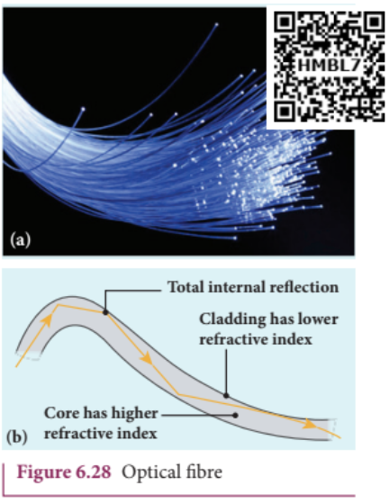

##### 6.4.7.6 Acceptance angle in optical fibre

To ensure the critical angle incidence at the core-cladding boundary inside the optical fibre, the light should be incident at a certain angle called **acceptance angle** at the end of the optical fibre while entering into it. It depends on the refractive indices of the core $n_1$, cladding $n_2$ and the outer medium $n_3$. Assume that the light is incident at an angle called acceptance angle $i_a$ at the outer medium-core boundary at $A$.

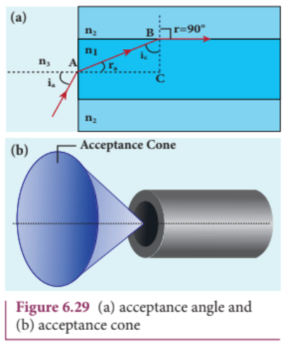

Snell's law in the product form, equation (6.19), for this refraction at the point $A$ is:

$$ n_3 \sin i_a = n_1 \sin r_a \tag{6.37} $$

To have total internal reflection inside the optical fibre, the angle of incidence at the core-cladding interface at $B$ should be at least the critical angle $i_c$. Snell's law in the product form, equation (6.19), for the refraction at point $B$ is:

$$ n_1 \sin i_c = n_2 \sin 90^\circ \tag{6.38} $$

$$ n_1 \sin i_c = n_2 \qquad (\because \sin 90^\circ = 1) $$

$$ \therefore \sin i_c = \frac{n_2}{n_1} \tag{6.39} $$

From the right angle triangle $\Delta ABC$:

$$ i_c = 90^\circ - r_a $$

Now, equation (6.39) becomes:

$$ \sin(90^\circ - r_a) = \frac{n_2}{n_1} \quad \text{or} \quad \cos r_a = \frac{n_2}{n_1} \tag{6.40} $$

$$ \sin r_a = \sqrt{1 - \cos^2 r_a} $$

Substituting for $\cos r_a$:

$$ \sin r_a = \sqrt{1 - \left(\frac{n_2}{n_1}\right)^2} = \sqrt{\frac{n_1^2 - n_2^2}{n_1^2}} \tag{6.41} $$

Substituting this in equation (6.37):

$$ n_3 \sin i_a = n_1 \sqrt{\frac{n_1^2 - n_2^2}{n_1^2}} = \sqrt{n_1^2 - n_2^2} \tag{6.42} $$

On further simplification:

$$ \sin i_a = \frac{\sqrt{n_1^2 - n_2^2}}{n_3} \tag{6.43} $$

$$ i_a = \sin^{-1}\left(\frac{\sqrt{n_1^2 - n_2^2}}{n_3}\right) \tag{6.44} $$

If the outer medium is air, then $n_3 = 1$. The acceptance angle $i_a$ becomes:

$$ i_a = \sin^{-1}\left(\sqrt{n_1^2 - n_2^2}\right) \tag{6.45} $$

Light can have any angle of incidence from $0$ to $i_a$ with the normal at the end of the optical fibre forming a conical shape called **acceptance cone**. In equation (6.42), the term $(n_3 \sin i_a)$ is called **numerical aperture** $NA$ of the optical fibre.

$$ NA = n_3 \sin i_a = \sqrt{n_1^2 - n_2^2} \tag{6.46} $$

If the outer medium is air, then $n_3 = 1$:

$$ NA = \sin i_a = \sqrt{n_1^2 - n_2^2} \tag{6.47} $$

#### EXAMPLE 6.10

An optical fibre is made up of a core material with refractive index $1.68$ and a cladding material of refractive index $1.44$. What is the acceptance angle of the fibre if it is kept in air medium without any cladding?

**Solution**

Given, $n_1 = 1.68$, $n_2 = 1.44$, $n_3 = 1$

Acceptance angle:

$$ i_a = \sin^{-1}\left(\sqrt{n_1^2 - n_2^2}\right) $$

$$ i_a = \sin^{-1}\left(\sqrt{(1.68)^2 - (1.44)^2}\right) = \sin^{-1}(0.865) $$

$$ i_a = 60^\circ $$

If there is no cladding then $n_2 = 1$:

$$ i_a = \sin^{-1}\left(\sqrt{n_1^2 - 1}\right) $$

$$ i_a = \sin^{-1}\left(\sqrt{(1.68)^2 - 1}\right) = \sin^{-1}(1.35) $$

$\sin^{-1}$ (more than $1$) is not possible. But this includes the range $0^\circ$ to $90^\circ$. Hence, all the rays entering the core from the flat surface will undergo total internal reflection.

**Note:** If there is no cladding then there is a condition on the refractive index $n_1$ of the core:

$$ i_a = \sin^{-1}\left(\sqrt{n_1^2 - 1}\right) $$

Here, as per mathematical rule, $(n_1^2 - 1) \leq 1$ or $n_1^2 \leq 2$

$$ \text{or} \qquad n_1 \leq \sqrt{2} $$

Hence, in air (no cladding) the refractive index $n_1$ of the core should be $n_1 \leq 1.414$.

#### 6.4.8 Refraction in glass slab

When a ray of light enters a slab it travels from rarer medium (air) to denser medium (glass). This results in deviation of the ray towards the normal. When the light ray leaves the slab it travels from denser medium (glass) to rarer medium (air) resulting in deviation of the ray away from the normal. After the two refractions, the light ray emerges in the same direction as that of the incident ray on the glass slab with a **lateral displacement** (or shift) $L$, i.e., there is no change in the direction of the ray but the path of the incident ray and refracted ray are parallel to each other with a shift $L$.

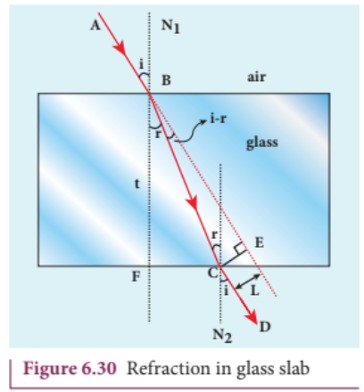

Consider a glass slab of thickness $t$ and refractive index $n$ kept in air medium. If the path of the light is $ABCD$, the refractions occur at two points $B$ and $C$ in the glass slab. The angles of incidence $i$ and refraction $r$ are measured with respect to the normal $N_1$ and $N_2$ at the two points $B$ and $C$ respectively. The lateral displacement $L$ is the perpendicular distance $CE$ drawn between the paths of the deviated light and the undeviated light at point $C$.

In the right angle triangle $\Delta BCE$:

$$ \sin(i - r) = \frac{L}{BC} \quad \Rightarrow \quad BC = \frac{L}{\sin(i - r)} \tag{6.48} $$

In the right angle triangle $\Delta BCF$:

$$ \cos r = \frac{t}{BC} \quad \Rightarrow \quad BC = \frac{t}{\cos r} \tag{6.49} $$

Equating equations (6.48) and (6.49):

$$ \frac{L}{\sin(i - r)} = \frac{t}{\cos r} $$

After rearranging:

$$ L = t \left[ \frac{\sin(i - r)}{\cos r} \right] \tag{6.50} $$

The lateral displacement depends upon (i) the thickness of the slab, (ii) the angle of incidence, and (iii) the refractive index of the slab which decides the angle of refraction. Thicker the slab, larger will be the lateral displacement. Greater the angle of incidence, larger will be the lateral displacement. Higher the refractive index, larger will be the lateral displacement.

#### EXAMPLE 6.11

The thickness of a glass slab is $0.25~\text{m}$. It has a refractive index of $1.5$. A ray of light is incident on the surface of the slab at an angle of $60^\circ$. Find the lateral displacement of the light when it emerges from the other side of the glass slab.

**Solution**

Given, thickness of the slab $t = 0.25~\text{m}$, refractive index $n = 1.5$, angle of incidence $i = 60^\circ$

Using Snell's law: $1 \cdot \sin i = n \sin r$

$$ \sin r = \frac{\sin i}{n} = \frac{\sin 60^\circ}{1.5} = 0.58 $$

$$ r = \sin^{-1}(0.58) = 35.25^\circ = 35^\circ 15' 0'' $$

Lateral displacement is:

$$ L = t \left[ \frac{\sin(i - r)}{\cos r} \right] $$

$$ L = (0.25) \times \left[ \frac{\sin(60 - 35.25)}{\cos(35.25)} \right] = 0.1281~\text{m} $$

The lateral displacement is $L = 12.81~\text{cm}$.

### 6.5 REFRACTION AT SINGLE SPHERICAL SURFACE

We have so far studied only refraction at plane surface. Refraction can also take place at a spherical surface between two transparent media. The laws of refraction hold good at every point on the spherical surface. The normal at the point of incidence is perpendicular drawn to the tangent plane of the spherical surface at that point. Therefore, the normal always passes through its centre of curvature. The study of refraction at a single spherical surface paves the way to the understanding of thin lenses which consist of two refracting surfaces.

The following assumptions are made while considering refraction at spherical surfaces:

(i) The incident light is assumed to be monochromatic (single colour)
(ii) The incident light is very close to the principal axis (paraxial rays).

The sign conventions are similar to those of spherical mirrors.

#### 6.5.1 Equation for refraction at single spherical surface

Let us consider two transparent media with refractive indices $n_1$ and $n_2$ which are separated by a spherical surface. Let $C$ be the centre of curvature of the spherical surface. Let a point object $O$ be in the medium $n_1$. The line $OC$ is the principal axis that cuts the spherical surface at the pole $P$. As the rays considered are paraxial rays, the perpendicular dropped from the point of incidence to the principal axis is very close to the pole (or passes through the pole itself).

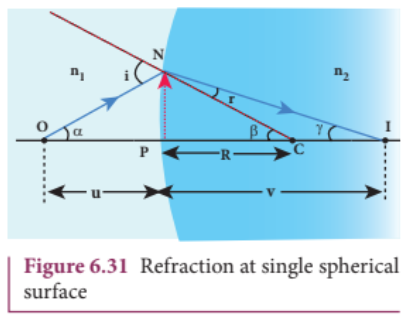

Light from $O$ falls on the refracting surface at $N$. The normal drawn to the refracting surface at the point of incidence passes through the centre of curvature $C$. As $n_2 > n_1$, light in the denser medium deviates towards the normal and meets the principal axis at $I$ where the image is formed.

Snell's law in product form for the refraction at the point $N$ can be written from equation (6.19):

$$ n_1 \sin i = n_2 \sin r $$

As the angles are small, the sines of angles could be approximated to the angles themselves:

$$ n_1 i = n_2 r \tag{6.51} $$

Let the angles be:

$$ \angle NOP = \alpha, \quad \angle NCP = \beta, \quad \angle NIP = \gamma $$

From the right angle triangles $\Delta NOP$, $\Delta NCP$ and $\Delta NIP$:

$$ \tan \alpha = \frac{PN}{PO}, \quad \tan \beta = \frac{PN}{PC}, \quad \tan \gamma = \frac{PN}{PI} $$

As these angles are small, $\tan$ of the angle could be approximated to the angle itself:

$$ \alpha = \frac{PN}{PO}, \quad \beta = \frac{PN}{PC}, \quad \gamma = \frac{PN}{PI} \tag{6.52} $$

For triangle $\Delta ONC$:

$$ i = \alpha + \beta \tag{6.53} $$

For triangle $\Delta INC$:

$$ \beta = r + \gamma \quad \text{or} \quad r = \beta - \gamma \tag{6.54} $$

Substituting for $i$ and $r$ from equations (6.53) and (6.54) in equation (6.51):

$$ n_1(\alpha + \beta) = n_2(\beta - \gamma) $$

After rearranging:

$$ n_1\alpha + n_2\gamma = (n_2 - n_1)\beta $$

Substituting for $\alpha$, $\beta$ and $\gamma$ from equation (6.52):

$$ n_1\left(\frac{PN}{PO}\right) + n_2\left(\frac{PN}{PI}\right) = (n_2 - n_1)\left(\frac{PN}{PC}\right) $$

Further simplifying by cancelling $PN$:

$$ \frac{n_1}{PO} + \frac{n_2}{PI} = \frac{n_2 - n_1}{PC} \tag{6.55} $$

$PI$, $PO$ and $PC$ are mere distances; here we use sign conventions so that the expression that is derived will be a general one. The general expression thus obtained will be valid for situations other than the one shown in the figure.

Substituting $PO = -u$, $PI = +v$ and $PC = +R$ in equation (6.55):

$$ \frac{n_1}{-u} + \frac{n_2}{v} = \frac{n_2 - n_1}{R} $$

After rearranging, finally we get:

$$ \frac{n_2}{v} - \frac{n_1}{u} = \frac{n_2 - n_1}{R} \tag{6.56} $$

Equation (6.56) gives the relation among the object distance $u$, image distance $v$, refractive indices of the two media ($n_1$ and $n_2$) and the radius of curvature $R$ of the spherical surface. It holds good for any spherical surface as sign conventions are applied.

If the first medium is air, then $n_1 = 1$ and for the second medium $n_2 = n$, then the equation reduces to:

$$ \frac{n}{v} - \frac{1}{u} = \frac{n - 1}{R} \tag{6.57} $$

# EXAMPLE 6.12

Find the position of the image of a point object O in the two cases given. Take the radius of curvature of the surface R as 15 cm, \( n_1 = 1 \) and \( n_2 = 2 \).  
Case i) O is located 10 cm to the left of the surface.  
Case ii) O is located 30 cm to the left of the surface.  

## Solution

Case i)  

\[
\frac{n_2}{v} - \frac{n_1}{u} = \frac{(n_2 - n_1)}{R};
\]

applying sign convention,  

\[
u = -10 \, \text{cm}, \quad R = 15 \, \text{cm}
\]

\[
\frac{2}{v} - \frac{1}{(-10)} = \frac{(2 - 1)}{15}; \quad \frac{2}{v} = \frac{1}{15} - \frac{1}{10}
\]

\[
\therefore v = -60 \, \text{cm}
\]

[a virtual image is formed 60 cm, to the left of the surface]

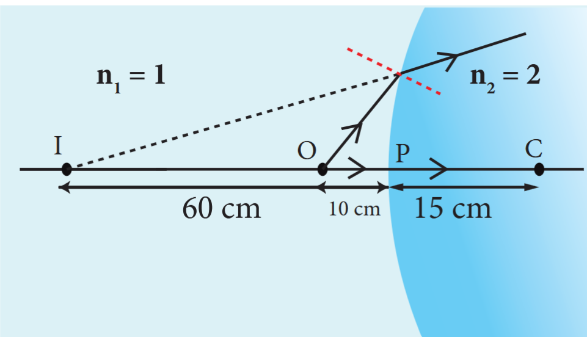

---

Case ii)

\[
\frac{n_2}{v} - \frac{n_1}{u} = \frac{(n_2 - n_1)}{R};
\]

applying sign convention,

\[
u = -30 \, \text{cm}, \quad R = 15 \, \text{cm}
\]

\[
\frac{2}{v} - \frac{1}{(-30)} = \frac{(2 - 1)}{15}; \quad \frac{2}{v} + \frac{1}{30} = \frac{1}{15}
\]

\[
\therefore \, v = 60 \, \text{cm}
\]

[a real image is formed 60 cm, to the right of the surface]

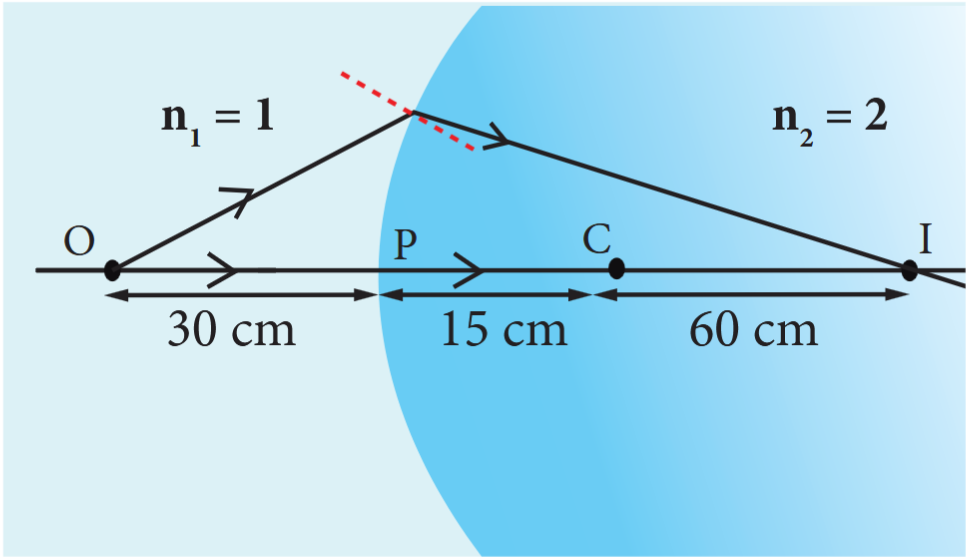

---

### 6.6 THIN LENSES

A lens is a transparent medium bounded by two refracting surfaces such that at least one of them is curved (spherical). If the two surfaces have the same radius of curvature, the lens is called **equi-convex** or **equi-concave**. If the two surfaces have different radii of curvature, we call them **convexo-concave** or **concavo-convex** depending upon the nature of the surfaces.

#### 6.6.1 Focal points of thin lenses

The points $F_1$ and $F_2$ are the two focal points of a lens. As the media on the two sides of a lens may not be the same, the focal lengths on either side of the lens may be different. Hence, we have two focal lengths.

The **primary focus** $F_1$ is defined as a point where a point source kept produces parallel emergent rays to the principal axis after passing through the lens. For a converging lens, such an object is a real object and for a diverging lens, it is a virtual object. The distance $PF_1$ is the primary focal length $f_1$.

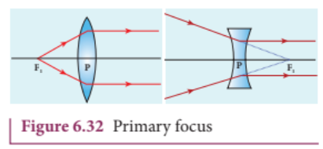

The **secondary focus** $F_2$ is defined as a point where all the parallel rays travelling close to the principal axis converge to form an image on the principal axis after passing through the lens. For a converging lens, such an image is a real image and for a diverging lens, it is a virtual image. The distance $PF_2$ is the secondary focal length $f_2$.

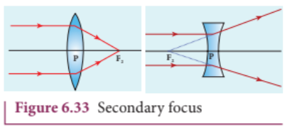

If the media on the two sides of a thin lens have the same refractive index, then the two focal lengths are equal. We will mostly be using the secondary focus $F_2$ in our further discussions.

#### 6.6.2 Sign conventions on focal length for lens

The sign conventions for thin lenses differ only in the signs followed for focal lengths.

(i) The sign of focal length is not decided on the direction of measurement of the focal length from the pole of the lens as they have two focal lengths, one to the left and another to the right.
(ii) The focal length of the thin lens is taken as positive for a **converging lens** and negative for a **diverging lens**.

The other sign conventions for object distance, image distance, radius of curvature, object height and image height (except for the focal lengths as mentioned above) remain the same for thin lenses as those for spherical mirrors.

#### 6.6.3 Lens maker's formula and lens equation

Let us consider a thin lens made up of a medium of refractive index $n_2$ placed in a medium of refractive index $n_1$. Let $R_1$ and $R_2$ be the radii of curvature of the two spherical surfaces ① and ② respectively and $P$ be the pole. Consider a point object $O$ on the principal axis. A paraxial ray from $O$ which falls very close to $P$, after refraction at surface ① forms an image at $I'$. Before it does so, it is again refracted by surface ②. Therefore, the final image is formed at $I$.

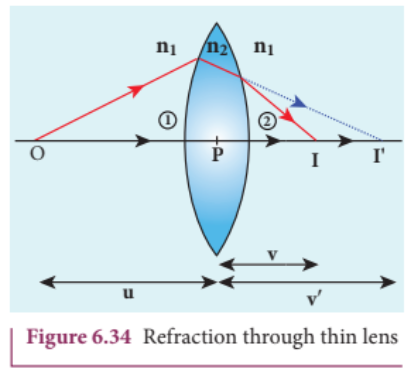

The general equation for the refraction at a single spherical surface is given by the equation (6.56) is,

\[
\frac{n_2}{v} - \frac{n_1}{u} = \frac{(n_2 - n_1)}{R}
\]

For the refracting surface ①, the light goes from \( n_1 \) to \( n_2 \).

\[
\frac{n_2}{v'} - \frac{n_1}{u} = \frac{(n_2 - n_1)}{R_1} \tag{6.58}
\]

For the refracting surface ②, the light goes from medium \( n_2 \) to \( n_1 \).

\[
\frac{n_1}{v} - \frac{n_2}{v'} = \frac{(n_1 - n_2)}{R_2} \tag{6.59}
\]

For surface ②, \( I' \) acts as virtual object.

Adding the above two equations (6.58) and (6.59)

\[
\frac{n_1}{v} - \frac{n_2}{u} = (n_2 - n_1) \left( \frac{1}{R_1} - \frac{1}{R_2} \right)
\]

On further simplifying and rearranging,

\[
\frac{1}{v} - \frac{1}{u} = \left( \frac{n_2 - n_1}{n_1} \right) \left( \frac{1}{R_1} - \frac{1}{R_2} \right)
\]

\[
\frac{1}{v} - \frac{1}{u} = \left( \frac{n_2}{n_1} - 1 \right) \left( \frac{1}{R_1} - \frac{1}{R_2} \right) \tag{6.60}
\]

If the object is at infinity, the image is formed at the focus of the lens. Thus, for \( u = \infty, v = f \). Then the equation becomes,

\[
\frac{1}{f} - \frac{1}{\infty} = \left( \frac{n_2}{n_1} - 1 \right) \left( \frac{1}{R_1} - \frac{1}{R_2} \right)
\]

\[
\frac{1}{f} = \left( \frac{n_2}{n_1} - 1 \right) \left( \frac{1}{R_1} - \frac{1}{R_2} \right) \tag{6.61}
\]

If the lens is kept in air, then we can take \( n_1 = 1 \) and \( n_2 = n \). So the equation (6.61) becomes,

\[
\frac{1}{f} = (n - 1) \left( \frac{1}{R_1} - \frac{1}{R_2} \right) \tag{6.62}
\]

The above formula is called as the lens maker's formula, because it tells the lens manufacturers what curvature is needed for a material of particular refractive index to make a lens of desired focal length. This formula holds good also for any type of lens. By comparing equations (6.60) and (6.61) we can write:

$$ \frac{1}{v} - \frac{1}{u} = \frac{1}{f} \tag{6.63} $$

The above equation is known as the **lens equation** which relates the object distance $u$ and image distance $v$ with the focal length $f$ of the lens. This equation holds good for any type of lens.

#### 6.6.4 Lateral magnification in thin lens

Let us consider an object $OO'$ of height $h_1$ placed on the principal axis with its height perpendicular to the principal axis. The inverted real image $II'$ is formed which has a height $h_2$.

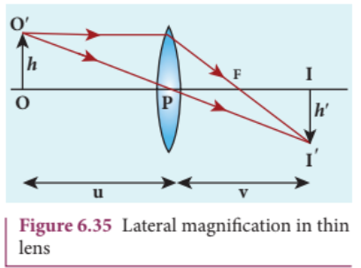

The lateral (or transverse) magnification $m$ is defined as the ratio of the height of the image to the height of the object:

$$ m = \frac{II'}{OO'} \tag{6.64} $$

From the two similar triangles $\Delta POO'$ and $\Delta PII'$, we can write:

$$ \frac{II'}{OO'} = \frac{PI}{PO} \tag{6.65} $$

On applying sign convention:

$$ \frac{-h'}{h} = \frac{v}{-u} $$

Substituting this in equation (6.65) for magnification:

$$ m = \frac{-h'}{h} = \frac{v}{-u} $$

After rearranging:

$$ m = \frac{h'}{h} = \frac{v}{u} \tag{6.66} $$

The magnification is negative for a real image and positive for a virtual image. In the case of a concave lens, the magnification is always positive and less than one.

We can also have other forms of equations for magnification by combining the lens equation:

$$ m = \frac{h'}{h} = \frac{f}{f + u} \quad \text{or} \quad m = \frac{h'}{h} = \frac{f - v}{f} \tag{6.67} $$

#### EXAMPLE 6.13

A biconvex lens has radii of curvature $20~\text{cm}$ and $15~\text{cm}$ for the two curved surfaces. The refractive index of the material of the lens is $1.5$.

(a) What is its focal length?
(b) Will the focal length change if the lens is flipped by the side?

**Solution**

For a biconvex lens, the radius of curvature of the first surface is positive and that of the second surface is negative.

.png)

Given, $n = 1.5$, $R_1 = 20~\text{cm}$ and $R_2 = -15~\text{cm}$

(a) Lens maker's formula: $\frac{1}{f} = (n - 1)\left(\frac{1}{R_1} - \frac{1}{R_2}\right)$

Substituting the values:

$$ \frac{1}{f} = (1.5 - 1)\left(\frac{1}{20} - \frac{1}{-15}\right) = (0.5)\left(\frac{1}{20} + \frac{1}{15}\right) $$

$$ \frac{1}{f} = (0.5)\left(\frac{3 + 4}{60}\right) = \frac{1}{2} \times \frac{7}{60} = \frac{7}{120} $$

$$ f = \frac{120}{7} = 17.14~\text{cm} $$

As the focal length is positive, the lens is a converging lens.

(b) .png)

When the lens is flipped by the side, $R_1 = 15~\text{cm}$ and $R_2 = -20~\text{cm}$. Substituting in the lens maker's formula:

$$ \frac{1}{f} = (1.5 - 1)\left(\frac{1}{15} - \frac{1}{-20}\right) = (0.5)\left(\frac{1}{15} + \frac{1}{20}\right) $$

This will also result in $f = 17.14~\text{cm}$. Thus, it is concluded that the focal length of the lens will not change if it is flipped by the side. This is true for any lens.

#### EXAMPLE 6.14

Determine the focal length of the lens made up of a material of refractive index $1.52$ as shown in the diagram. (Points $C_1$ and $C_2$ are the centers of curvature of the first and second surfaces respectively.)

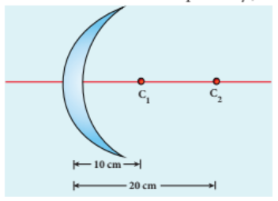

**Solution**

This lens is called a convex-concave lens.

Given, $n = 1.52$, $R_1 = 10~\text{cm}$ and $R_2 = 20~\text{cm}$. Both $R_1$ and $R_2$ are positive.

Lens maker's formula: $\frac{1}{f} = (n - 1)\left(\frac{1}{R_1} - \frac{1}{R_2}\right)$

Substituting the values:

$$ \frac{1}{f} = (1.52 - 1)\left(\frac{1}{10} - \frac{1}{20}\right) $$

$$ \frac{1}{f} = (0.52)\left(\frac{2 - 1}{20}\right) = (0.52)\left(\frac{1}{20}\right) = \frac{0.52}{20} $$

$$ f = \frac{20}{0.52} = 38.46~\text{cm} $$

As the focal length is positive, the lens is a converging lens.

### 6.6.5 Power of a lens

The power of a lens is a measure of its deviating ability on an incident light. When a ray is incident on a lens, the degree with which the lens deviates the ray is determined by the power of the lens. Power of the lens is inversely proportional to the focal length, i.e., greater the power of the lens, smaller will be the focal length.

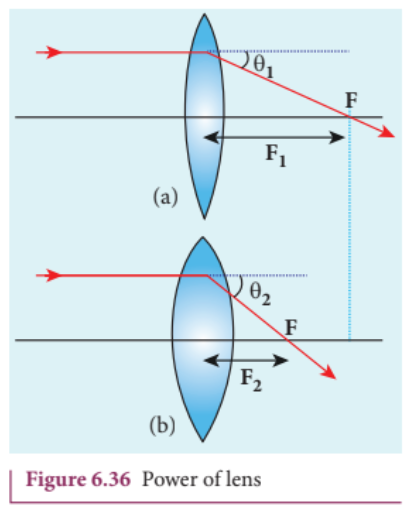

In other words, the power of a lens is a measure of the degree of convergence (or divergence) the lens produces on the light falling on it. The power of a lens $P$ is the reciprocal of its focal length in meters.

$$ P = \frac{1}{f} \tag{6.68} $$

The unit of power is **dioptre (D)**. $1~\text{D} = 1~\text{m}^{-1}$. Power is positive for a converging lens and negative for a diverging lens.

From the lens maker's formula, equation (6.62), equation (6.68) can be written for power as:

$$ P = \frac{1}{f} = (n - 1)\left(\frac{1}{R_1} - \frac{1}{R_2}\right) \tag{6.69} $$

The outcome of this equation for power is that for a given geometry of the lens, the larger the value of refractive index, the greater is the power of the lens and vice versa. Also for lenses with small radii of curvature (bulky), the power is large, and for lenses with large radii of curvature (skinny), the power is small.

#### EXAMPLE 6.15

If the focal length is 150 cm for a lens, what is the power of the lens?

**Solution**

Given, focal length, \( f = 150 \, \text{cm} = 1.5 \, \text{m} \)

Equation for power of lens is,  

\[
P = \frac{1}{f}
\]

Substituting the values,  

\[
P = \frac{1}{1.5 \, \text{m}} = 0.67 \, \text{D}
\]

As the power is positive, it is a converging lens.

### 6.6.6 Focal length of lenses in contact

Let us consider two lenses ① and ② of focal lengths $f_1$ and $f_2$ placed coaxially in contact with each other so that they have a common principal axis. For a point object placed at $O$ beyond the focus of lens ① on the principal axis, an image is formed by it at $I'$. This image $I'$ acts as an object for lens ② and the final image is formed at $I$. As these two lenses are thin, the measurements are done with respect to the common optic centre $P$ between the two lenses.

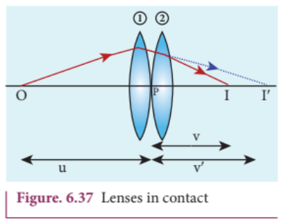

For lens ①, the object distance $PO$ is $u$ and the image distance $PI'$ is $v'$. For lens ②, the object distance $PI'$ is $v'$ and the image distance $PI$ is $v$.

Writing the lens equation (6.63) for lens ①:

$$ \frac{1}{v'} - \frac{1}{u} = \frac{1}{f_1} \tag{6.70} $$

Writing the lens equation (6.63) for lens ②:

$$ \frac{1}{v} - \frac{1}{v'} = \frac{1}{f_2} \tag{6.71} $$

Adding equations (6.70) and (6.71):

$$ \frac{1}{v} - \frac{1}{u} = \frac{1}{f_1} + \frac{1}{f_2} \tag{6.72} $$

The combination acts as a single lens of focal length $f$ so that for an object at the position $O$, it forms the image at $I$:

$$ \frac{1}{v} - \frac{1}{u} = \frac{1}{f} \tag{6.73} $$

Comparing equations (6.72) and (6.73):

$$ \frac{1}{f} = \frac{1}{f_1} + \frac{1}{f_2} \tag{6.74} $$

The above equation can be extended for any number of lenses in contact:

$$ \frac{1}{f} = \frac{1}{f_1} + \frac{1}{f_2} + \frac{1}{f_3} + \frac{1}{f_4} + \dots \tag{6.75} $$

The above equation can be written in terms of power of the lenses as:

$$ P = P_1 + P_2 + P_3 + P_4 + \dots \tag{6.76} $$

Where $P$ is the net power of the lenses in contact. One should note that the sum in equation (6.76) is an algebraic sum. The powers of individual lenses may be positive (for convex lenses) and negative (for concave lenses). Combination of lenses helps to obtain converging (or diverging) lenses of desired magnification. Also, combination of lenses enhances the sharpness of the image. As the image formed by the first lens becomes the object for the second and so on, the total magnification $m$ of the combination is the product of magnifications of individual lenses:

$$ m = m_1 \times m_2 \times m_3 \times \dots \tag{6.77} $$

Where $m_1, m_2, m_3, \dots$ are magnifications of individual lenses.

#### EXAMPLE 6.16

What is the focal length of the combination if lenses of focal lengths $-70~\text{cm}$ and $150~\text{cm}$ are in contact? What is the power of the combination?

**Solution**

Given, focal length of first lens $f_1 = -70~\text{cm}$, focal length of second lens $f_2 = 150~\text{cm}$.

Equation for focal length of lenses in contact: $\frac{1}{f} = \frac{1}{f_1} + \frac{1}{f_2}$

Substituting the values:

$$ \frac{1}{f} = \frac{1}{-70} + \frac{1}{150} = -\frac{1}{70} + \frac{1}{150} $$

$$ \frac{1}{f} = \frac{-150 + 70}{70 \times 150} = \frac{-80}{10500} = -\frac{8}{1050} $$

$$ f = -\frac{1050}{8} = -131.25~\text{cm} $$

As the final focal length is negative, the combination of two lenses is a diverging system of lenses.

The power of the combination is:

$$ P = \frac{1}{f} = \frac{1}{-1.3125~\text{m}} = -0.76~\text{D} $$

.png)

.png)

A system of combination of lenses is commonly used in designing lenses for cameras, microscopes, telescopes and other optical instruments. They produce better magnification and sharpness of the image.

#### EXAMPLE 6.17

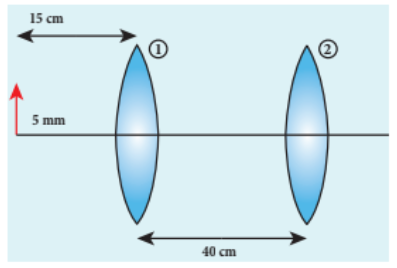

An object of $5~\text{mm}$ height is placed at a distance of $15~\text{cm}$ from a convex lens of focal length $10~\text{cm}$. A second lens of focal length $5~\text{cm}$ is placed $40~\text{cm}$ from the first lens and $55~\text{cm}$ from the object. Find (a) the position of the final image, (b) its nature and (c) its size.

**Solution**

Given, $h = 5~\text{mm} = 0.5~\text{cm}$, $u_1 = -15~\text{cm}$, $f_1 = 10~\text{cm}$, $f_2 = 5~\text{cm}$, distance between lenses = $40~\text{cm}$.

For the first lens, the lens equation is: $\frac{1}{v_1} - \frac{1}{u_1} = \frac{1}{f_1}$

Substituting the values:

$$ \frac{1}{v_1} - \frac{1}{-15} = \frac{1}{10} $$

$$ \frac{1}{v_1} + \frac{1}{15} = \frac{1}{10} $$

$$ \frac{1}{v_1} = \frac{1}{10} - \frac{1}{15} = \frac{3 - 2}{30} = \frac{1}{30} $$

$$ v_1 = 30~\text{cm} $$

The first lens forms an image $30~\text{cm}$ to the right of the first lens.

Height of this image: $m_1 = \frac{h'}{h} = \frac{v_1}{u_1}$

$$ \frac{h'}{0.5} = \frac{30}{-15} = -2 $$

$$ h' = -1~\text{cm} = -10~\text{mm} $$

As the height of the image is negative, the image is inverted and real.

This image acts as an object for the second lens. The object distance for the second lens is $40 - 30 = 10~\text{cm}$. Hence, $u_2 = -10~\text{cm}$.

For the second lens: $\frac{1}{v_2} - \frac{1}{u_2} = \frac{1}{f_2}$

$$ \frac{1}{v_2} - \frac{1}{-10} = \frac{1}{5} $$

$$ \frac{1}{v_2} + \frac{1}{10} = \frac{1}{5} $$

$$ \frac{1}{v_2} = \frac{1}{5} - \frac{1}{10} = \frac{2 - 1}{10} = \frac{1}{10} $$

$$ v_2 = 10~\text{cm} $$

The final image is formed $10~\text{cm}$ to the right of the second lens.

Magnification for the second lens: $m_2 = \frac{v_2}{u_2} = \frac{10}{-10} = -1$

The final height $h'' = m_1 \times m_2 \times h = (-2) \times (-1) \times 0.5 = 1~\text{cm} = 10~\text{mm}$

As the final height is positive, the image is erect relative to the original object. The final image is real and inverted relative to the intermediate image, but erect relative to the original object.

### 6.6.7 Silvered lenses

If one of the surfaces of a lens is silvered from outside, then such a lens is said to be a **silvered lens**. A silvered lens is a combination of a lens and a mirror. Light can enter through the transparent front surface of the lens and get reflected by the silver-coated rear surface. Hence, light travels two times through the lens.

The power $P$ of the silvered lens is:

$$ P = P_l + P_m + P_l $$

$$ P = 2P_l + P_m \tag{6.78} $$

Here, $P_l$ is the power of the lens and $P_m$ is the power of the mirror. We know that the power of a lens is the reciprocal of its focal length. But the power of a mirror is negative of the reciprocal of its focal length. This is because a concave mirror which has a negative focal length is a converging mirror with positive power. Also, a silvered lens is basically a modified mirror. Thus:

$$ P = \frac{1}{-f}, \quad P_l = \frac{1}{f_l}, \quad P_m = \frac{1}{-f_m} \tag{6.79} $$

Now equation (6.78) becomes:

$$ \frac{1}{-f} = \frac{2}{f_l} + \frac{1}{-f_m} \tag{6.80} $$

Proper sign conventions are to be followed for equation (6.80).

Suppose the object distance $u$ and image distance $v$ are to be found, we can very well use the mirror equation (6.8), since the silvered lens is a modified mirror:

$$ \frac{1}{v} + \frac{1}{u} = \frac{1}{f} $$

#### EXAMPLE 6.18

A thin biconvex lens is made up of glass of refractive index $1.5$. The two surfaces have equal radii of curvature of $30~\text{cm}$ each. One of its surfaces is made reflecting by silvering it from outside. (a) What is the focal length and power of this silvered lens? (b) Where should an object be placed in front of this lens so that the image is formed on the object itself?

**Solution**

Given, $n = 1.5$, $R_1 = 30~\text{cm}$, $R_2 = -30~\text{cm}$.

(a) Let us find $f_l$ and $f_m$ separately.

Using lens maker's formula:

$$ \frac{1}{f_l} = (n - 1)\left(\frac{1}{R_1} - \frac{1}{R_2}\right) $$

$$ \frac{1}{f_l} = (1.5 - 1)\left(\frac{1}{30} - \frac{1}{-30}\right) = (0.5)\left(\frac{1}{30} + \frac{1}{30}\right) $$

$$ \frac{1}{f_l} = \frac{1}{2} \times \frac{2}{30} = \frac{1}{30} $$

$$ f_l = 30~\text{cm} = 0.3~\text{m} $$

Focal length of the mirror: $f_m = \frac{R_2}{2} = \frac{-30}{2} = -15~\text{cm} = -0.15~\text{m}$

Now the focal length of the silvered lens is:

$$ \frac{1}{-f} = \frac{2}{f_l} + \frac{1}{-f_m} = \frac{2}{30} + \frac{1}{-(-15)} = \frac{2}{30} + \frac{1}{15} = \frac{2}{30} + \frac{2}{30} = \frac{4}{30} $$

$$ \frac{1}{-f} = \frac{2}{15} \quad \Rightarrow \quad -f = \frac{15}{2} = 7.5~\text{cm} $$

$$ f = -7.5~\text{cm} = -0.075~\text{m} $$

The silvered mirror behaves as a concave mirror with its focal length on the left side.

To find the power of the silvered lens:

$$ P = 2P_l + P_m = \frac{2}{f_l} + \frac{1}{-f_m} = \frac{2}{0.3} + \frac{1}{-(-0.15)} = \frac{2}{0.3} + \frac{1}{0.15} $$

$$ P = \frac{2}{0.3} + \frac{2}{0.3} = \frac{4}{0.3} = 13.33~\text{D} $$

As the power is positive, it is a converging system.

[Note: Here, we come across a silvered lens which has a negative focal length and positive power. This implies that the focal length is to the left and the system is a converging one. Such situations are possible in silvered lenses because a silvered lens is basically a modified mirror.]

(b) Writing the mirror formula: $\frac{1}{f} = \frac{1}{v} + \frac{1}{u}$

Here, both $u$ and $v$ are the same ($v = u$) as the image coincides with the object.

$$ \frac{1}{-7.5} = \frac{1}{u} + \frac{1}{u} = \frac{2}{u} $$

$$ u = -15~\text{cm} = -0.15~\text{m} $$

The object is to be placed $15~\text{cm}$ to the left of the silvered lens.

### 6.7 PRISM

A prism is a triangular block of transparent glass. It is bounded by three plane faces. One face is rough which is called the **base** of the prism. The other two faces are polished which are called **refracting faces** of the prism. The angle between the two refracting faces is called the **angle of the prism** (or refracting angle or apex angle). It is represented as $A$.

#### 6.7.1 Angle of deviation produced by prism

Consider a prism $ABC$. The faces $AB$ and $AC$ are polished and the face $BC$ is rough. Let light ray $PQ$ be incident on one of the refracting faces of the prism. The angles of incidence and refraction at the first face $AB$ are $i_1$ and $r_1$. The path of the light inside the prism is $QR$. The angles of incidence and refraction at the second face $AC$ are $r_2$ and $i_2$ respectively. $RS$ is the ray emerging from the second face. Angle $i_2$ is also called the **angle of emergence**. The angle between the direction of the incident ray and the emergent ray is called the **angle of deviation** $d$ in a prism. The two normals drawn at the point of incidence $Q$ and at the point of emergence $R$ meet at point $N$. The extended incident ray and the emergent ray meet at point $M$.

The angle of deviation $d_1$ at surface $AB$ is:

$$ \angle RQM = d_1 = i_1 - r_1 \tag{6.81} $$

The angle of deviation $d_2$ at surface $AC$ is:

$$ \angle QRM = d_2 = i_2 - r_2 \tag{6.82} $$

Total angle of deviation $d$ produced is:

$$ d = d_1 + d_2 \tag{6.83} $$

Substituting $d_1$ and $d_2$ in equation (6.83):

$$ d = (i_1 - r_1) + (i_2 - r_2) $$

After rearranging:

$$ d = (i_1 + i_2) - (r_1 + r_2) \tag{6.84} $$

In the quadrilateral $AQNR$, two of the angles (at the vertices $Q$ and $R$) are right angles. Therefore, the sum of the other angles of the quadrilateral should be $180^\circ$:

$$ \angle A + \angle QNR = 180^\circ \tag{6.85} $$

In triangle $\Delta QNR$:

$$ r_1 + r_2 + \angle QNR = 180^\circ \tag{6.86} $$

Comparing equations (6.85) and (6.86):

$$ r_1 + r_2 = A \tag{6.87} $$

Substituting this in equation (6.84) for angle of deviation:

$$ d = i_1 + i_2 - A \tag{6.88} $$

Thus, the angle of deviation depends on the angle of incidence $i_1$, the angle of emergence $i_2$, and the angle of the prism $A$. But, for a given angle of incidence, the angle of emergence is decided by the refractive index of the material of the prism. Hence, the angle of deviation for monochromatic light depends on the following factors:

(i) the angle of incidence
(ii) the angle of the prism
(iii) the refractive index of the material of the prism (which decides the angle of emergence)

#### EXAMPLE 6.19

A monochromatic light is incident on an equilateral prism at an angle $30^\circ$ and emerges at an angle of $75^\circ$. What is the angle of deviation produced by the prism?

**Solution**

Since the prism is equilateral, $A = 60^\circ$.

Given, $i_1 = 30^\circ$, $i_2 = 75^\circ$.

Equation for angle of deviation: $d = i_1 + i_2 - A$

Substituting the values: $d = 30^\circ + 75^\circ - 60^\circ = 45^\circ$

The angle of deviation produced is $d = 45^\circ$.

#### EXAMPLE 6.20

Light ray falls at normal incidence on the first face and emerges grazing the second face for an equilateral prism.

(a) What is the angle of deviation produced?
(b) What is the refractive index of the material of the prism?

**Solution**

Given, $A = 60^\circ$, $i_1 = 0^\circ$, $i_2 = 90^\circ$.

(a) Equation for angle of deviation: $d = i_1 + i_2 - A$

Substituting the values: $d = 0^\circ + 90^\circ - 60^\circ = 30^\circ$

The angle of deviation produced is $d = 30^\circ$.

(b) The light inside the prism must be falling on the second face at the critical angle as it grazes the boundary. The angle of incidence on the second face is $r_2$. Since the emergent ray grazes the surface, $i_2 = 90^\circ$. At the first face, since $i_1 = 0^\circ$, $r_1 = 0^\circ$.

From $r_1 + r_2 = A$, we get $0^\circ + r_2 = 60^\circ$, so $r_2 = 60^\circ$.

At the second face, the critical angle $i_c = r_2 = 60^\circ$.

Equation for critical angle: $\sin i_c = \frac{1}{n}$

$$ n = \frac{1}{\sin i_c} = \frac{1}{\sin 60^\circ} = \frac{1}{\sqrt{3}/2} = \frac{2}{\sqrt{3}} = 1.15 $$

The refractive index of the material of the prism is $n = 1.15$.

#### 6.7.2 Angle of minimum deviation

A graph plotted between the angle of incidence and the angle of deviation shows that the angle of deviation decreases with an increase in the angle of incidence and reaches a minimum value $D$, then continues to increase.

The minimum value of the angle of deviation is called the **angle of minimum deviation** $D$. At minimum deviation:

(i) the angle of incidence is equal to the angle of emergence: $i_1 = i_2$
(ii) the angles of refraction at the two faces are equal: $r_1 = r_2$

(iii) the refracted ray inside the prism is parallel to the base of the prism

#### 6.7.3 Refractive index of the material of the prism

At minimum deviation, $i_1 = i_2 = i$ and $r_1 = r_2 = r$.

Now, equation (6.88) becomes:

$$ D = i_1 + i_2 - A = 2i - A \quad \Rightarrow \quad i = \frac{A + D}{2} $$

Equation (6.87) becomes:

$$ r_1 + r_2 = A \quad \Rightarrow \quad 2r = A \quad \Rightarrow \quad r = \frac{A}{2} $$

Substituting $i$ and $r$ in Snell's law: $n = \frac{\sin i}{\sin r}$

$$ n = \frac{\sin\left(\frac{A + D}{2}\right)}{\sin\left(\frac{A}{2}\right)} \tag{6.89} $$

The above equation is used to determine the refractive index of the material of the prism. The angles $A$ and $D$ can be measured experimentally.

#### EXAMPLE 6.21

The angle of minimum deviation for an equilateral prism is $37^\circ$. Find the refractive index of the material of the prism.

**Solution**

Given, $A = 60^\circ$, $D = 37^\circ$.

Equation for refractive index:

$$ n = \frac{\sin\left(\frac{A + D}{2}\right)}{\sin\left(\frac{A}{2}\right)} $$

Substituting the values:

$$ n = \frac{\sin\left(\frac{60^\circ + 37^\circ}{2}\right)}{\sin\left(\frac{60^\circ}{2}\right)} = \frac{\sin\left(\frac{97^\circ}{2}\right)}{\sin 30^\circ} = \frac{\sin 48.5^\circ}{0.5} $$

$$ \sin 48.5^\circ \approx 0.7480 \quad \Rightarrow \quad n = \frac{0.7480}{0.5} = 1.496 \approx 1.5 $$

#### 6.7.4 Dispersion of white light through prism

The angle of deviation produced by a prism has so far been discussed only for monochromatic light (i.e., light of a single colour). When white light enters a prism, an effect called **dispersion** takes place. **Dispersion** is the splitting of white light into its constituent colours. This band of colours of light is called its **spectrum**. When a narrow beam of parallel rays of white light is incident on a prism and the refracted beam is received on a white screen, a band of colours is obtained in the order remembered by the word **VIBGYOR**: Violet, Indigo, Blue, Green, Yellow, Orange, and Red. Violet is the most deviated colour and red is the least deviated colour.

The colours obtained in a spectrum depend on the nature of the light source. Each colour in vacuum has a definite wavelength. Red colour has the longest wavelength of $700~\text{nm}$ while violet colour has the shortest wavelength of $400~\text{nm}$ in vacuum. Though all the colours have different wavelengths, they all travel with the same speed in vacuum. The speed of light is independent of wavelength in vacuum. Therefore, vacuum is a **nondispersive medium**.

**Points to Ponder:** 

.png)

Sir Isaac Newton demonstrated through a classic experiment that white light can be recombined by passing all the colours of VIBGYOR through another inverted prism to get white light.

But when white light enters a medium, red light travels with the highest speed and violet light travels with the least speed. Hence, the wavelengths of colours in a medium are no longer the same as they are in vacuum. Dispersion takes place in a medium because of the difference in speed for different colours in that medium. In other words, the refractive index of the material of the prism is different for different colours. For violet colour, the refractive index is the highest, and for red colour, the refractive index is the least.

#### 6.7.5 Dispersive Power

Consider a beam of white light passing through a prism. It gets dispersed into its constituent colours. If the angle of the prism is small (of the order of $10^\circ$), the prism is said to be a **small angle prism**. When rays of light pass through such prisms, the angle of minimum deviation also becomes small. Let $A$ be the angle of a small angle prism and $\delta$ be its angle of minimum deviation. Then equation (6.89) becomes:

\[
n = \frac{\sin\left(\frac{A + \delta}{2}\right)}{\sin\left(\frac{A}{2}\right)} \tag{6.90}
\]

For small angles of \( A \) and \( \delta \),

\[
\sin\left(\frac{A + \delta}{2}\right) \approx \left(\frac{A + \delta}{2}\right)
\]

\[
\sin\left(\frac{A}{2}\right) \approx \left(\frac{A}{2}\right)
\]

\[
\therefore n = \frac{\left(\frac{A + \delta}{2}\right)}{\left(\frac{A}{2}\right)} = \frac{A + \delta}{A} = 1 + \frac{\delta}{A}
\]

On further simplifying, \(\frac{\delta}{A} = n - 1\)

\[
\delta = (n - 1)A \tag{6.91}
\]

When white light enters the prism, the deviation is different for different colours. Thus, the refractive index is also different for different colours.

Let \( \delta_{v} \), \( \delta_{R} \) are the angles of minimum deviation for violet and red colour. Let \( n_{v} \) and \( n_{R} \) be the refractive indices for the violet and red colour respectively.

For Violet colour, \( \delta_{V} = (n_{V} - 1) A \)                         (6.92) 

For Red colour, \( \delta_{R} = (n_{R} - 1) A \)                            (6.93) 

As, angle of minimum deviation for violet colour \( \delta_{v'} \) is greater than angle of minimum deviation for red colour \( \delta_{R'} \), the refractive index for violet colour \( n_{v'} \) is greater than the refractive index for red colour \( n_{R'} \).

Subtracting \( \delta_{R'} \) from \( \delta_{v'} \), we get,

\[
\delta_{v'} - \delta_{R'} = (n_{v'} - n_{R'})A \tag{6.94}
\]

The angular separation between the two extreme colours (violet and red) in the spectrum (\( \delta_{v} - \delta_{R} \)) is called the angular dispersion.
If we take \(\delta\) as the angle of minimum deviation for any mean colour (green or yellow) and \(n\) the corresponding refractive index. Then,

\[
\delta = (n - 1)A \tag{6.95}
\]

**Dispersive power \(\omega\) is defined as the ratio of the angular dispersion for the extreme colours to the deviation for any middle colour.**  
Dispersive power is the ability of the material of the prism to produce dispersion.

\[
\omega = \frac{\text{angular dispersion}}{\text{middle deviation}} = \frac{\delta_v - \delta_R}{\delta} \tag{6.96}
\]

Substituting for \(\delta_v - \delta_R\) and \((\delta)\),

\[
\omega = \frac{(n_v - n_R)}{(n - 1)} \tag{6.97}
\]

The dispersive power is a dimensionless and unitless quantity. The dispersive power is always positive. The dispersive power of a prism depends only on the nature of material of the prism and it is independent of the angle of the prism.

#### EXAMPLE 6.22

Find the dispersive power of a prism if the refractive indices of flint glass for red, green, and violet colours are $1.613$, $1.620$, and $1.632$ respectively.

**Solution**

Given, $n_\nu = 1.632$, $n_R = 1.613$, $n_G = 1.620$.

Equation for dispersive power:

$$ \omega = \frac{n_\nu - n_R}{n_G - 1} $$

Substituting the values:

$$ \omega = \frac{1.632 - 1.613}{1.620 - 1} = \frac{0.019}{0.620} = 0.0306 $$

The dispersive power of the prism is $\omega = 0.0306$.

## 6.7.6 Scattering of sunlight

When sunlight enters the atmosphere of earth, the particles present in the atmosphere change the direction of the light. This process is known as **scattering of light**.

If the scattering of light is by atoms and molecules which have size $a$ very much less than that of the wavelength $\lambda$ of light $(a \ll \lambda)$, then the scattering is called **Rayleigh's scattering**. The intensity of light scattered in Rayleigh's scattering is inversely proportional to the fourth power of wavelength.

$$ I \propto \frac{1}{\lambda^4} \tag{6.98} $$

According to equation (6.98), during daytime, violet colour which has the shortest wavelength gets scattered more than the other colours. The next scattered colour is blue. As our eyes are more sensitive to blue colour than violet colour, the sky appears blue during daytime. But during sunrise and sunset, the light from the sun travels a greater distance through the atmosphere. Hence, the blue light which has a shorter wavelength is scattered away and the red light which has a longer wavelength and is less scattered manages to reach our eye. This is the reason for the reddish appearance of the sky during sunrise and sunset.

If light is scattered by large particles like dust and water droplets present in the atmosphere which have size $a$ greater than the wavelength $\lambda$ of light $(a \gg \lambda)$, the intensity of scattering is equal for all colours. This non-Rayleigh scattering is independent of wavelength. It happens in clouds which contain large amounts of dust and water droplets. Thus, in clouds all the colours get equally scattered. This is the reason for the whitish appearance of clouds. However, rain clouds appear dark because of the condensation of water droplets on dust particles that makes the cloud opaque.

If the earth had no atmosphere, there would not have been any scattering and the sky would appear dark. That is why the sky appears dark for astronauts who can see the sky from above the atmosphere.

---

## SUMMARY

- A ray of light gives the direction of light.
- Law of reflection is: $i = r$
- Paraxial rays are the rays travelling close to the principal axis of the mirror and make small angles with it.
- The relation between focal length and radius of curvature in a spherical mirror is: $2f = R$ (or) $f = \frac{R}{2}$
- Cartesian sign conventions are to be followed to trace images formed by spherical mirrors.
- The mirror equation is: $\frac{1}{v} + \frac{1}{u} = \frac{1}{f}$
- The magnification in a spherical mirror is: $m = \frac{h'}{h} = -\frac{v}{u}$, $m = \frac{h'}{h} = \frac{f - v}{f} = \frac{f}{f - u}$
- Light travels with lesser velocity in an optically denser medium.
- Refractive index is the ratio of the speed of light in vacuum to the speed of light in the medium: $n = \frac{c}{v}$
- Optical path is the equivalent path travelled in vacuum in the same time light travels through an optically denser medium: $d' = nd$
- Law of refraction (Snell's law) in ratio form is: $\frac{\sin i}{\sin r} = \frac{n_2}{n_1}$
- In product form: $n_1 \sin i = n_2 \sin r$
- The relative refractive index of the second medium with respect to the first medium is: $n_{21} = \frac{n_2}{n_1}$
- The apparent depth is always less than the actual depth. The equation for apparent depth is: $d' = \frac{d}{n}$
- The critical angle of incidence $i_c$ for a ray incident from a denser to a rarer medium is the angle for which the angle of refraction is $90^\circ$. For $i > i_c$, total internal reflection occurs.
- Equation for critical angle incidence: $\sin i_c = \frac{1}{n}$ (or) $i_c = \sin^{-1}\left(\frac{1}{n}\right)$
- Snell's window is the restricted area of circular illumination which appears when seen from water due to critical angle incidence. The radius of the circular illumination is: $R = d \left(\frac{1}{\sqrt{n^2 - 1}}\right)$ (or) $R = \frac{d}{\sqrt{n^2 - 1}}$
- Optical fibre makes use of critical angle incidence.
- The acceptance angle in an optical fibre is: $i_a = \sin^{-1}\left(\sqrt{\frac{n_1^2 - n_2^2}{n_3^2}}\right)$, where $n_1$, $n_2$, $n_3$ are the refractive indices of the core, cladding and surrounding medium respectively.
- Glass slabs produce a lateral displacement of the light falling on them. The equation for lateral shift is: $L = t \left(\frac{\sin(i - r)}{\cos r}\right)$
- The equation for a single spherical surface is: $\frac{n}{v} - \frac{1}{u} = \frac{n - 1}{R}$
- The focal length of a thin lens is positive for a converging lens and negative for a diverging lens. It is not based on the position of the focal point.
- The lens maker's formula is: $\frac{1}{f} = (n - 1)\left(\frac{1}{R_1} - \frac{1}{R_2}\right)$
- The lens equation is: $\frac{1}{v} - \frac{1}{u} = \frac{1}{f}$
- The magnification produced by a lens is: $m = \frac{h'}{h} = \frac{v}{u}$, $m = \frac{h'}{h} = \frac{f}{f + u}$ (or) $m = \frac{h'}{h} = \frac{f - v}{f}$
- The power of a lens is a measure of the degree of convergence (or divergence) of light falling on it. Power and focal length are inversely related: $P = \frac{1}{f}$
- The unit of power is dioptre (D) when the focal length is taken in metres.
- The effective focal length of lenses in contact is: $\frac{1}{f} = \frac{1}{f_1} + \frac{1}{f_2}$
- A prism produces deviation of the incident ray. The angle of deviation depends on the angle of the prism, the angle of incidence and the refractive index of the material of the prism, given by the equation: $d = i_1 + i_2 - A$
- At minimum deviation, $i_1 = i_2$, $r_1 = r_2$, and the ray inside the prism is parallel to the base of the prism.
- The refractive index of a prism depends on the angle of the prism and the angle of minimum deviation, given by: $n = \frac{\sin\left(\frac{A + D}{2}\right)}{\sin\left(\frac{A}{2}\right)}$
- When white light travels through a medium, different colours travel with different speeds, leading to dispersion of light. Red light travels faster than violet light in a medium. In vacuum, all colours travel with the same speed.
- The angle of deviation produced by a small-angled prism is: $\delta = (n - 1)A$
- The angular separation between the two extreme colours (violet and red) in the spectrum is called angular dispersion: $\delta_\nu - \delta_R = (n_\nu - n_R)A$
- Dispersive power is the measure of the ability of a medium to disperse white light: $\omega = \frac{n_\nu - n_R}{n - 1}$
- A rainbow is formed by the dispersion of light by water droplets.
- The scattering of light by particles of size less than the wavelength of light is called Rayleigh scattering. The intensity of light produced by Rayleigh scattering is: $I \propto \frac{1}{\lambda^4}$
- Non-Rayleigh scattering is by suspended dust particles whose size is greater than the wavelength of light. This scattering is independent of the wavelength of light.

---

## MULTIPLE CHOICE QUESTIONS

1. The speed of light in an isotropic medium depends on,
   (a) its intensity
   (b) its wavelength
   (c) the nature of propagation
   (d) the motion of the source w.r.t medium

2. A rod of length $10~\text{cm}$ lies along the principal axis of a concave mirror of focal length $10~\text{cm}$ in such a way that its end closer to the pole is $20~\text{cm}$ away from the mirror. The length of the image is, (AIPMT Main 2012)
   (a) $2.5~\text{cm}$
   (b) $5~\text{cm}$
   (c) $10~\text{cm}$
   (d) $15~\text{cm}$

3. An object is placed in front of a convex mirror of focal length $f$ and the maximum and minimum distance of an object from the mirror such that the image formed is real and magnified. (JEE Main 2009)
   (a) $2f$ and $c$
   (b) $c$ and $\infty$
   (c) $f$ and $O$
   (d) None of these

4. For light incident from air on a slab of refractive index $2$, the maximum possible angle of refraction is,
   (a) $30^\circ$
   (b) $45^\circ$
   (c) $60^\circ$
   (d) $90^\circ$

5. If the velocity and wavelength of light in air is $V_a$ and $\lambda_a$ and that in water is $V_w$ and $\lambda_w$, then the refractive index of water is,
   (a) $\frac{V_w}{V_a}$
   (b) $\frac{V_a}{V_w}$
   (c) $\frac{\lambda_w}{\lambda_a}$
   (d) $\frac{V_a \lambda_a}{V_w \lambda_w}$

6. Stars twinkle due to,
   (a) reflection
   (b) total internal reflection
   (c) refraction
   (d) polarisation

7. When a biconvex lens of glass having refractive index $1.47$ is dipped in a liquid, it acts as a plane sheet of glass. This implies that the liquid must have refractive index,
   (a) less than one
   (b) less than that of glass
   (c) greater than that of glass
   (d) equal to that of glass

8. The radius of curvature of the curved surface of a thin plano-convex lens is $10~\text{cm}$ and the refractive index is $1.5$. If the plane surface is silvered, then the focal length will be,
   (a) $5~\text{cm}$
   (b) $10~\text{cm}$
   (c) $15~\text{cm}$
   (d) $20~\text{cm}$

9. An air bubble in a glass slab of refractive index $1.5$ (near normal incidence) is $5~\text{cm}$ deep when viewed from one surface and $3~\text{cm}$ deep when viewed from the opposite face. The thickness of the slab is,
   (a) $8~\text{cm}$
   (b) $10~\text{cm}$
   (c) $12~\text{cm}$
   (d) $16~\text{cm}$

10. A ray of light travelling in a transparent medium of refractive index $n$ falls on a surface separating the medium from air at an angle of incidence of $45^\circ$. The ray can undergo total internal reflection for the following $n$,
    (a) $n = 1.25$
    (b) $n = 1.33$
    (c) $n = 1.4$
    (d) $n = 1.5$

**Answer Key:** 1) b, 2) b, 3) d, 4) a, 5) b, 6) c, 7) d, 8) b, 9) c, 10) d

---

## SHORT ANSWER QUESTIONS

1. What is the angle of deviation due to reflection?
2. Derive the relation between $f$ and $R$ for a spherical mirror.
3. What are the Cartesian sign conventions for spherical mirrors?
4. What is optical path? Obtain the equation for optical path.
5. State Snell's law (law of refraction).
6. What is the angle of deviation due to refraction?
7. What is the principle of reversibility?
8. What is relative refractive index?
9. Obtain the equation for apparent depth.
10. Why do stars twinkle?
11. What are the critical angle and total internal reflection?
12. Obtain the equation for the critical angle.
13. Explain the reason for the glittering of diamond.
14. What are mirage and looming?
15. Write a short note on prisms making use of total internal reflection.
16. What is Snell's window?
17. How does an endoscope work?
18. What are the primary focus and secondary focus of a lens?
19. What are the sign conventions followed for lenses?
20. Arrive at the lens equation from the lens maker's formula.
21. Obtain the equation for lateral magnification of a thin lens.
22. What is the power of a lens?
23. Derive the equation for effective focal length for lenses in contact.
24. What is the angle of minimum deviation?
25. What is dispersion?
26. How are rainbows formed?
27. What is Rayleigh's scattering?
28. Why does the sky appear blue?
29. What is the reason for the reddish appearance of the sky during sunset and sunrise?
30. Why do clouds appear white?

---

## LONG ANSWER QUESTIONS

1. Derive the mirror equation and the equation for lateral magnification.
2. Describe Fizeau's method to determine the speed of light.
3. Obtain the equation for the radius of illumination (or Snell's window).
4. Derive the equation for the acceptance angle and numerical aperture of an optical fibre.
5. Obtain the equation for lateral displacement of light passing through a glass slab.
6. Derive the equation for refraction at a single spherical surface.
7. Obtain the lens maker's formula and mention its significance.
8. Derive the equations for a thin lens and for magnification.
9. Derive the equation for the angle of deviation produced by a prism and thus obtain the equation for the refractive index of the material of the prism.
10. What is dispersion? Obtain the equation for the dispersive power of a medium.

---

## CONCEPTUAL QUESTIONS

1. Why are dish antennas curved?
2. What type of lens is formed by a bubble inside water?
3. Is it possible for two lenses to produce zero power?
4. A biconvex lens has focal length $f$ and intensity of light $I$ passing through it. What will be the focal length and intensity for portions of the lens obtained by cutting it vertically and horizontally as shown in the figure?
5. Why is yellow light preferred during fog?

---

## NUMERICAL PROBLEMS

1. An object of $4~\text{cm}$ height is placed at $6~\text{cm}$ in front of a concave mirror of radius of curvature $24~\text{cm}$. Find the position, height, magnification and nature of the image.

   **Ans:** $v = 12~\text{cm}$, $h' = 8~\text{cm}$, $m = 2$, image is erect, virtual, twice the height of the object, formed on the right side of the mirror.

2. An object is placed in front of a concave mirror of focal length $20~\text{cm}$. The image formed is three times the size of the object. Calculate two possible distances of the object from the mirror.

   **Ans:** with $+m$: $u = -\frac{40}{3}~\text{cm}$, with $-m$: $u = -\frac{80}{3}~\text{cm}$

3. A beam of light consisting of red, green and blue is incident on a right-angled prism as shown in the figure. The refractive indices of the material of the prism for red, green and blue colours are $1.39$, $1.44$ and $1.47$ respectively. Which colours suffer total internal reflection?

   **Ans:** Green and blue suffer total internal reflection.

4. An object is placed at a certain distance from a convex lens of focal length $20~\text{cm}$. Find the object distance if the image obtained is magnified $4$ times.

   **Ans:** $u = -15~\text{cm}$

5. Obtain the lens maker's formula for a lens of refractive index $n_2$ which is separating two media of refractive indices $n_1$ and $n_3$ on the left and right respectively.

   **Ans:** $\frac{n_3}{v} - \frac{n_1}{u} = \frac{n_2 - n_1}{R_1} + \frac{n_3 - n_2}{R_2}$, $\frac{1}{f} = \frac{1}{n_3}\left(\frac{n_2 - n_1}{R_1} + \frac{n_3 - n_2}{R_2}\right)$

6. A thin converging lens of refractive index $1.5$ has a power of $+5.0~\text{D}$. When this lens is immersed in a liquid of refractive index $n$, it acts as a diverging lens of focal length $100~\text{cm}$. What must be the value of $n$?

   **Ans:** $n = \frac{5}{3}$

7. If the distance $D$ between an object and screen is greater than $4$ times the focal length $f$ of a convex lens, then there are two positions for which the lens forms an enlarged image and a diminished image respectively. This method is called the conjugate foci method. If $d$ is the distance between the two positions of the lens, obtain the equation for the focal length of the convex lens.

   **Ans:** $f = \frac{D^2 - d^2}{4D}$

8. Prove that a concave lens can only form a virtual, erect and diminished image.

9. A point object is placed at $20~\text{cm}$ from a thin plano-convex lens of focal length $15~\text{cm}$ whose plane surface is silvered. Locate the position and nature of the final image.

   **Ans:** $v = -12~\text{cm}$

10. Find the ratio of the intensities of lights with wavelengths $500~\text{nm}$ and $300~\text{nm}$ which undergo Rayleigh scattering.

    **Ans:** $81:625$

---

## BOOKS FOR REFERENCE

1. Frances A. Jenkins and Harvey E. White, *Fundamentals of Optics*, $4^{\text{th}}$ Edition, McGraw Hill Book Company, (2011).
2. David Halliday, Robert Resnick and Jearl Walker, *Fundamentals of Physics*, $6^{\text{th}}$ Edition, John Wiley & Sons Inc., (2004).
3. H.C. Verma, *Concepts of Physics* [Part-1], $1^{\text{st}}$ Edition, Bharathi Bhawan Publishers & Distributors Pvt. Ltd., (2008).
4. Roger A. Freedman, Hugh D. Young, *Sears and Zemansky's University Physics*, $12^{\text{th}}$ Edition, Pearson, (2011).

---

## ICT CORNER

### Ray Optics

In this activity you will be able to find out the radius of curvature needed to make a lens of desired focal length.

**Topic:** Lens maker's formula.

**STEPS:**

1. In the browser, go to the page: `https://www.geogebra.org/m/wv7eccvc`
2. Here $n_1 =$ refractive index of air ($n_1 = 1$), $n_2$ is the refractive index of the lens, $R_1$ and $R_2$ are the radii of curvature of the lens.
3. Take $n_2 = 1.5$, $R_1 = 3~\text{cm}$ and $R_2 = -3~\text{cm}$.
4. Calculate the focal length of the lens using the formula $\frac{1}{f} = (n_2 - 1)\left(\frac{1}{R_1} - \frac{1}{R_2}\right)$.
5. Verify your answer with the value obtained on the screen by adjusting $n_2$, $R_1$ and $R_2$.
6. Find out the curvatures $R_1$ and $R_2$ to make a lens of desired focal length $7~\text{cm}$.
7. When $R_1 = -1~\text{cm}$ and $R_2 = 1~\text{cm}$, you will get a concave lens of focal length $-1~\text{cm}$.
8. Try to construct concave and convex lenses by adjusting $R_1$ and $R_2$.
9. Adjust the refractive index $n_2$ and analyse how the focal length changes with respect to refractive index.
10. Adjust the refractive index $n_1$ and analyse how the focal length changes with respect to the refractive index of the medium surrounding the lens.

**Note:** Use a flash-enabled browser or install a flash player in your system.

**URL:** https://www.geogebra.org/m/wv7eccvc

*Pictures are indicative only. If the browser requires, allow Flash Player or JavaScript to load the page.*