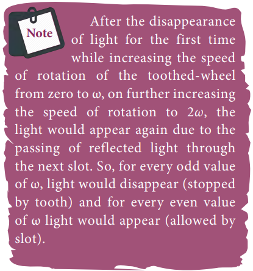

# SPEED OF LIGHT

Light travels with the highest speed in vacuum. The speed of light in vacuum is denoted as $c$ and its value is, c=3 \times 10^{8} \mathrm{~m} \mathrm{~s}^{-1}. The earliest attempt to determine the speed of light was made by a French scientist Hippolyte Fizeau (1819-1896). That paved way for the other scientists too to determine the speed of light.

## Fizeau’s method to determine speed of light

Apparatus: The apparatus used by Fizeau for determining speed of light in air medium is shown in Figure 6.13. The light from the source $S$ was first allowed to fall on a partially silvered glass plate $G$ kept at an angle of 45^{\circ} to the incident light. The light then was allowed to pass through a rotating toothed-wheel with _N_ teeth and _N_ cuts of equal widths whose speed of rotation could be varied through an external mechanism (not shown in the Figure). The light passing through one cut in the wheel will get reflected by a mirror _M_ kept at a long distance _d_, about 8 \mathrm{~km} from the toothed-wheel. If the toothedwheel was not rotating, the light reflected back from the mirror would again pass through the same cut and reach the eyes of the observer who looks through the partially silvered glass plate.

Working: The angular speed of rotation of the toothed-wheel was increased from zero to a value \omega until the light passing through one cut would completely be blocked by the adjacent tooth. This is ensured by the disappearance of the light while looking through the partially silvered glass plate.

Expression for speed of light: The speed _v_ of light in air is equal to the ratio of the distance _2 d_ (the distance light travelled from the toothed-wheel to the mirror and back), to the time taken _t_.


v=\frac{2 d}{t}


The distance _d_ is a known value from the arrangement. The time _t_ taken for the

Figure 6.13 Speed of light by Fizeau's method
light to travel the distance _2 d_ is calculated from the angular speed \omega of the toothedwheel.

The angular speed \omega (with unit \operatorname{rad~s}^{-1} ) of the toothed-wheel when the light disappeared for the first time is,


\omega=\frac{\theta}{t}


Here, \theta is the angle between one tooth and the next slot which is turned within that time _t_.


\begin{aligned}
& \theta=\frac{\text { total angle of the circle in radian }}{\text { number of teeth }+ \text { number of cuts }} \\
& \theta=\frac{2 \pi}{2 N}=\frac{\pi}{N}
\end{aligned}


Substituting \theta in equation (6.13),


\omega=\frac{\pi / N}{t}=\frac{\pi}{N t}


Rewriting the above equation for _t_,


t=\frac{\pi}{N \omega}


Substituting this in equation (6.12),


v=\frac{2 d}{\pi / N \omega}


After rearranging,


v=\frac{2 d N \omega}{\pi}


Fizeau had some difficulty to visually estimate the minimum intensity of the light when it is blocked by the adjacent tooth. The value of speed of light determined by him was very close to the actual value. Later on, with the same idea of Fizeau and with much sophisticated instruments, the speed of light in air was determined as, v=2.99792 \times 10^{8} \mathrm{~m} \mathrm{~s}^{-1}.

## Speed of light through vacuum and different media

Scientists like Foucault (1819-1868) and Michelson (1852-1931) introduced different transparent media like glass, water etc., in the path of light to find the speed of light in different media. Even evacuated glass tubes were also introduced in the path of light to find the speed of light in vacuum. It was found that light travels with lesser speed in any medium than its speed in vacuum. The speed of light in vacuum was determined as,  c=3 \times 10^{8} \mathrm{~m} \mathrm{~s}^{-1} . We could notice that the speed of light in vacuum and speed of light in air are almost same.

## Refractive index

**_Refractive index_ of a transparent medium is defined as the ratio of speed of light in vacuum _c_ to the speed of light in that medium** _v_**.**


\left.\begin{array}{r}
\text { refractive } \\
\text { index } n \text { of a } \\
\text { medium }
\end{array}\right\}=\frac{\text { speed of light in vacuum }(c)}{\text { speed of light in medium }(v)}



n=\frac{c}{v}


Refractive index of a transparent medium gives an idea about the speed of light in that medium.

**EXAMPLE 6.5**

Pure water has refractive index 1.33. What is the speed of light through it?

**_Solution_**
n=\frac{c}{v} ; \quad v=\frac{c}{n}

v=\frac{3 \times 10^{8}}{1.33}=2.26 \times 10^{8} \mathrm{~m} \mathrm{~s}^{-1}

Light travels with a speed of 2.26 \times 10^{8} \mathrm{~m} \mathrm{~s}^{-1} through pure water.

Refractive index does not have a unit. The smallest value of refractive index is for vacuum, which is 1. For any other medium refractive index is greater than 1. Refractive index is also called as optical density of the medium. Higher the refractive index of a medium, lesser is the speed of light through it and vice-versa. \[Note: optical density should not be confused with mass density of the material of the medium. They two are different entities\]. The Table 6.2 shows the refractive indices of different transparent media.

**Table 6.2 Refractive index of media**

| **Media**          | **Refractive index** |
|--------------------|----------------------|
| Vacuum             |1.00                   |
| Air                | 1.0003               |
| Carbon dioxide gas | 1.0005               |
| Ice                | 1.31                 |
| Pure water         | 1.33                 |
| Ethyl alcohol      | 1.36                 |
| Quartz             | 1.46                 |
| Vegetable oil      | 1.47                 |
| Olive oil          | 1.48                 |
| Acrylic            | 1.49                 |
| Table salt         | 1.51                 |
| Glass              | 1.52                 |
| Sapphire           | 1.77                 |
| Zircon             | 1.92                 |
| Qubic zirconia     | 2.16                 |
| Diamond            | 2.42                 |
| Gallium phosphide  | 3.50                 |

## Optical path

**_Optical path_ of a medium is defined as the distance _d'_ light travels in vacuum in the same time it travels a distance _d_ in the medium.**

Let us consider a medium of refractive index _n_ and thickness _d_. Light travels with a speed _v_ through the medium in a time _t_. The speed of light through the medium is written as,


v=\frac{d}{t} ; \text { rewritten for } t \text { as, } t=\frac{d}{v}


In the same time _t_, light can cover a longer distance d^{\prime} in vacuum as it travels with greater speed _c_ in vacuum. It is shown in Figure 6.14. Now, we can wrtite,

  

c=\frac{d^{\prime}}{t} ; \text { rewritten for } t \text { as, } t=\frac{d^{\prime}}{c}


As the time taken in both the cases is the same, we can equate the time $t$,


\frac{d^{\prime}}{c}=\frac{d}{v}


Rewritten for the optical path d^{\prime} as, d^{\prime}=\frac{c}{v} d As, \frac{c}{v}=n; the optical path d^{\prime} is,


d^{\prime}=n d


The value of _n_ is always greater than 1 , for a medium. Thus, the optical path d^{\prime} of a medium is always greater than _d_.

**EXAMPLE 6.6**

Light travels from air into a glass slab of thickness 50 cm and refractive index 1.5.

(a) What is the speed of light in the glass slab?

(b) What is the time taken by the light to travel through the glass slab?

(c) What is the optical path of the glass slab?

**_Solution_**

Given, thickness of glass slab, d=50 \mathrm{~cm}= 0.5 \mathrm{~m}, refractive index, _n=1.5_

refractive index, n=\frac{c}{v}

(a) speed of light in the glass slab is,


v=\frac{c}{n}=\frac{3 \times 10^{8}}{1.5}=2 \times 10^{8} \mathrm{~m} \mathrm{~s}^{-1}


(b) time taken by light to travel through the glass slab is,


t=\frac{d}{v}=\frac{0.5}{2 \times 10^{8}}=2.5 \times 10^{-9} \mathrm{~s}


(c) optical path


d^{\prime}=n d=1.5 \times 0.5=0.75 \mathrm{~m}=75 \mathrm{~cm}


Light would have travelled an additional 25 \mathrm{~cm}(75 \mathrm{~cm}-50 \mathrm{~cm}) in vacuum at the same time had there been no glass slab in its path.