# CHAPTER 7  WAVE OPTICS

An age is called dark, not because the light fails to shine, but because people refuse to see. — James Albert Michener

## LEARNING OBJECTIVES

In this unit, the students are exposed to,

The wave aspect of light. The proof for law of reflection and refraction. The phenomena like interference, diffraction and polarisation. The terms like magnification and resolving power etc. The different optical instruments like microscope, telescope etc.

## 7.1 THEORIES ON LIGHT

Light is a form of energy that is transferred from one place to another. A glance at the evolution of various theories of light put forth by scientists will give not only an over view of the nature of light but also its propagation and some phenomenon demonstrated by it.

#### 7.1.1 Corpuscular theory

Sir Isaac Newton (1672) gave the corpuscular theory of light which was also suggested earlier by Descartes (1637) to explain the laws of reflection and refraction. According this theory, light is emitted as tiny, massless (negligibly small mass) and perfectly elastic particles called corpuscles. As the corpuscles are very small, the source of light does not suffer appreciable loss of mass even if it emits light for a long time. On account of high speed, they are unaffected by the force of gravity and their path is a straight line in a medium of uniform refractive index. The energy of light is the kinetic energy of these corpuscles. When these corpuscles impinge on the retina of the eye, the vision is produced. The different sizes of the corpuscles give different colours to light. When the corpuscles approach a surface between two media, they are either repelled (or) attracted. The reflection of light is due to the repulsion of the corpuscles by the medium and refraction of light is due to the attraction of the corpuscles by the medium.

This theory could not explain the reason why the speed of light is lesser in denser medium than in rarer medium and also the phenomena like interference, diffraction and polarisation.

### 7.1.2 Wave theory

Christian Huygens (1678) proposed the wave theory to explain the propagation of light through a medium. According to him, light is a disturbance from a source travels that as longitudinal mechanical waves through the ether medium (that was presumed to pervade all space) as mechanical wave requires a medium for its propagation. The wave theory could successfully explain phenomena of reflection, refraction, interference and diffraction of light.

Later, the existence of ether in all space was proved to be wrong. Hence, this theory could not explain the propagation of light through vacuum. The phenomenon of polarisation could not be explained by this theory as it is the property of only transverse waves.

### 7.1.3 Electromagnetic wave theory

Maxwell (1864) proved that light is an electromagnetic wave which is transverse in nature carrying electromagnetic energy. He could also show that no medium is necessary for the propagation of electromagnetic waves. All the phenomenon of light could be successfully explained by this theory.

Nevertheless, the interaction phenomenon of light with matter like photoelectric effect and Compton effect could not be explained by this theory.

### 7.1.4 Quantum theory

Albert Einstein (1905), endorsing the views of Max Plank (1900), was able to explain photoelectric effect (discussed in Unit 8) in which light interacts with matter as photons to eject the electrons. A photon is a discrete packet of energy. Each photon has energy \(E\) of,

\[E = h\nu\]

Where, \(h\) is Plank's constant \((h = 6.625\times 10^{- 34}\mathrm{Js})\) and \(\nu\) is frequency of electromagnetic wave.

As light has both wave as well as particle nature it is said to have dual nature. It is concluded that light propagates as a wave and interacts with matter as a particle.

## 7.2 WAVE NATURE OF LIGHT

Light is a transverse, electromagnetic wave. The wave nature of light was first demonstrated through experiments like interference and diffraction. The transverse nature of light is demonstrated in polarization. Like all electromagnetic waves, light can travel through vacuum.

### 7.2.1 Wave optics

Wave optics deals with the wave characteristics of light. Even the law of reflection and refraction are proved only with the help of wave optics. Though light propagates as a wave, its direction of propagation is still represented as a ray.

A good example for wave propagation is the spreading of circular ripples on the surface of still water from a point where a stone is dropped. The molecules (or) particles of water at a point are moving only up and down (oscillate) when a ripple passes through that point. All these particles on the circular ripple are in the same phase of vibration as they are all at the same distance from the center. The ripple represents a wavefront as shown in Figure 7.1(a). A wavefront is the locus of points which are in the same state (or) phase of vibration.

When a wave propagates it is treated as the propagation of wavefront. The wavefront is always perpendicular to the direction of the propagation of the wave. As the direction of ray is in the direction of propagation of the wave, the wavefront is always perpendicular to the ray as shown in Figure 7.1(b).

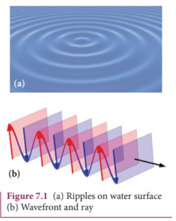
The shape of a wavefront observed at a point depends on the shape of the source and also the distance at which the source is located. A point source located at a finite distance gives spherical wavefronts. An extended (or) line source at finite distance gives cylindrical wavefronts. Any source that is located at infinity gives plane wavefront as shown in Figure 7.2.

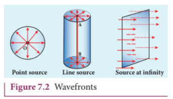

### 7.2.2 Huygens' Principle

Huygens principle is basically a geometrical construction which gives the shape of the wavefront at any time if we know its shape at \(t = 0\) . According to Huygens principle, each point on the wavefront behaves as the source of secondary wavelets spreading out in all directions with the speed of the wave. These are called as secondary wavelets. The envelope to all these wavelets gives the position and shape of the new wavefront at a later time. Thus, Huygens' principle explains the propagation of a wavefront.

The propagation of a spherical and plane wavefront can be explained using Huygens' principle. Let, \(AB\) be the wavefront at a time, \(t = 0\) . According to Huygens' principle, every point on \(AB\) acts as a source of secondary wavelet which travels with the speed of the wave (speed of light \(c\) ). To find the position of the wavefront after a time \(t\) , circles of radius equal to \(ct\) are drawn with points \(P\) , \(Q\) , \(R\) ... etc., as centers on \(AB\) . The forward envelope (or) the tangent \(A'B'\) of the small circles is the new wavefront at that instant \(t\) . The wavefront \(A'B'\) will be a spherical wavefront from a point object which is at a finite distance as shown in Figure 7.3(a) and it is a plane wavefront if the source of light is at a large distance (infinity) as shown in Figure 7.3(b).

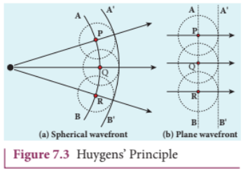

There is one shortcoming in the above Huygens’ construction for propagation of a wavefront. It could not explain the absence of backward wave which also arises in the above construction. According to electromagnetic wave theory, the backward wave is ruled out inherently. However, Huygens’ principle is a good diagrammatic construction which explains the propagation of the wavefront.

### 7.2.3 Proof for laws of reflection using Huygens' Principle

Let us consider a parallel beam of light is incident on a reflecting plane surface such as a plane mirror XY as shown in Figure 7.4. The incident wavefront is \(AB\) and the reflected wavefront is \(A^{\prime}B^{\prime}\) . These wavefronts are perpendicular to the incident rays \(L\) \(M\) and reflected rays \(L^{\prime}\) \(M^{\prime}\) respectively. By the time point \(A\) of the incident wavefront touches the reflecting surface, the point \(B\) is yet to travel a distance \(BB^{\prime}\) to touch the reflecting surface at \(B^{\prime}\) . When the point \(B\) touches the reflecting surface at \(B^{\prime}\) , the point \(A\) would have reached \(A^{\prime}\) . This is applicable to all the points on the wavefront. Thus, the reflected wavefront \(A^{\prime}B^{\prime}\) emanates as a plane wavefront. The two normals \(N\) and \(N^{\prime}\) are considered at the points where the rays \(L\) and \(M\) fall on the reflecting surface. As reflection happens in the same medium, the speed of light is same before and after

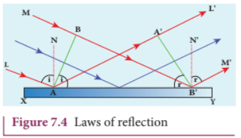

the reflection. The time taken for the light to travel from \(B\) to \(B^{\prime}\) and \(A\) to \(A^{\prime}\) are the same. Thus, the distance \(BB^{\prime}\) is equal to the distance \(AA^{\prime}\) ; \((AA^{\prime} = BB^{\prime})\) .

(i) The incident rays, the reflected rays and the normal are in the same plane.

(ii) Angle of incidence,

\[\angle i = \angle NAL = 90^{\circ} - \angle NAB = \angle BAB^{\prime}\]

Angle of reflection,

\[\angle r = \angle N^{\prime}B^{\prime}M^{\prime} = 90^{\circ} - \angle N^{\prime}B^{\prime}A^{\prime} = \angle A^{\prime}B^{\prime}A\]

For the two right angle triangles, \(\Delta ABB^{\prime}\) and \(\Delta B^{\prime}A^{\prime}A\) , the two right angles, \(\angle B\) and \(\angle A^{\prime}\) are equal, \((\angle B\) and \(\angle A^{\prime} = 90^{\circ})\) ; the two sides, \(AA^{\prime}\) and \(BB^{\prime}\) are equal, \((AA^{\prime} = BB^{\prime})\) ; the side \(AB^{\prime}\) is common. Thus, the two triangles are congruent. As per the property of congruency, the two angles, \(\angle BAB^{\prime}\) and \(\angle A^{\prime}B^{\prime}A\) must also be equal.

\[i = r \quad (7.2)\]

Hence, the laws of reflection are proved.

### 7.2.4 Proof for laws of refraction using Huygens' Principle

Let us consider a parallel beam of light is incident on a refracting plane surface \(XY\) such as a glass as shown in Figure 7.5. The incident wavefront \(AB\) is in rarer medium (1) and the refracted wavefront \(A^{\prime}B^{\prime}\) is in denser medium (2). These wavefronts are perpendicular to the incident rays \(L\) \(M\) and refracted rays \(L^{\prime},M^{\prime}\) respectively. By the time the point \(A\) of the incident wavefront touches the refracting surface, the point \(B\) is yet to travel a distance \(BB^{\prime}\) to touch the refracting surface at \(B^{\prime}\) . When the point \(B\) touches the refracting surface at \(B^{\prime}\) , the point \(A\) would have reached \(A^{\prime}\) in the other medium. This is applicable

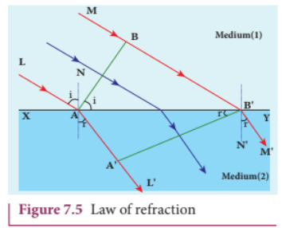

to all the points on the wavefront. Thus, the refracted wavefront \(A^{\prime}B^{\prime}\) emanates as a plane wavefront. The two normals \(N\) and \(N^{\prime}\) are considered at the points where the rays \(L\) and \(M\) fall on the refracting surface. As refraction happens from rarer medium (1) to denser medium (2), the speed of light is \(\nu_{1}\) and \(\nu_{2}\) before and after refraction and \(\nu_{1}\) is greater than \(\nu_{2}\) ( \(\nu_{1} > \nu_{2}\) ). But, the time taken \(t\) for the ray to travel from \(B\) to \(B^{\prime}\) is the same as the time taken for the ray to travel from \(A\) to \(A^{\prime}\) .

\[t = \frac{BB^{\prime}}{\nu_{1}} = \frac{AA^{\prime}}{\nu_{2}} (\mathrm{or}) \frac{BB^{\prime}}{AA^{\prime}} = \frac{\nu_{1}}{\nu_{2}}\]

(i) The incident rays, the refracted rays and the normal are in the same plane.

(ii) Angle of incidence,

\[i = \angle N A L = 90^{\circ} - \angle N A B = \angle B A B^{\prime}\]

Angle of refraction,

\[r = \angle N^{\prime}B^{\prime}M^{\prime} = 90^{\circ} - \angle N^{\prime}B^{\prime}A^{\prime} = \angle A^{\prime}B^{\prime}A\]

For the two right angle triangles \(\Delta ABB^{\prime}\) and \(\Delta AA^{\prime}B^{\prime}\)

\[\frac{\sin i}{\sin r} = \frac{BB^{\prime} / AB^{\prime}}{AA^{\prime} / AB^{\prime}} = \frac{BB^{\prime}}{AA^{\prime}} = \frac{\nu_{1}}{\nu_{2}} = \frac{\nu_{1}}{\nu_{2}}\times \frac{c}{c} = \frac{c / \nu_{2}}{c / \nu_{1}}\]

Here, \(c\) is speed of light in vacuum. The ratio \(c / \nu\) is a constant, called refractive index of the medium. The refractive index of medium (1) is, \(c / \nu_{1} = n_{1}\) and that of medium (2) is, \(c / \nu_{2} = n_{2}\) .

In ratio form,

\[\frac{\sin i}{\sin r} = \frac{n_{2}}{n_{1}} \quad (7.3)\]

In product form,

\[n_{1}\sin i = n_{2}\sin r \quad (7.4)\]

Hence, the laws of refraction are proved.

In the same way the laws of refraction can be proved for wavefront travelling from denser to rarer medium also.

The speed of light is inversely proportional to the refractive index of the medium \(\nu \propto 1 / n\) and also directly proportional to wavelength of light \(\nu \propto \lambda\) . Hence,

\[\frac{\lambda_{1}}{\lambda_{2}} = \frac{n_{2}}{n_{1}} \quad (7.5)\].

>If light of a particular frequency travels through different media, then, its frequency remains unchanged in all the media. Only the wavelength changes according to speed of light in that medium.

## EXAMPLE 7.1

The wavelength of light from sodium source in vacuum is \(5893\mathrm{\AA}\) .What are its (a) wavelength, (b) speed and (c) frequency when this light travels in water which has a refractive index of 1.33.

## Solution

The refractive index of vacuum, \(n_{1} = 1\)  
The wavelength in vacuum, \(\lambda_{1} = 5893\mathrm{\AA}\)  
The speed in vacuum, \(c = \nu_{1} = 3\times 10^{8}\mathrm{m}\mathrm{s}^{- 1}\)

The refractive index of water, \(n_2 = 1.33\)

The wavelength of light in water, \(\lambda_{2}\)

The speed of light in water, \(\nu_{2}\)

(a) The equation relating the wavelength and refractive index is,

\[\frac{\lambda_1}{\lambda_2} = \frac{n_2}{n_1}\]

Rewriting, \(\lambda_{2} = \frac{n_{1}}{n_{2}}\times \lambda_{1}\)

Substituting the values,

\[\lambda_{2} = \frac{1}{1.33}\times 5893\mathrm{\AA} = 4431\mathrm{\AA}\]

\[\lambda_{2} = 4431\mathrm{\AA}\]

(b) The equation relating the speed and refractive index is,

\[\frac{\nu_{1}}{\nu_{2}} = \frac{n_{2}}{n_{1}}\]

Rewriting, \(\nu_{2} = \frac{n_{1}}{n_{2}}\times \nu_{1}\)

Substituting the values,

\[\nu_{2} = \frac{1}{1.33}\times 3\times 10^{8} = 2.256\times 10^{8}\]

\[\nu_{2} = 2.256\times 10^{8}\mathrm{ms}^{-1}\]

(c) Frequency of light in vacuum is,

\[\nu_{1} = \frac{c}{\lambda_{1}}\]

Substituting the values,

\[\nu_{1} = \frac{3\times 10^{8}}{5893\times 10^{-10}} = 5.091\times 10^{14}\mathrm{Hz}\]

Frequency of light in water is, \(\nu_{2} = \frac{\nu}{\lambda_{2}}\)

Substituting the values,

\[\nu_{2} = \frac{2.256\times 10^{8}\mathrm{ms}^{-1}}{4431\times 10^{-10}} = 5.091\times 10^{14}\mathrm{Hz}\]

The results show that the frequency remains same in all media.

## 7.3 INTERFERENCE

The phenomenon of superposition of two light waves which produces increase in intensity at some points and decrease in intensity at some other points is called interference of light.

Superposition of waves refers to addition of waves. The concept of superposition of mechanical waves is studied in (XI Physics 11.7). When two waves simultaneously pass through a particle in a medium, the resultant displacement of that particle is the vector addition of the displacements due to the individual waves. The resultant displacement will be maximum or minimum depending upon the phase difference between the two superimposing waves. These concepts hold good for light as well.

Let us consider two light waves from the two sources \(S_{1}\) and \(S_{2}\) meeting at a point \(P\) as shown in Figure 7.6.

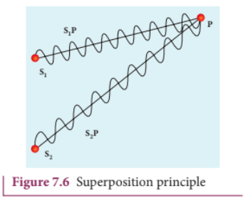

The wave from \(S_{1}\) at an instant \(t\) at \(P\) is,

\[y_{1} = a_{1}\sin \omega t \quad (7.6)\]

The wave from \(S_{2}\) at an instant \(t\) at \(P\) is,

\[y_{2} = a_{2}\sin (\omega t + \phi) \quad (7.7)\]

The two waves have different amplitudes \(a_{1}\) and \(a_{2}\) , same angular frequency \(\omega\) , and a phase difference of \(\phi\) between them. The resultant displacement will be given by,

\[y = y_{1} + y_{2} = a_{1}\sin \omega t + a_{2}\sin (\omega t + \phi) \quad (7.8)\]

The simplification of the above equation by using trigonometric identities as done in (XI Physics 11.7) gives,

\[y = A\sin (\omega t + \theta) \quad (7.9)\]

Where,  
\(A = \sqrt{a_{1}^{2} + a_{2}^{2} + 2a_{1}a_{2}\cos\phi}\) (7.10)  
\(\theta = \tan^{- 1}\frac{a_{2}\sin\phi}{a_{1} + a_{2}\cos\phi}\) (7.11)

The resultant amplitude is maximum,

\[A_{\mathrm{max}} = \sqrt{\left(a_{1} + a_{2}\right)^{2}};\mathrm{when}\ \phi = 0,\pm 2\pi ,\pm 4\pi \ldots , \quad (7.12)\]

The resultant amplitude is minimum,

\[A_{\mathrm{min}} = \sqrt{\left(a_{1} - a_{2}\right)^{2}};\mathrm{when}\ \phi = \pm \pi ,\pm 3\pi ,\pm 5\pi \ldots , \quad (7.13)\]

The intensity of light is proportional to square of amplitude,

\[I\propto A^{2} \quad (7.14)\]

Now, squaring equation (7.10) on both sides,

\[I = I_{1} + I_{2} + 2\sqrt{I_{1}I_{2}}\cos \phi \quad (7.15)\]

In equation (7.15) if the phase difference, \(\phi = 0,\pm 2\pi ,\pm 4\pi \ldots\) it corresponds to the condition for maximum intensity of light called constructive interference.

The resultant maximum intensity is,

\[\begin{array}{l}I_{\mathrm{max}}\propto \left(a_{1} + a_{2}\right)^{2}\\ I_{\mathrm{max}} = I_{1} + I_{2} + 2\sqrt{I_{1}I_{2}} \end{array} \quad (7.16)\]

In equation (7.15) if the phase difference, \(\phi = \pm \pi ,\pm 3\pi ,\pm 5\pi \ldots\) it corresponds to the condition for minimum intensity of light called destructive interference.

The resultant minimum intensity is,

\[\begin{array}{l}I_{\mathrm{min}}\propto \left(a_{1} - a_{2}\right)^{2}\\ I_{\mathrm{min}} = I_{1} + I_{2} - 2\sqrt{I_{1}I_{2}} \end{array} \quad (7.17)\]

As a special case, if \(a_{1} = a_{2} = a\) , then equation (7.10) becomes,

\[A = \sqrt{2a^{2} + 2a^{2}\cos\phi} = \sqrt{2a^{2}(1 + \cos\phi)}\]  
\[\qquad = \sqrt{2a^{2} \cdot 2\cos^{2}(\phi /2)}\]

\[A = 2a\cos (\phi /2) \quad (7.18)\]

\[I\propto 4a^{2}\cos^{2}(\phi /2)\quad \left[\because I\propto A^{2}\right] \quad (7.19)\]

\[I = 4I_{0}\cos^{2}(\phi /2)\quad \left[\because I_{0}\propto a^{2}\right] \quad (7.20)\]

\[I_{\mathrm{max}} = 4I_{0}\ \mathrm{when},\ \phi = 0,\pm 2\pi ,4\pi \ldots , \quad (7.21)\]

\[I_{\mathrm{min}} = 0\ \mathrm{when},\ \phi = \pm \pi ,\pm 3\pi ,\pm 5\pi \ldots , \quad (7.22)\]

We conclude that the phase difference \(\phi\) between the two waves decides the intensity of light at that point where the two waves meet.

## EXAMPLE 7.2

Two light sources with amplitudes 5 units and 3 units respectively interfere with each other. Calculate the ratio of maximum and minimum intensities.

## Solution

Amplitudes, \(a_{1} = 5\) , \(a_{2} = 3\)

Resultant amplitude,

\[A = \sqrt{a_{1}^{2} + a_{2}^{2} + 2a_{1}a_{2}\cos\phi}\]

Resultant amplitude is maximum when,

\[\phi = 0,\ \cos 0 = 1,\ A_{\mathrm{max}} = \sqrt{a_1^2 + a_2^2 + 2a_1a_2}\]  
\[A_{\mathrm{max}} = \sqrt{(a_1 + a_2)^2} = \sqrt{(5 + 3)^2} = \sqrt{(8)^2}\]  
\[A_{\mathrm{max}}= 8\ \text{units}\]

Resultant amplitude is minimum when,

\[\phi = \pi ,\ \cos \pi = -1,\ A_{\mathrm{min}} = \sqrt{a_1^2 + a_2^2 - 2a_1a_2}\]  
\[A_{\mathrm{min}} = \sqrt{(a_1 - a_2)^2} = \sqrt{(5 - 3)^2} = \sqrt{(2)^2}\]  
\[A_{\mathrm{min}}= 2\ \text{units}\]  
\[I\propto A^2\]

\[\frac{I_{\mathrm{max}}}{I_{\mathrm{min}}} = \frac{(A_{\mathrm{max}})^2}{(A_{\mathrm{min}})^2}\]

Substituting,

\[\frac{I_{\mathrm{max}}}{I_{\mathrm{min}}} = \frac{(8)^2}{(2)^2} = \frac{64}{4} = 16\ \text{(or)}\]  
\[I_{\mathrm{max}}:I_{\mathrm{min}} = 16:1\]

## EXAMPLE 7.3

Two light sources of equal amplitudes interfere with each other. Calculate the ratio of maximum and minimum intensities.

## Solution

Let the amplitude be \(a\) .

The intensity is, \(I\propto 4a^2\cos^2 (\phi /2)\)

\[\mathrm{or}\ I = 4I_0\cos^2 (\phi /2)\]

Resultant intensity is maximum when,

\[\phi = 0,\ \cos 0 = 1,\ I_{\mathrm{max}}\propto 4a^2\]

Resultant amplitude is minimum when,

\[\phi = \pi ,\ \cos (\pi /2) = 0,\ I_{\mathrm{min}} = 0\]

\[I_{\mathrm{max}}:I_{\mathrm{min}} = 4a^2:0\]

## EXAMPLE 7.4

Two light sources have intensity of light as \(I_{0}\) . What is the resultant intensity at a point where the two light waves have a phase difference of \(\pi /3\) ?

## Solution

Let the intensities be \(I_{0}\) .

The resultant intensity is, \(I = 4I_{0}\cos^{2}(\phi /2)\)

Resultant intensity when, \(\phi = \pi /3\) , is

\[I = 4I_{0}\cos^{2}(\pi /6)\]

\[I = 4I_{0}\left(\sqrt{3} /2\right)^{2} = 3I_{0}\]

### 7.3.1 Phase difference and path difference

Phase is the angular position of vibration when a wave is progresses, there is a relation between the phase of the vibration and the path travelled by the wave. We can express the phase in terms of path and vice versa. In the path of the wave, one wavelength \(\lambda\) corresponds to a phase of \(2\pi\) as shown in Figure 7.7. A path difference \(\delta\) corresponds to a phase difference \(\phi\) as given by the equation,

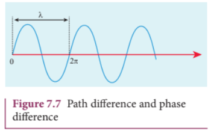

\[\delta = \frac{\lambda}{2\pi}\times \phi \ \ (\mathrm{or})\ \ \phi = \frac{2\pi}{\lambda}\times \delta \quad (7.23)\]

For constructive interference, the phase difference should be, \(\phi = 0,2\pi ,4\pi \ldots\) Hence,

the path difference must be, \(\delta = 0, \lambda , 2\lambda \ldots\) In general, the integral multiples of \(\lambda\) .

\[\delta = n\lambda \ \mathrm{where},\ n = 0, 1, 2, 3 \ldots \quad (7.24)\]

For destructive interference, the phase difference should be, \(\phi = \pi , 3\pi , 5\pi \ldots\) Hence, the path difference must be, \(\delta = \frac{\lambda}{2}, \frac{3\lambda}{2}\) In general, the half integral multiples of \(\lambda\) .

\[\delta = (2n - 1)\frac{\lambda}{2} \ \mathrm{where},\ n = 1, 2, 3 \ldots \quad (7.25)\]

## EXAMPLE 7.5

The wavelength of a light is \(450 \mathrm{nm}\) . How much phase it will differ for a path of \(3 \mathrm{mm}\) ?

## Solution

Wavelength, \(\lambda = 450 \mathrm{nm} = 450 \times 10^{- 9} \mathrm{~m}\)

Path difference, \(\delta = 3 \mathrm{mm} = 3 \times 10^{- 3} \mathrm{~m}\)

Relation between phase difference and path difference, \(\phi = \frac{2\pi}{\lambda} \times \delta\)

Substituting,

\[\phi = \frac{2\pi}{450 \times 10^{-9}} \times 3 \times 10^{-3} = \frac{\pi}{75} \times 10^{6}\]  
\[\phi = \frac{\pi}{75} \times 10^{6} \mathrm{rad} = 4.19 \times 10^{4} \mathrm{rad}.\]

### 7.3.2 Coherent sources

Two light sources are said to be coherent if they produce waves which have same phase or constant phase difference, same frequency or wavelength (monochromatic), same waveform and preferably same amplitude. Coherence is a property of waves that enables to obtain stationary interference patterns.

Two independent monochromatic sources can never be coherent, because they may emit waves of same frequency and same amplitude, but not with same phase. This is because, atoms while emitting light, produce change in phase due to thermal vibrations. Hence, these sources are said to be incoherent sources.

To obtain coherent light waves, we have the following three techniques.

(i) Wavefront division  
(ii) Intensity (or) Amplitude division  
(iii) Source and Images. 

##### (i) Wavefront division: 
This is the most commonly used method for producing coherent sources. We know a point source produces spherical wavefronts. All the points on the wavefront are at the same phase. If two points are chosen on the wavefront by using a double slit, the two points will act as coherent sources as shown in Figure 7.8.

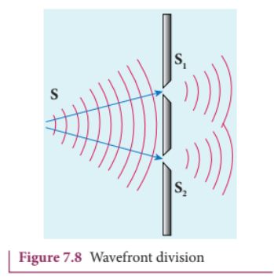

##### (ii) Intensity (or) Amplitude division: 
If we allow light to pass through a partially silvered mirror (beam splitter), both reflection and refraction take place simultaneously. As the two light beams are obtained from the same light source, the two divided light beams will be coherent beams. They will be either in- phase or at constant phase difference as shown in Figure 7.9. Instruments like Michelson's interferometer, Fabray- Perrot etalon work on this principle.

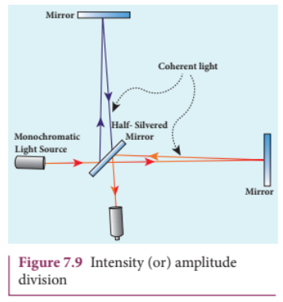

##### (iii) Source and Images: 
In this method a source and its images will act as a set of coherent sources, because the source and its image will have waves in- phase (or) constant phase difference as shown in Figure 7.10. The Instrument, Fresnel's biprism uses two virtual images of the source as two coherent sources and the instrument, Lloyd's mirror uses a source and its one virtual image as two coherent sources.

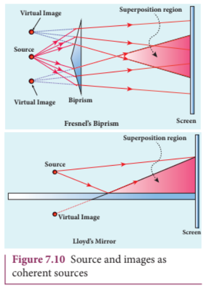

### 7.3.3 Double slit as coherent sources

Double slit uses the principle of wavefront division. Two slits \(S_{1}\) and \(S_{2}\) illuminated by a single monochromatic source \(S\) act as two coherent sources. The waves from them travel in the same medium and superpose. The constructive and destructive interference formed by them are shown in Figure 7.11(a). The crests of the waves are shown by thick continuous lines and troughs are shown by broken lines in Figure 7.11(b).

At points where the crest of one wave meets the crest of the other wave (or) the trough of one wave meets the trough of the other wave, the waves are in- phase. Hence, the displacement is maximum and these points appear bright as a result of this constructive interference.

At points where the crest of one wave meets the trough of the other wave and vice- versa, the waves are out- of- phase. Hence, the displacement is minimum and these points appear dark as a result of this destructive interference.

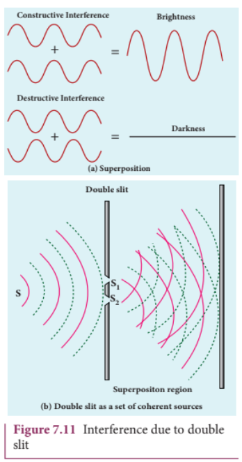

On a screen the intensity of light will be alternative maximum and minimum strips i.e. bright and dark bands which are referred as interference fringes.

### 7.3.4 Young's double slit experiment

 ##### Experimental setup

Thomas Young, a British Physicist in 1801 used an opaque screen with two small openings called double slit \(S_{1}\) and \(S_{2}\) kept equidistance from a source \(S\) as shown in Figure 7.12. The width of each slit is about \(0.03\mathrm{mm}\) and they are separated by a distance of about \(0.3\mathrm{mm}\) . As \(S_{1}\) and \(S_{2}\) are equidistant from \(S\) the same wavefront is cut by \(S_{1}\) and \(S_{2}\) . The light waves at \(S_{1}\) and \(S_{2}\) are in- phase. So, \(S_{1}\) and \(S_{2}\) act as coherent sources which is the requirement for obtaining interference pattern.

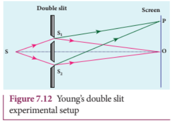

Wavefronts from \(S_{1}\) and \(S_{2}\) spread out and overlap on the other side of the double slit. When a screen is placed at a distance of about \(1\mathrm{m}\) from the slits, alternate bright and dark fringes which are equally spaced appear on the screen. These are called interference fringes (or) bands. Using an eyepiece, the fringes can be seen directly. At the center point O on the screen, the waves from \(S_{1}\) and \(S_{2}\) travel equal distances and arrive in- phase as shown in Figure 7.12. These two waves constructively interfere and a bright fringe is observed at O. This is called central bright fringe. When one of the slits is closed, the fringes disappear and there is uniform illumination on the screen. This shows clearly that the bands are due to interference.

##### Equation for path difference

The schematic diagram of the experimental setup is shown in Figure 7.13.

Let d be the distance between the double slits \(S_{1}\) and \(S_{2}\) which act as coherent sources of wavelength \(\lambda\) . A screen is placed parallel to the double slit at a distance \(D\) from it. The mid- point of \(S_{1}\) and \(S_{2}\) is \(C\) and the mid- point of the screen \(O\) is equidistant from \(S_{1}\) and \(S_{2}\) . \(P\) is any point at a distance \(y\) from \(O\) . The waves from \(S_{1}\) and \(S_{2}\) meet at \(P\) either in- phase or out- of- phase depending upon the path difference between the two waves.

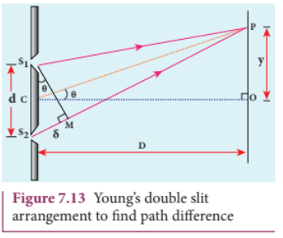

The path difference \(\delta\) between the light waves from \(S_{1}\) and \(S_{2}\) to the point \(P\) is, \(\delta = S_{2}P - S_{1}P\)

A perpendicular is dropped from the point \(S_{1}\) to the line \(S_{2}P\) at \(M\) to find the path difference more precisely.

\[\delta = S_{2}P - MP = S_{2}M \quad (7.26)\]

The angular position of the point \(P\) from \(C\) is \(\theta\) . \(\angle OCP = \theta\) .

From the geometry, the angles \(\angle OCP\) and \(\angle S_{2}S_{1}M\) are equal.

\[\angle OCP = \angle S_{2}S_{1}M = \theta .\]

In right angle triangle \(\Delta S_{1}S_{2}M\) , the path difference, \(S_{2}M = d \sin \theta\)

\[\delta = d\sin \theta \quad (7.27)\]

If the angle \(\theta\) is small, \(\sin \theta \approx \tan \theta \approx \theta\)

From the right angle triangle \(\Delta OCP\) , \(\tan \theta = \frac{y}{D}\)

\[\mathrm{The~path~difference},\ \delta = \frac{d y}{D} \quad (7.28)\]

Based on the condition of the path difference, the point \(P\) may have a bright (or) dark fringe.

##### Condition for bright fringe (or) maxima

The condition for the point \(P\) to have a constructive interference (or) be a bright fringe is,

\[\mathrm{Path~difference},\ \delta = n\lambda\]  
\[\mathrm{where},\ n = 0,1,2,\ldots\]  
\[\therefore \frac{d y}{D} = n\lambda\]

\[y = n\frac{\lambda D}{d}\quad (\mathrm{or})\quad y_{n} = n\frac{\lambda D}{d} \quad (7.29)\]

This is the condition for the point \(P\) to have a bright fringe. The distance \(y_{n}\) is the distance of the \(n^{\mathrm{th}}\) bright fringe from the point \(O\) .

##### Condition for dark fringe (or) minima

The condition for the point \(P\) to have a destructive interference (or) be a dark fringe is,

\[\mathrm{Path~difference},\ \delta = (2n - 1)\frac{\lambda}{2}\]

\[\mathrm{where},\ n = 1,2,3\ldots\]

\[\therefore \frac{d y}{D} = (2n - 1)\frac{\lambda}{2}\]

\[y = \frac{(2n - 1)\lambda D}{2} \ \ (\mathrm{or})\ \ y_{n} = \frac{(2n - 1)\lambda D}{2d} \quad (7.30)\]

This is the condition for the point P to have a dark fringe. The distance \(y_{n}\) is the distance of the \(n^{\mathrm{th}}\) dark fringe from the point O. The formation of bright and dark fringes is shown in Figure 7.14.

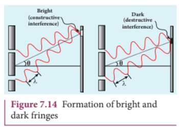

This shows that on the screen, alternate bright and dark fringes are seen on either side of the central bright fringe. The central bright is referred as \(0^{\mathrm{th}}\) bright followed by \(1^{\mathrm{st}}\) dark and \(1^{\mathrm{st}}\) bright and then \(2^{\mathrm{nd}}\) dark and \(2^{\mathrm{nd}}\) bright and so on, on either side of \(O\) successively as shown in Figure 7.15.

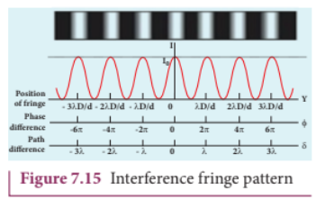

##### Equation for bandwidth

The bandwidth \(\beta\) is defined as the distance between any two consecutive bright (or) dark fringes.

The distance between \((n + 1)^{\mathrm{th}}\) and \(n^{\mathrm{th}}\) consecutive bright fringes from \(O\) is given by,

\[\beta = y_{(n + 1)} - y_n = \left((n + 1)\frac{\lambda D}{d}\right) - \left(n\frac{\lambda D}{d}\right)\]

\[\beta \ \mathrm{for~bright},\ \beta = \frac{\lambda D}{d} \quad (7.31)\]

Similarly, the distance between \((n + 1)^{\mathrm{th}}\) and \(n^{\mathrm{th}}\) consecutive dark fringes from \(O\) is given by,

\[\beta = y_{(n + 1)} - y_n = \left(\frac{(2(n + 1) - 1)}{2}\frac{\lambda D}{d}\right) - \left(\frac{(2n - 1)}{2}\frac{\lambda D}{d}\right)\]

\[\beta \ \mathrm{for~dark},\ \beta = \frac{\lambda D}{d} \quad (7.32)\]

From Equations (7.31) and (7.32) we understand that the bright and dark fringes are of same width equally spaced on either side of the central bright fringe.

##### Conditions for obtaining clear and broad interference fringes:

(i) The distance \(D\) between the screen and double slit should be as large as possible.  
(ii) The wavelength \(\lambda\) of light used must be as long as possible. 
(iii) The distance \(d\) between the two slits must be as small as possible.

## EXAMPLE 7.6

In Young's double slit experiment, the two slits are \(0.15\mathrm{mm}\) apart. The light source has a wavelength of \(450\mathrm{nm}\) . The screen is \(2\mathrm{m}\) away from the slits.

(a) Find the distance of the second bright fringe and also third dark fringe from the central maximum.

(b) Find the fringe width.

(c) How will the fringe pattern change if the screen is moved away from the slits?

(d) What will happen to the fringe width if the whole setup is immersed in water of refractive index \(4 / 3\) .

## Solution

\(d = 0.15 \mathrm{mm} = 0.15 \times 10^{- 3} \mathrm{m};\ D = 2 \mathrm{m};\ \lambda = 450 \mathrm{nm} = 450 \times 10^{- 9} \mathrm{m};\ RI = 4 / 3\)

(a) Equation for \(n^{\mathrm{th}}\) bright fringe,

\[y_{n} = n\frac{\lambda D}{d}\]

Distance of \(2^{\mathrm{nd}}\) bright fringe,

\[y_{2} = 2\times \frac{450\times 10^{-9}\times 2}{0.15\times 10^{-3}}\]

\[y_{2} = 12\times 10^{-3}\mathrm{m} = 12\mathrm{mm}\]

Equation for \(n^{\mathrm{th}}\) dark fringe,

\[y_{n} = \frac{(2n - 1)\lambda D}{2d}\]

Distance of \(3^{\mathrm{rd}}\) dark fringe,

\[y_{3} = \frac{5}{2}\times \frac{450\times 10^{-9}\times 2}{0.15\times 10^{-3}}\]

\[y_{3} = 15\times 10^{-3}\mathrm{m} = 15\mathrm{mm}\]

(b) Equation for fringe width, \(\beta = \frac{\lambda D}{d}\)

\[\mathrm{Substituting,}\ \beta = \frac{450\times 10^{-9}\times 2}{0.15\times 10^{-3}}\]

\[\beta = 6\times 10^{-3}\mathrm{m} = 6\mathrm{mm}\]

(c) The fringe width will increase as D is increased, \(\beta = \frac{\lambda D}{d}\) (or) \(\beta \propto D\)

(d) The fringe width will decrease as the setup is immersed in water of refractive index 4/3

\[\beta = \frac{\lambda D}{d}\qquad \mathrm{(or)}\qquad \beta \propto \lambda\]

The wavelength will decrease in a medium. Hence, \(\beta \propto \lambda\) and \(\beta^{\prime}\propto \lambda^{\prime}\)

We know that, \(\lambda^{\prime} = \frac{\lambda}{RI}\)

\[\frac{\beta^{\prime}}{\beta} = \frac{\lambda^{\prime}}{\lambda} = \frac{\lambda / RI}{\lambda} = \frac{1}{RI}\quad (\mathrm{or})\quad \beta^{\prime} = \frac{\beta}{RI} = \frac{6\times 10^{-3}}{4 / 3}\]

\[\beta^{\prime} = 4.5\times 10^{-3}\mathrm{m} = 4.5\mathrm{mm}\]

### 7.3.5 Interference in white light (polychromatic light)

When a white light (polychromatic light) is used in interference experiment, coloured fringes of varied thickness will be formed on the screen. This is because, different colours have different wavelengths. However, the central fringe (or) \(0^{\mathrm{th}}\) fringe will always be bright and white in colour, because all the colours falling at the point O will have no path difference with each other. Hence, only constructive interference is possible at O for all the colours.

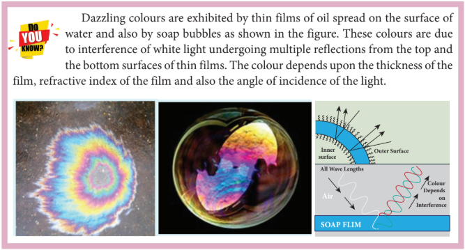
## EXAMPLE 7.7

Lights of two wavelengths \(560 \mathrm{nm}\) and \(420 \mathrm{nm}\) are used in Young's double slit experiment. Find the least distance from the central fringe where the bright fringes of the two wavelengths coincide. Given \(D = 1 \mathrm{m}\) and \(d = 3 \mathrm{mm}\) .

## Solution

\[\lambda_{1} = 560 \mathrm{nm} = 560\times 10^{-9}\mathrm{m}\]

\[\lambda_{2} = 420 \mathrm{nm} = 420\times 10^{-9}\mathrm{m}\]

\[D = 1\mathrm{m};\ d = 3\mathrm{mm} = 3\times 10^{-3}\mathrm{m}\]

Here, \(n\) and \(\lambda\) are inversely proportional for a given \(y\) .

Here, \(n^{\mathrm{th}}\) order bright fringe of longer wavelength \(\lambda_{1}\) coincides with \((n + 1)^{\mathrm{th}}\) order bright fringe of shorter wavelength \(\lambda_{2}\) .

Equation for \(n^{\mathrm{th}}\) bright fringe is, \(y_{n} = n\frac{\lambda D}{d}\)

\[\mathrm{Here},\ n\frac{\lambda_{1}D}{d} = (n + 1)\frac{\lambda_{2}D}{d}\qquad (\mathrm{as}\ \lambda_{1} > \lambda_{2})\]

\[n\lambda_{1} = (n + 1)\lambda_{2}\ \ (\mathrm{or})\ \ \frac{\lambda_{1}}{\lambda_{2}} = \frac{(n + 1)}{n};\ 1 + \frac{1}{n} = \frac{\lambda_{1}}{\lambda_{2}}\]

\[1 + \frac{1}{n} = \frac{560\times 10^{-9}}{420\times 10^{-9}}\quad (\mathrm{or})\quad 1 + \frac{1}{n} = \frac{4}{3}\]

\[\frac{1}{n} = \frac{4}{3} - 1 = \frac{1}{3} \Rightarrow n = 3\]

Thus, third bright fringe of light of wavelength \(560 \mathrm{nm}\) coincides with the fourth bright fringe of light of wavelength \(420 \mathrm{nm}\) .

The least distance from the central fringe, \(y = n \frac{\lambda_1 D}{d}\)

Substituting, \(y = 3 \times \frac{560 \times 10^{-9} \times 1}{3 \times 10^{-3}} = 560 \times 10^{-6} \mathrm{m} = 0.560 \mathrm{mm}\)

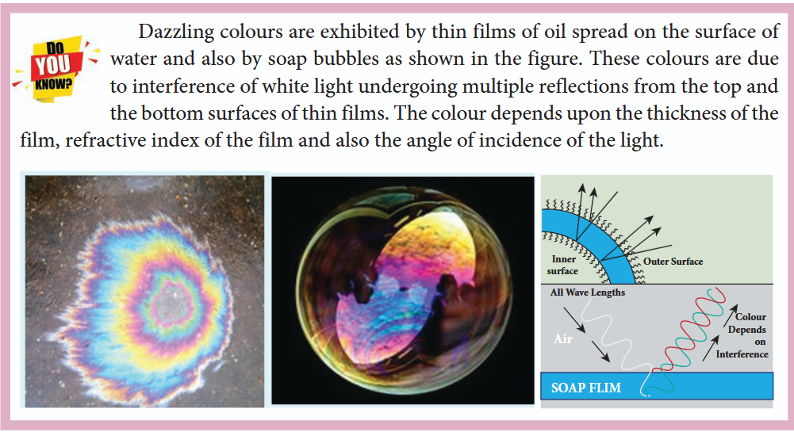

## 7.3.6 Interference in thin films

Let us consider a thin film of transparent material of refractive index µ (here refractive index is not represented as n, not to confuse with order of fringe n) and thickness d. A parallel beam of light is incident on the film at an angle i as shown in Figure 7.16. The wave is divided into two parts at the point of incidence, as reflected and refracted lights. The refracted part, which enters into the film, again gets divided at he lower surface into two parts; one is transmitted out of the film and the other is reflected back into the film. The reflected as well as refracted parts are further formed as multiple reflections take place inside the film. The interference occurs in both the reflected and transmitted light.

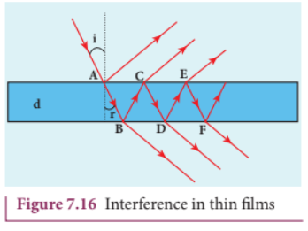

##### For transmitted light

Consider a thin film of thickness \(d\) and refractive index \(\mu\) . A ray of light from source \(S\) is partially reflected at the top surface \(A\) and partially refracted. The refracted ray travels inside the film and gets reflected at \(B\) and transmitted at \(C\) as shown in Figure 7.16. The ray \(AE\) is the one reflected from the top surface. The ray \(CF\) is the one transmitted from the bottom surface. Both rays \(AE\) and \(CF\) are derived from the same incident ray. Hence, they are coherent.

Let us consider the path difference between the rays \(AE\) and \(CF\) . The ray \(CF\) travels from \(A\) to \(B\) to \(C\) up to \(B\) where the splitting occurred. The extra path travelled by the wave transmitted from \(C\) is the path inside the film, \(AB + BC\) . If we approximate the incidence to be nearly normal \((i = 0)\) and the film of small thickness, then the points \(B\) and \(C\) are very close to each other. The extra distance travelled by the wave is approximately twice thickness of the film, \(AB + BC = 2d\) . As this extra path is traversed inside the medium of refractive index \(\mu\) , the optical path difference is, \(\delta = 2\mu d\) .

The condition for constructive interference in transmitted ray is,

\[2\mu d = n\lambda \quad (7.33)\]

Similarly, the condition for destructive interference in transmitted ray is,

\[2\mu d = (2n - 1)\frac{\lambda}{2} \quad (7.34)\]

##### For reflected light

It is experimentally and theoretically proved that a wave while travelling in a rarer medium and getting reflected by a denser medium, undergoes a phase change of \(\pi\) . Hence, an additional path difference of \(\lambda /2\) should be considered for reflected light.

Let us consider the path difference between the light reflected by the upper surface at \(A\) and the other coming out at \(C\) after passing through the film. The additional path travelled by the light coming out from \(C\) is the path inside the film, \(AB + BC\) . For near normal incidence and film of small thickness, this distance could be approximated as, \(AB + BC = 2d\) . As this extra path is travelled in the medium of refractive index \(\mu\) , the optical path difference is, \(\delta = 2\mu d\) .

The condition for constructive interference for reflected ray is,

\[2\mu d + \frac{\lambda}{2} = n\lambda \ \ (\mathrm{or})\ \ 2\mu d = (2n - 1)\frac{\lambda}{2} \quad (7.35)\]

The additional path difference \(\lambda /2\) is due to the phase change of \(\pi\) in rarer to denser reflection taking place at \(A\) .

The condition for destructive interference for reflected ray is,

\[2\mu d + \frac{\lambda}{2} = (2n + 1)\frac{\lambda}{2} \ \ (\mathrm{or})\ \ 2\mu d = n\lambda \quad (7.36)\]

>If the incidence is not nearly normal but at an angle of incidence \(i\) which has an angle of refraction \(r\) , then the expression \(2\mu d\) is to be replaced with \(2\mu d \cos r\) .

## EXAMPLE 7.8

Find the minimum thickness of a film of refractive index 1.25, which will strongly reflect the light of wavelength 589 nm. Also find the minimum thickness of the film to be anti- reflecting.

## Solution

\[\lambda = 589 \mathrm{nm} = 589 \times 10^{-9} \mathrm{m}\]

For the film to have strong reflection, the reflected waves should interfere constructively. The least optical path difference introduced by the film should be \(\lambda /2\) . The optical path difference between the waves reflected from the two surfaces of the film is \(2\mu d\) . Thus, for strong reflection, \(2\mu d = \lambda /2\) [As given in equation (7.35) with \(n = 1\) ]

\[\mathrm{Rewriting},\ d = \frac{\lambda}{4\mu}\]

\[\mathrm{Substituting},\ d = \frac{589 \times 10^{-9}}{4 \times 1.25} = 117.8 \times 10^{-9}\]

\[d = 117.8 \times 10^{-9} \mathrm{m} = 117.8 \mathrm{nm}\]

For the film to be anti- reflecting, the reflected rays should interfere destructively. The least optical path difference introduced by the film should be \(\lambda\) . The optical path difference between the waves reflected from the two surfaces of the film is \(2\mu d\) . For destructive reflection, \(2\mu d = \lambda\) [As given in equation (7.36) with \(n = 1\) ].

Rewriting, \(d = \frac{\lambda}{2\mu}\)  
Substituting, \(d = \frac{589\times 10^{-9}}{2\times 1.25} = 235.6\times 10^{- 9}\)  
\(d = 235.6\times 10^{- 9} \mathrm{m} = 235.6\mathrm{nm}\)

## 7.4 DIFFRACTION

Diffraction is a characteristic of all waves, including sound waves. Diffraction is bending of waves around sharp edges into the geometrically shadowed region.

This is a violation to the rectilinear propagation of light we have studied in ray optics. But, the diffraction is prominent only when the size of the obstacle is comparable to the wavelength of light. This is the reason why sound waves get diffracted prominently by obstacles like doors, windows, buildings etc. The wavelength of sound wave is large and comparable to the geometry of these obstacles. But the diffraction in light is more pronounced when the obstacle size is of the order of wavelength of light.

### 7.4.1 Fresnel and Fraunhofer diffractions

Based on the type of wavefront which undergoes diffraction, it could be classified as Fresnel and Fraunhofer diffractions. The differences between Fresnel and Fraunhofer diffractions are shown in Table 7.1.

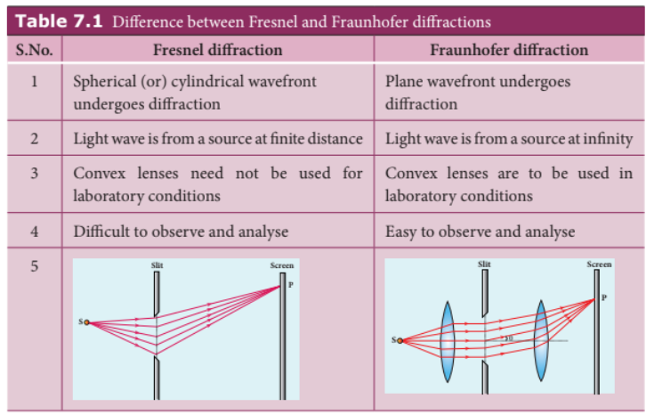

As Fraunhofer diffraction is easy to observe and analyse, let us take it up for further discussions.

### 7.4.2 Diffraction in single slit

Let a parallel beam of light (plane wavefront) fall normally on a single slit AB of width a as shown in Figure 7.17. The diffracted beam falls on a screen kept at a distance D from the slit. The center of the slit is C. A straight line through C perpendicular to the plane of slit meets the center of the screen at O. Consider any point P on the screen. All the light reaching the point P from different points on the slit make an angle θ with the normal CO. All the light waves coming from different points on the slit interfere at point P (and other points) on the screen to give the resultant intensities. The point P is in the geometrically shadowedregion, up to which the central maximum is spread due to diffraction as shown Figure 7.17. We need to give the condition for the point P to be of various minima. 

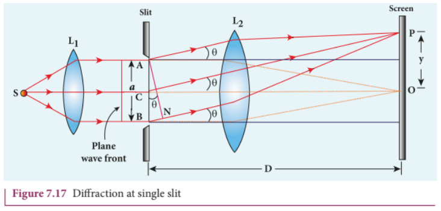

The basic idea is to divide the slit into even number of smaller parts. Then, add their contributions at P with the proper path difference to show that destructive interference takes place at that point to make it minimum. To explain maximum, the slit is divided into odd number of parts.

##### Condition for \(P\) to be first minimum

Let us divide the slit \(AB\) into two halves \(AC\) and \(CB\). Now the width of each part is \(a / 2\). We have different points on the slit which are separated by the same width \(a / 2\) called as corresponding points. This is shown in Figure 7.18.

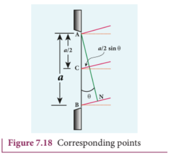

The light waves from different corresponding points meet at point P and interfere destructively to make it a minimum. The path difference \(\delta\) between the waves from these corresponding points is \(\delta = \frac{a}{2}\sin \theta\)

The condition for P to be first minimum is \(\frac{a}{2}\sin \theta = \frac{\lambda}{2}\)

$$a\sin \theta = \lambda \quad (7.37)$$

##### Condition for \(P\) to be second minimum

Let us divide the slit \(AB\) into four equal parts. Now the width of each part is \(a / 4\). We have several corresponding points on the slit which are separated by the same width \(a / 4\). The path difference \(\delta\) between the waves from these corresponding points is \(\delta = \frac{a}{4}\sin \theta\)

The condition for \(P\) to be second minimum is \(\frac{a}{4}\sin \theta = \frac{\lambda}{2}\)

$$a\sin \theta = 2\lambda \quad (7.38)$$

##### Condition for \(P\) to be third minimum

The same way the slit is divided in to six equal parts to explain the third minimum. The condition for \(P\) to be third minimum is \(\frac{a}{6}\sin \theta = \frac{\lambda}{2}\)

$$a\sin \theta = 3\lambda \quad (7.39)$$

##### Condition for \(P\) to be \(n^{\mathrm{th}}\) minimum

Dividing the slit into \(2n\) number of (even number of) equal parts makes the light produced by one of the corresponding points to be cancelled by its counterpart. Thus, the condition for \(n^{\mathrm{th}}\) minimum is \(\frac{a}{2n}\sin \theta = \frac{\lambda}{2}\)

$$a\sin \theta = n\lambda \quad (7.40)$$

Where \(n = 1, 2, 3...\) is the order of diffraction minimum.

##### Condition for maxima

For points of maxima, the slit is to be divided in to odd number of equal parts so that one part remains un-cancelled making the point \(P\) appear bright.

The condition for first maximum is \(\frac{a}{3}\sin \theta = \frac{\lambda}{2}\) (or) \(a\sin \theta = \frac{3\lambda}{2} \quad (7.41)\)

The condition for second maximum is \(\frac{a}{5}\sin \theta = \frac{\lambda}{2}\) (or) \(a\sin \theta = \frac{5\lambda}{2} \quad (7.42)\)

The condition for third maximum is \(\frac{a}{7}\sin \theta = \frac{\lambda}{2}\) (or) \(a\sin \theta = \frac{7\lambda}{2} \quad (7.43)\)

In the same way, condition for \(n^{\mathrm{th}}\) maximum is

$$a\sin \theta = (2n + 1)\frac{\lambda}{2} \quad (n^{\mathrm{th}}\text{ maximum}) \quad (7.44)$$

Where \(n = 0, 1, 2, 3....\) is the order of diffraction maximum.

The central maximum is called \(0^{\mathrm{th}}\) order maximum. The points of the maximum intensity lie nearly midway between the successive minima.

>Here, sin θ gives the angular spread of diffraction from the central reference line. We can replace sin θ in the above equations with y / D. It is possible because θ is small. Now, we can approximate,
sinθ=tanθ=y/D  Where, y is the position of minimum (or) maximum on the screen from its center and D is the distance between the slit and the screen.

## EXAMPLE 7.9

Light of wavelength \(500~\mathrm{nm}\) passes through a slit of \(0.2\mathrm{mm}\) wide. The diffraction pattern is formed on a screen \(60~\mathrm{cm}\) away. Determine the,

(a) angular spread of central maximum
(b) the distance between the central maximum and the second minimum.

### Solution

\(\lambda = 500\mathrm{nm} = 500\times 10^{-9}\mathrm{m}\)

\(a = 0.2\mathrm{mm} = 0.2\times 10^{-3}\mathrm{m}\)

\(D = 60\mathrm{cm} = 60\times 10^{-2}\mathrm{m}\)

(a) Equation for diffraction minimum is \(a\sin \theta = n\lambda\)

The central maximum is spread up to the first minimum. Hence, \(n = 1\)

.png)

Rewriting, \(\sin \theta = \frac{\lambda}{a}\) (or) \(\theta = \sin^{- 1}\left(\frac{\lambda}{a}\right)\)

Substituting,

\(\theta = \sin^{-1}\left(\frac{500\times 10^{-9}}{0.2\times 10^{-3}}\right) = \sin^{-1}\left(2.5\times 10^{-3}\right) \approx 0.0025 \text{ rad}\)

(b) To find the value of \(y_{1}\) from the central maximum, which is spread up to first minimum with \(n = 1\)

\(a\sin \theta = \lambda\)

As \(\theta\) is very small, \(\sin \theta \approx \tan \theta = \frac{y_{1}}{D}\)

\(a\frac{y_{1}}{D} = \lambda\) rewriting, \(y_{1} = \frac{\lambda D}{a}\)

Substituting,

\(y_{1} = \frac{500\times 10^{-9}\times 60\times 10^{-2}}{0.2\times 10^{-3}} = 1.5\times 10^{-3} = 1.5\mathrm{mm}\)

To find the value of \(y_{2}\) for second minimum with \(n = 2\)

\(a\sin \theta = 2\lambda\)

\(a\frac{y_{2}}{D} = 2\lambda\) rewriting, \(y_{2} = \frac{2\lambda D}{a}\)

Substituting,

\(y_{2} = \frac{2\times 500\times 10^{-9}\times 60\times 10^{-2}}{0.2\times 10^{-3}} = 3\times 10^{-3} = 3\mathrm{mm}\)

The distance between the central maximum and second minimum is \(y_{2} - y_{1} = 3\mathrm{mm} - 1.5\mathrm{mm} = 1.5\mathrm{mm}\)

.png)

>The above calculation shows that the diffraction pattern produced by a single slit, has equal widths of maxima. Only the width of central maximum is double as it is spread on both the sides. But, the intensity falls rapidly for higher order diffraction fringes.

## EXAMPLE 7.10

**Problem:** A monochromatic light of wavelength $5000 \text{ Å}$ passes through a single slit producing diffraction pattern for the central maximum as shown in the figure. Determine the width of the slit.

<<<<<<< HEAD
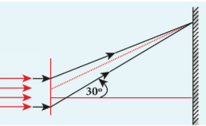
=======
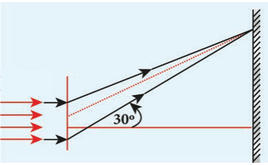
>>>>>>> c70a444eae204de8a4598387af1b71c7597ad8d3

**Given:**
- Wavelength, $\lambda = 5000 \text{ Å} = 5000 \times 10^{-10} \text{ m} = 5 \times 10^{-7} \text{ m}$
- From the figure (typical values for first minimum): $\theta = 30^\circ$ (or $\sin \theta = 0.5$)

**Formula for first minimum in single-slit diffraction:**
$$a \sin \theta = n \lambda$$

For the first minimum, $n = 1$:
$$a \sin \theta = \lambda$$

## Solution:

$$a = \frac{\lambda}{\sin \theta}$$

Substituting the values:
$$a = \frac{5 \times 10^{-7}}{\sin 30^\circ}$$

$$a = \frac{5 \times 10^{-7}}{0.5}$$

$$a = 10 \times 10^{-7} \text{ m}$$

$$a = 1 \times 10^{-6} \text{ m}$$

$$a = 1 \mu \text{m}$$

**Answer:** The width of the slit is **$1 \mu \text{m}$** (or $10^{-6} \text{ m}$).

### 7.4.3 Discussion on first minimum

The equation for first minimum in single slit diffraction is, a sin θ = λ. The angular spread for its first minimum in the diffraction pattern is, sin θ = λ/a. The central maximum is found in between these first minima that occur on both the sides. 
We can discuss the following cases on the central maximum. 

(i) If a < λ, then sin θ > 1 which is not possible. Hence, diffraction does not take place. 
(ii) If a = λ, then sin θ = 1 i.e. θ = 90°. The first minimum is at 90°. Hence, the central maximum spreads fully into the geometrically shadowed region leading to the bending of the diffracted light by 90°. 
(iii) If a > λ and also comparable to λ, saya = 2λ, then sin θ =1/2 (or) θ = 30°. The diffraction is observed with a measurable spread. Hence, it is concluded that for observing the diffraction pattern, essentially the width of the slit a must be just few times greater than the wavelength of light λ. 
(iv) If a >> λ, then sin θ << 1 i.e. The first minimum falls within the width space of the slit itself. Hence, the phenomenon of diffraction is not observed at all.

### 7.4.4 Fresnel’s distance

The rectilinear propagation of light is violated as there is bending of light in diffraction. But, this bending is not seen till the diffracted ray crosses the central maximum at a distance z from the slit as shown in Figure 7.19.Hence, Fresnel’s distance is the distance upto which the ray optics is obeyed and beyond which the ray optics is not obeyed; but, the wave optics becomes significant.

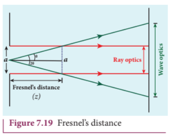

The diffraction equation for first minimum is \(\sin \theta = \frac{\lambda}{a}\); when \(\theta\) is small, \(\theta = \frac{\lambda}{a}\)

From the definition of Fresnel's distance, \(2\theta = \frac{a}{z}\) (or) \(\theta = \frac{a}{2z}\)

Equating the above two equation for \(\theta\) gives \(\frac{\lambda}{a} = \frac{a}{2z}\)

After rearranging, we get Fresnel's distance \(z\) as,

$$z = \frac{a^{2}}{2\lambda} \quad (7.45)$$

## EXAMPLE 7.11

Calculate the distance upto which ray optics is a good approximation for light of wavelength \(500~\mathrm{nm}\) falls on an aperture of width \(0.5\mathrm{mm}\)

## Solution

\(a = 0.5\mathrm{mm} = 0.5\times 10^{-3}\mathrm{m} = 5\times 10^{-4}\mathrm{m}\)

\(\lambda = 500\mathrm{nm} = 500\times 10^{-9}\mathrm{m}; z = ?\)

Equation for Fresnel's distance is \(z = \frac{a^{2}}{2\lambda}\)

Substituting,

\(z = \frac{(5\times 10^{-4})^{2}}{2\times 500\times 10^{-9}} = \frac{25\times 10^{-8}}{1\times 10^{-6}} = 0.25\mathrm{m} = 25\mathrm{cm}\)

### 7.4.5 Difference between interference and diffraction

It is difficult to find the difference between interference and diffraction as they both exhibit the wave nature of light. In both the phenomena, interference of light only produces maxima and minima on the screen and the diffraction of light only spreads light in the geometrically shadowed region. Nevertheless, in interference, the superposition is given importance and in diffraction, the bending of light is given importance. The difference between interference and diffraction based on the appearance of their patterns are given in Table 7.2.

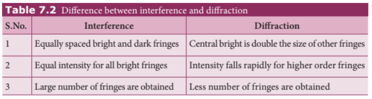

### 7.4.6 Diffraction in grating

A  grating has multiple slits with equal widths of comparable size to the wavelength of diffracting light. A grating is a plane sheet of transparent material on which opaque rulings are made. A modern commercial grating contains about 6000 lines per centimetre. The transparent space between the rulings act as slit of width a and the rulings act as obstacles having a definite width b.  The combined width of a slit and a ruling is called grating element e,  (e = a + b). The points on the slit separated by a distance equal to the grating element are called corresponding points. 

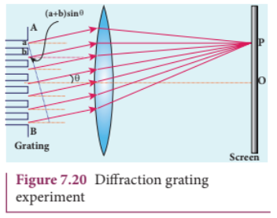

A plane transmission grating is represented as \(AB\) in Figure 7.20. Let a plane wavefront of monochromatic light with wavelength \(\lambda\) be incident on the grating. As the width of the slit is comparable to that of wavelength, the incident light undergoes diffraction.

A diffraction pattern is obtained on the screen when the diffracted waves are focused on a screen using a convex lens. Let us consider a point \(P\) at an angle \(\theta\) with the perpendicular drawn from the center of the grating to the screen. The path difference \(\delta\) between the diffracted waves from one pair of adjacent corresponding points is,

$$\delta = (a + b)\sin \theta \quad (7.46)$$

This path difference is the same for any pair of adjacent corresponding points. The point \(P\) on the screen will be maximum when,

$$\delta = m\lambda \text{ where } m = 0,1,2,3 \quad (7.47)$$

Combining the above two equations, we get,

$$(a + b)\sin \theta = m\lambda \quad (7.48)$$

Here, m is called order of diffraction maximum.

Condition for \(P\) to be zero \(^{th}\) maximum, \(m = 0\): \((a + b)\sin \theta = 0\) thus \(\sin \theta = 0\) its position \(\theta = 0\). This is called zero \(^{th}\) diffraction (or) central maximum. It is formed at an angle 0.

Condition for \(P\) to be first maximum, \(m = 1\): \((a + b)\sin \theta_{1} = \lambda\). The first maximum is obtained at an angle \(\theta_{1}\)

Condition for \(P\) to be second maximum, \(m = 2\): \((a + b)\sin \theta_{2} = 2\lambda\). The second maximum is obtained at an angle \(\theta_{2}\)

Condition for \(P\) to be mth maximum,

On either side of central maximum, different higher order diffraction maxima are formed at different angular positions.

If we take \(N = \frac{1}{a + b} \quad (7.49)\), then \(N\) gives the number of grating elements or rulings drawn per unit width of the grating. Normally, this number \(N\) is specified on the grating itself. Now, the equation becomes,

$$\frac{1}{N}\sin \theta = m\lambda \text{ (or) } \sin \theta = Nm\lambda \quad (7.50)$$

>The students should remember that in a single slit experiment, the formula \(a\sin \theta = n\lambda\) is condition for minimum with n as order of minimum. But in the grating experiment, the formula \(\sin \theta = Nm\lambda\) is condition for maximum with \(m\) as the order of diffraction.

## EXAMPLE 7.12

A diffraction grating consists of 4000 slits per centimeter. It is illuminated by a monochromatic light. The second order diffraction maximum is produced at an angle of \(30^{\circ}\). What is the wavelength of the light used?

## Solution

Number of lines \(= 4000 \text{ cm}^{-1}\); \(m = 2\); \(\theta = 30^{\circ}\); \(\lambda = ?\)

Number of lines per unit length \(N = \frac{4000}{1\times 10^{-2}} = 4\times 10^{5} \text{ m}^{-1}\)

Equation for diffraction maximum for grating is \(\sin \theta = N m \lambda\)

After rewriting, \(\lambda = \frac{\sin \theta}{N m}\)

Substituting, \(\lambda = \frac{\sin 30^{\circ}}{4\times 10^{5}\times 2} = \frac{0.5}{8\times 10^{5}} = 6.25 \times 10^{-7} \text{ m} = 6250 \text{ Å}\)

## EXAMPLE 7.13

A monochromatic light of wavelength of \(500~\mathrm{nm}\) strikes a grating and produces fourth order maximum at an angle of \(30^{\circ}\). Find the number of slits per centimeter.

## Solution

\(\lambda = 500 \mathrm{nm} = 500\times 10^{-9} \mathrm{m}; m = 4; \theta = 30^{\circ}\)

Equation for diffraction maximum for grating is \(\sin \theta = N m \lambda\)

Rewriting, \(N = \frac{\sin \theta}{m\lambda}\)

Substituting, \(N = \frac{0.5}{4\times 500\times 10^{-9}} = 2.5\times 10^{5} \text{ m}^{-1} = 2.5\times 10^{3} \text{ cm}^{-1}\)

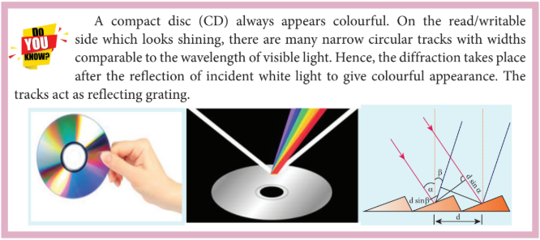

### 7.4.7 Experiment to determine the wavelength of monochromatic light

The wavelength of a spectral line can be very accurately determined with the help of a plane transmission grating. For that we need to use an 
instrument called spectrometer (Refer 7.6.6). After preliminary adjustments, the slit of collimator is illuminated by a monochromatic light, whose wavelength is to be determined. The telescope is brought in line with collimator to view the image of the slit. The given grating is then mounted on the prism table with its plane perpendicular to the incident beam of light coming from the collimator. The telescope is turned to one side until the first order diffraction image of the slit is seen. The reading of the position of the telescope is noted.
Similarly, the first order diffraction image on the other side is captured and the eading is noted. The difference between two readings gives 2θ. Half of its value gives θ. The angle for first order maximum is shown in Figure 7.21.The
wavelength of light is calculated from the
equation,

λ=sinθ/Nm               (7.51)

Here, N is the number of rulings per metre in the grating and m is the order of the diffraction image.

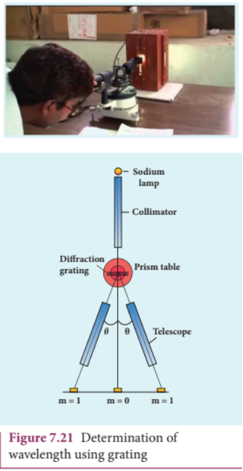

### 7.4.8 Determination of wavelenght of different colours

The diffraction pattern for white light consists of a white central maximum and continuous coloured diffraction pattern on its both sides. The central maximum is white as all the colours constructively meet at centre  with no path difference. As θ increases, the path difference fullfills the 
condition for maxima of different orders for all colours from violet to red. It produces a spectrum of diffraction pattern from violet to red on either side of central maximum as shown in Figure 7.22.By measuring the angle at which these colours appear for various orders of diffraction, the wavelength of different colours could be calculated using the formula given by equation (7.51),

λ=sinθ/Nm

Here, N is the number of rulings per metre in the grating and m is the order of the diffraction image.

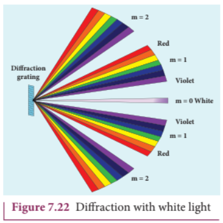

### 7.4.9 Resolution

The effect of diffraction has an adverse effect in the sharpness of the image formed. There is always a spread of central maximum in the image for every point of the object, for every point of the object acts as a point source. The condition for central maximum (or first minimum) produced by rectangular slit is given by the equation (7.37): \(a\sin \theta = \lambda\).

But, a circular slit (aperture) produces diffraction pattern of concentric circles as shown in Figure 7.23. These are known as Airy's discs. Most of the optical instruments form images of objects only through the circular slits. The condition for central maximum (or) first minimum for circular slit is,

$$a\sin \theta = 1.22\lambda \quad (7.52)$$

Here, the numerical value 1.22 appears in the expression for central maximum (or) first minimum formed by circular slits. This involves higher level mathematics that is not shown here.

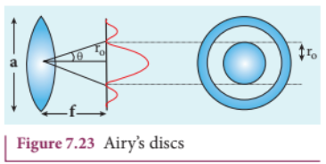

For small angles, \(\sin \theta \approx \theta\) the above equation becomes \(a\theta = 1.22\lambda\)

Rewriting further, \(\theta = \frac{1.22\lambda}{a} \quad (7.53)\)

From the geometry, \(\theta = \frac{r_0}{f}\)

Substituting for \(\theta\) in equation (7.53) and rearranging gives

$$r_0 = \frac{1.22\lambda f}{a} \quad (7.54)$$

For example, let two point-sources of light close to each other form image on a screen. The diffraction pattern of one point-source may overlap with another and produce a blurred image (or) unresolved image as shown in Figure 7.24(a). To obtain a quality image (or) well resolved image, the two point-sources must be kept apart in such a way that their diffraction patterns do not overlap as shown in Figure 7.24(c).

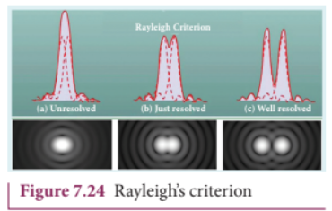

According to Rayleigh's criterion, the two points on an image are said to be just resolved when the central maximum of one diffraction pattern coincides with the first minimum of the other and vice-versa as shown in Figure 7.24(b). In other words, the distance between the two central maxima must be at least \(r_0\). Hence, \(r_0\) is called spatial resolution given by the equation (7.54) and the corresponding \(\theta\) is said to be angular resolution given by the equation (7.53) respectively. It shows that for better resolution, the wavelength of light used must be as small as possible and the size of the aperture of the instrument must be as large as possible.

The ability of an optical instrument to distinguish the two closely adjacent objects (or) two points on the same object is said to be the resolving power of the instrument. In general, the term resolution is pertaining to the quality of the image and the term resolving power is associated with the ability of the optical instrument. Resolution and resolving power are reciprocal of each other.

## EXAMPLE 7.14

The optical telescope in the Vainu Bappu observatory at Kavalur has an objective lens of diameter \(2.3\mathrm{m}\). What is its angular resolution if the wavelength of light used is \(589\mathrm{nm}\)?

## Solution

\(a = 2.3\mathrm{m}; \lambda = 589\mathrm{nm} = 589\times 10^{-9}\mathrm{m}; \theta = ?\)

The equation for angular resolution is \(\theta = \frac{1.22\lambda}{a}\)

Substituting, \(\theta = \frac{1.22\times 589\times 10^{-9}}{2.3} = 3.124\times 10^{-7} \text{ rad} = 0.0011'\)

Note: The angular resolution of human eye is approximately \(3\times 10^{-4} \text{ rad} \approx 1.03'\)

## 7.5 POLARISATION

Both, longitudinal and transverse waves exhibit the phenomena of interference and diffraction. In fact, even sound waves demonstrate the above two phenomenon. Since light is an electromagnetic wave, it is transverse in nature. The transverse nature of light wave is proved in the phenomenon called polarisation. The phenomenon of restricting the vibrations of light (electric or magnetic field vectors) to any one direction perpendicular to the direction of propagation of wave is called polarisation of light. In this lesson the electric field is only considered for discussion.

### 7.5.1 Plane polarised light

An unpolarised light is a transverse wave which has vibrations in all directions in a plane perpendicular to the direction of propagation of wave as shown in Figure 7.25(a). All these vibrations could be resolved into two normal components as shown in Figure 7.25(b), which still represents unpolarised light. If the vibrations of a wave are present in only one direction in a plane perpendicular to the direction of propagation, then the light is said to be polarised (or) plane polarised light as shown in Figure 7.25(c) and 7.25(d).

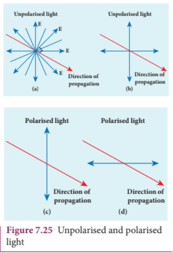

The plane containing the vibrations of the electric field vector is known as the plane of vibration ABCD as shown in Figure 7.26. The plane perpendicular to the plane of vibration is known as the plane of polarisation EFGH. Both the plane of vibration and the plane of polarisation contain the direction of propagation of light.

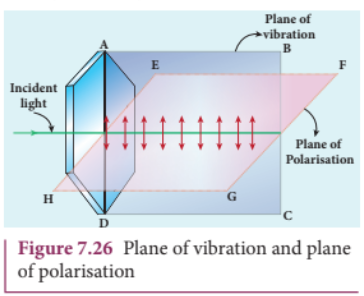

The Table 7.3 consolidates few characteristics of polarised and unpolarised light.

### 7.5.2 Polarisation Techniques

The polarised light can be obtained from unpolarised light by several techniques. Here, we are discussing the four methods.

(i) polarisation by selective absorption  
(ii) polarisation by reflection  
(iii) polarisation by double refraction   
(iv) polarisation by scattering.  

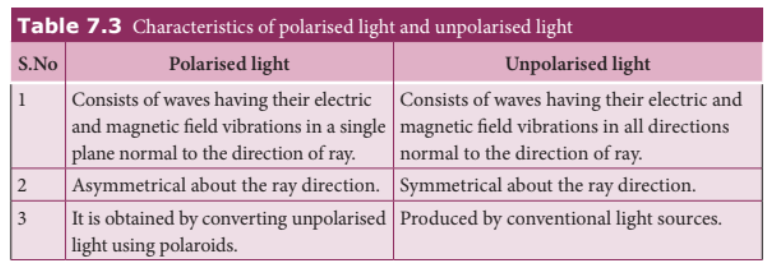

### 7.5.3 Polarisation by selective absorption

Selective absorption is the property of a material which transmits waves whose electric field vibrations are in a plane parallel to a certain direction of orientation and absorbs all other other vibrations. The polaroids (or) polarisers are thin commercial sheets which make use of the property of selective absorption to produce plane polarised light. Selective absorption is also called as dichroism.

In 1932, an American scientist Edwin Land developed polarisers in the form of sheets. Tourmaline is a natural polarising material. Polaroids are also made artificially. It was discovered that small needle shaped crystals of quinine iodosulphate have the property of polarising light. A number of these crystals with their axes parallel to one another packed in between two transparent plastic sheets serve as a good polaroid. Recently, new types of polaroids are prepared in which thin film of polyvinyl alcohol is used. These are colourless crystals which transmit more light, and give better polarisation.

#### 7.5.3.1 Polariser and analyser

Let us consider an unpolarised beam of light. The vibrations can be in all possible directions perpendicular to the direction of propagation as shown in Figure 7.27. When this light passes through a polaroid \(P_{1}\) the vibrations are restricted to only one plane. The emergent beam can be further passed through another polaroid \(P_{2}\). If the polaroid \(P_{2}\) is rotated by keeping the ray of light as axis, for a particular position of \(P_{2}\) the intensity is maximum. When the polaroid \(P_{2}\) is rotated further, the intensity starts decreasing. There is complete extinction of the light when \(P_{2}\) is rotated through \(90^{\circ}\). On further rotating \(P_{2}\), the light reappears and the intensity increases and becomes maximum at \(90^{\circ}\). The light coming out from polaroid \(P_{1}\) is said to be plane polarised. The Polaroid (here \(P_{1}\)) which polarises the light passing through it is called a polariser. The polaroid (here \(P_{2}\)) which is used to examine whether a light is polarised or not is called an analyser.

If the intensity of the unpolarised light is \(I\) then the intensity of polarised light will be \(\frac{I}{2}\). The other half of intensity is restricted by the polariser.

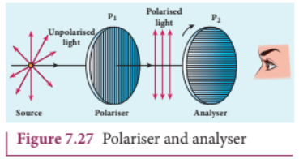

#### 7.5.3.2 Plane and partially polarised light

A light is said to be plane polarised if the intensity varies from maximum to zero for every \(90^{\circ}\) rotation of the analyser as shown in the graph in Figure 7.28(a). This is because the vibrations are allowed in one direction and completely restricted in the perpendicular direction. On the other hand, if the intensity of light varies between maximum and minimum (not zero) for every \(90^{\circ}\) rotation of the analyser, the light is said to be partially polarised light as shown in the graph in Figure 7.28(b). This is because the light is not fully restricted in that particular direction which remains as a minimum intensity.

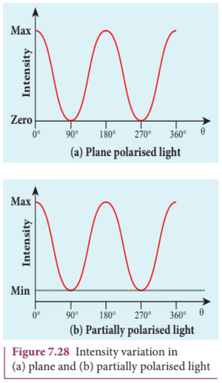

#### 7.5.3.3 Malus' law

In 1809, French Physicist E.N Malus discovered that when a beam of plane polarised light of intensity \(I_{0}\) is incident on an analyser, the intensity of light \(I\) transmitted from the analyser varies directly as the square of the cosine of the angle \(\theta\) between the transmission axes of polariser and analyser as shown in Figure 7.29. This is known as Malus' law.

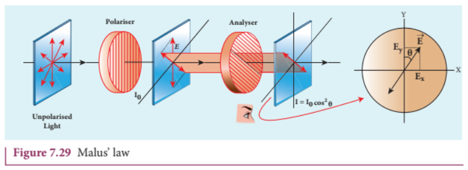

$$I = I_{0}\cos^{2}\theta \quad (7.55)$$

The proof of Malus' law is as follows. Let us consider that the transmission axes of the polariser and the analyser are inclined by an angle \(\theta\) is as shown in Figure 7.30. Let \(I_{0}\) be the intensity and \(a\) be the amplitude of the electric vector transmitted by the polariser. The amplitude \(a\) of the incident light has two rectangular components, \(a\cos \theta\) and \(a\sin \theta\) which are the parallel and perpendicular components to the axis of transmission of the analyser.

Only the component \(a\cos \theta\) will be transmitted by the analyser. The intensity of light transmitted from the analyser is proportional to the square of the component of the amplitude transmitted by the analyser.

$$I \propto (a\cos \theta)^{2}$$

$$I = k(a\cos \theta)^{2}$$

Where \(k\) is constant of proportionality.

$$I = k a^{2} \cos^{2} \theta$$

$$I = I_{0} \cos^{2} \theta$$

Where \(I_{0} = k a^{2}\) is the maximum intensity of light transmitted through the analyser.

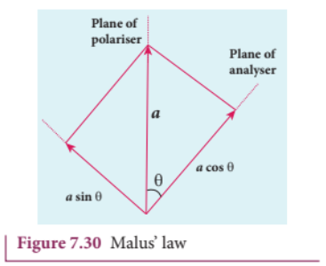

The following are few special cases.

Case (i) When \(\theta = 0^{\circ}\), \(\cos 0^{\circ} = 1\), \(I = I_{0}\)

When the transmission axis of polariser is parallel to that of the analyser, the intensity of light transmitted from the analyser is equal to the incident light that falls on it from the polariser.

Case (ii) When \(\theta = 90^{\circ}\), \(\cos 90^{\circ} = 0\), \(I = 0\)

When the transmission axes of polariser and analyser are perpendicular to each other, the intensity of light transmitted from the analyser is zero.

## EXAMPLE 7.15

Two polaroids are kept with their transmission axes inclined at \(30^{\circ}\). Unpolarised light of intensity \(I\) falls on the first polaroid. Find out the intensity of light emerging from the second polaroid.

## Solution

As the intensity of the unpolarised light falling on the first polaroid is \(I\), the intensity of polarized light emerging from it will be \(I_{0} = I/2\). Let \(I'\) be the intensity of light emerging from the second polaroid.

Malus' law: \(I' = I_{0} \cos^{2} \theta\)

Substituting, \(I' = (I/2) \cos^{2}(30^{\circ}) = (I/2) (\sqrt{3}/2)^{2} = \frac{3}{8} I\)
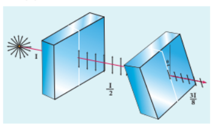

## EXAMPLE 7.16

Two polaroids are kept crossed (transmission axes at \(90^{\circ}\)) to each other.

(a) What will be the intensity of the light coming out from the second polaroid when an unpolarised light of intensity \(I\) falls on the first polaroid?

(b) What will be the intensity of light coming out from the second polaroid if a third polaroid is kept in between at \(45^{\circ}\) inclination to both of them.

## Solution

(a) As the intensity of the unpolarised light falling on the first polaroid is \(I\), the intensity of polarized light emerging from it will be \(I_{0} = I/2\). Let \(I'\) be the intensity of light emerging from the second polaroid.

Malus' law: \(I' = I_{0} \cos^{2} \theta\)

Here \(\theta\) is \(90^{\circ}\) as the transmission axes are perpendicular to each other.

Substituting, \(I' = (I/2) \cos^{2}(90^{\circ}) = 0\) [since \(\cos 90^{\circ} = 0\)]. No light comes out from the second polaroid.

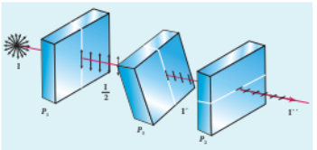

(b) Let the first polaroid be \(P_{1}\) and the second polaroid be \(P_{2}\). They are oriented at \(90^{\circ}\). The third polaroid \(P_{3}\) is introduced between them at \(45^{\circ}\). Let \(I'\) be the intensity of light emerging from \(P_{3}\).

Angle between \(P_{1}\) and \(P_{3}\) is \(45^{\circ}\). The intensity of light coming out from \(P_{3}\) is \(I' = I_{0} \cos^{2} \theta\)

Substituting, \(I' = (I/2) \cos^{2}(45^{\circ}) = (I/2) (1/\sqrt{2})^{2} = I/4\)

Finally, the light has to pass through \(P_{2}\). Angle between \(P_{3}\) and \(P_{2}\) is \(45^{\circ}\). Let \(I''\) be the intensity of light coming out from \(P_{2}\). \(I'' = I' \cos^{2} \theta\)

Here, \(I' = I/4\). Substituting, \(I'' = (I/4) \cos^{2}(45^{\circ}) = (I/4) (1/\sqrt{2})^{2} = I/8\)

#### 7.5.3.4. Uses of polaroids

1. Polaroids are used in goggles and cameras to avoid glare of light.
2. Polaroids are used to take 3D pictures i.e., holography.
3. Polaroids are used to improve contrast in old oil paintings.
4. Polaroids are used in optical stress analysis.
5. Polaroids are used as window glasses to control the intensity of incoming light.
6. Polarised laser beam acts as needle to read/write in compact discs (CDs).
7. Polarised light is used in liquid crystal display (LCD).

### 7.5.4 Polarisation by reflection

The simplest method of producing plane polarised light is by reflection. Consider a beam of unpolarised light incident on a polished glass surface \(XY\). This light undergoes reflection as well as refraction. As it is unpolarized, it consists of vibrations which are parallel to the reflecting surface (shown as dots) and also not parallel to it (shown as arrows). It is shown in Figure 7.31. For a particular angle of incidence, the reflected light is found to be plane polarised and the refracted light is found to be partially polarised. It is because, the parallel vibrations to the surface are reflected and the other vibrations are refracted. Few parallel vibrations may also get refracted resulting in partially polarised refracted light. The angle of incidence for which the reflected light is found to be plane polarised is called polarising angle \(i_{p}\).

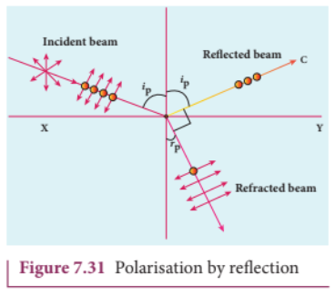

#### 7.5.4.1 Brewster's Law

The British Physicist, Sir. David Brewster found that at the polarising angle, the reflected and the refracted rays are perpendicular to each other. Suppose \(i_{p}\) is the polarising angle and \(r_{p}\) is the angle of refraction, from the geometry as shown in Figure 7.31, we can write,

$$r_{p} = 90^{\circ} - i_{p} \quad (7.56)$$

From Snell's law, the refractive index \(n\) of the medium with respect to air is,

$$\frac{\sin i_{p}}{\sin r_{p}} = n \quad (7.57)$$

Substituting equation (7.56) in (7.57), we get,

$$\frac{\sin i_{p}}{\sin(90^{\circ} - i_{p})} = \frac{\sin i_{p}}{\cos i_{p}} = n$$

$$\tan i_{p} = n \quad (7.58)$$

This equation is known as Brewster's law. Brewster's law states that the tangent of the polarising angle for a transparent medium is equal to its refractive index. The polarising angle is known as Brewster's angle which depends on the nature of the refracting medium.

## EXAMPLE 7.17

Find the polarizing angles for (i) glass of refractive index 1.5 and (ii) water of refractive index 1.33.

## Solution

Brewster's law: \(\tan i_{p} = n\)

For glass: \(\tan i_{p} = 1.5\); \(i_{p} = \tan^{-1}(1.5) = 56.3^{\circ}\)

For water: \(\tan i_{p} = 1.33\); \(i_{p} = \tan^{-1}(1.33) = 53.1^{\circ}\)

#### 7.5.4.2 Pile of plates

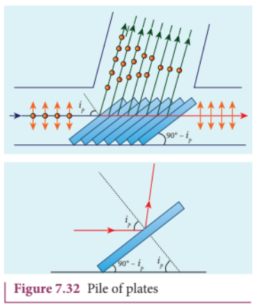

Pile of plates makes use of Brewster's law to convert the partially polarised refracted light into plane polarised light. It consists of several glass plates kept one behind the other at an angle \(90^{\circ} - i_{p}\) with the horizontal surface as shown in Figure 7.32. This arrangement ensures that the parallel light falls on these plates at \(i_{p}\). When this unpolarised light passes successively through these plates, the few parallel vibrations to the surface which may be present in the refracted light, get a chance for further reflections at the succeeding plates. Thus, both the reflected and the refracted lights are found to be plane polarised.

## EXAMPLE 7.18

What is the angle at which a glass plate of refractive index 1.65 is to be kept with respect to the horizontal surface so that an unpolarised light travelling horizontal after reflection from the glass plate is found to be plane polarised?

## Solution

\(n = 1.65\)

Brewster's law: \(\tan i_{p} = n \Rightarrow \tan i_{p} = 1.65 \Rightarrow i_{p} = \tan^{-1}(1.65) = 58.8^{\circ}\)

The inclination with the horizontal surface is \(90^{\circ} - 58.8^{\circ} = 31.2^{\circ}\)

### 7.5.5 Polarisation by double refraction

Erasmus Bartholinus, a Danish Physicist discovered that when a ray of unpolarised light is incident on a calcite crystal, two refracted rays are produced. Hence, two images of an object are formed. This phenomenon is called double refraction (or) birefringence as shown in Figure 7.33. This phenomenon is also exhibited by crystals like quartz, mica etc.

When a dot of ink on a sheet of paper is viewed through a calcite crystal, two images will be seen. On rotating the crystal, one image remains stationary and the other rotates around it. The stationary image \(o\) is produced by ordinary rays which obey the laws of refraction. The rotating image \(E\) is produced by extraordinary rays which do not obey the laws of refraction. The extraordinary ray is found to be plane polarised. Inside a double refracting crystal the ordinary ray travels with same velocity in all directions and the extra ordinary ray travels with different velocities in all directions. A point source inside the crystal produces spherical wavefront for ordinary ray and elliptical wavefront for extraordinary ray. Inside the crystal, there is a particular direction in which both the rays travel with same velocity. This direction is called as optic axis. Along the optic axis, the refractive index is same for both the rays and there is no double refraction along this axis.

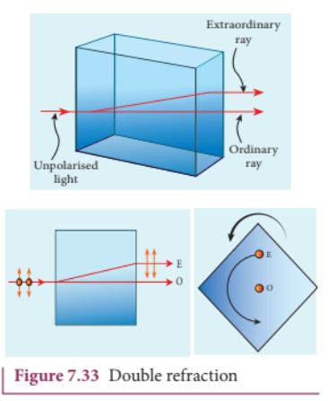

### 7.5.6 Types of optically active crystals

Crystals like calcite, quartz, tourmaline and ice which have only one optic axis are called uniaxial crystals.

Crystals like mica, topaz, selenite and aragonite which have two optic axes are called biaxial crystals.

### 7.5.7 Nicol prism

Nicol prism is an optical device which forms a part of many optical instruments both for producing plane polarised light and also analysing. The construction of a Nicol prism is based on the phenomenon of double refraction. It was designed by William Nicol in 1828.

Nicol prism is a calcite crystal which has a length three times its breadth and angles \(72^{\circ}\) and \(108^{\circ}\). It is cut into two halves along the diagonal as shown in Figure 7.34. The two halves are pasted together with a layer of canada balsam, a transparent cement.

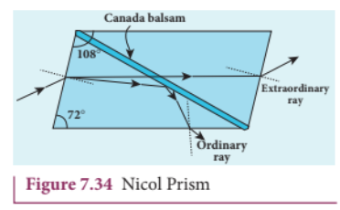

Let us consider a ray of unpolarised light from a monochromatic source is incident on the Nicol prism. The double refraction takes place and the ray is split into ordinary and extraordinary rays. They travel in different directions with different velocities. For monochromatic sodium light the refractive index of the crystal for the ordinary ray is 1.658 and for extraordinary ray is 1.486. The refractive index of canada balsam is 1.523.

The ordinary ray is total internally reflected at the layer of canada balsam and is prevented from emerging along with extraordinary ray. Where as, the extraordinary ray is transmitted through the crystal which is plane polarised.

##### Drawbacks of Nicol prism

(i) Its cost is very high due to scarcity of large and flawless calcite crystals. 
(ii) Due to extraordinary ray passing obliquely through it, the emergent ray is always displaced a little to one side.  
(iii) The effective field of view is quite limited.  
(iv) The light emerging out of it is not uniformly plane polarised.

#### 7.5.8 Polarisation by scattering

When sunlight gets scattered by the atmospheric molecules, the electrons of these molecules are influenced by the vibrating components of the electric field present in the sunlight. As the sunlight is unpolarised, it produces these vibrations in all directions. These vibrating electrons radiate energy only in the direction perpendicular to their vibrations. When an observer views a beam of sunlight perpendicular to its direction of travel, the radiations produced by the electrons vibrating in the direction perpendicular to the direction of view will only reach the observer. Hence, the light reaching the observer is plane polarised. It is shown in Figure 7.35.

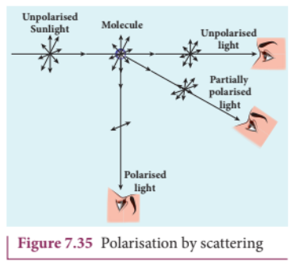

## 7.6 OPTICAL INSTRUMENTS

There are many optical instruments we used in our daily liffe.We shall discuss here about microscope,telescope,spectrometer and of course the human eye.

### 7.6.1 Simple microscope

A simple microscope is a single magnifying (convex) lens of small focal length which must produce an erect, magnified and virtual image of the object. Hence, the object must be placed within the focal length \(f\) (between the points \(F\) and \(P\)) on one side of the lens and viewed through the other side of it. The nearest point where an eye can clearly see is called the near point and the farthest point up to which an eye can clearly see is called the far point. For a healthy eye, the distance of the near point is \(25~\mathrm{cm}\), which is denoted as \(D\) and the far point should be at infinity.

#### 7.6.1.1 Near point focusing

The eye is least strained when image is formed at near point, i.e. \(25~\mathrm{cm}\). The near point is also called as least distance of distinct vision. This is shown in Figure 7.36. The object distance \(u\) should be less than \(f\). The image distance is the near point \(D\). The magnification \(m\) of this lens is given by the equation (6.67), \(m = \frac{v}{u}\)

Substituting, \(v = - D\) and \(u = - u\) as both the distances are measured to the left of the lens. Hence, \(m = \frac{- D}{- u}\)

$$m = \frac{D}{u} \quad (7.59)$$

We can also write the equation for magnification \(m\) in terms of focal length \(f\) by using lens equation (6.63), \(\frac{1}{v} - \frac{1}{u} = \frac{1}{f}\). Using \(m = \frac{v}{u}\) we get \(m = 1 - \frac{v}{f}\)

Substituting \(v = - D\) gives,

$$m = 1 + \frac{D}{f} \quad (7.60)$$

This is the magnification for near point focusing.

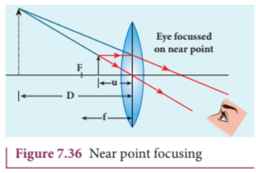

#### 7.6.1.2 Normal focusing

The eye is most relaxed when the image is formed at infinity. The focusing is called normal focusing when the image is formed at infinity. This is shown in Figure 7.37(b). To find the magnification \(m\), if we take the ratio of the height of image to the height of object \(\left(m = \frac{h'}{h}\right)\), we will not get a meaningful equation, as the image is of infinite size and it is also formed at infinity. Hence, we can practically use the angular magnification. The angular magnification is defined as the ratio of angle \(\theta_{i}\) subtended by the image with aided eye to the angle \(\theta_{0}\) subtended by the object with unaided eye.

<<<<<<< HEAD
$$m = \frac{\theta_{i}}{\theta_{0}}$$

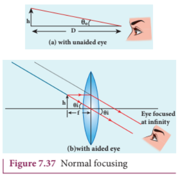
=======
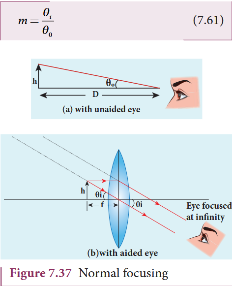
>>>>>>> c70a444eae204de8a4598387af1b71c7597ad8d3

For unaided eye shown in Figure 7.37(a),

$$\tan \theta_{0} \approx \theta_{0} = \frac{h}{D} \quad (7.62)$$

For aided eye shown in Figure 7.37(b),

$$\tan \theta_{i} \approx \theta_{i} = \frac{h}{f} \quad (7.63)$$

The angular magnification is,

$$m = \frac{\theta_{i}}{\theta_{0}} = \frac{h / f}{h / D}$$

$$m = \frac{D}{f} \quad (7.64)$$

This is the magnification for normal focusing.

The magnification for normal focusing is one less than that of near point focusing. But, the viewing is more comfortable in normal focusing than near point focusing. For large values of \(D / f\), the difference between the two magnifications is negligibly small.

## EXAMPLE 7.19

A man with a near point of \(25~\mathrm{cm}\) reads a book which has small print using a magnifying lens of focal length \(5\mathrm{cm}\). (a) What are the closest and the farthest distances at which he should keep the lens from the book? (b) What are the maximum and the minimum magnification possible?

## Solution

\(D = 25\mathrm{cm}\)

The magnifying lens must be a convex lens of positive focal length \(f = 5\mathrm{cm}\)

For closest object distance \(u\), the image distance \(v\) is \(-25\mathrm{cm}\) (near point, \(v = - D\))

For farthest object distance \(u'\), the corresponding image distance \(v'\) is infinity.

(a) To find closest distance between lens and book, we can use lens equation \(\frac{1}{v} -\frac{1}{u} = \frac{1}{f}\)

Rewriting for closest object distance \(\frac{1}{u} = \frac{1}{v} -\frac{1}{f}\)

Substituting, \(\frac{1}{u} = \frac{1}{-25} -\frac{1}{5} = -\frac{1}{25} -\frac{1}{5} = -\frac{6}{25}\)

\(u = -\frac{25}{6} = -4.167\mathrm{cm}\)

The closest distance between the lens and the book is \(u = -4.167\mathrm{cm}\)

To find farthest object distance, lens equation is \(\frac{1}{v'} -\frac{1}{u'} = \frac{1}{f}\)

Rewriting for farthest object distance \(\frac{1}{u'} = \frac{1}{v'} -\frac{1}{f}\)

Substituting \(\frac{1}{u'} = \frac{1}{\infty} -\frac{1}{5} = -\frac{1}{5}\); \(u' = -5\mathrm{cm}\)

The farthest distance at which the person can keep the book is \(u' = -5\mathrm{cm}\)

(b) To find magnification in near point focusing, \(m = 1 + \frac{D}{f} = 1 + \frac{25}{5} = 6\)

To find magnification in normal focusing, \(m = \frac{D}{f} = \frac{25}{5} = 5\)

#### 7.6.1.3. Resolving power of microscope

A microscope is used to see the details of the object under observation. Good microscope should not only magnify the object but also resolve the two points on an object which are separated by the smallest distance \(d_{min}\). Actually, \(d_{min}\) is the resolution and its reciprocal is the resolving power.

The spatial resolution (radius of central maximum) is already derived in equation (7.54) \(r_0 = \frac{1.22\lambda f}{a}\).

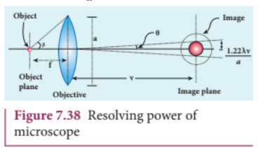

In microscope, the object distance is just more than the focal length \(f\) and the image is formed at distance \(v\) as shown in the Figure 7.38. Hence, \(f\) in equation (7.54) is replaced by \(v\).

$$r_o = \frac{1.22\lambda v}{a} \quad (7.65)$$

If the distance between the two points on the object to be resolved is \(d_{min}\), then the magnification \(m\) is

$$m = \frac{r_o}{d_{min}} \quad (7.66)$$

$$d_{\mathrm{min}} = \frac{r_o}{m} = \frac{1.22\lambda v}{am} = \frac{1.22\lambda u}{a} \quad [\because m = v/u \text{ and } u \approx f]$$

$$d_{\mathrm{min}} = \frac{1.22\lambda f}{a} \quad (7.67)$$

On the object side,

$$2\tan \beta \approx 2\sin \beta = \frac{a}{f} \quad \therefore a = f \cdot 2\sin \beta \quad (7.68)$$

$$d_{\mathrm{min}} = \frac{1.22\lambda}{2\sin \beta} \quad (7.69)$$

To further reduce the value of \(d_{\mathrm{min}}\) the optical path of the light is increased by immersing the objective of the microscope into a bath containing oil of refractive index \(n\).

$$d_{\mathrm{min}} = \frac{1.22\lambda}{2n\sin\beta} \quad (7.70)$$

Such an objective is called oil immersed objective. The term \(n\sin \beta\) is called numerical aperture NA.

$$d_{\mathrm{min}} = \frac{1.22\lambda}{2(NA)} \quad (7.71)$$

The resolving power \(R_{\mathrm{M}}\) of microscope is

$$R_{\mathrm{M}} = \frac{1}{d_{\mathrm{min}}} = \frac{2(NA)}{1.22\lambda} = \frac{2n\sin\beta}{1.22\lambda} \quad (7.72)$$

#### 7.6.1.4. Resolving power of telescope

The resolving power of telescope is the reciprocal of the spatial resolution already derived in equation (7.54).

$$R_{\mathrm{T}} = \frac{1}{r_0} = \frac{a}{1.22\lambda f} \quad (7.73)$$

### 7.6.2 Compound microscope

The diagram of a compound microscope is shown in Figure 7.39. The lens near the object is called as objective. It forms a real, inverted and magnified image of the object. This serves as the object for the lens close to the eye called as eyepiece. The eyepiece serves as a simple microscope that produces finally an enlarged and virtual image. The first inverted image formed by the objective is to be adjusted within the focus of the eyepiece so that the final image is formed nearly at infinity (or) at the near point. The final image is inverted with respect to the object.

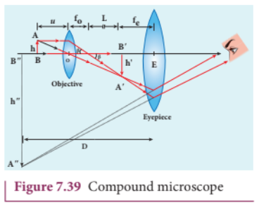

#### 7.6.2.1. Magnification in compound microscope

The lateral magnification produced by the objective is given by the equation (6.66), \(m_{o} = \frac{h'}{h}\)

If the object is placed very close to the focal point of the objective, the image is formed at the focal point of the eyepiece. We can approximate \(h' \approx L \tan \theta\) and \(h = f_o \tan \theta\), where \(L\) is the tube length. Therefore,

$$\frac{h'}{h} = \frac{L}{f_o} \quad \Rightarrow \quad m_o = \frac{L}{f_o} \quad (7.75)$$

Here, the distance \(L\) is measured between the focal point of the eyepiece to the focal point of the objective. This is called the tube length of the microscope as \(f_o\) and \(f_e\) are comparatively smaller than \(L\).

If the final image is formed at the near point, the magnification \(m_e\) of the eyepiece is

$$m_e = 1 + \frac{D}{f_e} \quad (7.76)$$

The total magnification \(m\) for near point focusing is

$$m = m_o m_e = \left(\frac{L}{f_o}\right) \left[1 + \frac{D}{f_e}\right] \quad (7.77)$$

If the final image is formed at infinity (normal focusing), the magnification \(m_e\) of the eyepiece is

$$m_e = \frac{D}{f_e} \quad (7.78)$$

The total magnification \(m\) for normal focusing is

$$m = m_o m_e = \left(\frac{L}{f_o}\right) \left(\frac{D}{f_e}\right) \quad (7.79)$$

## EXAMPLE 7.20

A microscope has an objective and eyepiece of focal lengths \(5\mathrm{cm}\) and \(50\mathrm{cm}\) respectively with tube length \(30\mathrm{cm}\). Find the magnification of the microscope in the (a) near point and (b) normal focusing.

## Solution

\(f_{o} = 5\mathrm{cm} = 5\times 10^{-2}\mathrm{m}; f_{e} = 50\mathrm{cm} = 50\times 10^{-2}\mathrm{m}; L = 30\mathrm{cm} = 30\times 10^{-2}\mathrm{m}; D = 25\mathrm{cm} = 25\times 10^{-2}\mathrm{m}\)

(a) The total magnification \(m\) in near point focusing is \(m = m_{o}m_{e} = \left(\frac{L}{f_{o}}\right) \left[1 + \frac{D}{f_{e}}\right]\)

Substituting, \(m = \left(\frac{30\times 10^{-2}}{5\times 10^{-2}}\right) \left[1 + \frac{25\times 10^{-2}}{50\times 10^{-2}}\right] = (6)(1.5) = 9\)

(b) The total magnification \(m\) in normal focusing is \(m = m_{o}m_{e} = \left(\frac{L}{f_{o}}\right) \left(\frac{D}{f_{e}}\right)\)

Substituting, \(m = \left(\frac{30\times 10^{-2}}{5\times 10^{-2}}\right) \left(\frac{25\times 10^{-2}}{50\times 10^{-2}}\right) = (6)(0.5) = 3\)

### 7.6.3 Astronomical telescope

An astronomical telescope is used to get the magnification of distant astronomical objects like stars, planets, moon etc. The image formed by astronomical telescope will be inverted. It has an objective of long focal length and a much larger aperture than the eyepiece as shown in Figure 7.40. Light from a distant object enters the objective and a real image is formed in the tube at its focal point. The eyepiece magnifies this image producing a final inverted image.

#### 7.6.3.1 Magnification in astronomical telescope

The magnification \(m\) is the ratio of the angle \(\beta\) subtended by the image to the angle \(\alpha\) subtended by the object with the principal axis.

$$m = \frac{\beta}{\alpha} \quad (7.80)$$

From the diagram, \(\alpha = \frac{h}{f_o}\) and \(\beta = \frac{h}{f_e}\)

$$m = \frac{f_o}{f_e} \quad (7.81)$$

The length of the telescope is approximately

$$L = f_o + f_e \quad (7.82)$$

## EXAMPLE 7.21

A small telescope has an objective lens of focal length \(125\mathrm{cm}\) and an eyepiece of focal length \(2\mathrm{cm}\). (a) What is the magnification of the telescope? (b) What is the separation between the objective and the eyepiece? (c) What is the angular separation between two stars when viewed through this telescope if they subtend \(1'\) for bare eye?

## Solution

\(f_{o} = 125\mathrm{cm}; f_{e} = 2\mathrm{cm}\)

(a) Equation for magnification of telescope: \(m = \frac{f_o}{f_e} = \frac{125}{2} = 62.5\)

(b) Equation for approximate length of telescope: \(L = f_{o} + f_{e} = 125 + 2 = 127\mathrm{cm} = 1.27\mathrm{m}\)

(c) Equation for angular magnification: \(m = \frac{\theta_{i}}{\theta_{o}} \Rightarrow \theta_{i} = m \times \theta_{o}\)

Substituting, \(\theta_{i} = 62.5 \times 1' = 62.5' = \frac{62.5}{60} = 1.04^{\circ} = 1^{\circ}2'30''\)

### 7.6.4 Terrestrial telescope

A terrestrial telescope is used to see objects at a long distance on the surface of earth. Hence, image should be erect. Hence, it has an additional erecting lens to make the final image erect as shown in Figure 7.41.

### 7.6.5 Reflecting telescope

Modern telescopes use concave mirrors instead of lenses for the objectives. It is rather difficult and expensive to make lenses of large size which form images that are free from any optical defect. A telescopes which has a concave mirror objective is called reflecting telescope. It has several advantages. Only one surface is to be polished and maintained for a mirror whereas it is to be done for two surfaces for a lens. Support can be given from the entire back of the mirror whereas it is given only at the rim for lens. A mirror weighs much less compared to a lens. But, the one obvious problem with a reflecting telescope is that the objective mirror would focus the light inside the telescope tube. One must have an eye piece inside the tube obstructing some light. This problem could also be overcome by introducing a secondary mirror which would take the light outside the tube for view as shown in the Figure 7.42.

### 7.6.6 Spectrometer

The spectrometer is an optical instrument used to analyse the spectra of different sources of light, to measure the wavelength of different colours and to measure the refractive indices of materials of prisms. It is shown in Figure 7.43. It basically consists of three parts namely 
(i) collimator 
(ii) prism table  
(iii) telescope. 

##### (i) Collimator

The collimator is used for producing parallel beam of light. It has a convex lens and a vertical slit of adjustable width which faces the source. The position of slit can be adjusted so that it is kept at the focus of the lens. The collimator is rigidly fixed to the base.

##### (ii) Prism table

The prism table is used for mounting the prism, grating etc. It consists of two circular discs provided with three levelling screws. It can be rotated and its position can be read from two verniers \(V_{1}\) and \(V_{2}\). The prism table can be fixed at any desired height.

##### (iii) Telescope

The telescope is an astronomical type. It consists of an eyepiece provided with cross wires at one end and an objective at its other end. The distance between the objective and the eyepiece can be adjusted so that the telescope forms a clear image at the cross wires.

The telescope is attached to a circular scale and both can be rotated together. The telescope and prism table are provided with radial screws for fixing them at a desired position and tangential screws for fine adjustments.

##### Preliminary adjustments of the spectrometer

The following adjustments must be done in a spectrometer before doing the experiment.

(a) Adjustment of the eyepiece: The telescope is turned towards an illuminated surface and the eyepiece is moved to and fro until the cross wires are clearly seen.

(b) Adjustment of the telescope: The telescope is adjusted to receive parallel rays by focusing it to a distant object to get a clear image on the cross wire.

(c) Adjustment of the collimator: The telescope is brought in line with the collimator. The distance between the illuminated slit and the lens of the collimator is adjusted until a clear image of the slit is seen at the cross wire.

(d) Levelling of the prism table: The prism table is brought to the horizontal level by adjusting the levelling screws and it is ensured by using sprit level.

#### 7.6.6.1 Determination of refractive index of material of the prism

The preliminary adjustments of the spectrometer are done. The refractive index of the prism can be determined by measuring the angle of the prism \(A\) and the angle of minimum deviation \(D\).

##### (i) Angle of the prism \(A\)

The prism is placed on the prism table with its refracting angle \(A\) facing the collimator as shown in Figure 7.44. The slit is illuminated by sodium light (monochromatic light). The parallel rays coming from the collimator fall on the two faces \(AB\) and \(AC\) and get reflected. The telescope is rotated to the position \(T_{1}\) and \(T_{2}\) to capture the reflected rays and the two reading are noted.

The difference between these two readings gives the angle rotated by the telescope,The difference between these two readings gives the angle rotated by the telescope, which is twice the angle of the prism. Half of this value gives the angle of the prism \(A\).

##### (ii) Angle of minimum deviation \(D\)

The prism is placed on the prism table so that the light from the collimator falls on a refracting face and the refracted image is observed through the telescope as shown in Figure 7.45. The prism table alone is now rotated so that the angle of deviation decreases. A stage comes when the image stops and returns on further rotation of the prism table. This is ensured by looking through the telescope simultaneously. The reading in this position gives the minimum deviation position.

Now, the prism is removed and the telescope is turned to receive the direct ray and the reading is noted. The difference between the two readings gives the angle of minimum deviation \(D\). The refractive index of the material of the prism \(n\) is calculated using the equation (6.89),

$$n = \frac{\sin\left(\frac{A + D}{2}\right)}{\sin\left(\frac{A}{2}\right)}$$

The refractive index of a liquid may be determined in the same way by using a hollow glass prism filled with the liquid.

### 7.6.7 The eye

Eye is a natural optical instrument human beings have. As the eye lens is flexible, its focal length can be changed to some extent. When the eye is fully relaxed, its focal length is maximum and when it is strained its focal length is minimum. The image must be formed on the retina for clear vision. The diameter of eye ball for a normal adult is about \(2.5\mathrm{cm}\). Hence, the distance between eye lens and retina (image distance) is fixed always at \(2.5\mathrm{cm}\). We can just discuss the optical functioning of eye without giving importance to the refractive indices of the two liquids, aqueous humor and virtuous humor present in the eye. A person with normal vision can see objects kept at infinity in the relaxed condition with a maximum focal length \(f_{\mathrm{max}}\) of the eye lens as shown in Figure 7.46(a) and in the strained condition, with a minimum focal length \(f_{\mathrm{min}}\) for an object kept at near point \(D\) (25 cm) as shown in Figure 7.46(b).

Let us find \(f_{\mathrm{max}}\) and \(f_{\mathrm{min}}\) of human eye from the lens equation (6.63).

$$\frac{1}{f} = \frac{1}{v} -\frac{1}{u}$$

When the object is at infinity, \(u = -\infty\) and \(v = 2.5\mathrm{cm}\) (distance between eye lens and retina), the eye can see the object in relaxed condition with \(f_{\mathrm{max}}\). Substituting these values in the lens equation gives,

$$\frac{1}{f_{\mathrm{max}}} = \frac{1}{2.5\mathrm{cm}} -\frac{1}{-\infty}$$

$$f_{\mathrm{max}} = 2.5\mathrm{cm}$$

When the object is at near point, \(u = -25\mathrm{cm}\) and \(v = 2.5\mathrm{cm}\), the eye can see the object in strained condition with \(f_{\mathrm{min}}\). Substituting these values in the lens equation gives,

$$\frac{1}{f_{\mathrm{min}}} = \frac{1}{2.5\mathrm{cm}} -\frac{1}{-25\mathrm{cm}}$$

$$f_{\mathrm{min}} = 2.27\mathrm{cm}$$

This implies that by varying the focal length of the eye lens by a small value of \(f_{\mathrm{max}} - f_{\mathrm{min}} = 0.23\mathrm{cm}\), a person can see the objects from infinity to the near point. Now, we can discuss some common defects of vision in the eye.

#### 7.6.7.1 Nearsightedness (myopia)

A person suffering from nearsightedness (or) myopia cannot see distant objects clearly. This may be due to the short focal length of the eye lens (or) larger diameter of the eyeball than usual. These people have difficulty in relaxing their eye to the extent of what is needed. Thus, they need correcting lens.

For them, parallel rays coming from the distant object get focused before reaching the retina as shown in Figure 7.47(a). But, these persons can see objects which are nearer. Let \(x\) be the maximum distance up to which a person with nearsightedness can see as shown in Figure 7.47(b). To overcome this difficulty, the virtual image of the object at infinity should be formed at a distance \(x\) from the eye using a correcting lens as shown in Figure 7.47(c).

The focal length of the correcting lens for a myopic eye can be calculated using the lens equation (6.63).

$$\frac{1}{f} = \frac{1}{v} -\frac{1}{u}$$

Here, \(u = -\infty\) and \(v = -x\). Substituting these values in the lens equation gives,

$$\frac{1}{f} = \frac{1}{-x} -\frac{1}{-\infty}$$

Focal length \(f\) of the correcting lens is,

$$f = -x \quad (7.83)$$

The negative sign in the above result suggests that the correcting lens should be a concave lens. Basically, the concave lens slightly diverges the parallel rays from infinity and makes them fall at the retina.

#### 7.6.7.2 Farsightedness (hypermetropia)

A person suffering from farsightedness (or) hypermetropia (or) hyperopia cannot see closer object clearly. It occurs when the eye lens has long focal length (or) shortening of the eyeball than usual. The closest distance for clear vision for these people is appreciably more than \(25\mathrm{cm}\). Thus, reading books (or) viewing smaller things held in the hands is difficult for them. This kind of farsightedness arising mainly due to aging is called presbyopia. The aged people cannot strain their eye more to reduce the focal length of the eye lens.

The rays coming from the object at near point get focused beyond the retina as shown in Figure 7.48(a). But, these persons can see objects which are at a distance only beyond \(25\mathrm{cm}\) from the eye. Let \(y\) be the minimum distance from the eye beyond which a person with farsightedness can see as shown in Figure 7.48(b). To make this person see an object at \(25\mathrm{cm}\) (near point) a virtual image of the object at \(25\mathrm{cm}\) should be formed at \(y\) using a correcting lens as shown in Figure 7.48(c).

The focal length of the correcting lens for a hypermetropic eye can be calculated using the lens equation (6.63).

$$\frac{1}{f} = \frac{1}{v} -\frac{1}{u}$$

Here, \(u = -25\mathrm{cm}\) and \(v = -y\). Substituting these values in the lens equation gives,

$$\frac{1}{f} = \frac{1}{-y} -\frac{1}{-25\mathrm{cm}}$$

Simplifying the above equation for \(f\) gives,

$$\frac{1}{f} = \frac{1}{25\mathrm{cm}} -\frac{1}{y} = \frac{y - 25\mathrm{cm}}{y \times 25\mathrm{cm}}$$

$$f = \frac{y \times 25\mathrm{cm}}{y - 25\mathrm{cm}} \quad (7.84)$$

The focal length calculated using above formula will be positive as \(y\) is always greater than \(25\mathrm{cm}\). The positive sign of the focal length suggests that the correcting lens should be a convex lens. In principle, the convex lens slightly converges the rays coming from an object beyond \(y\) and makes them fall at the retina.

#### 7.6.7.3 Astigmatism

Astigmatism is the defect arising due to different curvatures along different planes in the eye lens. Astigmatic person cannot see in all the directions equally well. The defect due to astigmatism is more serious than myopia and hypermetropia. The astigmatism can be corrected using a lens which has different curvatures in different planes. In general, these specially made glasses with different curvature for different planes are called as cylindrical lenses.

Due to aging people may develop combination of more than one defect. If it is the combination of nearsightedness and farsightedness then, such persons may need a converging glass for reading purpose and a diverging glass for seeing at a distance. Bifocal lenses and progressive lenses provide solution for these kinds of problems.

## EXAMPLE 7.22

Calculate the power of the lens of the spectacles needed to rectify the defect of nearsightedness for a person who could see clearly up to a distance of \(1.8\mathrm{m}\).

## Solution

The maximum distance the person could see is \(x = 1.8\mathrm{m}\).

The lens should have a focal length of \(f = -xm = -1.8m.

It is a concave (or) diverging lens.

The power of the lens is,

$$P = -\frac{1}{1.8\mathrm{m}} = -0.56\mathrm{D}$$

## EXAMPLE 7.23

A person has farsightedness with the far distance he could see clearly is \(75\mathrm{cm}\). Calculate the power of the lens of the spectacles needed to rectify the defect.

## Solution

The minimum distance the person could see clearly is \(y = 75\mathrm{cm}\).

The lens should have a focal length of,

$$f = \frac{y \times 25\mathrm{cm}}{y - 25\mathrm{cm}}$$

$$f = \frac{75\mathrm{cm} \times 25\mathrm{cm}}{75\mathrm{cm} - 25\mathrm{cm}} = 37.5\mathrm{cm}$$

It is a convex (or) converging lens.

The power of the lens is,

$$P = \frac{1}{0.375\mathrm{m}} = 2.67\mathrm{D}$$

---

## SUMMARY

- Light has wave as well as particle nature. A wavefront is the locus of points which are in the same state or phase of vibration.
- Huygen's principle states the method of propagation of wavefront. Light propagates as a wavefront.
- Point source produces spherical wavefront and source at infinity produces plane wavefront.
- Laws of reflection and refraction are proved by Huygens principle.
- The phenomenon of addition or superposition of two light waves which produces increase in intensity at some points and decrease in intensity at some other points is called interference of light.
- If \(I_{1}\) and \(I_{2}\) are the intensities of interfering light, then
  $$I_{\mathrm{max}} = I_{1} + I_{2} + 2\sqrt{I_{1}I_{2}}$$
  $$I_{\mathrm{min}} = I_{1} + I_{2} - 2\sqrt{I_{1}I_{2}}$$
- If interfering lights have equal intensities of \(I_{0}\) with phase difference \(\phi\), then
  $$I = 4I_{0}\cos^{2}(\phi/2)$$
  $$I_{\mathrm{max}} = 4I_{0} \text{ when } \phi = 0,\pm 2\pi, 4\pi, \dots$$
  $$I_{\mathrm{min}} = 0 \text{ when } \phi = \pm \pi, \pm 3\pi, \pm 5\pi, \dots$$
- Two light sources are said to be coherent if they produce waves which have same phase or constant phase difference, same frequency or wavelength (monochromatic), same waveform and preferably same amplitude.
- Coherent sources are obtained by wavefront division, intensity division and real and virtual images of light source.
- Young's double slit uses wavefront division to obtain coherent sources.
- In Young's double slit experiment, the position of \(n^{\mathrm{th}}\) bright fringe is \(y_{n} = n\frac{\lambda D}{d}\).
- In Young's double slit experiment, the position of \(n^{\mathrm{th}}\) dark fringe is \(y_{n} = \frac{(2n - 1)\lambda D}{2d}\).
- In Young's double slit experiment, the equation for bandwidth is \(\beta = \frac{\lambda D}{d}\).
- Interference with polychromatic (white) light produces coloured interference fringes.
- Thin films appear coloured due to interference of white light.
- In thin films the equations for constructive and destructive interference for reflected rays are \(2\mu d = (2n - 1)\frac{\lambda}{2}\) and \(2\mu d = n\lambda\) respectively.
- For transmitted light, the conditions are \(2\mu d = n\lambda\) and \(2\mu d = (2n - 1)\frac{\lambda}{2}\) respectively.
- Diffraction is bending of waves around sharp edges into the geometrically shadowed region.
- A spherical wavefront undergoes diffraction in Fresnel diffraction.
- A plane wavefront undergoes diffraction in Fraunhofer diffraction.
- The equation for \(n^{\mathrm{th}}\) minimum in single slit diffraction is \(a\sin \theta = n\lambda\).
- The equation for \(n^{\mathrm{th}}\) maximum in single slit diffraction is \(a\sin \theta = (2n + 1)\frac{\lambda}{2}\).
- Fresnel's distance is the distance upto which ray optics is obeyed and beyond which wave optics becomes significant: \(z = \frac{a^{2}}{2\lambda}\).
- Diffraction can also happen in grating which has multiple slits of thickness comparable to wavelength of light used: \((a + b)\sin \theta = m\lambda\) or \(\sin \theta = Nm\lambda\).
- Wavelength of monochromatic light and also different colours of polychromatic light can be determined using diffraction grating and spectrometer.
- According to Rayleigh's criterion, for two point objects to be just resolved, the minimum distance between their diffraction images must be such that the central maximum of one coincides with the first minimum of the other and vice versa.
- Angular resolution: \(\theta = \frac{1.22\lambda}{a}\)
- Spatial resolution: \(r_0 = \frac{1.22\lambda f}{a}\)
- Resolution is measured by the smallest distance which could be seen clearly without the blur due to diffraction.
- The phenomenon of restricting the vibrations of light (electric or magnetic field vector) to a particular direction perpendicular to the direction of propagation of wave is called polarization of light.
- If the vibrations of a wave are present in only one direction in a plane perpendicular to the direction of propagation of wave, the light is said to be polarised or plane polarised.
- The plane containing the vibrations of the electric field vector is known as the plane of vibration. The plane perpendicular to the plane of vibration and containing the ray of light is known as the plane of polarisation.
- In plane polarised light the intensity varies from maximum to zero for every rotation of \(90^{\circ}\) of the analyser.
- In partially polarised light the intensity varies from maximum to minimum for every rotation of \(90^{\circ}\) of the analyser.
- The intensity of transmitted light through two polaroids is given by Malus' Law: \(I = I_0\cos^2\theta\).
- Nicol prism separates ordinary and extraordinary rays by double refraction.
- Light scattered by molecules at perpendicular direction to the incident light is found to be plane polarised.
- A single convex lens can act as a simple microscope when object is within the focal length.
- In near point focusing, the image is formed at \(D = 25\mathrm{cm}\). The magnification is \(m = 1 + \frac{D}{f}\).
- In normal focusing, the image is formed at infinity. The magnification is \(m = \frac{D}{f}\).
- The resolving power of microscope is \(R_{\mathrm{M}} = \frac{1}{d_{\mathrm{min}}} = \frac{2(NA)}{1.22\lambda}\).
- The resolving power of telescope is \(R_{\mathrm{T}} = \frac{1}{r_0} = \frac{a}{1.22\lambda f}\).
- Magnification in near point focusing in compound microscope is \(m = m_o m_e = \left(\frac{L}{f_o}\right)\left[1 + \frac{D}{f_e}\right]\).
- Magnification in normal focusing in compound microscope is \(m = m_o m_e = \left(\frac{L}{f_o}\right)\left(\frac{D}{f_e}\right)\).
- Magnification in astronomical telescope is \(m = \frac{f_o}{f_e}\) and the tube length is \(L = f_o + f_e\).
- The correction lens for nearsightedness/myopic eye should be a concave lens with focal length \(f = -x\), where \(x\) is the maximum distance up to which an object can be seen.
- The correction lens for farsightedness/hypermetropic eye should be a convex lens with focal length \(f = \frac{y \times 25\mathrm{cm}}{y - 25\mathrm{cm}}\), where \(25\mathrm{cm}\) is the near distance and \(y\) is the minimum distance up to which an object can be seen.
- The farsightedness arising due to aging is called presbyopia.
- Astigmatism is the defect arising due to different curvatures along different planes in the eye lens.

## SHORT ANSWER QUESTIONS

1. What are the salient features of corpuscular theory of light?
2. What are the important points of wave theory of light?
3. What is the significance of electromagnetic wave theory of light?
4. Write a short note on quantum theory of light.
5. Define wavefront.
6. What are the shapes of wavefront for (a) source at infinite, (b) point source and (c) line source?
7. State Huygens' principle.
8. What is interference of light?
9. What is phase of a wave?
10. Obtain the relation between phase difference and path difference.
11. What are coherent sources?
12. How does wavefront division provide coherent sources?
13. What is intensity (or) amplitude division?
14. How do source and images behave as coherent sources?
15. What is bandwidth of interference pattern?
16. What is diffraction?
17. Differentiate between Fresnel and Fraunhofer diffraction.
18. Discuss the special cases on first minimum in Fraunhofer diffraction.
19. What is Fresnel's distance? Obtain the equation for Fresnel's distance.
20. Mention the differences between interference and diffraction.
21. What is a diffraction grating?
22. What is resolution?
23. What is Rayleigh's criterion?
24. What is the difference between resolution and magnification?
25. What is polarisation?
26. Differentiate between polarised and unpolarised light.
27. Discuss polarisation by selective absorption.
28. What are polariser and analyser?
29. What are plane polarised, unpolarized and partially polarised light?
30. State and obtain Malus' law.
31. List the uses of polaroids.
32. State Brewster's law.
33. What is angle of polarisation and obtain the equation for angle of polarisation.
34. Discuss about pile of plates.
35. What is double refraction?
36. Mention the types of optically active crystals with example.
37. Discuss about Nicol prism.
38. How is polarisation of light obtained by scattering of light?
39. What are near point and normal focusing?
40. Why is oil immersed objective preferred in a microscope?
41. What are the advantages and disadvantages of a reflecting telescope?
42. What is the use of an erecting lens in a terrestrial telescope?
43. What is the use of collimator in a spectrometer?
44. What are the uses of spectrometer?
45. What is myopia? What is its remedy?
46. What is hypermetropia? What is its remedy?
47. What is astigmatism? What is its remedy?
48. What is presbyopia?

---

## LONG ANSWER QUESTIONS

1. Prove law of reflection using Huygens principle.
2. Prove law of refraction using Huygens principle.
3. Obtain the equation for resultant intensity due to interference of light.
4. Explain the Young's double slit experimental setup and obtain the equation for path difference.
5. Obtain the equation for bandwidth in Young's double slit experiment.
6. Discuss the interference in thin films and obtain the equations for constructive and destructive interference for transmitted and reflected light.
7. Discuss the diffraction at single slit and obtain the condition for \(n^{\mathrm{th}}\) minimum.
8. Discuss the diffraction at a grating and obtain the condition for the \(m^{\mathrm{th}}\) maximum.
9. Discuss the experiment to determine the wavelength of monochromatic light using diffraction grating.
10. Discuss the experiment to determine the wavelength of different colours using diffraction grating.
11. Obtain the equation for resolving power of optical instruments.
12. Discuss about the simple microscope and obtain the equations for magnification for near point focusing and normal focusing.
13. Explain about compound microscope and obtain the equation for the magnification.
14. Obtain the equation for resolving power of microscope.
15. Discuss about astronomical telescope.
16. Mention different parts of spectrometer and explain the preliminary adjustments.
17. Explain the experimental determination of refractive index of the material of the prism using spectrometer.

---

## EXERCISE PROBLEMS

1. The ratio of maximum and minimum intensities in an interference pattern is 36:1. What is the ratio of the amplitudes of the two interfering waves?
   [Ans: 7:5]

2. In Young's double slit experiment, 62 fringes are seen on a screen for sodium light of wavelength 5893 Å. If violet light of wavelength 4359 Å is used in place of sodium light, how many fringes will be seen?
   [Ans: 84]

3. Light of wavelength \(600\mathrm{nm}\) that falls on a pair of slits producing interference pattern on a screen in which the bright fringes are separated by \(7.2\mathrm{mm}\). What must be the wavelength of another light which produces bright fringes separated by \(8.1\mathrm{mm}\) with the same apparatus?
   [Ans: \(675\mathrm{nm}\)]

4. A beam of light of wavelength \(600\mathrm{nm}\) from a distant source falls on a single slit \(1\mathrm{mm}\) wide and the resulting diffraction pattern is observed on a screen \(2\mathrm{m}\) away. What is the distance between the first dark fringes on either side of the central bright fringe?
   [Ans: \(2.4\mathrm{mm}\)]

5. Light of wavelength \(5000\mathrm{\AA}\) produces diffraction pattern of the single slit of width \(2.5\mu\mathrm{m}\). What is the maximum order of diffraction possible?
   [Ans: 5]

6. \(I_{0}\) is the intensity of light existing between two crossed Polaroids kept with their axes perpendicular to each other. A third polaroid is introduced between them. What must be the angle between the axes of first and the newly introduced polaroid to get the maximum light from the whole arrangement?
   [Ans: \(45^{\circ}\)]

7. An unpolarised light of intensity \(32 \mathrm{Wm}^{-2}\) passes through three Polaroids such that the axes of the first and the last Polaroids are at \(90^{\circ}\). What is the angle between the axes of the first and middle Polaroids so that the emerging light has an intensity of only \(3\mathrm{Wm}^{-2}\)?
   [Ans: \(30^{\circ}\)]

8. The reflected light is found to be plane polarised when an unpolarized light falls on a denser medium at \(60^{\circ}\) with the normal. Find the angle of refraction and critical angle of incidence for total internal reflection in the denser to rarer medium reflection.
   [Ans: \(30^{\circ}\), \(35.15^{\circ}\)]

9. The near point and the far point for a person are \(50\mathrm{cm}\) and \(500\mathrm{cm}\) respectively. Calculate the power of the lens the person should wear to read a book held in hand at \(25\mathrm{cm}\). What maximum distance is clearly visible for the person with this lens on the eye?
   [Ans: \(2\mathrm{D}\), \(45.45\mathrm{cm}\)]

10. A compound microscope has a magnifying power of 100 when the image is formed at infinity. The objective has a focal length of \(0.5\mathrm{cm}\) and the tube length is \(6.5\mathrm{cm}\). What is the focal length of the eyepiece?
    [Ans: \(3.25\mathrm{cm}\)]
    (Note: magnification is also called as magnifying power)
