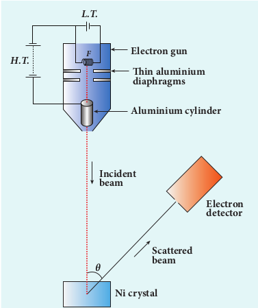
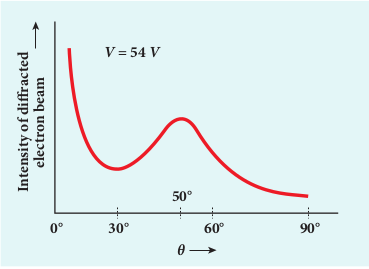
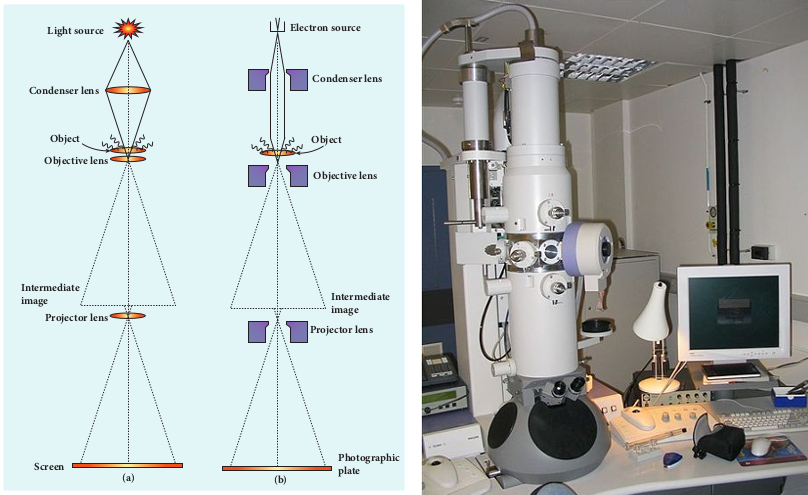
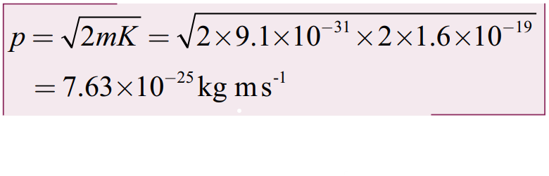
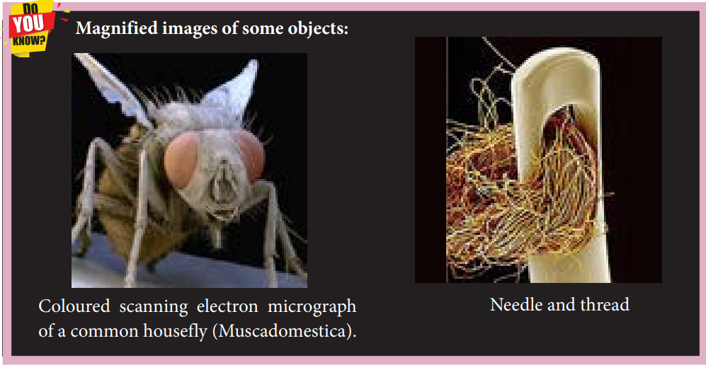
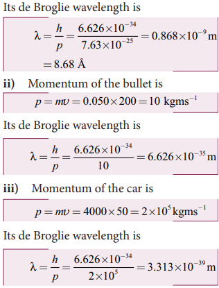

# **MATTER WAVES**
## **Introduction - Wave nature of particles**

So far, we learnt that the characteristics of particles and waves are different. A wave is specified by its frequency, wavelength, wave velocity, amplitude and intensity. It spreads out and occupies a relatively large region of space. A particle specified by its mass, velocity, momentum and energy occupies a definite position in space and is very small in size.

Classical physics treated particles and waves as distinct entities. But quantum theory suggested dual character for radiations – that is, radiation behaves as a wave at times and as a particle at other times.

From this wave – particle duality of radiation, the concept of wave nature of matter arises which we will see in this section.

**De Broglie wave:** 

The wave–particle duality of radiation was extended to matter by a French physicist Louis de Broglie (pronounced as de Broy) in 1924.

Greatly influenced by the symmetry in nature, de Broglie suggested that if radiation like light can act as particles at times, then material particles like electrons can also act as waves at times.

According to de Broglie hypothesis, all material particles like electrons, protons, neutrons in motion are associated with waves. These waves are called de Broglie waves or matter waves.  

## **De Broglie wave length:**

The momentum of photon of frequency _ν_ is given by
Formulas 

The wavelength of a photon in terms of its momentum is

Formulas 

According to de Broglie, the above equation is completely a general one and this is applicable to material particles as well. Therefore, for a particle of mass _m_ travelling with speed _v_ , the wavelength is given by
Formulas 
This wavelength of the matter waves is known as **de Broglie wavelength**. This equation relates the wave character (the wave length λ) and the particle character (the momentum _p_) through Planck’s constant.

## De Broglie wave length of electrons:

Let an electron of mass _m_ be accelerated through a potential difference of _V_ volt. The kinetic energy acquired by the electron is given by
Formulas 
Therefore, the speed υ of the electron is
Formulas 
Hence, the de Broglie wavelength of the matter waves associated with electron is
Formulas 
Substituting the known values in the above equation, we get
Formulas 
For example, if an electron is accelerated through a potential difference of 100V, then its de Broglie wavelength is 1.227 Å.
Since the kinetic energy of the electron, _K_ = _eV_, then the de Broglie wavelength associated with electron can be also written as
Formulas 

## Davisson – Germer experiment

Louis de Broglie hypothesis of matter waves was experimentally confirmed by Clinton Davisson and Lester Germer in 1927. They demonstrated that electron beams are diffracted when they fall on crystalline solids. Since crystal can act as a three-dimensional diffraction grating for matter waves, the electron waves incident on crystals are diffracted off in certain specific directions. Figure 8.17 shows a schematic representation of the apparatus for the experiment.

The filament _F_ is heated by a low tension (L.T.) battery. Electrons are emitted from the hot filament by thermionic emission. They are then accelerated due to the potential difference between the filament and the anode aluminium cylinder by a high tension (H.T.) battery. Electron beam is collimated by using two thin aluminium diaphragms and is allowed to strike a single crystal of Nickel.

**Figure 8.17 Experimental set up of Davisson – Germer experiment**
The electrons scattered by Ni atoms in different directions are received by the electron detector which measures the intensity of scattered electron beam. The detector is capable of rotation in the plane of the paper so that the angle _θ_ between the incident beam and the scattered beam can be changed at our will. The intensity of the scattered electron beam is measured as a function of the angle _θ_.

**Figure 8.18 Variation of intensity of diffracted electron beam with the angle θ**

----
**Note**
It is to be noted that electrons are not the only particles with which wave nature can be demonstrated. The waves are associated with particles like neutrons and alpha particles also when they are in motion. They undergo diffraction when they are scattered by suitable crystals. Neutron diffraction studies are highly useful for investigating crystal structures.

---

---
**Note**
Diffraction is one of the properties of waves. Whenever waves are incident on an obstacle, they bend around the edges of the obstacle. This bending of waves is called diffraction. The amount of bending depends on the wavelength of the waves. We have learnt in unit 7 that as the wavelength of light is very small, diffraction effects of light are very small. In order to study diffraction of light, diffraction gratings are used. Since x-rays and de Broglie waves of electrons have wavelengths (in the order of 10–10m) much shorter than that of the light wave, diffraction grating cannot be used in x-ray diffraction studies. In a crystal, the spacing between atomic planes is comparable to the wavelength of x-rays and de Broglie waves of electrons. Hence, in x-ray diffraction studies, the crystals are used which serve as three-dimensional grating.

---

scattered wave shows a peak or maximum at an angle of 50° to the incident electron beam. This peak in intensity is attributed to the constructive interference of electrons diffracted from various atomic layers of the target material. From the known value of interplanar spacing of Nickel, the wavelength of the electron wave was experimentally calculated as 1.65Å.

The wavelength can also be calculated from de Broglie relation for _V_ = 54 V from equation (8.12).
This value agrees very well with the experimentally observed wavelength of 1.65Å. Thus this experiment directly verifies de Broglie’s hypothesis of the wave nature of moving particles.

## Electron Microscope

**Principle** 
This is the direct application of wave nature of particles. The wave nature of the electron is used in the construction of microscope called **electron microscope**.

The resolving power of a microscope is inversely proportional to the wavelength of the radiation used for illuminating the object under study. Higher magnification as well as higher resolving power can be obtained by employing the waves of shorter wavelengths.

Louis de Broglie wavelength of electron is very much less than (a few thousands less) that of the visible light being used in optical microscopes. As a result, the microscopes employing de Broglie waves of electrons have very much higher resolving power than

optical microscope. Electron microscopes giving magnification more than 2,00,000 times are common in research laboratories.

**Working** 

The construction and working of an electron microscope is similar to that of an optical microscope except that in electron microscope focussing of electron beam is done by the electrostatic or magnetic lenses. The electron beam passing across a suitably arranged either electric or magnetic fields undergoes divergence or convergence thereby focussing of the beam is done (Figure 8.19).

The electrons emitted from the source are accelerated by high potentials. The beam is made parallel by magnetic condenser lens. When the beam passes through the sample whose magnified image is needed, the beam carries the image of the sample.

With the help of magnetic objective lens and magnetic projector lens system, the on microscope (c) Photograph of electron magnified image is obtained on the screen. These electron microscopes are being used in almost all branches of science.

**EXAMPLE 8.6**

Calculate the momentum and the de Broglie wavelength in the following cases:
(i) an electron with kinetic energy 2 eV. 
(ii) a bullet of 50 g fired from rifle with a speed of 200 m/s 
(iii) a 4000 kg car moving along the highways at 50 m/s Hence show that the wave nature of matter is important at the atomic level but is not really relevant at macroscopic level.

_Solution:_
**(i)** Momentum of the electron is

Formulas 
From these calculations, we notice that electron has significant value of de Broglie wavelength (≈10–9m which can be measured from diffraction studies) but moving bullet and car have negligibly small de Broglie wavelengths associated with them (≈10–33m and 10–39m respectively, which are not measurable by any experiment). This implies that the wave nature of matter is important at the atomic level but it is not really relevant at the macroscopic level.

**EXAMPLE 8.7**

Find the de Broglie wavelength associated with an alpha particle which is accelerated through a potential difference of 400 V. Given that the mass of the proton is 1.67 × 10–27 kg.

_Solution_ 

An alpha particle contains 2 protons and 2 neutrons. Therefore, the mass _M_ of the alpha particle is 4 times that of a proton (_mp_) (or a neutron) and its charge _q_ is twice that of a proton (+_e_).

The de Broglie wavelength associated with it is
Formulas 

**EXAMPLE 8.8**

A proton and an electron have same de Broglie wavelength. Which of them moves faster and which possesses more kinetic energy?

_Solution_

We know that λ = _h mK_2 Since proton and electron have same de Broglie wavelength, we get
Formulas 
Since _m m K Ke p p e_< <, , the electron has more kinetic energy than the proton.
FOrmulas 
Since _m me p p e_< <, _v v_ , the electron moves faster than the proton.
