# **PHOTO ELECTRIC EFFECT**

## **Hertz, Hallwachs and Lenard’s observation**

**Hertz observation** 

Maxwell’s theory of electromagnetism predicted the existence of electromagnetic waves and concluded that light itself is just an electromagnetic wave. Then the experimentalists tried to generate and detect electromagnetic waves through various experiments.

In 1887, Heinrich Hertz was successful in generating and detecting electromagnetic wave with his high voltage induction coil causing a spark discharge between two metallic spheres (we have learnt this in Unit 5 of XII standard physics). When a spark is formed, the charges will oscillate back and forth rapidly and the electromagnetic waves are produced.

The electromagnetic waves thus produced were detected by a detector that has a copper wire bent in the shape of a circle. Although the detection of waves is successful, there is a problem in observing the tiny spark produced in the detector.

In order to improve the visibility of the spark, Hertz made many attempts and finally noticed an important thing that small detector spark became more vigorous when it was exposed to ultraviolet light.

The reason for this behaviour of the spark was not known at that time. Later it was found that it is due to the photoelectric emission. Whenever ultraviolet light is incident on the metallic sphere, the electrons on the outer surface are emitted which caused the spark to be more vigorous.

---
**Do You Know ?**
It is interesting to note that the experiment of Hertz confirmed that light is an electromagnetic wave. But the same experiment also produced the first evidence for particle nature of light.

---

**Hallwachs’ observation** 

In 1888, Wilhelm Hallwachs, a German physicist, confirmed that the strange behaviour of the spark is due to the action of ultraviolet light with his simple experiment.

A clean circular plate of zinc is mounted on an insulating stand and is attached to a gold leaf electroscope by a wire. When the uncharged zinc plate is irradiated by ultraviolet light from an arc lamp, it becomes positively charged and the leaves will open as shown in Figure 8.6(a).

Further, if the negatively charged zinc plate is exposed to ultraviolet light, the leaves will come closer as the charges leaked away quickly (Figure 8.6(b)). If the plate is positively charged, it becomes more positive upon UV rays irradiation and the leaves open further (Figure 8.6(c)). From these observations, it was concluded that negatively charged electrons were emitted from the zinc plate under the action of ultraviolet light.
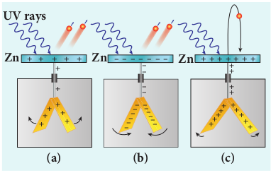
**Figure 8.6 Irradiation of ultraviolet light on (a) uncharged zinc plate (b) negatively charged plate (c) positively charged plate**

**Lenard’s observation** 

In 1902, Lenard studied this electron emission phenomenon in detail. His simple experimental setup is shown in Figure 8.7. The apparatus consists of two metallic plates _A_ and _C_ placed in an evacuated quartz bulb. The galvanometer _G_ and battery _B_ are connected in the circuit.
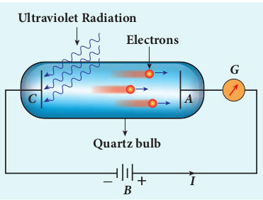
**Figure 8.7 Experimental setup of Lenard**

When ultraviolet light is incident on the negative plate _C_, an electric current flows in the circuit that is indicated by the deflection in the galvanometer. On other hand, if the positive plate is irradiated by the ultraviolet light, no current is observed 
in the circuit.

From these observations, it is concluded that when ultraviolet light falls on the negative plate, electrons are ejected from it which are attracted by the positive plate _A_. On reaching the positive plate through the evacuated bulb, the circuit is completed and the current flows in it. Thus, the ultraviolet light falling on the negative plate causes the electron emission from the surface of the plate.

**Photoelectric effect** 

The ejection of electrons from a metal plate when illuminated by light or any other electromagnetic radiation of suitable wavelength (or frequency) is called **photoelectric effect**. Although these electrons are not different from all other electrons, it is customary to call them as **photoelectrons** and the corresponding current as **photoelectric current or photo current**.

Metals like cadmium, zinc, magnesium etc show photoelectric emission with ultraviolet light while some alkali metals lithium, sodium, caesium respond well even to larger wavelength radiation like visible light. The materials which eject photoelectrons upon irradiation of electromagnetic wave of suitable wavelength are called **photosensitive materials**.

## **Effect of intensity of incident light on photoelectric current**

**Experimental setup** 

The apparatus shown in Figure 8.8 is employed to study the phenomenon of photoelectric effect in detail. _S_ is a source of electromagnetic waves of known and variable frequency _ν_ and intensity _I_. _C_ is

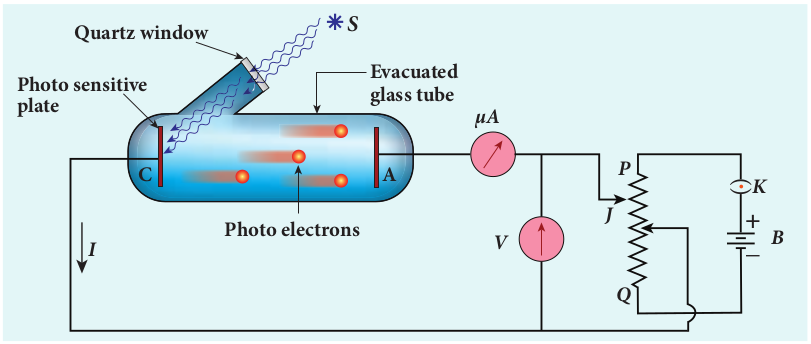
**Figure 8.8 Experimental setup for the study Of Photoelectronic effect**

the cathode (negative electrode) made up of photosensitive material and is used to emit electrons. The anode (positive electrode) _A_ collects the electrons emitted from _C_. These electrodes are kept in an evacuated glass envelope with a quartz window that permits the passage of ultraviolet and visible light.

The necessary potential difference between _C_ and _A_ is provided by high tension battery _B_ which is connected across a potential divider arrangement _PQ_ through a key _K_. _C_ is connected to the centre terminal while _A_ to the sliding contact _J_ of the potential divider. The plate _A_ can be maintained at a desired positive or negative potential with respect to _C_. To measure both positive and negative potential of _A_ with respect to _C_, the voltmeter is designed to have its zero marking at the centre and is connected between _A_ and _C_. The current is measured by a micro ammeter _mA_ connected in series.

If there is no light falling on the cathode _C_, no photoelectrons are emitted and the microammeter reads zero. When ultraviolet or visible light is allowed to fall on _C_, the photoelectrons are liberated and are attracted towards anode. As a result, the photoelectric current is set up in the circuit which is measured using micro ammeter.

The variation of photocurrent with respect to (i) intensity of incident light (ii) the potential difference between the electrodes (iii) the nature of the material and (iv) frequency of incident light can be studied with the help of this arrangement.

**Effect of intensity of incident light on photoelectric current**

To study the effect of intensity of incident light on photoelectric current, the frequency of the incident light and the accelerating potential _V_ of the anode are kept constant. Here the potential of _A_ is kept positive with respect to that of _C_ so that the electrons emitted from _C_ are attracted towards _A_. Now, the intensity of the incident light is varied and the corresponding photoelectric current is measured.

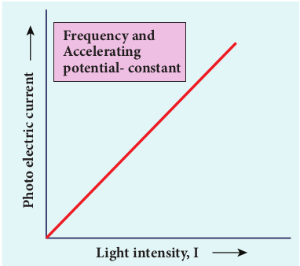
**Figure 8.9 Variation of photocurrent with intensity**

A graph is drawn between light intensity along x-axis and the photocurrent along y-axis. From the graph in Figure 8.9, it is evident that _photocurrent – the number of electrons emitted per second – is directly proportional to the intensity of the incident light_.  

---
**Note**

Here, intensity of light means brightness. A bright light has more intensity than a dim light.

---

## **Effect of potential difference on photoelectric current**

To study the effect of potential difference _V_ between the electrodes on photoelectric current, the frequency and intensity of the incident light are kept constant. Initially the potential of _A_ is kept positive with respect to _C_ and the cathode is irradiated with the given light.

Now, the potential of _A_ is increased and the corresponding photocurrent is noted. As the potential of _A_ is increased, photocurrent also increases. However a stage is reached where photocurrent reaches a saturation value (saturation current) at which all the photoelectrons from _C_ are collected by _A_. This is represented by the flat portion of the graph between potential of _A_ and photocurrent (Figure 8.10).

When a negative (retarding) potential is applied to _A_ with respect to _C_, the current does not immediately drop to zero because the photoelectrons are emitted with some definite and different kinetic energies. The kinetic energy of some of the photoelectrons is such that they could overcome the retarding electric field and reach the electrode _A_.

When the negative (retarding) potential of _A_ is gradually increased, the photocurrent starts to decrease because more and more photoelectrons are being repelled away from reaching the electrode _A_. The photocurrent becomes zero at a particular negative potential _V_0, called stopping or cut-off potential.
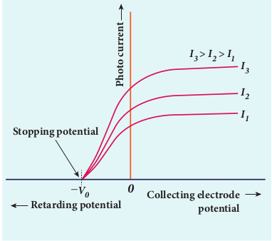
**Figure 8.10 Variation of photocurrent with potential difference**

**Stopping potential** is that value of the negative (retarding) potential given to the collecting electrode _A_ which is just sufficient to stop the most energetic photoelectrons emitted and make the photocurrent zero.

At the stopping potential, even the most energetic electron is brought to rest. Therefore, the initial kinetic energy of the fastest electron (_K_max) is equal to the work done by the stopping potential to stop it (_eV_0).
where _v_max is the maximum speed of the emitted photoelectron.
From equation (8.1),
Formulas 
From the Figure 8.10, when the intensity of the incident light alone is increased, the saturation current also increases but the value of _V_0 remains constant.

Thus, for a given frequency of the incident light, the stopping potential is independent of intensity of the incident light. This also implies that _the maximum kinetic energy of the photoelectrons is independent of intensity of the incident light_.

## **Effect of frequency of incident light on stopping potential**

To study the effect of frequency of incident light on stopping potential, the intensity of the incident light is kept constant. The variation of photocurrent with the collecting electrode potential is studied for radiations of different frequencies and a graph drawn between them is shown in Figure 8.11. From the graph, it is clear that stopping potential vary over different frequencies of incident light.
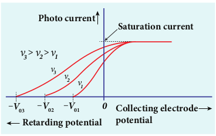
**Figure 8.11 Variation of photocurrent with collector electrode potential for different frequencies of the incident radiation**
Greater the frequency of the incident radiation, larger is the corresponding stopping potential. This implies that _as the frequency is increased, the photoelectrons are emitted with greater kinetic energies so that the retarding potential needed to stop the photoelectrons is also greater_.
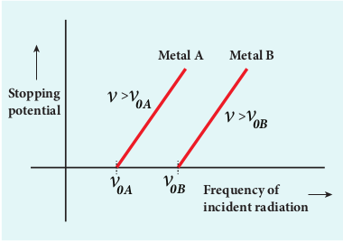
**Figure 8.12 Variation of stopping potential with frequency of the incident radiation for two metals**

Now a graph is drawn between frequency of incident radiation and the stopping potential for different metals (Figure 8.12). From this graph, it is found that stopping potential varies linearly with frequency. Below a certain frequency called threshold frequency, no electrons are emitted; hence stopping potential is zero for that reason. But as the frequency is increased above threshold value, the stopping potential varies linearly with the frequency of incident light.

## **Laws of photoelectric effect**

The above detailed experimental investigations of photoelectric effect revealed the following results: 
i) For a given metallic surface, the emission of photoelectrons takes place only if the frequency of incident light is greater than a certain minimum frequency called the threshold frequency.
ii) For a given frequency of incident light (above threshold value), the number of photoelectrons emitted is directly proportional to the intensity of the incident light. The saturation current is also directly proportional to the intensity of incident light.
iii) Maximum kinetic energy of the photo electrons is independent of intensity of the incident light.
iv) Maximum kinetic energy of the photo electrons from a given metal is directly proportional to the frequency of incident light.
v) There is no time lag between incidence of light and ejection of photoelectrons.

Once photoelectric phenomenon has been thoroughly examined through various experiments, the attempts were made to explain it on the basis of wave theory of light.

## **Concept of quantization of energy**

**Failures of classical wave theory**

 From Maxwell’s theory (Refer unit 5 of volume 1), we learnt that light is an electromagnetic wave consisting of coupled electric and magnetic oscillations that move with the speed of light and exhibit typical wave behaviour. Let us try to explain the experimental observations of photoelectric effect using wave picture of light.

**(i)** When light is incident on a metallic surface, there is a continuous supply of energy to the electrons in the metal surface. According to wave theory, light of greater intensity should impart greater kinetic energy to the liberated electrons (Here, Intensity of light is the energy delivered per unit area per unit time).But this does not happen. The experiments show that maximum kinetic energy of the photoelectrons emitted does not depend on the intensity of the incident light.

**(ii)** According to wave theory, if a sufficiently intense beam of light is incident on the surface, electrons should be liberated from the surface of the target, however low the frequency of the radiation is. From the experiments, it is found that photoelectric emission is not possible below a certain minimum frequency of incident radition. Therefore, the wave theory fails to explain the existence of threshold frequency.

**(iii)** Since the energy of light is spread across the entire wavefront, the electrons which receive energy from it are large in number. Each electron needs considerable amount of time (a few hours) to get energy sufficient to overcome the work function and to get liberated from the surface.

But experiments show that photoelectric emission is almost instantaneous process (the time lag is less than 10–9 _s_ after the surface is illuminated) which could not be explained by wave theory.

Thus, the experimental observations of photoelectric emission could not be explained on the basis of the wave theory of light.

**EXAMPLE 8.1**

For the photoelectric emission from cesium, show that wave theory predicts that

**(i)** maximum kinetic energy of the photoelectrons (_K_max) depends on the intensity _I_ of the incident light

**(ii)** _K_max does not depend on the frequency of the incident light and

**(iii)** the time interval between the incidence of light and the ejection of photoelectrons is very long.  

For the sake of simplicity, the following standard assumptions can be made when light is incident on the given material.

(a) Light is absorbed in the top atomic layer of the metal

(b) For a given element, each atom absorbs an equal amount of energy and this energy is proportional to its cross-sectional area _A_

(c) Each atom gives this energy to one of the electrons.

(Given : The work function for cesium is 2.14 eV and the power absorbed per unit area is 1 60 10 6 2. × − −Wm which produces a measurable photocurrent in cesium.)

**_Solution_**

**(i)** According to wave theory, the energy in a light wave is spread out uniformly and continuously over the wavefront.
The energy absorbed by each electron in time _t_ is given by
_E = IAt_
With this energy absorbed, the most energetic electron is released with _K_max by overcoming the surface energy barrier or work function _ϕ_0 and this is expressed as
_K IAt_max = − _ϕ_0 (1)
Thus, wave theory predicts that for a unit time, at low light intensities when _IA < ϕ_0, no electrons are emitted. At higher intensities, when _IA ≥ ϕ_0, electrons are emitted. This implies that higher the light intensity, greater will be _K_max_._
_K_max is dependent only on the intensity under given conditions – that is, by suitably increasing the intensity, one can produce
photoelectric effect even if the frequency is less than the threshold frequency. So the concept of threshold frequency does not even exist in wave theory.

**(ii)** According to wave theory, the intensity of a light wave is proportional to the square of the amplitude of the electric field ( )._E_0 2 The amplitude of this electric field increases with increasing intensity and imparts an increasing acceleration and kinetic energy to an electron. Now _I_ is replaced with a quantity proportional to _E_0 2 in equation (1). This means that _K_max should not depend at all on the frequency of the classical light wave which again contradicts the experimental results.

**(iii)** If an electron accumulates light energy just enough to overcome the work function, then it is ejected out of the atom with zero kinetic energy. Therefore, from equation (1), 0 0= −_IAt ϕ_ _t IA I r_ \= = _ϕ ϕ_ π 0 0 2( )

By taking the atomic radius _r_ \= × −1 0 10 10. m and substituting the given values of _I_ and _ϕ_0, we can estimate the time interval as
Thus, wave theory predicts that there is a large time gap between the incidence of light and the ejection of photoelectrons but the experiments show that photo emission is an instantaneous process.

 **Concept of quantization of energy** 

Max Planck proposed quantum concept in 1900 in order to explain the thermal radiations emitted by a black body and the shape of its radiation curves.

According to Planck, matter is composed of a large number of oscillating particles (atoms) which vibrate with different frequencies. Each atomic oscillator - which vibrates with its characteristic frequency - emits or absorbs electromagnetic radiation of the same frequency. It also says that 

(i) If an oscillator vibrates with frequency _v_,its energy can have only certain discrete values, given by the equation. _En_= _nhν_ _n_=_1,2,3...._ (8.5) where _h_ is a constant, called Planck’s constant.

(ii) The oscillators emit or absorb energy in small packets or quanta and the energy of each quantum is _hν_.

This implies that the energy of the oscillator is quantized – that is, energy is not continuous as believed in the wave picture. This is called **quantization of energy**.

## **Particle nature of light: Einstein’s explanation**

Einstein extended Planck’s quantum concept to explain the photoelectric effect in 1905. According to Einstein, the energy in light is not spread out over wavefronts but is concentrated in small packets or energy quanta. Therefore, light (or any other electromagnetic waves) of frequency _v_ from any source can be considered as a stream of quanta and the energy of each light quantum is given by _E_ = _hν_.He also proposed that a quantum of light has linear momentum and the magnitude particle is _p_ = _hv_/c. The light quantum can behave as a particle and this is called photon. Therefore, photon is nothing but particle manifestation of light.

**Characteristics of photons:** 

According to particle nature of light, photons are the basic constituents of any radiation and possess the following characteristic properties:

(i) The photons of light of frequency _ν_ and wavelength λ will have energy, given by
_E_=_hv_=_hc/λ_.

(ii) The energy of a photon is determined by the frequency of the radiation and not by its intensity and the intensity has no relation with the energy of the individual photons in the beam.

(iii) The photons travel with the speed of light and its momentum is given by
_p_=_h/λ_=_hν/λ_.

(iv) Since photons are electrically neutral, they are unaffected by electric and magnetic fields.

(v) When a photon interacts with matter (photon-electron collision), the total energy, total linear momentum and angular momentum are conserved. Since photon may be absorbed or a new photon may be produced in such interactions, the number of photons may not be conserved.

---
**Note**
According to quantum concept, intensity of light of given wavelength is defined as the number of energy quanta or photons incident per unit area per unit time, with each photon having same energy. Its unit is Wm–2.

---

**Einstein’s explanation of photoelectric equation**
When a photon of energy _hν_ is incident on a metal surface, it is completely absorbed by a single electron and the electron is ejected. In this process, a part of the photon energy is used in overcoming the potential barrier of the metal surface (photoelectric work function _ϕ_0 )and the remaining energy as the kinetic energy of the ejected electron. From the law of conservation of energy, 
Formulas 
where _m_ is the mass of the electron and _v_ its velocity. This is shown in Figure 8.13(a).
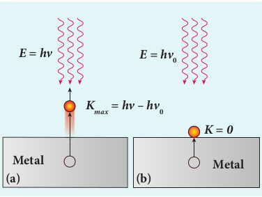
**Figure 8.13 Emission of photoelectrons**

If we reduce the frequency of the incident light, the speed or kinetic energy of photo electrons is also reduced. At some frequency _ν0_ of incident radiation, the photo electrons are just ejected with almost zero kinetic energy (Figure 8.13(b)). Then the equation (8.6) becomes

where _ν0_ is the threshold frequency. By rewriting the equation (8.6), we get
The equation (8.7) is known as **Einstein’s photoelectric equation**.
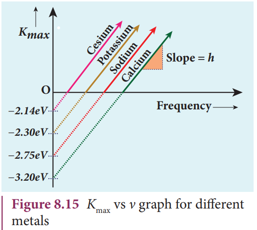

If the electron does not lose energy by internal collisions, then it is emitted with maximum kinetic energy _K_max. Then where _v_max is the maximum velocity of the electron ejected. The equation (8.6) is rearranged as follows:
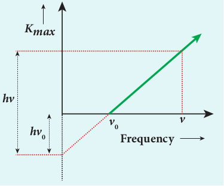

A graph between maximum kinetic energy _K_max of the photoelectron and frequency _ν_ of the incident light is a straight line as shown in Figure 8.14. The slope of the line is _h_ and its y-intercept is –_ϕ_0.

Einstein’s equation was experimentally verified by R.A. Millikan. He drew _K_max versus _ν_ graph for many metals (cesium, potassium, sodium and lithium) as shown in Figure 8.15 and found that the slope is independent of the metals.  

**Figure 8.15 Kmax vs ν graph for different** metals

Millikan also calculated the value of Planck’s constant (_h_ \= 6.626 × 10–34 Js) and work function of many metals (Cs, K, Na, Ca); these values are in agreement with the theoretical prediction.

**Explanation for the photoelectric effect:** 

The experimentally observed facts of photoelectric effect can be explained with the help of Einstein’s photoelectric equation.

**i)** As each incident photon liberates one electron, then the increase of intensity of the light (the number of photons per unit area per unit time) increases the number of electrons emitted thereby increasing the photocurrent. The same has been experimentally observed.

**ii)** From _Kmax_ \= _hv_ – _ϕ0_, it is evident that _Kmax_ is proportional to the frequency of the incident light and is independent of intensity of the light.

**iii)** As given in equation (8.7), there must be minimum energy (equal to the work function of the metal) for incident photons to liberate electrons from the metal surface. Below this value of energy, emission of electrons is not possible. Correspondingly, there exists minimum frequency called threshold frequency below which there is no photoelectric emission.

**iv)** According to quantum concept, the transfer of photon energy to the electrons is instantaneous so that there is no time lag between incidence of photons and ejection of electrons. Thus, the photoelectric effect is explained on the basis of quantum concept of light.

**The nature of light: wave - particle duality** 

We have learnt that wave nature of light explains phenomena such as interference, diffraction and polarization. Certain phenomena like black body radiation, photoelectric effect can be explained by assigning particle nature to light. Therefore, both theories have enough experimental evidences.

In the past, many scientific theories have been either revised or discarded when they contradicted with new experimental results. Here, two different theories are needed to answer the question: what is nature of light?

It is therefore concluded that light possesses dual nature, that of both particle and wave. It behaves like a wave at some circumstances and it behaves like a particle at some other circumstances.

In other words, light behaves as a wave during its propagation and behaves as a particle during its interaction with matter. Both theories are necessary for complete description of physical phenomena. Hence, the wave nature and quantum nature complement each other.

A reader may find it difficult to u stream of particle. This is the case ev Einstein once wrote a letter to his frustration:

“All these fifty years of conscious broodin question, ‘What are light quanta?’ Of course t but he is deluding himself ”.  

## **Photo electric cells and their applications**

**Photo cell** 

Photo electric cell or photo cell is a device which converts light energy into electrical energy. It works on the principle of photo electric effect. When light is incident on the photosensitive materials, their electric properties will get affected, based on which photo cells are classified into three types. They are 

i) **Photo emissive cell:** 
Its working depends on the electron emission from a metal cathode due to irradiation of light or other radiations.

ii) **Photo voltaic cell:** 
Here sensitive element made of semiconductor is used which generates voltage proportional to the intensity of light or other radiations.

iii) **Photo conductive cell:** 
In this, the resistance of the semiconductor changes in accordance with the radiant energy incident on it. In this section, we discuss about photo emissive cell and its applications.

**Do you know:**

A reader may find it difficult to understand how light can be both a wave and a
stream of particle. This is the case even for great scientist like Albert Einstein.
Einstein once wrote a letter to his friend Michel Besso in 1954 expressing
his frustration:
“All these fifty years of conscious brooding have brought me no closer to answer the
question, ‘What are light quanta?’ Of course today everyone thinks he knows the answer,
but he is deluding himself ”

**Photo emissive cell**

**Construction:** 

It consists of an evacuated glass or quartz bulb in which two metallic electrodes – that is, a cathode and an anode are fixed as shown in Figure 8.16.

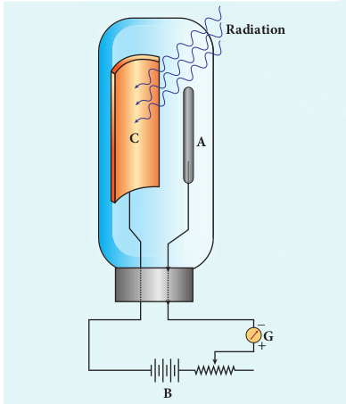

**Figure 8.16 Construction of photo cell**

**Working:** 

When cathode is irradiated with suitable radiation, electrons are emitted from it. These electrons are attracted by anode and hence a current is produced which is measured by the galvanometer. For a given cathode, the magnitude of the current depends on 
i) the intensity of incident radiation and 
ii) the potential difference between anode and cathode.

**Applications of photo cells:** 

Photo cells have many applications, especially as switches and sensors. Automatic lights that turn on when it gets dark use photocells, and street lights that switch on and switch off according to whether it is night or day use photocells.

Photo cells are used for reproduction of sound in motion pictures and are used as timers to measure the speeds of athletes during a race. Photo cells of exposure meters in photography are used to measure the intensity of the given light and to calculate the exact time of exposure.

**EXAMPLE 8.2**

A radiation of wavelength 300 nm is incident on a silver surface. Will photoelectrons be observed? \[work function of silver = 4.7 eV\]

**_Solution:_**

Energy of the incident photon is
Substituting the known values, we get

The work function of silver = 4.7 eV. Since the energy of the incident photon is less than the work function of silver, photoelectrons are not observed in this case.

**EXAMPLE 8.3**

When light of wavelength 2200Å falls on Cu, photo electrons are emitted from it. Find (i) the threshold wavelength and (ii) the stopping potential. Given: the work function for Cu is _ϕ_0 **\=** 4.65 eV.
**_Solution_**
i) The threshold wavelength is given by
FOrmulas 
ii) Energy of the photon of wavelength 2200 Å is
Formulas 

**EXAMPLE 8.4**

The work function of potassium is 2.30 eV. UV light of wavelength 3000 Å and intensity 2 Wm–2 is incident on the potassium surface. i) Determine the maximum kinetic energy of the photo electrons ii) If 40% of incident photons produce photo electrons, how many electrons are emitted per second if the area of the potassium surface is 2 cm2 ?

**_Solution_**

i) The energy of the incident photon is
FOrmulas 
Maximum KE of the photoelectrons is _K_max = _hv_ – _ϕ_0 = 4.14 – 2.30 = 1.84 eV  
ii) The number of photons reaching the surface per second is
FOrmulas 

The rate of emission of photoelectrons is
Formulas 

**EXAMPLE 8.5**

Light of wavelength 390 nm is directed at a metal electrode. To find the energy of electrons ejected, an opposing potential difference is established between it and another electrode. The current of photoelectrons from one to the other is stopped completely when the potential difference is 1.10 V. Determine i) the work function of the metal and ii) the maximum wavelength of light that can eject electrons from this metal.

**_Solution_**

(i) The work function is given by

Formulas 
(ii) The threshold wavelength is
Formaulas 
(Iii) The number of photons reaching the surface per second isIn =× AE2= ××21 06.626×10p =×60. 41 0  photons / secThe rate of emission of photoe−le4 ctrons is () −19= 04.. 00n 14=× 46 .04×10= 2.416´10  photoelectrons / sec14p14 

_Solution_
(i) The threshold wavelength is given byhc 6.626××10 31× 0λ ==ϕ 4.65××16. 10= 2672 Å− 34 8
(ii) En0erg y o f t he p hoton o f wa− 19 velength 2200 Å is  0hc 6.626××10 31× 0E ==λ 2200×10=×9..035 10 J =−3456 5 eV 8We k now t hat k inetic en er−10 g y o f fa stest photo electron is−19K  = hv – ϕ  = 5.65 – 4.65= 1 eVFrom equation (8.3), Ke = Vmax 0K 11××.61 0V ==e 16. ×10Therefore, stopping potmaenx tial = 1 0 V−19max0 −19

