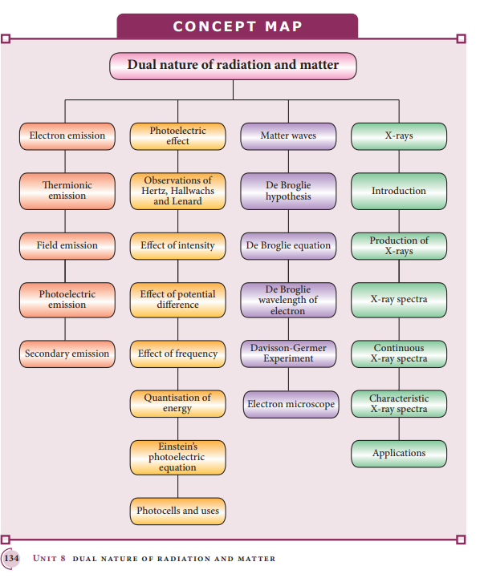
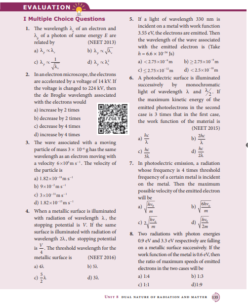
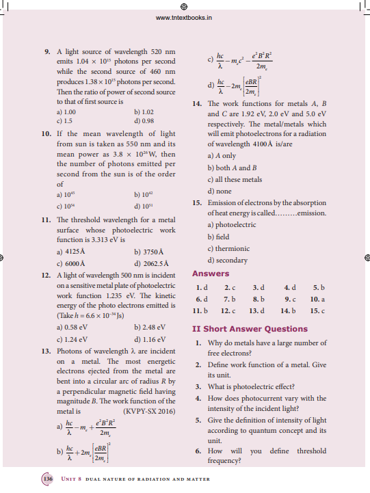
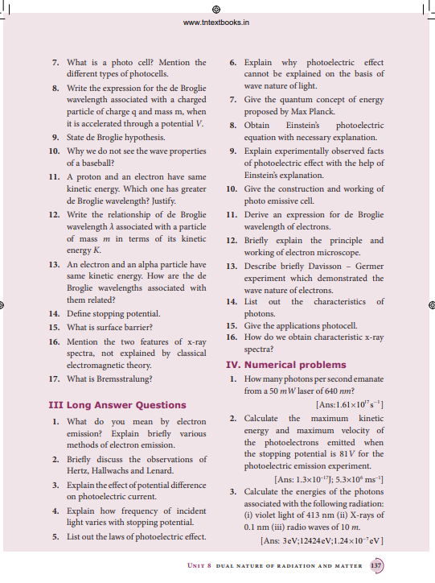
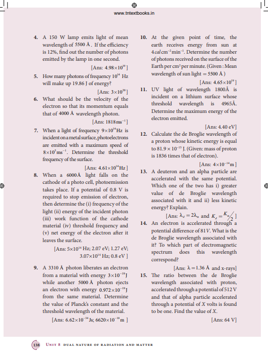
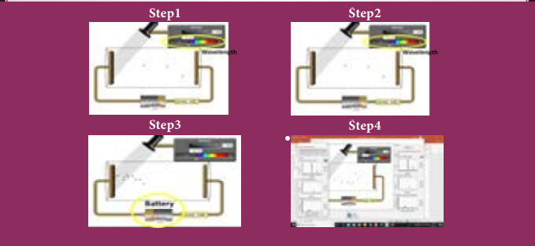

# **Summary**
- Particle is a material object which is considered as a tiny concentration of matter (localized in space and time) whereas wave is a broad distribution of energy (not localized in space and time).
- The liberation of electrons from any surface of a substance is called electron emission.
- The minimum energy needed for an electron to escape from the metal surface is called work function of that metal. 
- 1 eV is equal to 1.602 × 10 –19 J. The emission of electrons by supplying thermal energy is known as thermionic emission.
- Electric field emission occurs when a very strong electric field is applied across the metal.
- The emission of electrons due to irradiation of light is called photoelectric emission.
- Secondary emission is the process in which electrons are emitted due to the bombardment of fast moving electrons.
- The photoelectric current (i.e. the number of electrons emitted per second) is directly
proportional to the intensity of the incident light.
- Stopping potential is that the value of the negative (retarding) potential given to the collecting electrode A which is just sufficient to stop the most energetic photoelectrons emitted and make the photocurrent zero.
- The stopping potential is independent of intensity of the incident light.
- Maximum kinetic energy of the photoelectrons is independent of intensity of the incident light.
- For a given surface, the emission of photoelectrons takes place only if the frequency of incident light is greater than a certain minimum frequency called the threshold frequency.
- According to Planck, a matter is composed of a large number of oscillating particles (atoms) which vibrate with different frequencies.
- According to Einstein, the energy in light is not spread out over wavefronts but is concentrated in small packets or energy quanta.
- The individual light quantum of definite energy and momentum is called photon. 
- Light behaves as a wave during its propagation and behaves as a particle during its interaction with matter.
- Photo electric cell or photo cell is a device which converts light energy into electrical energy.
- According to de Broglie hypothesis, all material particles like electrons, protons,neutrons in motion possess wave nature. These waves associated with them are called de Broglie waves or matter waves.
- Wave nature of the electron is used in the construction of electron microscope.
- Louis de Broglie hypothesis of matter waves was experimentally confirmed by Clinton Davisson and Lester Germer in 1927.
- Whenever fast moving electrons fall on the materials, a highly penetrating radiations, namely x-rays, are emitted.
- Continuous x-ray spectrum consists of radiations of all possible wavelengths with a certain minimum wavelength λ 0 .
- Characteristic x-ray spectra show some narrow peaks at some well–defined wavelengths when the target is hit by fast electrons.

**BOOK FOR REFERENCES**
1. Arthur Beiser, Shobhit Mahajan, Rai Choudhury, Concepts of Modern Physics, Sixth 
Edition, McGraw Hill Education (India) Private Limited.
2. H.S. Mani and G.K. Mehta, Introduction to Modern Physics, Affiliated East-West Press 
Pvt. Ltd.
3. H.C.Verma, Concepts of Physics, Volume 1 and 2, BharathiBhawan publishers. 
4. Halliday, Resnick and Walker, Principles of Physics, Wiley publishers. 

**ICT CORNER**

**Dual nature of radiation and matter**

**Topic: Photoelectric effect**

In this activity you will be able to visualize how
light knocks electrons off a metal target and
describe the photoelectric effect experiment.

**Steps:**

• Open the browser and type “https://phet.colorado.edu/en/simulation/legacy/photoelectric” in the
address bar.

• Change intensity of light and observe how the intensity of light will affect the photo electric current
and the energy of electrons

• By adjusting the value of wavelength and observe how the wavelength of light will affect the photo
electric current and the energy of electrons

• Adjust the value of voltage from the battery and analyse the effect of potential difference on the
photoelectric current.

• Change the material of the target and analyse how it will affect the current and the energy of electrons.

• Study the photo electric current – voltage graph and Photo electric current - intensity graph obtained 

**Note:**

Install Java application if it is not in your browser.
You can download all the phet simulation and works in off line from https://phet.colorado.edu/en/offline-access.

**URL:**
https://phet.colorado.edu/en/simulation/legacy/photoelectric

* Pictures are indicative only.
* If browser requires, allow Flash Player or Java Script to load the page.
