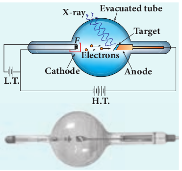
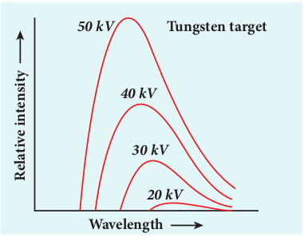
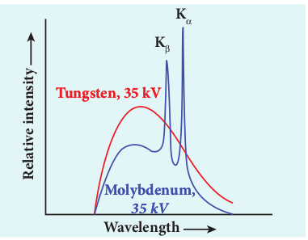
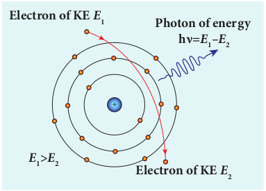
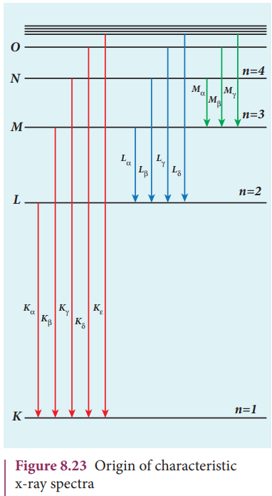

# **X - Rays**
**Introduction** 

Quantum theory of radiation explains photoelectric effect in which the electrons are emitted due to the incidence of photons and the energy is transferred from photons to the electrons. Immediately, a question arises: Is the reverse process also possible?

This means that whether kinetic energy of electron can be transformed into photon energy or not. The phenomenon which answers this question has already been discovered, even before Planck’s quantum theory of radiation.

**Discovery of x-rays** 

Wilhelm Roentgen in 1895 discovered that whenever fast moving electrons fall on certain materials, a highly penetrating radiation is emitted. Since their origin was not known at that time, they were called x-rays.

X-rays are electromagnetic waves of short wavelength ranging from 0.1 to 100_Å_. They travel along straight lines with the velocity of light and are not affected by electric and magnetic fields. X-ray photons are highly energetic because of its high frequency or short wavelength. Therefore, they can pass through materials which are opaque to visible light.

The quality of x-rays is measured in terms of their penetrating power which depends on the velocity with which the electrons strike the target material and the atomic number of target material. The intensity of x-rays is dependent on the number of electrons striking the target.

**Production of x-rays** 

X-rays are produced in x-ray tube which is essentially a discharge tube as shown in Figure 8.20. A tungsten filament _F_ is heated to incandescence by a battery. As a result, electrons are emitted from it by thermionic emission.

The electrons are accelerated to high speeds by the voltage applied between the filament _F_ and the anode. The target materials like tungsten, molybdenum are embedded in the face of the solid copper anode. The face of the target is inclined at an angle of 45° with respect to the electron beam so that x-rays can leave the tube through its side.

When high-speed electrons strike the target, they are decelerated suddenly and lose their kinetic energy. As a result, x-ray photons are produced. Since most of the kinetic energy of the bombarding electrons gets converted into heat, targets made of high-melting-point metals and a cooling system are usually employed.

**X-ray spectra** 

X-rays are produced when fast moving electrons strike the metal target. The intensity of the x-rays when plotted against its wavelength gives a curve called **x-ray spectrum** (Figure 8.21(a) and (b)). X-ray spectra consist of two parts: a continuous spectrum and a series of peaks superimposed on it.

The **continuous spectrum** consists of radiations of all possible wavelengths with a certain minimum wavelength λ0 which depends on the voltage across the electrodes. The peaks are characteristics of the material of the target and hence it is called **characteristic spectrum**. Figure 8.21(a) depicts the x-ray spectra of tungsten at various accelerating voltages and Figure 8.21(b) shows the x-ray spectra of tungsten and molybdenum at a particular accelerating voltage.  

**Figure 8.21 (a) X-ray spectra of tungsten at various accelerating potentials**
*
**Figure 8.21 (b) X-ray spectra of tungsten and molybdenum at 35 _kV_ accelerating potential**
Though classical electromagnetic theory suggests the emission of radiations from accelerating electrons, it could not explain two features exhibited by x-ray spectra. These features are given below. 
(i) For a given accelerating voltage, the lower limit for the wavelength of continuous x-ray spectra is same for all targets. This minimum wavelength is called cut-off wavelength. 
(ii) The intensity of x-rays is significantly increased at certain well-defined wavelengths as shown in the case of characteristic x-ray spectra for molybdenum (Figure 8.21(b)).  

But these two features could be explained on the basis of photon theory of radiation. **Continuous x-ray spectra** When a fast moving electron penetrates and approaches a target nucleus, the interaction between the electron and the nucleus either accelerates or decelerates it which results in a change of path of the electron. The radiation produced from such decelerating electron is called **Bremsstrahlung or braking radiation** (Figure 8.22).

**Figure 8.22 Bremsstrahlung photon from a decelerating electron**
The energy of the photon emitted is equal to the loss of kinetic energy of the electron. Since an electron may lose part or all of its energy to the photon, the photons are emitted with all possible energies (or frequencies). The continuous x-ray spectrum is due to such radiations.

When an electron gives up all its energy, then the photon is emitted with highest frequency _ν0_ (or lowest wavelength λ0 ). The initial kinetic energy of an electron is given by _eV_ where _V_ is the accelerating voltage. Therefore, we have
Formulas 
where λ0 is the cut-off wavelength. Substituting the known values in the above equation, we get
FOrmulas 
The relation given by equation (8.14) is known as the **Duane – Hunt formula**.

The value of λ0 depends only on the accelerating potential and is same for all targets. This is in good agreement with the experimental results. Thus, the production of continuous x-ray spectrum and the origin of cut – off wavelength can be explained on the basis of photon theory of radiation.

**Characteristic x – ray spectra:** 

X – ray spectra show some narrow peaks at some well – defined wavelengths when the target is hit by fast electrons. The line spectrum showing these peaks is called **characteristic x – ray** **spectrum**. This x – ray spectrum is due to the electronic transitions within the atoms.

When an energetic electron penetrates into the target atom and it can remove some of the _K_\-shell electrons. Then the electrons from outer orbits jump to fill up the vacancy so created in the _K_\-shell. During the downward transition, the energy difference between the levels is given out in the form of x– ray photon of definite wavelength. Such wavelengths, characteristic of the target, constitute the line spectrum.

From the Figure 8.23, it is evident that _K_\-series of lines in the x-ray spectrum of an element arises due to the electronic transitions from _L_, _M_, _N_, . . levels to the _K_\-level. Similarly, the longer wavelength _L_\-series originates when an _L_\-electron is knocked out of the atom and the corresponding vacancy is filled by the
  
Images 

electronic transitions from _M_, _N_, _O_ level to the L-level and so on.
**Applications of x-rays:** 

X-rays are being used in many fields. Let us list a few of them.
**(1) Medical diagnosis** 

X-rays can pass through flesh more easily than through bones. Thus an x-ray
Formulas 

radiograph containing a deep shadow of the bones and a light shadow of the flesh may be obtained. X-ray radiographs are used to detect fractures, foreign bodies, diseased organs etc.

**(2)Medical therapy** 
Since x-rays can kill diseased tissues, they are employed to cure skin diseases, malignant tumours etc.

**(3)Industry** 

X-rays are used to check for flaws in welded joints, motor tyres, tennis balls and wood. At the custom post, they are used for detection of contraband goods.

**(4)Scientific research** 

X-ray diffraction is important toolto study the structure of the crystalline materials – that is, the arrangement of atoms and molecules in crystals.

**EXAMPLE 8.9**

Calculate the cut-off wavelength and cut- off frequency of x-rays from an x –ray tube of accelerating potential 20,000 V.

**_Solution_**

The cut-off wavelength of the x-rays in the continuous spectrum is given by

Formulas 
The corresponding frequency is
Formulas 

**Example 8.9**
Calculate the cut-off wavelength and cut-off frequency of x-rays from an x –ray tube of accelerating potential 20,000 V.

Solution
The cut-off wavelength of the x-rays in the continuous spectrum is given by
Formulas 
The corresponding frequency is
Formulas