  

_“If quantum mechanics has not profoundly shoc_

## **INTRODUCTION**

We are familiar with the concepts of particle and wave in our everyday experience. Marble balls, grains of sand, atoms, electrons and so on are some examples of particles while the examples of waves are sea waves, ripples in a pond, sound waves and light waves.

Particle is a material object which is considered as a tiny concentration of matter (localized in space and time) whereas wave is a broad distribution of energy (not localized in space and time). They, both particles and waves, have the ability to carry energy and momentum from one place to another.

**U N I T**

**8**

**In this unit, the students are exposed to** • the phenomenon of electron emission and its • the observations of Hertz, Hallwachs and Len • photoelectric effect and its laws • the concept of quantization of energy • photo cell and its applications • particle nature of radiation • the wave nature of matter • de Broglie equation and de Broglie waveleng • the construction and working of electron mi • Davisson and Germer experiment • X-rays and its production • X-rays spectra and its types

DUAL N  

_ked you, you have not understood it yet”_ – Neils Bohr

Classical physics which describes the motion of the macroscopic objects treats particles and waves as separate components of physical reality. The mechanics of particles and the optics of waves are traditionally independent subjects, each with its own experiments and principles.

Electromagnetic radiations are regarded as waves because they exhibit wave nature in phenomena such as interference, diffraction and polarization under some suitable circumstances. Similarly, under other circumstances like black body radiation and photo electric effect, electromagnetic radiations behave as though they consist of stream of particles.

When electrons, protons and other particles are discovered, they are considered as particles because they possess mass and

types ard

th of electron croscope

ATURE OF RADIATION AND MATTER
  

charge. However, later experiments showed that under certain circumstances, they exhibit wave-like properties also.

In this unit, the particle nature of waves (radiation) and the wave nature of particles (matter) – that is, wave-particle duality of radiation and matter is discussed with the relevant experimental observations supporting this dual nature.

### Electron emission

In metals, the electrons in the outer most shells are loosely bound to the nucleus. Even at room temperature, there are a large number of free electrons which are moving inside the metal in a random manner. Though they move freely inside the metal, they cannot leave the surface of the metal. The reason is that when free electrons reach the surface of the metal, they are attracted by the positive nuclei of the metal. It is this attractive pull which will not allow free electrons to leave the metallic surface at room temperature.

In order to leave the metallic surface, the free electrons must cross a potential barrier created by the positive nuclei of the metal. **The potential barrier which prevents free electrons from leaving the metallic surface is called surface barrier**.

Free electrons possess some kinetic energy and this energy is different for different electrons. The kinetic energy of the free electrons is not sufficient to overcome the surface barrier. Whenever an additional energy is given to the free electrons, they will have sufficient energy to cross the surface barrier and they escape from the metallic surface**. The liberation of electrons from any surface of a substance is called** **electron emission**.  

**The minimum energy needed for an electron to escape from the metal surface is called work function of that metal**. The work function of the metal is denoted by φ0 and is measured in electron volt (eV).

The SI unit of energy is joule. But electron volt is a commonly used unit of

energy in atomic and nuclear physics.

One electron volt is defined as the kinetic energy gained by an electron when accelerated by a potential difference of 1 V.

1 _eV_ = KE gained by the electron

\= Work done by the electric field

\= q V

\= 1.602 × 10–19 C × 1 V

\= 1.602 × 10–19 J

**Note**

Suppose the maximum kinetic energy of the free electron inside the metal is 0.5 eV and the energy needed to overcome the surface barrier of a metal is 3 eV, then the minimum energy needed for electron emission from the metallic surface is 3 – 0.5 = 2.5 eV. Here 2.5 eV is the work function of the metal.

The work function is different for different metals and is a typical property of metals and the nature of their surface. Table 8.1 gives the approximate value of work function for various metals. The material with smaller work function is more effective in electron emission because extra energy required to release the free electrons from the metal surface is smaller.
  

So the metal selected for electron emission should have low work function. The electron emission is categorized into different types depending upon the form of energy being utilized. There are mainly four types of electron emission which are given below.

**i) Thermionic emission** When a metal is heated to a high

temperature, the free electrons on the surface of the metal get sufficient energy in the form of thermal energy so that they are emitted from the metallic surface (Figure 8.1). This type of emission is known as **thermionic emission**.

**Metal Electrons liberated**

**ermal energy** (b)**Electrons**(a)

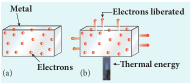

The intensity of the thermionic emission (the number of electrons emitted) depends on the metal used and its temperature. **Examples:** cathode ray tubes, electron microscopes, x-ray tubes etc (Figure 8.2).

**Table 8.1 Work function of some materia**

Metal Symbol Work function (eV)

Cesium Cs 2.14

Potassium K 2.30

Sodium Na 2.75

Calcium Ca 3.20

Molybdenum Mo 4.17

Lead Pb 4.25  

**ElectronsHot lament**

**Figure 8.2 Thermionic emission from hot** filament of cathode ray tube or x-ray tube

**ii) Field emission** Electric field emission occurs when a

very strong electric field is applied across the metal. This strong field pulls the free electrons and helps them to overcome the surface barrier of the metal (Figure 8.3). **Examples:** Field emission scanning electron microscopes, Field-emission display etc.

**Strong electric eldMetal**

**Electrons emitted**

**– – – – – – – +**

**\+ + + + + +**

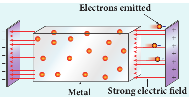

**ls**

Metal Symbol Work function (eV)

Aluminium Al 4.28

Mercury Hg 4.49

Copper Cu 4.65

Silver Ag 4.70

Nickel Ni 5.15

Platinum Pt 5.65
| Cs |2.14 |Aluminium |Al |
|------|------|------|------|
| K |2.30 |Mercur y |Hg |
| Na |2.75 |Copper |Cu |
| Ca |3.20 |Silver |Ag |
| Mo |4.17 |Nickel |Ni |
| Pb |4.25 |Platinum |Pt |

| +++++++ |
|------|------|------|------|------|

  

**iii) Photo electric emission** When an electromagnetic radiation of

suitable frequency is incident on the surface of the metal, the energy is transferred from the radiation to the free electrons. Hence, the free electrons get sufficient energy to cross the surface barrier and the photo electric emission takes place (Figure 8.4). The number of electrons emitted depends on the intensity of the incident radiation. **Examples:** Photo diodes, photo electric cells etc.

**Free electrons**

**Radiation Emitted electrons**

**Metal**

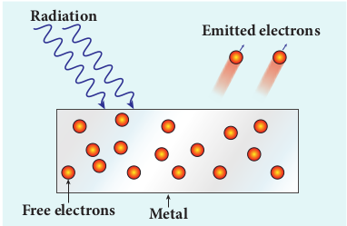

**iv) Secondary emission** When a beam of fast moving electrons

strikes the surface of the metal, the kinetic energy of the striking electrons is transferred to the free electrons on the metal surface. Thus the free electrons get sufficient kinetic energy so that the secondary emission of electron occurs (Figure 8.5). **Examples:** Image intensifiers, photo multiplier tubes etc.

**Free electrons Metal**

**High Speed electrons Secondary electrons**

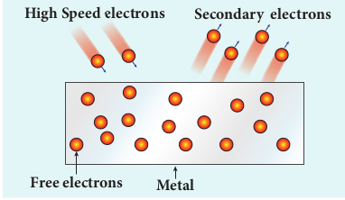

## **PHOTO ELECTRIC EFFECT**

### Hertz, Hallwachs and Lenard’s observation

**Hertz observation** Maxwell’s theory of electromagnetism

predicted the existence of electromagnetic waves and concluded that light itself is just an electromagnetic wave. Then the experimentalists tried to generate and detect electromagnetic waves through various experiments.

In 1887, Heinrich Hertz was successful in generating and detecting electromagnetic wave with his high voltage induction coil causing a spark discharge between two metallic spheres (we have learnt this in Unit 5 of XII standard physics). When a spark is formed, the charges will oscillate back and forth rapidly and the electromagnetic waves are produced.

The electromagnetic waves thus produced were detected by a detector that has a copper wire bent in the shape of a circle. Although the detection of waves is successful, there is a problem in observing the tiny spark produced in the detector.

In order to improve the visibility of the spark, Hertz made many attempts and finally noticed an important thing that small detector spark became more vigorous when it was exposed to ultraviolet light.

The reason for this behaviour of the spark was not known at that time. Later it was found that it is due to the photoelectric emission. Whenever ultraviolet light is incident on the metallic sphere, the electrons on the outer surface are emitted which caused the spark to be more vigorous.

  

It is interesting to note that the experiment of Hertz confirmed that light is an

electromagnetic wave. But the same experiment also produced the first evidence for particle nature of light.

**Hallwachs’ observation** In 1888, Wilhelm Hallwachs, a German

physicist, confirmed that the strange behaviour of the spark is due to the action of ultraviolet light with his simple experiment.

A clean circular plate of zinc is mounted on an insulating stand and is attached to a gold leaf electroscope by a wire. When the uncharged zinc plate is irradiated by ultraviolet light from an arc lamp, it becomes positively charged and the leaves will open as shown in Figure 8.6(a).

Further, if the negatively charged zinc plate is exposed to ultraviolet light, the leaves will come closer as the charges leaked away quickly (Figure 8.6(b)). If the plate is positively charged, it becomes more positive upon UV rays irradiation and the leaves open further (Figure 8.6(c)). From these observations, it was concluded that negatively charged electrons were emitted from the zinc plate under the action of ultraviolet light.

**+**

**\+ + + + + +Zn**

**––**

**–– – – – –– – –Zn**

**–– ––**

**––**

**–– ––**

**––+ +**

**+**

**\+ +**

**+**

**++**

**++ + + + ++ + +Zn**

**(a) (b) (c)**

**UV rays**

**+++++**

**++ +++**

**Lenard’s observation** In 1902, Lenard studied this electron

emission phenomenon in detail. His simple experimental setup is shown in Figure 8.7. The apparatus consists of two metallic plates _A_ and _C_ placed in an evacuated quartz bulb. The galvanometer _G_ and battery _B_ are connected in the circuit.

**\_ +**

**Ultraviolet Radiation**

**_G_**

**_C A_**

**_B_**

**Electrons**

**Quartz bulb**

**_I_**

When ultraviolet light is incident on the negative plate _C_, an electric current flows in the circuit that is indicated by the deflection in the galvanometer. On other hand, if the positive plate is irradiated by the ultraviolet light, no current is observed in the circuit.

From these observations, it is concluded that when ultraviolet light falls on the negative plate, electrons are ejected from it which are attracted by the positive plate _A_. On reaching the positive plate through the evacuated bulb, the circuit is completed and the current flows in it. Thus, the ultraviolet light falling on the negative plate causes the electron emission from the surface of the plate.

**Photoelectric effect** The ejection of electrons from a

metal plate when illuminated by light or any other electromagnetic radiation
| ++ ++++ + |
|------|------|------|
| ++ |
| +++++++ +++++ |
  

of suitable wavelength (or frequency) is called **photoelectric effect**. Although these electrons are not different from all other electrons, it is customary to call them as **photoelectrons** and the corresponding current as **photoelectric current or photo current**.

Metals like cadmium, zinc, magnesium etc show photoelectric emission with ultraviolet light while some alkali metals lithium, sodium, caesium respond well even to larger wavelength radiation like visible light. The materials which eject photoelectrons upon irradiation of electromagnetic wave of suitable wavelength are called **photosensitive materials**.

### Effect of intensity of incident light on photoelectric current

**Experimental setup** The apparatus shown in Figure 8.8 is

employed to study the phenomenon of photoelectric effect in detail. _S_ is a source of electromagnetic waves of known and variable frequency _ν_ and intensity _I_. _C_ is

**Photo sensitive plate**

**Quartz window**

**Evacu glass**

**_I_**

**C A**

**Photo electrons**

**_S_**

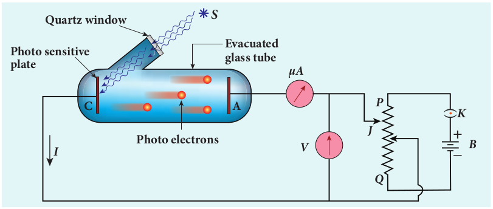

the cathode (negative electrode) made up of photosensitive material and is used to emit electrons. The anode (positive electrode) _A_ collects the electrons emitted from _C_. These electrodes are kept in an evacuated glass envelope with a quartz window that permits the passage of ultraviolet and visible light.

The necessary potential difference between _C_ and _A_ is provided by high tension battery _B_ which is connected across a potential divider arrangement _PQ_ through a key _K_. _C_ is connected to the centre terminal while _A_ to the sliding contact _J_ of the potential divider. The plate _A_ can be maintained at a desired positive or negative potential with respect to _C_. To measure both positive and negative potential of _A_ with respect to _C_, the voltmeter is designed to have its zero marking at the centre and is connected between _A_ and _C_. The current is measured by a micro ammeter _mA_ connected in series.

If there is no light falling on the cathode _C_, no photoelectrons are emitted and the microammeter reads zero. When ultraviolet or visible light is allowed to fall on _C_, the photoelectrons are liberated and are attracted towards anode. As a result, the

**ated tube**

**_V_**

**_µA_**

**\_ +**

**_B J_**

**_P_**

**_Q_**

**_K_**

f photoelectric effect

|------|------|

  

photoelectric current is set up in the circuit which is measured using micro ammeter.

The variation of photocurrent with respect to (i) intensity of incident light (ii) the potential difference between the electrodes (iii) the nature of the material and (iv) frequency of incident light can be studied with the help of this arrangement.

**Effect of intensity of incident light on photoelectric current**

To study the effect of intensity of incident light on photoelectric current, the frequency of the incident light and the accelerating potential _V_ of the anode are kept constant. Here the potential of _A_ is kept positive with respect to that of _C_ so that the electrons emitted from _C_ are attracted towards _A_. Now, the intensity of the incident light is varied and the corresponding photoelectric current is measured.

**Light intensity, I**

**Ph ot**

**o el**

**ec tr**

**ic cu**

**rr en**

**t**

**Frequency and Accelerating potential- constant**

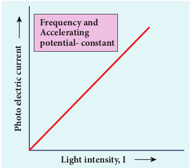

A graph is drawn between light intensity along x-axis and the photocurrent along y-axis. From the graph in Figure 8.9, it is evident that _photocurrent – the number of electrons emitted per second – is directly proportional to the intensity of the incident light_.  

Here, intensity of light means brightness. A bright light has more intensity than a dim light.

**Note**

### Effect of potential difference on photoelectric current

To study the effect of potential difference _V_ between the electrodes on photoelectric current, the frequency and intensity of the incident light are kept constant. Initially the potential of _A_ is kept positive with respect to _C_ and the cathode is irradiated with the given light.

Now, the potential of _A_ is increased and the corresponding photocurrent is noted. As the potential of _A_ is increased, photocurrent also increases. However a stage is reached where photocurrent reaches a saturation value (saturation current) at which all the photoelectrons from _C_ are collected by _A_. This is represented by the flat portion of the graph between potential of _A_ and photocurrent (Figure 8.10).

When a negative (retarding) potential is applied to _A_ with respect to _C_, the current does not immediately drop to zero because the photoelectrons are emitted with some definite and different kinetic energies. The kinetic energy of some of the photoelectrons is such that they could overcome the retarding electric field and reach the electrode _A_.

When the negative (retarding) potential of _A_ is gradually increased, the photocurrent starts to decrease because more and more photoelectrons are being repelled away from reaching the electrode _A_. The photocurrent becomes zero at a
| Frequenc y and |
|------|------|
| Acceleratingpotential- constant |
  

particular negative potential _V_0, called stopping or cut-off potential.

**Stopping potential**

**Ph ot**

**o cu**

**rr en**

**t**

**_0_\_**

**_I1_**

**_V0_**

**_I2_**

**_I3_**

**_I3_ \> _I2_ \> _I1_**

**Retarding potential Collecting electrode**

**potential**

**Stopping potential** is that value of the negative (retarding) potential given to the collecting electrode _A_ which is just sufficient to stop the most energetic photoelectrons emitted and make the photocurrent zero.

At the stopping potential, even the most energetic electron is brought to rest. Therefore, the initial kinetic energy of the fastest electron (_K_max) is equal to the work done by the stopping potential to stop it (_eV_0).

_K m eV_max max= = 1 2

2 0_v_ (8.1)

where _v_max is the maximum speed of the emitted photoelectron.

_v_max = 2 0_eV_

_m_

_v_max . .

\= × × ×

× −

−

2 1 602 10 9 1 10

19

31 0_V_

\= ×5 93 105 0. _V_ (8.2)  

From equation (8.1),

_K eV_max ( )= 0 in joule (8.3)

_K V_max ( )= 0 in eV (8.4)

From the Figure 8.10, when the intensity of the incident light alone is increased, the saturation current also increases but the value of _V_0 remains constant.

Thus, for a given frequency of the incident light, the stopping potential is independent of intensity of the incident light. This also implies that _the maximum kinetic energy of the photoelectrons is independent of intensity of the incident light_.

### Effect of frequency of incident light on stopping potential

To study the effect of frequency of incident light on stopping potential, the intensity of the incident light is kept constant. The variation of photocurrent with the collecting electrode potential is studied for radiations of different frequencies and a graph drawn between them is shown in Figure 8.11. From the graph, it is clear that stopping potential vary over different frequencies of incident light.

**Photo current Saturation current**

_ν **\>** ν **\>** ν_

**Collecting electrode potentialRetarding potential**

**_0_**

**_3_**

_ν **3** ν **2** ν **1**_

**_2 1_**

–**_V_03** –**_V_02** –**_V_01**

(or)
| ν  ν  ν>  > 3  2  ν1 νν3 2 1 |
|------|------|------|------|

  

Greater the frequency of the incident radiation, larger is the corresponding stopping potential. This implies that _as the frequency is increased, the photoelectrons are emitted with greater kinetic energies so that the retarding potential needed to stop the photoelectrons is also greater_.

**Frequency of incident radiation**

**Metal A Metal B**

**Stopping potential**

_ν **0A**_

_ν **0A** ν_ **\>** _ν **0B**ν_ **\>**

_ν **0B**_

Now a graph is drawn between frequency of incident radiation and the stopping potential for different metals (Figure 8.12). From this graph, it is found that stopping potential varies linearly with frequency. Below a certain frequency called threshold frequency, no electrons are emitted; hence stopping potential is zero for that reason. But as the frequency is increased above threshold value, the stopping potential varies linearly with the frequency of incident light.

### Laws of photoelectric effect

The above detailed experimental investigations of photoelectric effect revealed the following results: i) For a given metallic surface, the emission

of photoelectrons takes place only if the frequency of incident light is greater  

than a certain minimum frequency called the threshold frequency.

ii) For a given frequency of incident light (above threshold value), the number of photoelectrons emitted is directly proportional to the intensity of the incident light. The saturation current is also directly proportional to the intensity of incident light.

iii) Maximum kinetic energy of the photo electrons is independent of intensity of the incident light.

iv) Maximum kinetic energy of the photo electrons from a given metal is directly proportional to the frequency of incident light.

v) There is no time lag between incidence of light and ejection of photoelectrons.

Once photoelectric phenomenon has been thoroughly examined through various experiments, the attempts were made to explain it on the basis of wave theory of light.

### Concept of quantization of energy

**Failures of classical wave theory** From Maxwell’s theory (Refer unit 5

of volume 1), we learnt that light is an electromagnetic wave consisting of coupled electric and magnetic oscillations that move with the speed of light and exhibit typical wave behaviour. Let us try to explain the experimental observations of photoelectric effect using wave picture of light.

**i)** When light is incident on a metallic surface, there is a continuous supply of energy to the electrons in the metal surface. According to wave theory, light of greater intensity should impart greater kinetic energy to the liberated electrons (Here, Intensity of light is the energy delivered per unit area per unit time).
  

But this does not happen. The experiments show that maximum kinetic energy of the photoelectrons emitted does not depend on the intensity of the incident light.

**ii)** According to wave theory, if a sufficiently intense beam of light is incident on the surface, electrons should be liberated from the surface of the target, however low the frequency of the radiation is.

From the experiments, it is found that photoelectric emission is not possible below a certain minimum frequency of incident radition. Therefore, the wave theory fails to explain the existence of threshold frequency.

**iii)** Since the energy of light is spread across the entire wavefront, the electrons which receive energy from it are large in number. Each electron needs considerable amount of time (a few hours) to get energy sufficient to overcome the work function and to get liberated from the surface.

But experiments show that photoelectric emission is almost instantaneous process (the time lag is less than 10–9 _s_ after the surface is illuminated) which could not be explained by wave theory.

Thus, the experimental observations of photoelectric emission could not be explained on the basis of the wave theory of light.

**EXAMPLE 8.1**

For the photoelectric emission from cesium, show that wave theory predicts that

**i)** maximum kinetic energy of the photoelectrons (_K_max) depends on the intensity _I_ of the incident light

**ii)** _K_max does not depend on the frequency of the incident light and

**iii)** the time interval between the incidence of light and the ejection of photoelectrons is very long.  

For the sake of simplicity, the following standard assumptions can be made when light is incident on the given material.

a) Light is absorbed in the top atomic layer of the metal

b) For a given element, each atom absorbs an equal amount of energy and this energy is proportional to its cross-sectional area _A_

c) Each atom gives this energy to one of the electrons.

(Given : The work function for cesium is 2.14 eV and the power absorbed per unit area is 1 60 10 6 2. × − −Wm which produces a measurable photocurrent in cesium.)

**_Solution_**

**i)** According to wave theory, the energy in a light wave is spread out uniformly and continuously over the wavefront.

The energy absorbed by each electron in time _t_ is given by

_E = IAt_

With this energy absorbed, the most energetic electron is released with _K_max by overcoming the surface energy barrier or work function _ϕ_0 and this is expressed as

_K IAt_max = − _ϕ_0 (1)

Thus, wave theory predicts that for a unit time, at low light intensities when _IA < ϕ_0, no electrons are emitted. At higher intensities, when _IA ≥ ϕ_0, electrons are emitted. This implies that higher the light intensity, greater will be _K_max_._

_K_max is dependent only on the intensity under given conditions – that is, by suitably increasing the intensity, one can produce
  

photoelectric effect even if the frequency is less than the threshold frequency. So the concept of threshold frequency does not even exist in wave theory.

**ii)** According to wave theory, the intensity of a light wave is proportional to the square of the amplitude of the electric field ( )._E_0

2 The amplitude of this electric field increases with increasing intensity and imparts an increasing acceleration and kinetic energy to an electron.

Now _I_ is replaced with a quantity proportional to _E_0

2 in equation (1). This means that _K_max should not depend at all on the frequency of the classical light wave which again contradicts the experimental results.

**iii)** If an electron accumulates light energy just enough to overcome the work function, then it is ejected out of the atom with zero kinetic energy. Therefore, from equation (1),

0 0= −_IAt ϕ_

_t IA I r_

\= = _ϕ ϕ_

π 0 0

2( )

By taking the atomic radius _r_ \= × −1 0 10 10. m and substituting the given values of _I_ and _ϕ_0, we can estimate the time interval as

_t_ \= × × × × × ×

−

− − 2 14 1 6 10

1 60 10 3 14 1 10

19

6 10 2 . .

. . ( )

\= × ≈0 68 10 797. _s_ days Thus, wave theory predicts that there is

a large time gap between the incidence of light and the ejection of photoelectrons but the experiments show that photo emission is an instantaneous process.

**Concept of quantization of energy** Max Planck proposed quantum concept

in 1900 in order to explain the thermal  

radiations emitted by a black body and the shape of its radiation curves.

According to Planck, matter is composed of a large number of oscillating particles (atoms) which vibrate with different frequencies. Each atomic oscillator - which vibrates with its characteristic frequency - emits or absorbs electromagnetic radiation of the same frequency. It also says that i) If an oscillator vibrates with frequency _v_,

its energy can have only certain discrete values, given by the equation.

_E_n= _nhν_ _n=_1,2,3.... (8.5)

where _h_ is a constant, called Planck’s constant.

ii) The oscillators emit or absorb energy in small packets or quanta and the energy of each quantum is _hν_.

This implies that the energy of the oscillator is quantized – that is, energy is not continuous as believed in the wave picture. This is called **quantization of energy**.

### Particle nature of light: Einstein’s explanation

Einstein extended Planck’s quantum concept to explain the photoelectric effect in 1905. According to Einstein, the energy in light is not spread out over wavefronts but is concentrated in small packets or energy quanta. Therefore, light (or any other electromagnetic waves) of frequency _v_ from any source can be considered as a stream of quanta and the energy of each light quantum is given by _E_ = _hν_.

He also proposed that a quantum of light has linear momentum and the magnitude

of that linear momentum is _h c ν_ ._p =_ . The

individual light quantum of definite energy and momentum can be associated with a
| photoelectric ef fect e ven if t he f requency is less than the threshold f requency. S o the concept o f t hreshold f requency do es n ot even exist in wave theor y.ii) According t o wa ve t heor y, t he intensity o f a lig ht wa ve i s p roportional t o the  square  of  the  amplitude  of t he e lectric field  ()E .  Th e a mplitude o f t his e lectric field in creases w ith in creasing in tensity and imparts an increasing acceleration and kinetic en2 erg y to an electron.0Now I i s r eplaced w ith a q uantity proportional t o  in e quation (1). Thi s Emeans t hat  K  s hould n ot dep end a t a ll on the frequency of the classical light wave which a gain co ntradic2 ts t he exp erimental 0results.maxiii) If a n e lectron acc umulates lig htenergy j ust en ough t o o vercome t he w orkfunction, t hen i t i s ej ected o ut o f t he a tomwith zer o k inetic en ergy. Th erefore, f romequation (1),0 = IAt − ϕϕ   ϕt ==IA Ir()πBy t akin 0 g t he a tomic radi us r =×10.m 1000  a nd s ubstituting t he g iven 2values of I and ϕ , we can estimate the time inter val as −10 21.. 41××61 0t =16.. 01××03 14 ××()11 00=×06. 81 07s ≈ 9 days−19Thus, wave t−−h61eor y predicts that t 02 here is a l arge t ime ga p b etween t he in cidence o f 7light and the ejection of photoelectrons but the exp eriments show t hat photo emission is an instantaneous process. |
|------|

  

particle. The light quantum can behave as a particle and this is called photon. Therefore, photon is nothing but particle manifestation of light.

**Characteristics of photons:** According to particle nature of light,

photons are the basic constituents of any radiation and possess the following characteristic properties:

i) The photons of light of frequency _ν_ and wavelength λ will have energy, given by

_E hv hc_\= = _l_

.

ii) The energy of a photon is determined by the frequency of the radiation and not by its intensity and the intensity has no relation with the energy of the individual photons in the beam.

iii) The photons travel with the speed of light and its momentum is given by

_p h hv c_

\= = _l_

iv) Since photons are electrically neutral, they are unaffected by electric and magnetic fields.

v) When a photon interacts with matter (photon-electron collision), the total energy, total linear momentum and angular momentum are conserved. Since photon may be absorbed or a new photon may be produced in such interactions, the number of photons may not be conserved.

According to quantum concept, intensity of light of given wavelength is defined

as the number of energy quanta or photons incident per unit area per unit time, with each photon having same energy. Its unit is Wm–2.

**Note**  

**Einstein’s explanation of photoelectric equation**

When a photon of energy _hν_ is incident on a metal surface, it is completely absorbed by a single electron and the electron is ejected. In this process, a part of the photon energy is used in overcoming the potential barrier of the metal surface (photoelectric work function _ϕ_0 )and the remaining energy as the kinetic energy of the ejected electron. From the law of conservation of energy,

_h mv ϕ v_0 21

2 = + (8.6)

where _m_ is the mass of the electron and _v_ its velocity. This is shown in Figure 8.13(a).

**_K = 0_**

**Metal Metal**

**_E = hv_0**

**(a) (b)**

**_E = hv_**

**_Kmax = hv – hv_0**

If we reduce the frequency of the incident light, the speed or kinetic energy of photo electrons is also reduced. At some frequency _ν_0 of incident radiation, the photo electrons are just ejected with almost zero kinetic energy (Figure 8.13(b)). Then the equation (8.6) becomes

_hv_0 = _ϕ_0

where _ν_0 is the threshold frequency. By
  

rewriting the equation (8.6), we get

_hv hv m_0 1 2

\= + _v_2 (8.7)

The equation (8.7) is known as **Einstein’s photoelectric equation**.

If the electron does not lose energy by internal collisions, then it is emitted with maximum kinetic energy _K_max. Then

_K m_max max= 1 2

2_v_

where _v_max is the maximum velocity of the electron ejected. The equation (8.6) is rearranged as follows:

_Kmax_ = _hv_ – _ϕ_0 (8.8)

**_Kmax_**

**_hv_**

**_hv_0**

**_v_0 _v_**

**Frequency**

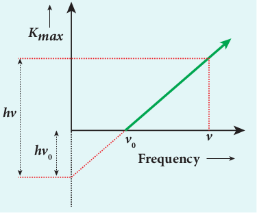

A graph between maximum kinetic energy _K_max of the photoelectron and frequency _ν_ of the incident light is a straight line as shown in Figure 8.14. The slope of the line is _h_ and its y-intercept is –_ϕ_0.

Einstein’s equation was experimentally verified by R.A. Millikan. He drew _K_max versus _ν_ graph for many metals (cesium, potassium, sodium and lithium) as shown in Figure 8.15 and found that the slope is independent of the metals.  

**Slope = _h_**

**O**

**Cesi um**

**Pota ssi**

**um So**

**dium Calc**

**ium**

**_Kmax_**

**Frequency**

−**_2.30eV_**

−**_2.14eV_**

−**_2.75eV_**

−**_3.20eV_**

**Figure 8.15 Kmax vs ν graph for different** metals

Millikan also calculated the value of Planck’s constant (_h_ \= 6.626 × 10–34 Js) and work function of many metals (Cs, K, Na, Ca); these values are in agreement with the theoretical prediction.

**Explanation for the photoelectric effect:** The experimentally observed facts of

photoelectric effect can be explained with the help of Einstein’s photoelectric equation.

**i)** As each incident photon liberates one electron, then the increase of intensity of the light (the number of photons per unit area per unit time) increases the number of electrons emitted thereby increasing the photocurrent. The same has been experimentally observed.

**ii)** From _Kmax_ \= _hv_ – _ϕ_0, it is evident that _K_max is proportional to the frequency of the incident light and is independent of intensity of the light.

**iii)** As given in equation (8.7), there must be minimum energy (equal to the work function of the metal) for incident photons to liberate electrons from the metal surface. Below this value of energy, emission of electrons is not possible. Correspondingly, there exists minimum frequency called threshold frequency below which there is no photoelectric emission.
| iesCP |uotassSo |iudiumalC |Sl |
|------|------|------|------|------|------|------|------|
| ium |
| c |
| Freq |

|------|------|------|------|

| hv0 |v vFrequency0 |
  

**iv)** According to quantum concept, the transfer of photon energy to the electrons is instantaneous so that there is no time lag between incidence of photons and ejection of electrons.

Thus, the photoelectric effect is explained on the basis of quantum concept of light.

**The nature of light: wave - particle duality** We have learnt that wave nature of light

explains phenomena such as interference, diffraction and polarization. Certain phenomena like black body radiation, photoelectric effect can be explained by assigning particle nature to light. Therefore, both theories have enough experimental evidences.

In the past, many scientific theories have been either revised or discarded when they contradicted with new experimental results. Here, two different theories are needed to answer the question: what is nature of light?

It is therefore concluded that light possesses dual nature, that of both particle and wave. It behaves like a wave at some circumstances and it behaves like a particle at some other circumstances.

In other words, light behaves as a wave during its propagation and behaves as a particle during its interaction with matter. Both theories are necessary for complete description of physical phenomena. Hence, the wave nature and quantum nature complement each other.

A reader may find it difficult to u stream of particle. This is the case ev

Einstein once wrote a letter to his frustration:

“All these fifty years of conscious broodin question, ‘What are light quanta?’ Of course t but he is deluding himself ”.  

### Photo electric cells and their applications

**Photo cell** Photo electric cell or photo cell is a device

which converts light energy into electrical energy. It works on the principle of photo electric effect. When light is incident on the photosensitive materials, their electric properties will get affected, based on which photo cells are classified into three types. They are i) **Photo emissive cell:** Its working

depends on the electron emission from a metal cathode due to irradiation of light or other radiations.

ii) **Photo voltaic cell:** Here sensitive element made of semiconductor is used which generates voltage proportional to the intensity of light or other radiations.

iii) **Photo conductive cell:** In this, the resistance of the semiconductor changes in accordance with the radiant energy incident on it.

In this section, we discuss about photo emissive cell and its applications.

**Photo emissive cell**

**Construction:** It consists of an evacuated glass

or quartz bulb in which two metallic electrodes – that is, a cathode and an anode are fixed as shown in Figure 8.16.

nderstand how light can be both a wave and a en for great scientist like Albert Einstein. his friend Michel Besso in 1954 expressing

g have brought me no closer to answer the oday everyone thinks he knows the answer,
  

The cathode _C_ is semi-cylindrical in shape and is coated with a photo sensitive material. The anode _A_ is a thin rod or wire kept along the axis of the semi-cylindrical cathode. A potential difference is applied between the anode and the cathode through a galvanometer _G_.

\_

\+ **G**

**B**

**AC**

**Radiation**

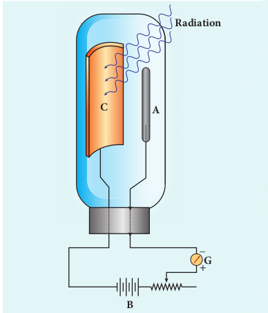

**Working:** When cathode is irradiated with suitable

radiation, electrons are emitted from it. These electrons are attracted by anode and hence a current is produced which is measured by the galvanometer. For a given cathode, the magnitude of the current depends on i) the intensity of incident radiation and ii) the potential difference between anode

and cathode.

**Applications of photo cells:** Photo cells have many applications,

especially as switches and sensors. Automatic lights that turn on when it gets dark use photocells, and street lights that switch on  

and switch off according to whether it is night or day use photocells.

Photo cells are used for reproduction of sound in motion pictures and are used as timers to measure the speeds of athletes during a race. Photo cells of exposure meters in photography are used to measure the intensity of the given light and to calculate the exact time of exposure.

**EXAMPLE 8.2**

A radiation of wavelength 300 nm is incident on a silver surface. Will photoelectrons be observed? \[work function of silver = 4.7 eV\]

**_Solution:_**

Energy of the incident photon is

_E hv hc_ \= =

λ (in joules)

_E hc e_

_eV_\= λ

(in eV)

Substituting the known values, we get

_E_\= × × × × × ×

−

− −

6 626 10 3 10 300 10 1 6 10

34 8

9 19

. .

_E = 4.14_ eV

The work function of silver = 4.7 eV. Since the energy of the incident photon is less than the work function of silver, photoelectrons are not observed in this case.

**EXAMPLE 8.3**

When light of wavelength 2200Å falls on Cu, photo electrons are emitted from it. Find (i) the threshold wavelength and (ii) the stopping potential. Given: the work function for Cu is _ϕ_0 **\=** 4.65 eV.

|------|
| C |

| EXAMPLE 8.2A radiation of wavelength 300 nm is incidenton a si lver s urface. W ill p hotoelectrons b eobserved? [work function of silver = 4.7 eV]Solution:Energ y of the incident photon ishc (in joules)Eh==vλhc (in eV)E =λeSubstituting the known values, we get6.626××10 31× 0E =300××10 16. ×10E = 4.14 eV −34 8The w ork f un−−91 ction o f si9lver = 4.7 eV . Since t he en erg y o f t he in cident p hoton is les s t han t he w ork f unction o f si lver, photoelectrons a re n ot o bser ved in t his case. |
|------|

  

**_Solution_**

i) The threshold wavelength is given by

λ

_ϕ_0 0

34 8

19

6 626 10 3 10 4.65 1 6 10

\= = × × × × ×

−

−

_hc_ . .

**\=** 2672 Å

ii) Energy of the photon of wavelength 2200 Å is

_E hc_ \= =

× × × ×

−

−λ 6 626 10 3 10

2200 10

34 8

10

.

\= × =− 9 035 10 5 65

19 . ._J_ eV

We know that kinetic energy of fastest photo electron is

_K_max = _hv_ – _ϕ_0 = 5.65 – 4.65

\= 1 eV

From equation (8.3), _K eV_ max

\= 0

_V K e_0

19

19

1 1 6 10

1 6 10 = =

× × ×

−

− max

.

.

Therefore, stopping potential = 1 V

**EXAMPLE 8.4**

The work function of potassium is 2.30 eV. UV light of wavelength 3000 Å and intensity 2 Wm–2 is incident on the potassium surface. i) Determine the maximum kinetic energy of the photo electrons ii) If 40% of incident photons produce photo electrons, how many electrons are emitted per second if the area of the potassium surface is 2 cm2 ?

**_Solution_**

i) The energy of the incident photon is

_E hc_ \= =

× × × ×

−

−λ 6 626 10 3 10

3000 10

34 8

10

.

_E_\= × =− 6 626 10 4 14

19 . .J eV

Maximum KE of the photoelectrons is _K_max = _hv_ – _ϕ_0 = 4.14 – 2.30 = 1.84 eV  

ii) The number of photons reaching the surface per second is

_n I E_

_Ap_ \= ×

\= ×

× ×

\= ×

− −2

6 626 10 2 10

6 04 10

19

4

14

.

. photons / sec

The rate of emission of photoelectrons is

\=( ) = × ×0 40 0 4 6 04 10 14

. . ._np_

\= 2.416 10 photoelectrons / sec´ 14

**EXAMPLE 8.5**

Light of wavelength 390 nm is directed at a metal electrode. To find the energy of electrons ejected, an opposing potential difference is established between it and another electrode. The current of photoelectrons from one to the other is stopped completely when the potential difference is 1.10 V. Determine i) the work function of the metal and ii) the maximum wavelength of light that can eject electrons from this metal.

**_Solution_**

i) The work function is given by

_ϕ_0 = _hv_ – _K_max φ ν λ0 0

− = − _hc eV_

ax

since _K_max \= _eV0_

\= × × × ×



  



   − × × 

 

−

− −6 626 10 3 10

390 10 1 6 10 1 10

34 8

9

19\. . .

\= × − × = ×− − − 5 10 10 1 76 10 3 34 10

19 19 19 . . . J

\= 2 09. eV

ii) The threshold wavelength is

m Å=

λ _ϕ_0

0

34 8

19

7

6 626 10 3 10 3 34 10

5 951 10 5951

\= = × × ×

×

\=

−

−

−

_hc_ . .

. ×
| ii) The number of photons reaching the surface per second isIn =× AE2= ××21 06.626×10p =×60. 41 0  photons / secThe rate of emission of photoe−le4 ctrons is () −19= 04.. 00n 14=× 46 .04×10= 2.416´10  photoelectrons / sec14p14 |
|------|

| Solutioni) The threshold wavelength is given byhc 6.626××10 31× 0λ ==ϕ 4.65××16. 10= 2672 Å− 34 8ii) En0erg y o f t he p hoton o f wa− 19 velength 2200 Å is  0hc 6.626××10 31× 0E ==λ 2200×10=×9..035 10 J =−3456 5 eV 8We k now t hat k inetic en er−10 g y o f fa stest photo electron is−19K  = hv – ϕ  = 5.65 – 4.65= 1 eVFrom equation (8.3), Ke = Vmax 0K 11××.61 0V ==e 16. ×10Therefore, stopping potmaenx tial = 1 0 V−19max0 −19 |
|------|

| 6.626××10 31× 0− 34 8 |
|------|------|
| hcλ ==ϕ= 50 |
| 33. 41× 0.951 ×10 mÅ= 5951− 190− 7 |

| EXAMPLE 8.5Light o f wa velength 390 nm i s dir ected a t a m etal e lectrode. T o f ind t he en erg y o f electrons ej ected, a n o pposing p otential difference i s es tablished b etween i t and a nother e lectrode. Th e c urrent o f photoelectrons f rom o ne t o t he o ther i s stopped co mpletely w hen t he p otential difference is 1.10 V. Determine i) t he work function of the metal and ii) the maximum wavelength of lig ht t hat can eject electrons from this metal.Solution i) The work function is given byϕ  = hv – K hc=− eVλsince K  = eV0 max=  6.626390××10×10 31× 0  −×16.. 10max ×11 00 −34 8=×51.. 01 01 −×76 10 =×33.J 41−19 0−9ii)= 20.  Th9 e teVhr−−es19 hold wavelen 19 gth is  −19hc 6.626××10 31× 0λ ==ϕ 33. 41× 0= 5.951 ×10 mÅ= 5951− 34 80 − 190− 7 |
|------|

  

## **MATTER WAVES**

### Introduction - Wave nature of particles

So far, we learnt that the characteristics of particles and waves are different. A wave is specified by its frequency, wavelength, wave velocity, amplitude and intensity. It spreads out and occupies a relatively large region of space. A particle specified by its mass, velocity, momentum and energy occupies a definite position in space and is very small in size.

Classical physics treated particles and waves as distinct entities. But quantum theory suggested dual character for radiations – that is, radiation behaves as a wave at times and as a particle at other times.

From this wave – particle duality of radiation, the concept of wave nature of matter arises which we will see in this section.

**De Broglie wave:** The wave–particle duality of radiation

was extended to matter by a French physicist Louis de Broglie (pronounced as de Broy) in 1924.

Greatly influenced by the symmetry in nature, de Broglie suggested that if radiation like light can act as particles at times, then material particles like electrons can also act as waves at times.

According to de Broglie hypothesis, all material particles like electrons, protons, neutrons in motion are associated with waves. These waves are called de Broglie waves or matter waves.  

### De Broglie wave length:

The momentum of photon of frequency _ν_ is given by

_p hv c_

_h c v_\= = = λ

λ since

The wavelength of a photon in terms of its momentum is

λ = _h p_ (8.9)

According to de Broglie, the above equation is completely a general one and this is applicable to material particles as well. Therefore, for a particle of mass _m_ travelling with speed _v_ , the wavelength is given by

λ = = _h_

_m h pv_ (8.10)

This wavelength of the matter waves is known as **de Broglie wavelength**. This equation relates the wave character (the wave length λ) and the particle character (the momentum _p_) through Planck’s constant.

### De Broglie wave length of electrons:

Let an electron of mass _m_ be accelerated through a potential difference of _V_ volt. The kinetic energy acquired by the electron is given by

1

2

2_m eVv_ \=

Therefore, the speed υ of the electron is

_v_ \= 2_eV m_

(8.11)

Hence, the de Broglie wavelength of the matter waves associated with electron is
  

λ = = _h_

_m h emVv_ 2

Substituting the known values in the above equation, we get

λ= ×

× × × ×

\= ×

−

− −

−

6 626 10

2 1 6 10 9 11 10

12 27 10

34

19 31

10

.

. .

.

_V_

_V_ m (or)

Åλ= 12 27.

_V_

For example, if an electron is accelerated through a potential difference of 100V, then its de Broglie wavelength is 1.227 Å.

Since the kinetic energy of the electron, _K_ = _eV_, then the de Broglie wavelength associated with electron can be also written as

λ = _h mK_2 (8.13)

### Davisson – Germer experiment

Louis de Broglie hypothesis of matter waves was experimentally confirmed by Clinton Davisson and Lester Germer in 1927. They demonstrated that electron beams are diffracted when they fall on crystalline solids. Since crystal can act as a three-dimensional diffraction grating for matter waves, the electron waves incident on crystals are diffracted off in certain specific directions. Figure 8.17 shows a schematic representation of the apparatus for the experiment.

The filament _F_ is heated by a low tension (L.T.) battery. Electrons are emitted from the hot filament by thermionic emission. They are then accelerated due to the potential difference between the filament and the anode aluminium cylinder by a high tension (H.T.) battery. Electron beam is collimated by using two thin aluminium diaphragms and is allowed to strike a single crystal of Nickel.

(8.12)  

**_H.T._**

**_L.T._**

**_F_**

**Ni crystal**

**Scattered beam**

**Incident beam**

**Electron detector**

**Aluminium cylinder**

**in aluminium diaphragms**

**Electron gun**

**_θ_**

The electrons scattered by Ni atoms in different directions are received by the electron detector which measures the intensity of scattered electron beam. The detector is capable of rotation in the plane of the paper so that the angle _θ_ between the incident beam and the scattered beam can be changed at our will. The intensity of the scattered electron beam is measured as a function of the angle _θ_.

**30°0° 60°**

**50°**

**90°**

**In te**

**ns ity**

**o f d**

**i ra**

**ct ed**

**el ec**

**tr on**

**b ea**

**m**

**_V_ = 54 _V_**

**_θ_**

| V = 54 V50° |
  

Figure 8.18 shows the variation of intensity of the scattered electrons with the angle _θ_ for the accelerating voltage of 54_V_. For a given accelerating voltage _V_, the

It is to be noted that electrons are not the only particles with which wave nature can be

demonstrated. The waves are associated with particles like neutrons and alpha particles also when they are in motion. They undergo diffraction when they are scattered by suitable crystals. Neutron diffraction studies are highly useful for investigating crystal structures.

**Note**

Diffraction is one of the properties of waves. Whenever waves are incident

on an obstacle, they bend around the edges of the obstacle. This bending of waves is called diffraction. The amount of bending depends on the wavelength of the waves. We have learnt in unit 7 that as the wavelength of light is very small, diffraction effects of light are very small. In order to study diffraction of light, diffraction gratings are used. Since x-rays and de Broglie waves of electrons have wavelengths (in the order of 10–10m) much shorter than that of the light wave, diffraction grating cannot be used in x-ray diffraction studies. In a crystal, the spacing between atomic planes is comparable to the wavelength of x-rays and de Broglie waves of electrons. Hence, in x-ray diffraction studies, the crystals are used which serve as three-dimensional grating.

**Note**  

scattered wave shows a peak or maximum at an angle of 50° to the incident electron beam. This peak in intensity is attributed to the constructive interference of electrons diffracted from various atomic layers of the target material. From the known value of interplanar spacing of Nickel, the wavelength of the electron wave was experimentally calculated as 1.65Å.

The wavelength can also be calculated from de Broglie relation for _V_ = 54 V from equation (8.12).

λ

λ

\= =

\=

12 27 12 27

54

1 67

. .

.

_V_ Å Å

Å

This value agrees very well with the experimentally observed wavelength of 1.65Å. Thus this experiment directly verifies de Broglie’s hypothesis of the wave nature of moving particles.

### Electron Microscope

**Principle** This is the direct application of wave

nature of particles. The wave nature of the electron is used in the construction of microscope called **electron microscope**.

The resolving power of a microscope is inversely proportional to the wavelength of the radiation used for illuminating the object under study. Higher magnification as well as higher resolving power can be obtained by employing the waves of shorter wavelengths.

Louis de Broglie wavelength of electron is very much less than (a few thousands less) that of the visible light being used in optical microscopes. As a result, the microscopes employing de Broglie waves of electrons have very much higher resolving power than
  

**Light source**

**Condenser lens**

**Object**

**Objective lens**

**Projector lens**

**Screen**

**Intermediate image**

**Electron source**

**Condenser lens**

**Object**

**Objective lens**

**Projector lens**

**Intermediate image**

**Photographic plate(a) (b)**

optical microscope. Electron microscopes giving magnification more than 2,00,000 times are common in research laboratories.

**Working** The construction and working of an

electron microscope is similar to that of an optical microscope except that in electron microscope focussing of electron beam is done by the electrostatic or magnetic lenses. The electron beam passing across a suitably arranged either electric or magnetic fields undergoes divergence or convergence thereby focussing of the beam is done (Figure 8.19).

The electrons emitted from the source are accelerated by high potentials. The beam is made parallel by magnetic condenser lens. When the beam passes through the sample whose magnified image is needed, the beam carries the image of the sample.

With the help of magnetic objective lens and magnetic projector lens system, the  

on microscope (c) Photograph of electron

magnified image is obtained on the screen. These electron microscopes are being used in almost all branches of science.

**EXAMPLE 8.6**

Calculate the momentum and the de Broglie wavelength in the following cases:

i) an electron with kinetic energy 2 eV. ii) a bullet of 50 g fired from rifle with a

speed of 200 m/s iii) a 4000 kg car moving along the

highways at 50 m/s Hence show that the wave nature of matter is important at the atomic level but is not really relevant at macroscopic level.

**_Solution:_**

**i)** Momentum of the electron is

_p mK_\= = × × × × ×− − 2 2 9 1 10 2 1 6 10

31 19 . .

\= × − 7 63 10

25 . kg ms

\-1

**(c)**
| ive lenstor lens |
|------|------|------|------|------|

  

Coloured scanning electron micrograph of a common housefly (Muscadomestica).

**Magnified images of some objects:**

Its de Broglie wavelength is

λ= = × ×

\= × −

− −_h_

_p_ 6 626 10

7 63 10 0 868 10

34

25

9.

. . m

\= 8 68. Å

**ii)** Momentum of the bullet is

_p m_\= = × = −_v_ 0 050 200 10 1

. kgms

Its de Broglie wavelength is

λ= = ×

\= × −

−_h p_

6 626 10

10 6 626 10

34

35\. . m

**iii)** Momentum of the car is

_p m_\= = × = × −_v_ 4000 50 2 10 5 1 kgms

Its de Broglie wavelength is

λ= = × ×

\= × −

−_h p_

6 626 10

2 10 3 313 10

34

5

39\. . m

From these calculations, we notice that electron has significant value of de Broglie wavelength (≈10–9m which can be measured from diffraction studies) but moving bullet and car have negligibly small de Broglie wavelengths associated with them (≈10–33m and 10–39m respectively, which are not measurable by any experiment). This implies that the wave nature of matter  

is important at the atomic level but it is not really relevant at the macroscopic level.

**EXAMPLE 8.7**

Find the de Broglie wavelength associated with an alpha particle which is accelerated through a potential difference of 400 V. Given that the mass of the proton is 1.67 × 10–27 kg.

**_Solution_** An alpha particle contains 2 protons

and 2 neutrons. Therefore, the mass _M_ of the alpha particle is 4 times that of a proton (_mp_) (or a neutron) and its charge _q_ is twice that of a proton (+_e_).

The de Broglie wavelength associated with it is

λ= = ×( )×( )×

_h MqV_

_h_

_m e Vp_ 2 2 4 2

\= ×

× × × × × × ×

−

− −

6 626 10

2 4 1 67 10 2 1 6 10 400

34

27 19

.

. .

\= ×

× × × =

−

−

6 626 10

4 20 10 1 67 1 6

0 00507

34

23

.

. .

. Å

Needle and thread
| Magnified images of some objects:Coloured s canning e lectron micr ograph  Needle and threadof a common housefly (Muscadomestica). |
|------|

| ()h()V 24× me × 2 ×6.626×10p−34 |
|------|------|
| hλ ==2Mq=24××6=42××01 |

| 16.. 71××02 ××16 10.626×10−−27 = 0. 0050701 ..67 ×16−34−23 |

| EXAMPLE 8.7Find t he de B roglie wa velength a ssociated with a n a lpha p article w hich i s acce lerated through a p otential dif ference o f 400 V. Given t hat t he m ass o f t he p roton i s 1.67 × 10 kg.Solution An a lpha p article co ntains 2 p rotons –27 and 2 n eutrons. Th erefore, t he m ass Mof  the  alpha  particle  is  4  times  that o f  a proton (m ) (or a neutron) and its charge qis twice that of a proton (+e). The  de  Broglie  wavelength  associated with it isp()h hλ == ()2MqV 24× me × 2 ×V6.626×10=24×× 16.. 71××02 ××16 10 ×400p−346.626×10= −−27 = 0. 00507 19 Å42××01 01 ..67 ×16−34−23 |
|------|

  

**EXAMPLE 8.8**

A proton and an electron have same de Broglie wavelength. Which of them moves faster and which possesses more kinetic energy?

**_Solution_**

We know that λ = _h mK_2

Since proton and electron have same de Broglie wavelength, we get

_h_

_m K h m Kp p e e_2 2

\= (or) _K K_

_m m_

_p_

_e_

_e_

_p_

\=

Since _m m K Ke p p e_< <, , the electron has more kinetic energy than the proton.

_K K_

_m_

_m_

_p_

_e_

_p p_

_e e_

\=

1 2 1 2

2

2

_v_

_v_ (or)

_v v_

_p_

_e_

_p e_

_e p_

_K m K m_

\=

_v v_

_p_

_e_

_e_

_p_

_e_

_p_

_m m_

_m m_

\= = 2

2 since _K K_

_m m_

_p_

_e_

_e_

_p_

\=

Since _m me p p e_< <, _v v_ , the electron moves faster than the proton.

## **X – RAYS**

**Introduction** Quantum theory of radiation explains

photoelectric effect in which the electrons are emitted due to the incidence of photons and the energy is transferred from photons to the electrons. Immediately, a question arises: Is the reverse process also possible?

This means that whether kinetic energy of electron can be transformed into photon energy or not. The phenomenon which  

answers this question has already been discovered, even before Planck’s quantum theory of radiation.

**Discovery of x-rays** Wilhelm Roentgen in 1895 discovered that

whenever fast moving electrons fall on certain materials, a highly penetrating radiation is emitted. Since their origin was not known at that time, they were called x-rays.

X-rays are electromagnetic waves of short wavelength ranging from 0.1 to 100_Å_. They travel along straight lines with the velocity of light and are not affected by electric and magnetic fields. X-ray photons are highly energetic because of its high frequency or short wavelength. Therefore, they can pass through materials which are opaque to visible light.

The quality of x-rays is measured in terms of their penetrating power which depends on the velocity with which the electrons strike the target material and the atomic number of target material. The intensity of x-rays is dependent on the number of electrons striking the target.

**Production of x-rays** X-rays are produced in x-ray tube which

is essentially a discharge tube as shown in Figure 8.20. A tungsten filament _F_ is heated to incandescence by a battery. As a result, electrons are emitted from it by thermionic emission.

The electrons are accelerated to high speeds by the voltage applied between the filament _F_ and the anode. The target materials like tungsten, molybdenum are embedded in the face of the solid copper anode. The face of the target is inclined at an angle of 45° with respect to the electron beam so that x-rays can leave the tube through its side.
| 2 |
|------|
| 1 |

| EXAMPLE 8.8A p roton a nd a n e lectron h ave s ame de Broglie wavelength. Which of t hem moves faster a nd w hich p ossesses m ore k inetic energ y?SolutionWe know that  λ = h2mKSince p roton a nd e lectron h ave s ame de Broglie wavelength, we get h = h  (or)  K = m22mK mK K mSince  , t he e lectron h as mm<< ,  KKmore kinetic energ y than the protpon. epp ee e p1K ep= 2 m v pe (or) v = KmK 1 v Kmm v22v ep == m eepp 2 m sinepce  KK eppe= mmSince  vmm<< m,  vv m , the electron moves faster thpan the p e2 roton. e p e2e p p e pep pe |
|------|

  

**Cathode**

**Target**

**Evacuated tubeX-ray**

**Electrons**

**H.T.**

**L.T. Anode**

**_F_**

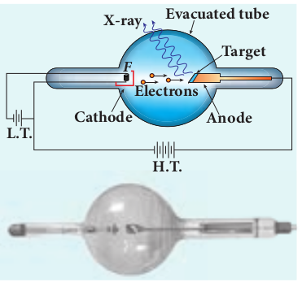

When high-speed electrons strike the target, they are decelerated suddenly and lose their kinetic energy. As a result, x-ray photons are produced. Since most of the kinetic energy of the bombarding electrons gets converted into heat, targets made of high-melting-point metals and a cooling system are usually employed.

**X-ray spectra** X-rays are produced when fast moving

electrons strike the metal target. The intensity of the x-rays when plotted against its wavelength gives a curve called **x-ray spectrum** (Figure 8.21(a) and (b)). X-ray spectra consist of two parts: a continuous spectrum and a series of peaks superimposed on it.

The **continuous spectrum** consists of radiations of all possible wavelengths with a certain minimum wavelength λ0 which depends on the voltage across the electrodes. The peaks are characteristics of the material of the target and hence it is called **characteristic spectrum**. Figure 8.21(a) depicts the x-ray spectra of tungsten at various accelerating voltages and Figure 8.21(b) shows the x-ray spectra of tungsten and molybdenum at a particular accelerating voltage.  

**_20 kV_**

**_30 kV_**

**_40 kV_**

**_50 kV_ Tungsten target**

**Wavelength**

**Re la**

**tiv e i**

**nt en**

**sit y**

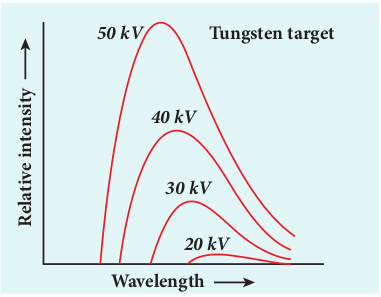

**Tungsten, 35 kV**

**Molybdenum, _35 kV_**

**Wavelength**

**Re la**

**tiv e i**

**nt en**

**sit y**

**K**α

**K**β

Though classical electromagnetic theory suggests the emission of radiations from accelerating electrons, it could not explain two features exhibited by x-ray spectra. These features are given below. (i) For a given accelerating voltage, the

lower limit for the wavelength of continuous x-ray spectra is same for all targets. This minimum wavelength is called cut-off wavelength.

(ii) The intensity of x-rays is significantly increased at certain well-defined wavelengths as shown in the case of characteristic x-ray spectra for molybdenum (Figure 8.21(b)).
  

But these two features could be explained on the basis of photon theory of radiation. **Continuous x-ray spectra**

When a fast moving electron penetrates and approaches a target nucleus, the interaction between the electron and the nucleus either accelerates or decelerates it which results in a change of path of the electron. The radiation produced from such decelerating electron is called **Bremsstrahlung or braking radiation** (Figure 8.22).

**+**

**Electron of KE _E_1**

**Electron of KE _E_2**

**Photon of energy hν=_E_1–_E_2**

**_E_1>_E_2**

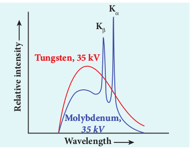

The energy of the photon emitted is equal to the loss of kinetic energy of the electron. Since an electron may lose part or all of its energy to the photon, the photons are emitted with all possible energies (or frequencies). The continuous x-ray spectrum is due to such radiations.

When an electron gives up all its energy, then the photon is emitted with highest frequency _ν_0 (or lowest wavelength λ0 ). The initial kinetic energy of an electron is given by _eV_ where _V_ is the accelerating voltage. Therefore, we have

_hv eV_0 = (or) _hc eV_ λ0

\=

λ0 = _hc eV_  

where λ0 is the cut-off wavelength. Substituting the known values in the above equation, we get

λ 0

12400 =

_V_ Å (8.14)

The relation given by equation (8.14) is known as the **Duane – Hunt formula**.

The value of λ0 depends only on the accelerating potential and is same for all targets. This is in good agreement with the experimental results. Thus, the production of continuous x-ray spectrum and the origin of cut – off wavelength can be explained on the basis of photon theory of radiation.

**Characteristic x – ray spectra:** X – ray spectra show some narrow peaks

at some well – defined wavelengths when the target is hit by fast electrons. The line spectrum showing these peaks is called **characteristic x – ray** **spectrum**. This x – ray spectrum is due to the electronic transitions within the atoms.

When an energetic electron penetrates into the target atom and it can remove some of the _K_\-shell electrons. Then the electrons from outer orbits jump to fill up the vacancy so created in the _K_\-shell. During the downward transition, the energy difference between the levels is given out in the form of x– ray photon of definite wavelength. Such wavelengths, characteristic of the target, constitute the line spectrum.

From the Figure 8.23, it is evident that _K_\-series of lines in the x-ray spectrum of an element arises due to the electronic transitions from _L_, _M_, _N_, . . levels to the _K_\-level. Similarly, the longer wavelength _L_\-series originates when an _L_\-electron is knocked out of the atom and the corresponding vacancy is filled by the
  

electronic transitions from _M_, _N_, _O_ level to the L-level and so on.

The _Kα_ and _Kβ_ of the _K_\-series of molybdenum are shown by the two peaks in its x-ray spectrum in Figure 8.21(b).

**Applications of x-rays:** X-rays are being used in many fields.

Let us list a few of them.

**1)** **Medical diagnosis** X-rays can pass through flesh more

easily than through bones. Thus an x-ray

**_K_**

**_L_**

**_M_**

**_N_**

**_O_**

**_K_**α **_K_**β

**_K_**γ **_K_**ε

**_L_**α **_L_**β **_L_**δ

**_K_**δ

**_L_**γ

**_M_**α **_M_**β

**_M_**γ

**_n=1_**

**_n=2_**

**_n=3_**

**_n=4_**

radiograph containing a deep shadow of the bones and a light shadow of the flesh may be obtained. X-ray radiographs are used to detect fractures, foreign bodies, diseased organs etc.

2) **Medical therapy** Since x-rays can kill diseased tissues,

they are employed to cure skin diseases, malignant tumours etc.

3) **Industry** X-rays are used to check for flaws in

welded joints, motor tyres, tennis balls and wood. At the custom post, they are used for detection of contraband goods.

4) **Scientific research** X-ray diffraction is important tool

to study the structure of the crystalline materials – that is, the arrangement of atoms and molecules in crystals.

**EXAMPLE 8.9**

Calculate the cut-off wavelength and cut- off frequency of x-rays from an x –ray tube of accelerating potential 20,000 V.

**_Solution_**

The cut-off wavelength of the x-rays in the continuous spectrum is given by

λ 

\= = 12400 12400

20000_V_ Å Å

\= 0 62. Å

The corresponding frequency is

ν λ0

0

8

18

10

3 10 4 84 10

0 62 10 = =

× = ×

× −

_c_ .

. Hz
| EXAMPLE 8.9Calculate t he c ut-off wa velength a nd c ut-off frequency of x-rays from an x –ray tube of accelerating potential 20,000 V.SolutionThe cut-off wavelength of the x-rays in the continuous spectrum is given by 12400 12400λ == ÅÅV 20000= 06.Å2The corresponding frequency is c 31× 0ν == =×48.H41 0 zλ 06. 21× 08180 −100 |
|------|

  

„ Particle is a material object which is con (localized in space and time) whereas (not localized in space and time).

„ The liberation of electrons from any surfac „ The minimum energy needed for an electr

work function of that metal. „ 1 _eV_ is equal to 1.602 × 10–19 J. „ The emission of electrons by supplying ther „ Electric field emission occurs when a ver

metal. „ The emission of electrons due to irradiatio „ Secondary emission is the process in which e

of fast moving electrons. „ The photoelectric current (i.e. the number

proportional to the intensity of the inciden „ Stopping potential is that the value of the

collecting electrode A which is just sufficie emitted and make the photocurrent zero.

„ The stopping potential is independent of in „ Maximum kinetic energy of the photoel

incident light. „ For a given surface, the emission of photo

of incident light is greater than a certain frequency.

„ According to Planck, a matter is compose (atoms) which vibrate with different frequ

„ According to Einstein, the energy in ligh concentrated in small packets or energy qu

„ The individual light quantum of definite en „ Light behaves as a wave during its propa

interaction with matter. „ Photo electric cell or photo cell is a device

energy. „ According to de Broglie hypothesis, all

neutrons in motion possess wave nature. Th de Broglie waves or matter waves.

„ Wave nature of the electron is used in the „ Louis de Broglie hypothesis of matter wav

Davisson and Lester Germer in 1927.

**SUMMARY**  

sidered as a tiny concentration of matter wave is a broad distribution of energy

e of a substance is called electron emission. on to escape from the metal surface is called

mal energy is known as thermionic emission. y strong electric field is applied across the

n of light is called photoelectric emission. lectrons are emitted due to the bombardment

of electrons emitted per second) is directly t light. negative (retarding) potential given to the nt to stop the most energetic photoelectrons

tensity of the incident light. ectrons is independent of intensity of the

electrons takes place only if the frequency minimum frequency called the threshold

d of a large number of oscillating particles encies. t is not spread out over wavefronts but is anta.

ergy and momentum is called photon. gation and behaves as a particle during its

which converts light energy into electrical

material particles like electrons, protons, ese waves associated with them are called

construction of electron microscope. es was experimentally confirmed by Clinton
  

„ Whenever fast moving electrons fall on th namely x-rays, are emitted.

„ Continuous x-ray spectrum consists of ra certain minimum wavelength λ0 .

„ Characteristic x-ray spectra show some nar when the target is hit by fast electrons.

**CONCEP**

**Dual nature of rad**

Electron emission

ermionic emission

Field emission

Photoelectric emission

Photoelectric eect

Eect of intensity

Eect of potential dierence

Eect of frequency

Quantisation of energy

Einstein’s photoelectric

equation

Photocells and uses

Observations of Hertz, Hallwachs

and Lenard

Secondary emission  

e materials, a highly penetrating radiations,

diations of all possible wavelengths with a

row peaks at some well–defined wavelengths

**T MAP**

**iation and matter**

Matter waves X-rays

Introduction

Production of X-rays

X-ray spectra

Continuous X-ray spectra

Characteristic X-ray spectra

Applications

De Broglie hypothesis

De Broglie equation

De Broglie wavelength of

electron

Electron microscope

Davisson-Germer Experiment
  

**EVALUATION**

**I Multiple Choice Questions**

1\. The wavelength λe of an electron and λp of a photon of same energy _E_ are related by (NEET 2013) a) λ λ_p e_µ b) λ λ_p e_µ

c) λ λ_p_

_e_

µ 1 d) λ λ_p e_µ 2

**2\.** In an electron microscope, the electrons are accelerated by a voltage of 14 kV. If the voltage is changed to 224 kV_,_ then the de Broglie wavelength associated with the electrons would a) increase by 2 times b) decrease by 2 times c) decrease by 4 times d) increase by 4 times

3\. The wave associated with a moving particle of mass 3 × 10–6 g has the same wavelength as an electron moving with a velocity 6 10

6 1× − m s . The velocity of

the particle is a) 1 82 10

18 1 . × − −

m s

b) 9 10 2 1× − − m s

c) 3 10 31 1× − −

m s

d) 1 82 10 15 1

. × − − m s

**4\.** When a metallic surface is illuminated with radiation of wavelength λ , the stopping potential is _V_. If the same surface is illuminated with radiation of wavelength 2λ , the stopping potential

is _V_ 4

. The threshold wavelength for the

metallic surface is (NEET 2016)

a) 4λ b) 5λ

c) 5 2

λ d) 3λ  

**5\.** If a light of wavelength 330 nm is incident on a metal with work function 3.55 eV, the electrons are emitted. Then the wavelength of the wave associated with the emitted electron is (Take _h_ = 6.6 × 10–34 Js) a) < × −2 75 10 9. m b) ≥ × −2 75 10 9. m

c) ≤ × −2 75 10 12. m d) < × −2 5 10 10. m

**6\.** A photoelectric surface is illuminated successively by monochromatic light of wavelength λ and λ

2 . If the maximum kinetic energy of the emitted photoelectrons in the second case is 3 times that in the first case, the work function of the material is (NEET 2015)

a) _hc_ λ

b) 2_hc_ λ

c) _hc_ 3λ

d) _hc_ 2λ

**7\.** In photoelectric emission, a radiation whose frequency is 4 times threshold frequency of a certain metal is incident on the metal. Then the maximum possible velocity of the emitted electron will be

a) _hv m_

0 b) 6 0_hv m_

c) 2 0_hv m_

d) _hv m_

0

2

**8\.** Two radiations with photon energies 0.9 eV and 3.3 eV respectively are falling on a metallic surface successively. If the work function of the metal is 0.6 eV, then the ratio of maximum speeds of emitted electrons in the two cases will be a) 1:4 b) 1:3 c) 1:1 d)1:9
  

**9\.** A light source of wavelength 520 nm emits 1.04 × 1015 photons per second while the second source of 460 nm produces 1.38 × 1015 photons per second. Then the ratio of power of second source to that of first source is a) 1.00 b) 1.02 c) 1.5 d) 0.98

**10\.** If the mean wavelength of light from sun is taken as 550 nm and its mean power as 3.8 × 1026 W, then the number of photons emitted per second from the sun is of the order of a) 1045 b) 1042

c) 1054 d) 1051

**11\. The threshold wavelength for a metal** surface whose photoelectric work function is 3.313 eV is a) 4125Å b) 3750Å

c) 6000Å d) 2062 5. Å

**12\.** A light of wavelength 500 nm is incident on a sensitive metal plate of photoelectric work function 1.235 eV. The kinetic energy of the photo electrons emitted is (Take _h_ = 6.6 × 10–34 Js) a) 0.58 eV b) 2.48 eV c) 1.24 eV d) 1.16 eV

**13\.** Photons of wavelength λ are incident on a metal. The most energetic electrons ejected from the metal are bent into a circular arc of radius _R_ by a perpendicular magnetic field having magnitude B. The work function of the metal is (KVPY-SX 2016)

a) _hc m e B R me_

_e_λ − +

2 2 2

2

b) _hc m eBR me_

_e_λ +



   

  2

2

2  

c) _hc m c e B R me_

_e_λ - -2

2 2 2

2

d) _hc m eBR me_

_e_λ −



   

  2

2

2

**14\. The work functions for metals A, B** and _C_ are 1.92 eV, 2.0 eV and 5.0 eV respectively. The metal/metals which will emit photoelectrons for a radiation of wavelength 4100Å is/are a) _A_ only b) both _A_ and _B_ c) all these metals d) none

**15\.** Emission of electrons by the absorption of heat energy is called………emission. a) photoelectric b) field c) thermionic d) secondary

**Answers**

**1.** d **2.** c **3.** d **4.** d **5.** b **6.** d **7.** b **8.** b **9.** c **10.** a **11.** b **12.** c **13.** d **14.** b **15.** c

**II Short Answer Questions**

**1\.** Why do metals have a large number of free electrons?

2\. Define work function of a metal. Give its unit.

3\. What is photoelectric effect? **4\.** How does photocurrent vary with the

intensity of the incident light? 5. Give the definition of intensity of light

according to quantum concept and its unit.

6\. How will you define threshold frequency?
  

**7\.** What is a photo cell? Mention the different types of photocells.

**8\.** Write the expression for the de Broglie wavelength associated with a charged particle of charge q and mass m, when it is accelerated through a potential _V_.

**9\.** State de Broglie hypothesis. **10\.** Why we do not see the wave properties

of a baseball? **11\.** A proton and an electron have same

kinetic energy. Which one has greater de Broglie wavelength? Justify.

**12\.** Write the relationship of de Broglie wavelength _λ_ associated with a particle of mass _m_ in terms of its kinetic energy_ K_.

**13\.** An electron and an alpha particle have same kinetic energy. How are the de Broglie wavelengths associated with them related?

**14\. Define stopping potential. 15.** What is surface barrier? **16\.** Mention the two features of x-ray

spectra, not explained by classical electromagnetic theory.

**17\.** What is Bremsstralung?

**III Long Answer Questions**

**1\.** What do you mean by electron emission? Explain briefly various methods of electron emission.

2\. Briefly discuss the observations of Hertz, Hallwachs and Lenard.

3\. Explain the effect of potential difference on photoelectric current.

**4\.** Explain how frequency of incident light varies with stopping potential.

5\. List out the laws of photoelectric effect.  

6\. Explain why photoelectric effect cannot be explained on the basis of wave nature of light.

**7\.** Give the quantum concept of energy proposed by Max Planck.

**8\.** Obtain Einstein’s photoelectric equation with necessary explanation.

**9\.** Explain experimentally observed facts of photoelectric effect with the help of Einstein’s explanation.

**10\.** Give the construction and working of photo emissive cell.

**11\.** Derive an expression for de Broglie wavelength of electrons.

**12\. Briefly explain the principle and** working of electron microscope.

**13\. Describe briefly Davisson – Germer** experiment which demonstrated the wave nature of electrons.

**14\.** List out the characteristics of photons.

**15\.** Give the applications photocell. **16\.** How do we obtain characteristic x-ray

spectra?

**IV. Numerical problems** **1\.** How many photons per second emanate

from a 50 _mW_ laser of 640 _nm_? \[Ans:1 61 10

17 1 . × −

s \] **2\.** Calculate the maximum kinetic

energy and maximum velocity of the photoelectrons emitted when the stopping potential is 81_V_ for the photoelectric emission experiment.

\[Ans: 1.3×10–17J; 5.3×106 ms–1\] **3\.** Calculate the energies of the photons

associated with the following radiation: (i) violet light of 413 nm (ii) X-rays of 0.1 nm (iii) radio waves of 10 _m_.

\[Ans: 3 12424 1 24 10 7

eV eV eV; ; . × − \]
  

**4\.** A 150 W lamp emits light of mean wavelength of 5500 Å . If the efficiency is 12%, find out the number of photons emitted by the lamp in one second.

\[Ans: 4 98 10 19

. ´ \] **5\.** How many photons of frequency 10

14 Hz will make up 19.86 J of energy?

\[Ans: 3 10 20´ \]

**6\.** What should be the velocity of the electron so that its momentum equals that of 4000 Å wavelength photon.

\[Ans: 1818 1

ms - \]

**7\.** When a light of frequency 9 10 14´ Hz is

incident on a metal surface, photoelectrons are emitted with a maximum speed of 8 10

5 1× − ms . Determine the threshold

frequency of the surface. \[Ans: 4 61 10

14 . ´ Hz \]

**8\.** When a 6000Å light falls on the cathode of a photo cell, photoemission takes place. If a potential of 0.8 V is required to stop emission of electron, then determine the (i) frequency of the light (ii) energy of the incident photon (iii) work function of the cathode material (iv) threshold frequency and (v) net energy of the electron after it leaves the surface.

\[Ans: 5×1014 Hz; 2.07 eV; 1.27 eV; 3.07×1014 Hz; 0.8 eV \]

**9\.** A 3310 Å photon liberates an electron from a material with energy 3 10 19× − J while another 5000 Å photon ejects an electron with energy 0 972 10 19. × − J from the same material. Determine the value of Planck’s constant and the threshold wavelength of the material.

\[Ans: 6 62 10 6620 10 34 10

. ;× ×− − Js m \]  

**10\.** At the given point of time, the earth receives energy from sun at 4 _cal_ cm–2 min–1. Determine the number of photons received on the surface of the Earth per cm2 per minute. (Given : Mean wavelength of sun light = 5500 Å )

\[Ans: 4 65 10 19

. ´ \] **11\.** UV light of wavelength 1800Å is

incident on a lithium surface whose threshold wavelength is 4965Å. Determine the maximum energy of the electron emitted.

\[Ans: 4.40 eV\] **12\.** Calculate the de Broglie wavelength of

a proton whose kinetic energy is equal to 81.9 × 10–15 J. (Given: mass of proton is 1836 times that of electron).

\[Ans: 4 10 14× −

m \] **13\.** A deuteron and an alpha particle are

accelerated with the same potential. Which one of the two has i) greater value of de Broglie wavelength associated with it and ii) less kinetic energy? Explain.

\[Ans: λ λα_d_ \= 2 and _K K d_ \= α

2 \] **14\.** An electron is accelerated through a

potential difference of 81V. What is the de Broglie wavelength associated with it? To which part of electromagnetic spectrum does this wavelength correspond?

\[Ans: λ =1 36. Å and x-rays\] **15\. The ratio between the de Broglie**

wavelength associated with proton, accelerated through a potential of 512V and that of alpha particle accelerated through a potential of _X_ volts is found to be one. Find the value of _X_.

\[Ans: 64 V\]
  

**BOOK FOR REFERENCES**

**1\.** Arthur Beiser, Shobhit Mahajan, Rai Ch Edition, McGraw Hill Education (India) P

**2\.** H.S. Mani and G.K. Mehta, _Introduction_ Pvt. Ltd.

**3\.** H.C.Verma, _Concepts of Physics_, Volume 1

**4\.** Halliday, Resnick and Walker, _Principles of_  

oudhury, _Concepts of Modern Physics_, Sixth rivate Limited.

_to Modern Physics, Affiliated East-West Press_

and 2, BharathiBhawan publishers.

_Physics_, Wiley publishers.
  

**Dual nature of radia**

In this activity you will be able to visualize h light knocks electrons off a metal target an describe the photoelectric effect experime

**STEPS:** • Open the browser and type “https://phet.colo

address bar. • Change intensity of light and observe how the i

and the energy of electrons • By adjusting the value of wavelength and obser

electric current and the energy of electrons • Adjust the value of voltage from the battery a

photoelectric current. • Change the material of the target and analyse ho • Study the photo electric current – voltage graph

from this experiment.

**Note:** Install Java application if it is not in your browser. You can download all the phet simulation and wo colorado.edu/en/offline-access .

**URL:** https://phet.colorado.edu/en/simulation/legacy/photoe

\* Pictures are indicative only. \* If browser requires, allow **Flash Player** or **Java Sc**

**ICT CORNER**

**Step1**

**Step3**  

**tion and matter**

ow d

nt.

rado.edu/en/simulation/legacy/photoelectric” in the

ntensity of light will affect the photo electric current

ve how the wavelength of light will affect the photo

nd analyse the effect of potential difference on the

w it will affect the current and the energy of electrons. and Photo electric current - intensity graph obtained

rks in off line fromhttps://phet.

lectric

**ript** to load the page.

**Step4**

**Step2**

**Topic: Photoelectric effect**
