# Electromagnetic Waves

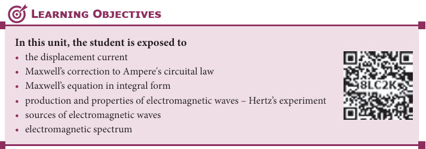

## INTRODUCTION 

We see the world around us through light. Light from the Sun is one of the sources of energy without which human beings cannot survive in this planet. Light plays crucial role in understanding the structure and properties of various things from atom to universe. Without light, even our eyes cannot see objects. What is light?. This puzzle made many physicists sleepless until middle of 19th century. Earlier, many scientists thought that optics and electromagnetism are two different branches of physics. But from the work of James Clerk Maxwell, who actually enlightened the concept of light from his theoretical prediction that light is an electromagnetic wave which moves with the speed equal to 3 × 108 ms–1 (in free space or vacuum). Later, it was confirmed that visible light is just only small portion of electromagnetic spectrum, which ranges from gamma rays to radio waves.

In unit 4, we studied that time varying magnetic field produces an electric field (Faraday’s law of electromagnetic induction). Maxwell strongly believed that nature must possess symmetry and he asked the following question, “when the time varying magnetic field produces an electric field, why not the time varying electric field produce a magnetic field?”

**Symmetry in nature**

Later he proved that it is indeed true. In 1888, H. Hertz experimentally verified Maxwell’s prediction and hence, this understanding resulted in new technological invention, especially in wireless communication, LASER (Light Amplification by Stimulated Emission of Radiation) technology, RADAR (Radio Detection And Ranging) etc.

**Figure 5.2**
(a) cell phone and cell phone 
tower (b) X-ray radiograph of a human being 

In today's digital world, cell phones (Figure 5.2 (a)) have greater influence in our day to day life. It is a faster and more effective mode of transferring information from one place to another. It works on the basis that light is an electromagnetic wave. In hospitals, the location of bone fracture can be detected using X-rays as shown in Figure 5.2 (b), which is also an electromagnetic wave. For cooking microwave oven is used. The microwave is also an electromagnetic wave. There are plenty of applications of electromagnetic waves in engineering, medicine (example LASER surgery, etc), defence (example, RADAR signals) and also in fundamental scientific research. In this unit, basics of electromagnetic waves are discussed.

### Displacement current and Maxwell’s correction to Ampere's circuital law

**Induced magnetic field**
Faraday’s law of electromagnetic induction which states that the change in magnetic field produces an electric field. Mathematically

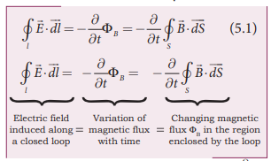

where ΦB is the magnetic flux and ¶
¶t is the partial derivative with respect to time. 
Equation (5.1) means that the electric field E is induced along a closed loop by the changing magnetic flux ΦB in the region encircled by the loop. Now the question asked by James Clerk Maxwell is ‘Is converseof this statement true?’ Answer is ‘yes’. He showed that the change in electric field also produces magnetic field which is
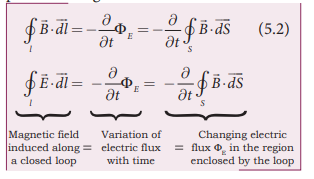

where ΦB is the electric flux. This is known as Maxwell’s law of induction, which explains that the magnetic field B induced along a closed loop by the changing electric flux ΦE in the region encircled by that loop. This in turn, explains the existence of radio waves, gamma rays, infrared rays, etc.

**Displacement current − Maxwell’s correction**

  In order to understand how the 
changing electric field induces magnetic 
field, let us consider a situation of charging 
a parallel plate capacitor which contains 
non−conducting medium between the 
plates.
Let a time−dependent current ic, 
called conduction current be passed 
through the wire to charge the capacitor.  

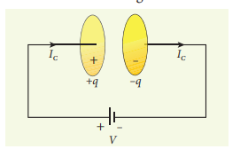

 Ampere’s circuital law can be used to find 
the magnetic field produced around the 
current carrying wire.
To calculate the magnetic field at a point 
P near the wire and outside the capacitor, 
let us draw a circular Amperian loop which 
encloses the circular surface S1
 (Figure 5.3). 
Using Ampere’s circuital law for this loop, 
we get  

where µo is the permeability of free space.

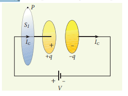

 Now, the same loop is enclosed by balloon shaped surface S2 such that boundaries of two surfaces S1 and S2 are same but the shape of the surfaces is different (Figure 5.4). As Ampere’s law applied for a given closed loop does not depend on the shape of the enclosing surface, the integrals should give the same answer. But by applying Ampere’s circuital law for the surface S2
 , we get

 

The right hand side of equation is zero 
because the surface S2 nowhere touches 
the wire carrying conduction current and 
further, there is no current flowing between 
 the plates of the capacitor (gap between the 
plates). So the magnetic field at a point P 
is zero. Hence there is an inconsistency 
between equations (5.3) and (5.4).
Maxwell resolved this inconsistency as follows: While the capacitor is being charged up, varying electric field is produced between capacitor plates. There must be a current associated with the changing electric field between capacitor plates. In other words, time−varying electric field (or time−varying electric flux) produces a current. This is known as displacement current flowing between the plates of the capacitor (Figure 5.5).

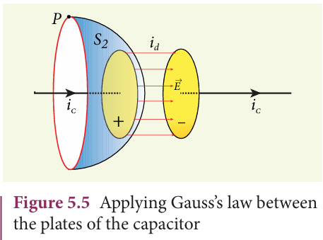

From Gauss’s law of electrostatics, the electric flux between the plates of the capacitor is

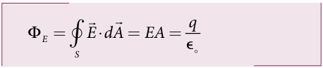

where A is the area of the plates of capacitor. The change in electric flux is given by

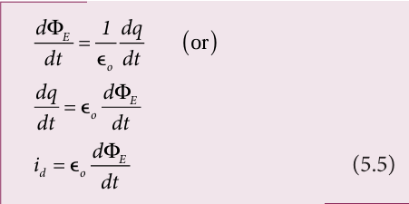

 where dq/dt =i^d is known as displacement 
current or Maxwell’s displacement current.
The displacement current can be defined as the current which comes into play in the region in which the electric field (or the 
electric flux) is changing with time. In other words, whenever the change in electric field takes place, displacement current is produced. 
    Maxwell modified Ampere's law as 

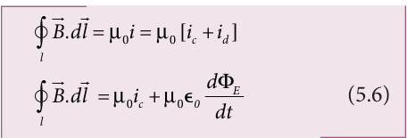

 where the total current enclosed by the surface becomes the sum of conduction current and displacement current. Therefore, 
i= ic+ id.  The equation (5.6) is known as Ampere−Maxwell law. When the current in the 
circuit is constant, the displacement current 
is zero. 

Between the plates, the conduction current is zero while the displacement current is non−zero. This displacement current or time−varying electric field can also produce 
a magnetic field between the plates of the 
capacitor. The magnetic field at a point inside the capacitor is perpendicular to the electric field and is shown in Figure 5.6. This magnetic field can be determined using equation (5.6).

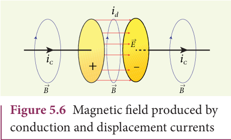

**Importance of Maxwell’s correction:**
 Earth receives radiations from Sun and 
other stars. These radiations travel through 
empty space where there are no electric 
charges and hence no electric current. 
Ampere’s law says that only electric current 
can produce a magnetic field. If Ampere’s law 
alone is true, there will not be any radiation.
Maxwell’s correction term E 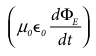
 in Ampere’s law ensures that time−varying 
electric field or displacement current can 
also produce a magnetic field. Though 
conduction current is zero in an empty 
space, displacement current does exist. So, 
the equation (5.6) becomes

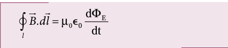

 In stars, due to thermal excitation 
of atoms, time−varying electric field is 
produced which in turn, produces time−
 varying magnetic field. According to 
Faraday’s law, this time−varying magnetic 
field produces again time−varying electric 
field and so on. The coupled time−varying 
electric and magnetic fields travel through 
empty space with the speed of light and is 
called electromagnetic wave. 
Even though Maxwell initially started 
with purely symmetry argument, his 
correction term explains one of the important 
aspects of the universe, namely the existence 
of electromagnetic waves.

**EXAMPLE 5.1**

 Consider a parallel plate capacitor which 
is connected to an 230 V RMS value and 
50 Hz frequency. If the separation distance 
between the plates of the capacitor and 
area of the plates are 1 mm and 20 cm2 
respectively. Calculate the displacement 
current at t = 1 s.

**Solution**

 Potential difference between the plates of 
the capacitor,

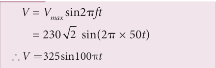

d = 1 mm = 1 × 10–3 m
 A = 20 cm2 = 20 × 10–4 m2 

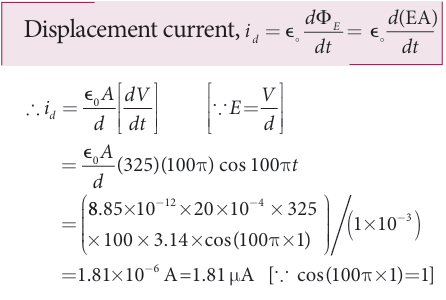

### Maxwell’s equations in integral form

Electrodynamics can be summarized into four basic equations, known as Maxwell’s equations. These equations are analogous to Newton’s equations in mechanics. Maxwell’s equations completely explain the behaviour of charges, currents and properties of electric and magnetic fields. These equations can be written in integral form (or integration form) or derivative form (or differentiation form). The differential form of Maxwell’s equation is beyond higher secondary level because we need to learn additional mathematical operations like curl of vector 
fields and divergence of vector fields. So we 
focus here only in integral form of Maxwell’s equations:

#####First equation 
It is nothing but the Gauss’s law. It relates the net electric flux to net electric charge enclosed in a surface. Mathematically, it is expressed as

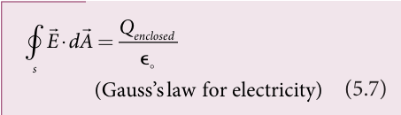

where _E_ is the electric field and Q enclosed is the net charge enclosed by the surface S. This equation is true for both discrete and continuous distribution of charges.

It also indicates that the electric field lines start from positive charge and terminate at negative charge. This implies that the electric field lines do not form a continuous closed path. In other words, it means that an isolated positive charge or negative charge can exist.

######Second equation 
This law is similar to Gauss’s law for
electricity. So this law can also be called as Gauss’s law for magnetism. The surface integral of magnetic field over a closed surface is zero. Mathematically,

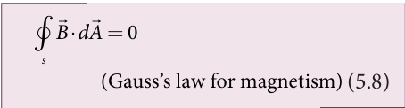

where _B_ is the magnetic field. This equation implies that the magnetic lines of force form a continuous closed path. In other words, it means that no isolated magnetic monopole exists.  

##### Third equation  
It is Faraday’s law of electromagnetic induction. This law relates electric field with the changing magnetic flux which is mathematically written as

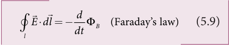

where _E_ is the electric field. This equation implies that the line integral of the electric field around any closed path is equal to the rate of change of magnetic flux through the closed path bounded by the surface.
Our modern technological revolution is due to Faraday’s laws of electromagnetic induction.

##### Fourth equation 
It is modified Ampere’s circuital law.This is also known as Ampere – Maxwell law. This law relates the magnetic field around any closed path to the conduction current and displacement current through that path.

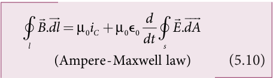
where _B_ is the magnetic field. This equation shows that both conduction current and displacement current produce magnetic field.These four equations are known as Maxwell’s equations in electrodynamics. This equation ensures the existence of electromagnetic waves. The entire communication system in the world depends on electromagnetic waves. In fact our understanding of stars, galaxy, planets etc come by analysing the electromagnetic waves emitted by these astronomical objects.

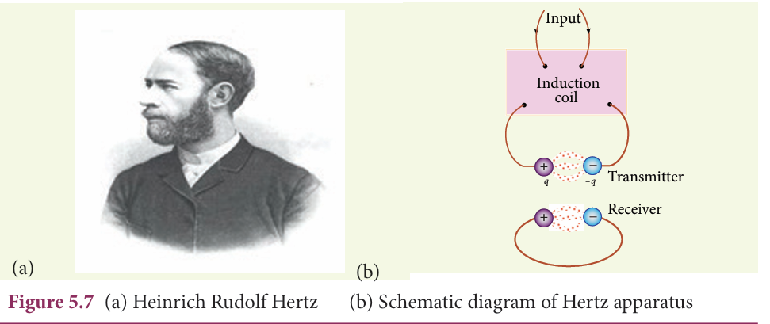

## ELECTROMAGNETIC WAVES

**Electromagnetic waves are non- mechanical waves which move with speed equals to the speed of light (in vacuum).** It is a transverse wave. In the following subsections, we discuss the production of electromagnetic waves and its properties, sources of electromagnetic waves and also classification of electromagnetic spectrum.

### Production and properties of electromagnetic waves
 **Production of electromagnetic waves - Hertz experiment**

Maxwell’s prediction was experimentally confirmed by Heinrich Rudolf Hertz in 1888. The experimental set up used is shown in Figure 5.7 (b).
It consists of two metal electrodes which are made of small spherical metals. These are connected to larger spheres and the ends of them are connected to induction coil with very large number of turns. This is to produce very high electromotive force (emf).

Since the coil is maintained at very high potential, air between the electrodes gets ionized and spark (spark means discharge of electricity) is produced. This discharge of electricity affects another electrode (ring type — not completely closed) which is kept at far distance. This implies that the energy is transmitted from electrode to the receiver (ring electrode) in the form of waves, known as electromagnetic waves.

If the receiver is rotated by 90°, then no spark is observed by the receiver. This confirms that electromagnetic waves are transverse waves as predicted by Maxwell. Hertz detected radio waves and also computed the speed of radio waves which is equal to the speed of light (3 × 108 m s–1).
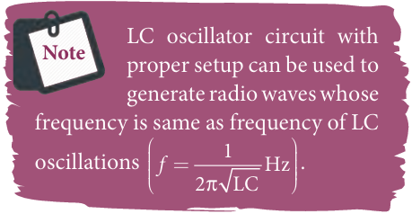

**Properties of electromagnetic waves** 

1\. Electromagnetic waves are produced
by any accelerated charge. 

2\. Electromagnetic waves do not require any medium for propagation. So electromagnetic wave is a non-mechanical wave.

3\. Electromagnetic waves are transverse in nature. This means that the oscillating electric field vector, oscillating 
magnetic field vector and propagation vector 
(gives direction of propagation) are mutually perpendicular to 

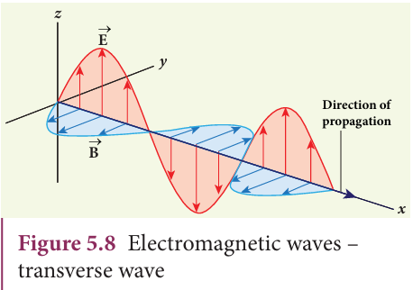

each other. For example, if the electric and 
magnetic fields are as shown in Figure 5.8, 
then the direction of propagation will be 
along x-direction. 

4\. Electromagnetic waves travel with 
speed which is equal to the speed 
of light in vacuum or free space, 

c = = ×
1 3 108
ε µ 
ms-1,
 where εo is the permittivity of free space or vacuum and µo is the permeability of free space or vacuum (refer Unit 1 for permittivity and Unit 3 for permeability).

5\. In a medium with permittivity ε 
and permeability µ, the speed of 
electromagnetic wave is less than 
speed in free space or vacuum, that is, v < c. In a medium of refractive index

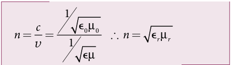
where εr is the relative permittivity of the medium (also known as dielectric constant) and µr is the relative permeability of the medium.

6\. Electromagnetic waves are not 
deflected by electric field or magnetic 
field.

7\. Electromagnetic waves can exhibit interference, diffraction and polarization.

8\.Like other waves, electromagnetic 
waves also carry energy, linear momentum 
and angular momentum. 

9\. If the electromagnetic wave incident on a 
material surface is completely absorbed, then 
the energy delivered is U and momentum 
imparted on the surface is 
p=U/C. 

10\. If the incident electromagnetic wave 
of energy U is totally reflected from the 
surface, then the momentum delivered to 

 the surface is ^p=U/C-(-U/C)=2U/C.

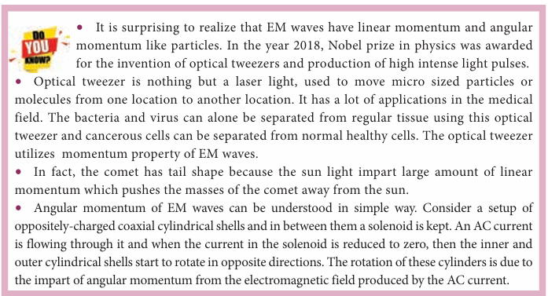
 
**EXAMPLE 5.2**

The relative magnetic permeability of the medium is 2.5 and the relative electrical permittivity of the medium is 2.25. Compute the refractive index of the medium.

**_Solution_**

Dielectric constant (relative permittivity of the medium), er = 2.25

Magnetic permeability, µr = 2.5

Refractive index of the medium,
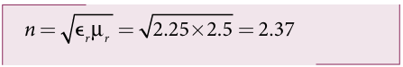

### Sources of electromagnetic waves

Any stationary charge produces only electric field (refer Unit 1). When the charge moves with uniform velocity, it produces steady current which gives rise to magnetic field (not time dependent, only space dependent) around the conductor in which charge flows. If the charged particle accelerates, it produces magnetic field in addition to electric field. Both electric and magnetic fields are time varying fields. Since the electromagnetic waves are transverse waves, the direction of propagation of electromagnetic waves is perpendicular to the planes containing electric and magnetic field vectors.

Any oscillatory motion is also an accelerated motion. So, when the charge oscillates (oscillating molecular dipole) about their mean position (Figure 5.9), it produces electromagnetic waves.

Suppose the electromagnetic field in free space propagates along _z_\-direction and if the electric field vector points along _x_\-axis, then the magnetic field vector will be mutually perpendicular to both electric field and the direction of wave propagation. Thus
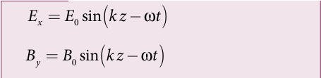
where _E_o and _B_o are amplitudes of oscillating electric and magnetic field, _k_ is a wave number, ω is the angular frequency of the

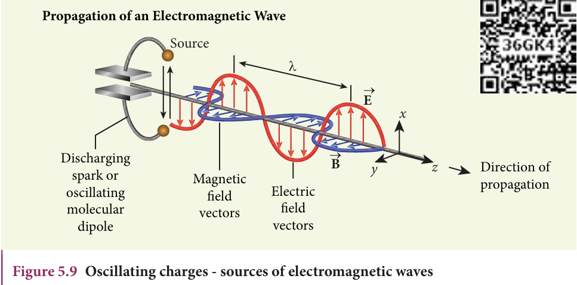

wave and k  (unit vector, here it is called propagation vector) denotes the direction of propagation of electromagnetic wave. Note that both electric field and magnetic field oscillate with a frequency (frequency of electromagnetic wave) which 
is equal to the frequency of the source (here, oscillating charge is the source 
for the production of electromagnetic waves).  
In free space or in vacuum, the ratio between Eo and Bo is equal to the speed of electromagnetic wave and is equal to speed of light c.

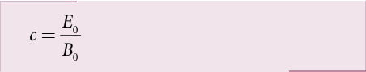

 In any medium, the ratio of Eo
 and Bo is equal to the speed of electromagnetic wave in that medium. Thus 

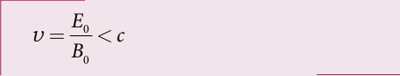
Further, the energy of electromagnetic waves comes from the energy of the 
oscillating charge.

**EXAMPLE 5.3**

Compute the speed of the electromagnetic wave in a medium if the amplitude of electric and magnetic fields are 3 × 104 N C–1 and 2 × 10–4 T, respectively.

**_Solution_**

The amplitude of the electric field, _E_o = 3 × 104 N C–1

The amplitude of the magnetic field, _B_o = 2 × 10–4 T. Therefore, speed of the electromagnetic wave in that medium is
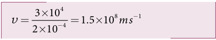
  
### Electromagnetic spectrum

**Figure 5.10 Electromagnetic spectrum -**

Electromagnetic spectrum is an orderly distribution of electromagnetic waves in terms of wavelength or frequency (Figure 5.10). 

**Radio waves**

They are produced by accelerated motion of charges in conducting wires. The frequency range is from a few Hz to 109 Hz. They show reflection and diffraction.They are used in radio and television communication systems and also in cellular phones to transmit voice communication in the ultra high frequency band. 

**Microwaves**

It is produced by special vacuum tubes such as klystron, magnetron and gunndiode. The frequency range of microwaves is 109 Hz to 1011 Hz.These waves undergo reflection and can be polarised.
It is used in radar system for aircraft navigation, speed of the vehicle, microwave oven for cooking and very long distance wireless communication through satellites.

 **Infrared radiation**

It is produced by hot bodies (also known as heat waves) and also by when the molecules undergoing rotational and vibrational transitions. The frequency range is 1011 Hz to 4 × 1014 Hz.
It provides electrical energy to satellites by means of solar cells. It is used to produce dehydrated fruits, in green houses to keep the plants warm, heat therapy for muscular pain or sprain, TV remote as a signal carrier, 
to look through haze fog or mist and used in night vision or infrared photograph.

**Visible light**

It is produced by incandescent bodies and also it is radiated by excited atoms in gases. The frequency range is from 4 × 1014 Hz to 8 × 1014 Hz.

It obeys the laws of reflection and refraction. It undergoes interference, diffraction and can be polarised. It exhibits photo-electric effect also. It can be used to study the structure of molecules, arrangement of electrons in external shells of atoms. It causes sensation of vision.

**Ultraviolet radiation**

It is produced by Sun, arc and ionized gases. Its frequency range is from 8 × 1014 Hz to 1017 Hz.  It has less penetrating power. It can be absorbed by atmospheric ozone and is harmful to human body. It is used to destroy bacteria in sterilizing the surgical instruments, burglar alarm, to detect the invisible writing, finger prints and also in the study of atomic structure.

**X-rays** 

It is produced when there is sudden stopping of high speed electrons at high- atomic number target, and also by electronic transitions among the innermost orbits of atoms. The frequency range of X-rays is from 1017 Hz to 1019 Hz.
X-rays have more penetrating power than ultraviolet radiation. X-rays are used extensively in studying structures of inner atomic electron shells and crystal structures. It is used in detecting fractures, diseased organs, formation of bones and stones, observing the progress of healing bones. Further, in a finished metal product, it is 
used to detect faults, cracks, flaws and holes.

**Gamma rays**
It is produced by transitions of radioactive nuclei and decay of certain elementary particles. They produce chemical reactions on photographic plates, fluorescence, ionisation, diffraction. 
The frequency range is 1018 Hz and above. Gamma rays have higher penetrating power than X-rays and ultraviolet radiations; it has no charge but harmful to human body. 
Gamma rays provide information about the structure of atomic nuclei. It is used in radio therapy for the treatment of cancer and tumour, in food industry to kill pathogenic microorganism

**EXAMPLE 5.4**

A magnetron in a microwave oven emits electromagnetic waves (em waves) with frequency _f_ = 2450 MHz. What magnetic field strength is required for electrons to move in circular paths with this frequency?.

**_Solution_**

Frequency of the electromagnetic waves given, _f_ = 2450 MHz

The corresponding angular frequency is

_ω_ = 2π_f_ = 2 × 3.14 × 2450 × 106 = 15,386 × 106 Hz = 1.54 × 1010 s–1

The required magnetic field, _B m q e_\= ω

Mass of the electron, _me_ = 9.11 × 10–31 kg Charge of the electron,

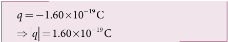
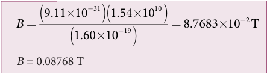

This magnetic field can be easily produced with a permanent magnet. So, electromagnetic waves of frequency 2450 MHz can be used for heating and cooking food because they are strongly absorbed by water molecules.

## TYPES OF SPECTRUM- EMISSION AND ABSORPTION SPECTRUM- FRAUNHOFER LINES

When an object burns, it emits radiations. That is, it emits electromagnetic radiation which depends on temperature. If the object becomes hot, it glows in red colour. If the temperature of the object is further increased, then it glows in reddish- orange colour and becomes white when it is hottest. The spectrum in Figure 5.11 usually

is called black body spectrum (Refer XI Physics Unit 8). It is a continuous frequency (or wavelength) curve depending on the body’s temperature.

Suppose we allow a beam of white light to pass through the prism (as shown in Figure 5.12). It is split into its seven constituent colours which can be viewed on the screen as continuous spectrum. This phenomenon is known as dispersion of light and the definite pattern of colours obtained on the screen after dispersion is called as spectrum. The spectra can be broadly classified into two catagories:

**Figure 5.12** White light passed through prism – dispersion

**(a)Emission spectra** When the spectrum of self luminous
source is taken, we get emission spectrum. Each source has its own characteristic

**Figure 5.13**  *continuous emission spectra*

**Figure 5.14** *line emission spectra* 

emission spectrum. The emission spectrum can be divided into three types:

**(i) Continuous emission spectrum (or continuous spectrum)** 
If the light from incandescent lamp (filament bulb) is allowed to pass through prism (simplest spectroscope), it splits up into seven colours. Thus, it consists of wavelengths containing all the visible colours ranging from violet to red (Figure 5.13). Examples: spectrum obtained from carbon arc and incandescent solids.

**(ii) Line emission spectrum (or line spectrum):**

Suppose light from hot gas is allowed to pass through prism, line spectrum is observed (Figure 5.14). Line spectra are also known as discontinuous spectra. The line spectra consists of sharp lines of definite wavelengths or frequencies. Such spectra arise due to excited atoms of elements. These lines are the characteristics of the element and are different for different elements. Examples: spectra of atomic hydrogen, helium, etc.

**(iii) Band emission spectrum (or band spectrum)**

Band spectrum consists of several number of very closely spaced spectral lines which overlap together forming specific bands which are separated by dark spaces. This spectrum has a sharp edge at one end and fades out at the other end. Such spectra arise when the molecules are excited. Band spectrum is the characteristic of the molecule and hence the structure of the molecules can be studied using their band spectra. Example: spectra of ammonia gas in the discharge tube etc.

**(b) Absorption spectra** 
**When light is allowed to pass through a medium or an absorbing substance then the spectrum obtained is known as absorption spectrum.** It is the characteristic of absorbing substance. Absorption spectrum is classified into three types:

**(i) Continuous absorption spectrum**
When we pass white light through a blue glass plate, it absorbs all the colours except blue and gives continuous absorption spectrum.

**Figure 5.15** *line absorption spectra*

**Fraunhofer lines**
When the spectrum obtained from the Sun is examined, it consists of large 
number of dark lines (line absorption spectrum). These dark lines in the solar spectrum are 

**Figure 5.16** Solar spectrum - Fraunhofer lines 
 
known as Fraunhofer lines (Figure 5.16). The absorption spectra for various materials are compared with the Fraunhofer lines in the solar spectrum, which helps in identifying elements present in the Sun’s atmosphere.

**(ii) Line absorption spectrum**

When light from the incandescent lamp is passed through cold gas (medium), the spectrum obtained through the dispersion due to prism is line absorption spectrum (Figure 5.15). Similarly, if the light from the carbon arc is made to pass through sodium vapour, a continuous spectrum of carbon arc with two dark lines in the yellow region are obtained.

**(iii) Band absorption spectrum**

When white light is passed through the iodine vapour, dark bands on continuous bright background is obtained. This type of band is also obtained when white light is passed through diluted solution of blood or chlorophyll or through certain solutions of organic and inorganic compounds.

#### SUMMARY
- Displacement current can be defined as region in which the electric field and the electric flux are changing with time’.

- Maxwell modified Ampere's law as

   _B dl i i io o c d_⋅ = = +( )∫ µ µ .

- An electromagnetic wave is radiated by an accelerated charge which propagates 
through space as coupled electric and magnetic fields, oscillating perpendicular to 
each other and to the direction of propagation of the wave.

- Electromagnetic waves are non-mechanical and do not require any medium for 
propagation.

- The instantaneous magnitude of the electric and magnetic field vectors in 
electromagnetic wave are related by c = E / B.

- Electromagnetic waves can show interference, diffraction and also can be polarized
 
- Electromagnetic waves carry not only energy and momentum but also angular 
momentum. 

- Types of spectra: emission and absorption spectra.
 
- When the spectrum of self luminous source is taken, we get emission spectrum. Each 
source has its own characteristic emission spectrum. The emission spectrum can be divided into three types: continuous, line and band.
 
- When the spectrum obtained from the Sun is examined, it consists of a large number of dark lines (line absorption spectrum). These dark lines in the solar spectrum are known as Fraunhofer lines.

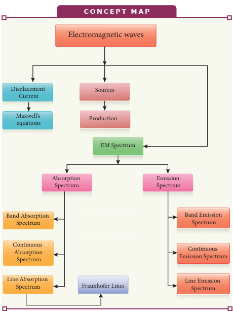

**I Multiple choice questions**

**1\.** The dimension of 1 /µ_o_e is 
(a) \[L T−**1\]** (b) \[L2 T−2\] 
(c) \[L−1 T\]     (d) \[L−2 T2\]

**2\.** If the amplitude of the magnetic field is 3 × 10−6 T, then amplitude of the electric field for a electromagnetic waves is 
(a) 100 V m−1 (b) 300 V m−1 
(c) 600 V m−1 (d) 900 V m−1

**3\.** Which of the following electromagnetic radiations is used for viewing objects through fog 
(a) microwave       (b) gamma rays 
(c) X- rays         (d) infrared

**4\.** Which of the following is false for electromagnetic waves 
(a) transverse      (b) non-mechanical waves (c) longitudinal    (d) produced by accelerating charges

**5\.** Consider an oscillator which has a charged particle oscillating about its mean position with a frequency of 300 MHz. The wavelength of electromagnetic waves produced by this oscillator is 
(a) 1 m         (b) 10 m                    (c) 100 m       (d) 1000 m

**6\.** The electric and the magnetic fields, associated with an electromagnetic wave, propagating along negative X axis can be represented by

(a)  

 _E E i B B k_\= = and

(b)  

 _E E k B B j_\= = and  

**EVALUATION**

(c)  

 _E E i B B j_\= = and

(d)  

 _E E j B B i_\= = and

**7\.** In an electromagnetic wave travelling in free space the rms value of the electric field is 3 V m−1. The peak value of the magnetic field is (a) 1.414 × 10−8 T (b) 1.0 × 10−8 T (c) 2.828 × 10−8 T (d) 2.0 × 10−8 T

**8\.** An e.m. wave is propagating in a medium with a velocity  _v v i_\= . The instantaneous oscillating electric field of this e.m. wave is along _+y_\-axis, then the direction of oscillating magnetic field of the e.m. wave will be along:

(a) _–y_ direction (b) _–x_ direction (c) _+z_ direction (d) _–z_ direction

**9\.** If the magnetic monopole exists, then which of the Maxwell’s equation to be modified?.

(a)  

  _E dA_

_Qenclosed_

_s_

⋅ =∫ e

(b)   _B dA s_

⋅ =∫ 0

(c)       _B dl i d_

_dt E dA_

_l c_

_s_

. .∫ ∫= +µ µ0 0 0e

(d)    _E dl d_

_dt B l_

⋅ =−∫ Φ

10\. Fraunhofer lines are an example of \_\_\_\_\_\_\_ spectrum.

(a) line emission (b) line absorption

(c) band emission (d) band absorption

  

11\. Which of the following is an electromagnetic wave? (a) α - rays (b) β - rays (c) γ - rays (d) all of them

12\. Which one of them is used to produce a propagating electromagnetic wave?. (a) an accelerating charge (b) a charge moving with constant velocity (c) a stationary charge (d) an uncharged particle

13\. If _E_ = _E_o sin\[106 _x_ -_ωt_\] be the electric field of a plane electromagnetic wave, the value of _ω_ is (a) 0.3 × 10−14 rad s−1

(b) 3 × 10−14 rad s−1 (c) 0.3 × 1014 rad s−1

(d) 3 × 1014 rad s−1

14\. Which of the following is NOT true for electromagnetic waves?. (a) it transports energy (b) it transports momentum (c) it transports angular momentum (d) in vacuum, it travels with different

speeds which depend on their frequency

15\. The electric and magnetic fields of an electromagnetic wave are (a) in phase and perpendicular to each

other (b) out of phase and not perpendicular

to each other (c) in phase and not perpendicular to

each other (d) out of phase and perpendicular to

each other  

**Answers**

**1)** b **2)** d **3)** d **4)** c **5)** a **6)** b **7)** a **8)** c **9)** b **10)** b **11)** c **12)** a **13)** d **14)** d **15)** a

**II Short answer questions**

**1\.** What is displacement current? 
**2\.** What are electromagnetic waves? 
**3\.** Write down the integral form of
modified Ampere’s circuital law. 
**4\.** Write notes on Gauss' law in
magnetism. 
**5\.** Give two uses each of (i) IR radiation,
(ii) Microwaves and (iii) UV radiation. 
**6\.** What are Fraunhofer lines? How are
they useful in the identification of elements present in the Sun?
**7\.** Write notes on Ampere-Maxwell law. **8\.** Why are e.m. waves non-mechanical?

**III Long answer questions**

**1\.** Write down Maxwell equations in integral form.
**2\.** Write short notes on (a) microwave (b) X-ray (c) radio waves (d) visible spectrum
**3\.** Discuss the Hertz experiment. 4. Explain the Maxwell’s modification of
Ampere’s circuital law. 
**5\.** Explain the importance of Maxwell’s
correction. 
**6\.** Write down the properties of
electromagnetic waves. 
**7\.** Discuss the source of electromagnetic
waves. 
**8\.** Explain the types of emission spectrum. 
**9\.** Explain the types of absorption
spectrum.

**IV Numerical problems**

**1\.** Consider a parallel plate capacitor whose plates are closely spaced. Let _R_ be the radius of the plates and the current in the wire connected to the plates is 5 A, calculate the displacement current through the surface passing between the plates by directly calculating the rate of change of flux of electric field through the surface.

Answer: _Id_ **=** _Ic_ **=** 5 A 

**2\.** A transmitter consists of LC circuit with

an inductance of 1 µH and a capacitance of 1 µF. What is the wavelength of the electromagnetic waves it emits? Answer: 18.84 × 102 m

**3\.** A pulse of light of duration 10−6 s is absorbed completely by a small object initially at rest. If the power of the

**BOOKS FOR REFERENCE:**

**1\.** H. C. Verma, _Concepts of Physics – Volume_

**2\.** Halliday, Resnick and Walker, _Fundamenta_

**3\.** Serway and Jewett, _Physics for scientist and_ publishers, Eighth edition.

**4\.** David J. Griffiths, Introduction to electrody

**5\.** Paul Tipler and Gene Mosca, Physics for scientist and engineers with modern physics, Sixth edition, W.H.Freeman and Company.

Answer: 20 × 10−17 kg m s−1 **4\.** Let an electromagnetic wave propagate

along the _x_ \- direction, the magnetic field oscillates at a frequency of 1010 Hz and has an amplitude of 10−5 T, acting along the y - direction. Then, compute the wavelength of the wave. Also write down the expression for electric field in this case.

Answer: _λ_ = 3 × 10−2 m and 

_E x t x t k_( , ) sin . .= × × − ×( ) −( ) −3 10 2 09 10 6 28 103 2 10  NC 1

**5\.** If the relative permeability and relative permittivity of a medium are 1.0 and 2.25 respectively, find the speed of the electromagnetic wave in this medium.

Answer: _v_ = 2 × 108 m s−1

_2_, Bharati Bhawan Publisher.

_ls of Physics_, Wiley Publishers, 10th edition.

_engineers with modern physics_, Brook/Coole

_namics_, Pearson publishers.

_entist and engineers with modern physics_, Sixth

  

**Electromag**

In this activity you will be able to how do microwaves heat food?

**STEPS:** • Open the browser and type “phet.colorado.edu/

Run the simulation. • select ‘one molecule’ tab. Turn on the microwave

arrows indicate the strength and direction of the on the water molecules present in food. Observ this force?

• Observe how do microwaves heat food by rotat • Change amplitude and frequency of microwave

rotating?

**Note:** Install Java application if it is not in your system. simulation and works in off line from https://phet.c

**URL:** https://phet.colorado.edu/en/simulation/microwaves

\* Pictures are indicative only. \* If browser requires, allow **Flash Player** or **Java Sc**

**ICT CORNER**

**Step1**

**Step3**

Discuss the relationship between rotating  

**netic waves**

en/simulation/microwaves” in the address bar.

using the button in the right control panel. The force that would be exerted by the micro wave

e the response of water molecule in response to

ing water molecule? and discuss how fast the water molecules are

You can download all the phet olorado.edu/en/offline-access.

**ript** to load the page.

**Step4**

**Step2**

**Physics of microwaves and**

**heating food**

speed of the molecule with cooking time.

