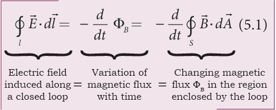
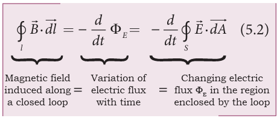
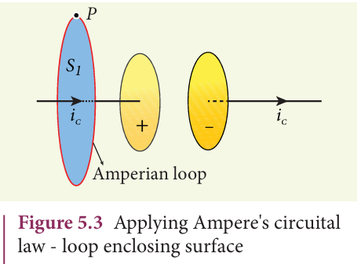
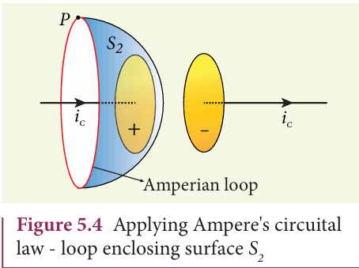
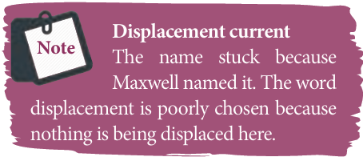

# Electromagnetic Waves

## INTRODUCTION 

We see the world around us through light. Light from the Sun is one of the sources of energy without which human beings cannot survive in this planet. Light plays crucial role in understanding the structure and properties of various things from atom to universe. Without light, even our eyes cannot see objects. What is light?. This puzzle made many physicists sleepless until middle of 19th century. Earlier, many scientists thought that optics and electromagnetism are two different branches of physics. But from the work of James Clerk Maxwell, who actually enlightened the concept of light from his theoretical prediction that light is an electromagnetic wave which moves with the speed equal to 3\times 10^{8}ms^{-1} (in free space or vacuum). Later, it was confirmed that visible light is just only small portion of electromagnetic spectrum, which ranges from gamma rays to radio waves.

In unit 4, we studied that time varying magnetic field produces an electric field (Faraday’s law of electromagnetic induction). Maxwell strongly believed that nature must possess symmetry and he asked the following question, “when the time varying magnetic field produces an electric field, why not the time varying electric field produce a magnetic field?”

**Symmetry in nature**

Later he proved that it is indeed true. In 1888, H. Hertz experimentally verified Maxwell’s prediction and hence, this understanding resulted in new technological invention, especially in wireless communication, LASER (Light Amplification by Stimulated Emission of Radiation) technology, RADAR (Radio Detection And Ranging) etc.

**Figure 5.2**
(a) cell phone and cell phone 
tower (b) X-ray radiograph of a human being 

In today's digital world, cell phones (Figure 5.2 (a)) have greater influence in our day to day life. It is a faster and more effective mode of transferring information from one place to another. It works on the basis that light is an electromagnetic wave. In hospitals, the location of bone fracture can be detected using X-rays as shown in Figure 5.2 (b), which is also an electromagnetic wave. For cooking microwave oven is used. The microwave is also an electromagnetic wave. There are plenty of applications of electromagnetic waves in engineering, medicine (example LASER surgery, etc), defence (example, RADAR signals) and also in fundamental scientific research. In this unit, basics of electromagnetic waves are discussed.

### Displacement current and Maxwell’s correction to Ampere's circuital law

**Induced magnetic field**
Faraday’s law of electromagnetic induction which states that the change in magnetic field produces an electric field. Mathematically

where Φ_B is the magnetic flux and {\frac{d}{dt}} is the partial derivative with respect to time. 
Equation (5.1) means that the electric field \vec{E} is induced along a closed loop by the changing magnetic flux Φ_B in the region encircled by the loop. Now the question asked by James Clerk Maxwell is ‘Is converseof this statement true?’ Answer is ‘yes’. He showed that the change in electric field also produces magnetic field which is

where Φ_B is the electric flux. This is known as Maxwell’s law of induction, which explains that the magnetic field \vec{B} induced along a closed loop by the changing electric flux Φ_E in the region encircled by that loop. This in turn, explains the existence of radio waves, gamma rays, infrared rays, etc.

**Displacement current − Maxwell’s correction**

  In order to understand how the 
changing electric field induces magnetic 
field, let us consider a situation of charging 
a parallel plate capacitor which contains 
non−conducting medium between the 
plates.
Let a time−dependent current i_c, 
called conduction current be passed 
through the wire to charge the capacitor.  

 Ampere’s circuital law can be used to find 
the magnetic field produced around the 
current carrying wire.
To calculate the magnetic field at a point 
P near the wire and outside the capacitor, 
let us draw a circular Amperian loop which 
encloses the circular surface S_1
 (Figure 5.3). 
Using Ampere’s circuital law for this loop, 
we get  

where µ_o is the permeability of free space.

 Now, the same loop is enclosed by balloon shaped surface S_2such that boundaries of two surfaces S_1 and S_2 are same but the shape of the surfaces is different (Figure 5.4). As Ampere’s law applied for a given closed loop does not depend on the shape of the enclosing surface, the integrals should give the same answer. But by applying Ampere’s circuital law for the surface S_2
 , we get

 

The right hand side of equation is zero 
because the surface S_2 nowhere touches 
the wire carrying conduction current and 
further, there is no current flowing between 
 the plates of the capacitor (gap between the 
plates). So the magnetic field at a point P 
is zero. Hence there is an inconsistency 
between equations (5.3) and (5.4).
Maxwell resolved this inconsistency as follows: While the capacitor is being charged up, varying electric field is produced between capacitor plates. There must be a current associated with the changing electric field between capacitor plates. In other words, time−varying electric field (or time−varying electric flux) produces a current. This is known as displacement current flowing between the plates of the capacitor (Figure 5.5).

From Gauss’s law of electrostatics, the electric flux between the plates of the capacitor is

where A is the area of the plates of capacitor. The change in electric flux is given by

 where {\frac{dq}{dt}}=i_d is known as displacement 
current or Maxwell’s displacement current.
The displacement current can be defined as the current which comes into play in the region in which the electric field (or the 
electric flux) is changing with time. In other words, whenever the change in electric field takes place, displacement current is produced. 
    Maxwell modified Ampere's law as 

 where the total current enclosed by the surface becomes the sum of conduction current and displacement current. Therefore, 
i=i_c+i_d.  The equation (5.6) is known as Ampere−Maxwell law. When the current in the 
circuit is constant, the displacement current 
is zero. 

Between the plates, the conduction current is zero while the displacement current is non−zero. This displacement current or time−varying electric field can also produce 
a magnetic field between the plates of the 
capacitor. The magnetic field at a point inside the capacitor is perpendicular to the electric field and is shown in Figure 5.6. This magnetic field can be determined using equation (5.6).

**Importance of Maxwell’s correction:**
 Earth receives radiations from Sun and 
other stars. These radiations travel through 
empty space where there are no electric 
charges and hence no electric current. 
Ampere’s law says that only electric current 
can produce a magnetic field. If Ampere’s law 
alone is true, there will not be any radiation.
Maxwell’s correction term E 
 in Ampere’s law ensures that time−varying 
electric field or displacement current can 
also produce a magnetic field. Though 
conduction current is zero in an empty 
space, displacement current does exist. So, 
the equation (5.6) becomes

 In stars, due to thermal excitation 
of atoms, time−varying electric field is 
produced which in turn, produces time−
 varying magnetic field. According to 
Faraday’s law, this time−varying magnetic 
field produces again time−varying electric 
field and so on. The coupled time−varying 
electric and magnetic fields travel through 
empty space with the speed of light and is 
called electromagnetic wave. 
Even though Maxwell initially started 
with purely symmetry argument, his 
correction term explains one of the important 
aspects of the universe, namely the existence 
of electromagnetic waves.

**EXAMPLE 5.1**

 Consider a parallel plate capacitor which 
is connected to an 230 V RMS value and 
50 Hz frequency. If the separation distance 
between the plates of the capacitor and 
area of the plates are 1 mm and 20 cm^2 
respectively. Calculate the displacement 
current at t = 1 s.

**Solution**

 Potential difference between the plates of 
the capacitor,

d = 1 mm = 1 × 10^{-3}m

A = 20 cm^2 = 20 × 10^{-4} m^2  

### Maxwell’s equations in integral form

Electrodynamics can be summarized into four basic equations, known as Maxwell’s equations. These equations are analogous to Newton’s equations in mechanics. Maxwell’s equations completely explain the behaviour of charges, currents and properties of electric and magnetic fields. These equations can be written in integral form (or integration form) or derivative form (or differentiation form). The differential form of Maxwell’s equation is beyond higher secondary level because we need to learn additional mathematical operations like curl of vector 
fields and divergence of vector fields. So we 
focus here only in integral form of Maxwell’s equations:

**First equation**
It is nothing but the Gauss’s law. It relates the net electric flux to net electric charge enclosed in a surface. Mathematically, it is expressed as

where \vec{E} is the electric field and Q enclosed is the net charge enclosed by the surface S. This equation is true for both discrete and continuous distribution of charges.

It also indicates that the electric field lines start from positive charge and terminate at negative charge. This implies that the electric field lines do not form a continuous closed path. In other words, it means that an isolated positive charge or negative charge can exist.

**Second equation** 
This law is similar to Gauss’s law for
electricity. So this law can also be called as Gauss’s law for magnetism. The surface integral of magnetic field over a closed surface is zero. Mathematically,

where \vec{B} is the magnetic field. This equation implies that the magnetic lines of force form a continuous closed path. In other words, it means that no isolated magnetic monopole exists.  

**Third equation**  
It is Faraday’s law of electromagnetic induction. This law relates electric field with the changing magnetic flux which is mathematically written as

where \vec{E} is the electric field. This equation implies that the line integral of the electric field around any closed path is equal to the rate of change of magnetic flux through the closed path bounded by the surface.
Our modern technological revolution is due to Faraday’s laws of electromagnetic induction.

**Fourth equation** 
It is modified Ampere’s circuital law.This is also known as Ampere – Maxwell law. This law relates the magnetic field around any closed path to the conduction current and displacement current through that path.

where \vec{B} is the magnetic field. This equation shows that both conduction current and displacement current produce magnetic field.These four equations are known as Maxwell’s equations in electrodynamics. This equation ensures the existence of electromagnetic waves. The entire communication system in the world depends on electromagnetic waves. In fact our understanding of stars, galaxy, planets etc come by analysing the electromagnetic waves emitted by these astronomical objects.

