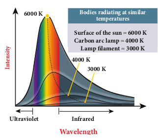
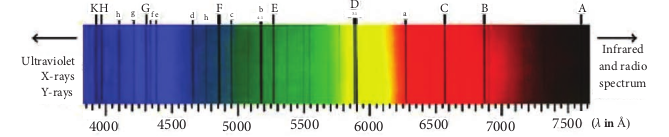
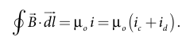
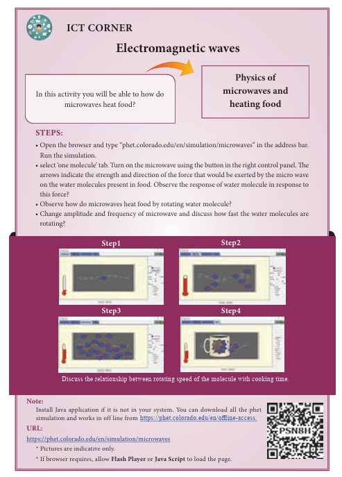

# types of spectrum emission and sbsorption spectrum-fraunhofer lines

When an object burns, it emits radiations. That is, it emits electromagnetic radiation which depends on temperature. If the object becomes hot, it glows in red colour. If the temperature of the object is further increased, then it glows in reddish- orange colour and becomes white when it is hottest. The spectrum in Figure 5.11 usually

is called black body spectrum (Refer XI Physics Unit 8). It is a continuous frequency (or wavelength) curve depending on the body’s temperature.

Suppose we allow a beam of white light to pass through the prism (as shown in Figure 5.12). It is split into its seven constituent colours which can be viewed on the screen as continuous spectrum. This phenomenon is known as dispersion of light and the definite pattern of colours obtained on the screen after dispersion is called as spectrum. The spectra can be broadly classified into two catagories:

**Figure 5.12** White light passed through prism – dispersion

**(a)Emission spectra** When the spectrum of self luminous
source is taken, we get emission spectrum. Each source has its own characteristic

**Figure 5.13**  *continuous emission spectra*

**Figure 5.14** *line emission spectra* 

emission spectrum. The emission spectrum can be divided into three types:

**(i) Continuous emission spectrum (or continuous spectrum)** 
If the light from incandescent lamp (filament bulb) is allowed to pass through prism (simplest spectroscope), it splits up into seven colours. Thus, it consists of wavelengths containing all the visible colours ranging from violet to red (Figure 5.13). Examples: spectrum obtained from carbon arc and incandescent solids.

**(ii) Line emission spectrum (or line spectrum):**

Suppose light from hot gas is allowed to pass through prism, line spectrum is observed (Figure 5.14). Line spectra are also known as discontinuous spectra. The line spectra consists of sharp lines of definite wavelengths or frequencies. Such spectra arise due to excited atoms of elements. These lines are the characteristics of the element and are different for different elements. Examples: spectra of atomic hydrogen, helium, etc.

**(iii) Band emission spectrum (or band spectrum)**

Band spectrum consists of several number of very closely spaced spectral lines which overlap together forming specific bands which are separated by dark spaces. This spectrum has a sharp edge at one end and fades out at the other end. Such spectra arise when the molecules are excited. Band spectrum is the characteristic of the molecule and hence the structure of the molecules can be studied using their band spectra. Example: spectra of ammonia gas in the discharge tube etc.

**(b) Absorption spectrum** 

**When light is allowed to pass through a medium or an absorbing substance then the spectrum obtained is known as absorption spectrum.** It is the characteristic of absorbing substance. Absorption spectrum is classified into three types:

**(i) Continuous absorption spectrum**
When we pass white light through a blue glass plate, it absorbs all the colours except blue and gives continuous absorption spectrum.

**Figure 5.15** *line absorption spectra*

**Fraunhofer lines**
When the spectrum obtained from the Sun is examined, it consists of large 
number of dark lines (line absorption spectrum). These dark lines in the solar spectrum are 

**Figure 5.16** Solar spectrum - Fraunhofer lines 
 
known as Fraunhofer lines (Figure 5.16). The absorption spectra for various materials are compared with the Fraunhofer lines in the solar spectrum, which helps in identifying elements present in the Sun’s atmosphere.

**(ii) Line absorption spectrum**

When light from the incandescent lamp is passed through cold gas (medium), the spectrum obtained through the dispersion due to prism is line absorption spectrum (Figure 5.15). Similarly, if the light from the carbon arc is made to pass through sodium vapour, a continuous spectrum of carbon arc with two dark lines in the yellow region are obtained.

**(iii) Band absorption spectrum**

When white light is passed through the iodine vapour, dark bands on continuous bright background is obtained. This type of band is also obtained when white light is passed through diluted solution of blood or chlorophyll or through certain solutions of organic and inorganic compounds.

**SUMMARY**
- Displacement current can be defined as region in which the electric field and the electric flux are changing with time’.

- Maxwell modified Ampere's law as

- An electromagnetic wave is radiated by an accelerated charge which propagates 
through space as coupled electric and magnetic fields, oscillating perpendicular to 
each other and to the direction of propagation of the wave.

- Electromagnetic waves are non-mechanical and do not require any medium for propagation.

- The instantaneous magnitude of the electric and magnetic field vectors in 
electromagnetic wave are related by c = {\frac{E}{B}}.

- Electromagnetic waves can show interference, diffraction and also can be polarized
 
- Electromagnetic waves carry not only energy and momentum but also angular 
momentum. 

- Types of spectra: emission and absorption spectra.
 
- When the spectrum of self luminous source is taken, we get emission spectrum. Each 
source has its own characteristic emission spectrum. The emission spectrum can be divided into three types: continuous, line and band.
 
- When the spectrum obtained from the Sun is examined, it consists of a large number of dark lines (line absorption spectrum). These dark lines in the solar spectrum are known as Fraunhofer lines.

**I Multiple choice questions**

**1\.** The dimension of {\frac{1}{µ_oe_o}}is 
(a) [L T^{−1}] (b) [L2 T^{−2}] 
(c) [L^{−1} T]     (d) [L^{−2} T2]

**2\.** If the amplitude of the magnetic field is 3 × 10^{−6} T, then amplitude of the electric field for a electromagnetic waves is 
(a) 100 V m^{−1} (b) 300 V m^{−1}
(c) 600 V m^{−1} (d) 900 V m^{−1}

**3\.** Which of the following electromagnetic radiations is used for viewing objects through fog 
(a) microwave       (b) gamma rays 
(c) X- rays         (d) infrared

**4\.** Which of the following is false for electromagnetic waves 
(a) transverse      (b) non-mechanical waves (c) longitudinal    (d) produced by accelerating charges

**5\.** Consider an oscillator which has a charged particle oscillating about its mean position with a frequency of 300 MHz. The wavelength of electromagnetic waves produced by this oscillator is 
(a) 1 m         (b) 10 m                    (c) 100 m       (d) 1000 m

**6\.** The electric and the magnetic fields, associated with an electromagnetic wave, propagating along negative X axis can be represented by

(a) \vec{E} = E_{\circ} \widehat{i} and \vec{B} = B_{\circ} \widehat{K}

(b) \vec{E} = E_{\circ} \widehat{k} and \vec{B} = B_{\circ} \widehat{j}

(c) \vec{E}=E_{\circ} \widehat{k} and \vec{B} = B_{\circ} \widehat{j}

(d) \vec{E}=     E_{\circ} \widehat{j}   and  \vec{B} = B_{\circ} \widehat{i}

**7\.** In an electromagnetic wave travelling in free space the rms value of the electric field is 3 V m−1. The peak value of the magnetic field is (a) 1.414 × 10^{−8} T (b) 1.0 × 10^{−8} T (c) 2.828 × 10^{−8} T (d) 2.0 × 10^{−8} T

**8\.** An e.m. wave is propagating in a medium with a velocity  _v v i_\= . The instantaneous oscillating electric field of this e.m. wave is along _+y_\-axis, then the direction of oscillating magnetic field of the e.m. wave will be along:

(a) _–y_ direction (b) _–x_ direction (c) _+z_ direction (d) _–z_ direction

**9\.** If the magnetic monopole exists, then which of the Maxwell’s equation to be modified?.

(a) \oint \vec{E} .d\vec{A} = {\frac{Q_{enclosed}}{\in_{\circ}}}
(b) \oint_{s} \vec{B}. d\vec{A} = 0
(c) \oint_{l} \vec{B}.\vec{dl} = \mu_{0} i_{c} + \mu_{0} \in{0} {\frac{d}{dt}} \oint_{s} \vec{E}.\vec {dA}
(d) \oint_{l} \vec{E}.\vec{dl} = -{\frac{d}{dt}}\phi_{B}

**10\.** Fraunhofer lines are an example of \_\_\_\_\_\_\_ spectrum.
(a) line emission (b) line absorption
(c) band emission (d) band absorption

**11\.** Which of the following is an electromagnetic wave? (a) α - rays (b) β - rays (c) γ - rays (d) all of them

**12\.** Which one of them is used to produce a propagating electromagnetic wave?. 
(a) an accelerating charge 
(b) a charge moving with constant velocity 
(c) a stationary charge 
(d) an uncharged particle

**13\.** If _E_ = _E_o sin\[106 _x_ -_ωt_\] be the electric field of a plane electromagnetic wave, the value of _ω_ is 
(a) 0.3 × 10^{−14} rad s^{−1}
(b) 3 × 10^{−14} rad s^{−1} 
(c) 0.3 × 10^14 rad s^{−1}
(d) 3 × 10^14 rad s^{−1}

**14\.** Which of the following is NOT true for electromagnetic waves?. 
(a) it transports energy 
(b) it transports momentum 
(c) it transports angular momentum 
(d) in vacuum, it travels with different

speeds which depend on their frequency

**15\.** The electric and magnetic fields of an electromagnetic wave are 
(a) in phase and perpendicular to each other 
(b) out of phase and not perpendicular to each other 
(c) in phase and not perpendicular to each other 
(d) out of phase and perpendicular to each other  

**Answers**

**1)** b **2)** d **3)** d **4)** c **5)** a **6)** b **7)** a **8)** c **9)** b **10)** b **11)** c **12)** a **13)** d **14)** d **15)** a

**II Short answer questions**

**1\.** What is displacement current? 
**2\.** What are electromagnetic waves? 
**3\.** Write down the integral form of
modified Ampere’s circuital law. 
**4\.** Write notes on Gauss' law in
magnetism. 
**5\.** Give two uses each of (i) IR radiation,
(ii) Microwaves and (iii) UV radiation. 
**6\.** What are Fraunhofer lines? How are
they useful in the identification of elements present in the Sun?
**7\.** Write notes on Ampere-Maxwell law. **8\.** Why are e.m. waves non-mechanical?

**III Long answer questions**

**1\.** Write down Maxwell equations in integral form.
**2\.** Write short notes on (a) microwave (b) X-ray (c) radio waves (d) visible spectrum
**3\.** Discuss the Hertz experiment. 4. Explain the Maxwell’s modification of
Ampere’s circuital law. 
**5\.** Explain the importance of Maxwell’s
correction. 
**6\.** Write down the properties of
electromagnetic waves. 
**7\.** Discuss the source of electromagnetic
waves. 
**8\.** Explain the types of emission spectrum. 
**9\.** Explain the types of absorption
spectrum.

**IV Numerical problems**

**1\.** Consider a parallel plate capacitor whose plates are closely spaced. Let _R_ be the radius of the plates and the current in the wire connected to the plates is 5 A, calculate the displacement current through the surface passing between the plates by directly calculating the rate of change of flux of electric field through the surface.

Answer: I_d = I_c = 5A

**2\.** A transmitter consists of LC circuit with

an inductance of 1 µH and a capacitance of 1 µF. What is the wavelength of the electromagnetic waves it emits? Answer: 18.84 × 10^2 m

**3\.** A pulse of light of duration 10^{−6} s is absorbed completely by a small object initially at rest. If the power of the pulse is 60 × 10^{−3} W, calculate the final 
momentum of the object.
 Answer: 20 × 10^{−17} kg m s^{−1} 

**4\.** Let an electromagnetic wave propagate 
along the x - direction, the magnetic 
field oscillates at a frequency of 1010 Hz 
and has an amplitude of 10^{−5} T, acting 
along the y - direction. Then, compute 
the wavelength of the wave. Also write 
down the expression for electric field 
in this case. 
 Answer: λ = 3 × 10^{−2} m and \vec{E}(x,t)=3*10^3 sin(2.09*10^2x-6.28*10^10t)(-k^)NC^{-1}

**5\.** If the relative permeability and relative 
permittivity of a medium are 1.0 and 
2.25 respectively, find the speed of the 
electromagnetic wave in this medium. 
 Answer: v = 2 × 10^8 m s^{−1}

**BOOKS FOR REFERENCE:**

**1\.** H. C. Verma, Concepts of Physics – Volume 2, Bharati Bhawan Publisher. 

**2\.** Halliday, Resnick and Walker, Fundamentals of Physics, Wiley Publishers, 10th edition. 

**3\.** Serway and Jewett, Physics for scientist and engineers with modern physics, Brook/Coole 
publishers, Eighth edition.

**4\.** David J. Griffiths, Introduction to electrodynamics, Pearson publishers.

**5\.** Paul Tipler and Gene Mosca, Physics for scientist and engineers with modern physics, Sixth edition, W.H.Freeman and Company.

